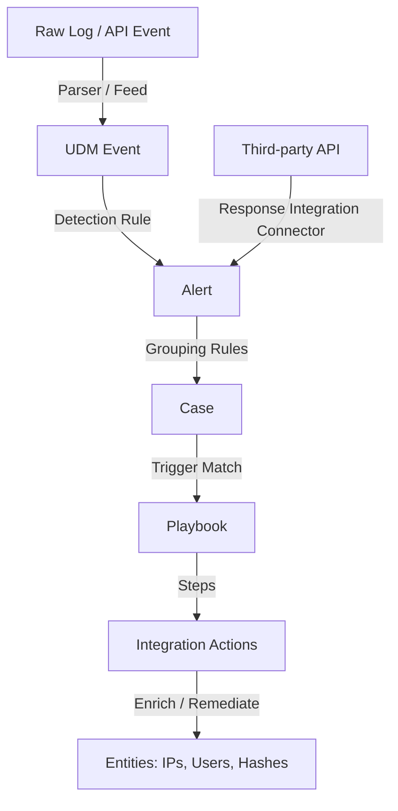
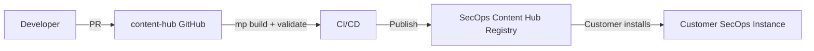

# Google SecOps Overview

Before you can discuss Content Hub intelligently, you must fluently explain **what Google SecOps is, what problem it solves, and what role SOAR plays inside it**. If you fumble this, the rest of the interview goes downhill fast.

## The One-Sentence Answer

> *Google Security Operations (Google SecOps) is a cloud-native security platform that unifies **SIEM** (log ingestion, detection, investigation) and **SOAR** (response orchestration, case management, automation) — and the Content Hub is the community/partner content ecosystem that extends it.*

## SIEM vs SOAR — The Clean Distinction

| | SIEM | SOAR |
|---|---|---|
| **Primary job** | Ingest & analyse telemetry | Orchestrate & automate response |
| **Core artifact** | Events, Detections | Alerts, Cases, Playbooks |
| **Data shape** | Raw logs → UDM (normalized) | Structured Alerts with Entities |
| **You interact via** | Parsers, detection rules, search | Integrations, playbooks, actions |
| **Timeframe** | Real-time + historical | Incident-driven |
| **In Content Hub** | `content/parsers/` | `content/response_integrations/`, `content/playbooks/` |

!!! tip "Lead-level framing"
    SIEM *detects* — SOAR *responds*. Content Hub ships content for **both halves**: parsers that normalize incoming logs for the SIEM side, and integrations/playbooks that drive the SOAR side.

## The Data Model You MUST Know

**Every term on this diagram will come up.** Memorize it.

## The Five Objects in Case Management

| Object | What it is | Where it comes from |
|---|---|---|
| **Event** | A single normalized log record (UDM) | Parsers (SIEM side) OR a Connector's alert payload (SOAR side) |
| **Alert** | A grouped set of events indicating possible badness | Created by detection rules, feeds, or connectors |
| **Case** | A container of related alerts | Auto-created by the platform; grouping uses time + entity overlap |
| **Entity** | An IoC or asset extracted from events (IP, user, hash, URL, domain) | Extracted automatically via **Ontology Mapping** |
| **Playbook** | An automated workflow executed against a case/alert | Triggered when conditions match |

!!! warning "Common candidate mistake"
    "Connectors create cases." **No.** Connectors create **alerts**. The platform creates cases by grouping alerts based on time window + entity similarity. Getting this wrong signals you don't understand the platform.

## Where Does Content Hub Sit?

The repo is the **source of truth for community + partner content**. It is NOT the platform code itself — that lives in Google's backend. When you say *"we ship content"*, you mean this pipeline.

## Key Terminology Table (Quick Reference)

| Term | Meaning |
|---|---|
| **UDM** | Unified Data Model — Google SecOps' canonical event schema |
| **CBN** | Configuration-Based Normalization — the parser DSL (filters + mutations) |
| **IoC** | Indicator of Compromise (IP, hash, domain, URL) |
| **IOA** | Indicator of Attack (behavioral) |
| **Ontology** | Rules that map event fields → Entity types (3 levels: Source/Product/Event) |
| **Playbook Block** | A reusable sub-playbook called from a step |
| **Predefined Widget** | HTML widget bound to an action's JSON result, rendered in case view |
| **Siemplify** | Legacy name for SOAR component (you'll see it throughout the SDK) |
| **Chronicle** | Legacy name for SIEM component |

!!! note "Why "Siemplify" is everywhere"
    Google acquired Siemplify in 2022 and rebranded it as Chronicle SOAR, then merged Chronicle SIEM + SOAR into **Google SecOps** in 2024. The SDK classes still use `Siemplify*` names because renaming them would break backwards compatibility for thousands of deployed integrations. When you see `SiemplifyAction`, `SiemplifyConnectorExecution` — that's SOAR SDK.

## Next

→ **[What is the Content Hub?](what-is-content-hub.md)**
