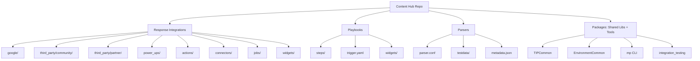
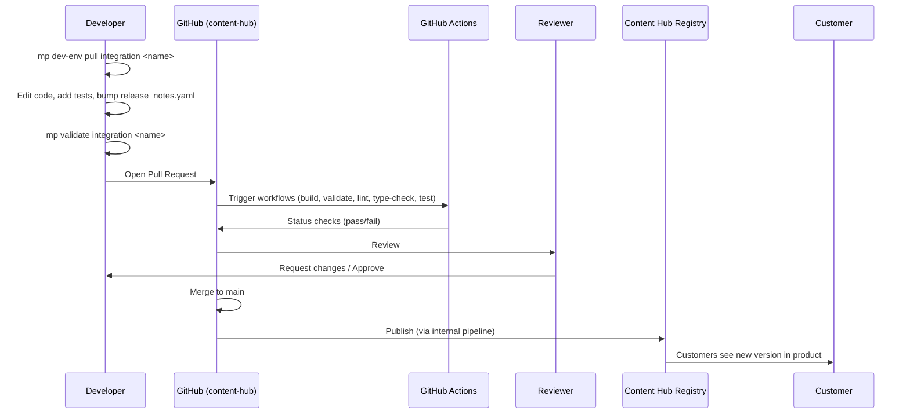

# What is the Content Hub?

## The Definition You Should Memorize

> *"The Google SecOps Content Hub is the central open-source repository for community- and partner-contributed content that extends Google Security Operations. It hosts **Response Integrations, Playbooks, and Parsers** along with shared libraries (TIPCommon, EnvironmentCommon), tooling (the `mp` CLI), and the contribution workflow. Content is developed here under Apache 2.0, validated in CI, and published to the in-product Content Hub catalog that customers install from."*

Drop that line verbatim if asked "what is this project". It covers purpose, artifacts, license, distribution, and workflow in one breath.

## Who Uses It?

Four distinct audiences — know them all, because interviewers will probe role boundaries.

| Audience | What they do here |
|---|---|
| **Google engineers** | Maintain `content/response_integrations/google/` and `power_ups/`, review PRs, own the `mp` CLI and TIPCommon |
| **Partners (e.g. AnyRun, Infoblox, Netenrich)** | Contribute integrations under `third_party/partner/` with official support |
| **Community** | Contribute integrations under `third_party/community/`, playbooks, parsers |
| **Customers** | Consume — pull from the in-product Content Hub into their tenants |

## The Content Types (This Is the Map of the Repo)

## The Lifecycle of a Contribution

This is the flow you should be able to whiteboard on demand.

## The Three Golden Rules of Contribution

From `contributing.md` and the PR template — memorize:

1. **Sign the CLA** before your first PR (Google's Contributor License Agreement).
2. **Bump the version** in `release_notes.yaml` for every change to existing content.
3. **All status checks must pass** (`Validate Parsers`, `Validate Google & Parsers`, `mp validate`, lint, type-check).

## Current Status (Important for Interview)

!!! warning "The repo is in Preview"
    The README explicitly says: *"At this time, only response integration and playbook content is supported via this contribution workflow. We expect to expand support to other critical content types in the near future."* Parsers were added during this preview phase. When asked about roadmap, say *"the contribution surface is actively expanding — parsers landed, SIEM detection rules are a likely next addition."*

## The License & Maintenance Signal

- **Apache 2.0** — permissive, partner-friendly
- `Maintenance 2026` badge — actively maintained, hard-required for partners

## The "Why Does This Exist?" Answer

If an interviewer asks the architecture question: *"Why separate content from the platform?"* — here's the five-reason answer:

1. **Independent release cycles** — customers pull content fixes without a platform upgrade
2. **Open collaboration** — partners and the community contribute without touching Google's closed platform code
3. **Version safety** — every integration has its own `pyproject.toml` + `uv.lock`, so one vendor's breaking dependency bump doesn't break others
4. **Auditability** — security-sensitive content lives in public Git history for review
5. **Scale** — 100+ integrations maintained by external contributors, not Google headcount

Memorize at least the first three. Any of them, delivered clearly, signals architectural thinking.

## Next

→ **[Repository Structure](repo-structure.md)**
