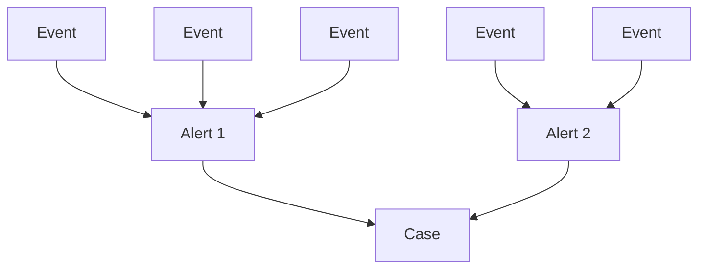
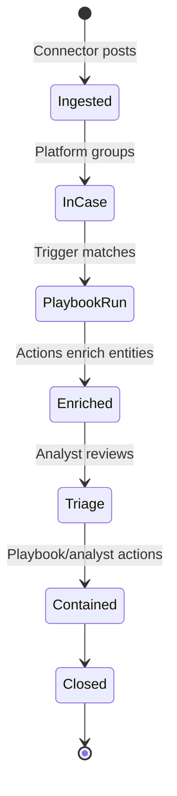

# Cases vs Alerts vs Events

This is the single most commonly confused topic. Getting this wrong in an interview costs more credibility than almost any other mistake.

## The Hierarchy



**Many events → one Alert. Many Alerts → one Case.** It's strictly one-way rollup.

## One-Sentence Definitions

| | One sentence |
|---|---|
| **Event** | A single normalized log record in UDM format. |
| **Alert** | A grouped set of events that together indicate possibly malicious activity. |
| **Case** | A container of related Alerts, auto-grouped by the platform using time + entity overlap. |

## Who Creates What

| Object | Created by |
|---|---|
| Event | Parsers (SIEM path) OR Connectors (SOAR path) via alert payload |
| Alert | Detection rules (SIEM) OR Connectors (SOAR) |
| Case | **Only the platform** — NEVER the connector, NEVER a human |
| Entity | **Ontology Mapping** rules applied to events |

!!! warning "Memorize this"
    **Connectors create Alerts, not Cases.** If you say "the connector creates a case" in an interview, the interviewer will know you never actually shipped a connector.

## How Case Grouping Works

The platform groups Alerts into the same Case when they share:

1. **Similar time window** — within a configurable proximity
2. **Overlapping entities** — same IP appears in multiple alerts → likely the same incident
3. **Configurable grouping rules** — admins tune these per environment

This is **why ontology mapping matters**: no mapped entities = no grouping = every alert creates its own case = SOAR drowns in noise.

## Alert Lifecycle in SOAR



Integrations contribute at:

- **Ingestion** — via connector
- **Enrichment** — via playbook-triggered actions
- **Triage** — via widgets, insights, entity properties
- **Containment** — via remediation actions (isolate host, block IP)
- **Closure** — via final sync jobs (close third-party ticket, etc.)

## When Alerts Get Updated (Not Just Created)

Connectors can **update existing alerts**, not only create new ones. Example: a connector polls every 5 minutes; an incident evolves and gets new events. The connector identifies the existing alert (by external ID or similarity) and posts updates.

This is why Alert Triggers can be configured to fire on **"create or update"**, not just "create".

## Building an Alert in Connector Code

From the simple example in `connectors.md`:

```python
from soar_sdk.SiemplifyConnectorsDataModel import AlertInfo
from TIPCommon.data_models import BaseAlert

def create_alert_info(self, alert: BaseAlert) -> AlertInfo:
    alert_info: AlertInfo = AlertInfo()
    alert_info.alert_id = alert.alert_id
    alert_info.display_id = alert.raw_data["display_name"]
    alert_info.events = alert.raw_data["events"]
    return alert_info
```

Key fields of `AlertInfo`:

- `alert_id` — unique identifier (UUID or external ID)
- `display_id` — human-readable name shown in UI
- `events` — list of event dicts (these feed into ontology → entities)
- `priority` — severity
- `start_time` / `end_time` — populated via ontology
- `rule_generator` — which rule/source produced it

## Events Inside an Alert

An Alert's `events` field is a **list of dicts**. Each dict represents one UDM event. The ontology mapping operates on each event dict, extracting the entities the platform should create for the alert.

**Example single event:**

```json
{
  "event_type": "NETWORK_FLOW",
  "src_ip": "10.1.2.3",
  "dst_ip": "45.60.20.5",
  "username": "jdoe",
  "file_sha256": "abc123...",
  "timestamp": 1729382400
}
```

With ontology, the platform creates entities: 2 IP addresses (one internal 10.1.2.3, one external 45.60.20.5), 1 user, 1 file hash — all linked to the alert.

## Memory Map of Terminology

Print and keep by your desk during interview prep:

```
Raw Log → Parser → UDM Event → (Detection Rule or Connector) → Alert
                                                                 ↓
                                        Ontology Mapping ← Events in Alert
                                                                 ↓
                                                              Entities
                                                                 ↓
                                            Alert + Entities → Case (grouped)
                                                                 ↓
                                                    Trigger → Playbook
                                                                 ↓
                                           Steps → Integration Actions
                                                                 ↓
                                               Entity Enrichment + Remediation
```

Every noun in this chain is exam material.

## Next

Section 2 conceptual pages done. → **[Core Concepts Q&A](questions.md)**
