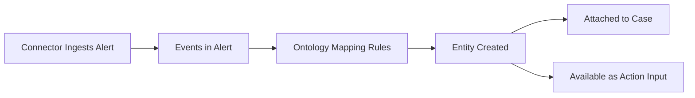

# Entities

## Definition

> *"Entities are the platform's first-class representation of IoCs and Assets associated with an Alert — things like IPs, users, file hashes, URLs, domains, hostnames. They're automatically extracted from event data via **Ontology Mapping** and become the things Actions target for enrichment or remediation."*

## SIEM Entities vs SOAR Entities

!!! warning "Important distinction for interviews"
    Entities in SIEM and Entities in SOAR are **slightly different concepts** — the docs explicitly call this out. When discussing Content Hub integrations, you mean **SOAR Entities**. SIEM entities are represented inside UDM events (principal, target, src, dst).

## How Entities Come Into Being



Ontology is the mechanism. No ontology mapping = no entities = case management can't group alerts by shared entities = broken SOAR.

## Entity Types (SOAR)

Common `EntityTypes` you'll work with:

| EntityType | What it represents |
|---|---|
| `ADDRESS` | IP address (v4 or v6) |
| `USER` | A user identity |
| `FILEHASH` | MD5/SHA1/SHA256 hash |
| `URL` | URL |
| `HOSTNAME` | Host name or FQDN |
| `PROCESS` | A process name |
| `EMAIL_ADDRESS` | Email |
| `MACADDRESS` | MAC address |
| `THREATCAMPAIGN` | TI campaign |
| `CVE` | CVE identifier |

Find this in `soar_sdk.SiemplifyDataModel.EntityTypes`.

## How Actions Consume Entities — The Iteration Pattern

From the real `AbuseIPDB/CheckIpReputation.py`:

```python
from soar_sdk.SiemplifyDataModel import EntityTypes

address_entities = [
    entity
    for entity in siemplify.target_entities
    if entity.entity_type == EntityTypes.ADDRESS and not entity.is_internal
]

for entity in address_entities:
    if unix_now() >= siemplify.execution_deadline_unix_time_ms:
        status = EXECUTION_STATE_TIMEDOUT
        break
    try:
        address_report = abuse_ipdb.check_ip(entity.identifier, max_days)
        # Enrich the entity
        for attrib in dir(address_report):
            if not attrib.startswith("__"):
                entity.additional_properties[f"AbuseIPDB_{attrib}"] = str(getattr(address_report, attrib))
        if int(address_report.abuseConfidenceScore) >= int(sus_threshold):
            entity.is_suspicious = True
    except Exception as e:
        failed_entities.append(entity.identifier)
```

**Five patterns to memorize from this snippet:**

1. `siemplify.target_entities` — the action's input entity list
2. **Filter by `entity_type`** to match what your action supports
3. **Check `is_internal`** — don't enrich internal assets with TI data
4. `entity.identifier` — the raw value (e.g. "8.8.8.8")
5. `entity.additional_properties[...]` — custom enrichment key=value (prefix with integration name like `AbuseIPDB_`)
6. `entity.is_suspicious = True` — set risk flag based on your verdict

And the **timeout check** via `execution_deadline_unix_time_ms` is best-practice to avoid killing long-running enrichments mid-way.

## Entity Enrichment — What It Creates

Each key you write to `entity.additional_properties` becomes a row in the entity's Enrichment Table in the SOAR UI — visible in the alert view and searchable.

!!! tip "Prefix your enrichment keys"
    Always prefix with your integration name: `AbuseIPDB_abuseConfidenceScore`, `VirusTotal_malicious`, `GreyNoise_classification`. This prevents collisions when multiple integrations enrich the same entity. This pattern is enforced by code review, not by the SDK.

## Three Ways Actions Receive Input

| Mode | Example |
|---|---|
| **Via Entities** | VirusTotal "Enrich IP" — takes entities from alert scope |
| **Via Input Parameters** | VirusTotal "Enrich IOCs" — analyst types in values |
| **Combined** | Microsoft Teams "Send User Message" — user entity + message text |

Document which mode your action uses in its description — it's a repo convention.

## `is_internal` — What It Means

`entity.is_internal` is True if the IP/hostname is part of the customer's defined internal network. It's set by environment configuration. **Best practice: skip internal entities in TI-enrichment actions** — they're noise (querying VirusTotal for 10.0.0.5 costs quota and returns nothing useful).

## Missing / Failed / Limit Entities — Common Categorization

In every enrichment action you'll see buckets:

```python
enriched_entities = []       # successful enrichments → update on SOAR
limit_entities = []          # rate-limited, retry later
failed_entities = []         # errored out (but not rate limit)
missing_entities = []        # not found in the third-party DB
```

The output message then aggregates counts per bucket. **Interview tip:** when asked how you handle partial failures across entities, this bucket pattern is the right answer. Fail per-entity, aggregate, never let one bad entity fail the whole action.

## Next

→ **[Ontology & Mapping](ontology-mapping.md)**
