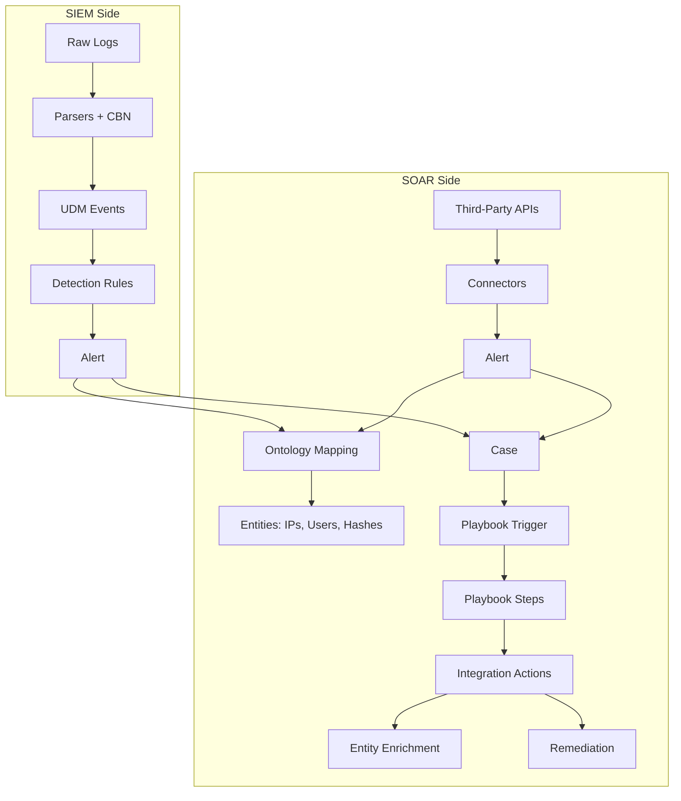

# Section 2 — Core Concepts

You passed foundations. Now we dig into the **conceptual vocabulary** every interview uses interchangeably: Integrations, Playbooks, Parsers, Entities, Ontology, Cases, Alerts, Events. If you confuse any two of these in an answer, credibility drops.

## The Mental Model

## Pages

1. **[Response Integrations](response-integrations.md)** — Actions, Connectors, Jobs deep overview
2. **[Playbooks](playbooks.md)** — Triggers → Steps → Actions/Conditions/Blocks
3. **[Parsers](parsers.md)** — CBN, UDM, log normalization
4. **[Entities](entities.md)** — IoCs & assets, extraction, enrichment
5. **[Ontology & Mapping](ontology-mapping.md)** — The 3-level Source/Product/Event hierarchy
6. **[Cases vs Alerts vs Events](cases-alerts-events.md)** — The hierarchy and grouping rules
7. **[Interview Q&A](questions.md)**

## The Sentence That Proves You Get It

> *"Events are the atoms. Parsers and Connectors both produce events. Events roll up into Alerts. Alerts are grouped into Cases. Entities are extracted from events via Ontology Mapping. Playbooks run against Alerts/Cases, executing Actions, which enrich Entities or remediate through third-party products via Integration Jobs."*

If you can say that in one breath, you can hold any interview on this project.
