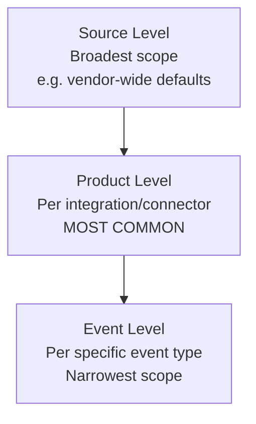

# Ontology & Mapping

## Definition

> *"Ontology is the platform mechanism that automatically extracts Entities (IPs, users, hashes) and additional metadata from Events ingested by a Connector. Ontology Mapping is expressed as rules in the integration's `ontology_mapping.yaml` file, organized in a 3-level hierarchy — **Source → Product → Event** — with inheritance top-down."*

## The 3-Level Hierarchy



**Inheritance:** Source → Product → Event. If a mapping isn't defined at the Event level, it inherits from Product, then from Source.

!!! tip "Best practice — exam-ready answer"
    *"The recommended pattern is to define mappings at the **Product level** that corresponds to the connector. That way every alert ingested by that connector gets consistent ontology applied to it, and the mapping is centralized in one place rather than fragmented across event-level rules."*

## Critical Fields You MUST Map

From the repo's docs:

> *"Out of all fields that are possible to map, the most critical are: **Start Time**, **End Time**. If those fields are not mapped out, then the Alert grouping mechanism will not work."*

Memorize:

- `start_time`
- `end_time`

Without these, the platform cannot group alerts into cases based on time proximity — SOAR breaks silently.

## The File: `ontology_mapping.yaml`

Lives at the integration root. **Required if the integration has a connector.**

```yaml
# Conceptual structure (actual format varies)
source:
  name: my_vendor
  product:
    name: my_product
    events:
      - event_type: network_flow
        mappings:
          start_time: $.event.start
          end_time: $.event.end
          entities:
            - type: ADDRESS
              field: $.event.src_ip
            - type: ADDRESS
              field: $.event.dst_ip
            - type: USER
              field: $.event.username
            - type: FILEHASH
              field: $.event.file.sha256
```

## When You Need Ontology Mapping

| Integration has… | Ontology needed? |
|---|---|
| Only Actions (no connector) | ❌ No |
| A Connector | ✅ **MANDATORY** |
| Jobs only (no connector, no actions) | ❌ No |

Pure Action integrations (VirusTotal-style TI enrichment) skip this file entirely.

## Viewing Ontology in the Platform

SOAR Settings → Ontology → Ontology Status

Admins can see every mapping currently active per integration and edit it in the UI. The `ontology_mapping.yaml` provides the **default** — but customers can override in-product.

## Why Ontology Matters More Than You Think

Without correct ontology, the following silently break:

1. **Case grouping** — alerts won't merge into a single case
2. **Entity enrichment** — the action iterating `target_entities` finds empty list
3. **Playbook entity triggers** — fail to fire because entities don't exist
4. **Search & correlation** — investigators can't pivot on entity
5. **Detection rules** — can't write rules on entity properties

So **ontology is not a "nice to have"** — it's the bridge between data ingestion and everything SOAR does afterward.

## Lead-Level Answer: How Ontology Is Validated

> *"In our PR workflow, when an integration adds or modifies a connector, the reviewer specifically checks: (1) `ontology_mapping.yaml` exists, (2) `start_time` and `end_time` are mapped, (3) the entity mappings cover the IoC types the third-party product actually produces, (4) test data in the connector's tests exercises the ontology. We've historically caught cases where a junior PR forgot `end_time` and the entire case-grouping broke for that integration in production — after that incident we added a `mp validate` check that requires `start_time` / `end_time` for any integration with a connector."*

That's the kind of answer that closes an interview loop.

## Common Pitfalls

| Pitfall | Fix |
|---|---|
| Mapping `start_time` but not `end_time` | Always map both; single-instant events use `start_time == end_time` |
| Event-level mapping duplicating Product-level | Rely on inheritance; don't repeat |
| Putting business logic in ontology | Keep it purely data — enrichment/filtering is action territory |
| Hardcoding entity types the product rarely produces | Map only what's actually present; keep rules maintainable |
| Forgetting to update ontology when connector schema evolves | Add ontology review to every PR touching a connector |

## Reference Docs

- [Google Cloud Ontology Overview](https://cloud.google.com/chronicle/docs/soar/admin-tasks/ontology/ontology-overview)

## Next

→ **[Cases vs Alerts vs Events](cases-alerts-events.md)**
