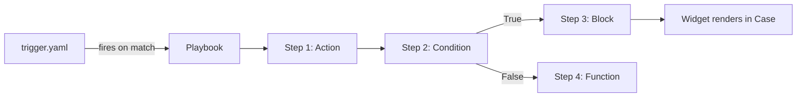

# Playbooks

## Definition

> *"A Playbook is an automated workflow defined in YAML that orchestrates the response to a security finding. When a matching trigger fires (alert, entity, or manual), the playbook runs a sequence of steps — calls to integration actions, built-in functions, conditions, and nested blocks — to enrich, triage, and remediate."*

## Playbook = Trigger + Steps + Widgets



## File Layout

```
my_playbook/
├── steps/
│   ├── step1.yaml
│   ├── step2.yaml
│   └── ...
├── widgets/
│   ├── widget1.html
│   └── widget1.yaml
├── definition.yaml           # Playbook identity
├── display_info.yaml         # UI metadata
├── overviews.yaml            # Summary shown in catalog
├── release_notes.yaml
└── trigger.yaml              # When this playbook runs
```

## The Three Trigger Types

| Trigger | Fires on | Example use case |
|---|---|---|
| **Alert** | Alert creation or update matching conditions | *"Run enrichment when a High-severity Phishing alert appears"* |
| **Entity** | Entity creation/update matching conditions | *"When a new User entity appears, check threat intel for the name"* |
| **Manual** | Analyst clicks "Run Playbook" in the UI | *"Let the analyst decide when to quarantine a host"* |

## Step Types

| Type | What it is |
|---|---|
| **Integration Action** | Call to an action in a Response Integration — the most common step |
| **Function** | Built-in playbook function (set variable, add comment, change severity) |
| **Condition** | Logical branch on previous output or variable |
| **Block** | Call to another playbook — *reusable sub-workflow* |

!!! tip "Blocks are your modularity story"
    Large playbooks break down into Blocks that are reused by many parent playbooks. If an interviewer asks about reuse, answer with **Blocks**. The repo's `how_to_contribute.md` explicitly tells you to point a new playbook's `NestedWorkflowIdentifier` at an existing block's identifier in `definition.yaml` rather than duplicating it.

## trigger.yaml Example

```yaml
id: "b1a2b3c4-d5e6-f7g8-h9i0-j1k2l3m4n5o6"
name: "High Priority Phishing Alert Trigger"
version: 1.0
trigger_type: "alert"
conditions:
  - operator: "AND"
    rules:
      - field: "alert.name"
        operator: "contains"
        value: "Phishing"
      - field: "alert.severity"
        operator: "equals"
        value: "High"
```

AND/OR operators + field-based rules — this is the full trigger grammar you need.

## Widgets in Playbooks

Two levels of widgets exist and candidates confuse them:

| Widget type | Where configured | Rendered in |
|---|---|---|
| **Predefined widget** (integration) | Inside the **integration**'s `widgets/` dir | Alert view, bound to an action's JSON result |
| **Playbook widget** | Inside the **playbook**'s `widgets/` dir | Case overview, fed from playbook step data |

**Built-in playbook widget types:**

- Table Widget
- JSON Widget (collapsible tree)
- HTML Widget (raw)
- Markdown Widget

Plus fully custom widgets (HTML + CSS + JS) for complex interaction.

## Contributing a Playbook — The 2 Paths

**Path 1: `mp` tool (recommended)**
```bash
mp dev-env login --api-root <url> --api-key <key>
mp dev-env pull playbook <name> --dest ./pulled
# Fill display_info.yaml and release_notes.yaml
# Move to content/playbooks/third_party/community/<name>/
mp validate playbook <name>
# Open PR
```

**Path 2: Manual**
```bash
# Export from the SOAR UI (gives you a zip)
mp build -p <name> --deconstruct --src <exported_zip>
# Fill display_info.yaml and release_notes.yaml
# Move to content/playbooks/third_party/<community|partner>/<name>/
# Open PR
```

## The "Syncing with Existing Blocks" Gotcha

If your playbook uses a Block that already exists in content-hub, **don't duplicate it**. Instead:

1. Find the existing block under `content/playbooks/`
2. Open `<block>/definition.yaml` → copy the `identifier`
3. In your playbook's `steps/<step>.yaml`, find the parameter `NestedWorkflowIdentifier`
4. Replace its `value` with the identifier you copied

This is the kind of detail that separates "contributed once" from "led the project."

## Overview File

`overviews.yaml` feeds the Content Hub UI catalog listing:

- Short description
- Detailed workflow explanation
- Intended use case
- Prerequisites / requirements

Treat it as **the product page** for your playbook — users pick playbooks by reading this.

## Next

→ **[Parsers](parsers.md)**
