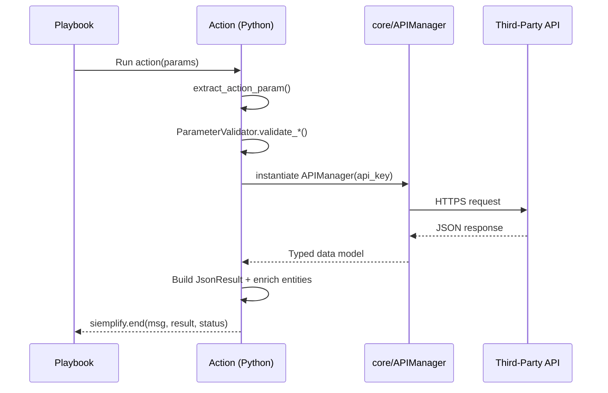

# Response Integrations

## Definition

> *"A Response Integration is a collection of Python scripts and YAML metadata that lets Google SecOps SOAR talk to a third-party product. It's composed of three script types — **Actions** (on-demand tasks), **Connectors** (continuous alert ingestion), and **Jobs** (continuous state sync) — plus optional **Widgets** (HTML views), shared `core/` code, tests, and a `definition.yaml` that describes the integration's identity and configuration."*

## The Three Script Types — One-Liner Each

| Type | One-liner | Example |
|---|---|---|
| **Action** | A single task run on demand from a playbook | "Enrich an IP with VirusTotal" |
| **Connector** | Cron-like ingestion producing new Alerts | "Poll CrowdStrike for new detections every 5 minutes" |
| **Job** | Cron-like bidirectional state sync | "Mirror SOAR comments to ServiceNow tickets" |

!!! important "An integration doesn't need all three"
    Plenty of integrations ship just 2–3 actions and nothing else. The minimum is **one Ping action + the definition.yaml**. VirusTotal-style enrichment integrations often have zero connectors and zero jobs.

## Where Integrations Live

```
content/response_integrations/
├── google/                      # Google-maintained
├── third_party/
│   ├── community/               # 57+ community integrations
│   └── partner/                 # 31+ partner integrations
└── power_ups/                   # Utility packs (email, template_engine, git_sync, etc.)
```

## The Minimum Viable Integration

```
my_integration/
├── actions/
│   ├── __init__.py
│   ├── Ping.py                  # Connectivity test — ALWAYS required
│   └── Ping.yaml
├── core/
│   ├── __init__.py
│   └── my_integration.py        # API client / manager class
├── resources/
│   ├── logo.svg
│   └── image.png
├── tests/
├── __init__.py
├── .python-version              # 3.11
├── definition.yaml              # Identity + config schema
├── pyproject.toml               # uv-managed deps
├── release_notes.yaml
└── uv.lock
```

That's a **valid, shippable, working** integration. Anything beyond that is scope.

## Communications Flow



Every action follows this shape. Learn it; you'll walk interviewers through it often.

## Integration Categories

From `definition.yaml`'s `categories:` list, common ones you'll see in the repo:

- **Security** — most IR integrations
- **Threat Intelligence** — AbuseIPDB, GreyNoise, Pulsedive, WhoisXMLAPI
- **Endpoint** — BitDefender, Duo, Symantec
- **Email** — SendGrid, Microsoft Graph Security Tools
- **Communication** — Telegram, Zoom, PagerDuty
- **Ticketing** — Asana, Azure DevOps
- **Cloud** — AWS EC2, Google Docs/Drive/Sheets
- **Network** — Infoblox NIOS, Arcanna AI

## The "Google" vs "Community" vs "Partner" vs "Power Up" Distinction

| | Maintained by | Review rigor | Lives in |
|---|---|---|---|
| **google** | Google engineers | Highest | `google/` |
| **partner** | Vendor + Google reviewer | High — coordinated releases | `third_party/partner/` |
| **community** | Individual contributor | Standard PR bar | `third_party/community/` |
| **power_ups** | Google engineers | Highest | `power_ups/` |

**Power-ups are *reusable utility integrations***, not vertical product integrations. Examples: `email_utilities`, `template_engine`, `git_sync`, `file_utilities`. Playbooks use them as helpers (render templates, send email, file ops).

## TIPCommon-Based vs Legacy

You will see two styles of action in the repo:

### Legacy (Siemplify-era)

```python
from soar_sdk.SiemplifyAction import SiemplifyAction
from soar_sdk.SiemplifyUtils import output_handler

@output_handler
def main():
    siemplify = SiemplifyAction()
    api_key = siemplify.extract_configuration_param(siemplify, param_name="Api Key")
    # ... procedural logic ...
    siemplify.end(output_message, result_value, status)

if __name__ == "__main__":
    main()
```

### Modern (TIPCommon 2.x base classes)

```python
from TIPCommon.base.action import Action
from TIPCommon.extraction import extract_action_param
from TIPCommon.validation import ParameterValidator

class LoadJsonStringToObject(Action):
    def _extract_action_parameters(self) -> None: ...
    def _validate_params(self) -> None: ...
    def _init_api_clients(self) -> Contains[ApiClient]: ...
    def _perform_action(self, _: None = None) -> None: ...

def main() -> None:
    LoadJsonStringToObject(name=SCRIPT_NAME).run()
```

!!! tip "Lead-level answer"
    *"Modernizing integrations from the procedural `@output_handler` pattern to the TIPCommon 2.x class-based `Action` base is one of the main tech-debt streams we run. The new pattern gives us out-of-the-box error handling, structured parameter extraction, type safety, logging, and SDK version abstraction. New integrations MUST use the 2.x base classes."*

## Why Classes Over Functions? (Common Lead Question)

1. **Template Method pattern** — base class defines the execution skeleton (`run()` calls `_validate_params` → `_init_api_clients` → `_perform_action`), subclass overrides only what's specific.
2. **Separation of concerns** — extraction, validation, API init, business logic are forced into separate methods.
3. **Testability** — each step is individually mockable.
4. **Consistency** — every action in the repo has the same shape, so a reviewer can scan 100 actions fast.
5. **Error handling centralization** — the base class's `run()` wraps each phase and produces consistent failure messages.

## Next

→ **[Playbooks](playbooks.md)**
