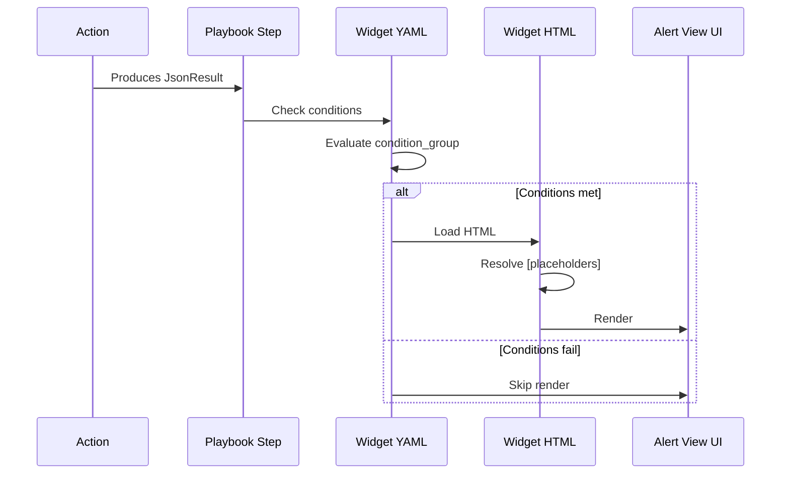

# Widgets

## Definition

> *"A Widget is an HTML/CSS/JS UI component bound to data produced by a playbook step. Widgets are how integrations expose rich visualizations inside the SOAR UI — an enrichment report, a reputation score table, a timeline. Two flavors exist: **Predefined Widgets** (integration-level, bound to an Action's JSON Result, rendered in the alert view) and **Playbook Widgets** (rendered in the case overview)."*

## Predefined Widget Files

```
my_integration/
└── widgets/
    ├── my_widget.html
    └── my_widget.yaml
```

Plus an example JSON result in `resources/` that the widget renders against during preview.

## Predefined Widget YAML

```yaml
action_identifier: Mock Integration Action
condition_group:
    logical_operator: and
    conditions:
        - field_name: '[{stepInstanceName}.JsonResult]'
          match_type: not_contains
          value: '{stepInstanceName}'
data_definition:
    html_height: 400
    safe_rendering: false
    type: html
    widget_definition_scope: both
default_size: half_width
description: widget description
scope: alert
title: Mock Integration - Widget
type: html
```

Field-by-field:

| Field | Meaning |
|---|---|
| `action_identifier` | Which action this widget binds to (e.g., "Check IP Reputation") |
| `condition_group` | When to render — here: only if JSON result isn't literally the placeholder (i.e., real data ran) |
| `data_definition.html_height` | Height in px |
| `data_definition.safe_rendering` | `false` = execute JS, `true` = sanitize (use carefully) |
| `data_definition.type` | `html` for custom, or `table`/`json`/`markdown` for built-ins |
| `data_definition.widget_definition_scope` | `alert` / `case` / `both` |
| `default_size` | `half_width` / `full_width` |
| `scope` | Where rendered: `alert` / `case` |
| `title` | Widget title in UI |

## Widget HTML with Data Binding

```html
<!DOCTYPE html>
<html>
<head>
  <style>
    .container { font-family: sans-serif; padding: 16px; }
    .score-high { color: #c00; font-weight: bold; }
    .score-low { color: #080; }
  </style>
</head>
<body>
  <div class="container">
    <h2>AbuseIPDB Report for [{stepInstanceName}.JsonResult.ip]</h2>
    <table>
      <tr><td>Abuse Confidence Score:</td>
          <td class="score-high">[{stepInstanceName}.JsonResult.abuseConfidenceScore]%</td></tr>
      <tr><td>Country:</td>
          <td>[{stepInstanceName}.JsonResult.countryCode]</td></tr>
      <tr><td>ISP:</td>
          <td>[{stepInstanceName}.JsonResult.isp]</td></tr>
      <tr><td>Total Reports:</td>
          <td>[{stepInstanceName}.JsonResult.totalReports]</td></tr>
    </table>
  </div>
</body>
</html>
```

The `[{stepInstanceName}.JsonResult.<key>]` syntax is the **placeholder expression** the renderer replaces with real data at view time.

## Placeholder Syntax — Key Expressions

| Expression | Resolves to |
|---|---|
| `[{stepInstanceName}.JsonResult]` | Entire JSON result of the bound step |
| `[{stepInstanceName}.JsonResult.foo]` | `.foo` key of JSON result |
| `[{stepInstanceName}.JsonResult.items[0].name]` | Array indexing + nested access |
| `[Case.Id]` | Current case ID |
| `[Alert.Identifier]` | Current alert ID |
| `[EntityIdentifier]` | Entity being enriched |

## Condition Group — When Widget Renders

```yaml
condition_group:
    logical_operator: and
    conditions:
        - field_name: '[{stepInstanceName}.JsonResult]'
          match_type: not_contains
          value: '{stepInstanceName}'
        - field_name: '[{stepInstanceName}.ScriptResult]'
          match_type: equals
          value: 'true'
```

This renders **only if**:
1. JsonResult contains real data (not the literal placeholder), AND
2. Script Result was `true` (action succeeded)

Without this guard, widgets render broken for failed action runs.

## Example JSON Result Reference

```yaml
dynamic_results_metadata:
    - result_name: JsonResult
      show_result: true
      result_example_path: './resources/check_ip_reputation_JsonResult_example.json'
```

The `result_example_path` points to a file inside `resources/` — this is what the widget previewer uses when designing. Must match the **actual JSON structure** your action produces, or the widget renders empty in production.

## Playbook Widgets (Different File Layout)

Lives inside the playbook directory, not the integration:

```
my_playbook/
└── widgets/
    ├── incident_summary.html
    └── incident_summary.yaml
```

Rendered in the **case overview**, not alert view. The YAML references playbook step outputs using the same `[{stepInstanceName}.JsonResult]` grammar.

## Built-in Widget Types

When you don't need custom HTML:

| Type | Use when |
|---|---|
| `table` | Tabular data — rows from a JSON array |
| `json` | Collapsible tree view of raw JSON |
| `markdown` | Markdown-formatted text |
| `html` | Custom HTML (this is what you'll mostly write) |

For table widget, the YAML declares columns + row source; no HTML required.

## Security — `safe_rendering`

`safe_rendering: true` sanitizes HTML and blocks inline JS. Default should be `true` unless you're the author and trust the data source. Setting `false` and then rendering untrusted content is an XSS vector.

!!! tip "Lead-level answer"
    *"We require `safe_rendering: true` on all community-contributed widgets — their HTML is reviewed but we still guard against data-channel XSS. Partner widgets can opt into `safe_rendering: false` after a stricter security review, because their visualization needs (e.g., charts with inline scripts) sometimes require it."*

## The Widget Workflow in Practice



## Common Widget Mistakes

| Mistake | Symptom | Fix |
|---|---|---|
| Missing `condition_group` guard | Widget renders with literal `{stepInstanceName}` text when step didn't run | Add the standard `not_contains {stepInstanceName}` guard |
| Wrong `result_example_path` | Widget designer renders fine, production renders empty | Regenerate example JSON after action output changes |
| Using `<script>` with `safe_rendering: true` | Scripts stripped silently | Either switch to built-in types or justify `safe_rendering: false` in review |
| Hardcoded styles that fight SOAR theme | Broken in dark mode | Use CSS variables; test in both themes |
| Fixed `html_height` too small | Content clipped | Size based on maximum expected result, add `overflow-y: auto` |

## Next

→ **[definition.yaml Explained](definition-yaml.md)**
