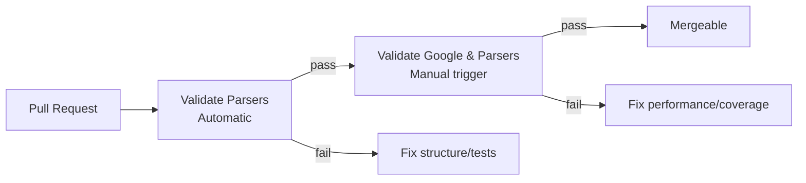

# Test Data & Validation

## The Two-Stage Validation Pipeline

When you open a parser PR, **two check runs must pass** before merge:



### Stage 1 — Validate Parsers (Automatic)

Triggered by every PR push. Checks:

- Folder structure (`VENDOR_PRODUCT/cbn/`)
- Required files present (`metadata.json`, `*.conf`, testdata)
- Multi-case naming consistency (`testcase1_logs.json` ↔ `testcase1_events.json`)
- Parser run against each `testcaseN_logs.json` produces output matching `testcaseN_events.json`
- `log_type` unique + exists in SecOps
- No unauthorized new LogTypes

### Stage 2 — Validate Google & Parsers (Manual)

This runs the parser against **real customer logs** in a live SecOps instance. **Contributor must manually trigger** this because access restrictions prevent full automation.

```bash
# Activate venv first
source .venv/bin/activate

# Trigger check
secops \
  --project-id <project-id> \
  --customer-id <customer-id> \
  log-type trigger-checks \
  --associated-pr <PR_NUMBER> \
  --log-type <LOG_TYPE>

# Response contains a reportId:
# { "name": "operations/githubChecks/<reportId>" }

# Pull the report
secops \
  --project-id <project-id> \
  --customer-id <customer-id> \
  log-type get-analysis-report \
  --name projects/<project>/locations/<loc>/instances/<customer_id>/logTypes/<logType>/parsers/<parser>/analysisReports/<reportId>
```

**What this validates:**

- **Parse efficiency** — does it take too long per log line?
- **UDM field coverage** — are the fields it extracts comprehensive?
- **Regression detection** — if you modified an existing parser, did coverage drop?

**Required role:** `chronicle.admin` in the SecOps instance.

## Test Data Conventions

### Naming

```
testdata/
├── testcase1_logs.json
├── testcase1_events.json
├── testcase2_logs.json
└── testcase2_events.json
```

The validator pairs files by **`testcaseN_` prefix**. Gaps (having `testcase1_logs.json` but no `testcase1_events.json`) fail validation.

### Input File Format

The raw logs — either JSON array of raw strings, or JSON array of parsed records, depending on the vendor's native format:

```json
[
  "<134>Oct 15 10:30:00 host sshd[1234]: Accepted password for jdoe from 203.0.113.10 port 22 ssh2",
  "<134>Oct 15 10:31:22 host sshd[1235]: Failed password for root from 192.0.2.5 port 22 ssh2"
]
```

For JSON-native formats:

```json
[
  {"timestamp": "2025-10-15T10:30:00Z", "user": "jdoe", "src_ip": "203.0.113.10", "action": "login_success"},
  {"timestamp": "2025-10-15T10:31:22Z", "user": "root", "src_ip": "192.0.2.5", "action": "login_failed"}
]
```

### Expected Output File Format

A JSON array of UDM events — one per input line/record:

```json
[
  {
    "metadata": {
      "event_timestamp": "2025-10-15T10:30:00Z",
      "event_type": "USER_LOGIN",
      "vendor_name": "OpenSSH"
    },
    "principal": {
      "user": {"userid": "jdoe"},
      "ip": ["203.0.113.10"]
    },
    "security_result": [{"action": "ALLOW"}]
  },
  {
    "metadata": {
      "event_timestamp": "2025-10-15T10:31:22Z",
      "event_type": "USER_LOGIN",
      "vendor_name": "OpenSSH"
    },
    "principal": {
      "user": {"userid": "root"},
      "ip": ["192.0.2.5"]
    },
    "security_result": [{"action": "BLOCK"}]
  }
]
```

### PII Scrubbing — Contributor's Responsibility

The docs are explicit: *"You are strictly responsible for scrubbing any Personally Identifiable Information (PII) from the test data you submit."*

Sanitize:

- Real email addresses → `user@example.com`
- Real IPs → `203.0.113.*`, `198.51.100.*` (TEST-NET-3, TEST-NET-2)
- Real usernames → `jdoe`, `asmith`
- Real hostnames → `srv-1.example.com`
- Real session IDs / tokens → randomized
- Real phone numbers, addresses, DOBs — any PII

## Local Testing Loop

Before opening the PR:

```bash
# Activate virtual env
source .venv/bin/activate

# Run the repo's validator locally
# (See tools/parsers/validations/docs/README.md for full details)
python tools/parsers/validations/run_validations.py \
  --parser-dir content/parsers/third_party/community/VENDOR_PRODUCT/cbn
```

This runs the parser against your `testdata/` and compares output to expected.

## What Reviewers Look For

From the review side, even if you're not the parser author, be ready to catch:

1. **Missing UDM fields** — parser extracts less than it could (e.g., doesn't extract `principal.location`)
2. **Timestamp format errors** — ISO-8601 expected; parser emits Unix seconds
3. **Incorrect action enum** — emits `"successful"` instead of UDM's `"ALLOW"`
4. **Missing test coverage** — only one `testcase`, covers only happy path
5. **PII in testdata** — real emails, IPs, hostnames visible
6. **Unsupported LogType** — inventing a new LogType without internal approval

## Monitoring the PR

After opening:

1. Both check runs start automatically
2. Stage 1 (Validate Parsers) runs immediately
3. Stage 2 (Validate Google & Parsers) — you must manually trigger
4. Check status at the bottom of the PR
5. On failure, inspect the check's logs, fix, push new commit
6. Repeat until both pass
7. Reviewer approves
8. Merge

## Next

→ **[Interview Q&A](questions.md)**
