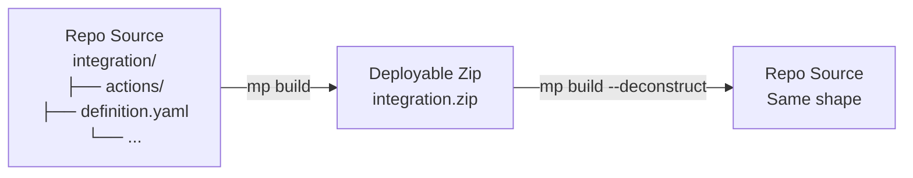

# Build & Deconstruct

## The Two Directions



**Build** = repo → zip (for deployment).
**Deconstruct** = zip → repo (for contribution).

## Why Both Directions Exist

You need deconstruct when:

1. **Manual contribution** — a user exported an integration from the SOAR UI (gets a zip) and wants to contribute it
2. **Pulling work** — `mp dev-env pull integration` uses deconstruct internally
3. **Migrating from an old repo format** — legacy integrations exported as zips can be reshaped

You need build when:

1. **Deployment** — CI publishes zips to the Content Hub registry
2. **Local testing** — `mp dev-env push` builds a zip internally before upload
3. **Debugging** — inspecting the zipped artifact to see what the platform actually receives

## The Deconstruct Command

```bash
mp build integration <integration_name> --deconstruct --src <path/to/zip_or_dir>
```

Or for playbooks:

```bash
mp build playbook <playbook_name> --deconstruct --src <path/to/zip_or_dir>
```

`-d` is the shorthand for `--deconstruct`.

## Typical Manual Contribution Flow

```bash
# 1. Export from SOAR UI → downloaded.zip

# 2. Deconstruct
mp build integration my_integration --deconstruct --src ./downloaded.zip

# Creates: content/response_integrations/.../my_integration/ (in default location)
#          OR uses --dst to specify

# 3. Fill release_notes.yaml
# 4. Check definition.yaml, ontology_mapping.yaml
# 5. Move to correct directory:
#    content/response_integrations/third_party/community/my_integration/
# 6. Run validation
mp validate integration my_integration

# 7. Commit + open PR
```

## What Build Produces

A zip with the structure the platform expects:

```
my_integration.zip
├── Manifest.json          # Platform metadata
├── definition.yaml
├── actions/
├── connectors/
├── jobs/
├── widgets/
├── resources/
└── core_bundle/           # Python source bundled into a single module
```

Key transformation: the build step **bundles core code** into a format the platform's runtime can load directly. The repo format keeps things as readable Python packages; the built zip flattens for platform constraints.

## Repository-Level Build

For CI and bulk ops:

```bash
mp build repository third_party
```

Builds every integration under `content/response_integrations/third_party/` into zips. Used when regenerating the release artifact set.

## Controlling Output Location

```bash
mp build integration my_integration --dst ./build_output/
```

Default destination: `.build/` in the repo root. Override for custom pipelines.

## Build Checks (Before Zipping)

`mp build` silently runs a subset of validation:

- Files exist as declared in `definition.yaml`
- Python syntax valid
- Imports resolve
- No obvious structural errors

If any fail, the build aborts. These are a faster safety net than full `mp validate`.

## What "Pre-Build" Means in `mp validate --only-pre-build`

Validation runs in two layers:

1. **Pre-build checks** — cheap, structural: file presence, YAML parse, field presence, identifier consistency
2. **Full validation** — includes running a test build, attempting to import all modules, running unit tests against declared configurations

`--only-pre-build` skips layer 2. Use it for fast iteration; use full validate before PR.

## Custom Integration Push GitHub Action

For customers pushing their own custom integrations via CI, the repo ships a reusable Action:

```yaml
uses: chronicle/content-hub/actions/custom-integration-push@main
with:
  api-root: ${{ secrets.SOAR_API_ROOT }}
  api-key: ${{ secrets.SOAR_API_KEY }}
```

- Monitors `content/response_integrations/custom/` directory
- Auto-pushes changed integrations to the configured SOAR env
- Supports API Key or Username/Password auth

This is a common "customer side" story in interviews — know it exists.

## Next

→ **[Interview Q&A](questions.md)**
