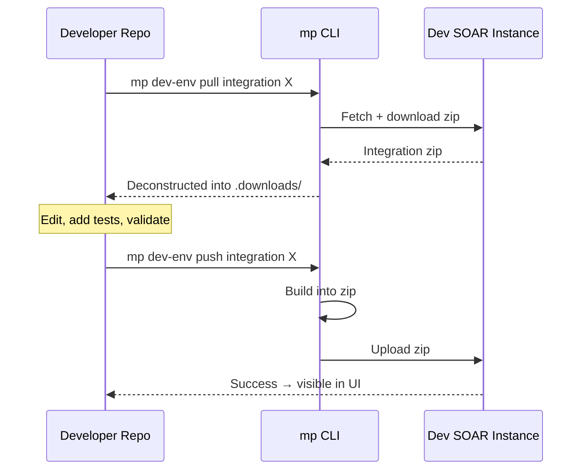

# `mp dev-env` Workflow

## Purpose

`mp dev-env` is the bridge between your local repo and a running Google SecOps SOAR instance used as your development playground. You push work to test it in the real platform UI; you pull from the platform to import existing content into the repo format.

## Getting Credentials

### API Root

1. Open your SecOps environment in a browser
2. Open DevTools Console (F12)
3. Run: `localStorage['soar_server-addr']`
4. Copy the URL — this is your API Root

### API Key

1. In SecOps: **Settings → SOAR Settings → Advanced → API Keys**
2. Click **Create**
3. Set **Permission Groups** to `Admins`
4. Copy the key — store it securely

## `login` — Authenticate

```bash
mp dev-env login [OPTIONS]
```

### Options

| Option | Meaning |
|---|---|
| `--api-root URL` | e.g., `https://your-env.siemplify.com` |
| `--username NAME` | If using user/pass |
| `--password PW` | If using user/pass |
| `--api-key KEY` | **Recommended** — API key auth |
| `--no-verify` | Skip credential verification after saving |

### Example

```bash
mp dev-env login \
  --api-root https://my-dev.siemplify.com \
  --api-key 11111111-2222-3333-4444-555555555555
```

Credentials are saved locally; subsequent `mp dev-env` commands use them.

## `push integration`

Build and upload an integration to your dev SOAR.

```bash
mp dev-env push integration [INTEGRATION] [OPTIONS]
```

### Options

| Option | Meaning |
|---|---|
| `--src PATH` | Source folder |
| `--staging` | Push into staging mode |
| `--custom` | Push from custom repo |
| `--keep-zip` | Keep the built zip after push (for debugging) |

### Example

```bash
mp dev-env push integration my_integration
```

Under the hood: `mp build integration my_integration` → upload zip → confirm success.

## `push playbook`

```bash
mp dev-env push playbook [PLAYBOOK] [OPTIONS]
```

### Options

| Option | Meaning |
|---|---|
| `--src PATH` | Source folder |
| `--include-blocks` | Also push nested-workflow blocks the playbook depends on |
| `--keep-zip` | Keep zip after push |

Use `--include-blocks` when your playbook references blocks that aren't yet deployed in the target env.

## `push custom-integration-repository`

One-shot push of the entire custom repo.

```bash
mp dev-env push custom-integration-repository
```

Bulk operation — uses the entire `content/response_integrations/custom/` tree.

## `pull integration`

Download an integration from dev SOAR and deconstruct it into repo format.

```bash
mp dev-env pull integration [INTEGRATION] [OPTIONS]
```

### Options

| Option | Meaning |
|---|---|
| `--dst PATH` | Destination folder (defaults to `.downloads/`) |
| `--keep-zip` | Keep the pulled zip for inspection |

### Example

```bash
mp dev-env pull integration my_integration --dst ./pulled
```

After pulling, you have the same folder structure you'd have in the repo. Move to the right `content/` subfolder and edit.

## `pull playbook`

```bash
mp dev-env pull playbook [PLAYBOOK] [OPTIONS]
```

### Options

| Option | Meaning |
|---|---|
| `--dst PATH` | Default `.downloads/` |
| `--include-blocks` | Pull nested blocks along with the parent playbook |
| `--keep-zip` | Keep zip |

## The "Custom Integration" Concept

Customers can run their own **custom** integrations specific to their environment — not destined for public Content Hub. The `--custom` flag on push distinguishes these.

Custom integration layout:

```
content/response_integrations/custom/
└── my_customer_specific_integration/
    └── ...
```

These have a separate push pipeline that goes to a customer-specific namespace rather than the global content registry.

## The Round-Trip Workflow



## Staging Mode

`--staging` pushes the integration to a staging slot in SOAR rather than replacing the live version. Useful for testing without disrupting analysts who are using the live copy.

## `keep-zip` for Debugging

If something fails in the platform after a push, you can inspect the zip that was built:

```bash
mp dev-env push integration my_integration --keep-zip
# Check the built zip in the build output folder
```

Sometimes `mp validate` passes but the SOAR side rejects — comparing the zipped contents against the repo source reveals the delta.

## Common Pitfalls

| Pitfall | Fix |
|---|---|
| "Unauthorized" after login | Re-verify API key permissions; the key must be in the `Admins` group |
| Push succeeds but integration doesn't update in SOAR UI | Refresh the UI; caching sometimes masks changes |
| Playbook push fails with "unknown block" | Use `--include-blocks` to also push dependencies |
| Pulled integration doesn't validate | `mp build --deconstruct` may miss edge cases — manual cleanup needed |
| Credentials leak into shell history | Use environment variables or the config file, not inline `--api-key` in scripts |

## Next

→ **[Build & Deconstruct](build-deconstruct.md)**
