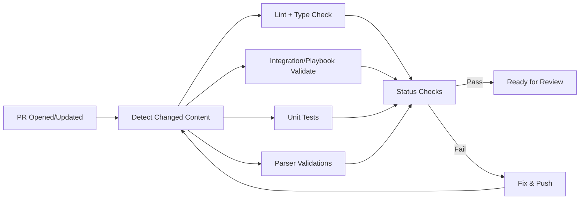

# PR Workflow

## Before You Open

- **CLA signed** at https://cla.developers.google.com/
- **Forked the repo** (not direct push — all changes via fork)
- **Feature branch** — never commit on `main`
- **Local validations passing** — `mp validate`, `mp test`, `mp check --static-type-check`

## Opening a PR

1. Push feature branch to your fork
2. Open PR against `chronicle/content-hub` `main`
3. Start as **Draft** if still in progress
4. Fill out the PR template (`.github/PULL_REQUEST_TEMPLATE.md`) — required checklist

## The PR Template Checklist

Memorize these bullets — they're checked in review:

- [ ] Did you sign the CLA?
- [ ] Did you bump the version in `release_notes.yaml`?
- [ ] Did you add/update tests?
- [ ] Did you run `mp validate`?
- [ ] Does the change only affect one integration/playbook/parser (narrow scope)?
- [ ] Did you update docs if behavior changed?

## CI Triggers on PR

## Moving from Draft → Ready for Review

Once all checks pass, click "Ready for review". This signals maintainers to look.

**Don't ping maintainers on green Draft PRs** — they're ignoring Drafts on purpose.

## Review Process

### Who Reviews

- **Community integrations** — community maintainer + Content Hub reviewer
- **Partner integrations** — partner + Content Hub reviewer
- **Google integrations** — internal Google reviewer
- **TIPCommon / `mp` / `packages/`** — higher bar; core maintainer review

### Review Rounds

1. First pass — maintainer reads the diff, requests changes if needed
2. Address feedback — push new commits to the same branch (don't force-push)
3. Re-review — maintainer checks each comment is addressed
4. Approval — maintainer adds the "Approved" review

### Common Review Asks

- **Tighten error handling** — catch specific exceptions, not bare `except`
- **Add tests** — "what happens when the API returns 500?"
- **Password in logs** — `print_value=True` on a password param
- **Missing version bump** — `release_notes.yaml` not updated
- **Scope creep** — unrelated changes in the PR; split out
- **Missing ontology fields** — connector without `start_time`/`end_time` mapping
- **Broken placeholder** — widget HTML references a step that doesn't exist

## Version Bumping — Critical Detail

From `contributing.md`:

> *"If you are modifying an existing content, remember to increase the version of that content. This is required for the changes to be released."*

Bump semver based on change type:

| Change | Bump |
|---|---|
| Bug fix, no behavior change | PATCH (e.g., 2.1.3 → 2.1.4) |
| New action, backward-compatible | MINOR (e.g., 2.1.4 → 2.2.0) |
| Breaking change (param renamed, action removed) | MAJOR (e.g., 2.2.0 → 3.0.0), `regressive: true` |

## Merging Strategy

Repo uses **squash merge** — your feature branch's commits are squashed into a single commit on `main`. Reasons:

1. Clean `main` history
2. Easy revert — one commit to reverse
3. Atomic — each merged change is a complete unit

This means: **commit messages on your branch don't matter much** (squashed), but the PR title becomes the commit message on main — write it carefully.

## After Merge

1. The internal publishing pipeline picks up the change
2. New version appears in the Content Hub registry (usually within hours)
3. Customers see it in the in-product Content Hub catalog

No action needed from the contributor post-merge.

## Common PR Mistakes

| Mistake | Fix |
|---|---|
| CLA not signed | Sign at cla.developers.google.com, push an empty commit to retrigger |
| Force-pushed after review | Don't — it invalidates the reviewer's context. Push new commits. |
| Mixed concerns (integration + TIPCommon) | Split into two PRs |
| Scope creep (fixed a typo in an unrelated file) | Split out; unrelated changes delay review |
| Stale branch | Rebase on latest `main` or merge upstream |
| No release notes entry | Add in `release_notes.yaml` with `publish_time: 'YYYY-MM-DD'` |

## Responding to Requested Changes

**Good response:**

> *"Fixed — switched `except Exception` to catch `AbuseIPDBRateLimitError` specifically; added a test for the rate-limit path. Ready for re-review."*

**Bad response:**

> *"Fixed it."*

Always describe what you changed + confirm the test coverage. Makes the reviewer's job faster.

## Next

→ **[Validation Status Checks](validation-checks.md)**
