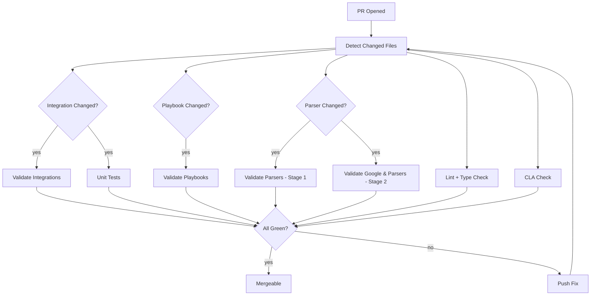

# Validation Status Checks

## The Required Status Check Set

For a PR to merge into `main`, **all required checks must be green**. The GitHub Repository Ruleset enforces this.



## Check-by-Check Reference

### `Validate Integrations`

**What it runs:** `mp validate integration <changed-integrations>` in a matrix
**What it catches:**
- Missing required files
- Identifier mismatches
- Missing ontology for connector-bearing integrations
- Password params with default values
- Missing logos
- Version not bumped in `release_notes.yaml`
- Non-snake_case filenames

**Fail fix:** run `mp validate integration X` locally, read the error, fix, re-push.

### `Validate Playbooks`

**What it runs:** `mp validate playbook <changed-playbooks>`
**What it catches:**
- Step references to non-existent actions
- Widget YAML referencing missing step IDs
- Missing `display_info.yaml`, `overviews.yaml`
- Invalid trigger grammar
- Block references to non-existent blocks

### `Validate Parsers` (Stage 1 — Standalone)

**Automatic** on every PR touching `content/parsers/`.
**What it catches:**
- Folder structure incorrect
- Missing `metadata.json` / `parser.conf` / testdata
- `testcaseN_logs.json` without matching `testcaseN_events.json`
- Parser output diverges from expected events
- Unknown or unauthorized `log_type`

### `Validate Google & Parsers` (Stage 2 — Live Instance)

**Manually triggered** by contributor using `secops` CLI. Tests parser against real customer logs.
**What it catches:**
- Parse efficiency regression
- UDM field-coverage drop
- Production-only edge cases

### `Lint & Format`

**What it runs:** `mp check --changed-files --static-type-check --raise-error-on-violations`
**What it catches:**
- Ruff lint violations
- Format violations
- Type errors from `ty`

**Fail fix:** `mp format` + `mp check --fix --static-type-check` locally, commit.

### `Unit Tests`

**What it runs:** `mp test <changed-integrations>` in the matrix
**What it catches:**
- Any failing pytest in the integration's `tests/`
- Import errors
- Behavior regressions

### `CLA Check`

**What it runs:** The Google CLA bot verifies the committer email is associated with a signed CLA.
**Fail fix:** Sign at https://cla.developers.google.com/, then push an empty commit to re-trigger the check.

## Debugging a Failed Check

Step-by-step:

1. **Click the failed check** in the PR's "Checks" tab
2. **Read the log** — scroll to the first error, not the last
3. **Reproduce locally** with the same command
4. **Fix, commit, push** — the check auto-reruns
5. **If mysterious** (passes locally, fails in CI): check for missing env vars, cache issues, uncommitted file

## When a Check is Flaky

Flakiness is a bug in the CI setup, not a reason to re-run blindly. If a check fails and a maintainer says "just re-run it", mentally flag it — if it's genuinely flaky, the CI owners should fix the flakiness.

You can manually re-run a failed check from the PR UI (Actions → re-run failed jobs). Do this **only** if you believe the failure was environmental, and note in the PR.

## Bypassing Checks

Maintainers **cannot** bypass required checks on a PR — even admins. The Repository Ruleset is stricter than branch protection; the only way to merge is to pass.

Exception: if a specific check is genuinely broken (CI infrastructure outage), a maintainer can mark it as "not required" temporarily in the Ruleset. This requires approval and is audited.

## Skip Conditions

Some workflows only run if relevant files changed:

```yaml
on:
  pull_request:
    paths:
      - 'content/response_integrations/**'
      - 'packages/tipcommon/**'
```

This means a pure-docs PR skips integration validation entirely. Saves CI minutes.

## Status in the PR UI

The checks section at the bottom of the PR shows:

- ✅ Green — passing
- ❌ Red — failing
- 🟡 Yellow — in progress
- ⚪ Gray — waiting / not yet started
- ➖ Blue "skipped" — wasn't needed for this PR's scope

All required checks must be **green** (not skipped counts) for merge.

## Next

→ **[Interview Q&A](questions.md)**
