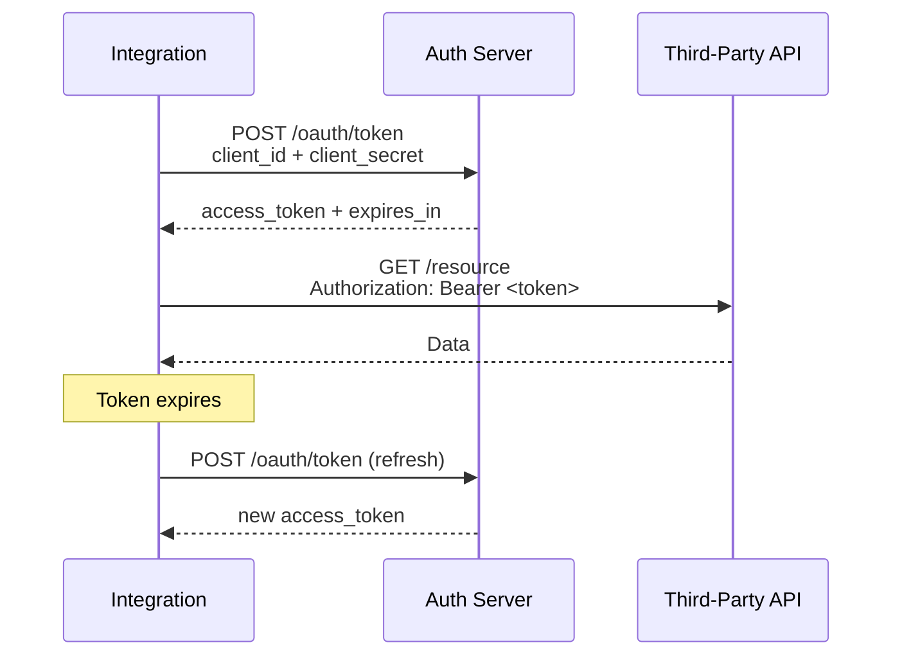

# OAuth & Authentication

## Three Auth Patterns You'll Encounter

### 1. API Key (Simplest)

Third party issues a static key. Pass it as a header on every request.

```python
class SimpleClient:
    def __init__(self, api_key: str):
        self.session = requests.Session()
        self.session.headers["X-API-Key"] = api_key
```

Parameters in `definition.yaml`:

```yaml
parameters:
  - name: Api Key
    type: password
    is_mandatory: true
```

### 2. Basic Auth (Username + Password)

```python
class BasicAuthClient:
    def __init__(self, username: str, password: str):
        self.session = requests.Session()
        self.session.auth = (username, password)
```

### 3. OAuth 2.0 (Most Complex)

Multiple flavors:

- **Client Credentials** — M2M: exchange `client_id + client_secret` for a bearer token
- **Authorization Code** — User OAuth flow (rare in SOAR integrations; usually not needed)
- **Password Grant** — Deprecated by most providers

The overwhelmingly common case in SOAR is **Client Credentials**.

## Client Credentials Flow (Canonical)



## TIPCommon OAuth Helpers

`TIPCommon.oauth` provides building blocks:

- Token cache with expiry tracking
- Automatic refresh on 401
- Pluggable auth header injection

```python
from TIPCommon.oauth import OAuthClientCredentialsManager

class MyFalconClient:
    def __init__(self, base_url: str, client_id: str, client_secret: str):
        self._auth = OAuthClientCredentialsManager(
            token_url=f"{base_url}/oauth2/token",
            client_id=client_id,
            client_secret=client_secret,
        )
        self.session = requests.Session()

    def _request(self, method: str, path: str, **kwargs) -> dict:
        token = self._auth.get_token()   # fetches or refreshes
        kwargs.setdefault("headers", {})["Authorization"] = f"Bearer {token}"
        r = self.session.request(method, f"{self.base_url}{path}", **kwargs)
        if r.status_code == 401:
            # Token may have been invalidated — force refresh and retry once
            self._auth.invalidate()
            token = self._auth.get_token()
            kwargs["headers"]["Authorization"] = f"Bearer {token}"
            r = self.session.request(method, f"{self.base_url}{path}", **kwargs)
        r.raise_for_status()
        return r.json()
```

## Persisting Tokens Across Runs — Connector/Job Context

For connectors/jobs running every 5 minutes, re-authenticating every time wastes the third-party's rate limit. Persist the token in connector context:

```python
from TIPCommon import context

def read_context_data(self) -> None:
    self._cached_token = context.get(self.siemplify, "oauth_token")
    self._token_expiry = context.get(self.siemplify, "oauth_expires_at")

def _save_context_data(self) -> None:
    context.set(self.siemplify, "oauth_token", self._cached_token)
    context.set(self.siemplify, "oauth_expires_at", self._token_expiry)
```

Token cached = one auth call per token lifetime (typically 1 hour), not per 5-minute run.

## Base Job for Token Refresh

TIPCommon ships `base_job_refresh_token.py` — a specialized job base for tenants where token refresh must be decoupled from the main work:

```python
from TIPCommon.base.job.base_job_refresh_token import BaseJobRefreshToken

class FalconTokenRefreshJob(BaseJobRefreshToken):
    # Implement abstracts; base handles the schedule + persistence
    ...
```

Schedule this job to run every 30-50 minutes; it refreshes the token stored in shared context, and other connectors read from there.

## Storing Secrets Securely

- `definition.yaml` parameter type **must be `password`** — encrypted at rest, masked in logs
- `extract_action_param(..., print_value=False)` — never log the value
- Token cached in context is at platform-stored-secret rest level
- **Never** log tokens — even at DEBUG level

## Multi-Step Auth (Less Common)

Some products require: login → get session ID → use session ID. Your core module encapsulates this:

```python
class LegacyProductClient:
    def _login(self) -> str:
        r = self.session.post(f"{self.base_url}/login",
                              json={"user": self.user, "pass": self.password})
        return r.json()["sessionId"]

    def _request(self, method, path, **kw):
        if not self._session_id:
            self._session_id = self._login()
        kw.setdefault("headers", {})["X-Session-Id"] = self._session_id
        r = self.session.request(method, f"{self.base_url}{path}", **kw)
        if r.status_code == 401:
            self._session_id = self._login()   # re-login and retry
            kw["headers"]["X-Session-Id"] = self._session_id
            r = self.session.request(method, f"{self.base_url}{path}", **kw)
        return r.json()
```

## Common Auth Pitfalls

| Pitfall | Fix |
|---|---|
| Not caching tokens — refresh per call | Cache with expiry; refresh only when needed |
| Caching forever, not refreshing | Track `expires_in`; refresh before expiry |
| Not handling 401 = token invalidated early | Invalidate cache + retry once on 401 |
| Logging tokens | Never log; `print_value=False` on secrets |
| Hardcoding auth URL | Parameterize `API Root` in `definition.yaml` |
| Storing refresh_token in cleartext in code | Always via `context` — platform encrypts |

## Next

→ **[Caching & Context](caching-context.md)**
