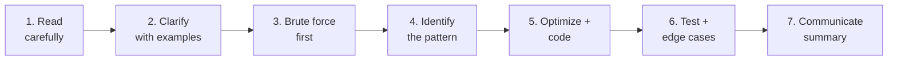

# How to approach any problem — the 7-step framework

> Internalize this once. Use it on every problem for the rest of your career.

---

## Why a framework?

When you panic, structure saves you. Without a framework, hard problems feel like a wall. With one, every problem becomes 7 small steps — and any one of them is doable.

The 7 steps are not "tips." They are what every successful interview answer looks like, in order. Skip steps and you'll lose points even on a problem you can solve.

---

## The 7 steps at a glance



Each step has a **time budget** for a 45-minute interview round:

| Step | Time | Why this much |
|---|---|---|
| 1. Read carefully | 2 min | Misreading is the #1 failure mode |
| 2. Clarify with examples | 3 min | Confirms understanding before code |
| 3. Brute force first | 5 min | Always have *something* working |
| 4. Identify the pattern | 3 min | The "aha" moment must be explicit |
| 5. Optimize + code | 20 min | The longest step, with reason |
| 6. Test + edge cases | 7 min | Don't skip — interviewers grade this |
| 7. Communicate summary | 5 min | Closing impression matters |

Total: 45 min. If you go over budget on a step, **note it and move on**. Steps 6 and 7 are sacrificed last.

---

## Step 1 — Read carefully

> 🎯 **Goal:** understand exactly what is being asked, no assumptions.

### Do this

- **Read twice.** Once to skim, once to underline.
- **Underline:** input format, output format, constraints (size of `n`), special cases mentioned (negative numbers? duplicates? sorted?).
- **Note:** what is the "thing to return"? An index? An array? A boolean? Modify in place?

### Don't do this

- ❌ Skim once and start typing.
- ❌ Assume the array is sorted because the example is sorted.
- ❌ Assume positive integers because the examples are positive.

### Example

> "Given an array of integers `nums` and an integer `target`, return *indices of the two numbers* such that they add up to target. You may assume that each input would have exactly one solution, and you may not use the same element twice."

After reading: I underline *indices*, *exactly one solution*, *not use same element twice*. I do **not** see "sorted." I do **not** see "positive only." I do **not** see "no duplicates."

---

## Step 2 — Clarify with examples

> 🎯 **Goal:** confirm the problem with the interviewer using real input/output.

### Do this

- **Walk through the given example** out loud: "So `[2,7,11,15], target=9` → `[0,1]` because `nums[0]+nums[1]=9`. Yes?"
- **Make up your own tricky example.** "What about `[3,3], target=6` — would I return `[0,1]`? Yes, because they're different indices."
- **Ask 2–3 specific questions.** Not "any constraints?" but "Are inputs sorted? Can they be negative? Can n be 1?"

### What good clarifying questions look like

- ✅ "Are duplicates allowed in the input?"
- ✅ "Does the output need to be sorted?"
- ✅ "What's the largest n I should expect?" (this drives complexity choice)
- ✅ "Should I modify the input or return a new array?"
- ✅ "What do I return if no solution exists?"

### What's not as good

- ❌ "Anything else I should know?" (too open)
- ❌ "How fast should it be?" (you should *propose* a complexity, not ask)

---

## Step 3 — Brute force first

> 🎯 **Goal:** state a working solution out loud before optimizing.

This is the most counter-intuitive step. New candidates rush to the optimal. Stop.

### Why brute force first?

1. **It guarantees you have something working** if time runs out
2. **It establishes a baseline complexity** — now you know what you're improving from
3. **It shows the interviewer you understand the problem**
4. **The optimal usually emerges by spotting wasted work in the brute force**

### How to state it

> "The brute force is to try every pair `(i, j)` and check if they sum to target. That's two nested loops — O(n²) time, O(1) space. It works but for n=10⁵ that's 10¹⁰ operations, too slow. Let me think how to avoid the inner loop."

That's a perfect 30-second brute-force statement. Don't actually code it unless asked.

---

## Step 4 — Identify the pattern

> 🎯 **Goal:** name the trick out loud before coding.

The brute force will reveal *where work is being wasted*. The pattern is what removes that waste.

### Common pattern signals

| Signal | Likely pattern |
|---|---|
| "Find a pair that sums to X" | Hash map for O(1) lookup |
| "Sorted array, find pair / triplet" | Two pointers |
| "Subarray with property P" | Sliding window |
| "Tree → list, level by level" | BFS |
| "Count ways / minimum cost" | DP |
| "Generate all combinations" | Backtracking |
| "Top K / smallest K" | Heap |
| "Find in rotated sorted array" | Modified binary search |

The full mapping lives in the [Patterns](../04-patterns/index.md) section. **Memorize the signals. The patterns themselves take longer.**

### State it explicitly

> "The brute force re-scans for the complement. We can avoid that with a hash map: for each number, check if `target - num` is already in the map. That's the **Hash Map for Complement** pattern."

Now you've earned the right to code.

---

## Step 5 — Optimize and code

> 🎯 **Goal:** clean Python that compiles in your head.

### Do this

- **Outline first** with comments, before any code:
  ```python
  # 1. Create empty dict 'seen'
  # 2. Walk through nums with index
  #    a. complement = target - num
  #    b. if complement in seen: return [seen[complement], i]
  #    c. seen[num] = i
  ```
- **Then write the code in one pass.** No back-and-forth edits.
- **Use clear names.** `seen` not `s`. `complement` not `c`. `freq_count` not `fc`.
- **Speak as you code.** "Now I'm initializing the dict. Now I loop through with `enumerate` because I need the index. Now I check the complement…"

### Don't do this

- ❌ Code silently. Interviewers grade your communication.
- ❌ Use 1-letter variables.
- ❌ Get clever (no `*` unpacking gymnastics in interviews unless it clarifies).
- ❌ Optimize prematurely (write it correct first, faster second).

### What good code looks like

```python
def two_sum(nums: list[int], target: int) -> list[int]:
    """Return indices of the two numbers in nums that sum to target."""
    seen: dict[int, int] = {}              # value -> index seen so far
    for i, num in enumerate(nums):
        complement = target - num
        if complement in seen:
            return [seen[complement], i]
        seen[num] = i
    return []                              # no pair found
```

Type hints. Docstring. Clear names. Comment on the *purpose* of `seen`. That's senior-level Python in 7 lines.

---

## Step 6 — Test and edge cases

> 🎯 **Goal:** prove it works, including the cases the example didn't cover.

### Walk a dry-run

Pick a small input. Trace your code line by line, out loud:

> "nums=[2,7,11,15], target=9. i=0, num=2, complement=7. 7 not in seen. seen={2:0}. i=1, num=7, complement=2. 2 IS in seen, value 0. Return [0,1]. ✓"

You're done with the happy path. Now edge cases.

### The edge-case checklist (memorize)

- [ ] **Empty input** — what does my code return for `[]`?
- [ ] **Single element** — for `[5]`?
- [ ] **All same elements** — for `[3,3,3,3]`?
- [ ] **Negative numbers** — does it work for `[-3, 4, 3, 5]`?
- [ ] **Duplicates** — for `[3,2,4,2]`? Which 2 is returned?
- [ ] **No valid answer** — what does my code do for `[1,2,3]` target=100?
- [ ] **Min/max bounds** — for very large or very small `target`?
- [ ] **Sorted input** — does my code over-rely on order?

For each, predict your code's behavior, then trace through to verify.

If a case fails: **fix it.** Don't claim "I'd handle it" — fix it in the code.

---

## Step 7 — Communicate the summary

> 🎯 **Goal:** end strong. Last impression sticks.

### The closing speech (30 seconds)

> "So my final solution: I scan the array once, using a hash map to remember each number I've seen along with its index. For each new number, I check if its complement (target − num) is already in the map. If so, I return the pair of indices.
>
> Time: O(n) — single pass, hash ops are O(1) average.
>
> Space: O(n) — the map can hold up to n items.
>
> Edge cases I considered: empty array returns [], single element returns [], duplicates work because dict keys overwrite.
>
> A possible follow-up: if the array were sorted, two pointers gives O(1) space. If we wanted *all* pairs, we'd modify the dict to store lists of indices."

That's the answer your interviewer is going to score. Not the code. **The code + the summary.**

---

## Putting it together — a worked example

**Problem:** Find the longest substring of a string that contains no repeating characters. Return its length.

### Step 1 — Read carefully (2 min)
Underline: *substring* (contiguous), *no repeating characters*, *length*. Inputs: a string `s`. Output: integer.

### Step 2 — Clarify (3 min)
"Empty string returns 0?" → Yes. "ASCII or Unicode?" → ASCII for now. "All lowercase?" → Could be mixed.

Tricky example: `"abba"`. Walk through: `"a"`, `"ab"`, `"bb"` → no, `"b"`, `"ba"`. Longest = 2. Confirm with interviewer.

### Step 3 — Brute force (5 min)
"Try all substrings, check each for uniqueness. That's O(n³) — n² substrings × n to check uniqueness. Way too slow for n=10⁵."

### Step 4 — Pattern (3 min)
"Brute force keeps re-checking. The signal '*longest contiguous with property P*' screams **Sliding Window**. I'll use a window with a hash set tracking characters in it. Expand the right pointer; when a duplicate appears, contract the left pointer until the duplicate is gone."

### Step 5 — Code (20 min)
```python
def length_of_longest_substring(s: str) -> int:
    """Length of the longest substring without repeating characters."""
    seen: set[str] = set()
    left = 0
    best = 0
    for right, ch in enumerate(s):
        while ch in seen:
            seen.remove(s[left])
            left += 1
        seen.add(ch)
        best = max(best, right - left + 1)
    return best
```

### Step 6 — Test (7 min)
- `"abba"` → expand to `"ab"` (best=2). `'b'` repeats → contract to `"b"`, then add second `'b'`. Wait — let me trace more carefully…
- *(actually trace by hand to catch bugs)*
- Edge: `""` → loop runs 0 times → returns 0. ✓
- Edge: `"aaaa"` → window stays size 1 → returns 1. ✓

### Step 7 — Communicate (5 min)
"Final solution: sliding window with a hash set. Time O(n) — left and right each move at most n times. Space O(min(n, alphabet)). Edge cases handled. Follow-up: with a hash *map* of `char → index`, we can jump `left` directly instead of stepping it forward, saving constant work."

That's a complete, senior-level interview answer. ~45 minutes, 7 steps, every step communicated.

---

## What this framework prevents

| Without | With |
|---|---|
| "Let me start coding…" then panic | Always have a brute force as fallback |
| Misreading the problem | Step 1 catches it |
| Solving the wrong problem | Step 2 catches it |
| Coding in silence | Step 5 forces narration |
| Submitting without testing | Step 6 forces it |
| Ending with "uh, I think that works" | Step 7 ends with confidence |

---

## Up next

→ [Company-wise prep](company-wise-prep.md) — how each company applies this framework slightly differently.
