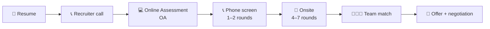

# Interview stages explained

> Resume → recruiter → online assessment → phone screen → onsite → team match → offer. Demystified.

If you've never been through a tech interview, the steps can feel like a black box. They're not. Each stage has a purpose, a format, and a way to win.

---

## The funnel

Not every company has every stage. Service companies often skip the OA and phone screen; PSUs add a written exam; small companies sometimes go resume → onsite directly.

---

## Stage 1 — Resume

### Purpose

Recruiter scans for ~6 seconds. Decides: "Worth a closer look? Or skip?"

### What matters

- **Top of page:** Name, contact, GitHub/LinkedIn, location.
- **Recent experience first** with **quantified impact bullets**.
    - ❌ "Worked on backend services."
    - ✅ "Reduced p99 API latency from 800ms to 120ms by replacing in-process cache with Redis."
- **Skills listed honestly.** If your resume says "expert in Kubernetes" and you can't explain a Pod, you'll get caught.
- **Projects matter for new grads** more than for seniors. List 2–3, with clear bullets.
- **One page** for <5 yrs experience. Two pages max for senior.

### What hurts

- Typos. Recruiters sort to the bottom for them.
- "Responsibilities" instead of "Achievements."
- Listing 30 technologies (signals shallow).
- A 4-page resume for a junior role.
- Unprofessional email address.

### Tips

- Use a recruiter-friendly template (1 column, no fancy graphics, ATS-readable).
- Tailor 1 line per company — mention something specific.
- Send via **referral** if at all possible. A referral is 10× the response rate of a cold submit.

---

## Stage 2 — Recruiter call (15–30 min)

### Purpose

Confirm fit on basics: location, visa, salary expectation, role level. Sometimes a soft technical screen.

### What they ask

- "Walk me through your background." (60–90 second pitch)
- "Why are you looking?" (don't trash your current employer)
- "What kind of role are you looking for?" (have a 1-sentence answer)
- "What's your salary expectation?" (try to defer: "I'd like to learn more about the role first")
- "Are you interviewing elsewhere?" (be honest but vague: "Yes, with a few other companies in similar roles")
- Sometimes: "Tell me about a recent project" (60-second answer)

### What you ask

- "What does the interview process look like?" — they'll tell you # of rounds, format
- "What teams might I be considered for?"
- "What's the timeline?"
- "Is there anything you'd recommend I focus on for prep?"

### Tips

- Be **enthusiastic but not desperate**.
- Have a **strong 60-second pitch** ready. Practice it.
- Don't lock in a salary number on this call.

---

## Stage 3 — Online assessment (OA) — 60–120 min

### What it is

Coding problems on a platform like HackerRank / Codility / company-internal. Typically 1–3 problems, 60–120 min, automated grading.

### Format variants

- **Pure coding** — solve N problems. Most common at product companies.
- **Coding + behavioral** — Amazon's "OA2" includes work-style questions and 2 coding problems.
- **Aptitude + coding** — service companies (TCS NQT, Infosys SP) include math, logic, English alongside coding.

### How they grade

- Usually it's **test cases passed** + (sometimes) code complexity.
- Hidden test cases catch edge-case-missers.
- Some companies let you re-submit; some lock after first attempt.

### What to do

- **Read all problems first.** Solve the easiest one first to bank a fast win.
- **Write down constraints** for each problem before coding (n size, value bounds).
- **Test with the given example first.** Test edge cases before final submit.
- **Don't over-engineer.** Get a working brute force submitted, then optimize if you have time.

### What to avoid

- ❌ Solving problems in order even if #1 is hard.
- ❌ Spending 50 min on one problem you can't crack.
- ❌ Assuming "the test cases are simple."
- ❌ Cheating with ChatGPT — most platforms now detect tab-switching, copy-paste patterns, and AI-style code.

---

## Stage 4 — Phone screen (45–60 min × 1–2 rounds)

### Purpose

Live coding with an actual engineer. Filter for "can think and code at the same time."

### Format

- Audio or video call
- Shared coding pad (CoderPad, Google Doc, sometimes a real IDE)
- 1 problem (sometimes 2 if first is fast)
- 5 min intro + 35 min coding + 5 min Q&A + 5 min wrap

### How to pass

- **Use the [7-step framework](how-to-approach-any-problem.md).** Especially clarification, brute force, and communicating while coding.
- **Talk constantly.** Silent coding is a loss signal.
- **Test your code visibly** with the interviewer watching. Don't just say "this should work."
- **Have 1 thoughtful question ready** for the Q&A: "What's the team currently working on?" or "What's been the most interesting technical challenge for you in the last 6 months?"

### What to avoid

- ❌ Refusing to write the brute force first.
- ❌ Coding in silence.
- ❌ Asking "Can I see the input?" mid-coding (you should have asked at clarification time).
- ❌ "I'm not sure" instead of trying — always attempt.

---

## Stage 5 — Onsite (the loop) — 4–7 rounds in a day or spread over days

### Purpose

The full evaluation. Multiple interviewers, each with a different bar to grade you on.

### Typical onsite shape

| Round | Topic | Time |
|---|---|---|
| 1 | Coding (medium) | 45 min |
| 2 | Coding (harder) | 45 min |
| 3 | System design (senior+) | 45–60 min |
| 4 | Coding (harder still) | 45 min |
| 5 | Behavioral / culture | 45 min |
| 6 | Manager round / wrap | 30 min |

(Service companies typically have 1–2 onsite rounds. PSU is a panel interview, ~1 hour, with multiple panelists.)

### Each round has a "lever" the interviewer is trying to pull

- **Coding round 1:** "Can you solve a medium in 45 min while communicating?"
- **Coding round 2:** "Can you handle a harder problem with multiple twists?"
- **System design:** "Can you reason about scale, trade-offs, and end-to-end flow?"
- **Behavioral:** "Are you pleasant to work with? Do you own your work? Have you led?"
- **Manager:** "Do you fit my team's mission and culture? Where do you want to grow?"

### Tactics for the loop

- **Sleep 8 hours the night before.** A loop is endurance.
- **Bring a notebook** for jotting clarifications between rounds.
- **Eat breakfast.** Bring snacks. The day is long.
- **Reset between rounds.** Even if a round went badly, the next interviewer doesn't know — start fresh.
- **Prepare a different question for each interviewer.** Asking each "What's the team like?" looks lazy.

---

## Stage 6 — System design round (the make-or-break for senior)

### What it is

A 45–60 minute design conversation. The interviewer says: "Design Twitter." You drive.

### How it grades

- **Clarification first.** "What scale? Read-heavy or write-heavy? Real-time or eventual?" — 5 min.
- **Capacity estimation.** Rough math on QPS, storage, bandwidth — 5 min.
- **High-level architecture.** Sketch the boxes — 10 min.
- **Deep-dive on 1–2 components.** Database choice, caching strategy, queue design — 15 min.
- **Trade-offs and bottlenecks.** "What breaks at 100M users? How do you fix?" — 10 min.
- **Wrap.** Summarize design + remaining open questions — 5 min.

The bible's [System Design](../08-system-design/index.md) section (coming in Phases 11–13) has 25+ projects worked through this exact format.

### What to avoid

- ❌ Jumping into "I'd use Kafka" without justifying.
- ❌ Forgetting to estimate capacity. Senior interviewers will dock you.
- ❌ Mentioning every buzzword (microservices + Kubernetes + service mesh + event sourcing) without reason.
- ❌ Designing for a billion users when problem says 100k.

---

## Stage 7 — Behavioral round

### Purpose

Are you pleasant, accountable, mature, collaborative? Behavioral rounds are not "soft" — they have failed people who solved every coding round.

### Format

- 30–45 min
- 4–6 questions, each requiring a specific story
- Format: "Tell me about a time when…"

### How to answer — STAR

- **S**ituation: 1–2 sentences. Set the scene.
- **T**ask: 1 sentence. What were you supposed to do?
- **A**ction: 3–4 sentences. What did *you* (not "we") do? Specific, with reasoning.
- **R**esult: 1–2 sentences. Quantify if possible.

### Common questions

- "Tell me about yourself." (90 sec, prepare in advance)
- "Tell me about a project you're proud of."
- "Tell me about a conflict with a teammate."
- "Tell me about a time you failed."
- "Tell me about a time you led without authority."
- "Why us?"
- "Where do you see yourself in 5 years?"
- "What's your biggest weakness?" (don't say a fake weakness)

The bible's [Behavioral](../11-behavioral/index.md) section (Phase 14) covers 50+ questions with template answers.

---

## Stage 8 — Team match (product companies)

After offers in some companies (Google, Meta), they "team match" you to a specific team. You'll talk to 2–3 teams. The team picks you and you pick a team.

### What to ask each team

- "What's the team's mission?"
- "What does an average week look like?"
- "What's the most important thing you've shipped in the last 6 months?"
- "What's a problem the team is currently struggling with?"
- "Who would I report to? Can I meet them?"
- "What's the team's stance on remote work?"

### How to choose

- Prefer **good manager** > **interesting product** > **hot team**.
- A great manager will protect you, develop you, and unblock you for years.

---

## Stage 9 — Offer + negotiation

### What's negotiable

- Base salary (~10–20% wiggle)
- Sign-on bonus (large room — sometimes 50%+ wiggle)
- Equity / RSUs (varies by company)
- Year-1 vs year-2 vesting cliff
- Start date
- Relocation package

### What's usually NOT negotiable

- Title (early career)
- Vacation days
- Benefits package

### How to negotiate

1. **Get a competing offer.** Single offers have less leverage.
2. **Ask the recruiter to "make it competitive"** rather than naming a number first.
3. **Be polite, professional, and patient.** Rushed negotiations leave money on the table.
4. **Get everything in writing** before signing.

There's a full negotiation playbook in the [Behavioral section](../11-behavioral/index.md).

---

## Quick stage-by-stage checklist

- [ ] **Resume** is one page (or two for senior), quantified bullets, no typos, sent via referral
- [ ] **Recruiter call** — 60-second pitch, defer salary, ask process questions
- [ ] **OA** — read all problems first, easy first, brute force then optimize, test before submit
- [ ] **Phone screen** — 7-step framework, talk while coding, test in front of interviewer
- [ ] **Onsite** — sleep 8h, snacks, reset between rounds, different question per interviewer
- [ ] **System design** — clarify, estimate, sketch, deep-dive 1–2 components, trade-offs
- [ ] **Behavioral** — 8–10 STAR stories prepared, "tell me about yourself" rehearsed
- [ ] **Team match** — pick manager, not product
- [ ] **Negotiation** — competing offer if possible, get it in writing

---

## Up next

→ [Progress tracker](progress-tracker.md) — track yourself across the bible.
