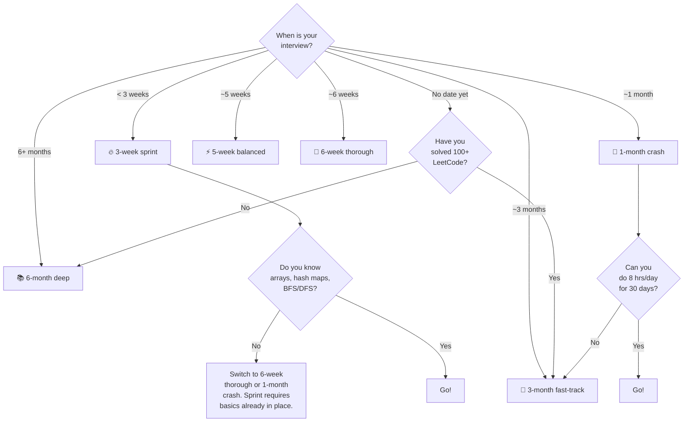

# Pick your study plan

> Six plans. One you. Pick the one that fits. Don't pick "all of them."

---

## TL;DR — the comparison table

| Plan | Best for | Hours/day | Total weeks | Topics covered | Problems solved | Mock interviews |
|---|---|---|---|---|---|---|
| 🔥 [3-week sprint](3-week-sprint-plan.md) | Interview in 21 days, you have basics already | 8–10 | 3 | ~25 | ~400 | 4 |
| ⚡ [5-week balanced](5-week-balanced-plan.md) | Solid prep, some prior knowledge | 5–6 | 5 | ~35 | ~800 | 6 |
| 🎯 [6-week thorough](6-week-thorough-plan.md) | Standard prep window | 4–5 | 6 | ~40 | ~1,200 | 8 |
| 📅 [1-month crash](1-month-crash-plan.md) | Emergency, all-in on a month | 8 | 4 | ~30 | ~500 | 5 |
| 📆 [3-month fast-track](3-month-fast-track.md) | Most popular plan | 3–4 | 12 | ~50 | ~2,000 | 12 |
| 📚 [6-month deep](6-month-study-plan.md) | Beginner from zero | 2–3 | 26 | All ~55 | 4,000+ | 20+ |

**No plan is "better."** They differ in trade-offs: time vs depth vs sustainability.

---

## The decision tree

---

## Pick by your situation

### "I have an interview in 3 weeks"

Pick **[3-week sprint](3-week-sprint-plan.md)** — but only if you already know the basics (arrays, hash maps, BFS, DFS, recursion, big-O). If you don't, the sprint will leave gaps. Do **[1-month crash](1-month-crash-plan.md)** instead and ask the recruiter to push the interview if possible.

### "I have an interview in a month"

Pick **[1-month crash](1-month-crash-plan.md)**. It's structured for max-coverage in 30 days assuming you're available 8 hours/day. If you can't sustain 8 hours/day, drop to **[5-week balanced](5-week-balanced-plan.md)** and tell the recruiter you need 5 weeks.

### "I have 5–6 weeks"

- **5-week balanced** if you have *some* prior knowledge.
- **6-week thorough** if you're starting fresh on most topics.

The 6-week plan is the "standard" — it's what most successful candidates use.

### "I have 3 months"

Pick **[3-month fast-track](3-month-fast-track.md)** — the most popular plan in this bible, and the one with the highest reported success rate (in surveys of "did you get the offer?"). Realistic, sustainable, covers everything.

### "I have 6 months and I'm starting from zero"

Pick **[6-month deep](6-month-study-plan.md)**. Don't try to compress it into 3. The 6-month plan includes the time needed to *build intuition*, not just memorize patterns. That's what separates the people who get in vs. the people who solve 500 problems and still flunk.

### "No interview scheduled yet — I'm just preparing"

- If you've solved 100+ LeetCode problems already → **3-month fast-track**.
- If you haven't → **6-month deep**.

You can always speed up later. You can't slow down once you've started cramming.

---

## Pick by background

### "I'm a 1st/2nd-year engineering student"

→ **6-month deep**. You have time. Use it. Build the foundation that beats your peers in 4th year.

### "I'm a 3rd/4th-year student facing campus placements"

→ **3-month fast-track** if placements are 3+ months away.
→ **6-week thorough** if placements are within 2 months.
→ **1-month crash** if placements start in a month.

### "I'm a working SDE-1 / SDE-2 looking to switch"

→ **3-month fast-track** if you can do 3 hrs/day after work.
→ **5-week balanced** if you can take leave or PTO.

### "I've been doing LeetCode for 6+ months and feel stuck"

→ **5-week balanced**, but pay extra attention to the [Patterns](../04-patterns/index.md) section. Most "stuck" engineers solve problems by feel without recognizing the underlying pattern. Pattern study is the unstuck button.

### "I'm targeting Indian PSU (ISRO, DRDO, BARC)"

→ **6-week thorough**, plus extra weight on [Foundations](../01-foundations/index.md) and CS-fundamentals (OS, DBMS, Computer Networks — bible Phase 14 covers these). PSU interviews are heavy on basics + theory, light on optimization tricks. See [Product vs Service vs PSU strategy](product-vs-service-vs-psu-strategy.md).

### "I'm targeting service companies (TCS / Infosys / Wipro / HCL)"

→ **5-week balanced** is more than enough. These companies test your *clarity and communication* more than your optimization chops. Don't over-prepare on hard problems; over-prepare on explaining easy and medium ones.

---

## Pick by target company

| Target | Plan recommendation | Why |
|---|---|---|
| Google | 3-month fast-track or 6-week thorough | Heavy on graph + DP + design. Need depth. |
| Meta | 3-month fast-track | Pattern-heavy. Six rounds of LeetCode-style. |
| Amazon | 5-week balanced or 3-month fast-track | LP-heavy (behavioral) + 2 coding rounds. |
| Microsoft | 6-week thorough | Balanced, classic coding + design. |
| Apple | 3-month fast-track | Domain-heavy depending on team. |
| Netflix | 3-month fast-track | High bar, expect senior-level depth. |
| Adobe | 6-week thorough | Strong on DSA fundamentals + LLD. |
| Uber | 3-month fast-track | Heavy on system design + multi-threading. |
| Flipkart | 6-week thorough | Pattern + design heavy. |
| Stripe | 3-month fast-track | API design + correctness over speed. |
| TCS / Infosys / Wipro | 5-week balanced | Solid basics + communication win. |
| ISRO / DRDO / BARC | 6-week thorough | Theory + basics, panel-style interview. |

---

## Switching plans mid-stream

It's fine. **Plans are scaffolds, not jails.** Common switches:

- **6-month → 3-month** when you get a sudden interview call. Skim what you've covered; jump to the 3-month plan from week 4 onward.
- **3-month → 6-week** when you're falling behind. Drop optional sections (advanced topics, extra system design).
- **Sprint → 1-month** when you realize the sprint assumed knowledge you don't have. **Pause, then restart at 1-month.** Don't just push the sprint harder.

What you should **not** do is bounce between plans every few days. Give a plan at least 5 days before judging it.

---

## How to combine plans

Some people ask: "Can I do the 3-month plan but with the depth of the 6-month?" Yes — read the 3-month plan's *daily* schedule, but for each topic, read both the topic chapter *and* the matching chapter of the [Common Across All Companies](../12-common-across-all-companies/index.md) section. Adds 30 minutes per day. Doable.

What you can't do: 3-month plan with 6-month total problems. That's not a plan, that's burnout.

---

## Which plan NOT to pick

> 🚫 **Don't pick "no plan."** Drifting through random LeetCode is the #1 failure mode for self-study.
>
> 🚫 **Don't pick a plan shorter than your real timeline.** "I'll do the 3-week sprint and have a buffer week" usually becomes "I did the sprint badly."
>
> 🚫 **Don't pick a plan longer than your discipline.** A "6-month plan" you abandon in week 3 is worse than a 3-month plan you finish.

---

## One-liner verdict per persona

| You are… | Pick |
|---|---|
| Beginner with 6 months | **6-month deep** |
| Beginner with 3 months | **3-month fast-track** |
| Intermediate with 3 months | **3-month fast-track** (skip easy days) |
| Intermediate with 6 weeks | **6-week thorough** |
| Confident with 5 weeks | **5-week balanced** |
| Confident with 1 month | **1-month crash** |
| Confident with 3 weeks | **3-week sprint** |
| Targeting Google L4+ / Meta E4+ | **3-month fast-track** minimum |
| Targeting service company | **5-week balanced** |
| Targeting PSU | **6-week thorough** |

Picked? Open your plan, scroll to **Day 1**. Begin.

---

## Up next

After picking your plan, read **[How to approach any problem](how-to-approach-any-problem.md)**. Then go to your plan's Day 1 page.
