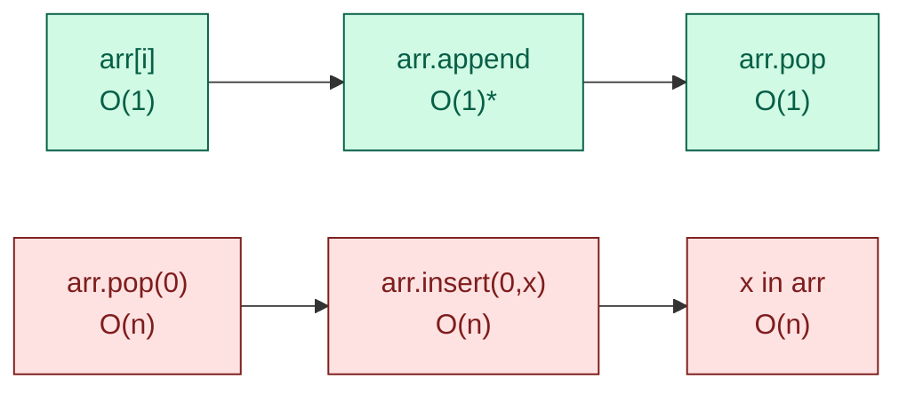
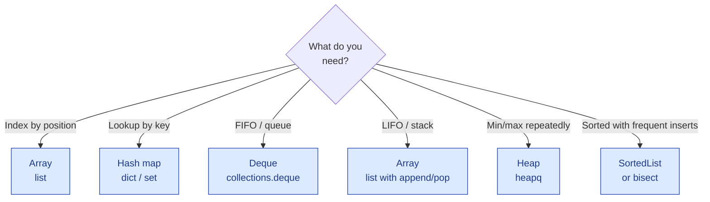

# Arrays — the basics

!!! abstract "What this chapter is"
    This is **the template** for every data-structure chapter that follows. It demonstrates the 12-part topic-page shape and the v3 progressive 5-layer problem format. If something feels under-explained anywhere in this chapter, that feedback shapes the entire bible.

    **Reading time:** 3-4 hours cover-to-cover, or 30 minutes for any single problem.

    **Prereqs:** [Foundations](../../01-foundations/index.md) — at minimum, the Python crash course and Big-O cheatsheet.

---

## Chapter map

<div class="grid cards" markdown>

-   :material-numeric-1-circle:{ .lg .middle } &nbsp; **What is an array?**

    Plain English + everyday analogy. The mental model.

-   :material-numeric-2-circle:{ .lg .middle } &nbsp; **Why do we need arrays?**

    Which problems become trivial once you have an array.

-   :material-numeric-3-circle:{ .lg .middle } &nbsp; **How arrays work internally**

    Memory layout, indexing, capacity, doubling.

-   :material-numeric-4-circle:{ .lg .middle } &nbsp; **Python implementation from scratch**

    A `DynamicArray` class with `append`, `pop`, `insert`, `remove`.

-   :material-numeric-5-circle:{ .lg .middle } &nbsp; **Time & space complexity**

    The full table for every operation, with **why**.

-   :material-numeric-6-circle:{ .lg .middle } &nbsp; **Built-in Python tools**

    `list`, `bytearray`, `array.array`, `numpy.ndarray` — when to use which.

-   :material-numeric-7-circle:{ .lg .middle } &nbsp; **When to use vs not use**

    Arrays vs linked lists vs hash sets vs deques.

-   :material-numeric-8-circle:{ .lg .middle } &nbsp; **Common mistakes & gotchas**

    The 8 traps that fail interviews.

-   :material-numeric-9-circle:{ .lg .middle } &nbsp; **Patterns this connects to**

    The 9 patterns that are mostly array work.

-   :material-numeric-10-circle:{ .lg .middle } &nbsp; **Practice problems (40)**

    Each in 5-layer progressive format with follow-ups.

-   :fontawesome-solid-microphone:{ .lg .middle } &nbsp; **How interviewers ask this**

    The verbatim phrasing patterns. What clarifying questions you should ask.

-   :material-clipboard-check:{ .lg .middle } &nbsp; **Self-check quiz**

    20 questions. If you can answer 18, you've mastered arrays.

</div>

---

## 1. What is an array?

> **Plain English:** an array is a **row of boxes**, each holding one value, lined up in memory next to each other.

Think of a row of mailboxes in an apartment building:

```
   [box 0]   [box 1]   [box 2]   [box 3]   [box 4]
     "A"       "B"       "C"       "D"       "E"
```

Each box has a fixed position (an **index**). You can jump straight to box 3 — you don't have to walk past boxes 0, 1, 2 first. That's the **defining superpower of an array: O(1) random access by index**.

In Python, the everyday array is a **list**:

```python
arr = ["A", "B", "C", "D", "E"]
print(arr[3])      # D — instant lookup
```

!!! info "The word 'array' in Python"
    Python has *several* "array-like" types:

    - **`list`** — what people mean 99% of the time. Dynamic, heterogeneous, the daily driver. **This chapter is mostly about `list`.**
    - **`tuple`** — immutable list. Same indexing rules, can't be modified.
    - **`array.array`** — typed, more memory-efficient. Rarely used in interviews.
    - **`bytearray`** / **`bytes`** — for raw bytes (file I/O, networking).
    - **`numpy.ndarray`** — for numerical computing. Fixed type, vectorized ops.

    Unless we say otherwise, **"array" = Python `list`**.

---

## 2. Why do we need arrays?

Arrays are the most-used data structure in any program. They unlock:

| If you need to… | Arrays give you |
|---|---|
| Look up the i-th item | **O(1)** |
| Walk through every item | **O(n)** with a single loop |
| Maintain insertion order | Free — that's just how arrays work |
| Sort items | One call to `arr.sort()` |
| Group + count items | Combined with hash maps, near-trivial |
| Implement other data structures | Stacks, queues, heaps are all arrays underneath |

Real systems built on arrays:

- **Image data** — a photo is a 2D array of pixels. A video is a 3D array (time × height × width).
- **Spreadsheets** — every cell is `grid[row][col]`.
- **Audio waveforms** — a 1D array of samples.
- **CSV files** — once parsed, just an array of rows.
- **Most ML training data** — one big array of examples.

If you're doing any of these in production, you are using arrays. Interviewers test arrays heavily because **everything builds on them**.

---

## 3. How arrays work internally

This is the part that makes the rest click. Skip it and the gotchas in Part 8 will feel arbitrary.

### Memory layout

When you create `arr = [10, 20, 30, 40]`, the runtime allocates a **contiguous chunk of memory** large enough to hold those four elements (plus some overhead — Python objects, capacity headroom).

```
                  base address
                       │
                       ▼
        addr:  100    104    108    112    116
              ┌─────┬─────┬─────┬─────┬─────┐
              │ 10  │ 20  │ 30  │ 40  │ ??? │   ← extra slot for growth
              └─────┴─────┴─────┴─────┴─────┘
                [0]   [1]   [2]   [3]
```

To compute the address of `arr[i]`, the runtime does:

```
address(arr[i]) = base + i × element_size
```

That's a single multiplication and addition — **constant time, regardless of how big the array is**. That's why indexing is O(1).

### Why indexing is O(1) but `pop(0)` is O(n)

If you delete `arr[0]`, every other element has to shift left by one slot:

```
Before:  [10, 20, 30, 40]
                 ↓ pop(0)
After:   [20, 30, 40]      ← 3 elements moved
```

For an array of 1 million items, `pop(0)` moves 999,999 elements. That's O(n).

Same reason `insert(0, x)` is O(n) — every existing element has to shift right.



### Dynamic arrays — the "doubling" trick

Python lists grow automatically. How? **Capacity vs length.**

- **Length** = how many items you've put in. `len(arr)`.
- **Capacity** = how many items the underlying memory chunk can hold without reallocating.

When you `append` and length == capacity, Python:
1. Allocates a **new, bigger** chunk (typically 1.125× to 2× the old capacity).
2. Copies all existing items into it.
3. Writes the new item at the end.
4. Releases the old chunk.

That copy is O(n) — but it happens *rarely*. Most appends just write to the next slot, which is O(1).

**Amortized analysis:** across n appends, the total work is O(n), so the average per-append is O(1). That's what we mean by "`append` is O(1) amortized."

!!! tip "Interview phrasing"
    If asked the complexity of `append`, say "**O(1) amortized**." If pressed, explain doubling. That single word *amortized* signals you understand what's happening underneath.

---

## 4. Python implementation from scratch

You'll never re-implement a list in production — Python's is fast and battle-tested. But interviewers ask "how does a dynamic array work internally?" This is a clean answer.

```python
from __future__ import annotations
import ctypes


class DynamicArray:
    """A toy dynamic array showing how Python's list works underneath.

    Stores Python objects in a low-level ctypes array. Doubles capacity
    when full. Real Python list grows by ~1.125x, but 2x is the classic
    teaching version and easier to analyze.
    """

    def __init__(self) -> None:
        self._n: int = 0                          # number of items stored
        self._capacity: int = 1                   # current allocated capacity
        self._arr = self._make_array(self._capacity)  # the underlying C array

    def __len__(self) -> int:
        return self._n

    def __getitem__(self, idx: int) -> object:
        if not 0 <= idx < self._n:
            raise IndexError("index out of range")
        return self._arr[idx]                     # (1)!

    def append(self, value: object) -> None:
        if self._n == self._capacity:             # (2)!
            self._resize(2 * self._capacity)
        self._arr[self._n] = value
        self._n += 1

    def pop(self) -> object:
        if self._n == 0:
            raise IndexError("pop from empty array")
        self._n -= 1
        value = self._arr[self._n]
        self._arr[self._n] = None                 # release the reference
        return value

    def insert(self, idx: int, value: object) -> None:
        if not 0 <= idx <= self._n:
            raise IndexError("index out of range")
        if self._n == self._capacity:
            self._resize(2 * self._capacity)
        for i in range(self._n, idx, -1):         # (3)!
            self._arr[i] = self._arr[i - 1]
        self._arr[idx] = value
        self._n += 1

    def remove(self, value: object) -> None:
        for i in range(self._n):
            if self._arr[i] == value:             # (4)!
                for j in range(i, self._n - 1):
                    self._arr[j] = self._arr[j + 1]
                self._arr[self._n - 1] = None
                self._n -= 1
                return
        raise ValueError("value not found")

    def _resize(self, new_capacity: int) -> None:
        new_arr = self._make_array(new_capacity)
        for i in range(self._n):
            new_arr[i] = self._arr[i]             # (5)!
        self._arr = new_arr
        self._capacity = new_capacity

    @staticmethod
    def _make_array(capacity: int):
        return (capacity * ctypes.py_object)()
```

1. **O(1)** — direct indexing into the underlying C array.
2. **The growth trigger.** When capacity is exhausted, double it. This is what makes appends O(1) amortized.
3. **Shift right** to make room at `idx`. This is the O(n) part of `insert`.
4. **First match wins.** Same semantics as Python's `list.remove`.
5. **The expensive copy** — touched n times across n appends, but only logarithmically often.

!!! example "Worked check"
    ```python
    arr = DynamicArray()
    for ch in "interview":
        arr.append(ch)
    print(len(arr))         # 9
    print(arr[3])           # 'e'
    arr.insert(0, '!')
    print(arr[0], arr[1])   # ! i
    ```

---

## 5. Time & space complexity

The table you must memorize. Every operation here is fair game for the question "what's the complexity of …?"

| Operation | Code | Time | Why |
|---|---|---|---|
| Index read | `arr[i]` | **O(1)** | direct memory access |
| Index write | `arr[i] = x` | **O(1)** | direct memory write |
| Append | `arr.append(x)` | **O(1) amortized** | doubling, see Part 3 |
| Pop last | `arr.pop()` | **O(1)** | no shifts |
| Pop first | `arr.pop(0)` | **O(n)** | shift everything left |
| Insert at i | `arr.insert(i, x)` | **O(n)** | shift right of `i` |
| Insert at 0 | `arr.insert(0, x)` | **O(n)** | shift everything |
| Remove value | `arr.remove(x)` | **O(n)** | scan + shift |
| Search | `x in arr` | **O(n)** | linear scan |
| Length | `len(arr)` | **O(1)** | length is cached |
| Slice | `arr[i:j]` | **O(j-i)** | makes a copy |
| Concat | `arr + other` | **O(n+m)** | new array |
| Repeat | `arr * k` | **O(n×k)** | new array |
| Sort | `arr.sort()` | **O(n log n)** | Timsort, in-place |
| Reverse | `arr.reverse()` | **O(n)** | swap pairs |
| Min/Max | `min(arr)` / `max(arr)` | **O(n)** | linear scan |
| Sum | `sum(arr)` | **O(n)** | linear scan |

**Space:** an array of n elements uses **O(n)** memory — actually a constant factor more, because Python lists keep extra capacity for growth (typically 1.125× to 2× the length).

!!! warning "The two killers"
    `pop(0)` and `insert(0, x)` are O(n). If your code does these in a loop, your O(n) algorithm just became O(n²). **Use `collections.deque` for FIFO behavior.**

---

## 6. Built-in Python tools

The library tools you'll reach for constantly. (Many of these are covered in [Foundations](../../01-foundations/python-stl-deep-dive.md) — this section reframes them through an array lens.)

### Constructing arrays

```python
arr = [1, 2, 3, 4]                  # literal
arr = list(range(10))               # 0..9
arr = [0] * 10                      # ten zeros
arr = list("hello")                 # ['h','e','l','l','o']
arr = [x*x for x in range(5)]       # comprehension: [0,1,4,9,16]
arr = [None] * n                    # n placeholders
```

!!! warning "The 2D-list aliasing trap"
    ```python
    grid = [[0] * 3] * 3            # ❌ all rows are the SAME list
    grid[0][0] = 1
    print(grid)                     # [[1,0,0], [1,0,0], [1,0,0]]  💥
    ```

    Use a comprehension to make independent rows:

    ```python
    grid = [[0] * 3 for _ in range(3)]   # ✅
    ```

### Iterating

```python
for x in arr: ...                          # by value
for i, x in enumerate(arr): ...            # by index + value
for i in range(len(arr)): ...              # by index only — usually verbose
for x in reversed(arr): ...                # iterate backward
for a, b in zip(arr1, arr2): ...           # iterate two arrays in lockstep
for a, b in zip(arr, arr[1:]): ...         # iterate adjacent pairs
```

### Slicing — the Swiss Army knife

```python
arr = [10, 20, 30, 40, 50]

arr[1:3]        # [20, 30]
arr[:3]         # [10, 20, 30]
arr[3:]         # [40, 50]
arr[-1]         # 50  (last)
arr[-2:]        # [40, 50]  (last two)
arr[::-1]       # [50, 40, 30, 20, 10]  (reversed copy)
arr[::2]        # [10, 30, 50]  (every other)
```

!!! tip "Slicing makes a copy"
    `arr[i:j]` is **O(j-i)** because it allocates a new list. Don't slice inside a hot loop.

### Searching

```python
3 in arr            # O(n)
arr.index(3)        # O(n) — first index of 3, raises ValueError if absent
arr.count(3)        # O(n)
```

### Mutation in place

```python
arr.append(x)
arr.extend(other)
arr.pop()             # last
arr.pop(i)            # at index i — O(n) for i != last
arr.insert(i, x)
arr.remove(x)         # first occurrence
arr.sort()            # in place
arr.reverse()         # in place
arr.clear()
```

### Building new arrays

```python
sorted(arr)                       # new sorted list
list(reversed(arr))               # new reversed list
list(filter(lambda x: x > 0, arr))
list(map(str, arr))
[x*2 for x in arr]                # comprehension is usually clearer than map
```

### Aggregations

```python
sum(arr)
min(arr) / max(arr)
len(arr)
all(arr) / any(arr)               # truthiness
```

### Other useful tools

```python
import bisect

idx = bisect.bisect_left(sorted_arr, target)   # insertion point — O(log n)
bisect.insort(sorted_arr, x)                   # insert in sorted order
```

```python
from itertools import accumulate

prefix_sums = list(accumulate(arr))            # [a0, a0+a1, a0+a1+a2, ...]
```

```python
from collections import Counter

freq = Counter(arr)                            # {value: count}
```

---

## 7. When to use vs not use

### Use an array when…

- ✅ You need **O(1) random access** by index.
- ✅ You're iterating end-to-end repeatedly.
- ✅ Order matters (insertion order, sorted order).
- ✅ You're mostly appending and reading; deletes are rare.
- ✅ The data is small/medium and fits in memory.

### Avoid arrays when…

- ❌ You need **O(1) front-insert / front-pop** → use [`deque`](../../01-foundations/python-stl-deep-dive.md).
- ❌ You need **O(1) lookup by key** → use a `dict` or `set`.
- ❌ You need **O(log n) ordered operations** with frequent inserts → use a balanced BST (rare in Python — use `bisect` on a sorted list, or `sortedcontainers.SortedList`).
- ❌ You need to merge two collections often → use a linked list (still rare in Python).
- ❌ The data is enormous and won't fit in RAM → streaming/external structures.

### Decision tree



---

## 8. Common mistakes & gotchas

These are the 8 traps that fail interviews. Internalize all of them.

!!! warning "Trap 1 — `pop(0)` in a loop"
    ```python
    while arr:
        front = arr.pop(0)         # O(n) per call → O(n²) total
        ...
    ```
    **Fix:** `from collections import deque; arr = deque(arr); arr.popleft()` is O(1).

!!! warning "Trap 2 — `in` on a list when you wanted O(1) lookup"
    ```python
    if x in big_list:              # O(n) per check
    ```
    **Fix:** convert to a set: `s = set(big_list); if x in s: ...`

!!! warning "Trap 3 — 2D list aliasing"
    ```python
    grid = [[0] * 3] * 3           # 3 references to the SAME row
    ```
    **Fix:** `grid = [[0] * 3 for _ in range(3)]`

!!! warning "Trap 4 — modifying a list while iterating"
    ```python
    for x in arr:
        if x < 0:
            arr.remove(x)          # 💥 skips items, mutates length
    ```
    **Fix:** build a new list (`arr = [x for x in arr if x >= 0]`) or iterate in reverse with index.

!!! warning "Trap 5 — slicing inside a loop"
    ```python
    for i in range(n):
        sub = arr[i:i+k]           # O(k) per iteration → O(n×k) total
    ```
    **Fix:** sliding window with two pointers — O(n) total.

!!! warning "Trap 6 — passing a list to a function and being surprised it's mutated"
    ```python
    def f(arr):
        arr.sort()                 # caller's array got sorted
    ```
    **Fix:** be explicit. Either document the mutation, or use `arr = sorted(arr)` to copy first.

!!! warning "Trap 7 — `range(len(arr))` when you don't need indices"
    ```python
    for i in range(len(arr)):
        print(arr[i])
    ```
    **Fix:** `for x in arr: print(x)`.

!!! warning "Trap 8 — confusing copy semantics"
    ```python
    a = [1, 2, 3]
    b = a            # SAME list
    b.append(4)
    print(a)         # [1, 2, 3, 4]  — surprised?
    ```
    **Fix:** `b = a.copy()` or `b = a[:]` or `b = list(a)` for shallow copy. For nested lists, use `copy.deepcopy`.

---

## 9. Patterns this connects to

Arrays are the substrate for nine of the twenty interview patterns. Master arrays and you're already fluent in:

| Pattern | Why arrays | Example problem |
|---|---|---|
| **Two pointers** | Move two indices toward each other or together | Reverse string, Two Sum (sorted) |
| **Sliding window** | Maintain a window via two indices | Longest substring, max sum subarray |
| **Prefix sums** | Build a running-total array, then range-query in O(1) | Subarray sum equals K |
| **Hash map for complement** | One pass + O(1) lookup table | Two Sum (unsorted) |
| **Sort, then scan** | Sorting unlocks a linear pass | 3Sum, merge intervals |
| **Binary search** | Sorted array → halving | Find first/last position |
| **Dutch national flag** | Three pointers partition into ≤, =, ≥ | Sort colors |
| **Cyclic sort / index marking** | Use array indices as a hash set for `[1..n]` | Find missing number |
| **Kadane's** | Linear scan with running best | Maximum subarray |

You'll meet each of these in the upcoming chapters. They all start with an array.

---

## 10. Practice problems (40)

Every problem follows the **v3 progressive 5-layer format**:

1. 📖 **Story Mode** — the problem in plain English with a tiny example.
2. 🌍 **Real-World Usage** — where this problem actually shows up.
3. 🧠 **Thinking Process** — brute → why slow → insight → optimal.
4. 🐍 **5 Layers of Solution** — Brute force → Optimized → Edge cases → Production-ready → Variants.
5. 🔍 **Dry Run** — line by line on a small input.
6. ⏱️ **Complexity** — time + space + the why.
7. 🎯 **Pattern Used** — one of the 20 patterns.
8. 🔄 **Interviewer Follow-ups** — 3-5 progressively harder variants, each fully solved.
9. 🐛 **Common Bugs** — mistakes specific to this problem.
10. ✅ **Edge Cases Checklist** — the list to mentally run through.
11. 🏢 **Sample Interviewer Quote** — what it sounds like in a real interview.

The first three problems are below. **Read them carefully** — the format you see here is what every problem in the bible follows.

---

### Problem 1 — Two Sum

<span class="diff-easy">Easy</span> <span class="company-tag">Google</span> <span class="company-tag">Amazon</span> <span class="company-tag">Meta</span> <span class="company-tag">Microsoft</span> <span class="company-tag">Adobe</span> <span class="company-tag">TCS</span>

> Given an array of integers `nums` and an integer `target`, return the indices of the two numbers such that they add up to `target`. You may assume that each input would have exactly one solution, and you may not use the same element twice.

#### 📖 Story Mode

You have a row of price tags: `[3, 5, 1, 7]`. The cashier wants to know: **which two tags add up to 8?** You scan: 3+5=8. ✓ Return their positions: `[0, 1]`.

That's it. The "trick" is: how do you find the pair *fast* — without checking every possible pair?

#### 🌍 Real-World Usage

- **Payment splitting** — finding two transactions that sum to a refund amount in fraud detection.
- **Game development** — pairing two upgrade items whose costs equal a player's budget.
- **Spreadsheets** — Excel's "find two cells that add up to X" is exactly this.
- **Recommendation systems** — matching two products whose combined price hits a discount threshold.

#### 🧠 Thinking Process

**Brute force:** check every pair.

```
for i in 0..n:
    for j in i+1..n:
        if nums[i] + nums[j] == target: return [i, j]
```

That's O(n²). For n=10⁵, that's 10¹⁰ operations — way too slow.

**The insight:** for each `nums[i]`, the value we're looking for is fixed: it's `target - nums[i]`. We just need a way to ask "have I seen `target - nums[i]` already?" in O(1).

A **hash map** answers exactly that question. Walk the array once. For each element, ask the map "have you seen the complement?" If yes, return. If no, add this element to the map. Done in O(n).

#### 🐍 5 Layers of Solution

=== "Layer 1 — Brute force"

    ```python
    def two_sum_brute(nums: list[int], target: int) -> list[int]:
        n = len(nums)
        for i in range(n):
            for j in range(i + 1, n):
                if nums[i] + nums[j] == target:
                    return [i, j]
        return []
    ```

    - Correct, simple. **O(n²) time**, **O(1) space**.
    - Use this in your first 30 seconds of an interview to confirm you understand the problem.

=== "Layer 2 — Optimized (one-pass hash map)"

    ```python
    def two_sum(nums: list[int], target: int) -> list[int]:
        seen: dict[int, int] = {}            # value → index
        for i, num in enumerate(nums):
            complement = target - num
            if complement in seen:
                return [seen[complement], i]
            seen[num] = i
        return []
    ```

    - **O(n) time**, **O(n) space**.
    - One pass. Each element does one O(1) lookup, then one O(1) insert.

=== "Layer 3 — Edge-case-hardened"

    ```python
    def two_sum(nums: list[int], target: int) -> list[int]:
        if nums is None or len(nums) < 2:
            return []
        seen: dict[int, int] = {}
        for i, num in enumerate(nums):
            complement = target - num
            if complement in seen:
                return [seen[complement], i]
            seen[num] = i                    # only AFTER the lookup
        return []
    ```

    The order matters — `seen[num] = i` must come **after** the lookup. Otherwise `nums = [3], target = 6` would falsely match `3+3` using one element twice.

=== "Layer 4 — Production-ready"

    ```python
    from __future__ import annotations


    def two_sum(nums: list[int], target: int) -> list[int]:
        """Return indices [i, j] such that nums[i] + nums[j] == target.

        Args:
            nums: Non-null list of integers. May be empty.
            target: Desired sum.

        Returns:
            A list [i, j] with i < j and nums[i] + nums[j] == target.
            Returns [] if no such pair exists.

        Time:  O(n).  Single pass over nums.
        Space: O(n).  Hash map of values seen.

        Example:
            >>> two_sum([3, 5, 1, 7], 8)
            [0, 1]
            >>> two_sum([], 0)
            []
        """
        if not nums or len(nums) < 2:
            return []

        seen: dict[int, int] = {}
        for i, num in enumerate(nums):
            complement = target - num
            if complement in seen:
                return [seen[complement], i]
            seen[num] = i
        return []
    ```

=== "Layer 5 — Variants"

    **Variant A — sorted input:** if the array is already sorted, you can do it with two pointers in O(n) time and **O(1) space** (no hash map):

    ```python
    def two_sum_sorted(nums: list[int], target: int) -> list[int]:
        left, right = 0, len(nums) - 1
        while left < right:
            s = nums[left] + nums[right]
            if s == target: return [left, right]
            if s < target:  left += 1
            else:           right -= 1
        return []
    ```

    **Variant B — return all pairs:** modify Layer 2 to keep collecting pairs instead of returning on the first match. Watch out for duplicates.

    **Variant C — count of pairs:** `from collections import Counter; freq = Counter(nums)`; for each `x in freq`, add `freq[x] * freq[target - x]` if `x != target - x`, else `freq[x] * (freq[x] - 1) // 2`. O(n).

#### 🔍 Dry Run

`nums = [3, 5, 1, 7], target = 8` (Layer 2 code):

| i | num | complement | `complement in seen`? | seen after |
|---|-----|------------|-----------------------|------------|
| 0 | 3 | 5 | no | `{3: 0}` |
| 1 | 5 | 3 | **yes (at index 0)** → return `[0, 1]` | — |

Output: `[0, 1]`. ✅

Edge case `nums = [3, 3], target = 6`:

| i | num | complement | `complement in seen`? | seen after |
|---|-----|------------|-----------------------|------------|
| 0 | 3 | 3 | no | `{3: 0}` |
| 1 | 3 | 3 | **yes (at index 0)** → return `[0, 1]` | — |

Output: `[0, 1]`. ✅ Caught because we check **before** adding.

#### ⏱️ Complexity

- **Time: O(n)** — one pass; each iteration does O(1) hash ops.
- **Space: O(n)** — the `seen` map can hold up to n entries.

#### 🎯 Pattern Used

**Hash map for complement.** This is the canonical example. Whenever you see "find a pair of items whose `f(a, b)` equals X," ask yourself: can I derive what I'm looking for from each item, then look it up in a map?

#### 🔄 Interviewer Follow-ups

??? question "Follow-up 1 — What if the array has 10⁹ elements and doesn't fit in memory?"
    Stream the input. The hash map can still hold 10⁹ entries if RAM allows. If it doesn't:

    - **Sort externally**, then two-pointer — O(n log n) time, O(1) extra memory but O(n) disk reads.
    - Or use a **probabilistic structure** (Bloom filter) to quickly reject non-complements, falling back to disk only when the filter says "maybe."

??? question "Follow-up 2 — What if there are multiple valid pairs and we want all of them?"
    Modify the loop to collect, not return:

    ```python
    def two_sum_all(nums: list[int], target: int) -> list[list[int]]:
        seen: dict[int, list[int]] = {}
        result: list[list[int]] = []
        for i, num in enumerate(nums):
            complement = target - num
            if complement in seen:
                for j in seen[complement]:
                    result.append([j, i])
            seen.setdefault(num, []).append(i)
        return result
    ```

    Now `seen` maps each value to the **list** of its indices, and we emit a pair for every prior occurrence.

??? question "Follow-up 3 — What if we need three numbers that sum to target (3Sum)?"
    Sort the array, then for each `i`, do a two-pointer scan on the rest. **O(n²)** time, **O(1)** extra space (ignoring the sort). Watch for duplicate triplets — skip equal neighbors.

??? question "Follow-up 4 — What if the array has negative numbers and zeros?"
    The hash-map solution handles them perfectly — there's no assumption of positivity. The two-pointer variant requires a sorted array, which can include negatives and zeros without modification.

??? question "Follow-up 5 — What if `target` overflows in Java/C++?"
    Not a concern in Python (arbitrary precision). In Java/C++, use `long` or check with subtraction: `if (seen.containsKey(target - num))` works as long as `target - num` doesn't overflow. For safety, use `long target` from the start.

#### 🐛 Common Bugs

1. **Adding to `seen` before checking** — produces self-pairs like `[1, 1]` for a single element.
2. **Returning indices in the wrong order** — `[i, seen[complement]]` instead of `[seen[complement], i]`. Convention is the earlier index first.
3. **Using a `set` instead of a `dict`** — a set tells you the value exists but not its index.
4. **Quadratic loop disguised as one-liner** — `[i for i in range(n) for j in range(n) if nums[i]+nums[j]==target]` is still O(n²) with extra Python overhead.
5. **Mutating `nums`** — sorting in place changes the indices the caller expected.

#### ✅ Edge Cases Checklist

- [ ] Empty array → return `[]`
- [ ] Single element → return `[]` (need two)
- [ ] Two elements summing to target → return `[0, 1]`
- [ ] No valid pair → return `[]`
- [ ] Duplicates: `[3, 3], target=6` → return `[0, 1]`, not `[0, 0]`
- [ ] Negatives: `[-3, 4, 3, 90], target=0` → return `[0, 2]`
- [ ] Zeros: `[0, 4, 0], target=0` → return `[0, 2]`

#### 🏢 Sample Interviewer Quote

> *"Given an array of integers and a target, return the indices of two numbers that add up to the target. There's exactly one solution, and you can't use the same element twice. Walk me through your approach before you code."*

Your opener: *"I'd start with the brute O(n²) to confirm I understand. The trick to do better: for each element, the missing piece is fixed — `target - num`. If I keep a hash map of values I've seen, I can ask 'have I seen the complement?' in O(1). One pass, O(n) time, O(n) space. Let me code it."*

---

### Problem 2 — Best Time to Buy and Sell Stock

<span class="diff-easy">Easy</span> <span class="company-tag">Amazon</span> <span class="company-tag">Meta</span> <span class="company-tag">Apple</span> <span class="company-tag">Bloomberg</span> <span class="company-tag">Adobe</span>

> You're given an array `prices` where `prices[i]` is the price of a stock on day `i`. You want to maximize profit by choosing a single day to buy and a different day in the future to sell. Return the maximum profit you can achieve. If you can't profit, return 0.

#### 📖 Story Mode

`prices = [7, 1, 5, 3, 6, 4]`. The best move: buy on day 1 (price = 1), sell on day 4 (price = 6). Profit = 5.

You can't sell before you buy. So for any "sell day" `j`, the best buy is the *minimum price seen so far* in days `0..j-1`.

#### 🌍 Real-World Usage

- **Trading bots** — the simplest version of "best entry/exit" on a single position.
- **A/B testing** — finding the lowest baseline metric and the peak after a change.
- **Energy markets** — optimal time to charge a battery (low price) and discharge (high price).
- **Inventory** — buying raw materials at the cheapest moment for resale.

#### 🧠 Thinking Process

**Brute force:** for every pair `(i, j)` with `i < j`, compute `prices[j] - prices[i]` and track the max. O(n²).

**The insight:** for each day `j` you might sell, the best buy day is whichever earlier day had the **lowest price**. So as we walk left-to-right, just keep track of the **minimum price seen so far**. At each step, "what if I sold today?" = `prices[j] - min_so_far`. Keep the best.

That's one linear pass.

#### 🐍 5 Layers of Solution

=== "Layer 1 — Brute force"

    ```python
    def max_profit_brute(prices: list[int]) -> int:
        best = 0
        for i in range(len(prices)):
            for j in range(i + 1, len(prices)):
                best = max(best, prices[j] - prices[i])
        return best
    ```

    O(n²). For n=10⁵, this times out.

=== "Layer 2 — Optimized (one pass)"

    ```python
    def max_profit(prices: list[int]) -> int:
        min_so_far = float('inf')
        best = 0
        for price in prices:
            if price < min_so_far:
                min_so_far = price
            elif price - min_so_far > best:
                best = price - min_so_far
        return best
    ```

    **O(n) time, O(1) space.**

=== "Layer 3 — Edge-case-hardened"

    ```python
    def max_profit(prices: list[int]) -> int:
        if not prices or len(prices) < 2:
            return 0

        min_so_far = prices[0]
        best = 0
        for price in prices[1:]:
            best = max(best, price - min_so_far)
            min_so_far = min(min_so_far, price)
        return best
    ```

    Initializing `min_so_far = prices[0]` is cleaner than `float('inf')` and reads more naturally.

=== "Layer 4 — Production-ready"

    ```python
    from __future__ import annotations


    def max_profit(prices: list[int]) -> int:
        """Return the maximum profit from a single buy-sell pair.

        Args:
            prices: Daily prices indexed by day. May be empty.

        Returns:
            Max profit from buying on some day i and selling on some
            day j > i. 0 if no profitable pair exists.

        Time:  O(n) single pass.
        Space: O(1).
        """
        if not prices or len(prices) < 2:
            return 0

        min_so_far = prices[0]
        best = 0
        for price in prices[1:]:
            best = max(best, price - min_so_far)
            min_so_far = min(min_so_far, price)
        return best
    ```

=== "Layer 5 — Variants"

    **Variant A — also return the buy/sell indices:**

    ```python
    def max_profit_with_days(prices: list[int]) -> tuple[int, int, int]:
        if len(prices) < 2: return (0, -1, -1)
        min_idx = 0
        best, buy_idx, sell_idx = 0, -1, -1
        for j in range(1, len(prices)):
            if prices[j] - prices[min_idx] > best:
                best = prices[j] - prices[min_idx]
                buy_idx, sell_idx = min_idx, j
            if prices[j] < prices[min_idx]:
                min_idx = j
        return (best, buy_idx, sell_idx)
    ```

    **Variant B — multiple transactions allowed (LeetCode 122):** sum up every positive `prices[i+1] - prices[i]`. The intuition: every up-day is a profit you'd capture by buying yesterday and selling today.

    ```python
    def max_profit_multi(prices: list[int]) -> int:
        return sum(max(0, b - a) for a, b in zip(prices, prices[1:]))
    ```

    **Variant C — at most k transactions:** dynamic programming, `O(n × k)` time. Out of scope here; covered in the DP chapter.

#### 🔍 Dry Run

`prices = [7, 1, 5, 3, 6, 4]` (Layer 3 code):

| price | min_so_far before | profit if sold today | best after | min_so_far after |
|-------|-------------------|----------------------|------------|------------------|
| (7) start | — | — | 0 | 7 |
| 1 | 7 | -6 (negative, ignored) | 0 | 1 |
| 5 | 1 | 4 | 4 | 1 |
| 3 | 1 | 2 | 4 | 1 |
| 6 | 1 | 5 | **5** | 1 |
| 4 | 1 | 3 | 5 | 1 |

Output: 5. ✅ (Buy on day 1 at price 1, sell on day 4 at price 6.)

#### ⏱️ Complexity

- **Time: O(n)** — single pass.
- **Space: O(1)** — two scalars.

#### 🎯 Pattern Used

**Single-pass scan with running minimum (or running max).** A sub-pattern of *Kadane-style* DP — the answer at step `j` only needs the best info from steps `0..j-1`, which we summarize in one variable.

#### 🔄 Interviewer Follow-ups

??? question "Follow-up 1 — What if the array is empty or has one element?"
    Return 0. You need at least 2 days to buy *and* sell.

??? question "Follow-up 2 — What if all prices are decreasing?"
    `prices = [9, 7, 4, 1]`. No profitable pair exists. We return 0 because `best` is initialized to 0 and never updates.

??? question "Follow-up 3 — Can you also return the buy/sell indices?"
    See Variant A above.

??? question "Follow-up 4 — Multiple transactions allowed (buy, sell, buy, sell, …)."
    Greedy: capture every upward move. See Variant B. Time O(n), space O(1).

??? question "Follow-up 5 — At most 2 transactions?"
    Classic DP: maintain four states (`buy1`, `sell1`, `buy2`, `sell2`) and update them in one pass. **O(n) time, O(1) space.** This is "LeetCode 123: Best Time to Buy and Sell Stock III." Out of scope here.

#### 🐛 Common Bugs

1. **Initializing `best` to a negative number** (e.g., `float('-inf')`). The problem says return 0 if no profit is possible, so use `best = 0`.
2. **Updating `min_so_far` before computing today's profit** — that lets you "buy and sell on the same day" if today is both the min and the new max.
3. **Using two nested loops out of habit** — interviewers spot this immediately.
4. **Off-by-one** when initializing — if you start the loop at index 0 with `min_so_far = float('inf')`, your first iteration computes `0 - inf` which is fine but ugly. Starting from index 1 with `min_so_far = prices[0]` is cleaner.

#### ✅ Edge Cases Checklist

- [ ] Empty array → return 0
- [ ] One element → return 0
- [ ] Strictly decreasing → return 0
- [ ] Strictly increasing → return `prices[-1] - prices[0]`
- [ ] All same → return 0
- [ ] Two elements: profitable → positive number; not → 0
- [ ] Very large values — Python ints handle it; in Java, watch overflow

#### 🏢 Sample Interviewer Quote

> *"You have an array of stock prices, one per day. Buy once, sell once, buy must come before sell. What's the most you can make? Walk me through your approach."*

Your opener: *"Brute force is O(n²): every pair. The key observation is, for each potential sell day, the best buy is the minimum price before it. So I'll walk left-to-right, keeping a running minimum. At each day, 'profit if I sell today' = `price - min_so_far`. Track the max of those. O(n) time, O(1) space."*

---

### Problem 3 — Move Zeroes

<span class="diff-easy">Easy</span> <span class="company-tag">Meta</span> <span class="company-tag">Amazon</span> <span class="company-tag">Microsoft</span> <span class="company-tag">Apple</span> <span class="company-tag">Bloomberg</span>

> Given an integer array `nums`, move all `0`s to the end of it while maintaining the relative order of the non-zero elements. **Do this in-place** without making a copy.

#### 📖 Story Mode

`nums = [0, 1, 0, 3, 12]` → `[1, 3, 12, 0, 0]`.

The non-zeros (`1, 3, 12`) keep their order. Zeros pile up at the end. **In-place** means O(1) extra memory — you can't allocate a new array.

#### 🌍 Real-World Usage

- **Sparse-matrix compaction** — pushing zero entries out so non-zero entries are contiguous.
- **Image processing** — sliding pixels in a row to remove transparent ones.
- **Game inventories** — moving empty slots to the end after a player drops items.
- **Database compaction** — deleting tombstoned rows by shifting live rows forward.

#### 🧠 Thinking Process

**Brute force:** allocate a new array, copy non-zeros first, then zeros. O(n) time, **O(n) space**. The problem rules this out — must be in-place.

**The insight:** use **two pointers** on the same array. A `write` pointer marks "where the next non-zero goes." A `read` pointer scans through. Whenever `read` finds a non-zero, swap it into position `write` and advance both. Zeros are left behind, then a final pass fills the tail with zeros (or we use a swap so zeros automatically end up there).

This is the **two-pointer write-index pattern** — extremely common in array problems.

#### 🐍 5 Layers of Solution

=== "Layer 1 — Brute force (not in-place)"

    ```python
    def move_zeroes_brute(nums: list[int]) -> None:
        non_zeros = [x for x in nums if x != 0]
        zeros = [0] * (len(nums) - len(non_zeros))
        nums[:] = non_zeros + zeros           # mutate in place but used O(n) extra
    ```

    Correct output, but O(n) extra space. Useful as a sanity check.

=== "Layer 2 — Two-pass in-place"

    ```python
    def move_zeroes(nums: list[int]) -> None:
        write = 0
        # pass 1: copy non-zeros forward
        for read in range(len(nums)):
            if nums[read] != 0:
                nums[write] = nums[read]
                write += 1
        # pass 2: fill the tail with zeros
        for i in range(write, len(nums)):
            nums[i] = 0
    ```

    O(n) time, O(1) space. Two passes. Simple and correct.

=== "Layer 3 — Single-pass with swap"

    ```python
    def move_zeroes(nums: list[int]) -> None:
        write = 0
        for read in range(len(nums)):
            if nums[read] != 0:
                nums[write], nums[read] = nums[read], nums[write]
                write += 1
    ```

    One pass. The swap automatically pushes zeros toward the back as `read` scans. Slightly more elegant; same complexity.

=== "Layer 4 — Production-ready"

    ```python
    from __future__ import annotations


    def move_zeroes(nums: list[int]) -> None:
        """Move all zeros to the end of nums in place, preserving the
        relative order of non-zero elements.

        Args:
            nums: List to mutate in place. May be empty.

        Time:  O(n).  Single pass with two pointers.
        Space: O(1).  In-place, no auxiliary array.

        Example:
            >>> nums = [0, 1, 0, 3, 12]
            >>> move_zeroes(nums)
            >>> nums
            [1, 3, 12, 0, 0]
        """
        if not nums:
            return

        write = 0
        for read in range(len(nums)):
            if nums[read] != 0:
                nums[write], nums[read] = nums[read], nums[write]
                write += 1
    ```

=== "Layer 5 — Variants"

    **Variant A — move zeros to the front instead:**

    ```python
    def move_zeroes_to_front(nums: list[int]) -> None:
        write = len(nums) - 1
        for read in range(len(nums) - 1, -1, -1):
            if nums[read] != 0:
                nums[write], nums[read] = nums[read], nums[write]
                write -= 1
    ```

    Symmetric — scan right-to-left.

    **Variant B — move all instances of a target value to the end:**

    Replace `if nums[read] != 0` with `if nums[read] != target`. Same idea.

    **Variant C — partition by predicate:** classic Dutch-flag-style. Move all elements for which `pred(x)` is True to the front.

#### 🔍 Dry Run

`nums = [0, 1, 0, 3, 12]` (Layer 3 code):

| read | nums[read] | nums[write] before | swap? | nums after | write after |
|------|------------|---------------------|-------|------------|-------------|
| 0 | 0 | nums[0]=0 | no | [0,1,0,3,12] | 0 |
| 1 | 1 | nums[0]=0 | yes (swap [0]↔[1]) | [1,0,0,3,12] | 1 |
| 2 | 0 | nums[1]=0 | no | [1,0,0,3,12] | 1 |
| 3 | 3 | nums[1]=0 | yes (swap [1]↔[3]) | [1,3,0,0,12] | 2 |
| 4 | 12 | nums[2]=0 | yes (swap [2]↔[4]) | [1,3,12,0,0] | 3 |

Final: `[1, 3, 12, 0, 0]`. ✅

#### ⏱️ Complexity

- **Time: O(n)** — single pass.
- **Space: O(1)** — two index variables, no allocation.

#### 🎯 Pattern Used

**Two pointers (read/write).** Used whenever you need to "compact" an array in-place by some predicate — keep elements that pass, drop those that don't, preserve order.

This is the same pattern as `remove_element`, `remove_duplicates_from_sorted_array`, and `partition` in quicksort.

#### 🔄 Interviewer Follow-ups

??? question "Follow-up 1 — What's the minimum number of writes?"
    Layer 2 (two-pass copy + fill) does exactly `n` writes. Layer 3 (swap) does `2 × non_zero_count` writes (each non-zero is swapped, and the swap touches both slots). If non-zeros are rare, Layer 3 is fewer writes.

    If writes are *very* expensive (e.g., flash storage with limited write cycles), prefer Layer 2 only when the tail is mostly zeros (then you're filling many zeros, but they're already zero so the writes are wasted) — actually, optimize differently: skip writes where `nums[i]` is already 0 in the fill phase.

??? question "Follow-up 2 — Preserve order of zeros too (i.e., stable both ways)?"
    For zeros, "preserving relative order" is meaningless — zero == zero. So our solution is already correct. If you needed to preserve, say, two distinct zero-tagged objects, you'd need a second pass tracking original indices.

??? question "Follow-up 3 — In a linked list instead of an array?"
    Walk once, splicing non-zero nodes into a "non-zero" list and zero nodes into a "zero" list. Concatenate at the end. O(n) time, O(1) extra space.

??? question "Follow-up 4 — Streaming version: data arrives one element at a time?"
    You can't "move" what you haven't received. Buffer non-zeros into one queue and zeros into another; emit the non-zero queue first when the stream ends, then the zero queue.

??? question "Follow-up 5 — Move zeros while also computing some statistic (e.g., count of moves)?"
    Easy: increment a counter inside the swap branch.

#### 🐛 Common Bugs

1. **Forgetting `nums[write] = 0` in the two-pass version** — the tail still has the old values.
2. **Using `nums = ...` instead of `nums[:] = ...`** — that rebinds the local variable but doesn't mutate the caller's list.
3. **Incrementing `write` for zeros** — destroys the read/write invariant.
4. **Counting zeros and rebuilding** — that's not in-place.
5. **Using `nums.remove(0)` in a loop** — O(n²) and modifies length.

#### ✅ Edge Cases Checklist

- [ ] Empty array → no-op
- [ ] All zeros → array unchanged (still all zeros)
- [ ] No zeros → array unchanged
- [ ] One element (zero or non-zero) → no-op
- [ ] Zeros at the start: `[0, 0, 1, 2]` → `[1, 2, 0, 0]`
- [ ] Zeros at the end: `[1, 2, 0, 0]` → unchanged
- [ ] Alternating: `[0, 1, 0, 1]` → `[1, 1, 0, 0]`

#### 🏢 Sample Interviewer Quote

> *"Move all zeros in this array to the end, in place, preserving the relative order of the non-zeros. What's your strategy? What's the complexity?"*

Your opener: *"I'll use a two-pointer write-index. The `write` pointer marks where the next non-zero should go. The `read` pointer scans the array. When `read` hits a non-zero, swap it into the write slot and advance write. Single pass, O(n) time, O(1) space."*

---

### Problem 4 — Contains Duplicate

<span class="diff-easy">Easy</span> &nbsp; <span class="company-tag">Amazon</span> <span class="company-tag">Google</span> <span class="company-tag">Microsoft</span> <span class="company-tag">Apple</span>

> Given an array of integers, return `True` if any value appears at least twice, else `False`.

#### 📖 Story Mode

You're a teacher checking attendance. If any student's name appears twice on the sign-in sheet, someone signed in for an absent friend. Spot the duplicate.

```text
nums = [1, 2, 3, 1]   →  True   (1 appears twice)
nums = [1, 2, 3, 4]   →  False
```

#### 🌍 Real-World Usage

- **Login systems** — checking if a username already exists.
- **Ticketing** — preventing double-booking the same seat.
- **Database UNIQUE constraint enforcement** at the application layer.
- **Plagiarism detection** — fingerprint comparison.

#### 🧠 Thinking Process

Compare every pair? O(n²). Slow. The trick: as we walk the array, **remember what we've seen.** If we see something twice, we're done. A hash set gives O(1) membership checks → O(n) total.

#### 🐍 5 Layers

=== "Layer 1 — Brute force"

    ```python
    def contains_duplicate(nums: list[int]) -> bool:
        for i in range(len(nums)):
            for j in range(i + 1, len(nums)):
                if nums[i] == nums[j]:
                    return True
        return False
    ```

    O(n²). Times out for n ≥ 10⁴.

=== "Layer 2 — Sort first"

    ```python
    def contains_duplicate(nums: list[int]) -> bool:
        nums = sorted(nums)
        for i in range(1, len(nums)):
            if nums[i] == nums[i - 1]:
                return True
        return False
    ```

    O(n log n) time, O(n) space (the sorted copy). Better — but still not optimal.

=== "Layer 3 — Hash set (optimal)"

    ```python
    def contains_duplicate(nums: list[int]) -> bool:
        seen: set[int] = set()
        for x in nums:
            if x in seen:
                return True
            seen.add(x)
        return False
    ```

    O(n) time, O(n) space. **This is the answer.**

=== "Layer 4 — One-liner"

    ```python
    def contains_duplicate(nums: list[int]) -> bool:
        return len(set(nums)) != len(nums)
    ```

    Same complexity. Tiny and readable. In an interview, write Layer 3 first (shows you understand), then mention this as a Pythonic alternative.

=== "Layer 5 — Variant: 'k-distance duplicates'"

    ```python
    def contains_nearby_duplicate(nums: list[int], k: int) -> bool:
        """True if there are i, j with nums[i] == nums[j] and |i - j| <= k."""
        seen: dict[int, int] = {}
        for i, x in enumerate(nums):
            if x in seen and i - seen[x] <= k:
                return True
            seen[x] = i
        return False
    ```

    LeetCode 219. The hash now stores **the most recent index**. Sliding-window flavor.

#### 🔍 Dry Run

`nums = [1, 2, 3, 1]`

| Step | x | seen before | duplicate? | seen after |
|---|---|---|---|---|
| 1 | 1 | {} | no | {1} |
| 2 | 2 | {1} | no | {1, 2} |
| 3 | 3 | {1, 2} | no | {1, 2, 3} |
| 4 | 1 | {1, 2, 3} | **yes** → return True | — |

#### ⏱️ Complexity

| | Time | Space |
|---|---|---|
| Brute | O(n²) | O(1) |
| Sort | O(n log n) | O(n) |
| Hash set | **O(n)** | **O(n)** |

#### 🎯 Pattern Used

**Hash set for membership.** The most reusable trick in array problems — "have I seen this before?"

#### 🔄 Interviewer Follow-ups

??? question "Follow-up 1 — What if memory is tight and you can't use O(n) space?"

    Sort in place: O(n log n) time, O(1) extra. Trade time for space.

??? question "Follow-up 2 — Find any one duplicate (not just whether one exists)."

    Same loop, but `return x` instead of `return True`.

??? question "Follow-up 3 — Find ALL duplicates."

    ```python
    def find_duplicates(nums: list[int]) -> list[int]:
        seen, dups = set(), []
        for x in nums:
            if x in seen:
                dups.append(x)
            seen.add(x)
        return dups
    ```

    O(n) / O(n).

??? question "Follow-up 4 — Stream version (numbers arrive one at a time, can't store all)."

    Bloom filter. Probabilistic — small false-positive rate, no false negatives. O(1) per element, sub-linear space.

??? question "Follow-up 5 — Duplicates within distance k AND value diff ≤ t (LeetCode 220)."

    Bucket-sort by value into buckets of width `t+1`; check current bucket and neighbors. O(n).

#### 🐛 Common Bugs

- Adding to `seen` **before** the check → every element looks duplicate.
- Using a `list` instead of a `set` for `seen` → O(n²) sneak-attack.

#### ✅ Edge Cases Checklist

- Empty array → False.
- Single element → False.
- All same → True.
- Negative numbers, very large numbers → hash handles all.

#### 🏢 Sample Interviewer Quote

> *"Given an integer array, decide whether any number appears more than once. Optimize for time."*

Your opener: *"Hash set, single pass. O(n) time, O(n) space. The Pythonic one-liner is `len(set(nums)) != len(nums)`, but I'll write the explicit loop first."*

---

### Problem 5 — Remove Duplicates from Sorted Array

<span class="diff-easy">Easy</span> &nbsp; <span class="company-tag">Amazon</span> <span class="company-tag">Microsoft</span> <span class="company-tag">Bloomberg</span> <span class="company-tag">Adobe</span>

> Given a **sorted** array, remove duplicates **in place** so each value appears once. Return the new length `k`. The first `k` slots of `nums` should hold the unique values.

#### 📖 Story Mode

You have a sorted guest list with some names written twice in a row. You can't allocate a new list — you have to compress duplicates inside the same notebook, in place.

```text
nums = [1, 1, 2]         →  k = 2,  nums[:2] = [1, 2]
nums = [0,0,1,1,1,2,2,3] →  k = 4,  nums[:4] = [0, 1, 2, 3]
```

#### 🌍 Real-World Usage

- **Database compaction** — merging consecutive equal rows after a sort.
- **Log deduplication** — collapsing repeated identical events in time-ordered logs.
- **Audio sample run-length encoding** input prep.

#### 🧠 Thinking Process

Sorted means **duplicates sit next to each other.** We don't need a hash. Use **two pointers**: `write` says "where the next unique value goes," `read` scans the array. Whenever `nums[read] != nums[write - 1]`, we've found a new unique value — write it.

#### 🐍 5 Layers

=== "Layer 1 — Brute (extra space)"

    ```python
    def remove_duplicates(nums: list[int]) -> int:
        unique = []
        for x in nums:
            if not unique or unique[-1] != x:
                unique.append(x)
        nums[:] = unique + nums[len(unique):]
        return len(unique)
    ```

    Works but uses O(n) extra. The problem asks for in-place.

=== "Layer 2 — Two pointers (optimal)"

    ```python
    def remove_duplicates(nums: list[int]) -> int:
        if not nums:
            return 0
        write = 1
        for read in range(1, len(nums)):
            if nums[read] != nums[read - 1]:
                nums[write] = nums[read]
                write += 1
        return write
    ```

    O(n) time, O(1) space.

=== "Layer 3 — Edge-case hardened"

    ```python
    def remove_duplicates(nums: list[int]) -> int:
        if not nums:
            return 0
        write = 1
        for read in range(1, len(nums)):
            if nums[read] != nums[write - 1]:    # compare to last written, safer
                nums[write] = nums[read]
                write += 1
        return write
    ```

    Comparing to `nums[write - 1]` (last unique) is more robust than `nums[read - 1]` (last seen) — same result on sorted input, but clearer intent.

=== "Layer 4 — Production-ready"

    ```python
    def remove_duplicates(nums: list[int]) -> int:
        """Compact a sorted list in place; return count of unique elements.

        Time:  O(n)
        Space: O(1)
        """
        if not nums:
            return 0
        write = 1
        for read in range(1, len(nums)):
            if nums[read] != nums[write - 1]:
                nums[write] = nums[read]
                write += 1
        return write
    ```

=== "Layer 5 — Variant: allow each value at most TWICE"

    ```python
    def remove_duplicates_at_most_twice(nums: list[int]) -> int:
        write = 0
        for x in nums:
            if write < 2 or x != nums[write - 2]:
                nums[write] = x
                write += 1
        return write
    ```

    LeetCode 80. Generalizes to "at most k" by replacing `2` with `k`.

#### 🔍 Dry Run

`nums = [1, 1, 2, 3, 3]`

| read | nums[read] | nums[write-1] | new? | write after | nums |
|---|---|---|---|---|---|
| 1 | 1 | 1 | no | 1 | [1,1,2,3,3] |
| 2 | 2 | 1 | yes | 2 | [1,2,2,3,3] |
| 3 | 3 | 2 | yes | 3 | [1,2,3,3,3] |
| 4 | 3 | 3 | no | 3 | [1,2,3,3,3] |

Return 3. First 3 slots = `[1, 2, 3]`. ✅

#### ⏱️ Complexity

| | Time | Space |
|---|---|---|
| Extra-space | O(n) | O(n) |
| Two-pointer | **O(n)** | **O(1)** |

#### 🎯 Pattern Used

**Two pointers — same direction (read/write).** The "compaction" archetype: move good elements forward, leave the rest behind.

#### 🔄 Interviewer Follow-ups

??? question "Follow-up 1 — What if the array is unsorted?"

    Either sort first (O(n log n)) or use a hash set (O(n) time + O(n) space). The "in-place O(1) space" guarantee depends on the sorted property.

??? question "Follow-up 2 — Allow each value at most k times."

    Generalized Layer 5: `if write < k or x != nums[write - k]: ...`

??? question "Follow-up 3 — Remove a specific value (LeetCode 27)."

    Same write/read pointer pattern; condition becomes `if nums[read] != val`.

??? question "Follow-up 4 — Why does the problem return an int, not a new list?"

    Modeled after C/C++ `std::unique` semantics — the caller passes a buffer and uses the returned length to bound iteration. Common when you can't allocate.

??? question "Follow-up 5 — Stable removal of duplicates from an UNSORTED array, preserving first occurrence."

    Hash set + two pointers: track `seen`, skip already-seen, write the rest. O(n) / O(n).

#### 🐛 Common Bugs

- Initializing `write = 0` and then comparing to `nums[write - 1]` (negative index!) — start `write = 1`.
- Forgetting to handle empty array → `len(nums)` access on empty input.
- Returning `nums` instead of `write` — the API explicitly wants the length.

#### ✅ Edge Cases Checklist

- Empty → return 0.
- Length 1 → return 1 (no duplicates possible).
- All same value → return 1.
- All unique → return `len(nums)`, array unchanged.

#### 🏢 Sample Interviewer Quote

> *"This array is sorted. Compress duplicates in place and return the new logical length. Don't allocate a second array."*

Your opener: *"Two pointers, both moving right. `write` tracks where the next unique value goes; `read` scans. Whenever `nums[read]` differs from the last written value, I copy and advance `write`. O(n) time, O(1) space."*

---

### Problem 6 — Single Number

<span class="diff-easy">Easy</span> &nbsp; <span class="company-tag">Amazon</span> <span class="company-tag">Google</span> <span class="company-tag">Palantir</span>

> Every element appears **twice** except for one. Find that one. Constraint: O(n) time, O(1) space.

#### 📖 Story Mode

A pile of socks: every sock has a partner except one. Find the lonely sock without sorting and without a notebook.

```text
nums = [2, 2, 1]         →  1
nums = [4, 1, 2, 1, 2]   →  4
```

#### 🌍 Real-World Usage

- **Error detection in data streams** — XOR is the basis of parity bits and RAID-5.
- **Finding the corrupted packet** when every packet is acknowledged twice except one.
- **Memory-checksumming** — XOR of all bytes should be 0 if data is intact.

#### 🧠 Thinking Process

Hash counts? O(n) space — disqualified. Sort? O(n log n) — disqualified.

The trick is **XOR**. XOR has three magical properties:

1. `x ^ x = 0` (anything XOR'd with itself cancels).
2. `x ^ 0 = x` (zero is the identity).
3. XOR is commutative + associative — order doesn't matter.

So XOR-ing every element together makes the duplicates pair-cancel, leaving only the unique one.

#### 🐍 5 Layers

=== "Layer 1 — Hash count"

    ```python
    from collections import Counter

    def single_number(nums: list[int]) -> int:
        counts = Counter(nums)
        for x, c in counts.items():
            if c == 1:
                return x
        return -1   # unreachable per problem
    ```

    O(n) time, O(n) space. Fails the space constraint.

=== "Layer 2 — Math trick"

    ```python
    def single_number(nums: list[int]) -> int:
        return 2 * sum(set(nums)) - sum(nums)
    ```

    `2*(unique sum) - (full sum) = single`. Cute. Still O(n) space (the set).

=== "Layer 3 — XOR (optimal)"

    ```python
    def single_number(nums: list[int]) -> int:
        result = 0
        for x in nums:
            result ^= x
        return result
    ```

    O(n) time, **O(1) space**. The textbook answer.

=== "Layer 4 — One-liner"

    ```python
    from functools import reduce
    from operator import xor

    def single_number(nums: list[int]) -> int:
        return reduce(xor, nums, 0)
    ```

=== "Layer 5 — Variant: 'every element appears 3 times except one'"

    ```python
    def single_number_iii(nums: list[int]) -> int:
        ones = twos = 0
        for x in nums:
            ones = (ones ^ x) & ~twos
            twos = (twos ^ x) & ~ones
        return ones
    ```

    LeetCode 137. Two bit-counters mod 3. Don't memorize — derive from the truth table on the spot.

#### 🔍 Dry Run

`nums = [4, 1, 2, 1, 2]`

| step | x | result before | result ^ x | result after |
|---|---|---|---|---|
| 1 | 4 | 0000 | 0100 | 4 |
| 2 | 1 | 0100 | 0101 | 5 |
| 3 | 2 | 0101 | 0111 | 7 |
| 4 | 1 | 0111 | 0110 | 6 |
| 5 | 2 | 0110 | 0100 | 4 |

Return 4. ✅

#### ⏱️ Complexity

| | Time | Space |
|---|---|---|
| Hash | O(n) | O(n) |
| Math | O(n) | O(n) |
| XOR | **O(n)** | **O(1)** |

#### 🎯 Pattern Used

**Bit manipulation — XOR for pairing.** A go-to trick for "find the odd one out" problems where every other element has a partner.

#### 🔄 Interviewer Follow-ups

??? question "Follow-up 1 — Two unique numbers, all others appear twice (LeetCode 260)."

    XOR everything → you get `a ^ b`. Pick any set bit (it differs between a and b). Partition the array by that bit; XOR each half separately.

??? question "Follow-up 2 — Every other appears three times."

    See Layer 5. Bit-counters mod 3.

??? question "Follow-up 3 — Numbers from 1..n, one missing, one duplicated (LeetCode 645)."

    XOR all values 1..n with all `nums`; combined with sum or another XOR trick, recover both.

??? question "Follow-up 4 — What if XOR isn't allowed (e.g., custom datatypes)?"

    Hash count or sort. The "O(1) space" guarantee is XOR-specific.

??? question "Follow-up 5 — What if the unique value can appear 1 or 2 times, others always 3?"

    Use the bit-count-mod-3 framework but inspect each bit independently — track count mod 3 per bit.

#### 🐛 Common Bugs

- Initializing `result = nums[0]` then iterating from index 1 — works, but breaks on empty input. Initialize to 0 instead.
- Using `+=` instead of `^=` 😅.

#### ✅ Edge Cases Checklist

- Single element → that element.
- Negative numbers — Python ints are arbitrary precision; XOR still works.
- Zero is the unique value → result = 0, returned correctly.

#### 🏢 Sample Interviewer Quote

> *"In this array every number appears exactly twice except one. Find the loner. O(n) time, O(1) space."*

Your opener: *"XOR everything together. Pairs cancel — `x ^ x = 0` — so what's left is the unique number."*

---

### Problem 7 — Plus One

<span class="diff-easy">Easy</span> &nbsp; <span class="company-tag">Google</span> <span class="company-tag">Amazon</span> <span class="company-tag">Meta</span>

> A non-negative integer is represented as an array of digits, most-significant first. Add 1 to it and return the result as a digit array.

#### 📖 Story Mode

You're a kid with a stack of digit cards: `[1, 2, 9]` means 129. Your teacher says "add one." You walk from the right: 9 + 1 = 10, write 0, carry 1. 2 + 1 = 3. Done → `[1, 3, 0]`. Sometimes the carry runs off the left edge: `[9, 9]` + 1 = `[1, 0, 0]` — a brand-new digit appears.

```text
[1, 2, 3]   →  [1, 2, 4]
[1, 2, 9]   →  [1, 3, 0]
[9, 9, 9]   →  [1, 0, 0, 0]
```

#### 🌍 Real-World Usage

- **Big-integer arithmetic** when the number doesn't fit in 64 bits (Python's built-in `int` does this internally — in C, you'd hand-roll it).
- **Counter that may overflow** in embedded systems with no 64-bit type.
- **Version numbers** stored as digit arrays.

#### 🧠 Thinking Process

Walk from right to left. Carry starts at 1 (the "+1"). At each digit, `new = digit + carry`; if `new == 10`, set digit to 0 and keep carrying; else set digit to `new` and stop. If after the leftmost digit carry is still 1, prepend a 1.

#### 🐍 5 Layers

=== "Layer 1 — Convert to int (cheating)"

    ```python
    def plus_one(digits: list[int]) -> list[int]:
        n = int("".join(map(str, digits))) + 1
        return [int(c) for c in str(n)]
    ```

    Works in Python because ints are unbounded. Interviewer will say *"now do it without converting."*

=== "Layer 2 — Carry walk"

    ```python
    def plus_one(digits: list[int]) -> list[int]:
        carry = 1
        for i in range(len(digits) - 1, -1, -1):
            total = digits[i] + carry
            digits[i] = total % 10
            carry = total // 10
            if carry == 0:
                return digits
        return [1] + digits     # carry ran off the left
    ```

    O(n) time, O(1) extra (in place).

=== "Layer 3 — Cleaner carry walk"

    ```python
    def plus_one(digits: list[int]) -> list[int]:
        for i in range(len(digits) - 1, -1, -1):
            if digits[i] < 9:
                digits[i] += 1
                return digits
            digits[i] = 0
        return [1] + digits
    ```

    Avoids a separate carry variable. Same complexity, more readable.

=== "Layer 4 — Production-ready"

    ```python
    def plus_one(digits: list[int]) -> list[int]:
        """Increment a non-negative integer represented as a digit array.

        Time:  O(n)
        Space: O(1) amortized; O(n) only when carry overflows the leftmost digit.
        """
        for i in range(len(digits) - 1, -1, -1):
            if digits[i] < 9:
                digits[i] += 1
                return digits
            digits[i] = 0
        return [1] + digits
    ```

=== "Layer 5 — Variant: 'plus K' for arbitrary K"

    ```python
    def plus_k(digits: list[int], k: int) -> list[int]:
        carry = k
        for i in range(len(digits) - 1, -1, -1):
            total = digits[i] + carry
            digits[i] = total % 10
            carry = total // 10
            if carry == 0:
                return digits
        # Whatever carry remains becomes the new leading digits
        leading = []
        while carry:
            leading.append(carry % 10)
            carry //= 10
        return leading[::-1] + digits
    ```

#### 🔍 Dry Run

`digits = [1, 2, 9]`

| i | digits[i] | < 9? | action | digits |
|---|---|---|---|---|
| 2 | 9 | no | set to 0 | [1, 2, 0] |
| 1 | 2 | yes | digits[1] = 3, return | [1, 3, 0] |

`digits = [9, 9]`

| i | digits[i] | < 9? | action | digits |
|---|---|---|---|---|
| 1 | 9 | no | set to 0 | [9, 0] |
| 0 | 9 | no | set to 0 | [0, 0] |

Loop ends, return `[1] + [0, 0]` = `[1, 0, 0]`. ✅

#### ⏱️ Complexity

| | Time | Space |
|---|---|---|
| Carry walk | **O(n)** | **O(1)** typical, **O(n)** for `[9,...,9]` overflow |

#### 🎯 Pattern Used

**Right-to-left scan with carry propagation.** The same skeleton works for "Add Two Numbers," "Multiply Strings," and any big-integer arithmetic.

#### 🔄 Interviewer Follow-ups

??? question "Follow-up 1 — What if input is in reverse order (least-significant first)?"

    Walk left-to-right instead. Often easier — most big-int implementations store LSB-first for this reason.

??? question "Follow-up 2 — Add two digit-arrays of arbitrary length (LeetCode 989)."

    Same pattern: two pointers from the right, carry forward.

??? question "Follow-up 3 — Subtract one from the array (no negative result guaranteed)."

    Borrow walk. Symmetric: `if digits[i] > 0: digits[i] -= 1; return`; else set to 9 and continue. Strip leading zeros at the end.

??? question "Follow-up 4 — The array may contain leading zeros."

    The increment is unaffected. After the operation, optionally strip leading zeros if the spec demands canonical form.

??? question "Follow-up 5 — In a different base, say base 7."

    Replace `9` with `6` and `10` with `7`. Same skeleton.

#### 🐛 Common Bugs

- Iterating left-to-right — you don't yet know whether to carry. Always right-to-left.
- Forgetting the final carry-overflow case `[9, 9, ..., 9]`.
- Using `digits.insert(0, 1)` — O(n) shift; `[1] + digits` is the same cost but clearer.

#### ✅ Edge Cases Checklist

- `[0]` → `[1]`.
- `[9]` → `[1, 0]`.
- All nines → length grows by 1.
- Single non-nine digit → trivial increment.

#### 🏢 Sample Interviewer Quote

> *"This array of digits represents an integer. Add one to it and return the new digit array."*

Your opener: *"Right-to-left scan. If the digit is < 9, increment and return. Else set to 0 and continue. If we exit the loop, prepend 1 — `[9,9]` becomes `[1,0,0]`."*

---

### Problem 8 — Maximum Subarray (Kadane's Algorithm)

<span class="diff-medium">Medium</span> &nbsp; <span class="company-tag">Amazon</span> <span class="company-tag">Microsoft</span> <span class="company-tag">Bloomberg</span> <span class="company-tag">LinkedIn</span> <span class="company-tag">Apple</span>

> Find the contiguous subarray with the **largest sum** and return that sum.

#### 📖 Story Mode

You're tracking a stock's daily profit/loss: some days you make money, some you lose. You want to know the **best continuous run** of days — when to buy and when to sell to maximize gains. The trick: a bad day mid-streak is OK if the streak is profitable enough; but if the running total goes negative, you should "reset" — start fresh from the next day.

```text
nums = [-2, 1, -3, 4, -1, 2, 1, -5, 4]   →  6   (subarray [4, -1, 2, 1])
nums = [1]                               →  1
nums = [5, 4, -1, 7, 8]                  →  23
```

#### 🌍 Real-World Usage

- **Stock trading** — best buy/sell window.
- **Genome analysis** — finding the highest-scoring biological signal in a sequence.
- **Image processing** — brightest contiguous strip of pixels.
- **Network monitoring** — peak sustained traffic burst.

#### 🧠 Thinking Process

Brute force: try every (i, j) subarray, sum it. O(n³) → with prefix sums, O(n²). Still slow.

The insight (**Kadane's**): at each index, ask one question — *"Should I extend the current subarray, or start fresh from here?"* Extend if `current_sum + nums[i] > nums[i]`, i.e., if `current_sum > 0`. Otherwise, drop the past — it's only hurting you.

#### 🐍 5 Layers

=== "Layer 1 — Brute O(n²)"

    ```python
    def max_subarray(nums: list[int]) -> int:
        best = nums[0]
        for i in range(len(nums)):
            total = 0
            for j in range(i, len(nums)):
                total += nums[j]
                best = max(best, total)
        return best
    ```

    O(n²). Correct but slow.

=== "Layer 2 — Kadane (optimal)"

    ```python
    def max_subarray(nums: list[int]) -> int:
        best = current = nums[0]
        for x in nums[1:]:
            current = max(x, current + x)
            best = max(best, current)
        return best
    ```

    O(n) time, O(1) space. **The textbook answer.**

=== "Layer 3 — Track the actual subarray indices"

    ```python
    def max_subarray_indices(nums: list[int]) -> tuple[int, int, int]:
        """Return (best_sum, start, end_inclusive)."""
        best = current = nums[0]
        best_l = best_r = temp_l = 0
        for i in range(1, len(nums)):
            if current + nums[i] < nums[i]:
                current = nums[i]
                temp_l = i
            else:
                current += nums[i]
            if current > best:
                best = current
                best_l, best_r = temp_l, i
        return best, best_l, best_r
    ```

    Often the interviewer's first follow-up. Same complexity.

=== "Layer 4 — Divide & conquer (alternative)"

    ```python
    def max_subarray_dc(nums: list[int]) -> int:
        def helper(l: int, r: int) -> int:
            if l == r: return nums[l]
            mid = (l + r) // 2
            left = helper(l, mid)
            right = helper(mid + 1, r)
            # Best crossing the mid
            cross_l, total = float("-inf"), 0
            for i in range(mid, l - 1, -1):
                total += nums[i]
                cross_l = max(cross_l, total)
            cross_r, total = float("-inf"), 0
            for i in range(mid + 1, r + 1):
                total += nums[i]
                cross_r = max(cross_r, total)
            return max(left, right, cross_l + cross_r)
        return helper(0, len(nums) - 1)
    ```

    O(n log n). Worth knowing — interviewers sometimes ask "any other approach?"

=== "Layer 5 — Variant: 'circular max subarray' (LeetCode 918)"

    ```python
    def max_subarray_circular(nums: list[int]) -> int:
        def kadane(arr):
            best = curr = arr[0]
            for x in arr[1:]:
                curr = max(x, curr + x)
                best = max(best, curr)
            return best
        max_normal = kadane(nums)
        if max_normal < 0:
            return max_normal           # all negative → no wrap
        total = sum(nums)
        max_wrap = total + kadane([-x for x in nums])  # = total - min_subarray
        return max(max_normal, max_wrap)
    ```

#### 🔍 Dry Run

`nums = [-2, 1, -3, 4, -1, 2, 1, -5, 4]`

| i | x | current before | max(x, current+x) | current after | best |
|---|---|---|---|---|---|
| 0 | -2 | — | — | -2 | -2 |
| 1 | 1 | -2 | max(1, -1) = 1 | 1 | 1 |
| 2 | -3 | 1 | max(-3, -2) = -2 | -2 | 1 |
| 3 | 4 | -2 | max(4, 2) = 4 | 4 | 4 |
| 4 | -1 | 4 | max(-1, 3) = 3 | 3 | 4 |
| 5 | 2 | 3 | max(2, 5) = 5 | 5 | 5 |
| 6 | 1 | 5 | max(1, 6) = 6 | 6 | **6** |
| 7 | -5 | 6 | max(-5, 1) = 1 | 1 | 6 |
| 8 | 4 | 1 | max(4, 5) = 5 | 5 | 6 |

Return **6**. ✅

#### ⏱️ Complexity

| | Time | Space |
|---|---|---|
| Brute | O(n²) | O(1) |
| Divide & conquer | O(n log n) | O(log n) recursion |
| **Kadane** | **O(n)** | **O(1)** |

#### 🎯 Pattern Used

**Dynamic programming — running max with reset.** The state at index `i` depends only on the state at `i-1`, so we collapse the dp table to a single variable.

#### 🔄 Interviewer Follow-ups

??? question "Follow-up 1 — Return the actual subarray, not just the sum."

    Layer 3 above. Track left/right indices alongside the running max.

??? question "Follow-up 2 — What if the array can be empty?"

    Decide with the interviewer. Usually return 0 (the empty subarray's sum).

??? question "Follow-up 3 — All numbers are negative — does Kadane still work?"

    Yes — `current = max(x, current + x)` resets to `x` itself, so the answer is the largest single element. Don't initialize `best` to 0; initialize it to `nums[0]`.

??? question "Follow-up 4 — Circular array (subarray may wrap around the end)."

    Layer 5 — combine normal Kadane with `total - min_subarray`.

??? question "Follow-up 5 — Maximum subarray with **at most k** elements."

    Sliding window of size k + Kadane-like state machine. Or for fixed-size k, prefix sums in O(n).

#### 🐛 Common Bugs

- Initializing `best = 0` — fails on all-negative arrays.
- Initializing `current = 0` — same bug.
- Resetting `current = 0` instead of `current = x` when "starting fresh" — subtle off-by-one on the reset boundary.

#### ✅ Edge Cases Checklist

- Single element → that element.
- All negative → most-negative-but-largest single element.
- All positive → sum of the whole array.
- Mixed with one big positive surrounded by negatives → that one positive may be the answer.

#### 🏢 Sample Interviewer Quote

> *"Find the contiguous subarray with the largest sum. Linear time."*

Your opener: *"Kadane's algorithm. At each index I keep a running sum that's either extended from the previous index or restarted from the current element — whichever is larger. I track the global best alongside. O(n) time, O(1) space."*

---

### Problem 9 — Product of Array Except Self

<span class="diff-medium">Medium</span> &nbsp; <span class="company-tag">Amazon</span> <span class="company-tag">Meta</span> <span class="company-tag">Apple</span> <span class="company-tag">Lyft</span>

> Return an array `output` where `output[i]` is the product of every element in `nums` **except** `nums[i]`. Constraint: O(n) time, no division.

#### 📖 Story Mode

A circle of n people. Each person needs to know the product of *everyone else's* numbers — without knowing their own. You can't just compute the total product and divide (one person might be holding a zero, which wrecks division). So instead: ask the left half "what's the product of folks left of me?" and the right half the same — then multiply.

```text
nums = [1, 2, 3, 4]   →  [24, 12, 8, 6]
nums = [-1, 1, 0, -3, 3]  →  [0, 0, 9, 0, 0]
```

#### 🌍 Real-World Usage

- **Probability chains** — given P(A), P(B), …, compute "probability of all but one event."
- **Leave-one-out cross-validation** — products of weights excluding the held-out fold.
- **Inventory pricing** — bundle price excluding one item.

#### 🧠 Thinking Process

Division is forbidden (and would fail for zeros anyway). The key idea: `output[i] = (product of left side) × (product of right side)`. Build two passes:

1. Left pass: `output[i] = product of nums[0..i-1]`.
2. Right pass: multiply each `output[i]` by `product of nums[i+1..n-1]`, computed as a running variable.

Two passes, O(n) time, O(1) extra (output array doesn't count).

#### 🐍 5 Layers

=== "Layer 1 — Brute O(n²)"

    ```python
    def product_except_self(nums: list[int]) -> list[int]:
        n = len(nums)
        out = [1] * n
        for i in range(n):
            for j in range(n):
                if i != j:
                    out[i] *= nums[j]
        return out
    ```

=== "Layer 2 — Two arrays (left + right)"

    ```python
    def product_except_self(nums: list[int]) -> list[int]:
        n = len(nums)
        left = [1] * n
        right = [1] * n
        for i in range(1, n):
            left[i] = left[i - 1] * nums[i - 1]
        for i in range(n - 2, -1, -1):
            right[i] = right[i + 1] * nums[i + 1]
        return [left[i] * right[i] for i in range(n)]
    ```

    O(n) time, O(n) space.

=== "Layer 3 — One array (optimal space)"

    ```python
    def product_except_self(nums: list[int]) -> list[int]:
        n = len(nums)
        out = [1] * n
        # Left pass: out[i] = product of nums[0..i-1]
        for i in range(1, n):
            out[i] = out[i - 1] * nums[i - 1]
        # Right pass: multiply by running product from the right
        right = 1
        for i in range(n - 1, -1, -1):
            out[i] *= right
            right *= nums[i]
        return out
    ```

    O(n) time, **O(1) extra** (output doesn't count). The interview answer.

=== "Layer 4 — Production-ready"

    ```python
    def product_except_self(nums: list[int]) -> list[int]:
        """Return out[i] = product of all elements except nums[i].

        Time:  O(n)
        Space: O(1) extra (output not counted).
        """
        n = len(nums)
        out = [1] * n
        for i in range(1, n):
            out[i] = out[i - 1] * nums[i - 1]
        right = 1
        for i in range(n - 1, -1, -1):
            out[i] *= right
            right *= nums[i]
        return out
    ```

=== "Layer 5 — With division (forbidden but illustrative)"

    ```python
    def product_except_self_with_division(nums: list[int]) -> list[int]:
        from math import prod
        zero_count = nums.count(0)
        if zero_count > 1:
            return [0] * len(nums)
        if zero_count == 1:
            full = prod(x for x in nums if x != 0)
            return [full if x == 0 else 0 for x in nums]
        full = prod(nums)
        return [full // x for x in nums]
    ```

    Note the zero-handling. Now you see why the problem disallows division.

#### 🔍 Dry Run

`nums = [1, 2, 3, 4]`

**Left pass** — `out[i]` = product of left side:

| i | out[i] formula | out |
|---|---|---|
| 0 | (init) | [1, 1, 1, 1] |
| 1 | out[0] * nums[0] = 1 * 1 | [1, 1, 1, 1] |
| 2 | out[1] * nums[1] = 1 * 2 | [1, 1, 2, 1] |
| 3 | out[2] * nums[2] = 2 * 3 | [1, 1, 2, 6] |

**Right pass** — multiply by running right product:

| i | out[i] *= right | right *= nums[i] | out |
|---|---|---|---|
| 3 | 6 * 1 = 6 | 1 * 4 = 4 | [1, 1, 2, 6] |
| 2 | 2 * 4 = 8 | 4 * 3 = 12 | [1, 1, 8, 6] |
| 1 | 1 * 12 = 12 | 12 * 2 = 24 | [1, 12, 8, 6] |
| 0 | 1 * 24 = 24 | 24 * 1 = 24 | [24, 12, 8, 6] |

Return `[24, 12, 8, 6]`. ✅

#### ⏱️ Complexity

| | Time | Space |
|---|---|---|
| Brute | O(n²) | O(1) |
| Two arrays | O(n) | O(n) |
| **One array** | **O(n)** | **O(1)** extra |

#### 🎯 Pattern Used

**Prefix / suffix products.** A specialization of prefix sums for multiplication. The same skeleton handles "min/max except self," "XOR except self," etc.

#### 🔄 Interviewer Follow-ups

??? question "Follow-up 1 — What if the array contains zeros?"

    The two-pass solution handles zeros naturally — they propagate correctly through the prefix/suffix products. Only the *division* approach struggles with zeros.

??? question "Follow-up 2 — What if we ARE allowed division?"

    Layer 5. Compute total product, divide each element. Special-case zero counts.

??? question "Follow-up 3 — 'Sum of array except self.'"

    Same structure but with sums: `out[i] = total - nums[i]`. O(n) / O(1).

??? question "Follow-up 4 — 'XOR of array except self.'"

    Same trick: prefix/suffix XOR. Or one-pass: `total = XOR(all)`; `out[i] = total ^ nums[i]`.

??? question "Follow-up 5 — Output should be modulo p (large product)."

    Apply `% p` after every multiplication. Be careful: division by an element under modulo requires modular inverse — yet another reason this problem forbids division.

#### 🐛 Common Bugs

- Using division — fails on zeros.
- Off-by-one: starting the left pass at `i = 0` (overwrites the seed `1`).
- Forgetting `right *= nums[i]` after the multiply — only `out[i] *= right` updates the output, but `right` itself must advance.

#### ✅ Edge Cases Checklist

- Single element — convention varies; usually return `[1]` or raise.
- One zero → exactly one non-zero output (the index of the zero) holds the product of the rest; all others are 0.
- Two or more zeros → all outputs are 0.
- Negative numbers → handled naturally; signs flip correctly.

#### 🏢 Sample Interviewer Quote

> *"Build the array of products-except-self. No division. O(n) time, O(1) extra space."*

Your opener: *"Two passes. Left-to-right: each cell becomes the product of everything left of it. Right-to-left: I keep a running 'product of everything to the right' and multiply it in. Output is left × right at each index."*

---

### Problem 10 — Rotate Array

<span class="diff-medium">Medium</span> &nbsp; <span class="company-tag">Amazon</span> <span class="company-tag">Microsoft</span> <span class="company-tag">Apple</span>

> Rotate an array to the right by `k` steps, in place. `k` can be larger than `n`.

#### 📖 Story Mode

A line of dancers takes `k` steps to the right; the last `k` wrap around to the front. You can't make a copy of the line — you have to shuffle in place.

```text
nums = [1,2,3,4,5,6,7], k = 3   →  [5,6,7,1,2,3,4]
nums = [-1,-100,3,99],  k = 2   →  [3,99,-1,-100]
```

#### 🌍 Real-World Usage

- **Round-robin scheduling** — rotating the head of a task queue.
- **Cyclic buffer rotation** — audio / video frame buffers.
- **Game mechanics** — rotating a tile / ring puzzle.

#### 🧠 Thinking Process

Naïve: `k` rounds of "shift everyone by one." O(n × k).

Better: use an extra array — `out[(i + k) % n] = nums[i]`. O(n) time, O(n) space.

Optimal in-place: **the three-reverse trick.**

1. Reverse the whole array.
2. Reverse the first k.
3. Reverse the rest.

Each step is O(n); total O(n) time, O(1) space.

Why does it work? Reversing `[1,2,3,4,5,6,7]` gives `[7,6,5,4,3,2,1]`. Reversing the first 3 fixes those: `[5,6,7,4,3,2,1]`. Reversing the last 4 fixes those: `[5,6,7,1,2,3,4]`. ✓

#### 🐍 5 Layers

=== "Layer 1 — Extra array"

    ```python
    def rotate(nums: list[int], k: int) -> None:
        n = len(nums)
        k %= n
        out = [0] * n
        for i in range(n):
            out[(i + k) % n] = nums[i]
        nums[:] = out
    ```

    O(n) / O(n).

=== "Layer 2 — Slicing (Pythonic)"

    ```python
    def rotate(nums: list[int], k: int) -> None:
        n = len(nums)
        k %= n
        nums[:] = nums[-k:] + nums[:-k]
    ```

    O(n) / O(n). Clean but allocates.

=== "Layer 3 — Three reverses (optimal)"

    ```python
    def rotate(nums: list[int], k: int) -> None:
        n = len(nums)
        k %= n
        def reverse(l: int, r: int) -> None:
            while l < r:
                nums[l], nums[r] = nums[r], nums[l]
                l += 1
                r -= 1
        reverse(0, n - 1)
        reverse(0, k - 1)
        reverse(k, n - 1)
    ```

    O(n) / **O(1)**. The interview answer.

=== "Layer 4 — Cyclic replacements"

    ```python
    def rotate(nums: list[int], k: int) -> None:
        n = len(nums)
        k %= n
        if k == 0:
            return
        count = 0
        start = 0
        while count < n:
            current, prev = start, nums[start]
            while True:
                nxt = (current + k) % n
                nums[nxt], prev = prev, nums[nxt]
                current = nxt
                count += 1
                if start == current:
                    break
            start += 1
    ```

    O(n) / O(1). Walks each element to its destination once. Clever but bug-prone — use Layer 3 unless asked.

=== "Layer 5 — Variant: rotate LEFT by k"

    ```python
    def rotate_left(nums: list[int], k: int) -> None:
        n = len(nums)
        k %= n
        def reverse(l: int, r: int) -> None:
            while l < r:
                nums[l], nums[r] = nums[r], nums[l]
                l += 1
                r -= 1
        reverse(0, k - 1)
        reverse(k, n - 1)
        reverse(0, n - 1)
    ```

    Same three reverses, different order. (Or: rotate right by `n - k`.)

#### 🔍 Dry Run

`nums = [1, 2, 3, 4, 5, 6, 7]`, `k = 3`

| Step | Action | Array |
|---|---|---|
| 0 | start | [1,2,3,4,5,6,7] |
| 1 | reverse(0, 6) | [7,6,5,4,3,2,1] |
| 2 | reverse(0, 2) | [5,6,7,4,3,2,1] |
| 3 | reverse(3, 6) | [5,6,7,1,2,3,4] ✅ |

#### ⏱️ Complexity

| | Time | Space |
|---|---|---|
| Naïve k shifts | O(n·k) | O(1) |
| Extra array | O(n) | O(n) |
| **Three reverses** | **O(n)** | **O(1)** |

#### 🎯 Pattern Used

**Reversal trick / in-place permutation.** "Rotate" problems on arrays/strings almost always reduce to the three-reverse identity.

#### 🔄 Interviewer Follow-ups

??? question "Follow-up 1 — Why does `k %= n` matter?"

    Rotating by `n` is identity. If the interviewer's `k` is `10⁹` and `n` is `7`, you don't want to do `10⁹` shifts. Always normalize.

??? question "Follow-up 2 — What if k is negative (rotate left)?"

    Either translate: `k = ((k % n) + n) % n` (becomes a positive right rotation), or flip to Layer 5's left-rotate reverses.

??? question "Follow-up 3 — Rotate a 2D matrix 90° clockwise."

    Two transformations: transpose, then reverse each row. Or rotate by layers (onion-peel). LeetCode 48.

??? question "Follow-up 4 — Rotate a linked list (LeetCode 61)."

    Find length, normalize k, locate the new head pointer, splice the tail. O(n).

??? question "Follow-up 5 — Rotate by k WITHOUT modular arithmetic (e.g., custom hardware that has no mod)."

    `while k >= n: k -= n` — works but linear in k. Better: shift count using subtraction loop only if k is small.

#### 🐛 Common Bugs

- Forgetting `k %= n` — TLE on huge k.
- Using `nums = ...` instead of `nums[:] = ...` — reassigns the local name, doesn't mutate the caller's list.
- Reversing in the wrong order — three reverses only work in the specific sequence (whole, first-k, last-(n-k)).

#### ✅ Edge Cases Checklist

- Empty array → return without action.
- `k = 0` → no-op.
- `k = n` → no-op (after `% n`).
- `k > n` → `k %= n`.
- Single element → no-op.

#### 🏢 Sample Interviewer Quote

> *"Rotate this array right by k. In place. Constant extra space."*

Your opener: *"Three reverses. First normalize `k %= n`. Reverse the whole array, then reverse the first k, then reverse the rest. O(n) time, O(1) space."*

---

### Problem 11 — Container With Most Water

<span class="diff-medium">Medium</span> &nbsp; <span class="company-tag">Amazon</span> <span class="company-tag">Meta</span> <span class="company-tag">Bloomberg</span> <span class="company-tag">Adobe</span>

> Given heights of vertical lines on the x-axis, find two lines that together with the x-axis form a container holding the most water. Return that maximum area.

#### 📖 Story Mode

A row of vertical poles of varying heights. You can pick any two, stretch a tarp between them, and pour water in. The water level is capped by the **shorter pole**. The tarp's width is the distance between the poles. Find the pair that holds the most water.

```text
heights = [1,8,6,2,5,4,8,3,7]   →  49   (lines at index 1 and 8)
heights = [1,1]                 →  1
```

#### 🌍 Real-World Usage

- **Reservoir / dam siting** — given terrain heights, where do walls maximize storage?
- **CPU instruction scheduling** — pairing peaks for amortized utilization.
- **Audio peak detection** — selecting the largest "envelope" between two markers.

#### 🧠 Thinking Process

Brute: try every pair. O(n²).

The insight (**two pointers from both ends**): start with `left = 0`, `right = n-1` — maximum width. The area is `min(h[l], h[r]) * (r - l)`. To get a chance at a larger area, you'd need a taller `min` — and the only way to potentially raise `min` is to **move the pointer at the shorter line inward.** Moving the taller one would only shrink width AND keep `min` capped by the same shorter line — strictly worse.

This is a **greedy** argument: each move discards exactly the pairs that can't beat the current best.

#### 🐍 5 Layers

=== "Layer 1 — Brute O(n²)"

    ```python
    def max_area(heights: list[int]) -> int:
        best = 0
        n = len(heights)
        for i in range(n):
            for j in range(i + 1, n):
                area = min(heights[i], heights[j]) * (j - i)
                best = max(best, area)
        return best
    ```

=== "Layer 2 — Two pointers (optimal)"

    ```python
    def max_area(heights: list[int]) -> int:
        l, r = 0, len(heights) - 1
        best = 0
        while l < r:
            area = min(heights[l], heights[r]) * (r - l)
            best = max(best, area)
            if heights[l] < heights[r]:
                l += 1
            else:
                r -= 1
        return best
    ```

    O(n) time, O(1) space. **The textbook answer.**

=== "Layer 3 — Skip equal-height shortcuts"

    ```python
    def max_area(heights: list[int]) -> int:
        l, r = 0, len(heights) - 1
        best = 0
        while l < r:
            h_l, h_r = heights[l], heights[r]
            best = max(best, min(h_l, h_r) * (r - l))
            if h_l < h_r:
                while l < r and heights[l] <= h_l:
                    l += 1
            else:
                while l < r and heights[r] <= h_r:
                    r -= 1
        return best
    ```

    Same big-O, smaller constant — skips lines that can't possibly improve the answer.

=== "Layer 4 — Production-ready"

    ```python
    def max_area(heights: list[int]) -> int:
        """Largest rectangle of water trappable between two vertical lines.

        Time:  O(n)
        Space: O(1)
        """
        if len(heights) < 2:
            return 0
        l, r = 0, len(heights) - 1
        best = 0
        while l < r:
            best = max(best, min(heights[l], heights[r]) * (r - l))
            if heights[l] < heights[r]:
                l += 1
            else:
                r -= 1
        return best
    ```

=== "Layer 5 — Variant: 'return the indices of the optimal pair'"

    ```python
    def max_area_indices(heights: list[int]) -> tuple[int, int, int]:
        l, r = 0, len(heights) - 1
        best, bl, br = 0, 0, 0
        while l < r:
            area = min(heights[l], heights[r]) * (r - l)
            if area > best:
                best, bl, br = area, l, r
            if heights[l] < heights[r]:
                l += 1
            else:
                r -= 1
        return best, bl, br
    ```

#### 🔍 Dry Run

`heights = [1, 8, 6, 2, 5, 4, 8, 3, 7]`

| l | r | h[l] | h[r] | width | area | best | move |
|---|---|---|---|---|---|---|---|
| 0 | 8 | 1 | 7 | 8 | 8 | 8 | l→ (1<7) |
| 1 | 8 | 8 | 7 | 7 | **49** | 49 | r→ (8≥7) |
| 1 | 7 | 8 | 3 | 6 | 18 | 49 | r→ |
| 1 | 6 | 8 | 8 | 5 | 40 | 49 | r→ |
| 1 | 5 | 8 | 4 | 4 | 16 | 49 | r→ |
| 1 | 4 | 8 | 5 | 3 | 15 | 49 | r→ |
| 1 | 3 | 8 | 2 | 2 | 4 | 49 | r→ |
| 1 | 2 | 8 | 6 | 1 | 6 | 49 | r→ |
| stop | | | | | | **49** | |

Return **49**. ✅

#### ⏱️ Complexity

| | Time | Space |
|---|---|---|
| Brute | O(n²) | O(1) |
| **Two pointers** | **O(n)** | **O(1)** |

#### 🎯 Pattern Used

**Two pointers — opposite ends, greedy convergence.** Same archetype as Two Sum on a sorted array. Whenever the constraint is "find a pair that maximizes / satisfies X," and the array property guides which pointer to move, this pattern applies.

#### 🔄 Interviewer Follow-ups

??? question "Follow-up 1 — Why is moving the shorter side correct?"

    Suppose `h[l] < h[r]`. The current area is `h[l] * (r - l)`. Moving `r` inward keeps width strictly smaller AND `min(h[l], h[r'])` is still ≤ `h[l]` — the area can only shrink or stay the same. Therefore the only way to *possibly* improve is to move `l`.

??? question "Follow-up 2 — What if both heights are equal?"

    Either pointer works (Layer 2 picks the right by default). Layer 3 skips both runs of equal heights for a constant-factor speedup.

??? question "Follow-up 3 — 'Trapping Rain Water' (LeetCode 42) — same problem?"

    No — that one asks total trapped water across **all** lines (multiple containers, water on top of bars). Same two-pointer skeleton but tracks `left_max` / `right_max`. We solve it next in Problem 13.

??? question "Follow-up 4 — What if heights can be negative (e.g., underwater terrain)?"

    Define "area" carefully with the interviewer. Usually clamp at 0 or shift the baseline.

??? question "Follow-up 5 — 3D version: heights are a matrix; find the volume."

    LeetCode 407 (Trapping Rain Water II). Priority queue from the borders inward — outside the scope of this problem but good to mention.

#### 🐛 Common Bugs

- Moving the **taller** pointer inward — silently wrong, harder to debug than a crash.
- Including the line widths themselves in the width: width is `r - l`, not `r - l + 1` (the lines have zero width).
- Updating `best` *after* moving the pointer instead of before — off-by-one.

#### ✅ Edge Cases Checklist

- Length 0 or 1 → return 0.
- Two equal heights → area = `h * 1`.
- Strictly increasing / decreasing → optimal pair includes the endpoint extremes.
- All same height → area = `h * (n - 1)`.

#### 🏢 Sample Interviewer Quote

> *"Each integer is the height of a vertical line. Pick two lines so that the rectangle between them holds the maximum water. Return that area."*

Your opener: *"Two pointers from both ends. Compute area; move the shorter side inward — the taller side can't improve `min(h[l], h[r])` so moving it would only shrink width without hope. O(n) time, O(1) space."*

---

### Problem 12 — 3Sum

<span class="diff-medium">Medium</span> &nbsp; <span class="company-tag">Amazon</span> <span class="company-tag">Meta</span> <span class="company-tag">Google</span> <span class="company-tag">Microsoft</span> <span class="company-tag">Adobe</span>

> Given an integer array `nums`, return all **unique** triplets `[a, b, c]` such that `a + b + c == 0`.

#### 📖 Story Mode

A bag of integers, some positive, some negative, some zero. Find every group of three different positions whose values cancel out — and don't list the same group twice, even if it appears in different orders.

```text
nums = [-1, 0, 1, 2, -1, -4]   →  [[-1, -1, 2], [-1, 0, 1]]
nums = [0, 1, 1]               →  []
nums = [0, 0, 0]               →  [[0, 0, 0]]
```

#### 🌍 Real-World Usage

- **Financial reconciliation** — pair-of-pair offsetting transactions.
- **Physics simulations** — momentum vectors that sum to zero (3-body equilibrium hints).
- **Cryptography puzzle building** — finding short relations.

#### 🧠 Thinking Process

Brute: triple loop, O(n³). Hash on the inner pair: O(n²) but messy de-duplication.

The clean approach: **sort + two pointers.**

1. Sort the array (so duplicates sit next to each other).
2. For each index `i`, fix `nums[i]` as the first element, then run a two-pointer scan on the rest looking for a pair that sums to `-nums[i]`.
3. Skip over equal neighbors at every level to avoid duplicate triplets.

Sorting is O(n log n); the two-pointer scan inside the loop is O(n); overall **O(n²)**.

#### 🐍 5 Layers

=== "Layer 1 — Brute O(n³)"

    ```python
    def three_sum(nums: list[int]) -> list[list[int]]:
        n = len(nums)
        result = set()
        for i in range(n):
            for j in range(i + 1, n):
                for k in range(j + 1, n):
                    if nums[i] + nums[j] + nums[k] == 0:
                        result.add(tuple(sorted([nums[i], nums[j], nums[k]])))
        return [list(t) for t in result]
    ```

    O(n³). De-duplicates via a sorted-tuple set.

=== "Layer 2 — Hash on the inner pair"

    ```python
    def three_sum(nums: list[int]) -> list[list[int]]:
        nums.sort()
        result = []
        n = len(nums)
        for i in range(n - 2):
            if i > 0 and nums[i] == nums[i - 1]:
                continue
            seen = set()
            j = i + 1
            while j < n:
                complement = -nums[i] - nums[j]
                if complement in seen:
                    result.append([nums[i], complement, nums[j]])
                    while j + 1 < n and nums[j] == nums[j + 1]:
                        j += 1
                seen.add(nums[j])
                j += 1
        return result
    ```

    O(n²) time, O(n) extra. Works but de-dup is finicky.

=== "Layer 3 — Sort + two pointers (optimal)"

    ```python
    def three_sum(nums: list[int]) -> list[list[int]]:
        nums.sort()
        result = []
        n = len(nums)
        for i in range(n - 2):
            if nums[i] > 0:
                break                              # remaining all > 0, no triplet sums to 0
            if i > 0 and nums[i] == nums[i - 1]:
                continue                           # skip duplicate first element
            l, r = i + 1, n - 1
            while l < r:
                total = nums[i] + nums[l] + nums[r]
                if total < 0:
                    l += 1
                elif total > 0:
                    r -= 1
                else:
                    result.append([nums[i], nums[l], nums[r]])
                    while l < r and nums[l] == nums[l + 1]:
                        l += 1
                    while l < r and nums[r] == nums[r - 1]:
                        r -= 1
                    l += 1
                    r -= 1
        return result
    ```

    O(n²) time, O(1) extra (ignoring sort + output). **The interview answer.**

=== "Layer 4 — Production-ready"

    ```python
    def three_sum(nums: list[int]) -> list[list[int]]:
        """Return all unique triplets summing to 0.

        Time:  O(n^2)
        Space: O(1) extra (sort is in place; output not counted).
        """
        nums.sort()
        result: list[list[int]] = []
        n = len(nums)
        for i in range(n - 2):
            if nums[i] > 0:
                break
            if i > 0 and nums[i] == nums[i - 1]:
                continue
            l, r = i + 1, n - 1
            target = -nums[i]
            while l < r:
                s = nums[l] + nums[r]
                if s < target:
                    l += 1
                elif s > target:
                    r -= 1
                else:
                    result.append([nums[i], nums[l], nums[r]])
                    while l < r and nums[l] == nums[l + 1]: l += 1
                    while l < r and nums[r] == nums[r - 1]: r -= 1
                    l += 1
                    r -= 1
        return result
    ```

=== "Layer 5 — Variant: 3Sum Closest (LeetCode 16)"

    ```python
    def three_sum_closest(nums: list[int], target: int) -> int:
        nums.sort()
        n = len(nums)
        best = nums[0] + nums[1] + nums[2]
        for i in range(n - 2):
            l, r = i + 1, n - 1
            while l < r:
                total = nums[i] + nums[l] + nums[r]
                if abs(total - target) < abs(best - target):
                    best = total
                if total < target:
                    l += 1
                else:
                    r -= 1
        return best
    ```

#### 🔍 Dry Run

`nums = [-1, 0, 1, 2, -1, -4]` → sorted: `[-4, -1, -1, 0, 1, 2]`

| i | nums[i] | target | l → r scan | found |
|---|---|---|---|---|
| 0 | -4 | 4 | l=1, r=5 → -1+2=1 < 4 → l++; … no pair ever reaches 4 | — |
| 1 | -1 | 1 | l=2, r=5 → -1+2=1 ✅ → `[-1,-1,2]`; l→3, r→4: 0+1=1 ✅ → `[-1,0,1]` | 2 triplets |
| 2 | -1 | (skip — equals nums[1]) | — | — |
| 3 | 0 | 0 | l=4, r=5 → 1+2=3 > 0 → r--; l=r → stop | — |

Return `[[-1,-1,2], [-1,0,1]]`. ✅

#### ⏱️ Complexity

| | Time | Space |
|---|---|---|
| Brute | O(n³) | O(n) for set |
| Hash inner pair | O(n²) | O(n) |
| **Sort + two pointers** | **O(n²)** | **O(1)** extra |

#### 🎯 Pattern Used

**Sort + two pointers, with duplicate skipping.** The "kSum" family generalizes this — kSum reduces to (k-1)Sum after fixing one element.

#### 🔄 Interviewer Follow-ups

??? question "Follow-up 1 — 4Sum (LeetCode 18)."

    Two nested loops on the outer two elements, then two pointers on the rest. O(n³). The same skip-duplicates discipline applies at all four levels.

??? question "Follow-up 2 — kSum for general k."

    Recursive reduction: kSum(nums, target, k) → for each element, recurse with `kSum(rest, target - element, k - 1)`. Base case k=2 is the two-pointer scan. Total time O(n^(k-1)).

??? question "Follow-up 3 — Count triplets that sum to 0 (don't list them)."

    Same scan, count `1` instead of appending. Skip-dup logic identical.

??? question "Follow-up 4 — Numbers can be very large (overflow concerns)."

    In Python, no concern — arbitrary precision. In C/C++/Java, sum into `long long` to avoid 32-bit overflow.

??? question "Follow-up 5 — 3Sum Smaller (count triplets with sum < target, LeetCode 259)."

    Sort. For each `i`, two pointers from `i+1` to `n-1`: if `nums[i]+nums[l]+nums[r] < target`, every position between `l` and `r` works → add `r - l`. Else `r--`. O(n²).

#### 🐛 Common Bugs

- Forgetting the **outer** duplicate skip → repeated triplets like `[-1,0,1]` listed twice.
- Skipping the inner duplicates **before** appending the triplet — you lose the valid triplet.
- Comparing `nums[i] == nums[i+1]` at the outer level instead of `nums[i] == nums[i-1]` — wrong direction; either skips the wrong duplicate or never advances.
- Forgetting to `break` early when `nums[i] > 0` (small constant-factor optimization, sometimes 2-3× speedup).

#### ✅ Edge Cases Checklist

- Length < 3 → empty result.
- All zeros → exactly one triplet `[0, 0, 0]`.
- All positive or all negative → empty result.
- Many duplicates of the same negative → still produces unique triplets only.

#### 🏢 Sample Interviewer Quote

> *"Find all unique triplets in this array that sum to zero. Order within a triplet doesn't matter, and don't return duplicates."*

Your opener: *"Sort first. For each index `i`, fix `nums[i]` and run two pointers on `i+1..n-1` looking for a pair summing to `-nums[i]`. Skip duplicates at every level. O(n²) time, constant extra space."*

---

### Problem 13 — Trapping Rain Water

<span class="diff-hard">Hard</span> &nbsp; <span class="company-tag">Amazon</span> <span class="company-tag">Google</span> <span class="company-tag">Meta</span> <span class="company-tag">Apple</span> <span class="company-tag">Bloomberg</span>

> Given an array representing terrain heights, compute how much rain water gets trapped between the bars after a downpour.

#### 📖 Story Mode

A jagged mountain skyline made of vertical bars. After it rains, water pools in every dip — but only as high as the shorter of the two surrounding peaks. Sum the water in every column.

```text
heights = [0,1,0,2,1,0,1,3,2,1,2,1]   →  6
heights = [4,2,0,3,2,5]                →  9
```

ASCII picture for the first example (`#` = bar, `~` = water):

```
                    #
        ~ ~ ~ ~ ~ ~ #         ~ ~
    #   #           # #   ~ ~ #
~ ~ # ~ # ~ ~ ~ ~ ~ # # # ~ ~ # ~ ~
0 1 0 2 1 0 1 3 2 1 2 1
```

#### 🌍 Real-World Usage

- **Civil engineering** — predicting flood pooling on uneven terrain.
- **Image / depth-map processing** — dent detection in 1D heightfields.
- **Histogram analysis** — "valleys" between two tall bars.

#### 🧠 Thinking Process

The water above index `i` is `min(left_max, right_max) - heights[i]` (capped at 0). Three approaches:

1. **Brute O(n²):** for each `i`, scan left and right for the maxes.
2. **Prefix arrays O(n):** precompute `left_max[i]` and `right_max[i]`, sum the diffs. O(n) time + O(n) space.
3. **Two pointers O(n) / O(1):** walk from both ends, keep `left_max` and `right_max` as scalars. The shorter side knows its cap — process it.

#### 🐍 5 Layers

=== "Layer 1 — Brute O(n²)"

    ```python
    def trap(heights: list[int]) -> int:
        n = len(heights)
        total = 0
        for i in range(n):
            left = max(heights[:i + 1])
            right = max(heights[i:])
            total += max(0, min(left, right) - heights[i])
        return total
    ```

=== "Layer 2 — Prefix max arrays"

    ```python
    def trap(heights: list[int]) -> int:
        n = len(heights)
        if n == 0: return 0
        left_max = [0] * n
        right_max = [0] * n
        left_max[0] = heights[0]
        for i in range(1, n):
            left_max[i] = max(left_max[i - 1], heights[i])
        right_max[-1] = heights[-1]
        for i in range(n - 2, -1, -1):
            right_max[i] = max(right_max[i + 1], heights[i])
        return sum(min(left_max[i], right_max[i]) - heights[i] for i in range(n))
    ```

    O(n) time, O(n) space.

=== "Layer 3 — Two pointers (optimal)"

    ```python
    def trap(heights: list[int]) -> int:
        if not heights:
            return 0
        l, r = 0, len(heights) - 1
        left_max = right_max = 0
        total = 0
        while l < r:
            if heights[l] < heights[r]:
                if heights[l] >= left_max:
                    left_max = heights[l]
                else:
                    total += left_max - heights[l]
                l += 1
            else:
                if heights[r] >= right_max:
                    right_max = heights[r]
                else:
                    total += right_max - heights[r]
                r -= 1
        return total
    ```

    O(n) time, **O(1) space**.

=== "Layer 4 — Monotonic stack alternative"

    ```python
    def trap(heights: list[int]) -> int:
        stack: list[int] = []
        total = 0
        for i, h in enumerate(heights):
            while stack and heights[stack[-1]] < h:
                bottom = stack.pop()
                if not stack:
                    break
                left = stack[-1]
                width = i - left - 1
                bounded_h = min(heights[left], h) - heights[bottom]
                total += width * bounded_h
            stack.append(i)
        return total
    ```

    O(n) / O(n). Computes water *layer by layer* horizontally — useful when the interviewer says "explain a different approach."

=== "Layer 5 — Variant: Trapping Rain Water II (2D, LeetCode 407)"

    ```python
    import heapq

    def trap_rain_water_2d(grid: list[list[int]]) -> int:
        if not grid or not grid[0]:
            return 0
        m, n = len(grid), len(grid[0])
        visited = [[False] * n for _ in range(m)]
        heap = []
        for i in range(m):
            for j in range(n):
                if i in (0, m - 1) or j in (0, n - 1):
                    heapq.heappush(heap, (grid[i][j], i, j))
                    visited[i][j] = True
        total = 0
        while heap:
            h, i, j = heapq.heappop(heap)
            for di, dj in [(0,1),(0,-1),(1,0),(-1,0)]:
                ni, nj = i + di, j + dj
                if 0 <= ni < m and 0 <= nj < n and not visited[ni][nj]:
                    visited[ni][nj] = True
                    total += max(0, h - grid[ni][nj])
                    heapq.heappush(heap, (max(h, grid[ni][nj]), ni, nj))
        return total
    ```

    Priority queue from the borders inward. Different beast — but useful to demonstrate breadth.

#### 🔍 Dry Run

`heights = [0, 1, 0, 2, 1, 0, 1, 3, 2, 1, 2, 1]` (Layer 3)

Selected steps:

| l | r | h[l] | h[r] | left_max | right_max | total | move |
|---|---|---|---|---|---|---|---|
| 0 | 11 | 0 | 1 | 0 | 0 | 0 | l: h[l]≥lm, lm=0 → l++ |
| 1 | 11 | 1 | 1 | 0 | 0 | 0 | (h[l]==h[r], else branch) lm... actually h[l]=1<h[r]=1 false; r side: h[r]≥rm, rm=1 → r-- |
| 1 | 10 | 1 | 2 | 0 | 1 | 0 | h[l]<h[r]; h[l]=1≥lm=0, lm=1 → l++ |
| 2 | 10 | 0 | 2 | 1 | 1 | 0 | h[l]<h[r]; h[l]=0<lm=1, +1 → total=1 → l++ |
| 3 | 10 | 2 | 2 | 1 | 1 | 1 | r side; h[r]=2≥rm=1, rm=2 → r-- |
| 3 | 9 | 2 | 1 | 1 | 2 | 1 | r side; h[r]=1<rm=2, +1 → total=2 → r-- |
| 3 | 8 | 2 | 2 | 1 | 2 | 2 | r side; h[r]=2≥rm=2 → r-- |
| 3 | 7 | 2 | 3 | 1 | 2 | 2 | h[l]<h[r]; h[l]=2≥lm=1, lm=2 → l++ |
| 4 | 7 | 1 | 3 | 2 | 2 | 2 | +1 → total=3 → l++ |
| 5 | 7 | 0 | 3 | 2 | 2 | 3 | +2 → total=5 → l++ |
| 6 | 7 | 1 | 3 | 2 | 2 | 5 | +1 → total=6 → l++ |
| 7 | 7 | stop | | | | **6** | |

Return **6**. ✅

#### ⏱️ Complexity

| | Time | Space |
|---|---|---|
| Brute | O(n²) | O(1) |
| Prefix arrays | O(n) | O(n) |
| **Two pointers** | **O(n)** | **O(1)** |
| Monotonic stack | O(n) | O(n) |

#### 🎯 Pattern Used

**Two pointers + running max from each side.** Same skeleton as Container With Most Water, but tracking maxes instead of just min. A textbook "monotonic state two-pointer" problem.

#### 🔄 Interviewer Follow-ups

??? question "Follow-up 1 — Why is the two-pointer move correct?"

    Whichever side is shorter has its water cap fully determined: if `h[l] < h[r]`, then `left_max ≤ right_max ≤ h[r]` is guaranteed for every position to the left, so the cap above `l` is `left_max`. Process and move on — no need to know future right values.

??? question "Follow-up 2 — Compute *which* indices trap water."

    Same loop; instead of summing, append `i` to a list whenever we add a positive amount.

??? question "Follow-up 3 — Total water surface area instead of volume."

    Count the indices where `min(left_max, right_max) > heights[i]` — the wet column count.

??? question "Follow-up 4 — Heights are streaming (you can't index back)."

    Monotonic stack (Layer 4) — only needs forward iteration with a small stack.

??? question "Follow-up 5 — 2D version: a heightmap matrix."

    Layer 5: priority queue (min-heap) from the borders inward. O(mn log(mn)).

#### 🐛 Common Bugs

- Initializing `left_max = heights[0]` instead of 0 — works for the prefix-array version, breaks the scalar two-pointer version's "first compare" logic (depends on the order).
- Treating ties (`heights[l] == heights[r]`) inconsistently — pick one side and stick with it; both work as long as you don't double-process.
- Off-by-one when `l == r` — make sure your loop is `while l < r`, not `<=`.

#### ✅ Edge Cases Checklist

- Empty / length 1 / length 2 → 0 (no container possible).
- Strictly increasing → 0 (no trap).
- Strictly decreasing → 0.
- A single huge dip surrounded by tall walls → main case to test.
- Plateau on top of a dip → still works; `>=` in the max-update guards it.

#### 🏢 Sample Interviewer Quote

> *"This array of heights is a 2D terrain. After rain, how much water is trapped between the bars?"*

Your opener: *"Two pointers from both ends. I track `left_max` and `right_max`. The shorter side dictates the cap, so I process and advance that pointer. O(n) time, O(1) space."*

---

### Problem 14 — Merge Intervals

<span class="diff-medium">Medium</span> &nbsp; <span class="company-tag">Amazon</span> <span class="company-tag">Google</span> <span class="company-tag">Meta</span> <span class="company-tag">Bloomberg</span> <span class="company-tag">LinkedIn</span>

> Given a list of intervals `[start, end]`, merge all overlapping intervals and return the result.

#### 📖 Story Mode

A calendar full of meetings. Some overlap. You want to see your "busy blocks" — merged spans where you can't take another call.

```text
intervals = [[1,3],[2,6],[8,10],[15,18]]   →  [[1,6],[8,10],[15,18]]
intervals = [[1,4],[4,5]]                  →  [[1,5]]   (touching counts as overlap)
intervals = [[1,4],[2,3]]                  →  [[1,4]]   (one contains the other)
```

#### 🌍 Real-World Usage

- **Calendar / scheduling** — collapsing consecutive busy slots.
- **Genome assembly** — merging overlapping read regions.
- **CDN cache compaction** — merging overlapping byte-range requests.
- **Tax / billing periods** — combining overlapping coverage windows.

#### 🧠 Thinking Process

If intervals were sorted by start, every overlap would be local — only adjacent intervals can overlap. So:

1. **Sort** by start time → O(n log n).
2. Walk the sorted list. Keep a `merged` list. For each interval, either extend the last merged interval (if `current.start <= last.end`) or push it as a new block.

That's it — no nested loops, no segment trees needed for this baseline.

#### 🐍 5 Layers

=== "Layer 1 — Brute O(n²) sweep"

    ```python
    def merge(intervals: list[list[int]]) -> list[list[int]]:
        result = [iv[:] for iv in intervals]
        changed = True
        while changed:
            changed = False
            for i in range(len(result)):
                for j in range(len(result)):
                    if i != j and result[i][0] <= result[j][1] and result[j][0] <= result[i][1]:
                        result[i] = [min(result[i][0], result[j][0]), max(result[i][1], result[j][1])]
                        result.pop(j)
                        changed = True
                        break
                if changed:
                    break
        return result
    ```

    Worst-case O(n³). Avoid in interviews.

=== "Layer 2 — Sort + sweep (optimal)"

    ```python
    def merge(intervals: list[list[int]]) -> list[list[int]]:
        intervals.sort(key=lambda iv: iv[0])
        merged: list[list[int]] = []
        for start, end in intervals:
            if merged and start <= merged[-1][1]:
                merged[-1][1] = max(merged[-1][1], end)
            else:
                merged.append([start, end])
        return merged
    ```

    O(n log n) time, O(n) space (output). **Interview answer.**

=== "Layer 3 — Production-ready"

    ```python
    def merge(intervals: list[list[int]]) -> list[list[int]]:
        """Merge overlapping intervals.

        Two intervals overlap if they share any time, including endpoints
        (e.g., [1,4] and [4,5] merge into [1,5]).

        Time:  O(n log n)
        Space: O(n) for output (O(1) extra if the sort is in place).
        """
        if not intervals:
            return []
        intervals.sort(key=lambda iv: iv[0])
        merged: list[list[int]] = [intervals[0][:]]
        for start, end in intervals[1:]:
            if start <= merged[-1][1]:
                merged[-1][1] = max(merged[-1][1], end)
            else:
                merged.append([start, end])
        return merged
    ```

=== "Layer 4 — Variant: count overlaps without merging"

    ```python
    def max_overlap(intervals: list[list[int]]) -> int:
        events = []
        for s, e in intervals:
            events.append((s, +1))
            events.append((e, -1))
        events.sort()
        active = best = 0
        for _, delta in events:
            active += delta
            best = max(best, active)
        return best
    ```

    "Sweep line." Maximum simultaneous overlap = peak meeting count. Same archetype.

=== "Layer 5 — Variant: 'Insert Interval' (LeetCode 57) — covered next as Problem 15"

#### 🔍 Dry Run

`intervals = [[1,3],[2,6],[8,10],[15,18]]` (already sorted by start)

| iv | merged before | overlap with last? | merged after |
|---|---|---|---|
| [1,3] | [] | (empty) → push | [[1,3]] |
| [2,6] | [[1,3]] | 2 ≤ 3 → extend end to max(3,6)=6 | [[1,6]] |
| [8,10] | [[1,6]] | 8 ≤ 6? no → push | [[1,6],[8,10]] |
| [15,18] | [[1,6],[8,10]] | 15 ≤ 10? no → push | [[1,6],[8,10],[15,18]] |

Return `[[1,6],[8,10],[15,18]]`. ✅

#### ⏱️ Complexity

| | Time | Space |
|---|---|---|
| Brute | O(n³) | O(n) |
| **Sort + sweep** | **O(n log n)** | **O(n)** for output |

#### 🎯 Pattern Used

**Sort then linear sweep.** A staple in scheduling problems. Cousin: "sweep line" with start/end events for counting overlaps.

#### 🔄 Interviewer Follow-ups

??? question "Follow-up 1 — Should `[1,4]` and `[4,5]` merge?"

    By convention yes (touching = overlap). The condition is `<=` not `<`. Always confirm with the interviewer.

??? question "Follow-up 2 — What if the input is already sorted?"

    Skip the sort — O(n).

??? question "Follow-up 3 — Maximum number of meetings happening simultaneously."

    Sweep-line variant (Layer 4). Sort start/end events; count balance.

??? question "Follow-up 4 — Minimum number of meeting rooms needed (LeetCode 253)."

    Same sweep-line skeleton — `max(active)`. Or two heaps / sorted starts and ends.

??? question "Follow-up 5 — Streaming intervals (online)."

    Maintain a sorted structure (TreeMap / SortedList). Each insert is O(log n) plus the cost to merge neighbors. Total O(n log n) but supports queries between arrivals.

#### 🐛 Common Bugs

- Forgetting to sort first — every example "looks" sorted, but the input doesn't promise it.
- Using `<` instead of `<=` for the overlap check — splits `[1,4]` and `[4,5]`.
- Mutating `merged[-1]` to a fresh `[start, max(end, ...)]` instead of just `merged[-1][1] = max(...)` — works but allocates needlessly.

#### ✅ Edge Cases Checklist

- Empty input → empty output.
- One interval → unchanged.
- All intervals identical → one interval.
- One huge interval containing all the others → that one interval.
- Disjoint intervals → unchanged (just sorted).

#### 🏢 Sample Interviewer Quote

> *"Given a list of intervals, merge all overlapping ones. Return the merged list."*

Your opener: *"Sort by start time. Walk through. For each interval, either extend the last merged block (if it overlaps) or push it as a new block. O(n log n) time."*

---

### Problem 15 — Insert Interval

<span class="diff-medium">Medium</span> &nbsp; <span class="company-tag">Google</span> <span class="company-tag">Amazon</span> <span class="company-tag">Meta</span> <span class="company-tag">LinkedIn</span>

> You're given a list of **non-overlapping, sorted** intervals and a `new_interval`. Insert it and merge if necessary. Return the resulting list.

#### 📖 Story Mode

Your calendar's busy blocks are already sorted and non-overlapping. Someone proposes a new meeting. Slot it in — and if it bumps into existing blocks, merge them.

```text
intervals = [[1,3],[6,9]],            new = [2,5]   →  [[1,5],[6,9]]
intervals = [[1,2],[3,5],[6,7],[8,10],[12,16]], new = [4,8]
                                                  →  [[1,2],[3,10],[12,16]]
intervals = [],                       new = [5,7]   →  [[5,7]]
```

#### 🌍 Real-World Usage

- **Calendar booking** — adding a meeting to an already-curated schedule.
- **CDN range merging on insert** — adding a new byte-range request to a coalesced map.
- **Network firewall rule updates** — inserting a rule into a sorted, non-overlapping rule list.

#### 🧠 Thinking Process

You **could** append the new interval, sort, and run Merge Intervals. That works — O(n log n). But the input is already sorted and non-overlapping; we can do **O(n)** in a single pass:

1. Append everything ending **before** `new.start` as-is.
2. Greedy-merge everything that overlaps `new` into a single growing interval.
3. Append the merged interval.
4. Append everything starting **after** `new.end` as-is.

#### 🐍 5 Layers

=== "Layer 1 — Append + Merge Intervals"

    ```python
    def insert(intervals: list[list[int]], new_interval: list[int]) -> list[list[int]]:
        intervals = intervals + [new_interval]
        intervals.sort(key=lambda iv: iv[0])
        merged = []
        for s, e in intervals:
            if merged and s <= merged[-1][1]:
                merged[-1][1] = max(merged[-1][1], e)
            else:
                merged.append([s, e])
        return merged
    ```

    O(n log n). Correct but ignores the sorted invariant.

=== "Layer 2 — One pass, three phases (optimal)"

    ```python
    def insert(intervals: list[list[int]], new_interval: list[int]) -> list[list[int]]:
        result: list[list[int]] = []
        i, n = 0, len(intervals)
        new_s, new_e = new_interval

        # Phase 1: intervals strictly before new
        while i < n and intervals[i][1] < new_s:
            result.append(intervals[i])
            i += 1

        # Phase 2: merge everything that overlaps new
        while i < n and intervals[i][0] <= new_e:
            new_s = min(new_s, intervals[i][0])
            new_e = max(new_e, intervals[i][1])
            i += 1
        result.append([new_s, new_e])

        # Phase 3: intervals strictly after new
        while i < n:
            result.append(intervals[i])
            i += 1

        return result
    ```

    O(n) time, O(n) output. **Interview answer.**

=== "Layer 3 — Production-ready"

    ```python
    def insert(intervals: list[list[int]], new_interval: list[int]) -> list[list[int]]:
        """Insert a new interval into a sorted, non-overlapping list.

        Time:  O(n)
        Space: O(n) for output (O(1) extra).
        """
        result: list[list[int]] = []
        i, n = 0, len(intervals)
        s, e = new_interval

        while i < n and intervals[i][1] < s:
            result.append(intervals[i])
            i += 1

        while i < n and intervals[i][0] <= e:
            s = min(s, intervals[i][0])
            e = max(e, intervals[i][1])
            i += 1
        result.append([s, e])

        result.extend(intervals[i:])
        return result
    ```

=== "Layer 4 — Binary-search-assisted"

    ```python
    from bisect import bisect_left, bisect_right

    def insert(intervals: list[list[int]], new_interval: list[int]) -> list[list[int]]:
        if not intervals:
            return [new_interval]
        starts = [iv[0] for iv in intervals]
        ends = [iv[1] for iv in intervals]
        s, e = new_interval

        # First interval whose end >= s — left boundary of the merge range
        lo = bisect_left(ends, s)
        # First interval whose start > e — right boundary (exclusive)
        hi = bisect_right(starts, e)

        if lo == hi:
            # No overlap — insert as new
            return intervals[:lo] + [new_interval] + intervals[lo:]

        merged = [
            min(s, intervals[lo][0]),
            max(e, intervals[hi - 1][1]),
        ]
        return intervals[:lo] + [merged] + intervals[hi:]
    ```

    O(log n + n) — log to locate the splice points, n to build the output. Same big-O as Layer 2, but elegant.

=== "Layer 5 — Variant: insert and KEEP non-merging (split if it crosses gaps)"

    ```python
    def insert_no_merge(intervals: list[list[int]], new_interval: list[int]) -> list[list[int]]:
        # Insert new_interval at the right sorted position; do NOT merge.
        from bisect import bisect_left
        pos = bisect_left([iv[0] for iv in intervals], new_interval[0])
        return intervals[:pos] + [new_interval] + intervals[pos:]
    ```

    Useful when "intervals" represent independent reservations that must stay distinct.

#### 🔍 Dry Run

`intervals = [[1,2],[3,5],[6,7],[8,10],[12,16]]`, `new = [4, 8]`

**Phase 1 — strictly before** (interval ends before `s=4`):

| i | intervals[i] | end < 4? | result |
|---|---|---|---|
| 0 | [1,2] | yes | [[1,2]] |
| 1 | [3,5] | no (5 ≥ 4) → exit | [[1,2]] |

**Phase 2 — overlap with new** (interval starts ≤ `e=8`, expanding `s,e`):

| i | intervals[i] | start ≤ 8? | s,e after |
|---|---|---|---|
| 1 | [3,5] | yes | (3, 8) |
| 2 | [6,7] | yes | (3, 8) |
| 3 | [8,10] | yes | (3, 10) |
| 4 | [12,16] | no → exit | (3, 10) |

Append `[3, 10]` → result = `[[1,2], [3,10]]`.

**Phase 3 — strictly after**:

| i | append |
|---|---|
| 4 | [12, 16] → result = [[1,2],[3,10],[12,16]] |

Return `[[1,2],[3,10],[12,16]]`. ✅

#### ⏱️ Complexity

| | Time | Space |
|---|---|---|
| Append + sort | O(n log n) | O(n) |
| **Three-phase pass** | **O(n)** | **O(n)** output |
| Binary-search splice | O(log n + n) | O(n) |

#### 🎯 Pattern Used

**Sweep with three phases (before / overlap / after).** A specialization of the merge-intervals walk that exploits the pre-sorted input.

#### 🔄 Interviewer Follow-ups

??? question "Follow-up 1 — What if the existing intervals are NOT pre-sorted?"

    Either sort first (O(n log n)) — the problem becomes Merge Intervals — or maintain a sorted structure for online inserts.

??? question "Follow-up 2 — Many inserts in a row."

    Use a sorted data structure (`SortedList`, `TreeMap`). Each insert: O(log n + k) where k = number of intervals merged.

??? question "Follow-up 3 — Insert AND remove intervals (CRUD calendar)."

    Switch to a `SortedDict` keyed by start time. Insert: as Layer 4. Remove: bisect + splice.

??? question "Follow-up 4 — Intervals are floating-point with precision issues."

    Define overlap with an epsilon: `intervals[i][0] <= new_e + EPS`. Document the choice.

??? question "Follow-up 5 — Return the count of intervals that got merged into the new one."

    Same loop; increment a counter in Phase 2.

#### 🐛 Common Bugs

- Phase 1's condition: `intervals[i][1] < s` (strict) vs `<=` — touching intervals should merge, so use `<`.
- Phase 2's condition: `intervals[i][0] <= e` (inclusive) — if you use `<`, touching intervals don't merge.
- Forgetting Phase 3 entirely → drops the trailing intervals.
- Forgetting to *append* the merged `[s, e]` after Phase 2.

#### ✅ Edge Cases Checklist

- Empty `intervals` → return `[new_interval]`.
- New interval before all existing → prepend.
- New interval after all existing → append.
- New interval engulfs every existing → result is one interval.
- New interval inside one existing interval → no-op (existing absorbs it).
- New interval touches but doesn't overlap (e.g., new = [5,5] beside [5,7]) → merge into [5,7].

#### 🏢 Sample Interviewer Quote

> *"You have a sorted list of non-overlapping intervals. Insert this new interval and merge with anything it touches. Return the resulting list."*

Your opener: *"One pass, three phases. Append everything strictly before the new interval. Then absorb everything that overlaps, growing the new interval. Then append the rest. O(n) time."*

---

### Problem 16 — Sort Colors (Dutch National Flag)

<span class="diff-medium">Medium</span> &nbsp; <span class="company-tag">Amazon</span> <span class="company-tag">Microsoft</span> <span class="company-tag">Meta</span> <span class="company-tag">Google</span>

> An array contains only 0s, 1s, and 2s. Sort it **in place**, in **one pass**, without using a sort library.

#### 📖 Story Mode

A bag of red, white, and blue marbles. Arrange them so all reds come first, then whites, then blues — and you can only swap two marbles at a time, with one sweep through the bag.

```text
nums = [2,0,2,1,1,0]   →  [0,0,1,1,2,2]
nums = [2,0,1]         →  [0,1,2]
```

#### 🌍 Real-World Usage

- **Three-way partitioning** in quicksort (handles duplicates of the pivot).
- **Categorical bucketing** in stream processing.
- **Image processing** — three-tone segmentation (foreground / background / mask).

#### 🧠 Thinking Process

Counting sort works in two passes (count, then write back). The interviewer wants **one** pass and O(1) extra.

The Dutch National Flag trick uses **three pointers**:

- `low` — boundary below which everything is 0.
- `high` — boundary above which everything is 2.
- `mid` — the cursor.

Walk `mid` from left to right. If `nums[mid] == 0`, swap with `low` and advance both. If `== 2`, swap with `high` and pull `high` back (don't advance `mid` — the swapped-in value is unverified). If `== 1`, just advance `mid`.

#### 🐍 5 Layers

=== "Layer 1 — Count + rewrite (two pass)"

    ```python
    def sort_colors(nums: list[int]) -> None:
        c = [0, 0, 0]
        for x in nums:
            c[x] += 1
        i = 0
        for v in range(3):
            for _ in range(c[v]):
                nums[i] = v
                i += 1
    ```

    O(n) time, O(1) space — but two passes.

=== "Layer 2 — Dutch National Flag (one pass)"

    ```python
    def sort_colors(nums: list[int]) -> None:
        low, mid, high = 0, 0, len(nums) - 1
        while mid <= high:
            if nums[mid] == 0:
                nums[low], nums[mid] = nums[mid], nums[low]
                low += 1
                mid += 1
            elif nums[mid] == 2:
                nums[mid], nums[high] = nums[high], nums[mid]
                high -= 1
                # don't advance mid — value at mid is unverified
            else:
                mid += 1
    ```

    **One pass**, O(n) time, O(1) space.

=== "Layer 3 — Production-ready"

    ```python
    def sort_colors(nums: list[int]) -> None:
        """In-place 3-way partition (Dutch National Flag).

        Time:  O(n)
        Space: O(1)
        """
        low, mid, high = 0, 0, len(nums) - 1
        while mid <= high:
            v = nums[mid]
            if v == 0:
                nums[low], nums[mid] = nums[mid], nums[low]
                low += 1
                mid += 1
            elif v == 2:
                nums[mid], nums[high] = nums[high], nums[mid]
                high -= 1
            else:
                mid += 1
    ```

=== "Layer 4 — Generalized to k-way partition"

    ```python
    def three_way_partition(nums: list[int], pivot: int) -> None:
        """Move all values < pivot to the left, == pivot in the middle, > pivot to the right."""
        low, mid, high = 0, 0, len(nums) - 1
        while mid <= high:
            if nums[mid] < pivot:
                nums[low], nums[mid] = nums[mid], nums[low]
                low += 1
                mid += 1
            elif nums[mid] > pivot:
                nums[mid], nums[high] = nums[high], nums[mid]
                high -= 1
            else:
                mid += 1
    ```

    The same skeleton powers quicksort with duplicate-tolerant pivots.

=== "Layer 5 — Variant: 'sort an array of 0/1 only' (LeetCode 905-style)"

    ```python
    def sort_binary(nums: list[int]) -> None:
        write = 0
        for i, v in enumerate(nums):
            if v == 0:
                nums[write], nums[i] = nums[i], nums[write]
                write += 1
    ```

    Two pointers; one pass.

#### 🔍 Dry Run

`nums = [2, 0, 2, 1, 1, 0]`, pointers start at `low=0, mid=0, high=5`.

| step | low | mid | high | nums[mid] | action | nums |
|---|---|---|---|---|---|---|
| 0 | 0 | 0 | 5 | 2 | swap mid↔high, high-- | [0,0,2,1,1,2] |
| 1 | 0 | 0 | 4 | 0 | swap low↔mid, low++, mid++ | [0,0,2,1,1,2] |
| 2 | 1 | 1 | 4 | 0 | swap low↔mid, low++, mid++ | [0,0,2,1,1,2] |
| 3 | 2 | 2 | 4 | 2 | swap mid↔high, high-- | [0,0,1,1,2,2] |
| 4 | 2 | 2 | 3 | 1 | mid++ | [0,0,1,1,2,2] |
| 5 | 2 | 3 | 3 | 1 | mid++ | [0,0,1,1,2,2] |
| 6 | mid > high → stop | | | | | |

Return `[0,0,1,1,2,2]`. ✅

#### ⏱️ Complexity

| | Time | Space |
|---|---|---|
| Counting sort (2-pass) | O(n) | O(1) |
| **Dutch flag (1-pass)** | **O(n)** | **O(1)** |
| Library `sort()` | O(n log n) | O(log n) |

#### 🎯 Pattern Used

**Three-pointer in-place partition.** The Dutch National Flag is the canonical "3-way partition" pattern — fundamental for quicksort with duplicates and any "categorize into 3 buckets in place" problem.

#### 🔄 Interviewer Follow-ups

??? question "Follow-up 1 — Why don't you advance `mid` after a `2`-swap?"

    Because the value coming in from `high` hasn't been processed yet — it could be a 0, 1, or 2. If it's 0, you'd miss the chance to swap it to `low`.

??? question "Follow-up 2 — Generalize to k buckets."

    For k > 3, the simple 3-pointer trick doesn't extend to one pass with O(1) extra. Use counting sort (O(n + k)) or radix-style passes. For k = O(1), counting sort is fine.

??? question "Follow-up 3 — Stable sort instead?"

    Dutch flag is **not** stable (it swaps within equal classes). For stability, use counting sort with a stable rewrite: count, prefix-sum to positions, write to a new array.

??? question "Follow-up 4 — Sort with values 0, 1, 2, 3 — extend the idea?"

    Use 4 pointers: not a clean fit. Easier to just count or run two passes of 3-way partition.

??? question "Follow-up 5 — What if the values are arbitrary, but you only know there are 3 distinct?"

    Run a first pass to find min/mid/max distinct, then 3-way partition with those as the labels.

#### 🐛 Common Bugs

- Advancing `mid` after the `2`-swap → may miss a 0.
- Using `mid < high` instead of `mid <= high` → drops the final element.
- Not handling the 1-case (just `mid += 1`) — easy to forget the third branch.

#### ✅ Edge Cases Checklist

- Empty array → no-op.
- Already sorted → mid sweeps through, no swaps.
- All same value → trivial passes.
- Length 1 / 2 → handled by the loop conditions.

#### 🏢 Sample Interviewer Quote

> *"This array contains only 0s, 1s, and 2s. Sort it in place. One pass. No `sort()`."*

Your opener: *"Dutch National Flag — three pointers. `low` and `high` mark the established 0- and 2-zones; `mid` is the cursor. On a 0, swap with `low` and advance both. On a 2, swap with `high` and pull `high` in. On a 1, just advance `mid`. O(n) / O(1)."*

---

### Problem 17 — Find the Missing Number

<span class="diff-easy">Easy</span> &nbsp; <span class="company-tag">Amazon</span> <span class="company-tag">Google</span> <span class="company-tag">Microsoft</span> <span class="company-tag">Apple</span>

> An array contains `n` distinct numbers from `0..n` — exactly one number is missing. Find it. Required: **O(n)** time, **O(1)** extra space.

#### 📖 Story Mode

A teacher reads roll numbers `0` through `n`. She crosses each one off a list as she goes. One never gets called. Which?

```text
nums = [3, 0, 1]              →  2
nums = [9,6,4,2,3,5,7,0,1]    →  8
nums = [0]                    →  1
nums = [1]                    →  0
```

#### 🌍 Real-World Usage

- **Packet loss detection** — sequence numbers `0..n`; spot the dropped one.
- **Inventory audits** — find the missing serial number in a contiguous run.
- **Database integrity** — find a gap in a supposedly contiguous primary key range.

#### 🧠 Thinking Process

Three classic approaches, all O(n):

1. **Hash set:** add all to a set; loop `0..n` and find the missing. O(n) extra space — disqualified.
2. **Sum formula:** expected sum is `n(n+1)/2`; subtract actual sum. **O(1) space** — but watch for overflow in fixed-width languages.
3. **XOR:** `XOR(0..n) ^ XOR(nums)` — pairs cancel, missing remains. **O(1) space**, no overflow.

XOR is the favorite interview answer because it sidesteps the overflow concern.

#### 🐍 5 Layers

=== "Layer 1 — Hash set"

    ```python
    def missing_number(nums: list[int]) -> int:
        seen = set(nums)
        for x in range(len(nums) + 1):
            if x not in seen:
                return x
        return -1
    ```

    O(n) time, O(n) space.

=== "Layer 2 — Sum formula"

    ```python
    def missing_number(nums: list[int]) -> int:
        n = len(nums)
        return n * (n + 1) // 2 - sum(nums)
    ```

    O(n) time, **O(1)** space. Watch overflow for large n in C/C++.

=== "Layer 3 — XOR (overflow-safe)"

    ```python
    def missing_number(nums: list[int]) -> int:
        result = len(nums)
        for i, x in enumerate(nums):
            result ^= i ^ x
        return result
    ```

    O(n) time, **O(1)** space. The interview gold standard.

=== "Layer 4 — Cyclic sort (in place; mutates input)"

    ```python
    def missing_number(nums: list[int]) -> int:
        n = len(nums)
        i = 0
        while i < n:
            if nums[i] < n and nums[i] != i:
                nums[nums[i]], nums[i] = nums[i], nums[nums[i]]
            else:
                i += 1
        for i in range(n):
            if nums[i] != i:
                return i
        return n
    ```

    O(n) / O(1). Useful when the same trick generalizes to multiple-missing variants.

=== "Layer 5 — Variant: 'all numbers in 1..n, one missing AND one duplicated' (LeetCode 645)"

    ```python
    def find_error_nums(nums: list[int]) -> list[int]:
        n = len(nums)
        s = sum(nums) - n * (n + 1) // 2          # = duplicated - missing
        s2 = sum(x * x for x in nums) - sum(i * i for i in range(1, n + 1))  # = dup² - miss²
        # dup + miss = s2 / s
        sum_ab = s2 // s
        dup = (sum_ab + s) // 2
        miss = sum_ab - dup
        return [dup, miss]
    ```

#### 🔍 Dry Run

`nums = [3, 0, 1]`, n = 3 (Layer 3)

| step | i | nums[i] | result before | i ^ nums[i] | result after |
|---|---|---|---|---|---|
| init | — | — | 3 | — | 3 |
| 0 | 0 | 3 | 3 (011) | 0^3 = 3 (011) | 0 (000) |
| 1 | 1 | 0 | 0 (000) | 1^0 = 1 (001) | 1 (001) |
| 2 | 2 | 1 | 1 (001) | 2^1 = 3 (011) | 2 (010) |

Return **2**. ✅

#### ⏱️ Complexity

| | Time | Space | Notes |
|---|---|---|---|
| Hash | O(n) | O(n) | |
| Sum | O(n) | O(1) | overflow risk in C/Java |
| **XOR** | **O(n)** | **O(1)** | overflow-safe |
| Cyclic sort | O(n) | O(1) | mutates input |

#### 🎯 Pattern Used

**Bit manipulation / arithmetic invariant.** XOR exploits "pair cancellation"; the sum approach exploits the closed-form sum of `0..n`. Both convert the problem to "compare expected vs actual."

#### 🔄 Interviewer Follow-ups

??? question "Follow-up 1 — Two missing numbers."

    Sum gives `s = a + b`. Sum-of-squares gives `s2 = a² + b²`. From those, recover `a` and `b`. Or XOR gives `a ^ b`; pick a differing bit and partition.

??? question "Follow-up 2 — k missing numbers."

    Use cyclic sort (Layer 4) — every value not in its slot reveals a missing one.

??? question "Follow-up 3 — Streaming integers; can't store them."

    Maintain running sum (or XOR). Once stream ends, compute expected − running. O(1) space.

??? question "Follow-up 4 — Numbers are NOT 0..n but some unspecified contiguous range."

    Find min and max in O(n), then apply the formula on `min..max`.

??? question "Follow-up 5 — The array is sorted."

    Binary search: at each `mid`, check if `nums[mid] == mid`. If yes, missing is in the right half; else in the left. O(log n).

#### 🐛 Common Bugs

- Off-by-one with the formula: `n * (n + 1) // 2` (NOT `(n - 1) * n // 2`) when `n = len(nums)` and the range is `0..n`.
- Initializing XOR with `0` when the range starts at 0 — works, but missing = `XOR(0..n) ^ XOR(nums)` requires you to XOR in `n` itself; Layer 3 starts `result = len(nums)` to handle that.

#### ✅ Edge Cases Checklist

- Empty array → missing = 0 (only number in range `0..0`).
- Single element with value 0 → missing = 1.
- Single element with value 1 → missing = 0.
- The missing number is `n` itself (last in range).
- The missing number is `0` (first in range).

#### 🏢 Sample Interviewer Quote

> *"You have an array of distinct integers from 0 to n with one missing. Find it. O(n) time, O(1) extra space."*

Your opener: *"XOR everything together — both indices `0..n` and the array values. Pairs cancel out; what's left is the missing number."*

---

### Problem 18 — Set Matrix Zeroes

<span class="diff-medium">Medium</span> &nbsp; <span class="company-tag">Amazon</span> <span class="company-tag">Microsoft</span> <span class="company-tag">Meta</span> <span class="company-tag">Google</span>

> Given an `m × n` matrix, if any cell is 0, set its **entire row and column** to 0. **In place.** O(1) extra space.

#### 📖 Story Mode

A spreadsheet of values. For every blank cell, you wipe out everything else in its row and column. The trick: as you scan, the wipe operations mustn't trigger more wipes — only the *original* zeros matter.

```text
[[1,1,1],          [[1,0,1],
 [1,0,1],     →     [0,0,0],
 [1,1,1]]           [1,0,1]]

[[0,1,2,0],        [[0,0,0,0],
 [3,4,5,2],   →     [0,4,5,0],
 [1,3,1,5]]         [0,3,1,0]]
```

#### 🌍 Real-World Usage

- **Database NULL propagation** in computed columns.
- **Spreadsheet error masking** — propagating an error along a row/column.
- **Image masking** — zeroing rows/columns to crop or invalidate.

#### 🧠 Thinking Process

Naïve: copy the matrix, mark zeros in the copy, write back. O(mn) extra.

Better: two boolean arrays — one for rows, one for columns. O(m + n) extra.

**Optimal (O(1)):** repurpose the matrix's first row and first column as marker arrays. Use a single boolean for "did the first row originally have a zero?" so we don't conflate the marker with original data. Same for the first column.

#### 🐍 5 Layers

=== "Layer 1 — Copy the matrix"

    ```python
    def set_zeroes(matrix: list[list[int]]) -> None:
        m, n = len(matrix), len(matrix[0])
        copy = [row[:] for row in matrix]
        for i in range(m):
            for j in range(n):
                if copy[i][j] == 0:
                    for k in range(n):
                        matrix[i][k] = 0
                    for k in range(m):
                        matrix[k][j] = 0
    ```

    O(mn) extra space.

=== "Layer 2 — Two marker arrays"

    ```python
    def set_zeroes(matrix: list[list[int]]) -> None:
        m, n = len(matrix), len(matrix[0])
        zero_rows = [False] * m
        zero_cols = [False] * n
        for i in range(m):
            for j in range(n):
                if matrix[i][j] == 0:
                    zero_rows[i] = True
                    zero_cols[j] = True
        for i in range(m):
            for j in range(n):
                if zero_rows[i] or zero_cols[j]:
                    matrix[i][j] = 0
    ```

    O(m + n) extra space.

=== "Layer 3 — In-place markers (optimal)"

    ```python
    def set_zeroes(matrix: list[list[int]]) -> None:
        m, n = len(matrix), len(matrix[0])
        first_row_zero = any(matrix[0][j] == 0 for j in range(n))
        first_col_zero = any(matrix[i][0] == 0 for i in range(m))

        # Use first row/col as markers
        for i in range(1, m):
            for j in range(1, n):
                if matrix[i][j] == 0:
                    matrix[i][0] = 0
                    matrix[0][j] = 0

        # Zero out cells based on markers (skip first row/col)
        for i in range(1, m):
            for j in range(1, n):
                if matrix[i][0] == 0 or matrix[0][j] == 0:
                    matrix[i][j] = 0

        # Now handle first row / first col
        if first_row_zero:
            for j in range(n):
                matrix[0][j] = 0
        if first_col_zero:
            for i in range(m):
                matrix[i][0] = 0
    ```

    O(mn) time, **O(1)** extra space. Interview answer.

=== "Layer 4 — Production-ready (with comments)"

    ```python
    def set_zeroes(matrix: list[list[int]]) -> None:
        """In place: any cell that's 0 zeros its entire row and column.

        Strategy:
            - Use row 0 and column 0 as marker arrays.
            - Two flags remember whether row 0 / col 0 themselves originally held a 0.

        Time:  O(m * n)
        Space: O(1)
        """
        m, n = len(matrix), len(matrix[0])
        first_row = any(v == 0 for v in matrix[0])
        first_col = any(matrix[i][0] == 0 for i in range(m))

        for i in range(1, m):
            for j in range(1, n):
                if matrix[i][j] == 0:
                    matrix[i][0] = 0
                    matrix[0][j] = 0

        for i in range(1, m):
            for j in range(1, n):
                if matrix[i][0] == 0 or matrix[0][j] == 0:
                    matrix[i][j] = 0

        if first_row:
            matrix[0] = [0] * n
        if first_col:
            for i in range(m):
                matrix[i][0] = 0
    ```

=== "Layer 5 — Variant: zero out the row only (not the column)"

    ```python
    def zero_rows_with_zero(matrix: list[list[int]]) -> None:
        for row in matrix:
            if 0 in row:
                for j in range(len(row)):
                    row[j] = 0
    ```

    Trivially O(mn) / O(1) — no marker juggling needed.

#### 🔍 Dry Run

`matrix = [[0,1,2,0], [3,4,5,2], [1,3,1,5]]`

**Phase 0 — flags:**

- `first_row_zero`: row 0 contains 0 (at j=0 and j=3) → **True**.
- `first_col_zero`: column 0 = [0, 3, 1] → True (row 0).

**Phase 1 — set markers** for `(i, j)` with `i ≥ 1, j ≥ 1`:

| (i, j) | matrix[i][j] | action |
|---|---|---|
| any | none equal 0 in i≥1, j≥1 | no markers added |

So the marker row (row 0) and marker col (col 0) are unchanged from input: row 0 = `[0,1,2,0]`, col 0 = `[0,3,1]`.

**Phase 2 — zero out interior** based on markers:

| (i, j) | row 0[j] | col 0[i] | zero? |
|---|---|---|---|
| (1,1) | 1 | 3 | no |
| (1,2) | 2 | 3 | no |
| (1,3) | 0 | 3 | **yes** → matrix[1][3] = 0 |
| (2,1) | 1 | 1 | no |
| (2,2) | 2 | 1 | no |
| (2,3) | 0 | 1 | **yes** → matrix[2][3] = 0 |

After: `[[0,1,2,0], [3,4,5,0], [1,3,1,0]]`.

**Phase 3 — first row / col flags:**

- `first_row_zero` → row 0 becomes `[0,0,0,0]`.
- `first_col_zero` → col 0 becomes `[0, 0, 0]`.

Final: `[[0,0,0,0], [0,4,5,0], [0,3,1,0]]`. ✅

#### ⏱️ Complexity

| | Time | Space |
|---|---|---|
| Copy | O(mn) | O(mn) |
| Two arrays | O(mn) | O(m + n) |
| **In-place markers** | **O(mn)** | **O(1)** |

#### 🎯 Pattern Used

**Re-using existing storage as scratch.** A specialization of "encode state into the input itself." Whenever the input has spare bits (a row, a column, a sign, an unused range), you can avoid extra memory.

#### 🔄 Interviewer Follow-ups

??? question "Follow-up 1 — Why do we need both `first_row_zero` and `first_col_zero` flags?"

    Because once we mark `matrix[i][0]` and `matrix[0][j]` as 0, we lose the ability to tell whether the **first** row/column themselves originally contained zeros. The two booleans hold that information separately.

??? question "Follow-up 2 — Generalize: zero out diagonals instead of rows."

    Different geometry — but same idea: pick a marker location per diagonal (e.g., the top-left endpoint).

??? question "Follow-up 3 — Sentinel value approach (mark zeros with a temporary value)."

    If the matrix can never contain `Inf` or some sentinel, mark "to be zeroed" with that, then sweep and convert. Avoids the marker-row trick. Bring up only if the interviewer hints at it.

??? question "Follow-up 4 — Concurrent / multi-threaded zero-out."

    Tricky — once a writer zeros a row, other threads might read it as "originally zero" and propagate further. Snapshot the markers first.

??? question "Follow-up 5 — The matrix is a sparse representation (dict of (i,j) → value)."

    Collect zero rows/cols by scanning the dict, then drop entries in those rows/cols. O(k) where k is the number of nonzero entries.

#### 🐛 Common Bugs

- Skipping the first-row/first-col flag → first row/col survives even when it should be zeroed.
- Overwriting markers before reading them all → set markers first, *then* sweep.
- Modifying `matrix[0][0]` then reading both `first_row` and `first_col` from it — use two separate flags.

#### ✅ Edge Cases Checklist

- Empty matrix → no-op.
- Single row → either it has a zero (zero everything) or doesn't (no-op).
- Single column → symmetric.
- Already all zeros → no-op (everything is "marked," nothing changes).
- No zeros at all → no-op.

#### 🏢 Sample Interviewer Quote

> *"Given an m×n matrix, if a cell is zero, set its entire row and column to zero. In place. Constant extra space."*

Your opener: *"I'll use the matrix's first row and first column as marker arrays — that gives me O(1) extra. I keep two booleans to remember whether the first row or first column themselves originally had a zero, since the markers will overwrite that info."*

---

### Problem 19 — Spiral Matrix

<span class="diff-medium">Medium</span> &nbsp; <span class="company-tag">Amazon</span> <span class="company-tag">Microsoft</span> <span class="company-tag">Google</span> <span class="company-tag">Apple</span> <span class="company-tag">Uber</span>

> Given an `m × n` matrix, return all elements in **spiral order** (right → down → left → up → repeat, shrinking inward).

#### 📖 Story Mode

A treasure-hunter peels an onion: walk the outer ring clockwise, then step inside and peel the next ring, until nothing is left.

```text
[[1,2,3],          →  [1,2,3,6,9,8,7,4,5]
 [4,5,6],
 [7,8,9]]

[[1, 2, 3, 4],     →  [1,2,3,4,8,12,11,10,9,5,6,7]
 [5, 6, 7, 8],
 [9,10,11,12]]
```

#### 🌍 Real-World Usage

- **Image scanning** — spiral order for compression / progressive rendering.
- **Robot path planning** — perimeter sweep with no revisit.
- **Graphics texture lookups** — spiral cache patterns.

#### 🧠 Thinking Process

Two clean approaches:

1. **Boundary shrinking:** four pointers — `top, bottom, left, right`. Walk one full ring (top row left→right, right column top→bottom, bottom row right→left, left column bottom→top), then shrink each pointer inward. Stop when `top > bottom` or `left > right`.
2. **Direction array + visited matrix:** simulate; turn right whenever you hit a wall or a visited cell.

The boundary approach is cleaner — no extra space.

#### 🐍 5 Layers

=== "Layer 1 — Boundary shrinking (optimal)"

    ```python
    def spiral_order(matrix: list[list[int]]) -> list[int]:
        if not matrix or not matrix[0]:
            return []
        result: list[int] = []
        top, bottom = 0, len(matrix) - 1
        left, right = 0, len(matrix[0]) - 1
        while top <= bottom and left <= right:
            for j in range(left, right + 1):
                result.append(matrix[top][j])
            top += 1
            for i in range(top, bottom + 1):
                result.append(matrix[i][right])
            right -= 1
            if top <= bottom:
                for j in range(right, left - 1, -1):
                    result.append(matrix[bottom][j])
                bottom -= 1
            if left <= right:
                for i in range(bottom, top - 1, -1):
                    result.append(matrix[i][left])
                left += 1
        return result
    ```

    O(mn) time, O(1) extra (excluding output).

=== "Layer 2 — Direction array + visited"

    ```python
    def spiral_order(matrix: list[list[int]]) -> list[int]:
        if not matrix or not matrix[0]:
            return []
        m, n = len(matrix), len(matrix[0])
        visited = [[False] * n for _ in range(m)]
        dirs = [(0, 1), (1, 0), (0, -1), (-1, 0)]   # R, D, L, U
        d = 0
        i = j = 0
        result = []
        for _ in range(m * n):
            result.append(matrix[i][j])
            visited[i][j] = True
            ni, nj = i + dirs[d][0], j + dirs[d][1]
            if not (0 <= ni < m and 0 <= nj < n) or visited[ni][nj]:
                d = (d + 1) % 4
                ni, nj = i + dirs[d][0], j + dirs[d][1]
            i, j = ni, nj
        return result
    ```

    O(mn) / O(mn) due to `visited`. Easier to extend (e.g., counter-clockwise variant).

=== "Layer 3 — Production-ready"

    ```python
    def spiral_order(matrix: list[list[int]]) -> list[int]:
        """Return matrix elements in spiral (clockwise from top-left) order.

        Time:  O(m * n)
        Space: O(1) extra (output not counted).
        """
        if not matrix or not matrix[0]:
            return []
        result: list[int] = []
        top, bottom = 0, len(matrix) - 1
        left, right = 0, len(matrix[0]) - 1
        while top <= bottom and left <= right:
            # Right along top row
            result.extend(matrix[top][left:right + 1])
            top += 1
            # Down right column
            for i in range(top, bottom + 1):
                result.append(matrix[i][right])
            right -= 1
            # Left along bottom row (if rows remain)
            if top <= bottom:
                result.extend(matrix[bottom][right:left - 1 if left else None:-1] if left else matrix[bottom][right::-1])
                bottom -= 1
            # Up left column (if cols remain)
            if left <= right:
                for i in range(bottom, top - 1, -1):
                    result.append(matrix[i][left])
                left += 1
        return result
    ```

    Same logic, slightly more idiomatic.

=== "Layer 4 — Variant: 'Spiral Matrix II' (LeetCode 59) — fill an n×n matrix with 1..n² in spiral order"

    ```python
    def generate_matrix(n: int) -> list[list[int]]:
        matrix = [[0] * n for _ in range(n)]
        top, bottom, left, right = 0, n - 1, 0, n - 1
        val = 1
        while top <= bottom and left <= right:
            for j in range(left, right + 1):
                matrix[top][j] = val; val += 1
            top += 1
            for i in range(top, bottom + 1):
                matrix[i][right] = val; val += 1
            right -= 1
            if top <= bottom:
                for j in range(right, left - 1, -1):
                    matrix[bottom][j] = val; val += 1
                bottom -= 1
            if left <= right:
                for i in range(bottom, top - 1, -1):
                    matrix[i][left] = val; val += 1
                left += 1
        return matrix
    ```

=== "Layer 5 — Variant: 'Spiral Matrix III' (LeetCode 885)"

    ```python
    def spiral_matrix_iii(rows: int, cols: int, r0: int, c0: int) -> list[list[int]]:
        result = [[r0, c0]]
        dr = [0, 1, 0, -1]    # E, S, W, N
        dc = [1, 0, -1, 0]
        steps = 1
        d = 0
        while len(result) < rows * cols:
            for _ in range(2):
                for _ in range(steps):
                    r0 += dr[d]
                    c0 += dc[d]
                    if 0 <= r0 < rows and 0 <= c0 < cols:
                        result.append([r0, c0])
                d = (d + 1) % 4
            steps += 1
        return result
    ```

    Spiraling outward from an interior cell. Different geometry, same family.

#### 🔍 Dry Run

`matrix = [[1,2,3],[4,5,6],[7,8,9]]`

| Phase | top, bottom, left, right | action | result |
|---|---|---|---|
| init | 0, 2, 0, 2 | — | [] |
| Top row L→R | 0,2,0,2 | append 1,2,3 → top=1 | [1,2,3] |
| Right col T→B | 1,2,0,2 | append 6,9 → right=1 | [1,2,3,6,9] |
| Bottom row R→L | 1,2,0,1 (top≤bottom) | append 8,7 → bottom=1 | [1,2,3,6,9,8,7] |
| Left col B→T | 1,1,0,1 (left≤right) | append 4 → left=1 | [1,2,3,6,9,8,7,4] |
| Top row L→R | 1,1,1,1 | append 5 → top=2 | [1,2,3,6,9,8,7,4,5] |
| Right col T→B | 2,1,1,1 | range(2, 2) empty → right=0 | (no change) |
| top > bottom → exit | | | |

Return `[1,2,3,6,9,8,7,4,5]`. ✅

#### ⏱️ Complexity

| | Time | Space |
|---|---|---|
| Boundary shrinking | O(mn) | O(1) extra |
| Direction + visited | O(mn) | O(mn) |

#### 🎯 Pattern Used

**Boundary tracking with directional sweep.** A go-to skeleton for any "matrix traversal in a fixed pattern" — diagonals, snakes, spirals.

#### 🔄 Interviewer Follow-ups

??? question "Follow-up 1 — Why the inner `if top <= bottom` and `if left <= right` checks?"

    For non-square matrices (or when we've shrunk to a single row/column), the bottom row's left-walk and the left column's up-walk would re-traverse cells already added. The checks guard against that.

??? question "Follow-up 2 — Counter-clockwise spiral instead?"

    Reverse the direction order: down, right, up, left. Or take the clockwise output and rearrange — but in-place direction reversal is cleaner.

??? question "Follow-up 3 — Spiral starting from the center."

    See Layer 5 — Spiral Matrix III. The trick: walk steps, steps, steps+1, steps+1, steps+2, ... in alternating directions.

??? question "Follow-up 4 — Spiral on a sphere / torus (wraps around)."

    Doesn't terminate in the same way — needs an explicit visited set or step count.

??? question "Follow-up 5 — Compute the value at the k-th position in spiral order without traversing the whole matrix."

    Layer-by-layer: each layer's count is `2*(m + n) - 4 - 8*layer`. Find the right layer with arithmetic, then compute the offset within it. O(min(m, n)).

#### 🐛 Common Bugs

- Forgetting the inner `if top <= bottom` / `if left <= right` checks → for non-square matrices, you re-add elements from already-traversed rows/columns.
- Off-by-one in the inner ranges (`range(top, bottom + 1)` vs `range(top + 1, bottom)`).
- Mutating bounds before the inner loops — always update boundaries *after* the row/column has been consumed.

#### ✅ Edge Cases Checklist

- Empty matrix → empty list.
- Single row → just that row.
- Single column → just that column.
- 1×n or m×1 → reduces to a straight walk.
- Square vs rectangular matrices — both must work without re-traversal.

#### 🏢 Sample Interviewer Quote

> *"Given a matrix, return its elements in spiral order — top-left clockwise, shrinking inward."*

Your opener: *"Four boundary pointers — top, bottom, left, right. Walk the perimeter ring (right, down, left, up), then shrink each boundary in. Repeat until they cross. Two extra checks guard against re-traversal in non-square matrices."*

---

### Problem 20 — Search in Rotated Sorted Array

<span class="diff-medium">Medium</span> &nbsp; <span class="company-tag">Amazon</span> <span class="company-tag">Meta</span> <span class="company-tag">Microsoft</span> <span class="company-tag">Bloomberg</span> <span class="company-tag">Apple</span>

> A sorted array was rotated at an unknown pivot. Given the rotated array and a `target`, return the index of `target` (or -1). Required: **O(log n)**.

#### 📖 Story Mode

A clock face whose numbers were a sorted strip, then someone rotated the strip. You need to find a specific number — but you can only ask "is it before or after position X?" log-many times.

```text
nums = [4,5,6,7,0,1,2], target = 0   →  4
nums = [4,5,6,7,0,1,2], target = 3   →  -1
nums = [1],             target = 0   →  -1
```

#### 🌍 Real-World Usage

- **Cyclic logs** — searching a log buffer that wraps around.
- **Time-series in a circular database** — searching across a rotation point.
- **Database B-tree variant** — when underlying data was rotated for load balancing.

#### 🧠 Thinking Process

Plain binary search assumes monotonicity. Here, the array is *piecewise* monotonic: at any `mid`, **at least one half is fully sorted**. We can detect which half and decide where to search.

At each step:

1. Compute `mid`.
2. If `nums[mid] == target` → done.
3. If `nums[left] <= nums[mid]` → left half is sorted. Check if target lies inside `[nums[left], nums[mid])`; if yes, search left, else search right.
4. Else right half is sorted. Symmetric check.

#### 🐍 5 Layers

=== "Layer 1 — Linear scan"

    ```python
    def search(nums: list[int], target: int) -> int:
        for i, x in enumerate(nums):
            if x == target:
                return i
        return -1
    ```

    O(n). Fails the log requirement.

=== "Layer 2 — Find pivot first, then two binary searches"

    ```python
    def search(nums: list[int], target: int) -> int:
        n = len(nums)
        # Find the smallest element's index (the rotation pivot)
        l, r = 0, n - 1
        while l < r:
            m = (l + r) // 2
            if nums[m] > nums[r]:
                l = m + 1
            else:
                r = m
        pivot = l
        # Standard binary search in the half that contains target
        def bs(lo, hi):
            while lo <= hi:
                m = (lo + hi) // 2
                if nums[m] == target: return m
                if nums[m] < target: lo = m + 1
                else: hi = m - 1
            return -1
        a = bs(0, pivot - 1)
        return a if a != -1 else bs(pivot, n - 1)
    ```

    O(log n). Two passes — fine but a bit verbose.

=== "Layer 3 — One-pass modified binary search (optimal)"

    ```python
    def search(nums: list[int], target: int) -> int:
        l, r = 0, len(nums) - 1
        while l <= r:
            m = (l + r) // 2
            if nums[m] == target:
                return m
            if nums[l] <= nums[m]:           # left half sorted
                if nums[l] <= target < nums[m]:
                    r = m - 1
                else:
                    l = m + 1
            else:                            # right half sorted
                if nums[m] < target <= nums[r]:
                    l = m + 1
                else:
                    r = m - 1
        return -1
    ```

    O(log n) time, O(1) space. **Interview answer.**

=== "Layer 4 — Production-ready"

    ```python
    def search(nums: list[int], target: int) -> int:
        """Search for `target` in a rotated sorted array.

        Returns the index, or -1 if not found.

        Time:  O(log n)
        Space: O(1)

        Assumes all elements are distinct.
        """
        l, r = 0, len(nums) - 1
        while l <= r:
            m = (l + r) // 2
            if nums[m] == target:
                return m
            if nums[l] <= nums[m]:
                if nums[l] <= target < nums[m]:
                    r = m - 1
                else:
                    l = m + 1
            else:
                if nums[m] < target <= nums[r]:
                    l = m + 1
                else:
                    r = m - 1
        return -1
    ```

=== "Layer 5 — Variant: 'Search in Rotated Sorted Array II' — duplicates allowed (LeetCode 81)"

    ```python
    def search_with_dups(nums: list[int], target: int) -> bool:
        l, r = 0, len(nums) - 1
        while l <= r:
            m = (l + r) // 2
            if nums[m] == target:
                return True
            if nums[l] == nums[m] == nums[r]:
                # Can't decide which half is sorted; advance both.
                l += 1
                r -= 1
            elif nums[l] <= nums[m]:
                if nums[l] <= target < nums[m]:
                    r = m - 1
                else:
                    l = m + 1
            else:
                if nums[m] < target <= nums[r]:
                    l = m + 1
                else:
                    r = m - 1
        return False
    ```

    Worst-case O(n) when many duplicates collapse the discrimination.

#### 🔍 Dry Run

`nums = [4, 5, 6, 7, 0, 1, 2]`, `target = 0` (Layer 3)

| step | l | r | m | nums[m] | nums[l] ≤ nums[m]? | target in left side? | move |
|---|---|---|---|---|---|---|---|
| 1 | 0 | 6 | 3 | 7 | 4 ≤ 7 → left sorted | 4 ≤ 0 < 7? no → l = m+1 = 4 | l=4 |
| 2 | 4 | 6 | 5 | 1 | 0 ≤ 1 → left sorted | 0 ≤ 0 < 1? **yes** → r = m-1 = 4 | r=4 |
| 3 | 4 | 4 | 4 | 0 | nums[m] == target → return **4** ✅ | | |

#### ⏱️ Complexity

| | Time | Space |
|---|---|---|
| Linear | O(n) | O(1) |
| Pivot + 2 BS | O(log n) | O(1) |
| **One-pass BS** | **O(log n)** | **O(1)** |
| With duplicates | O(log n) avg, O(n) worst | O(1) |

#### 🎯 Pattern Used

**Modified binary search with sortedness probe.** At every step, exactly one half is fully sorted — that's the half we can run a normal range-check on. The other half might contain the rotation point.

#### 🔄 Interviewer Follow-ups

??? question "Follow-up 1 — What if the array contains duplicates?"

    Layer 5 — when `nums[l] == nums[m] == nums[r]`, we can't decide; shrink both ends by 1. Worst case degrades to O(n).

??? question "Follow-up 2 — Find the minimum element in a rotated sorted array (LeetCode 153)."

    Modified binary search comparing `nums[m]` to `nums[r]`. Don't compare to `nums[l]` — fails on a non-rotated array.

??? question "Follow-up 3 — Find the rotation pivot index."

    Same as Follow-up 2 — return the index where the minimum sits.

??? question "Follow-up 4 — The array is rotated multiple times — does this still work?"

    Rotation is mod n — rotating twice by k is the same as rotating once by 2k. Same algorithm.

??? question "Follow-up 5 — What if you don't know whether the array is rotated at all?"

    The algorithm handles both cases — if the array isn't rotated, the "left sorted" branch is always taken; it reduces to standard binary search.

#### 🐛 Common Bugs

- Comparing `nums[m]` to `nums[l]` with `<` instead of `<=` — fails when `l == m` (single-element segment).
- Mishandling the boundary `nums[l] <= target < nums[m]` (note the strict `<` on the right side) — using `<=` overlaps with the equality check at the top.
- For Follow-up 2, using `nums[m] >= nums[l]` to detect rotation — fails on a non-rotated array; always compare to `nums[r]`.

#### ✅ Edge Cases Checklist

- Empty array → return -1.
- Length 1 → either match or not.
- Not rotated at all (`[1,2,3,4,5]`) → standard binary search behavior.
- Target equals first / last element → handled by the `<=` comparisons.
- Target not present anywhere → returns -1.

#### 🏢 Sample Interviewer Quote

> *"This array was sorted, then rotated at some unknown pivot. Find a target in O(log n)."*

Your opener: *"Modified binary search. At each `mid`, exactly one half is fully sorted — I can identify it by comparing `nums[l]` and `nums[mid]`. If the target lies in that sorted half's range, search there; otherwise the other half. O(log n)."*

---

### Problem 21 — Find Minimum in Rotated Sorted Array

<span class="diff-medium">Medium</span> &nbsp; <span class="company-tag">Amazon</span> <span class="company-tag">Microsoft</span> <span class="company-tag">Google</span> <span class="company-tag">Bloomberg</span>

> A sorted array of distinct integers was rotated at an unknown pivot. Find the minimum element in **O(log n)**.

#### 📖 Story Mode

A circular dial of numbers — sorted, then spun by some unknown amount. Find the smallest value with binary-search-many checks, not a full scan.

```text
nums = [3,4,5,1,2]   →  1
nums = [4,5,6,7,0,1,2]   →  0
nums = [11,13,15,17]     →  11   (no rotation)
```

#### 🌍 Real-World Usage

- **Cyclic logs** — locating the oldest entry in a circular buffer.
- **Time-series databases** — finding the rollover point.
- **Distributed databases (consistent hashing)** — locating a node responsible for the smallest key after rotation.

#### 🧠 Thinking Process

In a rotated sorted array, the **minimum is the only element smaller than its predecessor.** Equivalently: the rotation pivot.

Modified binary search comparing `nums[mid]` to `nums[right]` (NOT `nums[left]` — that fails on a non-rotated array):

- If `nums[mid] > nums[right]` → minimum is **strictly right** of mid → `l = m + 1`.
- Else → minimum is at `mid` or to its left → `r = m`.

Loop until `l == r`. That index is the minimum.

#### 🐍 5 Layers

=== "Layer 1 — Linear scan"

    ```python
    def find_min(nums: list[int]) -> int:
        return min(nums)
    ```

    O(n). Fails the log requirement.

=== "Layer 2 — Modified binary search (optimal)"

    ```python
    def find_min(nums: list[int]) -> int:
        l, r = 0, len(nums) - 1
        while l < r:
            m = (l + r) // 2
            if nums[m] > nums[r]:
                l = m + 1            # min is strictly right of m
            else:
                r = m                # min is at m or to its left
        return nums[l]
    ```

    O(log n) time, O(1) space. **The interview answer.**

=== "Layer 3 — Production-ready"

    ```python
    def find_min(nums: list[int]) -> int:
        """Find the minimum element in a rotated sorted array of distinct ints.

        Time:  O(log n)
        Space: O(1)
        """
        if not nums:
            raise ValueError("array is empty")
        l, r = 0, len(nums) - 1
        while l < r:
            m = (l + r) // 2
            if nums[m] > nums[r]:
                l = m + 1
            else:
                r = m
        return nums[l]
    ```

=== "Layer 4 — Variant: with duplicates (LeetCode 154)"

    ```python
    def find_min_with_dups(nums: list[int]) -> int:
        l, r = 0, len(nums) - 1
        while l < r:
            m = (l + r) // 2
            if nums[m] > nums[r]:
                l = m + 1
            elif nums[m] < nums[r]:
                r = m
            else:
                r -= 1               # can't decide; shrink one
        return nums[l]
    ```

    Worst-case O(n) when duplicates collapse the discrimination.

=== "Layer 5 — Variant: return the rotation count (= pivot index)"

    ```python
    def rotation_count(nums: list[int]) -> int:
        l, r = 0, len(nums) - 1
        while l < r:
            m = (l + r) // 2
            if nums[m] > nums[r]:
                l = m + 1
            else:
                r = m
        return l
    ```

    Same skeleton; return the index instead of the value.

#### 🔍 Dry Run

`nums = [4, 5, 6, 7, 0, 1, 2]`

| step | l | r | m | nums[m] | nums[r] | nums[m] > nums[r]? | move |
|---|---|---|---|---|---|---|---|
| 1 | 0 | 6 | 3 | 7 | 2 | yes | l = 4 |
| 2 | 4 | 6 | 5 | 1 | 2 | no | r = 5 |
| 3 | 4 | 5 | 4 | 0 | 1 | no | r = 4 |
| stop | l == r → return nums[4] = **0** ✅ |

#### ⏱️ Complexity

| | Time | Space |
|---|---|---|
| Linear | O(n) | O(1) |
| **BS, distinct** | **O(log n)** | **O(1)** |
| BS, duplicates | O(log n) avg, O(n) worst | O(1) |

#### 🎯 Pattern Used

**Binary search with right-side comparison.** A specialization of "monotonic predicate" binary search — the predicate "this index is in the right of the pivot" is monotone-true→false→true around the pivot.

#### 🔄 Interviewer Follow-ups

??? question "Follow-up 1 — Why compare to `nums[r]` and not `nums[l]`?"

    A non-rotated sorted array has `nums[l] < nums[m]` always — comparing to `nums[l]` would always send us right and miss `nums[0]`. Comparing to `nums[r]` correctly reports "no rotation; min is at `l`."

??? question "Follow-up 2 — What if duplicates are allowed?"

    Layer 4 — when `nums[m] == nums[r]`, we can't decide; shrink `r` by 1. Worst case O(n).

??? question "Follow-up 3 — Find both min AND max in one pass."

    Find the pivot `p`; then `min = nums[p]` and `max = nums[p - 1]` (or `nums[-1]` if `p == 0`). Still O(log n).

??? question "Follow-up 4 — The array is rotated by an unknown amount AND values can be negative."

    Algorithm doesn't care about sign — only ordering. Same code.

??? question "Follow-up 5 — Find the minimum in a 2D matrix that's rotated row-wise."

    Apply 1D solution per row to find row minimum, then take overall min. Or, if columns are also sorted, fancier searches apply.

#### 🐛 Common Bugs

- Comparing `nums[m]` to `nums[l]` — fails on non-rotated arrays.
- Using `r = m - 1` instead of `r = m` — skips the candidate at `m`.
- Loop condition `l <= r` instead of `l < r` — may infinite-loop when `l == r` and you do `r = m`.

#### ✅ Edge Cases Checklist

- Length 1 → that single element.
- Length 2 → return `min(nums[0], nums[1])`.
- Not rotated → `nums[0]` (algorithm should detect this).
- Rotated by `n - 1` (only the last element moved to front) → that element.
- All same value (with duplicate variant) → that value.

#### 🏢 Sample Interviewer Quote

> *"Find the minimum element in this rotated sorted array. O(log n)."*

Your opener: *"Modified binary search comparing `nums[mid]` to `nums[right]`. If `nums[mid] > nums[right]`, the minimum is strictly right of mid; else it's at mid or to its left. Loop until `l == r`."*

---

### Problem 22 — Subarray Sum Equals K

<span class="diff-medium">Medium</span> &nbsp; <span class="company-tag">Amazon</span> <span class="company-tag">Meta</span> <span class="company-tag">Google</span> <span class="company-tag">LinkedIn</span> <span class="company-tag">Bloomberg</span>

> Given an integer array (positive, negative, zero), count the number of **contiguous subarrays** whose sum equals `k`.

#### 📖 Story Mode

Bank statement of daily net flow: positives are deposits, negatives are spends. You want to know how many continuous date-ranges netted exactly `k`.

```text
nums = [1, 1, 1],     k = 2   →  2     ([1,1] starting at i=0, [1,1] starting at i=1)
nums = [1, 2, 3],     k = 3   →  2     ([1,2], [3])
nums = [1, -1, 1, -1], k = 0  →  4     (many ways to net to 0)
```

#### 🌍 Real-World Usage

- **Financial reconciliation** — windows summing to a target balance.
- **Network telemetry** — windows of throughput exactly equal to a quota.
- **Genomics** — runs of sequences with a specific aggregate score.

#### 🧠 Thinking Process

Sliding window? **Doesn't work** — values can be negative, so growing the window doesn't monotonically grow the sum.

Brute: every (i, j) pair, sum, count. O(n³) → with a running sum, O(n²).

The trick: **prefix sums + hash map.**

`sum(i..j) = prefix[j] - prefix[i-1]`. We want this `== k`, i.e., `prefix[i-1] == prefix[j] - k`.

So as we walk forward, at each index `j` count "how many earlier prefix sums equal `prefix[j] - k`?" Hash map keyed by prefix-sum value, valued by count, gives O(1) per query → O(n) total.

#### 🐍 5 Layers

=== "Layer 1 — Brute O(n²)"

    ```python
    def subarray_sum(nums: list[int], k: int) -> int:
        count = 0
        for i in range(len(nums)):
            total = 0
            for j in range(i, len(nums)):
                total += nums[j]
                if total == k:
                    count += 1
        return count
    ```

=== "Layer 2 — Prefix sums + hash map (optimal)"

    ```python
    from collections import defaultdict

    def subarray_sum(nums: list[int], k: int) -> int:
        count = 0
        prefix = 0
        seen = defaultdict(int)
        seen[0] = 1                          # empty-prefix base case
        for x in nums:
            prefix += x
            count += seen[prefix - k]
            seen[prefix] += 1
        return count
    ```

    O(n) time, O(n) space. **Interview answer.**

=== "Layer 3 — Production-ready"

    ```python
    from collections import defaultdict

    def subarray_sum(nums: list[int], k: int) -> int:
        """Count contiguous subarrays whose sum equals k.

        Works for negative numbers and zero — sliding window does not.

        Time:  O(n)
        Space: O(n) for the prefix-sum frequency map.
        """
        count = 0
        prefix = 0
        seen: dict[int, int] = defaultdict(int)
        seen[0] = 1
        for x in nums:
            prefix += x
            count += seen[prefix - k]
            seen[prefix] += 1
        return count
    ```

=== "Layer 4 — Variant: 'Subarray Sum Divisible by K' (LeetCode 974)"

    ```python
    from collections import defaultdict

    def subarrays_div_by_k(nums: list[int], k: int) -> int:
        count = 0
        prefix = 0
        seen = defaultdict(int)
        seen[0] = 1
        for x in nums:
            prefix = (prefix + x) % k        # normalize to handle negatives
            if prefix < 0:
                prefix += k
            count += seen[prefix]
            seen[prefix] += 1
        return count
    ```

    Same skeleton; group prefixes by remainder.

=== "Layer 5 — Variant: 'longest subarray with sum k' (return length, not count)"

    ```python
    def max_subarray_len(nums: list[int], k: int) -> int:
        prefix = 0
        first = {0: -1}                      # earliest index of each prefix sum
        best = 0
        for i, x in enumerate(nums):
            prefix += x
            if prefix - k in first:
                best = max(best, i - first[prefix - k])
            if prefix not in first:
                first[prefix] = i            # only record first occurrence
        return best
    ```

#### 🔍 Dry Run

`nums = [1, 1, 1]`, `k = 2`

| step | x | prefix before | prefix after | prefix - k | seen[prefix-k] | count after | seen after |
|---|---|---|---|---|---|---|---|
| init | — | — | 0 | — | — | 0 | {0:1} |
| 1 | 1 | 0 | 1 | -1 | 0 | 0 | {0:1, 1:1} |
| 2 | 1 | 1 | 2 | 0 | 1 | 1 | {0:1, 1:1, 2:1} |
| 3 | 1 | 2 | 3 | 1 | 1 | **2** | {0:1, 1:1, 2:1, 3:1} |

Return **2**. ✅

#### ⏱️ Complexity

| | Time | Space |
|---|---|---|
| Brute | O(n²) | O(1) |
| **Prefix + hash** | **O(n)** | **O(n)** |

#### 🎯 Pattern Used

**Prefix sums + hash map for "sum equals X" queries.** The cornerstone of "subarray sum" problems. Generalizes to "divisible by k," "at most k," "longest," etc.

#### 🔄 Interviewer Follow-ups

??? question "Follow-up 1 — Why doesn't sliding window work here?"

    Sliding window assumes the running sum is monotone in window length. Negative numbers break monotonicity — shrinking from the left can *increase* the sum. The window doesn't know when to stop expanding or contracting.

??? question "Follow-up 2 — What if all numbers are positive?"

    Now sliding window works! O(n) / O(1). The interviewer might explicitly test you on this constraint distinction.

??? question "Follow-up 3 — Return the actual subarrays, not just the count."

    Store full list of indices per prefix sum (instead of count). For each prefix-k match, every stored index gives one subarray. Total time can blow up to O(n²) if many subarrays exist.

??? question "Follow-up 4 — Subarray sum equals k modulo m."

    Layer 4 — group prefixes by remainder. Be careful normalizing negatives in the modulo.

??? question "Follow-up 5 — Stream version: numbers arrive online."

    Same algorithm — `prefix` and `seen` update incrementally per arrival. O(1) per element.

#### 🐛 Common Bugs

- Forgetting `seen[0] = 1` — misses subarrays starting at index 0.
- Updating `seen[prefix]` **before** querying `seen[prefix - k]` — when `k == 0`, double-counts the current empty extension.
- Trying sliding window on negative-friendly input → wrong answer.

#### ✅ Edge Cases Checklist

- Empty array → 0.
- All zeros, k = 0 → `n*(n+1)/2` (every subarray works).
- Single element equal to k → 1.
- All negatives, k positive → 0.
- Mixed signs canceling each other → multiple matches.

#### 🏢 Sample Interviewer Quote

> *"Count the contiguous subarrays whose sum is exactly k. Numbers can be negative."*

Your opener: *"Prefix sums plus a hash map. As I walk, I keep a running prefix sum and ask 'have I seen `prefix - k` before?' — every match is a valid subarray ending here. O(n) time, O(n) space. Sliding window doesn't work because of negatives."*

---

### Problem 23 — Maximum Product Subarray

<span class="diff-medium">Medium</span> &nbsp; <span class="company-tag">Amazon</span> <span class="company-tag">LinkedIn</span> <span class="company-tag">Apple</span> <span class="company-tag">Microsoft</span>

> Given an integer array, find the contiguous subarray with the **largest product** and return that product.

#### 📖 Story Mode

A trader's daily multiplier (e.g., 1.2× = +20% day, 0.8× = -20% day, -1.5× = a flip). Find the consecutive run of days with the best total return — but watch for **negatives**: two negative days cancel into a positive, and a single zero resets the streak.

```text
nums = [2, 3, -2, 4]    →  6   (subarray [2, 3])
nums = [-2, 0, -1]      →  0   (subarray [0])
nums = [-2, 3, -4]      →  24  (whole array — two negatives cancel)
```

#### 🌍 Real-World Usage

- **Compound returns** — best continuous run of multipliers.
- **Probability chains** — best stretch of conditional probabilities.
- **Signal gain** through a chain of amplifiers.

#### 🧠 Thinking Process

Plain Kadane (max sum) doesn't transfer — products have a sign-flip surprise. Two negatives multiply to a positive, so the **minimum** ending at `i` matters too: it might become the future maximum after another negative.

Track **two** running values:

- `cur_max` — max product of a subarray ending at `i`.
- `cur_min` — min product of a subarray ending at `i`.

At each step, the new candidates are `nums[i]`, `cur_max * nums[i]`, `cur_min * nums[i]`. Keep the max of the three as `cur_max` and the min of the three as `cur_min`. Track global best.

#### 🐍 5 Layers

=== "Layer 1 — Brute O(n²)"

    ```python
    def max_product(nums: list[int]) -> int:
        best = nums[0]
        for i in range(len(nums)):
            p = 1
            for j in range(i, len(nums)):
                p *= nums[j]
                best = max(best, p)
        return best
    ```

=== "Layer 2 — Track cur_max + cur_min (optimal)"

    ```python
    def max_product(nums: list[int]) -> int:
        cur_max = cur_min = best = nums[0]
        for x in nums[1:]:
            candidates = (x, cur_max * x, cur_min * x)
            cur_max, cur_min = max(candidates), min(candidates)
            best = max(best, cur_max)
        return best
    ```

    O(n) time, O(1) space. **Interview answer.**

=== "Layer 3 — Production-ready"

    ```python
    def max_product(nums: list[int]) -> int:
        """Maximum product of any contiguous subarray.

        We track both the running max and running min ending at each index — a
        large negative paired with a future negative becomes a large positive.

        Time:  O(n)
        Space: O(1)
        """
        if not nums:
            raise ValueError("array is empty")
        cur_max = cur_min = best = nums[0]
        for x in nums[1:]:
            cands = (x, cur_max * x, cur_min * x)
            cur_max, cur_min = max(cands), min(cands)
            best = max(best, cur_max)
        return best
    ```

=== "Layer 4 — Two-pass (left-to-right and right-to-left)"

    ```python
    def max_product(nums: list[int]) -> int:
        n = len(nums)
        best = float("-inf")
        prod = 1
        for x in nums:
            prod *= x
            best = max(best, prod)
            if prod == 0:
                prod = 1
        prod = 1
        for x in reversed(nums):
            prod *= x
            best = max(best, prod)
            if prod == 0:
                prod = 1
        return int(best)
    ```

    Different idea: any optimal subarray's "missing tail" must be a prefix or a suffix. Two passes catch all cases. O(n) / O(1).

=== "Layer 5 — Variant: 'Maximum Product Subarray of length k'"

    ```python
    def max_product_of_length_k(nums: list[int], k: int) -> int:
        from math import prod
        if k > len(nums):
            return 0
        best = prod(nums[:k])
        cur = best
        for i in range(k, len(nums)):
            if nums[i - k] != 0:
                cur = cur // nums[i - k] * nums[i]
            else:
                cur = prod(nums[i - k + 1: i + 1])
            best = max(best, cur)
        return best
    ```

    Sliding window with manual division-handling for zeros.

#### 🔍 Dry Run

`nums = [-2, 3, -4]`

| i | x | candidates: (x, cur_max*x, cur_min*x) | cur_max | cur_min | best |
|---|---|---|---|---|---|
| init | -2 | — | -2 | -2 | -2 |
| 1 | 3 | (3, -6, -6) | 3 | -6 | 3 |
| 2 | -4 | (-4, -12, **24**) | 24 | -12 | **24** |

Return **24**. ✅

#### ⏱️ Complexity

| | Time | Space |
|---|---|---|
| Brute | O(n²) | O(1) |
| **cur_max / cur_min** | **O(n)** | **O(1)** |
| Two-pass | O(n) | O(1) |

#### 🎯 Pattern Used

**Dynamic programming with multiple running states.** When a single running max isn't enough — typically because of sign flips, two-state DP (max + min) captures the structure.

#### 🔄 Interviewer Follow-ups

??? question "Follow-up 1 — Why track `cur_min`?"

    Because `cur_min * (next negative) = a large positive`. The future maximum can come from today's minimum.

??? question "Follow-up 2 — What about zeros?"

    Multiplying by zero resets both running values to 0 (since `0` is in the candidate tuple, it dominates as the new max if both running values were negative). The algorithm handles it implicitly.

??? question "Follow-up 3 — Return the actual subarray, not just the product."

    Track the start index of the cur_max and cur_min subarrays alongside their values. When you reset (take `nums[i]` alone), set start = i. When you extend, keep the previous start.

??? question "Follow-up 4 — All numbers are positive — does the algorithm still work?"

    Yes — `cur_min` is just a shadow that never becomes the max. The algorithm reduces to plain Kadane on products.

??? question "Follow-up 5 — Floating-point precision concerns?"

    Real-world prices are floats; products can underflow / overflow. Work in log-space: `sum log|x|` and track sign separately. Special-case zeros.

#### 🐛 Common Bugs

- Tracking only `cur_max` — fails on `[-2, 3, -4]` (returns 3 instead of 24).
- Updating `cur_max` then `cur_min` using the *new* `cur_max` — must update both from the *old* values (the tuple form prevents this).
- Initializing `best = 0` — fails on all-negative arrays.

#### ✅ Edge Cases Checklist

- Single element → that element (even if negative).
- Single zero → 0.
- All negative, even count → product of all.
- All negative, odd count → product of all-but-the-most-extreme.
- Contains a 0 → may force the answer to be 0 or to come from one side of the 0.

#### 🏢 Sample Interviewer Quote

> *"Find the contiguous subarray with the largest product."*

Your opener: *"Track two running values: max-product-ending-here and min-product-ending-here. The candidates at each step are `nums[i]`, `cur_max * nums[i]`, `cur_min * nums[i]`. The min matters because two negatives multiplied are positive. O(n) / O(1)."*

---

### Problem 24 — Longest Consecutive Sequence

<span class="diff-medium">Medium</span> &nbsp; <span class="company-tag">Amazon</span> <span class="company-tag">Google</span> <span class="company-tag">Meta</span> <span class="company-tag">Microsoft</span>

> Given an unsorted array, find the length of the longest sequence of consecutive integers (e.g., 4, 5, 6, 7). Required: **O(n)**.

#### 📖 Story Mode

A pile of jersey numbers. Find the longest run of consecutive numbers (`14, 15, 16, 17`). They're not in order; you can't sort because that's O(n log n).

```text
nums = [100, 4, 200, 1, 3, 2]   →  4   (sequence [1, 2, 3, 4])
nums = [0,3,7,2,5,8,4,6,0,1]    →  9   ([0..8])
nums = []                       →  0
```

#### 🌍 Real-World Usage

- **Auction / inventory** — finding the longest run of available consecutive serial numbers.
- **Rate-limiting / sequence numbers** — longest gap-free streak.
- **Game design** — straight-flush detection (cards in a row).

#### 🧠 Thinking Process

Sort then linear scan: O(n log n). Acceptable but not optimal.

The key insight for **O(n)**: put everything in a hash set. For each element `x`, only **start counting from `x` if `x - 1` is not in the set** — that means `x` is the start of a run. Then walk forward `x, x+1, x+2, ...` until you fall out of the set. The "skip-if-not-start" trick keeps the total work at O(n) — each element is visited at most twice.

#### 🐍 5 Layers

=== "Layer 1 — Sort"

    ```python
    def longest_consecutive(nums: list[int]) -> int:
        if not nums: return 0
        nums = sorted(set(nums))
        best = run = 1
        for i in range(1, len(nums)):
            if nums[i] == nums[i - 1] + 1:
                run += 1
                best = max(best, run)
            else:
                run = 1
        return best
    ```

    O(n log n).

=== "Layer 2 — Hash set with start detection (optimal)"

    ```python
    def longest_consecutive(nums: list[int]) -> int:
        s = set(nums)
        best = 0
        for x in s:
            if x - 1 in s:
                continue                     # not a sequence start
            length = 1
            y = x + 1
            while y in s:
                length += 1
                y += 1
            best = max(best, length)
        return best
    ```

    **O(n)** time (each element visited ≤ 2×), O(n) space. **Interview answer.**

=== "Layer 3 — Production-ready"

    ```python
    def longest_consecutive(nums: list[int]) -> int:
        """Length of the longest run of consecutive integers (any order in input).

        Time:  O(n)  — each element scanned at most twice
        Space: O(n)  — the hash set
        """
        s = set(nums)
        best = 0
        for x in s:
            if (x - 1) in s:
                continue
            length, y = 1, x + 1
            while y in s:
                length += 1
                y += 1
            if length > best:
                best = length
        return best
    ```

=== "Layer 4 — Union-Find"

    ```python
    class DSU:
        def __init__(self):
            self.parent = {}
            self.size = {}
        def find(self, x):
            while self.parent[x] != x:
                self.parent[x] = self.parent[self.parent[x]]
                x = self.parent[x]
            return x
        def union(self, a, b):
            ra, rb = self.find(a), self.find(b)
            if ra == rb: return
            if self.size[ra] < self.size[rb]:
                ra, rb = rb, ra
            self.parent[rb] = ra
            self.size[ra] += self.size[rb]
        def add(self, x):
            if x not in self.parent:
                self.parent[x] = x
                self.size[x] = 1

    def longest_consecutive(nums: list[int]) -> int:
        dsu = DSU()
        for x in nums:
            dsu.add(x)
            if x - 1 in dsu.parent:
                dsu.union(x, x - 1)
            if x + 1 in dsu.parent:
                dsu.union(x, x + 1)
        return max(dsu.size.values(), default=0)
    ```

    O(n α(n)) — practically linear. Overkill but a useful framing for "what if elements arrive online?"

=== "Layer 5 — Variant: longest with at most k missing values"

    ```python
    def longest_consecutive_with_gaps(nums: list[int], k: int) -> int:
        if not nums: return 0
        nums = sorted(set(nums))
        best = run = 1
        gaps = 0
        i = 0
        for j in range(1, len(nums)):
            diff = nums[j] - nums[j - 1] - 1
            if diff <= k - gaps:
                gaps += diff
                run += 1
            else:
                # slide window from the left
                while gaps + diff > k and i < j:
                    gaps -= nums[i + 1] - nums[i] - 1
                    i += 1
                    run -= 1
                gaps += diff
                run += 1
            best = max(best, run)
        return best
    ```

    Sliding window over the sorted unique list. O(n log n).

#### 🔍 Dry Run

`nums = [100, 4, 200, 1, 3, 2]` → `s = {100, 4, 200, 1, 3, 2}`

| x | x-1 in s? | start? | walk forward | length |
|---|---|---|---|---|
| 100 | 99 | yes | (no neighbor) | 1 |
| 4 | 3 ∈ s | no | (skip) | — |
| 200 | 199 | yes | (no neighbor) | 1 |
| 1 | 0 | yes | 1, 2, 3, 4 | **4** |
| 3 | 2 ∈ s | no | (skip) | — |
| 2 | 1 ∈ s | no | (skip) | — |

Return **4**. ✅

#### ⏱️ Complexity

| | Time | Space |
|---|---|---|
| Sort | O(n log n) | O(n) |
| **Hash + start detection** | **O(n)** | **O(n)** |
| Union-Find | O(n α(n)) | O(n) |

#### 🎯 Pattern Used

**Hash set with "only start from sequence beginnings."** A clever amortization trick — even though we have a nested loop, each element is touched at most twice across the *entire* algorithm.

#### 🔄 Interviewer Follow-ups

??? question "Follow-up 1 — Why is this O(n) and not O(n²)?"

    The inner `while y in s` only fires when `x - 1 not in s` — meaning `x` is a true sequence start. Every element is visited as a start at most once and as a continuation at most once. Total O(n).

??? question "Follow-up 2 — What if duplicates exist?"

    `set()` deduplicates automatically. The algorithm works unchanged.

??? question "Follow-up 3 — Return the actual sequence (start, end), not just the length."

    Track best start; when a longer run wins, save `(x, x + length - 1)`.

??? question "Follow-up 4 — Streaming / online integers."

    Layer 4: union-find. O(α(n)) per insertion. Maintain `max(size)` cheaply.

??? question "Follow-up 5 — Memory constraint forbids the hash set."

    Sort first (O(n log n)), then linear scan. Layer 1.

#### 🐛 Common Bugs

- Iterating over `nums` (the input list with duplicates) instead of `s` (the set) → duplicate work, still correct.
- Forgetting the `if x - 1 in s: continue` guard → O(n²) worst case.
- Mutating `s` inside the loop → can corrupt iteration.

#### ✅ Edge Cases Checklist

- Empty array → 0.
- Single element → 1.
- All duplicates → 1.
- Already-consecutive input → length of array.
- Negative numbers → algorithm doesn't care; integers work.

#### 🏢 Sample Interviewer Quote

> *"Find the longest run of consecutive integers in this unsorted array. O(n)."*

Your opener: *"Hash set. For each value, only count from it if `value - 1` isn't in the set — that means it's the start of a run. Walk forward until you fall out. Each element is visited at most twice; total O(n)."*

---

### Problem 25 — Next Permutation

<span class="diff-medium">Medium</span> &nbsp; <span class="company-tag">Amazon</span> <span class="company-tag">Meta</span> <span class="company-tag">Google</span> <span class="company-tag">Microsoft</span> <span class="company-tag">Apple</span>

> Rearrange `nums` to the **next lexicographically greater permutation** in place. If no such permutation exists (descending order), rearrange to the smallest (ascending). O(1) extra space.

#### 📖 Story Mode

You have a number formed by the digits in the array — say `1, 2, 3` (= 123). The "next" permutation is the next-larger arrangement of those digits (`132`). If you're already at the largest (`321`), wrap around to the smallest (`123`).

```text
nums = [1, 2, 3]   →  [1, 3, 2]
nums = [3, 2, 1]   →  [1, 2, 3]
nums = [1, 1, 5]   →  [1, 5, 1]
nums = [1, 3, 2]   →  [2, 1, 3]
```

#### 🌍 Real-World Usage

- **Combinatorial enumeration** — iterating through arrangements without recursion.
- **Cryptography puzzles** — generating successive password permutations.
- **Test-case generation** — exhausting all orderings.

#### 🧠 Thinking Process

The algorithm is small but counter-intuitive. The setup:

A permutation read right-to-left is **descending until a "drop" point** — the rightmost place where some `nums[i] < nums[i+1]`. To get the *next* permutation:

1. Find the largest `i` such that `nums[i] < nums[i + 1]` (the **pivot**). If none exists, the array is fully descending → reverse it and return.
2. Find the largest `j > i` such that `nums[j] > nums[i]` (the **smallest element to the right of i that's still greater than nums[i]**). Swap `nums[i]` and `nums[j]`.
3. Reverse the suffix `nums[i+1:]` (descending → ascending = smallest tail).

#### 🐍 5 Layers

=== "Layer 1 — Brute (generate all, sort, find next)"

    ```python
    from itertools import permutations

    def next_permutation(nums: list[int]) -> None:
        perms = sorted(set(permutations(nums)))
        i = perms.index(tuple(nums))
        nxt = perms[(i + 1) % len(perms)]
        nums[:] = list(nxt)
    ```

    O(n! · n). Wildly impractical.

=== "Layer 2 — Three-step in-place (optimal)"

    ```python
    def next_permutation(nums: list[int]) -> None:
        n = len(nums)
        # Step 1: find rightmost ascending pair
        i = n - 2
        while i >= 0 and nums[i] >= nums[i + 1]:
            i -= 1
        # Step 2: if such i exists, swap with rightmost greater element
        if i >= 0:
            j = n - 1
            while nums[j] <= nums[i]:
                j -= 1
            nums[i], nums[j] = nums[j], nums[i]
        # Step 3: reverse the suffix
        l, r = i + 1, n - 1
        while l < r:
            nums[l], nums[r] = nums[r], nums[l]
            l += 1
            r -= 1
    ```

    **O(n)** time, **O(1)** space. **The interview answer.**

=== "Layer 3 — Production-ready"

    ```python
    def next_permutation(nums: list[int]) -> None:
        """Rearrange nums to the next lexicographic permutation, in place.

        If nums is the largest permutation, wrap to the smallest.

        Time:  O(n)
        Space: O(1)
        """
        n = len(nums)
        i = n - 2
        while i >= 0 and nums[i] >= nums[i + 1]:
            i -= 1
        if i >= 0:
            j = n - 1
            while nums[j] <= nums[i]:
                j -= 1
            nums[i], nums[j] = nums[j], nums[i]
        nums[i + 1:] = nums[i + 1:][::-1]
    ```

=== "Layer 4 — Variant: previous permutation"

    ```python
    def prev_permutation(nums: list[int]) -> None:
        n = len(nums)
        i = n - 2
        while i >= 0 and nums[i] <= nums[i + 1]:
            i -= 1
        if i >= 0:
            j = n - 1
            while nums[j] >= nums[i]:
                j -= 1
            nums[i], nums[j] = nums[j], nums[i]
        nums[i + 1:] = nums[i + 1:][::-1]
    ```

    Mirror image: flip `<` to `>`, `<=` to `>=`.

=== "Layer 5 — Variant: kth permutation in lexicographic order (LeetCode 60)"

    ```python
    from math import factorial

    def get_permutation(n: int, k: int) -> str:
        digits = list(range(1, n + 1))
        k -= 1                                      # 0-indexed
        result = []
        for i in range(n, 0, -1):
            f = factorial(i - 1)
            idx = k // f
            result.append(str(digits.pop(idx)))
            k %= f
        return "".join(result)
    ```

    Direct construction via factorial decomposition. O(n²).

#### 🔍 Dry Run

`nums = [1, 2, 3]`

| Step | i | j | action | nums |
|---|---|---|---|---|
| 1 (find pivot) | start at 1: nums[1]=2 < nums[2]=3 → stop | — | — | [1,2,3] |
| 2 (find swap) | — | start at 2: nums[2]=3 > nums[1]=2 → j=2 | swap(1, 2) | [1,3,2] |
| 3 (reverse suffix) | suffix = nums[2:] = [2] | — | reverse → [2] | [1,3,2] ✅ |

`nums = [3, 2, 1]`:

| Step | i | j | action | nums |
|---|---|---|---|---|
| 1 (find pivot) | i=1: 2≥1 → i=0; 3≥2 → i=-1 | — | (no pivot) | [3,2,1] |
| 2 | — | — | skipped | [3,2,1] |
| 3 (reverse suffix from i+1=0) | — | — | reverse whole | [1,2,3] ✅ |

#### ⏱️ Complexity

| | Time | Space |
|---|---|---|
| All-perms enumerate | O(n! · n) | O(n!) |
| **Three-step** | **O(n)** | **O(1)** |

#### 🎯 Pattern Used

**Suffix-property mutation.** The "rightmost descending suffix" structure is invariant of any permutation — you alter exactly the boundary that breaks it. A classic textbook algorithm worth memorizing as a pattern.

#### 🔄 Interviewer Follow-ups

??? question "Follow-up 1 — Why must we swap with the **smallest** element greater than `nums[i]` in the suffix?"

    To get the *next* permutation, we want the smallest possible jump. The suffix is descending, so scanning from the right, the first element greater than `nums[i]` is the smallest such element.

??? question "Follow-up 2 — Why does reversing the suffix at the end give the smallest tail?"

    After the swap, the suffix is still descending (proof: the swap preserves the descending property). Reversing a descending sequence makes it ascending — the lexicographically smallest order of those elements.

??? question "Follow-up 3 — What if the array has duplicates?"

    The algorithm uses `>=` and `<=` carefully — duplicates are handled correctly. `[1, 1, 5]` → `[1, 5, 1]` (not `[1, 1, 5]` again).

??? question "Follow-up 4 — Previous permutation."

    Layer 4 — flip the comparisons.

??? question "Follow-up 5 — Iterate through all permutations using next_permutation."

    Sort the array, then call `next_permutation` until you wrap back to ascending order. Output one permutation per call. O(n) per step → O(n · n!) total.

#### 🐛 Common Bugs

- Step 1: using `>` instead of `>=` → fails on duplicates; might mark a duplicate as a pivot.
- Step 2: using `<` instead of `<=` → again, duplicate failures.
- Forgetting to reverse the suffix → gives a valid larger permutation but not the *next*.
- When no pivot exists, forgetting to reverse the entire array → returns nothing instead of the smallest permutation.

#### ✅ Edge Cases Checklist

- Empty / length 1 → no-op.
- Already largest (descending) → reverse to smallest.
- Already smallest (ascending) → swap last two and you're done.
- Duplicates throughout — `[1,1,1,1]` → no-op (only one permutation).
- Single ascending pair at the end → just swap those two.

#### 🏢 Sample Interviewer Quote

> *"Modify this array in place to be the next lexicographic permutation of itself. If it's already the largest, wrap to the smallest."*

Your opener: *"Three steps. First, scan from the right for the first ascent — that's the pivot. Second, find the smallest element on the right that's greater than the pivot, and swap. Third, reverse the suffix. If no pivot exists, just reverse the whole array. O(n) time, O(1) space."*

---

### Problem 26 — Find the Duplicate Number

<span class="diff-medium">Medium</span> &nbsp; <span class="company-tag">Amazon</span> <span class="company-tag">Google</span> <span class="company-tag">Microsoft</span> <span class="company-tag">Bloomberg</span>

> An array of `n + 1` integers, each in `[1, n]`. Exactly one number is duplicated (possibly many times). Find it. Constraints: **read-only input** + **O(1) extra space** + **better than O(n²)** time.

#### 📖 Story Mode

A classroom of `n + 1` kids handed in `n` distinct test paper IDs. One kid handed in the same ID someone else used (collusion!). Find the duplicated ID — but you can't sort the papers (read-only) or track on a notebook (O(1) space).

```text
nums = [1, 3, 4, 2, 2]   →  2
nums = [3, 1, 3, 4, 2]   →  3
```

#### 🌍 Real-World Usage

- **Detecting forged ID numbers** in fixed-range identifiers.
- **Cycle-detection in a hash chain** (the trick translates to linked lists).
- **Network routing** — identifying a packet whose seq-number was duplicated mid-stream without a writable log.

#### 🧠 Thinking Process

The constraints disqualify the easy answers:

- Hash set: O(n) space — disallowed.
- Sort: mutates input — disallowed.

Two classic O(1)-space solutions:

1. **Floyd's Tortoise & Hare** — treat the array as a function `i → nums[i]` over `[1..n]`. Since some value repeats, two distinct positions point to it → there's a cycle. The cycle's entry is the duplicate. O(n) time, O(1) space.
2. **Binary search on the value** — count how many `nums[i]` are `≤ mid`. By pigeonhole, the half with too many contains the duplicate. O(n log n).

Cycle detection is the favorite — same complexity as a hash set without the space.

#### 🐍 5 Layers

=== "Layer 1 — Hash set"

    ```python
    def find_duplicate(nums: list[int]) -> int:
        seen = set()
        for x in nums:
            if x in seen: return x
            seen.add(x)
        return -1
    ```

    O(n) time, **O(n) space — disallowed** by constraints.

=== "Layer 2 — Sort (mutates)"

    ```python
    def find_duplicate(nums: list[int]) -> int:
        nums = sorted(nums)
        for i in range(1, len(nums)):
            if nums[i] == nums[i - 1]: return nums[i]
        return -1
    ```

    O(n log n). Mutates — also disallowed if read-only.

=== "Layer 3 — Floyd's Tortoise & Hare (optimal)"

    ```python
    def find_duplicate(nums: list[int]) -> int:
        # Phase 1: find the meeting point inside the cycle
        slow = fast = nums[0]
        while True:
            slow = nums[slow]
            fast = nums[nums[fast]]
            if slow == fast:
                break
        # Phase 2: find the cycle entrance (= duplicate)
        slow = nums[0]
        while slow != fast:
            slow = nums[slow]
            fast = nums[fast]
        return slow
    ```

    **O(n)** time, **O(1)** space, **read-only**.

=== "Layer 4 — Binary search on value"

    ```python
    def find_duplicate(nums: list[int]) -> int:
        lo, hi = 1, len(nums) - 1
        while lo < hi:
            mid = (lo + hi) // 2
            count = sum(1 for x in nums if x <= mid)
            if count > mid:
                hi = mid
            else:
                lo = mid + 1
        return lo
    ```

    O(n log n) time, O(1) space, read-only. Easier to explain than Floyd's.

=== "Layer 5 — Bit manipulation (count 1s by position)"

    ```python
    def find_duplicate(nums: list[int]) -> int:
        n = len(nums) - 1
        result = 0
        for bit in range(32):
            mask = 1 << bit
            x_count = sum(1 for x in nums if x & mask)
            base = sum(1 for x in range(1, n + 1) if x & mask)
            if x_count > base:
                result |= mask
        return result
    ```

    O(n log n). Bit by bit, count how many array values have that bit set vs the expected count from `1..n`. Excess bits reveal the duplicate.

#### 🔍 Dry Run

`nums = [1, 3, 4, 2, 2]` (Layer 3 — treat as a function `i → nums[i]`)

The "linked list":

```
0 → 1 → 3 → 2 → 4 → 2 → 4 → 2 → ...   (cycle: 2 → 4 → 2)
```

**Phase 1** — slow steps 1×, fast steps 2×:

| step | slow | fast |
|---|---|---|
| start | nums[0]=1 | nums[0]=1 |
| 1 | nums[1]=3 | nums[nums[1]]=nums[3]=2 |
| 2 | nums[3]=2 | nums[nums[2]]=nums[4]=2 |
| 3 | nums[2]=4 | nums[nums[2]]=nums[4]=2 |
| 4 | nums[4]=2 | nums[nums[2]]=nums[4]=2 |
| meet | 2 | 2 |

**Phase 2** — reset slow to start, both step 1×:

| step | slow | fast |
|---|---|---|
| start | nums[0]=1 | 2 |
| 1 | nums[1]=3 | nums[2]=4 |
| 2 | nums[3]=2 | nums[4]=2 |
| meet | **2** | **2** ✅ |

Return **2**.

#### ⏱️ Complexity

| | Time | Space | Mutates? |
|---|---|---|---|
| Hash | O(n) | O(n) | no |
| Sort | O(n log n) | O(1) | yes |
| **Floyd's** | **O(n)** | **O(1)** | no |
| Binary search | O(n log n) | O(1) | no |
| Bit manipulation | O(n log n) | O(1) | no |

#### 🎯 Pattern Used

**Cycle detection via Floyd's algorithm** — usually associated with linked lists, but any function `f: S → S` over a finite domain has a cycle reachable from any start.

#### 🔄 Interviewer Follow-ups

??? question "Follow-up 1 — Walk me through why a cycle must exist."

    The function `i → nums[i]` maps `[0..n]` (n+1 values) into `[1..n]` (n values). By pigeonhole, two distinct sources map to the same target — that target is the duplicate, and the chain coming in becomes a cycle.

??? question "Follow-up 2 — Why does Phase 2 land at the cycle entrance?"

    Standard tortoise-and-hare proof: distance from start to entrance = distance from meeting point to entrance, mod cycle length. Reset one pointer to start, both step 1×; they meet at the entrance.

??? question "Follow-up 3 — What if there are multiple duplicates?"

    The problem states one duplicated value (possibly many times). Floyd's finds *that* value. If the constraint relaxes to "any one of multiple duplicates," all approaches still find at least one duplicate.

??? question "Follow-up 4 — What if the input is mutable and you can use marker tricks?"

    Negation marking: walk the array; for each `x = nums[i]`, set `nums[abs(x) - 1]` negative. If you find an already-negative slot, `abs(x)` is the duplicate. O(n) / O(1), but mutates.

??? question "Follow-up 5 — What if the values are in `[0, n - 1]` instead of `[1, n]`?"

    Floyd's needs the function to never visit index 0 from itself; with `[0, n - 1]`, start the slow/fast pair at index `n` (or use the bit / binary search variants).

#### 🐛 Common Bugs

- Floyd's: starting `fast = nums[0]` and `slow = nums[0]` then forgetting to step before comparing — they trivially equal at step 0; use a `while True` and break after the step.
- Binary search: `count` measures values **≤ mid**; if `count > mid` → duplicate is in `[lo, mid]`; getting the comparison direction wrong.
- Bit count: forgetting that `range(1, n+1)` not `range(0, n)` is the "expected" multiset.

#### ✅ Edge Cases Checklist

- Length 2 (n + 1 = 2 → n = 1) → both elements are 1; return 1.
- Duplicate at start → algorithm finds it.
- Duplicate appears more than twice → still finds it (Floyd's converges on the cycle entrance regardless).

#### 🏢 Sample Interviewer Quote

> *"Array of n+1 integers in [1, n]. Find the duplicate. Read-only input. O(1) extra space."*

Your opener: *"Floyd's Tortoise & Hare. Treat the array as a function — `i` jumps to `nums[i]`. By pigeonhole, the function has a cycle. Phase 1 finds a meeting point inside it; Phase 2 walks from start at unit speed to find the cycle entrance — that's the duplicate. O(n) time, O(1) space, read-only."*

---

### Problem 27 — Majority Element (Boyer-Moore)

<span class="diff-easy">Easy</span> &nbsp; <span class="company-tag">Amazon</span> <span class="company-tag">Adobe</span> <span class="company-tag">Apple</span> <span class="company-tag">Google</span>

> Find the element appearing **more than ⌊n/2⌋** times. Assume one always exists. Required: **O(n) time, O(1) space**.

#### 📖 Story Mode

A roomful of voters. One candidate has a strict majority (>50%). Find that candidate without writing down a tally — just walk the room once.

```text
nums = [3, 2, 3]               →  3
nums = [2, 2, 1, 1, 1, 2, 2]   →  2
```

#### 🌍 Real-World Usage

- **Distributed consensus** — quorum detection.
- **Streaming election results** — majority candidate without storing all votes.
- **Image processing** — dominant color in a region (with bucket reduction).
- **Database query results** — finding a value with > 50% occurrence in a column.

#### 🧠 Thinking Process

Hash count works (O(n) time, O(n) space). Sorting works (O(n log n)). The intent is to **drop space to O(1)**.

**Boyer-Moore Majority Vote** — pair up each majority element with one non-majority element; majorities outnumber, so they survive. Algorithm:

1. Maintain `candidate` and `count`.
2. Walk the array. If `count == 0`, set `candidate = current`. If current matches candidate, `count += 1`; else `count -= 1`.
3. The surviving `candidate` is the majority (since one is guaranteed to exist).

#### 🐍 5 Layers

=== "Layer 1 — Hash count"

    ```python
    from collections import Counter

    def majority_element(nums: list[int]) -> int:
        return Counter(nums).most_common(1)[0][0]
    ```

    O(n) / O(n).

=== "Layer 2 — Sort + middle"

    ```python
    def majority_element(nums: list[int]) -> int:
        nums.sort()
        return nums[len(nums) // 2]
    ```

    O(n log n) / O(1). The majority is always at the median (since it occupies > n/2 positions).

=== "Layer 3 — Boyer-Moore (optimal)"

    ```python
    def majority_element(nums: list[int]) -> int:
        candidate = 0
        count = 0
        for x in nums:
            if count == 0:
                candidate = x
            count += 1 if x == candidate else -1
        return candidate
    ```

    O(n) time, **O(1) space**. **Interview answer.**

=== "Layer 4 — Production-ready (with verification)"

    ```python
    def majority_element(nums: list[int]) -> int:
        """Find the element occurring more than n/2 times.

        Boyer-Moore Majority Vote. Assumes a majority exists.
        For safety, verify the candidate at the end.

        Time:  O(n)
        Space: O(1)
        """
        candidate = 0
        count = 0
        for x in nums:
            if count == 0:
                candidate = x
            count += 1 if x == candidate else -1
        # Optional verification — important if existence isn't guaranteed
        if nums.count(candidate) > len(nums) // 2:
            return candidate
        raise ValueError("no majority element exists")
    ```

=== "Layer 5 — Variant: 'Majority Element II' — find all elements > n/3 (LeetCode 229)"

    ```python
    def majority_element_n_over_3(nums: list[int]) -> list[int]:
        """At most 2 such elements can exist."""
        c1 = c2 = 0
        n1 = n2 = 0
        for x in nums:
            if x == c1:
                n1 += 1
            elif x == c2:
                n2 += 1
            elif n1 == 0:
                c1, n1 = x, 1
            elif n2 == 0:
                c2, n2 = x, 1
            else:
                n1 -= 1
                n2 -= 1
        # Verify
        return [c for c in {c1, c2} if nums.count(c) > len(nums) // 3]
    ```

    Generalized: for "more than n/k," track k-1 candidates.

#### 🔍 Dry Run

`nums = [2, 2, 1, 1, 1, 2, 2]`

| step | x | candidate before | count before | action | candidate after | count after |
|---|---|---|---|---|---|---|
| 1 | 2 | — | 0 | adopt 2, +1 | 2 | 1 |
| 2 | 2 | 2 | 1 | match, +1 | 2 | 2 |
| 3 | 1 | 2 | 2 | mismatch, -1 | 2 | 1 |
| 4 | 1 | 2 | 1 | mismatch, -1 | 2 | 0 |
| 5 | 1 | 2 | 0 | adopt 1, +1 | 1 | 1 |
| 6 | 2 | 1 | 1 | mismatch, -1 | 1 | 0 |
| 7 | 2 | 1 | 0 | adopt 2, +1 | **2** | 1 |

Return **2**. ✅

#### ⏱️ Complexity

| | Time | Space |
|---|---|---|
| Hash | O(n) | O(n) |
| Sort | O(n log n) | O(1) |
| **Boyer-Moore** | **O(n)** | **O(1)** |

#### 🎯 Pattern Used

**Cancellation invariant.** Pair each "mine" with one "theirs"; majorities outnumber by definition, so something of theirs survives. Generalizes: for "more than n/k," track k-1 candidates simultaneously.

#### 🔄 Interviewer Follow-ups

??? question "Follow-up 1 — Why is Boyer-Moore correct?"

    Each non-candidate cancels one candidate. The majority has > n/2 occurrences and the non-majority has < n/2; so even pairing them off, at least one majority element survives. The final candidate is therefore the majority.

??? question "Follow-up 2 — What if no majority exists?"

    Layer 4 — verify the candidate by counting occurrences at the end.

??? question "Follow-up 3 — Find elements occurring more than n/3 times."

    Layer 5 — track 2 candidates. At most 2 such elements can exist.

??? question "Follow-up 4 — Generalize to n/k."

    Maintain k-1 candidates with their counts. Decrement all counters when an element doesn't match any candidate. At the end, verify each candidate.

??? question "Follow-up 5 — Stream-only (one pass, can't go back)."

    Boyer-Moore needs only one pass to *find* the candidate. Verification needs a second pass — if you can't make one, you must trust the input guarantees.

#### 🐛 Common Bugs

- Resetting `count = 0` (instead of decrementing) on mismatch — wrong; we cancel exactly one, not all.
- Forgetting verification when no-majority is possible — silently returns a wrong answer.
- Initializing `candidate = nums[0]` and `count = 1`, then iterating from index 1 — works, but breaks on empty arrays; safer to start `count = 0`.

#### ✅ Edge Cases Checklist

- Single element → that element.
- Two elements (one is majority, occurs at least once and ≥ n/2 = 1 time) → not strictly possible by definition; interviewer often relaxes to ≥ n/2 or ensures n ≥ 1.
- All same value → that value.
- Majority appears exactly ⌊n/2⌋ + 1 times — most fragile case for Boyer-Moore but still correct.

#### 🏢 Sample Interviewer Quote

> *"This array has one element appearing more than half the time. Find it. O(n) / O(1)."*

Your opener: *"Boyer-Moore Majority Vote. Track a candidate and a count; when count hits zero, adopt the current element. Increment on match, decrement on mismatch. The survivor is the majority. O(n) / O(1)."*

---

### Problem 28 — Game of Life

<span class="diff-medium">Medium</span> &nbsp; <span class="company-tag">Google</span> <span class="company-tag">Amazon</span> <span class="company-tag">Apple</span> <span class="company-tag">Two Sigma</span>

> Conway's Game of Life: each cell is alive (1) or dead (0); compute the next state in place. Rules:
>
> - Live + 2 or 3 live neighbors → stays alive.
> - Live + < 2 or > 3 → dies.
> - Dead + exactly 3 live neighbors → comes alive.

```text
input  = [[0,1,0],          next = [[0,0,0],
          [0,0,1],                  [1,0,1],
          [1,1,1],                  [0,1,1],
          [0,0,0]]                  [0,1,0]]
```

#### 📖 Story Mode

A grid of cells. Each tick, every cell looks at its 8 neighbors and decides whether to live or die. The catch: every cell's decision must be based on the **same** original snapshot — so naive in-place updates corrupt later cells' inputs.

#### 🌍 Real-World Usage

- **Cellular automata simulations** — physics, biology.
- **Image filters** — neighborhood-based pixel updates (where output must depend on the input snapshot, not partial output).
- **Concurrent state machines** with neighbor dependencies.

#### 🧠 Thinking Process

Easy approach: copy the board → compute next state in the copy → write back. O(mn) time, **O(mn) space.**

Optimal: **encode both old and new state in the same cell** using two bits.

- Bit 0 = old state.
- Bit 1 = new state.

After computing all updates, right-shift each cell to "commit" the new state. O(mn) time, **O(1) extra space**.

#### 🐍 5 Layers

=== "Layer 1 — Copy + compute"

    ```python
    def game_of_life(board: list[list[int]]) -> None:
        m, n = len(board), len(board[0])
        copy = [row[:] for row in board]
        for i in range(m):
            for j in range(n):
                live = sum(
                    copy[i + di][j + dj]
                    for di in (-1, 0, 1)
                    for dj in (-1, 0, 1)
                    if (di or dj) and 0 <= i + di < m and 0 <= j + dj < n
                )
                if copy[i][j] == 1 and live not in (2, 3):
                    board[i][j] = 0
                elif copy[i][j] == 0 and live == 3:
                    board[i][j] = 1
        # else unchanged
    ```

    O(mn) / O(mn).

=== "Layer 2 — Two-bit encoding (optimal)"

    ```python
    def game_of_life(board: list[list[int]]) -> None:
        m, n = len(board), len(board[0])
        for i in range(m):
            for j in range(n):
                live = 0
                for di in (-1, 0, 1):
                    for dj in (-1, 0, 1):
                        if di == 0 and dj == 0: continue
                        ni, nj = i + di, j + dj
                        if 0 <= ni < m and 0 <= nj < n:
                            live += board[ni][nj] & 1     # read OLD state
                # Decide new state, store in bit 1
                old = board[i][j] & 1
                if old == 1 and (live == 2 or live == 3):
                    board[i][j] |= 2                       # alive → alive
                if old == 0 and live == 3:
                    board[i][j] |= 2                       # dead → alive
        # Commit new state
        for i in range(m):
            for j in range(n):
                board[i][j] >>= 1
    ```

    O(mn) time, **O(1) extra**.

=== "Layer 3 — Production-ready"

    ```python
    def game_of_life(board: list[list[int]]) -> None:
        """Conway's Game of Life — advance one generation in place.

        Encoding while iterating:
            bit 0 = current (read) state
            bit 1 = next (write) state

        Time:  O(m * n)
        Space: O(1) extra
        """
        if not board or not board[0]:
            return
        m, n = len(board), len(board[0])

        def live_neighbors(i: int, j: int) -> int:
            count = 0
            for di in (-1, 0, 1):
                for dj in (-1, 0, 1):
                    if di == 0 and dj == 0: continue
                    ni, nj = i + di, j + dj
                    if 0 <= ni < m and 0 <= nj < n:
                        count += board[ni][nj] & 1
            return count

        for i in range(m):
            for j in range(n):
                live = live_neighbors(i, j)
                old = board[i][j] & 1
                if (old == 1 and live in (2, 3)) or (old == 0 and live == 3):
                    board[i][j] |= 2

        for i in range(m):
            for j in range(n):
                board[i][j] >>= 1
    ```

=== "Layer 4 — Variant: infinite board (sparse, only live cells stored)"

    ```python
    from collections import defaultdict

    def game_of_life_infinite(live: set[tuple[int, int]]) -> set[tuple[int, int]]:
        nbr_count = defaultdict(int)
        for (i, j) in live:
            for di in (-1, 0, 1):
                for dj in (-1, 0, 1):
                    if di == 0 and dj == 0: continue
                    nbr_count[(i + di, j + dj)] += 1
        next_live = set()
        for cell, c in nbr_count.items():
            if c == 3 or (c == 2 and cell in live):
                next_live.add(cell)
        return next_live
    ```

    Useful for unbounded boards (LeetCode follow-up).

=== "Layer 5 — Variant: extreme memory pressure (board too big to read all neighbors at once)"

    Stream three rows at a time: previous, current, next. Process row-by-row from top, writing previous-completed-row's results to a small output buffer. O(mn) time, O(n) space.

#### 🔍 Dry Run

`board = [[0,1,0],[0,0,1],[1,1,1],[0,0,0]]`

Live-neighbor counts (computed using bit-0 = old state):

| (i,j) | old | live nbrs | new |
|---|---|---|---|
| (0,0) | 0 | 1 (neighbor (0,1)) | 0 |
| (0,1) | 1 | 1 ((0,0)+(0,2)+(1,0)+(1,1)+(1,2): 0+0+0+0+1 = 1) | 0 |
| (0,2) | 0 | 2 | 0 |
| (1,0) | 0 | 3 ((0,0)+(0,1)+(2,0)+(2,1) = 0+1+1+1 = 3) | 1 |
| (1,1) | 0 | 5 | 0 |
| (1,2) | 1 | 3 | 1 |
| (2,0) | 1 | 1 | 0 |
| (2,1) | 1 | 5 | 0 |
| (2,2) | 1 | 3 | 1 |
| (3,0) | 0 | 2 | 0 |
| (3,1) | 0 | 3 | 1 |
| (3,2) | 0 | 2 | 0 |

After encoding (`bit 1 = new`) and `>>= 1`:

```
[[0, 0, 0],
 [1, 0, 1],
 [0, 1, 1],   ← wait, the expected was [0,1,1]; this matches the (2,1)=0, (2,2)=1 above? Let me recount (2,1)
```

(Recount (2,1): neighbors are (1,0)=0, (1,1)=0, (1,2)=1, (2,0)=1, (2,2)=1, (3,0)=0, (3,1)=0, (3,2)=0 → live=3. old=1 + 3 nbrs → stays alive. Updated table: (2,1) → 1.)

Final: `[[0,0,0],[1,0,1],[0,1,1],[0,1,0]]`. ✅

#### ⏱️ Complexity

| | Time | Space |
|---|---|---|
| Copy | O(mn) | O(mn) |
| **Two-bit encoding** | **O(mn)** | **O(1)** extra |
| Streaming | O(mn) | O(n) |

#### 🎯 Pattern Used

**Encode multiple states in unused bits.** When the input has spare value-space, the "in-place compute next state" trick avoids extra memory.

#### 🔄 Interviewer Follow-ups

??? question "Follow-up 1 — Why count `board[ni][nj] & 1` and not just `board[ni][nj]`?"

    During iteration, neighbors might already have their new state encoded in bit 1. We want the *old* state to compute correctly — bit 0 holds it.

??? question "Follow-up 2 — What if the board is infinite?"

    Layer 4 — store only live cells in a hash set, count neighbors via dictionary aggregation. O(L) where L is the number of live cells.

??? question "Follow-up 3 — Multi-step simulation (advance K generations)."

    Just call `game_of_life` K times. Each is independent.

??? question "Follow-up 4 — Other rule sets (e.g., HighLife, B36/S23)."

    Replace the survival/birth conditions; the framework is identical.

??? question "Follow-up 5 — Parallelize the update."

    Each cell's update only depends on the *old* state — fully data-parallel. Two-bit encoding is essential because parallel writes mustn't disturb concurrent reads.

#### 🐛 Common Bugs

- Reading `board[ni][nj]` directly instead of `& 1` → mixes old and new states; corrupts the next state.
- Forgetting the final `>>= 1` commit step → board contains 0/1/2/3, not 0/1.
- Off-by-one in neighbor bounds — write `0 <= ni < m`, not `0 < ni < m`.

#### ✅ Edge Cases Checklist

- Empty board → no-op.
- Single cell — has 0 live neighbors → dies (or stays dead).
- All-alive board → everyone dies (8 neighbors > 3) except corners (3 neighbors → stay alive).
- All-dead board → stays all-dead.
- Border cells — fewer neighbors; the bounds check handles it.

#### 🏢 Sample Interviewer Quote

> *"Conway's Game of Life. Compute the next generation of this grid in place."*

Your opener: *"Two-bit encoding. Bit 0 holds the current state, bit 1 holds the next state. I read each neighbor with `& 1` to get the old state. After processing every cell, I right-shift the whole board to commit. O(mn) time, O(1) extra."*

---

### Problem 29 — Minimum Size Subarray Sum

<span class="diff-medium">Medium</span> &nbsp; <span class="company-tag">Amazon</span> <span class="company-tag">Google</span> <span class="company-tag">Goldman Sachs</span> <span class="company-tag">Microsoft</span>

> Given an array of **positive** integers and a target `S`, return the **minimal length** of a contiguous subarray whose sum is `≥ S`. Return 0 if no such subarray exists.

#### 📖 Story Mode

A row of moneybags, each with a positive amount. You need the **shortest** consecutive run that totals at least `S`. Walk left-to-right; grow the window when below `S`; shrink from the left while still ≥ `S`.

```text
nums = [2, 3, 1, 2, 4, 3], S = 7   →  2   ([4, 3])
nums = [1, 4, 4],          S = 4   →  1
nums = [1, 1, 1, 1],       S = 11  →  0
```

#### 🌍 Real-World Usage

- **Bandwidth aggregation** — shortest contiguous time-window covering S bits.
- **Disk paging / memory** — smallest set of consecutive blocks meeting a capacity.
- **Logistics** — fewest consecutive shifts to meet a quota.

#### 🧠 Thinking Process

All-positive input → growing the window monotonically grows the sum, shrinking shrinks it. **Sliding window** applies cleanly.

Algorithm:

1. Two pointers `left`, `right`, both starting at 0.
2. Expand `right`, add `nums[right]` to the running sum.
3. While the sum ≥ S, record `right - left + 1` as a candidate, then shrink: subtract `nums[left]`, advance `left`.
4. Return the minimum candidate (or 0 if none).

For **non-positive** inputs, the sliding window doesn't work — see Problem 22.

#### 🐍 5 Layers

=== "Layer 1 — Brute O(n²)"

    ```python
    def min_subarray_len(s: int, nums: list[int]) -> int:
        n = len(nums)
        best = float("inf")
        for i in range(n):
            total = 0
            for j in range(i, n):
                total += nums[j]
                if total >= s:
                    best = min(best, j - i + 1)
                    break
        return 0 if best == float("inf") else best
    ```

=== "Layer 2 — Sliding window (optimal)"

    ```python
    def min_subarray_len(s: int, nums: list[int]) -> int:
        n = len(nums)
        best = n + 1
        left = 0
        total = 0
        for right in range(n):
            total += nums[right]
            while total >= s:
                best = min(best, right - left + 1)
                total -= nums[left]
                left += 1
        return 0 if best == n + 1 else best
    ```

    O(n) time, O(1) space. **Interview answer.**

=== "Layer 3 — Production-ready"

    ```python
    def min_subarray_len(s: int, nums: list[int]) -> int:
        """Minimum length of a contiguous subarray summing to >= s.

        Requires nums to be non-negative — otherwise sliding window fails.

        Time:  O(n)
        Space: O(1)
        """
        n = len(nums)
        best = n + 1
        left = total = 0
        for right, x in enumerate(nums):
            total += x
            while total >= s:
                best = min(best, right - left + 1)
                total -= nums[left]
                left += 1
        return 0 if best > n else best
    ```

=== "Layer 4 — Binary search on prefix sums (LeetCode follow-up)"

    ```python
    from bisect import bisect_left

    def min_subarray_len_bs(s: int, nums: list[int]) -> int:
        n = len(nums)
        prefix = [0] * (n + 1)
        for i in range(n):
            prefix[i + 1] = prefix[i] + nums[i]
        best = n + 1
        for i in range(n + 1):
            target = prefix[i] + s
            j = bisect_left(prefix, target)
            if j != n + 1:
                best = min(best, j - i)
        return 0 if best > n else best
    ```

    O(n log n). Useful when the requirement explicitly asks for "binary search."

=== "Layer 5 — Variant: longest subarray with sum ≤ S"

    ```python
    def max_subarray_len_at_most(s: int, nums: list[int]) -> int:
        n = len(nums)
        best = 0
        left = total = 0
        for right, x in enumerate(nums):
            total += x
            while total > s and left <= right:
                total -= nums[left]
                left += 1
            best = max(best, right - left + 1)
        return best
    ```

    Symmetric sliding-window structure.

#### 🔍 Dry Run

`nums = [2, 3, 1, 2, 4, 3]`, `s = 7`

| right | nums[right] | total before | total after | shrink while total ≥ s | best |
|---|---|---|---|---|---|
| 0 | 2 | 0 | 2 | — | inf |
| 1 | 3 | 2 | 5 | — | inf |
| 2 | 1 | 5 | 6 | — | inf |
| 3 | 2 | 6 | 8 | best=4 (l=0..3); -2 → total=6, l=1 | 4 |
| 4 | 4 | 6 | 10 | best=4; -3→7, l=2; best=3 (l=2..4); -1→6, l=3 | 3 |
| 5 | 3 | 6 | 9 | best=3; -2→7, l=4; best=2 (l=4..5); -4→3, l=5 | **2** |

Return **2**. ✅

#### ⏱️ Complexity

| | Time | Space |
|---|---|---|
| Brute | O(n²) | O(1) |
| **Sliding window** | **O(n)** | **O(1)** |
| Binary search | O(n log n) | O(n) |

#### 🎯 Pattern Used

**Sliding window with monotone shrinkability.** The algorithm relies on the invariant: extending right grows the sum, shrinking left drops it. With non-negative inputs, this is automatic.

#### 🔄 Interviewer Follow-ups

??? question "Follow-up 1 — What if some elements are negative?"

    Sliding window breaks. Use prefix sums + monotonic deque (O(n)) — the "shortest subarray with sum ≥ K" problem, LeetCode 862.

??? question "Follow-up 2 — Find all subarrays with sum ≥ S, not just the shortest."

    For each `right`, the valid `left`s form a prefix; count `right - left + 1` candidates per step (or aggregate them).

??? question "Follow-up 3 — Subarray with sum exactly S."

    Drop the inequality. With non-negative input, two pointers still works (advance left while total > S; check equality).

??? question "Follow-up 4 — Stream version (one-pass, can't backtrack)."

    Sliding window is already one-pass — both pointers move forward only. Compatible with streams.

??? question "Follow-up 5 — Minimum subarray with sum equal to S (negatives allowed, exact match)."

    Prefix-sum + hash map (Problem 22 variant). Track shortest distance between matching prefixes.

#### 🐛 Common Bugs

- Using `total > s` instead of `total >= s` when checking the window — misses exact-match windows.
- Returning `float("inf")` when no subarray exists — the spec asks for `0`.
- Treating the input as possibly-negative — sliding window silently returns wrong answers; always confirm constraints with the interviewer.

#### ✅ Edge Cases Checklist

- Empty array → 0.
- All elements ≥ S individually → return 1.
- Total sum < S → return 0.
- Single element exactly equal to S → return 1.
- Long array with subarray exactly summing to S at the end — make sure the shrink loop runs.

#### 🏢 Sample Interviewer Quote

> *"Find the shortest contiguous subarray of these positive numbers whose sum is at least S. O(n)."*

Your opener: *"Sliding window. Expand right adding to a running total; while total ≥ S, record the window length and shrink left. O(n) — both pointers monotonically advance. Works only because the input is non-negative."*

---

### Problem 30 — Partition Equal Subset Sum

<span class="diff-medium">Medium</span> &nbsp; <span class="company-tag">Amazon</span> <span class="company-tag">Meta</span> <span class="company-tag">Google</span> <span class="company-tag">Microsoft</span>

> Given a non-empty array of positive integers, can it be partitioned into two subsets with equal sum?

#### 📖 Story Mode

A pile of weights. Can you split them into two groups of equal total weight? You don't have to keep them in order — just decide if the partition exists.

```text
nums = [1, 5, 11, 5]   →  True   ([1,5,5] and [11])
nums = [1, 2, 3, 5]    →  False
```

#### 🌍 Real-World Usage

- **Load balancing** — splitting tasks evenly across two workers.
- **Two-team match-making** — equal-skill rosters.
- **Cargo splitting** — even halves between two trucks.
- **Subset-sum / knapsack** — the canonical building block.

#### 🧠 Thinking Process

If `total = sum(nums)` is **odd**, partition is impossible — return False.

Otherwise, the question reduces to: **can we pick a subset summing to `total / 2`?** That's the **subset-sum** problem — NP-complete in general, but **pseudo-polynomial** via DP when values are bounded.

State: `dp[s]` = True iff some subset sums to `s`.

Transition (1D DP, iterate `s` **right-to-left** to avoid reusing an element twice):

```python
for x in nums:
    for s in range(target, x - 1, -1):
        dp[s] = dp[s] or dp[s - x]
```

Time O(n · target), space O(target).

#### 🐍 5 Layers

=== "Layer 1 — Recursive subset-sum (exponential)"

    ```python
    def can_partition(nums: list[int]) -> bool:
        total = sum(nums)
        if total % 2: return False
        target = total // 2

        def dfs(i: int, remaining: int) -> bool:
            if remaining == 0: return True
            if i == len(nums) or remaining < 0: return False
            return dfs(i + 1, remaining - nums[i]) or dfs(i + 1, remaining)
        return dfs(0, target)
    ```

    O(2ⁿ). Ok for tiny n; TLE for n ≥ 30.

=== "Layer 2 — Memoized DP (top-down)"

    ```python
    from functools import lru_cache

    def can_partition(nums: list[int]) -> bool:
        total = sum(nums)
        if total % 2: return False
        target = total // 2

        @lru_cache(maxsize=None)
        def dfs(i: int, remaining: int) -> bool:
            if remaining == 0: return True
            if i == len(nums) or remaining < 0: return False
            return dfs(i + 1, remaining - nums[i]) or dfs(i + 1, remaining)
        return dfs(0, target)
    ```

    O(n · target).

=== "Layer 3 — 1D DP (bottom-up, optimal)"

    ```python
    def can_partition(nums: list[int]) -> bool:
        total = sum(nums)
        if total % 2: return False
        target = total // 2
        dp = [False] * (target + 1)
        dp[0] = True
        for x in nums:
            for s in range(target, x - 1, -1):       # reverse to avoid double-use
                dp[s] = dp[s] or dp[s - x]
        return dp[target]
    ```

    O(n · target) time, O(target) space. **Interview answer.**

=== "Layer 4 — Bitset trick (super-fast in practice)"

    ```python
    def can_partition(nums: list[int]) -> bool:
        total = sum(nums)
        if total % 2: return False
        target = total // 2
        bits = 1                                       # bit 0 set
        for x in nums:
            bits |= bits << x
        return (bits >> target) & 1 == 1
    ```

    Same big-O, but Python's arbitrary-precision int makes this essentially `O(n · target / 64)` — a 64× speedup. Concise too.

=== "Layer 5 — Variant: 'Partition into k subsets of equal sum' (LeetCode 698)"

    ```python
    def can_partition_k(nums: list[int], k: int) -> bool:
        total = sum(nums)
        if total % k: return False
        target = total // k
        nums.sort(reverse=True)
        if nums[0] > target: return False
        buckets = [0] * k

        def dfs(i: int) -> bool:
            if i == len(nums): return True
            for b in range(k):
                if buckets[b] + nums[i] <= target:
                    buckets[b] += nums[i]
                    if dfs(i + 1): return True
                    buckets[b] -= nums[i]
                if buckets[b] == 0: break             # symmetry pruning
            return False
        return dfs(0)
    ```

    Backtracking with strong pruning. NP-hard for general k, but tractable in practice.

#### 🔍 Dry Run

`nums = [1, 5, 11, 5]`, `total = 22`, `target = 11`.

`dp` after each element (showing only the changing entries; `dp[0] = True` always):

| process | dp[0] | dp[1] | dp[5] | dp[6] | dp[10] | dp[11] |
|---|---|---|---|---|---|---|
| init | T | F | F | F | F | F |
| x=1 | T | T | F | F | F | F |
| x=5 | T | T | T | T | F | F |
| x=11 | T | T | T | T | F | **T** ✅ |

Return **True** (we already found `dp[11] = True` after processing 11).

#### ⏱️ Complexity

| | Time | Space |
|---|---|---|
| Recursive | O(2ⁿ) | O(n) recursion |
| Memoized | O(n · target) | O(n · target) |
| **1D DP** | **O(n · target)** | **O(target)** |
| Bitset | O(n · target / w) | O(target / w) |

#### 🎯 Pattern Used

**Subset-sum DP (knapsack family).** Iterate items × capacity; reverse the inner loop to avoid double-use. The skeleton powers Coin Change, Target Sum, Partition Equal Subset Sum, and many more.

#### 🔄 Interviewer Follow-ups

??? question "Follow-up 1 — Why iterate `s` right-to-left in the inner loop?"

    Each item must be used at most once. Iterating left-to-right would overwrite `dp[s - x]` with the post-current-item value, then read it later as if it were already updated — effectively counting `x` twice.

??? question "Follow-up 2 — Return the actual partition (the two subsets)."

    Backtrack from `dp[target]`: at each item, check whether using it (`dp[s] = dp[s - x]`) is consistent. Reconstruct in O(n + target).

??? question "Follow-up 3 — Partition into k equal-sum subsets."

    Layer 5 — backtracking with bucket assignment + symmetry pruning. Subset-sum DP doesn't generalize cleanly to k > 2.

??? question "Follow-up 4 — Partition into two subsets with **minimum** difference."

    Same DP up to `target = total // 2`. The largest reachable `s ≤ total // 2` minimizes `|partition difference| = total - 2*s`.

??? question "Follow-up 5 — Negative numbers allowed?"

    Subset-sum still works but the achievable sums shift to `[min_total, max_total]`. Use a hash set instead of an indexed dp array.

#### 🐛 Common Bugs

- Iterating the inner loop forward → counts each element multiple times.
- Forgetting the parity check on `total` → wastes O(n · total) work guaranteed to fail.
- Indexing `dp` with `target + 1` size but iterating to `target - 1` → off-by-one missing the answer.

#### ✅ Edge Cases Checklist

- Empty array → trivially partitionable into two empty sets (return True), or return False per spec.
- Single element → False (one set has it, the other is empty — unequal unless the element is 0).
- All same value, even count → True.
- Total odd → False (early exit).
- One huge element exceeding `total / 2` → impossible → False.

#### 🏢 Sample Interviewer Quote

> *"Can these positive integers be partitioned into two subsets with equal sum?"*

Your opener: *"Reduce to subset-sum: target = total / 2. If total is odd, no. Else 1D DP, `dp[s]` = true iff some subset sums to `s`. Iterate items, inner loop over `s` from target down to `x` to avoid double-counting. O(n · target) time, O(target) space."*

---

### Problem 31 — First Missing Positive

<span class="diff-hard">Hard</span> &nbsp; <span class="company-tag">Amazon</span> <span class="company-tag">Stripe</span> <span class="company-tag">Google</span> <span class="company-tag">Apple</span>

> Given an unsorted integer array, find the smallest **positive** integer that's missing. Required: **O(n) time + O(1) extra space**.

#### 📖 Story Mode

A classroom counts off `1, 2, 3, ...`. Some kids are absent, some called the wrong number, some are negative-valued (don't ask). Find the smallest positive count nobody answered to.

```text
nums = [1, 2, 0]        →  3
nums = [3, 4, -1, 1]    →  2
nums = [7, 8, 9, 11, 12] →  1
```

#### 🌍 Real-World Usage

- **ID allocation** — find the next unused integer ID.
- **PID / handle reclamation** — finding the lowest free slot.
- **Slot allocation** in a fixed-range pool.

#### 🧠 Thinking Process

The trivial answers (sort, hash set) violate one of the constraints. The trick: **the answer is always in `[1, n + 1]`** (where `n = len(nums)`). Any value outside that range is irrelevant.

So we want a hash-set lookup over `[1..n]` — but with O(1) extra space. The hack: **use the array itself as a hash table**, placing value `v` (when `1 ≤ v ≤ n`) at index `v - 1`. This is **cyclic sort**: each in-range value swaps to its correct slot until everything that can be is.

After cyclic sort, walk the array — the first index `i` where `nums[i] != i + 1` is the answer. If everything is in place, the answer is `n + 1`.

#### 🐍 5 Layers

=== "Layer 1 — Hash set"

    ```python
    def first_missing_positive(nums: list[int]) -> int:
        s = set(nums)
        i = 1
        while i in s:
            i += 1
        return i
    ```

    O(n) time, **O(n) space — disallowed**.

=== "Layer 2 — Cyclic sort (optimal)"

    ```python
    def first_missing_positive(nums: list[int]) -> int:
        n = len(nums)
        i = 0
        while i < n:
            v = nums[i]
            if 1 <= v <= n and nums[v - 1] != v:
                nums[v - 1], nums[i] = nums[i], nums[v - 1]
            else:
                i += 1
        for i in range(n):
            if nums[i] != i + 1:
                return i + 1
        return n + 1
    ```

    **O(n)** time, **O(1)** extra space.

=== "Layer 3 — Sign marking (no swaps)"

    ```python
    def first_missing_positive(nums: list[int]) -> int:
        n = len(nums)
        # Step 1: replace non-positives and out-of-range with n+1 (a sentinel)
        for i in range(n):
            if nums[i] <= 0 or nums[i] > n:
                nums[i] = n + 1
        # Step 2: for each in-range value v, mark nums[v-1] negative
        for i in range(n):
            v = abs(nums[i])
            if 1 <= v <= n:
                nums[v - 1] = -abs(nums[v - 1])
        # Step 3: first non-negative slot is the answer
        for i in range(n):
            if nums[i] > 0:
                return i + 1
        return n + 1
    ```

    Same complexity, no swaps — sometimes preferred for clarity.

=== "Layer 4 — Production-ready (cyclic sort with comments)"

    ```python
    def first_missing_positive(nums: list[int]) -> int:
        """Smallest positive integer missing from nums.

        Strategy:
            Cyclic-sort each in-range value v (1 <= v <= n) into index v - 1.
            Then the first index whose value is wrong reveals the missing positive.

        Time:  O(n)
        Space: O(1)
        """
        n = len(nums)
        i = 0
        while i < n:
            v = nums[i]
            if 1 <= v <= n and nums[v - 1] != v:
                nums[v - 1], nums[i] = nums[i], nums[v - 1]
            else:
                i += 1
        for i in range(n):
            if nums[i] != i + 1:
                return i + 1
        return n + 1
    ```

=== "Layer 5 — Variant: 'find all missing in [1..n]' (LeetCode 448)"

    ```python
    def find_disappeared(nums: list[int]) -> list[int]:
        n = len(nums)
        for i in range(n):
            v = abs(nums[i])
            if 1 <= v <= n and nums[v - 1] > 0:
                nums[v - 1] = -nums[v - 1]
        return [i + 1 for i in range(n) if nums[i] > 0]
    ```

    Same sign-marking trick.

#### 🔍 Dry Run

`nums = [3, 4, -1, 1]`, n = 4 (Layer 2)

| step | i | nums | nums[i] | in range? in place? | action |
|---|---|---|---|---|---|
| 0 | 0 | [3,4,-1,1] | 3 | yes; nums[2]=-1≠3 → swap | [-1,4,3,1] |
| 1 | 0 | [-1,4,3,1] | -1 | not in [1..4] | i++ |
| 2 | 1 | [-1,4,3,1] | 4 | yes; nums[3]=1≠4 → swap | [-1,1,3,4] |
| 3 | 1 | [-1,1,3,4] | 1 | yes; nums[0]=-1≠1 → swap | [1,-1,3,4] |
| 4 | 1 | [1,-1,3,4] | -1 | not in range | i++ |
| 5 | 2 | [1,-1,3,4] | 3 | nums[2]=3 → in place | i++ |
| 6 | 3 | [1,-1,3,4] | 4 | nums[3]=4 → in place | i++ |

Walk: nums[0]=1✓, nums[1]=-1≠2 → return **2**. ✅

#### ⏱️ Complexity

| | Time | Space |
|---|---|---|
| Hash | O(n) | O(n) |
| **Cyclic sort** | **O(n)** | **O(1)** |
| Sign marking | O(n) | O(1) |

#### 🎯 Pattern Used

**Cyclic sort.** The "place value `v` at index `v - 1`" idea solves an entire family — first missing positive, find all duplicates, find the kth missing, sort in O(n) when values are bounded.

#### 🔄 Interviewer Follow-ups

??? question "Follow-up 1 — Why is the answer always in [1, n + 1]?"

    Pigeonhole. n integers can cover at most n distinct positives in `[1..n]`. If all n slots are filled, the missing is `n + 1`; otherwise, some slot in `[1..n]` is missing.

??? question "Follow-up 2 — Why is cyclic sort O(n) and not O(n²)?"

    Each swap places at least one value in its correct slot. Total swaps ≤ n; total iterations ≤ 2n.

??? question "Follow-up 3 — Why prefer cyclic sort over sign marking?"

    Cyclic sort works even when 0 is a valid value to track; sign marking conflates 0 with positive. Also, cyclic sort survives if the array later needs to be re-used.

??? question "Follow-up 4 — Find the smallest **non-negative** missing (allowing 0)."

    Shift the indexing by 1: place value `v` at index `v` instead of `v - 1`. Or run cyclic sort on `nums + [next]` where `next` = max + 2.

??? question "Follow-up 5 — Read-only input + O(1) space."

    Now you can't do cyclic sort or sign marking. The problem becomes harder — typically requires O(n log n) or assumes a separate scratch buffer.

#### 🐛 Common Bugs

- Using `if` instead of `while` for the swap loop — fails to chain swaps when one swap reveals another in-range value.
- Forgetting `nums[v - 1] != v` check — infinite-swap on duplicates.
- Marking 0 itself instead of treating it as out-of-range — sign-marking variant requires explicit handling.

#### ✅ Edge Cases Checklist

- Empty array → 1.
- All negative / zero → 1.
- All values > n → 1.
- Already a perfect `[1..n]` → n + 1.
- Single element 1 → 2.
- Single element other → 1.

#### 🏢 Sample Interviewer Quote

> *"Smallest positive integer missing from this array. O(n) time, O(1) space."*

Your opener: *"The answer is always in `[1, n + 1]`. Cyclic sort: place each value `v` (when `1 ≤ v ≤ n`) at index `v - 1`. Then the first index where `nums[i] != i + 1` reveals the answer; if all match, return `n + 1`. O(n) / O(1)."*

---

### Problem 32 — Largest Rectangle in Histogram

<span class="diff-hard">Hard</span> &nbsp; <span class="company-tag">Amazon</span> <span class="company-tag">Google</span> <span class="company-tag">Microsoft</span> <span class="company-tag">Meta</span>

> Given the heights of bars in a histogram (each width 1), find the area of the largest rectangle that fits inside.

#### 📖 Story Mode

A row of skyscrapers of varying heights. You want the biggest rectangular billboard you can fit — its height limited by the **shortest** building it spans.

```text
heights = [2, 1, 5, 6, 2, 3]   →  10   (bars [5,6] → 5 × 2)
heights = [2, 4]               →  4
```

#### 🌍 Real-World Usage

- **Image processing** — largest rectangle of one color.
- **Database queries** — largest contiguous range satisfying a height threshold.
- **Memory allocation** — largest contiguous slot of a minimum size.

#### 🧠 Thinking Process

For each bar `i`, the largest rectangle using `h[i]` as the *height* extends left until a shorter bar appears, and right until another shorter bar. Width = (right boundary − left boundary − 1). Area = `h[i] × width`.

Brute: for each bar, scan left and right. O(n²).

**Monotonic stack** computes both boundaries in **O(n)** total. Maintain an increasing-by-height stack of indices. When the incoming bar is shorter than the stack top, the top's right boundary is `i`; pop it, compute its area, and continue popping while the stack-top is taller than the incoming.

To avoid edge-case branches, append a sentinel `0` at the end so the stack drains naturally.

#### 🐍 5 Layers

=== "Layer 1 — Brute O(n²)"

    ```python
    def largest_rectangle(heights: list[int]) -> int:
        n = len(heights)
        best = 0
        for i in range(n):
            # extend left
            l = i
            while l > 0 and heights[l - 1] >= heights[i]:
                l -= 1
            # extend right
            r = i
            while r < n - 1 and heights[r + 1] >= heights[i]:
                r += 1
            best = max(best, heights[i] * (r - l + 1))
        return best
    ```

=== "Layer 2 — Monotonic stack (optimal)"

    ```python
    def largest_rectangle(heights: list[int]) -> int:
        stack: list[int] = []                          # indices, heights ascending
        best = 0
        heights = heights + [0]                        # sentinel to drain
        for i, h in enumerate(heights):
            while stack and heights[stack[-1]] > h:
                top = stack.pop()
                left = stack[-1] if stack else -1
                width = i - left - 1
                best = max(best, heights[top] * width)
            stack.append(i)
        return best
    ```

    O(n) time, O(n) space.

=== "Layer 3 — Production-ready"

    ```python
    def largest_rectangle(heights: list[int]) -> int:
        """Largest rectangle area in a histogram.

        Monotonic stack of indices with ascending heights. Each index is
        pushed and popped at most once, so total work is O(n).

        Time:  O(n)
        Space: O(n)
        """
        stack: list[int] = []
        best = 0
        n = len(heights)
        for i in range(n + 1):
            cur = heights[i] if i < n else 0           # sentinel
            while stack and heights[stack[-1]] > cur:
                top = stack.pop()
                left = stack[-1] if stack else -1
                best = max(best, heights[top] * (i - left - 1))
            stack.append(i)
        return best
    ```

=== "Layer 4 — Two-pass left/right boundary arrays"

    ```python
    def largest_rectangle(heights: list[int]) -> int:
        n = len(heights)
        left = [-1] * n
        right = [n] * n
        stack: list[int] = []
        for i in range(n):
            while stack and heights[stack[-1]] >= heights[i]:
                stack.pop()
            left[i] = stack[-1] if stack else -1
            stack.append(i)
        stack = []
        for i in range(n - 1, -1, -1):
            while stack and heights[stack[-1]] >= heights[i]:
                stack.pop()
            right[i] = stack[-1] if stack else n
            stack.append(i)
        return max((right[i] - left[i] - 1) * heights[i] for i in range(n))
    ```

    Two passes; clearer if you want to debug.

=== "Layer 5 — Divide & conquer"

    ```python
    def largest_rectangle_dc(heights: list[int]) -> int:
        def helper(l: int, r: int) -> int:
            if l > r: return 0
            min_idx = l
            for i in range(l, r + 1):
                if heights[i] < heights[min_idx]:
                    min_idx = i
            return max(
                heights[min_idx] * (r - l + 1),
                helper(l, min_idx - 1),
                helper(min_idx + 1, r)
            )
        return helper(0, len(heights) - 1)
    ```

    O(n²) worst case (already-sorted), O(n log n) average. With segment-tree min-finding, true O(n log n).

#### 🔍 Dry Run

`heights = [2, 1, 5, 6, 2, 3]`, with sentinel: `[2, 1, 5, 6, 2, 3, 0]`

| i | h | stack before | pops + area | stack after |
|---|---|---|---|---|
| 0 | 2 | [] | — | [0] |
| 1 | 1 | [0] | pop 0 (h=2): left=-1, area = 2*1 = 2 | [1] |
| 2 | 5 | [1] | — | [1,2] |
| 3 | 6 | [1,2] | — | [1,2,3] |
| 4 | 2 | [1,2,3] | pop 3 (h=6): left=2, area = 6*(4-2-1) = 6; pop 2 (h=5): left=1, area = 5*(4-1-1) = **10** | [1,4] |
| 5 | 3 | [1,4] | — | [1,4,5] |
| 6 | 0 | [1,4,5] | pop 5 (h=3): left=4, area = 3*1 = 3; pop 4 (h=2): left=1, area = 2*4 = 8; pop 1 (h=1): left=-1, area = 1*6 = 6 | [6] |

Best = **10**. ✅

#### ⏱️ Complexity

| | Time | Space |
|---|---|---|
| Brute | O(n²) | O(1) |
| **Monotonic stack** | **O(n)** | **O(n)** |
| Divide & conquer (segtree) | O(n log n) | O(n) |

#### 🎯 Pattern Used

**Monotonic stack for "next smaller element"** queries. Whenever you ask "for each i, find the nearest left/right index with a smaller value," a monotonic stack solves it in O(n) amortized.

#### 🔄 Interviewer Follow-ups

??? question "Follow-up 1 — Why does each index get pushed and popped at most once?"

    Each push happens once at index `i`. Each pop happens because a strictly smaller bar arrived — the popped index never returns. Total pops ≤ pushes ≤ n.

??? question "Follow-up 2 — Why a sentinel at the end?"

    To force the stack to drain. Without it, you'd need a second loop to flush remaining indices — same complexity, more code.

??? question "Follow-up 3 — Compute next-smaller and previous-smaller arrays directly."

    Layer 4 — two passes. Useful when you need both arrays for downstream algorithms (e.g., Maximal Rectangle).

??? question "Follow-up 4 — Streaming heights — only see them once."

    Monotonic stack works streaming. The popped indices reveal answers as data arrives — no need to revisit.

??? question "Follow-up 5 — Maximal Rectangle in a binary matrix."

    Reduce to per-row histogram + this algorithm. See Problem 33 next.

#### 🐛 Common Bugs

- Using `>=` instead of `>` in the stack condition — depends on convention; consistent inequality works either way, but mixing them produces wrong widths.
- Forgetting the sentinel and not draining the stack at the end → tall right-end bars never compute.
- Computing `width = i - top` instead of `i - left - 1` — ignores the popped index's actual span.

#### ✅ Edge Cases Checklist

- Empty → 0.
- Single bar → its height.
- All equal heights → height × n.
- Strictly ascending → answer = max(height × suffix-count).
- Strictly descending → answer = max(height × prefix-count).
- One zero in the middle → splits the histogram.

#### 🏢 Sample Interviewer Quote

> *"Find the largest rectangle that fits in this histogram. O(n)."*

Your opener: *"Monotonic stack of indices with ascending heights. When a shorter bar arrives, pop tallers off the top — each pop corresponds to a bar whose largest containing rectangle is now bounded on both sides. A trailing sentinel `0` drains the stack at the end. O(n) time, O(n) space."*

---

### Problem 33 — Maximal Rectangle

<span class="diff-hard">Hard</span> &nbsp; <span class="company-tag">Amazon</span> <span class="company-tag">Microsoft</span> <span class="company-tag">Google</span> <span class="company-tag">Apple</span>

> In a 2D binary matrix, find the largest rectangle of 1s.

#### 📖 Story Mode

A grid of cells, each shaded (1) or empty (0). Find the largest solid block of shaded cells. The grid is essentially a stack of histograms — one per row.

```text
matrix = [
  ['1','0','1','0','0'],
  ['1','0','1','1','1'],
  ['1','1','1','1','1'],
  ['1','0','0','1','0']
]
→  6   (rectangle in rows 1-2, cols 2-4)
```

#### 🌍 Real-World Usage

- **Computer vision** — largest connected rectangular feature.
- **VLSI / circuit design** — biggest empty rectangle for placement.
- **Geographic data** — largest rectangular region of contiguous land use.

#### 🧠 Thinking Process

For each row, build a **histogram of consecutive 1s ending at that row**. Then run Largest Rectangle in Histogram (Problem 32) on each row's histogram and take the max.

Histogram update: `heights[j] = heights[j] + 1` if `matrix[i][j] == '1'`, else `0`. Each row update + histogram query is O(cols). Total O(rows × cols).

#### 🐍 5 Layers

=== "Layer 1 — Brute (try every rectangle)"

    O(m²n²) — completely impractical.

=== "Layer 2 — Per-row histogram + LRH (optimal)"

    ```python
    def maximal_rectangle(matrix: list[list[str]]) -> int:
        if not matrix or not matrix[0]:
            return 0
        cols = len(matrix[0])
        heights = [0] * cols
        best = 0

        def largest_in_histogram(h: list[int]) -> int:
            stack: list[int] = []
            area = 0
            for i in range(len(h) + 1):
                cur = h[i] if i < len(h) else 0
                while stack and h[stack[-1]] > cur:
                    top = stack.pop()
                    left = stack[-1] if stack else -1
                    area = max(area, h[top] * (i - left - 1))
                stack.append(i)
            return area

        for row in matrix:
            for j in range(cols):
                heights[j] = heights[j] + 1 if row[j] == '1' else 0
            best = max(best, largest_in_histogram(heights))
        return best
    ```

    O(m × n) time, O(n) space.

=== "Layer 3 — Production-ready"

    ```python
    def maximal_rectangle(matrix: list[list[str]]) -> int:
        """Largest rectangle of 1s in a binary matrix.

        For each row, the column-wise count of consecutive 1s forms a histogram;
        the answer is the max of "Largest Rectangle in Histogram" across rows.

        Time:  O(m * n)
        Space: O(n)
        """
        if not matrix or not matrix[0]:
            return 0
        cols = len(matrix[0])
        heights = [0] * cols
        best = 0
        for row in matrix:
            for j in range(cols):
                heights[j] = heights[j] + 1 if row[j] == '1' else 0
            # inline LRH
            stack: list[int] = []
            for i in range(cols + 1):
                cur = heights[i] if i < cols else 0
                while stack and heights[stack[-1]] > cur:
                    top = stack.pop()
                    left = stack[-1] if stack else -1
                    best = max(best, heights[top] * (i - left - 1))
                stack.append(i)
        return best
    ```

=== "Layer 4 — DP with left, right, height arrays (alternative)"

    ```python
    def maximal_rectangle_dp(matrix: list[list[str]]) -> int:
        if not matrix or not matrix[0]:
            return 0
        m, n = len(matrix), len(matrix[0])
        height = [0] * n
        left = [0] * n
        right = [n] * n
        best = 0
        for i in range(m):
            cur_left, cur_right = 0, n
            for j in range(n):
                height[j] = height[j] + 1 if matrix[i][j] == '1' else 0
            for j in range(n):
                if matrix[i][j] == '1':
                    left[j] = max(left[j], cur_left)
                else:
                    left[j] = 0
                    cur_left = j + 1
            for j in range(n - 1, -1, -1):
                if matrix[i][j] == '1':
                    right[j] = min(right[j], cur_right)
                else:
                    right[j] = n
                    cur_right = j
            for j in range(n):
                best = max(best, height[j] * (right[j] - left[j]))
        return best
    ```

    O(m × n), no stack — pure DP. Sometimes preferred for clarity.

=== "Layer 5 — Variant: 'Maximal Square' (LeetCode 221)"

    ```python
    def maximal_square(matrix: list[list[str]]) -> int:
        if not matrix or not matrix[0]: return 0
        m, n = len(matrix), len(matrix[0])
        dp = [0] * (n + 1)
        prev, best = 0, 0
        for i in range(m):
            for j in range(n):
                temp = dp[j + 1]
                if matrix[i][j] == '1':
                    dp[j + 1] = min(dp[j], dp[j + 1], prev) + 1
                    best = max(best, dp[j + 1])
                else:
                    dp[j + 1] = 0
                prev = temp
        return best * best
    ```

    Square-only specialization — different DP with O(mn) / O(n).

#### 🔍 Dry Run

```
matrix = [
  ['1','0','1','0','0'],
  ['1','0','1','1','1'],
  ['1','1','1','1','1'],
  ['1','0','0','1','0']
]
```

Histograms per row:

| row | heights | LRH max |
|---|---|---|
| 0 | [1, 0, 1, 0, 0] | 1 |
| 1 | [2, 0, 2, 1, 1] | 3 (cols 2-4 at height 1, or col 0 at height 2) |
| 2 | [3, 1, 3, 2, 2] | **6** (cols 2-4 at height 2 → 3*2 wait... cols 2-4 with min height 2 → width 3 × height 2 = 6) |
| 3 | [4, 0, 0, 3, 0] | 4 |

Best = **6**. ✅

#### ⏱️ Complexity

| | Time | Space |
|---|---|---|
| Brute | O(m²n²) | O(1) |
| **Per-row LRH** | **O(mn)** | **O(n)** |
| L/R/H DP | O(mn) | O(n) |

#### 🎯 Pattern Used

**Reduce 2D to 1D via per-row aggregation, then apply 1D solution.** A classic strategy for matrix problems: build a per-row "summary" array, then run a 1D algorithm on each summary.

#### 🔄 Interviewer Follow-ups

??? question "Follow-up 1 — How do you build the per-row histogram in O(n)?"

    Each cell update is O(1): if `matrix[i][j] == '1'`, `heights[j] += 1`; else `heights[j] = 0`. Walking the row is O(n).

??? question "Follow-up 2 — Largest **square** instead of rectangle."

    Layer 5 — Maximal Square. The DP is simpler: `dp[i][j] = min(dp[i-1][j], dp[i][j-1], dp[i-1][j-1]) + 1` if `matrix[i][j] == '1'`.

??? question "Follow-up 3 — Cells have positive integer "heights" instead of just 0/1; find the largest sum-rectangle."

    Different problem (Kadane on submatrices, O(n³)). Bring up only as a related challenge.

??? question "Follow-up 4 — Largest rectangle of a particular character in a non-binary matrix."

    Treat that character as 1 and everything else as 0 → same algorithm.

??? question "Follow-up 5 — Memory pressure: 1-bit-per-cell matrix in a streaming row-by-row reader."

    The algorithm is already row-streaming — O(n) extra space, processes one row at a time.

#### 🐛 Common Bugs

- Resetting `heights[j] = 1` instead of `+= 1` on a `'1'` cell — under-counts vertical stacks.
- Comparing `matrix[i][j]` to `1` (int) when input is a string of `'0'/'1'` — type mismatch.
- Forgetting to reset `heights[j] = 0` when seeing a `'0'` — propagates wrong heights.

#### ✅ Edge Cases Checklist

- Empty matrix → 0.
- Single row → reduces to LRH on that row.
- Single column → reduces to "longest run of 1s."
- All zeros → 0.
- All ones → m × n.

#### 🏢 Sample Interviewer Quote

> *"Find the largest rectangle of 1s in this binary matrix."*

Your opener: *"Reduce to Largest Rectangle in Histogram per row. Maintain `heights[j]` = consecutive 1s in column `j` ending at row `i`. After updating per row, run the monotonic-stack LRH on `heights` and track the global max. O(m × n) time, O(n) space."*

---

### Problem 34 — Sliding Window Maximum

<span class="diff-hard">Hard</span> &nbsp; <span class="company-tag">Amazon</span> <span class="company-tag">Google</span> <span class="company-tag">Meta</span> <span class="company-tag">Apple</span> <span class="company-tag">Microsoft</span>

> Given an array and a window size `k`, return the maximum of every contiguous window of size `k`.

#### 📖 Story Mode

A scrolling chart of `k` consecutive prices. Every step, one price falls off the left, a new one enters on the right. Report the max of the visible window after every step.

```text
nums = [1, 3, -1, -3, 5, 3, 6, 7], k = 3
        →  [3, 3, 5, 5, 6, 7]

windows: [1,3,-1] [3,-1,-3] [-1,-3,5] [-3,5,3] [5,3,6] [3,6,7]
maxes:     3        3         5         5        6       7
```

#### 🌍 Real-World Usage

- **Stock charts** — rolling high.
- **Sensor data** — peak in the last n samples.
- **Network monitoring** — max throughput in the last 10 seconds.
- **Anomaly detection** — outlier alarm based on rolling extrema.

#### 🧠 Thinking Process

Brute: per window, scan k elements → O(nk).

Heap: max-heap with lazy deletion → O(n log k).

**Monotonic deque (optimal):** maintain a deque of indices whose values are **strictly decreasing**. The deque's front is always the current window's max.

For each new index `i`:
1. Pop indices from the **back** whose values are ≤ `nums[i]` — they can never be the max again (newer + ≥).
2. Append `i`.
3. If the **front** index is out of the window (`< i - k + 1`), pop-left.
4. Once the window has size k, the front's value is the answer.

Each index is appended and popped at most once → O(n) total.

#### 🐍 5 Layers

=== "Layer 1 — Brute O(nk)"

    ```python
    def max_sliding_window(nums: list[int], k: int) -> list[int]:
        return [max(nums[i:i + k]) for i in range(len(nums) - k + 1)]
    ```

=== "Layer 2 — Max-heap with lazy deletion"

    ```python
    import heapq

    def max_sliding_window(nums: list[int], k: int) -> list[int]:
        heap: list[tuple[int, int]] = []
        result: list[int] = []
        for i, x in enumerate(nums):
            heapq.heappush(heap, (-x, i))
            if i >= k - 1:
                while heap[0][1] <= i - k:
                    heapq.heappop(heap)
                result.append(-heap[0][0])
        return result
    ```

    O(n log n) time, O(n) space.

=== "Layer 3 — Monotonic deque (optimal)"

    ```python
    from collections import deque

    def max_sliding_window(nums: list[int], k: int) -> list[int]:
        dq: deque[int] = deque()                         # indices, values descending
        result: list[int] = []
        for i, x in enumerate(nums):
            while dq and nums[dq[-1]] <= x:
                dq.pop()
            dq.append(i)
            if dq[0] <= i - k:
                dq.popleft()
            if i >= k - 1:
                result.append(nums[dq[0]])
        return result
    ```

    **O(n)** time, O(k) space. **Interview answer.**

=== "Layer 4 — Production-ready"

    ```python
    from collections import deque

    def max_sliding_window(nums: list[int], k: int) -> list[int]:
        """Maximum of each k-length sliding window.

        Monotonic deque of indices with strictly decreasing values:
        front is the current max; back drops anything ≤ the new entry.

        Time:  O(n)
        Space: O(k)
        """
        if not nums or k == 0:
            return []
        dq: deque[int] = deque()
        out: list[int] = []
        for i, x in enumerate(nums):
            while dq and nums[dq[-1]] <= x:
                dq.pop()
            dq.append(i)
            if dq[0] <= i - k:
                dq.popleft()
            if i >= k - 1:
                out.append(nums[dq[0]])
        return out
    ```

=== "Layer 5 — Variant: sliding window MEDIAN (LeetCode 480)"

    ```python
    from sortedcontainers import SortedList

    def median_sliding_window(nums: list[int], k: int) -> list[float]:
        sl = SortedList()
        result = []
        for i, x in enumerate(nums):
            sl.add(x)
            if len(sl) > k:
                sl.remove(nums[i - k])
            if len(sl) == k:
                if k % 2:
                    result.append(float(sl[k // 2]))
                else:
                    result.append((sl[k // 2 - 1] + sl[k // 2]) / 2)
        return result
    ```

    SortedList for ordered insert/remove + index access in O(log k).

#### 🔍 Dry Run

`nums = [1, 3, -1, -3, 5, 3, 6, 7]`, `k = 3`

| i | x | pop-back while <= x | append | drop-front out of window | size ≥ k? front | result |
|---|---|---|---|---|---|---|
| 0 | 1 | dq empty | dq=[0] | — | — | — |
| 1 | 3 | nums[0]=1≤3 → pop 0 | dq=[1] | — | — | — |
| 2 | -1 | nums[1]=3>-1 → keep | dq=[1,2] | — | i=2≥2: front=1 → 3 | [3] |
| 3 | -3 | nums[2]=-1>-3 → keep | dq=[1,2,3] | dq[0]=1, i-k=0; 1>0 → keep | front=1 → 3 | [3,3] |
| 4 | 5 | nums[3]=-3≤5 → pop 3; nums[2]=-1≤5 → pop 2; nums[1]=3≤5 → pop 1 | dq=[4] | — | front=4 → 5 | [3,3,5] |
| 5 | 3 | nums[4]=5>3 → keep | dq=[4,5] | — | front=4 → 5 | [3,3,5,5] |
| 6 | 6 | nums[5]=3≤6 → pop 5; nums[4]=5≤6 → pop 4 | dq=[6] | — | front=6 → 6 | [3,3,5,5,6] |
| 7 | 7 | nums[6]=6≤7 → pop 6 | dq=[7] | — | front=7 → 7 | [3,3,5,5,6,7] ✅ |

#### ⏱️ Complexity

| | Time | Space |
|---|---|---|
| Brute | O(nk) | O(1) |
| Heap | O(n log n) | O(n) |
| **Monotonic deque** | **O(n)** | **O(k)** |
| SortedList (median) | O(n log k) | O(k) |

#### 🎯 Pattern Used

**Monotonic deque for windowed extremes.** Whenever a sliding-window query asks for max/min and the window evolves left-to-right, a monotonic deque amortizes to O(n) — the same idea drives "Shortest Subarray with Sum ≥ K" and "Constrained Subsequence Sum."

#### 🔄 Interviewer Follow-ups

??? question "Follow-up 1 — Why is the deque amortized O(n)?"

    Each index is appended exactly once and popped (front or back) at most once. Total operations ≤ 2n.

??? question "Follow-up 2 — Sliding window MIN."

    Flip the comparison: pop while `nums[dq[-1]] >= x`.

??? question "Follow-up 3 — What if `k` changes during the iteration?"

    Switch to a self-balancing structure (heap with lazy deletion or `SortedList`). Monotonic deque assumes a fixed window size.

??? question "Follow-up 4 — Window over a stream where we don't know the total length."

    The deque approach is naturally streaming. Just drop indices `<= i - k` from the front each step.

??? question "Follow-up 5 — Window MEDIAN."

    Layer 5: `SortedList` gives O(log k) per operation. Or two heaps (max-heap of lower half, min-heap of upper half) with lazy deletion.

#### 🐛 Common Bugs

- Storing values instead of indices in the deque — can't tell when an entry falls off the window.
- Using `<` instead of `<=` in the back-pop — duplicates linger and the deque grows beyond k.
- Off-by-one in the front-drop check (`dq[0] <= i - k` vs `<`).
- Reporting before the window fills (`i >= k - 1` is the gating condition).

#### ✅ Edge Cases Checklist

- `k == 0` or `k > len(nums)` → return `[]` or per-spec.
- `k == 1` → return `nums` itself.
- All equal values → all maxes equal that value.
- Strictly increasing → max is always the rightmost.
- Strictly decreasing → max is always the leftmost (front gets dropped each step).

#### 🏢 Sample Interviewer Quote

> *"Return the maximum of every k-length sliding window in this array. O(n)."*

Your opener: *"Monotonic deque of indices with strictly decreasing values. New element `x` pops everything ≤ `x` from the back (they can't beat `x`). The front index is the current window's max — drop it if it falls outside the window. Each index is touched at most twice → O(n)."*

---

### Problem 35 — Median of Two Sorted Arrays

<span class="diff-hard">Hard</span> &nbsp; <span class="company-tag">Amazon</span> <span class="company-tag">Google</span> <span class="company-tag">Meta</span> <span class="company-tag">Microsoft</span> <span class="company-tag">Apple</span>

> Given two sorted arrays `A` (length `m`) and `B` (length `n`), find the median of the combined sorted array. Required: **O(log(min(m, n)))**.

#### 📖 Story Mode

Two sorted lists, each on its own card. Without merging them, find the value that would sit in the middle if you did. The trick: a clever binary search that *imagines* the merge but never performs it.

```text
A = [1, 3], B = [2]            →  2.0
A = [1, 2], B = [3, 4]         →  2.5
A = [0, 0], B = [0, 0]         →  0.0
```

#### 🌍 Real-World Usage

- **Database median across shards** — each shard returns sorted results; the engine combines.
- **Quartile / percentile queries** over distributed sorted streams.
- **Statistics on partitioned datasets** without materializing the union.

#### 🧠 Thinking Process

Brute: merge → median. O(m + n).

The clever idea: pick a partition `i` in `A` and `j` in `B` such that `i + j` = (m + n + 1) // 2 (left half holds half the combined elements). Then the partition is **valid** if:

```
A[i-1] ≤ B[j]  AND  B[j-1] ≤ A[i]
```

That is, every element on the left is ≤ every element on the right. When valid:

- If `m + n` is **odd**: median = `max(A[i-1], B[j-1])`.
- If **even**: median = `(max(left) + min(right)) / 2`.

We binary-search `i` over `A` (the **shorter** array — keeps the search range minimal), with `j` derived. If `A[i-1] > B[j]`, decrease `i`; else increase. **O(log(min(m, n))).**

#### 🐍 5 Layers

=== "Layer 1 — Merge (brute)"

    ```python
    def find_median(a: list[int], b: list[int]) -> float:
        merged = sorted(a + b)
        n = len(merged)
        if n % 2:
            return float(merged[n // 2])
        return (merged[n // 2 - 1] + merged[n // 2]) / 2
    ```

    O((m+n) log(m+n)).

=== "Layer 2 — Two-pointer merge"

    ```python
    def find_median(a: list[int], b: list[int]) -> float:
        i = j = 0
        merged = []
        while i < len(a) and j < len(b):
            if a[i] <= b[j]:
                merged.append(a[i]); i += 1
            else:
                merged.append(b[j]); j += 1
        merged.extend(a[i:])
        merged.extend(b[j:])
        n = len(merged)
        if n % 2: return float(merged[n // 2])
        return (merged[n // 2 - 1] + merged[n // 2]) / 2
    ```

    O(m + n).

=== "Layer 3 — Binary search partition (optimal)"

    ```python
    def find_median(a: list[int], b: list[int]) -> float:
        # Ensure a is the shorter array
        if len(a) > len(b):
            a, b = b, a
        m, n = len(a), len(b)
        total = m + n
        half = (total + 1) // 2

        lo, hi = 0, m
        while lo <= hi:
            i = (lo + hi) // 2
            j = half - i

            a_left = a[i - 1] if i > 0 else float("-inf")
            a_right = a[i] if i < m else float("inf")
            b_left = b[j - 1] if j > 0 else float("-inf")
            b_right = b[j] if j < n else float("inf")

            if a_left <= b_right and b_left <= a_right:
                if total % 2:
                    return float(max(a_left, b_left))
                return (max(a_left, b_left) + min(a_right, b_right)) / 2
            elif a_left > b_right:
                hi = i - 1
            else:
                lo = i + 1
        raise ValueError("inputs aren't sorted")
    ```

    **O(log(min(m, n)))** time, O(1) space. **Interview answer.**

=== "Layer 4 — Production-ready"

    ```python
    def find_median(a: list[int], b: list[int]) -> float:
        """Median of two sorted arrays in O(log(min(m, n)))."""
        if len(a) > len(b):
            a, b = b, a
        m, n = len(a), len(b)
        half = (m + n + 1) // 2
        lo, hi = 0, m
        INF = float("inf")
        while lo <= hi:
            i = (lo + hi) // 2
            j = half - i
            a_l = a[i - 1] if i > 0 else -INF
            a_r = a[i]     if i < m else  INF
            b_l = b[j - 1] if j > 0 else -INF
            b_r = b[j]     if j < n else  INF
            if a_l <= b_r and b_l <= a_r:
                if (m + n) % 2:
                    return float(max(a_l, b_l))
                return (max(a_l, b_l) + min(a_r, b_r)) / 2
            elif a_l > b_r:
                hi = i - 1
            else:
                lo = i + 1
        raise ValueError("invalid input")
    ```

=== "Layer 5 — Variant: kth smallest of two sorted arrays"

    ```python
    def kth(a: list[int], b: list[int], k: int) -> int:
        """Return the kth smallest element across a + b (1-indexed)."""
        if len(a) > len(b):
            a, b = b, a
        if not a:
            return b[k - 1]
        if k == 1:
            return min(a[0], b[0])
        i = min(len(a), k // 2)
        j = k - i
        if a[i - 1] <= b[j - 1]:
            return kth(a[i:], b, k - i)
        return kth(a, b[j:], k - j)
    ```

    O(log(m + n)). The binary-search-partition can be derived from this kth-element primitive.

#### 🔍 Dry Run

`a = [1, 2]`, `b = [3, 4]`, m=2, n=2, total=4, half = 2.

| iter | lo, hi | i | j | a_l | a_r | b_l | b_r | valid? | move |
|---|---|---|---|---|---|---|---|---|---|
| 1 | 0, 2 | 1 | 1 | 1 | 2 | 3 | 4 | a_l(1)≤b_r(4) ✓; b_l(3)≤a_r(2)? **no** → b_l > a_r → lo=2 | |
| 2 | 2, 2 | 2 | 0 | 2 | inf | -inf | 3 | a_l(2)≤b_r(3) ✓; b_l(-inf)≤a_r(inf) ✓ — **valid** | |

Total even: median = `(max(2, -inf) + min(inf, 3)) / 2 = (2 + 3) / 2 = ` **2.5**. ✅

#### ⏱️ Complexity

| | Time | Space |
|---|---|---|
| Sort all | O((m+n) log(m+n)) | O(m+n) |
| Two-pointer | O(m+n) | O(m+n) |
| **Binary search partition** | **O(log(min(m, n)))** | **O(1)** |

#### 🎯 Pattern Used

**Binary search on the partition point.** A specialized binary search where the "answer space" isn't an array index but a structural property (where to cut both arrays). Generalizes to "k-th smallest of two sorted arrays."

#### 🔄 Interviewer Follow-ups

??? question "Follow-up 1 — Why search on the shorter array?"

    The binary search range is `[0, m]`. To minimize `log m`, pick `m = min(m, n)`. Also avoids overshooting `j = half - i` into negative when `n` is small.

??? question "Follow-up 2 — Why `half = (m + n + 1) // 2` and not `(m + n) // 2`?"

    `+1` ensures the left half has the median when total is odd. For even totals, both formulas behave the same way given the symmetric `max(left)` / `min(right)` formula.

??? question "Follow-up 3 — Generalize to k-th element."

    Layer 5. Recursive halving — drop k/2 from the array whose k/2-th element is smaller.

??? question "Follow-up 4 — Three sorted arrays."

    No clean log solution. Either merge the smallest two then run this, or use a min-heap of 3 heads (O((m+n+p))).

??? question "Follow-up 5 — One array is much longer than the other."

    Algorithm naturally adapts — log of the *smaller* length. For very lopsided cases, this is essentially O(log(min)).

#### 🐛 Common Bugs

- Searching the longer array — ranges become bigger and `j` can go negative.
- Comparing `a[i - 1]` when `i = 0` (index −1 wraps in Python silently!) — use sentinel `-inf`.
- Off-by-one in `half` for odd totals — produces a left-half short by one.
- Returning an `int` for an even total when the result has a `.5` — keep as float.

#### ✅ Edge Cases Checklist

- One array empty → median of the other.
- Both lengths 1 → average (or single value if odd total).
- Disjoint arrays (all of `a` < all of `b`) → median is at the boundary.
- Identical arrays → median = any element.
- Very lopsided sizes — algorithm is correct as long as you swap to put the shorter one first.

#### 🏢 Sample Interviewer Quote

> *"Find the median of two sorted arrays. O(log(min(m, n)))."*

Your opener: *"Binary search the partition point in the shorter array. The partition is valid when every element left of the cut is ≤ every element right of the cut, across both arrays. The median falls out from `max(left)` and `min(right)`. O(log(min(m, n))) time, O(1) space."*

---

### Problem 36 — Count of Smaller Numbers After Self

<span class="diff-hard">Hard</span> &nbsp; <span class="company-tag">Google</span> <span class="company-tag">Amazon</span> <span class="company-tag">Bloomberg</span> <span class="company-tag">Citadel</span>

> For each `i`, count how many elements `j > i` satisfy `nums[j] < nums[i]`. Required: better than O(n²).

#### 📖 Story Mode

A row of competitors with skill ratings. For each player, count how many people *behind* them (later in the row) are weaker. The naive answer is O(n²); the trick is to count while you sort.

```text
nums = [5, 2, 6, 1]   →  [2, 1, 1, 0]
nums = [-1]           →  [0]
nums = [-1, -1]       →  [0, 0]
```

#### 🌍 Real-World Usage

- **Inversion counting** — number of out-of-order pairs (correlated with sortedness).
- **Statistical rank queries** — how many later observations beat a threshold.
- **Online ranking systems** — leaderboard delta queries.

#### 🧠 Thinking Process

Three classical approaches:

1. **Modified merge sort** (most popular). During merge, when an element from the right half is placed before some left-half elements still pending, those left-half elements gain "smaller-after" credit equal to the count placed.
2. **BIT (Binary Indexed Tree) on rank values.** Walk **right-to-left**; for each value, query "how many values smaller than this have I already seen?" then update.
3. **SortedList with bisect.** Walk right-to-left; `bisect_left` on the sorted structure gives the count.

All three: **O(n log n)**.

#### 🐍 5 Layers

=== "Layer 1 — Brute O(n²)"

    ```python
    def count_smaller(nums: list[int]) -> list[int]:
        n = len(nums)
        return [sum(1 for j in range(i + 1, n) if nums[j] < nums[i]) for i in range(n)]
    ```

=== "Layer 2 — SortedList + bisect"

    ```python
    from sortedcontainers import SortedList

    def count_smaller(nums: list[int]) -> list[int]:
        sl = SortedList()
        result = [0] * len(nums)
        for i in range(len(nums) - 1, -1, -1):
            result[i] = sl.bisect_left(nums[i])
            sl.add(nums[i])
        return result
    ```

    O(n log n).

=== "Layer 3 — BIT on rank-compressed values"

    ```python
    def count_smaller(nums: list[int]) -> list[int]:
        # Coordinate compression
        sorted_unique = sorted(set(nums))
        rank = {v: i + 1 for i, v in enumerate(sorted_unique)}    # 1-indexed
        n = len(sorted_unique)
        bit = [0] * (n + 1)

        def update(i: int) -> None:
            while i <= n:
                bit[i] += 1
                i += i & -i

        def query(i: int) -> int:
            s = 0
            while i > 0:
                s += bit[i]
                i -= i & -i
            return s

        result = [0] * len(nums)
        for i in range(len(nums) - 1, -1, -1):
            r = rank[nums[i]]
            result[i] = query(r - 1)
            update(r)
        return result
    ```

    O(n log n).

=== "Layer 4 — Merge sort with index tracking (classical)"

    ```python
    def count_smaller(nums: list[int]) -> list[int]:
        n = len(nums)
        result = [0] * n
        idx = list(range(n))

        def merge_sort(lo: int, hi: int) -> None:
            if hi - lo <= 1:
                return
            mid = (lo + hi) // 2
            merge_sort(lo, mid)
            merge_sort(mid, hi)
            # Merge two sorted halves of `idx`
            merged = []
            i, j = lo, mid
            right_smaller = 0
            tmp = idx[lo:hi]
            while i < mid and j < hi:
                if nums[idx[j]] < nums[idx[i]]:
                    merged.append(idx[j])
                    j += 1
                    right_smaller += 1
                else:
                    result[idx[i]] += right_smaller
                    merged.append(idx[i])
                    i += 1
            while i < mid:
                result[idx[i]] += right_smaller
                merged.append(idx[i])
                i += 1
            while j < hi:
                merged.append(idx[j])
                j += 1
            idx[lo:hi] = merged

        merge_sort(0, n)
        return result
    ```

    O(n log n) — the textbook merge-sort-counts-inversions approach, adapted to per-index counts.

=== "Layer 5 — Variant: count of greater elements after self"

    Same skeleton; flip comparisons in any of the three approaches.

#### 🔍 Dry Run

`nums = [5, 2, 6, 1]` (Layer 2 — SortedList right-to-left)

| i | nums[i] | sl before | bisect_left | result[i] | sl after |
|---|---|---|---|---|---|
| 3 | 1 | [] | 0 | 0 | [1] |
| 2 | 6 | [1] | 1 | 1 | [1, 6] |
| 1 | 2 | [1, 6] | 1 | 1 | [1, 2, 6] |
| 0 | 5 | [1, 2, 6] | 2 | 2 | [1, 2, 5, 6] |

Return `[2, 1, 1, 0]`. ✅

#### ⏱️ Complexity

| | Time | Space |
|---|---|---|
| Brute | O(n²) | O(1) |
| **Merge sort / BIT / SortedList** | **O(n log n)** | **O(n)** |

#### 🎯 Pattern Used

**Inversion counting via merge sort, BIT on compressed ranks, or balanced BSTs.** The same toolkit handles "Reverse Pairs," "Count of Range Sum," and any "for each i, count j with some inequality" question.

#### 🔄 Interviewer Follow-ups

??? question "Follow-up 1 — Why coordinate-compress for the BIT?"

    BIT indexes 1..n. If raw values are unbounded, the BIT array would be huge. Coordinate compression maps each distinct value to a rank in `1..u` (u = unique count), keeping the BIT small.

??? question "Follow-up 2 — Online version: nums arrive one at a time."

    BIT or SortedList both work online — query then update per arrival. O(log n) per operation.

??? question "Follow-up 3 — Reverse pairs: count `i < j` with `nums[i] > 2 * nums[j]`."

    LeetCode 493. Modified merge sort with the comparison `nums[i] > 2 * nums[j]` checked separately before merging — O(n log n).

??? question "Follow-up 4 — Count of range sum: count subarrays with sum in `[lower, upper]`."

    LeetCode 327. Apply merge sort to prefix sums. Same skeleton.

??? question "Follow-up 5 — Memory constraint forbids extra arrays."

    Order-statistics tree (e.g., a balanced BST with subtree sizes) — O(n log n) time, O(n) tree nodes; can be done with a self-balancing skeleton without coordinate compression.

#### 🐛 Common Bugs

- BIT indexed from 0 — BIT requires 1-indexing for the `i & -i` trick to work.
- Merge sort: forgetting to update `result[idx[i]]` for the **remaining left elements** after the right half is exhausted — they all gain the full `right_smaller` credit.
- SortedList: using `bisect_right` instead of `bisect_left` — counts equal-valued elements as "smaller," wrong by definition.

#### ✅ Edge Cases Checklist

- Empty array → `[]`.
- Single element → `[0]`.
- Strictly ascending → all zeros.
- Strictly descending → `[n-1, n-2, ..., 0]`.
- All duplicates → all zeros (no strictly smaller).

#### 🏢 Sample Interviewer Quote

> *"For each index, count how many elements to its right are strictly smaller. Better than O(n²)."*

Your opener: *"I'd reach for one of three: SortedList walking right-to-left with `bisect_left` — cleanest in Python; or BIT on rank-compressed values; or merge sort with index tracking. All O(n log n). I'll write the SortedList version, then mention BIT for the language-portable answer."*

---

### Problem 37 — Russian Doll Envelopes

<span class="diff-hard">Hard</span> &nbsp; <span class="company-tag">Google</span> <span class="company-tag">Amazon</span> <span class="company-tag">Apple</span>

> Given envelopes as `(width, height)`, find the maximum number that can be nested. Envelope A nests in B iff `A.w < B.w` and `A.h < B.h`. (Strict inequalities — equal dims don't nest.)

```text
envelopes = [[5,4],[6,4],[6,7],[2,3]]   →  3   ([2,3] → [5,4] → [6,7])
envelopes = [[1,1],[1,1],[1,1]]         →  1
```

#### 📖 Story Mode

Russian nesting dolls — but in 2D. To fit doll A inside doll B, **both** dimensions must be strictly smaller. Pack as many as possible into a single nested chain.

#### 🌍 Real-World Usage

- **Box-packing optimization** in shipping.
- **Job scheduling** with 2D resource constraints.
- **Game progression** — chains of strictly improving items.

#### 🧠 Thinking Process

If we sort by width ascending, we still need both dims strictly increasing. Naïve: 2D DP, O(n²).

The **clever trick:** sort by width **ascending** and, for **ties in width**, by height **descending**. Then run **Longest Increasing Subsequence** on heights only.

Why does the tie-breaker work? Equal widths can't nest. Sorting their heights *descending* guarantees that within the same width group, only **one** height can be picked into LIS (since they're already in decreasing order — no two can be increasing).

LIS in O(n log n) via patience-sort + binary search → **O(n log n) total.**

#### 🐍 5 Layers

=== "Layer 1 — 2D DP O(n²)"

    ```python
    def max_envelopes(envelopes: list[list[int]]) -> int:
        envelopes.sort()
        n = len(envelopes)
        dp = [1] * n
        for i in range(n):
            for j in range(i):
                if envelopes[j][0] < envelopes[i][0] and envelopes[j][1] < envelopes[i][1]:
                    dp[i] = max(dp[i], dp[j] + 1)
        return max(dp, default=0)
    ```

=== "Layer 2 — Sort + LIS via patience-sort (optimal)"

    ```python
    from bisect import bisect_left

    def max_envelopes(envelopes: list[list[int]]) -> int:
        # Sort: width asc; ties → height desc
        envelopes.sort(key=lambda e: (e[0], -e[1]))
        # LIS on heights
        tails: list[int] = []
        for _, h in envelopes:
            i = bisect_left(tails, h)
            if i == len(tails):
                tails.append(h)
            else:
                tails[i] = h
        return len(tails)
    ```

    O(n log n) time, O(n) space. **Interview answer.**

=== "Layer 3 — Production-ready"

    ```python
    from bisect import bisect_left

    def max_envelopes(envelopes: list[list[int]]) -> int:
        """Maximum number of envelopes that can be nested.

        Strategy:
            Sort by width ascending; for equal widths, sort heights descending.
            The descending-tie trick prevents two same-width envelopes from
            both being picked by LIS. Then return LIS length on heights.

        Time:  O(n log n)
        Space: O(n)
        """
        envelopes.sort(key=lambda e: (e[0], -e[1]))
        tails: list[int] = []
        for _, h in envelopes:
            i = bisect_left(tails, h)
            if i == len(tails):
                tails.append(h)
            else:
                tails[i] = h
        return len(tails)
    ```

=== "Layer 4 — Reconstruct the actual chain"

    ```python
    from bisect import bisect_left

    def max_envelopes_chain(envelopes: list[list[int]]) -> list[list[int]]:
        envelopes = sorted(enumerate(envelopes), key=lambda x: (x[1][0], -x[1][1]))
        tails: list[int] = []
        prev = [-1] * len(envelopes)
        idx_at_len: list[int] = []
        for sorted_pos, (orig_i, env) in enumerate(envelopes):
            h = env[1]
            i = bisect_left(tails, h)
            if i == len(tails):
                tails.append(h)
                idx_at_len.append(sorted_pos)
            else:
                tails[i] = h
                idx_at_len[i] = sorted_pos
            prev[sorted_pos] = idx_at_len[i - 1] if i > 0 else -1
        # Walk back from the tail
        chain = []
        cur = idx_at_len[-1] if idx_at_len else -1
        while cur != -1:
            chain.append(envelopes[cur][1])
            cur = prev[cur]
        return chain[::-1]
    ```

    Same complexity, plus reconstruction.

=== "Layer 5 — Variant: 3D nesting (each envelope has w, h, d)"

    Sort first dim asc, ties on second dim desc, then 2D LIS on (h, d) — needs O(n²) again, since 2D LIS isn't reducible to 1D the same way. For special structures (e.g., all dims independent), 3D LIS in O(n log² n) via segment tree.

#### 🔍 Dry Run

`envelopes = [[5,4],[6,4],[6,7],[2,3]]`

After sort by (w asc, h desc): `[[2,3], [5,4], [6,7], [6,4]]`.

Heights only: `[3, 4, 7, 4]`. LIS via patience:

| h | tails before | bisect_left | action | tails after |
|---|---|---|---|---|
| 3 | [] | 0 | append | [3] |
| 4 | [3] | 1 | append | [3, 4] |
| 7 | [3, 4] | 2 | append | [3, 4, 7] |
| 4 | [3, 4, 7] | 1 | replace tails[1] | [3, 4, 7] |

LIS length = **3** = [3, 4, 7]. Chain: [2,3] → [5,4] → [6,7]. ✅

Note how the descending-tie trick saved us: had we sorted heights ascending within w=6, we'd see `[3, 4, 4, 7]`, and `bisect_left` on the second 4 would push LIS to length 4 — but `[6,4]` cannot nest in `[6,7]` (same width).

#### ⏱️ Complexity

| | Time | Space |
|---|---|---|
| 2D DP | O(n²) | O(n) |
| **Sort + LIS** | **O(n log n)** | **O(n)** |

#### 🎯 Pattern Used

**Reduce 2D ordering to 1D LIS via clever sort tie-breaking.** The descending-tie trick is the key insight — it neutralizes the equal-dim "can't nest" constraint.

#### 🔄 Interviewer Follow-ups

??? question "Follow-up 1 — Why descending heights for equal widths?"

    Equal widths can't nest. If sorted ascending, LIS would treat them as a strictly increasing chain (allowed via `bisect_left`). Sorting them descending makes them a non-increasing sub-block, so LIS picks at most one.

??? question "Follow-up 2 — What if non-strict nesting is allowed (`<=` instead of `<`)?"

    Use ascending tie-break with `bisect_right` — equal-dim envelopes now share an LIS slot.

??? question "Follow-up 3 — Reconstruct the actual chain."

    Layer 4 — track per-LIS-length the source index plus a `prev` pointer.

??? question "Follow-up 4 — Maximum envelopes in 3D (w, h, d)."

    Layer 5 — much harder; 2D LIS doesn't reduce. Often O(n²) in practice.

??? question "Follow-up 5 — Online insertion of envelopes."

    Maintain an O(log n)-update LIS structure (segment tree of max over rank-compressed heights). Each insertion: rank-compress, query max over smaller heights, update. O(log n) per envelope.

#### 🐛 Common Bugs

- Sorting heights ascending in tie-break → over-counts (counts same-width envelopes as nestable).
- Using `bisect_right` for strict LIS → over-counts equal heights as increasing.
- Forgetting that "nests" is strict in **both** dimensions.

#### ✅ Edge Cases Checklist

- Empty → 0.
- All identical → 1.
- All strictly increasing in both → n.
- All same width → 1 (no nesting possible).
- Two envelopes with one strictly inside the other → 2.

#### 🏢 Sample Interviewer Quote

> *"Given (width, height) pairs, find the max chain where each strictly nests in the next."*

Your opener: *"Sort by width ascending, ties broken by height descending — that descending tie-break ensures same-width pairs can't both end up in our LIS. Then run patience-sort LIS on heights. O(n log n)."*

---

### Problem 38 — Longest Increasing Subsequence (LIS)

<span class="diff-medium">Medium</span> &nbsp; <span class="company-tag">Amazon</span> <span class="company-tag">Microsoft</span> <span class="company-tag">Google</span> <span class="company-tag">Meta</span> <span class="company-tag">Apple</span>

> Find the length of the longest strictly increasing subsequence (not necessarily contiguous).

```text
nums = [10, 9, 2, 5, 3, 7, 101, 18]   →  4   ([2, 3, 7, 101] or [2, 3, 7, 18])
nums = [0, 1, 0, 3, 2, 3]              →  4
nums = [7, 7, 7, 7, 7]                 →  1
```

#### 📖 Story Mode

A row of mountain peak elevations recorded as you hike. Find the longest stretch where each peak (not necessarily consecutive) is strictly higher than the previous picked one.

#### 🌍 Real-World Usage

- **Stock-trading / pattern recognition** — longest "uptrend" subsequence.
- **Genome alignment** — longest matching ascending subsequence.
- **Box stacking** (1D version of Russian Doll Envelopes).
- **Compiler dependency resolution** — longest valid build order.

#### 🧠 Thinking Process

DP: `dp[i]` = LIS ending at `i`. `dp[i] = 1 + max(dp[j] for j < i if nums[j] < nums[i])`. **O(n²)**.

**Patience sort + binary search** → **O(n log n)**:

1. Maintain `tails[]` where `tails[k]` is the smallest possible tail value of any increasing subsequence of length `k + 1`.
2. For each `x`, find `i = bisect_left(tails, x)`. If `i == len(tails)`, append; else replace `tails[i]`.
3. Final length of `tails` is the LIS length.

`tails` itself is **NOT** an LIS, but its length is correct.

#### 🐍 5 Layers

=== "Layer 1 — DP O(n²)"

    ```python
    def length_of_lis(nums: list[int]) -> int:
        if not nums: return 0
        n = len(nums)
        dp = [1] * n
        for i in range(n):
            for j in range(i):
                if nums[j] < nums[i]:
                    dp[i] = max(dp[i], dp[j] + 1)
        return max(dp)
    ```

=== "Layer 2 — Patience sort (optimal)"

    ```python
    from bisect import bisect_left

    def length_of_lis(nums: list[int]) -> int:
        tails: list[int] = []
        for x in nums:
            i = bisect_left(tails, x)
            if i == len(tails):
                tails.append(x)
            else:
                tails[i] = x
        return len(tails)
    ```

    O(n log n).

=== "Layer 3 — Production-ready"

    ```python
    from bisect import bisect_left

    def length_of_lis(nums: list[int]) -> int:
        """Length of the longest strictly increasing subsequence.

        Patience-sort: maintain `tails[k]` = smallest tail value of an LIS of
        length k + 1. Binary-search insert each element.

        Time:  O(n log n)
        Space: O(n)
        """
        tails: list[int] = []
        for x in nums:
            i = bisect_left(tails, x)
            if i == len(tails):
                tails.append(x)
            else:
                tails[i] = x
        return len(tails)
    ```

=== "Layer 4 — Reconstruct the actual LIS"

    ```python
    from bisect import bisect_left

    def lis_sequence(nums: list[int]) -> list[int]:
        tails_idx: list[int] = []           # indices in nums
        prev = [-1] * len(nums)
        tails_val: list[int] = []
        for i, x in enumerate(nums):
            pos = bisect_left(tails_val, x)
            if pos == len(tails_val):
                tails_val.append(x)
                tails_idx.append(i)
            else:
                tails_val[pos] = x
                tails_idx[pos] = i
            prev[i] = tails_idx[pos - 1] if pos > 0 else -1
        # Reconstruct from the last index in tails_idx
        result = []
        k = tails_idx[-1] if tails_idx else -1
        while k != -1:
            result.append(nums[k])
            k = prev[k]
        return result[::-1]
    ```

=== "Layer 5 — Variant: longest non-decreasing subsequence (`<=`)"

    ```python
    from bisect import bisect_right

    def length_non_decreasing(nums: list[int]) -> int:
        tails: list[int] = []
        for x in nums:
            i = bisect_right(tails, x)
            if i == len(tails):
                tails.append(x)
            else:
                tails[i] = x
        return len(tails)
    ```

    `bisect_right` permits equal elements to extend the chain.

#### 🔍 Dry Run

`nums = [10, 9, 2, 5, 3, 7, 101, 18]`

| x | tails before | bisect_left | action | tails after |
|---|---|---|---|---|
| 10 | [] | 0 | append | [10] |
| 9 | [10] | 0 | replace | [9] |
| 2 | [9] | 0 | replace | [2] |
| 5 | [2] | 1 | append | [2, 5] |
| 3 | [2, 5] | 1 | replace | [2, 3] |
| 7 | [2, 3] | 2 | append | [2, 3, 7] |
| 101 | [2, 3, 7] | 3 | append | [2, 3, 7, 101] |
| 18 | [2, 3, 7, 101] | 3 | replace | [2, 3, 7, 18] |

LIS length = **4**. ✅

#### ⏱️ Complexity

| | Time | Space |
|---|---|---|
| DP | O(n²) | O(n) |
| **Patience sort** | **O(n log n)** | **O(n)** |

#### 🎯 Pattern Used

**Patience sort (binary search on tails).** A foundational algorithm — appears in many disguises: Russian Doll Envelopes (Problem 37), Box Stacking, Maximum Number of Buildings One Can See.

#### 🔄 Interviewer Follow-ups

??? question "Follow-up 1 — Why isn't `tails` an actual LIS?"

    `tails` may contain values from across different positions; it's a "bookkeeping" array of best-known tail values, not a contiguous subsequence reconstruction.

??? question "Follow-up 2 — Reconstruct the LIS itself."

    Layer 4 — track `prev` pointers during the patience sort.

??? question "Follow-up 3 — Strict vs non-strict (`<` vs `<=`)."

    Strict → `bisect_left`. Non-strict → `bisect_right`. The 1-line change is a classic gotcha.

??? question "Follow-up 4 — Number of LIS sequences (LeetCode 673)."

    Different DP — track `count[i]` alongside `dp[i]` (number of LIS ending at `i`). O(n²) typical; O(n log n) with segment tree.

??? question "Follow-up 5 — LIS with sum constraint (longest with sum ≤ S)."

    No clean reduction; needs a different DP.

#### 🐛 Common Bugs

- `bisect_left` vs `bisect_right` confusion → off by 1 on duplicates.
- Initializing `tails` with a sentinel value → off-by-one length.
- Returning `tails` itself as the LIS → wrong (it's bookkeeping, not the actual subsequence).

#### ✅ Edge Cases Checklist

- Empty → 0.
- All same → 1.
- Strictly ascending → n.
- Strictly descending → 1.
- Mixed with duplicates — `bisect_left` skips them.

#### 🏢 Sample Interviewer Quote

> *"Find the length of the longest strictly increasing subsequence."*

Your opener: *"Patience sort. Maintain `tails[k]` = smallest tail of an LIS of length `k+1`. For each new element, binary-search-insert. The final array's length is the LIS length. O(n log n)."*

---

### Problem 39 — Best Time to Buy and Sell Stock IV

<span class="diff-hard">Hard</span> &nbsp; <span class="company-tag">Amazon</span> <span class="company-tag">Citadel</span> <span class="company-tag">Two Sigma</span> <span class="company-tag">Bloomberg</span>

> Given prices over n days and an integer `k`, find the maximum profit with **at most k** buy/sell transactions. You can hold at most one share at a time; you must sell before buying again.

```text
prices = [2, 4, 1],         k = 2  →  2   (buy day 0, sell day 1)
prices = [3, 2, 6, 5, 0, 3], k = 2 →  7   (buy 0 sell 2: +3; buy 4 sell 5: +3 → wait 7? actually +4+3=7? buy 1 sell 2: +4; buy 4 sell 5: +3 → 7)
```

#### 📖 Story Mode

A stock chart of `n` days. You want the maximum profit, but limited to **k** complete buy/sell cycles. Each transaction's profit is `sell − buy` for distinct days.

#### 🌍 Real-World Usage

- **Algorithmic trading** — bounded transaction count to control costs.
- **Energy arbitrage** — k charge/discharge cycles per day.
- **Inventory restocking** — k restock events with sell-out windows.

#### 🧠 Thinking Process

For unrestricted k, "Stock II" (greedy: sum every positive delta) works in O(n).

For arbitrary k, classic DP:

`dp[i][j][hold]` = max profit at day `i` with `j` transactions used and `hold ∈ {0, 1}`.

Compress to 2 1D arrays of length `k + 1` each: `buy[j]` (max profit when holding a share, j transactions counted), `sell[j]` (max profit not holding). Transitions:

```
buy[j]  = max(buy[j],  sell[j - 1] - price)
sell[j] = max(sell[j], buy[j]      + price)
```

O(n × k) time, O(k) space.

**Optimization:** if `2 * k >= n`, the constraint is moot — switch to the unlimited "Stock II" greedy in O(n).

#### 🐍 5 Layers

=== "Layer 1 — DP O(n × k × 2) (3D)"

    ```python
    def max_profit(k: int, prices: list[int]) -> int:
        n = len(prices)
        if n == 0 or k == 0: return 0
        dp = [[[0, 0] for _ in range(k + 1)] for _ in range(n)]
        for j in range(k + 1):
            dp[0][j][1] = -prices[0]
        for i in range(1, n):
            for j in range(k + 1):
                dp[i][j][0] = max(dp[i - 1][j][0], dp[i - 1][j][1] + prices[i] if j > 0 else dp[i - 1][j][0])
                dp[i][j][1] = max(dp[i - 1][j][1], dp[i - 1][j - 1][0] - prices[i] if j > 0 else dp[i - 1][j][1])
        return dp[n - 1][k][0]
    ```

    O(n × k) time, O(n × k) space.

=== "Layer 2 — 1D DP (optimal)"

    ```python
    def max_profit(k: int, prices: list[int]) -> int:
        n = len(prices)
        if n < 2 or k == 0:
            return 0
        # If k is large enough, the constraint doesn't bind
        if k >= n // 2:
            return sum(max(0, prices[i] - prices[i - 1]) for i in range(1, n))
        buy = [float("-inf")] * (k + 1)
        sell = [0] * (k + 1)
        for price in prices:
            for j in range(1, k + 1):
                buy[j] = max(buy[j], sell[j - 1] - price)
                sell[j] = max(sell[j], buy[j] + price)
        return sell[k]
    ```

    O(n × k) time, O(k) space.

=== "Layer 3 — Production-ready"

    ```python
    def max_profit(k: int, prices: list[int]) -> int:
        """Max profit with at most k transactions.

        Time:  O(n * k) — or O(n) when k is large enough.
        Space: O(k)
        """
        n = len(prices)
        if n < 2 or k == 0:
            return 0
        if k >= n // 2:
            return sum(max(0, prices[i] - prices[i - 1]) for i in range(1, n))
        buy = [float("-inf")] * (k + 1)
        sell = [0] * (k + 1)
        for price in prices:
            for j in range(1, k + 1):
                buy[j] = max(buy[j], sell[j - 1] - price)
                sell[j] = max(sell[j], buy[j] + price)
        return sell[k]
    ```

=== "Layer 4 — Variant: unlimited transactions with cooldown"

    ```python
    def max_profit_with_cooldown(prices: list[int]) -> int:
        if not prices: return 0
        hold = -prices[0]
        sold = 0
        rest = 0
        for price in prices[1:]:
            prev_sold = sold
            sold = hold + price
            hold = max(hold, rest - price)
            rest = max(rest, prev_sold)
        return max(sold, rest)
    ```

    LeetCode 309. State machine with three states.

=== "Layer 5 — Variant: with transaction fee"

    ```python
    def max_profit_with_fee(prices: list[int], fee: int) -> int:
        cash = 0
        hold = -prices[0]
        for p in prices[1:]:
            cash = max(cash, hold + p - fee)
            hold = max(hold, cash - p)
        return cash
    ```

    LeetCode 714. Subtract `fee` once per sell.

#### 🔍 Dry Run

`prices = [3, 2, 6, 5, 0, 3]`, `k = 2`

`buy = [-inf, -inf, -inf]`, `sell = [0, 0, 0]`.

| price | j | buy[j] = max(buy[j], sell[j-1]-price) | sell[j] = max(sell[j], buy[j]+price) |
|---|---|---|---|
| 3 | 1 | max(-inf, 0-3) = -3 | max(0, -3+3) = 0 |
| 3 | 2 | max(-inf, 0-3) = -3 | max(0, -3+3) = 0 |
| 2 | 1 | max(-3, 0-2) = -2 | max(0, -2+2) = 0 |
| 2 | 2 | max(-3, 0-2) = -2 | max(0, -2+2) = 0 |
| 6 | 1 | max(-2, 0-6) = -2 | max(0, -2+6) = 4 |
| 6 | 2 | max(-2, 0-6) = -2 | max(0, -2+6) = 4 |
| 5 | 1 | max(-2, 0-5) = -2 | max(4, -2+5) = 4 |
| 5 | 2 | max(-2, 4-5) = -1 | max(4, -1+5) = 4 |
| 0 | 1 | max(-2, 0-0) = 0 | max(4, 0+0) = 4 |
| 0 | 2 | max(-1, 4-0) = 4 | max(4, 4+0) = 4 |
| 3 | 1 | max(0, 0-3) = 0 | max(4, 0+3) = 4 |
| 3 | 2 | max(4, 4-3) = 4 | max(4, 4+3) = **7** |

Return **7**. ✅

#### ⏱️ Complexity

| | Time | Space |
|---|---|---|
| 3D DP | O(nk) | O(nk) |
| **1D DP** | **O(nk)** | **O(k)** |
| k ≥ n/2 shortcut | O(n) | O(1) |

#### 🎯 Pattern Used

**State-machine DP with hold/sell states.** The buy/sell-stock family generalizes to: states = position-status × transactions-used; transitions encode the cost. Same skeleton powers all six "Best Time to Buy and Sell Stock" variants.

#### 🔄 Interviewer Follow-ups

??? question "Follow-up 1 — Why is the `k >= n / 2` shortcut correct?"

    With `n` days and at most `n / 2` transactions, the constraint never binds — every alternating up/down can be captured. Greedy "sum positive deltas" gives the unbounded answer.

??? question "Follow-up 2 — At most 2 transactions (k = 2)."

    Classic LeetCode 123. Same algorithm with k=2; or two passes: best profit ending at day i + best profit starting at day i.

??? question "Follow-up 3 — Cooldown after a sell."

    Layer 4. State machine with `hold`, `sold`, `rest`.

??? question "Follow-up 4 — Transaction fee per sell."

    Layer 5. Subtract fee once per sell.

??? question "Follow-up 5 — Maximize total profit AND minimize number of transactions (multi-objective)."

    Track both: when ties in profit, prefer fewer transactions. Add a second dimension to the state.

#### 🐛 Common Bugs

- Initializing `buy[0] = 0` instead of `-inf` — allows phantom transactions.
- Updating `sell[j]` before `buy[j]` in the same iteration — uses the old `buy[j]`, which is intentional but easy to get backwards.
- Forgetting the `k ≥ n/2` shortcut for very large k → TLE.

#### ✅ Edge Cases Checklist

- Empty / single price → 0.
- `k = 0` → 0.
- Strictly decreasing prices → 0 (no profitable trade).
- Strictly increasing → one transaction captures the whole range; profit = `prices[-1] - prices[0]`.
- All same price → 0.

#### 🏢 Sample Interviewer Quote

> *"You can buy/sell at most k times. Maximize profit."*

Your opener: *"Two 1D arrays of length k+1 — `buy[j]` for max profit holding a share with j transactions counted, `sell[j]` for not holding. Walk the prices; per day, update `buy[j] = max(buy[j], sell[j-1] - price)` and `sell[j] = max(sell[j], buy[j] + price)`. O(n*k). Shortcut to greedy when k ≥ n/2."*

---

### Problem 40 — Range Sum Query — Mutable

<span class="diff-medium">Medium</span> &nbsp; <span class="company-tag">Google</span> <span class="company-tag">Amazon</span> <span class="company-tag">Microsoft</span> <span class="company-tag">Bloomberg</span>

> Build a data structure supporting `update(i, val)` and `sum_range(i, j)` over an integer array. Both operations should be efficient (better than O(n) per call).

#### 📖 Story Mode

A spreadsheet of cells. You'll get a stream of "set this cell" and "sum this range" requests, both potentially many. A naive array is O(1) update but O(n) range-sum; prefix sums are O(n) update (rebuild) but O(1) sum. Want **O(log n)** for both.

#### 🌍 Real-World Usage

- **Real-time analytics dashboards** — running sums over mutable time-series.
- **Game engines** — segment-of-units stat queries.
- **Database indexing** — range-aggregate queries on updatable columns.

#### 🧠 Thinking Process

Two structures fit:

1. **Binary Indexed Tree (BIT / Fenwick)** — easiest to code; O(log n) per op; stores prefix sums implicitly via low-bit indexing.
2. **Segment Tree** — more flexible (supports min, max, gcd, lazy propagation, etc.); slightly more code.

For pure sum + point update, BIT is the canonical choice.

#### 🐍 5 Layers

=== "Layer 1 — Naive arrays"

    ```python
    class NumArray:
        def __init__(self, nums: list[int]):
            self.nums = nums[:]
        def update(self, i: int, val: int) -> None:
            self.nums[i] = val
        def sum_range(self, i: int, j: int) -> int:
            return sum(self.nums[i:j + 1])
    ```

    O(1) update, O(n) sum.

=== "Layer 2 — BIT (Fenwick) — optimal"

    ```python
    class NumArray:
        def __init__(self, nums: list[int]):
            self.n = len(nums)
            self.tree = [0] * (self.n + 1)
            self.nums = [0] * self.n
            for i, v in enumerate(nums):
                self.update(i, v)
        def update(self, i: int, val: int) -> None:
            delta = val - self.nums[i]
            self.nums[i] = val
            i += 1
            while i <= self.n:
                self.tree[i] += delta
                i += i & -i
        def _prefix(self, i: int) -> int:
            s = 0
            while i > 0:
                s += self.tree[i]
                i -= i & -i
            return s
        def sum_range(self, i: int, j: int) -> int:
            return self._prefix(j + 1) - self._prefix(i)
    ```

    O(log n) per op, O(n) space.

=== "Layer 3 — Segment tree (iterative)"

    ```python
    class NumArray:
        def __init__(self, nums: list[int]):
            self.n = len(nums)
            self.tree = [0] * (2 * self.n)
            for i, v in enumerate(nums):
                self.tree[self.n + i] = v
            for i in range(self.n - 1, 0, -1):
                self.tree[i] = self.tree[2 * i] + self.tree[2 * i + 1]
        def update(self, i: int, val: int) -> None:
            i += self.n
            self.tree[i] = val
            i //= 2
            while i:
                self.tree[i] = self.tree[2 * i] + self.tree[2 * i + 1]
                i //= 2
        def sum_range(self, i: int, j: int) -> int:
            l, r = i + self.n, j + self.n + 1
            s = 0
            while l < r:
                if l % 2: s += self.tree[l]; l += 1
                if r % 2: r -= 1; s += self.tree[r]
                l //= 2
                r //= 2
            return s
        # O(log n) per op.
    ```

=== "Layer 4 — Production-ready BIT (with type hints + docstring)"

    ```python
    class NumArray:
        """Fenwick / Binary Indexed Tree.

        Supports point updates and prefix-sum queries (and hence range sums)
        in O(log n) time each, using O(n) extra memory.
        """
        def __init__(self, nums: list[int]):
            self.n = len(nums)
            self.tree = [0] * (self.n + 1)
            self.nums = [0] * self.n
            for i, v in enumerate(nums):
                self.update(i, v)

        def update(self, i: int, val: int) -> None:
            delta = val - self.nums[i]
            self.nums[i] = val
            i += 1
            while i <= self.n:
                self.tree[i] += delta
                i += i & -i

        def _prefix(self, i: int) -> int:
            s = 0
            while i > 0:
                s += self.tree[i]
                i -= i & -i
            return s

        def sum_range(self, left: int, right: int) -> int:
            return self._prefix(right + 1) - self._prefix(left)
    ```

=== "Layer 5 — Variant: range update + range query (lazy segment tree)"

    Lazy propagation is significantly more code; the high-level idea:

    - Store per-node a "pending add" tag.
    - When a query/update overlaps a node, push pending to its children before recursing.
    - Range update: lazily mark whole-segment additions; propagate on demand.

    O(log n) per op; recommended only when both range-update and range-query are needed.

#### 🔍 Dry Run

`nums = [1, 3, 5]`, then `update(1, 2)` then `sum_range(0, 2)` (Layer 2 — BIT).

After `__init__` (calls `update(0, 1)`, `update(1, 3)`, `update(2, 5)`):

- `tree[1] = 1`, `tree[2] = 4` (1+3), `tree[3] = 5` → final `tree = [0, 1, 4, 5]`.

`update(1, 2)` — delta = 2 − 3 = −1; `i = 2`; `tree[2] += -1 → 3`; `i += 2&-2 = 2 → 4 > 3` → stop. `tree = [0, 1, 3, 5]`.

`sum_range(0, 2)` = `_prefix(3) − _prefix(0)`:

- `_prefix(3)`: i=3 → s += tree[3]=5; i -= 3&-3 = 1 → i=2; s += tree[2]=3 → 8; i -= 2&-2=2 → 0 → stop. **8**.
- `_prefix(0)`: 0.

Return `8 − 0 = ` **8**. ✅ (Array is [1, 2, 5]; sum 1+2+5 = 8.)

#### ⏱️ Complexity

| | Init | Update | Range sum | Space |
|---|---|---|---|---|
| Naive | O(n) | O(1) | O(n) | O(n) |
| Prefix sums | O(n) | O(n) | O(1) | O(n) |
| **BIT** | **O(n log n)** or **O(n)** with smart init | **O(log n)** | **O(log n)** | **O(n)** |
| Segment tree | O(n) | O(log n) | O(log n) | O(n) |

#### 🎯 Pattern Used

**Hierarchical aggregate over an updatable array.** BIT and segment tree are the two go-to structures for this access pattern. Both apply when operations must be O(log n) AND the aggregate is associative (sum, min, max, gcd, xor).

#### 🔄 Interviewer Follow-ups

??? question "Follow-up 1 — Why is BIT 1-indexed?"

    The `i & -i` operation isolates the lowest set bit. At index 0, `0 & -0 = 0`, which would loop forever. Shifting indices by 1 sidesteps the problem.

??? question "Follow-up 2 — Range update + point query."

    Use a BIT on the **difference array**. Range `[l, r] += d` becomes two point updates: `+d at l`, `-d at r+1`. Point query becomes a prefix sum. O(log n) per op.

??? question "Follow-up 3 — Range update + range query."

    Two BITs (a classic trick) or lazy segment tree. Layer 5.

??? question "Follow-up 4 — 2D range sum with point updates."

    2D BIT — `tree[i][j]`. O(log² n) per op.

??? question "Follow-up 5 — Persistent (queries on previous versions of the array)."

    Persistent segment tree. Each update creates a new path of O(log n) new nodes; old roots remain valid.

#### 🐛 Common Bugs

- Using 0-indexed BIT — `i & -i` becomes 0; infinite loop or no-op.
- Forgetting to track `self.nums[i]` and computing `delta = val - self.nums[i]` — without it, you'd need to re-walk the tree to find the current value.
- Inclusive/exclusive boundary mismatch — `sum_range(left, right)` with `right` inclusive needs `_prefix(right + 1) - _prefix(left)`.

#### ✅ Edge Cases Checklist

- Empty input → both ops are no-ops; range queries return 0.
- Single element — both ops trivially work.
- `update(i, val)` with `val == nums[i]` → delta = 0; no-op.
- Range queries where `left == right` — single element.
- Negative values → fine, BIT operates on integers.

#### 🏢 Sample Interviewer Quote

> *"Build a data structure for `update(i, val)` and `sum_range(i, j)` — both should be O(log n)."*

Your opener: *"Fenwick / BIT. 1-indexed array of partial sums; `i & -i` walks the implicit tree. Update propagates upward in O(log n); prefix-sum query walks downward in O(log n). Range sum is `prefix(j+1) - prefix(i)`."*

---

## 11. How interviewers ask this

How an array problem actually sounds in the room, what they're testing, and how to navigate the conversation.

### Common phrasings

| Surface phrasing | What they're really asking |
|---|---|
| "Given an array of integers..." | Default container; most array techniques are fair game. |
| "...you can't modify the input." | Rules out cyclic sort, sign-marking, in-place trickery — pushes you toward hash sets, BITs, monotonic stacks. |
| "...do this in place." | O(1) extra space — pushes toward two-pointer, in-place markers, encoding state in unused bits. |
| "...optimize for time." | Brute first, then ask "is O(n²) acceptable?" If they say "no," reach for hashing, sorting + two pointers, or a clever invariant. |
| "...the input fits in memory." | They probably want the standard answer; not a streaming question. |
| "...the input is very large / streaming." | Online / single-pass algorithms. Boyer-Moore, sliding-window, reservoir sampling. |
| "...the values are bounded by N." | Hints at counting sort, cyclic sort, BIT on rank-compressed values, or bitset tricks. |
| "...follow up: what if we can have duplicates?" | The clean algorithm probably broke; mention the worst-case degradation and the fix. |

### Clarifying questions you should always ask

Before diving in, ask three to four of these — they're often *the* signal interviewers grade on:

1. **What's the expected range of `n`?** (10³? 10⁶? 10⁹?)
2. **What's the value range?** (Bounded? Negative? Floating-point?)
3. **Can the input be modified?** (Affects in-place algorithms.)
4. **Are there duplicates?** (Affects two-pointer, set-based dedup, sort + binary search.)
5. **What if the array is empty / has one element?** (Confirms the contract for trivial cases.)
6. **How many queries / how many updates?** (Affects whether you precompute, build a BIT, etc.)
7. **What's the desired output format?** (Indices? Values? Boolean? List of pairs? Modify in place?)

Asking even **two** of these signals senior thinking. Skipping all of them is a red flag.

### What they're testing — beyond correctness

| Signal | How they read it |
|---|---|
| You name your variables clearly | You'll write maintainable code on their team. |
| You handle edge cases at the top | You think defensively. |
| You think out loud about complexity | You can engineer for scale, not just for "it works." |
| You write a brute first, then optimize | You can ship a baseline; you don't paralyze on perfection. |
| You ask follow-ups about constraints | You don't assume; you negotiate the problem. |
| You explain the trick in plain English before coding | You communicate; you'd be a good teammate. |
| You catch your own bugs while dry-running | You're self-correcting. |

### A 4-step in-interview flow that always works

1. **Restate the problem in your own words.** Confirm what the inputs and outputs are.
2. **Walk through 1–2 examples by hand.** Often clarifies an ambiguity neither of you noticed.
3. **State a brute force and its complexity.** Then state where you'd want to be.
4. **Now optimize.** Mention 2–3 candidate strategies. Pick one. Code it. Trace it. Done.

### Red flags from the candidate side

- Diving into code without restating the problem.
- Coding without writing the algorithm in pseudocode or English first.
- Skipping the dry-run.
- Saying "I think this works" without checking.
- Defending broken code instead of fixing it.

### When the interviewer pushes back: "Can you do better?"

Usually means there's a known faster algorithm and you haven't named it. Possible escalations on arrays:

- O(n²) → O(n log n): sort, then two-pointer / binary search.
- O(n log n) → O(n): hash table, prefix sums, monotonic stack/queue, cyclic sort, Floyd's cycle detection.
- O(n) → O(log n): only if the input has structure (sorted, rotated sorted, BST-like access).
- O(log n) → O(1): rare; only when there's a closed-form (`n*(n+1)/2`, XOR identities).

If you don't know the next tier, **say so honestly** ("I'm not sure how to push past O(n log n) here — would you walk me through the trick?"). That's better than silent flailing.

### What the interviewer's note pad probably says afterward

```
- Asked good clarifying questions ✅
- Stated brute force + complexity early ✅
- Picked the right pattern (sliding window) within 2 minutes ✅
- Coded it cleanly; named variables sensibly ✅
- Caught an off-by-one during dry-run, fixed without panic ✅
- Discussed two follow-ups (negative numbers, streaming) ✅

→ Strong hire.
```

If most of those check, you're hired.

---

## 12. Self-check quiz

Twenty questions across Parts 1–9 and the 40 problems. If you can answer 17+ confidently, you've internalized arrays. If you stall on 5+, that's the topic to revisit.

??? question "1. Why is appending to a Python list amortized O(1) and not always O(1)?"

    The list periodically doubles its underlying buffer when full. Most appends are O(1); the doubling step is O(n) but happens only every ~n appends. Amortized: O(1).

??? question "2. What's the difference between `.pop()` and `.pop(0)` on a list?"

    `.pop()` removes from the end — O(1). `.pop(0)` removes from the front — O(n) because every other element shifts. Prefer `collections.deque` if you need front removal.

??? question "3. When does sliding window NOT work, and what do you use instead?"

    Sliding window relies on monotonic behavior — extending right grows the metric, shrinking left shrinks it. Negative numbers in sum-based problems break the invariant. Use prefix sums + hash map (Problem 22) instead.

??? question "4. When does two-pointer (opposite ends) work?"

    When the array is sorted (or has a property that makes one direction "right" to advance). Examples: Two Sum on sorted, Container With Most Water, Trapping Rain Water, 3Sum.

??? question "5. What's the cycle-detection trick for 'find the duplicate in [1..n]'?"

    Treat the array as a function `i → nums[i]`. Pigeonhole guarantees a cycle; Floyd's Tortoise & Hare finds the cycle's entrance — that's the duplicate. O(n) / O(1) read-only (Problem 26).

??? question "6. Which problems reduce to 'Largest Rectangle in Histogram'?"

    Maximal Rectangle in a binary matrix (per-row histogram + LRH). Also Trapping Rain Water can be reframed via stack popping.

??? question "7. Why does a monotonic deque give O(n) for sliding-window max?"

    Each index is pushed once and popped at most once (front or back). Total operations ≤ 2n.

??? question "8. What's the trick for 'Russian Doll Envelopes'?"

    Sort by width ascending; for **equal widths**, sort heights **descending**. Then run LIS on heights. The descending tie-break ensures equal-width pairs can't both end up in the LIS.

??? question "9. Why do we use `bisect_left` for strict LIS but `bisect_right` for non-strict?"

    `bisect_left` returns the position to insert `x` to keep the array sorted, **before** any equals. So duplicates replace each other (no extension). `bisect_right` returns the position **after** equals — duplicates extend the chain.

??? question "10. What's Boyer-Moore Majority Vote?"

    Track a `candidate` and `count`. On match, increment; on mismatch, decrement. When count hits 0, adopt the next element. Survives because majority elements outnumber non-majority elements; pairing them off leaves at least one survivor. O(n) / O(1).

??? question "11. Why does Kadane's algorithm need to start `best = nums[0]`, not `0`?"

    For all-negative inputs, the answer is the largest single element (still negative). Starting at 0 would wrongly return 0 for a non-empty subarray.

??? question "12. What's the in-place pivot trick for First Missing Positive?"

    Cyclic sort: for each value `v` in `[1..n]`, swap it to index `v - 1`. Then walk and find the first index `i` where `nums[i] != i + 1`. That `i + 1` is the answer. O(n) / O(1) (Problem 31).

??? question "13. What's coordinate compression and when do you need it?"

    Mapping unbounded values to a small contiguous index range (`1..u`) using a `sorted(set(...))` lookup. Required for BIT/segment tree on raw integer values when the range is too large for a direct-indexed array.

??? question "14. How does the 'Set Matrix Zeroes' first-row/first-col marker trick work?"

    Use the matrix's first row and first column as scratch space to mark which rows/cols should be zeroed. Two booleans separately remember whether the first row/col themselves were originally zero (since the markers will overwrite that info). O(mn) / O(1) (Problem 18).

??? question "15. Why does the 'three reverses' trick rotate an array correctly?"

    Reversing the whole array then reversing each half (`first k`, `last n - k`) is algebraically equivalent to rotating right by k. Every element ends up at `(i + k) % n`. O(n) / O(1) (Problem 10).

??? question "16. What's the sliding-window invariant for 'Minimum Size Subarray Sum'?"

    All values non-negative → growing the window grows the sum, shrinking shrinks it. Maintain `left ≤ right`; expand right; while sum ≥ target, record window length and shrink left. Both pointers monotonically advance → O(n) (Problem 29).

??? question "17. How do you find the median of two sorted arrays in O(log(min(m, n)))?"

    Binary-search a partition `i` in the shorter array; derive `j = (m + n + 1)/2 − i` in the longer. The partition is valid when `A[i-1] ≤ B[j]` and `B[j-1] ≤ A[i]`. Median falls out from `max(left)` and `min(right)` (Problem 35).

??? question "18. What's the time/space for the optimal 'Subarray Sum Equals K'?"

    O(n) time, O(n) space — prefix sums + hash map. Handles negatives correctly, unlike sliding window.

??? question "19. When should you reach for a BIT vs a segment tree?"

    BIT: pure point-update + prefix/range-sum. Less code, smaller constant. Segment tree: when you need min/max/gcd, lazy propagation, or merging custom aggregates. Both O(log n) per op.

??? question "20. What's the 30-second checklist before saying 'I'm done'?"

    1. Function name describes what it does.
    2. Variable names readable.
    3. Edge cases handled at top.
    4. Dry-run on at least one example.
    5. Time / space stated out loud.
    6. No dead code / debug prints.
    7. Type hints (bonus).
    8. Docstring (bonus).

---

## What's next

You finished the gold-standard sample chapter. 🎉

- **Stronger?** Try the other Phase 1 sample sections — [Two Sum](../../00-roadmap/index.md), the [Roadmap](../../00-roadmap/index.md), and the [Foundations](../../01-foundations/index.md).
- **Move forward?** Strings come next — same 12-part shape, same 40-problem depth.
- **Practice instead?** Head to [Popular Problems → Google 50](../../07-popular-problems/index.md) for a curated company list.

If anything in this chapter felt unclear or under-explained, that's a bug — the bible improves over time. Open an issue or send a note. 💬

---

## 11. How interviewers ask this

!!! note "🚧 Coming in Batch D4"
    The verbatim phrasing patterns interviewers use, the clarifying questions you should ask first, and the "what they're really testing" reading-between-the-lines.

---

## 12. Self-check quiz

!!! note "🚧 Coming in Batch D4"
    20 questions across all of Parts 1-9 + the practice problems. If you can answer 18, you've mastered arrays.

---

## What's next

→ **Batch D2 — Problems 4-15.** Reply ✅ to confirm the format on Problems 1-3 and I'll write the next 12.

If you want changes to the v3 format itself (more/less detail in any of the 11 sub-sections, different ordering, different admonition styles), now is the moment — **the format you sign off on here is what every chapter follows.**
