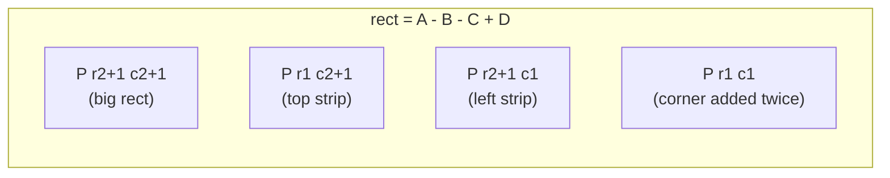

# Prefix sums & difference arrays

> Two dual tricks — one makes range *queries* O(1), the other makes range *updates* O(1). Together they cover a huge slice of array-interview problems.

<span class="phase-status phase-done">Phase 2 — Data Structures</span>

---

## 1. Why these two patterns belong together

Prefix sums and difference arrays are **inverses** of each other:

| Trick | Pre-process | Query | Update |
|---|---|---|---|
| Prefix sum | O(n) | **O(1)** range sum | O(n) point update |
| Difference array | — | O(n) reconstruct | **O(1)** range update |

If your workload is "many queries, few updates" → **prefix sum**. If it's "many range increments, then read once" → **difference array**. If it's "many updates *and* many queries interleaved", neither is enough — that's where a [Fenwick tree](../../05-advanced/04-fenwick-bit.md) comes in.

!!! tip "The fundamental identity"
    Define `P[i] = a[0] + a[1] + ... + a[i-1]` with `P[0] = 0`. Then for any `0 <= l <= r < n`:

    $$\text{sum}(l, r) = P[r+1] - P[l]$$

    The `+1` shift is what lets `l = 0` work without a special case. Burn this into muscle memory.

---

## 2. 1D prefix sum

### 2.1 Build & query

```python
from __future__ import annotations


class PrefixSum:
    """Immutable range-sum over a 1D array."""

    def __init__(self, nums: list[int]) -> None:
        # P has length n+1, P[0] = 0, P[i] = sum(nums[:i]).
        n = len(nums)
        self.p: list[int] = [0] * (n + 1)
        for i in range(n):
            self.p[i + 1] = self.p[i] + nums[i]

    def range_sum(self, l: int, r: int) -> int:
        """Inclusive sum of nums[l..r]."""
        return self.p[r + 1] - self.p[l]
```

**Complexity:** O(n) build, O(1) per query, O(n) extra space.

### 2.2 Itertools shortcut

```python
from __future__ import annotations
from itertools import accumulate

nums = [3, 1, 4, 1, 5, 9, 2, 6]
prefix = [0, *accumulate(nums)]   # [0, 3, 4, 8, 9, 14, 23, 25, 31]
# range_sum(2, 5) = prefix[6] - prefix[2] = 23 - 4 = 19
```

`accumulate` accepts any binary op via `func=...` — handy for prefix XOR, prefix max, prefix product (mod p), etc. The pattern generalises far beyond addition.

---

## 3. 2D prefix sum (rectangle sum via inclusion-exclusion)

For a matrix `M[r][c]`, define `P[r][c] = sum of M[i][j] for 0 <= i < r, 0 <= j < c`. The rectangle sum from `(r1, c1)` to `(r2, c2)` inclusive is:

$$
\text{sum} = P[r_2{+}1][c_2{+}1] - P[r_1][c_2{+}1] - P[r_2{+}1][c_1] + P[r_1][c_1]
$$

The four-term formula is **inclusion-exclusion**: subtract the two strips above and to the left, then add back the corner you subtracted twice.



```python
from __future__ import annotations


class NumMatrix:
    """LC 304 — Range Sum Query 2D - Immutable."""

    def __init__(self, matrix: list[list[int]]) -> None:
        if not matrix or not matrix[0]:
            self.p: list[list[int]] = [[0]]
            return
        m, n = len(matrix), len(matrix[0])
        self.p = [[0] * (n + 1) for _ in range(m + 1)]
        for r in range(m):
            row_sum = 0
            for c in range(n):
                row_sum += matrix[r][c]
                self.p[r + 1][c + 1] = self.p[r][c + 1] + row_sum

    def sum_region(self, r1: int, c1: int, r2: int, c2: int) -> int:
        p = self.p
        return (
            p[r2 + 1][c2 + 1]
            - p[r1][c2 + 1]
            - p[r2 + 1][c1]
            + p[r1][c1]
        )
```

**Complexity:** O(m·n) build, O(1) per query, O(m·n) extra space.

??? question "Why pad with a zero row and zero column?"
    The padding lets the four-term formula work uniformly even when the rectangle starts at row 0 or column 0 — without the pad you'd need separate cases for those edges. Same trick as the 1D `P[0] = 0` sentinel.

---

## 4. Difference array (range update, then reconstruct)

A **difference array** `d` of `a` is defined by `d[0] = a[0]` and `d[i] = a[i] - a[i-1]` for `i > 0`. The original is recovered by prefix sum: `a[i] = d[0] + d[1] + ... + d[i]`.

The magic: to add `+v` to every element in `a[l..r]`, you only touch two cells of `d`:

```python
from __future__ import annotations


class DiffArray:
    """Apply many range updates in O(1) each, then materialise in O(n)."""

    def __init__(self, n: int) -> None:
        # One extra cell so range_add can write d[r+1] without a bounds check.
        self.d: list[int] = [0] * (n + 1)

    def range_add(self, l: int, r: int, v: int) -> None:
        """Add v to a[l..r] (inclusive). O(1)."""
        self.d[l] += v
        self.d[r + 1] -= v

    def build(self) -> list[int]:
        """Materialise the array. O(n)."""
        out: list[int] = []
        running = 0
        for x in self.d[:-1]:
            running += x
            out.append(running)
        return out
```

```mermaid
flowchart LR
    A[k range updates] --> B[O(k) work on d]
    B --> C[final read]
    C --> D[O(n) prefix sum to recover a]
```

**Complexity:** k updates + one materialise = O(k + n), versus the naive O(k·n).

!!! warning "Off-by-one at `r+1`"
    The "subtract at `r+1`" only works if you size `d` with `n+1` cells. Forgetting the extra cell is the #1 difference-array bug in interviews.

---

## 5. 2D difference array (sub-matrix range increment)

To add `v` to every cell in the sub-matrix `(r1, c1)..(r2, c2)`:

```
d[r1  ][c1  ] += v
d[r1  ][c2+1] -= v
d[r2+1][c1  ] -= v
d[r2+1][c2+1] += v
```

Then reconstruct with a 2D prefix sum.

```python
from __future__ import annotations


class DiffMatrix:
    def __init__(self, m: int, n: int) -> None:
        self.m, self.n = m, n
        self.d: list[list[int]] = [[0] * (n + 1) for _ in range(m + 1)]

    def range_add(self, r1: int, c1: int, r2: int, c2: int, v: int) -> None:
        self.d[r1][c1] += v
        self.d[r1][c2 + 1] -= v
        self.d[r2 + 1][c1] -= v
        self.d[r2 + 1][c2 + 1] += v

    def build(self) -> list[list[int]]:
        m, n, d = self.m, self.n, self.d
        out: list[list[int]] = [[0] * n for _ in range(m)]
        for r in range(m):
            for c in range(n):
                top = out[r - 1][c] if r > 0 else 0
                left = out[r][c - 1] if c > 0 else 0
                tl = out[r - 1][c - 1] if r > 0 and c > 0 else 0
                out[r][c] = d[r][c] + top + left - tl
        return out
```

**Complexity:** O(1) per update, O(m·n) materialise.

---

## 6. Prefix sum of booleans = counting

Prefix sums aren't only about addition — booleans turn them into a **count of True values in a range**:

```python
from __future__ import annotations
from itertools import accumulate

s = "abracadabra"
is_a = [1 if ch == "a" else 0 for ch in s]
p = [0, *accumulate(is_a)]

def count_a(l: int, r: int) -> int:
    """How many 'a' in s[l..r] inclusive."""
    return p[r + 1] - p[l]
```

Generalises to "count of even numbers", "count of vowels", "count of values ≤ threshold" — anything you can map to 0/1.

---

## 7. The hashmap trick: prefix sum + dictionary

Many "subarray with sum equal to / divisible by k" problems use prefix sums as **keys in a hashmap**. The insight:

$$\text{sum}(l, r) = k \iff P[r+1] - P[l] = k \iff P[l] = P[r+1] - k$$

So as you scan, you ask "have I seen a prefix equal to `current - k`?" — that's an O(1) hashmap lookup.

```python
from __future__ import annotations
from collections import defaultdict


def subarray_sum_equals_k(nums: list[int], k: int) -> int:
    """LC 560 — count subarrays whose sum equals k."""
    # seen[s] = how many prefixes have sum s. Seed with {0: 1} for prefixes
    # that start at index 0 (empty prefix has sum 0).
    seen: dict[int, int] = defaultdict(int)
    seen[0] = 1
    running = 0
    count = 0
    for x in nums:
        running += x
        count += seen[running - k]
        seen[running] += 1
    return count
```

**Complexity:** O(n) time, O(n) space. Works for negative numbers and zero (a sliding window does not).

??? question "Why does `{0: 1}` go in the seed?"
    A subarray that starts at index 0 has prefix difference `P[r+1] - P[0] = P[r+1]`. We're matching `running - k` against a prior prefix; when the entire prefix up to `r` already sums to `k`, the "prior" prefix is the empty one (sum 0). Seeding `{0: 1}` lets us count those without a special case.

---

## 8. Interview problems

### 8.1 — Range Sum Query - Immutable (LC 303)

The textbook 1D prefix sum problem. Build once, answer queries in O(1). See `PrefixSum` in §2.1 — that's the full solution.

### 8.2 — Range Sum Query 2D - Immutable (LC 304)

The textbook 2D prefix sum problem. The four-term inclusion-exclusion formula is the whole interview. See `NumMatrix` in §3.

### 8.3 — Subarray Sum Equals K (LC 560)

The prefix-sum + hashmap pattern. Already shown in §7. The trap is reaching for a sliding window — that fails the moment `nums` contains negatives, because the running sum is no longer monotone in window length.

### 8.4 — Corporate Flight Bookings (LC 1109)

Given `n` flights and bookings `[first, last, seats]`, return the total seats per flight. Pure 1D difference array.

```python
from __future__ import annotations


def corp_flight_bookings(bookings: list[list[int]], n: int) -> list[int]:
    d = [0] * (n + 1)
    for first, last, seats in bookings:
        # 1-indexed in the problem; subtract 1 for our 0-indexed array.
        d[first - 1] += seats
        d[last] -= seats
    out = [0] * n
    running = 0
    for i in range(n):
        running += d[i]
        out[i] = running
    return out
```

**Complexity:** O(n + k) for k bookings. The naive "increment a slice per booking" is O(n·k) and TLEs on large inputs.

### 8.5 — Number of Submatrices That Sum to Target (LC 1074)

Combine 2D prefix sum with the 1D hashmap trick. **Fix the top and bottom rows**, collapse each column into a single number (the column sum between those rows), then run the 1D "subarray sum equals target" hashmap pattern across columns.

```python
from __future__ import annotations
from collections import defaultdict


def num_submatrix_sum_target(matrix: list[list[int]], target: int) -> int:
    m, n = len(matrix), len(matrix[0])

    # Column-prefix sums: col_p[r][c] = sum of matrix[0..r-1][c].
    col_p = [[0] * n for _ in range(m + 1)]
    for r in range(m):
        for c in range(n):
            col_p[r + 1][c] = col_p[r][c] + matrix[r][c]

    count = 0
    for r1 in range(m):
        for r2 in range(r1, m):
            # Strip sums: one entry per column for this row band.
            seen: dict[int, int] = defaultdict(int)
            seen[0] = 1
            running = 0
            for c in range(n):
                running += col_p[r2 + 1][c] - col_p[r1][c]
                count += seen[running - target]
                seen[running] += 1
    return count
```

**Complexity:** O(m²·n) time, O(n) space per (r1, r2) band. Picking m ≤ n (transpose if not) keeps the cubic term tame.

---

## 9. When to upgrade

Both tricks share one weakness: they assume **either the array or the queries are static**. The moment you need both fast point updates *and* fast range queries, prefix-sum maintenance becomes O(n) per update — game over.

| Workload | Use this |
|---|---|
| Many queries, no updates | Prefix sum (this page) |
| Many range updates, then read | Difference array (this page) |
| Point update + range sum | [Fenwick tree / BIT](../../05-advanced/04-fenwick-bit.md) — O(log n) for both |
| Range update + range query | Segment tree with lazy propagation |
| Sum + min + max + arbitrary aggregation | Segment tree |

The Fenwick tree page picks up exactly where this one runs out of road — same O(1) → O(log n) story for the cell update primitive, with the same prefix-sum query mental model.

---

## 10. Gotchas

!!! warning "Inclusive vs exclusive ranges"
    Decide once at the top of the function and stick to it. The `range_sum(l, r)` API in §2.1 is inclusive on both ends; LC 303 uses inclusive `[i, j]`; many libraries use half-open `[l, r)`. Mixing them is the most common prefix-sum bug.

!!! warning "Integer overflow on 2D sums"
    Python ints are unbounded so this is a C++ / Java problem in practice — but if a problem statement mentions `int` ranges, the 2D sum can blow past `2^31` even when the original cells are tiny.

!!! warning "Modular prefix sums need positive modular arithmetic"
    `(P[r+1] - P[l]) % m` can be negative in C-family languages. In Python `%` is already non-negative for positive `m`, but if you port to C++ remember `((x - y) % m + m) % m`.

!!! warning "Don't forget the `{0: 1}` seed in the hashmap pattern"
    Skipping it under-counts subarrays that start at index 0. Spot-test with the smallest case (`nums=[k]`, expected count 1) to catch this.

---

## 🃏 Cheatsheet

- **Range sum identity:** `sum(l..r) = P[r+1] - P[l]` with `P[0] = 0`. Pad to skip edge cases.
- **`accumulate(nums)`** from `itertools` is the one-liner build; pass `func=...` for prefix XOR / max / product.
- **2D rectangle sum** uses 4-term inclusion-exclusion: `P[r2+1][c2+1] - P[r1][c2+1] - P[r2+1][c1] + P[r1][c1]`.
- **Difference array:** `d[l] += v; d[r+1] -= v`. Recover with a prefix sum. Size `n+1` to avoid bounds checks.
- **2D diff array:** four corner stamps, then 2D prefix sum to materialise.
- **Counting via prefix sum:** map values to 0/1, then range sum = range count.
- **Subarray sum = k → hashmap of prefix sums.** Seed `{0: 1}`. Works with negatives (sliding window doesn't).
- **2D version of "subarray sums to target":** fix two rows, collapse columns to 1D, run the hashmap pattern. O(m²·n).
- **Choose your tool:**
    - many queries, no updates → prefix sum
    - many range updates, one read → difference array
    - both interleaved → [Fenwick / BIT](../../05-advanced/04-fenwick-bit.md) or segment tree
- **Off-by-one is the #1 bug.** Decide inclusive vs half-open at the top of the function. Stick to it.
