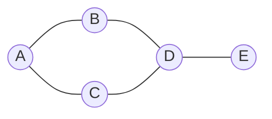

# Graph basics

> Vertices, edges, and the universal data structure for "things that connect to other things."

<span class="phase-status phase-done">Phase 2 — Data Structures</span>

---

!!! abstract "What this chapter is"
    Graphs aren't a new data structure so much as a **way of seeing** old ones. A 2D grid? Graph. A maze? Graph. A list of prerequisite courses? Graph. A social network? Of course graph. Once the lens clicks, half of LeetCode's hard tier collapses into "BFS this thing."

    This page covers the **vocabulary, representations, and universal traversals** you need before any algorithm-level work. Algorithm depth (Dijkstra, Bellman-Ford, Floyd-Warshall, Kruskal, Prim, Tarjan) lives in [Graph algorithms](../../03-algorithms/07-graph-algorithms.md).

---

## Chapter map

<div class="grid cards" markdown>

-   :material-numeric-1-circle:{ .lg .middle } &nbsp; **Vocabulary**

    Vertex, edge, directed, weighted, cycle, DAG, components.

-   :material-numeric-2-circle:{ .lg .middle } &nbsp; **Three representations**

    Adjacency list, adjacency matrix, edge list — with tradeoffs.

-   :material-numeric-3-circle:{ .lg .middle } &nbsp; **Building from input**

    Edge lists, matrices, and the **grid-as-implicit-graph** idiom.

-   :material-numeric-4-circle:{ .lg .middle } &nbsp; **BFS & DFS**

    Recursive, iterative, visited-set discipline.

-   :material-numeric-5-circle:{ .lg .middle } &nbsp; **Bipartite check**

    Two-coloring with BFS — a deceptively common interview ask.

-   :fontawesome-solid-microphone:{ .lg .middle } &nbsp; **Interview problems**

    Number of Islands, Clone Graph, Course Schedule, Is Bipartite.

</div>

---

## 1. Vocabulary

| Term | Meaning |
|------|---------|
| **Vertex** (node) | A "thing." Person, city, course, pixel. |
| **Edge** | A connection between two vertices. |
| **Directed** | Edge has a direction (`u → v`, but maybe not `v → u`). Twitter follows. |
| **Undirected** | Edge is symmetric. Facebook friends. |
| **Weighted** | Edges carry a number (distance, cost, capacity). |
| **Cycle** | A path that returns to its start. |
| **DAG** | **D**irected **A**cyclic **G**raph — a directed graph with no cycles. The structure behind dependency resolution, build systems, course prerequisites. |
| **Connected component** | A maximal subset where every pair of vertices is reachable from each other. |
| **Strongly connected (directed)** | Every pair `(u, v)` has paths `u → v` AND `v → u`. |
| **Degree** | Number of edges touching a vertex. (`in-degree` / `out-degree` for directed.) |
| **Path** | Sequence of edges connecting two vertices. |
| **Tree** | A connected, acyclic, undirected graph with `V` vertices and `V−1` edges. |

!!! tip "The DAG litmus test"
    If the problem mentions **prerequisites, dependencies, build order, or scheduling**, you're almost certainly looking at a DAG and the answer involves **topological sort** or **cycle detection**.

---

## 2. Three representations



Same graph, three different storage formats.

### Adjacency list — the workhorse

```python linenums="1"
from __future__ import annotations
from collections import defaultdict

# Undirected, unweighted
graph: dict[str, list[str]] = defaultdict(list)
edges = [("A", "B"), ("A", "C"), ("B", "D"), ("C", "D"), ("D", "E")]
for u, v in edges:
    graph[u].append(v)
    graph[v].append(u)  # (1)!

# graph["A"] -> ["B", "C"]
# graph["D"] -> ["B", "C", "E"]
```

1. For a **directed** graph, drop this line. Easiest bug to introduce: forgetting one direction in undirected graphs and wondering why BFS misses half the vertices.

**Space:** `O(V + E)`. **Iterate neighbours of v:** `O(deg(v))`. **Edge lookup `(u,v)?`:** `O(deg(u))`.

### Adjacency matrix — fast lookups, fat memory

```python linenums="1"
from __future__ import annotations

V = 5
matrix: list[list[int]] = [[0] * V for _ in range(V)]
# A=0, B=1, C=2, D=3, E=4
for u, v in [(0, 1), (0, 2), (1, 3), (2, 3), (3, 4)]:
    matrix[u][v] = 1
    matrix[v][u] = 1
```

**Space:** `O(V²)`. **Edge lookup:** `O(1)`. **Iterate neighbours:** `O(V)` (must scan the whole row).

### Edge list — minimal, useful for Kruskal / union-find

```python linenums="1"
edges: list[tuple[int, int, int]] = [
    (0, 1, 5),  # u, v, weight
    (0, 2, 3),
    (1, 3, 2),
]
```

**Space:** `O(E)`. **Any neighbour query:** `O(E)`. Use it when the algorithm processes edges as the primary unit (e.g. Kruskal sorts edges by weight).

### When to pick what

<div class="grid cards" markdown>

-   :material-list-box:{ .lg .middle } &nbsp; **Adjacency list**

    Default. Use unless something forces otherwise. Sparse graphs (`E ≪ V²`).

-   :material-grid:{ .lg .middle } &nbsp; **Adjacency matrix**

    Dense graphs, `V` small (≤ ~1000), or you need O(1) edge existence checks (Floyd-Warshall, transitive closure).

-   :material-format-list-bulleted-square:{ .lg .middle } &nbsp; **Edge list**

    Edge-centric algorithms (Kruskal MST, Bellman-Ford).

</div>

---

## 3. Building a graph from input

Interview inputs almost never hand you a `Graph` object. They hand you one of four shapes — recognise them:

??? question "Shape 1: edge list `[[u, v], ...]`"
    ```python linenums="1"
    from __future__ import annotations
    from collections import defaultdict

    def build(n: int, edges: list[list[int]]) -> dict[int, list[int]]:
        g: dict[int, list[int]] = defaultdict(list)
        for u, v in edges:
            g[u].append(v)
            g[v].append(u)
        # Ensure isolated vertices are present
        for i in range(n):
            _ = g[i]
        return g
    ```

??? question "Shape 2: adjacency matrix"
    ```python linenums="1"
    def neighbours(matrix: list[list[int]], u: int) -> list[int]:
        return [v for v, connected in enumerate(matrix[u]) if connected]
    ```

??? question "Shape 3: adjacency list (already built)"
    Treat it as-is. Just remember 0-indexed vs 1-indexed conventions.

??? question "Shape 4: a 2D grid (the implicit graph)"
    Each cell is a vertex; edges go to its 4 (or 8) neighbours. **You never actually build the graph** — you walk it on the fly.

    ```python linenums="1"
    DIRS_4 = [(-1, 0), (1, 0), (0, -1), (0, 1)]
    DIRS_8 = DIRS_4 + [(-1, -1), (-1, 1), (1, -1), (1, 1)]

    def neighbours(grid: list[list[int]], r: int, c: int) -> list[tuple[int, int]]:
        rows, cols = len(grid), len(grid[0])
        out: list[tuple[int, int]] = []
        for dr, dc in DIRS_4:
            nr, nc = r + dr, c + dc
            if 0 <= nr < rows and 0 <= nc < cols:
                out.append((nr, nc))
        return out
    ```

    !!! tip "Grid bounds — the universal off-by-one"
        `0 <= nr < rows and 0 <= nc < cols`. Memorise this. Half of grid-BFS bugs are flipped row/col bounds.

---

## 4. Traversal essentials

### BFS — shortest path in unweighted graphs, level-order

```python linenums="1"
from __future__ import annotations
from collections import deque

def bfs(graph: dict[int, list[int]], start: int) -> list[int]:
    """Return vertices in BFS order from `start`."""
    visited: set[int] = {start}
    queue: deque[int] = deque([start])
    order: list[int] = []
    while queue:
        u = queue.popleft()
        order.append(u)
        for v in graph[u]:
            if v not in visited:
                visited.add(v)  # (1)!
                queue.append(v)
    return order
```

1. **Mark on enqueue, not on dequeue.** Marking on dequeue allows duplicate enqueueing — a classic TLE on dense graphs.

### DFS — recursive

```python linenums="1"
def dfs_recursive(graph: dict[int, list[int]], u: int, visited: set[int]) -> list[int]:
    visited.add(u)
    order = [u]
    for v in graph[u]:
        if v not in visited:
            order.extend(dfs_recursive(graph, v, visited))
    return order
```

### DFS — iterative (stack)

```python linenums="1"
def dfs_iterative(graph: dict[int, list[int]], start: int) -> list[int]:
    visited: set[int] = set()
    stack: list[int] = [start]
    order: list[int] = []
    while stack:
        u = stack.pop()
        if u in visited:
            continue
        visited.add(u)
        order.append(u)
        for v in graph[u]:
            if v not in visited:
                stack.append(v)
    return order
```

!!! warning "Recursion depth on Python"
    Python's default recursion limit is **1000**. A linear graph of 10⁴ vertices crashes recursive DFS. For large inputs use the iterative version or `sys.setrecursionlimit(10**6)` + accept the stack risk.

### Complexity (both BFS and DFS)

| Representation | Time | Space (visited + frontier) |
|----------------|------|----------------------------|
| Adjacency list | `O(V + E)` | `O(V)` |
| Adjacency matrix | `O(V²)` | `O(V)` |

### When to use which

<div class="grid cards" markdown>

-   :material-arrow-expand-horizontal:{ .lg .middle } &nbsp; **BFS**

    Shortest path in **unweighted** graphs. Level-order. Bipartite check. "Minimum number of steps."

-   :material-arrow-expand-vertical:{ .lg .middle } &nbsp; **DFS**

    Cycle detection. Topological sort. Connected components. Path existence. Anything tree-shaped.

</div>

---

## 5. Bipartite check (BFS coloring)

A graph is **bipartite** if you can colour its vertices with two colours so that no edge connects same-coloured vertices. Equivalently: no odd-length cycles.

```python linenums="1"
from __future__ import annotations
from collections import deque

def is_bipartite(graph: list[list[int]]) -> bool:
    n = len(graph)
    color: list[int] = [0] * n  # 0 = unvisited, 1 / -1 = the two colours
    for start in range(n):
        if color[start] != 0:
            continue
        color[start] = 1
        q: deque[int] = deque([start])
        while q:
            u = q.popleft()
            for v in graph[u]:
                if color[v] == 0:
                    color[v] = -color[u]
                    q.append(v)
                elif color[v] == color[u]:
                    return False  # (1)!
    return True
```

1. Conflict — a same-colour edge means an odd cycle, so the graph is not bipartite.

The outer loop handles **disconnected graphs**. Forgetting it is the #1 bipartite bug.

---

## 6. Interview problems

### Problem 1 — Number of Islands (LC 200)

> Given an `m × n` grid of `'1'` (land) and `'0'` (water), count islands. An island is land connected 4-directionally.

??? question "Approach — grid DFS"
    Walk every cell. When you hit unvisited land, increment the counter and DFS-flood the whole island, marking it visited.

??? question "Solution"
    ```python linenums="1"
    from __future__ import annotations

    def num_islands(grid: list[list[str]]) -> int:
        if not grid:
            return 0
        rows, cols = len(grid), len(grid[0])
        count = 0

        def dfs(r: int, c: int) -> None:
            if not (0 <= r < rows and 0 <= c < cols) or grid[r][c] != "1":
                return
            grid[r][c] = "#"  # mark visited in-place
            for dr, dc in ((-1, 0), (1, 0), (0, -1), (0, 1)):
                dfs(r + dr, c + dc)

        for r in range(rows):
            for c in range(cols):
                if grid[r][c] == "1":
                    count += 1
                    dfs(r, c)
        return count
    ```

    **Time** `O(m·n)`, **Space** `O(m·n)` recursion worst case (one-big-island grid). Use BFS with a queue if recursion depth is a concern.

### Problem 2 — Clone Graph (LC 133)

> Deep-copy an undirected connected graph. Each node has `val` and `neighbors: list[Node]`.

??? question "Approach — BFS with hashmap"
    The trick is the `old → new` map. Visit each node once, create its clone on first sight, then wire up neighbours by looking each up in the map.

??? question "Solution"
    ```python linenums="1"
    from __future__ import annotations
    from collections import deque

    class Node:
        def __init__(self, val: int = 0, neighbors: list["Node"] | None = None) -> None:
            self.val = val
            self.neighbors = neighbors or []

    def clone_graph(node: Node | None) -> Node | None:
        if node is None:
            return None
        clones: dict[Node, Node] = {node: Node(node.val)}
        q: deque[Node] = deque([node])
        while q:
            cur = q.popleft()
            for nb in cur.neighbors:
                if nb not in clones:
                    clones[nb] = Node(nb.val)
                    q.append(nb)
                clones[cur].neighbors.append(clones[nb])
        return clones[node]
    ```

    **Time / space:** `O(V + E)`.

### Problem 3 — Course Schedule (LC 207)

> `numCourses` and `prerequisites[i] = [a, b]` means take `b` before `a`. Can you finish? (Equivalently: is the prereq graph a DAG?)

??? question "Approach — Kahn's algorithm (BFS topo sort)"
    Compute in-degrees. Repeatedly remove any zero-in-degree vertex and decrement its successors. If you process all `n` vertices, no cycle. If fewer, there's a cycle.

??? question "Solution"
    ```python linenums="1"
    from __future__ import annotations
    from collections import defaultdict, deque

    def can_finish(num_courses: int, prerequisites: list[list[int]]) -> bool:
        graph: dict[int, list[int]] = defaultdict(list)
        in_deg: list[int] = [0] * num_courses
        for a, b in prerequisites:
            graph[b].append(a)
            in_deg[a] += 1

        q: deque[int] = deque(i for i in range(num_courses) if in_deg[i] == 0)
        taken = 0
        while q:
            u = q.popleft()
            taken += 1
            for v in graph[u]:
                in_deg[v] -= 1
                if in_deg[v] == 0:
                    q.append(v)
        return taken == num_courses
    ```

    **Time** `O(V + E)`, **Space** `O(V + E)`.

### Problem 4 — Is Graph Bipartite? (LC 785)

Given the BFS-colouring code above, this is one function call. The interview spice is **handling disconnected components** (the outer `for start in range(n)` loop) — most candidates forget it.

---

## 7. Common gotchas

!!! warning "The five graph mistakes that fail interviews"
    1. **Forgetting undirected means both directions** in the adjacency list.
    2. **Marking visited on dequeue** instead of enqueue → exponential blowup.
    3. **No outer loop for disconnected components** — works on the sample, fails the hidden test.
    4. **Recursive DFS on 10⁴+ deep graphs** → `RecursionError`.
    5. **Mutating the input grid** without restoring it (only safe if you've cleared with the interviewer).

---

## See also

- [Graph algorithms](../../03-algorithms/07-graph-algorithms.md) — Dijkstra, Bellman-Ford, Floyd-Warshall, MST.
- [Trees — basics](../trees/01-tree-basics.md) — trees are the special case `E = V − 1`.
- [Tree BFS pattern](../../04-patterns/07-tree-bfs.md) and [Tree DFS pattern](../../04-patterns/08-tree-dfs.md).

---

## 🃏 Cheatsheet

| Operation | Adj list | Adj matrix | Edge list |
|-----------|----------|------------|-----------|
| Space | `O(V+E)` | `O(V²)` | `O(E)` |
| Add edge | `O(1)` | `O(1)` | `O(1)` |
| Edge exists `(u,v)?` | `O(deg u)` | `O(1)` | `O(E)` |
| Iterate neighbours | `O(deg u)` | `O(V)` | `O(E)` |
| BFS / DFS total | `O(V+E)` | `O(V²)` | n/a |

| Question shape | Tool |
|----------------|------|
| Shortest path, unweighted | BFS |
| Connected components | DFS or union-find |
| "Can finish all courses?" / build order | Topological sort (Kahn or DFS) |
| Cycle in directed graph | DFS with 3-colour or Kahn |
| Cycle in undirected graph | DFS tracking parent, or union-find |
| Two-colourable? | BFS bipartite check |
| Grid flood-fill / island count | DFS / BFS with `DIRS_4` |
