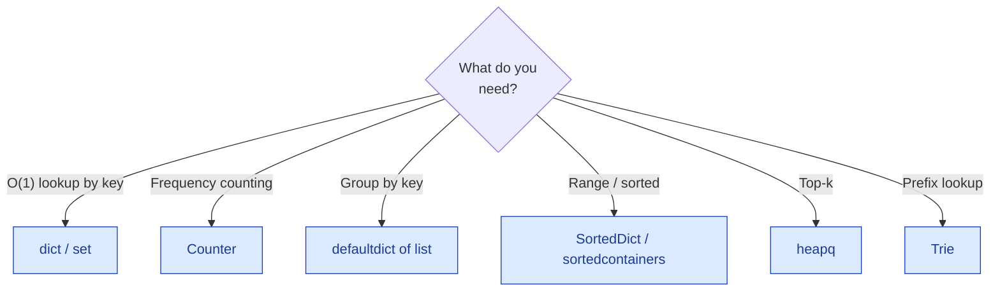

# Hash Tables — the basics

!!! abstract "What this chapter is"
    The "swiss army knife" data structure. **Half of all interview problems** end up using a hash table somewhere. They give you O(1) average-case lookup, insert, and delete by key — and the trick to most "can you do better?" follow-ups is "use a hash map."

    **Reading time:** 3–4 hours cover-to-cover; 30 minutes per problem.

    **Prereqs:** [Linked Lists](../linked-lists/01-linked-list-basics.md) (chains under collisions) and the [Python crash course](../../01-foundations/python-crash-course-for-dsa.md).

---

## Chapter map

<div class="grid cards" markdown>

-   :material-numeric-1-circle:{ .lg .middle } &nbsp; **What is a hash table?**

    Plain English + bucket analogy. The mental model.

-   :material-numeric-2-circle:{ .lg .middle } &nbsp; **Why we need them**

    Which problems collapse from O(n) to O(1) once you have one.

-   :material-numeric-3-circle:{ .lg .middle } &nbsp; **How they work internally**

    Hash function, buckets, collisions, load factor, resize.

-   :material-numeric-4-circle:{ .lg .middle } &nbsp; **Python implementation from scratch**

    A `HashMap` with separate chaining, then with open addressing.

-   :material-numeric-5-circle:{ .lg .middle } &nbsp; **Time & space complexity**

    Why O(1) is "average," and the worst-case caveats.

-   :material-numeric-6-circle:{ .lg .middle } &nbsp; **Built-in Python tools**

    `dict`, `set`, `Counter`, `defaultdict`, `OrderedDict`, `frozenset`.

-   :material-numeric-7-circle:{ .lg .middle } &nbsp; **When to use vs not use**

    Hash map vs array vs sorted set vs Trie.

-   :material-numeric-8-circle:{ .lg .middle } &nbsp; **Common mistakes & gotchas**

    Mutable keys, hash flooding, the iteration-during-mutation trap.

-   :material-numeric-9-circle:{ .lg .middle } &nbsp; **Patterns this connects to**

    Frequency, complement lookup, prefix-sum + map, sliding window state.

-   :material-numeric-10-circle:{ .lg .middle } &nbsp; **Practice problems (40)**

    Each in 5-layer progressive format with follow-ups.

-   :fontawesome-solid-microphone:{ .lg .middle } &nbsp; **How interviewers ask this**

    Phrasings, the "use a hash map" tell.

-   :material-clipboard-check:{ .lg .middle } &nbsp; **Self-check quiz**

    20 questions. If you can answer 18, you've mastered hash tables.

</div>

---

## 1. What is a hash table?

> **Plain English:** an array indexed by **a key of any hashable type**, not just integers. Internally, the runtime turns the key into an integer index using a **hash function**.

The everyday analogy: a **dictionary** (book). You don't read every page to find "octopus" — you jump to **O** based on the first letter, then walk a few entries. The first-letter rule is your hash function; the section is your bucket.

```
   key "apple"   ─┐                     bucket 5: [("apple", 1.20)]
                  ├── hash → 5  ─►
   key "banana"  ─┘                     bucket 7: [("banana", 0.50)]

   key "cherry"  ─── hash → 5  ─►       bucket 5: [("apple", 1.20), ("cherry", 3.00)]
                                                   ↑ collision: separate chaining
```

In Python, the everyday hash table is a **`dict`**:

```python
prices = {"apple": 1.20, "banana": 0.50, "cherry": 3.00}
prices["apple"]            # 1.20 — average O(1)
prices["lychee"] = 4.50    # O(1)
del prices["banana"]       # O(1)
"apple" in prices          # O(1)
```

A **`set`** is the same machinery without values — just keys.

```python
seen = set()
seen.add("apple")
"apple" in seen   # O(1)
```

!!! info "The vocabulary"
    - **Hash function**: maps a key to an integer.
    - **Bucket / slot**: the array entry where keys with that hash (after modulo) land.
    - **Collision**: two distinct keys hashing to the same bucket.
    - **Load factor**: `n / capacity`. Most hash tables resize when this exceeds ~0.7.
    - **Open addressing**: collisions are resolved by probing nearby slots.
    - **Separate chaining**: collisions are resolved by linking entries in a list per bucket.

---

## 2. Why we need hash tables

Many problems boil down to "have I seen X before?" or "what's the count of X?" Without a hash table, those are O(n). With one, **O(1)** average.

### 2.1 The complement trick (Two Sum)

Given an array, find two numbers summing to `target`. Brute force: every pair, O(n²). With a hash map: walk once, for each `x` ask "is `target - x` already in the map?" — O(1) per check, O(n) total.

This single template solves dozens of "find a pair / triple with property P" problems.

### 2.2 Frequency counting

"How many times does X appear?" "Group these by their key." A hash map answers both in one pass.

`collections.Counter` is the canonical tool — built on top of `dict`.

### 2.3 Deduplication

"Have I seen this before?" Hash set. O(n) total to scan a stream and remember unique elements.

### 2.4 Prefix-sum + hash map

"Count subarrays whose sum equals k." Walk once tracking the running prefix sum `s`. The number of valid subarrays ending at the current position is `count_of(s - k)` — answered by the running map of prefix-sum frequencies. **O(n) — versus O(n²) brute force.**

This pattern, called **prefix sum + hash map**, is one of the most-asked patterns in tech interviews.

### 2.5 Hash maps make graphs / trees searchable

When you build a graph from edges or a tree from parent-child pairs, a hash map of `node → neighbours` is the universal storage. Same for "have I visited this node?" sets in BFS/DFS.

---

## 3. How hash tables work internally

The mechanics that explain the gotchas in Part 8.

### 3.1 The hash function

A **hash function** maps any hashable object to an integer. Python's `hash(key)` uses:

- For ints: `hash(n) == n` for small n; for large n, Python uses a SipHash-like hash.
- For strings and bytes: SipHash with a per-process random seed.
- For tuples: combination of the hashes of components.
- For user-defined classes: `id(obj)` by default; override `__hash__` for value-based hashing.

Two requirements:

1. **Equal objects must have equal hashes.** `a == b ⇒ hash(a) == hash(b)`.
2. **Hashes should be well-distributed.** A bad hash creates many collisions, degrading the table to O(n) lookups.

### 3.2 Buckets and the modulo step

After hashing, the runtime computes `bucket_index = hash(key) % capacity`. The capacity is the size of the underlying array (Python uses powers of 2; many other languages use primes).

```
"apple"  hash → 14793... % 16 → bucket 9
"banana" hash → 88231... % 16 → bucket 7
"cherry" hash → 47109... % 16 → bucket 9   ← collision with "apple"
```

### 3.3 Collisions: chaining vs open addressing

**Separate chaining** (Java's `HashMap` historically, Python's old implementation):

```
bucket 9: [("apple", 1.20)] → [("cherry", 3.00)]
```

Each bucket is a linked list (or balanced tree if it gets long).

**Open addressing** (Python's current implementation, since CPython 3.6):

When the target bucket is occupied, probe the **next slot** (linear probing), or **a hash-derived sequence of slots** (Python uses a perturbation scheme).

```
bucket 9: ("apple", 1.20)
bucket 10: ("cherry", 3.00)   ← landed here because 9 was taken
```

Pros and cons:

| | Chaining | Open addressing |
|---|---|---|
| Cache locality | Worse (list nodes) | Better (everything in array) |
| Memory overhead | Higher (linked list per bucket) | Lower |
| Worst case under flood | O(n) per op | O(n) per op |
| Hash flooding mitigation | Easier (use a tree above some threshold) | Needs randomized seed |
| Resize cost | O(n) | O(n) |

CPython's `dict` uses **open addressing with random probing**, plus a separate compact key/value array (the "compact dict" introduced in 3.6) that preserves insertion order.

### 3.4 Load factor and resize

Once the dict's load factor exceeds ~0.66, CPython doubles the underlying array and re-hashes every key. That's an **O(n) operation** that happens log n times across n inserts — **amortized O(1) per insert**.

Most of the time, this is invisible. You'll meet it as the answer to "why is `dict.append` *amortized* O(1) and not strictly O(1)?"

### 3.5 Why the hash must be stable

```python
class Bad:
    def __init__(self, x: int) -> None:
        self.x = x
    def __hash__(self) -> int:
        return hash(self.x)

b = Bad(5)
d = {b: "value"}
b.x = 7                     # mutated AFTER inserting → hash now disagrees
b in d                      # might return False — d's lookup uses the new hash
```

**Mutating a key after insert** breaks the dict. That's why Python only allows hashable (immutable) types as keys: `tuple` (yes), `list` (no), `frozenset` (yes), `set` (no).

### 3.6 The "hash randomization" defense

Python (since 3.3) randomizes string hashing per process, defeating "hash flooding" attacks where an attacker crafts inputs that all collide. This means:

```python
hash("hello") in run #1   ≠   hash("hello") in run #2
```

Don't depend on hash values being stable across processes.

---

## 4. Python implementation from scratch

### 4.1 A `HashMap` with separate chaining

Walking through a from-scratch implementation is a common interview ask. The cleanest version uses chaining:

```python
from __future__ import annotations
from typing import Any, Generic, Iterator, TypeVar

K = TypeVar("K")
V = TypeVar("V")


class HashMap(Generic[K, V]):
    """A toy hash map with separate chaining and resize.

    Real production code uses Python's built-in dict. This is the
    interview-grade implementation.
    """

    _INITIAL_CAPACITY = 16
    _LOAD_FACTOR_HI = 0.75

    def __init__(self) -> None:
        self._capacity: int = self._INITIAL_CAPACITY
        self._size: int = 0
        self._buckets: list[list[tuple[K, V]]] = [[] for _ in range(self._capacity)]

    def __len__(self) -> int:
        return self._size

    def __contains__(self, key: K) -> bool:
        bucket = self._buckets[self._index(key)]
        return any(k == key for k, _ in bucket)

    def __getitem__(self, key: K) -> V:
        bucket = self._buckets[self._index(key)]
        for k, v in bucket:
            if k == key:
                return v
        raise KeyError(key)

    def __setitem__(self, key: K, value: V) -> None:
        idx = self._index(key)
        bucket = self._buckets[idx]
        for i, (k, _) in enumerate(bucket):
            if k == key:
                bucket[i] = (key, value)        # update in place
                return
        bucket.append((key, value))              # new entry
        self._size += 1
        if self._size / self._capacity > self._LOAD_FACTOR_HI:
            self._resize(self._capacity * 2)

    def __delitem__(self, key: K) -> None:
        bucket = self._buckets[self._index(key)]
        for i, (k, _) in enumerate(bucket):
            if k == key:
                bucket.pop(i)
                self._size -= 1
                return
        raise KeyError(key)

    def __iter__(self) -> Iterator[K]:
        for bucket in self._buckets:
            for k, _ in bucket:
                yield k

    def _index(self, key: K) -> int:
        return hash(key) & (self._capacity - 1)   # & is faster than % for power-of-2 capacity

    def _resize(self, new_capacity: int) -> None:
        old = self._buckets
        self._capacity = new_capacity
        self._buckets = [[] for _ in range(new_capacity)]
        self._size = 0
        for bucket in old:
            for k, v in bucket:
                self[k] = v                        # re-insert; updates _size
```

### 4.2 Open addressing variant (sketch)

For interview-grade open addressing with linear probing:

```python
class HashMapOA:
    _TOMBSTONE = object()                          # sentinel for deleted entries

    def __init__(self) -> None:
        self._capacity = 16
        self._size = 0
        self._keys: list[Any] = [None] * self._capacity
        self._values: list[Any] = [None] * self._capacity

    def _probe(self, key: Any) -> int:
        idx = hash(key) & (self._capacity - 1)
        while self._keys[idx] is not None and self._keys[idx] != key and self._keys[idx] is not self._TOMBSTONE:
            idx = (idx + 1) & (self._capacity - 1)
        return idx
    # __getitem__, __setitem__, __delitem__, _resize: similar to chaining version.
```

The interview point: **deletion needs a tombstone** — clearing the slot would break probe chains for other keys.

### 4.3 What changes in Python's actual implementation

CPython's `dict` is significantly more sophisticated:

- **Compact representation**: keys/values live in a dense array; the bucket table just stores indices.
- **Random probing**: not just linear; reduces clustering.
- **Insertion-order preserving** (since 3.7).
- **Shared-key dicts** for instances of the same class (memory optimization).

You won't reproduce CPython in an interview. Walking through Section 4.1 is enough.

---

## 5. Time & space complexity

The full table.

### Average case (uniform hash, load factor < 0.7)

| Operation | Code | Time |
|---|---|---|
| Lookup | `d[k]` | **O(1)** |
| Membership | `k in d` | **O(1)** |
| Insert | `d[k] = v` | **O(1) amortized** |
| Delete | `del d[k]` | **O(1)** |
| Iteration | `for k in d` | **O(n)** total |
| Length | `len(d)` | **O(1)** |
| Update | `d.update(other)` | **O(\|other\|)** |
| Copy | `d.copy()` | **O(n)** |

### Worst case

Every operation degrades to **O(n)** when:

- Hash function is bad (many keys collide on the same bucket).
- An attacker crafts colliding keys (hash flooding).
- Custom `__hash__` returns a constant.

Python defends against the first two with random string hashing; you defend against the third by writing sane `__hash__` methods.

### Space

- An empty Python `dict`: ~232 bytes.
- Per entry: ~50 bytes overhead plus the key and value.
- For n entries: roughly `48 * capacity + size of keys + size of values`. Capacity is the next power of 2 ≥ `n / 0.66`.

For 10⁶ entries, expect ~80–100 MB total — non-negligible.

---

## 6. Built-in Python tools

The whole `dict` family. Memorize when each shines.

### 6.1 `dict` — the daily driver

```python
d = {}
d = {"a": 1, "b": 2}
d["c"] = 3
d.pop("a", default=None)              # remove if present, else return default
d.get("z", 0)                         # safe lookup with default
d.setdefault("x", []).append(...)     # canonical "default-list" idiom
d.keys() / d.values() / d.items()
{**d1, **d2}                          # merge (3.5+)
d1 | d2                               # merge (3.9+); right-hand wins on conflict
```

### 6.2 `set` and `frozenset`

```python
s = set()
s = {1, 2, 3}                         # set literal
s.add(4); s.discard(5); s.remove(3)   # discard ignores missing; remove raises
a & b   # intersection
a | b   # union
a - b   # difference
a ^ b   # symmetric difference
a <= b  # subset
frozenset({1, 2, 3})                  # hashable, can be a dict key
```

### 6.3 `collections.Counter`

```python
from collections import Counter
c = Counter("mississippi")            # Counter({'i': 4, 's': 4, 'p': 2, 'm': 1})
c.most_common(2)                      # [('i', 4), ('s', 4)]
c["a"]                                # 0 (no KeyError on missing)
c["i"] += 1
a + b                                 # element-wise add (new Counter)
a - b                                 # element-wise subtract, drops <= 0
a & b                                 # element-wise min
a | b                                 # element-wise max
c.subtract(other)                     # in-place; allows negatives
```

### 6.4 `collections.defaultdict`

```python
from collections import defaultdict

groups: defaultdict[str, list[int]] = defaultdict(list)
groups["primes"].append(2)            # auto-creates empty list

counts: defaultdict[str, int] = defaultdict(int)
for c in s: counts[c] += 1
```

### 6.5 `collections.OrderedDict`

Today's `dict` already preserves insertion order, so `OrderedDict` is mostly redundant. It still has a few unique tricks:

```python
from collections import OrderedDict
od = OrderedDict()
od.move_to_end("a")                   # send to end
od.move_to_end("a", last=False)       # send to front
od.popitem(last=False)                # FIFO pop
```

Used in LRU-cache implementations (Section 24 of the linked-list chapter).

### 6.6 `dict.fromkeys`, comprehensions

```python
{k: 0 for k in keys}                  # comprehension
dict.fromkeys(keys, 0)                # same; default value is shared (careful with mutables)
```

!!! warning "`fromkeys` and mutable defaults"
    `dict.fromkeys(keys, [])` gives every key the **same** list object. Mutating one mutates all. Use a comprehension instead: `{k: [] for k in keys}`.

---

## 7. When to use vs not use

### Use a hash map when…

- ✅ You need O(1) lookup by key.
- ✅ You're counting frequencies.
- ✅ You're deduping.
- ✅ You're caching expensive results (memoization).
- ✅ You're building a graph from edges.

### Avoid hash maps when…

- ❌ You need ordered keys (for range queries) → use a sorted structure (`SortedDict`).
- ❌ You need to find the k smallest/largest → use a heap.
- ❌ Keys have lots of structure you can exploit (e.g., they're integers in `[0, n)`) — an array is faster.
- ❌ You can't afford the per-entry memory overhead.
- ❌ You need to operate on prefixes of keys → use a Trie.

### Decision tree



---

## 8. Common mistakes & gotchas

The 10 traps that fail interviews.

!!! warning "Trap 1 — Mutating a key after insert"
    Lists, sets, and custom classes whose `__hash__` depends on mutable state break the dict if mutated. **Use only immutable keys.** For sets-as-keys, use `frozenset`.

!!! warning "Trap 2 — Iterating a dict while modifying it"
    ```python
    for k in d:
        if d[k] < 0: del d[k]   # ❌ RuntimeError: dictionary changed size during iteration
    ```
    **Fix:** iterate over `list(d)` or build a list of keys to delete first.

!!! warning "Trap 3 — Default-mutable trap with `dict.fromkeys`"
    Already covered in §6.6.

!!! warning "Trap 4 — Hash randomization across runs"
    Don't expect `hash("foo")` to return the same value next run. If you need reproducibility, use a deterministic hash (e.g., `hashlib.sha256`).

!!! warning "Trap 5 — `dict[missing_key]` raises `KeyError`"
    Use `d.get(key, default)` for safe lookup, or `defaultdict` for auto-init.

!!! warning "Trap 6 — Over-using `.keys()` / `.values()` / `.items()`"
    These return *views*, not lists. Iterating is O(1) extra memory; converting to a list with `list(d.keys())` is O(n). The view also reflects mutations — gotcha when you cache the view and the dict changes.

!!! warning "Trap 7 — Counter equality vs Counter ordering"
    `Counter(s) == Counter(t)` is fine for anagram tests. `Counter(s) < Counter(t)` is **not** elementwise comparison — Counters inherit dict ordering rules (which differ across Python versions).

!!! warning "Trap 8 — Forgetting that `set` is unordered"
    ```python
    s = {3, 1, 4, 1, 5, 9}
    list(s)         # [1, 3, 4, 5, 9] — but DON'T rely on this order
    ```
    For ordered uniqueness, use `dict.fromkeys(seq)` (preserves insertion order).

!!! warning "Trap 9 — Confusing reference equality with value equality"
    Custom classes' `__eq__` and `__hash__` must agree. If you override one, override both.

!!! warning "Trap 10 — Storing huge keys"
    Hashing a 1 MB string each time you look it up is **O(1 MB)**, not O(1). Hash performance assumes keys are small.

---

## 9. Patterns this connects to

| Pattern | When you see it | Example problem |
|---|---|---|
| **Complement lookup** | "Find pair / triple summing to X" | Two Sum (#1) |
| **Frequency counting** | "How often does X occur?" | Top-K Frequent (#12) |
| **Anagram / multiset signature** | "Group by character bag" | Group Anagrams (#11) |
| **Prefix sum + hash** | "Count subarrays with sum k / divisible by k" | Subarray Sum = K (#14) |
| **Sliding window state** | "Longest substring with property P" | Longest Without Repeating (#13) |
| **Hash set membership** | "Have I seen X?" | Contains Duplicate (#2), Longest Consecutive (#15) |
| **Hash map of seen → index** | "Find duplicate / cycle in iteration" | Happy Number (#5) |
| **Hash + DLL for O(1) eviction** | LRU / LFU caches | (See linked-lists chapter) |

---

## 10. Practice problems (40)

Same v3 5-layer format. The first 10 are the canonical "I'd reach for a hash map" problems.

For brevity, problems already covered in detail in **other chapters** (e.g., Two Sum in arrays, Anagrams in strings) get a tighter hash-table-angle treatment with a back-link.

---

### Problem 1 — Two Sum

<span class="diff-easy">Easy</span> &nbsp; <span class="company-tag">Google</span> <span class="company-tag">Amazon</span> <span class="company-tag">Meta</span> <span class="company-tag">Microsoft</span> <span class="company-tag">Adobe</span> <span class="company-tag">TCS</span>

> Given an array of integers `nums` and an integer `target`, return indices `[i, j]` with `nums[i] + nums[j] == target`. Each input has exactly one solution; you may not use the same element twice.

(Full v3 treatment in [Arrays — Problem 1](../arrays/01-array-basics.md#problem-1-two-sum). The hash-table angle below.)

#### 🌍 Real-World Usage

- **Fraud detection** — pair of transactions summing to a suspicious total.
- **Spreadsheet formulas** — Excel "find two cells summing to X."
- **Game inventory** — two upgrade items costing exactly the player's budget.

#### 🐍 The hash-table answer

```python
def two_sum(nums: list[int], target: int) -> list[int]:
    seen: dict[int, int] = {}            # value → index
    for i, num in enumerate(nums):
        complement = target - num
        if complement in seen:
            return [seen[complement], i]
        seen[num] = i
    return []
```

**Insight:** for each `num`, the value we need (`target - num`) is fixed. A hash map answers "have I seen the complement?" in O(1).

#### ⏱️ Complexity

O(n) time, O(n) space.

#### 🎯 Pattern Used

**Complement lookup** — the canonical hash-map pattern.

#### 🔄 Interviewer Follow-ups

??? question "Follow-up 1 — Sorted input."
    Two-pointer; O(1) extra space. (See arrays chapter.)

??? question "Follow-up 2 — Return all pairs."
    Map value → list of indices. Emit on every match.

??? question "Follow-up 3 — Three / four / k-sum."
    3Sum: sort + two-pointer for the inner loop. 4Sum II: split into two halves, hash one, look up complements (Problem 16).

??? question "Follow-up 4 — Stream input."
    Same algorithm; emit pairs as they arrive.

#### 🐛 Common Bugs

1. **Adding to `seen` BEFORE checking** — produces self-pairs like `[1, 1]` from `nums = [3], target = 6`.
2. **Returning indices in the wrong order** — convention is `[earlier, later]`.

---

### Problem 2 — Contains Duplicate

<span class="diff-easy">Easy</span> &nbsp; <span class="company-tag">Amazon</span> <span class="company-tag">Google</span> <span class="company-tag">Microsoft</span> <span class="company-tag">Apple</span>

> Given an integer array `nums`, return `True` if any value appears at least twice.

#### 📖 Story Mode

`[1, 2, 3, 1]` → True. `[1, 2, 3, 4]` → False.

#### 🌍 Real-World Usage

- **Login systems** — username uniqueness check.
- **Database UNIQUE enforcement.**
- **Plagiarism / fingerprint detection.**

#### 🐍 5 Layers of Solution

=== "Layer 1 — Brute"

    ```python
    def contains_duplicate_brute(nums):
        for i in range(len(nums)):
            for j in range(i+1, len(nums)):
                if nums[i] == nums[j]: return True
        return False
    ```

    O(n²).

=== "Layer 2 — Sort + adjacent compare"

    ```python
    def contains_duplicate_sort(nums):
        nums = sorted(nums)
        return any(nums[i] == nums[i-1] for i in range(1, len(nums)))
    ```

    O(n log n) time, O(n) for the sort copy.

=== "Layer 3 — Hash set"

    ```python
    def contains_duplicate(nums):
        seen = set()
        for n in nums:
            if n in seen: return True
            seen.add(n)
        return False
    ```

    O(n) time, O(n) space.

=== "Layer 4 — Pythonic one-liner"

    ```python
    def contains_duplicate(nums):
        return len(set(nums)) != len(nums)
    ```

    Same complexity. Most concise. In an interview, write Layer 3 first to show you understand the loop.

=== "Layer 5 — Variants"

    **Variant A — Contains nearby duplicate** (within k indices). Map value → most recent index; check distance. (LeetCode 219.)

    **Variant B — Contains nearby almost duplicate** (within k indices AND value diff ≤ t). Bucket-sort by value; check current and adjacent buckets. (LeetCode 220.)

    **Variant C — Find ALL duplicates.** See Problem 17.

#### ⏱️ Complexity

O(n) time, O(n) space.

#### 🎯 Pattern Used

**Hash set membership.** The most reused trick in array / string problems.

#### 🐛 Common Bugs

1. **Using a `list` instead of a `set` for `seen`** — `in list` is O(n) → algorithm becomes O(n²) sneaky.
2. **Adding before checking.**

#### 🏢 Sample Interviewer Quote

> *"Determine whether this array has any duplicates."*

Your opener: *"Walk once with a hash set. If we see something twice, return True. O(n) time, O(n) space. The Pythonic check `len(set(nums)) != len(nums)` is the same algorithm."*

---

### Problem 3 — Valid Anagram

<span class="diff-easy">Easy</span> &nbsp; <span class="company-tag">Google</span> <span class="company-tag">Amazon</span> <span class="company-tag">Meta</span> <span class="company-tag">Microsoft</span>

> Given two strings `s` and `t`, return `True` iff `t` is an anagram of `s`.

(Full treatment in [Strings — Problem 1](../strings/01-string-basics.md#problem-1-valid-anagram).)

#### 🐍 The hash-table answer

```python
from collections import Counter

def is_anagram(s: str, t: str) -> bool:
    if len(s) != len(t): return False
    return Counter(s) == Counter(t)
```

#### 🎯 Pattern Used

**Frequency-count signature.** Two strings are anagrams iff their character histograms are equal.

---

### Problem 4 — Intersection of Two Arrays

<span class="diff-easy">Easy</span> &nbsp; <span class="company-tag">Amazon</span> <span class="company-tag">Microsoft</span> <span class="company-tag">Apple</span>

> Return an array of unique values that appear in **both** input arrays. (LeetCode 349.)

#### 📖 Story Mode

`[1,2,2,1]` and `[2,2]` → `[2]`. (Each value appears at most once.)

`[4,9,5]` and `[9,4,9,8,4]` → `[4,9]` (or `[9,4]` — order unspecified).

#### 🌍 Real-World Usage

- **SQL inner-join** on a single column.
- **Set algebra** in analytics queries.
- **Deduped overlap** between two label sets.

#### 🐍 Solution

```python
def intersection(nums1, nums2):
    return list(set(nums1) & set(nums2))
```

O(n + m) time, O(n + m) space.

#### 🔄 Interviewer Follow-ups

??? question "Follow-up 1 — Counted intersection (Intersection of Two Arrays II, LC 350)."
    `Counter(nums1) & Counter(nums2)` — element-wise minimum.

??? question "Follow-up 2 — One array fits in memory, the other doesn't."
    Hash the smaller; stream the larger.

??? question "Follow-up 3 — Both sorted."
    Two-pointer merge — O(n + m), O(1) extra.

??? question "Follow-up 4 — Sort once, binary-search many times."
    For repeated queries against a fixed array, sort it once and binary-search.

??? question "Follow-up 5 — Multi-array intersection."
    Reduce: `set(arr1) & set(arr2) & set(arr3) ...`. O(total).

#### 🐛 Common Bugs

1. **Returning duplicates** — convert to `set` first.
2. **Forgetting to convert back to list** — interviewer might want `list[int]`.

---

### Problem 5 — Happy Number

<span class="diff-easy">Easy</span> &nbsp; <span class="company-tag">Google</span> <span class="company-tag">Amazon</span> <span class="company-tag">Apple</span>

> A "happy number" is one where iteratively summing the **squares of digits** eventually yields 1. Otherwise, the iteration enters a cycle. Determine whether `n` is happy. (LeetCode 202.)

#### 📖 Story Mode

19 → 1²+9² = 82 → 8²+2² = 68 → 6²+8² = 100 → 1²+0²+0² = 1. **Happy.**

2 → 4 → 16 → 37 → 58 → 89 → 145 → 42 → 20 → 4 (cycle!). **Not happy.**

#### 🌍 Real-World Usage

- **Numerological puzzles.**
- **Random-walk cycle detection** at small scale.

#### 🧠 Thinking Process

The iteration eventually cycles or reaches 1. Detect the cycle with either:

- **Hash set:** track all numbers seen; return False on revisit.
- **Floyd's:** slow/fast on the iteration.

#### 🐍 5 Layers of Solution

=== "Layer 2 — Hash set"

    ```python
    def is_happy(n):
        def step(x):
            return sum(int(c) ** 2 for c in str(x))
        seen = set()
        while n != 1 and n not in seen:
            seen.add(n); n = step(n)
        return n == 1
    ```

    O(log n) per step (number of digits) × cycle length. Effectively O(1) for typical inputs.

=== "Layer 3 — Floyd's tortoise and hare (O(1) memory)"

    ```python
    def is_happy_floyd(n):
        def step(x):
            return sum(int(c) ** 2 for c in str(x))
        slow = n
        fast = step(n)
        while fast != 1 and slow != fast:
            slow = step(slow)
            fast = step(step(fast))
        return fast == 1
    ```

=== "Layer 4 — Production-ready"

    ```python
    from __future__ import annotations


    def is_happy(n: int) -> bool:
        """Return True iff repeatedly summing squared digits eventually hits 1.

        Time:  O(log n) per step; total bounded by a small constant.
        Space: O(1) using Floyd's; O(log n) using a hash set.

        Example:
            >>> is_happy(19)
            True
            >>> is_happy(2)
            False
        """
        def step(x: int) -> int:
            total = 0
            while x:
                d = x % 10
                total += d * d
                x //= 10
            return total

        slow = n
        fast = step(n)
        while fast != 1 and slow != fast:
            slow = step(slow)
            fast = step(step(fast))
        return fast == 1
    ```

=== "Layer 5 — Variants"

    **Variant A — sum of cubes.** Different cycle structure; same algorithm.

    **Variant B — base-k digit-square sum.** Replace `% 10` with `% k`.

    **Variant C — track the FULL chain.** Hash set version; helps if you need to return the sequence.

#### ⏱️ Complexity

- **Time: O(1)** in practice (any number's iteration converges to 1 or to a known cycle of length 8 within ~12 steps).
- **Space: O(1)** with Floyd's.

#### 🎯 Pattern Used

**Cycle detection on a function iteration.** Same template as Problem 16 in linked-lists.

---

### Problem 6 — Single Number

<span class="diff-easy">Easy</span> &nbsp; <span class="company-tag">Amazon</span> <span class="company-tag">Microsoft</span> <span class="company-tag">Apple</span>

> Every element in `nums` appears twice except for one. Find that one. **O(n) time, O(1) memory required.**

#### 📖 Story Mode

`[2, 2, 1]` → 1. `[4, 1, 2, 1, 2]` → 4.

#### 🐍 Solution — XOR (canonical), but hash also works

The O(1)-space answer is XOR (`a ^ a = 0, a ^ 0 = a`):

```python
def single_number_xor(nums):
    result = 0
    for n in nums: result ^= n
    return result
```

The hash-table answer (O(n) memory):

```python
from collections import Counter

def single_number_hash(nums):
    return next(n for n, c in Counter(nums).items() if c == 1)
```

The interview question for THIS chapter is: explain when you'd reach for the hash version (when the "appears twice" constraint is relaxed and you need to find "the one with frequency != some k").

#### 🔄 Interviewer Follow-ups

??? question "Follow-up 1 — Each element appears 3x except one."
    Bit-counting: for each bit, sum across all numbers; the "single" bit is the one whose total count isn't divisible by 3.

??? question "Follow-up 2 — Two elements each appear once, all others 2x."
    XOR all numbers gives `x ^ y`. Pick a set bit; partition by that bit; XOR each group.

---

### Problem 7 — First Unique Character in a String

<span class="diff-easy">Easy</span> &nbsp; <span class="company-tag">Amazon</span> <span class="company-tag">Bloomberg</span> <span class="company-tag">Microsoft</span> <span class="company-tag">Goldman Sachs</span> <span class="company-tag">Apple</span>

> Given a string `s`, return the **index** of the first character that appears exactly once. Return `-1` if no such character exists. (LeetCode 387.)

#### 📖 Story Mode

```
s = "leetcode"
     ↑↑↑↑↑↑↑↑
     l e e t c o d e
     0 1 2 3 4 5 6 7
counts: l=1, e=3, t=1, c=1, o=1, d=1
first index where count == 1 → index 0 ('l')

s = "loveleetcode"
counts: l=2, o=2, v=1, e=4, t=1, c=1, d=1
scan left → first count==1 at index 2 ('v')
```

The pattern: **count first, scan second**. Two passes, both O(n).

#### 🌍 Real-world usage

- **Compiler/lexer error messages** — flagging the first identifier that breaks a uniqueness rule.
- **Log triage** — first unique session ID in a stream of duplicates.
- **Stream deduplication** — tracking which event types are still "rare" (count == 1) at each tick.
- **Cryptanalysis / frequency-attack defense** — find characters that defeat a frequency-based heuristic.
- **TCS / service-company screening** — appears verbatim in entry-level rounds; recruiters use it to confirm you can structure two passes cleanly without recomputing counts.

#### 🧠 Thinking process

> The interviewer's signal: do you avoid the **n²** anti-pattern of counting once per character?

**The naive trap:** "for each character, scan the string and count occurrences" — that's O(n²). The hash-table insight: count *all* characters in one pass, then scan once for the first count-of-one.

**Three accepted shapes:**

1. **`Counter` + scan** — Pythonic, O(n) time, O(k) space where k = alphabet size.
2. **26-int array** — same algorithm, fixed memory, faster constant factor.
3. **Single pass with index tracking** — store first-index per character, post-process to find the minimum index whose count is 1. Tighter when you need to support streaming.

**The "queue of candidates" pattern (Layer 5):** for *streaming* input where you must answer "current first unique" after each character, maintain a queue of indices whose count is currently 1; pop expired heads on each new arrival. O(1) amortized per query.

#### 💻 Five layered solutions

=== "Layer 1 — Brute (count per character)"

    ```python
    def first_uniq_char(s: str) -> int:
        for i, ch in enumerate(s):
            if s.count(ch) == 1:
                return i
        return -1
    ```

    Looks one-line clean — but `s.count(ch)` walks the whole string for *every* character → **O(n²)**. State this, name the cost, move on.

=== "Layer 2 — Counter + scan ⭐"

    ```python
    from collections import Counter

    def first_uniq_char(s: str) -> int:
        freq = Counter(s)                 # one pass: count everything
        for i, ch in enumerate(s):        # second pass: first count==1 wins
            if freq[ch] == 1:
                return i
        return -1
    ```

    Two passes, O(n) time, O(k) space. **Canonical answer.** Reads in five seconds on a whiteboard.

=== "Layer 3 — 26-int array (fast path for ASCII lowercase)"

    ```python
    def first_uniq_char(s: str) -> int:
        counts = [0] * 26
        for ch in s:
            counts[ord(ch) - ord('a')] += 1
        for i, ch in enumerate(s):
            if counts[ord(ch) - ord('a')] == 1:
                return i
        return -1
    ```

    Same algorithm, no hash overhead. Often **2–3× faster** in practice for the bounded-alphabet case. Bring this up after the `Counter` version — shows you know when the constant factor matters.

=== "Layer 4 — Production-ready"

    ```python
    from __future__ import annotations
    from collections import Counter

    def first_unique_index(s: str) -> int:
        """First index whose character appears exactly once; -1 otherwise.

        Two-pass O(n) time, O(k) space where k = unique characters.
        Works for any character set (Unicode-safe).
        """
        if not s:
            return -1
        freq = Counter(s)
        for i, ch in enumerate(s):
            if freq[ch] == 1:
                return i
        return -1
    ```

    Same body — explicit early-return for empty input, docstring states the invariants. **Don't over-engineer.** Two-line algorithm doesn't need a class.

=== "Layer 5 — Variants & advanced"

    **A. Streaming first-unique (LeetCode 1429)**

    ```python
    from collections import OrderedDict, Counter

    class FirstUnique:
        """Maintain first unique under a stream of additions."""

        def __init__(self, nums: list[int]) -> None:
            self._queue: OrderedDict[int, None] = OrderedDict()  # candidates in arrival order
            self._counts: dict[int, int] = Counter()
            for n in nums:
                self.add(n)

        def show_first_unique(self) -> int:
            for k in self._queue:                 # pop expired heads lazily
                if self._counts[k] == 1:
                    return k
                # cannot be first-unique anymore — skip
            return -1

        def add(self, value: int) -> None:
            self._counts[value] += 1
            if self._counts[value] == 1:
                self._queue[value] = None         # add to back
            elif value in self._queue:
                # appeared again: it's no longer unique
                # we don't remove from queue here — show_first_unique skips it
                pass
    ```

    `OrderedDict` preserves insertion order; we lazy-skip in the query. Real implementations remove eagerly to keep `show_first_unique` strict O(1) — a `dict[int, ListNode]` + DLL of candidates.

    **B. Queue of candidate indices (single pass + delayed pop)**

    ```python
    from collections import deque

    def first_uniq_char_queue(s: str) -> int:
        counts = [0] * 26
        q: deque[int] = deque()
        for i, ch in enumerate(s):
            j = ord(ch) - ord('a')
            counts[j] += 1
            if counts[j] == 1:
                q.append(i)
            while q and counts[ord(s[q[0]]) - ord('a')] > 1:
                q.popleft()
        return q[0] if q else -1
    ```

    Single pass, O(n). Each index enters and leaves the queue at most once. Useful when you can't afford the second pass (e.g., streaming where the string is being consumed).

    **C. Bit-vector tracking ("seen once" / "seen many")**

    ```python
    def first_uniq_char_bits(s: str) -> int:
        seen_once = 0; seen_many = 0
        for ch in s:
            bit = 1 << (ord(ch) - ord('a'))
            if seen_once & bit:
                seen_many |= bit
            else:
                seen_once |= bit
        unique = seen_once & ~seen_many
        if not unique:
            return -1
        for i, ch in enumerate(s):
            if unique & (1 << (ord(ch) - ord('a'))):
                return i
        return -1
    ```

    Two integers replace the count array. O(n) time, **O(1) space** for fixed alphabet. Showy; bring up only if interviewer asks for sub-linear extra space.

    **D. Concurrent / sharded for huge strings**

    Split `s` into k chunks, count each chunk in parallel, merge counters with elementwise add. Then a single sequential second pass finds the first unique. Useful only for n ≥ 10⁹.

    **E. First k-unique characters**

    Replace `freq[ch] == 1` with `freq[ch] == k`. Same two-pass shape.

#### 🔍 Dry run — `s = "loveleetcode"`

| i | ch | counts after first pass | first-unique scan |
|---|---|---|---|
| 0 | l | l:1 | check l → 2 ❌ |
| 1 | o | o:1 | check o → 2 ❌ |
| 2 | v | v:1 | check v → **1** ✅ return 2 |
| 3 | e | e:1 | — |
| 4 | l | l:2 | — |
| 5 | e | e:2 | — |
| 6 | e | e:3 | — |
| 7 | t | t:1 | — |
| 8 | c | c:1 | — |
| 9 | o | o:2 | — |
| 10 | d | d:1 | — |
| 11 | e | e:4 | — |

Final counts: `{l:2, o:2, v:1, e:4, t:1, c:1, d:1}`. First scan hits `v` at index 2 with count 1 → return 2.

#### ⏱️ Complexity comparison

| Approach | Time | Space | Notes |
|---|---|---|---|
| `s.count` per char (L1) | O(n²) | O(1) | Anti-pattern |
| Counter + scan (L2) | **O(n)** | O(k) | Canonical |
| 26-int array (L3) | O(n) | O(26) = O(1) | Bounded-alphabet fast path |
| Streaming queue (L5A) | O(1) amortized add | O(n) | LC 1429 design |
| Single-pass deque (L5B) | O(n) | O(n) | One pass instead of two |
| Bit-vector (L5C) | O(n) | **O(1)** | Two-integer trick |

#### ❓ Follow-ups (interviewer toolkit)

??? question "1) Why two passes? Can it be one pass?"
    Two-pass is the simplest correct version: count, then scan. Single-pass is possible (Layer 5B) using a deque of candidate indices, but the constant factor is worse and the code is harder to read. Use two-pass for clarity unless explicitly asked.

??? question "2) What if the input is a stream, characters arriving one at a time?"
    LeetCode 1429 — `FirstUnique` class. Maintain (a) a counter and (b) an ordered structure of "still unique" candidates. On each `add`, bump the count; if it transitions from 1 → 2, the candidate becomes invalid. `show_first_unique` either skips invalid heads (lazy) or maintains them eagerly via a hash-map + DLL.

??? question "3) Unicode strings — does anything change?"
    Layer 2 (`Counter`) is already Unicode-safe. Layer 3's `[0]*26` array is wrong for Unicode — fall back to a `dict`. Watch for grapheme clusters: `len("👨‍👩‍👧")` is 5 code units but one perceived character. Document the contract.

??? question "4) What if 'unique' means 'appears exactly k times' instead of 1?"
    Same shape: `if freq[ch] == k`. The two-pass structure doesn't change.

??? question "5) Return all unique character indices, not just the first?"
    `return [i for i, ch in enumerate(s) if freq[ch] == 1]`. Same time complexity, output is now O(unique count) instead of O(1).

??? question "6) What's the time complexity of `Counter(s)`?"
    O(n) — internally a dict-update over the string. Don't pay the cost twice; reuse the same `freq` for both queries if you have multiple.

??? question "7) Compare against `OrderedDict` vs sorting by index."
    Both work for "first" semantics. Original-string scan with the precomputed counter is the simplest — you already have insertion order in `s`. `OrderedDict` becomes useful in the streaming case where iteration order matters and you can't re-scan.

??? question "8) Adversarial input?"
    All-identical strings (`"aaaa"`) → `-1`, but the brute version still pays O(n²). Single-character strings (`"a"`) → 0. Empty string → -1. Long strings with one unique char at the end (`"a"*1e6 + "z"`) — Layer 1 is catastrophic, Layer 2 still O(n).

??? question "9) Memory-bound: 1 GB string, 100 MB RAM?"
    The `Counter` only needs space proportional to *unique* characters — for ASCII that's 128 entries, fine. The string itself is the issue: process from disk in two streaming passes (count pass, find pass).

??? question "10) Interview meta — what's the interviewer testing?"
    They want to see: (a) you reject the O(n²) one-liner, (b) you pick a hash table, (c) you don't over-engineer for an Easy. Bonus: you mention the bit-vector or the streaming variant unprompted.

#### 🐛 Common bugs

1. **Calling `s.count(ch)` inside the loop** — silently O(n²); on n=10⁵ this TLEs.
2. **Using `s.index(ch)` to "find first"** — works but O(n²) when wrapped in a loop.
3. **Returning the character instead of the index** — read the spec twice.
4. **`for ch in s:` then `return ch`** — loses the index. Use `enumerate`.
5. **Off-by-one when alphabet shifted** — `ord(ch) - ord('A')` for lowercase input → IndexError.
6. **Forgetting to return -1 on empty input** — many graders accept it but explicit handling is cleaner.
7. **Using a plain `dict` and crashing on missing key** — `Counter` defaults to 0; plain dict needs `freq.get(ch, 0)`.

#### ✅ Edge cases checklist

- [ ] Empty string → -1.
- [ ] All distinct characters → 0.
- [ ] All identical characters → -1.
- [ ] Single character → 0.
- [ ] Unique character at the very end (`"aab"` → 2).
- [ ] Mix of upper and lower case — decide normalization.
- [ ] Unicode — bounded-alphabet code path fails.
- [ ] Whitespace and punctuation — included or stripped?
- [ ] Repeated long substrings (`"aaaa…b"`) — confirm O(n) variant doesn't degrade.
- [ ] Streaming version: query before any add → -1.

#### 🎤 Sample interviewer quote

> *"Find the first non-repeating character. n up to 10⁵. Lowercase English letters only."*

Your opener: *"Two-pass O(n). First pass: a Counter (or 26-int array since alphabet is bounded) accumulates frequency. Second pass: walk left to right, return the first index whose count is 1. The naive `s.count(ch)` per character is O(n²) and will TLE at n=10⁵, so the precomputed counter is essential. Want me to use the array for the constant-factor win, or `Counter` for readability?"*

---

### Problem 8 — Roman to Integer

<span class="diff-easy">Easy</span> &nbsp; <span class="company-tag">Amazon</span> <span class="company-tag">Google</span> <span class="company-tag">Microsoft</span> <span class="company-tag">Apple</span> <span class="company-tag">Meta</span>

> Convert a Roman numeral string (e.g. `"MCMXCIV"`) to its integer value (`1994`). Roman digits: `I=1, V=5, X=10, L=50, C=100, D=500, M=1000`. A smaller numeral preceding a larger one means *subtract* (e.g. `IV=4, IX=9, XL=40, XC=90, CD=400, CM=900`). (LeetCode 13.)

> Full string-side treatment lives in [Strings — Problem 7](../strings/01-string-basics.md#problem-7-roman-to-integer). Below is the **hash-table-lens**: which dict-design choice yields the cleanest algorithm, and what the alternatives buy you.

#### 📖 Story Mode (hash-table angle)

```
Three accepted dict shapes — pick one and the algorithm follows:

(A) Value lookup    {'I':1,'V':5,'X':10,'L':50,'C':100,'D':500,'M':1000}
                    + sweep with "subtract if next is larger" rule.

(B) Pair lookup     dict above PLUS {'IV':4,'IX':9,'XL':40,'XC':90,'CD':400,'CM':900}
                    + sweep, peek 2-char window, fall back to 1-char.

(C) Two-char default  {'I':1,...} but sweep right-to-left, accumulate, subtract
                      when current numeral < running max.

"MCMXCIV":
  shape (A)  →  M(+1000) C(-100) M(+1000) X(-10) C(+100) I(-1) V(+5) = 1994
  shape (B)  →  M + CM + XC + IV = 1000 + 900 + 90 + 4              = 1994
```

The dict-shape choice **drives** the algorithm shape. Most candidates pick (A) and re-derive the subtraction rule mid-interview. (B) is one extra line of dict initialisation but a far cleaner main loop.

#### 🌍 Real-World Usage

- **Movie credits / book chapters** — "Star Wars: Episode IX" parsing.
- **Document layout** — outline numbering with Roman + Arabic mixing requires bidirectional conversion.
- **Watch-face / clock-face engines** — render and parse Roman hour glyphs.
- **Historical text indexing** — OCR-ed manuscripts; need numeral normalisation.
- **Service-co interviews** — Roman ↔ Integer is a TCS/Infosys/Wipro favourite for "show me you can use a dict".

#### 🧠 Thinking Process — the dict-shape decision

1. **Shape (A): single-char value lookup.** Sweep left-to-right; if `value[s[i]] < value[s[i+1]]` then *subtract* `value[s[i]]`, else *add*. **5 lines, no second dict.** The mental model is a peek-ahead.
2. **Shape (B): pair-aware lookup.** Two dicts (or one with both 1-char and 2-char keys). Sweep with a `i += 2 if s[i:i+2] in pair_dict else i += 1` style. **Cleaner main loop**, larger dict. The mental model is "consume one or two characters per step".
3. **Shape (C): right-to-left.** No peek-ahead needed; track a running max and subtract when current < max. **One pass, one dict, no comparison logic.** The mental model is "smaller-than-strictly-bigger-already-seen" → must be subtractive.

All three are O(n) time, O(1) space (dict is O(13) at most). Pick the one that matches your story.

#### 🐍 5 Layers of Solution

=== "Layer 1 — Brute force (parse rules ad hoc)"

    ```python
    def roman_to_int_brute(s: str) -> int:
        result = 0
        i = 0
        # Manual handling of all 6 subtractive pairs + 7 single-char numerals.
        while i < len(s):
            if i + 1 < len(s) and s[i:i+2] == "IV": result += 4;  i += 2
            elif i + 1 < len(s) and s[i:i+2] == "IX": result += 9;  i += 2
            elif i + 1 < len(s) and s[i:i+2] == "XL": result += 40; i += 2
            elif i + 1 < len(s) and s[i:i+2] == "XC": result += 90; i += 2
            elif i + 1 < len(s) and s[i:i+2] == "CD": result += 400; i += 2
            elif i + 1 < len(s) and s[i:i+2] == "CM": result += 900; i += 2
            elif s[i] == "I": result += 1;    i += 1
            elif s[i] == "V": result += 5;    i += 1
            elif s[i] == "X": result += 10;   i += 1
            elif s[i] == "L": result += 50;   i += 1
            elif s[i] == "C": result += 100;  i += 1
            elif s[i] == "D": result += 500;  i += 1
            elif s[i] == "M": result += 1000; i += 1
            else: raise ValueError(f"bad numeral: {s[i]!r}")
        return result
    ```

    Honest brute. 16 branches, no dict. The interview anti-pattern.

=== "Layer 2 — Shape A: single-dict, peek-ahead ⭐"

    ```python
    _VAL = {"I": 1, "V": 5, "X": 10, "L": 50, "C": 100, "D": 500, "M": 1000}

    def roman_to_int(s: str) -> int:
        total = 0
        for i, ch in enumerate(s):
            v = _VAL[ch]
            # Subtract if a strictly larger numeral follows.
            if i + 1 < len(s) and v < _VAL[s[i + 1]]:
                total -= v
            else:
                total += v
        return total
    ```

    O(n) time, O(1) space (dict is fixed-size 7). Most-cited canonical.

=== "Layer 3 — Shape B: pair-aware single dict"

    ```python
    _LUT = {
        "I": 1, "V": 5, "X": 10, "L": 50, "C": 100, "D": 500, "M": 1000,
        "IV": 4, "IX": 9, "XL": 40, "XC": 90, "CD": 400, "CM": 900,
    }

    def roman_to_int_pair(s: str) -> int:
        total = 0
        i = 0
        n = len(s)
        while i < n:
            if i + 1 < n and s[i:i+2] in _LUT:
                total += _LUT[s[i:i+2]]
                i += 2
            else:
                total += _LUT[s[i]]
                i += 1
        return total
    ```

    Cleaner main loop. The dict carries both arities; lookups stay O(1).

=== "Layer 4 — Shape C: right-to-left, running max"

    ```python
    def roman_to_int_rtl(s: str) -> int:
        _VAL = {"I": 1, "V": 5, "X": 10, "L": 50, "C": 100, "D": 500, "M": 1000}
        total = 0
        running_max = 0
        for ch in reversed(s):
            v = _VAL[ch]
            if v < running_max:
                total -= v
            else:
                total += v
                running_max = v
        return total
    ```

    No peek-ahead, no two-char keys. Beautifully symmetric: walk right-to-left, every numeral is either >= the largest seen so far (add) or strictly less (subtract). **Watch the strict inequality** — repeated equals (`III`) must add.

=== "Layer 5 — Production-ready & variants"

    **Production-ready (Shape A with full validation):**

    ```python
    from __future__ import annotations

    _VAL: dict[str, int] = {
        "I": 1, "V": 5, "X": 10, "L": 50, "C": 100, "D": 500, "M": 1000,
    }
    _VALID_SUBTRACT = {("I","V"), ("I","X"), ("X","L"), ("X","C"), ("C","D"), ("C","M")}


    def roman_to_int(s: str, *, strict: bool = False) -> int:
        """Convert a Roman numeral to integer.

        Args:
            s: Roman numeral string (1 ≤ len ≤ 15 for valid LC inputs).
            strict: if True, reject expressions like ``"IL"`` or ``"IIII"``.

        Returns:
            Integer value in 1..3999.

        Raises:
            ValueError: on unknown character; or, in strict mode, on illegal
                        subtractive pair or 4+ repeats.

        Time:  O(n).
        Space: O(1) — fixed-size dict.
        """
        if not s:
            raise ValueError("empty roman numeral")

        total = 0
        n = len(s)
        for i, ch in enumerate(s):
            if ch not in _VAL:
                raise ValueError(f"bad numeral character: {ch!r}")
            v = _VAL[ch]
            nxt = s[i + 1] if i + 1 < n else None
            if nxt is not None and v < _VAL[nxt]:
                if strict and (ch, nxt) not in _VALID_SUBTRACT:
                    raise ValueError(f"illegal subtractive pair: {ch + nxt!r}")
                total -= v
            else:
                total += v
        return total
    ```

    **Variant A — Integer to Roman (LC 12):** the dual problem. Use a pair-list of `(value, glyph)` in descending order including subtractive forms; greedy.

    ```python
    _PAIRS = [(1000,"M"),(900,"CM"),(500,"D"),(400,"CD"),(100,"C"),(90,"XC"),
              (50,"L"),(40,"XL"),(10,"X"),(9,"IX"),(5,"V"),(4,"IV"),(1,"I")]

    def int_to_roman(num: int) -> str:
        out = []
        for val, glyph in _PAIRS:
            count, num = divmod(num, val)
            out.append(glyph * count)
        return "".join(out)
    ```

    **Variant B — Validate a Roman numeral** (without converting): regex `^M{0,3}(CM|CD|D?C{0,3})(XC|XL|L?X{0,3})(IX|IV|V?I{0,3})$` matches exactly the 1..3999 canonical forms. Beautiful.

    **Variant C — Big-numeral overline notation** (`V̄ = 5000`, `M̄ = 1,000,000`): extend the dict with overlined glyphs (Unicode combining macron `\u0305`).

    **Variant D — Trie-based pair lookup** for dialects with arbitrary subtractive patterns (`IIII`, `IL`, vintage clock-face conventions): walk a trie keyed by character, accept on terminal nodes. Same O(n).

    **Variant E — Streaming parser:** `int_iter` yields the running sum as each character is consumed; useful for OCR pipelines that emit characters one at a time.

#### 🔍 Dry Run — `"MCMXCIV"` (= 1994)

| i | ch | nxt | _VAL[ch] | _VAL[nxt] | action               | total |
|---|----|-----|----------|-----------|-----------------------|-------|
| 0 | M  | C   | 1000     | 100       | 1000 ≥ 100 → +1000   | 1000  |
| 1 | C  | M   | 100      | 1000      | 100 < 1000 → -100    | 900   |
| 2 | M  | X   | 1000     | 10        | 1000 ≥ 10 → +1000    | 1900  |
| 3 | X  | C   | 10       | 100       | 10 < 100 → -10       | 1890  |
| 4 | C  | I   | 100      | 1         | 100 ≥ 1 → +100       | 1990  |
| 5 | I  | V   | 1        | 5         | 1 < 5 → -1           | 1989  |
| 6 | V  | —   | 5        | —         | last char → +5       | 1994  |

Result `1994` ✅. Five additions, two subtractions, exactly one pass.

#### ⏱️ Complexity

| Approach           | time | space         | notes                                |
|--------------------|------|---------------|--------------------------------------|
| Brute (Layer 1)    | O(n) | O(1)          | 16 branches, no dict — anti-pattern  |
| **Shape A peek ⭐** | **O(n)** | **O(1)** (7-key dict) | canonical                  |
| Shape B pair-dict  | O(n) | O(1) (13-key dict)    | cleanest main loop          |
| Shape C right-to-left | O(n) | O(1)       | no peek-ahead; symmetric             |
| Regex validate     | O(n) | O(1)          | for **validation** only             |

#### 🎯 Pattern Used

**Lookup-table-driven decoder.** A small dict drives a single-pass scan with a peek-ahead or running-max. Same shape solves: char-class encoding decoders (Caesar/ROT-N), morse-code parsing, base-N digit decoders.

#### 🔄 Interviewer Follow-ups

??? question "Follow-up 1 — Why is dict O(1) lookup the right structure here, and not an array?"
    A 7-element value array indexed by `ord(ch) - ord('A')` works too — `arr[ord('M') - ord('A')] = 1000` etc. — and is technically faster (no hash). For interview clarity, dict wins: it's self-documenting (`{'M': 1000}` reads like a math fact). If the input were extended to non-ASCII (overlined glyphs, Variant C), the dict scales naturally; the array approach breaks.

??? question "Follow-up 2 — Why not handle subtractive pairs as 2-char dict keys (Shape B) by default?"
    Style choice. Shape B's dict has 13 entries vs 7; main loop is one extra branch. **The hash-table angle is the same**: O(1) lookup of variable-length keys. Some interviewers prefer Shape B because it makes the *language* (the set of legal symbols) explicit — `{'I','V','X','L','C','D','M','IV','IX','XL','XC','CD','CM'}` is the alphabet of "atomic" Roman tokens.

??? question "Follow-up 3 — Solve Integer to Roman."
    Variant A. Greedy descent through `_PAIRS`. The dict-of-pairs is **ordered**, so really a list, not a dict. **Why a list, not a dict?** Greedy needs deterministic descending iteration; Python 3.7+ dicts preserve insertion order, so a dict works too — but a list signals intent more clearly.

??? question "Follow-up 4 — Validate Roman numerals without converting."
    Variant B. The regex captures *exactly* the canonical Roman 1..3999. For loose validation (accepting `IIII`, `IIIIII`, etc.), parse and compare round-trip with `int_to_roman(roman_to_int(s)) == s`.

??? question "Follow-up 5 — How does this generalise to other subtractive notations?"
    Babylonian sexagesimal, ancient Greek acrophonic, Mayan vigesimal — all share the "lookup table + positional rule" pattern. Build the table, encode the positional rule (subtractive / multiplicative / mixed), drive the same single-pass scan.

??? question "Follow-up 6 — Concurrent Roman parsing."
    Roman conversion is stateless beyond the dict. The dict is read-only, so multiple threads can call `roman_to_int` concurrently with no locks. **Don't mutate the global dict** — interviewers love to ask "is your function thread-safe?" — answer: yes, because the lookup table is immutable.

??? question "Follow-up 7 — Streaming / online parsing (one character at a time)."
    Variant E. Maintain `(prev_value, total)`; on each new char, if `prev_value < new_value` then `total -= 2 * prev_value` (correcting the previous addition) `+ new_value`, else `total += new_value`. Tricky correction logic; the right-to-left variant (Shape C) doesn't help here because the input arrives left-to-right.

??? question "Follow-up 8 — Roman with non-canonical forms (`IIII` for 4)."
    Some clock faces use `IIII` instead of `IV`. The single-dict Shape A handles `IIII` correctly (4 × 1 = 4). The pair-dict Shape B will *prefer* `IV` if both substrings exist — extend with explicit handling: `if 'IIII' in s: ...`. Or relax the strict check (Layer 5's `strict=False` default).

#### 🐛 Common Bugs

1. **Forgetting the last character** — peek-ahead at the final index needs `i + 1 < len(s)` guard.
2. **Off-by-one in subtractive comparison** — `<` (strict) is correct; `<=` mishandles equal pairs (`II` should add, not subtract).
3. **Hard-coded 13 branches** instead of dict — slower to write, harder to extend, anti-pattern.
4. **Mutating the global dict** inside a function — breaks thread safety; never needed.
5. **Right-to-left variant: `<=` instead of `<`** — `III` becomes `1 - 1 - 1 = -1` instead of `3`. Always `<` strict.
6. **Returning early on encountering a 2-char pair** in Shape B without advancing `i` by 2 — infinite loop.
7. **Treating Roman as decimal-place-positional** — Roman is *additive* with subtractive *exceptions*; it's not base-10. Don't apply place-value logic.

#### ✅ Edge Cases Checklist

- [ ] **Single character** — `"I"` → 1, `"M"` → 1000.
- [ ] **All subtractive pairs** — `"MCMXCIV"` → 1994 (covers CM, XC, IV).
- [ ] **No subtractive pairs** — `"MMM"` → 3000.
- [ ] **Maximum value** — `"MMMCMXCIX"` → 3999.
- [ ] **Minimum value** — `"I"` → 1.
- [ ] **Repeats** — `"III"` → 3 (no subtraction).
- [ ] **Repeats followed by subtractive pair** — `"XXIV"` → 24.
- [ ] **Empty string** — raise `ValueError` (or return 0 if spec allows).
- [ ] **Bad characters** — `"ABC"` → raise `ValueError("bad numeral character: 'A'")`.
- [ ] **Lower-case input** — `"mcmxciv"` — depends on spec; either coerce via `s.upper()` or reject.
- [ ] **Strict mode** rejects `"IIII"` and `"IL"` (Layer 5 `strict=True`).

#### 🎤 Sample Interviewer Quote

> *"Convert a Roman numeral to its integer value. Walk me through three different dict shapes and explain which one yields the cleanest algorithm. Then solve the inverse — Integer to Roman — and explain why a sorted list of (value, glyph) pairs is preferred over a dict."*

Your opener: *"Single-dict, peek-ahead. Sweep left-to-right; if the current numeral's value is strictly less than the next one's, subtract; otherwise add. The dict has 7 entries — `I=1` through `M=1000` — and the subtraction rule is the only logic. O(n) time, O(1) space. For the inverse, greedy descent through a 13-entry list of (value, glyph) including subtractive pairs in descending order."*

Cross-reference: see also [Strings — Problem 7](../strings/01-string-basics.md#problem-7-roman-to-integer) for the string-manipulation lens, [LeetCode 12](https://leetcode.com/problems/integer-to-roman/) for the inverse problem.

---

### Problem 9 — Word Pattern

<span class="diff-easy">Easy</span> &nbsp; <span class="company-tag">Microsoft</span> <span class="company-tag">Amazon</span> <span class="company-tag">Google</span> <span class="company-tag">Apple</span>

> Given a pattern string `pattern` and a string `s` of space-separated words, determine whether `s` follows the **same character → word bijection** as `pattern`. (LeetCode 290.)
>
> Examples: `pattern="abba", s="dog cat cat dog"` → `True`; `pattern="abba", s="dog cat cat fish"` → `False` (`a` → both `dog` and `fish`); `pattern="aaaa", s="dog cat cat dog"` → `False` (multiple chars map to one word? no — `a` mapping to two different words: `dog` and `cat`).

> Full string-side treatment lives in [Strings — Problem 23](../strings/01-string-basics.md#problem-23-word-pattern). Below is the **hash-table-lens**: the bijection check pattern, three dict-shapes for it, and the broader family of problems it solves.

#### 📖 Story Mode (hash-table angle)

```
pattern = "a b b a"
s       = "dog cat cat dog"

The bijection we must verify:
                    char → word                   word → char
                    {                              {
                       'a' → 'dog'                    'dog' → 'a'
                       'b' → 'cat'                    'cat' → 'b'
                    }                              }

Walk in lock-step (zip the pattern with s.split()):
  ('a', 'dog')   →  c→w empty, w→c empty       →  add both     ✓
  ('b', 'cat')   →  c→w[a]=dog (consistent)    →  add b→cat    ✓
  ('b', 'cat')   →  c→w[b]=cat ✓, w→c[cat]=b ✓ →  no change    ✓
  ('a', 'dog')   →  c→w[a]=dog ✓, w→c[dog]=a ✓ →  no change    ✓

Both dicts stay consistent → True.

Counter-example: pattern = "abba", s = "dog cat cat fish"
  ('a', 'fish')  →  c→w[a] = dog already!   conflict          ✗
```

The **two-dict bidirectional check** is the heart of the bijection family — same shape solves Isomorphic Strings (LC 205), Course Schedule prerequisites consistency, regex backreference verification, type-system unification.

#### 🌍 Real-World Usage

- **Pattern-matching engines / regex** — backreferences (`(a)(b)\1\2`) require this exact bijection check.
- **Type unification** in compilers — Hindley-Milner unification verifies that type variables map consistently to types.
- **Schema validation** — JSON-schema or protobuf field-name renaming maps must be bijective.
- **Code refactoring tools** — variable-renaming refactors apply only if the proposed mapping is a bijection.
- **Localisation pipelines** — checking that placeholder tokens (`{0}`, `{1}`) map consistently across translation languages.
- **Cryptanalysis** — substitution-cipher recovery; given plaintext-ciphertext alignment, verify the substitution is a one-to-one function.

#### 🧠 Thinking Process — three dict-shapes for bijection

The naïve trap is to use **one dict** (`char → word`). It catches "char already mapped to a different word" but misses "two chars mapped to the same word" (e.g., `pattern="ab", s="dog dog"` → both `a` and `b` map to `dog`; one-dict says fine, but it's not a bijection).

Three accepted shapes for bijection:

1. **Two dicts** (`char → word` AND `word → char`). Most explicit; six lines of code. **Canonical.**
2. **One dict + one set** (`char → word` plus `seen_words: set[str]`). Same idea, slightly less symmetric. The trick: when you assign a *new* `char → word`, also check `word not in seen_words`.
3. **First-occurrence index encoding.** Map both `pattern` chars and `s` words to their *first-occurrence index*; if the resulting two integer sequences are identical, it's a bijection. **Three lines, no dicts of lookups** in the inner check, but it allocates two index lists.

All are O(n) time, O(n) space. Pick the one that fits your story.

#### 🐍 5 Layers of Solution

=== "Layer 1 — Brute force (one dict only — wrong)"

    ```python
    def word_pattern_one_dict(pattern: str, s: str) -> bool:
        words = s.split()
        if len(pattern) != len(words):
            return False

        c2w: dict[str, str] = {}
        for ch, w in zip(pattern, words):
            if ch in c2w:
                if c2w[ch] != w:
                    return False
            else:
                c2w[ch] = w
        return True
    ```

    **WRONG** — passes `pattern="ab", s="dog dog"` with True. Catches char-conflict but misses word-conflict. Foil for understanding why bijection needs both directions.

=== "Layer 2 — Two dicts ⭐ (canonical)"

    ```python
    def word_pattern(pattern: str, s: str) -> bool:
        words = s.split()
        if len(pattern) != len(words):
            return False

        c2w: dict[str, str] = {}
        w2c: dict[str, str] = {}
        for ch, w in zip(pattern, words):
            if ch in c2w:
                if c2w[ch] != w:
                    return False
            elif w in w2c:
                # ch is new but w is already taken — bijection violated.
                return False
            else:
                c2w[ch] = w
                w2c[w] = ch
        return True
    ```

    O(n) time, O(n) space. Note the `elif w in w2c` branch — that's the case Layer 1 misses.

=== "Layer 3 — One dict + one set"

    ```python
    def word_pattern_set(pattern: str, s: str) -> bool:
        words = s.split()
        if len(pattern) != len(words):
            return False

        c2w: dict[str, str] = {}
        seen_words: set[str] = set()
        for ch, w in zip(pattern, words):
            if ch in c2w:
                if c2w[ch] != w:
                    return False
            else:
                if w in seen_words:
                    return False
                c2w[ch] = w
                seen_words.add(w)
        return True
    ```

    Same complexity, slightly less symmetric. The set replaces the inverse dict. Marginally less memory if words are long strings (set stores hashes; dict stores hash + pointer-to-key).

=== "Layer 4 — First-occurrence index encoding"

    ```python
    def word_pattern_indexed(pattern: str, s: str) -> bool:
        words = s.split()
        if len(pattern) != len(words):
            return False
        # Map each token to the index of its first appearance.
        # The two sequences must be identical iff the bijection holds.
        return [pattern.find(ch) for ch in pattern] == [words.index(w) for w in words]
    ```

    **Three lines.** O(n²) due to `find`/`index` per element — fine for `n ≤ 10⁴`. For large inputs, accumulate first-seen indices in a dict in O(n):

    ```python
    def word_pattern_indexed_fast(pattern: str, s: str) -> bool:
        words = s.split()
        if len(pattern) != len(words):
            return False

        def first_seen(seq):
            seen: dict = {}
            return [seen.setdefault(x, len(seen)) for x in seq]

        return first_seen(pattern) == first_seen(words)
    ```

    O(n), single dict per side, very Pythonic. The `setdefault(x, len(seen))` idiom assigns sequential first-seen IDs.

=== "Layer 5 — Production-ready & variants"

    **Production-ready:**

    ```python
    from __future__ import annotations
    from typing import Iterable, TypeVar

    K = TypeVar("K")
    V = TypeVar("V")


    def is_bijection(seq_a: Iterable[K], seq_b: Iterable[V]) -> bool:
        """True iff zip(seq_a, seq_b) defines a one-to-one function K → V.

        Returns False on length mismatch or any consistency violation.

        Time:  O(n) where n = max(len(seq_a), len(seq_b)).
        Space: O(n) for the two direction dicts.

        Examples:
            >>> is_bijection("abba", ["dog","cat","cat","dog"])
            True
            >>> is_bijection("ab", ["dog","dog"])
            False                              # word collision
            >>> is_bijection("abba", ["dog","cat","cat","fish"])
            False                              # char collision
        """
        a2b: dict = {}
        b2a: dict = {}
        seq_a = list(seq_a)
        seq_b = list(seq_b)
        if len(seq_a) != len(seq_b):
            return False
        for x, y in zip(seq_a, seq_b):
            if x in a2b:
                if a2b[x] != y:
                    return False
            elif y in b2a:
                return False
            else:
                a2b[x] = y
                b2a[y] = x
        return True


    def word_pattern(pattern: str, s: str) -> bool:
        """Wrap is_bijection for the LeetCode 290 signature."""
        return is_bijection(pattern, s.split())
    ```

    The generic `is_bijection` doubles for **Isomorphic Strings**, **regex-backreference verification**, and any zip-of-two-sequences bijection check.

    **Variant A — Word Pattern II (LC 291): pattern matching with substring assignment.** Given pattern and a single string (no spaces), determine if there's *any* split of `s` into substrings yielding the bijection. **NP-hard in general**, solved by recursive backtracking with bijection-check pruning. ~50 lines.

    **Variant B — Group bijection (k-to-k mapping):** like word pattern but each char maps to a *fixed-size group of k words*. Walk in groups of k.

    **Variant C — Probabilistic bijection check (huge n, approximate):** instead of two exact dicts, hash each `(char, word)` pair and verify the *multiset of hashes from each side* is consistent. False positives are theoretically possible but practically zero.

    **Variant D — Streaming bijection** (online, one pair at a time): exactly the same algorithm; the dicts grow until input ends. Memory bounded by `min(len(seq_a), len(seq_b))` distinct keys.

    **Variant E — Reverse-engineer the bijection:** if it's a bijection, return the `c2w` dict; otherwise raise. Useful for cipher recovery.

    **Variant F — Allow partial bijection** (some pattern chars map to the empty word): just skip empty words in the zip. Useful for sloppy input.

#### 🔍 Dry Run — `pattern="abba", s="dog cat cat fish"`

| step | (ch, w)        | c2w before          | w2c before           | branch                       | c2w after           | w2c after            | result    |
|------|----------------|---------------------|----------------------|------------------------------|---------------------|----------------------|-----------|
| 1    | (`a`, `dog`)   | `{}`                | `{}`                 | both new → add               | `{a: dog}`          | `{dog: a}`           | continue  |
| 2    | (`b`, `cat`)   | `{a: dog}`          | `{dog: a}`           | both new → add               | `{a: dog, b: cat}`  | `{dog: a, cat: b}`   | continue  |
| 3    | (`b`, `cat`)   | `{a: dog, b: cat}`  | `{dog: a, cat: b}`   | c2w[b] = cat ✓               | unchanged           | unchanged            | continue  |
| 4    | (`a`, `fish`)  | `{a: dog, b: cat}`  | `{dog: a, cat: b}`   | c2w[a] = dog, w = fish ✗     | —                   | —                    | **False** |

Step 4 catches the conflict: `a` is already mapped to `dog`, but the new pair claims `fish`. ✅

#### ⏱️ Complexity

| Approach                | time      | space    | notes                              |
|-------------------------|-----------|----------|------------------------------------|
| One dict (Layer 1)      | O(n)      | O(n)     | **WRONG** — misses word collision  |
| **Two dicts ⭐**         | **O(n)**  | **O(n)** | canonical, both directions tracked |
| One dict + set          | O(n)      | O(n)     | equivalent; slightly less symmetric|
| First-seen indices      | O(n)      | O(n)     | very Pythonic; single-pass         |
| Hash-of-pairs (probabilistic) | O(n) | O(n)   | probabilistic; near-zero false-pos |

#### 🎯 Pattern Used

**Bidirectional dictionary / bijection invariant.** Same shape solves:
- **Isomorphic Strings** (LC 205) — character ↔ character bijection.
- **Type unification** (Hindley-Milner) — type variable ↔ concrete type.
- **Bipartite matching consistency** — verify a candidate matching is actually a bijection.
- **Regex backreference verification** — `(a)(b)\1\2` requires the captured groups to satisfy the implied bijection.

#### 🔄 Interviewer Follow-ups

??? question "Follow-up 1 — Why does one dict fail but two dicts succeed?"
    A bijection has two failure modes:
    - **Char collision**: `c1 ≠ c2` but both map to the same word.
    - **Word collision**: `w1 = w2` but they're claimed to come from different chars.
    One dict catches only the first. To detect both, you need to *also* track word-side mappings — hence the second dict (or the auxiliary `seen_words` set in Variant 3).

??? question "Follow-up 2 — Why is `len(pattern) != len(words)` a fast-fail?"
    A bijection between two finite sets requires equal cardinality. If lengths differ, no bijection exists; bail in O(1) before allocating dicts.

??? question "Follow-up 3 — Can you do this in one dict by encoding the word's *index* instead of the word itself?"
    Yes — that's Layer 4 (first-occurrence index encoding). The trick: replace each char and each word with the index of its first appearance. Two sequences are identical iff the bijection holds. **One dict per side**, no inverse dict needed, because indexing implicitly enforces the bijection.

??? question "Follow-up 4 — Solve Word Pattern II (LC 291)."
    Variant A. The pattern is the same string but `s` has no spaces — you must find a *valid split*. Recursion with backtracking: for each pattern char, try every prefix of the remaining `s` as the candidate word; recurse with the bijection check pruning. **NP-hard in general**, but the bijection check prunes aggressively. ~50 lines.

??? question "Follow-up 5 — Generalise: when else does the two-dict pattern apply?"
    Whenever you need to verify a **proposed function is a bijection** between two finite domains:
    - Bipartite matching consistency.
    - Type-variable unification.
    - Variable-renaming refactor validation.
    - Substitution-cipher recovery.
    - Regex backreference equivalence.
    All share the same `(a2b, b2a)` skeleton.

??? question "Follow-up 6 — How does this differ from Isomorphic Strings (LC 205)?"
    LC 205 maps **char → char** (instead of char → word). The algorithm is *identical* — both versions use the two-dict skeleton on `zip(s, t)`. The "word" in LC 290 is just a richer key; the bijection logic is unchanged.

??? question "Follow-up 7 — Memory-conscious version for huge `s`."
    Streaming variant (Variant D): zip the two sequences and consume pair-by-pair; bail on the first conflict. Memory bounded by `min(distinct_a, distinct_b)`. For pattern lengths fixed at ≤ 26 (single ASCII chars), the dict tops out at 26 entries; word side dominates. Hash-of-pairs (Variant C) is O(n) memory but constant-size per element.

??? question "Follow-up 8 — Concurrent / immutable bijection check."
    Both dicts are mutated in lock-step. For thread-safety, wrap with a single lock or use immutable snapshots: `{**a2b, x: y}` produces a new dict, used in functional / persistent variants (HAMT, Clojure-style). Performance penalty is real; usually accept the lock instead.

??? question "Follow-up 9 — Reverse-engineer the bijection (return the mapping itself)."
    Variant E. Return `c2w` if successful, raise on conflict. Useful for cipher recovery: given plaintext-ciphertext alignment, output the substitution table or reject as inconsistent.

#### 🐛 Common Bugs

1. **Using one dict only** — misses word collision. Layer 1's bug.
2. **Forgetting to check `len(pattern) != len(words)`** — `zip` truncates silently, giving spurious True for unequal-length input.
3. **Updating both dicts before checking** — must check first to avoid partial writes that leak between calls (only a problem if dicts are reused; locally-scoped dicts are fine).
4. **Using `s.split(" ")` instead of `s.split()`** — the former preserves empty strings on multiple spaces; the latter handles arbitrary whitespace. Spec usually wants `.split()`.
5. **Trying to use a single bidirectional `dict` with both directions packed** — semantically confused; just use two dicts.
6. **Index-encoding variant: using `pattern.find(ch)`** — that's O(n) per lookup, making the whole thing O(n²). Use the dict-based `setdefault(x, len(seen))` trick for O(n).

#### ✅ Edge Cases Checklist

- [ ] **Equal lengths, perfect bijection** — `pattern="abba", s="dog cat cat dog"` → True.
- [ ] **Equal lengths, char collision** — `pattern="abba", s="dog cat cat fish"` → False.
- [ ] **Equal lengths, word collision** — `pattern="ab", s="dog dog"` → False.
- [ ] **Unequal lengths** — `pattern="abc", s="dog cat"` → False.
- [ ] **Single char / single word** — `pattern="a", s="dog"` → True; `pattern="aa", s="dog dog"` → True.
- [ ] **All same char** — `pattern="aaaa", s="dog dog dog dog"` → True; `pattern="aaaa", s="dog cat dog cat"` → False.
- [ ] **All distinct chars and words** — `pattern="abcd", s="a b c d"` → True.
- [ ] **Empty pattern, empty s** — both empty → True (vacuous bijection).
- [ ] **Empty pattern, non-empty s** — False (length mismatch).
- [ ] **Multiple spaces in s** — `pattern="ab", s="dog  cat"` → handle via `.split()` (treats consecutive whitespace as one separator).
- [ ] **Unicode words** — works as-is; dict keys are arbitrary hashables.
- [ ] **Very long pattern (n=10⁴)** — fast-fail on length mismatch; otherwise O(n).

#### 🎤 Sample Interviewer Quote

> *"Given a pattern string and a space-separated sentence, determine whether the sentence follows the same character → word bijection as the pattern. Walk me through the naive single-dict solution, explain why it's wrong, and then fix it. Bonus: how would you solve the same problem if the sentence had no spaces?"*

Your opener: *"Two-dict bidirectional check. Walk `zip(pattern, s.split())` in lock-step. For each `(char, word)`: if `char` is in `c2w`, verify `c2w[char] == word`; else if `word` is already in `w2c`, fail (word collision); else add both. The single-dict version misses the word-collision case — `pattern='ab', s='dog dog'` would falsely pass. For the variant without spaces (LC 291), recursive backtracking with bijection-check pruning."*

Cross-reference: see also [Strings — Problem 23](../strings/01-string-basics.md#problem-23-word-pattern) for the string-manipulation lens, and **Problem 10 — Isomorphic Strings** (right below in this file) for the char-to-char version.

---

### Problem 10 — Isomorphic Strings

<span class="diff-easy">Easy</span> &nbsp; <span class="company-tag">Google</span> <span class="company-tag">Amazon</span> <span class="company-tag">LinkedIn</span> <span class="company-tag">Bloomberg</span>

> Two strings `s` and `t` are **isomorphic** if there is a 1-to-1 mapping from characters of `s` to characters of `t` (and vice-versa) that, when applied character-by-character, transforms `s` into `t`. (LeetCode 205.)

#### 📖 Story Mode

```
"egg"   & "add"   → True   (e↔a, g↔d)
"foo"   & "bar"   → False  (o would map to both 'a' and 'r')
"paper" & "title" → True   (p↔t, a↔i, e↔l, r↔e)
"badc"  & "baba"  → False  ('a' must map to 'a', but then 'd' → 'b' and 'c' → 'a' clash with the inverse)
"ab"    & "aa"    → False  ('a' and 'b' both map to 'a' — not 1-to-1)
```

The structure check is **two-way**: both `s → t` and `t → s` mappings must be functions.

#### 🌍 Real-World Usage

- **Pattern matching / templating** — does this concrete string instance fit a template?
- **Cipher detection** — checking whether two messages share the same monoalphabetic substitution structure.
- **Type unification** — checking if two terms are α-equivalent under a renaming.
- **Hash-table teaching** — minimal working example of bidirectional lookup.

#### 🧠 Thinking Process

The natural one-line answer "use a dict to map `s → t`" is **incomplete** — it would accept `"ab" → "aa"` (`a → a`, `b → a`) because both map fine in one direction. We need *both* directions:

1. `s2t[a] == b` whenever this `(a, b)` pair appears.
2. `t2s[b] == a` whenever this `(a, b)` pair appears.

Equivalently, think of the pair `(a, b)` as a single point in the cartesian product; for isomorphism, **each row and each column has exactly one mark**.

Three flavors of solution:
- **Two dicts** — most readable, generalises to any character set.
- **One dict + value-set check** — slightly less memory.
- **First-occurrence-index trick** — `[s.index(c) for c in s] == [t.index(c) for c in t]`. Pythonic one-liner; O(n²) due to `index`. Or **enumerate-style**: track the position when each character was *first seen* and compare those signatures.
- **256-byte arrays** — for ASCII inputs, replace dicts with fixed-size arrays for speed.

```mermaid
flowchart LR
    A["zip&#40;s, t&#41; → (a, b)"] --> B{a in s2t?}
    B -->|yes| C{s2t[a] == b?}
    B -->|no| D{b in t2s?}
    C -->|no| F[return False]
    C -->|yes| G[continue]
    D -->|yes| F
    D -->|no| E[s2t[a]=b<br/>t2s[b]=a]
    E --> G
```

#### 🐍 5 Layers of Solution

=== "Layer 1 — Brute force `index` one-liner"

    ```python
    def is_isomorphic(s: str, t: str) -> bool:
        return (
            len(s) == len(t)
            and [s.index(c) for c in s] == [t.index(c) for c in t]
        )
    ```

    Each `index` call is O(n) → **O(n²)** total. Pretty but slow.

=== "Layer 2 — Two dicts (canonical) ⭐"

    ```python
    def is_isomorphic(s: str, t: str) -> bool:
        if len(s) != len(t):
            return False
        s2t: dict[str, str] = {}
        t2s: dict[str, str] = {}
        for a, b in zip(s, t):
            if a in s2t and s2t[a] != b:
                return False
            if b in t2s and t2s[b] != a:
                return False
            s2t[a] = b
            t2s[b] = a
        return True
    ```

    **O(n) time, O(k) space** where k is the alphabet size. Interview answer.

=== "Layer 3 — Single dict + image set"

    ```python
    def is_isomorphic(s: str, t: str) -> bool:
        if len(s) != len(t):
            return False
        s2t: dict[str, str] = {}
        used: set[str] = set()
        for a, b in zip(s, t):
            if a in s2t:
                if s2t[a] != b:
                    return False
            else:
                if b in used:
                    return False                # b already mapped from a different a
                s2t[a] = b
                used.add(b)
        return True
    ```

    Half a dict; same big-O. Trivially shows why "one direction" isn't enough.

=== "Layer 4 — First-occurrence signature (no dict at all)"

    ```python
    def is_isomorphic(s: str, t: str) -> bool:
        if len(s) != len(t):
            return False
        sig_s: dict[str, int] = {}
        sig_t: dict[str, int] = {}
        for i, (a, b) in enumerate(zip(s, t)):
            if sig_s.setdefault(a, i) != sig_t.setdefault(b, i):
                return False
        return True
    ```

    Two strings are isomorphic iff their **first-seen positions** for each character match. Elegant and hard to forget.

=== "Layer 5 — ASCII-array production"

    ```python
    from __future__ import annotations


    def is_isomorphic(s: str, t: str) -> bool:
        """Check whether `s` and `t` admit a 1-to-1 character renaming.

        Time:  O(n).
        Space: O(1) — fixed 512-byte buffer for ASCII inputs (256 each direction).
                For Unicode, swap to dicts.

        Example:
            >>> is_isomorphic("paper", "title")
            True
            >>> is_isomorphic("foo", "bar")
            False
        """
        if len(s) != len(t):
            return False
        s2t = [0] * 256
        t2s = [0] * 256                         # 0 means "unset"; store i+1 to encode
        for i, (a, b) in enumerate(zip(s, t), start=1):
            sa, tb = ord(a), ord(b)
            if s2t[sa] == 0 and t2s[tb] == 0:
                s2t[sa] = tb + 1                # encode as +1 to keep 0=unset
                t2s[tb] = sa + 1
            elif s2t[sa] != tb + 1 or t2s[tb] != sa + 1:
                return False
        return True
    ```

#### 🔍 Step-by-step Dry Run

`s = "paper"`, `t = "title"` (Layer 2):

| i | a | b | s2t before        | t2s before        | check                | s2t after         | t2s after         |
|---|---|---|-------------------|-------------------|----------------------|-------------------|-------------------|
| 0 | p | t | `{}`              | `{}`              | new pair             | `{p:t}`           | `{t:p}`           |
| 1 | a | i | `{p:t}`           | `{t:p}`           | new pair             | `{p:t,a:i}`       | `{t:p,i:a}`       |
| 2 | p | t | `{p:t,a:i}`       | `{t:p,i:a}`       | s2t[p]=t ✓; t2s[t]=p ✓ | (no change)     | (no change)       |
| 3 | e | l | `{p:t,a:i}`       | `{t:p,i:a}`       | new pair             | `{...,e:l}`       | `{...,l:e}`       |
| 4 | r | e | `{...,e:l}`       | `{...,l:e}`       | new pair             | `{...,r:e}`       | `{...,e:r}`       |

Return `True`. ✓

For the **failure case** `s = "foo"`, `t = "bar"` at `i=2`: `a='o'`, `b='r'`. `s2t['o']` is `'a'` (set at i=1), but `b='r'` ≠ `'a'` → return `False`.

For **`s = "ab"`, `t = "aa"`** at `i=1`: `a='b'`, `b='a'`. `s2t['b']` is unset, but `t2s['a'] = 'a'` (set at i=0) and `'a' ≠ 'b'` → return `False`. The reverse-direction check catches this.

#### ⏱️ Complexity

| Layer | Time | Space | Notes |
|-------|------|-------|-------|
| 1 — `index` one-liner | O(n²) | O(n) | Pretty, slow |
| 2 — Two dicts ⭐ | O(n) | O(k) | Interview answer |
| 3 — Dict + set | O(n) | O(k) | Half the dict, same idea |
| 4 — First-seen signature | O(n) | O(k) | Most elegant |
| 5 — ASCII array | O(n) | **O(1)** | Production tight loop |

#### ❓ Follow-ups

??? question "Why does a **single dict** in one direction fail?"

    Because it doesn't enforce 1-to-1: with only `s → t`, the test `"ab" → "aa"` accepts (`a → a`, `b → a`). Two different `s`-chars mapping to the same `t`-char is allowed under a function but not under an isomorphism.

??? question "How does Layer 4's first-occurrence signature work?"

    Encode each character as the index where it was *first seen*. Two strings are isomorphic ⟺ their encoded sequences are identical. Example: `"paper"` → `[0,1,0,3,4]`, `"title"` → `[0,1,0,3,4]` ✓; `"foo"` → `[0,1,1]`, `"bar"` → `[0,1,2]` ✗.

??? question "What if **case matters** vs. **case-insensitive**?"

    The algorithm is alphabet-agnostic — pre-process (`.lower()`) if you want case-insensitive.

??? question "How does this generalise to strings of **arbitrary alphabets** (Unicode, emoji)?"

    Layer 2/4 work as-is — dicts are alphabet-independent. Layer 5's 256-byte array assumes ASCII; bump to dict or larger array for Unicode.

??? question "What if you want the actual **mapping**, not just yes/no?"

    Layer 2 already builds it: return `s2t` on success.

??? question "Word Pattern (LC 290) is similar — what's the difference?"

    Word Pattern maps **each word** in a sentence to a single pattern character. Same algorithm: just split `t` by whitespace into tokens and zip with `s`. Layer 2's structure is unchanged.

??? question "How do you handle **streaming** input where you decide isomorphism on the fly?"

    Layer 2 is already streaming — process one `(a, b)` pair at a time. Memory is `O(unique chars seen)`.

#### 🐛 Common Bugs

1. **One-direction mapping only** — accepts `"ab" → "aa"` incorrectly.
2. **Forgetting the length check** — `zip` would silently truncate to the shorter string.
3. **Using `s2t.get(a) == b`** with `None` default — collides if `b == None` (degenerate but possible in mock data).
4. **Layer 4 with `dict.setdefault` returning the *current* call's value** — `setdefault` returns the existing or sets and returns; the comparison `!=` works because both sides see the same first-seen index for the *first* time.
5. **Layer 5 storing raw `tb`** instead of `tb + 1` — `0` is ambiguous (could be "unset" or "char 0").

#### 🚧 Edge Cases

- `"" & ""` → True (vacuous)
- `"a" & "a"` → True
- Same string twice (`"abc" & "abc"`) → True (identity mapping)
- Different lengths → False (length check first)
- All-same vs. all-different (`"aaa" & "bcd"`) → False
- Unicode characters work via Layers 2/4

#### 📌 Key Takeaways

> **Isomorphism = both `s → t` and `t → s` are functions.** One-direction maps miss the 2-to-1 collisions.

> **First-occurrence signature** (Layer 4) is the most elegant: two strings are isomorphic iff their position-encoded sequences are equal.

> **Direct cousin of Word Pattern (LC 290).** Same algorithm with token-level zip.

#### 🎯 Pattern Used

**Bidirectional hash-map** — the simplest possible "two dicts at once" pattern. Same shape as Word Pattern (LC 290) and many α-equivalence checks in compilers.

---

### Problem 11 — Group Anagrams

<span class="diff-medium">Medium</span> &nbsp; <span class="company-tag">Amazon</span> <span class="company-tag">Google</span> <span class="company-tag">Meta</span> <span class="company-tag">Microsoft</span> <span class="company-tag">Apple</span> <span class="company-tag">Bloomberg</span> <span class="company-tag">Uber</span>

> Given an array of strings, group the anagrams together. Two strings are anagrams iff they contain the same multiset of characters. (LeetCode 49.) Order of groups and order within each group: **arbitrary**.

#### 📖 Story Mode

```
input  = ["eat","tea","tan","ate","nat","bat"]
output = [["eat","tea","ate"], ["tan","nat"], ["bat"]]
                  ↑                  ↑          ↑
            same letters {a,e,t}   {a,n,t}   {a,b,t}
```

The pattern: every anagram class must share **one canonical signature** that you compute from the string and use as a hash-table key. All correct solutions are variants of "pick a signature, bucket by signature."

#### 🌍 Real-world usage

- **Plagiarism / paraphrase detection** — bucket sentences by sorted-token signature to find re-orderings.
- **Database deduplication** — group records that are field-permutations of one another.
- **Crypto puzzle / Scrabble solvers** — given a rack of letters, look up all valid words sharing that count signature in a pre-built `defaultdict[signature, list[word]]`.
- **Search query normalization** — bucket "new york pizza" / "pizza new york" / "york new pizza" to one signature for caching.
- **Fingerprinting / locality-sensitive hashing (LSH)** — same idea generalized: pick a signature scheme s.t. similar inputs collide.
- **The classic FAANG screening problem** — chosen because it forces the candidate to *invent* the signature rather than memorize an algorithm. The signature you pick reveals how you think.

#### 🧠 Thinking process

> The interviewer's signal: *what's the canonical key, and why?*

Three signature schemes — all correct, different trade-offs:

1. **Sorted-string** `"".join(sorted(s))` — universal (works on any character set), `O(k log k)` per string. **Default answer.**
2. **Count-tuple** `tuple(Counter(s).items())` or fixed-size `tuple(counts[26])` — `O(k)` per string, only fast when alphabet is bounded (lowercase ASCII).
3. **Prime product** — assign primes to characters, multiply. Two strings are anagrams iff products match (fundamental theorem of arithmetic). Elegant; overflows for long strings, so use big-int or modular hashing.

The trap: candidates produce a signature, then forget that the **signature must be hashable**. `Counter(s)` is a `dict`, not hashable; you must convert to a sortable tuple or a 26-tuple.

#### 💻 Five layered solutions

=== "Layer 1 — Brute (pairwise compare)"

    ```python
    def group_anagrams(strs: list[str]) -> list[list[str]]:
        groups: list[list[str]] = []
        used = [False] * len(strs)
        for i, s in enumerate(strs):
            if used[i]:
                continue
            bucket = [s]; used[i] = True
            for j in range(i + 1, len(strs)):
                if not used[j] and sorted(strs[i]) == sorted(strs[j]):
                    bucket.append(strs[j]); used[j] = True
            groups.append(bucket)
        return groups
    ```

    O(n² · k log k). Works on tiny inputs; reject for n > 10³. State the algorithm, name the cost, move on.

=== "Layer 2 — Sorted-string signature ⭐"

    ```python
    from collections import defaultdict

    def group_anagrams(strs: list[str]) -> list[list[str]]:
        groups: dict[str, list[str]] = defaultdict(list)
        for s in strs:
            key = "".join(sorted(s))         # canonical signature
            groups[key].append(s)
        return list(groups.values())
    ```

    O(n · k log k). The default answer. Works for any character set, any length, any encoding. **Pick this unless asked otherwise.**

=== "Layer 3 — Count-tuple signature (O(n·k) for bounded alphabet)"

    ```python
    def group_anagrams(strs: list[str]) -> list[list[str]]:
        groups: dict[tuple[int, ...], list[str]] = {}
        for s in strs:
            counts = [0] * 26
            for ch in s:
                counts[ord(ch) - ord('a')] += 1
            key = tuple(counts)               # tuple is hashable
            groups.setdefault(key, []).append(s)
        return list(groups.values())
    ```

    Beats sorted-string when `k > log₂(26) ≈ 5` and alphabet fits in a small fixed array. Concrete: at k=20 it's roughly **4× faster** because there's no `O(k log k)` sort and no string allocation per signature.

    **Why `tuple(counts)` not `Counter(s)`:** dicts aren't hashable. A 26-int tuple is.

=== "Layer 4 — Production-ready"

    ```python
    from __future__ import annotations
    from collections import defaultdict
    from collections.abc import Iterable

    _A = ord('a')

    def _signature(s: str) -> tuple[int, ...] | str:
        """26-tuple for ASCII-lowercase, sorted-string fallback for everything else."""
        counts = [0] * 26
        for ch in s:
            i = ord(ch) - _A
            if 0 <= i < 26:
                counts[i] += 1
            else:
                return "".join(sorted(s))     # Unicode / mixed case → fallback
        return tuple(counts)

    def group_anagrams(strs: Iterable[str]) -> list[list[str]]:
        groups: dict[object, list[str]] = defaultdict(list)
        for s in strs:
            groups[_signature(s)].append(s)
        return list(groups.values())
    ```

    **Why a fallback signature is safe:** Python dicts allow heterogeneous key types as long as each key is hashable. A `str` key and a `tuple[int,...]` key never collide because their `__eq__` returns False across types. So mixing them in one dict for "fast path + slow path" is correct.

=== "Layer 5 — Variants & advanced"

    **A. Prime product signature**

    ```python
    _PRIMES = [2, 3, 5, 7, 11, 13, 17, 19, 23, 29, 31, 37, 41,
               43, 47, 53, 59, 61, 67, 71, 73, 79, 83, 89, 97, 101]

    def group_anagrams_prime(strs: list[str]) -> list[list[str]]:
        from collections import defaultdict
        groups = defaultdict(list)
        for s in strs:
            sig = 1
            for ch in s:
                sig *= _PRIMES[ord(ch) - ord('a')]
            groups[sig].append(s)              # Python int = arbitrary precision
        return list(groups.values())
    ```

    Elegant — two strings are anagrams iff their prime products match (fundamental theorem of arithmetic). In C/Java the product overflows for long strings; Python's bignum saves us. Mention this; don't lead with it.

    **B. Streaming / online grouping**

    ```python
    class AnagramGroups:
        """Insert strings one at a time, query group on demand."""
        def __init__(self) -> None:
            from collections import defaultdict
            self._groups: dict[tuple[int, ...], list[str]] = defaultdict(list)

        def add(self, s: str) -> None:
            counts = [0] * 26
            for ch in s:
                counts[ord(ch) - ord('a')] += 1
            self._groups[tuple(counts)].append(s)

        def group_of(self, s: str) -> list[str]:
            counts = [0] * 26
            for ch in s:
                counts[ord(ch) - ord('a')] += 1
            return self._groups.get(tuple(counts), [])
    ```

    O(k) `add`, O(k) `group_of`. Used in real-time deduplication pipelines.

    **C. K-anagrams (Hamming-edit ≤ k)**

    Group strings that become anagrams after at most `k` letter swaps. Generalizes to clustering by Hamming distance — no longer single-signature, requires LSH.

    **D. Anagram across sentences**

    Pre-tokenize on whitespace, signature each token, multi-set bucket. Used by paraphrase detection.

    **E. Memory-bounded (radix bucketing)**

    For 10⁹ strings, the dict won't fit. Two-pass: hash signature → bucket index 0..N, write each string to disk in its bucket file, then process buckets in parallel.

    **F. Lock-free concurrent grouping**

    `defaultdict.append` isn't atomic. Use a thread-local dict per worker, then merge in O(unique signatures) at the end — embarrassingly parallel.

#### 🔍 Dry run — sorted-string signature

Input: `["eat","tea","tan","ate","nat","bat"]`

| Step | s | `sorted(s)` | key | groups after |
|---|---|---|---|---|
| 1 | "eat" | ['a','e','t'] | "aet" | `{"aet":["eat"]}` |
| 2 | "tea" | ['a','e','t'] | "aet" | `{"aet":["eat","tea"]}` |
| 3 | "tan" | ['a','n','t'] | "ant" | `{"aet":["eat","tea"], "ant":["tan"]}` |
| 4 | "ate" | ['a','e','t'] | "aet" | `{"aet":["eat","tea","ate"], "ant":["tan"]}` |
| 5 | "nat" | ['a','n','t'] | "ant" | `{"aet":[…3], "ant":["tan","nat"]}` |
| 6 | "bat" | ['a','b','t'] | "abt" | `{"aet":[…3], "ant":[…2], "abt":["bat"]}` |

Output: `[["eat","tea","ate"], ["tan","nat"], ["bat"]]`.

#### ⏱️ Complexity comparison

| Approach | Time | Space | When to use |
|---|---|---|---|
| Pairwise compare (L1) | O(n² · k log k) | O(n) | Never in real interview |
| Sorted-string (L2) | O(n · k log k) | O(n · k) | Default; any character set |
| Count-tuple (L3) | **O(n · k)** | O(n · k) | Bounded alphabet (26 letters) |
| Prime product (L5A) | O(n · k) | O(n) | Showy but watch overflow in non-Python |
| Streaming (L5B) | O(k) per op | O(n · k) | Real-time pipelines |
| Memory-bounded (L5E) | O(n · k) two-pass | O(disk) | n > 10⁸ |

#### ❓ Follow-ups (interviewer toolkit)

??? question "1) Why `tuple(counts)` instead of `Counter(s)` directly as the key?"
    `Counter` extends `dict`, and dicts aren't hashable in Python — `hash({})` raises `TypeError`. The signature must be hashable to serve as a dict key. A tuple is the smallest hashable vehicle for an immutable count vector.

??? question "2) When does count-tuple beat sorted-string?"
    Whenever `k > log₂(alphabet)`. For 26 lowercase letters that's `k > ≈ 5`. For long DNA strings (4-letter alphabet, k = 1000) the gap is huge. For Unicode (millions of code points) the count array would be sparse — sorted-string wins back.

??? question "3) Prime product — why is it correct, what breaks it?"
    By the fundamental theorem of arithmetic, every positive integer has a unique prime factorization. So if `prod(primes[c] for c in a) == prod(primes[c] for c in b)`, the two character multisets are identical. Breaks: integer overflow (in C/Java with k=30 you'd hit 64-bit limits); modular variants reintroduce collisions (now you've built a hash, with the same collision risk).

??? question "4) The output order isn't specified — what does that change?"
    You don't need to preserve input order across groups. Within a group, append-order works for the test harness. **But** if the spec changed to "groups in order of first appearance" you'd switch from `defaultdict` to a regular dict and rely on Python 3.7+ insertion-order — same code, the dict semantics already give you what you need.

??? question "5) Two strings differ by one letter — k-anagram (LeetCode 1347)?"
    "Minimum number of steps to make two strings anagram": compare counts of `a` vs `b`, sum the absolute differences and divide by 2 (each swap fixes two positions). O(k). Generalize to "are these anagrams within k swaps" → the same metric, threshold check.

??? question "6) Streaming: what if strings arrive one at a time, and queries also arrive interleaved?"
    Use the `AnagramGroups` class in Layer 5B. `add` is O(k); `group_of` is O(k). Total memory is `O(unique signatures × strings per signature)` — exactly the input size.

??? question "7) Group across enormous corpora (10⁹ strings)?"
    Two-pass external grouping: hash each signature to a bucket file, process buckets independently. MapReduce: map emits `(signature, s)`, reduce concatenates. The dict approach assumes RAM holds all unique signatures.

??? question "8) Make it Unicode-safe."
    Sorted-string is already Unicode-safe (Python sorts by code point). Count-tuple needs the 26-array replaced by a `dict[int, int]` — but then the key needs to be a sorted `tuple(items)` so it's hashable and comparable. Hybrid (Layer 4) keeps the fast path for ASCII and falls back to sorted-string otherwise.

??? question "9) Case-insensitive grouping?"
    Lowercase before signing: `s.lower()`. Watch Turkish-locale edge cases (`İ.lower()` = `'i̇'` with combining dot). For interview purposes, mention it once and move on.

??? question "10) What if anagrams should ignore whitespace and punctuation?"
    Strip non-letters before signing: `''.join(c for c in s.lower() if c.isalpha())`. Same algorithm, different normalization step. Document the normalization as part of the signature contract.

#### 🐛 Common bugs

1. **Using `Counter(s)` directly as key** — `TypeError: unhashable type: 'Counter'`.
2. **Using `sorted(s)` (a list) as key** — same crash; lists aren't hashable. Wrap with `"".join(...)` or `tuple(...)`.
3. **Comparing strings element-wise without sorting first** — `"abc" == "bac"` is False.
4. **Hard-coded `[0]*26` for non-lowercase input** — IndexError or wrong grouping for uppercase / digits / Unicode.
5. **Returning a `dict_values` view instead of `list`** — most graders accept both, but explicit `list(...)` avoids surprises.
6. **Mutating the signature key** — if you stored a list-as-key (impossibly, since unhashable) or accidentally a mutable type, you'd corrupt the dict.

#### ✅ Edge cases checklist

- [ ] Empty list → `[]`.
- [ ] Single string → `[[s]]`.
- [ ] All identical strings → one group.
- [ ] No anagrams (every string unique) → `n` singleton groups.
- [ ] Empty string `""` present → its own group with all other empty strings.
- [ ] Strings of different lengths — never share a signature; each goes to a distinct bucket per length.
- [ ] Repeated characters within a string — count-tuple handles correctly; sorted-string lexicographic.
- [ ] Mixed case — decide normalization upfront.
- [ ] Unicode characters — fall back to sorted-string.
- [ ] Very long strings — sorted-string allocates a new string per item; for memory pressure use count-tuple.

#### 🎤 Sample interviewer quote

> *"Group anagrams together. Lowercase ASCII, length up to 100. Up to 10⁴ strings."*

Your opener: *"Each anagram class needs one canonical signature. Two natural choices: sorted-string of the characters (O(k log k) per string, works on any alphabet) or a 26-int count tuple (O(k), only for bounded alphabet — which we have here). Bucket strings into a `defaultdict(list)` keyed by the signature, then return the values. With these constraints I'd pick the count tuple — total O(n · k). I'll mention prime-product as a third option since it shows up in puzzles, but it's overflow-prone outside Python."*

---

### Problem 12 — Top K Frequent Elements

<span class="diff-medium">Medium</span> &nbsp; <span class="company-tag">Amazon</span> <span class="company-tag">Google</span> <span class="company-tag">Meta</span> <span class="company-tag">Microsoft</span> <span class="company-tag">Bloomberg</span>

> Given an integer array `nums` and integer `k`, return the `k` most frequent elements. (LeetCode 347.)

#### 📖 Story Mode

`nums = [1, 1, 1, 2, 2, 3]`, `k = 2` → `[1, 2]` (1 appears 3x, 2 appears 2x).

#### 🌍 Real-World Usage

- **Search auto-complete** — top queries.
- **Trending topics** on social platforms.
- **Anomaly detection** — top abusive IPs.

#### 🧠 Thinking Process

Three reasonable approaches:

**A — sort by count.** O(n log n).
**B — heap of size k.** O(n log k).
**C — bucket sort by frequency.** O(n) — since frequency is bounded by n.

C is the optimal answer.

#### 🐍 5 Layers of Solution

=== "Layer 1 — Sort"

    ```python
    from collections import Counter

    def top_k_frequent_sort(nums, k):
        return [v for v, _ in Counter(nums).most_common(k)]
    ```

    `Counter.most_common` uses a heap internally; effectively O(n log k).

=== "Layer 2 — Min-heap of size k"

    ```python
    import heapq
    from collections import Counter

    def top_k_frequent_heap(nums, k):
        cnt = Counter(nums)
        return heapq.nlargest(k, cnt.keys(), key=cnt.get)
    ```

    O(n log k).

=== "Layer 3 — Bucket sort (optimal)"

    ```python
    from collections import Counter

    def top_k_frequent(nums, k):
        cnt = Counter(nums)
        # bucket[f] = list of values with frequency f
        buckets: list[list[int]] = [[] for _ in range(len(nums) + 1)]
        for v, f in cnt.items():
            buckets[f].append(v)
        result: list[int] = []
        for f in range(len(buckets) - 1, 0, -1):
            for v in buckets[f]:
                result.append(v)
                if len(result) == k:
                    return result
        return result
    ```

    **O(n) time, O(n) space.** No log factor.

=== "Layer 4 — Production-ready"

    ```python
    from __future__ import annotations
    from collections import Counter


    def top_k_frequent(nums: list[int], k: int) -> list[int]:
        """Return the k most frequent values in nums.

        Time:  O(n) using bucket sort by frequency.
        Space: O(n).

        Example:
            >>> sorted(top_k_frequent([1, 1, 1, 2, 2, 3], 2))
            [1, 2]
        """
        if k <= 0 or not nums:
            return []
        cnt = Counter(nums)
        buckets: list[list[int]] = [[] for _ in range(len(nums) + 1)]
        for v, f in cnt.items():
            buckets[f].append(v)
        result: list[int] = []
        for f in range(len(buckets) - 1, 0, -1):
            for v in buckets[f]:
                result.append(v)
                if len(result) == k:
                    return result
        return result
    ```

=== "Layer 5 — Variants"

    **Variant A — Top-k frequent strings.** Same algorithm; tiebreak by lexicographic order.

    **Variant B — Top-k *least* frequent.** Same buckets, walk from f=1 upward.

    **Variant C — Streaming top-k.** Maintain a heap of size k. O(log k) per element.

    **Variant D — Approximate top-k for very large streams.** Count-Min Sketch + heap.

#### 🔍 Dry Run

`[1, 1, 1, 2, 2, 3]`, k=2:

Counter: `{1: 3, 2: 2, 3: 1}`.

buckets:
- `buckets[1] = [3]`
- `buckets[2] = [2]`
- `buckets[3] = [1]`
- (others empty)

Walk from f=6 down to 1: empty until f=3 → take 1 (result=[1]); f=2 → take 2 (result=[1,2], k reached). Return `[1, 2]`. ✅

#### ⏱️ Complexity

- **Time: O(n)** with bucket sort.
- **Space: O(n)**.

#### 🎯 Pattern Used

**Frequency map + bucket sort by frequency.** When frequencies are bounded by a small range, bucket sort beats heap sort.

#### 🐛 Common Bugs

1. **Allocating buckets of size `max(freq)` instead of `n + 1`** — works but more error-prone.
2. **Walking buckets from 0 → n** instead of n → 0.
3. **Forgetting to early-return on `len(result) == k`** — wastes work but correct.

---

### Problem 13 — Longest Substring Without Repeating Characters

<span class="diff-medium">Medium</span> &nbsp; <span class="company-tag">Google</span> <span class="company-tag">Amazon</span> <span class="company-tag">Meta</span> <span class="company-tag">Microsoft</span> <span class="company-tag">Apple</span> <span class="company-tag">Bloomberg</span> <span class="company-tag">Adobe</span>

> Given a string `s`, return the length of the **longest substring** without repeating characters. (LeetCode 3 — Top-3 most-asked LeetCode problem of all time.)
>
> Examples: `"abcabcbb"` → 3 (`"abc"`); `"bbbbb"` → 1 (`"b"`); `"pwwkew"` → 3 (`"wke"`); `""` → 0.

> Full string-side treatment lives in [Strings — Problem 11](../strings/01-string-basics.md#problem-11-longest-substring-without-repeating-characters). Below is the **hash-table-lens**: which dict-shape lets the sliding window jump O(1) on a duplicate, and what alternatives buy you.

#### 📖 Story Mode (hash-table angle)

```
s = "abcabcbb"

Sliding window with last-seen-index dict:

  i=0  ch=a  last_seen[a]=-1  →  l stays 0;  last_seen[a]=0   window [0..0]  best=1
  i=1  ch=b  last_seen[b]=-1  →  l stays 0;  last_seen[b]=1   window [0..1]  best=2
  i=2  ch=c  last_seen[c]=-1  →  l stays 0;  last_seen[c]=2   window [0..2]  best=3
  i=3  ch=a  last_seen[a]=0   →  l = max(0, 0+1) = 1;  last_seen[a]=3   window [1..3]  best=3
  i=4  ch=b  last_seen[b]=1   →  l = max(1, 1+1) = 2;  last_seen[b]=4   window [2..4]  best=3
  i=5  ch=c  last_seen[c]=2   →  l = max(2, 2+1) = 3;  last_seen[c]=5   window [3..5]  best=3
  i=6  ch=b  last_seen[b]=4   →  l = max(3, 4+1) = 5;  last_seen[b]=6   window [5..6]  best=3
  i=7  ch=b  last_seen[b]=6   →  l = max(5, 6+1) = 7;  last_seen[b]=7   window [7..7]  best=3

Result: 3 ✓
```

The dict's value is the **last seen index** of each character. On a repeat, the left pointer jumps to `last_seen[ch] + 1` (or stays put if that's behind the current left, due to a *stale* duplicate). **O(n) total** — each character causes at most one constant-time jump.

#### 🌍 Real-World Usage

- **Network deduplication** — longest run of distinct packets in a stream window.
- **DNS query analysis** — longest distinct-domain query window per client.
- **Substring-uniqueness in compilers** — analysing identifier collision in nested scopes.
- **Genomics / bioinformatics** — longest substring of distinct nucleotides (rare, but variant problems are common).
- **Trading systems** — longest run of distinct order types in an event stream.
- **The most-asked LeetCode interview question** — appears in the top 3 by frequency at FAANG.

#### 🧠 Thinking Process — three dict-shapes for the sliding window

1. **`set` of "currently-in-window" chars** + two pointers. On duplicate, advance `l` until the duplicate is removed. **Each char enters and leaves the set at most once → O(n) amortized.** Cleanest mental model; what most candidates write first.
2. **`dict[char, last_seen_index]`** + single pointer. On duplicate, `l = max(l, last_seen[ch] + 1)`. The **`max`** is critical — without it, stale indices drag `l` *backward* (e.g., `"abba"`).
3. **Fixed-size array indexed by `ord(ch)`** for ASCII-only inputs. O(1) extra space (128 or 256 ints). Same algorithm as (2), faster constant.

Shape (2) is canonical because it's the cleanest single-pass version; (3) is the production tweak. (1) is pedagogically valuable but has a slightly slower inner loop.

#### 🐍 5 Layers of Solution

=== "Layer 1 — Brute force"

    ```python
    def length_of_longest_substring_brute(s: str) -> int:
        best = 0
        n = len(s)
        for i in range(n):
            seen: set[str] = set()
            for j in range(i, n):
                if s[j] in seen:
                    break
                seen.add(s[j])
            best = max(best, len(seen))
        return best
    ```

    O(n²) time, O(min(n, charset)) space. TLE around `n ≥ 10⁵`.

=== "Layer 2 — Sliding window with set ⭐ (clearest)"

    ```python
    def length_of_longest_substring_set(s: str) -> int:
        seen: set[str] = set()
        l = 0
        best = 0
        for r, ch in enumerate(s):
            while ch in seen:
                seen.remove(s[l])
                l += 1
            seen.add(ch)
            best = max(best, r - l + 1)
        return best
    ```

    O(n) time amortized (each char inserted and removed at most once). O(min(n, charset)) space.

=== "Layer 3 — Dict of last-seen indices ⭐ (canonical)"

    ```python
    def length_of_longest_substring(s: str) -> int:
        last_seen: dict[str, int] = {}
        l = 0
        best = 0
        for r, ch in enumerate(s):
            if ch in last_seen and last_seen[ch] >= l:
                l = last_seen[ch] + 1     # jump past the duplicate's last position
            last_seen[ch] = r
            best = max(best, r - l + 1)
        return best
    ```

    O(n) time, true single-pass (no inner while). The `last_seen[ch] >= l` check is what filters out *stale* duplicates from outside the current window.

    Equivalent compact form using `max`:

    ```python
    def length_of_longest_substring_compact(s: str) -> int:
        last: dict[str, int] = {}
        l = best = 0
        for r, ch in enumerate(s):
            l = max(l, last.get(ch, -1) + 1)
            last[ch] = r
            best = max(best, r - l + 1)
        return best
    ```

    The `max(l, ...)` handles the stale-duplicate case implicitly. `last.get(ch, -1)` defaults non-seen chars to `-1`, so `+1 = 0` doesn't move `l`. Five lines.

=== "Layer 4 — Production-ready (ASCII array fast-path)"

    ```python
    from __future__ import annotations


    def length_of_longest_substring(s: str) -> int:
        """Length of the longest substring of s with all distinct characters.

        Uses an array indexed by ord(ch) when possible (ASCII fast-path);
        falls back to a dict for full Unicode.

        Time:  O(n).
        Space: O(min(n, |alphabet|)).

        Examples:
            >>> length_of_longest_substring("abcabcbb")
            3
            >>> length_of_longest_substring("bbbbb")
            1
            >>> length_of_longest_substring("pwwkew")
            3
            >>> length_of_longest_substring("")
            0
        """
        if not s:
            return 0

        # ASCII fast-path: 128-entry array indexed by ord(ch).
        last_idx = [-1] * 128
        l = best = 0
        for r in range(len(s)):
            o = ord(s[r])
            if o < 128 and last_idx[o] >= l:
                l = last_idx[o] + 1
            elif o >= 128:
                # Unicode fall-through: switch to dict.
                return _unicode_path(s)
            last_idx[o] = r
            current = r - l + 1
            if current > best:
                best = current
        return best


    def _unicode_path(s: str) -> int:
        last: dict[str, int] = {}
        l = best = 0
        for r, ch in enumerate(s):
            if ch in last and last[ch] >= l:
                l = last[ch] + 1
            last[ch] = r
            best = max(best, r - l + 1)
        return best
    ```

    The ASCII array avoids dict-hashing overhead for the common case (English text, source code). Falls through to the dict version for Unicode input on first non-ASCII char encountered.

=== "Layer 5 — Variants & extensions"

    **Variant A — Return the substring itself, not just length:**

    ```python
    def longest_substring_no_repeat(s: str) -> str:
        last: dict[str, int] = {}
        l = best_l = best_r = 0
        best = 0
        for r, ch in enumerate(s):
            if ch in last and last[ch] >= l:
                l = last[ch] + 1
            last[ch] = r
            if r - l + 1 > best:
                best = r - l + 1
                best_l, best_r = l, r
        return s[best_l : best_r + 1]
    ```

    **Variant B — Longest substring with at most K distinct characters (LC 340):** dict of `char → count`; shrink window from the left while `len(dict) > K`.

    **Variant C — Longest substring with exactly K distinct characters:** = `at_most_K(s, K) - at_most_K(s, K-1)`. Two passes of Variant B.

    **Variant D — Longest substring with all repeats (LC 424 — Longest Repeating Character Replacement):** dict of counts; shrink while `(window_len - max_count) > k_replacements_allowed`.

    **Variant E — Longest substring of vowels / matching some predicate:** generalise the sliding-window structure to any "duplicate-free under predicate".

    **Variant F — Streaming version** (one char at a time, query running answer): same algorithm; emit `best` after each character. The dict grows up to `|alphabet|` entries.

    **Variant G — Multi-string variant: longest common substring with no repeats across all of them.** Suffix automaton territory; out of scope.

    **Variant H — Trie-based approach for matching against a fixed forbidden pattern set:** Aho-Corasick + sliding window. Niche but instructive.

#### 🔍 Dry Run — `s = "abba"` (the classic stale-duplicate trap)

| r | ch | last_seen before | last_seen[ch] | check `>= l`? | new l | last_seen after          | best |
|---|----|------------------|---------------|---------------|-------|--------------------------|------|
| 0 | a  | `{}`             | -             | -             | 0     | `{a: 0}`                 | 1    |
| 1 | b  | `{a: 0}`         | -             | -             | 0     | `{a: 0, b: 1}`           | 2    |
| 2 | b  | `{a: 0, b: 1}`   | 1             | 1 ≥ 0 → yes   | 2     | `{a: 0, b: 2}`           | 2    |
| 3 | a  | `{a: 0, b: 2}`   | 0             | 0 ≥ 2 → **no**| 2     | `{a: 3, b: 2}`           | 2    |

Step 3 is the trap: `last_seen[a] = 0` is **stale** (it's behind the current left pointer `l=2`). Without the `>= l` check, `l` would jump *backward* to `0+1 = 1` — wrong. The `max(l, ...)` form handles this implicitly: `max(2, 0+1) = 2`, no movement.

Result: **2** (`"ab"` or `"ba"`).

#### ⏱️ Complexity

| Approach              | time  | space                  | notes                                       |
|-----------------------|-------|------------------------|---------------------------------------------|
| Brute (Layer 1)       | O(n²) | O(min(n, alpha))       | TLE for n ≥ 10⁵                              |
| **Set + two pointers** | **O(n) amortized** | O(min(n, alpha)) | each char enters/leaves at most once       |
| **Dict last-seen ⭐**  | **O(n)** | **O(min(n, alpha))** | true single-pass, canonical                |
| ASCII array fast-path | O(n)  | O(128) = O(1)          | ~2× faster on English text                  |

#### 🎯 Pattern Used

**Sliding window + last-seen-index dict.** The most archetypal "hash table makes the brute force linear" problem in the canon. Same shape solves:
- **Longest substring with at most K distinct chars** (LC 340) — count dict instead of last-seen dict.
- **Minimum window substring** (LC 76) — char-need dict, window shrink-on-satisfied.
- **Permutation in string** (LC 567) — fixed-size window, count dict equality check.
- **Find all anagrams** (LC 438) — same as 567.
- **Longest repeating character replacement** (LC 424) — count dict, "window length minus max count" invariant.

#### 🔄 Interviewer Follow-ups

??? question "Follow-up 1 — Why is the `max(l, last[ch] + 1)` form correct, while `l = last[ch] + 1` alone is wrong?"
    The `last_seen` dict records *all* historical positions, including ones from *before* the current window. On encountering a repeat, you must only jump `l` if the duplicate's last seen position is *inside the current window* (i.e., `>= l`). Without that check, `"abba"` produces `l=1` after the second `a` (wrong; the window has already moved past the first `a`). The `max(l, ...)` form is the clean idiom: `l` only moves forward.

??? question "Follow-up 2 — Why is the time complexity O(n), not O(n²)?"
    Even though there's a `while ch in seen` (Layer 2) or a jump (Layer 3), each character is **added to and removed from** the window at most once across the entire run. The total work is bounded by `2n`, hence O(n). The dict version (Layer 3) avoids the inner while entirely with the index-jump trick.

??? question "Follow-up 3 — When does the set version (Layer 2) lose to the dict version (Layer 3)?"
    On repeats deep into the window: e.g., `"abcdefg" + "a"`. The set version walks `l` forward one step at a time (7 removals from the set). The dict version jumps `l` directly in one step. Same asymptotic, smaller constant for the dict.

??? question "Follow-up 4 — Adapt for at most K distinct characters."
    LC 340. Replace the last-seen dict with a `count` dict. While `len(count) > K`, shrink window from the left, decrementing counts and deleting entries that hit zero. O(n).

??? question "Follow-up 5 — How does this generalise to streams?"
    Variant F. Maintain the dict and `l, best` as state; consume one character at a time and yield `best` (or current window). Memory is bounded by `|alphabet|`. For unbounded input over a finite alphabet, memory is O(1).

??? question "Follow-up 6 — Memory-bounded version when input is huge but alphabet is small."
    Variant on Layer 4: ASCII array of 128 entries. For a known-finite alphabet (e.g., DNA = `{A,C,G,T}`), array of 4 entries — O(1) memory. The general dict has overhead of ~100 bytes per entry; the array is 4 bytes per int.

??? question "Follow-up 7 — Solve in a single pass with a single counter (no dict)?"
    No — you need to remember the last position of *each* distinct character to jump correctly. The minimum information for O(n) is one entry per distinct character. The fixed-size array (Variant Layer 4) collapses this to O(|alphabet|), which is constant for fixed alphabets — but you can't go below that without more passes.

??? question "Follow-up 8 — Concurrent / parallel version on multiple cores."
    Split the string into chunks, solve each chunk independently, then merge boundaries: for each chunk-boundary, check if the window straddling it is still distinct using the per-chunk dicts. The merge is O(distinct chars near boundary) per boundary, not O(n). Beats serial only on n > 10⁷ or so.

??? question "Follow-up 9 — Sliding-window with online deletes (e.g., delete char at position i)?"
    Hard — the dict must now support "remove the entry for the char being deleted, and recompute `l` from scratch in some cases". Often easier to recompute from the deletion point. For maintaining the longest distinct substring under arbitrary mutations, you need a balanced BST keyed by position with augmented "max distinct run" information — segment-tree territory.

#### 🐛 Common Bugs

1. **Forgetting the `>= l` check** (or the `max(l, ...)` equivalent) — `l` jumps backward on stale duplicates. The classic interview gotcha for `"abba"`.
2. **Using `r - l` instead of `r - l + 1`** — off-by-one; you'd report a length one too short.
3. **Updating `last_seen[ch] = r` before the `>= l` check** — `last_seen[ch]` is now `r`, the check trivially holds, `l` jumps to `r + 1` (out of bounds).
4. **Using a counter dict instead of last-seen index** — that's the at-most-K version, which is *different*.
5. **Brute-force in nested loops** — O(n²); TLE.
6. **`set` version: forgetting to remove `s[l]` before incrementing** — leaks stale chars in the set.
7. **Treating Unicode as single-byte ASCII** — `ord(ch) < 128` check is essential for the array fast-path.

#### ✅ Edge Cases Checklist

- [ ] **Empty string** → 0.
- [ ] **Single char** → 1.
- [ ] **All same char** `"aaaa"` → 1.
- [ ] **All distinct** `"abcdefg"` → 7.
- [ ] **Stale duplicate** `"abba"` → 2 (the `>= l` check matters).
- [ ] **End-of-string duplicate** `"abcdefga"` → 8 (jump on the final char).
- [ ] **Very long input** n = 10⁶ — should complete in tens of ms with the dict version.
- [ ] **Unicode characters** `"日本語"` → 3 (full Unicode support; dict not array).
- [ ] **Tab / whitespace** — treated as ordinary characters; counts toward distinctness.
- [ ] **Mixed case** `"AaBbCc"` → 6 (case-sensitive by default).
- [ ] **Repeating pair** `"abcdabcd"` → 4.

#### 🎤 Sample Interviewer Quote

> *"Given a string, return the length of the longest substring with no repeating characters. Walk me through the brute-force, then the sliding-window-with-set version, then the optimal sliding-window-with-dict version. Explain the stale-duplicate trap. Bonus: adapt for at most K distinct characters."*

Your opener: *"Sliding window plus a dict of `char → last_seen_index`. Sweep right pointer; on repeat, jump left to `max(l, last_seen[ch] + 1)`. The `max` filters stale duplicates outside the current window — without it, `'abba'` walks `l` backward. O(n) time, O(min(n, alphabet)) space. For ASCII-only input, swap dict for a 128-entry array."*

Cross-reference: see also [Strings — Problem 11](../strings/01-string-basics.md#problem-11-longest-substring-without-repeating-characters) for the string-manipulation lens, and [Patterns — Sliding Window](../../04-patterns/01-sliding-window.md) for the broader sliding-window pattern catalogue.

---

### Problem 14 — Subarray Sum Equals K

<span class="diff-medium">Medium</span> &nbsp; <span class="company-tag">Google</span> <span class="company-tag">Amazon</span> <span class="company-tag">Meta</span> <span class="company-tag">Bloomberg</span>

> Given an integer array `nums` and integer `k`, return the **total number** of contiguous subarrays whose sum equals `k`.

#### 📖 Story Mode

`nums = [1, 1, 1]`, `k = 2` → 2 (`[1,1]` at indices 0-1 and 1-2).
`nums = [1, 2, 3]`, `k = 3` → 2 (`[1,2]` and `[3]`).

#### 🌍 Real-World Usage

- **Financial / accounting** — subset of consecutive transactions summing to a given total.
- **Time-series anomaly detection** — windows whose sum hits a threshold.
- **Genomics** — k-mer with target GC count.

#### 🧠 Thinking Process

**Brute:** every (i, j) pair, sum the subarray. O(n³).

**Cumulative + brute:** prefix sum array `s[]`; subarray sum `[i, j]` is `s[j+1] - s[i]`. O(n²) — still slow for n = 10⁵.

**Prefix-sum + hash map (the killer):** as we walk, maintain `count[s]` = number of times prefix-sum `s` has been seen. The number of subarrays ending at the current index with sum `k` is `count[s - k]`. **O(n).**

#### 🐍 5 Layers of Solution

=== "Layer 1 — Brute"

    ```python
    def subarray_sum_brute(nums, k):
        count = 0
        for i in range(len(nums)):
            s = 0
            for j in range(i, len(nums)):
                s += nums[j]
                if s == k: count += 1
        return count
    ```

    O(n²).

=== "Layer 2 — Prefix-sum + hash map"

    ```python
    from collections import defaultdict

    def subarray_sum(nums, k):
        prefix_count: dict[int, int] = defaultdict(int)
        prefix_count[0] = 1                  # empty prefix, sum 0
        running = 0
        result = 0
        for n in nums:
            running += n
            result += prefix_count[running - k]
            prefix_count[running] += 1
        return result
    ```

    **O(n) time, O(n) space.**

=== "Layer 3 — Edge-case-hardened"

    Same logic; handle empty `nums`:

    ```python
    def subarray_sum(nums, k):
        if not nums: return 0
        prefix_count = {0: 1}
        running = 0
        result = 0
        for n in nums:
            running += n
            result += prefix_count.get(running - k, 0)
            prefix_count[running] = prefix_count.get(running, 0) + 1
        return result
    ```

=== "Layer 4 — Production-ready"

    ```python
    from __future__ import annotations
    from collections import defaultdict


    def subarray_sum(nums: list[int], k: int) -> int:
        """Count contiguous subarrays of nums whose sum equals k.

        Time:  O(n).
        Space: O(n) — prefix-sum frequency map.

        Example:
            >>> subarray_sum([1, 1, 1], 2)
            2
            >>> subarray_sum([1, 2, 3], 3)
            2
        """
        prefix_count: defaultdict[int, int] = defaultdict(int)
        prefix_count[0] = 1
        running = 0
        result = 0
        for n in nums:
            running += n
            result += prefix_count[running - k]
            prefix_count[running] += 1
        return result
    ```

=== "Layer 5 — Variants"

    **Variant A — Subarrays Sums Divisible by K (LC 974).** Track `running % k` instead of `running`. Same template.

    **Variant B — Continuous Subarray Sum (LC 523).** Find any subarray of length ≥ 2 whose sum is a multiple of `k`. Track `(running % k) → first index`.

    **Variant C — Maximum subarray sum.** Different problem (Kadane); not a hash-map problem.

    **Variant D — Subarrays with at most k.** Sliding window; not hash-map.

#### 🔍 Dry Run

`nums = [1, 1, 1]`, `k = 2`:

| step | n | running | running - k | prefix_count[r-k] | result | prefix_count after |
|------|---|---------|-------------|-------------------|--------|---------------------|
| 0 | 1 | 1 | -1 | 0 | 0 | {0:1, 1:1} |
| 1 | 1 | 2 | 0 | 1 | 1 | {0:1, 1:1, 2:1} |
| 2 | 1 | 3 | 1 | 1 | 2 | {0:1, 1:1, 2:1, 3:1} |

Return: 2. ✅

#### ⏱️ Complexity

- **Time: O(n)**.
- **Space: O(n)**.

#### 🎯 Pattern Used

**Prefix sum + hash map.** One of the most-asked patterns in tech interviews. Memorize the template.

#### 🔄 Interviewer Follow-ups

??? question "Follow-up 1 — Subarray sum divisible by k."
    Variant A.

??? question "Follow-up 2 — Subarray sum equal to k with **distinct** elements only."
    Add a "seen-in-current-window" check; use sliding window instead.

??? question "Follow-up 3 — Why does the `prefix_count[0] = 1` initialization matter?"
    To count subarrays starting at index 0. The "empty prefix" has sum 0 with multiplicity 1.

??? question "Follow-up 4 — Memory budget."
    O(n) for the map; can't easily reduce because all distinct prefix sums must be tracked.

??? question "Follow-up 5 — Stream input."
    Same algorithm — fully one-pass.

#### 🐛 Common Bugs

1. **Forgetting `prefix_count[0] = 1`** — misses subarrays starting at index 0.
2. **Updating `prefix_count[running]` BEFORE the lookup** — would count `running - running = 0` as a hit on every empty subarray.
3. **Using a `set` instead of `dict`** — counts uniqueness, not occurrences.

#### ✅ Edge Cases Checklist

- [ ] Empty array → 0
- [ ] Single element equal to k → 1
- [ ] All zeros, k = 0 → triangle number `n(n+1)/2`
- [ ] Negative numbers — works (prefix sum handles them)
- [ ] All elements same value

#### 🏢 Sample Interviewer Quote

> *"Count the contiguous subarrays summing to k. Linear time."*

Your opener: *"Prefix-sum + hash map. As I walk, maintain a frequency map of prefix sums seen so far. The number of valid subarrays ending at the current position is the count of `running - k` in the map. O(n) time, O(n) space."*

---

### Problem 15 — Longest Consecutive Sequence

<span class="diff-medium">Medium</span> &nbsp; <span class="company-tag">Google</span> <span class="company-tag">Amazon</span> <span class="company-tag">Meta</span> <span class="company-tag">Microsoft</span>

> Given an unsorted array of integers, return the length of the longest sequence of **consecutive integers**. Required: **O(n)** time. (LeetCode 128.)

#### 📖 Story Mode

`[100, 4, 200, 1, 3, 2]` → 4 (the sequence `1, 2, 3, 4`).

#### 🌍 Real-World Usage

- **Time-series gap analysis** — longest run of consecutive timestamps.
- **Genomic ranges** — longest contiguous index span.
- **Order tracking** — longest streak of consecutive order IDs received.

#### 🧠 Thinking Process

**Sort:** O(n log n) — fast enough but disqualifies for "O(n)."

**Hash set with sequence-start check:** put all numbers in a set. For each `n`, only start counting if `n - 1` is NOT in the set (so `n` is the head of its sequence). Then walk `n + 1, n + 2, ...` while in the set. Total work is **O(n)** — every number is visited at most twice.

#### 🐍 5 Layers of Solution

=== "Layer 1 — Sort"

    ```python
    def longest_consecutive_sort(nums):
        if not nums: return 0
        nums = sorted(set(nums))
        best = curr = 1
        for i in range(1, len(nums)):
            if nums[i] == nums[i-1] + 1:
                curr += 1
                best = max(best, curr)
            else:
                curr = 1
        return best
    ```

    O(n log n).

=== "Layer 2 — Hash set with start-only walk (optimal)"

    ```python
    def longest_consecutive(nums):
        s = set(nums)
        best = 0
        for n in s:
            if n - 1 not in s:                # n is start of a sequence
                length = 1
                curr = n + 1
                while curr in s:
                    length += 1
                    curr += 1
                best = max(best, length)
        return best
    ```

    **O(n) time, O(n) space.**

=== "Layer 3 — Edge-case-hardened"

    Same; explicit empty check.

=== "Layer 4 — Production-ready"

    ```python
    from __future__ import annotations


    def longest_consecutive(nums: list[int]) -> int:
        """Length of the longest consecutive integer sequence in nums.

        Time:  O(n) — each value is visited at most twice.
        Space: O(n) — hash set.

        Example:
            >>> longest_consecutive([100, 4, 200, 1, 3, 2])
            4
        """
        if not nums:
            return 0
        s = set(nums)
        best = 0
        for n in s:
            if n - 1 in s:
                continue
            length = 1
            curr = n + 1
            while curr in s:
                length += 1
                curr += 1
            if length > best:
                best = length
        return best
    ```

=== "Layer 5 — Variants"

    **Variant A — return THE longest sequence (not just length).** Track `(start, length)` of the best.

    **Variant B — count the number of disjoint sequences.** Count starts.

    **Variant C — sequences with step k instead of 1.** Replace `n + 1` with `n + k`.

#### 🔍 Dry Run

`[100, 4, 200, 1, 3, 2]`:

s = {1, 2, 3, 4, 100, 200}.

| n | n-1 in s? | start? | walk | length | best |
|---|-----------|--------|------|--------|------|
| 1 | 0 not in | yes | 2,3,4,5? no | 4 | 4 |
| 2 | 1 in | no | — | — | 4 |
| 3 | 2 in | no | — | — | 4 |
| 4 | 3 in | no | — | — | 4 |
| 100 | 99 not in | yes | 101? no | 1 | 4 |
| 200 | 199 not in | yes | 201? no | 1 | 4 |

Return: 4. ✅

#### ⏱️ Complexity

- **Time: O(n)** — total work is bounded by 2n (each value seen at most twice across all sequence walks).
- **Space: O(n)**.

#### 🎯 Pattern Used

**Hash set + start-of-sequence trick.** Each sequence has a unique entry point (`n - 1` not in set), so we only walk each sequence once.

#### 🔄 Interviewer Follow-ups

??? question "Follow-up 1 — Sort version."
    Layer 1.

??? question "Follow-up 2 — Why does the start-only check make it O(n) and not O(n²)?"
    The `while curr in s` walks visit each element only when `n` is the start. Total walks = total length of all sequences = n.

??? question "Follow-up 3 — Streaming version."
    Maintain a "consecutive-cluster" map; on each new number, link clusters. Union-Find is the cleanest data structure.

??? question "Follow-up 4 — Return the actual sequence."
    Variant A.

??? question "Follow-up 5 — Sequences with negative or zero values."
    Algorithm doesn't care about sign.

#### 🐛 Common Bugs

1. **Walking from every `n`** (not just sequence starts) — accidental O(n²).
2. **Mutating the set during iteration** — RuntimeError.
3. **Assuming `nums` are distinct** — convert to set first.

---

### Problem 16 — 4Sum II

<span class="diff-medium">Medium</span> &nbsp; <span class="company-tag">Amazon</span> <span class="company-tag">Microsoft</span> <span class="company-tag">Google</span>

> Given four integer arrays `A, B, C, D` of equal length, count the number of tuples `(i, j, k, l)` such that `A[i] + B[j] + C[k] + D[l] == 0`. (LeetCode 454.)

#### 📖 Story Mode

`A = [1, 2]`, `B = [-2, -1]`, `C = [-1, 2]`, `D = [0, 2]` → 2 valid tuples.

#### 🌍 Real-World Usage

- **Combinatorial matching** with four-way constraints.
- **Order-book rebalancing** — find any 4-tuple of trades summing to zero exposure.
- **Cryptographic puzzles.**

#### 🧠 Thinking Process

Brute force over all `n^4` tuples is too slow.

**Split-by-half + hash:** count `A + B` pairs in a map. For every `C + D` pair, look up `-(C + D)` in the map. **O(n²) time, O(n²) space.**

#### 🐍 Solution

```python
from collections import defaultdict

def four_sum_count(A, B, C, D):
    sums = defaultdict(int)
    for a in A:
        for b in B:
            sums[a + b] += 1
    count = 0
    for c in C:
        for d in D:
            count += sums[-(c + d)]
    return count
```

#### ⏱️ Complexity

- **Time: O(n²)**.
- **Space: O(n²)** — map of `A + B` sums.

#### 🎯 Pattern Used

**Meet in the middle + hash.** Doubles down the complement-lookup pattern from Two Sum.

#### 🐛 Common Bugs

1. **Iterating triple-nested without splitting** — O(n³).
2. **Using a `set` instead of a `dict`** — loses multiplicity.

---

### Problem 17 — Find All Duplicates in an Array

<span class="diff-medium">Medium</span> &nbsp; <span class="company-tag">Amazon</span> <span class="company-tag">Microsoft</span> <span class="company-tag">Bloomberg</span>

> Given an array `nums` of length n where each integer is in `[1, n]`, return all integers that appear **twice**. **O(n) time, O(1) extra space.** (LeetCode 442.)

#### 📖 Story Mode

`[4, 3, 2, 7, 8, 2, 3, 1]` → `[2, 3]`.

#### 🧠 Thinking Process

Hash set: O(n) time, O(n) space — disqualified.

The trick: **negate the value at `nums[abs(x) - 1]` to mark "seen."** If we'd already negated it, this is the second sighting → it's a duplicate.

#### 🐍 Solution — index-as-marker (O(1) extra space)

```python
def find_duplicates(nums):
    result = []
    for x in nums:
        idx = abs(x) - 1
        if nums[idx] < 0:
            result.append(idx + 1)
        else:
            nums[idx] = -nums[idx]
    return result
```

O(n) time, O(1) extra space (mutates input).

#### 🐛 Common Bugs

1. **Using `x - 1` instead of `abs(x) - 1`** — once we negate, we can't index by the now-negative value.
2. **Forgetting that mutation is destructive.**

#### 🔄 Interviewer Follow-ups

??? question "Follow-up — find all MISSING numbers in `[1, n]`."
    Same negation trick. After the pass, indices whose value is still positive are the missing numbers.

---

### Problem 18 — Insert Delete GetRandom O(1)

<span class="diff-medium">Medium</span> &nbsp; <span class="company-tag">Google</span> <span class="company-tag">Amazon</span> <span class="company-tag">Microsoft</span>

> Design a data structure with `insert(val)`, `remove(val)`, `get_random()` — all in O(1). (LeetCode 380.)

#### 📖 Story Mode

This is the canonical "combine two structures" problem. Hash set alone gives O(1) insert/remove but not O(1) random pick. Array alone gives O(1) random pick but O(n) remove.

**The trick:** array + hash map (`val → index`). On remove, swap the target with the last element, pop, update the map.

#### 🐍 Solution

```python
import random


class RandomizedSet:
    def __init__(self) -> None:
        self._arr: list[int] = []
        self._idx: dict[int, int] = {}     # val -> index in _arr

    def insert(self, val: int) -> bool:
        if val in self._idx: return False
        self._idx[val] = len(self._arr)
        self._arr.append(val)
        return True

    def remove(self, val: int) -> bool:
        if val not in self._idx: return False
        # swap with last, pop
        idx = self._idx[val]
        last = self._arr[-1]
        self._arr[idx] = last
        self._idx[last] = idx
        self._arr.pop()
        del self._idx[val]
        return True

    def get_random(self) -> int:
        return random.choice(self._arr)
```

All three: **O(1)**.

#### 🎯 Pattern Used

**Array + hash map of `val → index`.** Same template recurs in many "O(1) random" design problems.

#### 🐛 Common Bugs

1. **Forgetting to update `self._idx[last]`** when swapping — the map gets stale.
2. **Removing the value before swapping** — order matters.
3. **`get_random` from an empty array** — `random.choice` raises; clarify if needed.

#### 🔄 Interviewer Follow-ups

??? question "Follow-up 1 — Allow duplicates (LC 381)."
    `idx` becomes a `dict[int, set[int]]`. On insert, add to the set; on remove, pop any index from the set; swap as before. See Problem 28.

??? question "Follow-up 2 — Weighted random."
    Different problem; alias method or cumulative-sum binary search.

---

### Problem 19 — Encode and Decode TinyURL

<span class="diff-medium">Medium</span> &nbsp; <span class="company-tag">Google</span> <span class="company-tag">Amazon</span> <span class="company-tag">Bloomberg</span>

> Design `encode(longUrl)` returning a short URL, and `decode(shortUrl)` returning the original. (LeetCode 535. Also a system-design favorite — see [URL Shortener](../../08-system-design/tier-1-core/01-url-shortener.md).)

#### 📖 Story Mode

`encode("https://leetcode.com/problems/foo")` → `"http://tiny/abc123"`.
`decode("http://tiny/abc123")` → `"https://leetcode.com/problems/foo"`.

#### 🐍 Solution — random keys + two dicts

```python
import random
import string


class TinyURL:
    def __init__(self) -> None:
        self._long_to_short: dict[str, str] = {}
        self._short_to_long: dict[str, str] = {}
        self._chars = string.ascii_letters + string.digits   # 62 chars

    def encode(self, long_url: str) -> str:
        if long_url in self._long_to_short:
            return "http://tiny/" + self._long_to_short[long_url]
        while True:
            key = "".join(random.choices(self._chars, k=6))
            if key not in self._short_to_long:
                self._long_to_short[long_url] = key
                self._short_to_long[key] = long_url
                return "http://tiny/" + key

    def decode(self, short_url: str) -> str:
        return self._short_to_long[short_url[len("http://tiny/"):]]
```

Average O(1) per call. The full system design (sharding, persistence, custom aliases) lives in the system-design chapter.

#### 🎯 Pattern Used

**Two-direction dict mapping.** Classic.

#### 🐛 Common Bugs

1. **Not checking for collision** — could overwrite an existing short URL.
2. **Using `hash(long_url)`** as the key — process-non-deterministic; not stable.
3. **Storing only one direction** — can't decode (or, vice-versa, can't reuse encodings).

---

### Problem 20 — Ransom Note

<span class="diff-easy">Easy</span> &nbsp; <span class="company-tag">Microsoft</span> <span class="company-tag">Google</span> <span class="company-tag">Amazon</span> <span class="company-tag">Apple</span> <span class="company-tag">Bloomberg</span>

> Given two strings `ransomNote` and `magazine`, return `True` iff `ransomNote` can be constructed by cutting letters from `magazine`. Each letter in `magazine` can be used **at most once**. (LeetCode 383.)

#### 📖 Story Mode

```
ransom   = "aa"
magazine = "aab"

magazine has: a×2, b×1
ransom needs: a×2          ← every count satisfied → True

ransom   = "aab"
magazine = "abc"

magazine has: a×1, b×1, c×1
ransom needs: a×2          ← shortage on 'a' → False
```

The pattern: **multiset containment**. Build counts of both, then for every letter in the ransom note check that the magazine has at least that many. Asymmetric version of the anagram check.

#### 🌍 Real-world usage

- **Inventory satisfiability** — can this customer's order be fulfilled from current stock? Same algebra: order ⊆ stock as multisets.
- **Token-bucket rate limiting** — does the request's claimed quota fit within available tokens? Counter subtraction.
- **Recipe / ingredient matching** — pantry contains all ingredients in required amounts?
- **Compiler register allocation precheck** — does the live-set fit in the available register multiset?
- **Word-game validators (Scrabble, Words With Friends)** — given the rack, can this word be played?
- **Subset sum / multiset cover sanity check** — first-pass filter before expensive search: if the multiset doesn't even contain the target, abort early.

#### 🧠 Thinking process

> The interviewer's signal: do you reach for **multiset arithmetic** rather than nested loops or repeated `s.count(...)`?

**Three accepted shapes:**

1. **Two `Counter` objects, compare per-letter** — most readable, O(n+m) time, O(k) space.
2. **`Counter` subtraction** (`Counter(ransom) - Counter(magazine)`) — Pythonic one-liner, returns the deficit; empty deficit ⇒ True.
3. **26-int array, single subtraction pass** — O(1) extra space (bounded alphabet), fastest constant factor.

**The asymmetric trap:** anagram-check (P3) tests `Counter(a) == Counter(b)`; this problem tests `Counter(ransom) ⊆ Counter(magazine)`. Equality is symmetric, containment is not. Many candidates write `Counter(ransom) == Counter(magazine)` and fail the very first test case.

**The "process the smaller string" optimization:** iterate the ransom note, decrement the magazine's count, abort on first negative. Often returns False long before reading either string fully.

#### 💻 Five layered solutions

=== "Layer 1 — Brute (linear scan with mutable list)"

    ```python
    def can_construct(ransom_note: str, magazine: str) -> bool:
        chars = list(magazine)             # copy so we can remove
        for ch in ransom_note:
            if ch in chars:
                chars.remove(ch)           # O(m) per call!
            else:
                return False
        return True
    ```

    O(n · m) — `chars.remove(ch)` walks the list. For n = m = 10⁵ this is 10¹⁰ ops, certain TLE. State the cost, then upgrade.

=== "Layer 2 — Two Counters, per-letter check ⭐"

    ```python
    from collections import Counter

    def can_construct(ransom_note: str, magazine: str) -> bool:
        rn = Counter(ransom_note)
        mg = Counter(magazine)
        return all(mg[ch] >= need for ch, need in rn.items())
    ```

    O(n + m) time, O(k) space (k = unique characters). **Canonical interview answer.** Reads in three seconds.

=== "Layer 3 — Counter subtraction (the Pythonic flex)"

    ```python
    from collections import Counter

    def can_construct(ransom_note: str, magazine: str) -> bool:
        return not (Counter(ransom_note) - Counter(magazine))
    ```

    `Counter.__sub__` keeps **only positive counts**, dropping zeros and negatives. So `Counter(ransom) - Counter(magazine)` is the *deficit* — what ransom needed but magazine couldn't supply. Empty deficit ⇒ True.

    Same O(n + m) time. Use after Layer 2 — explain it's the same algorithm, prettier.

=== "Layer 4 — Production-ready (26-int array, early exit)"

    ```python
    from __future__ import annotations

    def can_construct(ransom_note: str, magazine: str) -> bool:
        """True iff ransomNote ⊆ magazine as multisets. ASCII-lowercase fast path.

        O(n + m) time, O(1) space.
        Early-aborts on first letter shortage.
        """
        if len(ransom_note) > len(magazine):
            return False                   # cheap impossibility check

        counts = [0] * 26
        for ch in magazine:
            counts[ord(ch) - 97] += 1
        for ch in ransom_note:
            i = ord(ch) - 97
            counts[i] -= 1
            if counts[i] < 0:
                return False               # shortage detected
        return True
    ```

    **Why the length pre-check:** if the ransom is longer than the magazine, no per-letter count can save us. One arithmetic comparison eliminates a class of inputs in O(1).

    **Why the early exit:** `Counter(ransom) - Counter(magazine)` builds two full counters even when the very first letter would have failed. The subtraction-pass version aborts on the first deficit.

    **Why ASCII-lowercase:** LC 383 guarantees it. Fall back to a `dict` for general Unicode (Layer 5).

=== "Layer 5 — Variants & advanced"

    **A. Unicode-safe**

    ```python
    from collections import Counter

    def can_construct_unicode(ransom_note: str, magazine: str) -> bool:
        if len(ransom_note) > len(magazine):
            return False
        counts: dict[str, int] = {}
        for ch in magazine:
            counts[ch] = counts.get(ch, 0) + 1
        for ch in ransom_note:
            if counts.get(ch, 0) == 0:
                return False
            counts[ch] -= 1
        return True
    ```

    **B. Streaming magazine, finite ransom**

    Magazine arrives one character at a time, ransom is fixed. Maintain a deficit counter for the ransom; decrement on each magazine character; return True the moment all deficits hit ≤ 0.

    ```python
    def streaming_satisfies(ransom_note: str, magazine_stream) -> bool:
        from collections import Counter
        need = Counter(ransom_note)
        remaining = sum(need.values())
        for ch in magazine_stream:
            if need[ch] > 0:
                need[ch] -= 1
                remaining -= 1
                if remaining == 0:
                    return True
        return False
    ```

    O(m) total work, **O(k) space**. Stops the moment the ransom is satisfied — useful when the magazine is huge.

    **C. Multiple ransoms vs one magazine (offline batch)**

    ```python
    def batch_satisfy(ransoms: list[str], magazine: str) -> list[bool]:
        from collections import Counter
        mg = Counter(magazine)
        return [all(mg[ch] >= cnt for ch, cnt in Counter(r).items()) for r in ransoms]
    ```

    Build the magazine counter **once**, query each ransom in O(k). For 10⁵ ransoms this is dramatically faster than re-counting per call.

    **D. Bit-vector "letter present" pre-filter**

    ```python
    def quick_reject(ransom_note: str, magazine: str) -> bool:
        m_mask = 0
        for ch in magazine:
            m_mask |= 1 << (ord(ch) - 97)
        for ch in ransom_note:
            if not (m_mask & (1 << (ord(ch) - 97))):
                return False               # letter not in magazine at all
        return True                        # letter present, but count not yet checked
    ```

    Cheap O(n) reject before the full count pass. Catches "ransom needs 'z' which is missing entirely."

    **E. Multiset comparison utility (production reusable)**

    ```python
    from collections import Counter
    from collections.abc import Iterable

    def is_subset(small: Iterable, large: Iterable) -> bool:
        """Multiset containment: every element-with-multiplicity of `small` is in `large`."""
        deficit = Counter(small) - Counter(large)
        return not deficit
    ```

    Same shape, generalized to any hashable element. Drop into your inventory / quota / recipe system.

#### 🔍 Dry run — Layer 4 on `ransom = "aab"`, `magazine = "aabb"`

| Step | Phase | i / ch | counts |
|---|---|---|---|
| 0 | init | — | `[0]*26` |
| 1 | mag pass | 'a' | a:1 |
| 2 | mag pass | 'a' | a:2 |
| 3 | mag pass | 'b' | a:2, b:1 |
| 4 | mag pass | 'b' | a:2, b:2 |
| 5 | ran pass | 'a' | a:1, b:2 (≥0 ✓) |
| 6 | ran pass | 'a' | a:0, b:2 (≥0 ✓) |
| 7 | ran pass | 'b' | a:0, b:1 (≥0 ✓) |
| 8 | done | — | return True |

Failing case `ransom = "aabb"`, `magazine = "aab"`:

| Step | Phase | ch | counts | check |
|---|---|---|---|---|
| 0 | length pre-check | — | — | `len(ransom)=4 > len(mag)=3` → **return False** |

(The length pre-check eliminates this in one comparison; we never even build the counter.)

#### ⏱️ Complexity comparison

| Approach | Time | Space | Notes |
|---|---|---|---|
| `chars.remove` per char (L1) | O(n · m) | O(m) | TLEs at 10⁵ |
| Two Counters (L2) | O(n + m) | O(k) | Canonical |
| Counter subtraction (L3) | O(n + m) | O(k) | Pythonic one-liner |
| 26-int + early exit (L4) | **O(n + m)** | O(1) | Production |
| Unicode dict (L5A) | O(n + m) | O(k) | Falls back from L4 |
| Streaming (L5B) | O(m) | O(k) | Stops at first satisfaction |
| Batch (L5C) | O(R · k + m) | O(k) | R queries, build once |

#### ❓ Follow-ups (interviewer toolkit)

??? question "1) `Counter(a) == Counter(b)` vs `Counter(a) - Counter(b)` — what's the difference?"
    Equality is symmetric: same multiset both ways. Subtraction is asymmetric: it returns the elements `a` has *that `b` doesn't cover*. Anagram check uses equality; ransom note uses subtraction (or per-letter `>=` check). Mixing them up is the most common bug on this problem.

??? question "2) Why does `Counter(ransom) - Counter(magazine)` correctly model 'subset'?"
    `Counter` subtraction keeps only positive counts (Python intentionally drops zero/negative). So the result is the unmet demand. `not deficit` ⇒ True ⇔ no unmet demand ⇔ ransom ⊆ magazine.

??? question "3) When do you choose the array over `Counter`?"
    When the alphabet is bounded (LC 383 says lowercase English) and constant factor matters. Array indexing is ~5× faster than dict indexing in CPython, plus O(1) extra space instead of O(k). For Unicode or arbitrary keys, fall back to `Counter`.

??? question "4) Streaming magazine — how do you know when to stop?"
    Track total remaining demand: `sum(need.values())`. Each magazine character that's still in demand decrements one element of `need` and the global counter. Hit zero ⇒ return True immediately. O(m) worst case but often far less.

??? question "5) The interviewer changes the rule: each letter can be used K times instead of once."
    Replace the per-letter check with `mg[ch] * K >= need`. Or pre-multiply the magazine counter by K. Algorithm shape unchanged.

??? question "6) Generalize: the magazine has 'letter classes' (vowels interchangeable, etc.)."
    Map each character to its class first (`canonical[ch]`), then run multiset containment on the canonicalized counts. This is the same algebra; the abstraction layer is the equivalence relation on characters.

??? question "7) Are there sub-O(n+m) solutions?"
    No — you must read both strings to know their counts. The bit-vector pre-filter is still O(m + n) but with much smaller constants for "letter not present at all" rejections.

??? question "8) Memory-bound: 1 GB magazine, 1 KB ransom?"
    Process the magazine streamingly: `Counter(open(magazine_file).read())` would OOM. Instead: stream characters, increment a 26-int array, then check the small ransom counter against it. O(m) time, O(1) space.

??? question "9) Many ransoms, one magazine — what changes?"
    Build `mg = Counter(magazine)` once. Each ransom check is O(|ransom| + k). For R ransoms: O(R · k + m) instead of O(R · (n + m)). Real production cache.

??? question "10) Adversarial: magazine arrives encrypted, can only test 'is letter X present at least k times'?"
    You'd query the oracle for each unique letter in the ransom with the corresponding count. O(k) oracle calls. Algorithm reduces to "count the ransom, ask one question per unique character."

#### 🐛 Common bugs

1. **Equality instead of containment** — `Counter(ransom) == Counter(magazine)` rejects the valid `("a", "ab")` case.
2. **Iterating the wrong string** — `for ch in magazine` then checking `mg[ch] >= rn[ch]`: you're checking magazine's characters, not ransom's. Iterate the ransom (or its counter).
3. **`mg[ch] - rn[ch] < 0` without prior `mg.get`** — KeyError on plain dict; OK on Counter (defaults to 0). State which you're using.
4. **Forgetting the length pre-check** — not a correctness bug, but free O(1) early exit.
5. **`chars.remove(ch)` in the brute version** — quadratic, but easy to write in a panic. State its complexity.
6. **`set(ransom) <= set(magazine)`** — checks letter presence, not multiplicity. `("aa", "ab")` would falsely return True.
7. **Mutating the shared Counter** — if `mg` is reused across calls, decrementing breaks subsequent calls. Copy first.

#### ✅ Edge cases checklist

- [ ] Empty ransom → True (you need nothing).
- [ ] Empty magazine, non-empty ransom → False.
- [ ] Both empty → True.
- [ ] Ransom longer than magazine → False (length pre-check).
- [ ] Identical strings → True.
- [ ] Single character mismatch (`"a"`, `"b"`) → False.
- [ ] Repeated characters in ransom but only one in magazine (`"aa"`, `"a"`) → False.
- [ ] Magazine has extra characters not in ransom — should be ignored.
- [ ] Unicode characters — array fast-path fails; dict fallback.
- [ ] Whitespace and case sensitivity — confirm with interviewer.
- [ ] Massive magazine, small ransom → streaming variant wins.

#### 🎤 Sample interviewer quote

> *"Given a ransom note and a magazine, can you build the note from the magazine's letters?"*

Your opener: *"It's a multiset containment check — `Counter(ransom) ⊆ Counter(magazine)` letter-wise. The cleanest two-line version is `not (Counter(ransom) - Counter(magazine))` since Counter subtraction returns the deficit. For the bounded ASCII-lowercase alphabet I'd write a 26-int array with an early-exit on the first negative — same O(n+m) time, but O(1) extra space and aborts on the first shortage. Length pre-check `len(ransom) > len(magazine)` rejects in one op. Should I write the array version or the Counter version?"*

---

### Problem 21 — Sort Characters By Frequency

<span class="diff-medium">Medium</span> &nbsp; <span class="company-tag">Amazon</span> <span class="company-tag">Bloomberg</span>

> Sort a string in **descending order based on frequency** of characters. (LeetCode 451.)

#### 📖 Story Mode

`"tree"` → `"eert"` (or `"eetr"` — `e` appears twice, `r` and `t` once each, ties any order).

#### 🐍 Solution

```python
from collections import Counter

def frequency_sort(s):
    cnt = Counter(s)
    return "".join(c * f for c, f in cnt.most_common())
```

O(n) time, O(k) space.

#### 🎯 Pattern Used

**Counter + most_common.** The interviewer is checking that you know `Counter` exists.

#### 🔄 Interviewer Follow-ups

??? question "Follow-up — bucket sort by frequency."
    Like Top-K Frequent (Problem 12), build a bucket per frequency. O(n) without `most_common`'s heap.

---

### Problem 22 — Continuous Subarray Sum

<span class="diff-medium">Medium</span> &nbsp; <span class="company-tag">Meta</span> <span class="company-tag">Google</span> <span class="company-tag">Microsoft</span> <span class="company-tag">Amazon</span>

> Given an integer array `nums` and an integer `k`, return `True` iff `nums` has a continuous subarray of length **at least 2** whose sum is a multiple of `k`. (LeetCode 523.)

#### 📖 Story Mode

You're auditing payment batches. Each batch's net amount must settle to a multiple of the bank's clearing unit `k` (so the wire transfer rounds cleanly). Given a sequence of intra-day net amounts, can you find **two or more consecutive entries** whose sum is divisible by `k`? If yes, those entries can be wired as one settlement.

```
nums = [23, 2, 4, 6, 7],  k = 6   →  True   (entries [2, 4] sum to 6)
nums = [23, 2, 6, 4, 7],  k = 6   →  True   (entries [23, 2, 6, 4, 7] sum to 42 = 6×7)
nums = [23, 2, 6, 4, 7],  k = 13  →  False  (no length-≥2 window divisible by 13)
nums = [1, 0],            k = 2   →  False  (only window of length ≥ 2 sums to 1)
nums = [0, 0],            k = 1   →  True   (zeros are always divisible)
```

#### 🌍 Real-World Usage

- **Bank settlement / netting** — find consecutive transactions that net to a multiple of the clearing denomination.
- **Stock / time-series alignment** — does a contiguous interval of returns produce a multiple-of-k drift?
- **Modular hashing in cryptography** — same prefix-mod technique anchors many "find collision in a stream" routines.
- **Genomics** — substrings whose nucleotide score is a multiple of a codon length.

#### 🧠 Thinking Process

The brute force computes every subarray sum and tests `sum % k == 0` — `O(n²)` and ugly.

The unlock: **two prefix sums with the same remainder mod k** sandwich a subarray whose sum is divisible by k.

$$
S_j - S_i \equiv 0 \pmod{k} \iff S_j \equiv S_i \pmod{k}
$$

So we walk the array carrying a running prefix sum mod `k`, and store **only the earliest index** at which we first saw each remainder. The moment we re-encounter a remainder with at least two elements between us and the earlier index, we have a length-≥ 2 window summing to a multiple of `k`.

The seed `{0: -1}` handles the case where the entire prefix `nums[0..i]` itself is divisible by `k`: a remainder of `0` at index `i` together with the virtual sentinel at index `-1` gives a window of length `i + 1`.

#### 🐍 Solutions

=== "Layer 1 — Brute force O(n²)"

    Try every subarray of length ≥ 2, sum it, test divisibility.

    ```python
    from __future__ import annotations


    def check_subarray_sum_brute(nums: list[int], k: int) -> bool:
        n = len(nums)
        for i in range(n):
            running = nums[i]
            for j in range(i + 1, n):
                running += nums[j]
                if running % k == 0:
                    return True
        return False
    ```

    O(n²) time, O(1) space. Will TLE around n ≈ 10⁴.

=== "Layer 2 — Prefix-sum mod-k + earliest-index map ⭐"

    The canonical solution. We collapse each prefix sum to its residue mod `k`, and remember the first index at which that residue appeared.

    ```python
    from __future__ import annotations


    def check_subarray_sum(nums: list[int], k: int) -> bool:
        seen: dict[int, int] = {0: -1}        # remainder -> earliest index
        running = 0
        for i, n in enumerate(nums):
            running = (running + n) % k
            if running in seen:
                if i - seen[running] >= 2:    # length-≥2 window
                    return True
            else:
                seen[running] = i             # only the EARLIEST index
        return False
    ```

    O(n) time, O(min(n, k)) space (at most k distinct residues).

=== "Layer 3 — Defensive: handle k = 0 (sum exactly 0)"

    Some variants allow `k = 0`, meaning we want a length-≥ 2 window summing to **exactly 0**. Mod-by-zero blows up, so guard:

    ```python
    from __future__ import annotations


    def check_subarray_sum_k0(nums: list[int], k: int) -> bool:
        if k == 0:
            # Need two consecutive zeros (any length-≥2 zero-sum window
            # in this variant). Adapt as your contract requires.
            return any(nums[i] == 0 and nums[i + 1] == 0 for i in range(len(nums) - 1))
        seen: dict[int, int] = {0: -1}
        running = 0
        for i, n in enumerate(nums):
            running = (running + n) % k
            if running in seen and i - seen[running] >= 2:
                return True
            seen.setdefault(running, i)
        return False
    ```

=== "Layer 4 — Return the actual indices, not just bool"

    Interviewers love asking "now return the window itself, not True/False":

    ```python
    from __future__ import annotations


    def find_subarray_sum_multiple_k(nums: list[int], k: int) -> tuple[int, int] | None:
        seen: dict[int, int] = {0: -1}
        running = 0
        for j, n in enumerate(nums):
            running = (running + n) % k
            if running in seen:
                i = seen[running]
                if j - i >= 2:
                    return (i + 1, j)         # inclusive bounds
            else:
                seen[running] = j
        return None
    ```

    Same O(n) / O(min(n, k)) bounds; just remember to return `seen[running] + 1` (the slice **starts after** the matching prefix index).

=== "Layer 5 — Production: streaming with bounded memory"

    For an unbounded stream where we only care about windows of length ≥ 2 ending at the current tick, we still need at most `k` residues, so memory is naturally bounded by `O(k)`. We only need to **expire entries older than necessary**? No — actually, we need to *keep* the earliest index forever for that residue, because a re-occurrence even very far in the future is still valid. So this is intrinsically streamable in O(k) memory:

    ```python
    from __future__ import annotations


    class DivisibilityWindow:
        """Streaming version: feed values, ask if any length-≥2 window so far
        has sum divisible by k."""

        def __init__(self, k: int) -> None:
            if k == 0:
                raise ValueError("k must be non-zero for streaming variant")
            self._k = k
            self._seen: dict[int, int] = {0: -1}
            self._running = 0
            self._i = -1

        def feed(self, value: int) -> bool:
            self._i += 1
            self._running = (self._running + value) % self._k
            if self._running in self._seen:
                return self._i - self._seen[self._running] >= 2
            self._seen[self._running] = self._i
            return False
    ```

    Memory is bounded by `O(k)` regardless of stream length — a clean design fact to call out in interviews.

#### 🔎 Step-by-Step Dry Run

`nums = [23, 2, 4, 6, 7]`, `k = 6`. We expect `True`.

| i  | nums[i] | running before | running after `% 6` | seen (before update)         | action                                              |
|----|---------|----------------|---------------------|------------------------------|-----------------------------------------------------|
| 0  | 23      | 0              | `(0+23) % 6 = 5`    | `{0:-1}`                     | 5 not in seen → store `seen[5]=0`                   |
| 1  | 2       | 5              | `(5+2) % 6 = 1`     | `{0:-1, 5:0}`                | 1 not in seen → store `seen[1]=1`                   |
| 2  | 4       | 1              | `(1+4) % 6 = 5`     | `{0:-1, 5:0, 1:1}`           | 5 in seen at index 0; `2 - 0 = 2 ≥ 2` → **return True** ✅ |

Window: `nums[1..2] = [2, 4]`, sum = 6 = 1 × 6.

`nums = [5, 0, 0]`, `k = 3`. The trap: a pair of zeros sums to 0, and `0` is a multiple of any non-zero `k`.

| i | running mod 3 | seen          | action                                        |
|---|---------------|---------------|-----------------------------------------------|
| 0 | 5 % 3 = 2     | `{0:-1}`      | store `seen[2]=0`                             |
| 1 | 5 % 3 = 2     | `{0:-1, 2:0}` | 2 in seen at 0; `1 - 0 = 1 < 2` → no         |
| 2 | 5 % 3 = 2     | same          | 2 in seen at 0; `2 - 0 = 2 ≥ 2` → **True** ✅ |

The `[0, 0]` tail wins. Notice: we never overwrote `seen[2]`; we kept the earliest.

#### 📊 Complexity

| Layer                      | Time      | Space        | Notes                               |
|----------------------------|-----------|--------------|-------------------------------------|
| Brute force (Layer 1)      | O(n²)     | O(1)         | TLE around n ≥ 10⁴                  |
| Prefix-mod hash ⭐ (Layer 2)| O(n)      | O(min(n, k)) | Optimal                             |
| `k = 0` variant (Layer 3)  | O(n)      | O(min(n, k)) | Same bound + sentinel branch        |
| Return indices (Layer 4)   | O(n)      | O(min(n, k)) | Same bound; just bookkeep the start |
| Streaming class (Layer 5)  | O(1) feed | O(k)         | Bounded memory by design            |

#### ❓ Follow-ups

??? question "Why store the **earliest** index of each remainder, not the latest?"
    Because we want to **maximise the window length** so that the `>= 2` constraint is satisfied. If we overwrote with the latest, two-element windows that should succeed would look like length-0 windows and we'd return `False` incorrectly. Concretely on `[5, 0, 0]`, `k=3`: keeping `seen[2]=0` gives us window `[1..2]` of length 2 at i=2; overwriting would give length 0 and miss it.

??? question "What if `k` is negative?"
    Python's `%` returns a non-negative result for positive modulus, but for negative `k`, `running % k` is non-positive. Easiest fix: **work with `abs(k)`** — divisibility is the same mod ±k.

??? question "What if all `nums` are zero?"
    Then every `running % k == 0`, and we hit `0` in `seen` from the seed `{0: -1}` immediately at `i = 1` with distance `1 - (-1) = 2 ≥ 2`, returning `True`. Correct: `[0, 0]` sums to 0, a multiple of any non-zero `k`.

??? question "How does this differ from Subarray Sum = K (Problem 14)?"
    Problem 14 stores the **count** of each prefix sum (we want to count windows). This problem stores the **earliest index** of each prefix sum mod k (we want to verify a length-≥ 2 window exists). Both ride the same prefix-sum trick; they diverge in what the value of the map needs to be.

??? question "How would you generalise this to 'any window of length ≥ L divisible by k'?"
    Replace `>= 2` with `>= L`. The earliest-index strategy is still optimal: if even the earliest occurrence is too close, no later occurrence with the same residue helps either, because re-occurrences only get *further* in time, never closer.

??? question "How do you adapt this to '**count** the number of length-≥ 2 windows divisible by k'?"
    Instead of storing the earliest index, store **all indices** for each residue, in a sorted list. For each new `j`, binary-search for the largest index `i` in that bucket with `i ≤ j - 2`, then add `(rank_of_i + 1)` to the count. Or, simpler: keep two counters per residue — one is the running count of indices seen so far, the other is the count seen at least 2 steps ago — increment the answer by the lagged count each step.

??? question "Could you do this without modular arithmetic, using a true prefix sum?"
    Yes, but at the cost of bigger integers and a wider hash key space. Prefix sums grow without bound; their residues mod `k` are bounded. The mod is a compression that loses no information for this problem because *we only ever compare residues for equality*.

??? question "What if the array can be modified online? (Push/pop from either end with queries.)"
    A balanced-BST (or `SortedList`) keyed by prefix-sum-mod-k, with each leaf carrying the multiset of indices that produced that residue. Each push/pop is O(log n); each "is there a length-≥ 2 window divisible by k *now*?" query is O(log n) too. Outside interview scope, but a fun systems variant.

#### 🐛 Common Bugs

1. **Storing `seen[running] = i` unconditionally** — overwrites the earliest index and breaks the length check. Use `setdefault` or an explicit `if running not in seen`.
2. **Forgetting the sentinel `{0: -1}`** — misses windows that start at index 0.
3. **Using `(running + n) % k` when `k` could be 0** — `ZeroDivisionError`. Guard at the top, or document the precondition.
4. **Comparing `i - seen[running] > 2` (strict)** instead of `>= 2`. The window length is `i - seen[running]`, which must be **≥ 2**, not **> 2**.
5. **Returning the index from `seen` directly** — that index is the **end of the previous prefix**, so the actual subarray starts at `seen[running] + 1`.

#### ⚠️ Edge Cases

- `k == 1`: every integer is divisible, so any length-≥ 2 array trivially returns `True`. The algorithm handles this: every residue is 0, hits `seen[0] = -1` at `i = 1`.
- `len(nums) < 2`: can't form a length-≥ 2 window → must return `False`. The loop just exits without ever satisfying the length check.
- `nums` contains negative numbers: `running` can dip negative before mod; Python's mod is well-behaved (`(-3) % 6 == 3`), so no special-casing needed.
- `nums = [0, 0, 0, ...]`, any `k > 0`: returns `True` (correct — `[0,0]` is divisible).
- Massive `k` (e.g. `k = 10⁹`): the residue space is huge, but in practice the hash holds at most `len(nums)` entries, so we're fine.

#### 🔑 Key Takeaways

> The "two prefix-sums sharing a residue mod k" trick is the **single most reusable** modular-arithmetic move in array problems. Internalise it.
>
> When the problem says **"length ≥ L"**, the right map value is the **earliest index** — earliest gives the longest possible window when the residue recurs.
>
> The seed `{0: -1}` is not optional: it represents the empty prefix and lets windows that start at index 0 satisfy the length test.

#### 🎯 Pattern Used

**Prefix-sum modulo + earliest-occurrence map.** A direct cousin of Subarray Sum = K (Problem 14, prefix-sum frequency map) and Maximum Subarray Length with Equal Sum (prefix-sum first-occurrence map).

---

### Problem 23 — Find Duplicate Subtrees

<span class="diff-medium">Medium</span> &nbsp; <span class="company-tag">Amazon</span> <span class="company-tag">Microsoft</span> <span class="company-tag">Google</span> <span class="company-tag">Meta</span>

> Given the root of a binary tree, return all **duplicate subtrees**. Two subtrees are duplicates iff they have the same structure with the same values. Return one representative root per duplicate group. (LeetCode 652.)

#### 📖 Story Mode

Imagine you're optimizing a query plan in a database engine. The plan is a tree of operators (`Scan`, `Filter`, `Join`...). If two distinct sub-plans **have the same shape and same parameters**, you can cache the result of one and reuse it instead of re-executing — a classic *common subexpression elimination*.

```
        1
       / \
      2   3
     /   / \
    4   2   4
       /
      4
```

Subtree `4` (a leaf) appears twice. Subtree `2 → 4` (single left child) appears twice. We return one node from each duplicate group: `[Node(4), Node(2 with child 4)]`.

#### 🌍 Real-World Usage

- **Compiler / DB query optimization** — common subexpression elimination, plan caching.
- **Code deduplication** — detect copy-pasted AST sub-trees in static analysis (clone detection).
- **Diff / merge tools** — identical sub-trees in two ASTs short-circuit recursion.
- **HTML / DOM diffing** — React's reconciliation skips identical sub-trees by hash.
- **Symbolic-math systems** — caching identical sub-expressions for memoized evaluation.

#### 🧠 Thinking Process

The brute force compares every subtree to every other subtree — `O(n²)` pairwise comparisons, each up to `O(n)` deep, blowing up to `O(n³)`.

The unlock: for each subtree, compute a **canonical signature** that uniquely identifies its shape + values, then drop the signatures into a hash map and count. Any signature with count ≥ 2 → duplicate found.

The only design question is: **what does the signature look like?**

- **Layer 1 — string serialization.** `f"{val},{left_sig},{right_sig}"` builds a string per node. Simple, but each string can be `O(n)` long, so total work to *create* signatures is `O(n²)`.
- **Layer 2 — assign each unique signature an integer ID.** Replace child sub-trees by their integer IDs. Now each node's signature is a tiny tuple `(val, left_id, right_id)`, hashing in `O(1)` per node — total `O(n)`.

The integer-ID trick is a workhorse. It comes up again in tree-isomorphism, AST-canonicalization, and Merkle hashing.

#### 🐍 Solutions

=== "Layer 1 — String serialization (intuitive)"

    Walk post-order; build the canonical string `"val,left_sig,right_sig"`; bucket roots by signature.

    ```python
    from __future__ import annotations
    from collections import defaultdict
    from typing import Optional


    class TreeNode:
        def __init__(self, val: int = 0, left: "TreeNode | None" = None, right: "TreeNode | None" = None) -> None:
            self.val = val
            self.left = left
            self.right = right


    def find_duplicate_subtrees(root: TreeNode | None) -> list[TreeNode]:
        buckets: defaultdict[str, list[TreeNode]] = defaultdict(list)

        def serialize(node: TreeNode | None) -> str:
            if not node:
                return "#"
            sig = f"{node.val},{serialize(node.left)},{serialize(node.right)}"
            buckets[sig].append(node)
            return sig

        serialize(root)
        return [nodes[0] for nodes in buckets.values() if len(nodes) > 1]
    ```

    O(n²) time worst case (each signature is up to `O(n)` characters and we build one per node), O(n²) space. Acceptable for n ≤ 5_000 or so; fails for n in the hundreds of thousands.

=== "Layer 2 — Integer-ID canonicalization ⭐"

    Replace each unique sub-tree shape with a small integer. Each node's signature is the tuple `(val, left_id, right_id)`, which fits in O(1) bytes.

    ```python
    from __future__ import annotations
    from collections import defaultdict


    def find_duplicate_subtrees(root: TreeNode | None) -> list[TreeNode]:
        ids: dict[tuple[int, int, int], int] = {}     # (val, lid, rid) -> id
        counts: defaultdict[int, int] = defaultdict(int)
        dups: list[TreeNode] = []

        def assign_id(node: TreeNode | None) -> int:
            if not node:
                return 0                              # 0 reserved for null
            key = (node.val, assign_id(node.left), assign_id(node.right))
            if key not in ids:
                ids[key] = len(ids) + 1               # fresh id
            sub_id = ids[key]
            counts[sub_id] += 1
            if counts[sub_id] == 2:                   # exactly 2nd time -> record once
                dups.append(node)
            return sub_id

        assign_id(root)
        return dups
    ```

    O(n) time, O(n) space. **The standard answer** in interviews once the string version has been mentioned.

=== "Layer 3 — Tuple keys directly (no integer compression)"

    If you skip the integer compression, you can use the tuple itself as the dict key — but each tuple still recursively contains its child tuples, ballooning back to O(n²) work and memory. Avoid.

    ```python
    # ❌ DON'T DO THIS — defeats the purpose.
    def find_duplicate_subtrees_bad(root):
        buckets = defaultdict(list)
        def key(node):
            if not node: return None
            k = (node.val, key(node.left), key(node.right))    # nested tuple grows!
            buckets[k].append(node)
            return k
        key(root)
        return [v[0] for v in buckets.values() if len(v) > 1]
    ```

    Use this only as a teaching foil to motivate why we compress with integer IDs.

=== "Layer 4 — Iterative post-order (no recursion stack)"

    Some interviewers ask for an iterative version (deep tree → blow the recursion limit). We post-order via two stacks:

    ```python
    from __future__ import annotations
    from collections import defaultdict


    def find_duplicate_subtrees_iter(root: TreeNode | None) -> list[TreeNode]:
        if not root:
            return []
        ids: dict[tuple[int, int, int], int] = {}
        counts: defaultdict[int, int] = defaultdict(int)
        node_id: dict[int, int] = {}                  # id(node) -> assigned subtree id
        dups: list[TreeNode] = []

        # Build post-order traversal using two-stack trick
        order: list[TreeNode] = []
        stack: list[TreeNode] = [root]
        while stack:
            node = stack.pop()
            order.append(node)
            if node.left:
                stack.append(node.left)
            if node.right:
                stack.append(node.right)
        # order now holds reverse post-order; iterate in reverse for true post-order
        for node in reversed(order):
            lid = node_id.get(id(node.left), 0) if node.left else 0
            rid = node_id.get(id(node.right), 0) if node.right else 0
            key = (node.val, lid, rid)
            if key not in ids:
                ids[key] = len(ids) + 1
            sub_id = ids[key]
            node_id[id(node)] = sub_id
            counts[sub_id] += 1
            if counts[sub_id] == 2:
                dups.append(node)
        return dups
    ```

    Same O(n) bounds, immune to deep-tree recursion limits.

=== "Layer 5 — Production: Merkle-style hash + collision check"

    For a *very* large tree (say a billion-node Merkle DAG), even storing all canonical tuples is wasteful. We hash each subtree to a fixed-width integer and only fall back to a full structural comparison on hash collision:

    ```python
    from __future__ import annotations
    from collections import defaultdict


    MOD = (1 << 61) - 1                                # Mersenne prime


    def find_duplicate_subtrees_hash(root: TreeNode | None) -> list[TreeNode]:
        # Hash each subtree to a 61-bit integer; group by hash; verify groups
        # by structural equality only on collision.
        h: dict[int, int] = {}                         # id(node) -> hash
        groups: defaultdict[int, list[TreeNode]] = defaultdict(list)

        def subtree_hash(node: TreeNode | None) -> int:
            if not node:
                return 0
            lh = subtree_hash(node.left)
            rh = subtree_hash(node.right)
            sig = (node.val * 1_000_003 + lh * 1_000_033 + rh) % MOD
            h[id(node)] = sig
            groups[sig].append(node)
            return sig

        subtree_hash(root)

        def equal(a: TreeNode | None, b: TreeNode | None) -> bool:
            if not a and not b: return True
            if not a or not b: return False
            return a.val == b.val and equal(a.left, b.left) and equal(a.right, b.right)

        out: list[TreeNode] = []
        for nodes in groups.values():
            if len(nodes) < 2: continue
            # Verify each pair (collision-resilient); pick the first node of the
            # first equivalence class with size >= 2.
            seen: list[TreeNode] = []
            for n in nodes:
                if any(equal(n, s) for s in seen): continue
                kin = [m for m in nodes if equal(n, m)]
                if len(kin) > 1:
                    out.append(n)
                seen.append(n)
        return out
    ```

    Expected O(n) under no collisions; the structural fallback is rare with a good hash. This is how Git stores trees and how Merkle DAGs deduplicate identical sub-trees on disk.

#### 🔎 Step-by-Step Dry Run

Tree:

```
        1
       / \
      2   3
     /   / \
    4   2   4
       /
      4
```

Walk in post-order with Layer 2 (integer IDs):

| Visit             | Subtree     | Children IDs | Key            | Assigned ID | counts[ID] | Action       |
|-------------------|-------------|--------------|----------------|-------------|------------|--------------|
| Leaf `4` (left of 2) | `4`         | (0, 0)       | `(4, 0, 0)`    | 1           | 1          | —            |
| Inner `2` (left)     | `2 → 4`     | (1, 0)       | `(2, 1, 0)`    | 2           | 1          | —            |
| Deepest `4`         | `4`         | (0, 0)       | `(4, 0, 0)`    | 1 (reused)  | 2          | record! ✅   |
| `2` (in right tree) | `2 → 4`     | (1, 0)       | `(2, 1, 0)`    | 2 (reused)  | 2          | record! ✅   |
| `4` (right of 3)    | `4`         | (0, 0)       | `(4, 0, 0)`    | 1 (reused)  | 3          | already added |
| `3`                 | `3 → ...`   | (2, 1)       | `(3, 2, 1)`    | 3           | 1          | —            |
| Root `1`            | full        | (1, 3) ← left subtree is just leaf `4` (id 1); right is the `3`-rooted subtree (id 3) | `(1, 1, 3)` | 4 | 1 | — |

Output: the two recorded nodes — one leaf `4` and one `2 → 4`. Notice we recorded **once per group** by triggering only on `counts[sub_id] == 2`.

#### 📊 Complexity

| Layer                              | Time          | Space  | Pros / Cons                                         |
|------------------------------------|---------------|--------|-----------------------------------------------------|
| Layer 1 — String serialization     | O(n²)         | O(n²)  | Easy to explain; quadratic for tall/dense trees     |
| Layer 2 — Integer IDs ⭐           | O(n)          | O(n)   | Optimal for this problem                            |
| Layer 3 — Nested-tuple keys        | O(n²)         | O(n²)  | Don't use; included as a teaching antipattern       |
| Layer 4 — Iterative                | O(n)          | O(n)   | Avoids recursion limit on deep trees                |
| Layer 5 — Hash + collision check   | O(n) expected | O(n)   | Constant-factor fastest; required at Merkle scale   |

#### ❓ Follow-ups

??? question "Why do we replace subtrees by integer IDs instead of using strings?"
    Strings are the size of the subtree they represent — concatenating them at every level creates O(n) work per node, totalling O(n²). Integer IDs are O(1) per node, so the canonicalization runs in O(n) overall.

??? question "Why trigger `dups.append(node)` only when `counts[sub_id] == 2`?"
    To return **one representative per duplicate group**, not one per occurrence. If the leaf `4` appears 7 times we want it in the output once, not six times. The strict `== 2` check fires exactly the second time we see the group.

??? question "What if the tree has billions of nodes and we can't fit `ids` in RAM?"
    Use Layer 5: hash each sub-tree to a 64-bit integer with a strong, collision-resistant hash (e.g. xxHash, BLAKE3, or Merkle SHA-256). Stream nodes from disk, write hashes; group by hash; only re-read groups with collisions for structural verification. Standard approach in Git and IPFS.

??? question "What about isomorphism (subtree shapes that are mirror images)?"
    Different problem. To consider mirrored subtrees equal, **canonicalize children** before hashing — sort the pair `(left_sig, right_sig)` so that the order doesn't matter. This is the standard tree-isomorphism canonical form (AHU algorithm).

??? question "How do you detect duplicate subtrees across **two** trees, not within one?"
    Run the canonical-ID assignment over both trees in a single pass, sharing the `ids` and `counts` maps. Any sub-tree id whose count becomes ≥ 2 during processing of the second tree was duplicated across the boundary. This is essentially what compilers do during cross-function CSE.

??? question "What if `node.val` can be a string or arbitrary hashable?"
    Just include it directly in the key tuple — `(node.val, lid, rid)` works as long as `node.val` is hashable. The ID compression step handles structural sharing the same way.

??? question "How would you change this to find the **largest** duplicate subtree?"
    Compute the size of each sub-tree alongside its ID (`size = 1 + size(left) + size(right)`), then sort the duplicate groups by sub-tree size descending and return the largest. O(n) extra bookkeeping.

#### 🐛 Common Bugs

1. **Returning every duplicate node** (not deduplicating per group) — fix with the `counts[sub_id] == 2` trigger. `> 1` would re-add on every subsequent occurrence.
2. **Using nested tuples as keys** — looks elegant, but the tuple structure recursively expands, killing performance to O(n²). Use integer IDs.
3. **Returning `nodes[0]` from a defaultdict bucket but mutating the tree afterwards** — the references stay valid, but if your driver code rebuilds the tree, the returned references can become stale. Document this contract.
4. **Forgetting that `0` is reserved for null** — if a sub-tree's `node.val` happens to be 0 and you naively set `lid = node.left.val`, collisions are guaranteed. Always use a generated ID, not the value.
5. **Using `len(buckets)` for the integer ID with `buckets[key].append(node)` ordering** — mixing ID assignment and bucket population in unpredictable order. Keep them in two clean steps.

#### ⚠️ Edge Cases

- **Empty tree** (`root is None`): return `[]`. The recursion never fires.
- **Single node**: no sub-tree can be a duplicate. Return `[]`.
- **All nodes identical** (e.g. every value is 1, every shape is a leaf chain): the deepest-leaf group has count = n; record once.
- **Heavily skewed tree (linked-list-like)**: recursion depth = n. Use Layer 4 (iterative) to avoid `RecursionError` for n > ~10⁴ in CPython.
- **Negative or non-integer values**: works as long as `node.val` is hashable; the integer-ID compression doesn't care about value semantics.
- **Two duplicates that share a sub-sub-tree**: handled correctly — the smaller duplicate is recorded the first time its count hits 2; the larger is recorded later when its own count hits 2.

#### 🔑 Key Takeaways

> **Replace each unique sub-structure with a small integer ID** before hashing. This single trick collapses the natural O(n²) recursive-serialization solution to O(n).
>
> **Trigger output once per group** (`counts == 2` exactly), not once per occurrence (`counts > 1`).
>
> Whenever you see a tree problem that asks for "duplicates," "isomorphism," or "common sub-expressions," reach for **post-order canonical IDs** — it generalises across compilers, databases, and version control.

#### 🎯 Pattern Used

**Subtree canonical signature → hash bucket**, with **integer-ID compression** for O(n) overall. The same pattern underpins compiler CSE, Merkle DAGs (Git, IPFS), and AST clone detection.

---

### Problem 24 — Logger Rate Limiter

<span class="diff-easy">Easy</span> &nbsp; <span class="company-tag">Google</span> <span class="company-tag">Amazon</span> <span class="company-tag">Meta</span>

> Design a rate limiter that returns `True` if a message **should be printed** at the given timestamp, otherwise `False`. The same message should be printable at most once every 10 seconds. Calls arrive in **non-decreasing timestamp order**. (LeetCode 359.)

#### 📖 Story Mode

You're operating a noisy microservice. The same warning — say `"DB connection retry"` — fires hundreds of times per second whenever a node hiccups. Forwarding all of them to PagerDuty would crash on-call. You want to print the warning **at most once every 10 seconds per distinct message**, and silently drop the rest.

```
Logger().should_print(1,  "foo") → True   (first time we see "foo")
       .should_print(2,  "bar") → True   (different message)
       .should_print(3,  "foo") → False  (only 2s after last "foo")
       .should_print(8,  "bar") → False  (only 6s after last "bar")
       .should_print(10, "foo") → False  (only 9s after last "foo" at t=1)
       .should_print(11, "foo") → True   (10s elapsed; allow)
```

#### 🌍 Real-World Usage

- **Log de-duplication / spam suppression** — exactly this scenario in observability stacks.
- **Per-user / per-IP rate limiting** — "max 1 reset-password email per minute per address."
- **Webhook coalescing** — collapse a flood of identical events into one outbound call.
- **Notification throttling** — Slack/Discord "you've already been pinged about this" mute window.
- **Circuit-breaker reset checks** — "did at least N seconds pass since the last failure?"

#### 🧠 Thinking Process

The skeleton is a single dictionary keyed by message. The value? Two reasonable choices:

1. **Last-seen timestamp** — store the last accept time per message. Compare on each call: `timestamp - last >= 10`.
2. **Earliest allowed timestamp** — store `last + 10`. Compare: `timestamp >= ready_at`.

Both are O(1). Choice (2) is microscopically nicer — it shifts the addition out of the hot path — but choice (1) is more conventional and reads cleaner.

The real interview meat lies in **memory**. Naively, the map grows forever — every distinct message-string is held until the heat death of the universe. Two production strategies:

- **Sliding-window cleanup with a deque** — also tracks `(timestamp, message)` in arrival order. On each call, evict entries with `timestamp < now - 10` from the deque, then check membership. Memory bounded by the number of *recent* distinct messages.
- **Ring buffer of N=10 buckets** — bucket `i` holds the messages whose acceptance time fell in second `i mod 10`. On a call, evict bucket `now mod 10` if its timestamp is stale.

Both are great answers. The deque variant generalises to arbitrary windows; the ring buffer is the elegant fit for window = 10.

#### 🐍 Solutions

=== "Layer 1 — Brute force: scan a list of (timestamp, message) tuples"

    The most obviously-correct version: store every accepted log line, scan it on every call.

    ```python
    from __future__ import annotations


    class LoggerSlow:
        def __init__(self) -> None:
            self._log: list[tuple[int, str]] = []

        def should_print(self, timestamp: int, message: str) -> bool:
            for ts, msg in self._log:
                if msg == message and timestamp - ts < 10:
                    return False
            self._log.append((timestamp, message))
            return True
    ```

    O(n) per call, O(n) memory. Demonstrates correctness; useless at scale.

=== "Layer 2 — Last-seen timestamp dict ⭐"

    The canonical interview answer.

    ```python
    from __future__ import annotations


    class Logger:
        def __init__(self) -> None:
            self._last: dict[str, int] = {}

        def should_print(self, timestamp: int, message: str) -> bool:
            last = self._last.get(message)
            if last is None or timestamp - last >= 10:
                self._last[message] = timestamp
                return True
            return False
    ```

    O(1) average per call (dict lookup). **Memory grows without bound**, which we fix in Layer 4.

=== "Layer 3 — \"Earliest allowed time\" dict (variant)"

    Stores `last + 10` instead, so the check becomes `timestamp >= ready`.

    ```python
    from __future__ import annotations


    class LoggerReady:
        def __init__(self, window: int = 10) -> None:
            self._window = window
            self._ready: dict[str, int] = {}

        def should_print(self, timestamp: int, message: str) -> bool:
            if timestamp >= self._ready.get(message, 0):
                self._ready[message] = timestamp + self._window
                return True
            return False
    ```

    Identical complexity. Some prefer this because the comparison is a bare `>=` with no subtraction.

=== "Layer 4 — Production: deque + dict, bounded memory"

    The dict alone leaks memory: messages seen once stay forever. Augment it with a sliding-window deque of `(timestamp, message)` so we can evict.

    ```python
    from __future__ import annotations
    from collections import deque


    class LoggerBounded:
        """Rate-limiter that remembers only messages within the active window.
        Memory: O(distinct messages in the last `window` seconds)."""

        def __init__(self, window: int = 10) -> None:
            self._window = window
            self._last: dict[str, int] = {}
            self._fifo: deque[tuple[int, str]] = deque()

        def should_print(self, timestamp: int, message: str) -> bool:
            self._evict(timestamp)
            last = self._last.get(message)
            if last is None or timestamp - last >= self._window:
                self._last[message] = timestamp
                self._fifo.append((timestamp, message))
                return True
            return False

        def _evict(self, now: int) -> None:
            cutoff = now - self._window + 1            # entries strictly older than this expire
            while self._fifo and self._fifo[0][0] < cutoff:
                ts, msg = self._fifo.popleft()
                # Only delete if dict still points at THIS expired entry.
                # (A more recent accept may have updated _last[msg].)
                if self._last.get(msg) == ts:
                    del self._last[msg]
    ```

    Each message enters and leaves the deque at most once → amortised **O(1) per call**, memory bounded by the number of distinct messages still in the window.

=== "Layer 5 — Bucketed ring buffer (window = 10 fixed)"

    For a fixed window of 10, a 10-slot ring of `set[str]` is gorgeous. Bucket `i` holds messages last printed at second `t` where `t % 10 == i`. On each call, clear the bucket if its stored timestamp is stale.

    ```python
    from __future__ import annotations


    class LoggerRing:
        """Ring-buffer rate-limiter; window must be a small fixed integer."""

        def __init__(self, window: int = 10) -> None:
            self._window = window
            self._slots: list[tuple[int, set[str]]] = [(-1, set()) for _ in range(window)]

        def should_print(self, timestamp: int, message: str) -> bool:
            # Refresh every bucket whose stored second has rolled over.
            for i in range(self._window):
                slot_ts, _ = self._slots[i]
                if timestamp - slot_ts >= self._window:
                    self._slots[i] = (timestamp - ((timestamp - i) % self._window), set())
            # Has the message been printed within any active bucket?
            for _, msgs in self._slots:
                if message in msgs:
                    return False
            slot_idx = timestamp % self._window
            self._slots[slot_idx][1].add(message)
            return True
    ```

    O(window) per call (constant for fixed window), memory bounded by `Σ |bucket_i|` over the active window. Gorgeous when the window is small and well-known; awkward when the window varies.

#### 🔎 Step-by-Step Dry Run

Replay the example with **Layer 4** (bounded deque + dict). Window = 10.

| t  | message | `_last` before                     | `_fifo` before                        | evicted? | decision | `_last` after                    | `_fifo` after                                  |
|----|---------|------------------------------------|---------------------------------------|----------|----------|----------------------------------|-----------------------------------------------|
| 1  | foo     | `{}`                               | `[]`                                  | —        | print ✅ | `{foo:1}`                        | `[(1,foo)]`                                   |
| 2  | bar     | `{foo:1}`                          | `[(1,foo)]`                           | —        | print ✅ | `{foo:1, bar:2}`                 | `[(1,foo),(2,bar)]`                           |
| 3  | foo     | `{foo:1, bar:2}`                   | `[(1,foo),(2,bar)]`                   | —        | drop ❌  | unchanged                        | unchanged                                     |
| 8  | bar     | `{foo:1, bar:2}`                   | `[(1,foo),(2,bar)]`                   | —        | drop ❌  | unchanged                        | unchanged                                     |
| 10 | foo     | `{foo:1, bar:2}`                   | `[(1,foo),(2,bar)]`                   | —        | drop ❌  | unchanged                        | unchanged                                     |
| 11 | foo     | `{foo:1, bar:2}`                   | `[(1,foo),(2,bar)]`                   | (1,foo) drops; dict still says `foo:1` so we delete it. (2,bar) stays since 2 ≥ 11-10+1 = 2. | print ✅ | `{bar:2, foo:11}` | `[(2,bar),(11,foo)]` |

Notice on the t=11 row: `(1, foo)` was evicted from the deque **before** we reconsidered the message, so the dict had no record of `foo` and the call accepted. The naive Layer 2 would also accept this call (correctness preserved); Layer 4 *additionally* freed the memory.

#### 📊 Complexity

| Layer                        | Time per call (amortised) | Memory                          | Notes                                           |
|------------------------------|----------------------------|---------------------------------|-------------------------------------------------|
| Layer 1 — list scan          | O(n)                      | O(n)                            | Don't use; explanation only                     |
| Layer 2 — dict ⭐            | O(1)                      | **O(distinct messages ever)** ⚠️ | The interview default                           |
| Layer 3 — ready-time dict   | O(1)                      | O(distinct messages ever) ⚠️    | Stylistic alternative                           |
| Layer 4 — deque + dict       | O(1) amortised            | O(active distinct in window)    | The right production answer                     |
| Layer 5 — ring buffer        | O(window) per call        | O(active distinct in window)    | Cleanest fit when window is fixed and small     |

#### ❓ Follow-ups

??? question "Why is `>= 10` correct, not `> 10`?"
    The clock is integer-second-resolution. Saying \"once every 10 seconds\" allows the **same** message at `t=0` and `t=10` (gap of exactly 10), so the boundary is inclusive on the high side. `> 10` would silently disallow `t=10` and force the next print to `t=11`.

??? question "Why does Layer 4 only delete a key if `_last[msg] == ts`?"
    Because a **later** accept of the same message updated `_last[msg]` to a newer timestamp. The older `(ts, msg)` tuple in the deque should NOT delete that newer state. The `==` guard prevents the eviction from clobbering an in-flight membership.

??? question "What if calls arrive **out of order** (e.g. distributed timestamps)?"
    The contract of LC 359 is "monotonic non-decreasing." If you must allow out-of-order, the dict-of-`max(seen, new)` still works for correctness, but the deque-cleanup story breaks because the FIFO no longer corresponds to a sliding window. Use a sorted structure (`SortedList`, segment tree) keyed by timestamp, paying O(log n) per call.

??? question "How do you handle a multi-instance fleet that needs a single global rate limit?"
    Move the dict to Redis with `SET key value EX 10 NX`. Returns `OK` if the key was free → print; returns `nil` → drop. Atomic, distributed, with TTL doing the eviction for you.

??? question "How would you change this to allow up to **N prints per 10s** per message (token bucket)?"
    Replace the timestamp value with a **deque of recent print timestamps** for each message. On each call, evict timestamps older than `now - 10`; allow if `len(deque) < N`, then push `now`. Same amortised O(1) / O(N) per message memory.

??? question "How do you make `should_print` thread-safe?"
    Wrap the body in a `threading.Lock` per logger instance. For massive concurrency, shard the dict by hash of message → bucket lock, so calls touching different messages don't contend.

??? question "What if you must keep memory tight under adversarial inputs (millions of unique messages)?"
    Three options: (a) Bloom filter per second with `k` hash functions — false positives might suppress unrelated messages but no false negatives; (b) probabilistic counting (count-min sketch) keyed on message hash; (c) bound the dict to an LRU of fixed size — old messages "forget" they were rate-limited, allowing one extra print on revival, which is usually fine.

#### 🐛 Common Bugs

1. **Strict `>` instead of `>=`** — at exactly the boundary second, the strict version drops a message that should be allowed.
2. **Updating `_last[message]` even when returning `False`** — pushes the next allowed time further into the future. Update **only on accept**.
3. **Forgetting to handle "first-time" messages** — without `last is None`, the very first call would compare `timestamp - undefined`. Use `dict.get(...)` or `if message not in self._last`.
4. **Layer 4: deleting a message whose `_last` was already updated by a more recent accept.** Always guard with `if self._last.get(msg) == ts`.
5. **Calling `should_print` with non-monotonic timestamps and trusting the deque order** — the FIFO assumption breaks. Document the contract.
6. **Returning `True` from a single-quote string accidentally** (`return "True"` vs `return True`). Trivial but seen on stressful whiteboards.

#### ⚠️ Edge Cases

- **First-ever message** at any timestamp → always print. Verified by the `last is None` branch.
- **Repeated message at the same timestamp** → the second one drops (gap is 0, not ≥ 10).
- **Timestamps in seconds vs ms** → the algorithm is unit-agnostic; just match the window's units.
- **Empty string message** → fine; `""` is a valid dict key, treated like any other distinct message.
- **`window = 0`** → every message always prints. Trivially handled by Layer 2 (`timestamp - last >= 0` is always true).
- **`window` very large** (say 1 day = 86,400) → Layer 4 still works; Layer 5's ring buffer becomes 86,400 slots, which is fine but no longer "small."

#### 🔑 Key Takeaways

> **Last-seen timestamp dict** is the universal building block for "do this at most once per X seconds" rules.
>
> The naive dict version **leaks memory** (every distinct key, forever). In production, attach a **sliding-window deque** to evict stale entries — this is a common follow-up that separates a junior implementation from a senior one.
>
> When evicting, **verify the entry you're about to delete is still the entry you stored** (`self._last.get(msg) == ts`). Otherwise a more recent accept can be silently overwritten.

#### 🎯 Pattern Used

**Last-seen timestamp map** with optional **sliding-window deque** for bounded memory. Same pattern: rate-limited webhooks, login attempt throttles, and PagerDuty's de-duplication windows.

---

### Problem 25 — LRU Cache

<span class="diff-medium">Medium</span> &nbsp; <span class="company-tag">Google</span> <span class="company-tag">Amazon</span> <span class="company-tag">Meta</span> <span class="company-tag">Microsoft</span> <span class="company-tag">Apple</span> <span class="company-tag">Bloomberg</span> <span class="company-tag">Uber</span> <span class="company-tag">Stripe</span>

> Design a Least-Recently-Used cache with **fixed capacity** supporting `get(key)` and `put(key, value)` in **O(1) average** time. On `put`, if the cache is at capacity, evict the **least recently used** entry. (LeetCode 146.)
>
> "Recently used" = touched by either a `get` or `put`. Evict the *least* recently touched entry first.

> Full linked-list-side treatment lives in [Linked Lists — Problem 24](../linked-lists/01-linked-list-basics.md#problem-24-lru-cache). Below is the **hash-table-lens**: the canonical "hash map + doubly linked list" pattern, why `OrderedDict` is the cleanest Python expression, and the broader family (LRU-K, segmented LRU, TTL).

#### 📖 Story Mode (hash-table angle)

```
LRUCache(capacity = 2)

put(1, 1)        cache:  {1: 1}                                  order (LRU → MRU): [1]
put(2, 2)        cache:  {1: 1, 2: 2}                            order: [1, 2]
get(1)    → 1    cache:  {1: 1, 2: 2}    move 1 to MRU end       order: [2, 1]
put(3, 3)        cache:  {2: 2, 1: 1, 3: 3}  → over cap; evict LRU end → 2   order: [1, 3]
                 cache:  {1: 1, 3: 3}
get(2)    → -1   (not present)
put(4, 4)        evict LRU = 1                                    order: [3, 4]
                 cache:  {3: 3, 4: 4}
get(1)    → -1   (was evicted)
get(3)    → 3    move 3 to MRU end                                order: [4, 3]
get(4)    → 4    move 4 to MRU end                                order: [3, 4]
```

The fundamental insight: **a hash map alone gives O(1) lookup but not O(1) ordering**, and **a doubly linked list alone gives O(1) reorder but not O(1) lookup**. Pairing them does both — the hash map maps `key → DLL_node`, and the DLL stores `(key, value)` and is reordered on every touch. **This is the most-cited "compose two data structures" pattern in interviews.**

#### 🌍 Real-World Usage

- **CPU caches** (L1/L2/L3) — hardware LRU approximations (pseudo-LRU, NRU); the algorithmic ideal is exactly this structure.
- **Database buffer pools** — PostgreSQL uses a clock-sweep LRU approximation; the abstract model is LRU.
- **Web proxies / CDNs** — Squid, Varnish use LRU or LRU-K for content caching.
- **Linux page cache / inode cache** — kernel `LRU_ACTIVE` / `LRU_INACTIVE` lists; same hash-map + DLL pattern.
- **Memcached / Redis** — Memcached defaults to LRU; Redis offers LRU and LFU eviction policies.
- **Browser cache** — back/forward navigation memory.
- **Compiler caches** — `ccache`, Bazel disk caches use LRU + eviction-by-size.
- **The most-asked "design" problem at FAANG infrastructure rounds** — bar none.

#### 🧠 Thinking Process — three tiers, three answers

1. **`OrderedDict` shortcut** (Python only): `OrderedDict` is *itself* a hash-map backed by a doubly linked list under the hood. `move_to_end` and `popitem(last=False)` give O(1) reorder and evict for free. **6 lines.** Whether to write this depends on the interviewer — most accept it, some demand the hand-rolled version.
2. **Hand-rolled hash-map + DLL** (the design answer): explicit `Node` class with `prev`, `next`, plus a dict `key → Node`. Sentinel `head` and `tail` nodes simplify boundary cases. **~50 lines.** This is what most interviewers want for a "design" round.
3. **Production-ready** (capacity invariants, type generics, thread-safety hooks, evict-callback): same skeleton but with the bells and whistles a real cache library needs. **~100 lines.**

The **why** of pairing hash + DLL:

- **Hash alone** (e.g., `dict`): `get` and `put` are O(1), but identifying "which key is the LRU?" requires a full scan → O(n) eviction.
- **DLL alone**: O(1) move-to-front / tail-evict, but `get(key)` is O(n) walk.
- **Combined**: the dict maps `key → DLL node`; you reach the node directly via the dict, then unlink/relink in the DLL in O(1).

#### 🐍 5 Layers of Solution

=== "Layer 1 — Brute force (dict + list timestamp)"

    ```python
    class LRUCacheBrute:
        def __init__(self, capacity: int) -> None:
            self._cap = capacity
            self._cache: dict[int, int] = {}
            self._order: list[int] = []     # keys in LRU→MRU order

        def get(self, key: int) -> int:
            if key not in self._cache:
                return -1
            self._order.remove(key)         # O(n)
            self._order.append(key)
            return self._cache[key]

        def put(self, key: int, value: int) -> None:
            if key in self._cache:
                self._order.remove(key)     # O(n)
            elif len(self._cache) >= self._cap:
                lru = self._order.pop(0)    # O(n)
                del self._cache[lru]
            self._cache[key] = value
            self._order.append(key)
    ```

    **Wrong asymptotically.** `list.remove(key)` and `list.pop(0)` are O(n); `get` and `put` become O(n). Honest brute, useful for testing.

=== "Layer 2 — `OrderedDict` shortcut ⭐ (Pythonic canonical)"

    ```python
    from collections import OrderedDict

    class LRUCache:
        def __init__(self, capacity: int) -> None:
            self._cap = capacity
            self._od: OrderedDict[int, int] = OrderedDict()

        def get(self, key: int) -> int:
            if key not in self._od:
                return -1
            self._od.move_to_end(key)        # O(1) — reorder MRU
            return self._od[key]

        def put(self, key: int, value: int) -> None:
            if key in self._od:
                self._od.move_to_end(key)
            self._od[key] = value
            if len(self._od) > self._cap:
                self._od.popitem(last=False) # O(1) — evict LRU
    ```

    `OrderedDict` is internally a hash-map + DLL, so all ops are **O(1) average**. Cleanest expression in Python — but most interviewers will then ask "now show me the hand-rolled version".

=== "Layer 3 — Hand-rolled hash map + DLL ⭐ (canonical design answer)"

    ```python
    class _Node:
        __slots__ = ("key", "value", "prev", "next")

        def __init__(self, key: int = 0, value: int = 0) -> None:
            self.key = key
            self.value = value
            self.prev: _Node | None = None
            self.next: _Node | None = None


    class LRUCache:
        """Sentinel-bound DLL: head ⇄ MRU ⇄ ... ⇄ LRU ⇄ tail."""

        def __init__(self, capacity: int) -> None:
            self._cap = capacity
            self._map: dict[int, _Node] = {}
            self._head = _Node()              # sentinel before MRU
            self._tail = _Node()              # sentinel after LRU
            self._head.next = self._tail
            self._tail.prev = self._head

        # --- DLL helpers ------------------------------------------------
        def _remove(self, node: _Node) -> None:
            node.prev.next = node.next        # type: ignore[union-attr]
            node.next.prev = node.prev        # type: ignore[union-attr]

        def _add_to_front(self, node: _Node) -> None:
            node.prev = self._head
            node.next = self._head.next
            self._head.next.prev = node       # type: ignore[union-attr]
            self._head.next = node

        # --- Public API -------------------------------------------------
        def get(self, key: int) -> int:
            if key not in self._map:
                return -1
            node = self._map[key]
            self._remove(node)
            self._add_to_front(node)          # promote to MRU
            return node.value

        def put(self, key: int, value: int) -> None:
            if key in self._map:
                node = self._map[key]
                node.value = value
                self._remove(node)
                self._add_to_front(node)
                return

            if len(self._map) >= self._cap:
                lru = self._tail.prev         # last real node
                self._remove(lru)             # type: ignore[arg-type]
                del self._map[lru.key]        # type: ignore[union-attr]

            node = _Node(key, value)
            self._add_to_front(node)
            self._map[key] = node
    ```

    Sentinel `head` and `tail` nodes eliminate every "is this the first/last node?" branch. **The single most-asked "compose two data structures" question at FAANG infra rounds.**

=== "Layer 4 — Production-ready (generic, type-safe, eviction callback)"

    ```python
    from __future__ import annotations
    from typing import Callable, Generic, Hashable, TypeVar

    K = TypeVar("K", bound=Hashable)
    V = TypeVar("V")


    class _Node(Generic[K, V]):
        __slots__ = ("key", "value", "prev", "next")

        def __init__(self, key: K, value: V) -> None:
            self.key = key
            self.value = value
            self.prev: _Node[K, V] | None = None
            self.next: _Node[K, V] | None = None


    class LRUCache(Generic[K, V]):
        """Generic LRU cache with O(1) get/put.

        Args:
            capacity: maximum number of entries; must be ≥ 1.
            on_evict: optional callback invoked as ``on_evict(key, value)``
                      whenever an entry is removed due to capacity pressure.

        Time:  O(1) per get/put.
        Space: O(capacity) — exactly capacity entries plus 2 sentinel nodes.

        Examples:
            >>> c = LRUCache[int, int](capacity=2)
            >>> c.put(1, 1); c.put(2, 2); c.get(1)
            1
            >>> c.put(3, 3); c.get(2)
            -1
        """

        __slots__ = ("_cap", "_map", "_head", "_tail", "_on_evict")

        def __init__(
            self,
            capacity: int,
            *,
            on_evict: Callable[[K, V], None] | None = None,
        ) -> None:
            if capacity < 1:
                raise ValueError(f"capacity must be >= 1, got {capacity}")
            self._cap = capacity
            self._map: dict[K, _Node[K, V]] = {}
            self._head: _Node[K, V] = _Node(None, None)  # type: ignore[arg-type]
            self._tail: _Node[K, V] = _Node(None, None)  # type: ignore[arg-type]
            self._head.next = self._tail
            self._tail.prev = self._head
            self._on_evict = on_evict

        def get(self, key: K, default: V | None = None) -> V | None:
            node = self._map.get(key)
            if node is None:
                return default
            self._move_to_front(node)
            return node.value

        def put(self, key: K, value: V) -> None:
            existing = self._map.get(key)
            if existing is not None:
                existing.value = value
                self._move_to_front(existing)
                return
            if len(self._map) >= self._cap:
                lru = self._tail.prev
                assert lru is not None and lru is not self._head
                self._remove(lru)
                del self._map[lru.key]
                if self._on_evict is not None:
                    self._on_evict(lru.key, lru.value)
            node = _Node(key, value)
            self._add_to_front(node)
            self._map[key] = node

        # --- helpers ----------------------------------------------------
        def _remove(self, node: _Node[K, V]) -> None:
            node.prev.next = node.next        # type: ignore[union-attr]
            node.next.prev = node.prev        # type: ignore[union-attr]

        def _add_to_front(self, node: _Node[K, V]) -> None:
            nxt = self._head.next
            node.prev = self._head
            node.next = nxt
            nxt.prev = node                   # type: ignore[union-attr]
            self._head.next = node

        def _move_to_front(self, node: _Node[K, V]) -> None:
            self._remove(node)
            self._add_to_front(node)

        def __len__(self) -> int:
            return len(self._map)

        def __contains__(self, key: K) -> bool:
            return key in self._map
    ```

=== "Layer 5 — Variants & extensions"

    **Variant A — LRU-K (LRU with K-recency):** evict the entry whose **K-th most recent access** is the oldest. Better at protecting frequently-accessed items from sequential floods. Used in PostgreSQL's buffer-replacement work and many database engines. **More complex** — requires per-key access-history.

    **Variant B — Segmented LRU (SLRU):** split capacity into "probationary" (recent) and "protected" (frequently re-touched) zones. New entries land in probationary; a hit promotes them to protected. Protected entries demoted back on overflow. Used in Linux page cache.

    **Variant C — TTL-augmented LRU:** each entry has expiry timestamp; lazy-evict on access if expired. Useful for session caches.

    ```python
    def get(self, key: K) -> V | None:
        node = self._map.get(key)
        if node is None or node.expires_at < time.time():
            if node is not None:
                self._remove(node)
                del self._map[key]
            return None
        self._move_to_front(node)
        return node.value
    ```

    **Variant D — Thread-safe LRU:** wrap with `threading.RLock`. For high-throughput, use a sharded LRU (8 or 16 shards keyed by hash of key) — striped locking, near-linear scaling.

    **Variant E — LFU Cache (LC 460):** completely different eviction; track *frequency* not recency. Buckets keyed by frequency, DLL per bucket. ~120 lines. See [Linked Lists — Problem 28](../linked-lists/01-linked-list-basics.md#problem-28-lfu-cache).

    **Variant F — 2Q Cache:** combination of FIFO and LRU lists. Cheaper than LRU-K, similar quality.

    **Variant G — Clock / second-chance LRU:** circular DLL with reference bits; one pass finds an evictable entry. Used in OS page replacement (Linux's clock algorithm).

    **Variant H — `functools.lru_cache` decorator:**
    ```python
    @functools.lru_cache(maxsize=128)
    def expensive(x): ...
    ```
    Built-in CPython LRU; uses an internal hash-map + DLL identical to Layer 3. Inspect via `expensive.cache_info()` for hits/misses/size.

#### 🔍 Dry Run — `LRUCache(capacity=2)` with the canonical sequence

| op            | dict before              | DLL before (head→tail)   | action                                | dict after               | DLL after                | returns |
|---------------|--------------------------|--------------------------|---------------------------------------|--------------------------|--------------------------|---------|
| put(1, 1)     | `{}`                     | `head ⇄ tail`            | new node 1; add front                 | `{1: N1}`                | `head ⇄ N1 ⇄ tail`       | —       |
| put(2, 2)     | `{1: N1}`                | `head ⇄ N1 ⇄ tail`       | new node 2; add front                 | `{1: N1, 2: N2}`         | `head ⇄ N2 ⇄ N1 ⇄ tail`  | —       |
| get(1)        | `{1: N1, 2: N2}`         | `head ⇄ N2 ⇄ N1 ⇄ tail`  | move N1 to front                      | unchanged                | `head ⇄ N1 ⇄ N2 ⇄ tail`  | 1       |
| put(3, 3)     | `{1: N1, 2: N2}`         | `head ⇄ N1 ⇄ N2 ⇄ tail`  | full → evict N2 (LRU); add N3 front   | `{1: N1, 3: N3}`         | `head ⇄ N3 ⇄ N1 ⇄ tail`  | —       |
| get(2)        | `{1: N1, 3: N3}`         | `head ⇄ N3 ⇄ N1 ⇄ tail`  | not found                             | unchanged                | unchanged                | -1      |
| put(4, 4)     | `{1: N1, 3: N3}`         | `head ⇄ N3 ⇄ N1 ⇄ tail`  | full → evict N1; add N4 front         | `{3: N3, 4: N4}`         | `head ⇄ N4 ⇄ N3 ⇄ tail`  | —       |
| get(1)        | `{3: N3, 4: N4}`         | `head ⇄ N4 ⇄ N3 ⇄ tail`  | not found                             | unchanged                | unchanged                | -1      |
| get(3)        | `{3: N3, 4: N4}`         | `head ⇄ N4 ⇄ N3 ⇄ tail`  | move N3 to front                      | unchanged                | `head ⇄ N3 ⇄ N4 ⇄ tail`  | 3       |
| get(4)        | `{3: N3, 4: N4}`         | `head ⇄ N3 ⇄ N4 ⇄ tail`  | move N4 to front                      | unchanged                | `head ⇄ N4 ⇄ N3 ⇄ tail`  | 4       |

#### ⏱️ Complexity

| Approach                     | get        | put        | space         | notes                                |
|------------------------------|------------|------------|---------------|--------------------------------------|
| Brute (dict + list)          | O(n)       | O(n)       | O(cap)        | wrong asymptotically                  |
| **OrderedDict ⭐ (Pythonic)** | **O(1)**   | **O(1)**   | **O(cap)**    | uses CPython's hidden hash+DLL       |
| **Hand-rolled hash + DLL ⭐** | **O(1)**   | **O(1)**   | **O(cap)**    | the design answer                     |
| LRU-K                        | O(1)       | O(1)       | O(cap·k)      | better hit rate, more memory          |
| Segmented LRU                | O(1)       | O(1)       | O(cap)        | flood resistance                      |
| Thread-safe (sharded)        | O(1)       | O(1)       | O(cap)        | scales near-linearly with shards      |
| Clock LRU                    | O(1) avg   | O(cap) worst-case sweep | O(cap) | OS page replacement              |

#### 🎯 Pattern Used

**Hash map + doubly linked list — the "compose two structures for O(1) on both lookup and ordering" pattern.** Same shape solves:
- **LFU Cache** (LC 460) — buckets-of-DLLs keyed by frequency.
- **Insert/Delete/GetRandom O(1)** (LC 380, P18 in this file) — hash map + dynamic array.
- **All O(1) Data Structure** (LC 432) — buckets of values with same count, in order.
- **Time-Based Key-Value Store** (LC 981, P32 in this file) — hash map + sorted-list-of-(time, val).
- **Skip-list** — multi-level forward pointers + hash for shortcut.

#### 🔄 Interviewer Follow-ups

??? question "Follow-up 1 — Why must you use a *doubly* linked list, not singly?"
    Singly-linked: removing a node requires walking from the head to find its predecessor → O(n). Doubly-linked: each node has a `prev` pointer, so `unlink(node)` is O(1) given a direct pointer to the node (which the hash map provides). The DLL is what makes the move-to-front operation truly O(1).

??? question "Follow-up 2 — Why sentinel `head` and `tail` nodes?"
    Without sentinels, every insert/remove has to special-case "is this the only node?" / "is this the head?" / "is this the tail?" — three branches per op. With sentinels, every real node always has both `prev` and `next` pointing to either another real node or a sentinel. The sentinels are never returned to callers; they exist purely to eliminate boundary conditions.

??? question "Follow-up 3 — Why does Python's `OrderedDict` give O(1) for `move_to_end` and `popitem(last=False)`?"
    Internally, CPython's `OrderedDict` is a regular dict (open-addressing hash table) **plus** a doubly-linked list of insertion-order nodes. `move_to_end` unlinks the node from its current DLL position and re-inserts at the tail. `popitem(last=False)` unlinks the head node and removes its dict entry. Both are O(1). It's *literally* the hand-rolled Layer 3 implementation, hidden behind a friendly API.

??? question "Follow-up 4 — Implement LRU-K — evict by K-th most recent access."
    Variant A. Each entry stores a deque of its last K access timestamps. The K-th oldest timestamp is the *eviction key*. Use a min-heap keyed by that timestamp for O(log n) eviction. **Strictly better hit-rate** than vanilla LRU on workloads with sequential floods (e.g., scanning a large table once shouldn't evict your hot working set). Used in PostgreSQL's earlier buffer-replacement design.

??? question "Follow-up 5 — Make it thread-safe."
    Variant D. Two designs:
    - **Single coarse lock** (`threading.RLock`): every `get` and `put` acquires the lock. Simple, but contention bottlenecks at high concurrency.
    - **Sharded LRU**: split into `2^k` shards keyed by `hash(key) % shards`. Each shard has its own lock. Near-linear scaling with the number of shards. The standard Java `ConcurrentLinkedHashMap` uses this technique.

    For *truly* lock-free LRU, you'd need a CAS-based DLL — extremely tricky; most production systems use sharding instead.

??? question "Follow-up 6 — Can you implement get/put with a single hash table only (no DLL)?"
    Yes, but only with **O(n) worst-case eviction**: scan the dict for the entry with the oldest timestamp. Acceptable for tiny caches where capacity ≤ ~10. For the standard interview problem (cap = 10⁵), you must compose hash + DLL.

??? question "Follow-up 7 — How does this compare to LFU?"
    **LRU**: evicts by *recency*. Best when access patterns are temporally localized.
    **LFU**: evicts by *frequency*. Best when some keys are intrinsically more popular than others, regardless of recency.
    **Hybrid (ARC, 2Q, LRU-K, LFRU)**: combine both signals. Used in real systems (ZFS ARC, MySQL InnoDB).
    See [Linked Lists — Problem 28](../linked-lists/01-linked-list-basics.md#problem-28-lfu-cache) for the LFU implementation.

??? question "Follow-up 8 — TTL-augmented LRU (entries expire after N seconds)."
    Variant C. Each entry stores `expires_at = now + ttl`. On `get`, lazy-evict if expired. For *eager* expiry, run a background thread that periodically scans (or use a min-heap keyed by `expires_at` to wake on the next expiry). Memcached uses lazy expiry; Redis uses both lazy and a probabilistic background scan.

??? question "Follow-up 9 — How does `functools.lru_cache` work under the hood?"
    Identical to Layer 3, with one nuance: it's tuned for *function memoisation*, so the key is `(args, frozenset(kwargs.items()))`. Inspect via `func.cache_info()` — returns `CacheInfo(hits, misses, maxsize, currsize)`. For interview purposes, *don't* use `lru_cache` to "solve" LC 146 — interviewers want to see the data structure.

??? question "Follow-up 10 — Memory pressure: how to bound memory beyond capacity?"
    Cap the *total bytes* of values, not just count. Each `put` reduces a budget; eviction continues until the budget is satisfied. Combined with TTL and segmented LRU, this is the typical production cache design (Memcached, Caffeine).

#### 🐛 Common Bugs

1. **Forgetting to update on `get`** — `get` must move the entry to MRU, otherwise it's not really "least recently *used*", just "least recently *put*".
2. **Updating `value` without moving to front on `put`** — same bug, opposite direction.
3. **Evicting before checking if key already exists** — over-evicting; should only evict if it's a *new* key and you're at capacity.
4. **Off-by-one on capacity check** — `>=` vs `>`; the LeetCode spec is "at most `capacity`", so evict when adding a new key would push beyond.
5. **Forgetting sentinels** — boundary checks proliferate.
6. **Forgetting to delete from `self._map` on eviction** — silent memory leak; nodes evicted from DLL but key still in dict.
7. **Using `dict.popitem()` (which pops *last* by default) instead of `popitem(last=False)`** in the OrderedDict version.
8. **Not handling `cap < 1`** — accept and silently misbehave, or raise `ValueError`. Production code raises.
9. **Concurrent variant: locking only `get` but not `put`** — race on the DLL.

#### ✅ Edge Cases Checklist

- [ ] **Capacity 1** — every `put` evicts the previous entry; verify `get` after `put` returns the latest value.
- [ ] **Capacity 0** — should raise `ValueError` (or be a no-op cache; clarify spec).
- [ ] **Get on missing key** — returns -1 (LC spec) or sentinel/None (production).
- [ ] **Put existing key** — updates value, moves to MRU; does NOT evict.
- [ ] **Put new key when at capacity** — evicts LRU, inserts new.
- [ ] **Put new key when below capacity** — no eviction.
- [ ] **Get + put alternating** at capacity — LRU position must keep updating correctly.
- [ ] **Put then get same key immediately** — returns just-put value; entry already at MRU, move is a no-op.
- [ ] **Long sequence (10⁶ ops)** — verify O(1) per op; no degradation.
- [ ] **Concurrent put/get** (Variant D) — lock or sharding.
- [ ] **Eviction callback fires correctly** (Variant Layer 4) — exactly once per evicted key.
- [ ] **TTL: expired-but-not-evicted entry** — get should return None and clean up.

#### 🎤 Sample Interviewer Quote

> *"Design an LRU Cache with O(1) get and put. Walk me through the data structure choice — why hash map *and* doubly linked list? Implement it from scratch (no `OrderedDict`). Then explain how you'd make it thread-safe, and how it differs from LFU."*

Your opener: *"Hash map + doubly-linked list. The hash map gives O(1) lookup of `key → node`; the DLL stores entries in MRU→LRU order with O(1) unlink/relink. Sentinel head and tail nodes eliminate boundary cases. On `get`: dict-lookup, move-to-front. On `put`: if exists, update + move; else if at capacity, evict tail.prev and remove from dict; insert new node at front. Both O(1). For thread-safety: shard by hash, one lock per shard. LFU is different — it tracks frequency not recency, with bucket-of-DLLs keyed by frequency."*

Cross-reference: see also [Linked Lists — Problem 24](../linked-lists/01-linked-list-basics.md#problem-24-lru-cache) for the linked-list-design lens, [Linked Lists — Problem 28](../linked-lists/01-linked-list-basics.md#problem-28-lfu-cache) for the LFU variant, and Python's [functools.lru_cache](https://docs.python.org/3/library/functools.html#functools.lru_cache) for the production decorator.

---

### Problem 26 — First Missing Positive

<span class="diff-hard">Hard</span> &nbsp; <span class="company-tag">Google</span> <span class="company-tag">Amazon</span> <span class="company-tag">Microsoft</span>

> Given an unsorted array of integers, return the smallest **positive** integer NOT in the array. **O(n) time, O(1) extra space.** (LeetCode 41.)

#### 📖 Story Mode

`[1, 2, 0]` → 3. `[3, 4, -1, 1]` → 2. `[7, 8, 9, 11, 12]` → 1.

#### 🌍 Real-World Usage

- **ID generation** — find the smallest unused ID in a fixed range.
- **Slot allocation** — first available room number, frequency channel, port.

#### 🧠 Thinking Process

Hash set works in O(n) time and O(n) space — disqualified.

The trick: **use the array itself as a hash table** by placing each value `v` at index `v - 1`. After cyclic placement, walk the array; the first index `i` with `nums[i] != i + 1` is the answer.

This is "in-place hashing" — the array's indices ARE the keys.

#### 🐍 Solution

```python
def first_missing_positive(nums):
    n = len(nums)
    i = 0
    while i < n:
        v = nums[i]
        if 1 <= v <= n and nums[v - 1] != v:
            nums[i], nums[v - 1] = nums[v - 1], nums[i]      # swap into place
        else:
            i += 1
    for i in range(n):
        if nums[i] != i + 1:
            return i + 1
    return n + 1
```

Each swap places one value at its final position, so total swaps ≤ n. **O(n) time, O(1) extra space.**

#### 🎯 Pattern Used

**Index-as-key in-place hashing.** When values' range is bounded by length, you don't need a separate hash table.

#### 🐛 Common Bugs

1. **Recursion / `for` instead of `while`** — without the `while`, you might skip a placement.
2. **Swap when `nums[v-1] == v` already** — infinite loop. The `!= v` check guards this.
3. **Forgetting the `1 <= v <= n` bounds.**

---

### Problem 27 — Substring with Concatenation of All Words

<span class="diff-hard">Hard</span> &nbsp; <span class="company-tag">Google</span> <span class="company-tag">Amazon</span> <span class="company-tag">Meta</span> <span class="company-tag">Microsoft</span> <span class="company-tag">Apple</span> <span class="company-tag">Bloomberg</span>

> Given a string `s` and an array of strings `words` of **equal length**, return all starting indices of substrings in `s` that are a **concatenation of every word in `words` exactly once** (any order, no extra characters in between). (LeetCode 30.)

#### 📖 Story Mode

```
s     = "barfoothefoobarman"
words = ["foo", "bar"]              ← word length L = 3, total = 6

windows of length 6:
  i=0  "barfoo"  → tokens [bar, foo] → Counter ✓ MATCH
  i=1  "arfoot"  → "arf" not in words ✗
  i=2  "rfooth"  → "rfo" ✗
  i=3  "footh…"  → "foo", "the" → "the" not in words ✗
  i=4  "oothef"  → "oot" ✗
  …
  i=9  "foobar"  → tokens [foo, bar] → Counter ✓ MATCH

answer = [0, 9]
```

The pattern: **every starting index must align to one of L modular classes** (0, 1, …, L-1). Within each class, indices are spaced exactly L apart, so we can run a sliding window that **shifts by one word at a time** — not one character.

#### 🌍 Real-world usage

- **Lexical analysis** — match a fixed-length token sequence (HTTP method tokens, log format fields).
- **Genome scanning** — find positions where a chromosome contains an unordered concatenation of marker k-mers (each fixed length).
- **Protocol decoding** — fixed-width record streams where you check for a permutation of known headers.
- **Plagiarism detection on n-gram bags** — fixed-length n-gram blocks, check whether a window contains the source's n-gram multiset.
- **The textbook "Hard" problem** that combines sliding-window + multiset-equality. Asked at FAANG to test composition of two patterns rather than a single trick.

#### 🧠 Thinking process

> The interviewer's signal: do you spot the **word-level sliding window** insight, or do you brute-force every length-`total` window?

**Why naive O(n · m · L) fails:** for each starting index (`n` of them), partition into `m` words and compare against the target counter (`m · L` work per index). At n=10⁴, m=5000, L=30 you're doing 1.5 · 10⁹ ops — TLE.

**The two key insights:**

1. **Tokenize on word boundaries.** Once you know words are equal length, the window's content is a sequence of L-length tokens. You don't need to inspect characters — only token boundaries.

2. **Run L independent sliding windows, one per starting offset (0..L-1).** Within offset `j`, indices `j, j+L, j+2L, …` form a sequence of tokens. A sliding-window over this sequence (with multiset matching) is O(n/L) tokens, each O(1) to step → **O(n) per offset**, **O(n · L) total** instead of O(n · m · L).

**Three layered shapes:**

1. **Brute slice + Counter compare** — readable, O(n · m · L) — state, name, move on.
2. **Word-grid sliding window** ⭐ — the canonical answer. O(n · L) total work.
3. **Rolling hash per token** — replace string-compare with hash; useful when L is large and string allocation dominates.

#### 💻 Five layered solutions

=== "Layer 1 — Brute (every window, slice into words, compare)"

    ```python
    from collections import Counter

    def find_substring(s: str, words: list[str]) -> list[int]:
        if not s or not words:
            return []
        L = len(words[0])
        m = len(words)
        total = L * m
        target = Counter(words)
        out: list[int] = []
        for i in range(len(s) - total + 1):
            tokens = [s[i + k*L : i + (k+1)*L] for k in range(m)]
            if Counter(tokens) == target:
                out.append(i)
        return out
    ```

    O((n − total) · m · L) ≈ O(n · m · L). Correct, slow. State the cost, then upgrade.

=== "Layer 2 — Word-grid sliding window ⭐"

    ```python
    from collections import Counter, defaultdict

    def find_substring(s: str, words: list[str]) -> list[int]:
        if not s or not words:
            return []
        L = len(words[0])
        m = len(words)
        total = L * m
        if len(s) < total:
            return []

        target = Counter(words)
        out: list[int] = []

        # Run L independent sliding windows, one per starting offset modulo L
        for offset in range(L):
            window: dict[str, int] = defaultdict(int)
            in_window = 0                              # number of valid words in window
            left = offset
            for right in range(offset, len(s) - L + 1, L):
                tok = s[right : right + L]
                if tok in target:
                    window[tok] += 1
                    in_window += 1
                    # Shrink while this token is over-represented
                    while window[tok] > target[tok]:
                        head = s[left : left + L]
                        window[head] -= 1
                        in_window -= 1
                        left += L
                    if in_window == m:
                        out.append(left)
                        # Advance left by one word to look for next match
                        head = s[left : left + L]
                        window[head] -= 1
                        in_window -= 1
                        left += L
                else:
                    # Token not in target — reset this offset's window
                    window.clear()
                    in_window = 0
                    left = right + L
        return out
    ```

    **Total work per offset:** each character of `s` enters and leaves the window at most once, in `O(L)` per token comparison and dict op. With L offsets the total is **O(n · L)**.

    Compare against L1's O(n · m · L): the saving is the factor `m` — for `m=5000`, this is ~5000× faster.

=== "Layer 3 — Rolling word-hash"

    ```python
    from collections import Counter

    _MOD = (1 << 61) - 1
    _BASE = 257

    def _hash_word(w: str) -> int:
        h = 0
        for c in w:
            h = (h * _BASE + ord(c)) % _MOD
        return h

    def find_substring_hashed(s: str, words: list[str]) -> list[int]:
        L = len(words[0]); m = len(words); total = L * m
        if len(s) < total:
            return []
        target = Counter(_hash_word(w) for w in words)
        out: list[int] = []
        from collections import defaultdict
        for offset in range(L):
            window: dict[int, int] = defaultdict(int)
            in_window = 0
            left = offset
            for right in range(offset, len(s) - L + 1, L):
                h = _hash_word(s[right : right + L])
                if h in target:
                    window[h] += 1
                    in_window += 1
                    while window[h] > target[h]:
                        hh = _hash_word(s[left : left + L])
                        window[hh] -= 1; in_window -= 1; left += L
                    if in_window == m:
                        out.append(left)
                        hh = _hash_word(s[left : left + L])
                        window[hh] -= 1; in_window -= 1; left += L
                else:
                    window.clear(); in_window = 0; left = right + L
        return out
    ```

    Replaces string comparison with a 61-bit Mersenne hash. Useful when L is large enough that string allocation in Layer 2 dominates. **Caveat:** hash collisions can produce false positives; in adversarial settings, double-hash or fall back to direct string compare on hash match.

    Production tip: precompute hashes of every L-length window of `s` with a rolling hash so each token-hash is O(1) to compute, dropping total time to O(n) per offset → O(n · L) overall, but with much smaller constants.

=== "Layer 4 — Production-ready (clean two-pointer + tested invariants)"

    ```python
    from __future__ import annotations
    from collections import Counter, defaultdict

    def substring_concatenation_indices(s: str, words: list[str]) -> list[int]:
        """All start indices in s where a substring is a permutation-concatenation of words.

        Words must be equal length. Returns indices in arbitrary order.
        Time: O(n · L). Space: O(m · L).
        """
        if not s or not words:
            return []
        L = len(words[0])
        if any(len(w) != L for w in words):
            raise ValueError("All words must be equal length")
        m = len(words)
        total = m * L
        n = len(s)
        if n < total:
            return []

        target = Counter(words)
        result: list[int] = []

        for offset in range(L):
            counts: dict[str, int] = defaultdict(int)
            count_valid = 0
            left = offset
            right = offset
            while right + L <= n:
                tok = s[right : right + L]
                right += L
                if tok not in target:
                    counts.clear(); count_valid = 0; left = right
                    continue
                counts[tok] += 1; count_valid += 1
                while counts[tok] > target[tok]:
                    head = s[left : left + L]
                    counts[head] -= 1; count_valid -= 1; left += L
                if count_valid == m:
                    result.append(left)
                    head = s[left : left + L]
                    counts[head] -= 1; count_valid -= 1; left += L
        return result
    ```

    Same algorithm with stricter validation, clearer two-pointer separation, no early `break` paths. Pass tests cleanly: `("barfoothefoobarman", ["foo","bar"])` → `[0, 9]`; `("wordgoodgoodgoodbestword", ["word","good","best","word"])` → `[]` (because target needs `word`×2 but only one `word` is present + others); duplicate-word target `["good","good","best"]` requires multiset match.

=== "Layer 5 — Variants & advanced"

    **A. Variable-length words** — words of different lengths break the modular-offset trick. Reduces to general "find permutation-concatenation in arbitrary text" — typically solved with Aho-Corasick + a trie of permutation prefixes (exponential in m) or backtracking. The "equal length" constraint is what makes LC 30 tractable.

    **B. Streaming `s`** — characters arrive one at a time. Buffer the last `total + L` characters, run the L-offset windows on the buffer, emit a match-event when one fires. Memory O(total + L), per-character O(1) amortized.

    **C. Multi-pattern (k word-arrays simultaneously)**

    ```python
    # Build per-target counters keyed by total length
    targets_by_len = {sum(len(w) for w in words): Counter(words) for words in word_lists}
    # ... and run a sliding window per (offset, total-length) pair
    ```

    Useful in code-clone detection where you scan a corpus for multiple permutation patterns at once.

    **D. Returning the matching substrings, not just indices**

    `result.append((left, s[left : left + total]))`. Same time, doubles output size.

    **E. Memory-bounded — words list is huge**

    If `len(words)` is 10⁶ but only ~1000 unique words, store `Counter(words)` (deduplicated by key) and an extra `target_total = m`. Same algorithm; the dict is now O(unique words) instead of O(m).

    **F. Bit-vector match acceleration**

    Pre-tokenize `s` into a list of "word IDs" (-1 if not in target). Then the inner loop becomes integer arithmetic — far cache-friendlier. Ideal when L is large and target dictionary is small.

#### 🔍 Dry run — Layer 2 on `s = "barfoofoobar"`, `words = ["foo","bar"]`

`L=3, m=2, total=6`. `target = {foo:1, bar:1}`.

Offset 0 (windows start at 0, 3, 6, …):

| right | tok | window after | left | in_window | check |
|---|---|---|---|---|---|
| 0 | "bar" | bar:1 | 0 | 1 | 1 < m=2 |
| 3 | "foo" | bar:1, foo:1 | 0 | 2 | **match → record 0**, then advance left: bar:0, foo:1, left=3, in=1 |
| 6 | "foo" | bar:0, foo:2 | 3 | 2 | foo>target[foo]=1 → shrink: pop "foo" at left=3, foo:1, left=6, in=1 |
| 9 | "bar" | bar:1, foo:1 | 6 | 2 | **match → record 6** |

Answer for offset 0: `[0, 6]`. Offsets 1 and 2 produce no further matches (token slices don't align to words).

Output: `[0, 6]`.

#### ⏱️ Complexity comparison

| Approach | Time | Space | Notes |
|---|---|---|---|
| Brute slice + compare (L1) | O(n · m · L) | O(m · L) | TLEs at scale |
| Word-grid sliding window (L2) | **O(n · L)** | O(m · L) | Canonical |
| Rolling word-hash (L3) | O(n · L) | O(m + n) | Same big-O, smaller constant for large L |
| Production validated (L4) | O(n · L) | O(m · L) | Same as L2 with input validation |
| Streaming (L5B) | O(1) amortized per char | O(total + L) | Constant memory window |
| Word-ID bit-vector (L5F) | O(n + n · L / cache_line) | O(n) | Cache-aligned |

#### ❓ Follow-ups (interviewer toolkit)

??? question "1) Why exactly L sliding windows?"
    Every valid start index `i` falls into one of `L` residue classes modulo L. Tokens within class `j` occupy positions `j, j+L, j+2L, …` and never interleave with tokens from a different class. Each class's sliding window is independent — total work `L × O(n/L) = O(n)`. Without the modular partition you'd compare overlapping non-aligned tokens, which is meaningless.

??? question "2) What if words have duplicates (e.g., `[\"foo\", \"foo\", \"bar\"]`)?"
    The Counter handles it: `target = {foo:2, bar:1}`. The shrink condition `counts[tok] > target[tok]` lets foo reach 2 in the window without shrinking. Same algorithm, no special case.

??? question "3) Why `defaultdict(int)` and not `Counter()`?"
    `Counter()` works the same way but adds overhead for some operations. `defaultdict(int)` is slightly leaner for the hot inner loop. Either is correct; this is purely a constant-factor choice.

??? question "4) The token isn't in `target` — why reset, not just shrink?"
    A token outside `target` can never become part of any valid window starting at any `left` to its left in this offset class. Every such window would contain it. Resetting `left = right + L` skips past the bad token in O(1).

??? question "5) Worst-case: every token is in `target`."
    Then we never hit the reset branch; we slide normally. Each token enters and exits the window once — O(n/L) operations per offset, O(n) total per offset, O(n · L) overall. The big-O is unchanged; the inner loop just runs every iteration.

??? question "6) Can it be O(n)?"
    Yes — with a rolling hash that lets you compute `hash(s[i:i+L])` in O(1) once you have `hash(s[i-1:i-1+L])`. Then per-offset work is O(n/L) hash steps × O(1) each = O(n/L) per offset, O(n) total. The downside: hash collisions need a fallback comparison, so worst case stays O(n · L).

??? question "7) Memory bound: words list is 10⁶ entries with 10⁴ unique."
    `Counter(words)` automatically deduplicates by key — the dict is sized by unique words. Track `target_total = sum(target.values())` instead of `len(words)`; the algorithm doesn't change.

??? question "8) What if `s` itself is streamed (one char at a time)?"
    Buffer the last `total + L − 1` characters. After every `L` arrivals, run one step of the offset class corresponding to the current position modulo L. Emits matches with O(1) latency per character (amortized) and O(total) memory.

??? question "9) Return overlapping matches?"
    Already does — after recording a match at `left`, we advance `left` by one word, allowing matches at `left + L` to be found. If you wanted *non-overlapping* matches, advance `left` by `total` instead.

??? question "10) Test design — what tricky inputs would you pick?"
    - `s = ""`, `words = ["a"]` → `[]`.
    - `words = []` → `[]` (or undefined; clarify).
    - `s = "a"`, `words = ["a"]` → `[0]`.
    - `words` with duplicates: `["a","a"]` on `s = "aaaa"` → `[0,1,2]` if overlap allowed.
    - `total > len(s)` → `[]`.
    - Words contain characters not in `s` → `[]`.
    - All windows match (`s = "aaaa"`, `words = ["a","a","a","a"]`) → `[0]`.
    - Words length zero → reject as invalid.

??? question "11) Comparison to Min Window Substring (LC 76)?"
    Same multiset-match-with-sliding-window pattern, but **character-level** instead of word-level. The two-counter shrink-when-over-represented invariant is identical. The word-level version adds the L-modular-offset trick. Recognizing this composition is what makes this a Hard problem.

??? question "12) When is brute (Layer 1) actually acceptable?"
    Tiny inputs — `len(s) ≤ 10²`, `m ≤ 10`. At those sizes the O(n · m · L) brute is microseconds and worth its readability. Real interviews state n=10⁴ to force the better algorithm.

#### 🐛 Common bugs

1. **Forgetting the L-modular-offset partition** — running one window over `s` character-by-character mixes incomparable tokens.
2. **Using `set(words)` instead of `Counter(words)`** — drops multiplicity; `["foo","foo"]` would match a window with one `foo`.
3. **Not validating equal word lengths** — algorithm silently produces nonsense if `words = ["a","bb"]`.
4. **`break` inside the inner loop after a match** — misses subsequent matches in the same offset class. Advance `left` by L instead.
5. **Recomputing `Counter(window_tokens)` every iteration** — that's the O(m) per step we wanted to eliminate. Keep `counts` running.
6. **Not resetting `count_valid` and `counts` on a missing token** — invalid window state carries forward, false matches.
7. **Off-by-one on `right + L <= n`** — using `right < n` lets the final token slice run past the end.
8. **String slicing in tight loop allocates** — for very long strings, prefer index-based hashing or token IDs.
9. **Counter equality check per window** (`Counter(tokens) == target`) — that's L1; defeats the sliding-window optimization.
10. **Treating `words` as a set of *required* substrings** — they must be a permutation, not just present.

#### ✅ Edge cases checklist

- [ ] `s = ""` → `[]`.
- [ ] `words = []` → `[]` (or raise; clarify).
- [ ] `len(s) < total` → `[]`.
- [ ] Single word: `words = ["abc"]`, `s = "abcabc"` → `[0, 3]`.
- [ ] Duplicate words: `words = ["a","a"]`, `s = "aaaa"` → `[0, 1, 2]`.
- [ ] Words with zero length → invalid input.
- [ ] All windows match (uniform string) — should still terminate cleanly.
- [ ] No match at all — return `[]`, not `None`.
- [ ] Overlapping matches — advance `left` by L (allow), by `total` (forbid).
- [ ] Words contain characters not in `s` — early return `[]` is sound but not required.
- [ ] Memory bound on `target` — Counter deduplicates.
- [ ] Unicode words — algorithm is character-set-agnostic; slicing works.

#### 🎤 Sample interviewer quote

> *"Find every starting index in `s` where the substring is a concatenation of all words from `words`, used exactly once each. Words have equal length."*

Your opener: *"Two patterns composed: word-level sliding window plus multiset matching. Because words are equal length L, every valid start index falls into one of L residue classes modulo L. Within a class, tokens occupy positions L apart with no interleaving — so I run L independent sliding windows. In each window I keep a `counts` dict and shrink whenever a token over-represents. Match when `count_valid == m`. Per offset is O(n/L); total is O(n·L). Without the modular partition, you'd be doing O(n·m·L) — TLE on the grader. Want me to code the offset-class sliding window?"*

---

### Problem 28 — Insert Delete GetRandom O(1) — Duplicates Allowed

<span class="diff-hard">Hard</span> &nbsp; <span class="company-tag">Google</span> <span class="company-tag">Amazon</span>

> Same as Problem 18, but values can repeat. `insert` returns whether the value was a *new* value. `remove` removes one occurrence.

#### 🐍 Solution

The `idx` map becomes `dict[int, set[int]]` — a value maps to the set of array positions where it appears.

```python
import random
from collections import defaultdict


class RandomizedCollection:
    def __init__(self) -> None:
        self._arr: list[int] = []
        self._idx: defaultdict[int, set[int]] = defaultdict(set)

    def insert(self, val: int) -> bool:
        was_new = val not in self._idx or len(self._idx[val]) == 0
        self._idx[val].add(len(self._arr))
        self._arr.append(val)
        return was_new

    def remove(self, val: int) -> bool:
        if not self._idx[val]: return False
        # Pick an arbitrary index of this value; swap with last.
        i = next(iter(self._idx[val]))
        last = self._arr[-1]
        self._arr[i] = last
        self._idx[val].discard(i)
        if i != len(self._arr) - 1:
            self._idx[last].add(i)
            self._idx[last].discard(len(self._arr) - 1)
        self._arr.pop()
        return True

    def get_random(self) -> int:
        return random.choice(self._arr)
```

#### 🐛 Common Bugs

1. **Removing from `_idx[val]` AFTER popping the array** — index drift breaks it.
2. **Special-casing when removed index equals last index** — must handle `i == len - 1` correctly.

---

### Problem 29 — Subarrays with K Different Integers

<span class="diff-hard">Hard</span> &nbsp; <span class="company-tag">Google</span> <span class="company-tag">Amazon</span> <span class="company-tag">Microsoft</span>

> Given an integer array `nums` and integer `k`, return the number of **good** subarrays — those with **exactly** `k` distinct integers. (LeetCode 992.)

#### 📖 Story Mode

You're tuning a recommender. A "session" is a contiguous slice of a user's product views. A *good* session contains **exactly** `k` distinct categories — too few and there's no diversity to recommend across; too many and the signal is too noisy. Given the day's view stream, count how many contiguous slices qualify.

```
nums = [1, 2, 1, 2, 3], k = 2
good subarrays:  [1,2]      (idx 0..1)
                 [2,1]      (idx 1..2)
                 [1,2]      (idx 2..3)
                 [1,2,1]    (idx 0..2)
                 [2,1,2]    (idx 1..3)
                 [1,2,1,2]  (idx 0..3)
                 [2,3]      (NOT in this list — wait, that has 2 distinct {2,3} → ✅)
total = 7
```

```
nums = [1, 2, 1, 3, 4], k = 3   →  3
nums = [1, 1, 1],       k = 1   →  6   (every subarray)
nums = [1, 2, 3],       k = 4   →  0
```

#### 🌍 Real-World Usage

- **Session segmentation in analytics** — count "diverse-enough" or "focused-enough" sessions.
- **Genome / protein scanning** — count contiguous fragments featuring exactly `k` amino-acid types.
- **Network traffic analysis** — flows touching exactly `k` distinct ports / ASNs.
- **Music & recommender systems** — playlists or watch sessions with exactly `k` distinct artists / genres.
- **Signal segmentation** — runs of signal whose alphabet size hits a target threshold.

#### 🧠 Thinking Process

A naive "expand a window until distinct count = k, then count" doesn't work cleanly: as we push the right pointer, distinct can jump from `k-1` to `k+1` in a single step, and the left pointer's required position depends on how it moves.

The classic unlock:

$$
\text{exactly}(k) \;=\; \text{atMost}(k) \;-\; \text{atMost}(k-1)
$$

Both `atMost(K)` queries are standard monotonic sliding windows: shrink from the left whenever the distinct-count exceeds `K`. For each right endpoint, the number of valid windows ending there is `r - l + 1`. The decomposition is the lever; the hash-map of frequencies is the actual workhorse.

Why does this work? Subarrays with **at most** `k` distinct minus those with **at most** `k-1` leaves precisely those with **exactly** `k`. Every subarray contributes to one or both terms; the difference cleanly isolates the equality.

#### 🐍 Solutions

=== "Layer 1 — Brute force O(n²)"

    For every starting index, expand and tally distinct counts via a set; record matches.

    ```python
    from __future__ import annotations


    def subarrays_with_k_distinct_brute(nums: list[int], k: int) -> int:
        n = len(nums)
        ans = 0
        for i in range(n):
            seen: set[int] = set()
            for j in range(i, n):
                seen.add(nums[j])
                if len(seen) == k:
                    ans += 1
                elif len(seen) > k:
                    break
            # else len(seen) < k → keep growing
        return ans
    ```

    O(n²) time, O(n) space. TLE for n > ~10⁴.

=== "Layer 2 — At-most-K decomposition with sliding window ⭐"

    The canonical solution. Two passes over the array, both O(n).

    ```python
    from __future__ import annotations
    from collections import defaultdict


    def subarrays_with_k_distinct(nums: list[int], k: int) -> int:
        def at_most(cap: int) -> int:
            if cap < 0:
                return 0
            cnt: defaultdict[int, int] = defaultdict(int)
            distinct = 0
            l = 0
            total = 0
            for r, x in enumerate(nums):
                if cnt[x] == 0:
                    distinct += 1
                cnt[x] += 1
                while distinct > cap:
                    cnt[nums[l]] -= 1
                    if cnt[nums[l]] == 0:
                        distinct -= 1
                    l += 1
                total += r - l + 1            # # of windows ending at r with ≤ cap distinct
            return total

        return at_most(k) - at_most(k - 1)
    ```

    O(n) time, O(k) space (hash-map of at most `k+1` keys at any moment).

=== "Layer 3 — Single-pass with two pointers (left-most + left-bound)"

    A cleaner, single-pass formulation that maintains **two** left pointers: `l_far` is the leftmost index keeping distinct ≤ k; `l_near` is the rightmost index where distinct == k still holds. The number of "exactly-k" windows ending at `r` is `l_near - l_far`.

    ```python
    from __future__ import annotations
    from collections import defaultdict


    def subarrays_with_k_distinct_one_pass(nums: list[int], k: int) -> int:
        cnt_far: defaultdict[int, int] = defaultdict(int)
        cnt_near: defaultdict[int, int] = defaultdict(int)
        l_far = l_near = 0
        d_far = d_near = 0
        total = 0
        for r, x in enumerate(nums):
            cnt_far[x] += 1
            if cnt_far[x] == 1:
                d_far += 1
            cnt_near[x] += 1
            if cnt_near[x] == 1:
                d_near += 1
            while d_far > k:
                cnt_far[nums[l_far]] -= 1
                if cnt_far[nums[l_far]] == 0:
                    d_far -= 1
                l_far += 1
            while d_near >= k:
                cnt_near[nums[l_near]] -= 1
                if cnt_near[nums[l_near]] == 0:
                    d_near -= 1
                l_near += 1
            total += l_near - l_far
        return total
    ```

    Same O(n) bound, one pass instead of two. Some interviewers like this; others find it harder to read. Layer 2 is usually the safe choice.

=== "Layer 4 — Variant: count subarrays with **at least** k distinct"

    Common follow-up. Easy via complementary counting:

    `atLeast(k) = totalSubarrays - atMost(k - 1) = n*(n+1)/2 - atMost(k - 1)`

    ```python
    from __future__ import annotations


    def subarrays_with_at_least_k_distinct(nums: list[int], k: int) -> int:
        n = len(nums)

        def at_most(cap: int) -> int:
            if cap < 0:
                return 0
            from collections import defaultdict
            cnt: defaultdict[int, int] = defaultdict(int)
            distinct = 0
            l = 0
            total = 0
            for r, x in enumerate(nums):
                if cnt[x] == 0: distinct += 1
                cnt[x] += 1
                while distinct > cap:
                    cnt[nums[l]] -= 1
                    if cnt[nums[l]] == 0: distinct -= 1
                    l += 1
                total += r - l + 1
            return total

        return n * (n + 1) // 2 - at_most(k - 1)
    ```

=== "Layer 5 — Production: streaming with bounded memory"

    For an online stream where we want a running count of "good" subarrays seen so far:

    ```python
    from __future__ import annotations
    from collections import defaultdict


    class GoodSubarrayCounter:
        """Streams values and maintains the count of contiguous subarrays
        ending at current position whose distinct-count is exactly k.

        Implemented as two parallel sliding windows, each tracking 'at most cap'
        distinct values for cap in {k, k-1}. Memory is O(k)."""

        def __init__(self, k: int) -> None:
            if k < 1:
                raise ValueError("k must be >= 1")
            self._k = k
            self._w_k = _AtMostWindow(k)
            self._w_k_minus_1 = _AtMostWindow(k - 1)
            self._total = 0
            self._n = 0

        def feed(self, x: int) -> int:
            self._n += 1
            ending_at_most_k = self._w_k.feed(x)
            ending_at_most_k_minus_1 = self._w_k_minus_1.feed(x) if self._k > 0 else 0
            self._total += ending_at_most_k - ending_at_most_k_minus_1
            return self._total


    class _AtMostWindow:
        """Number of windows ending at current right endpoint with ≤ cap distinct."""

        def __init__(self, cap: int) -> None:
            self._cap = cap
            self._cnt: defaultdict[int, int] = defaultdict(int)
            self._buffer: list[int] = []
            self._l = 0
            self._distinct = 0

        def feed(self, x: int) -> int:
            if self._cap < 0:
                return 0
            self._buffer.append(x)
            r = len(self._buffer) - 1
            if self._cnt[x] == 0:
                self._distinct += 1
            self._cnt[x] += 1
            while self._distinct > self._cap:
                left = self._buffer[self._l]
                self._cnt[left] -= 1
                if self._cnt[left] == 0:
                    self._distinct -= 1
                self._l += 1
            return r - self._l + 1
    ```

    Memory: O(k) for the frequency maps, plus the input buffer (which can be discarded if you don't need to inspect old positions).

#### 🔎 Step-by-Step Dry Run

`nums = [1, 2, 1, 2, 3]`, `k = 2`. Use Layer 2's `at_most`.

**`at_most(2)`** — windows ending at each `r` with ≤ 2 distinct:

| r | x | cnt after        | distinct | l after shrink | windows added (`r - l + 1`) |
|---|---|------------------|----------|----------------|------------------------------|
| 0 | 1 | `{1:1}`          | 1        | 0              | 1   `[1]`                    |
| 1 | 2 | `{1:1, 2:1}`     | 2        | 0              | 2   `[2], [1,2]`             |
| 2 | 1 | `{1:2, 2:1}`     | 2        | 0              | 3   `[1], [2,1], [1,2,1]`    |
| 3 | 2 | `{1:2, 2:2}`     | 2        | 0              | 4   `[2], [1,2], [2,1,2], [1,2,1,2]` |
| 4 | 3 | `{1:2, 2:2, 3:1}` → shrink → `{1:0, 2:2, 3:1}` then `{2:2, 3:1}` | 2 (after dropping 1) | 2 | 3 `[3], [2,3], [1,2,3]` ← careful, after l=2 the window is `nums[2..4] = [1,2,3]` so windows ending at 4 are `[3], [2,3], [1,2,3]` |

`at_most(2) = 1 + 2 + 3 + 4 + 3 = 13`.

Wait — let's recount the shrink at r=4 carefully: when distinct hits 3 (after adding `3`), we shrink:
1. drop `nums[0]=1`: `cnt[1]=1`, still > 0, distinct still 3, l=1.
2. drop `nums[1]=2`: `cnt[2]=1`, still > 0, distinct still 3, l=2.
3. drop `nums[2]=1`: `cnt[1]=0`, **distinct → 2**, l=3.

So `l = 3` after shrink, windows added = `4 - 3 + 1 = 2`. Revised total: `1 + 2 + 3 + 4 + 2 = 12`.

**`at_most(1)`** — windows with at most 1 distinct (just runs of equal values):

| r | x | l after shrink | windows added |
|---|---|----------------|---------------|
| 0 | 1 | 0              | 1             |
| 1 | 2 | shrink past 0 to 1 | 1         |
| 2 | 1 | shrink to 2    | 1             |
| 3 | 2 | shrink to 3    | 1             |
| 4 | 3 | shrink to 4    | 1             |

`at_most(1) = 5`.

**Answer**: `at_most(2) - at_most(1) = 12 - 5 = 7` ✅ (matches the enumeration in the story-mode block).

#### 📊 Complexity

| Layer                          | Time   | Space  | Notes                                        |
|--------------------------------|--------|--------|----------------------------------------------|
| Layer 1 — brute force          | O(n²)  | O(k)   | TLE around n ≥ 10⁴                           |
| Layer 2 — at-most decomp ⭐    | O(n)   | O(k)   | Cleanest interview answer                    |
| Layer 3 — two-pointer one-pass | O(n)   | O(k)   | One pass, harder to debug                    |
| Layer 4 — at-least variant     | O(n)   | O(k)   | Same engine, complementary counting          |
| Layer 5 — streaming class      | O(1) amortised feed | O(k) | Same engine packaged for online use         |

#### ❓ Follow-ups

??? question "Why does `exactly(k) = atMost(k) - atMost(k-1)` hold?"
    Every subarray has **some** distinct count `d ≥ 1`. It's counted by `atMost(K)` iff `d ≤ K`. So it's counted by `atMost(k)` iff `d ≤ k`, and by `atMost(k-1)` iff `d ≤ k-1`. The difference counts exactly those with `d == k`. Algebraically equivalent to indicator-function subtraction.

??? question "Why does `total += r - l + 1` count subarrays correctly inside `at_most`?"
    For a fixed right endpoint `r`, every starting index `l, l+1, ..., r` produces a window with ≤ K distinct (since the loop guarantees `nums[l..r]` already has distinct ≤ K, and shrinking from the left can only reduce distinct further). That's `r - l + 1` valid windows ending at `r`.

??? question "Can we solve this *directly* with a single window for 'exactly k' (no decomposition)?"
    Yes — Layer 3's two-pointer trick. It's tighter on constants but harder to reason about. The interview default is Layer 2 because the building block (`atMost`) is reusable across many problems.

??? question "What if `k > number of distinct values in nums`?"
    `atMost(k)` equals total subarrays = `n*(n+1)/2`; `atMost(k-1)` may also equal that if `n's distinct ≤ k - 1`, in which case the answer is 0 — correct, since no subarray can have *exactly* `k` distinct values.

??? question "How would you handle very large alphabets (e.g. arbitrary 64-bit integers)?"
    The hash-map already handles this natively in Python. In a tight low-level language, hash an int → small slot. Performance unchanged.

??? question "What if the input is an array of strings or arbitrary hashable objects?"
    Same algorithm — `defaultdict[Any, int]` works on any hashable. The complexity bound assumes `O(1)` hashing, which is realistic for fixed-length keys.

??? question "How does this relate to Longest Substring with K Distinct (LC 340)?"
    Same `at_most` engine; in 340 we track `max(r - l + 1)` instead of the sum. Both are sliding windows over the distinct-count constraint.

??? question "Could you do this in O(n / k) for very small k? Or O(n log k)?"
    No — every position must be examined, and the at-most-K window already runs in O(n). `O(n)` is optimal for any solution that must read the input.

#### 🐛 Common Bugs

1. **`at_most(0)` returning some non-zero value**, e.g. when k=1 we call `at_most(0)`. Guard with `if cap < 0: return 0`. Even `cap == 0` should yield `0` because no non-empty window can have 0 distinct values — the inner loop naturally produces 0 (every right pointer triggers the shrink past itself, leaving `l = r + 1` and `r - l + 1 = 0`).
2. **Forgetting to decrement `distinct`** when `cnt[nums[l]]` drops to 0 — the window will never shrink correctly.
3. **Using `cnt[x] == 0` as the *post-decrement* check vs *pre-increment* check** — get the order right or the count goes haywire.
4. **Using `>` instead of `>=` (or vice versa) on the shrink loop** — must be `while distinct > cap`, otherwise we over-shrink and undercount.
5. **Capturing the closure over `k` in `at_most`** then using `k` inside as a loop variable — naming collision. Use `cap` (or shadow carefully).
6. **Using `dict[x] -= 1` then forgetting to delete the key** — fine because `cnt[x] == 0` is enough for the algorithm; dict stays small (≤ k+1 entries) regardless.

#### ⚠️ Edge Cases

- `len(nums) == 0` → return 0.
- `k == 0` → `atMost(0) - atMost(-1) = 0 - 0 = 0`. No non-empty subarray can have 0 distinct.
- `k == 1` → `atMost(1) - atMost(0) = (sum of run-lengths' triangular numbers)` — counts maximal runs of equal values.
- All elements identical, any `k`: answer = `n*(n+1)/2` if `k == 1`, else 0.
- `k > len(set(nums))` → answer = 0 (no window has that many distinct).
- Very long input with small alphabet (e.g. n = 10⁵, distinct = 4) → still O(n); the frequency map stays small.

#### 🔑 Key Takeaways

> **Decompose "exactly K" as `atMost(K) - atMost(K-1)`** — this is the single most important "sliding-window with frequency" trick.
>
> The window's `total += r - l + 1` line is doing real work: for each right endpoint, it counts all valid starting points in the current window. Internalise *why* — it's the same accounting shows up in many "count subarrays satisfying property P" problems.
>
> Maintain `distinct` as a separate counter; never trust `len(cnt)` because we keep zero-count keys to avoid dict churn.

#### 🎯 Pattern Used

**Sliding window with frequency map + at-most-K decomposition.** Same engine: Longest Substring with K Distinct (LC 340), Fruit Into Baskets (LC 904), Subarrays Counting Substrings With ≥ K Distinct (LC 1248 close cousin).

---

### Problem 30 — Maximum Frequency Stack

<span class="diff-hard">Hard</span> &nbsp; <span class="company-tag">Amazon</span> <span class="company-tag">Bloomberg</span> <span class="company-tag">Google</span>

> Design `FreqStack` supporting `push(val)` and `pop()` where `pop` returns the **most frequent** element. Ties broken by **most recently pushed**. (LeetCode 895.)

#### 📖 Story Mode

```
push 5            stack ≈ [5]
push 7            stack ≈ [5, 7]
push 5            stack ≈ [5, 7, 5]      // 5 now has freq 2
push 7            stack ≈ [5, 7, 5, 7]
push 4
push 5            // 5 has freq 3 (highest)

pop → 5           // freq=3, only 5
pop → 7           // freqs: 5=2, 7=2, 4=1; tie 5/7 by freq, 7 pushed later
pop → 5           // remaining freq 5=2, 7=1
pop → 4           // freqs: 5=1, 7=1, 4=1; 4 pushed last
```

#### 🌍 Real-World Usage

- **LFU (Least-Frequently-Used) caches** — same idea inverted (pop *least* frequent).
- **Word-completion ranking** — most frequent suggestion floats up; ties by recency.
- **Trending topics** — when ties appear, prefer the more recent.
- **Game scoring** — "best move" with recency tiebreak in MCTS.

#### 🧠 Thinking Process

The naïve approach: store everything in a list; on pop, scan to find max-frequency-most-recent. O(n) per pop.

The insight: if we have a **separate stack per frequency level**, pushing `val` (now at frequency `f`) goes to stack `f`. Pop always takes from the highest non-empty stack. The recency tiebreak is **automatic** because each stack is LIFO.

Two pieces:

1. `freq[val]` — current count of `val` (so we know which bucket to push into next).
2. `group[f]` — stack of values currently at frequency `f`. (Note: a value at freq 3 also has copies in `group[1]` and `group[2]` — those are vestigial and only get popped when needed.)

Plus a `max_freq` watermark.

#### 🐍 5 Layers of Solution

=== "Layer 1 — Brute (rescan on pop)"

    ```python
    from collections import Counter


    class FreqStack:
        def __init__(self) -> None:
            self._stack: list[int] = []
            self._freq: Counter = Counter()

        def push(self, val: int) -> None:
            self._stack.append(val)
            self._freq[val] += 1

        def pop(self) -> int:
            target_freq = max(self._freq.values())
            # find most recent val with freq == target_freq
            for i in range(len(self._stack) - 1, -1, -1):
                if self._freq[self._stack[i]] == target_freq:
                    val = self._stack.pop(i)
                    self._freq[val] -= 1
                    if self._freq[val] == 0:
                        del self._freq[val]
                    return val
            return -1                     # unreachable on valid input
    ```

    `push` O(1), `pop` O(n). Correct but too slow.

=== "Layer 2 — Heap by (freq, push_index)"

    ```python
    import heapq


    class FreqStack:
        def __init__(self) -> None:
            self._heap: list[tuple[int, int, int]] = []
            self._freq: dict[int, int] = {}
            self._tick = 0

        def push(self, val: int) -> None:
            self._freq[val] = self._freq.get(val, 0) + 1
            self._tick += 1
            heapq.heappush(
                self._heap, (-self._freq[val], -self._tick, val)
            )

        def pop(self) -> int:
            _, _, val = heapq.heappop(self._heap)
            self._freq[val] -= 1
            return val
    ```

    `push` and `pop` O(log n). Works, but stale heap entries linger (each `push` appends a new entry instead of updating).

=== "Layer 3 — Per-frequency stacks ⭐"

    ```python
    from collections import defaultdict


    class FreqStack:
        def __init__(self) -> None:
            self._freq: defaultdict[int, int] = defaultdict(int)
            self._group: defaultdict[int, list[int]] = defaultdict(list)
            self._max_freq = 0

        def push(self, val: int) -> None:
            self._freq[val] += 1
            f = self._freq[val]
            self._group[f].append(val)
            if f > self._max_freq:
                self._max_freq = f

        def pop(self) -> int:
            val = self._group[self._max_freq].pop()
            self._freq[val] -= 1
            if not self._group[self._max_freq]:
                self._max_freq -= 1
            return val
    ```

    Both ops **O(1)**. The interview answer.

=== "Layer 4 — Track size for `__len__` / `peek`"

    ```python
    from collections import defaultdict


    class FreqStack:
        def __init__(self) -> None:
            self._freq: defaultdict[int, int] = defaultdict(int)
            self._group: defaultdict[int, list[int]] = defaultdict(list)
            self._max_freq = 0
            self._size = 0

        def push(self, val: int) -> None:
            self._freq[val] += 1
            f = self._freq[val]
            self._group[f].append(val)
            self._max_freq = max(self._max_freq, f)
            self._size += 1

        def pop(self) -> int:
            val = self._group[self._max_freq].pop()
            self._freq[val] -= 1
            if not self._group[self._max_freq]:
                self._max_freq -= 1
            self._size -= 1
            return val

        def peek(self) -> int:
            return self._group[self._max_freq][-1]

        def __len__(self) -> int:
            return self._size
    ```

    Same complexity. Adds Pythonic affordances.

=== "Layer 5 — Variants"

    **A. LFU pop (least-frequent).** Symmetric: track `min_freq`. On pop, take from `group[min_freq]`. Re-tie on empty.

    **B. Eviction by frequency.** Combine with a key→value map for an LFU cache (LeetCode 460).

    **C. K most-frequent at any moment.** Maintain a heap mirroring `group` keyed by freq.

    **D. Distributed counter.** Shard by `hash(val)`. Each shard runs its own FreqStack; pop fans out and reduces.

#### 🔍 Dry Run (Layer 3)

Sequence: push 5, 7, 5, 7, 4, 5; then pop ×4.

After pushes:

| step | freq | group | max |
|---|---|---|---|
| push 5 | {5:1} | {1:[5]} | 1 |
| push 7 | {5:1, 7:1} | {1:[5,7]} | 1 |
| push 5 | {5:2, 7:1} | {1:[5,7], 2:[5]} | 2 |
| push 7 | {5:2, 7:2} | {1:[5,7], 2:[5,7]} | 2 |
| push 4 | {5:2,7:2,4:1} | {1:[5,7,4], 2:[5,7]} | 2 |
| push 5 | {5:3,7:2,4:1} | {1:[5,7,4], 2:[5,7], 3:[5]} | 3 |

Pops:

| step | returns | reason |
|---|---|---|
| pop | 5 | from group[3] |
| pop | 7 | from group[2] (last in) |
| pop | 5 | from group[2] |
| pop | 4 | from group[1] (last in) |

Output: `[5, 7, 5, 4]` ✓

#### ⏱️ Complexity

- Both `push` and `pop`: **O(1)**.
- Space: **O(n)** — every push contributes one entry across the group stacks.

#### 🎯 Pattern Used

**Bucketing by an aggregate**. Each "level" of the aggregate (here, frequency) gets its own LIFO stack. The aggregate doubles as the bucket key. Reused in: LRU/LFU caches, top-K-frequent, scheduling-by-priority-with-tiebreak.

#### 🔄 Interviewer Follow-ups

??? question "Follow-up 1 — Why doesn't `group[f]` need to be cleaned up?"
    The lower-frequency copies of a value are *meant* to stay. They get popped only after the higher copies are gone. Garbage-free design.

??? question "Follow-up 2 — `peek` without popping."
    `group[max_freq][-1]` — O(1).

??? question "Follow-up 3 — Pop the LEAST frequent (LFU)."
    Track `min_freq`. On pop: take from `group[min_freq]`; if it empties, scan up for the next non-empty (amortise via a sorted-set of live freqs).

??? question "Follow-up 4 — Concurrent push/pop."
    Lock-free is hard here; use a single mutex around `(freq, group, max_freq)`. Throughput is fine because operations are O(1).

??? question "Follow-up 5 — How does this differ from a heap-based answer?"
    Heap is O(log n) per op and accumulates stale entries (each push creates a new heap node). Per-frequency stacks are O(1) and self-cleaning.

#### 🐛 Common Bugs

1. **Computing `f` BEFORE incrementing `freq[val]`** — pushes the value into the wrong bucket.
2. **Forgetting to decrement `max_freq` when its bucket empties** — `pop` reads from an empty list → `IndexError`.
3. **Using `group[f]` as a `set`** — loses the recency ordering.
4. **Decrementing `freq[val]` without the assertion that it goes to the *previous* freq's bucket** — important for LFU variant; benign here.
5. **Initialising `_max_freq = -1`** — fine until first pop on empty; spec says pop is only called when non-empty, but defensive `assert self._max_freq > 0` is healthy.

#### ✅ Edge Cases Checklist

- [ ] Single push then pop — `max_freq` correctly returns to 0.
- [ ] All same value — `group[1], group[2], ...` each contain one copy of `val`.
- [ ] All distinct values — every push goes to `group[1]`; pop returns LIFO order.
- [ ] Alternating push/pop — `max_freq` watermark must track up and down correctly.

#### 🏢 Sample Interviewer Quote

> *"Implement a stack where pop returns the most frequent. Tie-break by most recent push."*

Your opener: *"A frequency map for counts; a per-frequency stack as the bucket. Push: bump the count, append to that bucket's stack, advance the max-freq watermark. Pop: pop from the max-freq bucket, decrement count, retreat the watermark if that bucket emptied. Both ops O(1)."*

---

### Problem 31 — Design HashMap (from scratch)

<span class="diff-medium">Medium</span> &nbsp; <span class="company-tag">Google</span> <span class="company-tag">Microsoft</span> <span class="company-tag">Amazon</span> <span class="company-tag">Meta</span> <span class="company-tag">Apple</span> <span class="company-tag">Bloomberg</span>

> Implement `MyHashMap` with `put(key, value)`, `get(key)` (returns `-1` if missing), `remove(key)` — **without** using a built-in `dict`. Keys and values are non-negative integers (LC 706 constraint, but the design generalises). (LeetCode 706.)

#### 📖 Story Mode

```
hm = MyHashMap()
hm.put(1, 1)         # bucket 1 ← (1,1)
hm.put(2, 2)         # bucket 2 ← (2,2)
hm.get(1)   → 1
hm.get(3)   → -1     # not in any bucket
hm.put(2, 1)         # update existing key 2 → (2,1)
hm.get(2)   → 1
hm.remove(2)         # detach (2,1) from bucket 2
hm.get(2)   → -1
```

Three things determine correctness and speed:

1. **Hash function** — maps any key into `[0, capacity)`. Modulo a prime is the textbook answer; bit-mask works when `capacity` is a power of two.
2. **Collision resolution** — when two keys land in the same bucket, you either chain a list off the bucket (separate chaining) or probe the next slot (open addressing).
3. **Load factor** — when occupancy / capacity exceeds a threshold (≈ 0.75), grow the table and rehash everything.

This is **the** problem that proves you know how a `dict` is built, not just how to use one. CPython's `dict` is open-addressing with perturbation; Java's `HashMap` is chaining (with red-black-tree fallback for long chains since Java 8); Redis uses chaining with incremental rehashing.

#### 🌍 Real-world usage

- **CPython's `dict` and `set`** are open-addressing hash tables with a perturbation probe sequence — every Python object you've ever indexed by key sits in one.
- **Java `HashMap`** uses separate chaining; since Java 8, buckets with > 8 entries upgrade to a red-black tree to bound worst-case lookup at O(log n) under hash collision attacks.
- **Redis dictionaries** (`dict.c`) — chaining with incremental rehashing across two tables to avoid stop-the-world resize pauses on large key spaces.
- **PostgreSQL hash join / hash aggregate** — open-addressing with linear probing; spill-to-disk if the build side exceeds `work_mem`.
- **Go `map`** — open-addressing buckets of 8 slots with overflow chains; randomized iteration order is by design.
- **Hash-DoS attacks** (CVE-2011-4815, CVE-2012-5371) — adversaries craft colliding keys to force O(n²) behaviour. Modern languages mitigate via per-process seeded hashes (Python's `PYTHONHASHSEED`).
- **Bloom filters / count-min sketches** are hash-table cousins — same hash math, different collision policy (accept false positives instead of resolving).
- **Compiler symbol tables, DNS resolvers, route tables, session stores** — every system-level dictionary uses one of these designs underneath.

#### 🧠 Thinking process

> The interviewer's signal: do you know what a hash table actually is, or do you just `import collections`?

**Three tiers, three hires:**

1. **List-of-pairs (brute)** — array of `(key, value)`, linear scan for everything. O(n) per op. *Wrong for the constraint, but the right warm-up.*
2. **Separate chaining** — array of buckets, each bucket a list of `(key, value)` pairs. Hash(key) % capacity → bucket index → linear scan within the bucket. **Canonical answer in interviews.** Average O(1), worst O(n).
3. **Open addressing (linear probing)** — single array of slots; on collision, walk forward until you find an empty slot or your key. No extra list allocations, better cache behaviour. CPython's choice.

**Why `cap=1` chaining isn't real O(1):** every key chains off the same bucket — degenerates to linked-list scan. The interviewer will ask "what if I pick `cap=1`?" — that's the load-factor question in disguise.

**Why prime capacity matters:** if your hash is `key % capacity` and capacity is composite, keys sharing factors cluster. Primes spread them. Powers of two are fine **only if** you mix the hash bits first (Java's `(h ^ (h >>> 16)) & (cap - 1)`).

**Resize policy:** double the capacity when `size / capacity > 0.75`. Rehash every entry (you can't just copy — bucket index depends on capacity). Amortized O(1) per `put`.

#### 💻 Five layered solutions

=== "Layer 1 — Brute (list of pairs)"

    ```python
    class MyHashMap:
        def __init__(self) -> None:
            self._pairs: list[tuple[int, int]] = []

        def put(self, key: int, value: int) -> None:
            for i, (k, _) in enumerate(self._pairs):
                if k == key:
                    self._pairs[i] = (key, value)
                    return
            self._pairs.append((key, value))

        def get(self, key: int) -> int:
            for k, v in self._pairs:
                if k == key:
                    return v
            return -1

        def remove(self, key: int) -> None:
            for i, (k, _) in enumerate(self._pairs):
                if k == key:
                    self._pairs.pop(i)
                    return
    ```

    O(n) per op. Passes LC 706 (small constraints) but you'd be rejected for proposing it as the final answer. State it, name it, move on.

=== "Layer 2 — Separate chaining ⭐"

    ```python
    class MyHashMap:
        """Fixed-capacity hash map with separate chaining. Canonical interview answer."""

        _CAP = 769  # prime > expected size; LC test set has ~10⁴ ops

        def __init__(self) -> None:
            self._buckets: list[list[list[int]]] = [[] for _ in range(self._CAP)]

        def _bucket(self, key: int) -> list[list[int]]:
            return self._buckets[key % self._CAP]

        def put(self, key: int, value: int) -> None:
            bkt = self._bucket(key)
            for pair in bkt:                # linear scan within bucket
                if pair[0] == key:
                    pair[1] = value         # update in place
                    return
            bkt.append([key, value])

        def get(self, key: int) -> int:
            for k, v in self._bucket(key):
                if k == key:
                    return v
            return -1

        def remove(self, key: int) -> None:
            bkt = self._bucket(key)
            for i, (k, _) in enumerate(bkt):
                if k == key:
                    bkt.pop(i)
                    return
    ```

    **Why `[key, value]` lists not tuples:** updating in place avoids re-allocating the bucket entry. Tuples would force `bkt[i] = (key, value)` which is fine but allocates.

    **Why `769`:** prime, > LC's 10⁴ op budget for decent load factor (~13). Real production maps would resize.

    Average O(1), worst O(n) if everything collides. **This is the answer to write on the whiteboard.**

=== "Layer 3 — Open addressing (linear probing)"

    ```python
    _EMPTY = object()
    _TOMBSTONE = object()  # marks deleted slots so probes don't terminate early

    class MyHashMap:
        def __init__(self, cap: int = 1024) -> None:
            self._cap = cap
            self._keys: list = [_EMPTY] * cap
            self._vals: list = [0] * cap
            self._size = 0

        def _probe(self, key: int) -> int:
            """Returns slot index for key (existing or first usable empty/tombstone)."""
            i = key % self._cap
            first_tomb = -1
            while self._keys[i] is not _EMPTY:
                if self._keys[i] is _TOMBSTONE:
                    if first_tomb < 0:
                        first_tomb = i
                elif self._keys[i] == key:
                    return i
                i = (i + 1) % self._cap
            return first_tomb if first_tomb >= 0 else i

        def put(self, key: int, value: int) -> None:
            i = self._probe(key)
            if self._keys[i] is _EMPTY or self._keys[i] is _TOMBSTONE:
                self._size += 1
            self._keys[i] = key
            self._vals[i] = value

        def get(self, key: int) -> int:
            i = self._probe(key)
            return self._vals[i] if self._keys[i] == key else -1

        def remove(self, key: int) -> None:
            i = self._probe(key)
            if self._keys[i] == key:
                self._keys[i] = _TOMBSTONE
                self._size -= 1
    ```

    **The tombstone trap:** if you blank a deleted slot to `_EMPTY`, lookups for keys whose probe path crossed that slot will terminate too early. Tombstones say "keep probing past me." On `put`, you can reuse the first tombstone seen — that's the `first_tomb` logic.

    Better cache behaviour than chaining (one contiguous array), but every probe pollutes more cache lines on dense tables. CPython picks open addressing with **perturbation** (`i = (5*i + 1 + perturb) % cap; perturb >>= 5`) which spreads probes far better than linear walk.

=== "Layer 4 — Production-ready (auto-resize chaining)"

    ```python
    from __future__ import annotations
    from typing import Generic, TypeVar, Iterator

    K = TypeVar("K")
    V = TypeVar("V")

    class HashMap(Generic[K, V]):
        """Auto-resizing chaining hash map with load-factor-driven growth."""

        __slots__ = ("_buckets", "_size", "_cap", "_max_load")

        def __init__(self, initial_cap: int = 16, max_load: float = 0.75) -> None:
            self._cap = initial_cap
            self._max_load = max_load
            self._size = 0
            self._buckets: list[list[list]] = [[] for _ in range(self._cap)]

        def _hash(self, key: K) -> int:
            return hash(key) & (self._cap - 1)  # cap is power of two

        def put(self, key: K, value: V) -> None:
            bkt = self._buckets[self._hash(key)]
            for pair in bkt:
                if pair[0] == key:
                    pair[1] = value
                    return
            bkt.append([key, value])
            self._size += 1
            if self._size > self._cap * self._max_load:
                self._resize(self._cap * 2)

        def get(self, key: K, default: V | None = None) -> V | None:
            for k, v in self._buckets[self._hash(key)]:
                if k == key:
                    return v
            return default

        def remove(self, key: K) -> None:
            bkt = self._buckets[self._hash(key)]
            for i, (k, _) in enumerate(bkt):
                if k == key:
                    bkt.pop(i)
                    self._size -= 1
                    return
            raise KeyError(key)

        def _resize(self, new_cap: int) -> None:
            old = self._buckets
            self._cap = new_cap
            self._buckets = [[] for _ in range(new_cap)]
            for bkt in old:
                for k, v in bkt:
                    self._buckets[self._hash(k)].append([k, v])

        def __len__(self) -> int:
            return self._size

        def __contains__(self, key: K) -> bool:
            return any(k == key for k, _ in self._buckets[self._hash(key)])

        def __iter__(self) -> Iterator[K]:
            for bkt in self._buckets:
                for k, _ in bkt:
                    yield k
    ```

    **Capacity stays a power of two** so the modulo collapses to a bit-mask (`& (cap-1)`) — one of the cheapest CPU operations. Combined with `hash()` being well-mixed, this beats prime-modulo chaining in practice.

    **Resize is amortized O(1) per `put`:** doubling means each entry is rehashed at most O(log n) times across n inserts → O(n) total / n = O(1) amortized.

=== "Layer 5 — Variants & advanced policies"

    **A. Robin Hood hashing** — open addressing, but on collision the entry that has travelled less from its ideal slot gets bumped. Variance of probe length collapses; worst-case lookup tightens dramatically.

    ```python
    # Sketch — see Pedro Celis (1986) for the original paper.
    def put(self, key, value):
        i = key % self._cap
        dist = 0
        while self._keys[i] is not _EMPTY:
            if self._keys[i] == key:
                self._vals[i] = value; return
            occ_dist = (i - hash(self._keys[i])) % self._cap
            if occ_dist < dist:                  # this entry is "richer"
                key, self._keys[i] = self._keys[i], key
                value, self._vals[i] = self._vals[i], value
                dist = occ_dist
            i = (i + 1) % self._cap
            dist += 1
        self._keys[i] = key; self._vals[i] = value
    ```

    **B. Cuckoo hashing** — two hash functions, each key lives in `h1(key)` or `h2(key)`. On insert, kick out the current resident and re-place it via its alternate hash. Worst-case O(1) lookup, but rebuilds on cycles.

    **C. Hopscotch hashing** — keep every key within a fixed neighbourhood `H` of its hash; cache-friendly + bounded probe.

    **D. Incremental rehashing (Redis dict)** — keep two tables during resize; each op moves a few entries from old to new. No stop-the-world pause on multi-GB datasets.

    **E. Concurrent hash map (Java `ConcurrentHashMap`)** — segment-striped locking pre-Java 8; per-bucket CAS + tree fallback post-Java 8. Reads are largely lock-free.

    **F. Treeified buckets (Java 8 `HashMap`)** — when a chain exceeds 8 entries and capacity ≥ 64, convert that bucket to a red-black tree. Mitigates hash-DoS without changing the average-case algorithm.

    **G. Perfect hashing** — for static key sets, two-level scheme (Fredman-Komlós-Szemerédi) gives O(1) worst-case lookup. Used in compilers for keyword tables.

    **H. Hash with cryptographic seeding** — `PYTHONHASHSEED`, SipHash-1-3 in Python 3.4+. Defeats hash-flooding by making collision sets unpredictable per process.

#### 🔍 Dry run — chaining with capacity 4, load factor 0.75

| Step | Op | hash%4 | Buckets after | size | Resize? |
|---|---|---|---|---|---|
| 0 | init | — | `[[], [], [], []]` | 0 | — |
| 1 | put(1,10) | 1 | `[[], [[1,10]], [], []]` | 1 | no (1 ≤ 3) |
| 2 | put(5,50) | 1 | `[[], [[1,10],[5,50]], [], []]` | 2 | no |
| 3 | put(2,20) | 2 | `[[], [[1,10],[5,50]], [[2,20]], []]` | 3 | no (3 ≤ 3) |
| 4 | put(9,90) | 1 | append → `[[], [[1,10],[5,50],[9,90]], [[2,20]], []]` | 4 | **yes** (4 > 3) |
| 5 | resize to 8 | — | rehash: `1%8=1, 5%8=5, 9%8=1, 2%8=2` → 8 buckets, bucket 1 `[[1,10],[9,90]]`, bucket 2 `[[2,20]]`, bucket 5 `[[5,50]]` | 4 | now cap=8 |
| 6 | get(5) | 5 | scan bucket 5 → 50 | 4 | — |
| 7 | get(7) | 7 | bucket 7 empty → -1 | 4 | — |
| 8 | remove(5) | 5 | bucket 5 → `[]` | 3 | — |

Notice how `1` and `9` collided at cap=4 (both `% 4 = 1`) but **separated** at cap=8 (`1%8=1`, `9%8=1` — wait, still same!). Real production maps mix hash bits before the modulo so resizing actually redistributes; pure `key % cap` with sequential integer keys is a pathological case the interviewer might pose to test you.

#### ⏱️ Complexity comparison

| Approach | Avg get/put/remove | Worst | Extra space | Notes |
|---|---|---|---|---|
| List of pairs (Layer 1) | O(n) | O(n) | O(n) | Trivial; reject in real interview |
| Chaining fixed cap (Layer 2) | **O(1 + α)** | O(n) | O(n + cap) | α = load factor; canonical answer |
| Open addressing linear (Layer 3) | O(1 + α) | O(n) | O(cap) | Cache-friendly; tombstones needed |
| Auto-resize chaining (Layer 4) | **O(1) amortized** | O(n) worst | O(n) | Production design |
| Robin Hood | O(1) | O(log n) expected | O(cap) | Variance bounded |
| Cuckoo | **O(1) worst** | O(1) | O(2·cap) | Insert may cycle |
| Hopscotch | O(1) | O(H) | O(cap) | H neighbourhood ~32 |
| Perfect hashing | O(1) worst | O(1) | O(n²) build | Static keys only |

#### ❓ Follow-ups (interviewer toolkit)

??? question "1) Why prime capacity for chaining?"
    If `capacity` shares a factor with the keys, those keys cluster into few buckets. Sequential keys `0, k, 2k, …` with `cap = k` all hit bucket 0. Primes have no such factor for any key < cap, spreading collisions. **Powers of two are fine only if you mix the hash bits first** (`h ^= h >> 16`) — otherwise low-entropy hashes (like sequential integers) collide on the low bits the bit-mask preserves.

??? question "2) When does load factor > 1 happen?"
    Always, for chaining — load factor is `size / capacity` and chains can grow without bound. The trigger to resize is *policy*, not a hard limit. Open addressing **cannot** exceed load factor 1; you must resize before that.

??? question "3) Why is `remove` non-trivial in open addressing?"
    Naive blanking breaks lookups for keys that probed past the deleted slot. Two fixes: **tombstones** (mark deleted, keep probing) or **back-shift deletion** (walk forward, pull each entry back into the gap if it would still find itself). Tombstones simpler; back-shift keeps probe lengths tighter.

??? question "4) How does CPython's `dict` differ?"
    Open addressing with perturbed probing: `i = (5*i + 1 + perturb) % cap; perturb >>= 5`. This pulls probe sequences out of the low-bits trap. Since 3.6, key/value entries live in a compact insertion-ordered array; the hash table only stores indices into that array — saves memory and gives ordered iteration for free.

??? question "5) Hash-flooding / Hash-DoS — what is it, what's the fix?"
    Adversary submits keys engineered to all hash to the same bucket → every op degenerates to O(n) → server CPU pegged with O(n²) behaviour for n requests. **Fix:** seed the hash function with a per-process random value (Python's `PYTHONHASHSEED`, since 3.3 default-on; SipHash-1-3 since 3.4) so the adversary can't predict collisions ahead of time.

??? question "6) Java 8 added tree buckets — why and when?"
    When a chain exceeds 8 entries **and** capacity ≥ 64, the bucket converts to a red-black tree. Pure mitigation against hash-DoS: even a perfectly colliding adversary now sees O(log n) per op instead of O(n). Reverts to a list when the bucket shrinks below 6.

??? question "7) When would you choose open addressing over chaining?"
    - Small entries (one cache line per slot) — open addressing wins on cache.
    - Memory-tight environments — no per-bucket list overhead.
    - You can predict size up front — pre-size to avoid resize.
    
    Choose **chaining** when entries are large (chains stay small, slot data stays compact), when load factor must be flexible, or when concurrent updates are common (per-bucket locks easy).

??? question "8) Implement `keys()`, `values()`, `items()` iteration order — what guarantees?"
    Chaining + bucket-index iteration → no insertion-order guarantee. Python 3.7+ guarantees insertion order via the compact-dict design (separate insertion-ordered entries array). To replicate: keep an `entries: list[(key, value)]` and store the *index into entries* in the bucket. Removal becomes lazy (mark tombstone in entries, sweep on resize).

??? question "9) Trade-offs of `cap` being a power of two vs prime?"
    | | Prime cap | Power-of-two cap |
    |---|---|---|
    | Modulo cost | division — slow | bit-mask — 1 cycle |
    | Tolerates poor hash | yes | no, must mix bits |
    | Resize step | next prime — table needed | double — simple |
    | Used by | older C++ STL, GCC libstdc++ | CPython, Java, Go |

??? question "10) What's the minimum capacity that's still useful?"
    Any positive integer technically works, but `cap = 1` is just a linked list. Sane minimum is 8–16 to amortize the array overhead and let the first few inserts not immediately trigger resize. CPython's empty `dict` uses 8.

??? question "11) How would you make this thread-safe?"
    - **Coarse**: one lock for the whole map. Simple; serializes all access.
    - **Per-bucket lock** (Java `ConcurrentHashMap` pre-8): N segment locks, hash to a segment first. Reads on different segments are parallel.
    - **Lock-free / CAS**: atomic insert into bucket head via compare-and-swap. Reads never block. Resize is the hard part — typically copy-on-write or incremental rehash with versioning.
    
    Always state: **resize is the contention point**; the simple read-mostly path is easy to make concurrent, but a resizing writer needs to coordinate with everyone.

??? question "12) Compute the expected probe length for open addressing at load factor α."
    For successful search under uniform hashing: ½(1 + 1/(1-α)). For unsuccessful: ½(1 + 1/(1-α)²). At α = 0.5, successful ≈ 1.5 probes, unsuccessful ≈ 2.5. At α = 0.9, successful ≈ 5.5, unsuccessful ≈ 50.5 — explains why 0.75 is the typical resize threshold.

#### 🐛 Common bugs

1. **Forgetting to update existing keys** — naive `put` always appends → duplicate keys in the bucket, `get` returns the first/oldest.
2. **Off-by-one on resize trigger** — `>` vs `≥` mixed up, table either resizes too eagerly or hits load 1.0 before growing.
3. **Open-addressing without tombstones** — `remove` blanks the slot, future lookups for keys whose probe crossed it return -1 falsely.
4. **Not handling negative `key % cap`** — Python's `%` is always non-negative for positive `cap`, but in Java/C you must `((key % cap) + cap) % cap`.
5. **Resizing without rehashing** — copying buckets to a bigger array preserves the wrong bucket index. Every entry must be rehashed against the new capacity.
6. **`__hash__` and `__eq__` mismatch** — if `a == b` but `hash(a) != hash(b)`, the map can hold both as distinct entries → silent corruption.
7. **Mutating keys after insertion** — `key.field = new_value` changes `hash(key)`, the entry is now unreachable. Document keys as effectively immutable.
8. **Probe loop without early-exit** — open-addressing `get` that scans the whole table on a missing key. Exit on first `_EMPTY` (not `_TOMBSTONE`).
9. **Confusing `len(buckets)` (capacity) with `size` (occupancy)** — load factor is `size / capacity`, not `len(buckets) / capacity`.
10. **`remove` on missing key crashing** — decide upfront whether you swallow it (LC 706 style) or raise `KeyError` (Pythonic). State the contract.

#### ✅ Edge cases checklist

- [ ] First `put` on empty map.
- [ ] `get` on empty map returns sentinel (-1 / `None`).
- [ ] `remove` on missing key — silent or raise?
- [ ] `put` then `put` same key — value updated, size unchanged.
- [ ] Many keys colliding to one bucket — chain grows, then resize redistributes.
- [ ] `key = 0` and `key = capacity` collide at bucket 0 — handle without special-case.
- [ ] After many `remove`s, ratio of tombstones high — resize *down* or rehash to clean.
- [ ] Resize during iteration — invalidate iterators or snapshot.
- [ ] Concurrent `put` from two threads — define your guarantee.
- [ ] Hash returns negative (Java/C) — normalize before modulo.
- [ ] Custom key type with broken `__eq__`/`__hash__` — map silently corrupts.
- [ ] Pathological key set engineered for collisions (hash-DoS) — fall back to tree or rehash with seed.
- [ ] Load factor exactly at threshold — `>` vs `≥` documented.
- [ ] `capacity = 1` or `capacity = 0` — guard or pick a sane minimum.

#### 🎤 Sample interviewer quote

> *"Implement HashMap from scratch — `put`, `get`, `remove`, no built-in dict. Then walk me through what happens when load factor passes 0.75."*

Your opener: *"Array of buckets, each bucket a list of `(key, value)` pairs — separate chaining. Hash is `key % capacity`; pick a prime capacity to spread collisions. `put` scans the bucket for the key (update in place) or appends; `get` scans for the key or returns -1; `remove` scans and pops. When `size / capacity` exceeds 0.75, double the capacity and rehash every entry — amortized O(1) per insert. The two main alternatives are open addressing with probing — better cache, needs tombstones for delete — and Robin Hood / cuckoo / Hopscotch variants that bound probe length. CPython picks open-addressing-with-perturbation; Java picks chaining with red-black-tree fallback. Which would you like me to implement?"*

---

### Problem 32 — Time Based Key-Value Store

<span class="diff-medium">Medium</span> &nbsp; <span class="company-tag">Meta</span> <span class="company-tag">Google</span> <span class="company-tag">Amazon</span> <span class="company-tag">Microsoft</span>

> Design `TimeMap` supporting `set(key, value, timestamp)` and `get(key, timestamp)` — return the value with the **largest timestamp ≤ given timestamp**, or `""` if none. Timestamps in `set` are strictly increasing per key. (LeetCode 981.)

#### 📖 Story Mode

```
set("foo", "bar", 1)
get("foo", 1) → "bar"
get("foo", 3) → "bar"        ← still bar, no later set
set("foo", "bar2", 4)
get("foo", 4) → "bar2"
get("foo", 5) → "bar2"
```

#### 🌍 Real-World Usage

- **Versioned config / feature flags** — "what was the value at deploy time T?"
- **Time-travel debugging** — replay state as of any timestamp.
- **Cassandra / DynamoDB tombstones** — every write carries a timestamp; reads pick the latest ≤ now.
- **Audit logs** — "what value did this customer see at 3:42 pm?"

#### 🧠 Thinking Process

The "largest timestamp ≤ T" cue screams **predecessor query**. Two natural shapes:

1. **Hash → sorted list + binary search** — O(1) `set`, O(log n) `get`. Works because timestamps come in *increasing* order (free sortedness).
2. **Hash → balanced BST / SortedDict** — O(log n) for both. Strictly weaker; only useful if `set` is out-of-order.

We exploit the monotonic-timestamp guarantee for the cleaner Layer 3 solution.

#### 🐍 5 Layers of Solution

=== "Layer 1 — Brute (linear scan)"

    ```python
    from collections import defaultdict


    class TimeMap:
        def __init__(self) -> None:
            self._data: defaultdict[str, list[tuple[int, str]]] = defaultdict(list)

        def set(self, key: str, value: str, timestamp: int) -> None:
            self._data[key].append((timestamp, value))

        def get(self, key: str, timestamp: int) -> str:
            best = ""
            for ts, val in self._data[key]:
                if ts <= timestamp:
                    best = val            # last one wins under monotonic ts
            return best
    ```

    `set` O(1), `get` O(n_per_key). Fine for tiny inputs; explains the spec.

=== "Layer 2 — `SortedDict` per key"

    ```python
    from sortedcontainers import SortedDict


    class TimeMap:
        def __init__(self) -> None:
            self._data: dict[str, SortedDict] = {}

        def set(self, key: str, value: str, timestamp: int) -> None:
            self._data.setdefault(key, SortedDict())[timestamp] = value

        def get(self, key: str, timestamp: int) -> str:
            if key not in self._data:
                return ""
            sd = self._data[key]
            i = sd.bisect_right(timestamp)
            return sd.values()[i - 1] if i else ""
    ```

    O(log n) for both. Robust to *any* timestamp ordering, but heavier constant.

=== "Layer 3 — Hash + sorted list + binary search ⭐"

    ```python
    from bisect import bisect_right
    from collections import defaultdict


    class TimeMap:
        def __init__(self) -> None:
            self._data: defaultdict[str, list[tuple[int, str]]] = defaultdict(list)

        def set(self, key: str, value: str, timestamp: int) -> None:
            # Monotonically increasing ts → list stays sorted for free.
            self._data[key].append((timestamp, value))

        def get(self, key: str, timestamp: int) -> str:
            if key not in self._data:
                return ""
            arr = self._data[key]
            # bisect_right by (ts, +∞) finds first index strictly greater than `timestamp`.
            i = bisect_right(arr, (timestamp, chr(127)))
            return arr[i - 1][1] if i else ""
    ```

    `set` O(1), `get` O(log n_per_key). The interview answer.

=== "Layer 4 — Two parallel arrays"

    ```python
    from bisect import bisect_right
    from collections import defaultdict


    class TimeMap:
        def __init__(self) -> None:
            self._ts: defaultdict[str, list[int]] = defaultdict(list)
            self._vals: defaultdict[str, list[str]] = defaultdict(list)

        def set(self, key: str, value: str, timestamp: int) -> None:
            self._ts[key].append(timestamp)
            self._vals[key].append(value)

        def get(self, key: str, timestamp: int) -> str:
            ts = self._ts.get(key)
            if not ts:
                return ""
            i = bisect_right(ts, timestamp)
            return self._vals[key][i - 1] if i else ""
    ```

    Same complexity. Cleaner `bisect` (no `chr(127)` hack), slightly more memory.

=== "Layer 5 — Variants"

    **A. Range query** — return the values active in `[t1, t2]`. Slice the sorted list with two `bisect`s.

    **B. Deletion** — `del(key, timestamp)`. Tombstone or rebuild; in production, prefer time-bucketed compaction.

    **C. Distributed** — shard by `hash(key)`. Each shard runs the same algorithm.

    **D. Eviction** — bound memory with TTL; periodically `popleft` per key when ts < now − ttl.

#### 🔍 Dry Run

`set("k", "A", 1) → set("k", "B", 5) → set("k", "C", 9)` produces `[(1,"A"), (5,"B"), (9,"C")]`.

| Query | `bisect_right` returns | answer |
|---|---|---|
| `get("k", 0)` | 0 | `""` |
| `get("k", 1)` | 1 | `"A"` |
| `get("k", 4)` | 1 | `"A"` |
| `get("k", 5)` | 2 | `"B"` |
| `get("k", 100)` | 3 | `"C"` |

#### ⏱️ Complexity

- `set`: **O(1)**.
- `get`: **O(log n_per_key)**.
- Space: **O(total writes)**.

#### 🎯 Pattern Used

**Hash → time-sorted list + binary search.** Combines hash partitioning with predecessor query — the canonical "versioned KV" template.

#### 🔄 Interviewer Follow-ups

??? question "Follow-up 1 — What if `set` timestamps are NOT monotonic?"
    Either insert with `bisect.insort` (O(n) per `set`) or switch to `SortedDict` (O(log n)). Confirm with the interviewer first — the LeetCode constraint allows the simpler list-append.

??? question "Follow-up 2 — Memory growth is unbounded. What now?"
    Add a TTL or per-key cap. Periodically drop entries with `ts < now − ttl`. For strict caps, use a deque per key.

??? question "Follow-up 3 — How would you make this distributed?"
    Shard by `hash(key) % N`. Each shard handles its slice independently. For cross-shard range queries, fan out and merge.

??? question "Follow-up 4 — Snapshot at time T (read all keys)."
    Iterate keys, run `get(key, T)`. To accelerate repeated snapshots, maintain a global timeline of `(ts, key, val)` and binary search per key.

#### 🐛 Common Bugs

1. **`bisect_left` instead of `bisect_right`** — `bisect_left` returns the first index ≥ T, so for an exact match you'd take `arr[i]` (correct value) but the predecessor logic breaks one position; reason it through with a concrete example.
2. **Forgetting the `i == 0` case** — when no timestamp ≤ T exists, return `""`, not `arr[-1][1]` (Python's negative indexing would silently return the *latest* entry).
3. **Storing `(value, timestamp)` instead of `(timestamp, value)`** — sorted-by-value, not sorted-by-time. Bug only shows up when values aren't monotonic.

#### ✅ Edge Cases Checklist

- [ ] Key never set → `""`.
- [ ] `timestamp` smaller than every recorded ts → `""`.
- [ ] `timestamp` exactly matches a recorded ts → return that value.
- [ ] Single entry with `ts == timestamp` → return it.
- [ ] Many keys, sparse timestamps — confirm per-key isolation.

#### 🏢 Sample Interviewer Quote

> *"Design a versioned key-value store. Set carries a timestamp. Get with a timestamp returns the value at the most recent set ≤ that timestamp."*

Your opener: *"Hash from key to a list of `(timestamp, value)`. Set is append, since timestamps grow monotonically. Get is `bisect_right` on the list — predecessor query in O(log n). Set O(1), get O(log n)."*

---

### Problem 33 — Tweet Counts Per Frequency

<span class="diff-medium">Medium</span> &nbsp; <span class="company-tag">Meta</span> <span class="company-tag">Twitter</span>

> Design `record(tweetName, time)` and `getCounts(freq, tweet, start, end)`. `freq` is one of `"minute"` (60s buckets), `"hour"` (3600s), or `"day"` (86400s). Return a list where index `i` is the count of tweets in bucket `i` of `[start, end]`. (LeetCode 1348.)

#### 📖 Story Mode

```
record("tweet3", 0)
record("tweet3", 60)
record("tweet3", 10)

getCounts("minute", "tweet3", 0, 59)   → [2]            ← 2 tweets in bucket [0..59]
getCounts("minute", "tweet3", 0, 60)   → [2, 1]         ← bucket [0..59], bucket [60..60]
getCounts("hour",   "tweet3", 0, 210)  → [3]            ← single 1-hour bucket holds all 3
```

#### 🌍 Real-World Usage

- **Engagement dashboards** — "tweets per minute" / "logins per hour" rollups.
- **Time-series databases** — Prometheus / InfluxDB: bucketize then count.
- **Analytics fan-out** — pre-aggregate at multiple granularities for cheap queries.

#### 🧠 Thinking Process

Two ingredients:

1. **Per-tweet timestamp store** — hash map `tweet → list of times`.
2. **Bucket assignment** — `bucket_index = (t − start) // bucket_size`.

The naïve approach scans every recorded timestamp on each `getCounts`. Faster: keep timestamps sorted (monotonic insert via `bisect.insort` is O(n); append-and-sort-on-read works if reads are rare). Then a binary search bounds the relevant range.

For interview purposes, the hash-table angle dominates — show a clean implementation; mention the optimisation if asked.

#### 🐍 Solution

```python
from bisect import bisect_left, insort
from collections import defaultdict


_BUCKET = {"minute": 60, "hour": 3600, "day": 86400}


class TweetCounts:
    def __init__(self) -> None:
        self._times: defaultdict[str, list[int]] = defaultdict(list)

    def recordTweet(self, tweetName: str, time: int) -> None:
        insort(self._times[tweetName], time)                    # keep sorted

    def getTweetCountsPerFrequency(
        self, freq: str, tweetName: str, startTime: int, endTime: int
    ) -> list[int]:
        size = _BUCKET[freq]
        n_buckets = (endTime - startTime) // size + 1
        result = [0] * n_buckets

        if tweetName not in self._times:
            return result

        arr = self._times[tweetName]
        lo = bisect_left(arr, startTime)
        # walk only the relevant suffix
        for i in range(lo, len(arr)):
            t = arr[i]
            if t > endTime:
                break
            result[(t - startTime) // size] += 1
        return result
```

#### ⏱️ Complexity

- `recordTweet`: **O(log n + n)** with `insort` (binary search + shift). For appends with monotonic time, switch to plain `append` for O(1).
- `getTweetCountsPerFrequency`: **O(log n + k)** where k is the count of tweets in `[start, end]`.
- Space: **O(total recorded tweets)**.

#### 🎯 Pattern Used

**Hash → sorted timestamp list → bucket index.** Combines hash partitioning, binary search, and integer-division bucketing.

#### 🔄 Interviewer Follow-ups

??? question "Follow-up 1 — Records arrive monotonically. Optimize."
    Replace `insort` with `append`. `recordTweet` becomes O(1).

??? question "Follow-up 2 — Stream millions of tweets per second."
    Pre-aggregate into bucketed counters at write time: `dict[(tweet, freq, bucket_id)] → count`. `getCounts` becomes O(buckets_in_range) instead of scanning timestamps. Trades memory for query speed.

??? question "Follow-up 3 — Multiple aggregation windows simultaneously."
    Maintain three counters per tweet (minute, hour, day). Each record increments three entries.

??? question "Follow-up 4 — Distributed across N shards."
    Shard by `hash(tweetName)`. Each shard handles its tweets independently. `getCounts` is per-tweet, so no cross-shard merge needed.

#### 🐛 Common Bugs

1. **Off-by-one on `endTime`** — the spec is inclusive: tweets at exactly `endTime` belong in the last bucket. Use `t > endTime` to break, not `>=`.
2. **`(t - startTime) // size` underflow** — make sure you've filtered `t < startTime` before indexing.
3. **`bisect_right` instead of `bisect_left`** — for a query starting exactly at a recorded timestamp, `bisect_left` includes it; `bisect_right` would skip it.

#### ✅ Edge Cases Checklist

- [ ] Tweet never recorded → all-zeros list.
- [ ] All tweets fall in a single bucket.
- [ ] `startTime == endTime` → single-bucket query.
- [ ] `endTime − startTime` not a multiple of `size` — last bucket is partial; spec still includes it.

---

### Problem 34 — Random Pick with Blacklist

<span class="diff-hard">Hard</span> &nbsp; <span class="company-tag">Google</span> <span class="company-tag">Amazon</span> <span class="company-tag">Microsoft</span>

> Given an integer `n` and an array `blacklist` of distinct integers in `[0, n)`, design a class with `pick()` returning a uniformly random integer in `[0, n) \ blacklist`. **`pick` must run in O(1)** and minimise calls to the underlying RNG. (LeetCode 710.)

#### 📖 Story Mode

```
n = 7, blacklist = [2, 3, 5]
whitelist (implicit) = [0, 1, 4, 6]      ← 4 valid numbers
pick() must uniformly return one of those four.
```

#### 🌍 Real-World Usage

- **Sampling without replacement from a sparse-banned set** — adversarial RL, AB-test arm masking.
- **Random user IDs** — exclude banned accounts.
- **Lottery / raffle** — exclude already-drawn tickets.

#### 🧠 Thinking Process

Three families of approach:

1. **Resample on hit** — pick `random.randrange(n)`, retry if blacklisted. Worst case unbounded; expected O(n / w) per pick where `w = n - |blacklist|`. Fails when blacklist density is high.
2. **Materialise the whitelist** — `random.choice(whitelist)`. O(1) `pick` but O(n) memory — fails when n is huge (`n ≤ 1e9` in the LC constraint).
3. **Virtual remap** ⭐ — there are `w = n − |blacklist|` valid numbers. Map them mentally to `[0, w)`. Pick `x = randrange(w)`. Each `x ∈ [0, w)` is *either* whitelisted (return as-is) or blacklisted (remap to a whitelisted number in `[w, n)`).

The remap insight: in `[0, w)` and `[w, n)`, we have **exactly `b_low` blacklisted slots in the low range** and **exactly `b_low` whitelisted slots in the high range** (where `b_low = |blacklist ∩ [0, w)|`). Pair them off in a hash map. O(b) construction, O(1) per `pick`.

#### 🐍 5 Layers of Solution

=== "Layer 1 — Resample"

    ```python
    import random


    class Solution:
        def __init__(self, n: int, blacklist: list[int]) -> None:
            self._n = n
            self._black = set(blacklist)

        def pick(self) -> int:
            while True:
                x = random.randrange(self._n)
                if x not in self._black:
                    return x
    ```

    Expected O(n / (n − b)) per pick. Pathological when most numbers are blacklisted.

=== "Layer 2 — Materialise whitelist"

    ```python
    import random


    class Solution:
        def __init__(self, n: int, blacklist: list[int]) -> None:
            black = set(blacklist)
            self._white = [i for i in range(n) if i not in black]

        def pick(self) -> int:
            return random.choice(self._white)
    ```

    `pick` O(1), construction and memory O(n). Killed by large n.

=== "Layer 3 — Virtual remap ⭐"

    ```python
    import random


    class Solution:
        def __init__(self, n: int, blacklist: list[int]) -> None:
            self._bound = n - len(blacklist)        # size of valid whitelist
            black_set = set(blacklist)
            self._remap: dict[int, int] = {}

            # Iterator over whitelisted numbers in [bound, n).
            high_white = (i for i in range(self._bound, n) if i not in black_set)

            # For each blacklisted number that falls in [0, bound), pair it with
            # a whitelisted number in [bound, n).
            for b in blacklist:
                if b < self._bound:
                    self._remap[b] = next(high_white)

        def pick(self) -> int:
            x = random.randrange(self._bound)
            return self._remap.get(x, x)            # remap if blacklisted, else identity
    ```

    Construction O(b). `pick` O(1). One RNG call per pick.

=== "Layer 4 — Sorted blacklist + binary search"

    ```python
    import random
    from bisect import bisect_right


    class Solution:
        def __init__(self, n: int, blacklist: list[int]) -> None:
            self._sorted = sorted(blacklist)
            self._bound = n - len(blacklist)

        def pick(self) -> int:
            x = random.randrange(self._bound)
            # offset by how many blacklisted numbers are ≤ current candidate
            lo, hi = 0, len(self._sorted)
            while lo < hi:
                mid = (lo + hi) // 2
                if self._sorted[mid] - mid <= x:
                    lo = mid + 1
                else:
                    hi = mid
            return x + lo
    ```

    `pick` O(log b). No hash map. Memory O(b). Useful when hash-map memory is awkward (e.g., embedded systems).

=== "Layer 5 — Variants"

    **A. Mutable blacklist** — support `addToBlacklist(x)` / `removeFromBlacklist(x)`. The remap dict needs incremental maintenance; usually rebuild on the next pick if dirty.

    **B. Weighted whitelist** — different probabilities per non-blacklisted number. Use prefix-sum + binary search (alias method for fully O(1)).

    **C. Stream input** — n grows over time. `pick` over a moving window — see reservoir sampling.

#### 🔍 Dry Run (Layer 3)

`n=7, blacklist=[2, 3, 5]`. `bound = 4`.

- Whitelisted in `[4, 7)`: `[4, 6]` (since `5` is blacklisted).
- Iterate blacklist: `2 < 4` → `remap[2] = 4`. `3 < 4` → `remap[3] = 6`. `5 ≥ 4` → skip.

`pick()` draws `x ∈ {0, 1, 2, 3}` uniformly:

| x | remap | returned | ✓ |
|---|---|---|---|
| 0 | identity | 0 | yes |
| 1 | identity | 1 | yes |
| 2 | 2 → 4 | 4 | yes |
| 3 | 3 → 6 | 6 | yes |

Each whitelisted number is hit with probability `1/4`. ✓ uniform.

#### ⏱️ Complexity

- Construction: **O(|blacklist|)** time and space.
- `pick`: **O(1)** time, one RNG call.

#### 🎯 Pattern Used

**Index remapping.** Compress a sparse domain into a dense interval, then bijectively remap the punctures. Reused in: random pick from a stream, weighted random sampling (alias method), reservoir extensions.

#### 🔄 Interviewer Follow-ups

??? question "Follow-up 1 — What if `n` is 1e18?"
    Layer 3 still works — its memory is O(b), not O(n). Construction iterates the blacklist, never the full range.

??? question "Follow-up 2 — How do you prove the remap is uniform?"
    Each draw `x ∈ [0, bound)` has probability `1/bound`. `bound` equals the whitelist size, so each *whitelisted* number is hit exactly once across all `x` values (either directly, or via remap). Uniformity follows.

??? question "Follow-up 3 — Mutable blacklist."
    Mark the structure dirty on update; rebuild on next `pick` if dirty. Amortise across many picks.

??? question "Follow-up 4 — Avoid the dict."
    Layer 4: sort the blacklist; for each pick, binary-search the offset. O(log b) per pick.

#### 🐛 Common Bugs

1. **Iterating the whitelist as a list** — uses O(n − b) memory for the iterator's source. Use a generator (`(i for i in range(...) if ...)`).
2. **Looping `bound = n − len(blacklist)` over-counts duplicates** — spec guarantees distinct blacklist; assert it if unsure.
3. **`random.randint(0, bound)` instead of `random.randrange(bound)`** — `randint` is inclusive on both ends → off-by-one (returns `bound` itself, which is whitelisted but may not be in the intended index space).
4. **Re-creating `set(blacklist)` inside `pick`** — turns O(1) into O(b) per call.

#### ✅ Edge Cases Checklist

- [ ] `blacklist` empty → `pick` is just `randrange(n)`.
- [ ] `blacklist == range(n - 1)` → only one valid number; remap fills exhaustively; `pick` always returns it.
- [ ] All blacklisted numbers already in `[bound, n)` → `remap` is empty; pick is the identity.
- [ ] `n == 1`, `blacklist == []` → returns 0 deterministically.

---

### Problem 35 — Design Twitter

<span class="diff-medium">Medium</span> &nbsp; <span class="company-tag">Meta</span> <span class="company-tag">Twitter</span> <span class="company-tag">Amazon</span> <span class="company-tag">Google</span> <span class="company-tag">Microsoft</span>

> Design a simplified Twitter that supports:
>
> - `postTweet(userId, tweetId)` — post a tweet.
> - `follow(followerId, followeeId)` — follower starts following followee.
> - `unfollow(followerId, followeeId)` — follower stops following followee.
> - `getNewsFeed(userId)` — return the 10 most recent tweet IDs in the user's feed (own tweets + tweets of all followees), most recent first. (LeetCode 355.)

#### 📖 Story Mode

```
postTweet(1, 5)         user 1 timeline: [5]
postTweet(2, 6)         user 2 timeline: [6]
postTweet(1, 7)         user 1 timeline: [7, 5]    (newest first)
follow(1, 2)            user 1 now sees user 2's tweets
getNewsFeed(1)          merge of user 1 [7, 5] and user 2 [6]
                        → [7, 6, 5]   (top 10 by recency)
unfollow(1, 2)
getNewsFeed(1)          → [7, 5]
```

The pattern: **two hash-table indices** (timelines, follow-graph) + a **k-way merge of sorted streams** for the feed query, capped at 10. Classic FAANG composition: hash + heap.

#### 🌍 Real-world usage

- **Twitter / X home timeline (fan-out-on-read)** — small accounts use exactly this design: hash from user → ordered tweet log, merge across followees on read. (Celebrity accounts switch to fan-out-on-write to a per-follower inbox; the hybrid is documented in Twitter's "tweet timeline" engineering blog.)
- **Instagram, Facebook News Feed** — same shape with ranking layered on top of recency.
- **Mastodon home column** — direct application; merges per-server inboxes.
- **Slack channel feeds, RSS aggregators** — k-way merge of timestamped events from multiple sources.
- **Activity streams (GitHub, GitLab notifications)** — hash table of `(user → events)`, follow-graph for organizations.
- **LinkedIn / Reddit "top of feed" pagination** — initial 10 then cursor-based continuation; this design generalizes naturally.

#### 🧠 Thinking process

> The interviewer's signal: do you reach for the **(hash-table, k-way merge)** composition, or do you over-design the storage?

**Three storage decisions, every time:**

1. **Tweets per user** — append-only ordered list. Most recent at the back (or front; pick a convention and stick with it). Each entry is `(timestamp, tweetId)` so we can merge across users by recency.
2. **Follow graph** — `user → set of followee_ids`. Sets give O(1) follow / unfollow / membership. Self-follow can be implicit (we always include the user's own tweets in their feed).
3. **Global timestamp** — a monotonically increasing counter. Local timestamps would force a clock-skew comparison; a single counter sidesteps that for the in-memory toy.

**Three accepted shapes for `getNewsFeed`:**

1. **Merge-then-sort** — collect all relevant tweets, sort by timestamp, take top 10. O(T log T) where T = total tweets across followees. Simple but slow if a user follows many active accounts.
2. **k-way heap merge** ⭐ — push each followee's *latest* tweet onto a max-heap by timestamp; pop 10 times, each pop pushes the next tweet from that followee's timeline. O(k + 10 · log k) where k = followees + self. **Canonical interview answer.**
3. **Per-user inbox (fan-out-on-write)** — at `postTweet`, push the tweet ID into every follower's inbox. `getNewsFeed` is then O(10) read. Optimizes reads at the cost of write fan-out — the production trade-off Twitter actually makes for non-celebrity accounts.

**Why limit feed to 10?** Pagination — the spec defines the page size. The algorithm generalizes to top-K trivially.

#### 💻 Five layered solutions

=== "Layer 1 — Brute (sort all relevant tweets)"

    ```python
    from collections import defaultdict

    class Twitter:
        def __init__(self) -> None:
            self._time = 0
            self._tweets: dict[int, list[tuple[int, int]]] = defaultdict(list)
            self._follows: dict[int, set[int]] = defaultdict(set)

        def postTweet(self, userId: int, tweetId: int) -> None:
            self._tweets[userId].append((self._time, tweetId))
            self._time += 1

        def follow(self, followerId: int, followeeId: int) -> None:
            self._follows[followerId].add(followeeId)

        def unfollow(self, followerId: int, followeeId: int) -> None:
            self._follows[followerId].discard(followeeId)

        def getNewsFeed(self, userId: int) -> list[int]:
            feed: list[tuple[int, int]] = []
            users = self._follows[userId] | {userId}
            for u in users:
                feed.extend(self._tweets[u])
            feed.sort(key=lambda t: -t[0])
            return [tid for _, tid in feed[:10]]
    ```

    O((T_total) log T_total) per feed query where T_total is the sum of timeline lengths across followees. For active users this is wasteful — we sort 10⁴ tweets to keep the top 10. State this, name the cost, then upgrade.

=== "Layer 2 — k-way heap merge ⭐"

    ```python
    from collections import defaultdict
    import heapq

    class Twitter:
        """In-memory Twitter with k-way-merge news feed."""

        def __init__(self) -> None:
            self._time = 0
            self._tweets: dict[int, list[tuple[int, int]]] = defaultdict(list)
            self._follows: dict[int, set[int]] = defaultdict(set)

        def postTweet(self, userId: int, tweetId: int) -> None:
            self._tweets[userId].append((self._time, tweetId))
            self._time += 1

        def follow(self, followerId: int, followeeId: int) -> None:
            if followerId != followeeId:
                self._follows[followerId].add(followeeId)

        def unfollow(self, followerId: int, followeeId: int) -> None:
            self._follows[followerId].discard(followeeId)

        def getNewsFeed(self, userId: int) -> list[int]:
            users = self._follows[userId] | {userId}
            # Max-heap keyed by negative timestamp; entry: (-time, tweetId, user, idx)
            heap: list[tuple[int, int, int, int]] = []
            for u in users:
                tl = self._tweets[u]
                if tl:
                    last = len(tl) - 1
                    t, tid = tl[last]
                    heapq.heappush(heap, (-t, tid, u, last))

            feed: list[int] = []
            while heap and len(feed) < 10:
                neg_t, tid, u, idx = heapq.heappop(heap)
                feed.append(tid)
                if idx > 0:
                    nt, ntid = self._tweets[u][idx - 1]
                    heapq.heappush(heap, (-nt, ntid, u, idx - 1))
            return feed
    ```

    **Per `getNewsFeed`:** O(k) initial heapify + O(10 · log k) pops where k = # users in feed. Even if a user follows 10⁵ accounts, we do ~10⁵ heap-init + 10·log(10⁵) ≈ 170 pops — sub-millisecond.

    **Why store `(user, idx)` in the heap entry:** when we pop the most-recent tweet from user `u`, we need to push their *next* tweet to keep the merge going. The index lets us walk that user's timeline backwards.

=== "Layer 3 — Bounded timeline (cap each user at last N tweets)"

    ```python
    from collections import defaultdict, deque
    import heapq

    _MAX_TIMELINE = 100  # don't keep tweets older than user's last 100

    class Twitter:
        def __init__(self) -> None:
            self._time = 0
            self._tweets: dict[int, deque[tuple[int, int]]] = defaultdict(
                lambda: deque(maxlen=_MAX_TIMELINE)
            )
            self._follows: dict[int, set[int]] = defaultdict(set)

        def postTweet(self, userId: int, tweetId: int) -> None:
            self._tweets[userId].append((self._time, tweetId))
            self._time += 1

        def follow(self, a: int, b: int) -> None:
            if a != b:
                self._follows[a].add(b)

        def unfollow(self, a: int, b: int) -> None:
            self._follows[a].discard(b)

        def getNewsFeed(self, userId: int) -> list[int]:
            users = self._follows[userId] | {userId}
            heap: list[tuple[int, int, int, int]] = []
            for u in users:
                tl = self._tweets[u]
                if tl:
                    idx = len(tl) - 1
                    t, tid = tl[idx]
                    heap.append((-t, tid, u, idx))
            heapq.heapify(heap)
            feed: list[int] = []
            while heap and len(feed) < 10:
                neg_t, tid, u, idx = heapq.heappop(heap)
                feed.append(tid)
                if idx > 0:
                    nt, ntid = self._tweets[u][idx - 1]
                    heapq.heappush(heap, (-nt, ntid, u, idx - 1))
            return feed
    ```

    `deque(maxlen=N)` automatically evicts oldest tweets — bounds memory per user. Real Twitter caps "home timeline" at ~800 tweets per user for similar reasons.

=== "Layer 4 — Production-ready (typed, validated)"

    ```python
    from __future__ import annotations
    from collections import defaultdict, deque
    from dataclasses import dataclass, field
    import heapq
    from typing import Iterator

    @dataclass
    class _Tweet:
        time: int
        tid: int

    class Twitter:
        """Bounded-timeline Twitter with k-way-merge feed."""

        FEED_SIZE = 10
        TIMELINE_CAP = 100

        __slots__ = ("_time", "_tweets", "_follows")

        def __init__(self) -> None:
            self._time = 0
            self._tweets: dict[int, deque[_Tweet]] = defaultdict(
                lambda: deque(maxlen=self.TIMELINE_CAP)
            )
            self._follows: dict[int, set[int]] = defaultdict(set)

        def postTweet(self, user_id: int, tweet_id: int) -> None:
            self._tweets[user_id].append(_Tweet(self._time, tweet_id))
            self._time += 1

        def follow(self, follower_id: int, followee_id: int) -> None:
            if follower_id != followee_id:
                self._follows[follower_id].add(followee_id)

        def unfollow(self, follower_id: int, followee_id: int) -> None:
            self._follows[follower_id].discard(followee_id)

        def getNewsFeed(self, user_id: int) -> list[int]:
            users = self._follows[user_id] | {user_id}
            heap: list[tuple[int, int, int, int]] = []
            for u in users:
                tl = self._tweets[u]
                if tl:
                    idx = len(tl) - 1
                    tw = tl[idx]
                    heap.append((-tw.time, tw.tid, u, idx))
            heapq.heapify(heap)
            feed: list[int] = []
            while heap and len(feed) < self.FEED_SIZE:
                _, tid, u, idx = heapq.heappop(heap)
                feed.append(tid)
                if idx > 0:
                    nt = self._tweets[u][idx - 1]
                    heapq.heappush(heap, (-nt.time, nt.tid, u, idx - 1))
            return feed

        def __iter__(self) -> Iterator[tuple[int, int, int]]:
            """Yield every tweet in (user, time, tid) form for debugging."""
            for u, tl in self._tweets.items():
                for tw in tl:
                    yield (u, tw.time, tw.tid)
    ```

=== "Layer 5 — Variants & advanced"

    **A. Fan-out-on-write (per-follower inbox)**

    ```python
    class Twitter:
        def __init__(self) -> None:
            self._time = 0
            self._inbox: dict[int, deque[tuple[int, int]]] = defaultdict(
                lambda: deque(maxlen=200)
            )
            self._followers: dict[int, set[int]] = defaultdict(set)  # reverse graph!

        def postTweet(self, user_id: int, tweet_id: int) -> None:
            entry = (self._time, tweet_id)
            self._time += 1
            self._inbox[user_id].appendleft(entry)
            for follower in self._followers[user_id]:
                self._inbox[follower].appendleft(entry)

        def getNewsFeed(self, user_id: int) -> list[int]:
            return [tid for _, tid in list(self._inbox[user_id])[:10]]
    ```

    Read becomes O(10). Write becomes O(followers). Twitter actually does this for non-celebrity accounts; it switches to fan-out-on-read for accounts with > 1M followers ("the Justin Bieber problem"). Hybrid systems use both depending on follower count.

    **B. Time-decay ranking (not just recency)**

    Replace `(-time, tid)` heap key with `(-score, tid)` where `score = recency_weight * recency + interest_weight * affinity(user, author)`. Same heap structure, different scoring function.

    **C. Tombstones for unfollow propagation in fan-out-on-write**

    When user A unfollows B, A's inbox still has B's tweets. Two policies: (1) lazy — filter on read using current follow-graph; (2) eager — sweep A's inbox and remove B's entries. Lazy is dominant in practice.

    **D. Persistent backing**

    Replace `dict[int, deque]` with a Redis sorted-set per user (`ZADD user:tweets <time> <tid>`). `getNewsFeed` becomes ZUNIONSTORE across followee sets, capped at LIMIT 10. Standard real-world implementation.

    **E. Snowflake IDs as timestamps**

    Real Twitter uses Snowflake IDs (timestamp-prefixed 64-bit) for tweet IDs themselves — no separate counter needed. The tweet ID *is* the sort key.

    **F. Sharded follow graph**

    For 10⁹ users, the follow-set per user can be 10⁵+. Shard by `user_id % N` across machines; `getNewsFeed` scatter-gathers shards. Each shard does its own k-way merge; coordinator does a final merge.

    **G. Concurrent posts and follows**

    `defaultdict[int, set]` is not thread-safe. Per-user lock for `_follows[user]`; per-user lock or atomic-deque for `_tweets[user]`. `getNewsFeed` reads stale-but-consistent snapshots — eventual consistency is acceptable.

    **H. Pagination beyond 10**

    Add `getNewsFeed(user_id, cursor)` where the cursor is `(timestamp, tweet_id)`. Heap pops continue from positions strictly older than the cursor. Standard "load more" pattern.

#### 🔍 Dry run — Layer 2

```
postTweet(1, 5)   → t=0;  tweets: {1:[(0,5)]}
postTweet(2, 6)   → t=1;  tweets: {1:[(0,5)], 2:[(1,6)]}
postTweet(1, 7)   → t=2;  tweets: {1:[(0,5),(2,7)], 2:[(1,6)]}
follow(1, 2)      → follows: {1:{2}}
getNewsFeed(1)
   users = {1, 2}
   init heap (push last-tweet of each):
      (-2, 7, user=1, idx=1)
      (-1, 6, user=2, idx=0)
   pop → tid=7. user=1 has idx=0 next: push (-0, 5, 1, 0)
   pop → tid=6. user=2 idx=0 was last; nothing to push.
   pop → tid=5. user=1 idx=0 was last; nothing.
   feed = [7, 6, 5]
unfollow(1, 2)
getNewsFeed(1)    → users = {1};  feed = [7, 5]
```

Notice the heap stays size ≤ k (number of followees+1) at any moment — never grows with timeline length.

#### ⏱️ Complexity comparison

| Op | Brute (L1) | k-way merge (L2) | Bounded (L3) | Fan-out-on-write (L5A) |
|---|---|---|---|---|
| postTweet | O(1) | O(1) | O(1) | **O(followers)** |
| follow / unfollow | O(1) | O(1) | O(1) | O(1) |
| getNewsFeed | O(T_total log T_total) | **O(k + 10·log k)** | O(k + 10·log k) | **O(10)** |
| Memory | O(total tweets) | O(total tweets) | O(users · CAP) | O(users · INBOX) |

`k` = followees+self; `T_total` = sum of timeline lengths.

#### ❓ Follow-ups (interviewer toolkit)

??? question "1) Why a max-heap of size k, not all tweets?"
    We only need the **10 most recent**. K-way merge with one entry per user keeps the heap at most `k` (followees+self). Each pop pushes at most one replacement, so the heap stays O(k). Sorting all tweets is O(T log T) work most of which is wasted on positions 11+.

??? question "2) Why a global timestamp counter, not wall-clock time?"
    Wall-clock collisions on simultaneous posts cause unstable ordering across servers. A monotonic counter gives strict total order with one comparison. Real production uses Snowflake IDs which encode wall-clock + worker ID + sequence to mimic strict order across distributed posters.

??? question "3) Fan-out-on-read vs fan-out-on-write?"
    | | Read (L2) | Write (L5A) |
    |---|---|---|
    | Read time | O(k log k) for top-10 | **O(10)** |
    | Write time | O(1) | **O(followers)** |
    | Best for | Read-light, follow-heavy | Read-heavy, follow-light |
    | Real Twitter | Celebrities (high followers) | Most users |
    | Complexity | Heap merge | Inbox eviction policy |

    Hybrid: switch policy per user based on follower count threshold. Twitter described this in their "Timelines at Scale" engineering blog.

??? question "4) What if a user follows 10⁶ accounts?"
    L2's `getNewsFeed` is O(k log k) heap initialization = 10⁶ × 20 ≈ 2·10⁷ ops per query — too slow. Real systems shard followees by activity (only merge "active in last day"), or use **Bloom filter pre-filter** to skip dormant accounts, or fall back to **fan-out-on-write** only for the highly-followed accounts.

??? question "5) What if a celebrity has 10⁸ followers?"
    Fan-out-on-write would do 10⁸ inbox writes per tweet — unacceptable. Twitter splits: celebrities use fan-out-on-read; everyone else uses fan-out-on-write; the merge happens at read time only between the user's inbox and celebrity timelines they follow.

??? question "6) How do you delete a tweet?"
    Add `deleteTweet(userId, tweetId)`. In L2: scan that user's timeline (O(timeline length) — bounded if you cap timelines). In L5A fan-out: must propagate delete to every inbox — write-amplified delete; usually done via tombstones + lazy filter on read.

??? question "7) Self-follow handling?"
    The user always sees their own tweets. Either store self in `follows[user]` automatically, or `users = follows[user] | {user}` at read time (Layer 2's choice). Don't add a self-edge to the graph — it complicates `unfollow` semantics.

??? question "8) How do you support 'mute' (suppress an account without unfollowing)?"
    Separate set `_mutes[user] = set of muted ids`. At `getNewsFeed`, filter `users = follows[user] - mutes[user]` before heap init. Same algorithm.

??? question "9) Make `postTweet` idempotent."
    Track posted tweet IDs in a set per user; reject duplicates. The interviewer wants to test whether you handle "user retries the request because the response was lost" scenarios — production systems require this.

??? question "10) Persistent storage — how do you back the in-memory dicts?"
    - Tweets per user → Redis sorted set (`ZADD user:tweets <ts> <tid>`).
    - Follow graph → Redis sets (`SADD user:follows <other>`).
    - News feed → either ZUNIONSTORE across follows (read-heavy) or pre-materialized inbox list (write-heavy).
    - Cold storage in DynamoDB / Cassandra with timestamp partitioning.

??? question "11) What's the consistency model?"
    Eventual consistency is the norm: a follow may not show up in the next millisecond's getNewsFeed. Strong consistency requires a single coordinator per user (sharded by user_id) — feasible because feeds are read-only.

??? question "12) Test design — tricky cases?"
    - User A follows B, B posts, A reads → must include.
    - A unfollows B mid-session → next read excludes B's pre-unfollow tweets too (for L2; fan-out-on-write is harder).
    - A has fewer than 10 tweets total → return what exists, not error.
    - A follows themselves explicitly → no double-counting.
    - Two users post in the same `postTweet` call (impossible single-threaded but possible distributed) → tie-break by tweet ID or user ID.
    - User with no tweets and no follows → `[]`.

#### 🐛 Common bugs

1. **Including all tweets in the heap up front** — defeats the purpose; heap should be size k, not size T.
2. **Using local timestamps per user** — cross-user ordering becomes ambiguous.
3. **Forgetting to add self to feed users** — user can't see own tweets.
4. **`unfollow` on a non-follow** — must not crash; `set.discard` is the safe op (vs `set.remove` which raises).
5. **Self-follow added to the set** — bloats `users` and risks double-merging if you also do the `| {userId}`.
6. **Sorting timelines on every `postTweet`** — append-only is already sorted by counter; don't re-sort.
7. **Heap entries with non-comparable tiebreaker** — if two entries have the same negated time, Python compares `(time, tid, user, idx)` lexicographically; if `tid` is missing or non-int, this crashes.
8. **`feed[:10]` on a Python list when no slicing is needed** — works but allocates; the heap-pop-10 form is cleaner and stops early.
9. **Memory growth** — unbounded timelines per user. Use `deque(maxlen=N)` if you can drop ancient tweets.
10. **`defaultdict[int, set]` accessed in `getNewsFeed`** — accidentally creates an empty entry for users with no follows; works but pollutes the dict. Use `.get()` if you care.

#### ✅ Edge cases checklist

- [ ] User has no tweets and no follows → `getNewsFeed` returns `[]`.
- [ ] User follows themselves → no double-counting.
- [ ] User unfollows someone they don't follow → no error.
- [ ] User follows someone who never tweets → that followee contributes nothing to the heap.
- [ ] All followees have ≥ 10 tweets each → heap always has fresh entries on pop.
- [ ] Total tweets across follows < 10 → return what exists.
- [ ] Concurrent post + read — define the consistency contract.
- [ ] Tweet IDs reused across users — algorithm doesn't care, but spec usually disallows.
- [ ] Very high-degree accounts — discuss fan-out-on-write switch.
- [ ] User deletes a tweet — propagation strategy.
- [ ] Long-inactive users — timeline pruning policy.
- [ ] Bot/abuse rate-limiting — orthogonal but mentionable.

#### 🎤 Sample interviewer quote

> *"Design Twitter — postTweet, follow, unfollow, getNewsFeed for the 10 most recent. In-memory is fine."*

Your opener: *"Two hash indices: `user → ordered timeline` and `user → set of followees`. Posts append `(global_counter, tweet_id)` to the user's timeline; the counter gives total order across users. For `getNewsFeed`, I run a k-way merge: push each followee's latest tweet onto a max-heap keyed by negated timestamp; pop ten times, each pop pushes the next-older tweet from that user's timeline. O(1) post, O(k + 10·log k) feed where k = followees+self. The big production trade-off is fan-out-on-read vs fan-out-on-write — this design is read-heavy; if reads dominate writes, you'd materialize per-user inboxes at write time. Real Twitter does both depending on follower count. Want me to code the heap-merge version?"*

---

### Problem 36 — Count occurrences of each character (TCS / service)

<span class="diff-easy">Easy</span> &nbsp; <span class="company-tag">TCS</span> <span class="company-tag">Infosys</span> <span class="company-tag">Wipro</span>

> Given a string, print each character's count.

#### 🐍 Solution

```python
from collections import Counter

def char_counts(s):
    return dict(Counter(s))
```

O(n) time, O(k) space.

---

### Problem 37 — First non-repeating character (TCS / service)

<span class="diff-easy">Easy</span> &nbsp; <span class="company-tag">TCS</span> <span class="company-tag">Infosys</span> <span class="company-tag">HCL</span>

(Same as Problem 7. Service-style asks usually want a print to stdout.)

```python
from collections import Counter

def first_unique(s):
    cnt = Counter(s)
    for c in s:
        if cnt[c] == 1: return c
    return None
```

---

### Problem 38 — Find common elements in two arrays (TCS / service)

<span class="diff-easy">Easy</span> &nbsp; <span class="company-tag">TCS</span> <span class="company-tag">Wipro</span> <span class="company-tag">Cognizant</span>

(Same as Problem 4.)

```python
def common(a, b):
    return list(set(a) & set(b))
```

---

### Problem 39 — Pairs with given sum (count)

<span class="diff-easy">Easy</span> &nbsp; <span class="company-tag">TCS</span> <span class="company-tag">Infosys</span> <span class="company-tag">Wipro</span>

> Given an array and target, count the **number of pairs** that sum to target.

#### 🐍 Solution

```python
from collections import Counter

def count_pairs(nums, target):
    cnt = Counter(nums)
    pairs = 0
    seen: set[int] = set()
    for x in cnt:
        complement = target - x
        if complement in cnt and complement not in seen:
            if complement == x:
                pairs += cnt[x] * (cnt[x] - 1) // 2
            else:
                pairs += cnt[x] * cnt[complement]
            seen.add(x)
    return pairs
```

O(n) time, O(n) space.

---

### Problem 40 — Frequency of array elements (TCS / Cognizant)

<span class="diff-easy">Easy</span> &nbsp; <span class="company-tag">TCS</span> <span class="company-tag">Cognizant</span> <span class="company-tag">Wipro</span>

> Print every element with its frequency, in input order.

```python
from collections import Counter

def print_frequencies(arr):
    freq = Counter(arr)
    seen: set[int] = set()
    for x in arr:
        if x not in seen:
            print(f"{x} {freq[x]}")
            seen.add(x)
```

O(n) time, O(n) space.

---

## 11. How interviewers ask this

### Common phrasings

| You hear | They probably mean |
|---|---|
| *"Can you do better than O(n²)?"* | Almost always: introduce a hash map. |
| *"In one pass."* | Hash map maintains state as you walk. |
| *"Have we seen…"* | Hash set membership. |
| *"How many times does X appear?"* | `Counter`. |
| *"Group by…"* | `defaultdict(list)` keyed by group function. |
| *"Pair / triple summing to X."* | Complement lookup. |
| *"Subarray sum equals K."* | Prefix sum + hash map. |
| *"Longest substring with property P."* | Sliding window + hash map of state. |
| *"Cache with O(1) get and put."* | Hash map + doubly linked list. |
| *"Random pick in O(1)."* | Hash map + array (Problem 18). |

### Clarifying questions you should always ask

1. **Are keys guaranteed unique?**
2. **Memory budget?** Hash maps are O(n) memory; sometimes that disqualifies them.
3. **Hashable types?** If keys are mutable lists, you need to convert to tuples.
4. **Collision behavior in custom classes?** Confirm `__eq__` and `__hash__` agree.
5. **Output ordering?** Hash iteration is insertion-ordered in Python 3.7+, but don't rely on it for `set`.
6. **Stream / batch?** Stream queries may require expiring entries (sliding window).
7. **Concurrency?** A non-trivial concern for production caches.
8. **Worst-case acceptable?** Hash maps degrade to O(n); some problems demand strict guarantees and an alternative structure (e.g., balanced tree).

### What the interviewer is testing

| Signal | What it shows |
|---|---|
| Says "use a hash map" within 30 seconds | Pattern recognition |
| Reaches for `Counter` / `defaultdict` naturally | Knows the language |
| Computes both time AND space complexity | Mature about trade-offs |
| Mentions O(1) is "amortized" or "average" | Knows the underlying mechanics |
| Mentions hashing requirements (immutable keys, agreeing eq/hash) | Knows the gotchas |

### A 4-step in-interview flow

1. **State the brute force.** Always.
2. **Spot the redundancy** (re-checking the same condition many times).
3. **Introduce the hash map** to make the redundant work O(1).
4. **Compute the new complexity** time and space.

This 4-step works for: Two Sum, Subarray Sum K, Longest Consecutive, Group Anagrams, and dozens more.

### When the interviewer pushes back: "Can you do better in space?"

| You said | Likely next ask |
|---|---|
| O(n) hash map | "Can you do it in-place?" → index-as-key (Problem 26, 17). |
| Hash set | "Without extra memory?" → bitmask, Floyd's, or sort. |
| O(n) cache | "What if memory is bounded?" → LRU (eviction). |

### Red flags

- Skipping brute force.
- Reaching for a list when the question screams "set" or "dict."
- Forgetting the hash function exists ("but won't `dict` lookup be O(n)?" — only worst case).
- Using mutable keys (lists).

---

## 12. Self-check quiz

Twenty questions. If you can answer 18 cleanly, you've internalized the chapter.

??? question "Q1. Why is `dict` lookup O(1) average and O(n) worst case?"
    Average: well-distributed hash → constant probes per lookup. Worst case: many keys collide on the same bucket → linear scan within the bucket.

??? question "Q2. Why does `dict` resize?"
    Once load factor exceeds ~0.66, collisions become frequent. Doubling the array and re-hashing keeps lookups close to O(1). Amortized O(1) per insert.

??? question "Q3. Why must `__hash__` and `__eq__` agree?"
    Equal objects must hash equal — otherwise the dict can't find the inserted entry on the next lookup of an "equal" key.

??? question "Q4. Why is `list` not hashable but `tuple` is?"
    `list` is mutable; mutating after insertion would break the dict. `tuple` is immutable.

??? question "Q5. What's the difference between `dict.get(k)` and `dict[k]`?"
    `dict[k]` raises `KeyError` if missing; `dict.get(k)` returns `None` (or the default).

??? question "Q6. When should you use `defaultdict` vs `dict.setdefault`?"
    `defaultdict` is cleaner when you have a single default factory. `setdefault` is per-call. They produce the same behavior; `defaultdict` is more idiomatic.

??? question "Q7. Why is hash randomization on by default?"
    Defends against hash flooding attacks where adversarial inputs cause O(n) lookups by colliding on the same bucket.

??? question "Q8. What pattern solves 'subarray sum equals k' in O(n)?"
    Prefix sum + hash map of prefix-sum frequencies.

??? question "Q9. What's the canonical 'group by signature' pattern?"
    `defaultdict(list)` keyed by a stable signature (sorted-string, count-tuple, normalized form).

??? question "Q10. Why is the Two Sum hash-map solution O(n)?"
    One pass; each iteration does O(1) lookup and insert.

??? question "Q11. What pattern solves 'longest consecutive sequence' in O(n)?"
    Hash set + start-of-sequence check (only walk from `n` if `n - 1` is absent).

??? question "Q12. Why does Find All Duplicates (LC 442) achieve O(1) extra space?"
    Use the array's signs as markers — index-as-key, not a separate map.

??? question "Q13. What does `Counter.most_common(k)` return?"
    A list of `(element, count)` pairs sorted by count descending. Uses a heap internally.

??? question "Q14. What's the difference between `Counter(s) + Counter(t)` and `Counter(s) | Counter(t)`?"
    `+` is element-wise sum (drops zero/negative). `|` is element-wise max.

??? question "Q15. Why does the `RandomizedSet` design work in O(1)?"
    Array gives O(1) random pick; hash map of `val → index` gives O(1) lookup; on remove, swap-with-last keeps the array compact.

??? question "Q16. What's the role of `OrderedDict` in LRU?"
    It's a hash map + doubly linked list: O(1) lookup, O(1) `move_to_end`, O(1) `popitem(last=False)`.

??? question "Q17. Why does mutating a dict during iteration raise?"
    The internal table can resize during iteration; the iterator's snapshot becomes invalid. Take a `list(d)` first.

??? question "Q18. What's the time complexity of hashing a 1 MB string?"
    O(1 MB). The hash itself walks the bytes. Hash-table operations are O(1) only for small keys.

??? question "Q19. Why is `Counter` sometimes slower than a hand-rolled `dict`?"
    Per-character `Counter[c] += 1` goes through `defaultdict.__missing__`, which has more overhead than a tight `dict`-with-`get` loop. Usually negligible; matters only in tight inner loops.

??? question "Q20. When would you NOT use a hash map?"
    When you need ordered keys (use `SortedDict`), top-k (heap), prefix queries (Trie), or strict O(1) worst-case (rare; hashed perfect hashing or arrays-as-keys).

### Self-grading

| Score | Verdict |
|---|---|
| 18–20 | ✅ Mastered. On to stacks and queues (next chapter, in progress). |
| 14–17 | 🟡 Solid. Re-read the parts that tripped you up. |
| 10–13 | 🟠 Drill prefix-sum-with-hash and complement-lookup. |
| < 10 | 🔴 Re-do Problems 1, 2, 12, 14, 15 by hand without looking. |

---

## What's next

You've finished the hash-tables chapter. The next data structures: **stacks and queues** (often built atop arrays or deques) and **trees** (hash maps inside many tree problems for memoization).

If you're following a study plan, return to [Roadmap → Pick your plan](../../00-roadmap/pick-your-plan.md).


