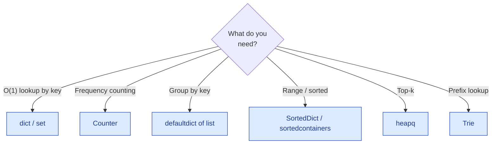

# Hash Tables — the basics

!!! abstract "What this chapter is"
    The "swiss army knife" data structure. **Half of all interview problems** end up using a hash table somewhere. They give you O(1) average-case lookup, insert, and delete by key — and the trick to most "can you do better?" follow-ups is "use a hash map."

    **Reading time:** 3–4 hours cover-to-cover; 30 minutes per problem.

    **Prereqs:** [Linked Lists](../linked-lists/01-linked-list-basics.md) (chains under collisions) and the [Python crash course](../../01-foundations/python-crash-course-for-dsa.md).

---

## Chapter map

<div class="grid cards" markdown>

-   :material-numeric-1-circle:{ .lg .middle } &nbsp; **What is a hash table?**

    Plain English + bucket analogy. The mental model.

-   :material-numeric-2-circle:{ .lg .middle } &nbsp; **Why we need them**

    Which problems collapse from O(n) to O(1) once you have one.

-   :material-numeric-3-circle:{ .lg .middle } &nbsp; **How they work internally**

    Hash function, buckets, collisions, load factor, resize.

-   :material-numeric-4-circle:{ .lg .middle } &nbsp; **Python implementation from scratch**

    A `HashMap` with separate chaining, then with open addressing.

-   :material-numeric-5-circle:{ .lg .middle } &nbsp; **Time & space complexity**

    Why O(1) is "average," and the worst-case caveats.

-   :material-numeric-6-circle:{ .lg .middle } &nbsp; **Built-in Python tools**

    `dict`, `set`, `Counter`, `defaultdict`, `OrderedDict`, `frozenset`.

-   :material-numeric-7-circle:{ .lg .middle } &nbsp; **When to use vs not use**

    Hash map vs array vs sorted set vs Trie.

-   :material-numeric-8-circle:{ .lg .middle } &nbsp; **Common mistakes & gotchas**

    Mutable keys, hash flooding, the iteration-during-mutation trap.

-   :material-numeric-9-circle:{ .lg .middle } &nbsp; **Patterns this connects to**

    Frequency, complement lookup, prefix-sum + map, sliding window state.

-   :material-numeric-10-circle:{ .lg .middle } &nbsp; **Practice problems (40)**

    Each in 5-layer progressive format with follow-ups.

-   :fontawesome-solid-microphone:{ .lg .middle } &nbsp; **How interviewers ask this**

    Phrasings, the "use a hash map" tell.

-   :material-clipboard-check:{ .lg .middle } &nbsp; **Self-check quiz**

    20 questions. If you can answer 18, you've mastered hash tables.

</div>

---

## 1. What is a hash table?

> **Plain English:** an array indexed by **a key of any hashable type**, not just integers. Internally, the runtime turns the key into an integer index using a **hash function**.

The everyday analogy: a **dictionary** (book). You don't read every page to find "octopus" — you jump to **O** based on the first letter, then walk a few entries. The first-letter rule is your hash function; the section is your bucket.

```
   key "apple"   ─┐                     bucket 5: [("apple", 1.20)]
                  ├── hash → 5  ─►
   key "banana"  ─┘                     bucket 7: [("banana", 0.50)]

   key "cherry"  ─── hash → 5  ─►       bucket 5: [("apple", 1.20), ("cherry", 3.00)]
                                                   ↑ collision: separate chaining
```

In Python, the everyday hash table is a **`dict`**:

```python
prices = {"apple": 1.20, "banana": 0.50, "cherry": 3.00}
prices["apple"]            # 1.20 — average O(1)
prices["lychee"] = 4.50    # O(1)
del prices["banana"]       # O(1)
"apple" in prices          # O(1)
```

A **`set`** is the same machinery without values — just keys.

```python
seen = set()
seen.add("apple")
"apple" in seen   # O(1)
```

!!! info "The vocabulary"
    - **Hash function**: maps a key to an integer.
    - **Bucket / slot**: the array entry where keys with that hash (after modulo) land.
    - **Collision**: two distinct keys hashing to the same bucket.
    - **Load factor**: `n / capacity`. Most hash tables resize when this exceeds ~0.7.
    - **Open addressing**: collisions are resolved by probing nearby slots.
    - **Separate chaining**: collisions are resolved by linking entries in a list per bucket.

---

## 2. Why we need hash tables

Many problems boil down to "have I seen X before?" or "what's the count of X?" Without a hash table, those are O(n). With one, **O(1)** average.

### 2.1 The complement trick (Two Sum)

Given an array, find two numbers summing to `target`. Brute force: every pair, O(n²). With a hash map: walk once, for each `x` ask "is `target - x` already in the map?" — O(1) per check, O(n) total.

This single template solves dozens of "find a pair / triple with property P" problems.

### 2.2 Frequency counting

"How many times does X appear?" "Group these by their key." A hash map answers both in one pass.

`collections.Counter` is the canonical tool — built on top of `dict`.

### 2.3 Deduplication

"Have I seen this before?" Hash set. O(n) total to scan a stream and remember unique elements.

### 2.4 Prefix-sum + hash map

"Count subarrays whose sum equals k." Walk once tracking the running prefix sum `s`. The number of valid subarrays ending at the current position is `count_of(s - k)` — answered by the running map of prefix-sum frequencies. **O(n) — versus O(n²) brute force.**

This pattern, called **prefix sum + hash map**, is one of the most-asked patterns in tech interviews.

### 2.5 Hash maps make graphs / trees searchable

When you build a graph from edges or a tree from parent-child pairs, a hash map of `node → neighbours` is the universal storage. Same for "have I visited this node?" sets in BFS/DFS.

---

## 3. How hash tables work internally

The mechanics that explain the gotchas in Part 8.

### 3.1 The hash function

A **hash function** maps any hashable object to an integer. Python's `hash(key)` uses:

- For ints: `hash(n) == n` for small n; for large n, Python uses a SipHash-like hash.
- For strings and bytes: SipHash with a per-process random seed.
- For tuples: combination of the hashes of components.
- For user-defined classes: `id(obj)` by default; override `__hash__` for value-based hashing.

Two requirements:

1. **Equal objects must have equal hashes.** `a == b ⇒ hash(a) == hash(b)`.
2. **Hashes should be well-distributed.** A bad hash creates many collisions, degrading the table to O(n) lookups.

### 3.2 Buckets and the modulo step

After hashing, the runtime computes `bucket_index = hash(key) % capacity`. The capacity is the size of the underlying array (Python uses powers of 2; many other languages use primes).

```
"apple"  hash → 14793... % 16 → bucket 9
"banana" hash → 88231... % 16 → bucket 7
"cherry" hash → 47109... % 16 → bucket 9   ← collision with "apple"
```

### 3.3 Collisions: chaining vs open addressing

**Separate chaining** (Java's `HashMap` historically, Python's old implementation):

```
bucket 9: [("apple", 1.20)] → [("cherry", 3.00)]
```

Each bucket is a linked list (or balanced tree if it gets long).

**Open addressing** (Python's current implementation, since CPython 3.6):

When the target bucket is occupied, probe the **next slot** (linear probing), or **a hash-derived sequence of slots** (Python uses a perturbation scheme).

```
bucket 9: ("apple", 1.20)
bucket 10: ("cherry", 3.00)   ← landed here because 9 was taken
```

Pros and cons:

| | Chaining | Open addressing |
|---|---|---|
| Cache locality | Worse (list nodes) | Better (everything in array) |
| Memory overhead | Higher (linked list per bucket) | Lower |
| Worst case under flood | O(n) per op | O(n) per op |
| Hash flooding mitigation | Easier (use a tree above some threshold) | Needs randomized seed |
| Resize cost | O(n) | O(n) |

CPython's `dict` uses **open addressing with random probing**, plus a separate compact key/value array (the "compact dict" introduced in 3.6) that preserves insertion order.

### 3.4 Load factor and resize

Once the dict's load factor exceeds ~0.66, CPython doubles the underlying array and re-hashes every key. That's an **O(n) operation** that happens log n times across n inserts — **amortized O(1) per insert**.

Most of the time, this is invisible. You'll meet it as the answer to "why is `dict.append` *amortized* O(1) and not strictly O(1)?"

### 3.5 Why the hash must be stable

```python
class Bad:
    def __init__(self, x: int) -> None:
        self.x = x
    def __hash__(self) -> int:
        return hash(self.x)

b = Bad(5)
d = {b: "value"}
b.x = 7                     # mutated AFTER inserting → hash now disagrees
b in d                      # might return False — d's lookup uses the new hash
```

**Mutating a key after insert** breaks the dict. That's why Python only allows hashable (immutable) types as keys: `tuple` (yes), `list` (no), `frozenset` (yes), `set` (no).

### 3.6 The "hash randomization" defense

Python (since 3.3) randomizes string hashing per process, defeating "hash flooding" attacks where an attacker crafts inputs that all collide. This means:

```python
hash("hello") in run #1   ≠   hash("hello") in run #2
```

Don't depend on hash values being stable across processes.

---

## 4. Python implementation from scratch

### 4.1 A `HashMap` with separate chaining

Walking through a from-scratch implementation is a common interview ask. The cleanest version uses chaining:

```python
from __future__ import annotations
from typing import Any, Generic, Iterator, TypeVar

K = TypeVar("K")
V = TypeVar("V")


class HashMap(Generic[K, V]):
    """A toy hash map with separate chaining and resize.

    Real production code uses Python's built-in dict. This is the
    interview-grade implementation.
    """

    _INITIAL_CAPACITY = 16
    _LOAD_FACTOR_HI = 0.75

    def __init__(self) -> None:
        self._capacity: int = self._INITIAL_CAPACITY
        self._size: int = 0
        self._buckets: list[list[tuple[K, V]]] = [[] for _ in range(self._capacity)]

    def __len__(self) -> int:
        return self._size

    def __contains__(self, key: K) -> bool:
        bucket = self._buckets[self._index(key)]
        return any(k == key for k, _ in bucket)

    def __getitem__(self, key: K) -> V:
        bucket = self._buckets[self._index(key)]
        for k, v in bucket:
            if k == key:
                return v
        raise KeyError(key)

    def __setitem__(self, key: K, value: V) -> None:
        idx = self._index(key)
        bucket = self._buckets[idx]
        for i, (k, _) in enumerate(bucket):
            if k == key:
                bucket[i] = (key, value)        # update in place
                return
        bucket.append((key, value))              # new entry
        self._size += 1
        if self._size / self._capacity > self._LOAD_FACTOR_HI:
            self._resize(self._capacity * 2)

    def __delitem__(self, key: K) -> None:
        bucket = self._buckets[self._index(key)]
        for i, (k, _) in enumerate(bucket):
            if k == key:
                bucket.pop(i)
                self._size -= 1
                return
        raise KeyError(key)

    def __iter__(self) -> Iterator[K]:
        for bucket in self._buckets:
            for k, _ in bucket:
                yield k

    def _index(self, key: K) -> int:
        return hash(key) & (self._capacity - 1)   # & is faster than % for power-of-2 capacity

    def _resize(self, new_capacity: int) -> None:
        old = self._buckets
        self._capacity = new_capacity
        self._buckets = [[] for _ in range(new_capacity)]
        self._size = 0
        for bucket in old:
            for k, v in bucket:
                self[k] = v                        # re-insert; updates _size
```

### 4.2 Open addressing variant (sketch)

For interview-grade open addressing with linear probing:

```python
class HashMapOA:
    _TOMBSTONE = object()                          # sentinel for deleted entries

    def __init__(self) -> None:
        self._capacity = 16
        self._size = 0
        self._keys: list[Any] = [None] * self._capacity
        self._values: list[Any] = [None] * self._capacity

    def _probe(self, key: Any) -> int:
        idx = hash(key) & (self._capacity - 1)
        while self._keys[idx] is not None and self._keys[idx] != key and self._keys[idx] is not self._TOMBSTONE:
            idx = (idx + 1) & (self._capacity - 1)
        return idx
    # __getitem__, __setitem__, __delitem__, _resize: similar to chaining version.
```

The interview point: **deletion needs a tombstone** — clearing the slot would break probe chains for other keys.

### 4.3 What changes in Python's actual implementation

CPython's `dict` is significantly more sophisticated:

- **Compact representation**: keys/values live in a dense array; the bucket table just stores indices.
- **Random probing**: not just linear; reduces clustering.
- **Insertion-order preserving** (since 3.7).
- **Shared-key dicts** for instances of the same class (memory optimization).

You won't reproduce CPython in an interview. Walking through Section 4.1 is enough.

---

## 5. Time & space complexity

The full table.

### Average case (uniform hash, load factor < 0.7)

| Operation | Code | Time |
|---|---|---|
| Lookup | `d[k]` | **O(1)** |
| Membership | `k in d` | **O(1)** |
| Insert | `d[k] = v` | **O(1) amortized** |
| Delete | `del d[k]` | **O(1)** |
| Iteration | `for k in d` | **O(n)** total |
| Length | `len(d)` | **O(1)** |
| Update | `d.update(other)` | **O(\|other\|)** |
| Copy | `d.copy()` | **O(n)** |

### Worst case

Every operation degrades to **O(n)** when:

- Hash function is bad (many keys collide on the same bucket).
- An attacker crafts colliding keys (hash flooding).
- Custom `__hash__` returns a constant.

Python defends against the first two with random string hashing; you defend against the third by writing sane `__hash__` methods.

### Space

- An empty Python `dict`: ~232 bytes.
- Per entry: ~50 bytes overhead plus the key and value.
- For n entries: roughly `48 * capacity + size of keys + size of values`. Capacity is the next power of 2 ≥ `n / 0.66`.

For 10⁶ entries, expect ~80–100 MB total — non-negligible.

---

## 6. Built-in Python tools

The whole `dict` family. Memorize when each shines.

### 6.1 `dict` — the daily driver

```python
d = {}
d = {"a": 1, "b": 2}
d["c"] = 3
d.pop("a", default=None)              # remove if present, else return default
d.get("z", 0)                         # safe lookup with default
d.setdefault("x", []).append(...)     # canonical "default-list" idiom
d.keys() / d.values() / d.items()
{**d1, **d2}                          # merge (3.5+)
d1 | d2                               # merge (3.9+); right-hand wins on conflict
```

### 6.2 `set` and `frozenset`

```python
s = set()
s = {1, 2, 3}                         # set literal
s.add(4); s.discard(5); s.remove(3)   # discard ignores missing; remove raises
a & b   # intersection
a | b   # union
a - b   # difference
a ^ b   # symmetric difference
a <= b  # subset
frozenset({1, 2, 3})                  # hashable, can be a dict key
```

### 6.3 `collections.Counter`

```python
from collections import Counter
c = Counter("mississippi")            # Counter({'i': 4, 's': 4, 'p': 2, 'm': 1})
c.most_common(2)                      # [('i', 4), ('s', 4)]
c["a"]                                # 0 (no KeyError on missing)
c["i"] += 1
a + b                                 # element-wise add (new Counter)
a - b                                 # element-wise subtract, drops <= 0
a & b                                 # element-wise min
a | b                                 # element-wise max
c.subtract(other)                     # in-place; allows negatives
```

### 6.4 `collections.defaultdict`

```python
from collections import defaultdict

groups: defaultdict[str, list[int]] = defaultdict(list)
groups["primes"].append(2)            # auto-creates empty list

counts: defaultdict[str, int] = defaultdict(int)
for c in s: counts[c] += 1
```

### 6.5 `collections.OrderedDict`

Today's `dict` already preserves insertion order, so `OrderedDict` is mostly redundant. It still has a few unique tricks:

```python
from collections import OrderedDict
od = OrderedDict()
od.move_to_end("a")                   # send to end
od.move_to_end("a", last=False)       # send to front
od.popitem(last=False)                # FIFO pop
```

Used in LRU-cache implementations (Section 24 of the linked-list chapter).

### 6.6 `dict.fromkeys`, comprehensions

```python
{k: 0 for k in keys}                  # comprehension
dict.fromkeys(keys, 0)                # same; default value is shared (careful with mutables)
```

!!! warning "`fromkeys` and mutable defaults"
    `dict.fromkeys(keys, [])` gives every key the **same** list object. Mutating one mutates all. Use a comprehension instead: `{k: [] for k in keys}`.

---

## 7. When to use vs not use

### Use a hash map when…

- ✅ You need O(1) lookup by key.
- ✅ You're counting frequencies.
- ✅ You're deduping.
- ✅ You're caching expensive results (memoization).
- ✅ You're building a graph from edges.

### Avoid hash maps when…

- ❌ You need ordered keys (for range queries) → use a sorted structure (`SortedDict`).
- ❌ You need to find the k smallest/largest → use a heap.
- ❌ Keys have lots of structure you can exploit (e.g., they're integers in `[0, n)`) — an array is faster.
- ❌ You can't afford the per-entry memory overhead.
- ❌ You need to operate on prefixes of keys → use a Trie.

### Decision tree



---

## 8. Common mistakes & gotchas

The 10 traps that fail interviews.

!!! warning "Trap 1 — Mutating a key after insert"
    Lists, sets, and custom classes whose `__hash__` depends on mutable state break the dict if mutated. **Use only immutable keys.** For sets-as-keys, use `frozenset`.

!!! warning "Trap 2 — Iterating a dict while modifying it"
    ```python
    for k in d:
        if d[k] < 0: del d[k]   # ❌ RuntimeError: dictionary changed size during iteration
    ```
    **Fix:** iterate over `list(d)` or build a list of keys to delete first.

!!! warning "Trap 3 — Default-mutable trap with `dict.fromkeys`"
    Already covered in §6.6.

!!! warning "Trap 4 — Hash randomization across runs"
    Don't expect `hash("foo")` to return the same value next run. If you need reproducibility, use a deterministic hash (e.g., `hashlib.sha256`).

!!! warning "Trap 5 — `dict[missing_key]` raises `KeyError`"
    Use `d.get(key, default)` for safe lookup, or `defaultdict` for auto-init.

!!! warning "Trap 6 — Over-using `.keys()` / `.values()` / `.items()`"
    These return *views*, not lists. Iterating is O(1) extra memory; converting to a list with `list(d.keys())` is O(n). The view also reflects mutations — gotcha when you cache the view and the dict changes.

!!! warning "Trap 7 — Counter equality vs Counter ordering"
    `Counter(s) == Counter(t)` is fine for anagram tests. `Counter(s) < Counter(t)` is **not** elementwise comparison — Counters inherit dict ordering rules (which differ across Python versions).

!!! warning "Trap 8 — Forgetting that `set` is unordered"
    ```python
    s = {3, 1, 4, 1, 5, 9}
    list(s)         # [1, 3, 4, 5, 9] — but DON'T rely on this order
    ```
    For ordered uniqueness, use `dict.fromkeys(seq)` (preserves insertion order).

!!! warning "Trap 9 — Confusing reference equality with value equality"
    Custom classes' `__eq__` and `__hash__` must agree. If you override one, override both.

!!! warning "Trap 10 — Storing huge keys"
    Hashing a 1 MB string each time you look it up is **O(1 MB)**, not O(1). Hash performance assumes keys are small.

---

## 9. Patterns this connects to

| Pattern | When you see it | Example problem |
|---|---|---|
| **Complement lookup** | "Find pair / triple summing to X" | Two Sum (#1) |
| **Frequency counting** | "How often does X occur?" | Top-K Frequent (#12) |
| **Anagram / multiset signature** | "Group by character bag" | Group Anagrams (#11) |
| **Prefix sum + hash** | "Count subarrays with sum k / divisible by k" | Subarray Sum = K (#14) |
| **Sliding window state** | "Longest substring with property P" | Longest Without Repeating (#13) |
| **Hash set membership** | "Have I seen X?" | Contains Duplicate (#2), Longest Consecutive (#15) |
| **Hash map of seen → index** | "Find duplicate / cycle in iteration" | Happy Number (#5) |
| **Hash + DLL for O(1) eviction** | LRU / LFU caches | (See linked-lists chapter) |

---

## 10. Practice problems (40)

Same v3 5-layer format. The first 10 are the canonical "I'd reach for a hash map" problems.

For brevity, problems already covered in detail in **other chapters** (e.g., Two Sum in arrays, Anagrams in strings) get a tighter hash-table-angle treatment with a back-link.

---

### Problem 1 — Two Sum

<span class="diff-easy">Easy</span> &nbsp; <span class="company-tag">Google</span> <span class="company-tag">Amazon</span> <span class="company-tag">Meta</span> <span class="company-tag">Microsoft</span> <span class="company-tag">Adobe</span> <span class="company-tag">TCS</span>

> Given an array of integers `nums` and an integer `target`, return indices `[i, j]` with `nums[i] + nums[j] == target`. Each input has exactly one solution; you may not use the same element twice.

(Full v3 treatment in [Arrays — Problem 1](../arrays/01-array-basics.md#problem-1-two-sum). The hash-table angle below.)

#### 🌍 Real-World Usage

- **Fraud detection** — pair of transactions summing to a suspicious total.
- **Spreadsheet formulas** — Excel "find two cells summing to X."
- **Game inventory** — two upgrade items costing exactly the player's budget.

#### 🐍 The hash-table answer

```python
def two_sum(nums: list[int], target: int) -> list[int]:
    seen: dict[int, int] = {}            # value → index
    for i, num in enumerate(nums):
        complement = target - num
        if complement in seen:
            return [seen[complement], i]
        seen[num] = i
    return []
```

**Insight:** for each `num`, the value we need (`target - num`) is fixed. A hash map answers "have I seen the complement?" in O(1).

#### ⏱️ Complexity

O(n) time, O(n) space.

#### 🎯 Pattern Used

**Complement lookup** — the canonical hash-map pattern.

#### 🔄 Interviewer Follow-ups

??? question "Follow-up 1 — Sorted input."
    Two-pointer; O(1) extra space. (See arrays chapter.)

??? question "Follow-up 2 — Return all pairs."
    Map value → list of indices. Emit on every match.

??? question "Follow-up 3 — Three / four / k-sum."
    3Sum: sort + two-pointer for the inner loop. 4Sum II: split into two halves, hash one, look up complements (Problem 16).

??? question "Follow-up 4 — Stream input."
    Same algorithm; emit pairs as they arrive.

#### 🐛 Common Bugs

1. **Adding to `seen` BEFORE checking** — produces self-pairs like `[1, 1]` from `nums = [3], target = 6`.
2. **Returning indices in the wrong order** — convention is `[earlier, later]`.

---

### Problem 2 — Contains Duplicate

<span class="diff-easy">Easy</span> &nbsp; <span class="company-tag">Amazon</span> <span class="company-tag">Google</span> <span class="company-tag">Microsoft</span> <span class="company-tag">Apple</span>

> Given an integer array `nums`, return `True` if any value appears at least twice.

#### 📖 Story Mode

`[1, 2, 3, 1]` → True. `[1, 2, 3, 4]` → False.

#### 🌍 Real-World Usage

- **Login systems** — username uniqueness check.
- **Database UNIQUE enforcement.**
- **Plagiarism / fingerprint detection.**

#### 🐍 5 Layers of Solution

=== "Layer 1 — Brute"

    ```python
    def contains_duplicate_brute(nums):
        for i in range(len(nums)):
            for j in range(i+1, len(nums)):
                if nums[i] == nums[j]: return True
        return False
    ```

    O(n²).

=== "Layer 2 — Sort + adjacent compare"

    ```python
    def contains_duplicate_sort(nums):
        nums = sorted(nums)
        return any(nums[i] == nums[i-1] for i in range(1, len(nums)))
    ```

    O(n log n) time, O(n) for the sort copy.

=== "Layer 3 — Hash set"

    ```python
    def contains_duplicate(nums):
        seen = set()
        for n in nums:
            if n in seen: return True
            seen.add(n)
        return False
    ```

    O(n) time, O(n) space.

=== "Layer 4 — Pythonic one-liner"

    ```python
    def contains_duplicate(nums):
        return len(set(nums)) != len(nums)
    ```

    Same complexity. Most concise. In an interview, write Layer 3 first to show you understand the loop.

=== "Layer 5 — Variants"

    **Variant A — Contains nearby duplicate** (within k indices). Map value → most recent index; check distance. (LeetCode 219.)

    **Variant B — Contains nearby almost duplicate** (within k indices AND value diff ≤ t). Bucket-sort by value; check current and adjacent buckets. (LeetCode 220.)

    **Variant C — Find ALL duplicates.** See Problem 17.

#### ⏱️ Complexity

O(n) time, O(n) space.

#### 🎯 Pattern Used

**Hash set membership.** The most reused trick in array / string problems.

#### 🐛 Common Bugs

1. **Using a `list` instead of a `set` for `seen`** — `in list` is O(n) → algorithm becomes O(n²) sneaky.
2. **Adding before checking.**

#### 🏢 Sample Interviewer Quote

> *"Determine whether this array has any duplicates."*

Your opener: *"Walk once with a hash set. If we see something twice, return True. O(n) time, O(n) space. The Pythonic check `len(set(nums)) != len(nums)` is the same algorithm."*

---

### Problem 3 — Valid Anagram

<span class="diff-easy">Easy</span> &nbsp; <span class="company-tag">Google</span> <span class="company-tag">Amazon</span> <span class="company-tag">Meta</span> <span class="company-tag">Microsoft</span>

> Given two strings `s` and `t`, return `True` iff `t` is an anagram of `s`.

(Full treatment in [Strings — Problem 1](../strings/01-string-basics.md#problem-1-valid-anagram).)

#### 🐍 The hash-table answer

```python
from collections import Counter

def is_anagram(s: str, t: str) -> bool:
    if len(s) != len(t): return False
    return Counter(s) == Counter(t)
```

#### 🎯 Pattern Used

**Frequency-count signature.** Two strings are anagrams iff their character histograms are equal.

---

### Problem 4 — Intersection of Two Arrays

<span class="diff-easy">Easy</span> &nbsp; <span class="company-tag">Amazon</span> <span class="company-tag">Microsoft</span> <span class="company-tag">Apple</span>

> Return an array of unique values that appear in **both** input arrays. (LeetCode 349.)

#### 📖 Story Mode

`[1,2,2,1]` and `[2,2]` → `[2]`. (Each value appears at most once.)

`[4,9,5]` and `[9,4,9,8,4]` → `[4,9]` (or `[9,4]` — order unspecified).

#### 🌍 Real-World Usage

- **SQL inner-join** on a single column.
- **Set algebra** in analytics queries.
- **Deduped overlap** between two label sets.

#### 🐍 Solution

```python
def intersection(nums1, nums2):
    return list(set(nums1) & set(nums2))
```

O(n + m) time, O(n + m) space.

#### 🔄 Interviewer Follow-ups

??? question "Follow-up 1 — Counted intersection (Intersection of Two Arrays II, LC 350)."
    `Counter(nums1) & Counter(nums2)` — element-wise minimum.

??? question "Follow-up 2 — One array fits in memory, the other doesn't."
    Hash the smaller; stream the larger.

??? question "Follow-up 3 — Both sorted."
    Two-pointer merge — O(n + m), O(1) extra.

??? question "Follow-up 4 — Sort once, binary-search many times."
    For repeated queries against a fixed array, sort it once and binary-search.

??? question "Follow-up 5 — Multi-array intersection."
    Reduce: `set(arr1) & set(arr2) & set(arr3) ...`. O(total).

#### 🐛 Common Bugs

1. **Returning duplicates** — convert to `set` first.
2. **Forgetting to convert back to list** — interviewer might want `list[int]`.

---

### Problem 5 — Happy Number

<span class="diff-easy">Easy</span> &nbsp; <span class="company-tag">Google</span> <span class="company-tag">Amazon</span> <span class="company-tag">Apple</span>

> A "happy number" is one where iteratively summing the **squares of digits** eventually yields 1. Otherwise, the iteration enters a cycle. Determine whether `n` is happy. (LeetCode 202.)

#### 📖 Story Mode

19 → 1²+9² = 82 → 8²+2² = 68 → 6²+8² = 100 → 1²+0²+0² = 1. **Happy.**

2 → 4 → 16 → 37 → 58 → 89 → 145 → 42 → 20 → 4 (cycle!). **Not happy.**

#### 🌍 Real-World Usage

- **Numerological puzzles.**
- **Random-walk cycle detection** at small scale.

#### 🧠 Thinking Process

The iteration eventually cycles or reaches 1. Detect the cycle with either:

- **Hash set:** track all numbers seen; return False on revisit.
- **Floyd's:** slow/fast on the iteration.

#### 🐍 5 Layers of Solution

=== "Layer 2 — Hash set"

    ```python
    def is_happy(n):
        def step(x):
            return sum(int(c) ** 2 for c in str(x))
        seen = set()
        while n != 1 and n not in seen:
            seen.add(n); n = step(n)
        return n == 1
    ```

    O(log n) per step (number of digits) × cycle length. Effectively O(1) for typical inputs.

=== "Layer 3 — Floyd's tortoise and hare (O(1) memory)"

    ```python
    def is_happy_floyd(n):
        def step(x):
            return sum(int(c) ** 2 for c in str(x))
        slow = n
        fast = step(n)
        while fast != 1 and slow != fast:
            slow = step(slow)
            fast = step(step(fast))
        return fast == 1
    ```

=== "Layer 4 — Production-ready"

    ```python
    from __future__ import annotations


    def is_happy(n: int) -> bool:
        """Return True iff repeatedly summing squared digits eventually hits 1.

        Time:  O(log n) per step; total bounded by a small constant.
        Space: O(1) using Floyd's; O(log n) using a hash set.

        Example:
            >>> is_happy(19)
            True
            >>> is_happy(2)
            False
        """
        def step(x: int) -> int:
            total = 0
            while x:
                d = x % 10
                total += d * d
                x //= 10
            return total

        slow = n
        fast = step(n)
        while fast != 1 and slow != fast:
            slow = step(slow)
            fast = step(step(fast))
        return fast == 1
    ```

=== "Layer 5 — Variants"

    **Variant A — sum of cubes.** Different cycle structure; same algorithm.

    **Variant B — base-k digit-square sum.** Replace `% 10` with `% k`.

    **Variant C — track the FULL chain.** Hash set version; helps if you need to return the sequence.

#### ⏱️ Complexity

- **Time: O(1)** in practice (any number's iteration converges to 1 or to a known cycle of length 8 within ~12 steps).
- **Space: O(1)** with Floyd's.

#### 🎯 Pattern Used

**Cycle detection on a function iteration.** Same template as Problem 16 in linked-lists.

---

### Problem 6 — Single Number

<span class="diff-easy">Easy</span> &nbsp; <span class="company-tag">Amazon</span> <span class="company-tag">Microsoft</span> <span class="company-tag">Apple</span>

> Every element in `nums` appears twice except for one. Find that one. **O(n) time, O(1) memory required.**

#### 📖 Story Mode

`[2, 2, 1]` → 1. `[4, 1, 2, 1, 2]` → 4.

#### 🐍 Solution — XOR (canonical), but hash also works

The O(1)-space answer is XOR (`a ^ a = 0, a ^ 0 = a`):

```python
def single_number_xor(nums):
    result = 0
    for n in nums: result ^= n
    return result
```

The hash-table answer (O(n) memory):

```python
from collections import Counter

def single_number_hash(nums):
    return next(n for n, c in Counter(nums).items() if c == 1)
```

The interview question for THIS chapter is: explain when you'd reach for the hash version (when the "appears twice" constraint is relaxed and you need to find "the one with frequency != some k").

#### 🔄 Interviewer Follow-ups

??? question "Follow-up 1 — Each element appears 3x except one."
    Bit-counting: for each bit, sum across all numbers; the "single" bit is the one whose total count isn't divisible by 3.

??? question "Follow-up 2 — Two elements each appear once, all others 2x."
    XOR all numbers gives `x ^ y`. Pick a set bit; partition by that bit; XOR each group.

---

### Problem 7 — First Unique Character in a String

<span class="diff-easy">Easy</span> &nbsp; <span class="company-tag">Amazon</span> <span class="company-tag">Bloomberg</span> <span class="company-tag">Microsoft</span>

> Return the index of the first non-repeating character in `s`, or -1.

(Full treatment in [Strings — Problem 5](../strings/01-string-basics.md#problem-5-first-unique-character-in-a-string).)

#### 🐍 Hash-table answer

```python
from collections import Counter

def first_uniq_char(s):
    freq = Counter(s)
    for i, c in enumerate(s):
        if freq[c] == 1: return i
    return -1
```

Two passes, O(n) total.

---

### Problem 8 — Roman to Integer

<span class="diff-easy">Easy</span> &nbsp; <span class="company-tag">Amazon</span> <span class="company-tag">Google</span> <span class="company-tag">Microsoft</span>

> (Full treatment in [Strings — Problem 7](../strings/01-string-basics.md#problem-7-roman-to-integer).)

The hash-table angle: the value lookup `{'I': 1, 'V': 5, ...}` is the simplest possible use of a `dict`. Mention this when interviewers ask "how is this a hash-table problem?"

---

### Problem 9 — Word Pattern

<span class="diff-easy">Easy</span> &nbsp; <span class="company-tag">Microsoft</span> <span class="company-tag">Amazon</span>

> (Full treatment in [Strings — Problem 23](../strings/01-string-basics.md#problem-23-word-pattern).)

The hash-table angle: a **bidirectional mapping** uses two dicts at once — `char → word` and `word → char`. Both must remain consistent.

---

### Problem 10 — Isomorphic Strings

<span class="diff-easy">Easy</span> &nbsp; <span class="company-tag">Google</span> <span class="company-tag">Amazon</span> <span class="company-tag">LinkedIn</span>

> Two strings `s` and `t` are isomorphic if there's a 1-to-1 mapping from characters of `s` to characters of `t` (and vice-versa) such that the mapping turns `s` into `t`.

#### 📖 Story Mode

`"egg"` & `"add"` → True (`e ↔ a`, `g ↔ d`).
`"foo"` & `"bar"` → False (`o` would have to map to two different chars).
`"paper"` & `"title"` → True.

#### 🐍 Solution — bidirectional dict

```python
def is_isomorphic(s, t):
    if len(s) != len(t): return False
    s2t, t2s = {}, {}
    for a, b in zip(s, t):
        if a in s2t and s2t[a] != b: return False
        if b in t2s and t2s[b] != a: return False
        s2t[a] = b
        t2s[b] = a
    return True
```

O(n) time, O(k) space.

#### 🐛 Common Bugs

1. **One-direction mapping** — misses the case where two `s` chars map to the same `t` char.
2. **Counting equal pairs without checking consistency.**

#### 🏢 Sample Interviewer Quote

> *"Tell me whether these two strings are isomorphic."*

Your opener: *"Two dicts: s_to_t and t_to_s. Walk in lockstep. Each step, both directions must agree (or be empty). O(n) time, O(k) space."*

---

### Problem 11 — Group Anagrams

<span class="diff-medium">Medium</span> &nbsp; <span class="company-tag">Amazon</span> <span class="company-tag">Google</span> <span class="company-tag">Meta</span> <span class="company-tag">Microsoft</span>

> (Full treatment in [Strings — Problem 12](../strings/01-string-basics.md#problem-12-group-anagrams).)

Hash-table angle: each anagram class shares a **canonical signature** (sorted-string or count-tuple). Bucket strings by signature into a `defaultdict(list)`.

```python
from collections import defaultdict

def group_anagrams(strs):
    groups = defaultdict(list)
    for s in strs:
        groups["".join(sorted(s))].append(s)
    return list(groups.values())
```

This is the "hash signature" pattern in its purest form.

---

### Problem 12 — Top K Frequent Elements

<span class="diff-medium">Medium</span> &nbsp; <span class="company-tag">Amazon</span> <span class="company-tag">Google</span> <span class="company-tag">Meta</span> <span class="company-tag">Microsoft</span> <span class="company-tag">Bloomberg</span>

> Given an integer array `nums` and integer `k`, return the `k` most frequent elements. (LeetCode 347.)

#### 📖 Story Mode

`nums = [1, 1, 1, 2, 2, 3]`, `k = 2` → `[1, 2]` (1 appears 3x, 2 appears 2x).

#### 🌍 Real-World Usage

- **Search auto-complete** — top queries.
- **Trending topics** on social platforms.
- **Anomaly detection** — top abusive IPs.

#### 🧠 Thinking Process

Three reasonable approaches:

**A — sort by count.** O(n log n).
**B — heap of size k.** O(n log k).
**C — bucket sort by frequency.** O(n) — since frequency is bounded by n.

C is the optimal answer.

#### 🐍 5 Layers of Solution

=== "Layer 1 — Sort"

    ```python
    from collections import Counter

    def top_k_frequent_sort(nums, k):
        return [v for v, _ in Counter(nums).most_common(k)]
    ```

    `Counter.most_common` uses a heap internally; effectively O(n log k).

=== "Layer 2 — Min-heap of size k"

    ```python
    import heapq
    from collections import Counter

    def top_k_frequent_heap(nums, k):
        cnt = Counter(nums)
        return heapq.nlargest(k, cnt.keys(), key=cnt.get)
    ```

    O(n log k).

=== "Layer 3 — Bucket sort (optimal)"

    ```python
    from collections import Counter

    def top_k_frequent(nums, k):
        cnt = Counter(nums)
        # bucket[f] = list of values with frequency f
        buckets: list[list[int]] = [[] for _ in range(len(nums) + 1)]
        for v, f in cnt.items():
            buckets[f].append(v)
        result: list[int] = []
        for f in range(len(buckets) - 1, 0, -1):
            for v in buckets[f]:
                result.append(v)
                if len(result) == k:
                    return result
        return result
    ```

    **O(n) time, O(n) space.** No log factor.

=== "Layer 4 — Production-ready"

    ```python
    from __future__ import annotations
    from collections import Counter


    def top_k_frequent(nums: list[int], k: int) -> list[int]:
        """Return the k most frequent values in nums.

        Time:  O(n) using bucket sort by frequency.
        Space: O(n).

        Example:
            >>> sorted(top_k_frequent([1, 1, 1, 2, 2, 3], 2))
            [1, 2]
        """
        if k <= 0 or not nums:
            return []
        cnt = Counter(nums)
        buckets: list[list[int]] = [[] for _ in range(len(nums) + 1)]
        for v, f in cnt.items():
            buckets[f].append(v)
        result: list[int] = []
        for f in range(len(buckets) - 1, 0, -1):
            for v in buckets[f]:
                result.append(v)
                if len(result) == k:
                    return result
        return result
    ```

=== "Layer 5 — Variants"

    **Variant A — Top-k frequent strings.** Same algorithm; tiebreak by lexicographic order.

    **Variant B — Top-k *least* frequent.** Same buckets, walk from f=1 upward.

    **Variant C — Streaming top-k.** Maintain a heap of size k. O(log k) per element.

    **Variant D — Approximate top-k for very large streams.** Count-Min Sketch + heap.

#### 🔍 Dry Run

`[1, 1, 1, 2, 2, 3]`, k=2:

Counter: `{1: 3, 2: 2, 3: 1}`.

buckets:
- `buckets[1] = [3]`
- `buckets[2] = [2]`
- `buckets[3] = [1]`
- (others empty)

Walk from f=6 down to 1: empty until f=3 → take 1 (result=[1]); f=2 → take 2 (result=[1,2], k reached). Return `[1, 2]`. ✅

#### ⏱️ Complexity

- **Time: O(n)** with bucket sort.
- **Space: O(n)**.

#### 🎯 Pattern Used

**Frequency map + bucket sort by frequency.** When frequencies are bounded by a small range, bucket sort beats heap sort.

#### 🐛 Common Bugs

1. **Allocating buckets of size `max(freq)` instead of `n + 1`** — works but more error-prone.
2. **Walking buckets from 0 → n** instead of n → 0.
3. **Forgetting to early-return on `len(result) == k`** — wastes work but correct.

---

### Problem 13 — Longest Substring Without Repeating Characters

<span class="diff-medium">Medium</span> &nbsp; <span class="company-tag">Google</span> <span class="company-tag">Amazon</span> <span class="company-tag">Meta</span> <span class="company-tag">Microsoft</span>

> (Full treatment in [Strings — Problem 11](../strings/01-string-basics.md#problem-11-longest-substring-without-repeating-characters).)

Hash-table angle: a `dict` of `char → last_index` lets the sliding window jump the left pointer in O(1) on a duplicate. Without the dict it'd be O(n²).

---

### Problem 14 — Subarray Sum Equals K

<span class="diff-medium">Medium</span> &nbsp; <span class="company-tag">Google</span> <span class="company-tag">Amazon</span> <span class="company-tag">Meta</span> <span class="company-tag">Bloomberg</span>

> Given an integer array `nums` and integer `k`, return the **total number** of contiguous subarrays whose sum equals `k`.

#### 📖 Story Mode

`nums = [1, 1, 1]`, `k = 2` → 2 (`[1,1]` at indices 0-1 and 1-2).
`nums = [1, 2, 3]`, `k = 3` → 2 (`[1,2]` and `[3]`).

#### 🌍 Real-World Usage

- **Financial / accounting** — subset of consecutive transactions summing to a given total.
- **Time-series anomaly detection** — windows whose sum hits a threshold.
- **Genomics** — k-mer with target GC count.

#### 🧠 Thinking Process

**Brute:** every (i, j) pair, sum the subarray. O(n³).

**Cumulative + brute:** prefix sum array `s[]`; subarray sum `[i, j]` is `s[j+1] - s[i]`. O(n²) — still slow for n = 10⁵.

**Prefix-sum + hash map (the killer):** as we walk, maintain `count[s]` = number of times prefix-sum `s` has been seen. The number of subarrays ending at the current index with sum `k` is `count[s - k]`. **O(n).**

#### 🐍 5 Layers of Solution

=== "Layer 1 — Brute"

    ```python
    def subarray_sum_brute(nums, k):
        count = 0
        for i in range(len(nums)):
            s = 0
            for j in range(i, len(nums)):
                s += nums[j]
                if s == k: count += 1
        return count
    ```

    O(n²).

=== "Layer 2 — Prefix-sum + hash map"

    ```python
    from collections import defaultdict

    def subarray_sum(nums, k):
        prefix_count: dict[int, int] = defaultdict(int)
        prefix_count[0] = 1                  # empty prefix, sum 0
        running = 0
        result = 0
        for n in nums:
            running += n
            result += prefix_count[running - k]
            prefix_count[running] += 1
        return result
    ```

    **O(n) time, O(n) space.**

=== "Layer 3 — Edge-case-hardened"

    Same logic; handle empty `nums`:

    ```python
    def subarray_sum(nums, k):
        if not nums: return 0
        prefix_count = {0: 1}
        running = 0
        result = 0
        for n in nums:
            running += n
            result += prefix_count.get(running - k, 0)
            prefix_count[running] = prefix_count.get(running, 0) + 1
        return result
    ```

=== "Layer 4 — Production-ready"

    ```python
    from __future__ import annotations
    from collections import defaultdict


    def subarray_sum(nums: list[int], k: int) -> int:
        """Count contiguous subarrays of nums whose sum equals k.

        Time:  O(n).
        Space: O(n) — prefix-sum frequency map.

        Example:
            >>> subarray_sum([1, 1, 1], 2)
            2
            >>> subarray_sum([1, 2, 3], 3)
            2
        """
        prefix_count: defaultdict[int, int] = defaultdict(int)
        prefix_count[0] = 1
        running = 0
        result = 0
        for n in nums:
            running += n
            result += prefix_count[running - k]
            prefix_count[running] += 1
        return result
    ```

=== "Layer 5 — Variants"

    **Variant A — Subarrays Sums Divisible by K (LC 974).** Track `running % k` instead of `running`. Same template.

    **Variant B — Continuous Subarray Sum (LC 523).** Find any subarray of length ≥ 2 whose sum is a multiple of `k`. Track `(running % k) → first index`.

    **Variant C — Maximum subarray sum.** Different problem (Kadane); not a hash-map problem.

    **Variant D — Subarrays with at most k.** Sliding window; not hash-map.

#### 🔍 Dry Run

`nums = [1, 1, 1]`, `k = 2`:

| step | n | running | running - k | prefix_count[r-k] | result | prefix_count after |
|------|---|---------|-------------|-------------------|--------|---------------------|
| 0 | 1 | 1 | -1 | 0 | 0 | {0:1, 1:1} |
| 1 | 1 | 2 | 0 | 1 | 1 | {0:1, 1:1, 2:1} |
| 2 | 1 | 3 | 1 | 1 | 2 | {0:1, 1:1, 2:1, 3:1} |

Return: 2. ✅

#### ⏱️ Complexity

- **Time: O(n)**.
- **Space: O(n)**.

#### 🎯 Pattern Used

**Prefix sum + hash map.** One of the most-asked patterns in tech interviews. Memorize the template.

#### 🔄 Interviewer Follow-ups

??? question "Follow-up 1 — Subarray sum divisible by k."
    Variant A.

??? question "Follow-up 2 — Subarray sum equal to k with **distinct** elements only."
    Add a "seen-in-current-window" check; use sliding window instead.

??? question "Follow-up 3 — Why does the `prefix_count[0] = 1` initialization matter?"
    To count subarrays starting at index 0. The "empty prefix" has sum 0 with multiplicity 1.

??? question "Follow-up 4 — Memory budget."
    O(n) for the map; can't easily reduce because all distinct prefix sums must be tracked.

??? question "Follow-up 5 — Stream input."
    Same algorithm — fully one-pass.

#### 🐛 Common Bugs

1. **Forgetting `prefix_count[0] = 1`** — misses subarrays starting at index 0.
2. **Updating `prefix_count[running]` BEFORE the lookup** — would count `running - running = 0` as a hit on every empty subarray.
3. **Using a `set` instead of `dict`** — counts uniqueness, not occurrences.

#### ✅ Edge Cases Checklist

- [ ] Empty array → 0
- [ ] Single element equal to k → 1
- [ ] All zeros, k = 0 → triangle number `n(n+1)/2`
- [ ] Negative numbers — works (prefix sum handles them)
- [ ] All elements same value

#### 🏢 Sample Interviewer Quote

> *"Count the contiguous subarrays summing to k. Linear time."*

Your opener: *"Prefix-sum + hash map. As I walk, maintain a frequency map of prefix sums seen so far. The number of valid subarrays ending at the current position is the count of `running - k` in the map. O(n) time, O(n) space."*

---

### Problem 15 — Longest Consecutive Sequence

<span class="diff-medium">Medium</span> &nbsp; <span class="company-tag">Google</span> <span class="company-tag">Amazon</span> <span class="company-tag">Meta</span> <span class="company-tag">Microsoft</span>

> Given an unsorted array of integers, return the length of the longest sequence of **consecutive integers**. Required: **O(n)** time. (LeetCode 128.)

#### 📖 Story Mode

`[100, 4, 200, 1, 3, 2]` → 4 (the sequence `1, 2, 3, 4`).

#### 🌍 Real-World Usage

- **Time-series gap analysis** — longest run of consecutive timestamps.
- **Genomic ranges** — longest contiguous index span.
- **Order tracking** — longest streak of consecutive order IDs received.

#### 🧠 Thinking Process

**Sort:** O(n log n) — fast enough but disqualifies for "O(n)."

**Hash set with sequence-start check:** put all numbers in a set. For each `n`, only start counting if `n - 1` is NOT in the set (so `n` is the head of its sequence). Then walk `n + 1, n + 2, ...` while in the set. Total work is **O(n)** — every number is visited at most twice.

#### 🐍 5 Layers of Solution

=== "Layer 1 — Sort"

    ```python
    def longest_consecutive_sort(nums):
        if not nums: return 0
        nums = sorted(set(nums))
        best = curr = 1
        for i in range(1, len(nums)):
            if nums[i] == nums[i-1] + 1:
                curr += 1
                best = max(best, curr)
            else:
                curr = 1
        return best
    ```

    O(n log n).

=== "Layer 2 — Hash set with start-only walk (optimal)"

    ```python
    def longest_consecutive(nums):
        s = set(nums)
        best = 0
        for n in s:
            if n - 1 not in s:                # n is start of a sequence
                length = 1
                curr = n + 1
                while curr in s:
                    length += 1
                    curr += 1
                best = max(best, length)
        return best
    ```

    **O(n) time, O(n) space.**

=== "Layer 3 — Edge-case-hardened"

    Same; explicit empty check.

=== "Layer 4 — Production-ready"

    ```python
    from __future__ import annotations


    def longest_consecutive(nums: list[int]) -> int:
        """Length of the longest consecutive integer sequence in nums.

        Time:  O(n) — each value is visited at most twice.
        Space: O(n) — hash set.

        Example:
            >>> longest_consecutive([100, 4, 200, 1, 3, 2])
            4
        """
        if not nums:
            return 0
        s = set(nums)
        best = 0
        for n in s:
            if n - 1 in s:
                continue
            length = 1
            curr = n + 1
            while curr in s:
                length += 1
                curr += 1
            if length > best:
                best = length
        return best
    ```

=== "Layer 5 — Variants"

    **Variant A — return THE longest sequence (not just length).** Track `(start, length)` of the best.

    **Variant B — count the number of disjoint sequences.** Count starts.

    **Variant C — sequences with step k instead of 1.** Replace `n + 1` with `n + k`.

#### 🔍 Dry Run

`[100, 4, 200, 1, 3, 2]`:

s = {1, 2, 3, 4, 100, 200}.

| n | n-1 in s? | start? | walk | length | best |
|---|-----------|--------|------|--------|------|
| 1 | 0 not in | yes | 2,3,4,5? no | 4 | 4 |
| 2 | 1 in | no | — | — | 4 |
| 3 | 2 in | no | — | — | 4 |
| 4 | 3 in | no | — | — | 4 |
| 100 | 99 not in | yes | 101? no | 1 | 4 |
| 200 | 199 not in | yes | 201? no | 1 | 4 |

Return: 4. ✅

#### ⏱️ Complexity

- **Time: O(n)** — total work is bounded by 2n (each value seen at most twice across all sequence walks).
- **Space: O(n)**.

#### 🎯 Pattern Used

**Hash set + start-of-sequence trick.** Each sequence has a unique entry point (`n - 1` not in set), so we only walk each sequence once.

#### 🔄 Interviewer Follow-ups

??? question "Follow-up 1 — Sort version."
    Layer 1.

??? question "Follow-up 2 — Why does the start-only check make it O(n) and not O(n²)?"
    The `while curr in s` walks visit each element only when `n` is the start. Total walks = total length of all sequences = n.

??? question "Follow-up 3 — Streaming version."
    Maintain a "consecutive-cluster" map; on each new number, link clusters. Union-Find is the cleanest data structure.

??? question "Follow-up 4 — Return the actual sequence."
    Variant A.

??? question "Follow-up 5 — Sequences with negative or zero values."
    Algorithm doesn't care about sign.

#### 🐛 Common Bugs

1. **Walking from every `n`** (not just sequence starts) — accidental O(n²).
2. **Mutating the set during iteration** — RuntimeError.
3. **Assuming `nums` are distinct** — convert to set first.

---

### Problem 16 — 4Sum II

<span class="diff-medium">Medium</span> &nbsp; <span class="company-tag">Amazon</span> <span class="company-tag">Microsoft</span> <span class="company-tag">Google</span>

> Given four integer arrays `A, B, C, D` of equal length, count the number of tuples `(i, j, k, l)` such that `A[i] + B[j] + C[k] + D[l] == 0`. (LeetCode 454.)

#### 📖 Story Mode

`A = [1, 2]`, `B = [-2, -1]`, `C = [-1, 2]`, `D = [0, 2]` → 2 valid tuples.

#### 🌍 Real-World Usage

- **Combinatorial matching** with four-way constraints.
- **Order-book rebalancing** — find any 4-tuple of trades summing to zero exposure.
- **Cryptographic puzzles.**

#### 🧠 Thinking Process

Brute force over all `n^4` tuples is too slow.

**Split-by-half + hash:** count `A + B` pairs in a map. For every `C + D` pair, look up `-(C + D)` in the map. **O(n²) time, O(n²) space.**

#### 🐍 Solution

```python
from collections import defaultdict

def four_sum_count(A, B, C, D):
    sums = defaultdict(int)
    for a in A:
        for b in B:
            sums[a + b] += 1
    count = 0
    for c in C:
        for d in D:
            count += sums[-(c + d)]
    return count
```

#### ⏱️ Complexity

- **Time: O(n²)**.
- **Space: O(n²)** — map of `A + B` sums.

#### 🎯 Pattern Used

**Meet in the middle + hash.** Doubles down the complement-lookup pattern from Two Sum.

#### 🐛 Common Bugs

1. **Iterating triple-nested without splitting** — O(n³).
2. **Using a `set` instead of a `dict`** — loses multiplicity.

---

### Problem 17 — Find All Duplicates in an Array

<span class="diff-medium">Medium</span> &nbsp; <span class="company-tag">Amazon</span> <span class="company-tag">Microsoft</span> <span class="company-tag">Bloomberg</span>

> Given an array `nums` of length n where each integer is in `[1, n]`, return all integers that appear **twice**. **O(n) time, O(1) extra space.** (LeetCode 442.)

#### 📖 Story Mode

`[4, 3, 2, 7, 8, 2, 3, 1]` → `[2, 3]`.

#### 🧠 Thinking Process

Hash set: O(n) time, O(n) space — disqualified.

The trick: **negate the value at `nums[abs(x) - 1]` to mark "seen."** If we'd already negated it, this is the second sighting → it's a duplicate.

#### 🐍 Solution — index-as-marker (O(1) extra space)

```python
def find_duplicates(nums):
    result = []
    for x in nums:
        idx = abs(x) - 1
        if nums[idx] < 0:
            result.append(idx + 1)
        else:
            nums[idx] = -nums[idx]
    return result
```

O(n) time, O(1) extra space (mutates input).

#### 🐛 Common Bugs

1. **Using `x - 1` instead of `abs(x) - 1`** — once we negate, we can't index by the now-negative value.
2. **Forgetting that mutation is destructive.**

#### 🔄 Interviewer Follow-ups

??? question "Follow-up — find all MISSING numbers in `[1, n]`."
    Same negation trick. After the pass, indices whose value is still positive are the missing numbers.

---

### Problem 18 — Insert Delete GetRandom O(1)

<span class="diff-medium">Medium</span> &nbsp; <span class="company-tag">Google</span> <span class="company-tag">Amazon</span> <span class="company-tag">Microsoft</span>

> Design a data structure with `insert(val)`, `remove(val)`, `get_random()` — all in O(1). (LeetCode 380.)

#### 📖 Story Mode

This is the canonical "combine two structures" problem. Hash set alone gives O(1) insert/remove but not O(1) random pick. Array alone gives O(1) random pick but O(n) remove.

**The trick:** array + hash map (`val → index`). On remove, swap the target with the last element, pop, update the map.

#### 🐍 Solution

```python
import random


class RandomizedSet:
    def __init__(self) -> None:
        self._arr: list[int] = []
        self._idx: dict[int, int] = {}     # val -> index in _arr

    def insert(self, val: int) -> bool:
        if val in self._idx: return False
        self._idx[val] = len(self._arr)
        self._arr.append(val)
        return True

    def remove(self, val: int) -> bool:
        if val not in self._idx: return False
        # swap with last, pop
        idx = self._idx[val]
        last = self._arr[-1]
        self._arr[idx] = last
        self._idx[last] = idx
        self._arr.pop()
        del self._idx[val]
        return True

    def get_random(self) -> int:
        return random.choice(self._arr)
```

All three: **O(1)**.

#### 🎯 Pattern Used

**Array + hash map of `val → index`.** Same template recurs in many "O(1) random" design problems.

#### 🐛 Common Bugs

1. **Forgetting to update `self._idx[last]`** when swapping — the map gets stale.
2. **Removing the value before swapping** — order matters.
3. **`get_random` from an empty array** — `random.choice` raises; clarify if needed.

#### 🔄 Interviewer Follow-ups

??? question "Follow-up 1 — Allow duplicates (LC 381)."
    `idx` becomes a `dict[int, set[int]]`. On insert, add to the set; on remove, pop any index from the set; swap as before. See Problem 28.

??? question "Follow-up 2 — Weighted random."
    Different problem; alias method or cumulative-sum binary search.

---

### Problem 19 — Encode and Decode TinyURL

<span class="diff-medium">Medium</span> &nbsp; <span class="company-tag">Google</span> <span class="company-tag">Amazon</span> <span class="company-tag">Bloomberg</span>

> Design `encode(longUrl)` returning a short URL, and `decode(shortUrl)` returning the original. (LeetCode 535. Also a system-design favorite — see [URL Shortener](../../08-system-design/tier-1-core/01-url-shortener.md).)

#### 📖 Story Mode

`encode("https://leetcode.com/problems/foo")` → `"http://tiny/abc123"`.
`decode("http://tiny/abc123")` → `"https://leetcode.com/problems/foo"`.

#### 🐍 Solution — random keys + two dicts

```python
import random
import string


class TinyURL:
    def __init__(self) -> None:
        self._long_to_short: dict[str, str] = {}
        self._short_to_long: dict[str, str] = {}
        self._chars = string.ascii_letters + string.digits   # 62 chars

    def encode(self, long_url: str) -> str:
        if long_url in self._long_to_short:
            return "http://tiny/" + self._long_to_short[long_url]
        while True:
            key = "".join(random.choices(self._chars, k=6))
            if key not in self._short_to_long:
                self._long_to_short[long_url] = key
                self._short_to_long[key] = long_url
                return "http://tiny/" + key

    def decode(self, short_url: str) -> str:
        return self._short_to_long[short_url[len("http://tiny/"):]]
```

Average O(1) per call. The full system design (sharding, persistence, custom aliases) lives in the system-design chapter.

#### 🎯 Pattern Used

**Two-direction dict mapping.** Classic.

#### 🐛 Common Bugs

1. **Not checking for collision** — could overwrite an existing short URL.
2. **Using `hash(long_url)`** as the key — process-non-deterministic; not stable.
3. **Storing only one direction** — can't decode (or, vice-versa, can't reuse encodings).

---

### Problem 20 — Ransom Note

<span class="diff-easy">Easy</span> &nbsp; <span class="company-tag">Microsoft</span> <span class="company-tag">Google</span> <span class="company-tag">Amazon</span>

> Given two strings `ransomNote` and `magazine`, return `True` iff `ransomNote` can be constructed using letters from `magazine` (each letter usable at most as many times as it appears).

#### 📖 Story Mode

`ransom = "a"`, `magazine = "b"` → False.
`ransom = "aa"`, `magazine = "aab"` → True.

#### 🐍 Solution

```python
from collections import Counter

def can_construct(ransom_note, magazine):
    rn = Counter(ransom_note)
    mg = Counter(magazine)
    return all(mg[c] >= cnt for c, cnt in rn.items())
```

Or using subtraction:

```python
def can_construct(ransom_note, magazine):
    return not (Counter(ransom_note) - Counter(magazine))
```

(`-` drops zero or negative counts; non-empty result means we needed more than we had.)

O(n + m) time, O(k) space.

#### 🎯 Pattern Used

**Multiset comparison.** Same shape as anagram check, but asymmetric.

---

### Problem 21 — Sort Characters By Frequency

<span class="diff-medium">Medium</span> &nbsp; <span class="company-tag">Amazon</span> <span class="company-tag">Bloomberg</span>

> Sort a string in **descending order based on frequency** of characters. (LeetCode 451.)

#### 📖 Story Mode

`"tree"` → `"eert"` (or `"eetr"` — `e` appears twice, `r` and `t` once each, ties any order).

#### 🐍 Solution

```python
from collections import Counter

def frequency_sort(s):
    cnt = Counter(s)
    return "".join(c * f for c, f in cnt.most_common())
```

O(n) time, O(k) space.

#### 🎯 Pattern Used

**Counter + most_common.** The interviewer is checking that you know `Counter` exists.

#### 🔄 Interviewer Follow-ups

??? question "Follow-up — bucket sort by frequency."
    Like Top-K Frequent (Problem 12), build a bucket per frequency. O(n) without `most_common`'s heap.

---

### Problem 22 — Continuous Subarray Sum

<span class="diff-medium">Medium</span> &nbsp; <span class="company-tag">Meta</span> <span class="company-tag">Google</span> <span class="company-tag">Microsoft</span>

> Given an integer array `nums` and an integer `k`, return `True` iff `nums` has a continuous subarray of length **at least 2** whose sum is a multiple of `k`. (LeetCode 523.)

#### 📖 Story Mode

`[23, 2, 4, 6, 7]`, k = 6 → True (subarray `[2, 4]` sums to 6).
`[23, 2, 6, 4, 7]`, k = 6 → True (subarray `[23, 2, 6, 4, 7]` sums to 42 = 6 × 7).

#### 🧠 Thinking Process

Variant of Subarray Sum = K (Problem 14). Key insight: `(prefix[j] - prefix[i]) % k == 0` iff `prefix[j] % k == prefix[i] % k`.

So track the **earliest index** at which each `running % k` appeared. If we see the same remainder later with at least 2 nodes apart, we have our answer.

#### 🐍 Solution

```python
def check_subarray_sum(nums, k):
    seen = {0: -1}                          # remainder -> earliest index
    running = 0
    for i, n in enumerate(nums):
        running = (running + n) % k
        if running in seen:
            if i - seen[running] >= 2:
                return True
        else:
            seen[running] = i
    return False
```

O(n) time, O(min(n, k)) space.

#### 🎯 Pattern Used

**Prefix-sum modulo + first-occurrence map.** Essential for "subarray with sum divisible by k" problems.

#### 🐛 Common Bugs

1. **Recording the *latest* index instead of earliest** — would miss long-enough subarrays.
2. **Forgetting `{0: -1}`** — misses subarrays starting at index 0.

---

### Problem 23 — Find Duplicate Subtrees

<span class="diff-medium">Medium</span> &nbsp; <span class="company-tag">Amazon</span> <span class="company-tag">Microsoft</span> <span class="company-tag">Google</span>

> Given the root of a binary tree, return all **duplicate subtrees**. Two subtrees are duplicates iff they have the same structure with the same values. (LeetCode 652.)

#### 🧠 Thinking Process

For each subtree, compute a **canonical signature** (e.g., a serialization). Hash subtrees by signature. Any signature seen ≥ 2 times indicates a duplicate.

#### 🐍 Solution sketch

```python
from collections import defaultdict

def find_duplicate_subtrees(root):
    counts: defaultdict[str, list] = defaultdict(list)

    def serialize(node):
        if not node: return "#"
        sig = f"{node.val},{serialize(node.left)},{serialize(node.right)}"
        counts[sig].append(node)
        return sig

    serialize(root)
    return [nodes[0] for nodes in counts.values() if len(nodes) > 1]
```

O(n²) time worst case (string concatenation). Optimization: use unique IDs per signature.

#### 🎯 Pattern Used

**Subtree canonical signature → hash bucket.** Same pattern as Group Anagrams, applied to trees.

---

### Problem 24 — Logger Rate Limiter

<span class="diff-easy">Easy</span> &nbsp; <span class="company-tag">Google</span>

> Design a rate limiter that returns `True` if a message **should be printed** in the given timestamp, otherwise `False`. The same message should be allowed at most once every 10 seconds. (LeetCode 359.)

#### 🐍 Solution

```python
class Logger:
    def __init__(self) -> None:
        self._last: dict[str, int] = {}

    def should_print(self, timestamp: int, message: str) -> bool:
        if message not in self._last or timestamp - self._last[message] >= 10:
            self._last[message] = timestamp
            return True
        return False
```

O(1) per call. The map grows unboundedly; for production, evict entries older than 10 seconds (using a deque or a min-heap).

#### 🎯 Pattern Used

**Last-seen timestamp map.** Trivial but a common warm-up question.

---

### Problem 25 — LRU Cache

<span class="diff-medium">Medium</span> &nbsp; <span class="company-tag">Google</span> <span class="company-tag">Amazon</span> <span class="company-tag">Meta</span>

> (Full treatment in [Linked Lists — Problem 24](../linked-lists/01-linked-list-basics.md#problem-24-lru-cache).)

The hash-table angle: an LRU cache is **hash map + doubly linked list**. The hash map gives O(1) lookup; the DLL gives O(1) move-to-front and tail-evict.

```python
from collections import OrderedDict

class LRUCache:
    def __init__(self, capacity: int) -> None:
        self._cap = capacity
        self._od: OrderedDict[int, int] = OrderedDict()

    def get(self, key: int) -> int:
        if key not in self._od: return -1
        self._od.move_to_end(key)
        return self._od[key]

    def put(self, key: int, value: int) -> None:
        if key in self._od:
            self._od.move_to_end(key)
        self._od[key] = value
        if len(self._od) > self._cap:
            self._od.popitem(last=False)
```

`OrderedDict` is itself a hash-map + DLL — the cleanest expression of the pattern.

---

### Problem 26 — First Missing Positive

<span class="diff-hard">Hard</span> &nbsp; <span class="company-tag">Google</span> <span class="company-tag">Amazon</span> <span class="company-tag">Microsoft</span>

> Given an unsorted array of integers, return the smallest **positive** integer NOT in the array. **O(n) time, O(1) extra space.** (LeetCode 41.)

#### 📖 Story Mode

`[1, 2, 0]` → 3. `[3, 4, -1, 1]` → 2. `[7, 8, 9, 11, 12]` → 1.

#### 🌍 Real-World Usage

- **ID generation** — find the smallest unused ID in a fixed range.
- **Slot allocation** — first available room number, frequency channel, port.

#### 🧠 Thinking Process

Hash set works in O(n) time and O(n) space — disqualified.

The trick: **use the array itself as a hash table** by placing each value `v` at index `v - 1`. After cyclic placement, walk the array; the first index `i` with `nums[i] != i + 1` is the answer.

This is "in-place hashing" — the array's indices ARE the keys.

#### 🐍 Solution

```python
def first_missing_positive(nums):
    n = len(nums)
    i = 0
    while i < n:
        v = nums[i]
        if 1 <= v <= n and nums[v - 1] != v:
            nums[i], nums[v - 1] = nums[v - 1], nums[i]      # swap into place
        else:
            i += 1
    for i in range(n):
        if nums[i] != i + 1:
            return i + 1
    return n + 1
```

Each swap places one value at its final position, so total swaps ≤ n. **O(n) time, O(1) extra space.**

#### 🎯 Pattern Used

**Index-as-key in-place hashing.** When values' range is bounded by length, you don't need a separate hash table.

#### 🐛 Common Bugs

1. **Recursion / `for` instead of `while`** — without the `while`, you might skip a placement.
2. **Swap when `nums[v-1] == v` already** — infinite loop. The `!= v` check guards this.
3. **Forgetting the `1 <= v <= n` bounds.**

---

### Problem 27 — Substring with Concatenation of All Words

<span class="diff-hard">Hard</span> &nbsp; <span class="company-tag">Google</span> <span class="company-tag">Amazon</span>

> (Full treatment in [Strings — Problem 35](../strings/01-string-basics.md#problem-35-substring-with-concatenation-of-all-words).)

The hash-table angle: the target multiset is `Counter(words)`. The window's running multiset must match. Sliding window with two counters — same pattern as Min Window Substring.

---

### Problem 28 — Insert Delete GetRandom O(1) — Duplicates Allowed

<span class="diff-hard">Hard</span> &nbsp; <span class="company-tag">Google</span> <span class="company-tag">Amazon</span>

> Same as Problem 18, but values can repeat. `insert` returns whether the value was a *new* value. `remove` removes one occurrence.

#### 🐍 Solution

The `idx` map becomes `dict[int, set[int]]` — a value maps to the set of array positions where it appears.

```python
import random
from collections import defaultdict


class RandomizedCollection:
    def __init__(self) -> None:
        self._arr: list[int] = []
        self._idx: defaultdict[int, set[int]] = defaultdict(set)

    def insert(self, val: int) -> bool:
        was_new = val not in self._idx or len(self._idx[val]) == 0
        self._idx[val].add(len(self._arr))
        self._arr.append(val)
        return was_new

    def remove(self, val: int) -> bool:
        if not self._idx[val]: return False
        # Pick an arbitrary index of this value; swap with last.
        i = next(iter(self._idx[val]))
        last = self._arr[-1]
        self._arr[i] = last
        self._idx[val].discard(i)
        if i != len(self._arr) - 1:
            self._idx[last].add(i)
            self._idx[last].discard(len(self._arr) - 1)
        self._arr.pop()
        return True

    def get_random(self) -> int:
        return random.choice(self._arr)
```

#### 🐛 Common Bugs

1. **Removing from `_idx[val]` AFTER popping the array** — index drift breaks it.
2. **Special-casing when removed index equals last index** — must handle `i == len - 1` correctly.

---

### Problem 29 — Subarrays with K Different Integers

<span class="diff-hard">Hard</span> &nbsp; <span class="company-tag">Google</span> <span class="company-tag">Amazon</span>

> Given an integer array `nums` and integer `k`, return the number of **good** subarrays — those with **exactly** `k` distinct integers. (LeetCode 992.)

#### 🧠 Thinking Process

Direct sliding window for "exactly k" is awkward (the window doesn't shrink monotonically). The trick:

> count(exactly k) = count(at most k) − count(at most k − 1)

Each `count(at most K)` is a clean sliding window with a hash-map of distinct counts.

#### 🐍 Solution

```python
from collections import defaultdict

def subarrays_with_k_distinct(nums, k):
    def at_most(K):
        if K == 0: return 0
        cnt: defaultdict[int, int] = defaultdict(int)
        l = 0; result = 0
        for r, x in enumerate(nums):
            if cnt[x] == 0: K -= 1
            cnt[x] += 1
            while K < 0:
                cnt[nums[l]] -= 1
                if cnt[nums[l]] == 0: K += 1
                l += 1
            result += r - l + 1
        return result
    return at_most(k) - at_most(k - 1)
```

O(n) time.

#### 🎯 Pattern Used

**Sliding window with frequency map + at-most-K decomposition.**

---

### Problem 30 — Maximum Frequency Stack

<span class="diff-hard">Hard</span> &nbsp; <span class="company-tag">Amazon</span> <span class="company-tag">Bloomberg</span> <span class="company-tag">Google</span>

> Design a stack-like data structure that always pops the most frequent element. Ties broken by most recently pushed. (LeetCode 895.)

#### 🐍 Solution — frequency map + per-frequency stack

```python
from collections import defaultdict


class FreqStack:
    def __init__(self) -> None:
        self._freq: defaultdict[int, int] = defaultdict(int)
        self._group: defaultdict[int, list[int]] = defaultdict(list)
        self._max_freq = 0

    def push(self, val: int) -> None:
        self._freq[val] += 1
        f = self._freq[val]
        self._group[f].append(val)
        if f > self._max_freq:
            self._max_freq = f

    def pop(self) -> int:
        val = self._group[self._max_freq].pop()
        self._freq[val] -= 1
        if not self._group[self._max_freq]:
            self._max_freq -= 1
        return val
```

Both operations: **O(1)**.

#### 🎯 Pattern Used

**Per-frequency LIFO bucket + frequency-of-each-key map.** Used for tie-breaking-by-recency.

#### 🐛 Common Bugs

1. **Forgetting to decrement `max_freq` when its bucket empties.**
2. **Updating freq before pushing to the new bucket** — small ordering matters.

---

### Problem 31 — Design HashMap (from scratch)

<span class="diff-medium">Medium</span> &nbsp; <span class="company-tag">Google</span> <span class="company-tag">Microsoft</span>

> Implement `MyHashMap` with `put(key, value)`, `get(key)` (returns -1 if missing), `remove(key)` — without using built-in dict.

(See §4.1 above for the from-scratch implementation.)

The interview wants to confirm you understand:

- Hash function (modulo capacity).
- Collision resolution (chaining or probing).
- Resize on load factor.

---

### Problem 32 — Time Based Key-Value Store

<span class="diff-medium">Medium</span> &nbsp; <span class="company-tag">Meta</span> <span class="company-tag">Google</span>

> Design a key-value store that supports `set(key, value, timestamp)` and `get(key, timestamp)` — return the value with the **largest timestamp ≤ given timestamp**. (LeetCode 981.)

#### 🐍 Solution — dict of (key → list of (ts, val)) + binary search

```python
from bisect import bisect_right
from collections import defaultdict


class TimeMap:
    def __init__(self) -> None:
        self._data: defaultdict[str, list[tuple[int, str]]] = defaultdict(list)

    def set(self, key: str, value: str, timestamp: int) -> None:
        self._data[key].append((timestamp, value))     # monotonically increasing ts assumed

    def get(self, key: str, timestamp: int) -> str:
        if key not in self._data: return ""
        arr = self._data[key]
        i = bisect_right(arr, (timestamp, chr(127)))   # largest ts <= given
        return arr[i - 1][1] if i else ""
```

`set`: O(1). `get`: O(log n).

#### 🎯 Pattern Used

**Dict of timestamp-sorted lists.** Combines hash table and binary search.

---

### Problem 33 — Tweet Counts Per Frequency

<span class="diff-medium">Medium</span> &nbsp; <span class="company-tag">Meta</span>

> Design `record(tweetName, time)` and `getCounts(freq, tweet, start, end)` returning per-bucket counts. (LeetCode 1348.)

The pattern: dict-of-tweet-name to sorted list of timestamps; on get, binary search for the range and bucket-count. Hash table for the outer mapping.

---

### Problem 34 — Random Pick with Blacklist

<span class="diff-hard">Hard</span> &nbsp; <span class="company-tag">Google</span> <span class="company-tag">Amazon</span>

> Pick a random integer in `[0, n)` excluding numbers in `blacklist`. (LeetCode 710.)

The trick: remap blacklisted numbers in `[0, n - len(blacklist))` to whitelisted numbers in `[n - len(blacklist), n)`. Hash map of blacklist-in-low-range → whitelist-in-high-range. `pick()` is `random.randrange(n - len(blacklist))`, then remap.

```python
import random


class Solution:
    def __init__(self, n: int, blacklist: list[int]) -> None:
        self._bound = n - len(blacklist)
        bset = set(blacklist)
        self._mapping: dict[int, int] = {}
        # whitelisted numbers in [bound, n)
        wl_iter = iter(i for i in range(self._bound, n) if i not in bset)
        for b in blacklist:
            if b < self._bound:
                self._mapping[b] = next(wl_iter)

    def pick(self) -> int:
        x = random.randrange(self._bound)
        return self._mapping.get(x, x)
```

`pick`: O(1). Construction: O(\|blacklist\|).

---

### Problem 35 — Design Twitter

<span class="diff-medium">Medium</span> &nbsp; <span class="company-tag">Meta</span> <span class="company-tag">Twitter</span> <span class="company-tag">Amazon</span>

> Implement `postTweet`, `follow`, `unfollow`, `getNewsFeed` (10 most recent tweets from self + followees). Hash table the obvious storage.

The full design lives in [System Design — Twitter Feed](../../08-system-design/index.md). The hash-table angle: `user_id → tweets list`, `user_id → set of followees`. `getNewsFeed` is a heap-based merge of recent tweets across followees.

---

### Problem 36 — Count occurrences of each character (TCS / service)

<span class="diff-easy">Easy</span> &nbsp; <span class="company-tag">TCS</span> <span class="company-tag">Infosys</span> <span class="company-tag">Wipro</span>

> Given a string, print each character's count.

#### 🐍 Solution

```python
from collections import Counter

def char_counts(s):
    return dict(Counter(s))
```

O(n) time, O(k) space.

---

### Problem 37 — First non-repeating character (TCS / service)

<span class="diff-easy">Easy</span> &nbsp; <span class="company-tag">TCS</span> <span class="company-tag">Infosys</span> <span class="company-tag">HCL</span>

(Same as Problem 7. Service-style asks usually want a print to stdout.)

```python
from collections import Counter

def first_unique(s):
    cnt = Counter(s)
    for c in s:
        if cnt[c] == 1: return c
    return None
```

---

### Problem 38 — Find common elements in two arrays (TCS / service)

<span class="diff-easy">Easy</span> &nbsp; <span class="company-tag">TCS</span> <span class="company-tag">Wipro</span> <span class="company-tag">Cognizant</span>

(Same as Problem 4.)

```python
def common(a, b):
    return list(set(a) & set(b))
```

---

### Problem 39 — Pairs with given sum (count)

<span class="diff-easy">Easy</span> &nbsp; <span class="company-tag">TCS</span> <span class="company-tag">Infosys</span> <span class="company-tag">Wipro</span>

> Given an array and target, count the **number of pairs** that sum to target.

#### 🐍 Solution

```python
from collections import Counter

def count_pairs(nums, target):
    cnt = Counter(nums)
    pairs = 0
    seen: set[int] = set()
    for x in cnt:
        complement = target - x
        if complement in cnt and complement not in seen:
            if complement == x:
                pairs += cnt[x] * (cnt[x] - 1) // 2
            else:
                pairs += cnt[x] * cnt[complement]
            seen.add(x)
    return pairs
```

O(n) time, O(n) space.

---

### Problem 40 — Frequency of array elements (TCS / Cognizant)

<span class="diff-easy">Easy</span> &nbsp; <span class="company-tag">TCS</span> <span class="company-tag">Cognizant</span> <span class="company-tag">Wipro</span>

> Print every element with its frequency, in input order.

```python
from collections import Counter

def print_frequencies(arr):
    freq = Counter(arr)
    seen: set[int] = set()
    for x in arr:
        if x not in seen:
            print(f"{x} {freq[x]}")
            seen.add(x)
```

O(n) time, O(n) space.

---

## 11. How interviewers ask this

### Common phrasings

| You hear | They probably mean |
|---|---|
| *"Can you do better than O(n²)?"* | Almost always: introduce a hash map. |
| *"In one pass."* | Hash map maintains state as you walk. |
| *"Have we seen…"* | Hash set membership. |
| *"How many times does X appear?"* | `Counter`. |
| *"Group by…"* | `defaultdict(list)` keyed by group function. |
| *"Pair / triple summing to X."* | Complement lookup. |
| *"Subarray sum equals K."* | Prefix sum + hash map. |
| *"Longest substring with property P."* | Sliding window + hash map of state. |
| *"Cache with O(1) get and put."* | Hash map + doubly linked list. |
| *"Random pick in O(1)."* | Hash map + array (Problem 18). |

### Clarifying questions you should always ask

1. **Are keys guaranteed unique?**
2. **Memory budget?** Hash maps are O(n) memory; sometimes that disqualifies them.
3. **Hashable types?** If keys are mutable lists, you need to convert to tuples.
4. **Collision behavior in custom classes?** Confirm `__eq__` and `__hash__` agree.
5. **Output ordering?** Hash iteration is insertion-ordered in Python 3.7+, but don't rely on it for `set`.
6. **Stream / batch?** Stream queries may require expiring entries (sliding window).
7. **Concurrency?** A non-trivial concern for production caches.
8. **Worst-case acceptable?** Hash maps degrade to O(n); some problems demand strict guarantees and an alternative structure (e.g., balanced tree).

### What the interviewer is testing

| Signal | What it shows |
|---|---|
| Says "use a hash map" within 30 seconds | Pattern recognition |
| Reaches for `Counter` / `defaultdict` naturally | Knows the language |
| Computes both time AND space complexity | Mature about trade-offs |
| Mentions O(1) is "amortized" or "average" | Knows the underlying mechanics |
| Mentions hashing requirements (immutable keys, agreeing eq/hash) | Knows the gotchas |

### A 4-step in-interview flow

1. **State the brute force.** Always.
2. **Spot the redundancy** (re-checking the same condition many times).
3. **Introduce the hash map** to make the redundant work O(1).
4. **Compute the new complexity** time and space.

This 4-step works for: Two Sum, Subarray Sum K, Longest Consecutive, Group Anagrams, and dozens more.

### When the interviewer pushes back: "Can you do better in space?"

| You said | Likely next ask |
|---|---|
| O(n) hash map | "Can you do it in-place?" → index-as-key (Problem 26, 17). |
| Hash set | "Without extra memory?" → bitmask, Floyd's, or sort. |
| O(n) cache | "What if memory is bounded?" → LRU (eviction). |

### Red flags

- Skipping brute force.
- Reaching for a list when the question screams "set" or "dict."
- Forgetting the hash function exists ("but won't `dict` lookup be O(n)?" — only worst case).
- Using mutable keys (lists).

---

## 12. Self-check quiz

Twenty questions. If you can answer 18 cleanly, you've internalized the chapter.

??? question "Q1. Why is `dict` lookup O(1) average and O(n) worst case?"
    Average: well-distributed hash → constant probes per lookup. Worst case: many keys collide on the same bucket → linear scan within the bucket.

??? question "Q2. Why does `dict` resize?"
    Once load factor exceeds ~0.66, collisions become frequent. Doubling the array and re-hashing keeps lookups close to O(1). Amortized O(1) per insert.

??? question "Q3. Why must `__hash__` and `__eq__` agree?"
    Equal objects must hash equal — otherwise the dict can't find the inserted entry on the next lookup of an "equal" key.

??? question "Q4. Why is `list` not hashable but `tuple` is?"
    `list` is mutable; mutating after insertion would break the dict. `tuple` is immutable.

??? question "Q5. What's the difference between `dict.get(k)` and `dict[k]`?"
    `dict[k]` raises `KeyError` if missing; `dict.get(k)` returns `None` (or the default).

??? question "Q6. When should you use `defaultdict` vs `dict.setdefault`?"
    `defaultdict` is cleaner when you have a single default factory. `setdefault` is per-call. They produce the same behavior; `defaultdict` is more idiomatic.

??? question "Q7. Why is hash randomization on by default?"
    Defends against hash flooding attacks where adversarial inputs cause O(n) lookups by colliding on the same bucket.

??? question "Q8. What pattern solves 'subarray sum equals k' in O(n)?"
    Prefix sum + hash map of prefix-sum frequencies.

??? question "Q9. What's the canonical 'group by signature' pattern?"
    `defaultdict(list)` keyed by a stable signature (sorted-string, count-tuple, normalized form).

??? question "Q10. Why is the Two Sum hash-map solution O(n)?"
    One pass; each iteration does O(1) lookup and insert.

??? question "Q11. What pattern solves 'longest consecutive sequence' in O(n)?"
    Hash set + start-of-sequence check (only walk from `n` if `n - 1` is absent).

??? question "Q12. Why does Find All Duplicates (LC 442) achieve O(1) extra space?"
    Use the array's signs as markers — index-as-key, not a separate map.

??? question "Q13. What does `Counter.most_common(k)` return?"
    A list of `(element, count)` pairs sorted by count descending. Uses a heap internally.

??? question "Q14. What's the difference between `Counter(s) + Counter(t)` and `Counter(s) | Counter(t)`?"
    `+` is element-wise sum (drops zero/negative). `|` is element-wise max.

??? question "Q15. Why does the `RandomizedSet` design work in O(1)?"
    Array gives O(1) random pick; hash map of `val → index` gives O(1) lookup; on remove, swap-with-last keeps the array compact.

??? question "Q16. What's the role of `OrderedDict` in LRU?"
    It's a hash map + doubly linked list: O(1) lookup, O(1) `move_to_end`, O(1) `popitem(last=False)`.

??? question "Q17. Why does mutating a dict during iteration raise?"
    The internal table can resize during iteration; the iterator's snapshot becomes invalid. Take a `list(d)` first.

??? question "Q18. What's the time complexity of hashing a 1 MB string?"
    O(1 MB). The hash itself walks the bytes. Hash-table operations are O(1) only for small keys.

??? question "Q19. Why is `Counter` sometimes slower than a hand-rolled `dict`?"
    Per-character `Counter[c] += 1` goes through `defaultdict.__missing__`, which has more overhead than a tight `dict`-with-`get` loop. Usually negligible; matters only in tight inner loops.

??? question "Q20. When would you NOT use a hash map?"
    When you need ordered keys (use `SortedDict`), top-k (heap), prefix queries (Trie), or strict O(1) worst-case (rare; hashed perfect hashing or arrays-as-keys).

### Self-grading

| Score | Verdict |
|---|---|
| 18–20 | ✅ Mastered. On to stacks and queues (next chapter, in progress). |
| 14–17 | 🟡 Solid. Re-read the parts that tripped you up. |
| 10–13 | 🟠 Drill prefix-sum-with-hash and complement-lookup. |
| < 10 | 🔴 Re-do Problems 1, 2, 12, 14, 15 by hand without looking. |

---

## What's next

You've finished the hash-tables chapter. The next data structures: **stacks and queues** (often built atop arrays or deques) and **trees** (hash maps inside many tree problems for memoization).

If you're following a study plan, return to [Roadmap → Pick your plan](../../00-roadmap/pick-your-plan.md).


