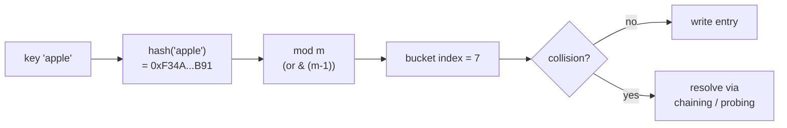
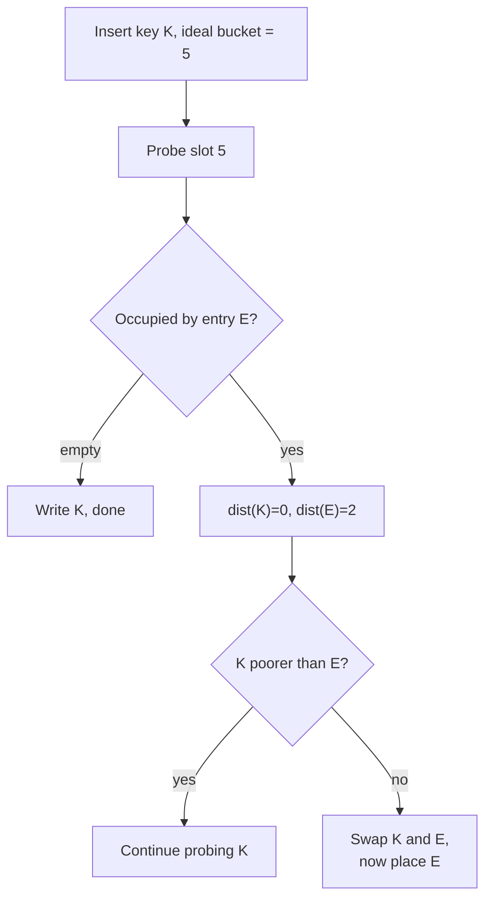
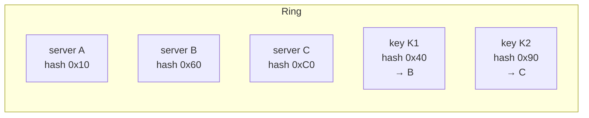

# Hash table internals

> Pop the hood: bucket arrays, collisions, load factor, and the cleverness that keeps `dict[key]` at O(1).

<span class="phase-status phase-done">Phase 2 — Data Structures</span>

---

!!! abstract "What this chapter is"
    The "basics" page told you a hash table is a magical O(1) lookup. This page tells you **how** that magic works — the moving parts an interviewer might poke at: hash function quality, collision resolution, load factor, resizing, and the family of advanced schemes (Robin Hood, perfect, cuckoo). It also covers the security side (hash DoS) and the distributed-systems cousin (consistent hashing).

    **Reading time:** ~90 minutes.

    **Prereqs:** [Hash table basics](01-hash-table-basics.md), [Linked lists](../linked-lists/01-linked-list-basics.md).

---

## 1. The 30-second mental model

A hash table is three things glued together:

1. A **hash function** `h(key) -> int` that maps any key to a 64-bit-ish integer.
2. A **bucket array** of size `m` (a power of two in CPython, a prime in Java's older `Hashtable`).
3. A **collision resolution strategy** for when two keys land in the same bucket.



Everything interesting happens in step 3. Pick the wrong strategy and your O(1) becomes O(n) under bad input.

---

## 2. Collision resolution — the two families

### 2.1 Separate chaining

Each bucket holds a **linked list** (or, in modern Java 8+, a tree once the chain exceeds 8 nodes). Insert appends to the chain; lookup walks it.

```python
from __future__ import annotations


class ChainedHashMap:
    """Separate-chaining hash map. Buckets hold list[(key, value)]."""

    def __init__(self, capacity: int = 16) -> None:
        self._capacity = capacity
        self._size = 0
        self._buckets: list[list[tuple[object, object]]] = [[] for _ in range(capacity)]

    def _index(self, key: object) -> int:
        return hash(key) & (self._capacity - 1)  # capacity must be power of 2

    def put(self, key: object, value: object) -> None:
        bucket = self._buckets[self._index(key)]
        for i, (k, _) in enumerate(bucket):
            if k == key:
                bucket[i] = (key, value)
                return
        bucket.append((key, value))
        self._size += 1
        if self._size / self._capacity > 0.75:
            self._resize(self._capacity * 2)

    def get(self, key: object) -> object | None:
        for k, v in self._buckets[self._index(key)]:
            if k == key:
                return v
        return None

    def _resize(self, new_capacity: int) -> None:
        old = self._buckets
        self._capacity = new_capacity
        self._buckets = [[] for _ in range(new_capacity)]
        self._size = 0
        for bucket in old:
            for k, v in bucket:
                self.put(k, v)
```

??? question "Why a power-of-two capacity?"
    `hash(key) & (m - 1)` is equivalent to `hash(key) % m` when `m` is a power of two — and bitwise AND is one cycle versus a modulo's ~20. CPython, Java's `HashMap`, and Go's map all use this trick. The downside: low-quality hashes that only vary in high bits collide; CPython mitigates with `hash(x) ^ (hash(x) >> 16)` style mixing.

### 2.2 Open addressing

No linked lists — collisions just walk the same bucket array looking for an empty slot. Three flavours:

| Probe sequence | Formula | Pros | Cons |
|---|---|---|---|
| **Linear probing** | `i, i+1, i+2, ...` | Cache-friendly | Primary clustering |
| **Quadratic probing** | `i, i+1, i+4, i+9, ...` | Breaks primary clusters | Secondary clustering, can fail to find empty slot |
| **Double hashing** | `i, i+h2(k), i+2*h2(k), ...` | Best distribution | Slower, two hash functions |

```python
class LinearProbeHashMap:
    """Open-addressing hash map with linear probing."""

    _TOMBSTONE: object = object()  # marks deleted slots

    def __init__(self, capacity: int = 16) -> None:
        self._capacity = capacity
        self._size = 0
        self._slots: list[tuple[object, object] | None | object] = [None] * capacity

    def _probe(self, key: object) -> int:
        """Return slot index for key, or first available slot."""
        idx = hash(key) & (self._capacity - 1)
        first_tombstone = -1
        while self._slots[idx] is not None:
            slot = self._slots[idx]
            if slot is self._TOMBSTONE:
                if first_tombstone == -1:
                    first_tombstone = idx
            else:
                k, _ = slot  # type: ignore[misc]
                if k == key:
                    return idx
            idx = (idx + 1) & (self._capacity - 1)
        return first_tombstone if first_tombstone != -1 else idx

    def put(self, key: object, value: object) -> None:
        idx = self._probe(key)
        if self._slots[idx] is None or self._slots[idx] is self._TOMBSTONE:
            self._size += 1
        self._slots[idx] = (key, value)
        if self._size / self._capacity > 0.66:
            self._resize(self._capacity * 2)

    def _resize(self, new_capacity: int) -> None:
        old = self._slots
        self._capacity = new_capacity
        self._slots = [None] * new_capacity
        self._size = 0
        for slot in old:
            if slot is not None and slot is not self._TOMBSTONE:
                k, v = slot  # type: ignore[misc]
                self.put(k, v)
```

!!! warning "Tombstones matter"
    Deleting in open addressing cannot just write `None` — that would terminate probe sequences early and lose subsequent keys. Always write a tombstone marker, and either skip-but-count it during lookup (above) or rebuild on resize.

### 2.3 Chaining vs open addressing — when to pick which

| Concern | Chaining | Open addressing |
|---|---|---|
| Cache locality | Poor (pointer chasing) | Excellent |
| Memory overhead | High (next pointers) | Low |
| Load factor ceiling | Can go past 1.0 | Must stay < 1.0 (typically ≤ 0.7) |
| Worst-case adversarial input | Long chain → tree (Java 8+) | Catastrophic clustering |
| Deletion | Trivial (unlink) | Tombstones |

CPython's `dict`, Rust's `HashMap`, Google's `dense_hash_map` → open addressing. Java `HashMap`, .NET `Dictionary` → chaining (with treeification).

---

## 3. Load factor & resize

**Load factor** `α = n / m` (entries / capacity).

| Implementation | Resize trigger |
|---|---|
| **CPython dict** | `n * 3 >= m * 2` (i.e. ⅔ full) |
| **Java HashMap** | `α >= 0.75` |
| **Go map** | `α >= 6.5` (chained, but with overflow buckets) |
| **Rust HashMap** | `α >= 0.875` (Robin Hood) |

Resizing **doubles** capacity (sometimes ×4 in CPython for tiny dicts) and **rehashes every entry**. Cost is amortised O(1) per insert because doubling means each entry is rehashed an expected O(1) times across the lifetime of the table.

??? tip "Why ⅔ for CPython but 0.875 for Rust?"
    Lower load factor ↔ fewer collisions but more wasted memory. Robin Hood hashing (Rust's strategy) tolerates higher load factors because it bounds **variance** of probe distance, so even a 90%-full table has short probe sequences. CPython picks ⅔ as a conservative tradeoff for general-purpose Python code.

---

## 4. Robin Hood hashing — variance reduction

The clever idea: when probing, if the entry already in slot `i` is "richer" than us (closer to its ideal bucket), **swap with it and continue probing** carrying the displaced entry. Result: probe-sequence lengths cluster tightly around the mean instead of having a long tail.



Why "Robin Hood"? You **steal from the rich** (entries with short probes) **to give to the poor** (the new entry, far from home), evening out the distribution. Used in Rust's `std::collections::HashMap`, Swift's `Dictionary`, and several game-engine hash tables.

Variance of probe length drops from `O(α / (1 - α))` (linear probing) to `O(log log n)` — practically constant.

---

## 5. Perfect hashing — zero collisions, statically

If your **key set is known at compile time** (reserved keywords in a parser, Unicode block tables, switch statements), you can pick a hash function that **guarantees zero collisions**. Two-level scheme:

1. Primary hash maps `n` keys into `n` buckets.
2. Each bucket of size `k` gets its own secondary hash with `k²` slots — by birthday-paradox math, a random hash with `k²` slots is collision-free with probability ≥ ½, so you retry until you find one.

Total expected space: O(n). Lookup: 2 hash evaluations, O(1) **worst case**, no resize ever.

Tools: **gperf** (GNU perfect hash generator) for C, **phf** crate in Rust, Go's `cmd/compile` uses it for keyword recognition.

---

## 6. Cuckoo hashing — worst-case O(1) lookup

Two hash functions `h1`, `h2` and two tables `T1`, `T2`. A key lives in **either** `T1[h1(k)]` **or** `T2[h2(k)]` — lookup is **always two probes**.

Insert: place `k` in `T1[h1(k)]`. If occupied, **kick out** the resident, place yours, then re-home the kicked-out key using **its** alternate slot. Continues recursively; if a cycle is detected, rehash the whole table.

```python
class CuckooHashMap:
    """Two-table cuckoo hash. Lookup is worst-case O(1)."""

    def __init__(self, capacity: int = 16) -> None:
        self._capacity = capacity
        self._t1: list[tuple[object, object] | None] = [None] * capacity
        self._t2: list[tuple[object, object] | None] = [None] * capacity

    def _h1(self, key: object) -> int:
        return hash(key) & (self._capacity - 1)

    def _h2(self, key: object) -> int:
        return (hash(key) * 2_654_435_761) & (self._capacity - 1)  # Knuth multiplier

    def get(self, key: object) -> object | None:
        slot = self._t1[self._h1(key)]
        if slot is not None and slot[0] == key:
            return slot[1]
        slot = self._t2[self._h2(key)]
        if slot is not None and slot[0] == key:
            return slot[1]
        return None

    def put(self, key: object, value: object, max_kicks: int = 32) -> None:
        entry: tuple[object, object] | None = (key, value)
        for _ in range(max_kicks):
            i = self._h1(entry[0])
            entry, self._t1[i] = self._t1[i], entry
            if entry is None:
                return
            j = self._h2(entry[0])
            entry, self._t2[j] = self._t2[j], entry
            if entry is None:
                return
        self._rehash()
        self.put(entry[0], entry[1])  # type: ignore[index]

    def _rehash(self) -> None:
        old_t1, old_t2 = self._t1, self._t2
        self._capacity *= 2
        self._t1 = [None] * self._capacity
        self._t2 = [None] * self._capacity
        for table in (old_t1, old_t2):
            for slot in table:
                if slot is not None:
                    self.put(slot[0], slot[1])
```

Production users: memcached, some FPGA routers, kernel network flow tables. Chosen wherever **bounded lookup time** matters more than amortised speed.

---

## 7. Hash function quality & hash DoS

### 7.1 Properties of a good hash

- **Avalanche**: flipping one input bit flips ~half the output bits.
- **Distribution**: uniform spread over the output range — no hot zones.
- **Speed**: fast enough not to dominate the table operation. (xxHash, FxHash, FNV-1a, SipHash.)
- **Determinism within a process**: same key → same hash this run.

### 7.2 The hash-DoS story

Until ~2011, most language standard libraries used **fixed, public** hash functions (Python's old string hash, Java `String.hashCode`, etc.). An attacker could **precompute thousands of strings that all hash to the same bucket** and POST them as a JSON object → server's hash table degrades to a linked list → request takes O(n²) → server falls over.

The fix: **randomised hash seeding**. Pick a random seed at process start; mix it into the hash. Same key still hashes consistently within the process, but an attacker can no longer pre-craft collisions.

| Language | Status |
|---|---|
| Python 3.3+ | `PYTHONHASHSEED` random by default (CVE-2012-1150) |
| Ruby 1.9+ | SipHash with random key |
| Rust | SipHash-1-3 by default; FxHash opt-in for trusted input |
| Java | Treeification (chains > 8 → red-black tree) → DoS just gets O(log n) |

??? question "Why is Python's iteration order 'insertion order' since 3.7?"
    That's a **separate** change from hash randomisation. CPython 3.6 introduced a **compact dict** layout — a dense `entries[]` array keyed by insertion index, plus a sparse `indices[]` hash table pointing into it. The dense array preserves insertion order as a side effect; in 3.7 the language spec made it official. Memory dropped ~25% as a bonus.

### 7.3 What about cryptographic hashes?

SHA-256 / BLAKE3 are **overkill** for hash tables — you don't need collision resistance against an attacker with infinite compute, just unpredictability. SipHash-1-3 (used by Rust, Python via `_Py_HashSecret`) is the sweet spot: ~5× faster than SHA-256, keyed against DoS.

---

## 8. Consistent hashing — the distributed cousin

Naïve sharding (`hash(key) % N` where `N` = number of cache servers) breaks horribly when `N` changes: add or remove one server and **almost every key remaps**. For caches this means a stampede on the database.

**Consistent hashing**: place servers and keys on a **ring** `[0, 2^32)` by their hash. A key is owned by the **next server clockwise**. Adding a server only steals a fraction (`1/N+1`) of keys from its successor; removing one passes its keys to its successor. **Monotonicity** = the killer property.



**Virtual nodes**: each physical server registers ~150 random points on the ring instead of 1. Smooths the load distribution and limits the impact of any single failure. DynamoDB, Cassandra, Redis Cluster (with hash slots, a discrete variant), memcached clients (libketama), and most CDN edge networks use it.

→ See system design: [URL shortener](../../08-system-design/tier-1-core/01-url-shortener.md) for a worked example.

---

## 9. Interview problems

### 9.1 LC 706 — Design HashMap (chaining)

```python linenums="1"
class MyHashMap:
    """LeetCode 706 — implement get/put/remove with chaining."""

    def __init__(self) -> None:
        self._capacity = 1024
        self._buckets: list[list[list[int]]] = [[] for _ in range(self._capacity)]

    def _bucket(self, key: int) -> list[list[int]]:
        return self._buckets[key % self._capacity]

    def put(self, key: int, value: int) -> None:
        b = self._bucket(key)
        for entry in b:
            if entry[0] == key:
                entry[1] = value
                return
        b.append([key, value])

    def get(self, key: int) -> int:
        for k, v in self._bucket(key):
            if k == key:
                return v
        return -1

    def remove(self, key: int) -> None:
        b = self._bucket(key)
        for i, (k, _) in enumerate(b):
            if k == key:
                b.pop(i)
                return
```

### 9.2 LC 146 — LRU Cache (hashmap + doubly linked list)

```python linenums="1"
class _Node:
    __slots__ = ("key", "value", "prev", "next")

    def __init__(self, key: int, value: int) -> None:
        self.key = key
        self.value = value
        self.prev: _Node | None = None
        self.next: _Node | None = None


class LRUCache:
    """O(1) get and put. Hash map + sentinel doubly linked list."""

    def __init__(self, capacity: int) -> None:
        self._cap = capacity
        self._map: dict[int, _Node] = {}
        self._head = _Node(0, 0)  # most recently used
        self._tail = _Node(0, 0)  # least recently used
        self._head.next = self._tail
        self._tail.prev = self._head

    def _remove(self, node: _Node) -> None:
        node.prev.next = node.next  # type: ignore[union-attr]
        node.next.prev = node.prev  # type: ignore[union-attr]

    def _add_front(self, node: _Node) -> None:
        node.next = self._head.next
        node.prev = self._head
        self._head.next.prev = node  # type: ignore[union-attr]
        self._head.next = node

    def get(self, key: int) -> int:
        if key not in self._map:
            return -1
        node = self._map[key]
        self._remove(node)
        self._add_front(node)
        return node.value

    def put(self, key: int, value: int) -> None:
        if key in self._map:
            self._remove(self._map[key])
        node = _Node(key, value)
        self._map[key] = node
        self._add_front(node)
        if len(self._map) > self._cap:
            lru = self._tail.prev
            self._remove(lru)  # type: ignore[arg-type]
            del self._map[lru.key]  # type: ignore[union-attr]
```

### 9.3 LC 380 — Insert Delete GetRandom O(1)

The trick: **dict maps value → index in array**. Removal swaps the target with the last element (O(1)) then `pop()`s.

```python linenums="1"
import random


class RandomizedSet:
    def __init__(self) -> None:
        self._values: list[int] = []
        self._idx: dict[int, int] = {}

    def insert(self, val: int) -> bool:
        if val in self._idx:
            return False
        self._idx[val] = len(self._values)
        self._values.append(val)
        return True

    def remove(self, val: int) -> bool:
        if val not in self._idx:
            return False
        i = self._idx.pop(val)
        last = self._values[-1]
        if i != len(self._values) - 1:
            self._values[i] = last
            self._idx[last] = i
        self._values.pop()
        return True

    def getRandom(self) -> int:
        return random.choice(self._values)
```

### 9.4 LC 705 — Design HashSet

Same as `MyHashMap` but each bucket holds bare keys, not `(key, value)` pairs. One-line variant: store `set()` per bucket — but that defeats the educational point.

---

## 🃏 Cheatsheet

| Topic | Key fact |
|---|---|
| Capacity | Power of 2 → `hash & (m-1)` replaces `% m` |
| Chaining | Bucket = linked list; treeify if chain > 8 (Java) |
| Open addressing | Tombstones on delete; load factor ≤ 0.7 |
| Linear probe | Cache-friendly, primary clustering |
| Quadratic probe | Breaks primary clusters; tables sized to prime/power-of-2 |
| Double hash | `i + k * h2(key)`; best distribution, slowest |
| Robin Hood | Swap rich-with-poor; bounds variance, allows α ≈ 0.9 |
| Cuckoo | Two tables, **two probes** worst-case; rehash on cycle |
| Perfect hash | Static keys, two-level, O(1) worst case |
| CPython dict | Open addressing, ⅔ resize trigger, compact layout since 3.6 |
| Hash DoS | Use random seed (SipHash); never expose hash function to attackers |
| Consistent hash | Ring + virtual nodes; `1/N` keys move on add/remove |
| LRU | dict + doubly linked list, sentinel head/tail |
| Insert/Delete/GetRandom O(1) | dict(value → index) + array, swap-with-last on delete |

→ Next: [Heaps & priority queues](../heaps/01-heap-basics.md).
