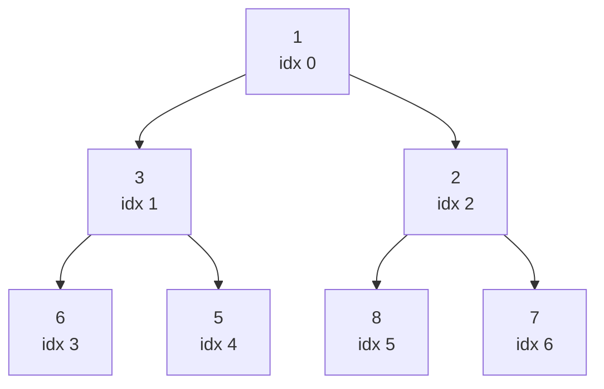
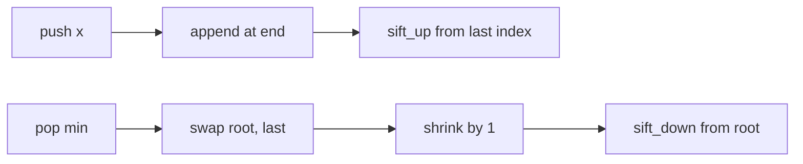

# Heap basics

> A binary heap is a complete binary tree squeezed into an array — your O(log n) ticket to "smallest/largest so far".

<span class="phase-status phase-done">Phase 2 — Data Structures</span>

---

## 1. Why heaps exist

You hit a heap the moment a problem says any of:

- "the **k-th** largest / smallest"
- "**top-k** frequent / closest / cheapest"
- "process events in **priority** order"
- "**streaming** data — give me the median so far"
- "**merge** k sorted things"

A sorted list answers these in O(n log n) up front, then O(n) per insert. A heap gives O(log n) insert and O(1) peek-min — and you only pay to extract the elements you actually look at. That's the whole pitch.

!!! tip "Mental model"
    A heap is a **partial order**, not a full sort. You always know the extreme element in O(1); everything else is "somewhere in there". Don't iterate a heap and expect sorted output — you'll get heap order, which is **not** sorted order.

---

## 2. The heap property

A **min-heap** of size $n$ stored in array `a[0..n-1]` satisfies, for every index $i$ with a child $j$:

$$a[i] \le a[j]$$

A **max-heap** flips the inequality. The structural rule is "complete binary tree" — every level full except possibly the last, which fills left-to-right. Completeness is what lets us pack the tree into a contiguous array without holes.



Array form: `[1, 3, 2, 6, 5, 8, 7]`.

---

## 3. Index arithmetic (the only formulas you need)

For a node at index `i` (0-indexed):

| Relation | Index |
|---|---|
| Parent | `(i - 1) // 2` |
| Left child | `2*i + 1` |
| Right child | `2*i + 2` |
| Last non-leaf | `n // 2 - 1` |

```python
from __future__ import annotations


def parent(i: int) -> int:
    return (i - 1) // 2


def left(i: int) -> int:
    return 2 * i + 1


def right(i: int) -> int:
    return 2 * i + 2
```

That's it. Every heap operation is a loop that walks one of these links and swaps when the heap property is violated.

---

## 4. Sift up / sift down

??? question "Why two operations? Can't one do both?"
    They move in opposite directions. **Sift up** is for a freshly inserted node at the end of the array — it bubbles toward the root while it's smaller than its parent. **Sift down** is for the root after extraction (or any node whose value just got bigger) — it sinks toward the leaves while one of its children is smaller. Together they keep the heap valid through `push` and `pop`.

```python
from __future__ import annotations


def sift_up(heap: list[int], i: int) -> None:
    """Bubble heap[i] toward the root until min-heap property holds."""
    while i > 0:
        p = (i - 1) // 2
        if heap[i] < heap[p]:
            heap[i], heap[p] = heap[p], heap[i]
            i = p
        else:
            return


def sift_down(heap: list[int], i: int) -> None:
    """Sink heap[i] toward the leaves until min-heap property holds."""
    n = len(heap)
    while True:
        l, r = 2 * i + 1, 2 * i + 2
        smallest = i
        if l < n and heap[l] < heap[smallest]:
            smallest = l
        if r < n and heap[r] < heap[smallest]:
            smallest = r
        if smallest == i:
            return
        heap[i], heap[smallest] = heap[smallest], heap[i]
        i = smallest
```

Both run in O(log n) — the path length from any node to a root or leaf.



---

## 5. Build-heap in O(n) — the surprising one

The naive way to build a heap from an unsorted array is "push each element" → O(n log n). The clever way is to start from the **last non-leaf** (index `n//2 - 1`) and sift each node down:

```python
from __future__ import annotations


def heapify(a: list[int]) -> None:
    """In-place build of a min-heap. O(n)."""
    n = len(a)
    for i in range(n // 2 - 1, -1, -1):
        sift_down(a, i)
```

??? question "Why is this O(n) and not O(n log n)?"
    Each sift-down at depth $d$ from the leaves costs O(d), but there are only $n / 2^{d+1}$ nodes at that depth. Summing:

    $$\sum_{d=0}^{\log n} \frac{n}{2^{d+1}} \cdot d = O(n)$$

    The geometric weighting beats the linear depth — most of the work happens near the leaves, where there's little to sift.

---

## 6. Python's `heapq` — the API you'll actually use

`heapq` is a **min-heap** operating on a plain `list`. There is no `MaxHeap` class; you negate values or wrap in a comparator-friendly tuple.

```python
from __future__ import annotations
import heapq

a: list[int] = [5, 1, 8, 3, 2]

heapq.heapify(a)          # in place, O(n)
heapq.heappush(a, 0)      # O(log n)
mn = heapq.heappop(a)     # O(log n) — returns 0
peek = a[0]               # O(1) — never pop just to peek

# Combined ops, faster than push then pop / pop then push:
heapq.heappushpop(a, 4)   # push 4, then pop min — one sift_down
heapq.heapreplace(a, 9)   # pop min, then push 9 — one sift_down

# Top-k helpers (use these for small k vs sorted()[:k]):
heapq.nlargest(3, [5, 1, 8, 3, 2])   # [8, 5, 3]
heapq.nsmallest(3, [5, 1, 8, 3, 2])  # [1, 2, 3]
```

!!! warning "`heappushpop` vs `heapreplace`"
    `heappushpop(h, x)` may return `x` itself if `x` is smaller than the current min. `heapreplace(h, x)` always pops first, so it **requires the heap to be non-empty** and may return something larger than `x`. Use `heapreplace` only when you've already decided you want to evict the current min.

### Max-heap tricks

```python
import heapq

# Trick 1: negate
nums = [5, 1, 8]
max_heap = [-x for x in nums]
heapq.heapify(max_heap)
top = -heapq.heappop(max_heap)   # 8

# Trick 2: wrap with negative key for objects you can't negate
tasks = [("compile", 3), ("test", 5), ("deploy", 1)]
h: list[tuple[int, str]] = []
for name, prio in tasks:
    heapq.heappush(h, (-prio, name))
_, highest = heapq.heappop(h)    # "test"
```

### Tuple comparison for ties

Python compares tuples lexicographically, which gives you a free **tie-breaker**:

```python
# (priority, insertion_order, payload) — stable by insertion when priorities tie.
import itertools, heapq

counter = itertools.count()
h: list[tuple[int, int, str]] = []
heapq.heappush(h, (2, next(counter), "B"))
heapq.heappush(h, (2, next(counter), "A"))   # later insert, same priority
heapq.heappop(h)   # (2, 0, "B") — FIFO within priority
```

??? question "Why insert a counter at all? Won't tuples just compare strings?"
    They will — and that crashes the moment your payload isn't comparable (custom objects without `__lt__`, dicts, etc.). Even when payloads *are* comparable, you usually don't want priority ties broken by alphabetical order of the payload. The counter forces FIFO and avoids touching the payload entirely.

---

## 7. Complexity table

| Operation | Cost | Notes |
|---|---|---|
| `heapify` | O(n) | bottom-up sift_down |
| `heappush` | O(log n) | sift_up |
| `heappop` | O(log n) | swap + sift_down |
| `heappushpop` / `heapreplace` | O(log n) | one sift_down, faster than two ops |
| peek (`h[0]`) | O(1) | never pop to peek |
| `nlargest(k, n)` / `nsmallest(k, n)` | O(n log k) | beats sorting for small k |
| in-order iterate | **NOT sorted** | use repeated `heappop` for sorted output |
| arbitrary delete / decrease-key | O(n) to find, O(log n) to fix | use lazy deletion or an index map |

---

## 8. When a heap beats a sorted list

<div class="grid cards" markdown>

- :material-stream:{ .lg .middle } &nbsp; **Streaming** — items arrive one by one, you only need the extreme on demand. Sorted list pays O(n) per insert; heap pays O(log n).

- :material-trophy:{ .lg .middle } &nbsp; **Top-K** — you want the k largest of a stream of n. Maintain a min-heap of size k. O(n log k), O(k) space.

- :material-merge:{ .lg .middle } &nbsp; **K-way merge** — combine k sorted lists. Push the head of each list into a heap; pop and push the next. O(N log k) total.

- :material-clock-fast:{ .lg .middle } &nbsp; **Event simulation** — event loop, Dijkstra, A\*, scheduler. The "smallest deadline next" pattern is a heap by definition.

</div>

A sorted list (or `SortedList` from `sortedcontainers`) wins when you need **predecessor / successor** queries, range scans, or ordered iteration. A heap can't do those without becoming a different data structure.

---

## 9. Gotchas

!!! warning "Heap order is not sorted order"
    `print(heap)` on a valid heap shows you a tree-encoded array, not a sorted list. To dump sorted, repeatedly `heappop`.

!!! warning "Don't mutate items inside a heap"
    Mutating the priority of an object already in a heap silently breaks the invariant. Either pop and re-push, or use lazy deletion (mark stale, skip on pop).

!!! warning "Empty-heap pops"
    `heappop([])` raises `IndexError`. `heapreplace([], x)` also raises. Always check `if h:` first, or use a sentinel.

!!! warning "Negation breaks for floats with `-0.0`/NaN"
    Negation max-heap is fine for ints. For floats, prefer `(-priority, counter, item)` tuples to avoid signed-zero and NaN comparison surprises.

---

## 10. Interview problems

### 10.1 — Kth Largest Element in a Stream (LC 703)

Maintain a **min-heap of size k**. The root is the k-th largest seen so far.

```python
from __future__ import annotations
import heapq


class KthLargest:
    def __init__(self, k: int, nums: list[int]) -> None:
        self.k = k
        self.h: list[int] = []
        for x in nums:
            self.add(x)

    def add(self, val: int) -> int:
        if len(self.h) < self.k:
            heapq.heappush(self.h, val)
        elif val > self.h[0]:
            heapq.heapreplace(self.h, val)   # one sift_down, not two
        return self.h[0]
```

**Complexity:** `add` is O(log k). Space O(k). The min-heap-of-size-k pattern is the bread-and-butter of every "top-k" question.

### 10.2 — Top K Frequent Elements (LC 347)

Count, then keep a min-heap of size k by frequency.

```python
from __future__ import annotations
import heapq
from collections import Counter


def top_k_frequent(nums: list[int], k: int) -> list[int]:
    freq = Counter(nums)
    h: list[tuple[int, int]] = []   # (count, num)
    for num, cnt in freq.items():
        if len(h) < k:
            heapq.heappush(h, (cnt, num))
        elif cnt > h[0][0]:
            heapq.heapreplace(h, (cnt, num))
    return [num for _, num in h]
```

**Complexity:** O(n log k). Faster than the O(n log n) sort-by-frequency approach when k ≪ n. (Bucket sort beats both at O(n) but only when counts fit in a bounded range.)

### 10.3 — Merge K Sorted Lists (LC 23)

Push the head of each list into the heap, pop the smallest, push its successor. The counter breaks ties when two `ListNode`s are non-comparable.

```python
from __future__ import annotations
import heapq, itertools
from dataclasses import dataclass


@dataclass
class ListNode:
    val: int
    next: ListNode | None = None


def merge_k_lists(lists: list[ListNode | None]) -> ListNode | None:
    counter = itertools.count()
    h: list[tuple[int, int, ListNode]] = []
    for node in lists:
        if node is not None:
            heapq.heappush(h, (node.val, next(counter), node))

    dummy = ListNode(0)
    tail = dummy
    while h:
        _, _, node = heapq.heappop(h)
        tail.next = node
        tail = node
        if node.next is not None:
            heapq.heappush(h, (node.next.val, next(counter), node.next))
    return dummy.next
```

**Complexity:** O(N log k) where N is the total number of nodes across all k lists, and the heap never holds more than k entries.

### 10.4 — Find Median from Data Stream (LC 295)

The classic **two-heap** trick. `lo` is a max-heap of the smaller half; `hi` is a min-heap of the larger half. Keep `len(lo) ∈ {len(hi), len(hi) + 1}`.

```python
from __future__ import annotations
import heapq


class MedianFinder:
    def __init__(self) -> None:
        self.lo: list[int] = []   # max-heap (negate on push)
        self.hi: list[int] = []   # min-heap

    def add_num(self, num: int) -> None:
        # Funnel through hi to keep ordering between heaps correct.
        heapq.heappush(self.lo, -heapq.heappushpop(self.hi, num))
        # Rebalance so lo has equal or one extra element.
        if len(self.lo) > len(self.hi) + 1:
            heapq.heappush(self.hi, -heapq.heappop(self.lo))

    def find_median(self) -> float:
        if len(self.lo) > len(self.hi):
            return float(-self.lo[0])
        return (-self.lo[0] + self.hi[0]) / 2
```

**Complexity:** `add_num` O(log n), `find_median` O(1). The "funnel through the other heap" idiom guarantees every element in `lo` is ≤ every element in `hi` without an explicit comparison.

---

## 🃏 Cheatsheet

- **`heapq` is a min-heap on a plain list.** No class, no max-heap — negate values or wrap in `(-priority, counter, item)`.
- **Index math:** parent `(i-1)//2`, children `2i+1` / `2i+2`, last non-leaf `n//2 - 1`.
- **`heapify` is O(n)**; pushing each element is O(n log n). Always prefer `heapify` for batch input.
- **Peek = `h[0]`**, not `heappop`. Don't pop to look.
- **`heappushpop` and `heapreplace`** save a `sift_up` + `sift_down` round-trip — use them in top-k loops.
- **`nlargest(k, it)` / `nsmallest(k, it)`** are O(n log k) — beat `sorted(it)[:k]` when k ≪ n.
- **Top-K pattern:** maintain a heap of size k of the *opposite* extreme (min-heap for top-k largest).
- **Two-heap median:** max-heap below, min-heap above; funnel inserts through one side, then rebalance.
- **K-way merge:** seed heap with list heads + a counter for tie-breaking; push successor on every pop.
- **Heap order ≠ sorted order.** Iterating prints garbage; pop repeatedly for sorted output.
- **Decrease-key / arbitrary delete** is O(n) to find without an index map. Use lazy deletion in interviews.
- **Upgrade path:** if you need predecessor / successor / range queries, leave heaps for `SortedList` or a balanced BST.
