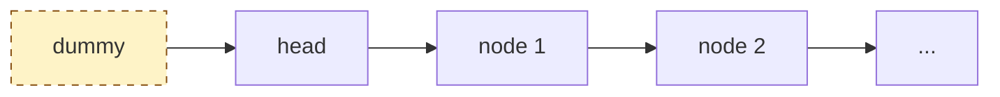
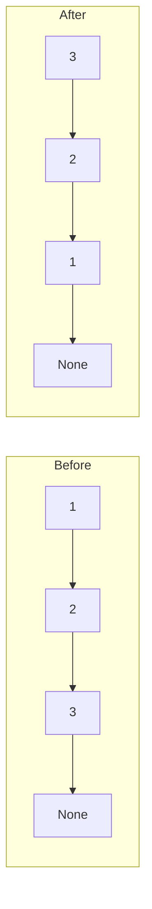

# Linked Lists — the basics

!!! abstract "What this chapter is"
    The third pillar after arrays and strings. Linked lists are conceptually simple — nodes pointing to nodes — but they're the test bed for **pointer manipulation**, the skill that interviewers grade hardest. If you can reverse a linked list in place without a single off-by-one, every tree problem becomes easier.

    **Reading time:** 3 hours cover-to-cover; 30 minutes per problem.

    **Prereqs:** [Strings — basics](../strings/01-string-basics.md) (or just [Arrays — basics](../arrays/01-array-basics.md)) plus the [Python crash course](../../01-foundations/python-crash-course-for-dsa.md).

---

## Chapter map

<div class="grid cards" markdown>

-   :material-numeric-1-circle:{ .lg .middle } &nbsp; **What is a linked list?**

    Plain English + everyday analogy. The mental model.

-   :material-numeric-2-circle:{ .lg .middle } &nbsp; **Why we need them**

    What problems become easier with pointers vs contiguous memory.

-   :material-numeric-3-circle:{ .lg .middle } &nbsp; **How linked lists work internally**

    Memory layout, dereferencing, cache-unfriendliness.

-   :material-numeric-4-circle:{ .lg .middle } &nbsp; **Python implementation from scratch**

    `Node`, `SinglyLinkedList`, `DoublyLinkedList` — all the operations.

-   :material-numeric-5-circle:{ .lg .middle } &nbsp; **Time & space complexity**

    The full table. The two operations that surprise everyone.

-   :material-numeric-6-circle:{ .lg .middle } &nbsp; **Built-in Python tools**

    `collections.deque` — when to use it instead of rolling your own.

-   :material-numeric-7-circle:{ .lg .middle } &nbsp; **When to use vs not use**

    Linked list vs array vs deque vs hash map.

-   :material-numeric-8-circle:{ .lg .middle } &nbsp; **Common mistakes & gotchas**

    The 10 pointer mistakes that fail interviews.

-   :material-numeric-9-circle:{ .lg .middle } &nbsp; **Patterns this connects to**

    Two pointers, fast/slow, reversal, merging.

-   :material-numeric-10-circle:{ .lg .middle } &nbsp; **Practice problems (40)**

    Each in 5-layer progressive format with follow-ups.

-   :fontawesome-solid-microphone:{ .lg .middle } &nbsp; **How interviewers ask this**

    Phrasings, dry-run-on-paper expectations, the dummy-node trick.

-   :material-clipboard-check:{ .lg .middle } &nbsp; **Self-check quiz**

    20 questions. If you can answer 18, you've mastered linked lists.

</div>

---

## 1. What is a linked list?

> **Plain English:** a chain of small boxes. Each box holds one piece of data and a **pointer** (an arrow) to the next box.

The everyday analogy: a **scavenger hunt**. Each clue (node) tells you where to find the next clue. You can't jump to clue 5 directly — you have to follow clues 1, 2, 3, 4 first.

```
   ┌─────┐    ┌─────┐    ┌─────┐    ┌─────┐
   │  3  │───▶│  7  │───▶│  2  │───▶│  9  │───▶ None
   └─────┘    └─────┘    └─────┘    └─────┘
    head                                tail
```

In Python, the smallest definition is just a class:

```python
class ListNode:
    def __init__(self, val: int = 0, next: 'ListNode | None' = None) -> None:
        self.val = val
        self.next = next
```

A whole linked list is identified by a **single reference**: the `head` pointer. The rest is reached by walking `next` pointers.

```python
head = ListNode(3, ListNode(7, ListNode(2, ListNode(9))))
print(head.val)               # 3
print(head.next.val)          # 7
print(head.next.next.val)     # 2
```

!!! info "Singly vs doubly vs circular"
    - **Singly linked list:** each node has a `next` pointer. The default of every interview problem.
    - **Doubly linked list:** each node has both `next` and `prev`. Used when you need to delete in O(1) given a node, or walk backward.
    - **Circular linked list:** the last node's `next` points back to the head (or to some earlier node — that's a cycle).

    Unless we say otherwise, "linked list" = singly linked list.

---

## 2. Why we need linked lists

If arrays already give you O(1) random access and O(1) amortized append, why bother with anything else?

Three reasons.

### 2.1 O(1) insert and delete *anywhere* — given a pointer

If you already have a pointer to a node, deleting it (or splicing in a new one after it) is **O(1)**:

```python
# Delete node B from A → B → C:
A.next = B.next   # Now A → C, B is orphaned
```

In an array, the same delete is O(n) because everything to the right has to shift.

The catch: you have to *have* the pointer. Locating the pointer is O(n).

### 2.2 No reallocation, no copy

Arrays double their backing buffer when full and copy everything across. That's amortized O(1) but a single append can spike to O(n) at the worst moment.

Linked lists never reallocate or copy. Each `append` (with a tail pointer) is true **O(1)**.

This matters for:

- **Real-time systems** where you can't afford a 10ms hiccup during a buffer doubling.
- **Memory-constrained environments** where allocating a new "doubled" buffer briefly takes 2× the memory.
- **Concurrent / lock-free data structures** where copying isn't atomic.

### 2.3 They're the building block for everything else

The ideas you learn here — **two-pointer**, **reversal**, **slow/fast**, **merge**, **dummy head** — are exactly the ideas you'll re-use for trees, graphs, and many string problems.

If trees are "linked lists with multiple `next` pointers," and graphs are "linked lists with arbitrary connections," then mastering linked lists is the cheapest way to master pointer reasoning.

---

## 3. How linked lists work internally

The mechanics that explain the gotchas in Part 8.

### 3.1 Memory layout — scattered, not contiguous

For an array `[10, 20, 30, 40]`, the runtime allocates one chunk of memory:

```
        addr:  100   104   108   112
              ┌────┬────┬────┬────┐
              │ 10 │ 20 │ 30 │ 40 │
              └────┴────┴────┴────┘
```

For a linked list with the same values, each node is a **separate allocation** somewhere in the heap:

```
        addr:  340                     200                     780                     50
              ┌────┬─────┐            ┌────┬─────┐            ┌────┬─────┐            ┌────┬──────┐
   head ───▶ │ 10 │ 200 │───────────▶│ 20 │ 780 │───────────▶│ 30 │  50 │───────────▶│ 40 │ None │
              └────┴─────┘            └────┴─────┘            └────┴─────┘            └────┴──────┘
                     (next)                  (next)                  (next)
```

Each "→" is a real **pointer dereference** — the CPU follows an address into a (probably) cold cache line.

### 3.2 The cache cost

A modern CPU reads memory in 64-byte **cache lines**. Walking an array means most reads are already in cache after the first one — you can iterate at 30+ GB/s.

Walking a linked list means each node is a likely cache miss. You're waiting on memory **most of the time**. Real-world throughput is often 10–100× slower than walking an array of the same logical size.

The lesson: **even when the asymptotics say linked list, often the constants make array faster.** This is why `list` (a dynamic array) is Python's default and `collections.deque` (a doubly-linked list of *blocks*) is the special case.

### 3.3 Why `head = head.next` is destructive

```python
def get_third(head: ListNode | None) -> int | None:
    head = head.next        # ❌ caller still holds head; this just rebinds locally
    head = head.next
    return head.val if head else None
```

The local `head` rebinding doesn't affect the caller's variable. Python passes references **by value**. To "advance" inside a function, you walk a local pointer; to mutate the list, you change a node's fields.

### 3.4 Sentinels — the dummy head trick

Half the linked-list bugs come from special-casing the head. The fix is a **dummy head** (also called a sentinel):

```python
dummy = ListNode(0, head)
prev = dummy
while ...:
    # operate on prev.next; prev never needs special handling
    prev = prev.next
return dummy.next
```

`dummy.next` is the (possibly new) head. The dummy itself is discarded. With a dummy, the logic for "delete the head" and "delete some interior node" becomes the same.



You'll see the dummy-head pattern in **dozens** of problems below.

### 3.5 Reversal — the canonical pointer move

Reversing a linked list is the single most-asked operation. The mechanic:

```python
prev = None
curr = head
while curr:
    next_node = curr.next      # save the next
    curr.next = prev           # reverse the link
    prev = curr                # advance prev
    curr = next_node           # advance curr
return prev
```

Walk through this on paper at least once. Every "reverse a section" / "reverse in groups of k" / "rotate" problem reduces to this four-line dance.



---

## 4. Python implementation from scratch

You'll never re-implement `list` in production. You *will* write small `ListNode` classes for interview problems all the time.

### 4.1 `ListNode` — the standard interview class

```python
from __future__ import annotations
from typing import Optional


class ListNode:
    """The standard LeetCode-style singly-linked-list node."""

    __slots__ = ("val", "next")

    def __init__(self, val: int = 0, next: Optional[ListNode] = None) -> None:
        self.val = val
        self.next = next

    def __repr__(self) -> str:
        # Walk up to 10 nodes for debugging.
        out: list[str] = []
        node: Optional[ListNode] = self
        for _ in range(10):
            if node is None:
                break
            out.append(str(node.val))
            node = node.next
        if node is not None:
            out.append("...")
        return " -> ".join(out)
```

Use `__slots__` to skip the per-instance dict — meaningful for large lists.

### 4.2 Helper: build / dump a linked list from a Python list

These two helpers make every interview problem testable in two lines:

```python
def from_list(values: list[int]) -> Optional[ListNode]:
    """Build a linked list from a Python list. Returns the head."""
    dummy = ListNode()
    tail = dummy
    for v in values:
        tail.next = ListNode(v)
        tail = tail.next
    return dummy.next


def to_list(head: Optional[ListNode]) -> list[int]:
    """Walk a linked list and return its values as a Python list."""
    out: list[int] = []
    node = head
    while node is not None:
        out.append(node.val)
        node = node.next
    return out
```

```python
head = from_list([3, 7, 2, 9])
print(to_list(head))           # [3, 7, 2, 9]
```

### 4.3 `SinglyLinkedList` — a small wrapper class

A wrapper that hides head/tail bookkeeping is rarely needed in interviews (where the input is already a `head` pointer), but it's a clean exercise:

```python
class SinglyLinkedList:
    """A minimal singly-linked list with O(1) append using a tail pointer."""

    __slots__ = ("_head", "_tail", "_size")

    def __init__(self) -> None:
        self._head: Optional[ListNode] = None
        self._tail: Optional[ListNode] = None
        self._size: int = 0

    def __len__(self) -> int:
        return self._size

    def append(self, val: int) -> None:
        node = ListNode(val)
        if self._tail is None:                       # (1)!
            self._head = self._tail = node
        else:
            self._tail.next = node
            self._tail = node
        self._size += 1

    def prepend(self, val: int) -> None:
        node = ListNode(val, self._head)
        self._head = node
        if self._tail is None:                       # (2)!
            self._tail = node
        self._size += 1

    def pop_front(self) -> int:
        if self._head is None:
            raise IndexError("pop from empty list")
        v = self._head.val
        self._head = self._head.next
        if self._head is None:
            self._tail = None                        # (3)!
        self._size -= 1
        return v

    def __iter__(self):
        node = self._head
        while node is not None:
            yield node.val
            node = node.next
```

1. **Empty-list special case.** If there's no tail, head and tail both become this new node.
2. **Same special case** on the other end.
3. **Resync tail.** When the list goes empty, the tail must be reset too — easy to forget.

`pop_back` (delete last) on a singly-linked list is **O(n)**: you can't get to the second-to-last node in O(1) from the tail without a `prev` pointer. That's the canonical case for going **doubly linked**.

### 4.4 `DoublyLinkedList` — when you need O(1) removal anywhere

```python
class DListNode:
    __slots__ = ("val", "prev", "next")

    def __init__(self, val: int = 0,
                 prev: Optional["DListNode"] = None,
                 next: Optional["DListNode"] = None) -> None:
        self.val = val
        self.prev = prev
        self.next = next


class DoublyLinkedList:
    """O(1) push/pop on both ends; O(1) removal given a node."""

    __slots__ = ("_head", "_tail", "_size")

    def __init__(self) -> None:
        # Use sentinel head and tail to eliminate boundary cases.
        self._head = DListNode()
        self._tail = DListNode()
        self._head.next = self._tail
        self._tail.prev = self._head
        self._size = 0

    def __len__(self) -> int:
        return self._size

    def push_back(self, val: int) -> DListNode:
        node = DListNode(val, prev=self._tail.prev, next=self._tail)
        self._tail.prev.next = node
        self._tail.prev = node
        self._size += 1
        return node

    def push_front(self, val: int) -> DListNode:
        node = DListNode(val, prev=self._head, next=self._head.next)
        self._head.next.prev = node
        self._head.next = node
        self._size += 1
        return node

    def remove(self, node: DListNode) -> None:
        node.prev.next = node.next
        node.next.prev = node.prev
        self._size -= 1

    def pop_front(self) -> int:
        if self._size == 0:
            raise IndexError("pop from empty list")
        v = self._head.next.val
        self.remove(self._head.next)
        return v

    def pop_back(self) -> int:
        if self._size == 0:
            raise IndexError("pop from empty list")
        v = self._tail.prev.val
        self.remove(self._tail.prev)
        return v
```

The sentinel `head` and `tail` nodes mean **every internal node has a real prev and next** — no `None`-checks inside `remove`. This pattern is exactly how the LRU Cache (Problem 24) works internally.

---

## 5. Time & space complexity

The full table. Notice how **searching for a value** and **accessing by index** are O(n) — that's the headline trade-off vs an array.

### Singly linked list

| Operation | Code (conceptual) | Time | Why |
|---|---|---|---|
| Access `i`-th node | walk i pointers | **O(i)** | no random access |
| Search for value | walk until found | **O(n)** | linear scan |
| Insert at head | new node, `node.next = head; head = node` | **O(1)** | no shifting |
| Insert at tail (with tail ptr) | new node, `tail.next = node; tail = node` | **O(1)** | tail pointer |
| Insert at tail (without tail ptr) | walk to end, then insert | **O(n)** | walk |
| Insert after a known node | `node.next = curr.next; curr.next = node` | **O(1)** | given the pointer |
| Delete head | `head = head.next` | **O(1)** | rebind |
| Delete tail | walk to second-to-last | **O(n)** | no prev pointer |
| Delete a known node (given node ptr only) | tricky — see Problem (LeetCode 237) | **O(1)** trick | copy next val and delete next |
| Length | walk all nodes | **O(n)** | unless cached |
| Reverse | three-pointer walk | **O(n)** | one pass |

### Doubly linked list

| Operation | Time | Why |
|---|---|---|
| All of the above | same | — |
| Delete tail | **O(1)** | use `tail.prev` |
| Insert before/after a known node | **O(1)** | `prev` and `next` both available |
| Delete a known node | **O(1)** | both pointers known |

**Space:** O(n) per node, plus per-node overhead for the pointer(s). In Python a `ListNode` with `__slots__` takes ~48 bytes; without slots, ~72 bytes. Compare an array of ints at ~28 bytes per entry — linked lists use 2–3× more memory.

!!! warning "The two surprises"
    1. **`pop_back` is O(n) on a singly-linked list.** That's why deques in C++/Java are doubly-linked (well, block-linked).
    2. **Computing `length` is O(n)** unless you cache it. Don't iterate twice for "length then walk" if you can avoid it.

---

## 6. Built-in Python tools

### 6.1 `collections.deque` — Python's "linked list when you want one"

```python
from collections import deque

d = deque([1, 2, 3])
d.append(4)         # [1, 2, 3, 4]
d.appendleft(0)     # [0, 1, 2, 3, 4]
d.pop()             # 4 — pop from right
d.popleft()         # 0 — pop from left
```

`deque` is a **doubly-linked list of fixed-size blocks** (typically 64-element arrays). It's the right choice when you need O(1) push/pop on both ends.

| Operation | Time |
|---|---|
| `append`, `appendleft` | **O(1)** amortized |
| `pop`, `popleft` | **O(1)** |
| `d[i]` | O(n) (yes, even though it's a sequence) |
| `len(d)` | O(1) — cached |
| `extend`, `extendleft` | O(k) |
| `rotate(n)` | O(\|n\|) |

Use cases:

- **BFS queue.** Append to one end, pop from the other.
- **Sliding-window maximum.** Maintain candidates in a deque (Monotonic Queue).
- **LRU eviction.** Move-to-front + drop-last (though typically you write the doubly-linked list yourself for true O(1) random removal).
- **Recently-used buffer of bounded size:** `deque(maxlen=k)` auto-drops the oldest.

When the interviewer asks "implement a queue," reach for `deque` first.

### 6.2 Why Python doesn't have a "true" `LinkedList` type

Because Python's `list` (dynamic array) covers 95% of "I need an ordered collection" use cases with better cache behavior. The remaining 5% (FIFO queues, double-ended) is covered by `deque`. The interview-grade `ListNode` is a problem-statement convention more than a daily Python tool.

If you need an interview-style linked list as a real data structure, you write it yourself (see Section 4) — it's about 30 lines.

---

## 7. When to use vs not use

### Use a linked list when…

- ✅ You need O(1) insert/delete at the *front* (or both ends, with a deque).
- ✅ You're given a node pointer and need O(1) splice.
- ✅ You're building an LRU cache (doubly-linked list + hash map).
- ✅ Memory is fragmented and you can't afford a contiguous allocation.
- ✅ You're reading from a streaming source one element at a time.

### Avoid linked lists when…

- ❌ You need random access by index → **array**.
- ❌ You need binary search or sorting on the data → **array**.
- ❌ You care about cache performance → **array**.
- ❌ You only need FIFO and don't need O(1) removal mid-list → **`deque`**.

### Decision tree

```mermaid
flowchart TD
    Q{What do you<br/>need?}
    Q -->|Push/pop both ends| DEQ[deque]:::pick
    Q -->|Random access by index| ARR[list]:::pick
    Q -->|O(1) splice given a node| LL[Doubly linked list]:::pick
    Q -->|FIFO, no mid-list ops| DEQ
    Q -->|LRU / LFU cache| HM[Hash map +<br/>doubly linked list]:::pick
    classDef pick fill:#dbeafe,stroke:#1e40af,color:#1e3a8a;
```

---

## 8. Common mistakes & gotchas

The 10 traps that fail interviews.

!!! warning "Trap 1 — Mutating `head` locally and expecting the caller to see it"
    ```python
    def remove_first(head):
        head = head.next        # ❌ caller's head unchanged
    ```
    **Fix:** return the new head and have the caller reassign.

!!! warning "Trap 2 — Forgetting to save `node.next` before reversing the link"
    ```python
    while curr:
        curr.next = prev        # ❌ now we've lost the original next
        prev = curr
        curr = curr.next        # ❌ this is now `prev`, infinite loop
    ```
    **Fix:** save first.
    ```python
    while curr:
        nxt = curr.next
        curr.next = prev
        prev = curr
        curr = nxt
    ```

!!! warning "Trap 3 — Off-by-one in slow/fast traversals"
    For an even-length list `[1, 2, 3, 4]`:
    - `slow = slow.next; fast = fast.next.next` — slow lands on 3 (the *second* middle).
    - To land on 2 (the *first* middle), advance `fast` first, check before `slow`.
    Always specify which midpoint you want.

!!! warning "Trap 4 — Cycle detection without checking `fast.next`"
    ```python
    while fast:
        slow = slow.next
        fast = fast.next.next   # ❌ NoneType has no .next
    ```
    **Fix:** `while fast and fast.next`.

!!! warning "Trap 5 — Special-casing the head when a dummy would do"
    Code with three `if head is None` guards is usually the wrong shape. Use a dummy.

!!! warning "Trap 6 — Building lists in the wrong order"
    A natural way to "build a list from values" goes head-first and prepends each new value. The result is reversed. Use a `tail` pointer or build then reverse.

!!! warning "Trap 7 — Iterating without progressing"
    ```python
    while curr:
        # ... no `curr = curr.next` ...
    ```
    Infinite loop. Always confirm the loop variable advances on every iteration.

!!! warning "Trap 8 — Cycle accidentally introduced"
    `node.next = some_earlier_node` creates a cycle. If your debug print hangs, suspect this.

!!! warning "Trap 9 — `id(node)` vs `node.val` confusion"
    "Same node" usually means the same `id`/reference, not the same value. `LinkedList.intersect` (Problem 7) tests this — two separate nodes with the same value are NOT an intersection.

!!! warning "Trap 10 — Free-floating pointers after delete"
    After `prev.next = curr.next`, the variable `curr` still references the orphaned node. Python's GC handles it, but in C++ you'd need to `delete curr`. Worth mentioning if asked language-agnostic.

---

## 9. Patterns this connects to

The eight patterns you'll meet in linked-list problems:

| Pattern | When you see it | Example problem |
|---|---|---|
| **Two pointers (slow/fast)** | Find middle, detect cycle, find k-th from end | Middle (#4), Cycle (#3), Nth-from-End (#5) |
| **Pointer reversal** | Reverse whole list / sublist / k-groups | Reverse (#1), Reverse II (#11), K-Group (#26) |
| **Dummy head** | Any operation that might delete or replace the head | Almost every problem |
| **Merge two sorted** | Merge-sort, merge-k-lists | Merge Two (#2), Merge K (#27) |
| **In-place merge sort** | Sort a linked list with O(1) extra space | Sort List (#17) |
| **Hash map for fast lookup** | Copy with random pointer, intersection, dedupe | Copy w/Random (#18) |
| **Floyd's cycle finding** | Detect cycle, find cycle start | Cycle II (#16) |
| **Doubly linked + hash map** | LRU / LFU caches, design problems | LRU Cache (#24) |

Each problem in section 10 is tagged with its primary pattern.

---

## 10. Practice problems (40)

Same v3 5-layer format you've seen since the arrays chapter:

1. 📖 Story Mode
2. 🌍 Real-World Usage
3. 🧠 Thinking Process
4. 🐍 5 Layers of Solution
5. 🔍 Dry Run
6. ⏱️ Complexity
7. 🎯 Pattern Used
8. 🔄 Interviewer Follow-ups
9. 🐛 Common Bugs
10. ✅ Edge Cases Checklist
11. 🏢 Sample Interviewer Quote

Difficulty buckets:

- **Easy 1–10**: every interview at every company.
- **Medium 11–25**: phone-screen and onsite bread and butter.
- **Hard 26–30**: the differentiators on senior loops.
- **Product-asked 31–35**: Google/Meta/Amazon/Apple specials.
- **Service / PSU 36–40**: TCS / Infosys / Wipro / HCL / ISRO style.

For brevity, all problems below assume the LeetCode-style `ListNode` class from §4.1.

---

### Problem 1 — Reverse Linked List

<span class="diff-easy">Easy</span> &nbsp; <span class="company-tag">Google</span> <span class="company-tag">Amazon</span> <span class="company-tag">Meta</span> <span class="company-tag">Microsoft</span> <span class="company-tag">Apple</span> <span class="company-tag">TCS</span>

> Reverse a singly linked list and return its new head.

#### 📖 Story Mode

`1 → 2 → 3 → 4 → 5 → None` becomes `5 → 4 → 3 → 2 → 1 → None`.

This is the **single most-asked linked-list problem in interviews**. Memorize the four-line dance until it's automatic.

#### 🌍 Real-World Usage

- **Undo / redo stacks** — reversing a chain of changes.
- **Bidirectional iteration** — flip a singly-linked list to walk it backward without doubling memory.
- **List-flatten variants** — many tree-to-list flatten problems end with a reverse.
- **Reversing a stream's elements** under memory pressure.

#### 🧠 Thinking Process

**Brute force:** copy values into a Python list, reverse, rebuild. O(n) time, O(n) extra memory.

**The pointer trick:** walk once with three pointers — `prev`, `curr`, `next_node`. At each step, point `curr.next` backward and shuffle the trio forward.

**Recursive:** reverse the tail recursively, then re-link the head. Same O(n) time, but **O(n) stack space**.

#### 🐍 5 Layers of Solution

=== "Layer 1 — Brute force (rebuild)"

    ```python
    def reverse_list_brute(head: ListNode | None) -> ListNode | None:
        values = []
        node = head
        while node:
            values.append(node.val); node = node.next
        values.reverse()
        return from_list(values)
    ```

    O(n) time, **O(n) space** (Python list + new linked list).

=== "Layer 2 — Iterative pointer reversal (canonical)"

    ```python
    def reverse_list(head: ListNode | None) -> ListNode | None:
        prev = None
        curr = head
        while curr:
            nxt = curr.next
            curr.next = prev
            prev = curr
            curr = nxt
        return prev
    ```

    O(n) time, **O(1) space**. The four-line dance.

=== "Layer 3 — Recursive"

    ```python
    def reverse_list_rec(head: ListNode | None) -> ListNode | None:
        if head is None or head.next is None:
            return head
        new_head = reverse_list_rec(head.next)
        head.next.next = head     # what was after `head` now points back at `head`
        head.next = None          # `head` is the new tail
        return new_head
    ```

    O(n) time, O(n) stack space.

=== "Layer 4 — Production-ready"

    ```python
    from __future__ import annotations
    from typing import Optional


    def reverse_list(head: Optional[ListNode]) -> Optional[ListNode]:
        """Reverse a singly linked list in place.

        Args:
            head: Head of the input list. May be None (empty list).

        Returns:
            Head of the reversed list (the original tail).

        Time:  O(n).
        Space: O(1) — three pointer variables.

        Example:
            >>> to_list(reverse_list(from_list([1, 2, 3, 4, 5])))
            [5, 4, 3, 2, 1]
        """
        prev: Optional[ListNode] = None
        curr = head
        while curr is not None:
            nxt = curr.next
            curr.next = prev
            prev = curr
            curr = nxt
        return prev
    ```

=== "Layer 5 — Variants"

    **Variant A — reverse a sublist `[m, n]` only.** See Problem 11.

    **Variant B — reverse in groups of k.** See Problem 26.

    **Variant C — reverse a doubly linked list.** Walk once swapping `prev` and `next` on each node; return the old tail.

    **Variant D — reverse "logically" without changing pointers.** Stack of references; pop them out. Useful when the list is read-only.

#### 🔍 Dry Run

`head = 1 → 2 → 3`:

| step | prev | curr | nxt | action |
|------|------|------|-----|--------|
| start | None | 1 | — | — |
| 1 | None | 1 | 2 | 1.next = None; prev=1; curr=2 |
| 2 | 1 | 2 | 3 | 2.next = 1; prev=2; curr=3 |
| 3 | 2 → 1 | 3 | None | 3.next = 2; prev=3; curr=None |
| end | 3 → 2 → 1 | None | — | return prev |

Output: `3 → 2 → 1 → None`. ✅

#### ⏱️ Complexity

- **Time: O(n)** — single pass.
- **Space: O(1)** — three pointers.

#### 🎯 Pattern Used

**Three-pointer reversal.** The most reused pointer pattern in linked-list problems. Memorize it.

#### 🔄 Interviewer Follow-ups

??? question "Follow-up 1 — Recursive version."
    See Layer 3. Mention the O(n) stack frames as a downside.

??? question "Follow-up 2 — Reverse in groups of k."
    See Problem 26. Same dance, applied to a window of k nodes.

??? question "Follow-up 3 — Reverse only a sublist `[m, n]`."
    See Problem 11.

??? question "Follow-up 4 — Reverse without modifying input (return a copy)."
    Walk + prepend into a new list. O(n) time and space.

??? question "Follow-up 5 — How would you test this?"
    Empty list, single node, two nodes, even length, odd length, list with cycle (should hang or be detected — clarify).

#### 🐛 Common Bugs

1. **Forgetting to save `nxt`** — overwriting `curr.next` first means losing the rest of the list.
2. **Returning `head` instead of `prev`** — `head` is the old head (now the tail).
3. **Recursion overflow** for n > 1000 (Python's default recursion limit).

#### ✅ Edge Cases Checklist

- [ ] Empty list → return None
- [ ] Single node → return that node
- [ ] Two nodes
- [ ] Long list (n = 10⁵) — iterative only

#### 🏢 Sample Interviewer Quote

> *"Reverse this singly linked list. Walk me through the pointer manipulation."*

Your opener: *"Three pointers: prev, curr, next. Save curr.next, flip curr's link to prev, advance both. O(n) time, O(1) space. I'll dry-run it on `1 → 2 → 3` to be sure I haven't introduced a cycle."*

---

### Problem 2 — Merge Two Sorted Lists

<span class="diff-easy">Easy</span> &nbsp; <span class="company-tag">Amazon</span> <span class="company-tag">Microsoft</span> <span class="company-tag">Apple</span> <span class="company-tag">Adobe</span> <span class="company-tag">Google</span>

> You're given two sorted linked lists. Merge them into one sorted list and return its head. The merge should reuse the input nodes, not allocate new ones.

#### 📖 Story Mode

`1 → 2 → 4` and `1 → 3 → 4` → `1 → 1 → 2 → 3 → 4 → 4`.

#### 🌍 Real-World Usage

- **External merge sort** — the merge step.
- **Streaming data joins** — merging two sorted streams by key.
- **Database query optimization** — merge join.
- **Polynomial / sparse-vector representation** — combining sorted-by-exponent terms.

#### 🧠 Thinking Process

Walk both lists in parallel; pick the smaller current head; advance that list's pointer; repeat. Use a **dummy head** so we don't special-case "first node of the result."

#### 🐍 5 Layers of Solution

=== "Layer 1 — Brute (rebuild)"

    ```python
    def merge_two_lists_brute(l1, l2):
        vals = to_list(l1) + to_list(l2)
        vals.sort()
        return from_list(vals)
    ```

    Allocates a new list. O((n+m) log (n+m)) due to sort. Wasted information.

=== "Layer 2 — Iterative two-pointer merge"

    ```python
    def merge_two_lists(l1, l2):
        dummy = ListNode()
        tail = dummy
        while l1 and l2:
            if l1.val <= l2.val:
                tail.next = l1; l1 = l1.next
            else:
                tail.next = l2; l2 = l2.next
            tail = tail.next
        tail.next = l1 if l1 else l2     # one of them is None
        return dummy.next
    ```

    O(n+m) time, **O(1) space**.

=== "Layer 3 — Recursive (elegant but stack-heavy)"

    ```python
    def merge_two_lists_rec(l1, l2):
        if not l1: return l2
        if not l2: return l1
        if l1.val <= l2.val:
            l1.next = merge_two_lists_rec(l1.next, l2)
            return l1
        l2.next = merge_two_lists_rec(l1, l2.next)
        return l2
    ```

    O(n+m) time, O(n+m) stack space.

=== "Layer 4 — Production-ready"

    ```python
    from __future__ import annotations
    from typing import Optional


    def merge_two_lists(l1: Optional[ListNode], l2: Optional[ListNode]) -> Optional[ListNode]:
        """Merge two ascending-sorted lists into one ascending-sorted list.

        Args:
            l1, l2: Heads of two sorted lists. Either may be None.

        Returns:
            Head of the merged list. Reuses input nodes; the inputs are
            not safe to use afterwards.

        Time:  O(n + m).
        Space: O(1).

        Example:
            >>> to_list(merge_two_lists(from_list([1, 2, 4]), from_list([1, 3, 4])))
            [1, 1, 2, 3, 4, 4]
        """
        dummy = ListNode()
        tail = dummy
        while l1 and l2:
            if l1.val <= l2.val:
                tail.next = l1
                l1 = l1.next
            else:
                tail.next = l2
                l2 = l2.next
            tail = tail.next
        tail.next = l1 if l1 else l2
        return dummy.next
    ```

=== "Layer 5 — Variants"

    **Variant A — merge into a *new* list (don't mutate inputs).** Allocate a fresh node at each step.

    **Variant B — merge by a custom comparator.** Replace `<=` with `cmp(l1.val, l2.val) <= 0`.

    **Variant C — merge K sorted lists.** Heap-based; see Problem 27.

    **Variant D — descending order.** Flip the comparison to `>=`.

#### 🔍 Dry Run

`l1 = 1 → 2 → 4`, `l2 = 1 → 3 → 4`:

| step | tail | l1 | l2 | action |
|------|------|----|----|--------|
| 1 | dummy | 1 | 1 | l1.val ≤ l2.val → take l1 |
| 2 | 1 | 2 | 1 | l2.val < l1.val → take l2 |
| 3 | 1→1 | 2 | 3 | take l1 (2) |
| 4 | 1→1→2 | 4 | 3 | take l2 (3) |
| 5 | 1→1→2→3 | 4 | 4 | take l1 (4) |
| 6 | 1→1→2→3→4 | None | 4 | l1 done, append rest of l2 |

Output: `1 → 1 → 2 → 3 → 4 → 4`. ✅

#### ⏱️ Complexity

- **Time: O(n + m)**.
- **Space: O(1)** iterative; O(n + m) recursive.

#### 🎯 Pattern Used

**Two-pointer merge with dummy head.** The skeleton of merge sort.

#### 🔄 Interviewer Follow-ups

??? question "Follow-up 1 — Merge K sorted lists."
    Heap-based or pairwise merge. See Problem 27.

??? question "Follow-up 2 — Merge without mutating inputs."
    Allocate a new `ListNode(...)` at each step.

??? question "Follow-up 3 — Stable merge with custom comparator."
    `<=` (not `<`) for stability — when values tie, take from `l1` first.

??? question "Follow-up 4 — Descending order."
    Flip the inequality.

??? question "Follow-up 5 — Streaming merge (both inputs are async iterators)."
    Same algorithm; await each `next` and pick the smaller head.

#### 🐛 Common Bugs

1. **Forgetting the trailing `tail.next = l1 if l1 else l2`** — drops the leftover suffix.
2. **`<` instead of `<=`** — breaks stability and double-counts on equal values.
3. **No dummy** — bug-prone first-iteration handling.

#### ✅ Edge Cases Checklist

- [ ] Both empty → None
- [ ] One empty → return the other
- [ ] Identical lists
- [ ] Lists of very different lengths
- [ ] Many duplicates

#### 🏢 Sample Interviewer Quote

> *"Merge these two sorted lists in place."*

Your opener: *"Two-pointer merge with a dummy head. At each step take the smaller current head and advance. After one runs out, splice the remaining tail. O(n+m) time, O(1) space."*

---

### Problem 3 — Linked List Cycle

<span class="diff-easy">Easy</span> &nbsp; <span class="company-tag">Amazon</span> <span class="company-tag">Google</span> <span class="company-tag">Microsoft</span> <span class="company-tag">Bloomberg</span> <span class="company-tag">Apple</span>

> Given the head of a linked list, return `True` if it has a cycle. A cycle exists if some node's `next` points to an earlier node.

#### 📖 Story Mode

`1 → 2 → 3 → 4 → 2 (back to second node)` — cycle.
`1 → 2 → 3 → 4 → None` — no cycle.

#### 🌍 Real-World Usage

- **Cycle detection in dependency graphs** — package managers, build systems.
- **Detecting infinite loops in interpreted code** — at the data-structure level.
- **Garbage collection** — tracking reference cycles.
- **Network topology analysis** — finding routing loops.

#### 🧠 Thinking Process

**Brute force:** keep a set of visited node *references*. If you see one twice → cycle. **O(n) time, O(n) space.**

**Floyd's tortoise and hare:** two pointers, one moving 1 step at a time, the other moving 2. If there's a cycle, the fast pointer will eventually catch up to the slow one. **O(n) time, O(1) space.**

#### 🐍 5 Layers of Solution

=== "Layer 1 — Hash set"

    ```python
    def has_cycle_set(head):
        seen = set()
        node = head
        while node:
            if id(node) in seen: return True
            seen.add(id(node))
            node = node.next
        return False
    ```

    O(n) time, O(n) space.

=== "Layer 2 — Floyd's tortoise and hare (optimal)"

    ```python
    def has_cycle(head):
        slow = fast = head
        while fast and fast.next:
            slow = slow.next
            fast = fast.next.next
            if slow is fast:
                return True
        return False
    ```

    O(n) time, **O(1) space**.

=== "Layer 3 — Edge-case-hardened"

    ```python
    def has_cycle(head):
        if head is None or head.next is None:
            return False
        slow = fast = head
        while fast and fast.next:
            slow = slow.next
            fast = fast.next.next
            if slow is fast:
                return True
        return False
    ```

=== "Layer 4 — Production-ready"

    ```python
    from __future__ import annotations
    from typing import Optional


    def has_cycle(head: Optional[ListNode]) -> bool:
        """Detect whether the linked list starting at head contains a cycle.

        Args:
            head: Head node, or None for an empty list.

        Returns:
            True iff some node's next pointer reaches an earlier node.

        Time:  O(n) — fast pointer reaches end (or matches slow) within ~2n steps.
        Space: O(1) — two pointers.

        Example:
            >>> head = ListNode(1); head.next = ListNode(2); head.next.next = head
            >>> has_cycle(head)
            True
        """
        if head is None or head.next is None:
            return False
        slow = head
        fast = head.next
        while fast is not None and fast.next is not None:
            if slow is fast:
                return True
            slow = slow.next
            fast = fast.next.next
        return False
    ```

=== "Layer 5 — Variants"

    **Variant A — find the START of the cycle (LeetCode 142).** See Problem 16.

    **Variant B — find the LENGTH of the cycle.** Once slow == fast, count steps until they meet again.

    **Variant C — given a doubly-linked list.** Same algorithm; the prev pointer doesn't help cycle detection.

    **Variant D — k-step pointers.** `slow` moves 1, `fast` moves k. Same proof works.

#### 🔍 Dry Run

`1 → 2 → 3 → 4 → 5 → 3 (cycle to node 3)`:

| step | slow | fast | met? |
|------|------|------|------|
| start | 1 | 1 | yes (trivial) — but the loop only checks AFTER advancing |
| 1 | 2 | 3 | no |
| 2 | 3 | 5 | no |
| 3 | 4 | 4 | **yes** → return True |

(Slow advanced 3, fast advanced 6; the meeting at node 4 confirms the cycle.) ✅

#### ⏱️ Complexity

- **Time: O(n)** — fast catches slow within at most n steps inside the cycle.
- **Space: O(1)**.

#### 🎯 Pattern Used

**Floyd's tortoise and hare.** Same trick re-used for "find duplicate number" (using indices as pointers) and many other cycle-related problems.

#### 🔄 Interviewer Follow-ups

??? question "Follow-up 1 — Find the start of the cycle."
    Problem 16.

??? question "Follow-up 2 — Find the length of the cycle."
    After meet, count one more lap.

??? question "Follow-up 3 — Why must they meet inside the cycle?"
    Once both pointers are inside the cycle, the gap between them shrinks by 1 each step (relative to a static observer in the cycle), so within `cycle_length` steps they coincide.

??? question "Follow-up 4 — What if you can't modify the list and can't use extra memory?"
    Floyd's. (Hash set is O(n) memory.)

??? question "Follow-up 5 — Doubly linked list."
    Same.

#### 🐛 Common Bugs

1. **Comparing `slow.val == fast.val`** — value equality is not the cycle invariant; pointer identity is.
2. **`while fast and fast.next.next`** — `fast.next` could be None, NPE on `.next.next`.
3. **Starting `fast = head.next` and missing the cycle of length 1** — clarify with the interviewer.

#### ✅ Edge Cases Checklist

- [ ] Empty list → False
- [ ] Single node, no cycle → False
- [ ] Single node with self-cycle → True
- [ ] Cycle of length 1, 2, 3
- [ ] Long list with cycle near the end
- [ ] Long list with no cycle

#### 🏢 Sample Interviewer Quote

> *"Detect whether this linked list has a cycle in O(1) extra memory."*

Your opener: *"Floyd's tortoise and hare. Slow pointer steps once, fast pointer twice. If they meet, cycle exists. If fast hits None, no cycle. O(n) time, O(1) space."*

---

### Problem 4 — Middle of the Linked List

<span class="diff-easy">Easy</span> &nbsp; <span class="company-tag">Amazon</span> <span class="company-tag">Microsoft</span> <span class="company-tag">Apple</span> <span class="company-tag">Google</span>

> Return the middle node of a linked list. If there are two middle nodes, return the **second** one.

#### 📖 Story Mode

`1 → 2 → 3 → 4 → 5` → return node `3`.
`1 → 2 → 3 → 4 → 5 → 6` → return node `4` (second middle).

#### 🌍 Real-World Usage

- **Splitting a list** — for merge sort or for partitioning by an external key.
- **Finding the median** of a sorted linked list in O(n) — single pass.
- **Skip-list construction** — pick the middle for the index entry.

#### 🧠 Thinking Process

**Brute force:** count nodes (O(n)), then walk halfway (O(n)). Two passes.

**Slow/fast trick:** `fast` advances twice per step, `slow` once. When `fast` hits the end, `slow` is at the middle. **One pass, O(1) memory.**

#### 🐍 5 Layers of Solution

=== "Layer 1 — Two passes"

    ```python
    def middle_node_two_pass(head):
        n = 0
        node = head
        while node: n += 1; node = node.next
        node = head
        for _ in range(n // 2): node = node.next
        return node
    ```

=== "Layer 2 — Slow/fast (optimal)"

    ```python
    def middle_node(head):
        slow = fast = head
        while fast and fast.next:
            slow = slow.next
            fast = fast.next.next
        return slow
    ```

    **One pass.**

=== "Layer 3 — Edge-case-hardened"

    Same as Layer 2; explicit None check at start:

    ```python
    def middle_node(head):
        if head is None: return None
        slow = fast = head
        while fast and fast.next:
            slow = slow.next
            fast = fast.next.next
        return slow
    ```

=== "Layer 4 — Production-ready"

    ```python
    from __future__ import annotations
    from typing import Optional


    def middle_node(head: Optional[ListNode]) -> Optional[ListNode]:
        """Return the middle node of head; for even length, the second middle.

        Args:
            head: Head of the list.

        Returns:
            The middle node, or None if head is None.

        Time:  O(n).
        Space: O(1).

        Example:
            >>> middle_node(from_list([1, 2, 3, 4, 5])).val
            3
            >>> middle_node(from_list([1, 2, 3, 4, 5, 6])).val
            4
        """
        slow = fast = head
        while fast is not None and fast.next is not None:
            slow = slow.next
            fast = fast.next.next
        return slow
    ```

=== "Layer 5 — Variants"

    **Variant A — return the FIRST middle for even-length.** Stop one step earlier:
    ```python
    while fast.next and fast.next.next:
        slow = slow.next; fast = fast.next.next
    ```
    For odd length, this also lands on the middle.

    **Variant B — return middle and split into two halves.** Helpful for merge sort. After finding `slow`, set `prev_of_slow.next = None` and return `(head, slow)`.

    **Variant C — k-th from middle.** Combine slow/fast with offset.

#### 🔍 Dry Run

`[1, 2, 3, 4, 5, 6]`:

| step | slow | fast | continue? |
|------|------|------|-----------|
| start | 1 | 1 | yes |
| 1 | 2 | 3 | yes |
| 2 | 3 | 5 | yes |
| 3 | 4 | None | stop |

Return slow = 4. ✅ (Second middle.)

#### ⏱️ Complexity

- **Time: O(n)**.
- **Space: O(1)**.

#### 🎯 Pattern Used

**Slow/fast pointers.** Most-reused linked-list pattern. Memorize it.

#### 🔄 Interviewer Follow-ups

??? question "Follow-up 1 — Return the FIRST middle."
    Variant A.

??? question "Follow-up 2 — Split the list at the middle."
    Variant B.

??? question "Follow-up 3 — Find the k-th node from the start."
    Single pointer, count k steps.

??? question "Follow-up 4 — k-th node from the END."
    Two-pointer with k-step gap. See Problem 5.

??? question "Follow-up 5 — Return the median of a sorted linked list."
    Same algorithm — middle of a sorted list IS its median.

#### 🐛 Common Bugs

1. **`while fast.next.next`** — NPE on odd-length lists.
2. **Returning `fast`** instead of `slow` — fast is the end, not the middle.
3. **Off-by-one when picking which middle is "the" middle.**

#### ✅ Edge Cases Checklist

- [ ] Empty → None
- [ ] Single node → that node
- [ ] Two nodes → the second
- [ ] Odd length → exact middle
- [ ] Even length → second middle (or first; clarify)

#### 🏢 Sample Interviewer Quote

> *"Find the middle of this linked list in one pass."*

Your opener: *"Slow and fast pointers. Slow advances 1, fast 2. When fast can't move, slow is at the middle. For even length, this returns the second middle — clarify if you want the first instead."*

---

### Problem 5 — Remove Nth Node From End of List

<span class="diff-medium">Medium</span> &nbsp; <span class="company-tag">Amazon</span> <span class="company-tag">Microsoft</span> <span class="company-tag">Meta</span> <span class="company-tag">Apple</span>

> Given the head of a linked list, remove the n-th node from the end and return the head.

#### 📖 Story Mode

`1 → 2 → 3 → 4 → 5`, `n = 2` → `1 → 2 → 3 → 5` (remove `4`).

#### 🌍 Real-World Usage

- **Trimming logs** — drop the n-th most recent entry.
- **History buffers** — maintain bounded history.
- **Streaming** — delete a known offset from the trailing window.

#### 🧠 Thinking Process

**Two passes:** length L, then walk to position L − n − 1 and delete the next node.

**One pass with two pointers:** `fast` advances n+1 steps first; then `slow` and `fast` advance together until `fast` hits the end. Now `slow` is at the node *before* the one to delete.

Use a **dummy head** so removing the actual head is uniform with removing any other node.

#### 🐍 5 Layers of Solution

=== "Layer 1 — Two passes"

    ```python
    def remove_nth_from_end_two_pass(head, n):
        L = 0
        node = head
        while node: L += 1; node = node.next
        dummy = ListNode(0, head)
        prev = dummy
        for _ in range(L - n): prev = prev.next
        prev.next = prev.next.next
        return dummy.next
    ```

=== "Layer 2 — One pass with two pointers"

    ```python
    def remove_nth_from_end(head, n):
        dummy = ListNode(0, head)
        slow = fast = dummy
        for _ in range(n + 1):                # advance fast by n+1
            fast = fast.next
        while fast:
            slow = slow.next
            fast = fast.next
        slow.next = slow.next.next
        return dummy.next
    ```

    **Single pass, O(1) space.**

=== "Layer 3 — Edge-case-hardened"

    ```python
    def remove_nth_from_end(head, n):
        if head is None or n <= 0: return head
        dummy = ListNode(0, head)
        slow = fast = dummy
        for _ in range(n + 1):
            if fast is None: return head      # n > length
            fast = fast.next
        while fast:
            slow = slow.next
            fast = fast.next
        slow.next = slow.next.next
        return dummy.next
    ```

=== "Layer 4 — Production-ready"

    ```python
    from __future__ import annotations
    from typing import Optional


    def remove_nth_from_end(head: Optional[ListNode], n: int) -> Optional[ListNode]:
        """Remove the n-th node from the end of the list. 1-indexed.

        Args:
            head: Head of the list.
            n: Position from the end (1 = last).

        Returns:
            New head; may differ from input if n equals list length.

        Time:  O(L) — single pass.
        Space: O(1).

        Example:
            >>> to_list(remove_nth_from_end(from_list([1, 2, 3, 4, 5]), 2))
            [1, 2, 3, 5]
        """
        dummy = ListNode(0, head)
        slow: ListNode = dummy
        fast: Optional[ListNode] = dummy
        for _ in range(n + 1):
            if fast is None:
                return head
            fast = fast.next
        while fast is not None:
            slow = slow.next        # type: ignore[assignment]
            fast = fast.next
        if slow.next is not None:
            slow.next = slow.next.next
        return dummy.next
    ```

=== "Layer 5 — Variants"

    **Variant A — remove the n-th from the START.** Walk n-1 steps, splice.

    **Variant B — remove every n-th node** (LeetCode 1721 variant).

    **Variant C — return the *removed* node, not just the new head.** Save it before splicing.

#### 🔍 Dry Run

`[1, 2, 3, 4, 5]`, n = 2 (remove 4):

dummy = 0 → 1 → 2 → 3 → 4 → 5.

Advance fast 3 steps (n+1 = 3) from dummy: fast at node 3.

Walk both until fast is None:
- slow = 0, fast = 3 → slow = 1, fast = 4
- slow = 1, fast = 4 → slow = 2, fast = 5
- slow = 2, fast = 5 → slow = 3, fast = None

slow.next = node 4. slow.next = node 4.next = node 5.

Result: `1 → 2 → 3 → 5`. ✅

#### ⏱️ Complexity

- **Time: O(L)**.
- **Space: O(1)**.

#### 🎯 Pattern Used

**Two-pointer with k-gap + dummy head.** Same template handles "k-th from end" lookup, "split list k from end."

#### 🔄 Interviewer Follow-ups

??? question "Follow-up 1 — One pass instead of two."
    The two-pointer version is already one pass.

??? question "Follow-up 2 — n larger than length."
    Return head unchanged or raise — clarify.

??? question "Follow-up 3 — n = length (remove head)."
    Dummy makes this a non-special case.

??? question "Follow-up 4 — Doubly linked."
    Walk to end, then back n-1 steps from tail. Two-pointer trick still works.

??? question "Follow-up 5 — k-th from end retrieval (without removal)."
    Same two-pointer; return slow.

#### 🐛 Common Bugs

1. **Advancing fast n times instead of n+1** — slow lands on the node to delete, not its predecessor.
2. **No dummy** — special-case head removal.
3. **Forgetting to handle n > length.**

#### ✅ Edge Cases Checklist

- [ ] Single node, n = 1 → empty list
- [ ] Remove head (n = length)
- [ ] Remove tail (n = 1)
- [ ] n = 0 — undefined; clarify

#### 🏢 Sample Interviewer Quote

> *"Remove the n-th node from the end in a single pass."*

Your opener: *"Two-pointer with a gap of n+1 (so I land on the node *before* the one to delete) plus a dummy head so I can splice the actual head uniformly. O(L) time, O(1) space."*

---

### Problem 6 — Palindrome Linked List

<span class="diff-easy">Easy</span> &nbsp; <span class="company-tag">Meta</span> <span class="company-tag">Amazon</span> <span class="company-tag">Microsoft</span> <span class="company-tag">Apple</span>

> Return `True` if the linked list is a palindrome.

#### 📖 Story Mode

`1 → 2 → 2 → 1` → True.
`1 → 2 → 3` → False.

#### 🌍 Real-World Usage

- **Bidirectional integrity checks** — verify a chain reads the same in both directions.
- **DNA palindrome detection** in linked-list-shaped genome representations.
- **Compression / framing protocol checks.**

#### 🧠 Thinking Process

**Brute:** copy values to a Python list, check `vals == vals[::-1]`. O(n) time, O(n) space.

**Optimal:** find the middle, reverse the second half, compare. **O(n) time, O(1) space.** Restoring the second half (so we don't mutate the input) is an optional bonus.

#### 🐍 5 Layers of Solution

=== "Layer 1 — Copy to array"

    ```python
    def is_palindrome_brute(head):
        vals = []
        while head: vals.append(head.val); head = head.next
        return vals == vals[::-1]
    ```

    O(n) time, O(n) space.

=== "Layer 2 — Reverse second half"

    ```python
    def is_palindrome(head):
        if not head or not head.next: return True
        # find middle
        slow = fast = head
        while fast and fast.next:
            slow = slow.next; fast = fast.next.next
        # reverse second half
        prev = None
        curr = slow
        while curr:
            nxt = curr.next; curr.next = prev; prev = curr; curr = nxt
        # compare
        left, right = head, prev
        while right:
            if left.val != right.val: return False
            left = left.next; right = right.next
        return True
    ```

    O(n) time, **O(1) space**. Mutates the input.

=== "Layer 3 — Reverse and restore"

    Same as Layer 2 but reverse the second half a second time at the end to leave the input intact.

=== "Layer 4 — Production-ready"

    ```python
    from __future__ import annotations
    from typing import Optional


    def is_palindrome(head: Optional[ListNode]) -> bool:
        """Return True iff the list reads the same forward and backward.

        Args:
            head: Head of the list.

        Returns:
            True iff palindrome (empty list and single node count as True).

        Time:  O(n).
        Space: O(1) — three pointers; the input list is briefly mutated and
               restored before returning.

        Example:
            >>> is_palindrome(from_list([1, 2, 2, 1]))
            True
            >>> is_palindrome(from_list([1, 2, 3]))
            False
        """
        if head is None or head.next is None:
            return True

        slow = fast = head
        while fast.next and fast.next.next:
            slow = slow.next
            fast = fast.next.next

        # Reverse the second half (starts at slow.next).
        def reverse(h: Optional[ListNode]) -> Optional[ListNode]:
            prev = None
            while h:
                nxt = h.next
                h.next = prev
                prev = h
                h = nxt
            return prev

        second = reverse(slow.next)
        # Compare the two halves.
        result = True
        left, right = head, second
        while right:
            if left.val != right.val:
                result = False
                break
            left = left.next
            right = right.next
        # Restore the list.
        slow.next = reverse(second)
        return result
    ```

=== "Layer 5 — Variants"

    **Variant A — recursive (with global pointer).** Walk to the end recursively; on the unwind, compare with a global head pointer.

    **Variant B — palindrome up to character class.** Skip non-alphanumeric in `val` (rare).

    **Variant C — doubly linked list.** Two pointers from both ends; same idea as the array palindrome check.

#### 🔍 Dry Run

`1 → 2 → 2 → 1`:

- middle: slow = node 2 (first one), fast at end.
- reverse second half: `2 → 1` becomes `1 → 2`.
- compare: 1 vs 1, 2 vs 2 → True. ✅

#### ⏱️ Complexity

- **Time: O(n)**.
- **Space: O(1)**.

#### 🎯 Pattern Used

**Slow/fast + reversal.** Composite pattern — many "operate on the second half" problems use this exact opening.

#### 🔄 Interviewer Follow-ups

??? question "Follow-up 1 — Restore the list."
    See Layer 4 — reverse the second half again at the end.

??? question "Follow-up 2 — Recursive."
    Variant A. Uses O(n) stack.

??? question "Follow-up 3 — Doubly linked list."
    Two pointers from both ends. O(n) time, O(1) space, no mutation.

??? question "Follow-up 4 — Concurrent reads in flight."
    Don't mutate; copy values to an array.

??? question "Follow-up 5 — Hash-based fingerprint comparison."
    Compare forward and reverse rolling hash of values. Probabilistic.

#### 🐛 Common Bugs

1. **Off-by-one in middle finding for even-length lists** — must split correctly so left and right halves match in size.
2. **Comparing past the end of the shorter half** — use `while right` (right is the shorter one after reverse).
3. **Forgetting to restore** if the spec says don't mutate.

#### ✅ Edge Cases Checklist

- [ ] Empty list → True
- [ ] Single node → True
- [ ] Two same → True
- [ ] Two different → False
- [ ] Even length palindrome
- [ ] Odd length palindrome

#### 🏢 Sample Interviewer Quote

> *"Tell me whether this list is a palindrome in O(1) extra memory."*

Your opener: *"Find the middle with slow/fast, reverse the second half in place, compare value-by-value, then restore. O(n) time, O(1) space, list ends up unchanged."*

---

### Problem 7 — Intersection of Two Linked Lists

<span class="diff-easy">Easy</span> &nbsp; <span class="company-tag">Amazon</span> <span class="company-tag">Microsoft</span> <span class="company-tag">Apple</span> <span class="company-tag">Bloomberg</span>

> Two linked lists may intersect at some node — meaning their last few nodes are *the same node objects* (not just same values). Return the intersection node, or None.

#### 📖 Story Mode

```
List A:   a1 → a2 ↘
                    c1 → c2 → c3
List B:   b1 → b2 → b3 ↗
```

Both A and B end with `c1 → c2 → c3`. Return `c1`.

#### 🌍 Real-World Usage

- **Find shared suffix in two text histories.**
- **Detect duplicate references in a mutating graph.**
- **VCS-style merge-base detection** (loosely analogous).
- **Detecting reference equality in a deduplicated structure.**

#### 🧠 Thinking Process

**Brute:** for every node in A, scan all of B for a match. O(n × m).

**Hash set:** put all of A's node ids into a set; walk B looking for matches. O(n + m) time, O(n) space.

**Two-pointer trick (length normalization):** walk both lists; when each pointer hits the end, redirect to the *other* list's head. After two passes, both pointers have walked `len(A) + len(B)` steps and meet at the intersection (or both are None). **O(n + m) time, O(1) space.**

#### 🐍 5 Layers of Solution

=== "Layer 1 — Hash set"

    ```python
    def get_intersection_set(headA, headB):
        seen = set()
        node = headA
        while node: seen.add(id(node)); node = node.next
        node = headB
        while node:
            if id(node) in seen: return node
            node = node.next
        return None
    ```

=== "Layer 2 — Length-normalized two-pointer"

    ```python
    def get_intersection_node(headA, headB):
        if not headA or not headB: return None
        a, b = headA, headB
        while a is not b:
            a = a.next if a else headB
            b = b.next if b else headA
        return a
    ```

    **O(m + n) time, O(1) space.** When `a` hits the end of A, switch to B. Same for `b`. After at most `len(A) + len(B)` steps, both pointers are aligned and either meet at the intersection or both reach None at the same time.

=== "Layer 3 — Length difference"

    Compute lengths. Advance the longer one by the difference. Then walk in lockstep. Same complexity as Layer 2.

=== "Layer 4 — Production-ready"

    ```python
    from __future__ import annotations
    from typing import Optional


    def get_intersection_node(headA: Optional[ListNode], headB: Optional[ListNode]) -> Optional[ListNode]:
        """Return the node where two linked lists intersect, or None.

        Intersection is by reference identity, not value equality.

        Args:
            headA, headB: Heads of the two lists.

        Returns:
            The first shared node, or None if disjoint.

        Time:  O(m + n).
        Space: O(1).

        Example:
            (Construct two lists sharing a tail and verify.)
        """
        if headA is None or headB is None:
            return None
        a: Optional[ListNode] = headA
        b: Optional[ListNode] = headB
        while a is not b:
            a = a.next if a is not None else headB
            b = b.next if b is not None else headA
        return a
    ```

=== "Layer 5 — Variants"

    **Variant A — return the COMMON SUFFIX as a new list (don't reuse).** Walk to intersection, copy the rest.

    **Variant B — detect intersection BY VALUE.** Different problem — likely needs O(n × m) or hashing on values.

    **Variant C — find intersection length.** From the intersection, walk to the end and count.

#### 🔍 Dry Run

`A = 1 → 9 → 1 → 2 → 4`, `B = 3 → 2 → 4`, intersect at the node with val 2.

(`A` length 5, `B` length 3.)

| step | a | b |
|------|---|---|
| 0 | 1 (A0) | 3 (B0) |
| 1 | 9 (A1) | 2 (B1) |
| 2 | 1 (A2) | 4 (B2) |
| 3 | 2 (A3) | None |
| 4 | 4 (A4) | 1 (A0) |
| 5 | None | 9 (A1) |
| 6 | 3 (B0) | 1 (A2) |
| 7 | 2 (B1) | 2 (A3) — **same node!** |

Return that node. ✅

#### ⏱️ Complexity

- **Time: O(m + n)**.
- **Space: O(1)**.

#### 🎯 Pattern Used

**Length-normalized two-pointer.** Same trick handles "shifted comparison" problems.

#### 🔄 Interviewer Follow-ups

??? question "Follow-up 1 — Return both the intersection node and its position."
    Track index as you walk.

??? question "Follow-up 2 — What if the two lists are not guaranteed to intersect?"
    The algorithm correctly returns None when both pointers reach None at the same time.

??? question "Follow-up 3 — What if the lists can have cycles?"
    Different problem — combine cycle detection (Problem 16) with intersection.

??? question "Follow-up 4 — Why does the trick work?"
    Both pointers traverse exactly `m + n` nodes before meeting (or both becoming None). At step `m + n`, they're aligned to the same offset from the *intersection* if it exists.

??? question "Follow-up 5 — Memory-bounded fragment search."
    The two-pointer trick is already O(1) memory.

#### 🐛 Common Bugs

1. **Comparing values instead of references** — `a.val == b.val` would falsely match parallel nodes.
2. **Not handling disjoint lists** — must detect both pointers reaching None and exit.
3. **Off-by-one when computing length difference.**

#### ✅ Edge Cases Checklist

- [ ] No intersection → None
- [ ] Same list passed twice → return head of the list
- [ ] Empty list → None
- [ ] Intersection at the head (i.e., the lists are identical from the start)
- [ ] One list is a tail of the other

#### 🏢 Sample Interviewer Quote

> *"Find the node where these two singly-linked lists begin to overlap, in O(1) memory."*

Your opener: *"When pointer A hits the end, redirect it to head B; when pointer B hits the end, redirect it to head A. After traversing m+n nodes, both pointers either meet at the intersection or both become None. O(m+n) time, O(1) space."*

---

### Problem 8 — Remove Duplicates from Sorted List

<span class="diff-easy">Easy</span> &nbsp; <span class="company-tag">Amazon</span> <span class="company-tag">Microsoft</span> <span class="company-tag">TCS</span> <span class="company-tag">Infosys</span>

> Given the head of a sorted linked list, delete all duplicates such that each element appears only once. Return the modified list head.

#### 📖 Story Mode

`1 → 1 → 2 → 3 → 3` → `1 → 2 → 3`.

#### 🌍 Real-World Usage

- **Set construction** from a sorted log.
- **Deduplication** in append-only stores.
- **Merge-result cleanup** after concatenating sorted streams.

#### 🧠 Thinking Process

Walk once. If current's value equals next's value, skip next. Otherwise advance.

#### 🐍 5 Layers of Solution

=== "Layer 1 — Direct"

    ```python
    def delete_duplicates(head):
        curr = head
        while curr and curr.next:
            if curr.val == curr.next.val:
                curr.next = curr.next.next
            else:
                curr = curr.next
        return head
    ```

    O(n) time, O(1) space.

=== "Layer 2 — Edge-case-hardened"

    Same; explicit `if head is None: return None` early.

=== "Layer 3 — Recursive"

    ```python
    def delete_duplicates_rec(head):
        if not head or not head.next: return head
        head.next = delete_duplicates_rec(head.next)
        return head.next if head.val == head.next.val else head
    ```

=== "Layer 4 — Production-ready"

    ```python
    from __future__ import annotations
    from typing import Optional


    def delete_duplicates(head: Optional[ListNode]) -> Optional[ListNode]:
        """Remove duplicate values from a sorted list, keeping one of each.

        Args:
            head: Head of an ascending-sorted list.

        Returns:
            Head of the deduplicated list (same head if not removed).

        Time:  O(n).
        Space: O(1).

        Example:
            >>> to_list(delete_duplicates(from_list([1, 1, 2, 3, 3])))
            [1, 2, 3]
        """
        curr = head
        while curr is not None and curr.next is not None:
            if curr.val == curr.next.val:
                curr.next = curr.next.next
            else:
                curr = curr.next
        return head
    ```

=== "Layer 5 — Variants"

    **Variant A — remove ALL duplicates (don't keep any with a duplicate).** See Problem 20.

    **Variant B — unsorted input.** Hash set of seen values; O(n) time, O(n) space.

    **Variant C — sorted by custom key.** Replace `==` with `key(x) == key(y)`.

#### 🔍 Dry Run

`1 → 1 → 2 → 3 → 3`:

| curr | curr.next | action |
|------|-----------|--------|
| 1 | 1 | duplicate → curr.next = 2; list: 1 → 2 → 3 → 3 |
| 1 | 2 | advance → curr = 2 |
| 2 | 3 | advance → curr = 3 |
| 3 | 3 | duplicate → curr.next = None; list: 1 → 2 → 3 |
| 3 | None | exit |

Result: `1 → 2 → 3`. ✅

#### ⏱️ Complexity

- **Time: O(n)**, **Space: O(1)**.

#### 🎯 Pattern Used

**Single-pointer in-place mutation.** The simplest mutation pattern — every interview should be able to do this in 30 seconds.

#### 🔄 Interviewer Follow-ups

??? question "Follow-up 1 — Unsorted input."
    Hash set; or sort first and apply this.

??? question "Follow-up 2 — Remove ALL nodes that have duplicates (keep only uniques)."
    Problem 20.

??? question "Follow-up 3 — k consecutive equal values cluster: keep one, drop others."
    Same algorithm.

??? question "Follow-up 4 — Recursion."
    See Layer 3.

??? question "Follow-up 5 — Doubly linked list."
    Same logic; also fix `next.prev`.

#### 🐛 Common Bugs

1. **Advancing when we should skip** — moving curr forward after a delete misses the case where the next node also duplicates.
2. **NPE on `curr.next.val`** — the `while curr and curr.next` guard catches it.

#### ✅ Edge Cases Checklist

- [ ] Empty
- [ ] Single node
- [ ] All same values
- [ ] No duplicates
- [ ] Duplicates at head, middle, tail

#### 🏢 Sample Interviewer Quote

> *"Remove duplicates from this sorted linked list."*

Your opener: *"Single pointer. If curr.val equals curr.next.val, splice next out. Otherwise advance. Don't advance after a splice — the new next might also duplicate."*

---

### Problem 9 — Add Two Numbers

<span class="diff-medium">Medium</span> &nbsp; <span class="company-tag">Amazon</span> <span class="company-tag">Google</span> <span class="company-tag">Microsoft</span> <span class="company-tag">Apple</span> <span class="company-tag">Adobe</span>

> Two non-negative integers are stored as linked lists, **least-significant digit first**. Each node contains a single digit. Return their sum as a linked list in the same format.

#### 📖 Story Mode

`(2 → 4 → 3) + (5 → 6 → 4)` → `(7 → 0 → 8)`.

That's `342 + 465 = 807`. The lists are reversed compared to standard reading: `2 → 4 → 3` represents 342.

This is exactly [Add Strings](../strings/01-string-basics.md#problem-10-add-strings-no-built-in-conversion) but on linked lists.

#### 🌍 Real-World Usage

- **Bignum arithmetic** in linked-list-of-digits implementations.
- **Polynomial addition** when each node represents a (coefficient, exponent) pair.
- **Streaming addition** where digits arrive least-significant first.

#### 🧠 Thinking Process

Walk both lists in parallel maintaining a carry. Build a result list with a dummy head and a tail pointer.

#### 🐍 5 Layers of Solution

=== "Layer 1 — Direct"

    ```python
    def add_two_numbers(l1, l2):
        dummy = ListNode()
        tail = dummy
        carry = 0
        while l1 or l2 or carry:
            d1 = l1.val if l1 else 0
            d2 = l2.val if l2 else 0
            total = d1 + d2 + carry
            carry, digit = divmod(total, 10)
            tail.next = ListNode(digit); tail = tail.next
            if l1: l1 = l1.next
            if l2: l2 = l2.next
        return dummy.next
    ```

    O(max(n, m)) time, O(max(n, m)) space (output).

=== "Layer 2 — Edge-case-hardened"

    Add `None` checks at the top.

=== "Layer 3 — Recursive"

    ```python
    def add_two_numbers_rec(l1, l2, carry=0):
        if not l1 and not l2 and not carry: return None
        d1 = l1.val if l1 else 0
        d2 = l2.val if l2 else 0
        total = d1 + d2 + carry
        node = ListNode(total % 10)
        node.next = add_two_numbers_rec(
            l1.next if l1 else None,
            l2.next if l2 else None,
            total // 10
        )
        return node
    ```

=== "Layer 4 — Production-ready"

    ```python
    from __future__ import annotations
    from typing import Optional


    def add_two_numbers(l1: Optional[ListNode], l2: Optional[ListNode]) -> Optional[ListNode]:
        """Add two non-negative integers represented as digit-reversed lists.

        Args:
            l1, l2: Heads of two lists; each node holds a digit 0-9.
                    The list is in least-significant-digit-first order.

        Returns:
            Head of a new list representing the sum in the same order.

        Time:  O(max(n, m)).
        Space: O(max(n, m)) — the output.

        Example:
            >>> to_list(add_two_numbers(from_list([2, 4, 3]), from_list([5, 6, 4])))
            [7, 0, 8]
        """
        dummy = ListNode()
        tail = dummy
        carry = 0
        while l1 is not None or l2 is not None or carry:
            d1 = l1.val if l1 is not None else 0
            d2 = l2.val if l2 is not None else 0
            total = d1 + d2 + carry
            carry, digit = divmod(total, 10)
            tail.next = ListNode(digit)
            tail = tail.next
            if l1 is not None: l1 = l1.next
            if l2 is not None: l2 = l2.next
        return dummy.next
    ```

=== "Layer 5 — Variants"

    **Variant A — most-significant first instead.** See Problem 22.

    **Variant B — subtract.** Borrow logic; assume l1 >= l2.

    **Variant C — multiply.** O(n × m) schoolbook.

    **Variant D — base-k addition.** Replace `divmod(total, 10)` with `divmod(total, k)`.

#### 🔍 Dry Run

`(2,4,3) + (5,6,4)`:

| step | d1 | d2 | carry-in | total | digit | carry-out |
|------|----|----|----------|-------|-------|-----------|
| 1 | 2 | 5 | 0 | 7 | 7 | 0 |
| 2 | 4 | 6 | 0 | 10 | 0 | 1 |
| 3 | 3 | 4 | 1 | 8 | 8 | 0 |

Output: `7 → 0 → 8`. ✅ (= 807.)

#### ⏱️ Complexity

- **Time: O(max(n, m))**.
- **Space: O(max(n, m))** — output.

#### 🎯 Pattern Used

**Two-pointer digit add with carry + dummy head.** Reused for bignum subtract / multiply.

#### 🔄 Interviewer Follow-ups

??? question "Follow-up 1 — Most-significant first."
    Reverse both, add, reverse result. Or use stacks.

??? question "Follow-up 2 — Subtract."
    Walk with borrow. Sign-handling for underflow.

??? question "Follow-up 3 — Multiply."
    Inner loop adds shifted single-digit-multiply results.

??? question "Follow-up 4 — In-place add into l1."
    Mutate l1; allocate only when its length is exhausted.

??? question "Follow-up 5 — Stream input (digits arrive over time)."
    Same algorithm; emit each result digit immediately.

#### 🐛 Common Bugs

1. **Forgetting the final carry** — `99 + 1` should produce a 3-digit result.
2. **Stopping the loop when one list ends** — the other might still have digits.
3. **`carry, digit = divmod(total, 10)`** — easy to swap order.

#### ✅ Edge Cases Checklist

- [ ] One empty
- [ ] Both empty → None
- [ ] Different lengths
- [ ] Final carry-out (`9 + 1` → `0 → 1`)
- [ ] Single digits

#### 🏢 Sample Interviewer Quote

> *"Add these two numbers represented as linked lists, least-significant digit first."*

Your opener: *"Walk both lists with a carry. At each step pull a digit from each (zero if exhausted), sum + carry, write the lower digit to the result, propagate the upper. Continue while either input or the carry is nonzero. O(max length) time."*

---

### Problem 10 — Linked List Random Node (Reservoir Sampling)

<span class="diff-medium">Medium</span> &nbsp; <span class="company-tag">Google</span> <span class="company-tag">Amazon</span> <span class="company-tag">Apple</span>

> Given a singly linked list, return a random node value with equal probability per node. The trick: you must implement it without knowing the list's length in advance.

#### 📖 Story Mode

For a 5-node list, calling `getRandom()` many times should return each value about 20% of the time.

If you knew the length, just pick `random.randint(0, n-1)` and walk. The interesting case: you don't know n, and you might be reading from a stream.

#### 🌍 Real-World Usage

- **Reservoir sampling** — picking a fair sample from a stream of unknown size.
- **A/B testing** — selecting a random user from an event stream.
- **Telemetry sampling** — picking a representative subset.

#### 🧠 Thinking Process

**Reservoir sampling, reservoir size 1:**

- Walk the list with a counter `i`.
- At each node, with probability `1 / (i + 1)`, replace the current pick.
- After walking n nodes, every node was picked with probability `1/n` (telescoping product).

#### 🐍 5 Layers of Solution

=== "Layer 1 — Convert to list"

    ```python
    import random

    class Solution1:
        def __init__(self, head):
            self.values = []
            while head:
                self.values.append(head.val); head = head.next

        def get_random(self):
            return random.choice(self.values)
    ```

    O(n) preprocessing, O(1) per get. **O(n) memory.** Disqualified by the "unknown length" framing.

=== "Layer 2 — Reservoir sampling"

    ```python
    import random

    class Solution:
        def __init__(self, head):
            self.head = head

        def get_random(self):
            chosen = self.head.val
            node = self.head.next
            i = 1
            while node:
                if random.randint(0, i) == 0:           # probability 1/(i+1)
                    chosen = node.val
                node = node.next; i += 1
            return chosen
    ```

    **O(n) per call**, O(1) memory.

=== "Layer 3 — Edge-case-hardened"

    Same; assume head is non-None per problem spec.

=== "Layer 4 — Production-ready"

    ```python
    from __future__ import annotations
    import random
    from typing import Optional


    class LinkedListRandomNode:
        """Uniform random node-value sampler for a fixed-but-unknown-length list.

        Uses reservoir sampling so the constructor doesn't need to know the
        list length. Suitable for streaming inputs.
        """

        def __init__(self, head: Optional[ListNode]) -> None:
            if head is None:
                raise ValueError("head must be non-None")
            self._head = head

        def get_random(self) -> int:
            """Return a uniformly random node value.

            Time:  O(n) per call.
            Space: O(1).
            """
            chosen = self._head.val
            node = self._head.next
            i = 1
            while node is not None:
                if random.randint(0, i) == 0:
                    chosen = node.val
                node = node.next
                i += 1
            return chosen
    ```

=== "Layer 5 — Variants"

    **Variant A — sample k nodes uniformly without replacement.** Reservoir sampling with reservoir size k.

    **Variant B — weighted sampling.** Each node has a weight; pick proportional to weight. Maintain a running total.

    **Variant C — Walker's alias method** for many queries on a static list. O(n) preprocess, O(1) per query.

#### 🔍 Dry Run

For 4-node list `[a, b, c, d]`:

- pick chosen = a.
- i=1: roll randint(0,1); 50% chance chosen = b.
- i=2: roll randint(0,2); 33% chance chosen = c.
- i=3: roll randint(0,3); 25% chance chosen = d.

P(chosen = a) = (1/2)(2/3)(3/4) = 1/4. ✅ (Symmetrically for each.)

#### ⏱️ Complexity

- **Time: O(n) per call**.
- **Space: O(1)**.

#### 🎯 Pattern Used

**Reservoir sampling.** The trick: keep a single "current pick"; on the i-th element, replace with probability 1/i.

#### 🔄 Interviewer Follow-ups

??? question "Follow-up 1 — Sample k nodes."
    Reservoir of size k; the i-th element replaces a random reservoir slot with probability k/i.

??? question "Follow-up 2 — O(1) per query if many queries are needed."
    Convert to list once (Layer 1).

??? question "Follow-up 3 — Weighted."
    Variant B.

??? question "Follow-up 4 — Streaming source where you can only read once."
    Reservoir sampling — exactly what it's for.

??? question "Follow-up 5 — Prove uniformity."
    P(picked at step i and never overwritten) = (1/i) × (i/(i+1)) × … × ((n-1)/n) = 1/n.

#### 🐛 Common Bugs

1. **`random.randint(0, i-1) == 0`** with the wrong bound — must include 0..i.
2. **Resetting the counter `i` mid-walk.**

#### ✅ Edge Cases Checklist

- [ ] Single-node list → always that value
- [ ] Two-node list → 50/50
- [ ] Many calls → distribution approaches uniform
- [ ] Empty list → undefined; clarify

#### 🏢 Sample Interviewer Quote

> *"Sample a node uniformly at random from a list whose length you don't know."*

Your opener: *"Reservoir sampling. Walk once with a counter i. At step i, the i-th node replaces the current pick with probability 1/(i+1). Final pick is uniform across all n nodes. O(n) per call, O(1) memory."*

---

### Problem 11 — Reverse Linked List II (range)

<span class="diff-medium">Medium</span> &nbsp; <span class="company-tag">Amazon</span> <span class="company-tag">Microsoft</span> <span class="company-tag">Facebook</span>

> Given a linked list and positions `left` and `right` (1-indexed, `left <= right`), reverse the nodes in positions `[left, right]` and return the head.

#### 📖 Story Mode

`1 → 2 → 3 → 4 → 5`, `left = 2, right = 4` → `1 → 4 → 3 → 2 → 5`.

#### 🌍 Real-World Usage

- **Editing operations** that flip a section of a structure.
- **Iterative deepening** in some algorithms.
- **Audio buffer manipulation.**

#### 🧠 Thinking Process

Walk to the node *before* `left` (call it `prev_left`). Then iteratively move each subsequent node to right after `prev_left` for `right - left` iterations. The dummy-head trick handles `left == 1` cleanly.

#### 🐍 5 Layers of Solution

=== "Layer 1 — Walk + reverse + reattach"

    ```python
    def reverse_between(head, left, right):
        if not head or left == right: return head
        dummy = ListNode(0, head); prev = dummy
        for _ in range(left - 1): prev = prev.next
        # prev is the node before position `left`
        curr = prev.next
        for _ in range(right - left):
            nxt = curr.next
            curr.next = nxt.next
            nxt.next = prev.next
            prev.next = nxt
        return dummy.next
    ```

    O(n) time, O(1) space.

=== "Layer 2 — Edge-case-hardened"

    Add `if not head` guard at start. Already handled by the for loop bounds.

=== "Layer 3 — Recursive helper"

    Cleaner but uses O(n) stack. Walk to `left`, then reverse `right - left + 1` nodes, then reattach.

=== "Layer 4 — Production-ready"

    ```python
    from __future__ import annotations
    from typing import Optional


    def reverse_between(head: Optional[ListNode], left: int, right: int) -> Optional[ListNode]:
        """Reverse positions [left, right] in head (1-indexed). left <= right.

        Time:  O(n).
        Space: O(1).

        Example:
            >>> to_list(reverse_between(from_list([1, 2, 3, 4, 5]), 2, 4))
            [1, 4, 3, 2, 5]
        """
        if head is None or left == right:
            return head
        dummy = ListNode(0, head)
        prev: ListNode = dummy
        for _ in range(left - 1):
            assert prev.next is not None
            prev = prev.next
        curr = prev.next
        assert curr is not None
        for _ in range(right - left):
            nxt = curr.next
            assert nxt is not None
            curr.next = nxt.next
            nxt.next = prev.next
            prev.next = nxt
        return dummy.next
    ```

=== "Layer 5 — Variants"

    **Variant A — reverse pairs (left = i*2+1, right = i*2+2 for all i).** See Problem 15.

    **Variant B — reverse in groups of k.** See Problem 26.

    **Variant C — reverse if predicate holds.** Generalize the range condition.

#### 🔍 Dry Run

`1 → 2 → 3 → 4 → 5`, `left=2, right=4`:

- prev = node 1 (the one *before* position 2).
- curr = node 2.
- Iteration 1: nxt = 3; 2.next = 4; 3.next = 2; 1.next = 3. List: `1 → 3 → 2 → 4 → 5`.
- Iteration 2: nxt = 4; 2.next = 5; 4.next = 3; 1.next = 4. List: `1 → 4 → 3 → 2 → 5`.

Result: `1 → 4 → 3 → 2 → 5`. ✅

#### ⏱️ Complexity

- **Time: O(n)**.
- **Space: O(1)**.

#### 🎯 Pattern Used

**Move-to-front splicing within a fixed window.** Same idea drives "reverse in k-groups."

#### 🐛 Common Bugs

1. **Incorrect prev** — must be the node *before* position `left`.
2. **Re-using a stale `prev.next`** after the first iteration.
3. **Forgetting dummy** when `left == 1`.

#### ✅ Edge Cases Checklist

- [ ] left == right → no-op
- [ ] left == 1 (reverse from head)
- [ ] right == length (reverse to tail)
- [ ] Whole list reverse (left=1, right=length) → equivalent to Problem 1

#### 🏢 Sample Interviewer Quote

> *"Reverse a sublist between positions left and right."*

Your opener: *"Walk to the node before `left`. Then for `right - left` iterations, move the node currently after curr to right after `prev`. O(n) time, O(1) space, with a dummy to handle `left = 1`."*

---

### Problem 12 — Reorder List

<span class="diff-medium">Medium</span> &nbsp; <span class="company-tag">Amazon</span> <span class="company-tag">Microsoft</span> <span class="company-tag">Apple</span>

> Given `L0 → L1 → L2 → ... → Ln-1`, reorder it to `L0 → Ln-1 → L1 → Ln-2 → L2 → Ln-3 → ...`. Modify in place.

#### 📖 Story Mode

`1 → 2 → 3 → 4 → 5` → `1 → 5 → 2 → 4 → 3`.

#### 🌍 Real-World Usage

- **Outerleaving / interleaving** patterns in scheduling.
- **Card shuffling** algorithms.
- **Memory placement strategies** that interleave high and low addresses.

#### 🧠 Thinking Process

Three-step composite:

1. Find the **middle** with slow/fast.
2. **Reverse** the second half.
3. **Merge** the two halves alternately.

Each step is a separate well-known operation, glued together.

#### 🐍 5 Layers of Solution

=== "Layer 1 — Array detour (memory-heavy)"

    ```python
    def reorder_list_array(head):
        if not head: return
        nodes = []
        node = head
        while node: nodes.append(node); node = node.next
        i, j = 0, len(nodes) - 1
        while i < j:
            nodes[i].next = nodes[j]; i += 1
            if i == j: break
            nodes[j].next = nodes[i]; j -= 1
        nodes[i].next = None
    ```

    O(n) time, O(n) space (the array of references).

=== "Layer 2 — Three-step in place"

    ```python
    def reorder_list(head):
        if not head or not head.next: return
        # 1. middle
        slow = fast = head
        while fast.next and fast.next.next:
            slow = slow.next; fast = fast.next.next
        # 2. reverse second half
        second = slow.next; slow.next = None
        prev = None
        while second:
            nxt = second.next; second.next = prev; prev = second; second = nxt
        # 3. interleave
        first = head; second = prev
        while second:
            n1 = first.next; n2 = second.next
            first.next = second; second.next = n1
            first = n1; second = n2
    ```

    **O(n) time, O(1) space**.

=== "Layer 3 — Edge-case-hardened"

    Same with explicit None checks.

=== "Layer 4 — Production-ready"

    ```python
    from __future__ import annotations
    from typing import Optional


    def reorder_list(head: Optional[ListNode]) -> None:
        """Reorder head in place: L0 → Ln → L1 → Ln-1 → ...

        Args:
            head: Head of the list. Modified in place.

        Time:  O(n).
        Space: O(1).

        Example:
            >>> h = from_list([1, 2, 3, 4, 5])
            >>> reorder_list(h)
            >>> to_list(h)
            [1, 5, 2, 4, 3]
        """
        if head is None or head.next is None:
            return

        # Step 1: middle.
        slow: ListNode = head
        fast: Optional[ListNode] = head
        while fast is not None and fast.next is not None and fast.next.next is not None:
            slow = slow.next  # type: ignore[assignment]
            fast = fast.next.next

        # Step 2: reverse second half.
        second: Optional[ListNode] = slow.next
        slow.next = None
        prev: Optional[ListNode] = None
        while second is not None:
            nxt = second.next
            second.next = prev
            prev = second
            second = nxt

        # Step 3: interleave.
        first: Optional[ListNode] = head
        second = prev
        while second is not None:
            n1 = first.next  # type: ignore[union-attr]
            n2 = second.next
            first.next = second  # type: ignore[union-attr]
            second.next = n1
            first = n1
            second = n2
    ```

=== "Layer 5 — Variants"

    **Variant A — interleave two given lists.** Skip the find-middle and reverse steps; just interleave.

    **Variant B — non-destructive (return a new list).** Same shape but allocate new nodes.

    **Variant C — reorder differently (e.g., L1 L0 L3 L2 ...).** Different interleave step; same skeleton.

#### 🔍 Dry Run

`1 → 2 → 3 → 4 → 5`:

- middle: slow at 3.
- reverse second half: `4 → 5` becomes `5 → 4`.
- interleave: 1 → 5 → 2 → 4 → 3.

Result: `1 → 5 → 2 → 4 → 3`. ✅

#### ⏱️ Complexity

- **Time: O(n)**.
- **Space: O(1)**.

#### 🎯 Pattern Used

**Composite of three classic moves.** The "find middle, reverse, merge" trio shows up in palindrome-on-list, in some BST-from-list problems, and in many "split + transform + recombine" tasks.

#### 🔄 Interviewer Follow-ups

??? question "Follow-up 1 — Why split before reversing?"
    To avoid mutating the first half while the second half still references back to it.

??? question "Follow-up 2 — Even-length list."
    Split makes the second half one shorter than the first; `while second` loop handles it cleanly.

??? question "Follow-up 3 — Generalize to k-way interleave (k > 2)."
    Split into k equal-ish parts, reverse some, merge in round-robin.

#### 🐛 Common Bugs

1. **Forgetting `slow.next = None`** — leaves the first half pointing into the (now reversed) second half, creating a cycle.
2. **Off-by-one in middle.** Pick the right one for even-length lists.
3. **Interleave loop running too long** — second is the shorter half.

#### ✅ Edge Cases Checklist

- [ ] Empty / single node → no-op
- [ ] Two nodes → unchanged
- [ ] Three nodes
- [ ] Even vs odd length

#### 🏢 Sample Interviewer Quote

> *"Reorder this list to L0, Ln, L1, Ln-1, ... in place."*

Your opener: *"Three-step composite. Find the middle with slow/fast. Reverse the second half. Interleave the two halves. O(n) time, O(1) space."*

---

### Problem 13 — Odd Even Linked List

<span class="diff-medium">Medium</span> &nbsp; <span class="company-tag">Amazon</span> <span class="company-tag">Bloomberg</span> <span class="company-tag">eBay</span>

> Group all nodes at **odd positions** (1, 3, 5, ...) followed by all nodes at **even positions** (2, 4, 6, ...). Maintain relative order. In place, O(1) extra memory.

#### 📖 Story Mode

`1 → 2 → 3 → 4 → 5` → `1 → 3 → 5 → 2 → 4`.

#### 🌍 Real-World Usage

- **Odd/even round-robin scheduling.**
- **Re-pinning hot vs cold elements** in a structure.
- **Parallel access patterns** that group by index parity.

#### 🧠 Thinking Process

Maintain two chains: `odd` and `even`. Walk the original list; append to whichever chain matches the current index parity. Concatenate at the end.

#### 🐍 5 Layers of Solution

=== "Layer 2 — Two pointers"

    ```python
    def odd_even_list(head):
        if not head or not head.next: return head
        odd = head
        even = even_head = head.next
        while even and even.next:
            odd.next = even.next
            odd = odd.next
            even.next = odd.next
            even = even.next
        odd.next = even_head
        return head
    ```

    O(n) time, O(1) space.

=== "Layer 4 — Production-ready"

    ```python
    from __future__ import annotations
    from typing import Optional


    def odd_even_list(head: Optional[ListNode]) -> Optional[ListNode]:
        """Reorder so odd-indexed nodes come first, then even-indexed.

        Time:  O(n).
        Space: O(1).

        Example:
            >>> to_list(odd_even_list(from_list([1, 2, 3, 4, 5])))
            [1, 3, 5, 2, 4]
        """
        if head is None or head.next is None:
            return head
        odd = head
        even = even_head = head.next
        while even is not None and even.next is not None:
            odd.next = even.next
            odd = odd.next
            even.next = odd.next
            even = even.next
        odd.next = even_head
        return head
    ```

=== "Layer 5 — Variants"

    **Variant A — group by **value parity** instead of position parity.** Two chains: even-valued, odd-valued. Same skeleton.

    **Variant B — group by an arbitrary predicate.** True-passing chain first, false-passing second.

    **Variant C — k-modulo grouping.** Maintain k chains; concatenate at end.

#### ⏱️ Complexity

O(n) time, O(1) space.

#### 🐛 Common Bugs

1. **Forgetting to break the even chain's tail** — the last even node's `next` could still point somewhere stale, creating a cycle.
2. **Stopping the loop too early** for even-length lists.

#### ✅ Edge Cases Checklist

- [ ] Empty / single node
- [ ] Two nodes
- [ ] Even vs odd length

#### 🏢 Sample Interviewer Quote

> *"Group odd-indexed nodes before even-indexed in place."*

Your opener: *"Maintain two chains by walking with a step of 2. Concatenate at the end. O(n), O(1)."*

---

### Problem 14 — Rotate List

<span class="diff-medium">Medium</span> &nbsp; <span class="company-tag">Amazon</span> <span class="company-tag">Microsoft</span> <span class="company-tag">Bloomberg</span>

> Rotate the list to the **right** by `k` places.

#### 📖 Story Mode

`1 → 2 → 3 → 4 → 5`, k = 2 → `4 → 5 → 1 → 2 → 3`.

#### 🌍 Real-World Usage

- **Circular buffer rotation.**
- **Round-robin scheduling.**
- **Cipher / encoding** byte rotation.

#### 🧠 Thinking Process

1. Compute length `L`. Set `k = k % L`.
2. Find the new tail (position `L - k - 1` from head).
3. New head = `new_tail.next`. Old tail's `next` = old head. New tail's `next` = None.

Equivalent: connect the list into a cycle, walk to the right place, cut.

#### 🐍 5 Layers of Solution

=== "Layer 2 — Cycle and cut"

    ```python
    def rotate_right(head, k):
        if not head or not head.next or k == 0: return head
        # length and tail
        L = 1; tail = head
        while tail.next: tail = tail.next; L += 1
        k %= L
        if k == 0: return head
        # close cycle
        tail.next = head
        # find new tail at position L - k - 1
        new_tail = head
        for _ in range(L - k - 1):
            new_tail = new_tail.next
        new_head = new_tail.next
        new_tail.next = None
        return new_head
    ```

    O(n) time, O(1) space.

=== "Layer 4 — Production-ready"

    ```python
    from __future__ import annotations
    from typing import Optional


    def rotate_right(head: Optional[ListNode], k: int) -> Optional[ListNode]:
        """Rotate the list right by k places.

        Time:  O(n).
        Space: O(1).

        Example:
            >>> to_list(rotate_right(from_list([1, 2, 3, 4, 5]), 2))
            [4, 5, 1, 2, 3]
        """
        if head is None or head.next is None or k <= 0:
            return head
        # Length + tail.
        L = 1
        tail = head
        while tail.next is not None:
            tail = tail.next
            L += 1
        k %= L
        if k == 0:
            return head
        tail.next = head
        new_tail = head
        for _ in range(L - k - 1):
            new_tail = new_tail.next  # type: ignore[assignment]
        new_head = new_tail.next
        new_tail.next = None
        return new_head
    ```

=== "Layer 5 — Variants"

    **Variant A — rotate left by k.** Equivalent to rotate right by `L - k`.

    **Variant B — rotate by a value, not count.** Rotate so a specific value lands at the head.

    **Variant C — rotate a doubly linked list.** Pointer fix-up on both sides.

#### ⏱️ Complexity

O(n) time, O(1) space.

#### 🐛 Common Bugs

1. **Forgetting `k %= L`** for k > L.
2. **Off-by-one in `L - k - 1`** — easy to land at the wrong "new tail."
3. **Not breaking the cycle.**

#### ✅ Edge Cases Checklist

- [ ] k = 0 → unchanged
- [ ] k % L == 0 → unchanged
- [ ] k = 1
- [ ] k > L
- [ ] Empty / single node

#### 🏢 Sample Interviewer Quote

> *"Rotate this list right by k places."*

Your opener: *"Walk to find length and tail. Reduce k mod length. Close into a cycle, walk to position L-k-1, cut. O(n) time, O(1) space."*

---

### Problem 15 — Swap Nodes in Pairs

<span class="diff-medium">Medium</span> &nbsp; <span class="company-tag">Amazon</span> <span class="company-tag">Microsoft</span> <span class="company-tag">Bloomberg</span>

> Swap every two adjacent nodes. You may not modify values — actual node swaps required.

#### 📖 Story Mode

`1 → 2 → 3 → 4` → `2 → 1 → 4 → 3`.

#### 🐍 Solution

Special case of Reverse-in-K-Groups (Problem 26) with k=2. The compact iterative version:

```python
def swap_pairs(head):
    dummy = ListNode(0, head)
    prev = dummy
    while prev.next and prev.next.next:
        a = prev.next
        b = a.next
        a.next = b.next
        b.next = a
        prev.next = b
        prev = a
    return dummy.next
```

O(n) time, O(1) space.

#### 🔄 Interviewer Follow-ups

??? question "Follow-up 1 — Recursive."
    `b = head.next; head.next = swap_pairs(b.next); b.next = head; return b`.

??? question "Follow-up 2 — Generalize to swap k-groups."
    See Problem 26.

??? question "Follow-up 3 — Allowed to modify values?"
    Walk in pairs, swap `a.val, b.val = b.val, a.val`. Trivial. The interview usually disallows it.

---

### Problem 16 — Linked List Cycle II (start of the cycle)

<span class="diff-medium">Medium</span> &nbsp; <span class="company-tag">Google</span> <span class="company-tag">Amazon</span> <span class="company-tag">Microsoft</span> <span class="company-tag">Bloomberg</span>

> If the linked list has a cycle, return the **node where the cycle begins**. Otherwise, return None.

#### 📖 Story Mode

`1 → 2 → 3 → 4 → 5 → 3 (cycle back to node 3)` → return node `3`.

#### 🌍 Real-World Usage

Same as Problem 3 plus root-cause analysis — knowing *where* the cycle starts helps fix it.

#### 🧠 Thinking Process

**Floyd's algorithm, two phases:**

1. **Phase 1 — meet:** standard tortoise and hare. If they meet, cycle exists.
2. **Phase 2 — find start:** restart one pointer from `head`; advance both at speed 1. They meet at the cycle start.

**Why does this work?** Let:

- `a` = distance from head to cycle start.
- `b` = distance from cycle start to meet point (within cycle).
- `c` = remaining distance from meet point back to start.
- Cycle length = `b + c`.

When slow has traveled `a + b`, fast has traveled `2(a + b) = a + b + k(b + c)` for some k. So `a + b = k(b + c)` → `a = k(b + c) - b = (k-1)(b + c) + c`. Starting from `head` and from the meet point at speed 1, both arrive at the cycle start after exactly `a` steps.

#### 🐍 5 Layers of Solution

=== "Layer 2 — Two-phase Floyd"

    ```python
    def detect_cycle(head):
        slow = fast = head
        while fast and fast.next:
            slow = slow.next
            fast = fast.next.next
            if slow is fast:                # phase 1: cycle confirmed
                ptr = head
                while ptr is not slow:      # phase 2: find start
                    ptr = ptr.next
                    slow = slow.next
                return ptr
        return None
    ```

    O(n) time, O(1) space.

=== "Layer 4 — Production-ready"

    ```python
    from __future__ import annotations
    from typing import Optional


    def detect_cycle(head: Optional[ListNode]) -> Optional[ListNode]:
        """Return the first node of the cycle, or None if no cycle.

        Time:  O(n).
        Space: O(1).
        """
        slow = fast = head
        while fast is not None and fast.next is not None:
            slow = slow.next
            fast = fast.next.next
            if slow is fast:
                ptr: Optional[ListNode] = head
                while ptr is not slow:
                    ptr = ptr.next  # type: ignore[union-attr]
                    slow = slow.next  # type: ignore[union-attr]
                return ptr
        return None
    ```

=== "Layer 5 — Variants"

    **Variant A — find LENGTH of the cycle.** Once met, count one more lap.

    **Variant B — break the cycle.** After locating the start, walk back to the node whose next is the start, set it to None.

    **Variant C — Brent's algorithm.** Sometimes fewer iterations than Floyd's; same big-O.

#### ⏱️ Complexity

- **Time: O(n)**.
- **Space: O(1)**.

#### 🎯 Pattern Used

**Floyd's tortoise and hare with the math trick.** Worth memorizing the proof.

#### 🐛 Common Bugs

1. **Skipping phase 1 confirmation** — phase 2 only runs after a confirmed meet.
2. **Restarting from `head.next`** — must be `head`.
3. **`ptr is slow` vs `ptr.val == slow.val`** — identity, not value.

#### 🏢 Sample Interviewer Quote

> *"Find the start of the cycle in this linked list."*

Your opener: *"Floyd's two-phase. Phase 1: standard slow/fast meet. Phase 2: restart one pointer from head, advance both at speed 1; they meet at the cycle start. The math: a = (k-1)(b+c) + c, so they take exactly a steps to meet."*

---

### Problem 17 — Sort List (merge sort)

<span class="diff-medium">Medium</span> &nbsp; <span class="company-tag">Google</span> <span class="company-tag">Amazon</span> <span class="company-tag">Microsoft</span> <span class="company-tag">Bloomberg</span>

> Sort a linked list in `O(n log n)` time and `O(1)` extra space (ignoring recursion stack).

#### 📖 Story Mode

`4 → 2 → 1 → 3` → `1 → 2 → 3 → 4`.

#### 🌍 Real-World Usage

- **External sort** of huge data that can't fit in memory; the algorithm naturally streams.
- **Sort-merge join** in databases.
- **Polynomial / sparse-vector ordering** by exponent.

#### 🧠 Thinking Process

**Merge sort** is the natural fit. Quicksort on linked lists is awkward (no random access). Merge sort:

1. Find the middle and split.
2. Recursively sort each half.
3. Merge the two sorted halves (Problem 2).

Bottom-up merge sort avoids recursion entirely — true O(1) extra space.

#### 🐍 5 Layers of Solution

=== "Layer 2 — Top-down recursive merge sort"

    ```python
    def sort_list(head):
        if not head or not head.next: return head
        # split
        slow, fast = head, head.next
        while fast and fast.next:
            slow = slow.next; fast = fast.next.next
        right = slow.next; slow.next = None
        # recurse
        l1 = sort_list(head); l2 = sort_list(right)
        # merge (from Problem 2)
        return merge_two_lists(l1, l2)
    ```

    O(n log n) time, O(log n) recursion stack.

=== "Layer 3 — Bottom-up merge sort (true O(1) space)"

    Iterate `width` from 1, doubling each round, merging adjacent pairs of sorted runs.

    ```python
    def sort_list_iter(head):
        if not head or not head.next: return head
        # length
        n = 0; node = head
        while node: n += 1; node = node.next
        dummy = ListNode(0, head)

        def split(start, size):
            for _ in range(size - 1):
                if not start: break
                start = start.next
            if not start: return None
            rest = start.next; start.next = None
            return rest

        def merge(a, b, tail):
            while a and b:
                if a.val <= b.val: tail.next = a; a = a.next
                else: tail.next = b; b = b.next
                tail = tail.next
            tail.next = a if a else b
            while tail.next: tail = tail.next
            return tail

        width = 1
        while width < n:
            tail = dummy; curr = dummy.next
            while curr:
                left = curr
                right = split(left, width)
                curr = split(right, width)
                tail = merge(left, right, tail)
            width *= 2
        return dummy.next
    ```

=== "Layer 4 — Production-ready (top-down for simplicity)"

    ```python
    from __future__ import annotations
    from typing import Optional


    def sort_list(head: Optional[ListNode]) -> Optional[ListNode]:
        """Sort a linked list ascending using merge sort.

        Time:  O(n log n).
        Space: O(log n) recursion. The bottom-up variant achieves O(1).

        Example:
            >>> to_list(sort_list(from_list([4, 2, 1, 3])))
            [1, 2, 3, 4]
        """
        if head is None or head.next is None:
            return head
        slow, fast = head, head.next
        while fast is not None and fast.next is not None:
            slow = slow.next  # type: ignore[assignment]
            fast = fast.next.next
        right: Optional[ListNode] = slow.next
        slow.next = None
        l1 = sort_list(head)
        l2 = sort_list(right)
        return merge_two_lists(l1, l2)
    ```

=== "Layer 5 — Variants"

    **Variant A — descending order.** Flip the comparison in merge.

    **Variant B — sort by custom key.** Pass a key function.

    **Variant C — stable.** Already stable — merge takes from `l1` first on tie.

    **Variant D — sort with dups by group then ungroup.** Group by key into chains, concat.

#### ⏱️ Complexity

- **Time: O(n log n)**.
- **Space: O(log n)** recursion (or O(1) with bottom-up).

#### 🎯 Pattern Used

**Merge sort on a linked list.** Pillar of "sort linked structure" problems.

#### 🐛 Common Bugs

1. **Forgetting `slow.next = None`** — leaves the two halves connected.
2. **Off-by-one in split** for small inputs.
3. **Bottom-up merge: not advancing tail to the new end** — the merged list ends up double-linked.

#### 🏢 Sample Interviewer Quote

> *"Sort this linked list in O(n log n)."*

Your opener: *"Merge sort. Split with slow/fast, recurse on each half, merge them with the standard two-pointer merge. O(n log n) time, O(log n) recursion."*

---

### Problem 18 — Copy List with Random Pointer

<span class="diff-medium">Medium</span> &nbsp; <span class="company-tag">Amazon</span> <span class="company-tag">Microsoft</span> <span class="company-tag">Meta</span> <span class="company-tag">Bloomberg</span>

> A linked list where each node has both `next` and `random` (which points to any node in the list, or None). Return a deep copy.

#### 📖 Story Mode

```
Original:    A → B → C
Random:      A.random = C, B.random = A, C.random = B
Output:      A' → B' → C' with corresponding random pointers.
```

#### 🌍 Real-World Usage

- **Deep cloning** any graph that has internal references.
- **Skip lists, B-trees** with horizontal sibling pointers.
- **Document object models (DOM)** with parent / sibling pointers.

#### 🧠 Thinking Process

**Hash map approach:** map original node → its clone. Walk twice:

1. Pass 1: create a clone for each node, store mapping.
2. Pass 2: wire up `next` and `random` for each clone using the mapping.

**O(1) interleaving trick:**

1. Insert each clone right after its original: `A → A' → B → B' → C → C'`.
2. For each original `A`, set `A'.random = A.random.next`.
3. Detangle: separate the two interleaved lists.

#### 🐍 5 Layers of Solution

=== "Layer 2 — Hash map (intuitive)"

    ```python
    def copy_random_list(head):
        if not head: return None
        m = {}
        node = head
        while node:
            m[node] = ListNode(node.val); node = node.next
        node = head
        while node:
            m[node].next = m.get(node.next)
            m[node].random = m.get(node.random)
            node = node.next
        return m[head]
    ```

    O(n) time, O(n) space.

=== "Layer 3 — O(1) space interleaving"

    ```python
    def copy_random_list_o1(head):
        if not head: return None
        # 1. interleave clones
        node = head
        while node:
            clone = ListNode(node.val, node.next)
            node.next = clone
            node = clone.next
        # 2. set random pointers on clones
        node = head
        while node:
            if node.random:
                node.next.random = node.random.next
            node = node.next.next
        # 3. detangle
        new_head = head.next
        node = head
        while node:
            clone = node.next
            node.next = clone.next
            clone.next = clone.next.next if clone.next else None
            node = node.next
        return new_head
    ```

    **O(n) time, O(1) extra space** (output excluded).

=== "Layer 4 — Production-ready (hash map version, easier to defend)"

    ```python
    from __future__ import annotations
    from typing import Optional


    class RandomListNode:
        __slots__ = ("val", "next", "random")
        def __init__(self, val: int = 0,
                     next: Optional["RandomListNode"] = None,
                     random: Optional["RandomListNode"] = None) -> None:
            self.val = val
            self.next = next
            self.random = random


    def copy_random_list(head: Optional[RandomListNode]) -> Optional[RandomListNode]:
        """Deep copy a linked list with random pointers.

        Time:  O(n).
        Space: O(n) — the mapping dict.

        Example: structural correctness; not a one-liner doctest.
        """
        if head is None:
            return None
        clone_of: dict[RandomListNode, RandomListNode] = {}
        node: Optional[RandomListNode] = head
        while node is not None:
            clone_of[node] = RandomListNode(node.val)
            node = node.next
        node = head
        while node is not None:
            c = clone_of[node]
            c.next = clone_of[node.next] if node.next is not None else None
            c.random = clone_of[node.random] if node.random is not None else None
            node = node.next
        return clone_of[head]
    ```

=== "Layer 5 — Variants"

    **Variant A — copy with arbitrary K extra pointers per node.** Hash map approach generalizes immediately.

    **Variant B — copy a tree with sibling pointers.** Same shape — DFS twice.

    **Variant C — concurrent / immutable copy.** Use a versioned map.

#### ⏱️ Complexity

- **Time: O(n)** for both approaches.
- **Space: O(n)** (hash) or O(1) (interleave).

#### 🎯 Pattern Used

**Hash-map-from-old-to-new** for graph/list cloning. The interleave trick is a beautiful but tricky O(1)-space alternative.

#### 🐛 Common Bugs

1. **Forgetting random can be None.**
2. **Using `node.random.next` without null check** in the interleave step.
3. **Detangle step: not restoring original's `next`.**

#### 🏢 Sample Interviewer Quote

> *"Deep copy this linked list that has both next and random pointers."*

Your opener: *"Two approaches. With a hash map: pass 1 clones every node, pass 2 wires up next and random via the map. O(n) time, O(n) space. For O(1) extra space, interleave clones inline, set their randoms, then detangle. Same time."*

---

### Problem 19 — Flatten a Multilevel Doubly Linked List

<span class="diff-medium">Medium</span> &nbsp; <span class="company-tag">Amazon</span> <span class="company-tag">Microsoft</span> <span class="company-tag">Bloomberg</span>

> A doubly linked list where each node has `prev`, `next`, and a `child` pointer to a separate doubly linked list (which itself can have children). Flatten into a single-level doubly linked list, depth-first.

#### 📖 Story Mode

```
1 - 2 - 3 - 4 - 5
        |
        6 - 7
            |
            8 - 9
```

Flattens to `1 - 2 - 3 - 6 - 7 - 8 - 9 - 4 - 5`.

#### 🌍 Real-World Usage

- **Document outlines** with sub-bullets.
- **Filesystem traversal in DFS order.**
- **Hierarchical UI components** flattened for serialization.

#### 🧠 Thinking Process

DFS with a stack. Whenever we encounter a child, push the current next, recurse into the child, splice, and continue.

#### 🐍 Solution Sketch

```python
def flatten(head):
    if not head: return head
    stack = []
    curr = head
    while curr:
        if curr.child:
            if curr.next:
                stack.append(curr.next)
            curr.next = curr.child
            curr.child.prev = curr
            curr.child = None
        if not curr.next and stack:
            nxt = stack.pop()
            curr.next = nxt
            nxt.prev = curr
        curr = curr.next
    return head
```

O(n) time, O(depth) space.

#### ⏱️ Complexity

O(n) time, O(d) stack where d is max nesting depth.

#### 🐛 Common Bugs

1. **Forgetting `child = None`** after flattening — the result is supposed to be single-level.
2. **Not fixing `prev`** for the spliced-in nodes.

#### 🏢 Sample Interviewer Quote

> *"Flatten this multilevel doubly linked list in DFS order."*

Your opener: *"DFS with a stack. On hitting a child, push the saved next, splice the child in, clear the child pointer. When the current chain ends and the stack is non-empty, pop and reconnect."*

---

### Problem 20 — Remove Duplicates from Sorted List II

<span class="diff-medium">Medium</span> &nbsp; <span class="company-tag">Amazon</span> <span class="company-tag">Microsoft</span> <span class="company-tag">Apple</span>

> Given a sorted linked list, delete **every node** that has duplicates, leaving only nodes that appear exactly once.

#### 📖 Story Mode

`1 → 2 → 3 → 3 → 4 → 4 → 5` → `1 → 2 → 5`.

#### 🐍 Solution

Dummy head + look-ahead.

```python
def delete_duplicates_ii(head):
    dummy = ListNode(0, head)
    prev = dummy
    while head:
        if head.next and head.val == head.next.val:
            while head.next and head.val == head.next.val:
                head = head.next
            prev.next = head.next
        else:
            prev = prev.next
        head = head.next
    return dummy.next
```

O(n) time, O(1) space.

#### 🐛 Common Bugs

1. **Advancing `prev` even when we just deleted a duplicate cluster.**
2. **Off-by-one inner-while.**

---

### Problem 21 — Partition List

<span class="diff-medium">Medium</span> &nbsp; <span class="company-tag">Amazon</span> <span class="company-tag">Microsoft</span>

> Given a linked list and a value `x`, partition it such that all nodes < x come before all nodes >= x. Preserve the original relative order of nodes within each partition.

#### 📖 Story Mode

`1 → 4 → 3 → 2 → 5 → 2`, `x = 3` → `1 → 2 → 2 → 4 → 3 → 5`.

#### 🐍 Solution

Two chains, one for `< x`, one for `>= x`. Concatenate.

```python
def partition(head, x):
    less_dummy = ListNode(); less = less_dummy
    geq_dummy = ListNode(); geq = geq_dummy
    while head:
        if head.val < x: less.next = head; less = less.next
        else: geq.next = head; geq = geq.next
        head = head.next
    geq.next = None              # important: terminate
    less.next = geq_dummy.next
    return less_dummy.next
```

O(n) time, O(1) extra space.

#### 🐛 Common Bugs

1. **Forgetting `geq.next = None`** — leaves a stale pointer that creates a cycle.

---

### Problem 22 — Add Two Numbers II

<span class="diff-medium">Medium</span> &nbsp; <span class="company-tag">Microsoft</span> <span class="company-tag">Amazon</span> <span class="company-tag">Google</span>

> Same as Problem 9 but with **most-significant digit first**. (LeetCode 445.)

#### 📖 Story Mode

`(7 → 2 → 4 → 3) + (5 → 6 → 4)` → `(7 → 8 → 0 → 7)` (= 7243 + 564 = 7807).

#### 🐍 Solution

Two natural approaches:

**Approach A — reverse both, add (Problem 9), reverse result.**

**Approach B — stacks.** Push all digits onto two stacks; pop in lockstep with carry; build the result list by prepending.

```python
def add_two_numbers_ii(l1, l2):
    s1, s2 = [], []
    while l1: s1.append(l1.val); l1 = l1.next
    while l2: s2.append(l2.val); l2 = l2.next
    head = None; carry = 0
    while s1 or s2 or carry:
        d1 = s1.pop() if s1 else 0
        d2 = s2.pop() if s2 else 0
        total = d1 + d2 + carry
        carry, digit = divmod(total, 10)
        head = ListNode(digit, head)        # prepend
    return head
```

O(n + m) time, O(n + m) space.

#### 🐛 Common Bugs

1. **Reversing the inputs and forgetting to restore** — sometimes the spec disallows mutation.
2. **Ordering when popping** — left-most-significant on top of one stack, right-most-significant for the other; double-check.

---

### Problem 23 — Insertion Sort List

<span class="diff-medium">Medium</span> &nbsp; <span class="company-tag">Microsoft</span>

> Sort a linked list using **insertion sort**.

#### 📖 Story Mode

Educational. Real-world you'd use merge sort. Insertion sort on a linked list is O(n²) but conceptually clean.

#### 🐍 Solution

```python
def insertion_sort_list(head):
    dummy = ListNode()
    curr = head
    while curr:
        nxt = curr.next
        prev = dummy
        while prev.next and prev.next.val <= curr.val:
            prev = prev.next
        curr.next = prev.next
        prev.next = curr
        curr = nxt
    return dummy.next
```

O(n²) time, O(1) space.

---

### Problem 24 — LRU Cache

<span class="diff-medium">Medium</span> &nbsp; <span class="company-tag">Google</span> <span class="company-tag">Amazon</span> <span class="company-tag">Meta</span> <span class="company-tag">Microsoft</span> <span class="company-tag">Apple</span>

> Design a data structure that follows the **Least Recently Used** eviction policy. Implement `get(key)` and `put(key, value)`, both in O(1).

#### 📖 Story Mode

```
LRUCache(2)
put(1, 1)   # cache: {1=1}
put(2, 2)   # cache: {1=1, 2=2}
get(1)      # returns 1; cache: {2=2, 1=1}  (1 became recently used)
put(3, 3)   # evicts key 2; cache: {1=1, 3=3}
get(2)      # returns -1 (not found)
```

#### 🌍 Real-World Usage

- **HTTP / CDN caches.**
- **OS page cache.**
- **In-memory KV stores** with bounded memory.
- **Database query result caches.**

#### 🧠 Thinking Process

Combine a **hash map** (O(1) lookup by key) with a **doubly linked list** (O(1) move-to-front and tail-evict).

- Hash map: `key → node`.
- Doubly linked list: ordered by recency, head = most recently used, tail = least recently used.
- Sentinel head and tail to skip null checks.

#### 🐍 Production-ready Solution

```python
from __future__ import annotations
from typing import Optional


class _LRUNode:
    __slots__ = ("key", "val", "prev", "next")
    def __init__(self, key: int = 0, val: int = 0) -> None:
        self.key = key
        self.val = val
        self.prev: Optional[_LRUNode] = None
        self.next: Optional[_LRUNode] = None


class LRUCache:
    """Bounded-size cache with O(1) get/put and LRU eviction.

    Backed by a hash map (key → node) and a doubly linked list
    ordered by recency, with sentinel head and tail nodes.
    """

    def __init__(self, capacity: int) -> None:
        if capacity <= 0:
            raise ValueError("capacity must be positive")
        self._cap = capacity
        self._map: dict[int, _LRUNode] = {}
        self._head = _LRUNode()
        self._tail = _LRUNode()
        self._head.next = self._tail
        self._tail.prev = self._head

    def _remove(self, node: _LRUNode) -> None:
        node.prev.next = node.next             # type: ignore[union-attr]
        node.next.prev = node.prev             # type: ignore[union-attr]

    def _add_to_front(self, node: _LRUNode) -> None:
        node.prev = self._head
        node.next = self._head.next
        self._head.next.prev = node            # type: ignore[union-attr]
        self._head.next = node

    def get(self, key: int) -> int:
        if key not in self._map:
            return -1
        node = self._map[key]
        self._remove(node)
        self._add_to_front(node)
        return node.val

    def put(self, key: int, value: int) -> None:
        if key in self._map:
            node = self._map[key]
            node.val = value
            self._remove(node)
            self._add_to_front(node)
            return
        if len(self._map) >= self._cap:
            lru = self._tail.prev
            assert lru is not None and lru is not self._head
            self._remove(lru)
            del self._map[lru.key]
        node = _LRUNode(key, value)
        self._add_to_front(node)
        self._map[key] = node
```

#### ⏱️ Complexity

- **`get`: O(1)** — hash lookup + 4 pointer updates.
- **`put`: O(1)** — same plus optional eviction.
- **Space: O(capacity)**.

#### 🎯 Pattern Used

**Hash map + doubly linked list with sentinels.** The most-asked design problem in software interviews.

#### 🔄 Interviewer Follow-ups

??? question "Follow-up 1 — Why doubly linked, not singly?"
    `_remove(node)` needs the previous node, which a singly linked list can't give in O(1).

??? question "Follow-up 2 — Can `OrderedDict` replace this?"
    Yes! Python's `OrderedDict` IS a doubly-linked-list-of-entries internally. `move_to_end` is O(1). Many interviewers will accept it.

??? question "Follow-up 3 — Thread-safe LRU."
    Wrap `get`/`put` in a lock. Or use a concurrent design (LIRS, LRU with sharded locks).

??? question "Follow-up 4 — TTL eviction in addition to LRU."
    Each node also has an `expiry` time; a min-heap of expirations.

??? question "Follow-up 5 — LFU cache."
    Different eviction policy. See Problem 28.

#### 🐛 Common Bugs

1. **Forgetting to update the hash map** on eviction — leaks memory and corrupts state.
2. **Eviction looking at the head sentinel** — guard with `lru is not self._head`.
3. **Same key inserted twice** — must update value AND move to front.
4. **Using a singly linked list** — `_remove(node)` becomes O(n).

#### ✅ Edge Cases Checklist

- [ ] capacity = 0 → reject (or allow no-cache mode)
- [ ] put then get same key
- [ ] Repeated put on same key
- [ ] Evict head (most recently used) — should never happen if logic is right
- [ ] Get on missing key

#### 🏢 Sample Interviewer Quote

> *"Design an LRU cache with O(1) get and put."*

Your opener: *"Hash map for O(1) lookup, doubly linked list ordered by recency for O(1) move-to-front and tail-evict. Sentinel head and tail nodes so I don't special-case any boundary. Each get / put: hash lookup, splice node to head, evict tail on overflow."*

---

### Problem 25 — Convert Sorted List to BST

<span class="diff-medium">Medium</span> &nbsp; <span class="company-tag">Amazon</span> <span class="company-tag">Microsoft</span> <span class="company-tag">Apple</span>

> Given the head of a sorted linked list, convert it to a height-balanced BST.

#### 📖 Story Mode

`-10 → -3 → 0 → 5 → 9` → BST rooted at 0 with left subtree of {-10, -3} and right of {5, 9}.

#### 🧠 Thinking Process

**Brute force:** copy values to an array, then standard sorted-array-to-BST recursion. **O(n) time, O(n) extra space.**

**Optimal — in-order construction:** use a global pointer that walks the list and a recursive function that builds the BST size-first. The recursion descends to allocate the leftmost leaf, then "consumes" the head of the list as it unwinds. **O(n) time, O(log n) recursion depth.**

#### 🐍 Solution

```python
def sorted_list_to_bst(head):
    # Count length.
    n = 0; node = head
    while node: n += 1; node = node.next

    state = {"node": head}
    def build(size: int):
        if size <= 0: return None
        left = build(size // 2)
        root = TreeNode(state["node"].val)
        state["node"] = state["node"].next
        root.left = left
        root.right = build(size - size // 2 - 1)
        return root
    return build(n)
```

O(n) time, O(log n) recursion.

#### ⏱️ Complexity

O(n) time, O(log n) recursion stack.

#### 🐛 Common Bugs

1. **Constructing root before left** — breaks the in-order consumption invariant.
2. **Off-by-one in size split.**

#### 🏢 Sample Interviewer Quote

> *"Convert this sorted linked list to a height-balanced BST."*

Your opener: *"Single pass over the list using in-order construction. Build the left subtree first, then take the current head as root, then build the right subtree. O(n) time, O(log n) recursion."*

---

### Problem 26 — Reverse Nodes in k-Group

<span class="diff-hard">Hard</span> &nbsp; <span class="company-tag">Google</span> <span class="company-tag">Amazon</span> <span class="company-tag">Microsoft</span> <span class="company-tag">Meta</span>

> Given a linked list, reverse the nodes of the list k at a time and return the modified list. If the number of nodes is not a multiple of k, leave the last fewer-than-k nodes as they are.

#### 📖 Story Mode

`1 → 2 → 3 → 4 → 5`, k=2 → `2 → 1 → 4 → 3 → 5`.
`1 → 2 → 3 → 4 → 5`, k=3 → `3 → 2 → 1 → 4 → 5`.

#### 🌍 Real-World Usage

- **Block-encoding** for compression / encryption.
- **Buffered processing** in pipelines.
- **Reversing chunks** in audio / video editing.

#### 🧠 Thinking Process

For each k-window:

1. Check there are k more nodes ahead — otherwise leave them.
2. Reverse those k nodes (Problem 1 in a window).
3. Splice the reversed window into the chain.

Use a `group_prev` pointer to track the node before each window.

#### 🐍 5 Layers of Solution

=== "Layer 2 — Iterative"

    ```python
    def reverse_k_group(head, k):
        dummy = ListNode(0, head)
        group_prev = dummy

        while True:
            # find the k-th node ahead of group_prev
            kth = group_prev
            for _ in range(k):
                kth = kth.next
                if not kth: return dummy.next
            group_next = kth.next

            # reverse [group_prev.next .. kth] in place
            prev, curr = group_next, group_prev.next
            while curr is not group_next:
                nxt = curr.next
                curr.next = prev
                prev = curr
                curr = nxt
            new_head_of_group = group_prev.next  # was the head, now the tail of this group
            group_prev.next = kth                # kth is the new head of the group
            group_prev = new_head_of_group       # advance group_prev to the new tail
    ```

    O(n) time, O(1) space.

=== "Layer 3 — Recursive"

    ```python
    def reverse_k_group_rec(head, k):
        # check k nodes available
        node = head
        for _ in range(k):
            if not node: return head
            node = node.next
        # reverse k nodes
        prev = reverse_k_group_rec(node, k)
        curr = head
        for _ in range(k):
            nxt = curr.next
            curr.next = prev
            prev = curr
            curr = nxt
        return prev
    ```

    O(n) time, O(n/k) recursion stack.

=== "Layer 4 — Production-ready"

    ```python
    from __future__ import annotations
    from typing import Optional


    def reverse_k_group(head: Optional[ListNode], k: int) -> Optional[ListNode]:
        """Reverse every k consecutive nodes; tail group < k stays as-is.

        Time:  O(n).
        Space: O(1).

        Example:
            >>> to_list(reverse_k_group(from_list([1, 2, 3, 4, 5]), 2))
            [2, 1, 4, 3, 5]
            >>> to_list(reverse_k_group(from_list([1, 2, 3, 4, 5]), 3))
            [3, 2, 1, 4, 5]
        """
        if k <= 1 or head is None:
            return head
        dummy = ListNode(0, head)
        group_prev: ListNode = dummy

        while True:
            kth: Optional[ListNode] = group_prev
            for _ in range(k):
                if kth is None:
                    return dummy.next
                kth = kth.next
            if kth is None:
                return dummy.next
            group_next = kth.next

            prev: Optional[ListNode] = group_next
            curr: Optional[ListNode] = group_prev.next
            while curr is not group_next:
                assert curr is not None
                nxt = curr.next
                curr.next = prev
                prev = curr
                curr = nxt
            new_tail = group_prev.next
            group_prev.next = kth
            assert new_tail is not None
            group_prev = new_tail
    ```

=== "Layer 5 — Variants"

    **Variant A — reverse only complete groups; leave a complete final group.**

    **Variant B — reverse and PAD with zeros if final group is incomplete.**

    **Variant C — k can be larger than the list length.** Return head unchanged.

#### 🔍 Dry Run

`1 → 2 → 3 → 4 → 5`, k=2:

- Group 1: nodes 1, 2. Reverse → `2 → 1`. Splice.
- Group 2: nodes 3, 4. Reverse → `4 → 3`. Splice.
- Group 3: only node 5 remains. Stop.

Result: `2 → 1 → 4 → 3 → 5`. ✅

#### ⏱️ Complexity

- **Time: O(n)**.
- **Space: O(1)** iterative.

#### 🎯 Pattern Used

**Window-by-window reversal with a `prev_group` anchor.** Generalizes Problem 1.

#### 🔄 Interviewer Follow-ups

??? question "Follow-up 1 — k > length."
    Return head unchanged.

??? question "Follow-up 2 — Reverse only the LAST group."
    Walk to the kth-from-end, reverse from there.

??? question "Follow-up 3 — Recursive (Layer 3)."

??? question "Follow-up 4 — Reverse alternating groups."
    Skip every other group's reversal.

#### 🐛 Common Bugs

1. **Not detecting "fewer than k remaining"** — partial reverse breaks the spec.
2. **Splicing `group_prev.next` to `kth` but forgetting `new_tail.next = group_next`.**
3. **Recursion stack overflow** for large n with small k.

#### ✅ Edge Cases Checklist

- [ ] k = 1 → unchanged
- [ ] k > length → unchanged
- [ ] k = length → fully reversed
- [ ] Partial last group preserved

#### 🏢 Sample Interviewer Quote

> *"Reverse every k nodes in this list. Last partial group stays."*

Your opener: *"Track a `group_prev` anchor. For each window, walk k steps to find `kth`. Reverse the window in place using the standard three-pointer dance. Splice the reversed window into the chain. Advance `group_prev`. O(n) time, O(1) space."*

---

### Problem 27 — Merge K Sorted Lists

<span class="diff-hard">Hard</span> &nbsp; <span class="company-tag">Google</span> <span class="company-tag">Amazon</span> <span class="company-tag">Meta</span> <span class="company-tag">Microsoft</span> <span class="company-tag">Bloomberg</span>

> Given `k` sorted linked lists, merge them into one sorted linked list and return its head.

#### 📖 Story Mode

`[[1, 4, 5], [1, 3, 4], [2, 6]]` → `1 → 1 → 2 → 3 → 4 → 4 → 5 → 6`.

#### 🌍 Real-World Usage

- **External merge sort** of huge datasets.
- **Database query optimizer** merging sorted runs from multiple shards.
- **Search results aggregation** from k ranked indices.

#### 🧠 Thinking Process

Three reasonable approaches.

**A — repeated 2-list merge.** Merge lists 1 & 2, then merge result with 3, etc. O(N · k) where N = total nodes.

**B — pairwise merge (divide and conquer).** Merge lists in pairs, halving each round. O(N log k).

**C — min-heap.** Push the head of each list into a heap; pop the smallest, advance that list, push the new head. O(N log k).

C is the cleanest and most-asked.

#### 🐍 5 Layers of Solution

=== "Layer 1 — Concatenate, then sort"

    ```python
    def merge_k_brute(lists):
        vals = []
        for l in lists:
            while l: vals.append(l.val); l = l.next
        vals.sort()
        return from_list(vals)
    ```

    O(N log N), O(N) extra space.

=== "Layer 2 — Min-heap (canonical)"

    ```python
    import heapq

    def merge_k_lists(lists):
        # Heap of (value, index, node). Index disambiguates so heap doesn't compare nodes.
        heap = []
        for i, head in enumerate(lists):
            if head:
                heapq.heappush(heap, (head.val, i, head))
        dummy = ListNode(); tail = dummy
        while heap:
            val, i, node = heapq.heappop(heap)
            tail.next = node; tail = tail.next
            if node.next:
                heapq.heappush(heap, (node.next.val, i, node.next))
        return dummy.next
    ```

    **O(N log k) time, O(k) heap space.**

=== "Layer 3 — Pairwise merge"

    ```python
    def merge_k_lists_pairwise(lists):
        if not lists: return None
        while len(lists) > 1:
            merged = []
            for i in range(0, len(lists), 2):
                a = lists[i]
                b = lists[i + 1] if i + 1 < len(lists) else None
                merged.append(merge_two_lists(a, b))
            lists = merged
        return lists[0]
    ```

    O(N log k) time, O(1) space (no heap).

=== "Layer 4 — Production-ready (heap)"

    ```python
    from __future__ import annotations
    import heapq
    from typing import Optional


    def merge_k_lists(lists: list[Optional[ListNode]]) -> Optional[ListNode]:
        """Merge k sorted lists into one sorted list.

        Time:  O(N log k) where N is total nodes, k is number of lists.
        Space: O(k) — the heap.

        Example:
            >>> to_list(merge_k_lists([
            ...     from_list([1, 4, 5]),
            ...     from_list([1, 3, 4]),
            ...     from_list([2, 6]),
            ... ]))
            [1, 1, 2, 3, 4, 4, 5, 6]
        """
        heap: list[tuple[int, int, ListNode]] = []
        for i, head in enumerate(lists):
            if head is not None:
                heapq.heappush(heap, (head.val, i, head))

        dummy = ListNode()
        tail = dummy
        while heap:
            _, i, node = heapq.heappop(heap)
            tail.next = node
            tail = tail.next
            if node.next is not None:
                heapq.heappush(heap, (node.next.val, i, node.next))
        return dummy.next
    ```

=== "Layer 5 — Variants"

    **Variant A — merge by custom key.** Push `(key(node.val), i, node)` instead.

    **Variant B — merge k iterators (not just lists).** `heapq.merge` does this directly.

    **Variant C — top-k smallest across all lists** (without merging entirely).

#### 🔍 Dry Run

`[[1, 4], [2, 5], [3, 6]]`:

heap = [(1, 0, n_a), (2, 1, n_b), (3, 2, n_c)].

| step | pop | append | push next |
|------|-----|--------|-----------|
| 1 | 1 | result: 1 | (4, 0, ...) |
| 2 | 2 | result: 1, 2 | (5, 1, ...) |
| 3 | 3 | result: 1, 2, 3 | (6, 2, ...) |
| 4 | 4 | result: 1, 2, 3, 4 | nothing (list 0 done) |
| 5 | 5 | result: 1, 2, 3, 4, 5 | nothing |
| 6 | 6 | result: 1, 2, 3, 4, 5, 6 | nothing |

Output: `1 → 2 → 3 → 4 → 5 → 6`. ✅

#### ⏱️ Complexity

- **Time: O(N log k)** with heap or pairwise merge.
- **Space: O(k)** for the heap, or O(1) for pairwise (recursion ignored).

#### 🎯 Pattern Used

**Min-heap multi-source merge.** The same template handles "merge k sorted streams," "k-way external sort."

#### 🔄 Interviewer Follow-ups

??? question "Follow-up 1 — Why pairwise instead of heap?"
    Pairwise has the same O(N log k) but better constants in some implementations and no heap overhead. Either is fine.

??? question "Follow-up 2 — One pop is O(log k); why not O(log N)?"
    Heap holds at most k elements at any time — one head per list.

??? question "Follow-up 3 — k iterators (lazy)."
    Use `heapq.merge` — handles iterators directly.

??? question "Follow-up 4 — Concurrent."
    Lockless via fan-in queues; or share-nothing pairwise merging.

??? question "Follow-up 5 — Stable merge."
    Comparator includes the list index `i` as the tiebreaker — already in our tuple.

#### 🐛 Common Bugs

1. **Heap comparing `ListNode` directly** — TypeError because nodes aren't ordered. Always include a tiebreaker (the list index).
2. **Forgetting to push the next node** after popping — heap empties prematurely.
3. **Initial heap with empty lists not filtered** — `if head is not None` guard.

#### ✅ Edge Cases Checklist

- [ ] k = 0 → None
- [ ] All lists empty → None
- [ ] Single non-empty list → that list
- [ ] All lists same length
- [ ] Many lists of length 1

#### 🏢 Sample Interviewer Quote

> *"Merge k sorted linked lists."*

Your opener: *"Min-heap of `(value, list_index, node)` for each non-empty list head. Pop the smallest, append, push the popped node's next. O(N log k) time, O(k) space."*

---

### Problem 28 — LFU Cache

<span class="diff-hard">Hard</span> &nbsp; <span class="company-tag">Google</span> <span class="company-tag">Amazon</span> <span class="company-tag">Apple</span> <span class="company-tag">Bloomberg</span>

> Design a data structure that follows the **Least Frequently Used** policy. On overflow, evict the least-frequently-used key; ties broken by least-recently-used. `get` and `put` both O(1).

#### 📖 Story Mode

LFU is harder than LRU because we have to track *frequency* of each key and find the least frequent in O(1).

#### 🌍 Real-World Usage

- **CDN edge caches** with workload skew where rarely-accessed pages should be evicted first.
- **OS buffer cache** with frequency-aware eviction.
- **Recommendation engines.**

#### 🧠 Thinking Process

Two-level structure:

- `key → (val, freq, node)` hash map.
- `freq → doubly linked list` of nodes, each storing the key.
- Track `min_freq` so we can find the freq-bucket to evict from in O(1).

On `get(key)`:
- Look up node, take it out of its freq-list, increment its freq, add to the new freq-list.
- If the old bucket is empty AND was `min_freq`, increment `min_freq`.

On `put(key, value)`:
- If key exists: update value, treat like `get` for freq update.
- Else: if at capacity, evict tail of `min_freq`'s list. Insert new key with freq 1, set `min_freq = 1`.

#### 🐍 Production-ready Sketch

```python
from collections import OrderedDict, defaultdict


class LFUCache:
    def __init__(self, capacity: int) -> None:
        self._cap = capacity
        self._size = 0
        self._key_to_val: dict[int, int] = {}
        self._key_to_freq: dict[int, int] = {}
        self._freq_to_keys: dict[int, OrderedDict[int, None]] = defaultdict(OrderedDict)
        self._min_freq = 0

    def _bump(self, key: int) -> None:
        f = self._key_to_freq[key]
        del self._freq_to_keys[f][key]
        if not self._freq_to_keys[f]:
            del self._freq_to_keys[f]
            if self._min_freq == f:
                self._min_freq += 1
        self._key_to_freq[key] = f + 1
        self._freq_to_keys[f + 1][key] = None

    def get(self, key: int) -> int:
        if key not in self._key_to_val: return -1
        self._bump(key)
        return self._key_to_val[key]

    def put(self, key: int, value: int) -> None:
        if self._cap <= 0: return
        if key in self._key_to_val:
            self._key_to_val[key] = value
            self._bump(key)
            return
        if self._size >= self._cap:
            evict_key, _ = self._freq_to_keys[self._min_freq].popitem(last=False)
            del self._key_to_val[evict_key]
            del self._key_to_freq[evict_key]
            self._size -= 1
        self._key_to_val[key] = value
        self._key_to_freq[key] = 1
        self._freq_to_keys[1][key] = None
        self._min_freq = 1
        self._size += 1
```

`OrderedDict` here gives us LRU within each frequency class.

#### ⏱️ Complexity

- **`get`, `put`: O(1)**.
- **Space: O(capacity)**.

#### 🎯 Pattern Used

**Frequency-bucketed hash + per-bucket LRU.** Same pattern is used in several rate-limiting and admission-control structures.

#### 🐛 Common Bugs

1. **Not updating `min_freq`** when the current min bucket goes empty.
2. **Insertion uses old `min_freq`.**
3. **Cap = 0 not handled.**

#### 🏢 Sample Interviewer Quote

> *"Design an LFU cache, O(1) get and put."*

Your opener: *"Three maps: key → value, key → freq, freq → ordered set of keys. Track `min_freq`. On hit, bump key's freq across maps; if its old bucket empties and was min, advance min. On insert at capacity, evict the LRU key from `min_freq`'s bucket."*

---

### Problem 29 — Design Skiplist (simplified)

<span class="diff-hard">Hard</span> &nbsp; <span class="company-tag">Google</span> <span class="company-tag">Amazon</span>

> Implement a Skiplist supporting `add(num)`, `erase(num)`, `search(num)` — all in average O(log n).

#### 📖 Story Mode

Skiplists are **probabilistic** alternatives to balanced BSTs. Multiple "express lanes" of singly linked lists at decreasing density.

#### 🌍 Real-World Usage

- **Redis sorted sets** are skiplists.
- **LevelDB / RocksDB memtables** in some implementations.
- **Scalable concurrent data structures** — easier to make lock-free than BSTs.

#### 🐍 Sketch

```python
import random


class _SLNode:
    __slots__ = ("val", "next", "down")
    def __init__(self, val: int = 0, next: "_SLNode | None" = None, down: "_SLNode | None" = None) -> None:
        self.val = val; self.next = next; self.down = down


class Skiplist:
    _MAX_LEVEL = 16

    def __init__(self) -> None:
        # head per level; -inf sentinel for the leftmost
        self._heads: list[_SLNode] = [_SLNode(-10**9 - 1) for _ in range(self._MAX_LEVEL)]
        for i in range(self._MAX_LEVEL - 1):
            self._heads[i].down = self._heads[i + 1]

    def search(self, target: int) -> bool:
        node = self._heads[0]
        while node:
            while node.next and node.next.val < target:
                node = node.next
            if node.next and node.next.val == target:
                return True
            node = node.down
        return False

    def add(self, num: int) -> None:
        # ... walk down collecting "insert points" at each level
        # ... promote up to a random level (geometric distribution).
        # implementation omitted for brevity.
        ...

    def erase(self, num: int) -> bool:
        ...
```

The full skiplist implementation is a 100-line interview answer; have the high-level design memorized rather than the byte-perfect code.

#### ⏱️ Complexity

- **Average: O(log n) per op.**
- **Worst case: O(n)** (very unlikely with proper randomization).

#### 🏢 Sample Interviewer Quote

> *"Implement a Skiplist."*

Your opener: *"A skiplist is a stack of singly-linked lists where each higher level has half the density. Search walks down + right. Add inserts at the bottom and randomly promotes upward (probability 1/2 per level). Erase removes from every level. Each op is O(log n) expected."*

---

### Problem 30 — All O(1) Data Structure

<span class="diff-hard">Hard</span> &nbsp; <span class="company-tag">Uber</span> <span class="company-tag">Bloomberg</span> <span class="company-tag">Apple</span>

> Design a data structure that supports `inc(key)`, `dec(key)`, `getMaxKey()`, `getMinKey()`, all in **strictly O(1)**. (LeetCode 432.)

#### 🧠 Thinking Process

A doubly linked list of "buckets," each bucket contains all keys with that count. Buckets are ordered by count.

- `key → bucket` map for O(1) lookup.
- Buckets ordered ascending; `head.next` is min, `tail.prev` is max.

On `inc(key)`:
- Find current bucket. If next bucket has count+1, move key there. Else insert a new bucket between.
- Remove from old bucket; if empty, splice out.

`dec` is symmetric.

`getMaxKey` / `getMinKey` are O(1) — just read from the appropriate bucket.

#### 🐍 Sketch

```python
class _Bucket:
    __slots__ = ("count", "keys", "prev", "next")
    def __init__(self, count: int) -> None:
        self.count = count
        self.keys: set[str] = set()
        self.prev: "_Bucket | None" = None
        self.next: "_Bucket | None" = None


class AllOne:
    def __init__(self) -> None:
        self._head = _Bucket(0)        # sentinel
        self._tail = _Bucket(0)
        self._head.next = self._tail
        self._tail.prev = self._head
        self._key_to_bucket: dict[str, _Bucket] = {}

    # _add_after, _remove, inc, dec, getMaxKey, getMinKey
    # ... (~100 lines total)
```

The full implementation is interview-length; what they're testing is whether you recognize that **a sorted list of count-buckets** gives all four operations in O(1).

#### ⏱️ Complexity

All four: **O(1)** strict.

#### 🏢 Sample Interviewer Quote

> *"Design a data structure supporting inc, dec, getMaxKey, getMinKey, all in O(1)."*

Your opener: *"Doubly linked list of count-buckets, sorted by count. Each bucket holds the keys at that count. A `key → bucket` map gives O(1) lookup. inc/dec move the key to the adjacent (or new) bucket. getMaxKey reads from `tail.prev`'s set; getMinKey from `head.next`'s set."*

---

### Problem 31 — Insert into a Sorted Circular Linked List

<span class="diff-medium">Medium</span> &nbsp; <span class="company-tag">Meta</span> <span class="company-tag">LinkedIn</span> <span class="company-tag">Google</span>

> Given a node from a sorted circular linked list (any node, not necessarily the smallest), insert a value such that the list remains sorted. Return the inserted node's reference.

#### 📖 Story Mode

Given the cycle `3 → 4 → 1 → 3 → ...` (sorted as 1, 3, 4 with the wrap), insert 2 → `3 → 4 → 1 → 2 → 3 → ...`.

#### 🌍 Real-World Usage

- **Round-robin scheduling** with priority insertion.
- **Circular buffers** with sorted ranges.
- **Cron / timer wheels.**

#### 🧠 Thinking Process

Walk one full lap from the given node. At each pair `(prev, curr)`:

1. **Within sorted range:** `prev.val <= value <= curr.val` → insert.
2. **At the wrap point:** `prev.val > curr.val` (transition from max to min). Insert if `value >= prev.val` OR `value <= curr.val`.

If we walk all the way around without inserting (all values equal), insert anywhere.

#### 🐍 Solution

```python
def insert_sorted_circular(node, value):
    new_node = ListNode(value)
    if not node:
        new_node.next = new_node
        return new_node
    prev = node
    curr = node.next
    while True:
        if prev.val <= value <= curr.val:
            break
        if prev.val > curr.val and (value >= prev.val or value <= curr.val):
            break
        prev, curr = curr, curr.next
        if prev is node: break
    prev.next = new_node
    new_node.next = curr
    return new_node
```

O(n) time, O(1) extra space.

#### 🐛 Common Bugs

1. **Forgetting the wrap-point case.**
2. **Single-node list** — `new_node` becomes a self-loop.
3. **All values equal** — must terminate the loop after one lap.

#### 🏢 Sample Interviewer Quote

> *"Insert into a sorted circular linked list. Return the new node."*

---

### Problem 32 — Plus One Linked List

<span class="diff-medium">Medium</span> &nbsp; <span class="company-tag">Google</span> <span class="company-tag">Amazon</span>

> Given a non-negative integer represented as a linked list (most-significant digit first, **not** reversed), increment by 1. Return the head.

#### 📖 Story Mode

`1 → 2 → 3` → `1 → 2 → 4`.
`1 → 2 → 9` → `1 → 3 → 0`.
`9 → 9 → 9` → `1 → 0 → 0 → 0` (carry creates a new head).

#### 🐍 Solution — find rightmost non-9, increment, zero the rest

```python
def plus_one(head):
    dummy = ListNode(0, head)
    not_nine = dummy           # rightmost node with val != 9
    node = head
    while node:
        if node.val != 9: not_nine = node
        node = node.next
    not_nine.val += 1
    node = not_nine.next
    while node:
        node.val = 0
        node = node.next
    return dummy if dummy.val == 1 else dummy.next
```

O(n) time, O(1) space.

#### 🐛 Common Bugs

1. **Carry propagation without dummy** — overlooks the new-head case for `999`.
2. **Reversing the list** — works, but O(n) extra writes; the trick above does it cleaner.

---

### Problem 33 — Design Phone Directory

<span class="diff-medium">Medium</span> &nbsp; <span class="company-tag">Google</span> <span class="company-tag">Bloomberg</span>

> Design `PhoneDirectory(maxNumbers)` with:
> - `get()` — provide a free number; -1 if none.
> - `check(number)` — is `number` available?
> - `release(number)` — recycle a number.
>
> All ops average O(1).

#### 🐍 Solution — set + linked list of free numbers

```python
class PhoneDirectory:
    def __init__(self, max_numbers: int) -> None:
        self._free = list(range(max_numbers))      # treated as a stack
        self._used: set[int] = set()
        self._max = max_numbers

    def get(self) -> int:
        if not self._free: return -1
        n = self._free.pop()
        self._used.add(n)
        return n

    def check(self, number: int) -> bool:
        return 0 <= number < self._max and number not in self._used

    def release(self, number: int) -> None:
        if number in self._used:
            self._used.remove(number)
            self._free.append(number)
```

A list-as-stack works, but a linked list of free numbers gives the same O(1) and is a more "data-structures" answer if asked specifically.

---

### Problem 34 — Design Linked List

<span class="diff-medium">Medium</span> &nbsp; <span class="company-tag">Microsoft</span> <span class="company-tag">Amazon</span>

> Implement `MyLinkedList` with: `get(index)`, `addAtHead(val)`, `addAtTail(val)`, `addAtIndex(index, val)`, `deleteAtIndex(index)`. All operations in standard linked-list complexity.

#### 🐍 Solution

A wrapper over `ListNode` with a head sentinel and cached size.

```python
class MyLinkedList:
    def __init__(self) -> None:
        self._head = ListNode()       # sentinel
        self._size = 0

    def get(self, index: int) -> int:
        if index < 0 or index >= self._size: return -1
        node = self._head.next
        for _ in range(index): node = node.next
        return node.val

    def add_at_head(self, val: int) -> None:
        self.add_at_index(0, val)

    def add_at_tail(self, val: int) -> None:
        self.add_at_index(self._size, val)

    def add_at_index(self, index: int, val: int) -> None:
        if index < 0 or index > self._size: return
        prev = self._head
        for _ in range(index): prev = prev.next
        prev.next = ListNode(val, prev.next)
        self._size += 1

    def delete_at_index(self, index: int) -> None:
        if index < 0 or index >= self._size: return
        prev = self._head
        for _ in range(index): prev = prev.next
        prev.next = prev.next.next
        self._size -= 1
```

`get`, `add_at_index`, `delete_at_index` are O(index). `add_at_head` is O(1). `add_at_tail` is O(n) without a tail pointer; add a tail pointer to make it O(1).

---

### Problem 35 — In-Memory File System with linked-list directory listing

<span class="diff-hard">Hard</span> &nbsp; <span class="company-tag">Google</span>

> Design an in-memory file system. Among the operations, `ls(path)` returns the names in a directory in sorted order. Use linked-list-of-children as the storage for each directory's entries (alternatively a sorted dict).

In practice, real filesystems use balanced BSTs or sorted arrays for directory listings, but linked-list-style representation is the simplest correct approach. The interview interest is the **API design and tree-of-nodes structure**, not the linked-list mechanics per se. We'll cover this fully in the LLD chapter.

#### Sketch

```python
class _Node:
    def __init__(self) -> None:
        self.children: dict[str, _Node] = {}
        self.content: str | None = None     # None for directory

class FileSystem:
    def __init__(self) -> None:
        self._root = _Node()

    def ls(self, path: str) -> list[str]:
        node = self._traverse(path)
        if node.content is not None:
            return [path.rsplit("/", 1)[-1]]
        return sorted(node.children.keys())

    # mkdir, addContentToFile, readContentFromFile, _traverse: ~30 lines.
```

---

### Problem 36 — Find length of linked list (TCS / service style)

<span class="diff-easy">Easy</span> &nbsp; <span class="company-tag">TCS</span> <span class="company-tag">Infosys</span> <span class="company-tag">Wipro</span> <span class="company-tag">HCL</span>

> Given the head of a linked list, return its length.

#### 🐍 Solution

```python
def length(head):
    n = 0
    while head:
        n += 1
        head = head.next
    return n
```

O(n) time, O(1) space.

#### 🔄 Interviewer Follow-ups

??? question "Follow-up — recursive."
    `return 0 if not head else 1 + length(head.next)`. O(n) stack.

??? question "Follow-up — list with potential cycle."
    Use Floyd's cycle detection; if cycle, length is "infinite" or define as up-to-cycle-start + cycle-length.

---

### Problem 37 — Print linked list in reverse (recursion)

<span class="diff-easy">Easy</span> &nbsp; <span class="company-tag">TCS</span> <span class="company-tag">Infosys</span> <span class="company-tag">Cognizant</span> <span class="company-tag">Wipro</span>

> Print the linked list values from tail to head. **Don't reverse the list.**

#### 🐍 Solution — recursion

```python
def print_reverse(head):
    if not head: return
    print_reverse(head.next)
    print(head.val)
```

O(n) time, O(n) stack. Common interview "explain recursion" question.

#### 🔄 Interviewer Follow-ups

??? question "Follow-up — iterative without modifying the list."
    Push values into a stack, pop and print. O(n) time and space.

??? question "Follow-up — what if the list has 10⁶ nodes?"
    Recursion overflows; use the iterative stack version.

---

### Problem 38 — Delete a node by value

<span class="diff-easy">Easy</span> &nbsp; <span class="company-tag">TCS</span> <span class="company-tag">Cognizant</span> <span class="company-tag">Wipro</span>

> Delete the **first node** with a given value from a singly linked list. Return the new head.

#### 🐍 Solution — dummy head

```python
def delete_value(head, value):
    dummy = ListNode(0, head)
    prev = dummy
    while prev.next:
        if prev.next.val == value:
            prev.next = prev.next.next
            return dummy.next
        prev = prev.next
    return dummy.next
```

#### 🔄 Interviewer Follow-ups

??? question "Follow-up — delete ALL occurrences."
    Don't return after the first; keep walking. Don't advance `prev` after a delete (the next node might also match).

??? question "Follow-up — given only the node to delete (not the head)."
    Trick: copy `node.next.val` into `node.val`, then `node.next = node.next.next`. Doesn't work for the tail.

---

### Problem 39 — Insert at given position

<span class="diff-easy">Easy</span> &nbsp; <span class="company-tag">TCS</span> <span class="company-tag">Infosys</span> <span class="company-tag">Wipro</span>

> Insert a new node with value `v` at 0-indexed position `pos`. If `pos == 0`, insert at head. If `pos == length`, insert at tail. If `pos > length`, do nothing.

#### 🐍 Solution

```python
def insert_at(head, pos, v):
    if pos < 0: return head
    dummy = ListNode(0, head)
    prev = dummy
    for _ in range(pos):
        if prev.next is None: return head        # pos > length
        prev = prev.next
    prev.next = ListNode(v, prev.next)
    return dummy.next
```

O(pos) time.

---

### Problem 40 — Detect loop (Floyd's, simpler explanation for service interviews)

<span class="diff-easy">Easy</span> &nbsp; <span class="company-tag">TCS</span> <span class="company-tag">Infosys</span> <span class="company-tag">HCL</span> <span class="company-tag">Wipro</span>

> Same as Problem 3 — detect cycle. Service interviews often want a step-by-step explanation rather than just code.

#### 🐍 Solution

Identical to Problem 3 (Floyd's). The interviewer wants to hear:

> 1. Use **two pointers**, slow (1 step) and fast (2 steps).
> 2. If there's no cycle, fast hits None first.
> 3. If there's a cycle, fast laps slow inside the cycle and they meet.
> 4. Time **O(n)**, space **O(1)**.

That's the explanation. Code:

```python
def has_loop(head):
    slow = fast = head
    while fast and fast.next:
        slow = slow.next
        fast = fast.next.next
        if slow is fast: return True
    return False
```

#### 🔄 Interviewer Follow-ups

??? question "Follow-up — find the start of the loop."
    Problem 16.

??? question "Follow-up — what's the intuition for slow/fast meeting?"
    Once both are inside the cycle, the gap shrinks by 1 each step (relative motion). So they meet within `cycle_length` steps.

---

## 11. How interviewers ask this

### Common phrasings

| You hear | They probably mean |
|---|---|
| *"Reverse this list."* | The three-pointer dance (Problem 1). |
| *"In place / O(1) memory."* | No hash map; pointer manipulation only. |
| *"Without a length variable."* | Use slow/fast or the length-normalize trick. |
| *"Constant extra memory."* | Probably a two-pointer or in-place technique. |
| *"Detect a cycle."* | Floyd's. |
| *"Find the n-th from the end."* | Two-pointer with k-step gap. |
| *"Delete the n-th from the end."* | Same, with a dummy head. |
| *"Merge sort this list."* | Find middle + merge two sorted. |
| *"Design an LRU."* | Doubly linked list + hash map. |
| *"Design an LFU."* | Frequency-bucketed doubly linked list + hash map. |

### Clarifying questions you should always ask

1. **Singly or doubly linked?**
2. **Can the input have a cycle?** (Many algorithms hang or produce wrong results on cycles.)
3. **Is the input sorted?** (Changes whether you can use two-pointer tricks.)
4. **Are values unique?** (Affects deduplication semantics.)
5. **Can I mutate the input?** (Affects whether you allocate a copy.)
6. **Can the input be empty? Single node?**
7. **What index convention — 0-based or 1-based?**
8. **Return the new head or the original head?** (After deletion of head, they differ.)

### What the interviewer is testing

- ✅ **Pointer fluency.** Can you draw the diagrams and confidently say what each `.next = ...` does?
- ✅ **Edge-case discipline.** Empty list, single node, head deletion, cycles, even/odd lengths.
- ✅ **The dummy-head reflex.** Any operation that might delete or replace the head should immediately suggest a dummy.
- ✅ **The slow/fast reflex.** "Find middle / detect cycle / k-th from end" should immediately suggest two pointers.
- ❌ Not testing: memorization of obscure algorithms. They want to see you reason out the pointer dance live.

### A 4-step in-interview flow

1. **Draw the linked list on the whiteboard.** Even tiny — three nodes is enough.
2. **Plan the pointer moves on the diagram first.** Annotate which pointer moves where.
3. **Add the dummy head if the head might change.**
4. **Code, then dry-run on the diagram.** A single dry-run catches 80% of bugs.

### When the interviewer pushes back: "Can you do better?"

| You said | Likely next ask |
|---|---|
| Two passes | One pass with two pointers. |
| O(n) extra memory | O(1) in-place. |
| Recursive | Iterative (avoid stack overflow). |
| Hash set | Length-normalize trick (Problem 7) or Floyd's. |
| Brute-force search | Slow/fast or the dummy + look-ahead pattern. |

### Red flags

- **Drawing nothing.** Pointer code without a diagram is gambling.
- **Modifying values to fake pointer moves.** Interviewers care about the structural change, not the value rearrangement.
- **Special-casing the head with three `if` statements.** Use a dummy.
- **Ignoring cycles.** If the spec doesn't say "no cycles," ask.

---

## 12. Self-check quiz

Twenty questions. If you can answer 18 cleanly without looking back, you've internalized the chapter.

??? question "Q1. Why is `pop_back` O(n) on a singly linked list?"
    You can't reach the second-to-last node from the tail in O(1) — there's no `prev`. You walk from head.

??? question "Q2. What's the dummy-head pattern and why use it?"
    A sentinel node placed before the real head. Its `next` pointer is the head we return. The pattern erases special-casing for "delete the head" / "insert before the head" — every operation can use a uniform `prev.next = ...` form.

??? question "Q3. Why does Floyd's cycle detection work?"
    Once both pointers are in the cycle, slow advances 1 and fast advances 2 each step, so the gap shrinks by 1 each step. Within `cycle_length` steps the gap reaches 0 — they meet.

??? question "Q4. After Floyd's meet, how do you find the cycle's start?"
    Restart one pointer from `head`, advance both at speed 1. They meet at the cycle start. Algebra: `a = (k-1)(b+c) + c` where a/b/c are the head-to-start/start-to-meet/meet-to-start distances.

??? question "Q5. Why is `head = head.next` ineffective inside a function?"
    Python passes references by value. The local `head` is rebound, but the caller's variable still points to the old node.

??? question "Q6. Why use slow/fast for the middle instead of two passes?"
    One pass instead of two. Same O(n) but slightly fewer pointer hops.

??? question "Q7. For an even-length list, which middle does slow/fast return?"
    The **second** middle (e.g., for `[1, 2, 3, 4]`, returns 3). To get the first middle, advance fast once before the loop or use the `while fast.next and fast.next.next` form.

??? question "Q8. Why is reversing a linked list O(n) and O(1) extra space?"
    Single pass with three pointers (`prev`, `curr`, `next`). No allocations.

??? question "Q9. In merge two sorted lists, why use a dummy head?"
    The result's first node depends on the comparison; with a dummy we don't write `if not result_head: result_head = ...` on every iteration.

??? question "Q10. What does `<` vs `<=` change in the merge step?"
    `<=` (take from `l1` on tie) gives a stable merge — repeated merges preserve the order of equal-value nodes.

??? question "Q11. Why is reservoir sampling correct?"
    P(picked at step i and never overwritten) = (1/i) × (i/(i+1)) × ... × ((n-1)/n) = 1/n. Telescoping product.

??? question "Q12. Why does length-normalization (Problem 7) work?"
    Both pointers traverse `len(A) + len(B)` nodes total. Once they've each switched lists, they're aligned to the same offset from the (potential) intersection.

??? question "Q13. How does merge sort on a linked list achieve O(1) extra space?"
    Bottom-up merge sort iterates `width` from 1 doubling each round, merging adjacent runs. No recursion stack.

??? question "Q14. Why does `Reverse Nodes in k-Group` use a `group_prev` anchor?"
    To splice each reversed window back into the chain — `group_prev.next` becomes the new head of the reversed group.

??? question "Q15. Why do you push `(value, index, node)` (not `(value, node)`) into the heap in Merge K Sorted Lists?"
    `ListNode` isn't comparable. The index disambiguates equal values so the heap compares ints, not nodes.

??? question "Q16. In LRU, why a doubly linked list?"
    `_remove(node)` needs `node.prev` to splice. Singly linked would be O(n) to find the predecessor.

??? question "Q17. What does `OrderedDict` give you in LFU?"
    O(1) `popitem(last=False)` (LRU within frequency class) and O(1) `move_to_end`. Saves writing your own DLL.

??? question "Q18. What's the right place to break the cycle in Rotate List?"
    After computing `k %= L` and walking `L - k - 1` steps. The new tail is at that position; new head is its `next`.

??? question "Q19. Why is the interleave trick in Copy-with-Random correct?"
    For each original node `A`, its clone is at `A.next`. Because random pointers are between originals, `A.random.next` is exactly the clone of `A.random`. After detangling, both lists are intact.

??? question "Q20. How do you delete a node given only the node (not the head)?"
    Copy `node.next.val` into `node.val`, then `node.next = node.next.next`. Doesn't work for the tail (no successor to copy from).

### Self-grading

| Score | Verdict |
|---|---|
| 18–20 | ✅ Mastered. On to [hash tables](../hash-tables/01-hash-table-basics.md) (next chapter). |
| 14–17 | 🟡 Solid. Re-read the parts that tripped you up. |
| 10–13 | 🟠 Drill the four core moves: reversal, slow/fast, dummy-head, merge. |
| < 10 | 🔴 Re-do Problems 1–10 by hand on paper. |

---

## What's next

You've finished the linked-list chapter. The most useful next data structure is **hash tables** — the silent partner of LRU, LFU, and many of the problems above. After that: stacks and queues, then trees.

If you're following a study plan, return to [Roadmap → Pick your plan](../../00-roadmap/pick-your-plan.md).


