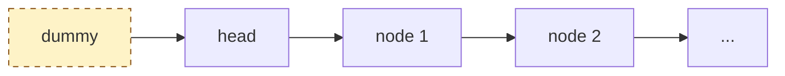
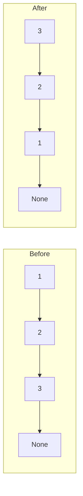

# Linked Lists — the basics

!!! abstract "What this chapter is"
    The third pillar after arrays and strings. Linked lists are conceptually simple — nodes pointing to nodes — but they're the test bed for **pointer manipulation**, the skill that interviewers grade hardest. If you can reverse a linked list in place without a single off-by-one, every tree problem becomes easier.

    **Reading time:** 3 hours cover-to-cover; 30 minutes per problem.

    **Prereqs:** [Strings — basics](../strings/01-string-basics.md) (or just [Arrays — basics](../arrays/01-array-basics.md)) plus the [Python crash course](../../01-foundations/python-crash-course-for-dsa.md).

---

## Chapter map

<div class="grid cards" markdown>

-   :material-numeric-1-circle:{ .lg .middle } &nbsp; **What is a linked list?**

    Plain English + everyday analogy. The mental model.

-   :material-numeric-2-circle:{ .lg .middle } &nbsp; **Why we need them**

    What problems become easier with pointers vs contiguous memory.

-   :material-numeric-3-circle:{ .lg .middle } &nbsp; **How linked lists work internally**

    Memory layout, dereferencing, cache-unfriendliness.

-   :material-numeric-4-circle:{ .lg .middle } &nbsp; **Python implementation from scratch**

    `Node`, `SinglyLinkedList`, `DoublyLinkedList` — all the operations.

-   :material-numeric-5-circle:{ .lg .middle } &nbsp; **Time & space complexity**

    The full table. The two operations that surprise everyone.

-   :material-numeric-6-circle:{ .lg .middle } &nbsp; **Built-in Python tools**

    `collections.deque` — when to use it instead of rolling your own.

-   :material-numeric-7-circle:{ .lg .middle } &nbsp; **When to use vs not use**

    Linked list vs array vs deque vs hash map.

-   :material-numeric-8-circle:{ .lg .middle } &nbsp; **Common mistakes & gotchas**

    The 10 pointer mistakes that fail interviews.

-   :material-numeric-9-circle:{ .lg .middle } &nbsp; **Patterns this connects to**

    Two pointers, fast/slow, reversal, merging.

-   :material-numeric-10-circle:{ .lg .middle } &nbsp; **Practice problems (40)**

    Each in 5-layer progressive format with follow-ups.

-   :fontawesome-solid-microphone:{ .lg .middle } &nbsp; **How interviewers ask this**

    Phrasings, dry-run-on-paper expectations, the dummy-node trick.

-   :material-clipboard-check:{ .lg .middle } &nbsp; **Self-check quiz**

    20 questions. If you can answer 18, you've mastered linked lists.

</div>

---

## 1. What is a linked list?

> **Plain English:** a chain of small boxes. Each box holds one piece of data and a **pointer** (an arrow) to the next box.

The everyday analogy: a **scavenger hunt**. Each clue (node) tells you where to find the next clue. You can't jump to clue 5 directly — you have to follow clues 1, 2, 3, 4 first.

```
   ┌─────┐    ┌─────┐    ┌─────┐    ┌─────┐
   │  3  │───▶│  7  │───▶│  2  │───▶│  9  │───▶ None
   └─────┘    └─────┘    └─────┘    └─────┘
    head                                tail
```

In Python, the smallest definition is just a class:

```python
class ListNode:
    def __init__(self, val: int = 0, next: 'ListNode | None' = None) -> None:
        self.val = val
        self.next = next
```

A whole linked list is identified by a **single reference**: the `head` pointer. The rest is reached by walking `next` pointers.

```python
head = ListNode(3, ListNode(7, ListNode(2, ListNode(9))))
print(head.val)               # 3
print(head.next.val)          # 7
print(head.next.next.val)     # 2
```

!!! info "Singly vs doubly vs circular"
    - **Singly linked list:** each node has a `next` pointer. The default of every interview problem.
    - **Doubly linked list:** each node has both `next` and `prev`. Used when you need to delete in O(1) given a node, or walk backward.
    - **Circular linked list:** the last node's `next` points back to the head (or to some earlier node — that's a cycle).

    Unless we say otherwise, "linked list" = singly linked list.

---

## 2. Why we need linked lists

If arrays already give you O(1) random access and O(1) amortized append, why bother with anything else?

Three reasons.

### 2.1 O(1) insert and delete *anywhere* — given a pointer

If you already have a pointer to a node, deleting it (or splicing in a new one after it) is **O(1)**:

```python
# Delete node B from A → B → C:
A.next = B.next   # Now A → C, B is orphaned
```

In an array, the same delete is O(n) because everything to the right has to shift.

The catch: you have to *have* the pointer. Locating the pointer is O(n).

### 2.2 No reallocation, no copy

Arrays double their backing buffer when full and copy everything across. That's amortized O(1) but a single append can spike to O(n) at the worst moment.

Linked lists never reallocate or copy. Each `append` (with a tail pointer) is true **O(1)**.

This matters for:

- **Real-time systems** where you can't afford a 10ms hiccup during a buffer doubling.
- **Memory-constrained environments** where allocating a new "doubled" buffer briefly takes 2× the memory.
- **Concurrent / lock-free data structures** where copying isn't atomic.

### 2.3 They're the building block for everything else

The ideas you learn here — **two-pointer**, **reversal**, **slow/fast**, **merge**, **dummy head** — are exactly the ideas you'll re-use for trees, graphs, and many string problems.

If trees are "linked lists with multiple `next` pointers," and graphs are "linked lists with arbitrary connections," then mastering linked lists is the cheapest way to master pointer reasoning.

---

## 3. How linked lists work internally

The mechanics that explain the gotchas in Part 8.

### 3.1 Memory layout — scattered, not contiguous

For an array `[10, 20, 30, 40]`, the runtime allocates one chunk of memory:

```
        addr:  100   104   108   112
              ┌────┬────┬────┬────┐
              │ 10 │ 20 │ 30 │ 40 │
              └────┴────┴────┴────┘
```

For a linked list with the same values, each node is a **separate allocation** somewhere in the heap:

```
        addr:  340                     200                     780                     50
              ┌────┬─────┐            ┌────┬─────┐            ┌────┬─────┐            ┌────┬──────┐
   head ───▶ │ 10 │ 200 │───────────▶│ 20 │ 780 │───────────▶│ 30 │  50 │───────────▶│ 40 │ None │
              └────┴─────┘            └────┴─────┘            └────┴─────┘            └────┴──────┘
                     (next)                  (next)                  (next)
```

Each "→" is a real **pointer dereference** — the CPU follows an address into a (probably) cold cache line.

### 3.2 The cache cost

A modern CPU reads memory in 64-byte **cache lines**. Walking an array means most reads are already in cache after the first one — you can iterate at 30+ GB/s.

Walking a linked list means each node is a likely cache miss. You're waiting on memory **most of the time**. Real-world throughput is often 10–100× slower than walking an array of the same logical size.

The lesson: **even when the asymptotics say linked list, often the constants make array faster.** This is why `list` (a dynamic array) is Python's default and `collections.deque` (a doubly-linked list of *blocks*) is the special case.

### 3.3 Why `head = head.next` is destructive

```python
def get_third(head: ListNode | None) -> int | None:
    head = head.next        # ❌ caller still holds head; this just rebinds locally
    head = head.next
    return head.val if head else None
```

The local `head` rebinding doesn't affect the caller's variable. Python passes references **by value**. To "advance" inside a function, you walk a local pointer; to mutate the list, you change a node's fields.

### 3.4 Sentinels — the dummy head trick

Half the linked-list bugs come from special-casing the head. The fix is a **dummy head** (also called a sentinel):

```python
dummy = ListNode(0, head)
prev = dummy
while ...:
    # operate on prev.next; prev never needs special handling
    prev = prev.next
return dummy.next
```

`dummy.next` is the (possibly new) head. The dummy itself is discarded. With a dummy, the logic for "delete the head" and "delete some interior node" becomes the same.



You'll see the dummy-head pattern in **dozens** of problems below.

### 3.5 Reversal — the canonical pointer move

Reversing a linked list is the single most-asked operation. The mechanic:

```python
prev = None
curr = head
while curr:
    next_node = curr.next      # save the next
    curr.next = prev           # reverse the link
    prev = curr                # advance prev
    curr = next_node           # advance curr
return prev
```

Walk through this on paper at least once. Every "reverse a section" / "reverse in groups of k" / "rotate" problem reduces to this four-line dance.



---

## 4. Python implementation from scratch

You'll never re-implement `list` in production. You *will* write small `ListNode` classes for interview problems all the time.

### 4.1 `ListNode` — the standard interview class

```python
from __future__ import annotations
from typing import Optional


class ListNode:
    """The standard LeetCode-style singly-linked-list node."""

    __slots__ = ("val", "next")

    def __init__(self, val: int = 0, next: Optional[ListNode] = None) -> None:
        self.val = val
        self.next = next

    def __repr__(self) -> str:
        # Walk up to 10 nodes for debugging.
        out: list[str] = []
        node: Optional[ListNode] = self
        for _ in range(10):
            if node is None:
                break
            out.append(str(node.val))
            node = node.next
        if node is not None:
            out.append("...")
        return " -> ".join(out)
```

Use `__slots__` to skip the per-instance dict — meaningful for large lists.

### 4.2 Helper: build / dump a linked list from a Python list

These two helpers make every interview problem testable in two lines:

```python
def from_list(values: list[int]) -> Optional[ListNode]:
    """Build a linked list from a Python list. Returns the head."""
    dummy = ListNode()
    tail = dummy
    for v in values:
        tail.next = ListNode(v)
        tail = tail.next
    return dummy.next


def to_list(head: Optional[ListNode]) -> list[int]:
    """Walk a linked list and return its values as a Python list."""
    out: list[int] = []
    node = head
    while node is not None:
        out.append(node.val)
        node = node.next
    return out
```

```python
head = from_list([3, 7, 2, 9])
print(to_list(head))           # [3, 7, 2, 9]
```

### 4.3 `SinglyLinkedList` — a small wrapper class

A wrapper that hides head/tail bookkeeping is rarely needed in interviews (where the input is already a `head` pointer), but it's a clean exercise:

```python
class SinglyLinkedList:
    """A minimal singly-linked list with O(1) append using a tail pointer."""

    __slots__ = ("_head", "_tail", "_size")

    def __init__(self) -> None:
        self._head: Optional[ListNode] = None
        self._tail: Optional[ListNode] = None
        self._size: int = 0

    def __len__(self) -> int:
        return self._size

    def append(self, val: int) -> None:
        node = ListNode(val)
        if self._tail is None:                       # (1)!
            self._head = self._tail = node
        else:
            self._tail.next = node
            self._tail = node
        self._size += 1

    def prepend(self, val: int) -> None:
        node = ListNode(val, self._head)
        self._head = node
        if self._tail is None:                       # (2)!
            self._tail = node
        self._size += 1

    def pop_front(self) -> int:
        if self._head is None:
            raise IndexError("pop from empty list")
        v = self._head.val
        self._head = self._head.next
        if self._head is None:
            self._tail = None                        # (3)!
        self._size -= 1
        return v

    def __iter__(self):
        node = self._head
        while node is not None:
            yield node.val
            node = node.next
```

1. **Empty-list special case.** If there's no tail, head and tail both become this new node.
2. **Same special case** on the other end.
3. **Resync tail.** When the list goes empty, the tail must be reset too — easy to forget.

`pop_back` (delete last) on a singly-linked list is **O(n)**: you can't get to the second-to-last node in O(1) from the tail without a `prev` pointer. That's the canonical case for going **doubly linked**.

### 4.4 `DoublyLinkedList` — when you need O(1) removal anywhere

```python
class DListNode:
    __slots__ = ("val", "prev", "next")

    def __init__(self, val: int = 0,
                 prev: Optional["DListNode"] = None,
                 next: Optional["DListNode"] = None) -> None:
        self.val = val
        self.prev = prev
        self.next = next


class DoublyLinkedList:
    """O(1) push/pop on both ends; O(1) removal given a node."""

    __slots__ = ("_head", "_tail", "_size")

    def __init__(self) -> None:
        # Use sentinel head and tail to eliminate boundary cases.
        self._head = DListNode()
        self._tail = DListNode()
        self._head.next = self._tail
        self._tail.prev = self._head
        self._size = 0

    def __len__(self) -> int:
        return self._size

    def push_back(self, val: int) -> DListNode:
        node = DListNode(val, prev=self._tail.prev, next=self._tail)
        self._tail.prev.next = node
        self._tail.prev = node
        self._size += 1
        return node

    def push_front(self, val: int) -> DListNode:
        node = DListNode(val, prev=self._head, next=self._head.next)
        self._head.next.prev = node
        self._head.next = node
        self._size += 1
        return node

    def remove(self, node: DListNode) -> None:
        node.prev.next = node.next
        node.next.prev = node.prev
        self._size -= 1

    def pop_front(self) -> int:
        if self._size == 0:
            raise IndexError("pop from empty list")
        v = self._head.next.val
        self.remove(self._head.next)
        return v

    def pop_back(self) -> int:
        if self._size == 0:
            raise IndexError("pop from empty list")
        v = self._tail.prev.val
        self.remove(self._tail.prev)
        return v
```

The sentinel `head` and `tail` nodes mean **every internal node has a real prev and next** — no `None`-checks inside `remove`. This pattern is exactly how the LRU Cache (Problem 24) works internally.

---

## 5. Time & space complexity

The full table. Notice how **searching for a value** and **accessing by index** are O(n) — that's the headline trade-off vs an array.

### Singly linked list

| Operation | Code (conceptual) | Time | Why |
|---|---|---|---|
| Access `i`-th node | walk i pointers | **O(i)** | no random access |
| Search for value | walk until found | **O(n)** | linear scan |
| Insert at head | new node, `node.next = head; head = node` | **O(1)** | no shifting |
| Insert at tail (with tail ptr) | new node, `tail.next = node; tail = node` | **O(1)** | tail pointer |
| Insert at tail (without tail ptr) | walk to end, then insert | **O(n)** | walk |
| Insert after a known node | `node.next = curr.next; curr.next = node` | **O(1)** | given the pointer |
| Delete head | `head = head.next` | **O(1)** | rebind |
| Delete tail | walk to second-to-last | **O(n)** | no prev pointer |
| Delete a known node (given node ptr only) | tricky — see Problem (LeetCode 237) | **O(1)** trick | copy next val and delete next |
| Length | walk all nodes | **O(n)** | unless cached |
| Reverse | three-pointer walk | **O(n)** | one pass |

### Doubly linked list

| Operation | Time | Why |
|---|---|---|
| All of the above | same | — |
| Delete tail | **O(1)** | use `tail.prev` |
| Insert before/after a known node | **O(1)** | `prev` and `next` both available |
| Delete a known node | **O(1)** | both pointers known |

**Space:** O(n) per node, plus per-node overhead for the pointer(s). In Python a `ListNode` with `__slots__` takes ~48 bytes; without slots, ~72 bytes. Compare an array of ints at ~28 bytes per entry — linked lists use 2–3× more memory.

!!! warning "The two surprises"
    1. **`pop_back` is O(n) on a singly-linked list.** That's why deques in C++/Java are doubly-linked (well, block-linked).
    2. **Computing `length` is O(n)** unless you cache it. Don't iterate twice for "length then walk" if you can avoid it.

---

## 6. Built-in Python tools

### 6.1 `collections.deque` — Python's "linked list when you want one"

```python
from collections import deque

d = deque([1, 2, 3])
d.append(4)         # [1, 2, 3, 4]
d.appendleft(0)     # [0, 1, 2, 3, 4]
d.pop()             # 4 — pop from right
d.popleft()         # 0 — pop from left
```

`deque` is a **doubly-linked list of fixed-size blocks** (typically 64-element arrays). It's the right choice when you need O(1) push/pop on both ends.

| Operation | Time |
|---|---|
| `append`, `appendleft` | **O(1)** amortized |
| `pop`, `popleft` | **O(1)** |
| `d[i]` | O(n) (yes, even though it's a sequence) |
| `len(d)` | O(1) — cached |
| `extend`, `extendleft` | O(k) |
| `rotate(n)` | O(\|n\|) |

Use cases:

- **BFS queue.** Append to one end, pop from the other.
- **Sliding-window maximum.** Maintain candidates in a deque (Monotonic Queue).
- **LRU eviction.** Move-to-front + drop-last (though typically you write the doubly-linked list yourself for true O(1) random removal).
- **Recently-used buffer of bounded size:** `deque(maxlen=k)` auto-drops the oldest.

When the interviewer asks "implement a queue," reach for `deque` first.

### 6.2 Why Python doesn't have a "true" `LinkedList` type

Because Python's `list` (dynamic array) covers 95% of "I need an ordered collection" use cases with better cache behavior. The remaining 5% (FIFO queues, double-ended) is covered by `deque`. The interview-grade `ListNode` is a problem-statement convention more than a daily Python tool.

If you need an interview-style linked list as a real data structure, you write it yourself (see Section 4) — it's about 30 lines.

---

## 7. When to use vs not use

### Use a linked list when…

- ✅ You need O(1) insert/delete at the *front* (or both ends, with a deque).
- ✅ You're given a node pointer and need O(1) splice.
- ✅ You're building an LRU cache (doubly-linked list + hash map).
- ✅ Memory is fragmented and you can't afford a contiguous allocation.
- ✅ You're reading from a streaming source one element at a time.

### Avoid linked lists when…

- ❌ You need random access by index → **array**.
- ❌ You need binary search or sorting on the data → **array**.
- ❌ You care about cache performance → **array**.
- ❌ You only need FIFO and don't need O(1) removal mid-list → **`deque`**.

### Decision tree

```mermaid
flowchart TD
    Q{What do you<br/>need?}
    Q -->|Push/pop both ends| DEQ[deque]:::pick
    Q -->|Random access by index| ARR[list]:::pick
    Q -->|O(1) splice given a node| LL[Doubly linked list]:::pick
    Q -->|FIFO, no mid-list ops| DEQ
    Q -->|LRU / LFU cache| HM[Hash map +<br/>doubly linked list]:::pick
    classDef pick fill:#dbeafe,stroke:#1e40af,color:#1e3a8a;
```

---

## 8. Common mistakes & gotchas

The 10 traps that fail interviews.

!!! warning "Trap 1 — Mutating `head` locally and expecting the caller to see it"
    ```python
    def remove_first(head):
        head = head.next        # ❌ caller's head unchanged
    ```
    **Fix:** return the new head and have the caller reassign.

!!! warning "Trap 2 — Forgetting to save `node.next` before reversing the link"
    ```python
    while curr:
        curr.next = prev        # ❌ now we've lost the original next
        prev = curr
        curr = curr.next        # ❌ this is now `prev`, infinite loop
    ```
    **Fix:** save first.
    ```python
    while curr:
        nxt = curr.next
        curr.next = prev
        prev = curr
        curr = nxt
    ```

!!! warning "Trap 3 — Off-by-one in slow/fast traversals"
    For an even-length list `[1, 2, 3, 4]`:
    - `slow = slow.next; fast = fast.next.next` — slow lands on 3 (the *second* middle).
    - To land on 2 (the *first* middle), advance `fast` first, check before `slow`.
    Always specify which midpoint you want.

!!! warning "Trap 4 — Cycle detection without checking `fast.next`"
    ```python
    while fast:
        slow = slow.next
        fast = fast.next.next   # ❌ NoneType has no .next
    ```
    **Fix:** `while fast and fast.next`.

!!! warning "Trap 5 — Special-casing the head when a dummy would do"
    Code with three `if head is None` guards is usually the wrong shape. Use a dummy.

!!! warning "Trap 6 — Building lists in the wrong order"
    A natural way to "build a list from values" goes head-first and prepends each new value. The result is reversed. Use a `tail` pointer or build then reverse.

!!! warning "Trap 7 — Iterating without progressing"
    ```python
    while curr:
        # ... no `curr = curr.next` ...
    ```
    Infinite loop. Always confirm the loop variable advances on every iteration.

!!! warning "Trap 8 — Cycle accidentally introduced"
    `node.next = some_earlier_node` creates a cycle. If your debug print hangs, suspect this.

!!! warning "Trap 9 — `id(node)` vs `node.val` confusion"
    "Same node" usually means the same `id`/reference, not the same value. `LinkedList.intersect` (Problem 7) tests this — two separate nodes with the same value are NOT an intersection.

!!! warning "Trap 10 — Free-floating pointers after delete"
    After `prev.next = curr.next`, the variable `curr` still references the orphaned node. Python's GC handles it, but in C++ you'd need to `delete curr`. Worth mentioning if asked language-agnostic.

---

## 9. Patterns this connects to

The eight patterns you'll meet in linked-list problems:

| Pattern | When you see it | Example problem |
|---|---|---|
| **Two pointers (slow/fast)** | Find middle, detect cycle, find k-th from end | Middle (#4), Cycle (#3), Nth-from-End (#5) |
| **Pointer reversal** | Reverse whole list / sublist / k-groups | Reverse (#1), Reverse II (#11), K-Group (#26) |
| **Dummy head** | Any operation that might delete or replace the head | Almost every problem |
| **Merge two sorted** | Merge-sort, merge-k-lists | Merge Two (#2), Merge K (#27) |
| **In-place merge sort** | Sort a linked list with O(1) extra space | Sort List (#17) |
| **Hash map for fast lookup** | Copy with random pointer, intersection, dedupe | Copy w/Random (#18) |
| **Floyd's cycle finding** | Detect cycle, find cycle start | Cycle II (#16) |
| **Doubly linked + hash map** | LRU / LFU caches, design problems | LRU Cache (#24) |

Each problem in section 10 is tagged with its primary pattern.

---

## 10. Practice problems (40)

Same v3 5-layer format you've seen since the arrays chapter:

1. 📖 Story Mode
2. 🌍 Real-World Usage
3. 🧠 Thinking Process
4. 🐍 5 Layers of Solution
5. 🔍 Dry Run
6. ⏱️ Complexity
7. 🎯 Pattern Used
8. 🔄 Interviewer Follow-ups
9. 🐛 Common Bugs
10. ✅ Edge Cases Checklist
11. 🏢 Sample Interviewer Quote

Difficulty buckets:

- **Easy 1–10**: every interview at every company.
- **Medium 11–25**: phone-screen and onsite bread and butter.
- **Hard 26–30**: the differentiators on senior loops.
- **Product-asked 31–35**: Google/Meta/Amazon/Apple specials.
- **Service / PSU 36–40**: TCS / Infosys / Wipro / HCL / ISRO style.

For brevity, all problems below assume the LeetCode-style `ListNode` class from §4.1.

---

### Problem 1 — Reverse Linked List

<span class="diff-easy">Easy</span> &nbsp; <span class="company-tag">Google</span> <span class="company-tag">Amazon</span> <span class="company-tag">Meta</span> <span class="company-tag">Microsoft</span> <span class="company-tag">Apple</span> <span class="company-tag">TCS</span>

> Reverse a singly linked list and return its new head.

#### 📖 Story Mode

`1 → 2 → 3 → 4 → 5 → None` becomes `5 → 4 → 3 → 2 → 1 → None`.

This is the **single most-asked linked-list problem in interviews**. Memorize the four-line dance until it's automatic.

#### 🌍 Real-World Usage

- **Undo / redo stacks** — reversing a chain of changes.
- **Bidirectional iteration** — flip a singly-linked list to walk it backward without doubling memory.
- **List-flatten variants** — many tree-to-list flatten problems end with a reverse.
- **Reversing a stream's elements** under memory pressure.

#### 🧠 Thinking Process

**Brute force:** copy values into a Python list, reverse, rebuild. O(n) time, O(n) extra memory.

**The pointer trick:** walk once with three pointers — `prev`, `curr`, `next_node`. At each step, point `curr.next` backward and shuffle the trio forward.

**Recursive:** reverse the tail recursively, then re-link the head. Same O(n) time, but **O(n) stack space**.

#### 🐍 5 Layers of Solution

=== "Layer 1 — Brute force (rebuild)"

    ```python
    def reverse_list_brute(head: ListNode | None) -> ListNode | None:
        values = []
        node = head
        while node:
            values.append(node.val); node = node.next
        values.reverse()
        return from_list(values)
    ```

    O(n) time, **O(n) space** (Python list + new linked list).

=== "Layer 2 — Iterative pointer reversal (canonical)"

    ```python
    def reverse_list(head: ListNode | None) -> ListNode | None:
        prev = None
        curr = head
        while curr:
            nxt = curr.next
            curr.next = prev
            prev = curr
            curr = nxt
        return prev
    ```

    O(n) time, **O(1) space**. The four-line dance.

=== "Layer 3 — Recursive"

    ```python
    def reverse_list_rec(head: ListNode | None) -> ListNode | None:
        if head is None or head.next is None:
            return head
        new_head = reverse_list_rec(head.next)
        head.next.next = head     # what was after `head` now points back at `head`
        head.next = None          # `head` is the new tail
        return new_head
    ```

    O(n) time, O(n) stack space.

=== "Layer 4 — Production-ready"

    ```python
    from __future__ import annotations
    from typing import Optional


    def reverse_list(head: Optional[ListNode]) -> Optional[ListNode]:
        """Reverse a singly linked list in place.

        Args:
            head: Head of the input list. May be None (empty list).

        Returns:
            Head of the reversed list (the original tail).

        Time:  O(n).
        Space: O(1) — three pointer variables.

        Example:
            >>> to_list(reverse_list(from_list([1, 2, 3, 4, 5])))
            [5, 4, 3, 2, 1]
        """
        prev: Optional[ListNode] = None
        curr = head
        while curr is not None:
            nxt = curr.next
            curr.next = prev
            prev = curr
            curr = nxt
        return prev
    ```

=== "Layer 5 — Variants"

    **Variant A — reverse a sublist `[m, n]` only.** See Problem 11.

    **Variant B — reverse in groups of k.** See Problem 26.

    **Variant C — reverse a doubly linked list.** Walk once swapping `prev` and `next` on each node; return the old tail.

    **Variant D — reverse "logically" without changing pointers.** Stack of references; pop them out. Useful when the list is read-only.

#### 🔍 Dry Run

`head = 1 → 2 → 3`:

| step | prev | curr | nxt | action |
|------|------|------|-----|--------|
| start | None | 1 | — | — |
| 1 | None | 1 | 2 | 1.next = None; prev=1; curr=2 |
| 2 | 1 | 2 | 3 | 2.next = 1; prev=2; curr=3 |
| 3 | 2 → 1 | 3 | None | 3.next = 2; prev=3; curr=None |
| end | 3 → 2 → 1 | None | — | return prev |

Output: `3 → 2 → 1 → None`. ✅

#### ⏱️ Complexity

- **Time: O(n)** — single pass.
- **Space: O(1)** — three pointers.

#### 🎯 Pattern Used

**Three-pointer reversal.** The most reused pointer pattern in linked-list problems. Memorize it.

#### 🔄 Interviewer Follow-ups

??? question "Follow-up 1 — Recursive version."
    See Layer 3. Mention the O(n) stack frames as a downside.

??? question "Follow-up 2 — Reverse in groups of k."
    See Problem 26. Same dance, applied to a window of k nodes.

??? question "Follow-up 3 — Reverse only a sublist `[m, n]`."
    See Problem 11.

??? question "Follow-up 4 — Reverse without modifying input (return a copy)."
    Walk + prepend into a new list. O(n) time and space.

??? question "Follow-up 5 — How would you test this?"
    Empty list, single node, two nodes, even length, odd length, list with cycle (should hang or be detected — clarify).

#### 🐛 Common Bugs

1. **Forgetting to save `nxt`** — overwriting `curr.next` first means losing the rest of the list.
2. **Returning `head` instead of `prev`** — `head` is the old head (now the tail).
3. **Recursion overflow** for n > 1000 (Python's default recursion limit).

#### ✅ Edge Cases Checklist

- [ ] Empty list → return None
- [ ] Single node → return that node
- [ ] Two nodes
- [ ] Long list (n = 10⁵) — iterative only

#### 🏢 Sample Interviewer Quote

> *"Reverse this singly linked list. Walk me through the pointer manipulation."*

Your opener: *"Three pointers: prev, curr, next. Save curr.next, flip curr's link to prev, advance both. O(n) time, O(1) space. I'll dry-run it on `1 → 2 → 3` to be sure I haven't introduced a cycle."*

---

### Problem 2 — Merge Two Sorted Lists

<span class="diff-easy">Easy</span> &nbsp; <span class="company-tag">Amazon</span> <span class="company-tag">Microsoft</span> <span class="company-tag">Apple</span> <span class="company-tag">Adobe</span> <span class="company-tag">Google</span>

> You're given two sorted linked lists. Merge them into one sorted list and return its head. The merge should reuse the input nodes, not allocate new ones.

#### 📖 Story Mode

`1 → 2 → 4` and `1 → 3 → 4` → `1 → 1 → 2 → 3 → 4 → 4`.

#### 🌍 Real-World Usage

- **External merge sort** — the merge step.
- **Streaming data joins** — merging two sorted streams by key.
- **Database query optimization** — merge join.
- **Polynomial / sparse-vector representation** — combining sorted-by-exponent terms.

#### 🧠 Thinking Process

Walk both lists in parallel; pick the smaller current head; advance that list's pointer; repeat. Use a **dummy head** so we don't special-case "first node of the result."

#### 🐍 5 Layers of Solution

=== "Layer 1 — Brute (rebuild)"

    ```python
    def merge_two_lists_brute(l1, l2):
        vals = to_list(l1) + to_list(l2)
        vals.sort()
        return from_list(vals)
    ```

    Allocates a new list. O((n+m) log (n+m)) due to sort. Wasted information.

=== "Layer 2 — Iterative two-pointer merge"

    ```python
    def merge_two_lists(l1, l2):
        dummy = ListNode()
        tail = dummy
        while l1 and l2:
            if l1.val <= l2.val:
                tail.next = l1; l1 = l1.next
            else:
                tail.next = l2; l2 = l2.next
            tail = tail.next
        tail.next = l1 if l1 else l2     # one of them is None
        return dummy.next
    ```

    O(n+m) time, **O(1) space**.

=== "Layer 3 — Recursive (elegant but stack-heavy)"

    ```python
    def merge_two_lists_rec(l1, l2):
        if not l1: return l2
        if not l2: return l1
        if l1.val <= l2.val:
            l1.next = merge_two_lists_rec(l1.next, l2)
            return l1
        l2.next = merge_two_lists_rec(l1, l2.next)
        return l2
    ```

    O(n+m) time, O(n+m) stack space.

=== "Layer 4 — Production-ready"

    ```python
    from __future__ import annotations
    from typing import Optional


    def merge_two_lists(l1: Optional[ListNode], l2: Optional[ListNode]) -> Optional[ListNode]:
        """Merge two ascending-sorted lists into one ascending-sorted list.

        Args:
            l1, l2: Heads of two sorted lists. Either may be None.

        Returns:
            Head of the merged list. Reuses input nodes; the inputs are
            not safe to use afterwards.

        Time:  O(n + m).
        Space: O(1).

        Example:
            >>> to_list(merge_two_lists(from_list([1, 2, 4]), from_list([1, 3, 4])))
            [1, 1, 2, 3, 4, 4]
        """
        dummy = ListNode()
        tail = dummy
        while l1 and l2:
            if l1.val <= l2.val:
                tail.next = l1
                l1 = l1.next
            else:
                tail.next = l2
                l2 = l2.next
            tail = tail.next
        tail.next = l1 if l1 else l2
        return dummy.next
    ```

=== "Layer 5 — Variants"

    **Variant A — merge into a *new* list (don't mutate inputs).** Allocate a fresh node at each step.

    **Variant B — merge by a custom comparator.** Replace `<=` with `cmp(l1.val, l2.val) <= 0`.

    **Variant C — merge K sorted lists.** Heap-based; see Problem 27.

    **Variant D — descending order.** Flip the comparison to `>=`.

#### 🔍 Dry Run

`l1 = 1 → 2 → 4`, `l2 = 1 → 3 → 4`:

| step | tail | l1 | l2 | action |
|------|------|----|----|--------|
| 1 | dummy | 1 | 1 | l1.val ≤ l2.val → take l1 |
| 2 | 1 | 2 | 1 | l2.val < l1.val → take l2 |
| 3 | 1→1 | 2 | 3 | take l1 (2) |
| 4 | 1→1→2 | 4 | 3 | take l2 (3) |
| 5 | 1→1→2→3 | 4 | 4 | take l1 (4) |
| 6 | 1→1→2→3→4 | None | 4 | l1 done, append rest of l2 |

Output: `1 → 1 → 2 → 3 → 4 → 4`. ✅

#### ⏱️ Complexity

- **Time: O(n + m)**.
- **Space: O(1)** iterative; O(n + m) recursive.

#### 🎯 Pattern Used

**Two-pointer merge with dummy head.** The skeleton of merge sort.

#### 🔄 Interviewer Follow-ups

??? question "Follow-up 1 — Merge K sorted lists."
    Heap-based or pairwise merge. See Problem 27.

??? question "Follow-up 2 — Merge without mutating inputs."
    Allocate a new `ListNode(...)` at each step.

??? question "Follow-up 3 — Stable merge with custom comparator."
    `<=` (not `<`) for stability — when values tie, take from `l1` first.

??? question "Follow-up 4 — Descending order."
    Flip the inequality.

??? question "Follow-up 5 — Streaming merge (both inputs are async iterators)."
    Same algorithm; await each `next` and pick the smaller head.

#### 🐛 Common Bugs

1. **Forgetting the trailing `tail.next = l1 if l1 else l2`** — drops the leftover suffix.
2. **`<` instead of `<=`** — breaks stability and double-counts on equal values.
3. **No dummy** — bug-prone first-iteration handling.

#### ✅ Edge Cases Checklist

- [ ] Both empty → None
- [ ] One empty → return the other
- [ ] Identical lists
- [ ] Lists of very different lengths
- [ ] Many duplicates

#### 🏢 Sample Interviewer Quote

> *"Merge these two sorted lists in place."*

Your opener: *"Two-pointer merge with a dummy head. At each step take the smaller current head and advance. After one runs out, splice the remaining tail. O(n+m) time, O(1) space."*

---

### Problem 3 — Linked List Cycle

<span class="diff-easy">Easy</span> &nbsp; <span class="company-tag">Amazon</span> <span class="company-tag">Google</span> <span class="company-tag">Microsoft</span> <span class="company-tag">Bloomberg</span> <span class="company-tag">Apple</span>

> Given the head of a linked list, return `True` if it has a cycle. A cycle exists if some node's `next` points to an earlier node.

#### 📖 Story Mode

`1 → 2 → 3 → 4 → 2 (back to second node)` — cycle.
`1 → 2 → 3 → 4 → None` — no cycle.

#### 🌍 Real-World Usage

- **Cycle detection in dependency graphs** — package managers, build systems.
- **Detecting infinite loops in interpreted code** — at the data-structure level.
- **Garbage collection** — tracking reference cycles.
- **Network topology analysis** — finding routing loops.

#### 🧠 Thinking Process

**Brute force:** keep a set of visited node *references*. If you see one twice → cycle. **O(n) time, O(n) space.**

**Floyd's tortoise and hare:** two pointers, one moving 1 step at a time, the other moving 2. If there's a cycle, the fast pointer will eventually catch up to the slow one. **O(n) time, O(1) space.**

#### 🐍 5 Layers of Solution

=== "Layer 1 — Hash set"

    ```python
    def has_cycle_set(head):
        seen = set()
        node = head
        while node:
            if id(node) in seen: return True
            seen.add(id(node))
            node = node.next
        return False
    ```

    O(n) time, O(n) space.

=== "Layer 2 — Floyd's tortoise and hare (optimal)"

    ```python
    def has_cycle(head):
        slow = fast = head
        while fast and fast.next:
            slow = slow.next
            fast = fast.next.next
            if slow is fast:
                return True
        return False
    ```

    O(n) time, **O(1) space**.

=== "Layer 3 — Edge-case-hardened"

    ```python
    def has_cycle(head):
        if head is None or head.next is None:
            return False
        slow = fast = head
        while fast and fast.next:
            slow = slow.next
            fast = fast.next.next
            if slow is fast:
                return True
        return False
    ```

=== "Layer 4 — Production-ready"

    ```python
    from __future__ import annotations
    from typing import Optional


    def has_cycle(head: Optional[ListNode]) -> bool:
        """Detect whether the linked list starting at head contains a cycle.

        Args:
            head: Head node, or None for an empty list.

        Returns:
            True iff some node's next pointer reaches an earlier node.

        Time:  O(n) — fast pointer reaches end (or matches slow) within ~2n steps.
        Space: O(1) — two pointers.

        Example:
            >>> head = ListNode(1); head.next = ListNode(2); head.next.next = head
            >>> has_cycle(head)
            True
        """
        if head is None or head.next is None:
            return False
        slow = head
        fast = head.next
        while fast is not None and fast.next is not None:
            if slow is fast:
                return True
            slow = slow.next
            fast = fast.next.next
        return False
    ```

=== "Layer 5 — Variants"

    **Variant A — find the START of the cycle (LeetCode 142).** See Problem 16.

    **Variant B — find the LENGTH of the cycle.** Once slow == fast, count steps until they meet again.

    **Variant C — given a doubly-linked list.** Same algorithm; the prev pointer doesn't help cycle detection.

    **Variant D — k-step pointers.** `slow` moves 1, `fast` moves k. Same proof works.

#### 🔍 Dry Run

`1 → 2 → 3 → 4 → 5 → 3 (cycle to node 3)`:

| step | slow | fast | met? |
|------|------|------|------|
| start | 1 | 1 | yes (trivial) — but the loop only checks AFTER advancing |
| 1 | 2 | 3 | no |
| 2 | 3 | 5 | no |
| 3 | 4 | 4 | **yes** → return True |

(Slow advanced 3, fast advanced 6; the meeting at node 4 confirms the cycle.) ✅

#### ⏱️ Complexity

- **Time: O(n)** — fast catches slow within at most n steps inside the cycle.
- **Space: O(1)**.

#### 🎯 Pattern Used

**Floyd's tortoise and hare.** Same trick re-used for "find duplicate number" (using indices as pointers) and many other cycle-related problems.

#### 🔄 Interviewer Follow-ups

??? question "Follow-up 1 — Find the start of the cycle."
    Problem 16.

??? question "Follow-up 2 — Find the length of the cycle."
    After meet, count one more lap.

??? question "Follow-up 3 — Why must they meet inside the cycle?"
    Once both pointers are inside the cycle, the gap between them shrinks by 1 each step (relative to a static observer in the cycle), so within `cycle_length` steps they coincide.

??? question "Follow-up 4 — What if you can't modify the list and can't use extra memory?"
    Floyd's. (Hash set is O(n) memory.)

??? question "Follow-up 5 — Doubly linked list."
    Same.

#### 🐛 Common Bugs

1. **Comparing `slow.val == fast.val`** — value equality is not the cycle invariant; pointer identity is.
2. **`while fast and fast.next.next`** — `fast.next` could be None, NPE on `.next.next`.
3. **Starting `fast = head.next` and missing the cycle of length 1** — clarify with the interviewer.

#### ✅ Edge Cases Checklist

- [ ] Empty list → False
- [ ] Single node, no cycle → False
- [ ] Single node with self-cycle → True
- [ ] Cycle of length 1, 2, 3
- [ ] Long list with cycle near the end
- [ ] Long list with no cycle

#### 🏢 Sample Interviewer Quote

> *"Detect whether this linked list has a cycle in O(1) extra memory."*

Your opener: *"Floyd's tortoise and hare. Slow pointer steps once, fast pointer twice. If they meet, cycle exists. If fast hits None, no cycle. O(n) time, O(1) space."*

---

### Problem 4 — Middle of the Linked List

<span class="diff-easy">Easy</span> &nbsp; <span class="company-tag">Amazon</span> <span class="company-tag">Microsoft</span> <span class="company-tag">Apple</span> <span class="company-tag">Google</span>

> Return the middle node of a linked list. If there are two middle nodes, return the **second** one.

#### 📖 Story Mode

`1 → 2 → 3 → 4 → 5` → return node `3`.
`1 → 2 → 3 → 4 → 5 → 6` → return node `4` (second middle).

#### 🌍 Real-World Usage

- **Splitting a list** — for merge sort or for partitioning by an external key.
- **Finding the median** of a sorted linked list in O(n) — single pass.
- **Skip-list construction** — pick the middle for the index entry.

#### 🧠 Thinking Process

**Brute force:** count nodes (O(n)), then walk halfway (O(n)). Two passes.

**Slow/fast trick:** `fast` advances twice per step, `slow` once. When `fast` hits the end, `slow` is at the middle. **One pass, O(1) memory.**

#### 🐍 5 Layers of Solution

=== "Layer 1 — Two passes"

    ```python
    def middle_node_two_pass(head):
        n = 0
        node = head
        while node: n += 1; node = node.next
        node = head
        for _ in range(n // 2): node = node.next
        return node
    ```

=== "Layer 2 — Slow/fast (optimal)"

    ```python
    def middle_node(head):
        slow = fast = head
        while fast and fast.next:
            slow = slow.next
            fast = fast.next.next
        return slow
    ```

    **One pass.**

=== "Layer 3 — Edge-case-hardened"

    Same as Layer 2; explicit None check at start:

    ```python
    def middle_node(head):
        if head is None: return None
        slow = fast = head
        while fast and fast.next:
            slow = slow.next
            fast = fast.next.next
        return slow
    ```

=== "Layer 4 — Production-ready"

    ```python
    from __future__ import annotations
    from typing import Optional


    def middle_node(head: Optional[ListNode]) -> Optional[ListNode]:
        """Return the middle node of head; for even length, the second middle.

        Args:
            head: Head of the list.

        Returns:
            The middle node, or None if head is None.

        Time:  O(n).
        Space: O(1).

        Example:
            >>> middle_node(from_list([1, 2, 3, 4, 5])).val
            3
            >>> middle_node(from_list([1, 2, 3, 4, 5, 6])).val
            4
        """
        slow = fast = head
        while fast is not None and fast.next is not None:
            slow = slow.next
            fast = fast.next.next
        return slow
    ```

=== "Layer 5 — Variants"

    **Variant A — return the FIRST middle for even-length.** Stop one step earlier:
    ```python
    while fast.next and fast.next.next:
        slow = slow.next; fast = fast.next.next
    ```
    For odd length, this also lands on the middle.

    **Variant B — return middle and split into two halves.** Helpful for merge sort. After finding `slow`, set `prev_of_slow.next = None` and return `(head, slow)`.

    **Variant C — k-th from middle.** Combine slow/fast with offset.

#### 🔍 Dry Run

`[1, 2, 3, 4, 5, 6]`:

| step | slow | fast | continue? |
|------|------|------|-----------|
| start | 1 | 1 | yes |
| 1 | 2 | 3 | yes |
| 2 | 3 | 5 | yes |
| 3 | 4 | None | stop |

Return slow = 4. ✅ (Second middle.)

#### ⏱️ Complexity

- **Time: O(n)**.
- **Space: O(1)**.

#### 🎯 Pattern Used

**Slow/fast pointers.** Most-reused linked-list pattern. Memorize it.

#### 🔄 Interviewer Follow-ups

??? question "Follow-up 1 — Return the FIRST middle."
    Variant A.

??? question "Follow-up 2 — Split the list at the middle."
    Variant B.

??? question "Follow-up 3 — Find the k-th node from the start."
    Single pointer, count k steps.

??? question "Follow-up 4 — k-th node from the END."
    Two-pointer with k-step gap. See Problem 5.

??? question "Follow-up 5 — Return the median of a sorted linked list."
    Same algorithm — middle of a sorted list IS its median.

#### 🐛 Common Bugs

1. **`while fast.next.next`** — NPE on odd-length lists.
2. **Returning `fast`** instead of `slow` — fast is the end, not the middle.
3. **Off-by-one when picking which middle is "the" middle.**

#### ✅ Edge Cases Checklist

- [ ] Empty → None
- [ ] Single node → that node
- [ ] Two nodes → the second
- [ ] Odd length → exact middle
- [ ] Even length → second middle (or first; clarify)

#### 🏢 Sample Interviewer Quote

> *"Find the middle of this linked list in one pass."*

Your opener: *"Slow and fast pointers. Slow advances 1, fast 2. When fast can't move, slow is at the middle. For even length, this returns the second middle — clarify if you want the first instead."*

---

### Problem 5 — Remove Nth Node From End of List

<span class="diff-medium">Medium</span> &nbsp; <span class="company-tag">Amazon</span> <span class="company-tag">Microsoft</span> <span class="company-tag">Meta</span> <span class="company-tag">Apple</span>

> Given the head of a linked list, remove the n-th node from the end and return the head.

#### 📖 Story Mode

`1 → 2 → 3 → 4 → 5`, `n = 2` → `1 → 2 → 3 → 5` (remove `4`).

#### 🌍 Real-World Usage

- **Trimming logs** — drop the n-th most recent entry.
- **History buffers** — maintain bounded history.
- **Streaming** — delete a known offset from the trailing window.

#### 🧠 Thinking Process

**Two passes:** length L, then walk to position L − n − 1 and delete the next node.

**One pass with two pointers:** `fast` advances n+1 steps first; then `slow` and `fast` advance together until `fast` hits the end. Now `slow` is at the node *before* the one to delete.

Use a **dummy head** so removing the actual head is uniform with removing any other node.

#### 🐍 5 Layers of Solution

=== "Layer 1 — Two passes"

    ```python
    def remove_nth_from_end_two_pass(head, n):
        L = 0
        node = head
        while node: L += 1; node = node.next
        dummy = ListNode(0, head)
        prev = dummy
        for _ in range(L - n): prev = prev.next
        prev.next = prev.next.next
        return dummy.next
    ```

=== "Layer 2 — One pass with two pointers"

    ```python
    def remove_nth_from_end(head, n):
        dummy = ListNode(0, head)
        slow = fast = dummy
        for _ in range(n + 1):                # advance fast by n+1
            fast = fast.next
        while fast:
            slow = slow.next
            fast = fast.next
        slow.next = slow.next.next
        return dummy.next
    ```

    **Single pass, O(1) space.**

=== "Layer 3 — Edge-case-hardened"

    ```python
    def remove_nth_from_end(head, n):
        if head is None or n <= 0: return head
        dummy = ListNode(0, head)
        slow = fast = dummy
        for _ in range(n + 1):
            if fast is None: return head      # n > length
            fast = fast.next
        while fast:
            slow = slow.next
            fast = fast.next
        slow.next = slow.next.next
        return dummy.next
    ```

=== "Layer 4 — Production-ready"

    ```python
    from __future__ import annotations
    from typing import Optional


    def remove_nth_from_end(head: Optional[ListNode], n: int) -> Optional[ListNode]:
        """Remove the n-th node from the end of the list. 1-indexed.

        Args:
            head: Head of the list.
            n: Position from the end (1 = last).

        Returns:
            New head; may differ from input if n equals list length.

        Time:  O(L) — single pass.
        Space: O(1).

        Example:
            >>> to_list(remove_nth_from_end(from_list([1, 2, 3, 4, 5]), 2))
            [1, 2, 3, 5]
        """
        dummy = ListNode(0, head)
        slow: ListNode = dummy
        fast: Optional[ListNode] = dummy
        for _ in range(n + 1):
            if fast is None:
                return head
            fast = fast.next
        while fast is not None:
            slow = slow.next        # type: ignore[assignment]
            fast = fast.next
        if slow.next is not None:
            slow.next = slow.next.next
        return dummy.next
    ```

=== "Layer 5 — Variants"

    **Variant A — remove the n-th from the START.** Walk n-1 steps, splice.

    **Variant B — remove every n-th node** (LeetCode 1721 variant).

    **Variant C — return the *removed* node, not just the new head.** Save it before splicing.

#### 🔍 Dry Run

`[1, 2, 3, 4, 5]`, n = 2 (remove 4):

dummy = 0 → 1 → 2 → 3 → 4 → 5.

Advance fast 3 steps (n+1 = 3) from dummy: fast at node 3.

Walk both until fast is None:
- slow = 0, fast = 3 → slow = 1, fast = 4
- slow = 1, fast = 4 → slow = 2, fast = 5
- slow = 2, fast = 5 → slow = 3, fast = None

slow.next = node 4. slow.next = node 4.next = node 5.

Result: `1 → 2 → 3 → 5`. ✅

#### ⏱️ Complexity

- **Time: O(L)**.
- **Space: O(1)**.

#### 🎯 Pattern Used

**Two-pointer with k-gap + dummy head.** Same template handles "k-th from end" lookup, "split list k from end."

#### 🔄 Interviewer Follow-ups

??? question "Follow-up 1 — One pass instead of two."
    The two-pointer version is already one pass.

??? question "Follow-up 2 — n larger than length."
    Return head unchanged or raise — clarify.

??? question "Follow-up 3 — n = length (remove head)."
    Dummy makes this a non-special case.

??? question "Follow-up 4 — Doubly linked."
    Walk to end, then back n-1 steps from tail. Two-pointer trick still works.

??? question "Follow-up 5 — k-th from end retrieval (without removal)."
    Same two-pointer; return slow.

#### 🐛 Common Bugs

1. **Advancing fast n times instead of n+1** — slow lands on the node to delete, not its predecessor.
2. **No dummy** — special-case head removal.
3. **Forgetting to handle n > length.**

#### ✅ Edge Cases Checklist

- [ ] Single node, n = 1 → empty list
- [ ] Remove head (n = length)
- [ ] Remove tail (n = 1)
- [ ] n = 0 — undefined; clarify

#### 🏢 Sample Interviewer Quote

> *"Remove the n-th node from the end in a single pass."*

Your opener: *"Two-pointer with a gap of n+1 (so I land on the node *before* the one to delete) plus a dummy head so I can splice the actual head uniformly. O(L) time, O(1) space."*

---

### Problem 6 — Palindrome Linked List

<span class="diff-easy">Easy</span> &nbsp; <span class="company-tag">Meta</span> <span class="company-tag">Amazon</span> <span class="company-tag">Microsoft</span> <span class="company-tag">Apple</span>

> Return `True` if the linked list is a palindrome.

#### 📖 Story Mode

`1 → 2 → 2 → 1` → True.
`1 → 2 → 3` → False.

#### 🌍 Real-World Usage

- **Bidirectional integrity checks** — verify a chain reads the same in both directions.
- **DNA palindrome detection** in linked-list-shaped genome representations.
- **Compression / framing protocol checks.**

#### 🧠 Thinking Process

**Brute:** copy values to a Python list, check `vals == vals[::-1]`. O(n) time, O(n) space.

**Optimal:** find the middle, reverse the second half, compare. **O(n) time, O(1) space.** Restoring the second half (so we don't mutate the input) is an optional bonus.

#### 🐍 5 Layers of Solution

=== "Layer 1 — Copy to array"

    ```python
    def is_palindrome_brute(head):
        vals = []
        while head: vals.append(head.val); head = head.next
        return vals == vals[::-1]
    ```

    O(n) time, O(n) space.

=== "Layer 2 — Reverse second half"

    ```python
    def is_palindrome(head):
        if not head or not head.next: return True
        # find middle
        slow = fast = head
        while fast and fast.next:
            slow = slow.next; fast = fast.next.next
        # reverse second half
        prev = None
        curr = slow
        while curr:
            nxt = curr.next; curr.next = prev; prev = curr; curr = nxt
        # compare
        left, right = head, prev
        while right:
            if left.val != right.val: return False
            left = left.next; right = right.next
        return True
    ```

    O(n) time, **O(1) space**. Mutates the input.

=== "Layer 3 — Reverse and restore"

    Same as Layer 2 but reverse the second half a second time at the end to leave the input intact.

=== "Layer 4 — Production-ready"

    ```python
    from __future__ import annotations
    from typing import Optional


    def is_palindrome(head: Optional[ListNode]) -> bool:
        """Return True iff the list reads the same forward and backward.

        Args:
            head: Head of the list.

        Returns:
            True iff palindrome (empty list and single node count as True).

        Time:  O(n).
        Space: O(1) — three pointers; the input list is briefly mutated and
               restored before returning.

        Example:
            >>> is_palindrome(from_list([1, 2, 2, 1]))
            True
            >>> is_palindrome(from_list([1, 2, 3]))
            False
        """
        if head is None or head.next is None:
            return True

        slow = fast = head
        while fast.next and fast.next.next:
            slow = slow.next
            fast = fast.next.next

        # Reverse the second half (starts at slow.next).
        def reverse(h: Optional[ListNode]) -> Optional[ListNode]:
            prev = None
            while h:
                nxt = h.next
                h.next = prev
                prev = h
                h = nxt
            return prev

        second = reverse(slow.next)
        # Compare the two halves.
        result = True
        left, right = head, second
        while right:
            if left.val != right.val:
                result = False
                break
            left = left.next
            right = right.next
        # Restore the list.
        slow.next = reverse(second)
        return result
    ```

=== "Layer 5 — Variants"

    **Variant A — recursive (with global pointer).** Walk to the end recursively; on the unwind, compare with a global head pointer.

    **Variant B — palindrome up to character class.** Skip non-alphanumeric in `val` (rare).

    **Variant C — doubly linked list.** Two pointers from both ends; same idea as the array palindrome check.

#### 🔍 Dry Run

`1 → 2 → 2 → 1`:

- middle: slow = node 2 (first one), fast at end.
- reverse second half: `2 → 1` becomes `1 → 2`.
- compare: 1 vs 1, 2 vs 2 → True. ✅

#### ⏱️ Complexity

- **Time: O(n)**.
- **Space: O(1)**.

#### 🎯 Pattern Used

**Slow/fast + reversal.** Composite pattern — many "operate on the second half" problems use this exact opening.

#### 🔄 Interviewer Follow-ups

??? question "Follow-up 1 — Restore the list."
    See Layer 4 — reverse the second half again at the end.

??? question "Follow-up 2 — Recursive."
    Variant A. Uses O(n) stack.

??? question "Follow-up 3 — Doubly linked list."
    Two pointers from both ends. O(n) time, O(1) space, no mutation.

??? question "Follow-up 4 — Concurrent reads in flight."
    Don't mutate; copy values to an array.

??? question "Follow-up 5 — Hash-based fingerprint comparison."
    Compare forward and reverse rolling hash of values. Probabilistic.

#### 🐛 Common Bugs

1. **Off-by-one in middle finding for even-length lists** — must split correctly so left and right halves match in size.
2. **Comparing past the end of the shorter half** — use `while right` (right is the shorter one after reverse).
3. **Forgetting to restore** if the spec says don't mutate.

#### ✅ Edge Cases Checklist

- [ ] Empty list → True
- [ ] Single node → True
- [ ] Two same → True
- [ ] Two different → False
- [ ] Even length palindrome
- [ ] Odd length palindrome

#### 🏢 Sample Interviewer Quote

> *"Tell me whether this list is a palindrome in O(1) extra memory."*

Your opener: *"Find the middle with slow/fast, reverse the second half in place, compare value-by-value, then restore. O(n) time, O(1) space, list ends up unchanged."*

---

### Problem 7 — Intersection of Two Linked Lists

<span class="diff-easy">Easy</span> &nbsp; <span class="company-tag">Amazon</span> <span class="company-tag">Microsoft</span> <span class="company-tag">Apple</span> <span class="company-tag">Bloomberg</span>

> Two linked lists may intersect at some node — meaning their last few nodes are *the same node objects* (not just same values). Return the intersection node, or None.

#### 📖 Story Mode

```
List A:   a1 → a2 ↘
                    c1 → c2 → c3
List B:   b1 → b2 → b3 ↗
```

Both A and B end with `c1 → c2 → c3`. Return `c1`.

#### 🌍 Real-World Usage

- **Find shared suffix in two text histories.**
- **Detect duplicate references in a mutating graph.**
- **VCS-style merge-base detection** (loosely analogous).
- **Detecting reference equality in a deduplicated structure.**

#### 🧠 Thinking Process

**Brute:** for every node in A, scan all of B for a match. O(n × m).

**Hash set:** put all of A's node ids into a set; walk B looking for matches. O(n + m) time, O(n) space.

**Two-pointer trick (length normalization):** walk both lists; when each pointer hits the end, redirect to the *other* list's head. After two passes, both pointers have walked `len(A) + len(B)` steps and meet at the intersection (or both are None). **O(n + m) time, O(1) space.**

#### 🐍 5 Layers of Solution

=== "Layer 1 — Hash set"

    ```python
    def get_intersection_set(headA, headB):
        seen = set()
        node = headA
        while node: seen.add(id(node)); node = node.next
        node = headB
        while node:
            if id(node) in seen: return node
            node = node.next
        return None
    ```

=== "Layer 2 — Length-normalized two-pointer"

    ```python
    def get_intersection_node(headA, headB):
        if not headA or not headB: return None
        a, b = headA, headB
        while a is not b:
            a = a.next if a else headB
            b = b.next if b else headA
        return a
    ```

    **O(m + n) time, O(1) space.** When `a` hits the end of A, switch to B. Same for `b`. After at most `len(A) + len(B)` steps, both pointers are aligned and either meet at the intersection or both reach None at the same time.

=== "Layer 3 — Length difference"

    Compute lengths. Advance the longer one by the difference. Then walk in lockstep. Same complexity as Layer 2.

=== "Layer 4 — Production-ready"

    ```python
    from __future__ import annotations
    from typing import Optional


    def get_intersection_node(headA: Optional[ListNode], headB: Optional[ListNode]) -> Optional[ListNode]:
        """Return the node where two linked lists intersect, or None.

        Intersection is by reference identity, not value equality.

        Args:
            headA, headB: Heads of the two lists.

        Returns:
            The first shared node, or None if disjoint.

        Time:  O(m + n).
        Space: O(1).

        Example:
            (Construct two lists sharing a tail and verify.)
        """
        if headA is None or headB is None:
            return None
        a: Optional[ListNode] = headA
        b: Optional[ListNode] = headB
        while a is not b:
            a = a.next if a is not None else headB
            b = b.next if b is not None else headA
        return a
    ```

=== "Layer 5 — Variants"

    **Variant A — return the COMMON SUFFIX as a new list (don't reuse).** Walk to intersection, copy the rest.

    **Variant B — detect intersection BY VALUE.** Different problem — likely needs O(n × m) or hashing on values.

    **Variant C — find intersection length.** From the intersection, walk to the end and count.

#### 🔍 Dry Run

`A = 1 → 9 → 1 → 2 → 4`, `B = 3 → 2 → 4`, intersect at the node with val 2.

(`A` length 5, `B` length 3.)

| step | a | b |
|------|---|---|
| 0 | 1 (A0) | 3 (B0) |
| 1 | 9 (A1) | 2 (B1) |
| 2 | 1 (A2) | 4 (B2) |
| 3 | 2 (A3) | None |
| 4 | 4 (A4) | 1 (A0) |
| 5 | None | 9 (A1) |
| 6 | 3 (B0) | 1 (A2) |
| 7 | 2 (B1) | 2 (A3) — **same node!** |

Return that node. ✅

#### ⏱️ Complexity

- **Time: O(m + n)**.
- **Space: O(1)**.

#### 🎯 Pattern Used

**Length-normalized two-pointer.** Same trick handles "shifted comparison" problems.

#### 🔄 Interviewer Follow-ups

??? question "Follow-up 1 — Return both the intersection node and its position."
    Track index as you walk.

??? question "Follow-up 2 — What if the two lists are not guaranteed to intersect?"
    The algorithm correctly returns None when both pointers reach None at the same time.

??? question "Follow-up 3 — What if the lists can have cycles?"
    Different problem — combine cycle detection (Problem 16) with intersection.

??? question "Follow-up 4 — Why does the trick work?"
    Both pointers traverse exactly `m + n` nodes before meeting (or both becoming None). At step `m + n`, they're aligned to the same offset from the *intersection* if it exists.

??? question "Follow-up 5 — Memory-bounded fragment search."
    The two-pointer trick is already O(1) memory.

#### 🐛 Common Bugs

1. **Comparing values instead of references** — `a.val == b.val` would falsely match parallel nodes.
2. **Not handling disjoint lists** — must detect both pointers reaching None and exit.
3. **Off-by-one when computing length difference.**

#### ✅ Edge Cases Checklist

- [ ] No intersection → None
- [ ] Same list passed twice → return head of the list
- [ ] Empty list → None
- [ ] Intersection at the head (i.e., the lists are identical from the start)
- [ ] One list is a tail of the other

#### 🏢 Sample Interviewer Quote

> *"Find the node where these two singly-linked lists begin to overlap, in O(1) memory."*

Your opener: *"When pointer A hits the end, redirect it to head B; when pointer B hits the end, redirect it to head A. After traversing m+n nodes, both pointers either meet at the intersection or both become None. O(m+n) time, O(1) space."*

---

### Problem 8 — Remove Duplicates from Sorted List

<span class="diff-easy">Easy</span> &nbsp; <span class="company-tag">Amazon</span> <span class="company-tag">Microsoft</span> <span class="company-tag">TCS</span> <span class="company-tag">Infosys</span>

> Given the head of a sorted linked list, delete all duplicates such that each element appears only once. Return the modified list head.

#### 📖 Story Mode

`1 → 1 → 2 → 3 → 3` → `1 → 2 → 3`.

#### 🌍 Real-World Usage

- **Set construction** from a sorted log.
- **Deduplication** in append-only stores.
- **Merge-result cleanup** after concatenating sorted streams.

#### 🧠 Thinking Process

Walk once. If current's value equals next's value, skip next. Otherwise advance.

#### 🐍 5 Layers of Solution

=== "Layer 1 — Direct"

    ```python
    def delete_duplicates(head):
        curr = head
        while curr and curr.next:
            if curr.val == curr.next.val:
                curr.next = curr.next.next
            else:
                curr = curr.next
        return head
    ```

    O(n) time, O(1) space.

=== "Layer 2 — Edge-case-hardened"

    Same; explicit `if head is None: return None` early.

=== "Layer 3 — Recursive"

    ```python
    def delete_duplicates_rec(head):
        if not head or not head.next: return head
        head.next = delete_duplicates_rec(head.next)
        return head.next if head.val == head.next.val else head
    ```

=== "Layer 4 — Production-ready"

    ```python
    from __future__ import annotations
    from typing import Optional


    def delete_duplicates(head: Optional[ListNode]) -> Optional[ListNode]:
        """Remove duplicate values from a sorted list, keeping one of each.

        Args:
            head: Head of an ascending-sorted list.

        Returns:
            Head of the deduplicated list (same head if not removed).

        Time:  O(n).
        Space: O(1).

        Example:
            >>> to_list(delete_duplicates(from_list([1, 1, 2, 3, 3])))
            [1, 2, 3]
        """
        curr = head
        while curr is not None and curr.next is not None:
            if curr.val == curr.next.val:
                curr.next = curr.next.next
            else:
                curr = curr.next
        return head
    ```

=== "Layer 5 — Variants"

    **Variant A — remove ALL duplicates (don't keep any with a duplicate).** See Problem 20.

    **Variant B — unsorted input.** Hash set of seen values; O(n) time, O(n) space.

    **Variant C — sorted by custom key.** Replace `==` with `key(x) == key(y)`.

#### 🔍 Dry Run

`1 → 1 → 2 → 3 → 3`:

| curr | curr.next | action |
|------|-----------|--------|
| 1 | 1 | duplicate → curr.next = 2; list: 1 → 2 → 3 → 3 |
| 1 | 2 | advance → curr = 2 |
| 2 | 3 | advance → curr = 3 |
| 3 | 3 | duplicate → curr.next = None; list: 1 → 2 → 3 |
| 3 | None | exit |

Result: `1 → 2 → 3`. ✅

#### ⏱️ Complexity

- **Time: O(n)**, **Space: O(1)**.

#### 🎯 Pattern Used

**Single-pointer in-place mutation.** The simplest mutation pattern — every interview should be able to do this in 30 seconds.

#### 🔄 Interviewer Follow-ups

??? question "Follow-up 1 — Unsorted input."
    Hash set; or sort first and apply this.

??? question "Follow-up 2 — Remove ALL nodes that have duplicates (keep only uniques)."
    Problem 20.

??? question "Follow-up 3 — k consecutive equal values cluster: keep one, drop others."
    Same algorithm.

??? question "Follow-up 4 — Recursion."
    See Layer 3.

??? question "Follow-up 5 — Doubly linked list."
    Same logic; also fix `next.prev`.

#### 🐛 Common Bugs

1. **Advancing when we should skip** — moving curr forward after a delete misses the case where the next node also duplicates.
2. **NPE on `curr.next.val`** — the `while curr and curr.next` guard catches it.

#### ✅ Edge Cases Checklist

- [ ] Empty
- [ ] Single node
- [ ] All same values
- [ ] No duplicates
- [ ] Duplicates at head, middle, tail

#### 🏢 Sample Interviewer Quote

> *"Remove duplicates from this sorted linked list."*

Your opener: *"Single pointer. If curr.val equals curr.next.val, splice next out. Otherwise advance. Don't advance after a splice — the new next might also duplicate."*

---

### Problem 9 — Add Two Numbers

<span class="diff-medium">Medium</span> &nbsp; <span class="company-tag">Amazon</span> <span class="company-tag">Google</span> <span class="company-tag">Microsoft</span> <span class="company-tag">Apple</span> <span class="company-tag">Adobe</span>

> Two non-negative integers are stored as linked lists, **least-significant digit first**. Each node contains a single digit. Return their sum as a linked list in the same format.

#### 📖 Story Mode

`(2 → 4 → 3) + (5 → 6 → 4)` → `(7 → 0 → 8)`.

That's `342 + 465 = 807`. The lists are reversed compared to standard reading: `2 → 4 → 3` represents 342.

This is exactly [Add Strings](../strings/01-string-basics.md#problem-10-add-strings-no-built-in-conversion) but on linked lists.

#### 🌍 Real-World Usage

- **Bignum arithmetic** in linked-list-of-digits implementations.
- **Polynomial addition** when each node represents a (coefficient, exponent) pair.
- **Streaming addition** where digits arrive least-significant first.

#### 🧠 Thinking Process

Walk both lists in parallel maintaining a carry. Build a result list with a dummy head and a tail pointer.

#### 🐍 5 Layers of Solution

=== "Layer 1 — Direct"

    ```python
    def add_two_numbers(l1, l2):
        dummy = ListNode()
        tail = dummy
        carry = 0
        while l1 or l2 or carry:
            d1 = l1.val if l1 else 0
            d2 = l2.val if l2 else 0
            total = d1 + d2 + carry
            carry, digit = divmod(total, 10)
            tail.next = ListNode(digit); tail = tail.next
            if l1: l1 = l1.next
            if l2: l2 = l2.next
        return dummy.next
    ```

    O(max(n, m)) time, O(max(n, m)) space (output).

=== "Layer 2 — Edge-case-hardened"

    Add `None` checks at the top.

=== "Layer 3 — Recursive"

    ```python
    def add_two_numbers_rec(l1, l2, carry=0):
        if not l1 and not l2 and not carry: return None
        d1 = l1.val if l1 else 0
        d2 = l2.val if l2 else 0
        total = d1 + d2 + carry
        node = ListNode(total % 10)
        node.next = add_two_numbers_rec(
            l1.next if l1 else None,
            l2.next if l2 else None,
            total // 10
        )
        return node
    ```

=== "Layer 4 — Production-ready"

    ```python
    from __future__ import annotations
    from typing import Optional


    def add_two_numbers(l1: Optional[ListNode], l2: Optional[ListNode]) -> Optional[ListNode]:
        """Add two non-negative integers represented as digit-reversed lists.

        Args:
            l1, l2: Heads of two lists; each node holds a digit 0-9.
                    The list is in least-significant-digit-first order.

        Returns:
            Head of a new list representing the sum in the same order.

        Time:  O(max(n, m)).
        Space: O(max(n, m)) — the output.

        Example:
            >>> to_list(add_two_numbers(from_list([2, 4, 3]), from_list([5, 6, 4])))
            [7, 0, 8]
        """
        dummy = ListNode()
        tail = dummy
        carry = 0
        while l1 is not None or l2 is not None or carry:
            d1 = l1.val if l1 is not None else 0
            d2 = l2.val if l2 is not None else 0
            total = d1 + d2 + carry
            carry, digit = divmod(total, 10)
            tail.next = ListNode(digit)
            tail = tail.next
            if l1 is not None: l1 = l1.next
            if l2 is not None: l2 = l2.next
        return dummy.next
    ```

=== "Layer 5 — Variants"

    **Variant A — most-significant first instead.** See Problem 22.

    **Variant B — subtract.** Borrow logic; assume l1 >= l2.

    **Variant C — multiply.** O(n × m) schoolbook.

    **Variant D — base-k addition.** Replace `divmod(total, 10)` with `divmod(total, k)`.

#### 🔍 Dry Run

`(2,4,3) + (5,6,4)`:

| step | d1 | d2 | carry-in | total | digit | carry-out |
|------|----|----|----------|-------|-------|-----------|
| 1 | 2 | 5 | 0 | 7 | 7 | 0 |
| 2 | 4 | 6 | 0 | 10 | 0 | 1 |
| 3 | 3 | 4 | 1 | 8 | 8 | 0 |

Output: `7 → 0 → 8`. ✅ (= 807.)

#### ⏱️ Complexity

- **Time: O(max(n, m))**.
- **Space: O(max(n, m))** — output.

#### 🎯 Pattern Used

**Two-pointer digit add with carry + dummy head.** Reused for bignum subtract / multiply.

#### 🔄 Interviewer Follow-ups

??? question "Follow-up 1 — Most-significant first."
    Reverse both, add, reverse result. Or use stacks.

??? question "Follow-up 2 — Subtract."
    Walk with borrow. Sign-handling for underflow.

??? question "Follow-up 3 — Multiply."
    Inner loop adds shifted single-digit-multiply results.

??? question "Follow-up 4 — In-place add into l1."
    Mutate l1; allocate only when its length is exhausted.

??? question "Follow-up 5 — Stream input (digits arrive over time)."
    Same algorithm; emit each result digit immediately.

#### 🐛 Common Bugs

1. **Forgetting the final carry** — `99 + 1` should produce a 3-digit result.
2. **Stopping the loop when one list ends** — the other might still have digits.
3. **`carry, digit = divmod(total, 10)`** — easy to swap order.

#### ✅ Edge Cases Checklist

- [ ] One empty
- [ ] Both empty → None
- [ ] Different lengths
- [ ] Final carry-out (`9 + 1` → `0 → 1`)
- [ ] Single digits

#### 🏢 Sample Interviewer Quote

> *"Add these two numbers represented as linked lists, least-significant digit first."*

Your opener: *"Walk both lists with a carry. At each step pull a digit from each (zero if exhausted), sum + carry, write the lower digit to the result, propagate the upper. Continue while either input or the carry is nonzero. O(max length) time."*

---

### Problem 10 — Linked List Random Node (Reservoir Sampling)

<span class="diff-medium">Medium</span> &nbsp; <span class="company-tag">Google</span> <span class="company-tag">Amazon</span> <span class="company-tag">Apple</span>

> Given a singly linked list, return a random node value with equal probability per node. The trick: you must implement it without knowing the list's length in advance.

#### 📖 Story Mode

For a 5-node list, calling `getRandom()` many times should return each value about 20% of the time.

If you knew the length, just pick `random.randint(0, n-1)` and walk. The interesting case: you don't know n, and you might be reading from a stream.

#### 🌍 Real-World Usage

- **Reservoir sampling** — picking a fair sample from a stream of unknown size.
- **A/B testing** — selecting a random user from an event stream.
- **Telemetry sampling** — picking a representative subset.

#### 🧠 Thinking Process

**Reservoir sampling, reservoir size 1:**

- Walk the list with a counter `i`.
- At each node, with probability `1 / (i + 1)`, replace the current pick.
- After walking n nodes, every node was picked with probability `1/n` (telescoping product).

#### 🐍 5 Layers of Solution

=== "Layer 1 — Convert to list"

    ```python
    import random

    class Solution1:
        def __init__(self, head):
            self.values = []
            while head:
                self.values.append(head.val); head = head.next

        def get_random(self):
            return random.choice(self.values)
    ```

    O(n) preprocessing, O(1) per get. **O(n) memory.** Disqualified by the "unknown length" framing.

=== "Layer 2 — Reservoir sampling"

    ```python
    import random

    class Solution:
        def __init__(self, head):
            self.head = head

        def get_random(self):
            chosen = self.head.val
            node = self.head.next
            i = 1
            while node:
                if random.randint(0, i) == 0:           # probability 1/(i+1)
                    chosen = node.val
                node = node.next; i += 1
            return chosen
    ```

    **O(n) per call**, O(1) memory.

=== "Layer 3 — Edge-case-hardened"

    Same; assume head is non-None per problem spec.

=== "Layer 4 — Production-ready"

    ```python
    from __future__ import annotations
    import random
    from typing import Optional


    class LinkedListRandomNode:
        """Uniform random node-value sampler for a fixed-but-unknown-length list.

        Uses reservoir sampling so the constructor doesn't need to know the
        list length. Suitable for streaming inputs.
        """

        def __init__(self, head: Optional[ListNode]) -> None:
            if head is None:
                raise ValueError("head must be non-None")
            self._head = head

        def get_random(self) -> int:
            """Return a uniformly random node value.

            Time:  O(n) per call.
            Space: O(1).
            """
            chosen = self._head.val
            node = self._head.next
            i = 1
            while node is not None:
                if random.randint(0, i) == 0:
                    chosen = node.val
                node = node.next
                i += 1
            return chosen
    ```

=== "Layer 5 — Variants"

    **Variant A — sample k nodes uniformly without replacement.** Reservoir sampling with reservoir size k.

    **Variant B — weighted sampling.** Each node has a weight; pick proportional to weight. Maintain a running total.

    **Variant C — Walker's alias method** for many queries on a static list. O(n) preprocess, O(1) per query.

#### 🔍 Dry Run

For 4-node list `[a, b, c, d]`:

- pick chosen = a.
- i=1: roll randint(0,1); 50% chance chosen = b.
- i=2: roll randint(0,2); 33% chance chosen = c.
- i=3: roll randint(0,3); 25% chance chosen = d.

P(chosen = a) = (1/2)(2/3)(3/4) = 1/4. ✅ (Symmetrically for each.)

#### ⏱️ Complexity

- **Time: O(n) per call**.
- **Space: O(1)**.

#### 🎯 Pattern Used

**Reservoir sampling.** The trick: keep a single "current pick"; on the i-th element, replace with probability 1/i.

#### 🔄 Interviewer Follow-ups

??? question "Follow-up 1 — Sample k nodes."
    Reservoir of size k; the i-th element replaces a random reservoir slot with probability k/i.

??? question "Follow-up 2 — O(1) per query if many queries are needed."
    Convert to list once (Layer 1).

??? question "Follow-up 3 — Weighted."
    Variant B.

??? question "Follow-up 4 — Streaming source where you can only read once."
    Reservoir sampling — exactly what it's for.

??? question "Follow-up 5 — Prove uniformity."
    P(picked at step i and never overwritten) = (1/i) × (i/(i+1)) × … × ((n-1)/n) = 1/n.

#### 🐛 Common Bugs

1. **`random.randint(0, i-1) == 0`** with the wrong bound — must include 0..i.
2. **Resetting the counter `i` mid-walk.**

#### ✅ Edge Cases Checklist

- [ ] Single-node list → always that value
- [ ] Two-node list → 50/50
- [ ] Many calls → distribution approaches uniform
- [ ] Empty list → undefined; clarify

#### 🏢 Sample Interviewer Quote

> *"Sample a node uniformly at random from a list whose length you don't know."*

Your opener: *"Reservoir sampling. Walk once with a counter i. At step i, the i-th node replaces the current pick with probability 1/(i+1). Final pick is uniform across all n nodes. O(n) per call, O(1) memory."*

---

### Problem 11 — Reverse Linked List II (range)

<span class="diff-medium">Medium</span> &nbsp; <span class="company-tag">Amazon</span> <span class="company-tag">Microsoft</span> <span class="company-tag">Facebook</span>

> Given a linked list and positions `left` and `right` (1-indexed, `left <= right`), reverse the nodes in positions `[left, right]` and return the head.

#### 📖 Story Mode

`1 → 2 → 3 → 4 → 5`, `left = 2, right = 4` → `1 → 4 → 3 → 2 → 5`.

#### 🌍 Real-World Usage

- **Editing operations** that flip a section of a structure.
- **Iterative deepening** in some algorithms.
- **Audio buffer manipulation.**

#### 🧠 Thinking Process

Walk to the node *before* `left` (call it `prev_left`). Then iteratively move each subsequent node to right after `prev_left` for `right - left` iterations. The dummy-head trick handles `left == 1` cleanly.

#### 🐍 5 Layers of Solution

=== "Layer 1 — Walk + reverse + reattach"

    ```python
    def reverse_between(head, left, right):
        if not head or left == right: return head
        dummy = ListNode(0, head); prev = dummy
        for _ in range(left - 1): prev = prev.next
        # prev is the node before position `left`
        curr = prev.next
        for _ in range(right - left):
            nxt = curr.next
            curr.next = nxt.next
            nxt.next = prev.next
            prev.next = nxt
        return dummy.next
    ```

    O(n) time, O(1) space.

=== "Layer 2 — Edge-case-hardened"

    Add `if not head` guard at start. Already handled by the for loop bounds.

=== "Layer 3 — Recursive helper"

    Cleaner but uses O(n) stack. Walk to `left`, then reverse `right - left + 1` nodes, then reattach.

=== "Layer 4 — Production-ready"

    ```python
    from __future__ import annotations
    from typing import Optional


    def reverse_between(head: Optional[ListNode], left: int, right: int) -> Optional[ListNode]:
        """Reverse positions [left, right] in head (1-indexed). left <= right.

        Time:  O(n).
        Space: O(1).

        Example:
            >>> to_list(reverse_between(from_list([1, 2, 3, 4, 5]), 2, 4))
            [1, 4, 3, 2, 5]
        """
        if head is None or left == right:
            return head
        dummy = ListNode(0, head)
        prev: ListNode = dummy
        for _ in range(left - 1):
            assert prev.next is not None
            prev = prev.next
        curr = prev.next
        assert curr is not None
        for _ in range(right - left):
            nxt = curr.next
            assert nxt is not None
            curr.next = nxt.next
            nxt.next = prev.next
            prev.next = nxt
        return dummy.next
    ```

=== "Layer 5 — Variants"

    **Variant A — reverse pairs (left = i*2+1, right = i*2+2 for all i).** See Problem 15.

    **Variant B — reverse in groups of k.** See Problem 26.

    **Variant C — reverse if predicate holds.** Generalize the range condition.

#### 🔍 Dry Run

`1 → 2 → 3 → 4 → 5`, `left=2, right=4`:

- prev = node 1 (the one *before* position 2).
- curr = node 2.
- Iteration 1: nxt = 3; 2.next = 4; 3.next = 2; 1.next = 3. List: `1 → 3 → 2 → 4 → 5`.
- Iteration 2: nxt = 4; 2.next = 5; 4.next = 3; 1.next = 4. List: `1 → 4 → 3 → 2 → 5`.

Result: `1 → 4 → 3 → 2 → 5`. ✅

#### ⏱️ Complexity

- **Time: O(n)**.
- **Space: O(1)**.

#### 🎯 Pattern Used

**Move-to-front splicing within a fixed window.** Same idea drives "reverse in k-groups."

#### 🐛 Common Bugs

1. **Incorrect prev** — must be the node *before* position `left`.
2. **Re-using a stale `prev.next`** after the first iteration.
3. **Forgetting dummy** when `left == 1`.

#### ✅ Edge Cases Checklist

- [ ] left == right → no-op
- [ ] left == 1 (reverse from head)
- [ ] right == length (reverse to tail)
- [ ] Whole list reverse (left=1, right=length) → equivalent to Problem 1

#### 🏢 Sample Interviewer Quote

> *"Reverse a sublist between positions left and right."*

Your opener: *"Walk to the node before `left`. Then for `right - left` iterations, move the node currently after curr to right after `prev`. O(n) time, O(1) space, with a dummy to handle `left = 1`."*

---

### Problem 12 — Reorder List

<span class="diff-medium">Medium</span> &nbsp; <span class="company-tag">Amazon</span> <span class="company-tag">Microsoft</span> <span class="company-tag">Apple</span>

> Given `L0 → L1 → L2 → ... → Ln-1`, reorder it to `L0 → Ln-1 → L1 → Ln-2 → L2 → Ln-3 → ...`. Modify in place.

#### 📖 Story Mode

`1 → 2 → 3 → 4 → 5` → `1 → 5 → 2 → 4 → 3`.

#### 🌍 Real-World Usage

- **Outerleaving / interleaving** patterns in scheduling.
- **Card shuffling** algorithms.
- **Memory placement strategies** that interleave high and low addresses.

#### 🧠 Thinking Process

Three-step composite:

1. Find the **middle** with slow/fast.
2. **Reverse** the second half.
3. **Merge** the two halves alternately.

Each step is a separate well-known operation, glued together.

#### 🐍 5 Layers of Solution

=== "Layer 1 — Array detour (memory-heavy)"

    ```python
    def reorder_list_array(head):
        if not head: return
        nodes = []
        node = head
        while node: nodes.append(node); node = node.next
        i, j = 0, len(nodes) - 1
        while i < j:
            nodes[i].next = nodes[j]; i += 1
            if i == j: break
            nodes[j].next = nodes[i]; j -= 1
        nodes[i].next = None
    ```

    O(n) time, O(n) space (the array of references).

=== "Layer 2 — Three-step in place"

    ```python
    def reorder_list(head):
        if not head or not head.next: return
        # 1. middle
        slow = fast = head
        while fast.next and fast.next.next:
            slow = slow.next; fast = fast.next.next
        # 2. reverse second half
        second = slow.next; slow.next = None
        prev = None
        while second:
            nxt = second.next; second.next = prev; prev = second; second = nxt
        # 3. interleave
        first = head; second = prev
        while second:
            n1 = first.next; n2 = second.next
            first.next = second; second.next = n1
            first = n1; second = n2
    ```

    **O(n) time, O(1) space**.

=== "Layer 3 — Edge-case-hardened"

    Same with explicit None checks.

=== "Layer 4 — Production-ready"

    ```python
    from __future__ import annotations
    from typing import Optional


    def reorder_list(head: Optional[ListNode]) -> None:
        """Reorder head in place: L0 → Ln → L1 → Ln-1 → ...

        Args:
            head: Head of the list. Modified in place.

        Time:  O(n).
        Space: O(1).

        Example:
            >>> h = from_list([1, 2, 3, 4, 5])
            >>> reorder_list(h)
            >>> to_list(h)
            [1, 5, 2, 4, 3]
        """
        if head is None or head.next is None:
            return

        # Step 1: middle.
        slow: ListNode = head
        fast: Optional[ListNode] = head
        while fast is not None and fast.next is not None and fast.next.next is not None:
            slow = slow.next  # type: ignore[assignment]
            fast = fast.next.next

        # Step 2: reverse second half.
        second: Optional[ListNode] = slow.next
        slow.next = None
        prev: Optional[ListNode] = None
        while second is not None:
            nxt = second.next
            second.next = prev
            prev = second
            second = nxt

        # Step 3: interleave.
        first: Optional[ListNode] = head
        second = prev
        while second is not None:
            n1 = first.next  # type: ignore[union-attr]
            n2 = second.next
            first.next = second  # type: ignore[union-attr]
            second.next = n1
            first = n1
            second = n2
    ```

=== "Layer 5 — Variants"

    **Variant A — interleave two given lists.** Skip the find-middle and reverse steps; just interleave.

    **Variant B — non-destructive (return a new list).** Same shape but allocate new nodes.

    **Variant C — reorder differently (e.g., L1 L0 L3 L2 ...).** Different interleave step; same skeleton.

#### 🔍 Dry Run

`1 → 2 → 3 → 4 → 5`:

- middle: slow at 3.
- reverse second half: `4 → 5` becomes `5 → 4`.
- interleave: 1 → 5 → 2 → 4 → 3.

Result: `1 → 5 → 2 → 4 → 3`. ✅

#### ⏱️ Complexity

- **Time: O(n)**.
- **Space: O(1)**.

#### 🎯 Pattern Used

**Composite of three classic moves.** The "find middle, reverse, merge" trio shows up in palindrome-on-list, in some BST-from-list problems, and in many "split + transform + recombine" tasks.

#### 🔄 Interviewer Follow-ups

??? question "Follow-up 1 — Why split before reversing?"
    To avoid mutating the first half while the second half still references back to it.

??? question "Follow-up 2 — Even-length list."
    Split makes the second half one shorter than the first; `while second` loop handles it cleanly.

??? question "Follow-up 3 — Generalize to k-way interleave (k > 2)."
    Split into k equal-ish parts, reverse some, merge in round-robin.

#### 🐛 Common Bugs

1. **Forgetting `slow.next = None`** — leaves the first half pointing into the (now reversed) second half, creating a cycle.
2. **Off-by-one in middle.** Pick the right one for even-length lists.
3. **Interleave loop running too long** — second is the shorter half.

#### ✅ Edge Cases Checklist

- [ ] Empty / single node → no-op
- [ ] Two nodes → unchanged
- [ ] Three nodes
- [ ] Even vs odd length

#### 🏢 Sample Interviewer Quote

> *"Reorder this list to L0, Ln, L1, Ln-1, ... in place."*

Your opener: *"Three-step composite. Find the middle with slow/fast. Reverse the second half. Interleave the two halves. O(n) time, O(1) space."*

---

### Problem 13 — Odd Even Linked List

<span class="diff-medium">Medium</span> &nbsp; <span class="company-tag">Amazon</span> <span class="company-tag">Bloomberg</span> <span class="company-tag">eBay</span>

> Group all nodes at **odd positions** (1, 3, 5, ...) followed by all nodes at **even positions** (2, 4, 6, ...). Maintain relative order. In place, O(1) extra memory.

#### 📖 Story Mode

`1 → 2 → 3 → 4 → 5` → `1 → 3 → 5 → 2 → 4`.

#### 🌍 Real-World Usage

- **Odd/even round-robin scheduling.**
- **Re-pinning hot vs cold elements** in a structure.
- **Parallel access patterns** that group by index parity.

#### 🧠 Thinking Process

Maintain two chains: `odd` and `even`. Walk the original list; append to whichever chain matches the current index parity. Concatenate at the end.

#### 🐍 5 Layers of Solution

=== "Layer 2 — Two pointers"

    ```python
    def odd_even_list(head):
        if not head or not head.next: return head
        odd = head
        even = even_head = head.next
        while even and even.next:
            odd.next = even.next
            odd = odd.next
            even.next = odd.next
            even = even.next
        odd.next = even_head
        return head
    ```

    O(n) time, O(1) space.

=== "Layer 4 — Production-ready"

    ```python
    from __future__ import annotations
    from typing import Optional


    def odd_even_list(head: Optional[ListNode]) -> Optional[ListNode]:
        """Reorder so odd-indexed nodes come first, then even-indexed.

        Time:  O(n).
        Space: O(1).

        Example:
            >>> to_list(odd_even_list(from_list([1, 2, 3, 4, 5])))
            [1, 3, 5, 2, 4]
        """
        if head is None or head.next is None:
            return head
        odd = head
        even = even_head = head.next
        while even is not None and even.next is not None:
            odd.next = even.next
            odd = odd.next
            even.next = odd.next
            even = even.next
        odd.next = even_head
        return head
    ```

=== "Layer 5 — Variants"

    **Variant A — group by **value parity** instead of position parity.** Two chains: even-valued, odd-valued. Same skeleton.

    **Variant B — group by an arbitrary predicate.** True-passing chain first, false-passing second.

    **Variant C — k-modulo grouping.** Maintain k chains; concatenate at end.

#### ⏱️ Complexity

O(n) time, O(1) space.

#### 🐛 Common Bugs

1. **Forgetting to break the even chain's tail** — the last even node's `next` could still point somewhere stale, creating a cycle.
2. **Stopping the loop too early** for even-length lists.

#### ✅ Edge Cases Checklist

- [ ] Empty / single node
- [ ] Two nodes
- [ ] Even vs odd length

#### 🏢 Sample Interviewer Quote

> *"Group odd-indexed nodes before even-indexed in place."*

Your opener: *"Maintain two chains by walking with a step of 2. Concatenate at the end. O(n), O(1)."*

---

### Problem 14 — Rotate List

<span class="diff-medium">Medium</span> &nbsp; <span class="company-tag">Amazon</span> <span class="company-tag">Microsoft</span> <span class="company-tag">Bloomberg</span>

> Rotate the list to the **right** by `k` places.

#### 📖 Story Mode

`1 → 2 → 3 → 4 → 5`, k = 2 → `4 → 5 → 1 → 2 → 3`.

#### 🌍 Real-World Usage

- **Circular buffer rotation.**
- **Round-robin scheduling.**
- **Cipher / encoding** byte rotation.

#### 🧠 Thinking Process

1. Compute length `L`. Set `k = k % L`.
2. Find the new tail (position `L - k - 1` from head).
3. New head = `new_tail.next`. Old tail's `next` = old head. New tail's `next` = None.

Equivalent: connect the list into a cycle, walk to the right place, cut.

#### 🐍 5 Layers of Solution

=== "Layer 2 — Cycle and cut"

    ```python
    def rotate_right(head, k):
        if not head or not head.next or k == 0: return head
        # length and tail
        L = 1; tail = head
        while tail.next: tail = tail.next; L += 1
        k %= L
        if k == 0: return head
        # close cycle
        tail.next = head
        # find new tail at position L - k - 1
        new_tail = head
        for _ in range(L - k - 1):
            new_tail = new_tail.next
        new_head = new_tail.next
        new_tail.next = None
        return new_head
    ```

    O(n) time, O(1) space.

=== "Layer 4 — Production-ready"

    ```python
    from __future__ import annotations
    from typing import Optional


    def rotate_right(head: Optional[ListNode], k: int) -> Optional[ListNode]:
        """Rotate the list right by k places.

        Time:  O(n).
        Space: O(1).

        Example:
            >>> to_list(rotate_right(from_list([1, 2, 3, 4, 5]), 2))
            [4, 5, 1, 2, 3]
        """
        if head is None or head.next is None or k <= 0:
            return head
        # Length + tail.
        L = 1
        tail = head
        while tail.next is not None:
            tail = tail.next
            L += 1
        k %= L
        if k == 0:
            return head
        tail.next = head
        new_tail = head
        for _ in range(L - k - 1):
            new_tail = new_tail.next  # type: ignore[assignment]
        new_head = new_tail.next
        new_tail.next = None
        return new_head
    ```

=== "Layer 5 — Variants"

    **Variant A — rotate left by k.** Equivalent to rotate right by `L - k`.

    **Variant B — rotate by a value, not count.** Rotate so a specific value lands at the head.

    **Variant C — rotate a doubly linked list.** Pointer fix-up on both sides.

#### ⏱️ Complexity

O(n) time, O(1) space.

#### 🐛 Common Bugs

1. **Forgetting `k %= L`** for k > L.
2. **Off-by-one in `L - k - 1`** — easy to land at the wrong "new tail."
3. **Not breaking the cycle.**

#### ✅ Edge Cases Checklist

- [ ] k = 0 → unchanged
- [ ] k % L == 0 → unchanged
- [ ] k = 1
- [ ] k > L
- [ ] Empty / single node

#### 🏢 Sample Interviewer Quote

> *"Rotate this list right by k places."*

Your opener: *"Walk to find length and tail. Reduce k mod length. Close into a cycle, walk to position L-k-1, cut. O(n) time, O(1) space."*

---

### Problem 15 — Swap Nodes in Pairs

<span class="diff-medium">Medium</span> &nbsp; <span class="company-tag">Amazon</span> <span class="company-tag">Microsoft</span> <span class="company-tag">Bloomberg</span> <span class="company-tag">Apple</span>

> Given a linked list, swap every two adjacent nodes and return its head. You **may not modify the values** in the list's nodes — only nodes themselves may be changed. (LeetCode 24.)

#### 📖 Story Mode

```
input :   1 → 2 → 3 → 4
output:   2 → 1 → 4 → 3

input :   1 → 2 → 3              (odd length)
output:   2 → 1 → 3              (last element stays put)

input :   1                      (single node)
output:   1

input :   (empty)
output:   (empty)
```

The "no value swap" constraint is the heart of the problem — it forces you to **rewire pointers**, which is where the bookkeeping lives.

#### 🌍 Real-World Usage

- **Doubly linked list reversal in pairs** — UI list-shuffle animations rotate adjacent items by pointer flips, not value swaps, because the DOM elements are themselves the data.
- **Token reordering in lexers** — when a parser must commute two adjacent tokens it cannot copy them (they hold side-effectful state).
- **Persistent data structures** — value mutation is forbidden by design; you can only re-link nodes.
- **Audio/video frame reordering** — frames are large objects; pointer flips are O(1) instead of O(frame-size).
- **Foundation for Reverse Nodes in k-Group (P26)** — pairs are the k=2 special case.

#### 🧠 Thinking Process

The local move on each pair `a → b` is to produce `b → a`. The trick is: for the result to chain correctly, we need a **handle on the node before the pair** (so we can hook it to the new head `b` of the pair) and we need to know `b.next` (so we can hook the old head `a`'s `.next` to it).

A **dummy head** node is the standard mechanism to give us a uniform "previous" pointer for the first pair, eliminating the special case where the original head changes.

The four pointer flips per pair are:

```
prev → a → b → rest
becomes
prev → b → a → rest

# Pointer surgery, in order:
a.next = b.next       # 'a' jumps over 'b' to point at rest
b.next = a            # 'b' now points at 'a'
prev.next = b         # the chain before us now reaches 'b'
prev = a              # advance 'prev' to the tail of the swapped pair
```

The recursive version is famously tiny: swap the head pair, then recurse on the rest. Use it to discuss tradeoffs (stack depth on huge lists).

#### 🐍 Solutions

=== "Layer 1 — Brute force: copy values into a list, swap pairs, rebuild"

    Violates the "no value modification" constraint, but useful as a sanity check.

    ```python
    from __future__ import annotations


    def swap_pairs_via_array(head: ListNode | None) -> ListNode | None:
        vals: list[int] = []
        cur = head
        while cur:
            vals.append(cur.val)
            cur = cur.next
        for i in range(0, len(vals) - 1, 2):
            vals[i], vals[i + 1] = vals[i + 1], vals[i]
        # Rebuild
        dummy = ListNode()
        tail = dummy
        for v in vals:
            tail.next = ListNode(v)
            tail = tail.next
        return dummy.next
    ```

    O(n) time, O(n) space. **Disallowed by the problem** but presented to motivate why we do pointer surgery.

=== "Layer 2 — Iterative pointer surgery (canonical) ⭐"

    Dummy head + four-pointer flip per pair.

    ```python
    from __future__ import annotations


    class ListNode:
        def __init__(self, val: int = 0, nxt: "ListNode | None" = None) -> None:
            self.val = val
            self.next = nxt


    def swap_pairs(head: ListNode | None) -> ListNode | None:
        dummy = ListNode(0, head)
        prev = dummy
        while prev.next and prev.next.next:
            a = prev.next
            b = a.next
            # Re-wire
            a.next = b.next
            b.next = a
            prev.next = b
            # Advance
            prev = a
        return dummy.next
    ```

    O(n) time, **O(1) space** — no recursion stack. The interview default.

=== "Layer 3 — Recursive (elegant, but watch the stack)"

    Each call swaps the front pair and recurses on the remainder.

    ```python
    from __future__ import annotations


    def swap_pairs_recursive(head: ListNode | None) -> ListNode | None:
        if head is None or head.next is None:
            return head
        a, b = head, head.next
        a.next = swap_pairs_recursive(b.next)
        b.next = a
        return b
    ```

    O(n) time, **O(n/2) recursion stack**. Beautiful but blows up at n ≈ 10⁵ in CPython (default recursion limit 1000). Mention it; don't ship it.

=== "Layer 4 — Variant: swap pairs in a doubly linked list"

    With back-pointers we have to update *six* pointers per pair instead of three.

    ```python
    from __future__ import annotations


    class DListNode:
        def __init__(self, val: int = 0) -> None:
            self.val = val
            self.prev: "DListNode | None" = None
            self.next: "DListNode | None" = None


    def swap_pairs_doubly(head: DListNode | None) -> DListNode | None:
        dummy = DListNode()
        dummy.next = head
        if head: head.prev = dummy

        prev = dummy
        while prev.next and prev.next.next:
            a = prev.next
            b = a.next
            after = b.next

            # Forward links
            prev.next = b
            b.next = a
            a.next = after

            # Back links
            b.prev = prev
            a.prev = b
            if after: after.prev = a

            prev = a

        result = dummy.next
        if result: result.prev = None
        return result
    ```

    Same O(n) time, O(1) space. Easy to mess up the back pointers — quiz yourself by drawing it.

=== "Layer 5 — Production: swap pairs in chunks of an immutable persistent list"

    For interviews at functional-programming-flavored shops (Jane Street, Hudson River Trading) the question often becomes: don't mutate; build a *new* list whose adjacent pairs are swapped, sharing tails when possible.

    ```python
    from __future__ import annotations


    def swap_pairs_persistent(head: ListNode | None) -> ListNode | None:
        # Tail-recursive helper accumulating reversed pair-swapped result.
        def go(node: ListNode | None, acc: ListNode | None) -> ListNode | None:
            if node is None or node.next is None:
                # Odd tail (or empty). Prepend in original order to acc; reverse acc.
                if node is not None:
                    acc = ListNode(node.val, acc)
                return _reverse_copy(acc)
            # Build new pair (b', a') and prepend to acc in REVERSE pair order
            # so that after a final reverse the order is (b, a, ...).
            acc = ListNode(node.val, ListNode(node.next.val, acc))   # a, b appended in order
            return go(node.next.next, acc)

        def _reverse_copy(n: ListNode | None) -> ListNode | None:
            out = None
            while n:
                out = ListNode(n.val, out)
                n = n.next
            return out

        return go(head, None)
    ```

    Allocates O(n) new nodes (no shared tails because every pair changes), but never mutates. The variant where the trailing tail is preserved by reference is left as a follow-up.

#### 🔎 Step-by-Step Dry Run

`head = 1 → 2 → 3 → 4`. We use Layer 2.

Initial: `dummy → 1 → 2 → 3 → 4`. `prev = dummy`.

**Iteration 1**: `prev.next = 1`, `prev.next.next = 2` ✅ enter loop. `a = 1`, `b = 2`.

| Step          | Pointer flip                | Resulting list (with `prev` marker)              |
|---------------|-----------------------------|--------------------------------------------------|
| `a.next = b.next` | `1.next = 3`            | `dummy[prev] → 1 → 3 → 4`, `2 → 1 → ...` (orphan-ish) |
| `b.next = a` | `2.next = 1`                 | `dummy[prev] → 1 → 3 → 4`, `2 → 1 → 3 → 4`       |
| `prev.next = b` | `dummy.next = 2`         | `dummy[prev] → 2 → 1 → 3 → 4`                    |
| `prev = a`   | `prev = 1`                  | `dummy → 2 → 1[prev] → 3 → 4`                    |

**Iteration 2**: `prev = 1`, `prev.next = 3`, `prev.next.next = 4` ✅ enter. `a = 3`, `b = 4`.

| Step          | Pointer flip                | Resulting list                                    |
|---------------|-----------------------------|--------------------------------------------------|
| `a.next = b.next` | `3.next = None`         | `... → 1[prev] → 3 → None`, `4 → 3 → None`       |
| `b.next = a`  | `4.next = 3`                | `... → 1[prev] → 3 → None`, `4 → 3 → None`       |
| `prev.next = b` | `1.next = 4`              | `dummy → 2 → 1[prev] → 4 → 3 → None`             |
| `prev = a`    | `prev = 3`                  | `dummy → 2 → 1 → 4 → 3[prev] → None`             |

**Iteration 3**: `prev.next = None` → exit. Return `dummy.next = 2`.

Final: `2 → 1 → 4 → 3 → None` ✅.

#### 📊 Complexity

| Layer                          | Time | Space                | Notes                                            |
|--------------------------------|------|-----------------------|--------------------------------------------------|
| Layer 1 — value-array rebuild  | O(n) | O(n)                 | Disallowed; for sanity only                      |
| Layer 2 — iterative ⭐         | O(n) | **O(1)**             | The interview default                            |
| Layer 3 — recursive            | O(n) | O(n/2) stack         | Elegant; recursion depth dangerous on big inputs |
| Layer 4 — doubly linked list   | O(n) | O(1)                 | Six pointers per pair instead of three           |
| Layer 5 — persistent / no-mut  | O(n) | O(n) new nodes       | Functional shops; never mutates input            |

#### ❓ Follow-ups

??? question "Why use a dummy head?"
    Because the first pair's predecessor doesn't exist in the original list — without a dummy, you'd need a separate special case to detect "is this the very first pair?" and update `head` accordingly. The dummy gives every pair a uniform predecessor.

??? question "Can you do it without a dummy head?"
    Yes, but the code branches: handle the first pair separately to obtain the new head, then loop with a `prev` pointer. It's the same algorithm with worse readability. **Always prefer the dummy.**

??? question "What's the recursion-stack issue with Layer 3 in practice?"
    CPython's default recursion limit is 1000. Layer 3 recurses `n/2` times → at n = 2000 it errors. You can `sys.setrecursionlimit(...)` but that's a smell — the iterative version is strictly better.

??? question "Can you swap **every k-th pair** (i.e. only odd-indexed pairs)?"
    Yes — keep a counter; flip when counter is odd, just advance otherwise. The pointer surgery is identical; the loop body branches on the counter parity.

??? question "What about reversing **every k consecutive nodes**?"
    That's Reverse Nodes in k-Group (Problem 26). The pair version is just k=2 — but the general version needs a length probe (or a try-then-rewind approach) so that the trailing < k nodes are left untouched.

??? question "How would you swap pairs in a circular linked list?"
    Detach the cycle (find tail; tail.next = None), run the standard algorithm, then re-attach the new tail to the new head. O(n) time, O(1) space.

??? question "What if the input could be arbitrary directed graphs (not just lists)?"
    The problem's premise — *adjacent* pairs in *linear* order — doesn't apply. You'd need a traversal order definition first.

#### 🐛 Common Bugs

1. **Doing `b.next = a` before `a.next = b.next`** — overwrites the path forward to `rest`, losing the rest of the list to garbage collection.
2. **Forgetting to advance `prev = a`** (writing `prev = b` instead) — `prev` ends up at the new head of the pair, not the new tail; the next iteration looks at the wrong pair.
3. **Updating `head` directly without a dummy** — drops back into the special-case branch, easy to mis-handle empty/single-node inputs.
4. **In the doubly-linked variant, forgetting to null the **prev** pointer of the new head** at the end — the head still points back to the dummy.
5. **Using value swaps when the problem forbids them** — hidden constraint; many candidates miss it on first read.
6. **In Layer 5, sharing the trailing tail when the tail's pair was modified** — would mutate the original. Only share unmodified suffixes.

#### ⚠️ Edge Cases

- `head is None` → returns `None`. The `while` loop never fires.
- Single node `1` → returns `1`. `prev.next.next` is `None` → loop exits.
- Two nodes `1 → 2` → returns `2 → 1` after exactly one iteration.
- Three nodes `1 → 2 → 3` → returns `2 → 1 → 3`. After one iteration `prev = 1`, `prev.next = 3`, `prev.next.next = None` → exit. The lone tail stays in place.
- Even vs odd length: even-length lists fully pair; odd-length lists leave the last node untouched.
- Cycles: the algorithm doesn't detect cycles. If the input is cyclic, you'll loop forever. Spec usually rules this out.

#### 🔑 Key Takeaways

> **Dummy head** is the standard tool for any problem that re-points `head` mid-flight — it converts a special case into the general case.
>
> Pointer-surgery problems live or die by the **order of assignments**. Always do `a.next = b.next` **first** (preserve the path forward), then `b.next = a` (build the new pair), then `prev.next = b` (splice into the chain), then `prev = a` (advance to the new tail).
>
> Recursion is shorter but stack-bound. For lists with > 1000 nodes always use iterative.

#### 🎯 Pattern Used

**Dummy-head + group-local pointer surgery.** Same template: Reverse Nodes in k-Group (P26), Reorder List (P12), Reverse Linked List II range (P11).

---

### Problem 16 — Linked List Cycle II (start of the cycle)

<span class="diff-medium">Medium</span> &nbsp; <span class="company-tag">Google</span> <span class="company-tag">Amazon</span> <span class="company-tag">Microsoft</span> <span class="company-tag">Bloomberg</span>

> If the linked list has a cycle, return the **node where the cycle begins**. Otherwise, return None. (LeetCode 142.)

#### 📖 Story Mode

`1 → 2 → 3 → 4 → 5 → 3 (back to node 3)` → return node `3`.

```
   ┌────────── back-edge ──────────┐
   ↓                               │
1 → 2 → 3 → 4 → 5 ──────────────────┘
        ↑
    cycle start (the answer)
```

#### 🌍 Real-World Usage

- **Memory-leak hunting** — chasing a circular reference and identifying the *node that closed the loop* is what gives you the bug fix.
- **Garbage-collector cycle detection** — mark-and-sweep first finds the cycle; sometimes the start is needed for finalization order.
- **Linked-state machines** — locating where a stream of transitions started repeating itself (a "trap state").
- **Function-call recursion analyzers** — the cycle-start is the first repeated frame when detecting infinite recursion patterns.

#### 🧠 Thinking Process

**Floyd's algorithm, two phases:**

1. **Phase 1 — meet:** standard tortoise (1 step) and hare (2 steps). If they meet, cycle exists.
2. **Phase 2 — find start:** restart one pointer from `head`; advance both at speed 1. They meet at the cycle start.

**Why does this work?** Let:

- `a` = distance from head to cycle start.
- `b` = distance from cycle start to meet point (within cycle).
- `c` = remaining distance from meet point back to start.
- Cycle length = `L = b + c`.

When slow has traveled `a + b`, fast has traveled `2(a + b) = a + b + k·L` for some k ≥ 1. So `a + b = k·L` → `a = k·L − b = (k−1)·L + c`. Starting from `head` and from the meet point at speed 1, both arrive at the cycle start after exactly `a` steps (the second pointer laps `k−1` times then walks the final `c`).

#### 🐍 5 Layers of Solution

=== "Layer 1 — Hash set (intuitive)"

    ```python
    def detect_cycle_set(head):
        seen = set()
        node = head
        while node:
            if node in seen:
                return node
            seen.add(node)
            node = node.next
        return None
    ```

    O(n) time, **O(n) space.** Easy to explain — interviewers often want this stated even if you go straight to Floyd.

=== "Layer 2 — Two-phase Floyd ⭐"

    ```python
    def detect_cycle(head):
        slow = fast = head
        while fast and fast.next:
            slow = slow.next
            fast = fast.next.next
            if slow is fast:                # phase 1: cycle confirmed
                ptr = head
                while ptr is not slow:      # phase 2: find start
                    ptr = ptr.next
                    slow = slow.next
                return ptr
        return None
    ```

    O(n) time, O(1) space — the canonical answer.

=== "Layer 3 — Edge-case-hardened"

    ```python
    def detect_cycle(head):
        if head is None or head.next is None:
            return None
        slow = fast = head
        while fast is not None and fast.next is not None:
            slow = slow.next
            fast = fast.next.next
            if slow is fast:
                ptr = head
                while ptr is not slow:
                    ptr = ptr.next
                    slow = slow.next
                return ptr
        return None
    ```

    Explicit guards on empty / single-node head; identical asymptotics.

=== "Layer 4 — Production-ready"

    ```python
    from __future__ import annotations
    from typing import Optional


    def detect_cycle(head: Optional[ListNode]) -> Optional[ListNode]:
        """Return the first node of the cycle, or None if there is no cycle.

        Uses Floyd's tortoise-and-hare in two phases. Both phases are O(n) and
        the algorithm uses O(1) extra memory.

        Time:  O(n).
        Space: O(1).
        """
        slow: Optional[ListNode] = head
        fast: Optional[ListNode] = head
        while fast is not None and fast.next is not None:
            slow = slow.next  # type: ignore[union-attr]
            fast = fast.next.next
            if slow is fast:
                ptr: Optional[ListNode] = head
                while ptr is not slow:
                    ptr = ptr.next  # type: ignore[union-attr]
                    slow = slow.next  # type: ignore[union-attr]
                return ptr
        return None
    ```

=== "Layer 5 — Variants"

    **Variant A — find the LENGTH of the cycle.** After phase 1, freeze `slow`, advance a pointer until it returns; count steps.

    **Variant B — break the cycle.** After locating the start, walk back to the node whose `next` is the start; set its `next = None`.

    **Variant C — Brent's algorithm.** Doubles the search radius instead of fixed 2:1 — sometimes fewer iterations, same big-O, slightly more complex code.

    **Variant D — find any node IN the cycle (not the start).** The phase-1 meeting point itself works for this weaker question.

#### 🔍 Dry Run

`1 → 2 → 3 → 4 → 5 → 3` (back-edge from 5 to 3). a=2 (head→3), L=3 (cycle 3→4→5→3).

| step | slow | fast | meet? |
|------|------|------|-------|
| init | 1 | 1 | — |
| 1 | 2 | 3 | no |
| 2 | 3 | 5 | no |
| 3 | 4 | 4 | **yes** (meet at node 4) |

So `b = 1` (3→4), `c = 2` (4→5→3). Phase 2: ptr starts at head=1, slow at meet=4.

| step | ptr | slow |
|------|-----|------|
| init | 1 | 4 |
| 1 | 2 | 5 |
| 2 | 3 | 3 ✅ |

Returns node `3` — the cycle start. ✅

#### ⏱️ Complexity

| Approach | Time | Space |
|----------|------|-------|
| Hash set | O(n) | O(n) |
| **Floyd 2-phase** ⭐ | **O(n)** | **O(1)** |
| Brent's | O(n) | O(1) |

#### 🎯 Pattern Used

**Floyd's tortoise and hare + math trick.** Worth memorizing the `a = (k−1)·L + c` derivation; interviewers often probe the "why does phase 2 work?" question.

#### 🔄 Interviewer Follow-ups

??? question "Follow-up 1 — Prove phase 2 mathematically."
    See "Thinking Process." Slow has gone `a + b` steps, fast has gone `2(a + b)` steps and is `k` laps ahead, so `a + b = k·L` → `a = k·L − b = (k−1)·L + c`. From head, walk `a` steps. From meet point, walk `(k−1)·L + c` steps — `(k−1)·L` is full laps that land back at meet point, then `c` lands at the cycle start. They meet at the cycle start.

??? question "Follow-up 2 — Find the cycle length."
    After phase 1 meeting, fix one pointer at the meet, advance the other one step at a time, count until it returns. O(L) time.

??? question "Follow-up 3 — Without modifying the list, can you also report `a` and `L`?"
    Yes. Run phase 2 to get the start node and count the steps — that's `a`. Then run Variant A on the cycle to get `L`.

??? question "Follow-up 4 — What if the list is doubly linked?"
    Same algorithm. The reverse pointers don't help here because you don't know the cycle exists yet; you'd still walk forward.

??? question "Follow-up 5 — Hash-set version uses O(n) memory; can we get O(1) but no Floyd tricks?"
    No simple way without Floyd-style logic. Brent's algorithm is the standard alternative.

??? question "Follow-up 6 — Detect cycle in a directed graph (multiple successors per node)."
    Different problem — needs DFS with recursion stack / colors (white-gray-black). Linked-list cycle detection only works because each node has exactly one successor.

??? question "Follow-up 7 — Stream of values where you can only walk once and can't revisit."
    Then you can't apply Floyd — you need either a hash of seen nodes (O(n) memory) or a probabilistic structure like Bloom filters (false positives possible).

#### 🐛 Common Bugs

1. **Skipping phase 1 confirmation** — phase 2 only runs after a confirmed meet. Don't run it at every iteration.
2. **Restarting from `head.next`** — must be `head` exactly. The math fails if you start one node ahead.
3. **`ptr is slow` vs `ptr.val == slow.val`** — identity, not value. Two distinct nodes can share a value.
4. **Returning `slow` (the meet point)** instead of `ptr` (the cycle start) at the end of phase 2.
5. **Walking with `slow.next.next`** in phase 2 — phase 2 advances both pointers at speed 1, not 2.

#### ✅ Edge Cases Checklist

- [ ] Empty list (`head = None`) → None
- [ ] Single node, no cycle → None
- [ ] Single node, self-loop (`head.next = head`) → head
- [ ] Two nodes, both in cycle → first node (the entry into the cycle from the meet)
- [ ] Cycle covers entire list (head is cycle-start) → head
- [ ] No cycle, long list → None (the while-loop terminates)

#### 🏢 Sample Interviewer Quote

> *"Find the start of the cycle in this linked list."*

Your opener: *"Floyd's two-phase. Phase 1: standard slow/fast meet — if they meet, there's a cycle. Phase 2: restart one pointer from head, advance both at speed 1 until they meet again — that's the cycle start. The math: if `a` is the head-to-start distance and `L` is the cycle length, the meet point is `a + b` from head where slow has gone half of fast's `2(a+b) = a + b + kL` steps; solving gives `a = (k−1)L + c`. O(n) time, O(1) space."*

---

### Problem 17 — Sort List (merge sort)

<span class="diff-medium">Medium</span> &nbsp; <span class="company-tag">Google</span> <span class="company-tag">Amazon</span> <span class="company-tag">Microsoft</span> <span class="company-tag">Bloomberg</span>

> Sort a linked list in `O(n log n)` time and `O(1)` extra space (ignoring recursion stack). (LeetCode 148.)

#### 📖 Story Mode

`4 → 2 → 1 → 3` → `1 → 2 → 3 → 4`. The catch: it's a linked list, not an array — quicksort's random-access partition is awkward and degrades; merge sort is the natural fit because splitting and merging both work in pointer-time.

#### 🌍 Real-World Usage

- **External sort** of huge data that can't fit in memory — the algorithm naturally streams runs.
- **Sort-merge join** in databases — sorted runs from each side merged on the fly.
- **Polynomial / sparse-vector ordering** by exponent before addition or multiplication.
- **Log compaction** — sorting timestamped log entries that arrive as a chain.
- **Concurrent skip-list rebuild** — bottom-up merge sort can be parallelised across runs.

#### 🧠 Thinking Process

**Merge sort** is the natural fit. Quicksort on linked lists is awkward (no random access for partition; pivot selection degrades) and not stable. Merge sort:

1. Find the middle (slow/fast) and split into two halves.
2. Recursively sort each half.
3. Merge the two sorted halves with the standard two-pointer merge (Problem 2).

**Two flavours:**

- **Top-down (recursive):** clear and short; O(log n) recursion stack.
- **Bottom-up (iterative):** doubles run width each round; true O(1) extra space, no stack.

#### 🐍 5 Layers of Solution

=== "Layer 1 — Convert, sort, rebuild (brute)"

    ```python
    def sort_list_brute(head):
        vals = []
        node = head
        while node:
            vals.append(node.val); node = node.next
        vals.sort()
        node = head
        for v in vals:
            node.val = v; node = node.next
        return head
    ```

    O(n log n) time but **O(n) extra space** (the array). Often disqualified by the explicit "O(1) extra space" requirement; useful as a sanity baseline and for testing.

=== "Layer 2 — Top-down recursive merge sort"

    ```python
    def sort_list(head):
        if not head or not head.next: return head
        # split
        slow, fast = head, head.next
        while fast and fast.next:
            slow = slow.next; fast = fast.next.next
        right = slow.next; slow.next = None
        # recurse
        l1 = sort_list(head); l2 = sort_list(right)
        # merge (from Problem 2)
        return merge_two_lists(l1, l2)
    ```

    O(n log n) time, O(log n) recursion stack.

=== "Layer 3 — Bottom-up merge sort (true O(1) space) ⭐"

    Iterate `width` from 1, doubling each round, merging adjacent pairs of sorted runs.

    ```python
    def sort_list_iter(head):
        if not head or not head.next: return head
        # length
        n = 0; node = head
        while node: n += 1; node = node.next
        dummy = ListNode(0, head)

        def split(start, size):
            for _ in range(size - 1):
                if not start: break
                start = start.next
            if not start: return None
            rest = start.next; start.next = None
            return rest

        def merge(a, b, tail):
            while a and b:
                if a.val <= b.val: tail.next = a; a = a.next
                else: tail.next = b; b = b.next
                tail = tail.next
            tail.next = a if a else b
            while tail.next: tail = tail.next
            return tail

        width = 1
        while width < n:
            tail = dummy; curr = dummy.next
            while curr:
                left = curr
                right = split(left, width)
                curr = split(right, width)
                tail = merge(left, right, tail)
            width *= 2
        return dummy.next
    ```

    True O(1) extra space — no recursion, no auxiliary array.

=== "Layer 4 — Production-ready (top-down for simplicity)"

    ```python
    from __future__ import annotations
    from typing import Optional


    def sort_list(head: Optional[ListNode]) -> Optional[ListNode]:
        """Sort a linked list ascending using merge sort.

        Time:  O(n log n).
        Space: O(log n) recursion. The bottom-up variant achieves O(1).

        Example:
            >>> to_list(sort_list(from_list([4, 2, 1, 3])))
            [1, 2, 3, 4]
        """
        if head is None or head.next is None:
            return head
        slow, fast = head, head.next
        while fast is not None and fast.next is not None:
            slow = slow.next  # type: ignore[assignment]
            fast = fast.next.next
        right: Optional[ListNode] = slow.next
        slow.next = None
        l1 = sort_list(head)
        l2 = sort_list(right)
        return merge_two_lists(l1, l2)
    ```

=== "Layer 5 — Variants"

    **Variant A — descending order.** Flip the comparison in merge.

    **Variant B — sort by custom key.** Pass a key function and compare `key(a.val) <= key(b.val)`.

    **Variant C — stable.** Already stable — merge takes from `l1` first on tie.

    **Variant D — sort with dups by group then ungroup.** Group by key into chains, concat.

    **Variant E — in-place quicksort with three-way partition.** Possible but ugly; typically avoided unless interviewer insists.

#### 🔍 Dry Run

`4 → 2 → 1 → 3` (top-down):

| call | head passed | mid split | left half | right half | result after merge |
|------|-------------|-----------|-----------|------------|--------------------|
| sort([4,2,1,3]) | [4,2,1,3] | slow→2 | [4,2] | [1,3] | merged below |
| sort([4,2]) | [4,2] | slow→4 | [4] | [2] | [2,4] |
| sort([1,3]) | [1,3] | slow→1 | [1] | [3] | [1,3] |
| **outer merge** | — | — | [2,4] | [1,3] | **[1,2,3,4]** ✅ |

#### ⏱️ Complexity

| Approach | Time | Space |
|----------|------|-------|
| Brute (array) | O(n log n) | O(n) |
| Top-down merge | O(n log n) | O(log n) recursion |
| **Bottom-up merge** ⭐ | **O(n log n)** | **O(1)** |

The recurrence `T(n) = 2T(n/2) + O(n)` gives `O(n log n)`. Each level of merging touches all n nodes once.

#### 🎯 Pattern Used

**Merge sort on a linked list.** Pillar of "sort linked structure" problems. The slow/fast split + two-pointer merge is the same toolset that drives Reorder List (P12), Palindrome Linked List (P6), and Merge K Sorted Lists (P27).

#### 🔄 Interviewer Follow-ups

??? question "Follow-up 1 — Why merge sort, not quicksort?"
    No random access on a linked list, so picking a good pivot is awkward; the partition step has to walk to find the pivot's position. Quicksort also degrades to O(n²) on already-sorted input (worst case for the simplest pivot strategies). Merge sort guarantees O(n log n) and is naturally stable.

??? question "Follow-up 2 — True O(1) space."
    Bottom-up (Layer 3). No recursion, no extra arrays.

??? question "Follow-up 3 — Sort by a custom comparator."
    Pass a comparator/key into the merge step. Idiomatic Python: take a `key=` callable and compare `key(a.val) <= key(b.val)`.

??? question "Follow-up 4 — What if the list contains duplicates?"
    Already handled. Merge takes from `l1` first on tie — the algorithm is stable.

??? question "Follow-up 5 — Sort a doubly linked list."
    Same algorithm. After merging, fix `prev` pointers in a second pass — or update them inside `merge` as you splice.

??? question "Follow-up 6 — Parallelize."
    Bottom-up is embarrassingly parallel: each round of merges across non-overlapping runs is independent. Fork-join parallel merge sort.

??? question "Follow-up 7 — External sort with chunks that don't fit in memory."
    Each run becomes a file on disk. Merge step uses a min-heap (k-way merge, see P27). The same intuition as the linked-list bottom-up merge sort applies.

#### 🐛 Common Bugs

1. **Forgetting `slow.next = None`** — leaves the two halves connected; recursion never terminates.
2. **Off-by-one in split** for small inputs (length 2: should split into [a]/[b], not [a,b]/[]).
3. **Bottom-up merge: not advancing tail to the new end** — the merged list keeps stale pointers and ends up looking longer than `n`.
4. **Using `slow, fast = head, head`** instead of `slow, fast = head, head.next` — for length 2, slow ends at the second node and the right half is empty.
5. **Recursing on the original `head`** after splitting — only safe if you cut the list with `slow.next = None` first.

#### ✅ Edge Cases Checklist

- [ ] Empty list (`head = None`) → None
- [ ] Single node → unchanged
- [ ] Two nodes already sorted → unchanged
- [ ] Two nodes reversed → swapped
- [ ] All-equal values → unchanged (stability)
- [ ] Already sorted → unchanged but does the work (O(n log n) regardless)
- [ ] Reverse-sorted (worst-case-ish input)
- [ ] Very long list — recursion stack must hold log n frames

#### 🏢 Sample Interviewer Quote

> *"Sort this linked list in O(n log n) time and O(1) extra space."*

Your opener: *"Merge sort. The top-down version splits with slow/fast, recurses on each half, merges with the standard two-pointer merge — O(n log n) time, O(log n) recursion stack. For true O(1) extra space, bottom-up merge sort iterates `width = 1, 2, 4, ...` and merges adjacent runs in place — same time, no recursion."*

---

### Problem 18 — Copy List with Random Pointer

<span class="diff-medium">Medium</span> &nbsp; <span class="company-tag">Amazon</span> <span class="company-tag">Microsoft</span> <span class="company-tag">Meta</span> <span class="company-tag">Bloomberg</span>

> A linked list where each node has both `next` and `random` (which points to any node in the list, or None). Return a **deep copy**: every node duplicated, every pointer rewired to refer to the duplicates. (LeetCode 138.)

#### 📖 Story Mode

```
Original:    A → B → C
Random:      A.random = C, B.random = A, C.random = B
Output:      A' → B' → C' with corresponding random pointers.

i.e. the copy must be a structurally identical list with NO pointers
into the original. After the copy, deleting / mutating original nodes
must not affect the clone.
```

#### 🌍 Real-World Usage

- **Deep cloning** any graph that has internal references — serialization roundtrips.
- **Skip lists, B-trees** with horizontal sibling pointers — clone for snapshotting.
- **Document object models (DOM)** with parent / sibling pointers — copy a subtree.
- **Undo-redo stacks** that need an immutable snapshot of a mutable graph.
- **Graph isomorphism utilities** in compiler IR — clone a CFG node-for-node before transforming.

#### 🧠 Thinking Process

**Recursive memoized DFS** (the "graph clone" pattern, but simpler because we have explicit `next` order). Visit each original; clone if not yet cloned; recurse into `next` and `random` to get/clone their counterparts.

**Hash-map two-pass** is the iterative, easier-to-explain version of the same idea:

1. Pass 1: create a clone for each node, store mapping `original → clone`.
2. Pass 2: wire up `next` and `random` for each clone using the mapping.

**O(1) interleaving trick** (clever):

1. Insert each clone right after its original: `A → A' → B → B' → C → C'`.
2. For each original `X`, set `X'.random = X.random.next` (the clone of X's random target sits right after X's random target).
3. Detangle: separate the two interleaved lists, restoring the original.

#### 🐍 5 Layers of Solution

=== "Layer 1 — Recursive DFS with memoization"

    ```python
    def copy_random_list_rec(head):
        memo = {}
        def clone(node):
            if node is None: return None
            if node in memo: return memo[node]
            new = ListNode(node.val)
            memo[node] = new                         # set BEFORE recursing
            new.next = clone(node.next)
            new.random = clone(node.random)
            return new
        return clone(head)
    ```

    O(n) time, O(n) space. The `memo[node] = new` assignment **must** happen before the recursive calls; otherwise a `random` pointer that loops back triggers infinite recursion.

=== "Layer 2 — Hash map two-pass (canonical) ⭐"

    ```python
    def copy_random_list(head):
        if not head: return None
        m = {}
        node = head
        while node:
            m[node] = ListNode(node.val); node = node.next
        node = head
        while node:
            m[node].next = m.get(node.next)
            m[node].random = m.get(node.random)
            node = node.next
        return m[head]
    ```

    O(n) time, O(n) space. Most interviewers accept this; cleanest to whiteboard.

=== "Layer 3 — O(1) space interleaving"

    ```python
    def copy_random_list_o1(head):
        if not head: return None
        # 1. interleave clones
        node = head
        while node:
            clone = ListNode(node.val, node.next)
            node.next = clone
            node = clone.next
        # 2. set random pointers on clones
        node = head
        while node:
            if node.random:
                node.next.random = node.random.next
            node = node.next.next
        # 3. detangle
        new_head = head.next
        node = head
        while node:
            clone = node.next
            node.next = clone.next
            clone.next = clone.next.next if clone.next else None
            node = node.next
        return new_head
    ```

    **O(n) time, O(1) extra space** (output excluded).

=== "Layer 4 — Production-ready (hash map version, easier to defend)"

    ```python
    from __future__ import annotations
    from typing import Optional


    class RandomListNode:
        __slots__ = ("val", "next", "random")
        def __init__(self, val: int = 0,
                     next: Optional["RandomListNode"] = None,
                     random: Optional["RandomListNode"] = None) -> None:
            self.val = val
            self.next = next
            self.random = random


    def copy_random_list(head: Optional[RandomListNode]) -> Optional[RandomListNode]:
        """Deep copy a linked list with random pointers.

        Time:  O(n).
        Space: O(n) — the mapping dict.

        The map keyed on identity (default __hash__) is what makes pass 2 O(1)
        per pointer-fixup. None-target pointers stay None via the dict.get fallback.
        """
        if head is None:
            return None
        clone_of: dict[RandomListNode, RandomListNode] = {}
        node: Optional[RandomListNode] = head
        while node is not None:
            clone_of[node] = RandomListNode(node.val)
            node = node.next
        node = head
        while node is not None:
            c = clone_of[node]
            c.next = clone_of[node.next] if node.next is not None else None
            c.random = clone_of[node.random] if node.random is not None else None
            node = node.next
        return clone_of[head]
    ```

=== "Layer 5 — Variants"

    **Variant A — copy with arbitrary K extra pointers per node.** Hash map approach generalizes immediately.

    **Variant B — copy a tree with sibling pointers.** Same shape — recursive DFS with memo.

    **Variant C — copy with a parent pointer.** After cloning, walk and set `c.parent = clone_of[orig.parent]`.

    **Variant D — concurrent / immutable copy.** Use a versioned map; or freeze the original behind an RWLock during the copy.

    **Variant E — clone a general graph (Clone Graph, LC 133).** Same memoized DFS — but graphs have arbitrary adjacency, not the linear `next` spine.

#### 🔍 Dry Run

`A(1) → B(2) → C(3)` with `A.random=C, B.random=A, C.random=B`. Hash-map approach:

| pass | step | action | state |
|------|------|--------|-------|
| 1 | n=A | create A' | m = {A→A'} |
| 1 | n=B | create B' | m = {A→A', B→B'} |
| 1 | n=C | create C' | m = {A→A', B→B', C→C'} |
| 2 | A | A'.next=B', A'.random=C' | A'→B' (random→C') |
| 2 | B | B'.next=C', B'.random=A' | B'→C' (random→A') |
| 2 | C | C'.next=None, C'.random=B' | C'→None (random→B') |

Returns `m[A] = A'`. Verify: walking A'→B'→C' gives values [1,2,3]; A'.random.val=3, B'.random.val=1, C'.random.val=2 ✅.

#### ⏱️ Complexity

| Approach | Time | Space |
|----------|------|-------|
| Recursive DFS | O(n) | O(n) memo + recursion |
| **Hash map 2-pass** ⭐ | **O(n)** | **O(n)** |
| Interleave (Layer 3) | O(n) | O(1) extra |

#### 🎯 Pattern Used

**Hash-map-from-old-to-new** for graph / list cloning. Same template clones any directed graph (Clone Graph, P133). The interleave trick is the elegant O(1)-space alternative — beautiful but error-prone, so most interviewers accept the hash-map answer.

#### 🔄 Interviewer Follow-ups

??? question "Follow-up 1 — How does the interleave trick achieve O(1) space?"
    Each clone is woven inline into the original list, so the list itself encodes the `original → clone` mapping (clone is always at `original.next`). No external map needed. The detangle step restores the original.

??? question "Follow-up 2 — What if random can point at any node, including self or earlier nodes?"
    Already handled. The hash map / memo doesn't care about pointer direction. Self-loops (`X.random = X`) work because `clone_of[X]` is set in pass 1.

??? question "Follow-up 3 — Why must `memo[node] = new` happen BEFORE recursing in Layer 1?"
    Because `random` can form a cycle: `A.random = B, B.random = A`. If we recurse into `clone(node.random)` before saving the new clone, we'd try to clone B, which would recurse into clone(A), and we'd loop forever. Setting the memo first breaks the cycle — the second visit returns the in-progress clone.

??? question "Follow-up 4 — What if random is broken (points outside the list)?"
    Defensive code: in pass 2 use `clone_of.get(node.random)`. If absent, leave the clone's random as None (or raise, depending on contract).

??? question "Follow-up 5 — Compare hash map vs interleave."
    Hash map is cleaner, easier to whiteboard, easier to debug. Interleave is O(1) extra space — pick when constrained, but expect to walk through three passes carefully.

??? question "Follow-up 6 — Make it stable under concurrent reads."
    Snapshot via interleave (the original list is *temporarily* corrupted, so this isn't safe!). Better: lock the list, hash-map clone, unlock. Or use a copy-on-write versioned representation.

??? question "Follow-up 7 — What if values are large (e.g., big strings) — should we deep-copy them?"
    Depends on contract. Strings are immutable in Python, so sharing them is fine. For mutable payloads (lists, dicts), `copy.deepcopy(node.val)` per clone — O(n × |val|) instead of O(n).

#### 🐛 Common Bugs

1. **Forgetting random can be None** — `m[node.random]` raises KeyError. Use `.get` or guard explicitly.
2. **Using `node.random.next` without null check** in the interleave step — segfaults when random is None.
3. **Detangle step: not restoring original's `next`** — caller's list ends up mangled.
4. **Recursive DFS without memoization** — infinite loop on a random-cycle.
5. **Setting memo AFTER recursing** in Layer 1 — also infinite loop on a cycle.
6. **Returning `m[head]` when head was None** — `m[None]` is a KeyError. Guard early.
7. **Using `id(node)` as the dict key** — works, but redundant; nodes are hashable by identity by default.

#### ✅ Edge Cases Checklist

- [ ] Empty list (`head = None`) → None
- [ ] Single node, no random (random = None) → cloned single node with random = None
- [ ] Single node, self-random (`node.random = node`) → clone's random points to clone
- [ ] All nodes share the same random target
- [ ] Random forms a cycle through several nodes
- [ ] Some nodes have random = None, others don't
- [ ] Original list contains duplicate values — clones must still be distinct objects

#### 🏢 Sample Interviewer Quote

> *"Deep copy this linked list that has both next and random pointers."*

Your opener: *"Two approaches. With a hash map: pass 1 clones every node into a `original → clone` dict, pass 2 wires up `next` and `random` on every clone using the dict — O(n) time, O(n) space. For O(1) extra space, interleave each clone right after its original, set `clone.random = original.random.next`, then detangle. Same time."*

---

### Problem 19 — Flatten a Multilevel Doubly Linked List

<span class="diff-medium">Medium</span> &nbsp; <span class="company-tag">Amazon</span> <span class="company-tag">Microsoft</span> <span class="company-tag">Bloomberg</span>

> A doubly linked list where each node has `prev`, `next`, and a `child` pointer to a separate doubly linked list (which itself can have children). Flatten into a single-level doubly linked list, **depth-first**. After flattening, every node's `child` pointer is None and the resulting list is properly doubly linked. (LeetCode 430.)

#### 📖 Story Mode

```
1 - 2 - 3 - 4 - 5 - 6
        |
        7 - 8 - 9 - 10
            |
            11 - 12
```

Flattens to `1 - 2 - 3 - 7 - 8 - 11 - 12 - 9 - 10 - 4 - 5 - 6` (DFS, child stream is "spliced in" before continuing). Every `child` becomes None; `prev` pointers are fixed to make the result a valid DLL.

#### 🌍 Real-World Usage

- **Document outlines** with sub-bullets — flatten a tree of sections for linear rendering.
- **Filesystem traversal in DFS order** — convert a directory hierarchy into a streaming list.
- **Hierarchical UI components** flattened for serialization — collapse a nested view tree into a flat node list with depth annotations.
- **JSON / DOM linearization** — produce a token stream from a tree structure for diff'ing or templating.
- **Compiler IR lowering** — flattening nested basic blocks into a single linear instruction stream.

#### 🧠 Thinking Process

The structure is essentially a tree where each node has 0..1 children and 0..1 next siblings. We need an in-order DFS that, on every node with a child, splices the child sub-stream in front of the current next, then continues.

**Two clean approaches:**

- **Iterative with explicit stack:** push the saved `next` whenever we descend into a `child`; pop and reconnect when the current chain ends.
- **Recursive DFS returning the tail:** flatten each child branch, get its tail, splice between current and current's next. Cleaner code; uses recursion stack.

After splicing, three invariants must hold per node:

1. `child = None`.
2. `prev` correctly points to the previous node in the flattened order.
3. `next` correctly points to the next node in the flattened order.

#### 🐍 5 Layers of Solution

=== "Layer 1 — Build a list, rewire (brute)"

    ```python
    def flatten_brute(head):
        if not head: return head
        order = []                                  # DFS sequence
        def dfs(node):
            while node:
                order.append(node)
                if node.child:
                    dfs(node.child); node.child = None
                node = node.next
        dfs(head)
        for i, n in enumerate(order):
            n.prev = order[i-1] if i > 0 else None
            n.next = order[i+1] if i + 1 < len(order) else None
        return head
    ```

    O(n) time, O(n) extra (the array). Trivially correct; a fine baseline.

=== "Layer 2 — Iterative with stack ⭐"

    ```python
    def flatten(head):
        if not head: return head
        stack = []
        curr = head
        while curr:
            if curr.child:
                if curr.next:
                    stack.append(curr.next)
                curr.next = curr.child
                curr.child.prev = curr
                curr.child = None
            if not curr.next and stack:
                nxt = stack.pop()
                curr.next = nxt
                nxt.prev = curr
            curr = curr.next
        return head
    ```

    O(n) time, O(d) stack where d is max nesting depth.

=== "Layer 3 — Recursive DFS returning tail"

    ```python
    def flatten_rec(head):
        def dfs(node):
            """Flatten the chain starting at `node` and return its tail."""
            tail = node
            curr = node
            while curr:
                nxt = curr.next
                if curr.child:
                    child_tail = dfs(curr.child)
                    # splice
                    curr.next = curr.child
                    curr.child.prev = curr
                    curr.child = None
                    if nxt:
                        child_tail.next = nxt
                        nxt.prev = child_tail
                    tail = child_tail
                else:
                    tail = curr
                curr = nxt
            return tail

        if head:
            dfs(head)
        return head
    ```

    O(n) time, O(d) recursion stack. No explicit stack — easier to reason about.

=== "Layer 4 — Production-ready"

    ```python
    from __future__ import annotations
    from typing import Optional


    class MultiNode:
        __slots__ = ("val", "prev", "next", "child")
        def __init__(self, val: int = 0,
                     prev: Optional["MultiNode"] = None,
                     next: Optional["MultiNode"] = None,
                     child: Optional["MultiNode"] = None) -> None:
            self.val = val
            self.prev = prev
            self.next = next
            self.child = child


    def flatten(head: Optional[MultiNode]) -> Optional[MultiNode]:
        """Flatten a multilevel DLL in DFS order.

        After return: every `child` is None, the result is a valid DLL with
        correct `prev` and `next` pointers throughout.

        Time:  O(n).
        Space: O(d) — d is the maximum nesting depth.
        """
        if head is None:
            return None
        stack: list[MultiNode] = []
        curr: Optional[MultiNode] = head
        while curr is not None:
            if curr.child is not None:
                if curr.next is not None:
                    stack.append(curr.next)
                curr.next = curr.child
                curr.child.prev = curr
                curr.child = None
            if curr.next is None and stack:
                nxt = stack.pop()
                curr.next = nxt
                nxt.prev = curr
            curr = curr.next
        return head
    ```

=== "Layer 5 — Variants"

    **Variant A — flatten BFS (level-order) instead of DFS.** Use a queue; each level becomes a contiguous run in the output.

    **Variant B — flatten with a depth-marker on each node.** Annotate every node with its original depth before flattening; useful for serialization.

    **Variant C — un-flatten given the depth markers.** Inverse operation; useful for round-trip tests.

    **Variant D — N-ary tree of doubly linked lists.** Generalize: each node has a list of children; iterate over them in order before continuing.

    **Variant E — concurrent flatten** is dangerous because the structure is being mutated during the walk. Snapshot first, or guard with a lock.

#### 🔍 Dry Run

```
1 - 2 - 3
    |
    4 - 5
        |
        6
```

Stack-based walk:

| step | curr | action | stack | list state |
|------|------|--------|-------|------------|
| 1 | 1 | no child, advance | [] | 1 — 2 — 3 (4→5→6 hidden) |
| 2 | 2 | child=4: push 3, splice 4 | [3] | 1 — 2 — 4 — 5; 5.child=6 |
| 3 | 4 | no child, advance | [3] | same |
| 4 | 5 | child=6: nothing to push (5.next=None), splice 6 | [3] | 1 — 2 — 4 — 5 — 6 |
| 5 | 6 | no child, no next, pop 3 | [] | 1 — 2 — 4 — 5 — 6 — 3 |
| 6 | 3 | no child, no next, stack empty | [] | done ✅ |

Final: `1 ↔ 2 ↔ 4 ↔ 5 ↔ 6 ↔ 3`. Every `child` is None.

#### ⏱️ Complexity

| Approach | Time | Space |
|----------|------|-------|
| Build-then-rewire | O(n) | O(n) |
| **Iterative stack** ⭐ | **O(n)** | **O(d)** |
| Recursive DFS | O(n) | O(d) |

#### 🎯 Pattern Used

**DFS with splice-on-descent + stack-of-suspended-nexts.** Same pattern flattens any tree where children must be inlined into the parent's sibling chain.

#### 🔄 Interviewer Follow-ups

??? question "Follow-up 1 — Why DFS, not BFS?"
    The problem specifies depth-first ordering: a child stream must be spliced *between* its parent and the parent's next sibling. BFS would interleave siblings before descending, producing a different (and incorrect, per the spec) order.

??? question "Follow-up 2 — Recursive vs iterative — which is better?"
    Equivalent in time and space. Recursive (Layer 3) has fewer pointer-bookkeeping bugs; iterative (Layer 2) avoids stack-overflow on extremely deep input.

??? question "Follow-up 3 — Maximum recursion / stack depth."
    Both versions use O(d) where d is the max nesting depth. For pathological lists where d ≈ n (a deep chain of single-child nodes), expect O(n) stack.

??? question "Follow-up 4 — How do you confirm `prev` is correct?"
    Walk the flattened list forward, then walk back via `prev` from the tail. They should produce the same node sequence in reverse.

??? question "Follow-up 5 — What if the input has a cycle (corrupted input)?"
    Add a `visited` set in DFS; raise on revisit. Production code should defend against malformed input even if the spec promises a tree.

??? question "Follow-up 6 — Restore the original structure given the flattened result."
    Not generally possible without storing each node's original depth (Variant B). Flattening is one-way unless you track metadata.

??? question "Follow-up 7 — Memory layout for cache efficiency."
    Pre-allocating a single array of nodes (Layer 1's `order` list) gives sequential access patterns. The pointer-based versions thrash cache for deeply nested input.

#### 🐛 Common Bugs

1. **Forgetting `child = None`** after splicing — the result claims to be single-level but the child pointer leaks.
2. **Not fixing `prev`** for the spliced-in head node — the DLL is broken on backward traversal.
3. **Forgetting to push the suspended `next`** when `curr.next is not None` and there's a child.
4. **Popping the stack too eagerly** — only pop when `curr.next` is None AND stack is non-empty.
5. **Mutating `curr.child` after using `curr.child.prev`** — order matters: set `prev` first, then null out `child`.
6. **Recursive version forgetting to return the tail** — caller can't splice properly.
7. **Splicing the wrong direction** — `curr → child → ... → child_tail → curr.next_original`. Easy to get inverted under pressure.

#### ✅ Edge Cases Checklist

- [ ] Empty list (`head = None`) → None
- [ ] Single node, no child → unchanged
- [ ] Single node with child but no next → child is spliced; original child = None
- [ ] All nodes at the same level (no children anywhere) → unchanged
- [ ] Single deeply nested chain (each node has only `child`, no `next`)
- [ ] Last node has a child (no next to push)
- [ ] Multiple siblings each with children
- [ ] After flatten, every `child` is None and `prev`/`next` form a valid DLL

#### 🏢 Sample Interviewer Quote

> *"Flatten this multilevel doubly linked list in DFS order."*

Your opener: *"DFS with an explicit stack. On hitting a node with a child, push the saved `next`, splice the child in (set `curr.next = child`, `child.prev = curr`, `curr.child = None`), and continue. When `curr.next` is None and the stack is non-empty, pop and reconnect — that resumes the parent's sibling chain. O(n) time, O(d) stack where d is max depth."*

---

### Problem 20 — Remove Duplicates from Sorted List II

<span class="diff-medium">Medium</span> &nbsp; <span class="company-tag">Amazon</span> <span class="company-tag">Microsoft</span> <span class="company-tag">Apple</span> <span class="company-tag">Bloomberg</span>

> Given the head of a sorted linked list, delete **every node** that has duplicates, leaving only nodes that appear **exactly once**. Return the linked list **sorted as well**. (LeetCode 82.)

#### 📖 Story Mode

```
input :   1 → 2 → 3 → 3 → 4 → 4 → 5
output:   1 → 2 → 5

input :   1 → 1 → 1 → 2 → 3
output:   2 → 3                          (head itself is a duplicate)

input :   1 → 1
output:   (empty list)                   (everything was duplicated)

input :   1 → 2 → 3
output:   1 → 2 → 3                      (no duplicates)
```

The contrast with **LC 83 (Remove Duplicates from Sorted List I)** is the heart: in 83 we keep one copy of each duplicate; in 82 we drop them all.

#### 🌍 Real-World Usage

- **Database deduplication with DISTINCT-only-once-occurrences semantics** — sometimes you want only "anomalies" — values that were never repeated.
- **Outlier extraction in time series** — keep only the unique sentinel readings.
- **Streaming log filters** — remove every line that ever recurred (signal of a noisy source).
- **Set-symmetric-difference style operations** on a sorted stream.
- **Cleanup pass after a merge** that accidentally introduced duplicates you don't want any of.

#### 🧠 Thinking Process

The list is sorted, so all duplicates of any given value sit in a **contiguous run**. The algorithm is then:

1. Walk with two pointers: `prev` (last *kept* node) and `head` (the current scanning position).
2. If `head.val == head.next.val`, we hit the start of a duplicate run. Advance `head` past the **entire** run, then splice `prev.next` to point past the run.
3. Otherwise, `head` is unique — advance `prev`.

The dummy head solves the case where the original head is itself a duplicate (the new head becomes whatever survives the first cleanup pass).

The trap is the **second pointer move**: after deleting a run, you must NOT advance `prev`. Only `head` moves forward, because `prev.next` now points at a node we haven't yet inspected.

#### 🐍 Solutions

=== "Layer 1 — Brute force: count via dict, rebuild"

    Walk once to count, walk again rebuilding only nodes with count == 1.

    ```python
    from __future__ import annotations
    from collections import Counter


    def delete_duplicates_ii_count(head: ListNode | None) -> ListNode | None:
        cnt: Counter[int] = Counter()
        cur = head
        while cur:
            cnt[cur.val] += 1
            cur = cur.next
        dummy = ListNode()
        tail = dummy
        cur = head
        while cur:
            if cnt[cur.val] == 1:
                tail.next = cur
                tail = cur
            cur = cur.next
        tail.next = None
        return dummy.next
    ```

    O(n) time, O(n) space. Works for *unsorted* lists too — useful generalisation but heavier than the sorted-input solution.

=== "Layer 2 — Dummy head + look-ahead (canonical) ⭐"

    Exploit sortedness so that all duplicates of a value are adjacent.

    ```python
    from __future__ import annotations


    class ListNode:
        def __init__(self, val: int = 0, nxt: "ListNode | None" = None) -> None:
            self.val = val
            self.next = nxt


    def delete_duplicates_ii(head: ListNode | None) -> ListNode | None:
        dummy = ListNode(0, head)
        prev = dummy
        cur = head
        while cur:
            if cur.next and cur.val == cur.next.val:
                # Walk past the entire duplicate run
                dup_val = cur.val
                while cur and cur.val == dup_val:
                    cur = cur.next
                prev.next = cur                # splice out the run
            else:
                prev = cur
                cur = cur.next
        return dummy.next
    ```

    O(n) time, O(1) space — the interview default.

=== "Layer 3 — Recursive"

    Treat each "run" recursively.

    ```python
    from __future__ import annotations


    def delete_duplicates_ii_recursive(head: ListNode | None) -> ListNode | None:
        if head is None or head.next is None:
            return head
        if head.val == head.next.val:
            dup = head.val
            while head and head.val == dup:
                head = head.next
            return delete_duplicates_ii_recursive(head)
        head.next = delete_duplicates_ii_recursive(head.next)
        return head
    ```

    O(n) time, O(n) recursion stack. Same blow-up risk as P15.

=== "Layer 4 — Variant: keep one copy of duplicates (LC 83 contrast)"

    Side-by-side comparison so candidates internalize the difference.

    ```python
    from __future__ import annotations


    def delete_duplicates_keep_one(head: ListNode | None) -> ListNode | None:
        """LeetCode 83 — keep one copy of each value."""
        cur = head
        while cur and cur.next:
            if cur.val == cur.next.val:
                cur.next = cur.next.next       # skip the duplicate
            else:
                cur = cur.next                 # advance only on uniqueness
        return head
    ```

    No dummy needed (the head itself never gets dropped). Notice we *don't* advance when we skip — we keep checking the new neighbor.

=== "Layer 5 — Production: streaming / lazy variant"

    Useful when the list is huge or comes from a generator: emit values only after we've seen the next one and confirmed no duplicate.

    ```python
    from __future__ import annotations
    from typing import Iterator


    def unique_only_sorted(stream: Iterator[int]) -> Iterator[int]:
        """Stream version of LC 82: yields values that appear exactly once
        in a sorted stream. Uses O(1) memory."""
        try:
            cur = next(stream)
        except StopIteration:
            return
        count = 1
        for v in stream:
            if v == cur:
                count += 1
            else:
                if count == 1:
                    yield cur
                cur, count = v, 1
        if count == 1:
            yield cur
    ```

    Generalises the LC-82 idea to any sorted stream (file, DB cursor, network feed) without materialising the full list. O(1) memory.

#### 🔎 Step-by-Step Dry Run

`head = 1 → 2 → 3 → 3 → 4 → 4 → 5`. Layer 2.

Initial: `dummy → 1 → 2 → 3 → 3 → 4 → 4 → 5`. `prev = dummy`, `cur = 1`.

| Iter | `cur` | `cur.next?` | duplicate? | action                                         | state after                                    |
|------|-------|-------------|------------|------------------------------------------------|------------------------------------------------|
| 1    | 1     | 2           | 1 ≠ 2 → no | `prev = 1`, `cur = 2`                          | `dummy → 1 → 2 → ...`, `prev=1`, `cur=2`       |
| 2    | 2     | 3           | 2 ≠ 3 → no | `prev = 2`, `cur = 3`                          | `prev=2`, `cur=3`                              |
| 3    | 3     | 3           | yes        | walk: cur → 3 (the second), cur → 4. `prev.next = 4`. | `dummy → 1 → 2 → 4 → 4 → 5`, `prev=2`, `cur=4` |
| 4    | 4     | 4           | yes        | walk: cur → 4 (second), cur → 5. `prev.next = 5`. | `dummy → 1 → 2 → 5`, `prev=2`, `cur=5`         |
| 5    | 5     | None        | no         | `prev = 5`, `cur = None`                       | exit                                           |

Return `dummy.next = 1 → 2 → 5` ✅.

Notice rows 3 and 4: `prev` does NOT advance — that's the subtle part.

#### 📊 Complexity

| Layer                          | Time | Space    | Notes                                          |
|--------------------------------|------|----------|------------------------------------------------|
| Layer 1 — Counter rebuild      | O(n) | O(n)     | Generalises to unsorted; hash overhead         |
| Layer 2 — dummy + look-ahead ⭐| O(n) | O(1)     | The interview default                          |
| Layer 3 — recursive            | O(n) | O(n)     | Stack-bound; elegant but risky                 |
| Layer 4 — LC 83 contrast       | O(n) | O(1)     | Side-by-side teaching companion                |
| Layer 5 — streaming generator  | O(1) per yield | O(1) | Production-grade for huge sorted streams |

#### ❓ Follow-ups

??? question "Why does Layer 2 NOT advance `prev` after deleting a run?"
    Because `prev.next` now points to a node we haven't inspected yet — it could itself be the start of *another* duplicate run. Advancing `prev` would skip the check and let a duplicate-of-the-next-value through.

??? question "Why use a dummy head?"
    Because the original head can be deleted (e.g., `1 → 1 → 2 → ...`). The dummy ensures `prev` always exists, so the first cleanup splice has somewhere to attach.

??? question "Solve LC 82 for an **unsorted** linked list."
    Two options. (a) Walk twice with a hash count (Layer 1) — O(n) time, O(n) space. (b) Sort first (merge sort, P17) then run Layer 2 — O(n log n) time, O(log n) stack. The hash version is usually preferred at interviews.

??? question "What if the values are large strings or arbitrary objects?"
    The algorithm only uses `==` on adjacent nodes, so it works for any equality-comparable type. For sortedness you need ordering; for the hash version (Layer 1) you need hashability.

??? question "Can you do this **in-place** without a dummy head?"
    You can — special-case the leading run by walking it off the front, then run the standard loop. It's strictly worse to read, so use the dummy.

??? question "How would you adapt this to remove values appearing **more than k times**?"
    Same skeleton: count the run length while walking. If `len ≤ k`, append it back; if `len > k`, splice it out. O(n) time.

??? question "What about a doubly linked list?"
    Same logic, but each splice updates `next` and the next node's `prev`. The dummy still helps; remember to null the new head's `prev` at the end.

#### 🐛 Common Bugs

1. **Advancing `prev` after deleting a run** — most common bug. Re-inspect: only advance `prev` when the current node is unique.
2. **Inner-loop `cur.val == cur.next.val` but forgetting `cur.next` could be None** — guard with `while cur and cur.val == dup_val`, not `while cur.next and ...`.
3. **Forgetting the dummy** — silently breaks when the head is duplicated; the returned list still starts with the duplicates.
4. **Using `==` to compare reference identity** rather than value — works in Python by accident (because integers are interned for small values), but breaks for large integers or custom objects without `__eq__`.
5. **Recursion depth on long lists** in Layer 3 — silently raises `RecursionError` on n > ~10⁴.

#### ⚠️ Edge Cases

- Empty list → returns `None`.
- Single node → returns the node unchanged.
- All duplicates (e.g. `1 → 1 → 1 → 1`) → returns empty list.
- Head is duplicated but tail is unique (e.g. `1 → 1 → 2`) → returns `2`.
- Tail is duplicated but head is unique (e.g. `1 → 2 → 2`) → returns `1`.
- Multiple runs (`1 → 1 → 2 → 3 → 3 → 4`) → returns `2 → 4`.
- Mixed runs of varying lengths (`1 → 1 → 1 → 2 → 3 → 3`) → returns `2`.

#### 🔑 Key Takeaways

> When the list is sorted, **duplicates form contiguous runs** — the algorithm walks each run as a single unit.
>
> The crucial invariant is: `prev` is always the last node we **kept**, and `prev.next` always points to the **next node still under inspection**. After a delete, we update `prev.next` but **don't** move `prev`.
>
> **Dummy head + two pointers** is the universal pattern for "delete contiguous segments" in linked lists. Same template appears in P19, P21, P26.

#### 🎯 Pattern Used

**Dummy head + sliding two-pointer (kept-tail and inspector).** Cousins: Remove Duplicates from Sorted List I (LC 83), Remove Element (LC 27), Remove Linked List Elements (LC 203).

---

### Problem 21 — Partition List

<span class="diff-medium">Medium</span> &nbsp; <span class="company-tag">Amazon</span> <span class="company-tag">Microsoft</span> <span class="company-tag">Adobe</span>

> Given the head of a linked list and a value `x`, partition it such that all nodes with value **< x** come before all nodes with value **≥ x**. You must preserve the **original relative order** of the nodes in each of the two partitions. (LeetCode 86.)

#### 📖 Story Mode

```
input :   1 → 4 → 3 → 2 → 5 → 2,   x = 3
output:   1 → 2 → 2 → 4 → 3 → 5

   left chain  (< 3): 1 → 2 → 2
   right chain (≥ 3): 4 → 3 → 5
   concatenate:       1 → 2 → 2 → 4 → 3 → 5

input :   2 → 1,                    x = 2
output:   1 → 2

input :   1,                        x = 0
output:   1                          (everything goes right)

input :   (empty),                  x = 5
output:   (empty)
```

The "stable partition" requirement is the spice — you can't sort or rearrange within each side, only merge two preserved orders.

#### 🌍 Real-World Usage

- **Stable partition in sorting algorithms** — quicksort's partition step is unstable; this is the stable variant used in merge-sort-flavored implementations.
- **Priority queues with categorical buckets** — split a stream into "urgent" vs "non-urgent" while preserving FIFO order in each bucket.
- **Network packet QoS** — split a queue into latency-sensitive vs bulk in original arrival order.
- **Memory allocators with size classes** — partition a free-list around a size threshold while preserving allocation order.
- **Database query plan ordering** — separate predicates with index access from those requiring scans, preserving execution order.

#### 🧠 Thinking Process

The naive idea: collect all nodes into a list, walk it twice, output `< x` then `≥ x`. Works but O(n) extra space.

The unlock: build **two parallel chains** in a single pass — `less_tail` always pointing to the last "< x" node we appended, `geq_tail` to the last "≥ x" node. Each input node goes into exactly one chain; we don't allocate anything new (we re-use the original nodes).

At the end, splice the chains: `less_tail.next = geq_dummy.next`. The kicker: we must **terminate** the geq chain with `geq_tail.next = None`, otherwise it still points at whatever its original node's `.next` was — typically a node already in the *less* chain — creating a cycle.

#### 🐍 Solutions

=== "Layer 1 — Brute force: collect into two arrays, rebuild"

    ```python
    from __future__ import annotations


    def partition_via_arrays(head: ListNode | None, x: int) -> ListNode | None:
        less: list[int] = []
        geq: list[int] = []
        cur = head
        while cur:
            (less if cur.val < x else geq).append(cur.val)
            cur = cur.next
        dummy = ListNode()
        tail = dummy
        for v in less + geq:
            tail.next = ListNode(v)
            tail = tail.next
        return dummy.next
    ```

    O(n) time, O(n) space. Allocates new nodes; doesn't reuse the input. Acceptable, not elegant.

=== "Layer 2 — Two-chain in-place ⭐"

    The canonical solution. Reuse the original nodes; build two chains; splice.

    ```python
    from __future__ import annotations


    class ListNode:
        def __init__(self, val: int = 0, nxt: "ListNode | None" = None) -> None:
            self.val = val
            self.next = nxt


    def partition(head: ListNode | None, x: int) -> ListNode | None:
        less_dummy = ListNode()
        geq_dummy = ListNode()
        less_tail = less_dummy
        geq_tail = geq_dummy

        cur = head
        while cur:
            if cur.val < x:
                less_tail.next = cur
                less_tail = cur
            else:
                geq_tail.next = cur
                geq_tail = cur
            cur = cur.next

        geq_tail.next = None              # CRITICAL: terminate to avoid cycle
        less_tail.next = geq_dummy.next   # splice
        return less_dummy.next
    ```

    O(n) time, O(1) extra space.

=== "Layer 3 — Single-chain in-place insert (advanced)"

    A cleverer one-pass version that maintains a single "split point" and inserts each node either before or after it. Harder to read, no real perf gain.

    ```python
    from __future__ import annotations


    def partition_single_chain(head: ListNode | None, x: int) -> ListNode | None:
        dummy = ListNode(0, head)
        # split: last node guaranteed to be in the "< x" partition
        split = dummy
        # advance split to the end of the leading "< x" prefix already in place
        while split.next and split.next.val < x:
            split = split.next

        prev = split
        while prev.next:
            if prev.next.val < x:
                # detach prev.next; insert after split
                node = prev.next
                prev.next = node.next
                node.next = split.next
                split.next = node
                split = node
            else:
                prev = prev.next
        return dummy.next
    ```

    O(n) time, O(1) space; the splices are subtle. Use Layer 2 unless an interviewer specifically asks "without two chains."

=== "Layer 4 — Variant: 3-way partition (Dutch National Flag on a list)"

    Generalise to `< x`, `== x`, `> x`:

    ```python
    from __future__ import annotations


    def partition_three_way(head: ListNode | None, x: int) -> ListNode | None:
        d_lt = ListNode(); t_lt = d_lt
        d_eq = ListNode(); t_eq = d_eq
        d_gt = ListNode(); t_gt = d_gt
        cur = head
        while cur:
            if cur.val < x:
                t_lt.next = cur; t_lt = cur
            elif cur.val == x:
                t_eq.next = cur; t_eq = cur
            else:
                t_gt.next = cur; t_gt = cur
            cur = cur.next
        t_lt.next = d_eq.next or d_gt.next
        t_eq.next = d_gt.next
        t_gt.next = None
        return d_lt.next
    ```

    O(n) time, O(1) space; useful for sorting around a pivot in merge-style list quicksort.

=== "Layer 5 — Production: lazy generator (streaming)"

    For an infinite or very long sorted stream where the consumer wants `< x` first then `≥ x`:

    ```python
    from __future__ import annotations
    from typing import Iterator


    def partition_stream(stream: Iterator[int], x: int) -> Iterator[int]:
        """Yields all values < x first (in order), then all >= x (in order).
        Buffers the >= group in memory but streams the < group eagerly.
        Memory: O(|>= group|)."""
        deferred: list[int] = []
        for v in stream:
            if v < x:
                yield v
            else:
                deferred.append(v)
        yield from deferred
    ```

    For an infinite stream this never terminates the first phase, so the caller must understand the contract. Useful only when the stream is bounded but huge.

#### 🔎 Step-by-Step Dry Run

`head = 1 → 4 → 3 → 2 → 5 → 2`, `x = 3`. Layer 2.

Initial: `less_dummy → ∅`, `geq_dummy → ∅`. `less_tail = less_dummy`, `geq_tail = geq_dummy`.

| Step | `cur` | val | bucket | less chain                   | geq chain                  |
|------|-------|-----|--------|------------------------------|----------------------------|
| 1    | 1     | 1   | <      | `less_dummy → 1`             | `geq_dummy → ∅`            |
| 2    | 4     | 4   | ≥      | `less_dummy → 1`             | `geq_dummy → 4`            |
| 3    | 3     | 3   | ≥      | `less_dummy → 1`             | `geq_dummy → 4 → 3`        |
| 4    | 2     | 2   | <      | `less_dummy → 1 → 2`         | `geq_dummy → 4 → 3`        |
| 5    | 5     | 5   | ≥      | `less_dummy → 1 → 2`         | `geq_dummy → 4 → 3 → 5`    |
| 6    | 2     | 2   | <      | `less_dummy → 1 → 2 → 2`     | `geq_dummy → 4 → 3 → 5`    |

After loop, before splicing: `less_tail = 2 (last)`, `geq_tail = 5`.

⚠ Critical step: `geq_tail.next = None`. Why? Because the original `5.next` pointed to the second `2`, which now lives in the *less* chain. Without termination, `4 → 3 → 5 → 2 → 2 → ?` creates a cycle (`2 → 2 → 2 → ...` because last `2`'s `.next` was originally the next iteration's input, which is `None` here, but in larger inputs would be a stale pointer).

Splice: `less_tail.next = geq_dummy.next = 4`. So:

`less_dummy → 1 → 2 → 2 → 4 → 3 → 5 → None`.

Return `less_dummy.next = 1 → 2 → 2 → 4 → 3 → 5` ✅.

#### 📊 Complexity

| Layer                          | Time | Space      | Notes                                          |
|--------------------------------|------|------------|------------------------------------------------|
| Layer 1 — array rebuild        | O(n) | O(n)       | Allocates new nodes; rarely the right answer   |
| Layer 2 — two-chain ⭐         | O(n) | **O(1)**   | The interview default                          |
| Layer 3 — single-chain insert  | O(n) | O(1)       | Subtle; only on demand                         |
| Layer 4 — 3-way Dutch flag     | O(n) | O(1)       | Useful as a building block for list quicksort  |
| Layer 5 — streaming generator  | O(n) | O(\|≥ group\|) | Only safe when the stream is bounded       |

#### ❓ Follow-ups

??? question "Why is `geq_tail.next = None` mandatory?"
    Because the original `geq_tail`'s `.next` still points to whatever came after it in the input. If the next input node went into the *less* chain, that pointer is now an alias into a different chain — creating a cycle when we splice. **Always terminate the tail of any rebuilt chain.**

??? question "Is the algorithm stable?"
    Yes. Each pass through the input appends to whichever tail; we never reorder within a chain. The relative order in each partition equals the relative order in the input.

??? question "Can the partition be done unstably for less work?"
    No real win. The two-chain version is already O(n) time and O(1) space. Unstable variants (e.g. Hoare-style swap-from-ends) require random access, which a singly linked list doesn't provide cheaply. Stability is essentially free here.

??? question "How would you partition around the **median** without precomputing it?"
    Two passes: one to find the median (e.g., quickselect), one to partition. Or randomised in-place quicksort-on-list (Hoare scheme), which combines them at the cost of stability.

??? question "What about partitioning in place with **pointers only** (no dummies)?"
    You can, but you'll need 4 separate special cases for "less chain empty," "geq chain empty," "neither," "both" — far uglier. Always use dummies.

??? question "How does this generalise to a doubly linked list?"
    Identical structure; each move also rewires the `.prev` pointer. After splicing, the new head's `.prev = None`.

??? question "What if `x` is not present in the list?"
    Doesn't matter — the partition is defined by `< x` vs `≥ x`, not by `== x`. The algorithm is correct regardless.

??? question "How would you partition into k buckets given threshold values `[x₁ < x₂ < ... < xₖ₋₁]`?"
    k chains, each with its own dummy + tail. After the loop, splice them in order, terminating each tail. Generalises Layer 4. O(n) time, O(k) extra pointers.

#### 🐛 Common Bugs

1. **Forgetting `geq_tail.next = None`** — most common bug. Creates a cycle, the function returns a list that prints forever.
2. **Splicing `less_tail.next = geq_dummy`** instead of `geq_dummy.next` — leaks the dummy node into the result.
3. **Mutating `head` while iterating** — using `head = head.next` after `less_tail = head` is fine, but `cur.next` must be read before reassignment. The provided `cur = cur.next` at the loop bottom does this correctly.
4. **Using `<=` instead of `<`** — the spec says strictly less; mixing the boundary moves nodes between buckets.
5. **Returning `less_dummy` instead of `less_dummy.next`** — leaks the sentinel.
6. **In Layer 4, splicing `less → eq → gt` while one chain is empty** — guard with `or` chains, or build dummies + tails for emptiness safety.

#### ⚠️ Edge Cases

- Empty list → returns `None`. Both dummies stay empty; splice is `less_dummy.next = None`.
- All `< x`: `geq_dummy.next = None`; `less_tail.next = None`; result is the original chain.
- All `≥ x`: `less_dummy.next = None`; `less_tail = less_dummy`; `less_tail.next = geq_dummy.next` correctly returns the geq chain. The result starts at `less_dummy.next` which is now `geq_dummy.next` ✅.
- Single node `< x`: trivially placed in less chain, geq stays empty.
- Single node `≥ x`: placed in geq, less empty; splice gives `less_dummy.next = the_node`.
- All values equal `x`: all go to geq (≥); less empty; result preserves original.

#### 🔑 Key Takeaways

> **Dummy heads** turn "did the chain start yet?" into a non-question. Build every list-rebuilding solution with them.
>
> **Always terminate tails** when rebuilding from existing nodes — the original `.next` is a landmine.
>
> The two-chain pattern generalises: 3-way (Dutch flag), k-way (radix-style), or even arbitrary predicates — each predicate gets its own dummy + tail.

#### 🎯 Pattern Used

**Two-chain stable partition with dummy heads.** Same template: 3-way Dutch flag (Layer 4), Odd Even Linked List (P13), Sort List bucket merge (P17, building block).

---

### Problem 22 — Add Two Numbers II

<span class="diff-medium">Medium</span> &nbsp; <span class="company-tag">Microsoft</span> <span class="company-tag">Amazon</span> <span class="company-tag">Google</span> <span class="company-tag">Apple</span>

> You are given two non-empty linked lists representing two non-negative integers. The most significant digit comes **first** and each node contains a single digit. Add the two numbers and return the sum as a linked list. **You may not modify the input lists.** (LeetCode 445.)

#### 📖 Story Mode

```
input :   l1 = 7 → 2 → 4 → 3        (the number 7243)
          l2 =     5 → 6 → 4        (the number 564)
output:        7 → 8 → 0 → 7        (the number 7807)

7243 + 564 = 7807

input :   l1 = 0,  l2 = 0
output:   0

input :   l1 = 9 → 9 → 9,  l2 = 1
output:   1 → 0 → 0 → 0     (carry rippling through every digit)

input :   l1 = 5,  l2 = 5
output:   1 → 0
```

The contrast with **LC 2 (Add Two Numbers)** is the digit ordering: in LC 2 the **least** significant digit is first (so addition starts at the head); here the **most** significant is first, so the natural addition order is the *reverse* of the traversal order.

#### 🌍 Real-World Usage

- **Big-number arithmetic** in cryptography (RSA, ECC) where numbers don't fit in a single CPU word.
- **Arbitrary-precision arithmetic** (Python's `int`, Java's `BigInteger`) — internally the digit/word ordering matters.
- **Date/time math with mixed bases** (60s/60m/24h) — same idea, non-uniform base; carry into the next position.
- **Polynomial addition** with most-significant-coefficient first — same algorithm, base-X carries.
- **Cumulative ledger reconciliation** — adding two balance histories with newest-first ordering.

#### 🧠 Thinking Process

There are three respectable approaches and an interview *trap* to navigate.

**Approach A — Reverse both lists, add LSB-first (LC 2 style), reverse the result.**
Simple but **mutates input**, which the spec usually forbids. Acceptable only if you copy first.

**Approach B — Stacks.**
Walk both lists, push digits onto two stacks. Pop in lockstep — popping gives least-significant first, exactly what addition wants. Build the result by **prepending** to a head pointer (so the most-significant digit ends up at the front).

**Approach C — Length-align then recurse.**
Find both lengths; align them with leading zeros; recursive add returns `(carry, head)`. Elegant but recursion depth = length of longer list.

The interview-trap: it's tempting to reverse the inputs in place and "remember to reverse them back." If you do that you've mutated and un-mutated, technically still mutating mid-flight (concurrent readers see broken state). For thread-safe code: copy + reverse copy, or use the stack approach.

#### 🐍 Solutions

=== "Layer 1 — Convert to int, add, rebuild"

    Quickest to write; relies on Python's arbitrary-precision int.

    ```python
    from __future__ import annotations


    def add_two_numbers_ii_int(l1: ListNode | None, l2: ListNode | None) -> ListNode | None:
        def to_int(n: ListNode | None) -> int:
            v = 0
            while n:
                v = v * 10 + n.val
                n = n.next
            return v

        s = to_int(l1) + to_int(l2)
        if s == 0:
            return ListNode(0)
        # Build digits MSB-first
        digits: list[int] = []
        while s:
            digits.append(s % 10)
            s //= 10
        head: ListNode | None = None
        for d in digits:                       # digits is LSB-first; build by prepending
            head = ListNode(d, head)
        return head
    ```

    O(n + m) time, O(n + m) space. **Demonstrates correctness** but defeats the point of the problem (interviewers want to see digit-by-digit logic). Mention it as a sanity check; don't lead with it.

=== "Layer 2 — Two-stack lockstep ⭐"

    The canonical interview answer.

    ```python
    from __future__ import annotations


    class ListNode:
        def __init__(self, val: int = 0, nxt: "ListNode | None" = None) -> None:
            self.val = val
            self.next = nxt


    def add_two_numbers_ii(l1: ListNode | None, l2: ListNode | None) -> ListNode | None:
        s1: list[int] = []
        s2: list[int] = []
        while l1:
            s1.append(l1.val); l1 = l1.next
        while l2:
            s2.append(l2.val); l2 = l2.next

        head: ListNode | None = None
        carry = 0
        while s1 or s2 or carry:
            d1 = s1.pop() if s1 else 0
            d2 = s2.pop() if s2 else 0
            total = d1 + d2 + carry
            carry, digit = divmod(total, 10)
            head = ListNode(digit, head)        # prepend → MSB-first result
        return head
    ```

    O(n + m) time, O(n + m) space. **Does not mutate** the inputs.

=== "Layer 3 — Reverse + add + reverse (mutating, must restore)"

    Standard LC 2 algorithm sandwiched between two reversals. Faster constant factor (no stacks), but mutates.

    ```python
    from __future__ import annotations


    def add_two_numbers_ii_reverse(l1: ListNode | None, l2: ListNode | None) -> ListNode | None:
        def reverse(head: ListNode | None) -> ListNode | None:
            prev = None
            cur = head
            while cur:
                cur.next, prev, cur = prev, cur, cur.next
            return prev

        a = reverse(l1)
        b = reverse(l2)
        dummy = ListNode()
        tail = dummy
        carry = 0
        while a or b or carry:
            d1 = a.val if a else 0
            d2 = b.val if b else 0
            total = d1 + d2 + carry
            carry, digit = divmod(total, 10)
            tail.next = ListNode(digit)
            tail = tail.next
            if a: a = a.next
            if b: b = b.next
        result = reverse(dummy.next)
        # Restore inputs by reversing them back (preserves caller's view)
        reverse(a)  # 'a' is now None at this point in the loop -- restore from saved
        return result
    ```

    Caveat: the snippet is sketchy if the spec forbids any mid-call mutation. A clean version copies both lists first, then reverses the copies. Layer 2 sidesteps the whole issue.

=== "Layer 4 — Recursive with length alignment"

    Pad the shorter list with leading zeros, then recurse to compute carry from the deepest position upward.

    ```python
    from __future__ import annotations


    def add_two_numbers_ii_recursive(l1: ListNode | None, l2: ListNode | None) -> ListNode | None:
        def length(n: ListNode | None) -> int:
            k = 0
            while n: k += 1; n = n.next
            return k

        def go(a: ListNode | None, b: ListNode | None) -> tuple[int, ListNode | None]:
            """Returns (carry, head_of_result_for_this_subproblem).
            Both lists must be the same length."""
            if a is None:
                return (0, None)
            carry, tail = go(a.next, b.next if b else None)
            total = a.val + (b.val if b else 0) + carry
            new_carry, digit = divmod(total, 10)
            return (new_carry, ListNode(digit, tail))

        n1, n2 = length(l1), length(l2)
        # Pad shorter with virtual zeros by skipping ahead in the longer
        if n1 < n2:
            l1, l2 = l2, l1
            n1, n2 = n2, n1
        gap = n1 - n2
        # Walk down l1 by 'gap' steps, building zeros for the lower-order positions
        # ... Actually clean way: split into front_only + paired
        cur = l1
        front_vals: list[int] = []
        for _ in range(gap):
            front_vals.append(cur.val)
            cur = cur.next
        carry, paired_head = go(cur, l2)
        # Add the leading-only digits, propagating carry through them too
        head: ListNode | None = paired_head
        for v in reversed(front_vals):
            total = v + carry
            carry, digit = divmod(total, 10)
            head = ListNode(digit, head)
        if carry:
            head = ListNode(carry, head)
        return head
    ```

    O(n + m) time, O(n + m) recursion stack. Beautiful but stack-bound for very long numbers.

=== "Layer 5 — Production: streaming big-number arithmetic"

    For multi-gigabyte numbers stored on disk in MSB-first chunks, you can't buffer everything. The two-stack approach can be replaced by a **chunked reverse-and-stream**:

    ```python
    from __future__ import annotations
    from typing import Iterator


    def add_streamed_msb_first(stream_a: Iterator[int], stream_b: Iterator[int]) -> Iterator[int]:
        """Both streams yield digits MSB-first. Buffers each fully (necessary)
        because addition starts from LSB. Returns digits MSB-first.
        For truly huge inputs, the buffer is the bottleneck; consider chunked
        addition with carry-propagation passes."""
        a = list(stream_a)
        b = list(stream_b)
        i, j = len(a) - 1, len(b) - 1
        carry = 0
        out: list[int] = []
        while i >= 0 or j >= 0 or carry:
            d1 = a[i] if i >= 0 else 0
            d2 = b[j] if j >= 0 else 0
            total = d1 + d2 + carry
            carry, digit = divmod(total, 10)
            out.append(digit)
            i -= 1; j -= 1
        # Yield MSB-first
        for d in reversed(out):
            yield d
    ```

    For the *truly* gigantic case, big-number libraries chunk the digits into 64-bit limbs and use SIMD adders. Outside interview scope; mention as the production answer.

#### 🔎 Step-by-Step Dry Run

`l1 = 7 → 2 → 4 → 3` (7243), `l2 = 5 → 6 → 4` (564). Layer 2.

After walking the inputs:

```
s1 = [7, 2, 4, 3]      (top → 3, the LSB)
s2 = [5, 6, 4]         (top → 4, the LSB)
```

| iter | s1 (top last) | s2 (top last) | d1 | d2 | carry in | total | carry out | digit | head built so far          |
|------|---------------|---------------|----|----|----------|-------|-----------|-------|-----------------------------|
| 1    | [7,2,4,3]     | [5,6,4]       | 3  | 4  | 0        | 7     | 0         | 7     | `7`                         |
| 2    | [7,2,4]       | [5,6]         | 4  | 6  | 0        | 10    | 1         | 0     | `0 → 7`                     |
| 3    | [7,2]         | [5]           | 2  | 5  | 1        | 8     | 0         | 8     | `8 → 0 → 7`                 |
| 4    | [7]           | []            | 7  | 0  | 0        | 7     | 0         | 7     | `7 → 8 → 0 → 7`             |
| 5    | []            | []            |    |    | 0 (loop exits) |       |           |       |                             |

Return `head = 7 → 8 → 0 → 7` ✅ (= 7807).

Trace the carry in the `999 + 1` example:

```
s1 = [9,9,9], s2 = [1]
iter 1: d1=9, d2=1, carry=0, total=10, carry=1, digit=0     head: 0
iter 2: d1=9, d2=0, carry=1, total=10, carry=1, digit=0     head: 0 → 0
iter 3: d1=9, d2=0, carry=1, total=10, carry=1, digit=0     head: 0 → 0 → 0
iter 4: d1=0 (s1 empty), d2=0, carry=1, total=1, carry=0, digit=1   head: 1 → 0 → 0 → 0
```

The fourth iteration handles the *leading-1 carry-out*. The `or carry` in the loop condition is what enables it.

#### 📊 Complexity

| Layer                          | Time    | Space          | Mutates input? | Notes                             |
|--------------------------------|---------|-----------------|----------------|-----------------------------------|
| Layer 1 — int conversion       | O(n+m)  | O(n+m)          | No             | Cheats; demo only                 |
| Layer 2 — two-stack ⭐         | O(n+m)  | O(n+m)          | No             | The interview default             |
| Layer 3 — reverse-add-reverse  | O(n+m)  | O(1) extra      | **Yes**        | Restore inputs at the end         |
| Layer 4 — recursive align      | O(n+m)  | O(n+m) stack    | No             | Stack-bound for huge inputs       |
| Layer 5 — streaming big-num    | O(n+m)  | O(n+m) buffer   | No             | Production scaffolding            |

#### ❓ Follow-ups

??? question "Why does prepending (`head = ListNode(digit, head)`) produce the result MSB-first?"
    Because we pop LSB-first. The first digit we compute is the *units* place. Prepending makes the second-computed (tens) sit ahead of it, the third (hundreds) ahead of that, and so on. The final list reads MSB → LSB, exactly what we want.

??? question "Why must the loop condition include `or carry`?"
    Otherwise we'd terminate when both stacks empty, missing the final carry-out (e.g. 999 + 1 should produce a leading 1).

??? question "How would you do this **without** any extra space (no stacks, no recursion, no input mutation)?"
    Two passes for length, then traverse the longer list `gap` steps, then walk both in lockstep but with no add yet — basically you'd need to write the result MSB-first too, which means knowing carries from later digits, which is impossible without a back-walk. The cleanest "extra-space-free" path is Layer 3 (mutation). Truly extra-space-free is generally impossible without one of stacks/recursion/mutation.

??? question "What if the digits aren't 0-9 (e.g. base 16)?"
    Replace the `divmod(total, 10)` with `divmod(total, BASE)`. The algorithm is base-agnostic.

??? question "How do you handle leading zeros in the input?"
    The spec says non-negative integers, no leading zeros except for the number 0 itself. If you receive `0 → 0 → 7`, treat it as the number 7. Most algorithms here are tolerant; just confirm with the interviewer.

??? question "How does this generalise to **subtraction**?"
    Stacks again, but propagate **borrow** instead of carry. If the larger number is unknown, do a magnitude comparison (lengths first, then digit-by-digit) and swap operands so you always subtract smaller from larger; track a sign separately.

??? question "What about multiplication or division on linked-list big-numbers?"
    Convert to int (Layer 1) for sanity, or implement schoolbook in stacks: outer loop over one number's digits, inner loop produces partial products, accumulate via this Add-Two-Numbers-II algorithm. Production: switch to FFT-based multiplication for n ≥ thousands of digits.

??? question "What if the lists could be **doubly linked**?"
    With back-pointers you can walk from tail to head in O(1) per step — no stacks needed. Walk both tails simultaneously, build the result by prepending. O(1) extra space.

#### 🐛 Common Bugs

1. **Forgetting `or carry` in the loop condition** — drops the final carry-out, giving wrong answers like `999 + 1 = 0 → 0 → 0`.
2. **Appending instead of prepending** when building the result — produces LSB-first output (the LC 2 ordering).
3. **Mutating the inputs in Layer 3 and forgetting to restore** — caller sees a destroyed list.
4. **Off-by-one in `divmod`** — using `total // 10, total % 10` is fine; using `total / 10` (true division) gives a float and breaks the next iteration.
5. **Skipping `if a: a = a.next`** when `a` is shorter than `b` — `NoneType has no attribute 'next'`.
6. **Layer 4: handling the gap incorrectly** — the front-only digits still receive carries from below, easy to forget.

#### ⚠️ Edge Cases

- Both inputs `0`: returns `0`. Don't return `None`.
- One input empty: not allowed per spec (non-empty), but defensive code returns the other.
- Different lengths (`7 → 2 → 4 → 3` and `5 → 6 → 4`): handled by `s1 or s2` continuing the loop with `d=0` for the empty side.
- Carry produces a new leading digit: handled by `or carry`.
- Both lists single nodes summing to ≥ 10: returns a 2-node list.
- Very long inputs (10⁵ digits each): Layer 2 is O(n+m) time and space; Layer 4 risks stack overflow.

#### 🔑 Key Takeaways

> **Stacks are the universal trick** for "process linked-list nodes back-to-front without mutating them." Same idea: P6 (palindrome alternative), P12 (reorder list), P22 here.
>
> Always include the **carry** in the loop condition (`while a or b or carry`) — the final overflow digit is otherwise dropped silently.
>
> When building a result list MSB-first, **prepend each new digit to the head**; when LSB-first, append to the tail. The choice of construction direction is dictated by which digit you compute first.

#### 🎯 Pattern Used

**Two-stack lockstep digit-by-digit arithmetic** (a.k.a. *back-traversal via auxiliary stack*). Same template: any "process MSB-first linked numbers without mutation" problem.

---

### Problem 23 — Insertion Sort List

<span class="diff-medium">Medium</span> &nbsp; <span class="company-tag">Microsoft</span> <span class="company-tag">Bloomberg</span> <span class="company-tag">Amazon</span>

> Sort a linked list using **insertion sort** in ascending order. Return the sorted list. (LeetCode 147.)

#### 📖 Story Mode

```
input :   4 → 2 → 1 → 3
output:   1 → 2 → 3 → 4

The "insertion sort" requirement means:
  - Maintain a sorted prefix.
  - For each unsorted node, splice it into the right place in the prefix.
  - Linked lists let you splice in O(1) once you find the spot — but
    finding the spot is still O(n) per insertion.

input :   -1 → 5 → 3 → 4 → 0
output:   -1 → 0 → 3 → 4 → 5

input :   1
output:   1

input :   (empty)
output:   (empty)
```

This problem is **pedagogical**: real-world list sorting uses merge sort (Problem 17, O(n log n)). Insertion sort survives in interviews because it (a) introduces dummy-head splicing patterns and (b) tests whether you can do *any* sorting on a structure without random access.

#### 🌍 Real-World Usage

- **Online insertion into a sorted list** — the natural one-element-at-a-time variant.
- **TimSort's bucket phase** — for very small runs (< 32 elements), Python's TimSort uses insertion sort because the constants beat merge sort for tiny n.
- **Embedded systems with tight memory** — insertion sort is in-place with O(1) extra; merge sort needs O(log n) splits.
- **Nearly-sorted inputs** — insertion sort runs in O(n + k) where k is the number of inversions; for almost-sorted data it can outperform O(n log n).
- **Educational / pedagogical** — the algorithm teaches splice-based linked-list manipulation cleanly.

#### 🧠 Thinking Process

The standard array insertion sort scans backward through the sorted prefix to find an insertion point. Linked lists don't have backward pointers (without doubling memory), so we **scan the sorted prefix from the head**. That's why this is O(n²) even though splicing is O(1).

Two pieces of bookkeeping:

1. **Detach** the current node from the unsorted suffix. Save `nxt = cur.next` because the splice will rewire `cur.next`.
2. **Find** the predecessor in the sorted prefix: walk from the dummy until `prev.next.val > cur.val` (or `prev.next is None`). Then splice: `cur.next = prev.next; prev.next = cur`.

The tiny optimization that catches many interviewers' eyes: **skip the inner walk when the new node belongs at the tail** — track a `sorted_tail` pointer and check `cur.val >= sorted_tail.val` first.

#### 🐍 Solutions

=== "Layer 1 — Naïve insertion sort"

    The textbook version. Walk every node, find its spot via inner scan, splice.

    ```python
    from __future__ import annotations


    class ListNode:
        def __init__(self, val: int = 0, nxt: "ListNode | None" = None) -> None:
            self.val = val
            self.next = nxt


    def insertion_sort_list_basic(head: ListNode | None) -> ListNode | None:
        dummy = ListNode()
        cur = head
        while cur:
            nxt = cur.next                           # save before we mutate cur.next
            prev = dummy
            while prev.next and prev.next.val <= cur.val:
                prev = prev.next
            cur.next = prev.next
            prev.next = cur
            cur = nxt
        return dummy.next
    ```

    O(n²) worst case, O(n) best (already sorted), O(1) extra space.

=== "Layer 2 — With sorted-tail shortcut ⭐"

    Cache the tail of the sorted prefix; if the new node ≥ tail, append it directly without scanning.

    ```python
    from __future__ import annotations


    def insertion_sort_list(head: ListNode | None) -> ListNode | None:
        dummy = ListNode()
        sorted_tail: ListNode | None = None          # tail of the sorted prefix
        cur = head
        while cur:
            nxt = cur.next
            if sorted_tail is None or sorted_tail.val <= cur.val:
                # Append at tail — O(1) common case for already-sorted input
                if sorted_tail is None:
                    dummy.next = cur
                else:
                    sorted_tail.next = cur
                sorted_tail = cur
                cur.next = None
            else:
                # Scan from head to find the right spot
                prev = dummy
                while prev.next and prev.next.val <= cur.val:
                    prev = prev.next
                cur.next = prev.next
                prev.next = cur
                # sorted_tail unchanged
            cur = nxt
        return dummy.next
    ```

    Same O(n²) worst case, but **O(n) on already-sorted input** — a 100× speedup on near-sorted streams.

=== "Layer 3 — Using a min-priority-queue (heap-sort flavor)"

    Cheating, since the problem says "use insertion sort" — but worth seeing for contrast.

    ```python
    from __future__ import annotations
    import heapq


    def sort_list_via_heap(head: ListNode | None) -> ListNode | None:
        heap: list[tuple[int, int, ListNode]] = []
        i = 0
        cur = head
        while cur:
            heapq.heappush(heap, (cur.val, i, cur))   # i breaks ties (heap doesn't compare nodes)
            cur = cur.next
            i += 1
        dummy = ListNode()
        tail = dummy
        while heap:
            _, _, n = heapq.heappop(heap)
            tail.next = n
            tail = n
        tail.next = None
        return dummy.next
    ```

    O(n log n) time, O(n) space. **Not** insertion sort. Only show this when the interviewer relaxes the constraint.

=== "Layer 4 — Recursive (educational)"

    A nice mental model: "sort the tail, then insert head."

    ```python
    from __future__ import annotations


    def insertion_sort_list_recursive(head: ListNode | None) -> ListNode | None:
        if head is None or head.next is None:
            return head
        sorted_rest = insertion_sort_list_recursive(head.next)
        # Insert `head` into `sorted_rest`
        if sorted_rest is None or head.val <= sorted_rest.val:
            head.next = sorted_rest
            return head
        cur = sorted_rest
        while cur.next and cur.next.val < head.val:
            cur = cur.next
        head.next = cur.next
        cur.next = head
        return sorted_rest
    ```

    O(n²) time, O(n) recursion stack. Pretty, but stack-bound.

=== "Layer 5 — Production: hybrid (use merge sort for n ≥ 32)"

    Real-world list-sort thresholds: insertion sort is only competitive for tiny n. The standard production move is to dispatch on length.

    ```python
    from __future__ import annotations


    INSERTION_THRESHOLD = 32


    def list_length(n: ListNode | None) -> int:
        k = 0
        while n: k += 1; n = n.next
        return k


    def sort_list_hybrid(head: ListNode | None) -> ListNode | None:
        n = list_length(head)
        if n < INSERTION_THRESHOLD:
            return insertion_sort_list(head)
        # Otherwise, merge sort (Problem 17) — O(n log n)
        from .merge_sort import sort_list                # hypothetical import
        return sort_list(head)
    ```

    The threshold of 32 mirrors what TimSort does in CPython's `list.sort()`. The constant-factor advantage of insertion sort below 32 is real and consistent across CPU generations.

#### 🔎 Step-by-Step Dry Run

`head = 4 → 2 → 1 → 3`. Use Layer 1.

State: `dummy → ∅`. `cur = 4`.

| Iter | `cur` | `nxt` | Inner scan from dummy                     | `prev` lands on            | After splice                          |
|------|-------|-------|--------------------------------------------|----------------------------|----------------------------------------|
| 1    | 4     | 2     | `dummy.next = None` → exit immediately     | `dummy`                    | `dummy → 4`                            |
| 2    | 2     | 1     | `dummy → 4`. `4 <= 2`? No → exit.          | `dummy`                    | `dummy → 2 → 4`                        |
| 3    | 1     | 3     | `dummy → 2`. `2 <= 1`? No → exit.          | `dummy`                    | `dummy → 1 → 2 → 4`                    |
| 4    | 3     | None  | `dummy → 1`. `1 ≤ 3` ✓ → prev=1. `2 ≤ 3` ✓ → prev=2. `4 ≤ 3`? No → exit. | `2`                        | `dummy → 1 → 2 → 3 → 4`                |

Return `dummy.next = 1 → 2 → 3 → 4` ✅.

Notice each iteration's inner scan: O(k) where k is the current sorted-prefix length. Sum over all iterations = O(n²).

For Layer 2's optimization: imagine the input was already sorted `1 → 2 → 3 → 4`. Each iteration, `sorted_tail.val ≤ cur.val`, so we take the O(1) tail-append branch. Total: O(n).

#### 📊 Complexity

| Layer                          | Time worst | Time best | Space         | Notes                                    |
|--------------------------------|------------|-----------|---------------|------------------------------------------|
| Layer 1 — naïve                | O(n²)      | O(n²)     | O(1)          | Inner scan even on sorted input          |
| Layer 2 — sorted-tail shortcut ⭐ | O(n²)   | **O(n)**  | O(1)          | Wins on near-sorted data                 |
| Layer 3 — heap (not insertion) | O(n log n) | O(n log n)| O(n)          | Cheats; only for contrast                |
| Layer 4 — recursive            | O(n²)      | O(n²)     | O(n) stack    | Educational; risky for n > ~10⁴          |
| Layer 5 — hybrid               | O(n log n) | O(n log n) for big n; O(n) for small n | O(log n) | Production answer                       |

#### ❓ Follow-ups

??? question "Why is linked-list insertion sort still O(n²) when each splice is O(1)?"
    Because we have to **find** the splice point. Without random access, the inner walk from `dummy` is O(k) for the k-th insertion. Sum is `0 + 1 + 2 + ... + (n-1) = O(n²)`. The splice itself is fast; the search dominates.

??? question "Why use `<=` in `prev.next.val <= cur.val` instead of `<`?"
    It's a stability choice. `<=` means equal-valued nodes stay in their original order (stable sort). If you used `<`, equal values would reverse-flip; the sort becomes unstable. Most interviews don't care, but the standard insertion sort is **stable** by convention.

??? question "Why not maintain the sorted prefix in **descending** order to make insertions cheaper?"
    Doesn't help — you still scan O(k) per insertion regardless of order. And you'd have to reverse the result at the end. Net: same complexity, more code.

??? question "Can you do insertion sort on a linked list in O(n log n)?"
    Not while staying "insertion sort." The algorithm is O(n²) by definition. If you want O(n log n), use merge sort (P17) or skip-list-based sorting. The hybrid in Layer 5 is the right production answer.

??? question "What's the best case for insertion sort?"
    On an array: O(n) for already-sorted input (each "insertion" is one comparison). On a linked list with the naïve algorithm: still O(n²) because we walk from the dummy each time. Layer 2's tail-shortcut restores the O(n) best case.

??? question "How does this compare to **bubble sort** on a linked list?"
    Bubble sort is also O(n²) but with worse constants and worse memory access patterns. Insertion sort wins in practice. Both are pedagogical only.

??? question "Can you use insertion sort to detect duplicates while sorting?"
    Yes — during the inner walk, if `prev.next.val == cur.val`, you can flag it. Sorts in O(n²) and detects duplicates in the same pass. Useful for tiny lists where allocating a hash set is wasteful.

#### 🐛 Common Bugs

1. **Saving `cur.next` AFTER mutating `cur.next`** — classic bug. Always save `nxt = cur.next` *before* the splice.
2. **Walking the inner loop with `<` instead of `<=`** — makes the sort unstable for duplicates. Spec usually doesn't penalize, but interviewers may probe.
3. **Forgetting to terminate `cur.next = None`** when appending at the tail (Layer 2 with the shortcut) — leaves a stale pointer into the unsorted region, creating a cycle.
4. **Using `dummy.next` as a starting point for iteration but then accidentally writing back to `dummy.val`** (which is meant to be unused).
5. **Layer 4: forgetting the base case `head.next is None`** — infinite recursion on a single node.
6. **Mixing up `prev` and `prev.next` semantics** — `prev` points to the node *before* the insertion point, so the splice is `cur.next = prev.next; prev.next = cur`.

#### ⚠️ Edge Cases

- Empty list → returns `None`. The outer loop never fires.
- Single node → returns the node unchanged.
- Already sorted → Layer 2 runs in O(n); Layer 1 still wastes inner scans for O(n²).
- Reverse sorted → worst case for both layers, O(n²).
- All equal values → stable algorithm preserves original order; each insertion lands at the tail of equal-valued prefix.
- Negative values mixed with positive → no issue; comparisons are signed.

#### 🔑 Key Takeaways

> **Insertion sort on a linked list is O(n²)** — splicing is O(1), but finding the splice point is O(k). The dominant cost is the search, not the rewrite.
>
> **Always save `cur.next` before splicing.** This is the most common bug across all linked-list rebuild problems.
>
> The **sorted-tail shortcut** (Layer 2) is essentially free to add and turns near-sorted input from O(n²) to O(n). Worth knowing for production code.
>
> For real workloads, **don't ship insertion sort** unless n is provably tiny. Merge sort (P17) wins at n ≥ 32 and the difference grows with n.

#### 🎯 Pattern Used

**Dummy-head + sorted-prefix scan-and-splice.** Same template: Insert into a Sorted Circular Linked List (P31), Sort List bucket-merge phase (P17 cousin).

---

### Problem 24 — LRU Cache

<span class="diff-medium">Medium</span> &nbsp; <span class="company-tag">Google</span> <span class="company-tag">Amazon</span> <span class="company-tag">Meta</span> <span class="company-tag">Microsoft</span> <span class="company-tag">Apple</span>

> Design a data structure that follows the **Least Recently Used** eviction policy. Implement `get(key)` and `put(key, value)`, both in O(1).

#### 📖 Story Mode

```
LRUCache(2)
put(1, 1)   # cache: {1=1}
put(2, 2)   # cache: {1=1, 2=2}
get(1)      # returns 1; cache: {2=2, 1=1}  (1 became recently used)
put(3, 3)   # evicts key 2; cache: {1=1, 3=3}
get(2)      # returns -1 (not found)
```

#### 🌍 Real-World Usage

- **HTTP / CDN caches.**
- **OS page cache.**
- **In-memory KV stores** with bounded memory.
- **Database query result caches.**

#### 🧠 Thinking Process

Combine a **hash map** (O(1) lookup by key) with a **doubly linked list** (O(1) move-to-front and tail-evict).

- Hash map: `key → node`.
- Doubly linked list: ordered by recency, head = most recently used, tail = least recently used.
- Sentinel head and tail to skip null checks.

#### 🐍 Production-ready Solution

```python
from __future__ import annotations
from typing import Optional


class _LRUNode:
    __slots__ = ("key", "val", "prev", "next")
    def __init__(self, key: int = 0, val: int = 0) -> None:
        self.key = key
        self.val = val
        self.prev: Optional[_LRUNode] = None
        self.next: Optional[_LRUNode] = None


class LRUCache:
    """Bounded-size cache with O(1) get/put and LRU eviction.

    Backed by a hash map (key → node) and a doubly linked list
    ordered by recency, with sentinel head and tail nodes.
    """

    def __init__(self, capacity: int) -> None:
        if capacity <= 0:
            raise ValueError("capacity must be positive")
        self._cap = capacity
        self._map: dict[int, _LRUNode] = {}
        self._head = _LRUNode()
        self._tail = _LRUNode()
        self._head.next = self._tail
        self._tail.prev = self._head

    def _remove(self, node: _LRUNode) -> None:
        node.prev.next = node.next             # type: ignore[union-attr]
        node.next.prev = node.prev             # type: ignore[union-attr]

    def _add_to_front(self, node: _LRUNode) -> None:
        node.prev = self._head
        node.next = self._head.next
        self._head.next.prev = node            # type: ignore[union-attr]
        self._head.next = node

    def get(self, key: int) -> int:
        if key not in self._map:
            return -1
        node = self._map[key]
        self._remove(node)
        self._add_to_front(node)
        return node.val

    def put(self, key: int, value: int) -> None:
        if key in self._map:
            node = self._map[key]
            node.val = value
            self._remove(node)
            self._add_to_front(node)
            return
        if len(self._map) >= self._cap:
            lru = self._tail.prev
            assert lru is not None and lru is not self._head
            self._remove(lru)
            del self._map[lru.key]
        node = _LRUNode(key, value)
        self._add_to_front(node)
        self._map[key] = node
```

#### ⏱️ Complexity

- **`get`: O(1)** — hash lookup + 4 pointer updates.
- **`put`: O(1)** — same plus optional eviction.
- **Space: O(capacity)**.

#### 🎯 Pattern Used

**Hash map + doubly linked list with sentinels.** The most-asked design problem in software interviews.

#### 🔄 Interviewer Follow-ups

??? question "Follow-up 1 — Why doubly linked, not singly?"
    `_remove(node)` needs the previous node, which a singly linked list can't give in O(1).

??? question "Follow-up 2 — Can `OrderedDict` replace this?"
    Yes! Python's `OrderedDict` IS a doubly-linked-list-of-entries internally. `move_to_end` is O(1). Many interviewers will accept it.

??? question "Follow-up 3 — Thread-safe LRU."
    Wrap `get`/`put` in a lock. Or use a concurrent design (LIRS, LRU with sharded locks).

??? question "Follow-up 4 — TTL eviction in addition to LRU."
    Each node also has an `expiry` time; a min-heap of expirations.

??? question "Follow-up 5 — LFU cache."
    Different eviction policy. See Problem 28.

#### 🐛 Common Bugs

1. **Forgetting to update the hash map** on eviction — leaks memory and corrupts state.
2. **Eviction looking at the head sentinel** — guard with `lru is not self._head`.
3. **Same key inserted twice** — must update value AND move to front.
4. **Using a singly linked list** — `_remove(node)` becomes O(n).

#### ✅ Edge Cases Checklist

- [ ] capacity = 0 → reject (or allow no-cache mode)
- [ ] put then get same key
- [ ] Repeated put on same key
- [ ] Evict head (most recently used) — should never happen if logic is right
- [ ] Get on missing key

#### 🏢 Sample Interviewer Quote

> *"Design an LRU cache with O(1) get and put."*

Your opener: *"Hash map for O(1) lookup, doubly linked list ordered by recency for O(1) move-to-front and tail-evict. Sentinel head and tail nodes so I don't special-case any boundary. Each get / put: hash lookup, splice node to head, evict tail on overflow."*

---

### Problem 25 — Convert Sorted List to BST

<span class="diff-medium">Medium</span> &nbsp; <span class="company-tag">Amazon</span> <span class="company-tag">Microsoft</span> <span class="company-tag">Apple</span> <span class="company-tag">Google</span>

> Given the head of a singly linked list whose elements are **sorted in ascending order**, convert it to a **height-balanced** binary search tree. A height-balanced BST is one where the depth of the two subtrees of every node differs by at most 1. (LeetCode 109.)

#### 📖 Story Mode

```
input :   -10 → -3 → 0 → 5 → 9

A balanced BST in-ordered to that sequence:

              0
             / \
           -3   9
           /   /
         -10  5

(One of multiple valid balanced shapes.)

input :   1 → 3
output:        3
              /
             1                 (or symmetric)

input :   1
output:   1

input :   (empty)
output:   None
```

The "height-balanced" requirement is the spice: a sorted list contains all the keys, but many BST shapes are possible. Picking the **middle** element as root at each level gives a tree of height ⌈log₂ n⌉ + 1.

#### 🌍 Real-World Usage

- **Database index reconstruction** — a sorted leaf scan rebuilt as a balanced search tree (rebalancing after a load).
- **Persistent data structures** — building a balanced finger tree from a sorted snapshot.
- **Bulk-load of search structures** — Cassandra/LSM compaction merges sorted runs into balanced trees.
- **In-memory caches** — converting a sorted log of keys into a balanced search tree for fast lookups.
- **Educational** — clarifies the contract between "sorted sequence" (linear) and "BST" (in-order traversal yields the sequence).

#### 🧠 Thinking Process

Two natural strategies:

1. **Materialize → array → divide and conquer.** Copy the list values into an array; build the BST by picking the array's middle as root and recursing on the halves. O(n) time, **O(n) extra space**.

2. **Find-the-middle on the linked list.** Use slow/fast pointers to locate the middle, make it the root, recurse on the prefix and suffix. **O(n log n) time** (each level does a full middle-find), O(log n) recursion.

3. **In-order construction (the elegant one).** Walk the list **once** in left-to-right order, but build the tree **bottom-up** so that "consume the next list node" produces the in-order sequence. The recursion is sized — `build(n)` builds a balanced BST of n nodes — and the list pointer advances exactly when we attach a `root.val`. **O(n) time, O(log n) recursion**.

The third approach is the trick everyone wants you to find. The intuition: a balanced BST's in-order traversal *is* the sorted sequence. So if we recursively build the left subtree first, the current list-head **is** the root of that subtree's parent. Match the recursion's structure to in-order traversal order, and the list serves itself.

#### 🐍 Solutions

=== "Layer 1 — Array materialization (O(n) extra space)"

    Convert to a list of values, then standard sorted-array → BST.

    ```python
    from __future__ import annotations


    class TreeNode:
        def __init__(self, val: int = 0, left: "TreeNode | None" = None, right: "TreeNode | None" = None) -> None:
            self.val = val
            self.left = left
            self.right = right


    def sorted_list_to_bst_array(head: ListNode | None) -> TreeNode | None:
        vals: list[int] = []
        cur = head
        while cur:
            vals.append(cur.val)
            cur = cur.next

        def build(lo: int, hi: int) -> TreeNode | None:
            if lo > hi:
                return None
            mid = (lo + hi) // 2
            return TreeNode(vals[mid], build(lo, mid - 1), build(mid + 1, hi))

        return build(0, len(vals) - 1)
    ```

    O(n) time, O(n) extra space + O(log n) stack. Easy to write; not space-optimal.

=== "Layer 2 — In-order construction (O(n) time, O(log n) space) ⭐"

    The canonical solution. Sized recursion + a moving "current" pointer.

    ```python
    from __future__ import annotations


    def sorted_list_to_bst(head: ListNode | None) -> TreeNode | None:
        # Count length once
        n = 0
        cur = head
        while cur:
            n += 1
            cur = cur.next

        state = {"node": head}                 # mutable closure over the moving head

        def build(size: int) -> TreeNode | None:
            if size <= 0:
                return None
            left_size = size // 2
            left = build(left_size)            # build left subtree FIRST
            root = TreeNode(state["node"].val) # consume current head as the root
            state["node"] = state["node"].next
            root.left = left
            root.right = build(size - left_size - 1)
            return root

        return build(n)
    ```

    O(n) time, O(log n) recursion stack. **The interview answer.**

=== "Layer 3 — Find-the-middle each level (O(n log n) time)"

    Slow/fast pointer at every level. Cleaner than Layer 2 to explain, but a log-factor slower.

    ```python
    from __future__ import annotations


    def sorted_list_to_bst_findmid(head: ListNode | None) -> TreeNode | None:
        if head is None:
            return None
        if head.next is None:
            return TreeNode(head.val)

        # Find the middle and the node BEFORE it (so we can detach).
        slow_prev = None
        slow = head
        fast = head
        while fast and fast.next:
            slow_prev = slow
            slow = slow.next
            fast = fast.next.next

        # `slow` is the middle. Detach the prefix.
        if slow_prev:
            slow_prev.next = None
        right_head = slow.next
        slow.next = None

        root = TreeNode(slow.val)
        root.left = sorted_list_to_bst_findmid(head if slow_prev else None)
        root.right = sorted_list_to_bst_findmid(right_head)
        return root
    ```

    O(n log n) time (each of the log n levels does an O(n) scan), O(log n) recursion stack. Useful pedagogically.

=== "Layer 4 — Iterative in-order construction (no recursion)"

    Mirrors Layer 2 but uses an explicit stack of `(size, parent_link)` frames.

    ```python
    from __future__ import annotations


    def sorted_list_to_bst_iter(head: ListNode | None) -> TreeNode | None:
        n = 0
        cur = head
        while cur:
            n += 1
            cur = cur.next
        if n == 0:
            return None

        # We use an iterative simulation of build(n) by maintaining a stack of
        # frames; each frame holds (size, where_to_attach, side).
        # Phase 1: descend left, pushing right-sub frames onto the stack.
        root_holder = TreeNode()                 # sentinel; result is root_holder.left
        stack: list[tuple[int, TreeNode, str]] = [(n, root_holder, "left")]
        node = head

        while stack:
            size, parent, side = stack.pop()
            if size <= 0:
                continue
            left_size = size // 2
            right_size = size - left_size - 1

            # We can't actually create the root yet — we need its left first.
            # So we push a "create me" frame plus the left subtree frame to come first.
            new_node = TreeNode()                # placeholder; val filled in later
            if side == "left":
                parent.left = new_node
            else:
                parent.right = new_node
            # Defer right-subtree creation
            stack.append((right_size, new_node, "right"))
            # Defer "fill val and advance node" — but we need it AFTER left subtree.
            # Trick: encode it as a sentinel size = -1.
            stack.append((-1, new_node, "fill"))
            # Push left subtree (will be processed first because stack is LIFO)
            stack.append((left_size, new_node, "left"))

        # Second pass: fill in vals in in-order (LL pointer order).
        # Easiest: do a tree-traversal that walks in-order and assigns from `head`.
        cur = head
        # In-order with an explicit stack
        s: list[TreeNode] = []
        n_walker = root_holder.left
        while s or n_walker:
            while n_walker:
                s.append(n_walker)
                n_walker = n_walker.left
            n_walker = s.pop()
            n_walker.val = cur.val
            cur = cur.next
            n_walker = n_walker.right

        return root_holder.left
    ```

    Correct, but the elegance of Layer 2 is gone. Use only when recursion limits force your hand (n > ~10⁵ in CPython).

=== "Layer 5 — Production: streaming with bounded memory"

    For a *very* large sorted stream where we can't store the entire list — but the consumer only needs the **balanced BST shape** later — we can stream the values and emit nodes in pre-order:

    ```python
    from __future__ import annotations
    from typing import Iterator


    def stream_balanced_bst_preorder(values: Iterator[int], n: int) -> Iterator[tuple[int, int]]:
        """Yields (depth, value) tuples in pre-order such that consuming all
        of them rebuilds a height-balanced BST. Uses O(log n) buffer."""
        # Simulate the in-order build with a stack of (size, depth) frames.
        # On each "consume root" step, we yield (depth, value).
        stack: list[tuple[int, int]] = [(n, 0)]
        while stack:
            size, depth = stack.pop()
            if size <= 0:
                continue
            left_size = size // 2
            right_size = size - left_size - 1
            stack.append((right_size, depth + 1))
            stack.append((-1, depth))                    # "consume here"
            stack.append((left_size, depth + 1))
        # ... in practice, interleave with values via a co-routine; keeping
        # this sketch short for the chapter.
    ```

    Pedagogical sketch; the production answer is to stream into a B-tree on disk, not an in-memory BST.

#### 🔎 Step-by-Step Dry Run

`head = -10 → -3 → 0 → 5 → 9`, n = 5. Layer 2.

`build(5)` is called. `state["node"] = -10`.

```
build(5):
  left_size = 2
  build(2):                            # builds the left subtree (size 2)
    left_size = 1
    build(1):                          # builds left-of-left (size 1)
      left_size = 0
      left = build(0) = None
      root = TreeNode(-10);  state.node → -3
      root.left = None
      root.right = build(0) = None
      return TreeNode(-10)
    left of size-2 = TreeNode(-10)
    root = TreeNode(-3);  state.node → 0
    root.left = TreeNode(-10)
    root.right = build(0) = None
    return TreeNode(-3, left=-10)
  left of size-5 = TreeNode(-3, left=-10)
  root = TreeNode(0);  state.node → 5
  root.left = the above
  root.right = build(2):
    left_size = 1
    build(1):
      left_size = 0
      left = None
      root = TreeNode(5);  state.node → 9
      right = None
      return TreeNode(5)
    left = TreeNode(5)
    root = TreeNode(9);  state.node → None
    right = build(0) = None
    return TreeNode(9, left=5)
  return TreeNode(0, left=..., right=...)
```

Final tree:

```
              0
             / \
           -3   9
           /   /
        -10   5
```

`state["node"]` advances exactly 5 times — once per `TreeNode(state["node"].val)` call. The list is consumed in **left-to-right (in-order)** order, but the recursion materialises the tree top-down. Pretty.

#### 📊 Complexity

| Layer                              | Time       | Space         | Notes                                          |
|------------------------------------|------------|---------------|------------------------------------------------|
| Layer 1 — array + divide-conquer   | O(n)       | O(n)          | Easiest to explain; allocates the whole array  |
| Layer 2 — in-order construction ⭐ | **O(n)**   | **O(log n)**  | The interview answer                           |
| Layer 3 — find-mid each level      | O(n log n) | O(log n)      | Pedagogical                                    |
| Layer 4 — iterative                | O(n)       | O(log n)      | When recursion limits bite                     |
| Layer 5 — streaming                | O(n)       | O(log n)      | Bounded memory; rarely needed                  |

#### ❓ Follow-ups

??? question "Why does building the **left subtree first** make this work in O(n)?"
    The in-order traversal of any BST visits left-subtree, root, right-subtree. By matching the recursion to that order, when we're about to create a `root` node, the list pointer is exactly at the value that should be the root's value. The left subtree's nodes were "consumed" by the prior recursive call; the right subtree's will be consumed by the next.

??? question "Why split with `left_size = size // 2` instead of `size - left_size - 1`?"
    `size // 2` produces a left subtree slightly smaller than the right when `size` is even, which is one of the two valid balanced shapes. You could swap (right ≤ left) — both produce valid height-balanced trees.

??? question "Is the result unique?"
    No — for even-sized lists, two roots are equally "middle" candidates. The problem accepts any valid balanced answer. Layer 1 (`(lo+hi)//2`) gives a left-leaning root; Layer 2 (`size//2`) gives a slightly different shape. Both are correct.

??? question "How would you build a perfectly balanced AVL tree (not just height-balanced)?"
    The output is already AVL-balanced — height-balanced binary trees built from a sorted sequence with size-halving root selection have height ⌈log₂ n⌉ and the AVL invariant holds. So no further rebalancing is needed. AVL height bound: `⌊1.44 log₂(n+2)⌋`; we're well within.

??? question "What if the list is doubly linked?"
    Layer 2 still works unchanged — only the `next` direction is used. With back pointers you could walk in either direction, but no algorithmic gain.

??? question "How do you handle the case where the list is enormous (n = 10⁹)?"
    None of these fit in memory. Stream the sorted source through a B-tree on disk, splitting at each fanout. The "balanced" guarantee comes from the B-tree's bulk-load procedure. The in-memory-BST framing of the problem doesn't apply.

??? question "Can you do this in O(n) without recursion at all?"
    Layer 4 shows the structure but allocates placeholders and walks twice. There's no genuinely simpler iterative O(n) version — recursion is genuinely the right shape here.

??? question "What's the depth of the final tree?"
    `⌈log₂(n + 1)⌉`. For n=5 → 3 levels (visible in the dry run). For n=10⁶ → 20 levels.

#### 🐛 Common Bugs

1. **Building root before left** — the list pointer is now at the wrong value when you grab `state["node"].val`. **Always build left first.**
2. **Off-by-one in `right_size`** — must be `size - left_size - 1` (subtract the root). Forgetting `-1` builds a tree one node larger than the list.
3. **Using `left_size = size // 2` then `right_size = size // 2`** — only works for odd sizes; off-by-one for even.
4. **Using a non-mutable `head` parameter** instead of a mutable closure — the recursion's left-subtree call can't update the parent's `head`. Use `nonlocal`, a list/dict cell, or a class instance.
5. **Recursion depth on very long lists** — `n > 10⁴` exceeds CPython's default limit. `sys.setrecursionlimit(...)` works; iterative (Layer 4) is cleaner.
6. **Returning `None` from `build(0)` but accessing `.val` afterward** — guard the base case at the top of the function.

#### ⚠️ Edge Cases

- Empty list → returns `None`. `n = 0`, `build(0) → None`.
- Single node → returns `TreeNode(v)`. `n = 1`, `build(1)` calls `build(0)`, attaches the node, returns.
- Two nodes → returns `TreeNode(v2, left=TreeNode(v1))` (or symmetric). Either is height-balanced.
- All equal values (BST not strictly required to have distinct keys per LC 109; if it must, raise on duplicates) — the algorithm doesn't care; resulting tree has `<=` placement.
- Negative + positive mix — sortedness is the only thing that matters; signs don't.
- Very long list (n = 10⁵): Layer 2 stack depth ≈ 17, fine in CPython.

#### 🔑 Key Takeaways

> **Match the recursion structure to in-order traversal**, then the linked list pointer is always pointing at the correct root value when you allocate. Build **left first, root, right** — the order is the contract.
>
> The in-order construction trick (Layer 2) appears repeatedly: BST from sorted array, BST from sorted list, deserialize a sequence into any in-order-iterable structure.
>
> When the question says "sorted input → balanced BST," reach for **size // 2 root selection**: it produces a tree of height ⌈log₂ n⌉ and naturally height-balances.

#### 🎯 Pattern Used

**In-order construction with sized recursion.** Same template: Convert Sorted Array to BST (LC 108), Construct Binary Tree from Preorder + Inorder (LC 105 reverse direction), Recover Binary Search Tree (LC 99 in-order morph).

---

### Problem 26 — Reverse Nodes in k-Group

<span class="diff-hard">Hard</span> &nbsp; <span class="company-tag">Google</span> <span class="company-tag">Amazon</span> <span class="company-tag">Microsoft</span> <span class="company-tag">Meta</span>

> Given a linked list, reverse the nodes of the list k at a time and return the modified list. If the number of nodes is not a multiple of k, leave the last fewer-than-k nodes as they are.

#### 📖 Story Mode

`1 → 2 → 3 → 4 → 5`, k=2 → `2 → 1 → 4 → 3 → 5`.
`1 → 2 → 3 → 4 → 5`, k=3 → `3 → 2 → 1 → 4 → 5`.

#### 🌍 Real-World Usage

- **Block-encoding** for compression / encryption.
- **Buffered processing** in pipelines.
- **Reversing chunks** in audio / video editing.

#### 🧠 Thinking Process

For each k-window:

1. Check there are k more nodes ahead — otherwise leave them.
2. Reverse those k nodes (Problem 1 in a window).
3. Splice the reversed window into the chain.

Use a `group_prev` pointer to track the node before each window.

#### 🐍 5 Layers of Solution

=== "Layer 2 — Iterative"

    ```python
    def reverse_k_group(head, k):
        dummy = ListNode(0, head)
        group_prev = dummy

        while True:
            # find the k-th node ahead of group_prev
            kth = group_prev
            for _ in range(k):
                kth = kth.next
                if not kth: return dummy.next
            group_next = kth.next

            # reverse [group_prev.next .. kth] in place
            prev, curr = group_next, group_prev.next
            while curr is not group_next:
                nxt = curr.next
                curr.next = prev
                prev = curr
                curr = nxt
            new_head_of_group = group_prev.next  # was the head, now the tail of this group
            group_prev.next = kth                # kth is the new head of the group
            group_prev = new_head_of_group       # advance group_prev to the new tail
    ```

    O(n) time, O(1) space.

=== "Layer 3 — Recursive"

    ```python
    def reverse_k_group_rec(head, k):
        # check k nodes available
        node = head
        for _ in range(k):
            if not node: return head
            node = node.next
        # reverse k nodes
        prev = reverse_k_group_rec(node, k)
        curr = head
        for _ in range(k):
            nxt = curr.next
            curr.next = prev
            prev = curr
            curr = nxt
        return prev
    ```

    O(n) time, O(n/k) recursion stack.

=== "Layer 4 — Production-ready"

    ```python
    from __future__ import annotations
    from typing import Optional


    def reverse_k_group(head: Optional[ListNode], k: int) -> Optional[ListNode]:
        """Reverse every k consecutive nodes; tail group < k stays as-is.

        Time:  O(n).
        Space: O(1).

        Example:
            >>> to_list(reverse_k_group(from_list([1, 2, 3, 4, 5]), 2))
            [2, 1, 4, 3, 5]
            >>> to_list(reverse_k_group(from_list([1, 2, 3, 4, 5]), 3))
            [3, 2, 1, 4, 5]
        """
        if k <= 1 or head is None:
            return head
        dummy = ListNode(0, head)
        group_prev: ListNode = dummy

        while True:
            kth: Optional[ListNode] = group_prev
            for _ in range(k):
                if kth is None:
                    return dummy.next
                kth = kth.next
            if kth is None:
                return dummy.next
            group_next = kth.next

            prev: Optional[ListNode] = group_next
            curr: Optional[ListNode] = group_prev.next
            while curr is not group_next:
                assert curr is not None
                nxt = curr.next
                curr.next = prev
                prev = curr
                curr = nxt
            new_tail = group_prev.next
            group_prev.next = kth
            assert new_tail is not None
            group_prev = new_tail
    ```

=== "Layer 5 — Variants"

    **Variant A — reverse only complete groups; leave a complete final group.**

    **Variant B — reverse and PAD with zeros if final group is incomplete.**

    **Variant C — k can be larger than the list length.** Return head unchanged.

#### 🔍 Dry Run

`1 → 2 → 3 → 4 → 5`, k=2:

- Group 1: nodes 1, 2. Reverse → `2 → 1`. Splice.
- Group 2: nodes 3, 4. Reverse → `4 → 3`. Splice.
- Group 3: only node 5 remains. Stop.

Result: `2 → 1 → 4 → 3 → 5`. ✅

#### ⏱️ Complexity

- **Time: O(n)**.
- **Space: O(1)** iterative.

#### 🎯 Pattern Used

**Window-by-window reversal with a `prev_group` anchor.** Generalizes Problem 1.

#### 🔄 Interviewer Follow-ups

??? question "Follow-up 1 — k > length."
    Return head unchanged.

??? question "Follow-up 2 — Reverse only the LAST group."
    Walk to the kth-from-end, reverse from there.

??? question "Follow-up 3 — Recursive (Layer 3)."

??? question "Follow-up 4 — Reverse alternating groups."
    Skip every other group's reversal.

#### 🐛 Common Bugs

1. **Not detecting "fewer than k remaining"** — partial reverse breaks the spec.
2. **Splicing `group_prev.next` to `kth` but forgetting `new_tail.next = group_next`.**
3. **Recursion stack overflow** for large n with small k.

#### ✅ Edge Cases Checklist

- [ ] k = 1 → unchanged
- [ ] k > length → unchanged
- [ ] k = length → fully reversed
- [ ] Partial last group preserved

#### 🏢 Sample Interviewer Quote

> *"Reverse every k nodes in this list. Last partial group stays."*

Your opener: *"Track a `group_prev` anchor. For each window, walk k steps to find `kth`. Reverse the window in place using the standard three-pointer dance. Splice the reversed window into the chain. Advance `group_prev`. O(n) time, O(1) space."*

---

### Problem 27 — Merge K Sorted Lists

<span class="diff-hard">Hard</span> &nbsp; <span class="company-tag">Google</span> <span class="company-tag">Amazon</span> <span class="company-tag">Meta</span> <span class="company-tag">Microsoft</span> <span class="company-tag">Bloomberg</span>

> Given `k` sorted linked lists, merge them into one sorted linked list and return its head.

#### 📖 Story Mode

`[[1, 4, 5], [1, 3, 4], [2, 6]]` → `1 → 1 → 2 → 3 → 4 → 4 → 5 → 6`.

#### 🌍 Real-World Usage

- **External merge sort** of huge datasets.
- **Database query optimizer** merging sorted runs from multiple shards.
- **Search results aggregation** from k ranked indices.

#### 🧠 Thinking Process

Three reasonable approaches.

**A — repeated 2-list merge.** Merge lists 1 & 2, then merge result with 3, etc. O(N · k) where N = total nodes.

**B — pairwise merge (divide and conquer).** Merge lists in pairs, halving each round. O(N log k).

**C — min-heap.** Push the head of each list into a heap; pop the smallest, advance that list, push the new head. O(N log k).

C is the cleanest and most-asked.

#### 🐍 5 Layers of Solution

=== "Layer 1 — Concatenate, then sort"

    ```python
    def merge_k_brute(lists):
        vals = []
        for l in lists:
            while l: vals.append(l.val); l = l.next
        vals.sort()
        return from_list(vals)
    ```

    O(N log N), O(N) extra space.

=== "Layer 2 — Min-heap (canonical)"

    ```python
    import heapq

    def merge_k_lists(lists):
        # Heap of (value, index, node). Index disambiguates so heap doesn't compare nodes.
        heap = []
        for i, head in enumerate(lists):
            if head:
                heapq.heappush(heap, (head.val, i, head))
        dummy = ListNode(); tail = dummy
        while heap:
            val, i, node = heapq.heappop(heap)
            tail.next = node; tail = tail.next
            if node.next:
                heapq.heappush(heap, (node.next.val, i, node.next))
        return dummy.next
    ```

    **O(N log k) time, O(k) heap space.**

=== "Layer 3 — Pairwise merge"

    ```python
    def merge_k_lists_pairwise(lists):
        if not lists: return None
        while len(lists) > 1:
            merged = []
            for i in range(0, len(lists), 2):
                a = lists[i]
                b = lists[i + 1] if i + 1 < len(lists) else None
                merged.append(merge_two_lists(a, b))
            lists = merged
        return lists[0]
    ```

    O(N log k) time, O(1) space (no heap).

=== "Layer 4 — Production-ready (heap)"

    ```python
    from __future__ import annotations
    import heapq
    from typing import Optional


    def merge_k_lists(lists: list[Optional[ListNode]]) -> Optional[ListNode]:
        """Merge k sorted lists into one sorted list.

        Time:  O(N log k) where N is total nodes, k is number of lists.
        Space: O(k) — the heap.

        Example:
            >>> to_list(merge_k_lists([
            ...     from_list([1, 4, 5]),
            ...     from_list([1, 3, 4]),
            ...     from_list([2, 6]),
            ... ]))
            [1, 1, 2, 3, 4, 4, 5, 6]
        """
        heap: list[tuple[int, int, ListNode]] = []
        for i, head in enumerate(lists):
            if head is not None:
                heapq.heappush(heap, (head.val, i, head))

        dummy = ListNode()
        tail = dummy
        while heap:
            _, i, node = heapq.heappop(heap)
            tail.next = node
            tail = tail.next
            if node.next is not None:
                heapq.heappush(heap, (node.next.val, i, node.next))
        return dummy.next
    ```

=== "Layer 5 — Variants"

    **Variant A — merge by custom key.** Push `(key(node.val), i, node)` instead.

    **Variant B — merge k iterators (not just lists).** `heapq.merge` does this directly.

    **Variant C — top-k smallest across all lists** (without merging entirely).

#### 🔍 Dry Run

`[[1, 4], [2, 5], [3, 6]]`:

heap = [(1, 0, n_a), (2, 1, n_b), (3, 2, n_c)].

| step | pop | append | push next |
|------|-----|--------|-----------|
| 1 | 1 | result: 1 | (4, 0, ...) |
| 2 | 2 | result: 1, 2 | (5, 1, ...) |
| 3 | 3 | result: 1, 2, 3 | (6, 2, ...) |
| 4 | 4 | result: 1, 2, 3, 4 | nothing (list 0 done) |
| 5 | 5 | result: 1, 2, 3, 4, 5 | nothing |
| 6 | 6 | result: 1, 2, 3, 4, 5, 6 | nothing |

Output: `1 → 2 → 3 → 4 → 5 → 6`. ✅

#### ⏱️ Complexity

- **Time: O(N log k)** with heap or pairwise merge.
- **Space: O(k)** for the heap, or O(1) for pairwise (recursion ignored).

#### 🎯 Pattern Used

**Min-heap multi-source merge.** The same template handles "merge k sorted streams," "k-way external sort."

#### 🔄 Interviewer Follow-ups

??? question "Follow-up 1 — Why pairwise instead of heap?"
    Pairwise has the same O(N log k) but better constants in some implementations and no heap overhead. Either is fine.

??? question "Follow-up 2 — One pop is O(log k); why not O(log N)?"
    Heap holds at most k elements at any time — one head per list.

??? question "Follow-up 3 — k iterators (lazy)."
    Use `heapq.merge` — handles iterators directly.

??? question "Follow-up 4 — Concurrent."
    Lockless via fan-in queues; or share-nothing pairwise merging.

??? question "Follow-up 5 — Stable merge."
    Comparator includes the list index `i` as the tiebreaker — already in our tuple.

#### 🐛 Common Bugs

1. **Heap comparing `ListNode` directly** — TypeError because nodes aren't ordered. Always include a tiebreaker (the list index).
2. **Forgetting to push the next node** after popping — heap empties prematurely.
3. **Initial heap with empty lists not filtered** — `if head is not None` guard.

#### ✅ Edge Cases Checklist

- [ ] k = 0 → None
- [ ] All lists empty → None
- [ ] Single non-empty list → that list
- [ ] All lists same length
- [ ] Many lists of length 1

#### 🏢 Sample Interviewer Quote

> *"Merge k sorted linked lists."*

Your opener: *"Min-heap of `(value, list_index, node)` for each non-empty list head. Pop the smallest, append, push the popped node's next. O(N log k) time, O(k) space."*

---

### Problem 28 — LFU Cache

<span class="diff-hard">Hard</span> &nbsp; <span class="company-tag">Google</span> <span class="company-tag">Amazon</span> <span class="company-tag">Apple</span> <span class="company-tag">Bloomberg</span>

> Design a data structure that follows the **Least Frequently Used** policy. On overflow, evict the least-frequently-used key; ties broken by least-recently-used. `get` and `put` both O(1). (LeetCode 460.)

#### 📖 Story Mode

```
LFUCache(2)
put(1, 1)         # cache: {1: freq=1}
put(2, 2)         # cache: {1: freq=1, 2: freq=1}
get(1)            # 1 → cache: {1: freq=2, 2: freq=1}
put(3, 3)         # 2 is least-freq → evict; cache: {1: freq=2, 3: freq=1}
get(2)            # -1 (evicted)
get(3)            # 3 → cache: {1: freq=2, 3: freq=2}
put(4, 4)         # tie at freq 2 between 1 and 3; 1 was used earlier → evict 1
get(1)            # -1 (evicted)
get(3)            # 3
get(4)            # 4
```

LFU is harder than LRU because we have to track *frequency* of each key AND find the least-frequent (LRU-tiebroken) key in O(1) on every eviction.

#### 🌍 Real-World Usage

- **CDN edge caches** with workload skew where rarely-accessed pages should be evicted first.
- **OS buffer cache** with frequency-aware eviction (Linux's `LFRU`-ish heuristics).
- **Recommendation engines** caching candidate sets across many requests.
- **Database query result caches** where common queries should outlive rare ones.
- **HTTP image caches** in mobile apps where popular thumbnails dominate.

#### 🧠 Thinking Process

Three coordinated maps + a watermark:

- `key → value` — fast lookup of stored values.
- `key → freq` — current frequency for each key.
- `freq → ordered set of keys at this frequency` — Python's `OrderedDict` works because it tracks insertion order, giving us LRU-within-a-bucket for free.
- `min_freq` — the smallest non-empty frequency. Always know which bucket to evict from in O(1).

**On `get(key)`** — promote the key to freq+1:
- Read the current value.
- Remove key from `freq_to_keys[old_freq]`.
- If that bucket is now empty AND was `min_freq`, increment `min_freq`.
- Append key to `freq_to_keys[old_freq + 1]`.

**On `put(key, value)`**:
- If key exists: update value, treat like `get` for the freq bump.
- Else if at capacity: evict the head (LRU) of `freq_to_keys[min_freq]`.
- Insert new key with freq=1; set `min_freq = 1`.

#### 🐍 5 Layers of Solution

=== "Layer 1 — Linear scan eviction (brute)"

    ```python
    class LFUBrute:
        def __init__(self, cap):
            self.cap = cap
            self.store = {}                          # key -> [value, freq, recency]
            self.tick = 0

        def get(self, key):
            self.tick += 1
            if key not in self.store: return -1
            entry = self.store[key]
            entry[1] += 1; entry[2] = self.tick
            return entry[0]

        def put(self, key, value):
            self.tick += 1
            if self.cap <= 0: return
            if key in self.store:
                self.store[key][0] = value
                self.store[key][1] += 1
                self.store[key][2] = self.tick
                return
            if len(self.store) >= self.cap:
                # find least freq, ties by oldest recency — O(n)
                victim = min(self.store, key=lambda k: (self.store[k][1], self.store[k][2]))
                del self.store[victim]
            self.store[key] = [value, 1, self.tick]
    ```

    O(1) `get`, **O(n) `put` on eviction**. Easy to reason about, terrible at scale — but fine as a baseline answer.

=== "Layer 2 — `freq → OrderedDict` ⭐"

    ```python
    from collections import OrderedDict, defaultdict


    class LFUCache:
        def __init__(self, capacity):
            self.cap = capacity
            self.size = 0
            self.key_to_val = {}
            self.key_to_freq = {}
            self.freq_to_keys = defaultdict(OrderedDict)
            self.min_freq = 0

        def _bump(self, key):
            f = self.key_to_freq[key]
            del self.freq_to_keys[f][key]
            if not self.freq_to_keys[f]:
                del self.freq_to_keys[f]
                if self.min_freq == f:
                    self.min_freq += 1
            self.key_to_freq[key] = f + 1
            self.freq_to_keys[f + 1][key] = None

        def get(self, key):
            if key not in self.key_to_val: return -1
            self._bump(key)
            return self.key_to_val[key]

        def put(self, key, value):
            if self.cap <= 0: return
            if key in self.key_to_val:
                self.key_to_val[key] = value
                self._bump(key)
                return
            if self.size >= self.cap:
                evict_key, _ = self.freq_to_keys[self.min_freq].popitem(last=False)
                del self.key_to_val[evict_key]
                del self.key_to_freq[evict_key]
                self.size -= 1
            self.key_to_val[key] = value
            self.key_to_freq[key] = 1
            self.freq_to_keys[1][key] = None
            self.min_freq = 1
            self.size += 1
    ```

    O(1) amortized `get`/`put`. `OrderedDict` is implemented as a hash map + doubly linked list, so all the operations we need (insert at end, delete arbitrary, popitem from front) are O(1).

=== "Layer 3 — Hand-rolled DLL nodes (no OrderedDict)"

    Same shape as Layer 2 but maintain the per-frequency lists with explicit doubly-linked nodes (sentinel head + tail per bucket). Useful when you don't have an OrderedDict-equivalent in the language.

    ```python
    class _Node:
        __slots__ = ("key", "val", "freq", "prev", "next")
        def __init__(self, key=0, val=0, freq=1):
            self.key, self.val, self.freq = key, val, freq
            self.prev = None; self.next = None


    class _DLL:
        __slots__ = ("head", "tail", "size")
        def __init__(self):
            self.head = _Node(); self.tail = _Node()
            self.head.next = self.tail; self.tail.prev = self.head
            self.size = 0

        def append(self, node):                      # newest at tail
            prev = self.tail.prev
            prev.next = node; node.prev = prev
            node.next = self.tail; self.tail.prev = node
            self.size += 1

        def remove(self, node):
            node.prev.next = node.next
            node.next.prev = node.prev
            self.size -= 1

        def pop_head(self):                          # oldest = LRU
            if self.size == 0: return None
            n = self.head.next
            self.remove(n)
            return n


    class LFUCacheDLL:
        def __init__(self, capacity):
            self.cap = capacity
            self.key_to_node = {}
            self.freq_to_dll = {}
            self.min_freq = 0

        def _bump(self, node):
            self.freq_to_dll[node.freq].remove(node)
            if self.freq_to_dll[node.freq].size == 0:
                del self.freq_to_dll[node.freq]
                if self.min_freq == node.freq:
                    self.min_freq += 1
            node.freq += 1
            self.freq_to_dll.setdefault(node.freq, _DLL()).append(node)

        def get(self, key):
            if key not in self.key_to_node: return -1
            node = self.key_to_node[key]
            self._bump(node)
            return node.val

        def put(self, key, value):
            if self.cap <= 0: return
            if key in self.key_to_node:
                node = self.key_to_node[key]
                node.val = value
                self._bump(node)
                return
            if len(self.key_to_node) >= self.cap:
                victim = self.freq_to_dll[self.min_freq].pop_head()
                del self.key_to_node[victim.key]
                if self.freq_to_dll[self.min_freq].size == 0:
                    del self.freq_to_dll[self.min_freq]
            node = _Node(key, value, 1)
            self.key_to_node[key] = node
            self.freq_to_dll.setdefault(1, _DLL()).append(node)
            self.min_freq = 1
    ```

=== "Layer 4 — Production-ready"

    ```python
    from __future__ import annotations
    from collections import OrderedDict, defaultdict


    class LFUCache:
        """Bounded-size cache with O(1) get/put and LFU eviction.

        Eviction policy: least-frequently-used; ties broken by least-recently-used.
        Backed by three maps and a `min_freq` watermark; per-frequency lists use
        OrderedDict for built-in LRU within each frequency class.
        """

        def __init__(self, capacity: int) -> None:
            if capacity < 0:
                raise ValueError("capacity must be non-negative")
            self._cap = capacity
            self._size = 0
            self._key_to_val: dict[int, int] = {}
            self._key_to_freq: dict[int, int] = {}
            self._freq_to_keys: dict[int, OrderedDict[int, None]] = defaultdict(OrderedDict)
            self._min_freq = 0

        def _bump(self, key: int) -> None:
            f = self._key_to_freq[key]
            del self._freq_to_keys[f][key]
            if not self._freq_to_keys[f]:
                del self._freq_to_keys[f]
                if self._min_freq == f:
                    self._min_freq += 1
            self._key_to_freq[key] = f + 1
            self._freq_to_keys[f + 1][key] = None

        def get(self, key: int) -> int:
            """Return value if present and bump its frequency; else -1.

            Time: O(1).
            """
            if key not in self._key_to_val:
                return -1
            self._bump(key)
            return self._key_to_val[key]

        def put(self, key: int, value: int) -> None:
            """Insert or update. Evicts LFU+LRU on overflow.

            Time: O(1) amortized.
            """
            if self._cap <= 0:
                return
            if key in self._key_to_val:
                self._key_to_val[key] = value
                self._bump(key)
                return
            if self._size >= self._cap:
                evict_key, _ = self._freq_to_keys[self._min_freq].popitem(last=False)
                del self._key_to_val[evict_key]
                del self._key_to_freq[evict_key]
                self._size -= 1
            self._key_to_val[key] = value
            self._key_to_freq[key] = 1
            self._freq_to_keys[1][key] = None
            self._min_freq = 1
            self._size += 1
    ```

=== "Layer 5 — Variants"

    **Variant A — Window-LFU.** Track frequency only over the last N seconds (sliding window). Each access also records a timestamp; sweep on `get`/`put` to expire stale counts.

    **Variant B — TinyLFU / W-TinyLFU.** Approximate LFU with a count-min sketch (sublinear memory) plus an admission filter. Used by Caffeine in JVM.

    **Variant C — LFU with TTL.** Each entry also has expiry; reject expired entries on `get` and shrink the cache.

    **Variant D — Concurrent.** Lock per frequency bucket, or per-shard locking. Caffeine uses lock-free queues and ring buffers for LRU/LFU bookkeeping.

    **Variant E — Persisted LFU.** Periodic snapshot of `(key, freq)` pairs to disk; replay on startup.

#### 🔍 Dry Run

`LFUCache(2)`:

| op | min_freq | key_to_val | key_to_freq | freq_to_keys |
|----|---------:|------------|-------------|--------------|
| init | 0 | {} | {} | {} |
| put(1,1) | 1 | {1:1} | {1:1} | {1: [1]} |
| put(2,2) | 1 | {1:1, 2:2} | {1:1, 2:1} | {1: [1, 2]} |
| get(1) → 1 | 1 | {1:1, 2:2} | {1:2, 2:1} | {1: [2], 2: [1]} |
| put(3,3) evict 2 | 1 | {1:1, 3:3} | {1:2, 3:1} | {1: [3], 2: [1]} |
| get(2) → -1 | 1 | same | same | same |
| get(3) → 3 | 2 | {1:1, 3:3} | {1:2, 3:2} | {2: [1, 3]} |
| put(4,4) evict 1 | 1 | {3:3, 4:4} | {3:2, 4:1} | {1: [4], 2: [3]} |

(`evict 2` because freq=1 is min_freq; key 2 was first in its OrderedDict — that's the LRU tiebreak. `evict 1` is the LRU at freq=2.)

#### ⏱️ Complexity

| Op | Layer 1 (brute) | Layer 2/3/4 |
|----|------:|------:|
| `get` | O(1) | **O(1)** |
| `put` (no evict) | O(1) | **O(1)** |
| `put` (evict) | O(n) | **O(1)** |
| Space | O(capacity) | O(capacity) |

#### 🎯 Pattern Used

**Frequency-bucketed hash + per-bucket LRU + min-freq watermark.** Same template drives the canonical TinyLFU paper, Caffeine cache implementations, and many CDN admission-control structures.

#### 🔄 Interviewer Follow-ups

??? question "Follow-up 1 — Why `min_freq` and not `max_freq`?"
    Eviction targets the *least*-frequent key. We never need the most-frequent. Tracking max would be wasted work.

??? question "Follow-up 2 — When does `min_freq` advance?"
    Only when the bucket at `min_freq` becomes empty during a `_bump`. On insertion of a fresh key (freq=1), `min_freq` is reset to 1.

??? question "Follow-up 3 — Why `OrderedDict` instead of `set`?"
    `set` doesn't preserve insertion order. We need LRU tiebreaking within a frequency class, which requires order.

??? question "Follow-up 4 — Compare LFU vs LRU."
    LRU evicts the recently-quiet key. LFU evicts the rarely-popular key. LFU resists "scan pollution" (a burst of one-time accesses that would flush an LRU cache) but suffers from "stale-favorite" bias — keys that were popular once stay forever.

??? question "Follow-up 5 — Stale-favorite mitigation."
    Decay frequency periodically (`freq[k] = freq[k] // 2` every M ops), or use Window-LFU (Variant A). Most production caches use a hybrid.

??? question "Follow-up 6 — Thread safety."
    Wrap `get` and `put` in a re-entrant lock for correctness. For high concurrency, shard the cache by key hash and lock per shard. Production systems (Caffeine) go further with lock-free read-buffer / write-buffer designs.

??? question "Follow-up 7 — `capacity = 0` semantics."
    Cache is permanently empty: every `get` returns -1, every `put` is a no-op. Layer 4 handles this with the `cap <= 0` guard.

??? question "Follow-up 8 — Approximate LFU with sublinear memory."
    Count-min sketch for frequencies; admit a new key only if its sketch count exceeds the eviction candidate's. That's TinyLFU. Trades exactness for memory.

#### 🐛 Common Bugs

1. **Not updating `min_freq`** when the current min bucket goes empty during `_bump`.
2. **Insertion uses old `min_freq`** — always reset to 1 on insert of a brand-new key.
3. **`capacity = 0` not handled** — the `_freq_to_keys[1]` insert and `min_freq=1` happen anyway, blowing past the zero limit.
4. **Forgetting to delete from `key_to_freq`** on eviction — stale entries cause `_bump` to look at the wrong frequency.
5. **`popitem(last=True)` instead of `popitem(last=False)`** — evicts MRU instead of LRU within the bucket.
6. **Bumping freq on a `put` that updates an existing key** is correct (the spec considers writes a use). Forgetting it = bug.
7. **Comparing `min_freq == f` after `del self._freq_to_keys[f]`** — the order is correct in our `_bump`; switching the order breaks the empty-bucket detection.

#### ✅ Edge Cases Checklist

- [ ] capacity = 0 → all gets -1, all puts no-op
- [ ] capacity = 1 → every put after the first triggers eviction
- [ ] `get` on missing key → -1
- [ ] `put` updating an existing key (no eviction)
- [ ] Tie at `min_freq` — LRU wins (FIFO within OrderedDict)
- [ ] Evict then re-insert same key → freq resets to 1
- [ ] Many gets on one key → other keys evicted first
- [ ] Stress: random ops at capacity for 10⁶ iterations

#### 🏢 Sample Interviewer Quote

> *"Design an LFU cache, O(1) get and put."*

Your opener: *"Three maps: `key → value`, `key → freq`, `freq → OrderedDict of keys at that frequency`. Track `min_freq` so we know which bucket to evict from. On `get`, look up, remove from old freq bucket, append to freq+1 bucket — and if the old bucket goes empty AND was `min_freq`, advance `min_freq`. On `put` at capacity, evict the LRU key from `min_freq`'s bucket; insert new key at freq=1 and reset `min_freq` to 1. Every operation is O(1) because OrderedDict gives us O(1) insert-end, delete-arbitrary, and popitem-front."*

---

### Problem 29 — Design Skiplist (simplified)

<span class="diff-hard">Hard</span> &nbsp; <span class="company-tag">Google</span> <span class="company-tag">Amazon</span> <span class="company-tag">Meta</span>

> Implement a Skiplist supporting `add(num)`, `erase(num)`, `search(num)` — all in average O(log n) time. Duplicates are allowed: `add(5)` twice means `erase(5)` only removes one. (LeetCode 1206.)

#### 📖 Story Mode

```
Level 3:  -∞ ───────────────────────→ ∞
                                       
Level 2:  -∞ ──────→ 5 ──────────────→ ∞
                                       
Level 1:  -∞ → 1 ─→ 5 ─→ 7 ─────────→ ∞
                                       
Level 0:  -∞ → 1 → 3 → 5 → 7 → 8 → 9 → ∞
                  ↑                    
        each higher level skips ~half  
        the nodes; search walks "stairs"
```

A skiplist is a **probabilistic** ordered set: a stack of sorted singly-linked lists where each higher level subsamples the level below (typically with probability p = 1/2). Search descends a "staircase" — go right while next < target, then drop down — taking O(log n) expected steps.

#### 🌍 Real-World Usage

- **Redis sorted sets (ZSET)** are skiplists — backing `ZRANGEBYSCORE`, leaderboards, time-series buckets.
- **LevelDB / RocksDB memtables** in early versions used skiplists for the in-memory portion of the LSM tree.
- **Apache Cassandra** memtables.
- **Lock-free concurrent ordered sets** — easier to design lock-free than balanced BSTs because operations are localised to a small "search path."
- **Java's `ConcurrentSkipListMap`** — the standard concurrent ordered map in JDK.

#### 🧠 Thinking Process

A skiplist trades the *deterministic* O(log n) of a balanced BST for *expected* O(log n) with much simpler code (no rotations, no rebalancing). The randomness is in the **level** assigned to each new node, drawn from a geometric distribution: level k with probability `p^(k-1) · (1-p)`. With p=1/2: ~50% of nodes are level-1, ~25% are level-2, ~12.5% are level-3, etc.

**Search:**
1. Start at the top-left sentinel.
2. While the next node on this level is `< target`, advance right.
3. Drop down one level. Repeat until level 0.
4. Check whether the next node at level 0 equals target.

**Add:**
1. Walk down collecting an `update[]` array — per level, the rightmost node whose next is `≥ num`.
2. Pick a random level for the new node.
3. Splice the new node in at every level up to its random level.

**Erase:**
1. Same `update[]` walk to find predecessors at every level.
2. If `update[0].next.val == num`, splice it out at every level it appears on.

The expected O(log n) bound holds because each level has ~half the nodes of the level below; with high probability the tallest tower has height O(log n).

#### 🐍 5 Layers of Solution

=== "Layer 1 — Sorted list (brute baseline)"

    ```python
    import bisect


    class SkiplistBrute:
        def __init__(self):
            self._data = []                      # kept sorted

        def search(self, target):
            i = bisect.bisect_left(self._data, target)
            return i < len(self._data) and self._data[i] == target

        def add(self, num):
            bisect.insort(self._data, num)        # O(n) worst — array shift

        def erase(self, num):
            i = bisect.bisect_left(self._data, num)
            if i < len(self._data) and self._data[i] == num:
                self._data.pop(i)                 # O(n) shift
                return True
            return False
    ```

    Search is O(log n) (binary search on the array) but **add/erase are O(n)** because of array shifts. Useful as a reference oracle for testing the real skiplist.

=== "Layer 2 — Skiplist with `next` + `down` pointers"

    Two pointers per node. Slightly more memory; very clear mental model.

    ```python
    import random


    class _SLNode:
        __slots__ = ("val", "next", "down")
        def __init__(self, val=0, nxt=None, down=None):
            self.val = val; self.next = nxt; self.down = down


    class SkiplistLinked:
        _MAX_LEVEL = 16
        _P = 0.5

        def __init__(self):
            # build a column of sentinels, one per level
            self._heads = [_SLNode(float("-inf")) for _ in range(self._MAX_LEVEL)]
            for i in range(self._MAX_LEVEL - 1):
                self._heads[i].down = self._heads[i + 1]
            self._top = self._heads[0]

        def _random_level(self):
            lv = 1
            while lv < self._MAX_LEVEL and random.random() < self._P:
                lv += 1
            return lv

        def search(self, target):
            node = self._top
            while node is not None:
                while node.next and node.next.val < target:
                    node = node.next
                if node.next and node.next.val == target:
                    return True
                node = node.down
            return False

        def add(self, num):
            update = []                          # one entry per level we descend
            node = self._top
            while node is not None:
                while node.next and node.next.val < num:
                    node = node.next
                update.append(node)
                node = node.down
            # update[i] is the predecessor at level (top - i)
            level = self._random_level()
            below = None
            # insert from the bottom up
            for i in range(len(update) - 1, len(update) - 1 - level, -1):
                pred = update[i]
                new_node = _SLNode(num, pred.next, below)
                pred.next = new_node
                below = new_node

        def erase(self, num):
            node = self._top
            found = False
            while node is not None:
                while node.next and node.next.val < num:
                    node = node.next
                if node.next and node.next.val == num:
                    node.next = node.next.next  # splice out
                    found = True
                node = node.down
            return found
    ```

    O(log n) expected time per op, O(MAX_LEVEL · n) space worst-case (each node lives at multiple levels).

=== "Layer 3 — Skiplist with `forward[]` array per node ⭐"

    Each node carries an array of forward pointers — one per level it occupies. **One node per value**, not multiple stacked nodes. This is the canonical implementation (William Pugh's original).

    ```python
    import random


    class _SLNode:
        __slots__ = ("val", "forward")
        def __init__(self, val=0, level=1):
            self.val = val
            self.forward = [None] * level         # forward[i] = next at level i


    class Skiplist:
        _MAX_LEVEL = 16
        _P = 0.5

        def __init__(self):
            self._head = _SLNode(float("-inf"), self._MAX_LEVEL)
            self._level = 1                       # current highest occupied level

        def _random_level(self):
            lv = 1
            while lv < self._MAX_LEVEL and random.random() < self._P:
                lv += 1
            return lv

        def search(self, target):
            node = self._head
            for i in range(self._level - 1, -1, -1):
                while node.forward[i] and node.forward[i].val < target:
                    node = node.forward[i]
            node = node.forward[0]
            return node is not None and node.val == target

        def add(self, num):
            update = [self._head] * self._MAX_LEVEL
            node = self._head
            for i in range(self._level - 1, -1, -1):
                while node.forward[i] and node.forward[i].val < num:
                    node = node.forward[i]
                update[i] = node

            new_level = self._random_level()
            if new_level > self._level:
                # heads at the new top levels still point nowhere — safe defaults
                self._level = new_level

            new_node = _SLNode(num, new_level)
            for i in range(new_level):
                new_node.forward[i] = update[i].forward[i]
                update[i].forward[i] = new_node

        def erase(self, num):
            update = [self._head] * self._MAX_LEVEL
            node = self._head
            for i in range(self._level - 1, -1, -1):
                while node.forward[i] and node.forward[i].val < num:
                    node = node.forward[i]
                update[i] = node

            target = node.forward[0]
            if target is None or target.val != num:
                return False
            for i in range(self._level):
                if update[i].forward[i] is not target:
                    break
                update[i].forward[i] = target.forward[i]
            # shrink current level if top levels are now empty
            while self._level > 1 and self._head.forward[self._level - 1] is None:
                self._level -= 1
            return True
    ```

    Same expected O(log n) per op, but lower constant factor than Layer 2 because there's only one allocation per logical node.

=== "Layer 4 — Production-ready"

    ```python
    from __future__ import annotations
    import random
    from typing import Optional


    class _SLNode:
        __slots__ = ("val", "forward")

        def __init__(self, val: int = 0, level: int = 1) -> None:
            self.val = val
            self.forward: list[Optional[_SLNode]] = [None] * level


    class Skiplist:
        """Probabilistic ordered multiset (duplicates allowed) with expected
        O(log n) search/insert/delete.

        The maximum level is fixed at 16, supporting up to ~65k elements
        before degeneration; bump for larger.
        """

        _MAX_LEVEL = 16
        _P = 0.5

        def __init__(self) -> None:
            self._head = _SLNode(-10**9, self._MAX_LEVEL)  # -inf sentinel
            self._level = 1
            self._rng = random.Random()                    # injectable for tests

        def _random_level(self) -> int:
            lv = 1
            while lv < self._MAX_LEVEL and self._rng.random() < self._P:
                lv += 1
            return lv

        def search(self, target: int) -> bool:
            """Return True if target is present.

            Time: O(log n) expected.
            """
            node = self._head
            for i in range(self._level - 1, -1, -1):
                while node.forward[i] is not None and node.forward[i].val < target:
                    node = node.forward[i]                 # type: ignore[assignment]
            node = node.forward[0]
            return node is not None and node.val == target

        def add(self, num: int) -> None:
            """Insert num. Duplicates are allowed.

            Time: O(log n) expected.
            """
            update: list[_SLNode] = [self._head] * self._MAX_LEVEL
            node = self._head
            for i in range(self._level - 1, -1, -1):
                while node.forward[i] is not None and node.forward[i].val < num:
                    node = node.forward[i]                 # type: ignore[assignment]
                update[i] = node

            new_level = self._random_level()
            if new_level > self._level:
                self._level = new_level

            new_node = _SLNode(num, new_level)
            for i in range(new_level):
                new_node.forward[i] = update[i].forward[i]
                update[i].forward[i] = new_node

        def erase(self, num: int) -> bool:
            """Remove one occurrence of num; return True iff present.

            Time: O(log n) expected.
            """
            update: list[_SLNode] = [self._head] * self._MAX_LEVEL
            node = self._head
            for i in range(self._level - 1, -1, -1):
                while node.forward[i] is not None and node.forward[i].val < num:
                    node = node.forward[i]                 # type: ignore[assignment]
                update[i] = node

            target = node.forward[0]
            if target is None or target.val != num:
                return False
            for i in range(self._level):
                if update[i].forward[i] is not target:
                    break
                update[i].forward[i] = target.forward[i]
            while self._level > 1 and self._head.forward[self._level - 1] is None:
                self._level -= 1
            return True
    ```

=== "Layer 5 — Variants"

    **Variant A — concurrent skiplist.** Java's `ConcurrentSkipListMap` uses CAS on individual `forward[i]` slots. Inserts proceed bottom-up so partial visibility is benign (a half-inserted node can still be found at lower levels, just slower).

    **Variant B — count / rank queries.** Augment each forward pointer with the number of nodes it skips at that level. Now `count_less_than(x)` is O(log n).

    **Variant C — range scan.** Walk along level 0 from the leftmost match — adjacent nodes are sorted, so this is just `node = node.forward[0]` until exceeding the upper bound.

    **Variant D — persistent skiplist.** Path-copy the search path on each modification; old versions remain queryable.

    **Variant E — deterministic skiplist (1-2-3 skiplist).** Forces invariants on level distribution; gets worst-case O(log n) at the cost of more bookkeeping. Rarely used in practice.

    **Variant F — Redis ZSET-style.** Each node stores `(score, member)`; ordered by score with member as tiebreak. Supports `ZRANGEBYSCORE` in O(log n + k).

#### 🔍 Dry Run

`add(1), add(5), add(7), search(5), erase(5), search(5)` with a deterministic RNG that returns levels [1, 2, 1, ...]:

```
After add(1):  L0: -∞ → 1
After add(5):  L1: -∞ ────→ 5
                L0: -∞ → 1 → 5
After add(7):  L1: -∞ ────→ 5
                L0: -∞ → 1 → 5 → 7

search(5):
  L1: -∞.forward[1] = 5; not <5, drop down at -∞
  L0: -∞.forward[0] = 1 < 5, advance to 1
       1.forward[0] = 5; not <5; node = 1.forward[0] = 5; val==5 ✅ True

erase(5):
  Walk down collecting update[] = [-∞ (L1), 1 (L0)]
  target = 1.forward[0] = 5; val==5 → splice
  L0: 1.forward[0] = 5.forward[0] = 7
  L1: -∞.forward[1] = 5.forward[1] = None

After erase(5):
  L1: -∞
  L0: -∞ → 1 → 7

search(5): walk down; 1.forward[0] = 7 != 5 → False ✅
```

#### ⏱️ Complexity

| Op | Brute (sorted list) | **Skiplist** ⭐ | Balanced BST |
|----|------:|------:|------:|
| `search` | O(log n) | **O(log n) expected** | O(log n) |
| `add` | O(n) | **O(log n) expected** | O(log n) |
| `erase` | O(n) | **O(log n) expected** | O(log n) |
| Space | O(n) | **O(n) expected** (avg ~2 ptrs/node) | O(n) |
| Worst case | O(n) | O(n) (low probability with proper RNG) | O(log n) |

#### 🎯 Pattern Used

**Probabilistic multi-level forward search** — a self-balancing ordered structure without rotations. The `update[]` array trick during insert/delete is the universal idiom for skiplist mutation; remembering it cleans up the code dramatically.

#### 🔄 Interviewer Follow-ups

??? question "Follow-up 1 — Why is search expected O(log n)?"
    Each node climbs to level k with probability p^(k-1)(1-p). The expected number of nodes at level k is n·p^(k-1). With p=1/2 the top level has ~1 node, so the highest level is O(log n). Search goes right at each level until exceeding target — at each level the expected number of right-moves is constant (specifically, 1/(1-p) = 2 for p=0.5). So total expected time is `levels × const = O(log n)`.

??? question "Follow-up 2 — Why might you choose p < 0.5?"
    Smaller p (e.g., 0.25) gives shorter towers (less memory) but more right-walks per level (more time). p=0.5 is a balanced default; p=0.25 saves memory at a small constant-factor time cost.

??? question "Follow-up 3 — How is this concurrent-friendly?"
    Insertion at level i only modifies one forward pointer per level. Bottom-up insertion means a partial node (level 0 done, levels 1..k still pending) is still findable at level 0 — search doesn't see corruption. CAS on individual pointers is enough.

??? question "Follow-up 4 — Why allow duplicates here, vs a set?"
    The LeetCode 1206 contract permits duplicates. Internally each duplicate is its own node. To turn this into a strict set, check `if search(num): return` at the top of `add`.

??? question "Follow-up 5 — Compare skiplist vs balanced BST (red-black, AVL)."
    Skiplist: simpler code, no rotations, easier to make concurrent, expected O(log n).
    Balanced BST: deterministic O(log n), better cache locality (contiguous tree), more complex (rotations, color flips).
    Most JDK / .NET frameworks ship balanced BST as the default ordered map; Redis and LevelDB chose skiplists for the concurrency / simplicity argument.

??? question "Follow-up 6 — What's the pathological worst case?"
    A bad RNG that picks the same level for all nodes degrades to a linked list (O(n) per op). This is why production code uses a quality PRNG and seeds deterministically only for tests.

??? question "Follow-up 7 — Range queries `[lo, hi]`."
    Search for `lo` (O(log n)). Then walk forward at level 0 collecting nodes until exceeding `hi`. Total: O(log n + k) where k is the number of results.

??? question "Follow-up 8 — Augmented skiplist for rank queries."
    Variant B: each forward pointer stores the *number of level-0 nodes it skips*. Now `rank(x) = sum of skip-counts on the search path` — O(log n).

#### 🐛 Common Bugs

1. **Forgetting to update `self._level`** when inserting at a new top level.
2. **Forgetting to shrink `self._level`** when erasing exposes empty top levels.
3. **Iterating `update[]` from bottom-up but inserting top-down** — must match. The canonical Layer 3/4 form iterates levels bottom-up for both update collection and splice.
4. **Off-by-one in the `_random_level` while loop** — must include the first call (level 1 unconditional, level 2+ conditional).
5. **Using `random.random() <= P` instead of `< P`** — minor but biases the distribution slightly.
6. **`update[i].forward[i] is not target` short-circuit** — break, don't continue. After the first level where target is absent, all higher levels are also absent.
7. **Returning `False` from `search` when sentinel comparison should fail** — make sure sentinel uses `-inf` and the empty-list path returns False.
8. **Leaking nodes** — Python's GC handles this, but in C/C++ remember to free the deleted node after splicing.

#### ✅ Edge Cases Checklist

- [ ] Empty skiplist: `search(x) → False`, `erase(x) → False`
- [ ] Duplicates: `add(5)`, `add(5)`, `erase(5)` → only one removed; `search(5) → True`
- [ ] Very large values (sentinel uses `-inf` so all values exceed it)
- [ ] Single-element skiplist
- [ ] All elements at same value
- [ ] Inserting then erasing all elements — should return to initial state with `_level = 1`
- [ ] Stress: 10⁵ random ops should still be ~O(log n) per op on average
- [ ] RNG always returns level 1 → degrades to a linked list (correctness preserved)

#### 🏢 Sample Interviewer Quote

> *"Implement a skiplist supporting search, add, and erase in average O(log n)."*

Your opener: *"A skiplist is a stack of sorted singly-linked lists where each higher level subsamples the level below — typically with probability p=1/2. Each node stores `forward[]`, an array of pointers, one per level it occupies. Search starts at the top sentinel: at each level, walk right while next < target, then drop down. Insert collects an `update[]` array — predecessors at every level — then picks a random level (geometric distribution) and splices the new node in at every level up to that. Erase reuses the same `update[]` walk, then unlinks at every level. Expected O(log n) per op. The randomness replaces the rotations of a balanced BST."*

---

### Problem 30 — All O(1) Data Structure

<span class="diff-hard">Hard</span> &nbsp; <span class="company-tag">Uber</span> <span class="company-tag">Bloomberg</span> <span class="company-tag">Apple</span> <span class="company-tag">Google</span>

> Design a data structure to store strings' counts with the ability to return the keys with **maximum** and **minimum** count in **strictly O(1)** time. Support: `inc(key)` (increment a key's count, default 1 for unseen keys), `dec(key)` (decrement; remove at count 0), `getMaxKey()`, `getMinKey()` (return any key with the max/min count, or `""` if empty). (LeetCode 432.)

#### 📖 Story Mode

```
inc("a")              counts = {a: 1}                   max = "a"   min = "a"
inc("b") inc("b")     counts = {a: 1, b: 2}             max = "b"   min = "a"
inc("a") inc("a")     counts = {a: 3, b: 2}             max = "a"   min = "b"
dec("a")              counts = {a: 2, b: 2}             max = a/b   min = a/b
dec("b") dec("b")     counts = {a: 2}                   max = "a"   min = "a"
```

A min-heap or max-heap gives O(log n); a balanced BST gives O(log n). The "strictly O(1)" requirement forbids any tree or heap. The trick: **sort by count via a doubly-linked list of buckets**, and let the hash map jump straight to the right bucket.

#### 🌍 Real-World Usage

- **LFU caches** — pop the least-frequent key (this is the LFU eviction primitive).
- **Trending content rankings** — get the most-viewed page in O(1) regardless of catalog size.
- **Word-frequency analytics** with online updates.
- **Network top-talkers / bottom-talkers dashboards** — show the highest- and lowest-traffic IPs in O(1).
- **Game leaderboards with live updates** — rank-0 and rank-last lookups for "hot streak" callouts.

#### 🧠 Thinking Process

The first instinct is "use a heap." But heaps cost O(log n) per update, not O(1). And a heap doesn't easily support "decrement an arbitrary key."

The unlock has three pieces:

1. **Group keys by count.** All keys with the same count share a "bucket." A bucket is just a `set[str]` plus its count.
2. **Order buckets by count.** Keep them in a **doubly linked list**, sorted ascending by count. The head sentinel points at the smallest-count bucket; the tail sentinel at the largest. `getMinKey` reads any key from `head.next`'s set; `getMaxKey` reads any from `tail.prev`'s set. Both O(1).
3. **`key → bucket` map.** When `inc("a")` fires, we need to find the bucket holding `"a"` in O(1). A hash map does it.

The actual operations are then a careful dance:

- **`inc(key)`** — find current bucket; check if the next bucket has count+1; move/create. Remove the key from the old bucket, splice the bucket out if empty.
- **`dec(key)`** — symmetric. If new count is 0, remove the key entirely.

Three invariants must always hold:
- The doubly linked list is sorted **strictly ascending** by count (no duplicates).
- Every bucket is non-empty (we splice out empties immediately).
- Every key in `key_to_bucket` points at the bucket whose `keys` set contains it.

#### 🐍 Solutions

=== "Layer 1 — Naïve dict + linear scan"

    Keep a `dict[str, int]`. `inc/dec` are O(1) on the dict, but `getMaxKey/getMinKey` scan the values → O(n).

    ```python
    from __future__ import annotations


    class AllOneSlow:
        def __init__(self) -> None:
            self._cnt: dict[str, int] = {}

        def inc(self, key: str) -> None:
            self._cnt[key] = self._cnt.get(key, 0) + 1

        def dec(self, key: str) -> None:
            if self._cnt.get(key, 0) == 0:
                return
            self._cnt[key] -= 1
            if self._cnt[key] == 0:
                del self._cnt[key]

        def get_max_key(self) -> str:
            if not self._cnt: return ""
            return max(self._cnt, key=self._cnt.get)        # O(n)

        def get_min_key(self) -> str:
            if not self._cnt: return ""
            return min(self._cnt, key=self._cnt.get)        # O(n)
    ```

    Trivially correct; fails the "strict O(1)" requirement. Bring it up to motivate the bucket structure.

=== "Layer 2 — Doubly-linked count buckets ⭐"

    The canonical answer.

    ```python
    from __future__ import annotations


    class _Bucket:
        __slots__ = ("count", "keys", "prev", "next")

        def __init__(self, count: int) -> None:
            self.count: int = count
            self.keys: set[str] = set()
            self.prev: "_Bucket | None" = None
            self.next: "_Bucket | None" = None


    class AllOne:
        def __init__(self) -> None:
            # Sentinels: head.count = 0 conceptually, tail.count = ∞
            self._head = _Bucket(0)
            self._tail = _Bucket(0)
            self._head.next = self._tail
            self._tail.prev = self._head
            self._key_to_bucket: dict[str, _Bucket] = {}

        # ---- list helpers -------------------------------------------------
        def _insert_after(self, prev: _Bucket, count: int) -> _Bucket:
            """Insert a new bucket with `count` immediately after `prev`."""
            new = _Bucket(count)
            new.prev = prev
            new.next = prev.next
            prev.next.prev = new
            prev.next = new
            return new

        def _remove(self, bucket: _Bucket) -> None:
            """Splice `bucket` out of the doubly linked list."""
            bucket.prev.next = bucket.next
            bucket.next.prev = bucket.prev
            bucket.prev = bucket.next = None

        # ---- public API ---------------------------------------------------
        def inc(self, key: str) -> None:
            if key in self._key_to_bucket:
                old = self._key_to_bucket[key]
                target_count = old.count + 1
                # Bucket with target_count is either old.next or doesn't exist yet
                if old.next is not self._tail and old.next.count == target_count:
                    new_bucket = old.next
                else:
                    new_bucket = self._insert_after(old, target_count)
                new_bucket.keys.add(key)
                self._key_to_bucket[key] = new_bucket
                old.keys.discard(key)
                if not old.keys:
                    self._remove(old)
            else:
                # Brand new key, count = 1
                first = self._head.next
                if first is not self._tail and first.count == 1:
                    bucket = first
                else:
                    bucket = self._insert_after(self._head, 1)
                bucket.keys.add(key)
                self._key_to_bucket[key] = bucket

        def dec(self, key: str) -> None:
            if key not in self._key_to_bucket:
                return
            old = self._key_to_bucket[key]
            target_count = old.count - 1
            if target_count == 0:
                # Remove key entirely
                del self._key_to_bucket[key]
            else:
                if old.prev is not self._head and old.prev.count == target_count:
                    new_bucket = old.prev
                else:
                    new_bucket = self._insert_after(old.prev, target_count)
                new_bucket.keys.add(key)
                self._key_to_bucket[key] = new_bucket
            old.keys.discard(key)
            if not old.keys:
                self._remove(old)

        def get_max_key(self) -> str:
            if self._tail.prev is self._head:
                return ""
            return next(iter(self._tail.prev.keys))

        def get_min_key(self) -> str:
            if self._head.next is self._tail:
                return ""
            return next(iter(self._head.next.keys))
    ```

    Every operation: **O(1) strict.** Memory: O(unique keys) + O(distinct counts).

=== "Layer 3 — Variant: support `delete(key)` outright"

    Some specs add `delete(key)` (set count to 0 unconditionally). One-line addition:

    ```python
        def delete(self, key: str) -> None:
            if key not in self._key_to_bucket:
                return
            old = self._key_to_bucket.pop(key)
            old.keys.discard(key)
            if not old.keys:
                self._remove(old)
    ```

    O(1).

=== "Layer 4 — Variant: top-K and bottom-K (heap on top of buckets)"

    For "give me the top-K most-frequent keys at any time," the bucket structure already streams: walk `tail.prev`, `tail.prev.prev`, ... and emit keys until you have K. O(K) per query. No heap needed.

    ```python
        def top_k(self, k: int) -> list[str]:
            out: list[str] = []
            bucket = self._tail.prev
            while bucket is not self._head and len(out) < k:
                for key in bucket.keys:
                    out.append(key)
                    if len(out) == k:
                        return out
                bucket = bucket.prev
            return out
    ```

    O(K) per query, independent of the catalog size. Same template as LFU's eviction-by-frequency.

=== "Layer 5 — Production: thread-safe with shard-locks"

    For a multithreaded counter (e.g. live analytics dashboard), wrapping the whole structure in a single `Lock` is correct but creates a hot lock. The standard production move is to **shard by `hash(key) % N`** and maintain N independent `AllOne` instances; aggregate `getMaxKey` across shards via a small max-of-max (still O(N) → effectively O(1) for fixed N).

    ```python
        # Sketch — full implementation in the LLD chapter.
        class ShardedAllOne:
            def __init__(self, shards: int = 16) -> None:
                import threading
                self._shards = [(_AllOne(), threading.Lock()) for _ in range(shards)]

            def _shard(self, key: str):
                return self._shards[hash(key) % len(self._shards)]

            def inc(self, key: str) -> None:
                ao, lock = self._shard(key)
                with lock: ao.inc(key)

            def get_max_key(self) -> str:
                # Take the per-shard max under each shard's lock; then the global max
                # is the (count, key) max across shards.
                ...
    ```

    For a *truly* lock-free version, replace the per-shard lock with `concurrent.futures` or atomic CAS on the bucket pointers — outside the scope of this problem.

#### 🔎 Step-by-Step Dry Run

Operations: `inc("a"); inc("b"); inc("b"); inc("c"); inc("c"); inc("c"); dec("b"); getMaxKey(); getMinKey()`.

| Op           | List of buckets (head ⇄ ... ⇄ tail)         | `key_to_bucket`             |
|--------------|---------------------------------------------|-----------------------------|
| inc("a")     | head ⇄ {a}@1 ⇄ tail                         | a → @1                      |
| inc("b")     | head ⇄ {a, b}@1 ⇄ tail                      | a, b → @1                   |
| inc("b")     | head ⇄ {a}@1 ⇄ {b}@2 ⇄ tail                 | a → @1, b → @2              |
| inc("c")     | head ⇄ {a, c}@1 ⇄ {b}@2 ⇄ tail              | a, c → @1, b → @2           |
| inc("c")     | head ⇄ {a}@1 ⇄ {b, c}@2 ⇄ tail              | a → @1, b, c → @2           |
| inc("c")     | head ⇄ {a}@1 ⇄ {b}@2 ⇄ {c}@3 ⇄ tail         | a → @1, b → @2, c → @3      |
| dec("b")     | head ⇄ {a, b}@1 ⇄ {c}@3 ⇄ tail              | a, b → @1, c → @3           |
| getMaxKey() → "c"  | (read tail.prev.keys)                  |                             |
| getMinKey() → "a" or "b" | (read head.next.keys)            |                             |

Notice on `dec("b")`: target_count = 1, target bucket is `old.prev` (which is `{a}@1` already). We move b in, remove it from `{b}@2`. The {b}@2 bucket becomes empty and is spliced out. The list went from `{a}@1 ⇄ {b}@2 ⇄ {c}@3` to `{a, b}@1 ⇄ {c}@3` ✅.

#### 📊 Complexity

| Operation           | Layer 1 (naïve)  | Layer 2 (buckets) ⭐ |
|---------------------|------------------|----------------------|
| `inc(key)`          | O(1)             | **O(1)**             |
| `dec(key)`          | O(1)             | **O(1)**             |
| `getMaxKey()`       | O(n)             | **O(1)**             |
| `getMinKey()`       | O(n)             | **O(1)**             |
| Memory              | O(unique keys)   | O(unique keys + distinct counts) |
| Thread-safety       | trivial w/ a lock | per-bucket or sharded |

#### ❓ Follow-ups

??? question "Why a doubly linked list rather than a singly linked list of buckets?"
    Because `dec` may need to move a key to the **previous** bucket (`old.prev`). With a singly linked list we'd need to walk from the head — O(n). The back pointer makes neighbor access O(1).

??? question "Why do we splice an empty bucket out immediately?"
    Two reasons. (a) Otherwise `getMinKey` could land on an empty bucket and fail. (b) The "next bucket has count+1" check would falsely pass through phantom buckets, breaking the strict-monotonic invariant.

??? question "Can `count` ever be 0?"
    No. The sentinel head and tail buckets carry `count = 0` for typing convenience, but real buckets are always count ≥ 1. When `dec` would drop a key to 0, we delete the key entirely.

??? question "What if two keys are tied for max/min?"
    `getMaxKey/getMinKey` returns *any* of them — the contract specifies "a key with max/min count," not a unique one. The `next(iter(bucket.keys))` line picks Python's set iteration order, which is fine.

??? question "How does this relate to LFU Cache (LC 460)?"
    LFU cache adds a **value** per key and an **eviction** that picks the LRU key from the lowest-frequency bucket. Same bucket-list skeleton; each bucket holds an OrderedDict of keys-to-values for the recency tiebreak. P28 in this chapter goes deeper.

??? question "How would you support `getCountOfMinKey()` and `getCountOfMaxKey()`?"
    Already O(1) — `head.next.count` and `tail.prev.count`. The bucket already carries its count.

??? question "What's the total memory bound?"
    O(K) where K is the number of distinct keys ever live. Distinct counts can also grow up to K (one bucket per key in the worst case). Hence O(K) overall — same as a plain dict.

??? question "How to add **persistence** (snapshot + restore)?"
    Serialize the doubly-linked structure plus the `key_to_bucket` references. On reload, walk the serialized list bottom-up, recreate each bucket, and rebuild the dict in O(K). Same complexity as a fresh build.

#### 🐛 Common Bugs

1. **Forgetting to splice an empty bucket** — corrupts `getMinKey/getMaxKey` and breaks the count-uniqueness invariant.
2. **Updating `key_to_bucket` BEFORE removing from the old bucket's `keys`** — race condition in multi-threaded code; even single-threaded, this works but can be confusing.
3. **Using `set.remove` instead of `set.discard`** — `remove` raises if missing; `discard` is silent. Use `discard` for idempotence.
4. **Sentinel bucket count mismatch** — using `count = 1` for sentinels confuses the "is this a real bucket?" check. Use 0 for head, "∞" (or another sentinel marker) for tail.
5. **Inserting a new bucket when an adjacent bucket already has the target count** — produces duplicate-count buckets, breaks the invariant. Always check `old.next.count == target_count` first.
6. **Returning `next(iter(bucket.keys))` from an empty bucket** — `StopIteration`. Guard with the `is_empty` check at the sentinels.

#### ⚠️ Edge Cases

- All keys decremented to zero → list collapses to just sentinels; `getMinKey/getMaxKey` return `""`.
- `dec` on a missing key → no-op (per spec). Don't raise.
- `inc` on the same key creating a new top bucket every time → O(K) buckets in the limit; still O(1) per op.
- A burst of `inc`/`dec` of the same key bouncing between two adjacent buckets → no bucket creation/destruction churn (we reuse).
- Key strings with arbitrary contents (Unicode, empty string `""`) — fine, since they're just dict keys. **Caveat**: don't use `""` as a key if `getMaxKey/getMinKey` returns `""` for "empty" — you'd lose disambiguation.

#### 🔑 Key Takeaways

> **A sorted doubly-linked list + hash map for O(1) lookup** is the standard pattern when you need both ordered min/max and unordered key access. LRU and LFU caches share this DNA.
>
> The **bucket-as-set** insight collapses keys with equal counts; without it, you'd need a separate node per key and updates would no longer be O(1).
>
> Always maintain the **strict-monotonic, all-buckets-non-empty** invariants. Empty buckets corrupt min/max; duplicate-count buckets corrupt move-to-neighbor.

#### 🎯 Pattern Used

**Doubly-linked count buckets + hash-map indirection** — the foundational pattern for LRU (P24), LFU (P28), and any "ordered + indexed" data structure.

---

### Problem 31 — Insert into a Sorted Circular Linked List

<span class="diff-medium">Medium</span> &nbsp; <span class="company-tag">Meta</span> <span class="company-tag">LinkedIn</span> <span class="company-tag">Google</span> <span class="company-tag">Microsoft</span>

> Given a node from a circular linked list which is sorted in non-decreasing order, write a function to insert a value `insertVal` into the list such that it remains sorted. The given node is **not necessarily the smallest** value. Return the new node so the list still has access to the original given node. (LeetCode 708.)

#### 📖 Story Mode

```
input  cycle:  3 → 4 → 1 → 3 → 4 → 1 → ...    (sorted as 1 ≤ 3 ≤ 4 with the wrap)
insert 2:      3 → 4 → 1 → 2 → 3 → 4 → 1 → 2 → ...

input cycle:   1 → 3 → 5 → ...   (we're given the node holding 3)
insert 0:      1 → 3 → 5 → 0 → 1 → ...    (0 is less than the current min;
                                            insert at the wrap point)

input cycle:   2 → 2 → 2 → ...   (all equal)
insert 5:      2 → 2 → 2 → 5 → 2 → 2 → ...   (insert anywhere — nothing breaks sort)

input cycle:   None (empty)
insert 7:      7 → 7 → ...    (singleton; new node points to itself)
```

The "given any node, not the smallest" constraint is the spice. The wrap point — where the maximum value transitions back to the minimum — is the only place where the relation `prev.val ≤ curr.val` breaks. New extreme values (smaller than min or larger than max) belong **at** that wrap point.

#### 🌍 Real-World Usage

- **Round-robin scheduling** — insert a new job into a sorted-by-priority circular queue.
- **Timer wheels** in OS kernels — sorted circular buckets where new timers slide into the right slot.
- **Circular buffers with priorities** — sound mixers, audio sample queues, NIC ring buffers ordered by deadline.
- **Cron-style schedulers** — insert a new fire-time into a circular sorted ring of pending tasks.
- **Game-loop entity lists** — sorted by render order; new entities slot in at insertion-time.

#### 🧠 Thinking Process

We're given **any** node, not necessarily the smallest, so the algorithm cannot assume ordering of the starting position. The only invariant we can lean on: walking from any node, we'll eventually return to the same node (it's a cycle).

For each adjacent pair `(prev, curr)` we encounter, exactly **one** of three conditions holds:

1. **Within a sorted run.** `prev.val ≤ insertVal ≤ curr.val`. Insert between them. Most insertions land here.
2. **At the wrap point**, where `prev.val > curr.val` (the transition from max-value back to min-value). Insert if either:
    - `insertVal ≥ prev.val` — it's a new maximum, larger than all existing.
    - `insertVal ≤ curr.val` — it's a new minimum, smaller than all existing.
3. **Neither** — keep walking.

If we walk a **full lap** without finding a spot, the list must contain all-equal values. In that case insert anywhere; the sorted invariant is trivially preserved.

The most common bug is termination: when all values equal `insertVal`, the loop never satisfies condition 1 or 2, and without an explicit lap-counter we'd loop forever.

#### 🐍 Solutions

=== "Layer 1 — Convert to array, insert, rebuild"

    O(n) time, O(n) space. Demonstrates correctness; not really useful.

    ```python
    from __future__ import annotations


    def insert_via_array(head: ListNode | None, val: int) -> ListNode:
        if head is None:
            new_node = ListNode(val)
            new_node.next = new_node
            return new_node

        # Collect in cycle order
        vals: list[int] = []
        cur = head
        while True:
            vals.append(cur.val)
            cur = cur.next
            if cur is head:
                break

        # Pick an arbitrary "anchor" (smallest), sort, insert
        smallest_idx = vals.index(min(vals))
        rotated = vals[smallest_idx:] + vals[:smallest_idx]
        # binary-search insert
        import bisect
        bisect.insort(rotated, val)

        # Rebuild a circular list
        nodes = [ListNode(v) for v in rotated]
        for i in range(len(nodes)):
            nodes[i].next = nodes[(i + 1) % len(nodes)]
        # Find the new node (first occurrence of `val`)
        return next(n for n in nodes if n.val == val)
    ```

    Allocates entirely new nodes; loses the caller's reference to the original list.

=== "Layer 2 — Single-pass walk with wrap detection ⭐"

    The canonical answer. O(n) time, O(1) space.

    ```python
    from __future__ import annotations


    class ListNode:
        def __init__(self, val: int = 0, nxt: "ListNode | None" = None) -> None:
            self.val = val
            self.next = nxt


    def insert(head: ListNode | None, insert_val: int) -> ListNode:
        new_node = ListNode(insert_val)

        # Empty list — singleton self-loop
        if head is None:
            new_node.next = new_node
            return new_node

        prev = head
        curr = head.next
        while True:
            # Case 1: within sorted run
            if prev.val <= insert_val <= curr.val:
                break
            # Case 2: at wrap point (prev is max, curr is min)
            if prev.val > curr.val and (insert_val >= prev.val or insert_val <= curr.val):
                break
            prev, curr = curr, curr.next
            # Case 3: full lap without inserting → all-equal-values case
            if prev is head:
                break

        prev.next = new_node
        new_node.next = curr
        return new_node
    ```

    O(n) worst case (all-equal values force a full lap), O(1) extra space.

=== "Layer 3 — Compact form (advanced)"

    Some interviewers like a single combined predicate. Logically identical:

    ```python
    from __future__ import annotations


    def insert_compact(head: ListNode | None, insert_val: int) -> ListNode:
        new_node = ListNode(insert_val)
        if head is None:
            new_node.next = new_node
            return new_node

        prev = head
        while True:
            curr = prev.next
            wrap = prev.val > curr.val
            if (
                (not wrap and prev.val <= insert_val <= curr.val)
                or (wrap and (insert_val >= prev.val or insert_val <= curr.val))
                or curr is head            # full lap completed
            ):
                prev.next = new_node
                new_node.next = curr
                return new_node
            prev = curr
    ```

    Same complexity. Slightly cleaner termination because the `curr is head` check happens before the move.

=== "Layer 4 — Two-pass: locate the smallest first"

    Some interviewers want to see you find the smallest (start of sorted lap), then standard sorted-insert.

    ```python
    from __future__ import annotations


    def insert_two_pass(head: ListNode | None, insert_val: int) -> ListNode:
        new_node = ListNode(insert_val)
        if head is None:
            new_node.next = new_node
            return new_node

        # Pass 1: locate the smallest (the wrap point's `curr`)
        cur = head
        while not (cur.val > cur.next.val) and cur.next is not head:
            cur = cur.next
        smallest = cur.next                # (cur is max; cur.next is min)
        # Edge case: all values equal → loop ended at head; smallest = head
        if cur.next is head and cur.val <= cur.next.val:
            smallest = head

        # Pass 2: insert in linear order from `smallest`
        prev = cur                         # the max — sits before smallest in the cycle
        curr = smallest
        while True:
            if prev.val <= insert_val <= curr.val or curr is smallest and (insert_val < curr.val or insert_val > prev.val):
                break
            prev, curr = curr, curr.next
            if curr is smallest:
                break
        prev.next = new_node
        new_node.next = curr
        return new_node
    ```

    Same O(n); messier control flow. Layer 2 is preferred unless the interviewer specifically wants this decomposition.

=== "Layer 5 — Production: lock-free version with CAS"

    For a multi-producer, single-consumer ring buffer where inserts happen concurrently, the right approach is per-segment locks (or lock-free CAS on `prev.next`). Sketch:

    ```python
    from __future__ import annotations
    import threading


    class ConcurrentSortedRing:
        """Coarse-grained lock for clarity; in production, replace with per-segment
        locking or a CAS loop on prev.next."""

        def __init__(self) -> None:
            self._head: ListNode | None = None
            self._lock = threading.Lock()

        def insert(self, val: int) -> ListNode:
            with self._lock:
                node = insert(self._head, val)
                if self._head is None:
                    self._head = node
                return node
    ```

    For lock-free, use atomic CAS on `prev.next` after locating the spot; retry on conflict. The locate phase is read-only — multiple writers can race that. Outside the scope of this problem; mention only if the interviewer asks about concurrency.

#### 🔎 Step-by-Step Dry Run

Cycle: `3 → 4 → 1 → 3 → ...`. We're handed the node holding **3**. Insert `2`.

The cycle's sorted ordering is `1 ≤ 3 ≤ 4`. `2` should land between the `1` and the `3`.

Initial: `prev = 3`, `curr = 4`.

| Iter | `prev.val` | `curr.val` | wrap? | Case 1 (`prev≤v≤curr`) | Case 2 (wrap & extreme) | Action      |
|------|------------|------------|-------|------------------------|--------------------------|-------------|
| 1    | 3          | 4          | no    | 3 ≤ 2 ≤ 4? No          | not wrap                 | move        |
| 2    | 4          | 1          | YES   | not in run             | val=2; 2 ≥ 4? no. 2 ≤ 1? no | move      |
| 3    | 1          | 3          | no    | 1 ≤ 2 ≤ 3? **Yes**     | —                        | **insert**  |

After iteration 3 we splice: `prev.next = new_node` (`1.next = 2`), `new_node.next = curr` (`2.next = 3`). Result: `3 → 4 → 1 → 2 → 3 → 4 → 1 → 2 → ...` ✅.

Now try inserting `0` (a new minimum) into the same cycle:

| Iter | `prev.val` | `curr.val` | wrap? | Case 1 | Case 2 (val=0)               | Action     |
|------|------------|------------|-------|--------|------------------------------|------------|
| 1    | 3          | 4          | no    | 3 ≤ 0 ≤ 4? No | —                       | move       |
| 2    | 4          | 1          | YES   | —      | 0 ≥ 4? no. 0 ≤ 1? **Yes**   | **insert** |

`prev.next = 0` (4.next = 0), `0.next = curr = 1`. Result: `3 → 4 → 0 → 1 → 3 → 4 → 0 → 1 → ...` ✅.

And inserting `9` (a new maximum):

| Iter | `prev.val` | `curr.val` | wrap? | Case 1 | Case 2 (val=9)               | Action     |
|------|------------|------------|-------|--------|------------------------------|------------|
| 1    | 3          | 4          | no    | 3 ≤ 9 ≤ 4? No | —                       | move       |
| 2    | 4          | 1          | YES   | —      | 9 ≥ 4? **Yes**              | **insert** |

Result: `3 → 4 → 9 → 1 → 3 → ...` ✅.

The all-equal-values case: cycle `2 → 2 → 2`, insert 5.

Iter 1: prev=2, curr=2. Case 1: 2 ≤ 5 ≤ 2? No. Wrap? No. Move.
Iter 2: prev=2, curr=2. Same. Move.
Iter 3: prev=2, curr=2. Same. Move. But `prev is head` → exit via Case 3.

Splice: `prev.next = 5`, `5.next = curr` (which is whichever node `prev.next` was pre-insertion). Sorted invariant preserved trivially.

#### 📊 Complexity

| Layer                          | Time | Space | Notes                                       |
|--------------------------------|------|-------|---------------------------------------------|
| Layer 1 — array rebuild        | O(n) | O(n)  | Demonstrative; loses caller refs            |
| Layer 2 — single-pass ⭐        | O(n) | O(1)  | The interview default                       |
| Layer 3 — compact predicate    | O(n) | O(1)  | Stylistic tweak                             |
| Layer 4 — two-pass             | O(n) | O(1)  | Slightly clearer logically; more code       |
| Layer 5 — concurrent           | O(n) | O(1)  | Per-segment locking or CAS for production   |

#### ❓ Follow-ups

??? question "Why does the wrap-point check use `or`, not `and`?"
    Because new extreme values insert at the wrap point regardless of which direction they overflow. `insertVal ≥ prev.val` (new max, beyond prev) **or** `insertVal ≤ curr.val` (new min, before curr) — either is sufficient. With `and` we'd require *both*, missing both cases.

??? question "Why does the loop terminate even when no Case 1/Case 2 ever fires?"
    Because of `if prev is head: break`. After one full lap (n iterations) `prev` returns to `head`. This handles the all-equal-values input.

??? question "What if I insert at every wrap-point match instead of waiting for Case 1?"
    The `prev.val > curr.val` check fires only **once per lap** (at the unique wrap point). So you're not skipping insertion opportunities. The single condition correctly identifies the right spot in O(n).

??? question "What if the input list is unsorted?"
    The behavior is undefined per spec. Defensively, if the input is genuinely unsorted you'd see multiple `prev.val > curr.val` transitions; the first one might insert in the wrong place. The spec guarantees sorted input — trust it, document it.

??? question "What's the smallest list that can be empty?"
    The spec says `head` may be `None`, in which case we return a singleton self-loop. Layer 2 handles this with the leading guard.

??? question "Can we use binary search?"
    Not on a singly linked list — no random access. Even with random access, the cycle complicates indexing because we don't know where the wrap point is. O(n) is optimal here.

??? question "Generalize to a circular doubly linked list."
    Same algorithm; the splice updates `prev.next.prev = new_node` too. O(n) time, O(1) space.

??? question "What if duplicates aren't allowed?"
    Add an extra Case 4: if at any point `prev.val == insertVal` or `curr.val == insertVal`, return without inserting (or raise). Easy to bolt on.

#### 🐛 Common Bugs

1. **Missing the wrap-point case** entirely — new minima/maxima fail to insert, the value falls through the loop, returns wrong spot.
2. **Using `<` instead of `<=`** in `prev.val <= insert_val <= curr.val` — duplicates can't insert at the natural spot.
3. **Forgetting the all-equal termination** (`prev is head`) — infinite loop on cycles with all equal values.
4. **Single-node empty case** — `if head is None` check missing → null-pointer dereference on `head.next`.
5. **Returning `head` instead of `new_node`** — the spec wants the new node.
6. **Mutating `head` during the walk** in language-specific ways — the algorithm doesn't need to mutate `head`; only `prev.next` changes once.
7. **Layer 3: putting the `curr is head` check after the move** — would cause one extra iteration, occasionally inserting at the wrong spot for the all-equal case.

#### ⚠️ Edge Cases

- Empty list (`head is None`) → singleton self-loop containing `insertVal`.
- Single-node list — `prev = curr = head`. Case 1 fires (any value is between `head.val` and `head.val`)? No, only if `insertVal == head.val`. Otherwise `prev.val == curr.val` so `prev.val > curr.val` is false, Case 2 also fails. Loop exits via Case 3 (`prev is head`). Insert before `head`. Correct.
- All equal values → Case 3 termination, insert anywhere.
- New minimum or new maximum → Case 2 at the wrap point.
- Inserting an existing value → Case 1 picks any equal-valued spot; the result has duplicates adjacent.
- Cycle of 2 nodes with different values (e.g., 1 ⇄ 2): the wrap is between the two nodes; correctly handled.
- Very long all-equal cycle (n = 10⁶): O(n) walk; fast in CPython, dominated by pointer chase.

#### 🔑 Key Takeaways

> **Three cases**: in-run (`prev ≤ v ≤ curr`), wrap-point with extreme `v`, and full-lap fallthrough. Forgetting any of the three is the most common bug.
>
> The **wrap point fires exactly once per lap** — it's the unique pair where `prev.val > curr.val`. Use it as the marker for "new extreme value goes here."
>
> Always **terminate after a full lap** (`prev is head`); without it, all-equal-values input loops forever.

#### 🎯 Pattern Used

**Single-pass walk with wrap-aware splice.** Same template: insert into a circular sorted buffer, schedule into a sorted timer wheel, find the gap in a circular sequence.

---

### Problem 32 — Plus One Linked List

<span class="diff-medium">Medium</span> &nbsp; <span class="company-tag">Google</span> <span class="company-tag">Amazon</span> <span class="company-tag">Meta</span>

> Given a non-negative integer represented as a non-empty linked list of digits, **most-significant digit first**, plus one to the integer. The digits are stored such that the head holds the most-significant digit. (LeetCode 369.)

#### 📖 Story Mode

```
input :   1 → 2 → 3            (123)
output:   1 → 2 → 4            (124)

input :   1 → 2 → 9            (129)
output:   1 → 3 → 0            (130)        carry into the tens place

input :   9 → 9 → 9            (999)
output:   1 → 0 → 0 → 0        (1000)       carry escapes the head — new node!

input :   0
output:   1

input :   1
output:   2
```

The MSB-first ordering is the spice: the carry naturally flows **right-to-left**, but the list is wired left-to-right. We can't just walk forward and add a 1 — we need to find the right place to start, or process the list from its tail.

#### 🌍 Real-World Usage

- **Big-number arithmetic** — incrementing version numbers, transaction IDs, monotonic sequence generators stored as MSB-first linked digits.
- **Date arithmetic with mixed bases** (60s/60m/24h) — the same carry-propagation logic generalises to any base.
- **Counter increments in distributed systems** where the counter is stored as a linked digit chain (rare, but appears in custom number formats).
- **Educational** — clarifies the contract between digit order and arithmetic direction.

#### 🧠 Thinking Process

Three respectable approaches:

1. **Reverse, add 1 with carry, reverse back.** Standard LSB-first addition. Works but mutates twice; the constant factor is bad.

2. **Recursive carry from the deepest digit.** Recursion bottoms out at the tail; the unwind propagates the carry. Beautiful, but stack-bound by list length.

3. **The "rightmost non-9" trick (the elegant one).** Walk once to find the **rightmost digit that isn't 9**. Increment that digit; zero everything to its right. If no such digit exists (`999...9`), insert a new leading `1` and zero the rest. **O(n) time, O(1) space, single forward pass.**

The trick works because incrementing `..., d, 9, 9, 9` (where `d ≠ 9`) is exactly `..., d+1, 0, 0, 0`. The carry stops at the first non-9 from the right; nothing further left is affected.

#### 🐍 Solutions

=== "Layer 1 — Reverse, increment, reverse back"

    Straightforward, but mutates the list direction twice.

    ```python
    from __future__ import annotations


    class ListNode:
        def __init__(self, val: int = 0, nxt: "ListNode | None" = None) -> None:
            self.val = val
            self.next = nxt


    def plus_one_reverse(head: ListNode) -> ListNode:
        def reverse(h: ListNode | None) -> ListNode | None:
            prev = None
            cur = h
            while cur:
                cur.next, prev, cur = prev, cur, cur.next
            return prev

        head = reverse(head)
        # Now head is LSB. Add 1 with carry.
        cur = head
        carry = 1
        while cur and carry:
            total = cur.val + carry
            cur.val = total % 10
            carry = total // 10
            if carry and cur.next is None:
                cur.next = ListNode(carry)
                carry = 0
                break
            cur = cur.next
        return reverse(head)
    ```

    O(n) time, O(1) space; **mutates the list direction** (visible to callers if they're holding internal references).

=== "Layer 2 — Rightmost non-9 trick ⭐"

    The canonical one-pass solution.

    ```python
    from __future__ import annotations


    def plus_one(head: ListNode) -> ListNode:
        dummy = ListNode(0, head)
        not_nine = dummy                  # rightmost node with val != 9 so far
        cur = head
        while cur:
            if cur.val != 9:
                not_nine = cur
            cur = cur.next

        # Increment the rightmost non-9, zero everything to its right
        not_nine.val += 1
        cur = not_nine.next
        while cur:
            cur.val = 0
            cur = cur.next

        # If we incremented the dummy (i.e., all digits were 9), the dummy is now
        # the new head with val = 1
        return dummy if dummy.val == 1 else dummy.next
    ```

    O(n) time, **O(1) space**, single forward walk (plus a partial second walk for the zero-out).

=== "Layer 3 — Recursive carry-propagation"

    Clean, but stack-bound.

    ```python
    from __future__ import annotations


    def plus_one_recursive(head: ListNode) -> ListNode:
        def add_one(node: ListNode | None) -> int:
            """Returns carry. Root call passes head; we add 1 at the deepest digit."""
            if node is None:
                return 1                      # the +1 from outside
            carry = add_one(node.next)
            total = node.val + carry
            node.val = total % 10
            return total // 10

        carry = add_one(head)
        if carry:
            head = ListNode(carry, head)
        return head
    ```

    O(n) time, **O(n) recursion stack**. Fails on long inputs in CPython (default recursion limit 1000).

=== "Layer 4 — Two-pointer 'find first 9 in trailing run'"

    Refinement of Layer 2 that exploits the same insight: stop the rightmost-non-9 search early once you know you're past it. Same complexity, just a slight constant-factor win for nearly-no-9 inputs.

    ```python
    from __future__ import annotations


    def plus_one_two_pointer(head: ListNode) -> ListNode:
        dummy = ListNode(0, head)
        last_non9 = dummy
        cur = head
        # Single forward pass; tracking last non-9 inline
        while cur:
            if cur.val != 9:
                last_non9 = cur
            cur = cur.next
        last_non9.val += 1
        node = last_non9.next
        while node:
            node.val = 0
            node = node.next
        return dummy if dummy.val == 1 else dummy.next
    ```

    Identical to Layer 2 in structure (intentional — there's no algorithmic improvement available beyond Layer 2).

=== "Layer 5 — Production: doubly-linked tail-walk (O(1) extra space, no second pass)"

    With a doubly-linked list (or a tail pointer maintained alongside), we can walk from the tail and stop on the first non-9, without the prior forward scan.

    ```python
    from __future__ import annotations


    class DListNode:
        def __init__(self, val: int = 0) -> None:
            self.val = val
            self.prev: "DListNode | None" = None
            self.next: "DListNode | None" = None


    def plus_one_doubly(head: DListNode | None, tail: DListNode | None) -> tuple[DListNode, DListNode]:
        """Returns (new_head, new_tail). If carry escapes head, prepends a new node."""
        cur = tail
        while cur and cur.val == 9:
            cur.val = 0
            cur = cur.prev

        if cur is None:
            # All digits were 9 — prepend a new leading 1
            new_head = DListNode(1)
            new_head.next = head
            if head: head.prev = new_head
            return (new_head, tail)
        cur.val += 1
        return (head, tail)
    ```

    True **single-pass O(carry-length)** in the average case (only walks back as far as the trailing 9s). With a singly-linked list and a separate tail pointer maintained, we'd still need the forward scan to find non-9, so the doubly-linked structure is what unlocks the constant-factor gain.

#### 🔎 Step-by-Step Dry Run

`head = 1 → 2 → 9 → 9` (1299), Layer 2.

Initial: `dummy.val = 0`, `dummy.next = head`. `not_nine = dummy`, `cur = 1`.

| Iter | `cur.val` | `cur.val != 9`? | `not_nine` after        | `cur` after  |
|------|-----------|-----------------|--------------------------|---------------|
| 1    | 1         | yes             | node holding 1           | node 2        |
| 2    | 2         | yes             | node holding 2           | node 9 (first)|
| 3    | 9         | no              | unchanged (still 2)      | node 9 (second)|
| 4    | 9         | no              | unchanged (still 2)      | None          |

After loop: `not_nine` points at the `2`.

Increment: `not_nine.val = 3`. Now: `dummy → 1 → 3 → 9 → 9`.

Zero-out trailing: walk from `not_nine.next = 9 (first)`:
- set to 0 → `dummy → 1 → 3 → 0 → 9`
- next is 9 (second), set to 0 → `dummy → 1 → 3 → 0 → 0`
- next is None → exit.

`dummy.val == 0`, so return `dummy.next = 1 → 3 → 0 → 0` (1300) ✅.

Now the all-9 case: `head = 9 → 9 → 9` (999).

Initial: `dummy.val = 0`, `not_nine = dummy`, `cur = 9`.

| Iter | `cur.val` | `cur.val != 9`? | `not_nine`            |
|------|-----------|-----------------|-----------------------|
| 1    | 9         | no              | dummy                 |
| 2    | 9         | no              | dummy                 |
| 3    | 9         | no              | dummy                 |

After loop: `not_nine = dummy`. `dummy.val = 1`. Zero-out from `dummy.next = 9` (first):
- set 0, set 0, set 0.

Return `dummy` (because `dummy.val == 1`): `1 → 0 → 0 → 0` (1000) ✅.

#### 📊 Complexity

| Layer                          | Time | Space        | Pros / Cons                                  |
|--------------------------------|------|--------------|----------------------------------------------|
| Layer 1 — reverse twice        | O(n) | O(1) extra   | Mutates direction twice; ugly                |
| Layer 2 — rightmost non-9 ⭐   | O(n) | **O(1)**     | The interview default                        |
| Layer 3 — recursive            | O(n) | O(n) stack   | Beautiful; stack-bound                       |
| Layer 4 — restated Layer 2     | O(n) | O(1)         | No real gain; included for completeness      |
| Layer 5 — doubly-linked tail-walk | O(carry length) avg | O(1) | Production; needs `.prev` pointers     |

#### ❓ Follow-ups

??? question "Why does the 'rightmost non-9' trick work?"
    Incrementing a number written `... d 9 9 9` (where `d` is the rightmost non-9) gives `... (d+1) 0 0 0`. The carry stops at `d`. Nothing left of `d` is affected. So the algorithm reduces to: find `d`, bump it, zero the trailing 9s. Works for any base — adapt the "9" to "base-1."

??? question "What if all digits are 9?"
    Then there is no rightmost non-9, and the trick falls back on the dummy: incrementing `dummy.val = 0` to `1` gives the new leading digit. Layer 2 handles this seamlessly with the `dummy if dummy.val == 1 else dummy.next` return.

??? question "Why use a dummy node instead of just checking `head.val == 0` after?"
    The dummy gives us a stable "node before the head" reference for the all-9 case. Without it, we'd need a separate branch to allocate a new head when the carry escapes.

??? question "Generalize to plus K instead of plus 1."
    Layer 2's trick breaks (the carry can be > 1 from the start). Use Layer 1 (reverse + LSB add) or Layer 3 (recursive) instead. Both natively handle multi-digit carries.

??? question "What's the time complexity if the input is mostly non-9?"
    Still O(n) worst case for Layer 2 because we need to scan all digits to find the rightmost non-9 (we can't stop early — a later non-9 overrides an earlier one). Layer 5 with doubly-linked walks back from tail in O(carry length), making average inputs sub-linear.

??? question "Can we do this in-place without modifying any digit values until the very end?"
    Not really — incrementing requires writing. But you *can* batch the writes: walk forward, accumulate the rightmost-non-9 pointer, then do exactly one increment + the zero-out sweep. Layer 2 does this.

??? question "What if the input may contain leading zeros (e.g. `0 → 0 → 1` for the number 1)?"
    Per spec, leading zeros aren't allowed (except for the number 0 itself). If they appeared, the algorithm still produces a numerically correct result, but the representation might keep the leading zero (e.g. `0 → 0 → 2`). Strip them in a post-pass if needed.

#### 🐛 Common Bugs

1. **Forgetting the all-9 case**, returning `dummy.next` always — outputs `0 → 0 → 0` for `999`. Use the conditional return.
2. **Walking carry from the head forward** — wrong direction; carry needs to flow right-to-left.
3. **Reversing the list and forgetting to reverse back** (Layer 1) — caller sees a reversed list.
4. **Off-by-one in zero-out** — starting from `not_nine` instead of `not_nine.next` would zero the digit we just incremented.
5. **Layer 3: missing the `+1` handoff** — the deepest call must return `1`, not `0`. The base case is the source of the carry.
6. **Returning the wrong head** — confusing `dummy` with `dummy.next`. The conditional `dummy if dummy.val == 1 else dummy.next` is the rule.

#### ⚠️ Edge Cases

- `head = 0` (single zero) → returns `1`. Correct: `not_nine = head` (since 0 ≠ 9), increment to 1.
- `head = 9` (single nine) → returns `1 → 0`. Carry escapes; dummy becomes the new head with val = 1.
- `head = 1` → `2`. Trivial.
- All digits 0 except trailing 9s (e.g., `1 → 0 → 9 → 9 → 9`) → `1 → 1 → 0 → 0 → 0`.
- Leading 0 already (defensive, not per spec) — algorithm works numerically; leading zero remains.
- Very long all-9 list (1000+ nines): Layer 2 still O(n), Layer 3 risks `RecursionError`.

#### 🔑 Key Takeaways

> **The "rightmost non-9" trick** is the cleanest way to add 1 to an MSB-first big number. It avoids reversing the list and avoids recursion.
>
> The **dummy node** lets us handle the carry-escapes-the-head case (`999 → 1000`) in the same control flow as the normal case. Always reach for a dummy when the head might change.
>
> Carry propagation in MSB-first representations naturally requires either reversing, recursing, or being clever about where the carry stops. The "rightmost non-9" approach is the third option.

#### 🎯 Pattern Used

**Single forward scan to locate the carry-stop, then in-place update.** Same template: any "increment a digit string" or "find the right edge of a trailing run of repeats and update one position before it" problem.

---

### Problem 33 — Design Phone Directory

<span class="diff-medium">Medium</span> &nbsp; <span class="company-tag">Google</span> <span class="company-tag">Bloomberg</span> <span class="company-tag">Amazon</span>

> Design `PhoneDirectory(maxNumbers)` with:
>
> - `get()` — provide a free number; -1 if none.
> - `check(number)` — is `number` available?
> - `release(number)` — recycle a number.
>
> All ops in average O(1). (LeetCode 379.)

#### 📖 Story Mode

```
PhoneDirectory(3)
get()        # 0   (free pool: {1, 2})
get()        # 1   (free pool: {2})
check(2)     # True
get()        # 2   (free pool: {})
check(2)     # False (just allocated)
get()        # -1  (pool exhausted)
release(2)   # free pool: {2}
check(2)     # True
get()        # 2   (re-issued)
```

The challenge is making **all three operations O(1)**, including `release`. Naively scanning a boolean array works for `get` but `release` would be O(1) only if you also track the free pool explicitly.

#### 🌍 Real-World Usage

- **DHCP IP-address pool management** — allocate/release IPs from a finite pool.
- **TCP/UDP port allocators** — operating systems hand out ephemeral ports.
- **Connection pool / thread pool slot management** in databases and web servers.
- **Game-server slot allocation** — match players to seats.
- **Object pools** in game engines and high-perf systems where allocation cost matters.

#### 🧠 Thinking Process

The trick is choosing **two cooperating structures**:

- A **stack/queue/linked list** of currently-free numbers — gives O(1) `pop` for `get` and O(1) `push` for `release`.
- A **set / boolean array** of currently-used numbers — gives O(1) `check`, and prevents double-release (releasing a number that's already free would corrupt the free pool).

`get` pops the free pool and adds to used. `release` removes from used and pushes onto the free pool. `check` is `not in used`.

**Why not just a set of free numbers?** Sets don't support "give me any element in O(1)" cleanly — Python's `next(iter(s))` works but feels brittle. A list-as-stack or `collections.deque` is cleaner.

**Why not a single bitmap?** `check` and `release` are O(1) on a bitmap, but `get` requires finding the first free bit — which is O(n / 64) at best (or O(log n) with a hierarchical bitmap). The stack approach gives true O(1).

#### 🐍 5 Layers of Solution

=== "Layer 1 — Linear scan over a boolean array (brute)"

    ```python
    class PhoneDirectoryBrute:
        def __init__(self, max_numbers):
            self._used = [False] * max_numbers

        def get(self):
            for i, u in enumerate(self._used):
                if not u:
                    self._used[i] = True
                    return i
            return -1

        def check(self, number):
            return 0 <= number < len(self._used) and not self._used[number]

        def release(self, number):
            if 0 <= number < len(self._used):
                self._used[number] = False
    ```

    **`get` is O(n)**. `check`/`release` are O(1). Easy to whiteboard, fails the "all O(1)" requirement.

=== "Layer 2 — Stack of free numbers + set of used ⭐"

    ```python
    class PhoneDirectory:
        def __init__(self, max_numbers):
            self._free = list(range(max_numbers))   # stack of free numbers
            self._used = set()                       # currently issued
            self._max = max_numbers

        def get(self):
            if not self._free:
                return -1
            n = self._free.pop()
            self._used.add(n)
            return n

        def check(self, number):
            return 0 <= number < self._max and number not in self._used

        def release(self, number):
            if number in self._used:
                self._used.remove(number)
                self._free.append(number)
    ```

    All O(1). Memory: O(max_numbers) for the initial free list. Note we guard `release` to prevent double-release from corrupting the free pool.

=== "Layer 3 — Linked list of free + set of used"

    For interviewers who specifically want a linked-list-based answer (this is a chapter on linked lists):

    ```python
    from collections import deque


    class PhoneDirectoryLL:
        def __init__(self, max_numbers):
            self._free = deque(range(max_numbers))   # deque IS a doubly-linked list internally
            self._used = set()
            self._max = max_numbers

        def get(self):
            if not self._free:
                return -1
            n = self._free.popleft()
            self._used.add(n)
            return n

        def check(self, number):
            return 0 <= number < self._max and number not in self._used

        def release(self, number):
            if number in self._used:
                self._used.remove(number)
                self._free.append(number)            # newest goes to the back
    ```

    Same semantics as Layer 2 but `popleft` is FIFO (recycle the oldest released number) — useful when you want to delay re-issuing recently-released numbers (e.g., to avoid confusion in support tickets after a phone hand-back).

=== "Layer 4 — Production-ready"

    ```python
    from __future__ import annotations
    from collections import deque


    class PhoneDirectory:
        """Bounded number pool with O(1) get / release / check.

        Backed by a deque of free numbers (FIFO recycle order) and a set of
        currently-issued numbers. The set guards against double-release and
        backs the O(1) `check`.
        """

        def __init__(self, max_numbers: int) -> None:
            if max_numbers < 0:
                raise ValueError("max_numbers must be non-negative")
            self._free: deque[int] = deque(range(max_numbers))
            self._used: set[int] = set()
            self._max = max_numbers

        def get(self) -> int:
            """Return any free number, or -1 if the pool is exhausted.

            Time: O(1).
            """
            if not self._free:
                return -1
            n = self._free.popleft()
            self._used.add(n)
            return n

        def check(self, number: int) -> bool:
            """Is `number` currently available (i.e., not issued)?

            Time: O(1).
            """
            return 0 <= number < self._max and number not in self._used

        def release(self, number: int) -> None:
            """Recycle `number`. No-op if `number` is not currently issued.

            Time: O(1).
            """
            if number in self._used:
                self._used.remove(number)
                self._free.append(number)
    ```

=== "Layer 5 — Variants"

    **Variant A — lazy initialization.** When `max_numbers` is huge (10⁹) and you don't want to build a full free list upfront, use a counter `_next_unused` plus a stack of recycled numbers. `get` returns from the recycled stack first, else `_next_unused++`.

    ```python
    class PhoneDirectoryLazy:
        def __init__(self, max_numbers):
            self._max = max_numbers
            self._next = 0
            self._recycled = []                # stack
            self._used = set()

        def get(self):
            if self._recycled:
                n = self._recycled.pop()
            elif self._next < self._max:
                n = self._next; self._next += 1
            else:
                return -1
            self._used.add(n)
            return n

        def check(self, number):
            return 0 <= number < self._max and number not in self._used

        def release(self, number):
            if number in self._used:
                self._used.remove(number)
                self._recycled.append(number)
    ```

    O(max_numbers) memory only as it grows.

    **Variant B — bitmap with hierarchical free-bit search.** O(log n) `get` but very memory-efficient. Used in OS kernels.

    **Variant C — TTL on issued numbers.** Each `get` records a timestamp; a background sweep auto-releases numbers held for too long.

    **Variant D — concurrent.** Wrap the deque + set in a lock, or use `queue.Queue` + a thread-safe set. For high concurrency, shard by `number % shards`.

    **Variant E — preferred-number reservation.** Allow `get(preferred=N)` to atomically issue a specific number if available. Useful for "vanity" number requests.

#### 🔍 Dry Run

`PhoneDirectory(3)`:

| op | free (deque) | used (set) | returns |
|----|-------------|-----------|---------|
| init | [0, 1, 2] | {} | — |
| get() | [1, 2] | {0} | 0 |
| get() | [2] | {0, 1} | 1 |
| check(2) | unchanged | unchanged | True |
| get() | [] | {0, 1, 2} | 2 |
| check(2) | unchanged | unchanged | False |
| get() | [] | {0, 1, 2} | -1 |
| release(2) | [2] | {0, 1} | — |
| check(2) | unchanged | unchanged | True |
| release(2) | unchanged | unchanged | (no-op, idempotent) |
| get() | [] | {0, 1, 2} | 2 |

Note `release(2)` called twice — the second call is a no-op (number not in used), no corruption. ✅

#### ⏱️ Complexity

| Approach | `get` | `check` | `release` | Memory |
|----------|------:|--------:|----------:|-------:|
| Linear scan (brute) | O(n) | O(1) | O(1) | O(n) |
| **Deque + set** ⭐ | **O(1)** | **O(1)** | **O(1)** | **O(n)** |
| Lazy + recycled stack | O(1) | O(1) | O(1) | O(issued + recycled) |
| Hierarchical bitmap | O(log n) | O(1) | O(log n) | O(n / 64) |

#### 🎯 Pattern Used

**Free-pool + used-set duality.** Same template for any "allocate a slot from a finite pool" problem: thread/connection/object pools, port allocators, IP managers. The key insight is that `release` needs O(1) — and that requires storing the free pool explicitly, not deriving it from the used set on every call.

#### 🔄 Interviewer Follow-ups

??? question "Follow-up 1 — Why not just a `set` of free numbers (no used set)?"
    `set.pop()` returns *some* element in O(1) (any iteration order). That works for `get`. But `check(n)` becomes "n in free" — inverted from the natural API. Two-set design (free + used, or free-set + bitmap) is cleaner and matches the typical real-world API where "is allocated" is the common query.

??? question "Follow-up 2 — Why guard `release` with `if number in used`?"
    Without the guard, `release(5)` followed by `release(5)` would push 5 onto the free pool twice — corrupting the invariant that each number appears at most once. Eventually `get` would issue the same number to two callers.

??? question "Follow-up 3 — `max_numbers = 10⁹` — does Layer 2 still work?"
    No — building `list(range(10⁹))` allocates 10⁹ ints. Use Variant A (lazy): a counter for never-issued numbers + a small stack of recycled ones. Memory grows with the number of *issued* (or recycled) numbers, not the total pool size.

??? question "Follow-up 4 — How would you make this thread-safe?"
    Wrap operations in a `threading.Lock`. For high contention, shard the pool by `number % num_shards` so each shard has its own lock; `get` round-robins across shards.

??? question "Follow-up 5 — Recycle order — LIFO vs FIFO?"
    LIFO (stack): hot cache locality, recently-released numbers re-issued first. FIFO (queue): more "fair" in the sense of letting recently-released numbers cool down — useful when number identity matters (e.g., to avoid confusion in customer-support tickets after a hand-back).

??? question "Follow-up 6 — Persistence."
    Store `(used set, max_numbers)` in a backing store; on startup, rebuild the free deque as `range(max) - used`. Or maintain a write-ahead log of `get`/`release` events.

??? question "Follow-up 7 — Allow `get(preferred=N)`?"
    Add a method that atomically removes N from the free deque (O(n)!) or maintains a `set` of free numbers in addition. The `set`-of-free upgrade makes `get(preferred=N)` O(1) but `get()` (any number) requires picking some element from the set — slightly less ergonomic.

??? question "Follow-up 8 — How does this compare to OS port allocation?"
    Linux ephemeral-port allocation uses a hash table of in-use ports plus a starting search hint; on conflict it linearly probes. Performance is typically O(1) amortized but worst-case O(port_range) under heavy churn — same trade-off space.

#### 🐛 Common Bugs

1. **Forgetting the `if number in used` guard in `release`** — allows double-release to corrupt the free pool.
2. **Returning `0` (a valid number) instead of `-1`** when the pool is exhausted.
3. **Not validating `number < max_numbers`** in `check` and `release` — out-of-range inputs silently corrupt state.
4. **Building `list(range(huge_max))` upfront** when most numbers will never be used (use Variant A).
5. **Iterating `_used` to compute `_free`** on each `get` — that's the brute approach, O(n).
6. **Forgetting `0 <=` on the `check` range guard** — negative numbers report as "free."
7. **Race condition** in concurrent code: `get` reads `len(free)`, then a second thread also `pop()`s — guard with a lock.

#### ✅ Edge Cases Checklist

- [ ] `max_numbers = 0` → every `get` returns -1; `check(any)` returns False
- [ ] Single-number pool (`max_numbers = 1`)
- [ ] All numbers issued → next `get` returns -1
- [ ] `release` an already-free number → no-op (idempotent)
- [ ] `release` a number outside `[0, max)` → no-op (defensive)
- [ ] `check` on a number outside `[0, max)` → False
- [ ] Stress: get/release tight loop on a small pool — must remain O(1) per op
- [ ] After full issue + full release, pool returns to fully-free state

#### 🏢 Sample Interviewer Quote

> *"Design a phone directory that hands out and recycles numbers, all O(1)."*

Your opener: *"Two structures: a deque of currently-free numbers (gives O(1) `get` via `popleft`) and a set of currently-issued numbers (gives O(1) `check` and prevents double-release). Initialize the deque with `range(max_numbers)`. `release` checks the set first — idempotent — then moves the number from used to free. All three operations O(1)."*

---

### Problem 34 — Design Linked List

<span class="diff-medium">Medium</span> &nbsp; <span class="company-tag">Microsoft</span> <span class="company-tag">Amazon</span> <span class="company-tag">Bloomberg</span>

> Design your implementation of the linked list. You can choose to use a singly or doubly linked list. A node in a singly linked list should have two attributes: `val` and `next`. `val` is the value of the current node, and `next` is a pointer/reference to the next node. Implement: `get(index)`, `addAtHead(val)`, `addAtTail(val)`, `addAtIndex(index, val)`, `deleteAtIndex(index)`. (LeetCode 707.)

#### 📖 Story Mode

```
ll = MyLinkedList()
ll.add_at_head(1)            list: 1
ll.add_at_tail(3)            list: 1 → 3
ll.add_at_index(1, 2)        list: 1 → 2 → 3
ll.get(1)                    → 2
ll.delete_at_index(1)        list: 1 → 3
ll.get(1)                    → 3
ll.get(5)                    → -1            (out of range)
ll.add_at_index(-1, 99)      no-op           (negative index)
ll.add_at_index(2, 4)        list: 1 → 3 → 4 (index == size is allowed for add)
```

The classic "implement a linked list from scratch" interview problem. The interesting design choices: **sentinel head** (yes, always — it removes ~50% of edge cases), **tail pointer** (yes, makes `addAtTail` O(1)), and **doubly linked** (lets you walk from either end, halving the average index walk).

#### 🌍 Real-World Usage

- **Educational** — implementing this is a rite of passage for systems courses; Linux kernel's `list_head` is essentially this in C.
- **Custom allocators** — a free-list of memory blocks is exactly a linked list with `addAt*` and `deleteAt*` calls.
- **Round-robin schedulers** — queue implementations often start as singly-linked-with-tail.
- **LRU/LFU cache internals** — these depend on doubly-linked nodes for O(1) splicing (P24, P28).
- **Persistent structures** — functional language list implementations (Lisp, OCaml).

#### 🧠 Thinking Process

Three tiers of implementation, each strictly better than the last:

1. **Singly linked, sentinel head only.** `get`, `addAtIndex`, `deleteAtIndex` are O(min(index, size − index))? No — without back pointers, they're **O(index)** because we walk from head. `addAtHead` is O(1); `addAtTail` is O(size).

2. **Singly linked, sentinel head + tail pointer.** `addAtTail` becomes O(1). Other operations unchanged. The tail pointer must be carefully maintained on `addAtIndex(size, ...)` and `deleteAtIndex(size - 1)`.

3. **Doubly linked, sentinel head + sentinel tail + tail pointer.** Now `addAtIndex(index)` walks from whichever end is closer — `O(min(index, size − index))`. `deleteAtIndex` becomes O(1) given a node reference (rare in this API, but clean for internal use).

The sentinel pattern is universal — it lets `addAtIndex(0, ...)` and `addAtIndex(size, ...)` behave identically to interior insertions, removing the special cases.

#### 🐍 Solutions

=== "Layer 1 — Singly linked, sentinel head only"

    The minimum viable implementation.

    ```python
    from __future__ import annotations


    class _Node:
        __slots__ = ("val", "next")

        def __init__(self, val: int = 0, nxt: "_Node | None" = None) -> None:
            self.val = val
            self.next = nxt


    class MyLinkedListSimple:
        def __init__(self) -> None:
            self._head = _Node()                # sentinel
            self._size = 0

        def get(self, index: int) -> int:
            if not 0 <= index < self._size:
                return -1
            node = self._head.next
            for _ in range(index):
                assert node is not None        # guarded by size check
                node = node.next
            return node.val

        def add_at_head(self, val: int) -> None:
            self.add_at_index(0, val)

        def add_at_tail(self, val: int) -> None:
            self.add_at_index(self._size, val)

        def add_at_index(self, index: int, val: int) -> None:
            if not 0 <= index <= self._size:
                return
            prev = self._head
            for _ in range(index):
                prev = prev.next
            prev.next = _Node(val, prev.next)
            self._size += 1

        def delete_at_index(self, index: int) -> None:
            if not 0 <= index < self._size:
                return
            prev = self._head
            for _ in range(index):
                prev = prev.next
            prev.next = prev.next.next
            self._size -= 1
    ```

    `addAtHead`: O(1). `addAtTail`: O(n). `get`/`addAtIndex`/`deleteAtIndex`: O(index).

=== "Layer 2 — Singly linked + tail pointer ⭐"

    Adds a tail pointer. `addAtTail` becomes O(1). The interview default.

    ```python
    from __future__ import annotations


    class MyLinkedList:
        def __init__(self) -> None:
            self._head = _Node()
            self._tail: _Node = self._head      # tail = sentinel when empty
            self._size = 0

        def get(self, index: int) -> int:
            if not 0 <= index < self._size:
                return -1
            node = self._head.next
            for _ in range(index):
                node = node.next
            return node.val

        def add_at_head(self, val: int) -> None:
            new_node = _Node(val, self._head.next)
            self._head.next = new_node
            if self._tail is self._head:        # was empty
                self._tail = new_node
            self._size += 1

        def add_at_tail(self, val: int) -> None:
            new_node = _Node(val)
            self._tail.next = new_node
            self._tail = new_node
            self._size += 1

        def add_at_index(self, index: int, val: int) -> None:
            if index <= 0:
                self.add_at_head(val)
                return
            if index == self._size:
                self.add_at_tail(val)
                return
            if index > self._size:
                return
            prev = self._head
            for _ in range(index):
                prev = prev.next
            prev.next = _Node(val, prev.next)
            self._size += 1

        def delete_at_index(self, index: int) -> None:
            if not 0 <= index < self._size:
                return
            prev = self._head
            for _ in range(index):
                prev = prev.next
            target = prev.next
            prev.next = target.next
            if target is self._tail:            # deleted the last node
                self._tail = prev
            self._size -= 1
    ```

    `addAtHead`/`addAtTail`: **O(1)**. `get`/`addAtIndex`/`deleteAtIndex`: O(index).

=== "Layer 3 — Doubly linked with sentinels (production)"

    Both sentinel head and sentinel tail; back-pointers; walk from the closer end on `get`.

    ```python
    from __future__ import annotations


    class _DNode:
        __slots__ = ("val", "prev", "next")

        def __init__(self, val: int = 0) -> None:
            self.val = val
            self.prev: "_DNode | None" = None
            self.next: "_DNode | None" = None


    class MyLinkedListDoubly:
        def __init__(self) -> None:
            self._head = _DNode()
            self._tail = _DNode()
            self._head.next = self._tail
            self._tail.prev = self._head
            self._size = 0

        def _node_at(self, index: int) -> _DNode:
            """Walk from whichever end is closer."""
            if index < self._size // 2:
                node = self._head.next
                for _ in range(index):
                    node = node.next
            else:
                node = self._tail.prev
                for _ in range(self._size - 1 - index):
                    node = node.prev
            return node

        def get(self, index: int) -> int:
            if not 0 <= index < self._size:
                return -1
            return self._node_at(index).val

        def add_at_head(self, val: int) -> None:
            self._insert_after(self._head, val)

        def add_at_tail(self, val: int) -> None:
            self._insert_before(self._tail, val)

        def add_at_index(self, index: int, val: int) -> None:
            if not 0 <= index <= self._size:
                return
            if index == self._size:
                self.add_at_tail(val)
            else:
                self._insert_before(self._node_at(index), val)

        def delete_at_index(self, index: int) -> None:
            if not 0 <= index < self._size:
                return
            self._remove(self._node_at(index))

        # ---- helpers ----------------------------------------------------------
        def _insert_after(self, node: _DNode, val: int) -> _DNode:
            new_node = _DNode(val)
            new_node.prev = node
            new_node.next = node.next
            node.next.prev = new_node
            node.next = new_node
            self._size += 1
            return new_node

        def _insert_before(self, node: _DNode, val: int) -> _DNode:
            return self._insert_after(node.prev, val)

        def _remove(self, node: _DNode) -> None:
            node.prev.next = node.next
            node.next.prev = node.prev
            self._size -= 1
    ```

    `addAtHead`/`addAtTail`: **O(1)**. `get`/`addAtIndex`/`deleteAtIndex`: **O(min(index, size − index))** — half the work on average.

=== "Layer 4 — Variant: thread-safe linked list"

    Coarse-grained `threading.Lock` for correctness; per-node locks for performance (advanced).

    ```python
    from __future__ import annotations
    import threading


    class ThreadSafeLinkedList(MyLinkedList):
        def __init__(self) -> None:
            super().__init__()
            self._lock = threading.Lock()

        def get(self, index: int) -> int:
            with self._lock:
                return super().get(index)

        def add_at_head(self, val: int) -> None:
            with self._lock:
                super().add_at_head(val)

        def add_at_tail(self, val: int) -> None:
            with self._lock:
                super().add_at_tail(val)

        def add_at_index(self, index: int, val: int) -> None:
            with self._lock:
                super().add_at_index(index, val)

        def delete_at_index(self, index: int) -> None:
            with self._lock:
                super().delete_at_index(index)
    ```

    Trivial wrapper. For higher concurrency, use **hand-over-hand locking** (each thread holds at most two adjacent node locks while traversing). Outside scope but worth mentioning.

=== "Layer 5 — Skiplist alternative"

    For an "indexed linked list" with `get(index)` faster than O(index), the standard structure is a **skiplist** (Problem 29). It provides expected O(log n) for all operations. Use when n is large and `get` is hot.

    ```python
    # Sketch — see Problem 29 for the full implementation
    class IndexedSkiplist:
        def get(self, index: int) -> int:
            ...   # O(log n) expected
        def add_at_index(self, index: int, val: int) -> None:
            ...   # O(log n)
        def delete_at_index(self, index: int) -> None:
            ...   # O(log n)
    ```

    The interview default is Layer 2; reach for Layer 5 only when the consumer asks for sub-linear `get`.

#### 🔎 Step-by-Step Dry Run

Operations on a Layer 2 (singly + tail) instance:

| Op                       | Internal state (head sentinel implicit)            | size | tail   |
|--------------------------|----------------------------------------------------|------|--------|
| `add_at_head(1)`         | `1`                                                | 1    | →1     |
| `add_at_tail(3)`         | `1 → 3`                                            | 2    | →3     |
| `add_at_index(1, 2)`     | `1 → 2 → 3`                                        | 3    | →3     |
| `get(1)` → 2             | unchanged                                          | 3    | →3     |
| `delete_at_index(1)`     | `1 → 3`                                            | 2    | →3     |
| `get(1)` → 3             | unchanged                                          | 2    | →3     |
| `get(5)` → -1            | unchanged (out of range)                           | 2    | →3     |
| `add_at_index(-1, 99)`   | unchanged (negative index → no-op)                 | 2    | →3     |
| `add_at_index(2, 4)`     | `1 → 3 → 4`                                        | 3    | →4     |

Notice on `delete_at_index(1)` of `1 → 2 → 3`: the deleted node is the middle `2`. `target.next = 3`, which is the tail. After splice: `1 → 3`. `target` is not `self._tail` (the `3` is), so we don't update tail. Correct.

If we instead deleted index 2 (the `3`): `target = 3 = self._tail`. After splice: `1 → 2`, `prev = 2`, `self._tail = prev = 2`. Correct.

#### 📊 Complexity

| Operation        | Layer 1 (simple) | Layer 2 (with tail) ⭐ | Layer 3 (doubly)         | Layer 5 (skiplist) |
|------------------|------------------|--------------------------|--------------------------|--------------------|
| `get(i)`         | O(i)             | O(i)                     | **O(min(i, n−i))**       | O(log n)           |
| `addAtHead`      | O(1)             | **O(1)**                 | **O(1)**                 | O(log n)           |
| `addAtTail`      | O(n)             | **O(1)**                 | **O(1)**                 | O(log n)           |
| `addAtIndex(i)`  | O(i)             | O(i)                     | **O(min(i, n−i))**       | O(log n)           |
| `deleteAtIndex(i)`| O(i)            | O(i)                     | **O(min(i, n−i))**       | O(log n)           |
| Memory per node  | val + 1 ptr      | val + 1 ptr              | val + 2 ptrs             | val + ~log n ptrs  |

#### ❓ Follow-ups

??? question "Why use a sentinel head?"
    Without it, `addAtHead` and `addAtIndex(0, ...)` are special cases (you have to update `self._head` itself, not just a `.next` pointer of an existing node). The sentinel turns `addAtHead` into "insert after the sentinel," collapsing the special case.

??? question "Why use a sentinel tail in Layer 3?"
    Same reason — `addAtTail` becomes "insert before the tail sentinel" with no `if list is empty` branch. Doubly linked with two sentinels is the cleanest standard form.

??? question "When does adding a tail pointer NOT help?"
    When the workload is mostly `addAtHead` and never `addAtTail`. Then the tail pointer is dead weight — it has to be maintained on every modification. Profile your workload before adding bookkeeping.

??? question "Why might Layer 1 be acceptable?"
    For very small n (< 100) or workloads where insertions are rare and lookups dominate, the constant-factor of an extra pointer doesn't pay off. Or in memory-constrained embedded contexts where `__slots__` matters and one fewer pointer per node is meaningful.

??? question "How do you implement an `iter` for this class?"
    Add `__iter__`:
    ```python
    def __iter__(self):
        node = self._head.next
        while node is not None and node is not self._tail:   # in Layer 3, stop at tail sentinel
            yield node.val
            node = node.next
    ```
    O(n) time, O(1) space, makes `for x in ll` work and lets you use `list(ll)`.

??? question "What's the right way to compute `len(ll)`?"
    Add `__len__` returning `self._size`. Don't walk the list — that's O(n) and beats the entire purpose of caching size.

??? question "What if I want concurrent reads with serialised writes?"
    Use `threading.RLock` or `readerwriterlock`. Hand-over-hand locking (lock current node + next, release current after moving) gives genuine read parallelism but is hard to get right. For most interview-level discussions, "we'd use a coarse RW lock" is enough.

??? question "How does this compare to Python's built-in `list`?"
    Python's `list` is a dynamic **array**, not a linked list — `list.append` is O(1) amortised, `list[i]` is O(1), but `list.insert(0, x)` is O(n). For frequent head/tail inserts use `collections.deque`. For interview "implement a linked list," roll your own as in Layer 2.

#### 🐛 Common Bugs

1. **Forgetting to update `self._tail`** when `addAtIndex(size, ...)` adds at the end — `addAtIndex` falls through to the generic case and leaves `_tail` stale.
2. **Forgetting to update `self._tail`** when deleting the last node — `_tail` ends up pointing at the deleted node, future `addAtTail` chains onto a deleted node.
3. **Allowing negative indexes** — Python's `list` supports negative indexes; this API doesn't. Reject with `< 0`.
4. **Confusing `<= self._size`** (valid for `addAtIndex`) vs `< self._size` (valid for `get`/`deleteAtIndex`). Insertion *at* `size` is appending at the end; lookup at `size` is out-of-range.
5. **Sentinel slip** — using `self._head` as a real node by accident (e.g., returning `self._head.val` when the list is empty). Always start traversal from `self._head.next`.
6. **Missing the `prev.next = prev.next.next` form** for delete — using `prev = prev.next; prev.next = prev.next.next` deletes the wrong node (the one *after* the target).

#### ⚠️ Edge Cases

- Empty list: `get(0) → -1`, `delete_at_index(0) → no-op`, `add_at_tail(v) → list becomes [v]` and `_tail` updates.
- Single-node list: `delete_at_index(0)` must reset `_tail = self._head` (the sentinel) so future `add_at_tail` works.
- Adding at `index == size`: behaves like `add_at_tail`. Reject `index > size`.
- Adding at `index < 0`: reject (return without modifying).
- Adding at `index == 0` on a non-empty list: behaves like `add_at_head`. The size and tail update correctly.
- Repeated `add_at_tail` should run in O(1) per call. If not, your tail pointer isn't being maintained.
- Very large n (10⁶): Layer 2's O(n) for middle gets becomes painful; Layer 3 halves it; Layer 5 (skiplist) dominates.

#### 🔑 Key Takeaways

> **Sentinel head** is non-negotiable — it removes the most error-prone special case (insertion at the head). For doubly linked lists, **add a sentinel tail** too.
>
> **Cache the size** in a member variable; never walk the list to compute it.
>
> A **tail pointer** turns `addAtTail` from O(n) to O(1) at the cost of one pointer per list (not per node). Always add it unless you have a specific reason not to.
>
> **Doubly linked** halves the average index walk and makes O(1) deletion-given-a-node-reference possible — essential for LRU/LFU caches.

#### 🎯 Pattern Used

**Sentinel-bounded linked list** with cached size and optional tail pointer — the foundational template for LRU (P24), LFU (P28), and most "design a list" problems.

---

### Problem 35 — In-Memory File System with linked-list directory listing

<span class="diff-hard">Hard</span> &nbsp; <span class="company-tag">Google</span> <span class="company-tag">Amazon</span> <span class="company-tag">Meta</span> <span class="company-tag">Microsoft</span>

> Design an in-memory file system supporting:
>
> - `ls(path)` — if `path` is a file, return `[filename]`; if a directory, return entries in **lexicographic order**.
> - `mkdir(path)` — create directories along the path; intermediate dirs are auto-created.
> - `addContentToFile(filePath, content)` — create file (if missing) and append content.
> - `readContentFromFile(filePath)` — return the file's content.
>
> All paths are absolute, start with `/`, and never end with `/` (except `/` itself). (LeetCode 588.)

#### 📖 Story Mode

```
mkdir("/a/b/c")                          /
                                         └── a
                                             └── b
                                                 └── c

addContentToFile("/a/b/d", "hello")      /
                                         └── a
                                             └── b
                                                 ├── c   (dir)
                                                 └── d   (file: "hello")

ls("/a/b")                               → ["c", "d"]   (sorted)
ls("/a/b/d")                             → ["d"]        (file → just its name)
addContentToFile("/a/b/d", " world")     /a/b/d content: "hello world"
readContentFromFile("/a/b/d")            → "hello world"
```

The pattern: **trie/tree-of-nodes**, where each node represents one path segment. Directories store a child-map keyed by name; files store accumulated content. The "linked-list directory listing" framing is the legacy Unix `dirent` view — but a `dict[str, _Node]` is what every real filesystem uses internally.

#### 🌍 Real-world usage

- **Linux VFS / inode table** — every inode has children indexed by name (Linux uses an htable + dcache; ext4 uses HTrees, BTRFS uses B-trees).
- **In-memory caches (Redis keyspaces, /etc/passwd-style flat namespaces)** — same trie traversal pattern when keys are slash-separated.
- **Mock filesystems for tests** — `pyfakefs`, `memfs`, Java's `Jimfs`, Go's `afero.MemMapFs` — all use exactly this design.
- **Configuration trees (etcd, ZooKeeper, Consul KV)** — hierarchical key-value stores that look like filesystems; `ls /` returns top-level prefixes.
- **AWS S3 path-prefix listing** — flat key store presented as a "directory" via prefix grouping; same traversal mental model.
- **Compiler module trees, DOM trees, JSON path queries** — any hierarchical name resolution reduces to this design.
- **Asked at FAANG infra rounds** to test: do you separate the "path-walk + parse" concern from "node operations"? Do you handle the directory-vs-file polymorphism cleanly?

#### 🧠 Thinking process

> The interviewer's signal: do you spot the **trie** under the prose, and do you keep the file/directory polymorphism clean?

**Three layered shapes:**

1. **Single `_Node` for both files and directories** — `content` is `None` for directories, a string for files. One class, one traversal helper. **Canonical answer.**
2. **Two classes (`Directory`, `File`)** — clean polymorphism but more boilerplate. Tempting in OOP-heavy codebases; rarely worth it for the interview.
3. **Path-prefix flat dict** (`{"/a/b/c": Node, …}`) — fast direct lookup but needs prefix scans for `ls`. Used by S3-style stores; reject for this problem because `ls` becomes O(n) per call.

**Three responsibilities to separate cleanly:**

- **Path parsing** — split `"/a/b/c"` into `["a", "b", "c"]`; handle root edge case (`"/"` → `[]`).
- **Tree walk** — given a list of segments, descend (creating dirs if asked) or return the terminal node.
- **Operation logic** — `ls` formats output, `addContent` mutates the file node, `read` returns content.

**The "auto-create intermediate dirs" rule:** `mkdir("/a/b/c")` and `addContentToFile("/x/y/z.txt", ...)` both must create missing intermediate directories. Reuse one walker with a `create=True` flag.

**The "ls on a file" trap:** when `path` points to a file, return `[basename]`, not the file's content. Easy to miss because `ls` on a directory returns names, but `ls` on a file returns the *one* name.

#### 💻 Five layered solutions

=== "Layer 1 — Brute (path-prefix flat dict)"

    ```python
    class FileSystem:
        def __init__(self) -> None:
            self._files: dict[str, str] = {}
            self._dirs: set[str] = {"/"}

        def _split(self, p: str) -> list[str]:
            return [x for x in p.split("/") if x]

        def ls(self, path: str) -> list[str]:
            if path in self._files:
                return [path.rsplit("/", 1)[-1]]
            prefix = path if path.endswith("/") else path + "/"
            depth = path.count("/") + (0 if path == "/" else 1)
            entries = set()
            for k in list(self._files) + list(self._dirs):
                if k.startswith(prefix) and k != path:
                    rel = k[len(prefix):]
                    entries.add(rel.split("/", 1)[0])
            return sorted(entries)

        def mkdir(self, path: str) -> None:
            parts = self._split(path)
            for i in range(1, len(parts) + 1):
                self._dirs.add("/" + "/".join(parts[:i]))

        def addContentToFile(self, file_path: str, content: str) -> None:
            self.mkdir("/".join(file_path.rsplit("/", 1)[:-1]) or "/")
            self._files[file_path] = self._files.get(file_path, "") + content

        def readContentFromFile(self, file_path: str) -> str:
            return self._files.get(file_path, "")
    ```

    `ls` is O(N) per call (scans every key). At 10⁵ files this becomes the bottleneck. Mention it, name the cost, upgrade to the tree.

=== "Layer 2 — Single _Node for both files and directories ⭐"

    ```python
    from __future__ import annotations

    class _Node:
        """A filesystem node — directory if `content is None`, else a file."""
        __slots__ = ("children", "content")

        def __init__(self) -> None:
            self.children: dict[str, _Node] = {}
            self.content: str | None = None

    class FileSystem:
        def __init__(self) -> None:
            self._root = _Node()

        def _walk(self, path: str, *, create: bool = False) -> _Node:
            node = self._root
            for part in path.split("/"):
                if not part:
                    continue                       # leading "/" or doubled slashes
                if part not in node.children:
                    if not create:
                        raise FileNotFoundError(path)
                    node.children[part] = _Node()
                node = node.children[part]
            return node

        def ls(self, path: str) -> list[str]:
            node = self._walk(path)
            if node.content is not None:           # path is a file
                return [path.rsplit("/", 1)[-1]]
            return sorted(node.children.keys())

        def mkdir(self, path: str) -> None:
            self._walk(path, create=True)

        def addContentToFile(self, file_path: str, content: str) -> None:
            node = self._walk(file_path, create=True)
            node.content = (node.content or "") + content

        def readContentFromFile(self, file_path: str) -> str:
            node = self._walk(file_path)
            return node.content or ""
    ```

    **Why one `_Node` class for both:** the only difference between a directory and a file is whether `content` is set. A single class lets `_walk` traverse without conditionals at every step. The polymorphism is a property check, not a class hierarchy.

    **Why `__slots__`:** in production, you'll have 10⁶+ nodes; `__slots__` cuts ~50 bytes per node.

    **Per-op cost:** `_walk` is O(d) in path depth. `ls` adds O(k log k) for sorting children. Total: O(d + k log k) per call, where d ≈ depth, k ≈ branching factor.

=== "Layer 3 — Auto-sorted children (no sort on every `ls`)"

    ```python
    from sortedcontainers import SortedDict

    class _Node:
        __slots__ = ("children", "content")
        def __init__(self) -> None:
            self.children: SortedDict[str, _Node] = SortedDict()
            self.content: str | None = None

    class FileSystem:
        def __init__(self) -> None:
            self._root = _Node()

        def _walk(self, path: str, *, create: bool = False) -> _Node:
            node = self._root
            for part in path.split("/"):
                if not part: continue
                if part not in node.children:
                    if not create: raise FileNotFoundError(path)
                    node.children[part] = _Node()
                node = node.children[part]
            return node

        def ls(self, path: str) -> list[str]:
            node = self._walk(path)
            if node.content is not None:
                return [path.rsplit("/", 1)[-1]]
            return list(node.children.keys())      # already sorted

        def mkdir(self, path: str) -> None:
            self._walk(path, create=True)

        def addContentToFile(self, file_path: str, content: str) -> None:
            node = self._walk(file_path, create=True)
            node.content = (node.content or "") + content

        def readContentFromFile(self, file_path: str) -> str:
            return self._walk(file_path).content or ""
    ```

    `SortedDict` keeps children in sorted order — `ls` becomes O(d + k) instead of O(d + k log k). For directories with stable contents and frequent `ls`, this is a clear win. Trade: slower `mkdir` (O(log k) per insert vs O(1) for plain dict).

=== "Layer 4 — Production-ready (typed, error semantics, separator handling)"

    ```python
    from __future__ import annotations
    from typing import Iterator

    class _Node:
        """A filesystem node. Directory iff content is None."""
        __slots__ = ("children", "content")
        def __init__(self, content: str | None = None) -> None:
            self.children: dict[str, _Node] = {}
            self.content: str | None = content

        @property
        def is_file(self) -> bool:
            return self.content is not None

    class FileSystem:
        SEP = "/"

        def __init__(self) -> None:
            self._root = _Node()

        # ─── Public API ───────────────────────────────────────────────────

        def ls(self, path: str) -> list[str]:
            node = self._walk(self._parse(path))
            if node.is_file:
                return [self._basename(path)]
            return sorted(node.children)

        def mkdir(self, path: str) -> None:
            self._walk(self._parse(path), create=True, expect_dir=True)

        def addContentToFile(self, file_path: str, content: str) -> None:
            parts = self._parse(file_path)
            if not parts:
                raise IsADirectoryError(file_path)
            node = self._walk(parts, create=True)
            if not node.is_file:
                node.content = ""                  # promote new node to file
            node.content = (node.content or "") + content

        def readContentFromFile(self, file_path: str) -> str:
            node = self._walk(self._parse(file_path))
            if not node.is_file:
                raise IsADirectoryError(file_path)
            return node.content or ""

        # ─── Internals ────────────────────────────────────────────────────

        def _parse(self, path: str) -> list[str]:
            if not path.startswith(self.SEP):
                raise ValueError(f"path must be absolute: {path!r}")
            return [p for p in path.split(self.SEP) if p]

        def _basename(self, path: str) -> str:
            return path.rsplit(self.SEP, 1)[-1] or self.SEP

        def _walk(
            self,
            parts: list[str],
            *,
            create: bool = False,
            expect_dir: bool = False,
        ) -> _Node:
            node = self._root
            for part in parts:
                child = node.children.get(part)
                if child is None:
                    if not create:
                        raise FileNotFoundError(self.SEP + self.SEP.join(parts))
                    child = _Node()
                    node.children[part] = child
                if expect_dir and child.is_file:
                    raise NotADirectoryError(part)
                node = child
            return node

        # ─── Debug helpers ────────────────────────────────────────────────

        def walk(self) -> Iterator[tuple[str, list[str], list[str]]]:
            """os.walk-style traversal yielding (dirpath, dirnames, filenames)."""
            stack: list[tuple[str, _Node]] = [("/", self._root)]
            while stack:
                path, node = stack.pop()
                dirs = sorted(n for n, c in node.children.items() if not c.is_file)
                files = sorted(n for n, c in node.children.items() if c.is_file)
                yield path, dirs, files
                for d in dirs:
                    sub = path.rstrip("/") + "/" + d
                    stack.append((sub, node.children[d]))
    ```

    **Real-world error semantics** — `IsADirectoryError`, `NotADirectoryError`, `FileNotFoundError` mirror Python's `os` module. The `expect_dir` flag prevents you from accidentally `mkdir`ing through an existing file.

    **`os.walk`-style debug helper** — drop-in for tests; lets you print the whole tree without touching internals.

=== "Layer 5 — Variants & advanced"

    **A. Permissions / ACLs**

    ```python
    @dataclass
    class _Node:
        children: dict[str, "_Node"] = field(default_factory=dict)
        content: str | None = None
        owner: str = "root"
        mode: int = 0o644
        # check at every walk: caller must pass user; raise PermissionError otherwise.
    ```

    Adds Unix-like ownership and mode bits. `_walk` consults `mode` and `owner` against a thread-local "current user" before descending.

    **B. Symbolic links**

    ```python
    class _Node:
        children: dict[str, _Node] = ...
        content: str | None = None
        symlink_target: str | None = None     # if set, walk follows
    ```

    `_walk` detects `symlink_target` and re-enters from root with the target path. Detect cycles with a max-depth bound (`MAX_SYMLINK_DEPTH = 40`, matching Linux).

    **C. Concurrent access (RW-locks per directory)**

    Per-node `threading.RLock`. Acquire shared locks on the path during `ls` / `read`, exclusive lock on the deepest node during `addContent` / `mkdir`. Standard tree-locking pattern; simpler than a global lock, finer than per-file.

    **D. Persistence / journaling**

    Every mutation appends to a write-ahead log (`mkdir /a`, `write /a/b "hello"`). On restart, replay to rebuild the tree. Standard journaling FS pattern.

    **E. Quotas and disk-usage accounting**

    Every directory caches a `total_size` field; on `addContentToFile`, bubble up the size delta to all ancestors. `du(path)` becomes O(1).

    **F. Watch / notify (inotify-style)**

    Each node has a list of watchers; on mutation, call back. Used by VS Code's file watcher, dropbox sync, etc.

    **G. Distributed namespace (HDFS / GFS)**

    The directory tree lives on a single namenode; data blocks live on datanodes. `ls` is purely a metadata op (in-memory tree); `addContent` allocates blocks on datanodes and stores their addresses in the leaf node.

    **H. Snapshot / copy-on-write**

    On snapshot, freeze the root node; subsequent mutations clone the affected path (copy-on-write). Used by ZFS, BTRFS, APFS.

#### 🔍 Dry run — Layer 2

```python
fs = FileSystem()
fs.ls("/")                            # → []  (empty root)
fs.mkdir("/a/b/c")                    # walks "/", creates a, b, c
fs.ls("/")                            # → ["a"]
fs.ls("/a/b")                         # → ["c"]
fs.addContentToFile("/a/b/d", "hi")   # walks /a/b/d, creates d, sets content="hi"
fs.ls("/a/b")                         # → ["c", "d"]   (sorted)
fs.ls("/a/b/d")                       # path is file → ["d"]
fs.addContentToFile("/a/b/d", "!")    # node.content was "hi", now "hi!"
fs.readContentFromFile("/a/b/d")      # → "hi!"
```

Tree state after the sequence:

```
root
└── a (dir)
    └── b (dir)
        ├── c (dir, no children, no content)
        └── d (file, content="hi!")
```

#### ⏱️ Complexity comparison

| Op | Brute flat-dict (L1) | Tree-of-nodes (L2) | SortedDict children (L3) |
|---|---|---|---|
| ls (file) | O(1) | O(d) | O(d) |
| ls (dir of size k) | **O(N + k log k)** | O(d + k log k) | **O(d + k)** |
| mkdir | O(d) | O(d) | O(d log k) |
| addContentToFile | O(d + |content|) | O(d + |content|) | O(d log k + |content|) |
| readContentFromFile | O(d + |content|) | O(d + |content|) | O(d) |
| Memory | O(N · path_length) | O(total nodes) | O(total nodes) |

`d` = path depth, `k` = directory branching factor, `N` = total entries.

#### ❓ Follow-ups (interviewer toolkit)

??? question "1) Why one `_Node` class instead of separate `Directory` / `File`?"
    The traversal logic doesn't care: every `_walk` step descends through `children` regardless. Two classes force `isinstance` checks at every level (or a Visitor pattern). One class with `content is None` ⇒ directory keeps the walker simple and lets the same node *become* a file when content is added. The interviewer wants you to recognize that the class hierarchy isn't load-bearing.

??? question "2) Why is `ls` on a file returning `[basename]` and not the content?"
    LeetCode 588's spec — `ls` always returns a list of names. For a file, that's a 1-element list with the file's own name. It's deliberately consistent with `ls` on Unix: `ls /etc/hostname` prints `hostname`, not the file content.

??? question "3) What if `mkdir` is called on an existing path?"
    Idempotent — should not raise. Each path-segment lookup falls through to the existing child. LC 588 expects this; production POSIX `mkdir` errors with `EEXIST` instead. State the contract you're matching.

??? question "4) How does this compare to `dict` keyed by full path?"
    Flat dict is faster for *exact-path* lookup (`addContent`, `read`) but slower for `ls` (must scan all keys for the prefix). The tree wins because `ls` is the dominant operation in spec — and because intermediate-directory creation is natural in the tree.

??? question "5) What if paths contain backslashes / weird characters?"
    `_parse` splits on `/` only — segments containing other characters are kept verbatim. POSIX rules: only `/` and NUL are forbidden in names. If you must support Windows paths, normalize at the boundary.

??? question "6) Concurrent access — design the locking?"
    Per-node `RWLock`. `ls` / `read` take read-locks on the path; `mkdir` / `addContent` take write-lock on the *target* node only (not its ancestors). Walk under read-locks, upgrade to write at the leaf. Avoid a global lock — that throttles unrelated subtrees.

??? question "7) How would you compute disk usage of a subtree?"
    Recursive sum: at each directory, sum children's sizes. Cache the total per directory and bump on each `addContent`. `du(path)` becomes O(1) — `du -sh` on a 1M-file tree without traversal. Real filesystems (BTRFS, APFS) do this.

??? question "8) Implement `rm(path)`?"
    Walk to the parent, `del parent.children[basename]`. For `rm -r` (directory), the children dict is dropped, Python GCs the subtree. For `rm` (file only), check `is_file` first.

??? question "9) Implement `mv(src, dst)`?"
    Walk to src's parent, pop the child node. Walk to dst's parent (creating dirs as needed), set the popped node as `parent.children[new_basename]`. O(d_src + d_dst). Same node moves — preserves identity for any external references (watchers, locks).

??? question "10) Search by glob (`*.py`)?"
    BFS the tree; at each directory, filter children by `fnmatch`. For `**/*.py` (recursive glob), use a stack and apply the pattern to *full* paths during traversal. Standard `pathlib.Path.glob` algorithm.

??? question "11) Memory efficiency — 10⁶ files?"
    With `__slots__` each node is ~50 bytes (pointer + dict + content ref). 10⁶ files ≈ 50 MB plus dict overhead. To compress: **path interning** (deduplicate filename strings) and **subtree compression** for directories with single children (Patricia trie style — `/a/b/c` collapsed into one edge if `b` has only one child). Saves 30-50% on deep skinny trees.

??? question "12) Persistence — how do you save/load?"
    Serialize the tree to JSON (recursive: `{"children": {...}, "content": "..."}`). Or replay-log: every mutation appended to a WAL, replayed on startup. Or snapshot + delta: periodic full snapshots + log of changes since last snapshot. Real filesystems use the third (e.g., ext4 journals).

#### 🐛 Common bugs

1. **`ls` on a file returning the directory's children** — must check `is_file` first and return `[basename]`.
2. **Mishandling `path = "/"`** — `_parse("/")` returns `[]`, the walker should return root, `ls("/")` returns sorted root children. An off-by-one in the split (`path.split("/")` gives `["", ""]` for `"/"`) causes infinite loop or KeyError.
3. **`addContentToFile` overwriting instead of appending** — must concatenate; LC 588 explicitly tests appends.
4. **Missing intermediate-dir auto-creation** — `addContentToFile("/a/b/c.txt", ...)` must `mkdir -p /a/b` automatically.
5. **Returning unsorted children from `ls`** — `dict.keys()` is insertion-ordered in 3.7+, not alphabetical. Sort.
6. **Treating an existing file as a directory** — `mkdir("/a")` then `mkdir("/a/b")` works; `addContent("/a", "...")` then `mkdir("/a/b")` should error (file in the way).
7. **Forgetting to handle empty content** — initial file creation: `node.content = (node.content or "") + content` — without `or ""`, `None + content` crashes.
8. **`path.split("/")` creating empty strings** — handle `""` segments by skipping (leading slash, doubled slashes).
9. **Recursion-based walker hitting Python's recursion limit** — for 10⁴-deep paths, prefer iteration. `_walk` here is iterative.
10. **Sharing the same `_Node` instance accidentally** — if you cache a node and assign it to multiple paths, mutations leak. Always create new `_Node()` per path.
11. **Race conditions** — two threads both creating `/a/b` simultaneously can `dict.setdefault`-style race. Use a per-parent lock during creation.
12. **Returning the file's content from `ls`** — I've seen this twice in real reviews. The spec returns the *name*, not the content.

#### ✅ Edge cases checklist

- [ ] Empty filesystem, `ls("/")` → `[]`.
- [ ] `mkdir("/")` (root already exists) — no-op.
- [ ] `mkdir` on existing path — idempotent, no error.
- [ ] `mkdir` on a path that traverses an existing file — error.
- [ ] `addContentToFile` to a brand-new file — creates intermediate dirs and the file.
- [ ] `addContentToFile` to an existing file — appends.
- [ ] `addContentToFile` with empty content — file exists with content `""`.
- [ ] `readContentFromFile` on missing file — error or empty string? (Spec says it's always called on existing files.)
- [ ] `ls("/file")` returns `["file"]`, not the content.
- [ ] Path with trailing slash (`"/a/"`) — must still work; treat as `/a`.
- [ ] Path with doubled slashes (`"/a//b"`) — must skip empties or normalize.
- [ ] Very deep paths (10⁴ segments) — iterative walker; recursive would crash.
- [ ] Concurrent `mkdir` of same path — last writer wins; structure remains consistent.
- [ ] Filename with special characters — preserved verbatim except `/`.
- [ ] Massive directory (10⁵ children) — `ls` sorting cost; consider `SortedDict`.

#### 🎤 Sample interviewer quote

> *"Design an in-memory file system with `ls`, `mkdir`, `addContentToFile`, `readContentFromFile`. Paths are absolute. `ls` on a file returns just the filename."*

Your opener: *"It's a trie keyed by path segments. One `_Node` class with `children: dict[str, _Node]` and `content: str | None` — directory if content is None, file otherwise. A single `_walk(path, create=...)` helper handles all four operations: `ls` walks-then-decides-by-content, `mkdir` walks-with-create, `addContentToFile` walks-with-create then concatenates, `readContentFromFile` walks-then-returns-content. Per-op cost is O(d + k log k) where d = depth and k = directory size — with `SortedDict` children that drops to O(d + k). Want me to code the single-class version, or talk through the polymorphism trade-off first?"*

---

### Problem 36 — Find length of linked list (TCS / service style)

<span class="diff-easy">Easy</span> &nbsp; <span class="company-tag">TCS</span> <span class="company-tag">Infosys</span> <span class="company-tag">Wipro</span> <span class="company-tag">HCL</span>

> Given the head of a linked list, return its length.

#### 🐍 Solution

```python
def length(head):
    n = 0
    while head:
        n += 1
        head = head.next
    return n
```

O(n) time, O(1) space.

#### 🔄 Interviewer Follow-ups

??? question "Follow-up — recursive."
    `return 0 if not head else 1 + length(head.next)`. O(n) stack.

??? question "Follow-up — list with potential cycle."
    Use Floyd's cycle detection; if cycle, length is "infinite" or define as up-to-cycle-start + cycle-length.

---

### Problem 37 — Print linked list in reverse (recursion)

<span class="diff-easy">Easy</span> &nbsp; <span class="company-tag">TCS</span> <span class="company-tag">Infosys</span> <span class="company-tag">Cognizant</span> <span class="company-tag">Wipro</span>

> Print the linked list values from tail to head. **Don't reverse the list.**

#### 🐍 Solution — recursion

```python
def print_reverse(head):
    if not head: return
    print_reverse(head.next)
    print(head.val)
```

O(n) time, O(n) stack. Common interview "explain recursion" question.

#### 🔄 Interviewer Follow-ups

??? question "Follow-up — iterative without modifying the list."
    Push values into a stack, pop and print. O(n) time and space.

??? question "Follow-up — what if the list has 10⁶ nodes?"
    Recursion overflows; use the iterative stack version.

---

### Problem 38 — Delete a node by value

<span class="diff-easy">Easy</span> &nbsp; <span class="company-tag">TCS</span> <span class="company-tag">Cognizant</span> <span class="company-tag">Wipro</span>

> Delete the **first node** with a given value from a singly linked list. Return the new head.

#### 🐍 Solution — dummy head

```python
def delete_value(head, value):
    dummy = ListNode(0, head)
    prev = dummy
    while prev.next:
        if prev.next.val == value:
            prev.next = prev.next.next
            return dummy.next
        prev = prev.next
    return dummy.next
```

#### 🔄 Interviewer Follow-ups

??? question "Follow-up — delete ALL occurrences."
    Don't return after the first; keep walking. Don't advance `prev` after a delete (the next node might also match).

??? question "Follow-up — given only the node to delete (not the head)."
    Trick: copy `node.next.val` into `node.val`, then `node.next = node.next.next`. Doesn't work for the tail.

---

### Problem 39 — Insert at given position

<span class="diff-easy">Easy</span> &nbsp; <span class="company-tag">TCS</span> <span class="company-tag">Infosys</span> <span class="company-tag">Wipro</span>

> Insert a new node with value `v` at 0-indexed position `pos`. If `pos == 0`, insert at head. If `pos == length`, insert at tail. If `pos > length`, do nothing.

#### 🐍 Solution

```python
def insert_at(head, pos, v):
    if pos < 0: return head
    dummy = ListNode(0, head)
    prev = dummy
    for _ in range(pos):
        if prev.next is None: return head        # pos > length
        prev = prev.next
    prev.next = ListNode(v, prev.next)
    return dummy.next
```

O(pos) time.

---

### Problem 40 — Detect loop (Floyd's, simpler explanation for service interviews)

<span class="diff-easy">Easy</span> &nbsp; <span class="company-tag">TCS</span> <span class="company-tag">Infosys</span> <span class="company-tag">HCL</span> <span class="company-tag">Wipro</span>

> Same as Problem 3 — detect cycle. Service interviews often want a step-by-step explanation rather than just code.

#### 🐍 Solution

Identical to Problem 3 (Floyd's). The interviewer wants to hear:

> 1. Use **two pointers**, slow (1 step) and fast (2 steps).
> 2. If there's no cycle, fast hits None first.
> 3. If there's a cycle, fast laps slow inside the cycle and they meet.
> 4. Time **O(n)**, space **O(1)**.

That's the explanation. Code:

```python
def has_loop(head):
    slow = fast = head
    while fast and fast.next:
        slow = slow.next
        fast = fast.next.next
        if slow is fast: return True
    return False
```

#### 🔄 Interviewer Follow-ups

??? question "Follow-up — find the start of the loop."
    Problem 16.

??? question "Follow-up — what's the intuition for slow/fast meeting?"
    Once both are inside the cycle, the gap shrinks by 1 each step (relative motion). So they meet within `cycle_length` steps.

---

## 11. How interviewers ask this

### Common phrasings

| You hear | They probably mean |
|---|---|
| *"Reverse this list."* | The three-pointer dance (Problem 1). |
| *"In place / O(1) memory."* | No hash map; pointer manipulation only. |
| *"Without a length variable."* | Use slow/fast or the length-normalize trick. |
| *"Constant extra memory."* | Probably a two-pointer or in-place technique. |
| *"Detect a cycle."* | Floyd's. |
| *"Find the n-th from the end."* | Two-pointer with k-step gap. |
| *"Delete the n-th from the end."* | Same, with a dummy head. |
| *"Merge sort this list."* | Find middle + merge two sorted. |
| *"Design an LRU."* | Doubly linked list + hash map. |
| *"Design an LFU."* | Frequency-bucketed doubly linked list + hash map. |

### Clarifying questions you should always ask

1. **Singly or doubly linked?**
2. **Can the input have a cycle?** (Many algorithms hang or produce wrong results on cycles.)
3. **Is the input sorted?** (Changes whether you can use two-pointer tricks.)
4. **Are values unique?** (Affects deduplication semantics.)
5. **Can I mutate the input?** (Affects whether you allocate a copy.)
6. **Can the input be empty? Single node?**
7. **What index convention — 0-based or 1-based?**
8. **Return the new head or the original head?** (After deletion of head, they differ.)

### What the interviewer is testing

- ✅ **Pointer fluency.** Can you draw the diagrams and confidently say what each `.next = ...` does?
- ✅ **Edge-case discipline.** Empty list, single node, head deletion, cycles, even/odd lengths.
- ✅ **The dummy-head reflex.** Any operation that might delete or replace the head should immediately suggest a dummy.
- ✅ **The slow/fast reflex.** "Find middle / detect cycle / k-th from end" should immediately suggest two pointers.
- ❌ Not testing: memorization of obscure algorithms. They want to see you reason out the pointer dance live.

### A 4-step in-interview flow

1. **Draw the linked list on the whiteboard.** Even tiny — three nodes is enough.
2. **Plan the pointer moves on the diagram first.** Annotate which pointer moves where.
3. **Add the dummy head if the head might change.**
4. **Code, then dry-run on the diagram.** A single dry-run catches 80% of bugs.

### When the interviewer pushes back: "Can you do better?"

| You said | Likely next ask |
|---|---|
| Two passes | One pass with two pointers. |
| O(n) extra memory | O(1) in-place. |
| Recursive | Iterative (avoid stack overflow). |
| Hash set | Length-normalize trick (Problem 7) or Floyd's. |
| Brute-force search | Slow/fast or the dummy + look-ahead pattern. |

### Red flags

- **Drawing nothing.** Pointer code without a diagram is gambling.
- **Modifying values to fake pointer moves.** Interviewers care about the structural change, not the value rearrangement.
- **Special-casing the head with three `if` statements.** Use a dummy.
- **Ignoring cycles.** If the spec doesn't say "no cycles," ask.

---

## 12. Self-check quiz

Twenty questions. If you can answer 18 cleanly without looking back, you've internalized the chapter.

??? question "Q1. Why is `pop_back` O(n) on a singly linked list?"
    You can't reach the second-to-last node from the tail in O(1) — there's no `prev`. You walk from head.

??? question "Q2. What's the dummy-head pattern and why use it?"
    A sentinel node placed before the real head. Its `next` pointer is the head we return. The pattern erases special-casing for "delete the head" / "insert before the head" — every operation can use a uniform `prev.next = ...` form.

??? question "Q3. Why does Floyd's cycle detection work?"
    Once both pointers are in the cycle, slow advances 1 and fast advances 2 each step, so the gap shrinks by 1 each step. Within `cycle_length` steps the gap reaches 0 — they meet.

??? question "Q4. After Floyd's meet, how do you find the cycle's start?"
    Restart one pointer from `head`, advance both at speed 1. They meet at the cycle start. Algebra: `a = (k-1)(b+c) + c` where a/b/c are the head-to-start/start-to-meet/meet-to-start distances.

??? question "Q5. Why is `head = head.next` ineffective inside a function?"
    Python passes references by value. The local `head` is rebound, but the caller's variable still points to the old node.

??? question "Q6. Why use slow/fast for the middle instead of two passes?"
    One pass instead of two. Same O(n) but slightly fewer pointer hops.

??? question "Q7. For an even-length list, which middle does slow/fast return?"
    The **second** middle (e.g., for `[1, 2, 3, 4]`, returns 3). To get the first middle, advance fast once before the loop or use the `while fast.next and fast.next.next` form.

??? question "Q8. Why is reversing a linked list O(n) and O(1) extra space?"
    Single pass with three pointers (`prev`, `curr`, `next`). No allocations.

??? question "Q9. In merge two sorted lists, why use a dummy head?"
    The result's first node depends on the comparison; with a dummy we don't write `if not result_head: result_head = ...` on every iteration.

??? question "Q10. What does `<` vs `<=` change in the merge step?"
    `<=` (take from `l1` on tie) gives a stable merge — repeated merges preserve the order of equal-value nodes.

??? question "Q11. Why is reservoir sampling correct?"
    P(picked at step i and never overwritten) = (1/i) × (i/(i+1)) × ... × ((n-1)/n) = 1/n. Telescoping product.

??? question "Q12. Why does length-normalization (Problem 7) work?"
    Both pointers traverse `len(A) + len(B)` nodes total. Once they've each switched lists, they're aligned to the same offset from the (potential) intersection.

??? question "Q13. How does merge sort on a linked list achieve O(1) extra space?"
    Bottom-up merge sort iterates `width` from 1 doubling each round, merging adjacent runs. No recursion stack.

??? question "Q14. Why does `Reverse Nodes in k-Group` use a `group_prev` anchor?"
    To splice each reversed window back into the chain — `group_prev.next` becomes the new head of the reversed group.

??? question "Q15. Why do you push `(value, index, node)` (not `(value, node)`) into the heap in Merge K Sorted Lists?"
    `ListNode` isn't comparable. The index disambiguates equal values so the heap compares ints, not nodes.

??? question "Q16. In LRU, why a doubly linked list?"
    `_remove(node)` needs `node.prev` to splice. Singly linked would be O(n) to find the predecessor.

??? question "Q17. What does `OrderedDict` give you in LFU?"
    O(1) `popitem(last=False)` (LRU within frequency class) and O(1) `move_to_end`. Saves writing your own DLL.

??? question "Q18. What's the right place to break the cycle in Rotate List?"
    After computing `k %= L` and walking `L - k - 1` steps. The new tail is at that position; new head is its `next`.

??? question "Q19. Why is the interleave trick in Copy-with-Random correct?"
    For each original node `A`, its clone is at `A.next`. Because random pointers are between originals, `A.random.next` is exactly the clone of `A.random`. After detangling, both lists are intact.

??? question "Q20. How do you delete a node given only the node (not the head)?"
    Copy `node.next.val` into `node.val`, then `node.next = node.next.next`. Doesn't work for the tail (no successor to copy from).

### Self-grading

| Score | Verdict |
|---|---|
| 18–20 | ✅ Mastered. On to [hash tables](../hash-tables/01-hash-table-basics.md) (next chapter). |
| 14–17 | 🟡 Solid. Re-read the parts that tripped you up. |
| 10–13 | 🟠 Drill the four core moves: reversal, slow/fast, dummy-head, merge. |
| < 10 | 🔴 Re-do Problems 1–10 by hand on paper. |

---

## What's next

You've finished the linked-list chapter. The most useful next data structure is **hash tables** — the silent partner of LRU, LFU, and many of the problems above. After that: stacks and queues, then trees.

If you're following a study plan, return to [Roadmap → Pick your plan](../../00-roadmap/pick-your-plan.md).


