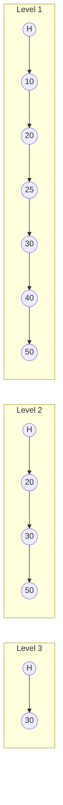

# Advanced linked lists

> When a singly linked list isn't enough — DLLs, circular lists, skip lists, and the random-pointer pattern.

<span class="phase-status phase-done">Phase 2 — Data Structures</span>

---

!!! abstract "What this chapter is"
    The [basics page](01-linked-list-basics.md) covered singly linked lists and the canonical reverse / merge / cycle-detect drills. This page is the **advanced bestiary**: the variants that show up specifically when an interviewer wants to test whether you've seen real production data structures.

    The two you must know cold:
    
    - **Doubly linked list with sentinels** — the engine inside `OrderedDict`, LRU caches, and most intrusive list implementations in C.
    - **Node-with-random-pointer** — one specific LeetCode problem that recurs in onsites because the three solutions span a beautiful complexity ladder.

    The other three (circular, skip, XOR) are "know-the-vocabulary" items. You won't implement a skip list in 45 minutes, but you should be able to explain why Redis chose it.

---

## Chapter map

<div class="grid cards" markdown>

-   :material-arrow-left-right:{ .lg .middle } &nbsp; **Doubly linked list**

    Sentinels, O(1) deletion given a node, the LRU cache pattern.

-   :material-refresh:{ .lg .middle } &nbsp; **Circular linked list**

    Round robin, Josephus, music players.

-   :material-stairs:{ .lg .middle } &nbsp; **Skip list**

    Probabilistic levels — Redis sorted sets, simpler than red-black trees.

-   :material-xml:{ .lg .middle } &nbsp; **XOR linked list**

    Memory-saving party trick. Almost never used in practice.

-   :material-shuffle-variant:{ .lg .middle } &nbsp; **Node with random pointer**

    The interview pattern with three escalating solutions.

-   :fontawesome-solid-microphone:{ .lg .middle } &nbsp; **Interview problems**

    LRU Cache, Insert into Sorted Circular, Copy Random List, Flatten Multilevel DLL.

</div>

---

## 1. Doubly linked list

Each node holds **`prev` and `next`** pointers. The headline benefit: given a node reference, you can delete it in O(1) without re-traversing.

### Why DLL beats SLL

<div class="grid cards" markdown>

-   :material-delete-clock:{ .lg .middle } &nbsp; **O(1) deletion**

    SLL needs the *predecessor*. DLL: `node.prev.next = node.next; node.next.prev = node.prev`. Done.

-   :material-arrow-left-right-bold:{ .lg .middle } &nbsp; **Bidirectional iteration**

    Iterate forwards or backwards from any node. Crucial for LRU eviction (move to head, evict from tail).

-   :material-link-variant:{ .lg .middle } &nbsp; **Splice in O(1)**

    Move a node from one position to another without copying — the LRU "promote on access" operation.

</div>

The cost: **2× pointer overhead** and the discipline to keep `prev`/`next` consistent on every mutation. Drop one update and the list silently corrupts.

### The sentinel pattern

A production DLL almost always uses **dummy head and tail sentinels** — empty nodes that are never returned to the user. They eliminate every "is this the first/last node?" branch.

```python linenums="1"
from __future__ import annotations
from typing import Generic, TypeVar

T = TypeVar("T")


class _DLLNode(Generic[T]):
    __slots__ = ("key", "val", "prev", "next")

    def __init__(self, key: T, val: T) -> None:
        self.key = key
        self.val = val
        self.prev: _DLLNode[T] | None = None
        self.next: _DLLNode[T] | None = None


class DoublyLinkedList(Generic[T]):
    """DLL with dummy head/tail sentinels — the LRU style."""

    def __init__(self) -> None:
        # Sentinels — head.next is the "real" first; tail.prev is the real last.
        self.head: _DLLNode[T] = _DLLNode(None, None)  # type: ignore[arg-type]
        self.tail: _DLLNode[T] = _DLLNode(None, None)  # type: ignore[arg-type]
        self.head.next = self.tail
        self.tail.prev = self.head
        self.size = 0

    def add_to_front(self, node: _DLLNode[T]) -> None:
        """Insert `node` directly after the head sentinel."""
        node.prev = self.head
        node.next = self.head.next
        self.head.next.prev = node  # type: ignore[union-attr]
        self.head.next = node
        self.size += 1

    def remove(self, node: _DLLNode[T]) -> None:
        """Unlink `node` in O(1) — caller holds the reference."""
        node.prev.next = node.next  # type: ignore[union-attr]
        node.next.prev = node.prev  # type: ignore[union-attr]
        self.size -= 1

    def move_to_front(self, node: _DLLNode[T]) -> None:
        self.remove(node)
        self.add_to_front(node)

    def pop_tail(self) -> _DLLNode[T] | None:
        """Remove and return the real last node, or None if empty."""
        if self.size == 0:
            return None
        last = self.tail.prev  # type: ignore[assignment]
        self.remove(last)  # type: ignore[arg-type]
        return last  # type: ignore[return-value]
```

!!! tip "Why sentinels are non-negotiable"
    Without them, every method needs branches like `if node is self.head:` or `if self.head is None:`. With them, every operation is **straight-line code** that runs on a non-empty list — because the list is never *truly* empty; it always has the two sentinels.

---

## 2. Circular linked list

The last node's `next` points back to the head (in a singly circular list) or to head and back (doubly circular). No `None` terminator.

**Use cases:**

- **Round-robin scheduling** — each thread points to the next, then the next, then wraps around.
- **Music player playlist on repeat** — `next` after the last song is the first song.
- **Josephus problem** — `n` people in a circle, every `k`-th is eliminated; classic recurrence question.
- **Buffer rings** — bounded queues where head and tail chase each other.

### Walking it (the gotcha)

```python linenums="1"
from __future__ import annotations

class CNode:
    def __init__(self, val: int) -> None:
        self.val = val
        self.next: CNode | None = None

def print_circular(head: CNode | None) -> None:
    if head is None:
        return
    cur = head
    while True:
        print(cur.val, end=" ")
        cur = cur.next  # type: ignore[assignment]
        if cur is head:
            break  # (1)!
```

1. Standard `while cur` infinite-loops. Always terminate by **identity check against the start node**, not by `None`.

---

## 3. Skip list

A **probabilistic** data structure that gives expected `O(log n)` search, insert, and delete — same as a balanced BST — but is dramatically simpler to implement and reason about. Each node lives at a randomly chosen "level"; higher levels are sparse express lanes.



### Sketch — search/insert/delete

??? question "Search"
    Start at the highest level of the head. Walk right while `next.val < target`; when you can't move right, drop down a level. Repeat until level 1, then check equality.

??? question "Insert"
    Pick a random level `L` (typically by flipping coins until tails — gives geometric distribution, `E[level] = 2`). Search to find predecessors at every level `≤ L`. Splice the new node into each. Expected `O(log n)`.

??? question "Delete"
    Same search; unsplice from every level the node lives in.

### Why Redis sorted sets use them

Redis's `ZSET` needs:
- O(log n) insert, delete, rank queries.
- Range scans (`ZRANGEBYSCORE`).

A skip list nails both — and the implementation is a few hundred lines of straightforward C, vs ~1000 lines for a red-black tree. The cited Redis source comment from antirez: "I find skip lists very simple to implement, debug and modify, and they perform very well."

!!! note "Don't implement in an interview"
    If asked about skip lists, sketch the structure, talk through the levels, mention Redis. **Don't try to write production-quality code in 45 min** — even Redis's implementation has subtleties (level capping, backwards pointers for `ZRANGE`).

---

## 4. XOR linked list (the curiosity)

A doubly linked list using **one pointer per node** instead of two. Each node stores `xor_ptr = prev_addr XOR next_addr`. Given the previous node's address while walking, `next_addr = prev_addr XOR node.xor_ptr`. Saves 50% of the pointer overhead.

**Why nobody uses it:**

- Defeats garbage collectors (they can't see the real pointers).
- Defeats debuggers and crash dumps.
- Modern memory is cheap; the 50% saving is irrelevant.
- Doesn't work in any language without raw pointer arithmetic.

Worth knowing exists. Mention it if asked "any other linked list variants?" Don't volunteer it.

---

## 5. Node with random pointer

Each node has `val`, `next`, **and** `random` — pointing to any node in the list (or `None`). Deep-copying it is the canonical interview problem.

```python linenums="1"
from __future__ import annotations

class RNode:
    def __init__(self, val: int, next: "RNode | None" = None, random: "RNode | None" = None) -> None:
        self.val = val
        self.next = next
        self.random = random
```

### Approach 1 — hashmap, O(n) space

Two passes. First pass: clone every node, store `original → clone` in a dict. Second pass: wire up `next` and `random` by looking each up.

```python linenums="1"
def copy_random_list_hashmap(head: RNode | None) -> RNode | None:
    if head is None:
        return None
    mapping: dict[RNode, RNode] = {}
    cur = head
    while cur:
        mapping[cur] = RNode(cur.val)
        cur = cur.next
    cur = head
    while cur:
        mapping[cur].next = mapping.get(cur.next) if cur.next else None
        mapping[cur].random = mapping.get(cur.random) if cur.random else None
        cur = cur.next
    return mapping[head]
```

### Approach 2 — interleaving, O(1) extra space

The clever one. Three passes, no hashmap:

1. **Weave** clones into the original list: `A → A' → B → B' → C → C'`.
2. **Wire random pointers**: `A'.random = A.random.next` (because `A.random.next` is the clone of whatever `A` pointed to).
3. **Unweave** the two lists.

```python linenums="1"
def copy_random_list_interleave(head: RNode | None) -> RNode | None:
    if head is None:
        return None

    # 1. Interleave clones
    cur = head
    while cur:
        clone = RNode(cur.val, next=cur.next)
        cur.next = clone
        cur = clone.next  # type: ignore[assignment]

    # 2. Wire randoms
    cur = head
    while cur:
        if cur.random:
            cur.next.random = cur.random.next  # type: ignore[union-attr]
        cur = cur.next.next  # type: ignore[union-attr,assignment]

    # 3. Unweave
    new_head = head.next
    cur = head
    while cur:
        clone = cur.next
        cur.next = clone.next  # type: ignore[union-attr]
        clone.next = clone.next.next if clone.next else None  # type: ignore[union-attr]
        cur = cur.next  # type: ignore[assignment]
    return new_head
```

### Approach 3 — recursion + memoization

```python linenums="1"
def copy_random_list_recursive(head: RNode | None) -> RNode | None:
    memo: dict[RNode, RNode] = {}

    def clone(node: RNode | None) -> RNode | None:
        if node is None:
            return None
        if node in memo:
            return memo[node]
        new = RNode(node.val)
        memo[node] = new  # (1)!
        new.next = clone(node.next)
        new.random = clone(node.random)
        return new

    return clone(head)
```

1. **Memoize before recursing**, otherwise `random` pointers create infinite recursion.

### Comparison

| Approach | Time | Space | Notes |
|----------|------|-------|-------|
| Hashmap | O(n) | O(n) | Cleanest; default if interviewer doesn't push. |
| Interleave | O(n) | O(1) | The "follow-up" answer. Big bonus points. |
| Recursive memo | O(n) | O(n) (memo + stack) | Elegant but recursion-depth risk on long lists. |

!!! tip "How to deliver this in an interview"
    Lead with the hashmap. Ship it, test it. Then say: **"There's an O(1) extra-space version using interleaving — want me to walk through it?"** This sequence is what staff-level interviewers grade.

---

## 6. Interview problems

### Problem 1 — LRU Cache (LC 146)

> Design a cache with `get(key)` and `put(key, value)`, both **O(1)**. Evict the least-recently-used key when capacity is exceeded.

??? question "Approach — hashmap + doubly linked list"
    The hashmap maps `key → DLL node` for O(1) lookup. The DLL maintains recency order: head = most recent, tail = least recent. Every `get` and successful `put` does `move_to_front`. Eviction = `pop_tail`.

??? question "Solution"
    ```python linenums="1"
    from __future__ import annotations

    class _Node:
        __slots__ = ("key", "val", "prev", "next")

        def __init__(self, key: int, val: int) -> None:
            self.key = key
            self.val = val
            self.prev: _Node | None = None
            self.next: _Node | None = None


    class LRUCache:
        def __init__(self, capacity: int) -> None:
            self.cap = capacity
            self.map: dict[int, _Node] = {}
            self.head = _Node(0, 0)  # sentinels
            self.tail = _Node(0, 0)
            self.head.next = self.tail
            self.tail.prev = self.head

        def _remove(self, node: _Node) -> None:
            node.prev.next = node.next  # type: ignore[union-attr]
            node.next.prev = node.prev  # type: ignore[union-attr]

        def _add_front(self, node: _Node) -> None:
            node.prev = self.head
            node.next = self.head.next
            self.head.next.prev = node  # type: ignore[union-attr]
            self.head.next = node

        def get(self, key: int) -> int:
            if key not in self.map:
                return -1
            node = self.map[key]
            self._remove(node)
            self._add_front(node)
            return node.val

        def put(self, key: int, value: int) -> None:
            if key in self.map:
                self._remove(self.map[key])
            node = _Node(key, value)
            self.map[key] = node
            self._add_front(node)
            if len(self.map) > self.cap:
                lru = self.tail.prev
                self._remove(lru)  # type: ignore[arg-type]
                del self.map[lru.key]  # type: ignore[union-attr]
    ```

    All ops O(1). The interview snare: **forgetting to delete the evicted key from the hashmap** — the DLL stays correct but the map leaks.

### Problem 2 — Insert into Sorted Circular Linked List (LC 708)

> Given a sorted circular list and a value, insert it preserving sorted order. Return any node in the list.

??? question "Approach — three cases"
    Walk one full loop with `prev` and `cur`. Insert when:

    1. `prev.val ≤ insert ≤ cur.val` — normal case.
    2. `prev.val > cur.val` (the wraparound point) AND (`insert ≥ prev.val` OR `insert ≤ cur.val`) — inserting at the boundary.
    3. We made a full lap (all values equal) — just splice in anywhere.

??? question "Solution"
    ```python linenums="1"
    from __future__ import annotations

    class CNode:
        def __init__(self, val: int, next: "CNode | None" = None) -> None:
            self.val = val
            self.next = next

    def insert_circular(head: CNode | None, value: int) -> CNode:
        new = CNode(value)
        if head is None:
            new.next = new
            return new
        prev, cur = head, head.next
        while True:
            if prev.val <= value <= cur.val:  # type: ignore[union-attr]
                break
            if prev.val > cur.val and (value >= prev.val or value <= cur.val):  # type: ignore[union-attr]
                break
            prev, cur = cur, cur.next  # type: ignore[union-attr,assignment]
            if prev is head:
                break  # full lap — uniform list
        prev.next = new
        new.next = cur
        return head
    ```

### Problem 3 — Copy List with Random Pointer (LC 138)

Covered in section 5 above with all three approaches.

### Problem 4 — Flatten a Multilevel Doubly Linked List (LC 430)

> A DLL where each node may also have a `child` pointer to another DLL. Flatten so the result is a single-level DLL using only `next`/`prev`.

??? question "Approach — DFS with stack"
    Walk forward. When you hit a node with a child, **push the next sibling onto a stack**, then descend into the child. When the child's chain ends, pop and reattach.

??? question "Solution"
    ```python linenums="1"
    from __future__ import annotations

    class MNode:
        def __init__(self, val: int) -> None:
            self.val = val
            self.prev: MNode | None = None
            self.next: MNode | None = None
            self.child: MNode | None = None

    def flatten(head: MNode | None) -> MNode | None:
        if head is None:
            return None
        stack: list[MNode] = []
        cur: MNode | None = head
        while cur:
            if cur.child:
                if cur.next:
                    stack.append(cur.next)  # remember to come back
                cur.next = cur.child
                cur.child.prev = cur
                cur.child = None
            if cur.next is None and stack:
                nxt = stack.pop()
                cur.next = nxt
                nxt.prev = cur
            cur = cur.next
        return head
    ```

    **Time** O(n), **Space** O(d) where d is max nesting depth.

---

## 7. Common gotchas

!!! warning "DLL invariants"
    On *every* mutation, **four pointers** must update: `node.prev`, `node.next`, `node.prev.next`, `node.next.prev`. Skip one and the list looks fine forward but breaks backward (or vice versa). Stress-test by walking forward from head, then backward from tail, and asserting the same node count.

!!! warning "Circular lists need identity termination"
    `while cur is not None` loops forever. Always `while cur is not start` after the first step.

!!! warning "Random-pointer recursion order"
    In the recursive copy, **memoize before recursing into `next` and `random`** — the random pointer can point back to a node mid-DFS, and without memo-first you infinite-loop.

---

## See also

- [Linked Lists — basics](01-linked-list-basics.md) — singly linked list, reverse, cycle detect.
- [Hash tables](../hash-tables/01-hash-table-basics.md) — the partner in LRU.
- [In-place linked list reversal pattern](../../04-patterns/06-in-place-linked-list-reversal.md).

---

## 🃏 Cheatsheet

| Variant | Killer feature | Use case |
|---------|---------------|----------|
| Singly linked | Minimal memory | Stacks, simple queues |
| Doubly linked | O(1) deletion + bidirectional | LRU, OrderedDict, deque |
| Circular | No null terminator | Round robin, ring buffers |
| Skip list | O(log n) probabilistic | Redis ZSET, simpler than RB tree |
| XOR linked | 1 ptr per node | Almost never — incompatible with GC |

| Operation | SLL | DLL |
|-----------|-----|-----|
| Insert at head / tail (with tail ptr) | O(1) | O(1) |
| Delete given a node | O(n) (need predecessor) | **O(1)** |
| Iterate backward | O(n) per step | **O(1)** per step |
| Memory per node | 1 ptr | 2 ptrs |

| Random-pointer copy | Time | Space |
|---------------------|------|-------|
| Hashmap | O(n) | O(n) |
| Interleave | O(n) | **O(1)** |
| Recursive memo | O(n) | O(n) |
