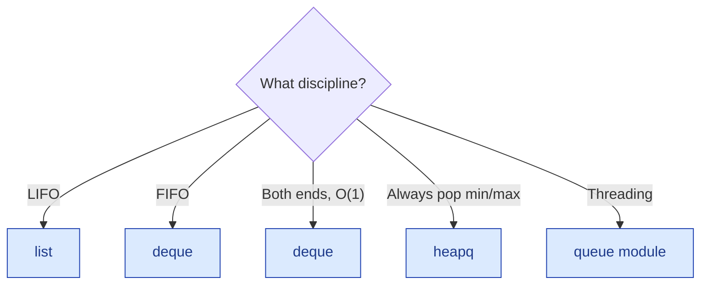

# Stacks & Queues — the basics

!!! abstract "What this chapter is"
    Two of the simplest data structures — but they unlock the **monotonic-stack** and **monotonic-deque** patterns that solve a huge class of "next greater element" / "histogram" / "sliding window max" problems. They're also the bones inside parsers, calculators, BFS, and undo systems.

    **Reading time:** 3 hours cover-to-cover; 30 minutes per problem.

    **Prereqs:** [Linked Lists](../linked-lists/01-linked-list-basics.md) (the underlying structure for some implementations) and [Hash Tables](../hash-tables/01-hash-table-basics.md) (used in many stack/queue design problems).

---

## Chapter map

<div class="grid cards" markdown>

-   :material-numeric-1-circle:{ .lg .middle } &nbsp; **What is a stack? A queue?**

    Plain English + analogies. The mental model.

-   :material-numeric-2-circle:{ .lg .middle } &nbsp; **Why we need them**

    Which problems collapse once you have LIFO or FIFO order.

-   :material-numeric-3-circle:{ .lg .middle } &nbsp; **How they work internally**

    Array-backed vs linked-list-backed. Deques. Circular buffers.

-   :material-numeric-4-circle:{ .lg .middle } &nbsp; **Python implementations from scratch**

    `Stack`, `Queue`, `CircularQueue`, `Deque` — all four.

-   :material-numeric-5-circle:{ .lg .middle } &nbsp; **Time & space complexity**

    Why a Python `list` is fine for a stack but bad for a queue.

-   :material-numeric-6-circle:{ .lg .middle } &nbsp; **Built-in Python tools**

    `list`, `collections.deque`, `queue.Queue`, `heapq`, `PriorityQueue`.

-   :material-numeric-7-circle:{ .lg .middle } &nbsp; **When to use vs not use**

    Stack vs queue vs deque vs heap.

-   :material-numeric-8-circle:{ .lg .middle } &nbsp; **Common mistakes & gotchas**

    The 10 pitfalls — including the slow-FIFO-with-list trap.

-   :material-numeric-9-circle:{ .lg .middle } &nbsp; **Patterns this connects to**

    Monotonic stack, monotonic deque, BFS, parsing, undo, recursion-to-iteration.

-   :material-numeric-10-circle:{ .lg .middle } &nbsp; **Practice problems (40)**

    Each in 5-layer progressive format with follow-ups.

-   :fontawesome-solid-microphone:{ .lg .middle } &nbsp; **How interviewers ask this**

    The phrasings, the monotonic-stack tell.

-   :material-clipboard-check:{ .lg .middle } &nbsp; **Self-check quiz**

    20 questions. If you can answer 18, you've mastered stacks and queues.

</div>

---

## 1. What is a stack? A queue?

> **Plain English (stack):** the *last* thing you put in is the *first* thing you take out. Like a stack of plates — you wash the top one, you put a clean one on top.

> **Plain English (queue):** the *first* thing you put in is the *first* thing you take out. Like a line at a coffee shop — first arrived, first served.

The two names are universal:

| Structure | Discipline | Push | Pop |
|---|---|---|---|
| Stack | LIFO (last in, first out) | top | top |
| Queue | FIFO (first in, first out) | back | front |
| Deque | Both ends usable | front or back | front or back |

Visual mental model:

```
     STACK                              QUEUE
   ┌──────┐                       ┌──┬──┬──┬──┬──┐
   │  3   │ ← push                │1 │2 │3 │4 │5 │
   ├──────┤                       └──┴──┴──┴──┴──┘
   │  2   │                       front          back
   ├──────┤                       (pop here)     (push here)
   │  1   │
   └──────┘
   bottom
```

In Python you rarely roll your own:

```python
stack: list[int] = []
stack.append(3)        # push — O(1) amortized
stack.pop()            # pop  — O(1)

from collections import deque
queue: deque[int] = deque()
queue.append(3)        # push to back — O(1)
queue.popleft()        # pop from front — O(1)
```

`list` is a stack. `deque` is a deque (double-ended queue). Use `deque` for anything FIFO — `list.pop(0)` is **O(n)** and ruins the algorithm.

!!! info "Vocabulary"
    - **Push / pop** — the two basic stack ops.
    - **Enqueue / dequeue** — the queue equivalents.
    - **Top / peek / front** — read without removing.
    - **Underflow / overflow** — pop from empty / push when full.
    - **Bounded queue** — fixed maximum size; pushing when full blocks or rejects.
    - **Priority queue** — pop the *smallest* (or largest), not the oldest. Implemented as a heap.

---

## 2. Why we need stacks and queues

The pure abstractions are simple. Their **patterns** are what carry weight in interviews.

### 2.1 Stacks ⇒ everything that needs "matching" or "undo"

- **Parentheses / brackets matching.**
- **Compiler / interpreter expression evaluation** (RPN).
- **Function-call stacks** — what every recursion is.
- **Undo / redo** in editors and browsers.
- **DFS** — explicit stack converts recursion into iteration.

### 2.2 Queues ⇒ everything FIFO

- **BFS** — the queue holds the next layer to explore.
- **Task scheduling** — work is processed in arrival order.
- **Stream buffering** — incoming data waiting to be consumed.
- **Print / job queues.**
- **Producer-consumer pipelines.**

### 2.3 Monotonic stacks ⇒ "next greater" / "next smaller" in O(n)

If you ever need "for each element, find the next bigger one to the right," **a monotonic stack solves it in O(n)** — the brute force is O(n²). Same template handles:

- Daily Temperatures (Problem 11).
- Next Greater Element I/II (Problem 6, 12).
- Largest Rectangle in Histogram (Problem 26).
- Trapping Rain Water (Problem 29).
- Stock Span (Problem 17).

### 2.4 Monotonic deques ⇒ "max of every length-k window" in O(n)

A deque maintaining the indices of useful candidates is the trick behind:

- Sliding Window Maximum (Problem 18).
- Constrained sequence problems where one end is "expanding" and the other "shrinking."

### 2.5 Stacks and queues are subsystems of bigger structures

They're inside **graphs (BFS uses a queue, DFS uses a stack)**, **trees (level-order traversal), **state machines** (transition queue), **HTTP servers** (request queue), and **OS schedulers** (run queue).

If you know stacks and queues cold, dozens of follow-on topics get easier.

---

## 3. How they work internally

### 3.1 Array-backed stack

Easiest to reason about. The bottom of the stack is at index 0; the top is at the end. Push appends; pop removes the last item.

```
indices:  [0, 1, 2, 3]
values:   [a, b, c, d]
                     ↑ top
```

Both push and pop are at the end of the array → **O(1) amortized** (the doubling trick from arrays). That's why `list` is a perfect stack in Python.

### 3.2 Array-backed queue — the slow trap

If you tried to use `list` as a FIFO:

```python
q = [1, 2, 3, 4]
q.pop(0)             # ❌ O(n) — every other element shifts left by one
```

For an algorithm that does n queue ops, that's O(n²) total. **Don't use `list` for queues.**

### 3.3 Linked-list-backed queue

Two pointers — `head` and `tail`. Enqueue adds at tail; dequeue removes at head. **O(1) per op.** This is the textbook FIFO.

```
   head ──▶ a ──▶ b ──▶ c ──▶ d ◀── tail
   (dequeue)                     (enqueue)
```

### 3.4 Circular array (ring buffer)

A fixed-size array with two pointers (`head`, `tail`) and a wraparound. When `tail == head` the buffer is either empty or full — distinguish with a `size` counter.

```
   capacity = 6
   ┌─┬─┬─┬─┬─┬─┐
   │ │ │c│d│e│ │
   └─┴─┴─┴─┴─┴─┘
        ↑       ↑
       head    tail
   size = 3
```

Used in:

- **`collections.deque`'s blocks.**
- **OS kernel buffers.**
- **Network sockets** (kernel-side ring).
- **Lock-free single-producer-single-consumer queues** (Disruptor pattern).

### 3.5 Python's `collections.deque` — block-doubly-linked

`deque` is implemented as a **doubly-linked list of fixed-size blocks** (each block is typically a 64-element array). This gives:

- O(1) append/pop on both ends.
- O(n) random access by index — yes, even though it acts sequence-like.
- Cache-friendlier than a per-element doubly-linked list.

For 99% of interview problems, "use `deque`" is the right answer.

### 3.6 Priority queue — secretly a heap

`queue.PriorityQueue` and `heapq` are **binary heaps** stored as flat arrays. Push and pop are **O(log n)**. We cover heaps in their own chapter — but recognize that "priority queue" ≠ regular queue.

---

## 4. Python implementations from scratch

### 4.1 `Stack` — list-backed

```python
from __future__ import annotations
from typing import Generic, TypeVar

T = TypeVar("T")


class Stack(Generic[T]):
    """A simple LIFO stack."""

    __slots__ = ("_data",)

    def __init__(self) -> None:
        self._data: list[T] = []

    def __len__(self) -> int:
        return len(self._data)

    def is_empty(self) -> bool:
        return not self._data

    def push(self, item: T) -> None:
        self._data.append(item)

    def pop(self) -> T:
        if not self._data:
            raise IndexError("pop from empty stack")
        return self._data.pop()

    def peek(self) -> T:
        if not self._data:
            raise IndexError("peek from empty stack")
        return self._data[-1]
```

### 4.2 `Queue` — deque-backed (the right way)

```python
from collections import deque


class Queue(Generic[T]):
    """A simple FIFO queue."""

    __slots__ = ("_data",)

    def __init__(self) -> None:
        self._data: deque[T] = deque()

    def __len__(self) -> int:
        return len(self._data)

    def is_empty(self) -> bool:
        return not self._data

    def enqueue(self, item: T) -> None:
        self._data.append(item)

    def dequeue(self) -> T:
        if not self._data:
            raise IndexError("dequeue from empty queue")
        return self._data.popleft()

    def peek(self) -> T:
        if not self._data:
            raise IndexError("peek from empty queue")
        return self._data[0]
```

### 4.3 `Queue` from a singly linked list (interview-grade)

```python
class _QNode(Generic[T]):
    __slots__ = ("val", "next")
    def __init__(self, val: T) -> None:
        self.val = val
        self.next: "_QNode[T] | None" = None


class LinkedQueue(Generic[T]):
    __slots__ = ("_head", "_tail", "_size")

    def __init__(self) -> None:
        self._head: _QNode[T] | None = None
        self._tail: _QNode[T] | None = None
        self._size: int = 0

    def __len__(self) -> int:
        return self._size

    def enqueue(self, item: T) -> None:
        node = _QNode(item)
        if self._tail is None:
            self._head = self._tail = node
        else:
            self._tail.next = node
            self._tail = node
        self._size += 1

    def dequeue(self) -> T:
        if self._head is None:
            raise IndexError("dequeue from empty queue")
        v = self._head.val
        self._head = self._head.next
        if self._head is None:
            self._tail = None
        self._size -= 1
        return v
```

When the interviewer asks "implement a queue without using deque," this is the answer.

### 4.4 `CircularQueue` — fixed-size ring buffer

```python
class CircularQueue(Generic[T]):
    """Fixed-capacity queue using a ring buffer."""

    __slots__ = ("_data", "_head", "_tail", "_size", "_cap")

    def __init__(self, capacity: int) -> None:
        if capacity <= 0:
            raise ValueError("capacity must be positive")
        self._data: list[T | None] = [None] * capacity
        self._cap = capacity
        self._head = 0
        self._tail = 0
        self._size = 0

    def __len__(self) -> int:
        return self._size

    def is_full(self) -> bool:
        return self._size == self._cap

    def is_empty(self) -> bool:
        return self._size == 0

    def enqueue(self, item: T) -> bool:
        if self.is_full():
            return False
        self._data[self._tail] = item
        self._tail = (self._tail + 1) % self._cap
        self._size += 1
        return True

    def dequeue(self) -> T:
        if self.is_empty():
            raise IndexError("dequeue from empty queue")
        v = self._data[self._head]
        self._data[self._head] = None
        self._head = (self._head + 1) % self._cap
        self._size -= 1
        return v  # type: ignore[return-value]
```

This is the design behind LeetCode 622 (Problem 23 below).

### 4.5 `MinStack` — O(1) min lookup

A stack that also returns its minimum in O(1):

```python
class MinStack:
    __slots__ = ("_data", "_mins")

    def __init__(self) -> None:
        self._data: list[int] = []
        self._mins: list[int] = []     # parallel stack of running minima

    def push(self, x: int) -> None:
        self._data.append(x)
        if not self._mins or x <= self._mins[-1]:
            self._mins.append(x)

    def pop(self) -> None:
        x = self._data.pop()
        if x == self._mins[-1]:
            self._mins.pop()

    def top(self) -> int:
        return self._data[-1]

    def get_min(self) -> int:
        return self._mins[-1]
```

The "auxiliary stack of minima" is a beautiful technique; we cover the variant in Problem 4.

---

## 5. Time & space complexity

### Stack (list-backed)

| Operation | Code | Time |
|---|---|---|
| Push | `s.append(x)` | **O(1) amortized** |
| Pop | `s.pop()` | **O(1)** |
| Peek | `s[-1]` | **O(1)** |
| Length | `len(s)` | **O(1)** |
| Membership | `x in s` | **O(n)** |

### Queue — `deque`-backed

| Operation | Code | Time |
|---|---|---|
| Enqueue (back) | `q.append(x)` | **O(1)** |
| Dequeue (front) | `q.popleft()` | **O(1)** |
| Push front | `q.appendleft(x)` | **O(1)** |
| Pop back | `q.pop()` | **O(1)** |
| `q[i]` | random access | **O(n)** |
| `len(q)` | | **O(1)** |
| Rotate by k | `q.rotate(k)` | **O(\|k\|)** |

### Queue — `list`-backed (DON'T)

| Operation | Code | Time |
|---|---|---|
| Enqueue (back) | `lst.append(x)` | O(1) |
| Dequeue (front) | `lst.pop(0)` | **O(n)** ❌ |

A single algorithm that does n list-as-queue operations is silently O(n²). One of the most common interview-failing bugs.

### Priority queue (heap)

| Operation | Code | Time |
|---|---|---|
| Push | `heappush(h, x)` | **O(log n)** |
| Pop min | `heappop(h)` | **O(log n)** |
| Peek min | `h[0]` | **O(1)** |
| Build from list | `heapify(lst)` | **O(n)** |

---

## 6. Built-in Python tools

### 6.1 `list` — your stack

```python
s = []
s.append(1); s.append(2); s.append(3)
s[-1]      # 3 — peek
s.pop()    # 3 — pop returns the popped value
s          # [1, 2]
```

That's it. No reason to import anything for stacks.

### 6.2 `collections.deque` — your queue (and your deque)

```python
from collections import deque

q = deque()
q.append(1); q.append(2); q.append(3)    # [1, 2, 3]
q.popleft()                              # 1
q.appendleft(0)                          # [0, 2, 3]
q.pop()                                  # 3
q[0], q[-1]                              # peek front, back

q.rotate(2)        # rotate right
q.rotate(-1)       # rotate left
q.maxlen           # None (unbounded)

bounded = deque(maxlen=3)
bounded.extend([1, 2, 3, 4])
bounded            # deque([2, 3, 4]) — auto-evicted oldest
```

### 6.3 `heapq` — your priority queue

```python
import heapq

h = [5, 1, 4, 2, 3]
heapq.heapify(h)              # in-place, O(n)
heapq.heappop(h)              # 1
heapq.heappush(h, 0)
heapq.nsmallest(3, h)         # 3 smallest
heapq.nlargest(3, h)          # 3 largest
```

For a max-heap, push negated values: `heapq.heappush(h, -x)` and negate on pop.

### 6.4 `queue.Queue` — thread-safe, mostly used in concurrent code

```python
from queue import Queue, LifoQueue, PriorityQueue

q = Queue()                # FIFO, thread-safe
q.put(1); q.put(2)
q.get()                    # 1; blocks if empty (with timeout option)
q.task_done()              # signal completion to q.join()

q = LifoQueue()            # stack
q = PriorityQueue()        # heap
```

Slow compared to `deque` (synchronization overhead). Reach for it only when you're doing actual threading.

### 6.5 The four "use this" rules

1. **Need a stack?** → `list`.
2. **Need a queue?** → `collections.deque`.
3. **Need both ends?** → `collections.deque`.
4. **Need priority order?** → `heapq`.

Anything else (e.g., `queue.Queue`) is for niche use.

---

## 7. When to use vs not use

### Use a stack when…

- ✅ You're matching brackets, parentheses, tags.
- ✅ You're parsing an expression (RPN, calculator).
- ✅ You're converting recursion to iteration.
- ✅ You need "last-set, first-undone" (undo stack).
- ✅ You need a monotonic structure for "next greater / smaller."

### Use a queue when…

- ✅ You're doing BFS.
- ✅ You're scheduling tasks in arrival order.
- ✅ You need a FIFO buffer.

### Use a deque when…

- ✅ You're maintaining a sliding-window monotonic structure.
- ✅ You need O(1) operations on both ends.
- ✅ You want a bounded recent-history buffer (`maxlen`).

### Use a priority queue when…

- ✅ You always pop the smallest / largest.
- ✅ You're doing Dijkstra, Prim, A*.
- ✅ You need "top-k while data streams in."

### Decision tree



---

## 8. Common mistakes & gotchas

The 10 traps that fail interviews.

!!! warning "Trap 1 — Using `list.pop(0)` for FIFO"
    `list.pop(0)` is **O(n)**. n queue ops = O(n²). **Use `deque.popleft()`** which is O(1).

!!! warning "Trap 2 — Forgetting `is_empty` check before `pop`"
    `[].pop()` raises `IndexError`. Always check or wrap in try.

!!! warning "Trap 3 — Confusing `peek` with `pop`"
    `peek` doesn't remove; `pop` does. Easy slip.

!!! warning "Trap 4 — Using a regular queue when you needed a priority queue"
    "Find the next ready job" is FIFO if jobs are equal-priority, but priority queue if not.

!!! warning "Trap 5 — Initializing a min-heap and pushing tuples in the wrong order"
    `heapq` compares from the leftmost element. For "smallest distance, then alphabetical," push `(dist, name)`. Reversing the order gives the wrong heap.

!!! warning "Trap 6 — Mutable items in a heap that don't compare"
    `heapq.heappush(h, (priority, my_obj))` — if priorities tie, Python will try to compare `my_obj` instances. If they don't define `__lt__`, you get `TypeError`. **Add a tiebreaker** (e.g., a counter): `(priority, counter, my_obj)`.

!!! warning "Trap 7 — Iterating a `deque` while modifying it"
    Same trap as `dict`. Take a snapshot first.

!!! warning "Trap 8 — Reversing a stack incorrectly"
    `s[::-1]` returns a new reversed *list*, not a stack instance. Convert back if needed.

!!! warning "Trap 9 — Using a stack where you needed a queue (or vice-versa)"
    BFS with a stack does DFS. DFS with a queue does BFS. They produce different results.

!!! warning "Trap 10 — Forgetting that `heapq` is min-heap only"
    No max-heap parameter. Use `heappush(h, -x)` or `heapq._heapify_max` (private API; avoid).

---

## 9. Patterns this connects to

| Pattern | When you see it | Example |
|---|---|---|
| **Bracket matching** | Match nested delimiters | Valid Parens (#1), Calculator (#28) |
| **Monotonic stack** | "Next greater / smaller element" | Daily Temperatures (#11), Histogram (#26) |
| **Monotonic deque** | "Max of every k-window" | Sliding Window Max (#18) |
| **DFS via stack** | Iterative DFS | Tree iteration (covered in trees chapter) |
| **BFS via queue** | Level-order, shortest path on unweighted graph | (Trees / graphs chapters) |
| **Two stacks make a queue** | Amortize | Implement Queue using Stacks (#2) |
| **Two queues make a stack** | The dual | Implement Stack using Queues (#3) |
| **Lazy-deletion heap** | Skip expired/cancelled top of heap | Event simulators |
| **Aux stack of minima** | O(1) min of a stack | Min Stack (#4) |
| **Stack as parser state** | Compilers, calculators | RPN (#15), Decode String (#14) |

---

## 10. Practice problems (40)

Same v3 5-layer format. Buckets:

- **Easy 1–10**: warm-ups; almost all interviews include one.
- **Medium 11–25**: monotonic stack / deque + design problems.
- **Hard 26–30**: histogram, calculator, trapping rain.
- **Product 31–35**: design-flavor questions.
- **Service / PSU 36–40**: TCS / Infosys / Wipro / HCL / ISRO basics.

---

### Problem 1 — Valid Parentheses

<span class="diff-easy">Easy</span> &nbsp; <span class="company-tag">Google</span> <span class="company-tag">Amazon</span> <span class="company-tag">Meta</span> <span class="company-tag">Microsoft</span> <span class="company-tag">Apple</span> <span class="company-tag">TCS</span>

> Given a string `s` containing `()`, `[]`, `{}`, return `True` iff every opening bracket is closed by the matching type in the correct order.

#### 📖 Story Mode

`"()"` → True. `"()[]{}"` → True. `"(]"` → False. `"([)]"` → False (wrong nesting). `"{[]}"` → True.

#### 🌍 Real-World Usage

- **Compilers / linters** — basic syntax check.
- **JSON / XML parsers.**
- **Code editors** — bracket pair highlighting.
- **Math expression validation.**

#### 🧠 Thinking Process

Walk left to right. Push every opening bracket on a stack. On a closing bracket, pop the stack — if it doesn't match, fail. At the end, the stack must be empty.

#### 🐍 5 Layers of Solution

=== "Layer 2 — Stack"

    ```python
    def is_valid(s):
        match = {")": "(", "]": "[", "}": "{"}
        stack = []
        for c in s:
            if c in "([{":
                stack.append(c)
            else:
                if not stack or stack.pop() != match[c]:
                    return False
        return not stack
    ```

    O(n) time, O(n) space.

=== "Layer 3 — Edge-case-hardened"

    Same; explicit check `if c not in "([{)]}":` would skip non-bracket characters if the spec allows them.

=== "Layer 4 — Production-ready"

    ```python
    from __future__ import annotations


    _PAIRS = {")": "(", "]": "[", "}": "{"}


    def is_valid_parentheses(s: str) -> bool:
        """Return True iff brackets in s are correctly matched and nested.

        Time:  O(n).
        Space: O(n) — stack of unmatched openers.

        Example:
            >>> is_valid_parentheses("()[]{}")
            True
            >>> is_valid_parentheses("([)]")
            False
        """
        stack: list[str] = []
        for c in s:
            if c in "([{":
                stack.append(c)
            elif c in _PAIRS:
                if not stack or stack.pop() != _PAIRS[c]:
                    return False
            # Otherwise: ignore non-bracket characters (clarify with interviewer).
        return not stack
    ```

=== "Layer 5 — Variants"

    **Variant A — minimum operations to balance.** Count unmatched closers and openers; sum.

    **Variant B — generate all valid bracket sequences of n pairs.** See [Strings — Problem 24](../strings/01-string-basics.md#problem-24-generate-parentheses).

    **Variant C — longest valid parens substring.** See [Strings — Problem 30](../strings/01-string-basics.md#problem-30-longest-valid-parentheses).

    **Variant D — n bracket types instead of 3.** Same algorithm; bigger pair table.

#### 🔍 Dry Run

`s = "([)]"`:

| c | stack before | action | stack after | result |
|---|--------------|--------|-------------|--------|
| ( | [] | push | [(] | continue |
| [ | [(] | push | [(, [] | continue |
| ) | [(, [] | pop top is `[`, expected `(` → mismatch | — | **False** |

#### ⏱️ Complexity

O(n) time, O(n) space.

#### 🎯 Pattern Used

**Bracket matching with a stack.** The hello-world of stack problems.

#### 🐛 Common Bugs

1. **Popping when stack is empty** → must check.
2. **Forgetting the final emptiness check** → `"((("` falsely returns True.
3. **Mixing up the pair direction** in the dict.

#### ✅ Edge Cases Checklist

- [ ] Empty string → True
- [ ] Only openers → False
- [ ] Only closers → False
- [ ] Mismatched pairs
- [ ] Nested correctly

#### 🏢 Sample Interviewer Quote

> *"Tell me whether this string of brackets is valid."*

Your opener: *"Stack of openers. Walk the string. Each closer must match the top of the stack. Empty at the end means valid. O(n) time and space."*

---

### Problem 2 — Implement Queue using Stacks

<span class="diff-easy">Easy</span> &nbsp; <span class="company-tag">Microsoft</span> <span class="company-tag">Amazon</span> <span class="company-tag">Bloomberg</span>

> Implement a FIFO queue using only stack operations. (LeetCode 232.)

#### 🧠 Thinking Process

Two stacks: `in_stack` for pushes, `out_stack` for pops. When `out_stack` is empty, pour everything from `in_stack` into it, reversing the order. Each element is moved at most twice → **amortized O(1) per op.**

#### 🐍 Solution

```python
class MyQueue:
    def __init__(self) -> None:
        self._in: list[int] = []
        self._out: list[int] = []

    def push(self, x: int) -> None:
        self._in.append(x)

    def pop(self) -> int:
        self._move()
        return self._out.pop()

    def peek(self) -> int:
        self._move()
        return self._out[-1]

    def empty(self) -> bool:
        return not self._in and not self._out

    def _move(self) -> None:
        if not self._out:
            while self._in:
                self._out.append(self._in.pop())
```

#### ⏱️ Complexity

- `push`: **O(1)**.
- `pop`, `peek`: **O(1) amortized**, O(n) worst case.

#### 🎯 Pattern Used

**Two stacks → queue.** A classic amortization trick.

#### 🐛 Common Bugs

1. **Always moving on every pop** — defeats the amortization. Only move when out_stack is empty.

#### 🏢 Sample Interviewer Quote

> *"Implement a queue using only stacks."*

Your opener: *"Two stacks — `in` for pushes, `out` for pops. When `out` is empty, pour everything from `in`, reversing order. Each element moves at most twice — amortized O(1)."*

---

### Problem 3 — Implement Stack using Queues

<span class="diff-easy">Easy</span> &nbsp; <span class="company-tag">Microsoft</span> <span class="company-tag">Amazon</span>

> Implement a LIFO stack using only queue operations. (LeetCode 225.)

#### 🐍 Solution — single-queue trick

On push, enqueue and then rotate the queue so the new element is at the front:

```python
from collections import deque

class MyStack:
    def __init__(self) -> None:
        self._q: deque[int] = deque()

    def push(self, x: int) -> None:
        self._q.append(x)
        for _ in range(len(self._q) - 1):
            self._q.append(self._q.popleft())

    def pop(self) -> int:
        return self._q.popleft()

    def top(self) -> int:
        return self._q[0]

    def empty(self) -> bool:
        return not self._q
```

`push` is **O(n)**; pop/top/empty are O(1).

The dual structure — two queues, push expensive — is also acceptable.

---

### Problem 4 — Min Stack

<span class="diff-easy">Easy</span> &nbsp; <span class="company-tag">Amazon</span> <span class="company-tag">Google</span> <span class="company-tag">Meta</span> <span class="company-tag">Microsoft</span> <span class="company-tag">Bloomberg</span>

> Design a stack that supports `push`, `pop`, `top`, and `getMin` in **O(1)**.

(See §4.5 above for the production-ready impl.)

#### 🎯 Pattern Used

**Auxiliary stack of running minima.** Each push compares to the current min; the parallel `_mins` stack tracks the running minimum at each level. On pop, if the popped value equals current min, pop the min too.

#### 🔄 Interviewer Follow-ups

??? question "Follow-up 1 — Without an auxiliary stack."
    Encode the difference `x - min` in the data stack; when `x < min`, push the encoded difference and update min. Recover `x` and old min during pop. **O(1) extra space.** Trickier; common follow-up.

??? question "Follow-up 2 — Min-Max stack."
    Two auxiliary stacks: one for mins, one for maxes.

??? question "Follow-up 3 — Median Stack (O(1))."
    Different problem. Two heaps; not just stacks.

#### 🐛 Common Bugs

1. **Pushing to `_mins` only when strictly less** — fails on duplicates of the min. Use `<=`.
2. **Comparing on pop without checking** — pops the min stack incorrectly.

---

### Problem 5 — Backspace String Compare

<span class="diff-easy">Easy</span> &nbsp; <span class="company-tag">Google</span> <span class="company-tag">Amazon</span> <span class="company-tag">Microsoft</span>

> Two strings; `'#'` means a backspace character. Are the resulting strings equal?

#### 📖 Story Mode

`s = "ab#c"`, `t = "ad#c"` → both become `"ac"` → True.
`s = "a##c"`, `t = "#a#c"` → both become `"c"` → True.

#### 🐍 Solution — stack

```python
def backspace_compare(s, t):
    def build(string):
        stack = []
        for c in string:
            if c == '#':
                if stack: stack.pop()
            else:
                stack.append(c)
        return stack
    return build(s) == build(t)
```

O(n + m) time, O(n + m) space.

#### 🔄 Interviewer Follow-ups

??? question "Follow-up — O(1) space."
    Two pointers from the right; skip backspaces on each side; compare characters as they "land." Tricky; common follow-up.

---

### Problem 6 — Next Greater Element I

<span class="diff-easy">Easy</span> &nbsp; <span class="company-tag">Amazon</span> <span class="company-tag">Bloomberg</span>

> Given two arrays `nums1` and `nums2` (with `nums1` a subset of `nums2`), for each element of `nums1` find the next greater element in `nums2` (or -1).

#### 📖 Story Mode

`nums1 = [4, 1, 2]`, `nums2 = [1, 3, 4, 2]` → `[-1, 3, -1]`.

#### 🧠 Thinking Process — monotonic stack

Process `nums2` left to right, maintaining a **decreasing stack of values waiting for their next greater**. When the current value is greater than the stack top, pop and record `current` as the next-greater for the popped value. Use a hash map `value → next greater`.

#### 🐍 Solution

```python
def next_greater_element_i(nums1, nums2):
    nge: dict[int, int] = {}
    stack: list[int] = []
    for x in nums2:
        while stack and stack[-1] < x:
            nge[stack.pop()] = x
        stack.append(x)
    for v in stack:
        nge[v] = -1
    return [nge[v] for v in nums1]
```

O(n + m) time, O(n) space.

#### 🎯 Pattern Used

**Monotonic decreasing stack** — the canonical pattern for "next greater" problems.

---

### Problem 7 — Remove Outermost Parentheses

<span class="diff-easy">Easy</span> &nbsp; <span class="company-tag">Microsoft</span>

> Decompose `s` into primitive concatenations of valid parentheses. Remove the outermost layer of each. (LeetCode 1021.)

#### 🐍 Solution — depth counter (no actual stack needed)

```python
def remove_outer_parens(s):
    out = []
    depth = 0
    for c in s:
        if c == '(':
            if depth > 0: out.append(c)
            depth += 1
        else:
            depth -= 1
            if depth > 0: out.append(c)
    return "".join(out)
```

O(n) time, O(n) space.

A counter is enough; we don't need a literal stack here. Mention this trade-off when an interviewer asks "why not a stack?"

---

### Problem 8 — Build an Array With Stack Operations

<span class="diff-easy">Easy</span> &nbsp; <span class="company-tag">Microsoft</span>

> Given a target sequence and `n`, generate the list of `"Push"` and `"Pop"` operations to produce the target. (LeetCode 1441.)

#### 🐍 Solution

```python
def build_array(target, n):
    out = []
    j = 0
    for i in range(1, n + 1):
        if j == len(target): break
        out.append("Push")
        if target[j] == i:
            j += 1
        else:
            out.append("Pop")
    return out
```

O(n) time. Walk i = 1..n; push each, but pop immediately if i isn't the next target.

---

### Problem 9 — Final Prices With Special Discount

<span class="diff-easy">Easy</span> &nbsp; <span class="company-tag">Bloomberg</span>

> For each item `prices[i]`, find the **next** item to the right with `prices[j] <= prices[i]` and subtract its price. (LeetCode 1475.)

#### 🐍 Solution — monotonic stack

```python
def final_prices(prices):
    out = list(prices)
    stack: list[int] = []          # indices of items waiting
    for i, p in enumerate(prices):
        while stack and prices[stack[-1]] >= p:
            j = stack.pop()
            out[j] -= p
        stack.append(i)
    return out
```

O(n) time. **Same template as Daily Temperatures (Problem 11).**

---

### Problem 10 — Make The String Great

<span class="diff-easy">Easy</span> &nbsp; <span class="company-tag">Google</span>

> Repeatedly remove adjacent pairs `xX` (one lower, one upper of the same letter). Return the final string. (LeetCode 1544.)

#### 🐍 Solution — stack

```python
def make_good(s):
    stack: list[str] = []
    for c in s:
        if stack and stack[-1] != c and stack[-1].lower() == c.lower():
            stack.pop()
        else:
            stack.append(c)
    return "".join(stack)
```

O(n) time, O(n) space. **Same template as `Remove Adjacent Duplicates`.**

---

### Problem 11 — Daily Temperatures

<span class="diff-medium">Medium</span> &nbsp; <span class="company-tag">Google</span> <span class="company-tag">Amazon</span> <span class="company-tag">Meta</span> <span class="company-tag">Microsoft</span> <span class="company-tag">Bloomberg</span>

> Given an array `temperatures`, return an array `answer` such that `answer[i]` is the number of days you have to wait after day `i` to get a warmer temperature. If there is no future day, put 0.

#### 📖 Story Mode

`temperatures = [73, 74, 75, 71, 69, 72, 76, 73]` → `[1, 1, 4, 2, 1, 1, 0, 0]`.

#### 🌍 Real-World Usage

- **Stock-price analysis** — "how many days until the next higher price?"
- **Weather analytics.**
- **Operations research** — waiting-time analyses.

#### 🧠 Thinking Process

Brute force is O(n²). The trick: **monotonic decreasing stack of indices**. As we walk right, when the current temperature is greater than the temperature at `stack[-1]`, that day's "answer" is `i - stack[-1]`. Pop and record.

#### 🐍 5 Layers of Solution

=== "Layer 2 — Monotonic stack"

    ```python
    def daily_temperatures(temps):
        n = len(temps)
        out = [0] * n
        stack: list[int] = []                     # indices of days waiting
        for i, t in enumerate(temps):
            while stack and temps[stack[-1]] < t:
                j = stack.pop()
                out[j] = i - j
            stack.append(i)
        return out
    ```

    O(n) time, O(n) space.

=== "Layer 4 — Production-ready"

    ```python
    from __future__ import annotations


    def daily_temperatures(temperatures: list[int]) -> list[int]:
        """For each day, days to wait for a warmer temperature; 0 if none.

        Time:  O(n) — each index pushed and popped at most once.
        Space: O(n).

        Example:
            >>> daily_temperatures([73, 74, 75, 71, 69, 72, 76, 73])
            [1, 1, 4, 2, 1, 1, 0, 0]
        """
        n = len(temperatures)
        out = [0] * n
        stack: list[int] = []
        for i, t in enumerate(temperatures):
            while stack and temperatures[stack[-1]] < t:
                j = stack.pop()
                out[j] = i - j
            stack.append(i)
        return out
    ```

=== "Layer 5 — Variants"

    **Variant A — next greater element to the LEFT.** Walk right-to-left.

    **Variant B — next *equal-or-greater*.** `<=` instead of `<`.

    **Variant C — next *strictly smaller*.** Flip the comparison.

#### 🔍 Dry Run

`temps = [73, 74, 75, 71, 69, 72, 76, 73]`:

| i | t | stack before | pops | stack after |
|---|---|--------------|------|-------------|
| 0 | 73 | [] | — | [0] |
| 1 | 74 | [0] | pop 0, out[0]=1 | [1] |
| 2 | 75 | [1] | pop 1, out[1]=1 | [2] |
| 3 | 71 | [2] | — | [2, 3] |
| 4 | 69 | [2, 3] | — | [2, 3, 4] |
| 5 | 72 | [2, 3, 4] | pop 4 (out[4]=1), pop 3 (out[3]=2) | [2, 5] |
| 6 | 76 | [2, 5] | pop 5 (out[5]=1), pop 2 (out[2]=4) | [6] |
| 7 | 73 | [6] | — | [6, 7] |

End: out = `[1, 1, 4, 2, 1, 1, 0, 0]`. ✅

#### ⏱️ Complexity

- **Time: O(n)** — each index pushed and popped at most once.
- **Space: O(n)**.

#### 🎯 Pattern Used

**Monotonic decreasing stack of indices.** The single most-asked stack pattern.

#### 🐛 Common Bugs

1. **Storing values, not indices** — can't compute the day-difference.
2. **Wrong comparison direction** for "next greater" vs "next greater or equal."
3. **Brute-force in nested loop** — O(n²) and times out.

#### 🏢 Sample Interviewer Quote

> *"For each day, find the number of days until a warmer temperature."*

Your opener: *"Monotonic decreasing stack of indices. As I walk, current temperature pops indices with smaller temperatures and writes their answer as `i - j`. O(n) time, O(n) space."*

---

### Problem 12 — Next Greater Element II (circular)

<span class="diff-medium">Medium</span> &nbsp; <span class="company-tag">Amazon</span> <span class="company-tag">Bloomberg</span>

> Given a **circular** integer array, find the next greater number for each element. The next greater of an element `x` is the first greater number to its traversal-order right, considering the circular nature. (LeetCode 503.)

#### 📖 Story Mode

`[1, 2, 1]` → `[2, -1, 2]` (the third 1 wraps around to find 2).

#### 🐍 Solution

Walk **twice** through the array (or use modulo on indices `2n`):

```python
def next_greater_elements(nums):
    n = len(nums)
    out = [-1] * n
    stack: list[int] = []
    for i in range(2 * n):
        x = nums[i % n]
        while stack and nums[stack[-1]] < x:
            out[stack.pop()] = x
        if i < n:
            stack.append(i)
    return out
```

O(n) time, O(n) space.

The "double-walk" trick handles circularity for free.

---

### Problem 13 — Asteroid Collision

<span class="diff-medium">Medium</span> &nbsp; <span class="company-tag">Amazon</span> <span class="company-tag">Microsoft</span> <span class="company-tag">Bloomberg</span>

> Each integer represents an asteroid moving right (positive) or left (negative). When asteroids collide, the smaller one explodes; equal sizes both explode. Return the surviving asteroids. (LeetCode 735.)

#### 📖 Story Mode

`[5, 10, -5]` → `[5, 10]` (-5 collides with 10, -5 explodes).
`[8, -8]` → `[]`.
`[10, 2, -5]` → `[10]`.

#### 🧠 Thinking Process

Stack of survivors. For each new asteroid, while the top of the stack is moving right and the new one is moving left and smaller, pop. If they're equal, also pop the new asteroid.

#### 🐍 Solution

```python
def asteroid_collision(asteroids):
    stack: list[int] = []
    for a in asteroids:
        alive = True
        while alive and a < 0 and stack and stack[-1] > 0:
            top = stack[-1]
            if top < -a:
                stack.pop()                     # top destroyed; loop continues
            elif top == -a:
                stack.pop()
                alive = False                    # both destroyed
            else:
                alive = False                    # top survives
        if alive:
            stack.append(a)
    return stack
```

O(n) time amortized, O(n) space.

#### 🐛 Common Bugs

1. **Forgetting equal-size mutual destruction.**
2. **Comparing `top` with `a`** instead of `top` with `-a`.
3. **Breaking out of the while loop too early** — must keep popping if smaller positives exist.

---

### Problem 14 — Decode String

<span class="diff-medium">Medium</span> &nbsp; <span class="company-tag">Google</span> <span class="company-tag">Amazon</span> <span class="company-tag">Bloomberg</span>

> A string with the encoding rule `k[encoded_string]` means repeat `encoded_string` k times. Decode. (LeetCode 394.)

#### 📖 Story Mode

`"3[a]2[bc]"` → `"aaabcbc"`.
`"3[a2[c]]"` → `"accaccacc"`.

#### 🧠 Thinking Process

Two stacks: one for the running string before each `[`, one for the multiplier. On `[`, push current string and number, reset. On `]`, pop and combine.

#### 🐍 Solution

```python
def decode_string(s):
    stack: list[tuple[str, int]] = []
    curr = ""
    k = 0
    for c in s:
        if c.isdigit():
            k = k * 10 + int(c)
        elif c == '[':
            stack.append((curr, k))
            curr = ""
            k = 0
        elif c == ']':
            prev, count = stack.pop()
            curr = prev + curr * count
        else:
            curr += c
    return curr
```

O(N) time where N is the decoded length. Stack depth = nesting depth.

#### 🎯 Pattern Used

**State-saving stack for nested structures.** Same shape as a recursive descent parser.

#### 🐛 Common Bugs

1. **Building `k` as `int(c)`** instead of `k = k * 10 + int(c)` — fails for k > 9.
2. **Resetting `k` and `curr` in the wrong order.**

---

### Problem 15 — Evaluate Reverse Polish Notation

<span class="diff-medium">Medium</span> &nbsp; <span class="company-tag">Amazon</span> <span class="company-tag">Microsoft</span> <span class="company-tag">LinkedIn</span>

> Evaluate an RPN expression. Tokens are `+`, `-`, `*`, `/`, or integers. (LeetCode 150.)

#### 📖 Story Mode

`["2", "1", "+", "3", "*"]` → `((2 + 1) * 3) = 9`.

#### 🐍 Solution

```python
def eval_rpn(tokens):
    stack: list[int] = []
    for t in tokens:
        if t in {"+", "-", "*", "/"}:
            b = stack.pop()
            a = stack.pop()
            if t == "+": stack.append(a + b)
            elif t == "-": stack.append(a - b)
            elif t == "*": stack.append(a * b)
            else:
                # truncate toward zero (LeetCode spec)
                stack.append(int(a / b))
        else:
            stack.append(int(t))
    return stack[0]
```

O(n) time, O(n) space.

#### 🐛 Common Bugs

1. **Operand order swapped** — for non-commutative ops `(-, /)`, the *second-popped* is the left operand.
2. **`a // b` instead of `int(a / b)`** — Python's floor division differs from "truncate toward zero" for negative numbers.

---

### Problem 16 — Simplify Path

<span class="diff-medium">Medium</span> &nbsp; <span class="company-tag">Meta</span> <span class="company-tag">Microsoft</span>

> Given an absolute Unix-style path, simplify it. (LeetCode 71.)

#### 📖 Story Mode

`"/home/"` → `"/home"`. `"/a/./b/../../c/"` → `"/c"`. `"/../"` → `"/"`.

#### 🐍 Solution

```python
def simplify_path(path):
    stack: list[str] = []
    for part in path.split("/"):
        if part == "" or part == ".":
            continue
        if part == "..":
            if stack: stack.pop()
        else:
            stack.append(part)
    return "/" + "/".join(stack)
```

O(n) time, O(n) space.

---

### Problem 17 — Online Stock Span

<span class="diff-medium">Medium</span> &nbsp; <span class="company-tag">Amazon</span> <span class="company-tag">Bloomberg</span>

> Design `next(price)` returning the **stock span** — number of consecutive days (including today) with a price ≤ today's. (LeetCode 901.)

#### 📖 Story Mode

Sequence of prices `[100, 80, 60, 70, 60, 75, 85]` returns spans `[1, 1, 1, 2, 1, 4, 6]`.

#### 🧠 Thinking Process

Monotonic decreasing stack of `(price, span)`. On a new price, pop all stack entries with smaller-or-equal price, summing their spans into the new span.

#### 🐍 Solution

```python
class StockSpanner:
    def __init__(self) -> None:
        self._stack: list[tuple[int, int]] = []   # (price, accumulated span)

    def next(self, price: int) -> int:
        span = 1
        while self._stack and self._stack[-1][0] <= price:
            span += self._stack.pop()[1]
        self._stack.append((price, span))
        return span
```

Amortized **O(1)** per call. Each price pushed and popped at most once.

---

### Problem 18 — Sliding Window Maximum

<span class="diff-hard">Hard</span> &nbsp; <span class="company-tag">Google</span> <span class="company-tag">Amazon</span> <span class="company-tag">Meta</span> <span class="company-tag">Microsoft</span>

> Given an array and window size k, return the maximum of each length-k window. (LeetCode 239.)

#### 📖 Story Mode

`nums = [1, 3, -1, -3, 5, 3, 6, 7]`, `k = 3` → `[3, 3, 5, 5, 6, 7]`.

#### 🌍 Real-World Usage

- **Stream analytics** — running maximum.
- **Anomaly detection** — peak detection.
- **Audio engineering** — peak meter over rolling window.

#### 🧠 Thinking Process

Brute force: O(n × k). Heap: O(n log k) but tricky to handle expired entries. **Monotonic deque** of indices: each index enters and leaves at most once, **O(n)**.

The deque holds indices whose values are candidates for the window max — strictly decreasing. The front of the deque is always the max of the current window.

#### 🐍 5 Layers of Solution

=== "Layer 2 — Monotonic deque (canonical)"

    ```python
    from collections import deque

    def max_sliding_window(nums, k):
        dq: deque[int] = deque()      # indices
        out: list[int] = []
        for i, x in enumerate(nums):
            # drop indices outside the window
            while dq and dq[0] <= i - k:
                dq.popleft()
            # drop smaller-or-equal candidates from the back
            while dq and nums[dq[-1]] <= x:
                dq.pop()
            dq.append(i)
            if i >= k - 1:
                out.append(nums[dq[0]])
        return out
    ```

    O(n) time, O(k) space.

=== "Layer 4 — Production-ready"

    ```python
    from __future__ import annotations
    from collections import deque


    def max_sliding_window(nums: list[int], k: int) -> list[int]:
        """Maximum of every length-k contiguous window of nums.

        Time:  O(n).
        Space: O(k).

        Example:
            >>> max_sliding_window([1, 3, -1, -3, 5, 3, 6, 7], 3)
            [3, 3, 5, 5, 6, 7]
        """
        if not nums or k <= 0:
            return []
        if k == 1:
            return list(nums)
        dq: deque[int] = deque()
        out: list[int] = []
        for i, x in enumerate(nums):
            while dq and dq[0] <= i - k:
                dq.popleft()
            while dq and nums[dq[-1]] <= x:
                dq.pop()
            dq.append(i)
            if i >= k - 1:
                out.append(nums[dq[0]])
        return out
    ```

=== "Layer 5 — Variants"

    **Variant A — minimum of every window.** Flip both `<=` to `>=`.

    **Variant B — k-th largest in every window.** Sorted multiset (rare; usually `SortedList` from `sortedcontainers`).

    **Variant C — running median.** Two heaps; out of scope here.

#### 🔍 Dry Run

`nums = [1, 3, -1, -3, 5, 3, 6, 7]`, k = 3:

| i | x | dq before | drops | dq after | out |
|---|---|-----------|-------|----------|-----|
| 0 | 1 | [] | — | [0] | [] |
| 1 | 3 | [0] | pop 0 (1 ≤ 3) | [1] | [] |
| 2 | -1 | [1] | — | [1, 2] | [3] |
| 3 | -3 | [1, 2] | — | [1, 2, 3] | [3, 3] |
| 4 | 5 | [1, 2, 3] | drop front 1 (out of window); pop 3, 2 (-3, -1 ≤ 5) | [4] | [3, 3, 5] |
| ... | ... | ... | ... | ... | [3, 3, 5, 5, 6, 7] |

#### ⏱️ Complexity

- **Time: O(n)**.
- **Space: O(k)**.

#### 🎯 Pattern Used

**Monotonic deque** — the canonical sliding-window-extreme pattern.

#### 🐛 Common Bugs

1. **Storing values, not indices** — can't tell when a candidate falls out of the window.
2. **Using `<` instead of `<=` when popping the back** — fine for max; matters for stability tiebreaks.
3. **Emitting before the window is full** (i < k - 1).

---

### Problem 19 — Remove K Digits

<span class="diff-medium">Medium</span> &nbsp; <span class="company-tag">Google</span> <span class="company-tag">Amazon</span>

> Given a non-negative integer represented as a string `num` and an integer `k`, remove `k` digits to make the result the **smallest possible** number. (LeetCode 402.)

#### 📖 Story Mode

`num = "1432219"`, `k = 3` → `"1219"`.
`num = "10200"`, `k = 1` → `"200"`.

#### 🧠 Thinking Process

Monotonic increasing stack. For each digit, pop while the top is greater (and we still have removals left). Append the digit. After the loop, drop trailing digits if `k > 0`. Strip leading zeros.

#### 🐍 Solution

```python
def remove_kdigits(num, k):
    stack: list[str] = []
    for c in num:
        while stack and k > 0 and stack[-1] > c:
            stack.pop()
            k -= 1
        stack.append(c)
    while k > 0:
        stack.pop(); k -= 1
    return "".join(stack).lstrip("0") or "0"
```

O(n) time, O(n) space.

#### 🎯 Pattern Used

**Monotonic increasing stack for lex-smallest result.**

---

### Problem 20 — Validate Stack Sequences

<span class="diff-medium">Medium</span> &nbsp; <span class="company-tag">Google</span> <span class="company-tag">Amazon</span>

> Given two integer sequences `pushed` and `popped` (each a permutation of the same values), determine if they could result from a sequence of push and pop operations on an initially empty stack. (LeetCode 946.)

#### 🐍 Solution — simulate

```python
def validate_stack_sequences(pushed, popped):
    stack: list[int] = []
    j = 0
    for x in pushed:
        stack.append(x)
        while stack and j < len(popped) and stack[-1] == popped[j]:
            stack.pop()
            j += 1
    return j == len(popped)
```

O(n) time, O(n) space.

#### 🐛 Common Bugs

1. **Forgetting the inner while loop** — must drain the stack as long as the next pop matches.

---

### Problem 21 — Basic Calculator II

<span class="diff-medium">Medium</span> &nbsp; <span class="company-tag">Google</span> <span class="company-tag">Amazon</span> <span class="company-tag">Microsoft</span>

> Implement a basic calculator for `+, -, *, /` and integers. No parentheses; respect precedence. (LeetCode 227.)

#### 📖 Story Mode

`"3+2*2"` → 7. `" 3/2 "` → 1. `" 3+5 / 2 "` → 5.

#### 🐍 Solution — single stack

Walk the string. Maintain a current number and the previous operator. Apply * and / immediately by combining with the stack top; defer + and -.

```python
def calculate(s):
    stack: list[int] = []
    num = 0
    op = '+'
    s = s.replace(" ", "") + "+"             # sentinel to flush last
    for c in s:
        if c.isdigit():
            num = num * 10 + int(c)
        else:
            if op == '+': stack.append(num)
            elif op == '-': stack.append(-num)
            elif op == '*': stack.append(stack.pop() * num)
            else: stack.append(int(stack.pop() / num))   # truncate toward zero
            op = c
            num = 0
    return sum(stack)
```

O(n) time, O(n) space.

#### 🐛 Common Bugs

1. **`a // b` for division** — wrong for negative results (`-3 // 2 == -2`, not -1).
2. **Forgetting to flush the last number** — sentinel character or post-loop flush.

---

### Problem 22 — Score of Parentheses

<span class="diff-medium">Medium</span> &nbsp; <span class="company-tag">Microsoft</span> <span class="company-tag">Amazon</span>

> `()` has score 1; `AB` has score `A + B`; `(A)` has score `2 * A`. Given a balanced parentheses string, return its score. (LeetCode 856.)

#### 🐍 Solution — stack of running scores

```python
def score_of_parens(s):
    stack: list[int] = [0]
    for c in s:
        if c == '(':
            stack.append(0)
        else:
            v = stack.pop()
            stack[-1] += max(2 * v, 1)
    return stack[0]
```

O(n) time, O(n) space.

A clever **O(1) extra space** version uses depth and counts only the contributions of `()` pairs.

---

### Problem 23 — Design Circular Queue

<span class="diff-medium">Medium</span> &nbsp; <span class="company-tag">Amazon</span> <span class="company-tag">Microsoft</span>

> Design a fixed-capacity FIFO queue with O(1) enqueue, dequeue, front, rear, isEmpty, isFull. (LeetCode 622.)

(See §4.4 above for the production-ready impl.)

#### 🎯 Pattern Used

**Ring buffer.** Same template handles bounded log buffers, packet queues, and many embedded systems.

---

### Problem 24 — Design Hit Counter

<span class="diff-medium">Medium</span> &nbsp; <span class="company-tag">Dropbox</span> <span class="company-tag">Google</span> <span class="company-tag">Microsoft</span>

> Track the number of hits in the past 5 minutes. `hit(timestamp)` records a hit; `getHits(timestamp)` returns the count in `(timestamp - 300, timestamp]`. (LeetCode 362.)

#### 🐍 Solution — `deque` of timestamps

```python
from collections import deque

class HitCounter:
    def __init__(self) -> None:
        self._hits: deque[int] = deque()

    def hit(self, timestamp: int) -> None:
        self._hits.append(timestamp)

    def get_hits(self, timestamp: int) -> int:
        while self._hits and self._hits[0] <= timestamp - 300:
            self._hits.popleft()
        return len(self._hits)
```

`hit`: O(1). `get_hits`: O(expired) amortized. For dense input, use a fixed-size circular array of 300 buckets (one per second) — see Variant.

#### 🔄 Interviewer Follow-ups

??? question "Follow-up — handle billions of hits per second."
    Bucket per second; bounded fixed-size array. O(1) per op.

---

### Problem 25 — Number of Recent Calls

<span class="diff-easy">Easy</span> &nbsp; <span class="company-tag">Google</span>

> `ping(t)` records a request at time t. Return the number of pings in the last 3000 ms. (LeetCode 933.)

#### 🐍 Solution

```python
from collections import deque

class RecentCounter:
    def __init__(self) -> None:
        self._q: deque[int] = deque()

    def ping(self, t: int) -> int:
        self._q.append(t)
        while self._q[0] < t - 3000:
            self._q.popleft()
        return len(self._q)
```

`ping`: amortized O(1).

---

### Problem 26 — Largest Rectangle in Histogram

<span class="diff-hard">Hard</span> &nbsp; <span class="company-tag">Google</span> <span class="company-tag">Amazon</span> <span class="company-tag">Microsoft</span> <span class="company-tag">Bloomberg</span>

> Given heights of bars in a histogram (each width 1), return the area of the largest rectangle. (LeetCode 84.)

#### 📖 Story Mode

`heights = [2, 1, 5, 6, 2, 3]` → 10 (the rectangle of height 5 + 6 spanning indices 2-3, width 2 — wait, 5×2=10).

#### 🌍 Real-World Usage

- **Image segmentation** — largest rectangle in a binary mask.
- **Computational geometry** — many rectangle-fit problems reduce to this.
- **Memory allocators** — largest free block.

#### 🧠 Thinking Process

For each bar, the largest rectangle including that bar extends from "previous shorter bar to the left" to "next shorter bar to the right." Both can be computed in **O(n) with monotonic stacks**.

The clean implementation uses a **single pass with a monotonic increasing stack of indices**. When we hit a shorter bar, pop and compute area for popped bars. Add a sentinel 0 at the end to flush.

#### 🐍 5 Layers of Solution

=== "Layer 1 — Brute force"

    For each pair (l, r), compute min height. O(n³). Way too slow.

=== "Layer 2 — Per-bar boundary scan"

    For each bar, expand left and right while heights ≥ current. O(n²) worst case.

=== "Layer 3 — Monotonic stack (canonical)"

    ```python
    def largest_rectangle_area(heights):
        stack: list[int] = []                 # indices, heights[stack] strictly increasing
        max_area = 0
        heights = heights + [0]               # sentinel to flush
        for i, h in enumerate(heights):
            while stack and heights[stack[-1]] > h:
                top = stack.pop()
                width = i if not stack else i - stack[-1] - 1
                max_area = max(max_area, heights[top] * width)
            stack.append(i)
        return max_area
    ```

    O(n) time, O(n) space.

=== "Layer 4 — Production-ready"

    ```python
    from __future__ import annotations


    def largest_rectangle_area(heights: list[int]) -> int:
        """Largest rectangle area in a histogram of unit-width bars.

        Time:  O(n) — each bar pushed and popped at most once.
        Space: O(n).

        Example:
            >>> largest_rectangle_area([2, 1, 5, 6, 2, 3])
            10
        """
        stack: list[int] = []
        max_area = 0
        # Append sentinel 0 to flush the stack at the end.
        for i, h in enumerate(heights + [0]):
            while stack and heights[stack[-1]] > h:
                top = stack.pop()
                width = i if not stack else i - stack[-1] - 1
                area = heights[top] * width
                if area > max_area:
                    max_area = area
            stack.append(i)
        return max_area
    ```

=== "Layer 5 — Variants"

    **Variant A — Maximal Rectangle in a binary matrix.** Reduce row-by-row to histograms (Problem 27).

    **Variant B — largest rectangle of *equal* height.** Different problem; group by height first.

    **Variant C — largest rectangle within a polygon.** Heavyweight computational geometry.

#### 🔍 Dry Run

`heights = [2, 1, 5, 6, 2, 3]` (with sentinel 0):

| i | h | stack before | pops | new area | max | stack after |
|---|---|--------------|------|----------|-----|-------------|
| 0 | 2 | [] | — | — | 0 | [0] |
| 1 | 1 | [0] | pop 0 (h=2): width=1, area=2 | 2 | 2 | [1] |
| 2 | 5 | [1] | — | — | 2 | [1, 2] |
| 3 | 6 | [1, 2] | — | — | 2 | [1, 2, 3] |
| 4 | 2 | [1, 2, 3] | pop 3 (h=6): width=1, area=6; pop 2 (h=5): width=2, area=10 | 10 | 10 | [1, 4] |
| 5 | 3 | [1, 4] | — | — | 10 | [1, 4, 5] |
| 6 | 0 | [1, 4, 5] | pop 5 (h=3): w=1, area=3; pop 4 (h=2): w=4, area=8; pop 1 (h=1): w=6, area=6 | — | 10 | [6] |

Return: 10. ✅

#### ⏱️ Complexity

- **Time: O(n)**.
- **Space: O(n)**.

#### 🎯 Pattern Used

**Monotonic increasing stack with width computation.** The premier hard-stack problem.

#### 🐛 Common Bugs

1. **Width computation off-by-one** — `i - stack[-1] - 1` (the `-1`) is critical.
2. **Forgetting the sentinel** — leaves bars unflushed.
3. **Storing values instead of indices** — can't compute width.

#### 🏢 Sample Interviewer Quote

> *"Find the largest rectangle in this histogram in O(n)."*

Your opener: *"Monotonic increasing stack of indices. When the current bar is shorter than the top, pop and compute the rectangle area where the popped bar is the *limiting* height. Width is determined by the new top of stack and the current index. O(n) time."*

---

### Problem 27 — Maximal Rectangle (in a binary matrix)

<span class="diff-hard">Hard</span> &nbsp; <span class="company-tag">Google</span> <span class="company-tag">Amazon</span>

> Given a 2D binary matrix filled with 0s and 1s, find the largest rectangle containing only 1s. (LeetCode 85.)

#### 🧠 Thinking Process

For each row, build a "histogram" where `heights[c]` = number of consecutive 1s in column `c` ending at this row. Then run Largest Rectangle in Histogram (Problem 26) per row. **Total O(rows × cols).**

#### 🐍 Solution

```python
def maximal_rectangle(matrix):
    if not matrix or not matrix[0]: return 0
    cols = len(matrix[0])
    heights = [0] * cols
    best = 0
    for row in matrix:
        for c, v in enumerate(row):
            heights[c] = heights[c] + 1 if v == "1" else 0
        best = max(best, largest_rectangle_area(heights))
    return best
```

O(R × C) time, O(C) space.

---

### Problem 28 — Basic Calculator

<span class="diff-hard">Hard</span> &nbsp; <span class="company-tag">Google</span> <span class="company-tag">Amazon</span> <span class="company-tag">Meta</span>

> Implement a basic calculator with `+, -, (, )` and non-negative integers. (LeetCode 224.)

#### 🐍 Solution — single pass with sign stack

```python
def calculate(s):
    stack: list[int] = []                      # stack of "outer signs" at each parens level
    sign = 1
    result = 0
    num = 0
    for c in s:
        if c.isdigit():
            num = num * 10 + int(c)
        elif c == '+':
            result += sign * num
            num = 0; sign = 1
        elif c == '-':
            result += sign * num
            num = 0; sign = -1
        elif c == '(':
            stack.append(result); stack.append(sign)
            result = 0; sign = 1
        elif c == ')':
            result += sign * num
            num = 0
            result *= stack.pop()              # outer sign
            result += stack.pop()              # outer accumulated
    return result + sign * num
```

O(n) time, O(depth) space.

#### 🎯 Pattern Used

**Sign stack for nested parens** — same shape as Decode String (Problem 14) but for arithmetic.

---

### Problem 29 — Trapping Rain Water (monotonic stack approach)

<span class="diff-hard">Hard</span> &nbsp; <span class="company-tag">Google</span> <span class="company-tag">Amazon</span> <span class="company-tag">Meta</span> <span class="company-tag">Microsoft</span> <span class="company-tag">Bloomberg</span>

> Given heights of bars, compute how much rainwater is trapped between them. (LeetCode 42.)

#### 📖 Story Mode

`heights = [0,1,0,2,1,0,1,3,2,1,2,1]` → 6 units of water.

#### 🧠 Thinking Process

The "two pointers" approach gives O(n) and O(1) memory. The **stack approach** also gives O(n) and is the natural answer in this chapter:

- Monotonic decreasing stack of indices.
- When we hit a bar taller than the top, water can be trapped in the "valley" between the new bar, the popped middle, and the new top of the stack.

#### 🐍 Solution

```python
def trap(heights):
    stack: list[int] = []
    water = 0
    for i, h in enumerate(heights):
        while stack and heights[stack[-1]] < h:
            mid = stack.pop()
            if not stack: break
            left = stack[-1]
            width = i - left - 1
            bound = min(h, heights[left]) - heights[mid]
            water += width * bound
        stack.append(i)
    return water
```

O(n) time, O(n) space.

#### 🎯 Pattern Used

**Monotonic decreasing stack with valley computation.** Same shape as histogram, but accumulating areas instead of taking max.

---

### Problem 30 — Maximum Frequency Stack

<span class="diff-hard">Hard</span> &nbsp; <span class="company-tag">Amazon</span> <span class="company-tag">Bloomberg</span>

> (Already covered in [Hash Tables — Problem 30](../hash-tables/01-hash-table-basics.md#problem-30-maximum-frequency-stack).)

The stack/queue angle: **per-frequency LIFO stack** + global frequency counter. Each frequency has its own stack. `pop` from the highest-frequency stack always wins ties by recency.

---

### Problem 31 — Moving Average from Data Stream

<span class="diff-easy">Easy</span> &nbsp; <span class="company-tag">Google</span> <span class="company-tag">Microsoft</span>

> Given a stream of integers and window size `k`, compute the average of the last k. (LeetCode 346.)

#### 🐍 Solution

```python
from collections import deque

class MovingAverage:
    def __init__(self, size: int) -> None:
        self._q: deque[int] = deque(maxlen=size)
        self._sum = 0

    def next(self, val: int) -> float:
        if len(self._q) == self._q.maxlen:
            self._sum -= self._q[0]
        self._q.append(val)
        self._sum += val
        return self._sum / len(self._q)
```

O(1) per call. The `maxlen` deque auto-evicts the oldest element.

---

### Problem 32 — Design Snake Game

<span class="diff-medium">Medium</span> &nbsp; <span class="company-tag">Amazon</span> <span class="company-tag">Bloomberg</span>

> Design the classic Snake game. `move(direction)` updates the snake; return -1 on game over (wall hit or self-collision). (LeetCode 353.)

#### 🐍 Solution

```python
from collections import deque

class SnakeGame:
    def __init__(self, width: int, height: int, food: list[list[int]]) -> None:
        self._w = width; self._h = height
        self._food = deque(food)               # FIFO of food positions
        self._snake: deque[tuple[int, int]] = deque([(0, 0)])
        self._snake_set: set[tuple[int, int]] = {(0, 0)}
        self._score = 0

    def move(self, direction: str) -> int:
        dr, dc = {"U": (-1, 0), "D": (1, 0), "L": (0, -1), "R": (0, 1)}[direction]
        head_r, head_c = self._snake[0]
        nr, nc = head_r + dr, head_c + dc
        if not (0 <= nr < self._h and 0 <= nc < self._w):
            return -1
        ate = bool(self._food) and self._food[0] == [nr, nc]
        if not ate:
            tail = self._snake.pop()
            self._snake_set.discard(tail)
        if (nr, nc) in self._snake_set:
            return -1
        self._snake.appendleft((nr, nc))
        self._snake_set.add((nr, nc))
        if ate:
            self._food.popleft()
            self._score += 1
        return self._score
```

`move`: **O(1)**. The snake body is a deque (push head, pop tail); a set tracks occupied cells.

---

### Problem 33 — Implement Trie (Prefix Tree)

<span class="diff-medium">Medium</span> &nbsp; <span class="company-tag">Google</span> <span class="company-tag">Amazon</span> <span class="company-tag">Microsoft</span>

> Mostly a **trees / hash-map** structure but commonly asked alongside stacks/queues for design rounds. Full treatment in [Trees](../trees/01-tree-basics.md).

```python
class Trie:
    def __init__(self) -> None:
        self._root: dict = {}

    def insert(self, word: str) -> None:
        node = self._root
        for c in word:
            node = node.setdefault(c, {})
        node["$"] = True

    def search(self, word: str) -> bool:
        node = self._root
        for c in word:
            if c not in node: return False
            node = node[c]
        return "$" in node

    def starts_with(self, prefix: str) -> bool:
        node = self._root
        for c in prefix:
            if c not in node: return False
            node = node[c]
        return True
```

All ops: **O(L)** where L is word length.

---

### Problem 34 — Design Bounded Blocking Queue

<span class="diff-medium">Medium</span> &nbsp; <span class="company-tag">Amazon</span> <span class="company-tag">Microsoft</span>

> Concurrency / threading flavor. Design a thread-safe FIFO queue with bounded capacity; `put` blocks when full, `get` blocks when empty. (LeetCode 1188.)

#### 🐍 Solution — `threading.Condition`

```python
import threading
from collections import deque

class BoundedBlockingQueue:
    def __init__(self, capacity: int) -> None:
        self._cap = capacity
        self._q: deque[int] = deque()
        self._lock = threading.Lock()
        self._not_full = threading.Condition(self._lock)
        self._not_empty = threading.Condition(self._lock)

    def enqueue(self, value: int) -> None:
        with self._not_full:
            while len(self._q) == self._cap:
                self._not_full.wait()
            self._q.append(value)
            self._not_empty.notify()

    def dequeue(self) -> int:
        with self._not_empty:
            while not self._q:
                self._not_empty.wait()
            v = self._q.popleft()
            self._not_full.notify()
            return v

    def size(self) -> int:
        return len(self._q)
```

#### 🎯 Pattern Used

**Two-condition lock (producer-consumer).** The textbook concurrency pattern.

---

### Problem 35 — Design Circular Deque

<span class="diff-medium">Medium</span> &nbsp; <span class="company-tag">Microsoft</span> <span class="company-tag">Amazon</span>

> Same as Problem 23 but supports both ends. (LeetCode 641.)

Same ring-buffer with two pointers — generalize the `enqueue` / `dequeue` to handle both ends. Trivial extension of §4.4.

---

### Problem 36 — Reverse a stack (TCS)

<span class="diff-easy">Easy</span> &nbsp; <span class="company-tag">TCS</span> <span class="company-tag">Infosys</span> <span class="company-tag">Wipro</span>

> Reverse a stack using only stack operations (no extra data structure other than the call stack).

#### 🐍 Solution — recursion

```python
def reverse_stack(stack: list[int]) -> None:
    if not stack: return
    top = stack.pop()
    reverse_stack(stack)
    insert_at_bottom(stack, top)

def insert_at_bottom(stack: list[int], x: int) -> None:
    if not stack:
        stack.append(x); return
    top = stack.pop()
    insert_at_bottom(stack, x)
    stack.append(top)
```

O(n²) time, O(n) recursion stack.

The cleaner "two-stack reverse" answer: pop everything into a second stack, push back. O(n) time, O(n) space.

---

### Problem 37 — Sort a stack using another stack (Wipro)

<span class="diff-easy">Easy</span> &nbsp; <span class="company-tag">Wipro</span> <span class="company-tag">Cognizant</span>

> Sort a stack using one auxiliary stack (descending or ascending).

#### 🐍 Solution

```python
def sort_stack(s: list[int]) -> list[int]:
    aux: list[int] = []
    while s:
        x = s.pop()
        while aux and aux[-1] > x:
            s.append(aux.pop())
        aux.append(x)
    return aux                               # ascending bottom-to-top
```

O(n²) time, O(n) space.

---

### Problem 38 — Implement queue using array (Infosys)

<span class="diff-easy">Easy</span> &nbsp; <span class="company-tag">Infosys</span> <span class="company-tag">TCS</span>

> Implement a fixed-size queue without using deque or any built-in queue.

#### 🐍 Solution

See §4.4 (`CircularQueue`) — fixed-size ring buffer with head/tail pointers. Often what service-company tests want.

---

### Problem 39 — Postfix expression evaluation (TCS / ISRO)

<span class="diff-easy">Easy</span> &nbsp; <span class="company-tag">TCS</span> <span class="company-tag">Infosys</span> <span class="company-tag">ISRO</span>

> Evaluate a postfix (RPN) expression like `"2 3 + 5 *"` → 25.

(Same as Problem 15, but the input is space-separated and may have multi-digit numbers.)

```python
def evaluate_postfix(expr: str) -> int:
    stack: list[int] = []
    for tok in expr.split():
        if tok in {"+", "-", "*", "/"}:
            b, a = stack.pop(), stack.pop()
            if tok == "+": stack.append(a + b)
            elif tok == "-": stack.append(a - b)
            elif tok == "*": stack.append(a * b)
            else: stack.append(int(a / b))
        else:
            stack.append(int(tok))
    return stack[0]
```

---

### Problem 40 — Balanced parentheses (TCS / Cognizant)

<span class="diff-easy">Easy</span> &nbsp; <span class="company-tag">TCS</span> <span class="company-tag">Cognizant</span> <span class="company-tag">Wipro</span>

(Same as Problem 1. Service interviews want the explanation: stack of openers, match on closers, empty at end.)

---

## 11. How interviewers ask this

### Common phrasings

| You hear | They probably mean |
|---|---|
| *"Match these brackets."* | Stack of openers. |
| *"Next greater / smaller element."* | Monotonic decreasing stack. |
| *"Largest rectangle / max area."* | Monotonic increasing stack with width math. |
| *"Maximum of every window."* | Monotonic deque. |
| *"Implement queue / stack using the other."* | Two-structure amortization. |
| *"O(1) min / max in a stack."* | Auxiliary stack of running extrema. |
| *"BFS / level-order."* | Queue. |
| *"Iterative DFS."* | Stack. |
| *"Calculator with parentheses."* | Sign-stack for nested context. |
| *"Decode this nested encoding."* | State-saving stack (Decode String). |

### Clarifying questions you should always ask

1. **Bounded or unbounded?** Affects whether to use a ring buffer / deque maxlen.
2. **Memory budget?** Some problems require O(1) extra memory.
3. **What discipline?** Confirm LIFO vs FIFO before coding.
4. **Multi-threaded?** Use locks or `queue.Queue`.
5. **Overflow / underflow behavior?** Block, raise, or return sentinel.
6. **Stable order?** Especially for "first match" / "last match" tiebreaks.
7. **Are values unique?** Affects deduplication and equality checks.
8. **Streaming or batch?** Streaming favors monotonic structures.

### What the interviewer is testing

| Signal | What it shows |
|---|---|
| Reaches for `deque` (not `list`) for FIFO | Knows the language |
| Mentions monotonic stack for "next greater" within 30 seconds | Pattern recognition |
| Uses indices, not values, in monotonic stacks | Knows the canonical idiom |
| Computes amortized O(1) for two-stack queue | Mature about complexity |
| Adds a sentinel to flush the stack at the end | Edge-case discipline |

### A 4-step in-interview flow

1. **Describe the discipline (LIFO / FIFO / both).**
2. **Pick the right data structure** (`list`, `deque`, `heap`).
3. **Identify the pattern** (matching, monotonic, two-structure).
4. **Code, then dry-run** on a small example.

### The "can you do better?" ladder

| You said | Likely next ask |
|---|---|
| O(n²) per-element scan | "Can you do O(n)?" → monotonic stack. |
| O(n log k) heap | "Can you do O(n)?" → monotonic deque (sliding window). |
| O(n) per `pop` queue from list | "Can you do O(1)?" → `deque` or two-stack. |
| O(1) min stack with extra stack | "Can you do O(1) extra memory?" → encoded difference. |

### Red flags

- Using `list.pop(0)` for FIFO.
- Using a regular queue for priority operations.
- Storing values in a monotonic stack when indices are needed.
- Skipping the sentinel that flushes the stack at the end.
- Using `queue.Queue` in a single-threaded program (slow).

---

## 12. Self-check quiz

Twenty questions. If you can answer 18 cleanly without looking back, you've internalized the chapter.

??? question "Q1. Why is `list.pop(0)` O(n)?"
    Removing index 0 shifts every other element left by one. n elements → O(n) per call. Use `deque.popleft()` for O(1).

??? question "Q2. What's the discipline of a stack vs a queue?"
    Stack: LIFO (last in, first out). Queue: FIFO (first in, first out).

??? question "Q3. Why does `collections.deque` give O(1) on both ends?"
    It's a doubly-linked list of fixed-size blocks. Append/pop just touches the end block.

??? question "Q4. What pattern finds 'next greater element' in O(n)?"
    Monotonic decreasing stack of indices. When the current value exceeds the stack top, pop and record.

??? question "Q5. What pattern finds 'max of every k-window' in O(n)?"
    Monotonic decreasing deque of indices. Front is current window max; expire indices past the window.

??? question "Q6. Why is `Implement Queue using Stacks` amortized O(1)?"
    Each element moves between in-stack and out-stack at most twice; total work for n ops is O(n).

??? question "Q7. What's the point of a sentinel value in 'Largest Rectangle in Histogram'?"
    A trailing 0 forces the stack to flush all remaining bars, computing their final areas.

??? question "Q8. Why store indices, not values, in monotonic stacks?"
    To compute widths (`i - stack[-1] - 1`) and to know whether candidates are still inside a sliding window.

??? question "Q9. How does `MinStack` get O(1) min?"
    Auxiliary stack of running minima — push only when the new value is ≤ current min; pop when the popped value equals current min.

??? question "Q10. What's the difference between `heapq` and `queue.PriorityQueue`?"
    `heapq` is a function-based, single-threaded heap. `PriorityQueue` is a thread-safe wrapper. Pick `heapq` unless you need locking.

??? question "Q11. What's the standard way to make a max-heap from `heapq`?"
    Push negated values: `heapq.heappush(h, -x)`. Negate on pop.

??? question "Q12. What pattern solves 'Decode String' (`3[a2[c]]`)?"
    State-saving stack — push the running prefix and multiplier on `[`, pop and combine on `]`.

??? question "Q13. How do you handle ties in a heap with non-comparable items?"
    Add an incrementing counter as a tiebreaker: `(priority, counter, item)`.

??? question "Q14. What's the trade-off between linear probing and chaining for hash tables (off-topic)?"
    Open addressing has better cache locality; chaining handles high load factor more gracefully.

??? question "Q15. Why is a circular queue used instead of a normal array-backed queue?"
    Avoids shifting on dequeue; head/tail pointers wrap around. O(1) per op, no shifting.

??? question "Q16. How does the sliding-window-max deque know when to drop the front?"
    Compares `dq[0]` to `i - k`. If equal-or-less, the front is outside the current window — pop it.

??? question "Q17. Why is monotonic-deque sliding window max O(n) total?"
    Each index pushed and popped at most once. Total work bounded by 2n.

??? question "Q18. What's the difference between `dq.append` and `dq.appendleft`?"
    `append` adds to the right end (back); `appendleft` adds to the left end (front).

??? question "Q19. Can you use `bisect` to maintain a sorted deque for sliding-window median?"
    Not directly — `deque` is O(n) random access. Use `SortedList` from `sortedcontainers` or two heaps.

??? question "Q20. How does Aho-Corasick relate to queues?"
    Building failure links uses a BFS over the Trie — queue-driven traversal. (See [Strings — Pattern Matching](../strings/02-string-pattern-matching.md).)

### Self-grading

| Score | Verdict |
|---|---|
| 18–20 | ✅ Mastered. On to trees (next chapter, in progress). |
| 14–17 | 🟡 Solid. Re-read monotonic-stack and monotonic-deque sections. |
| 10–13 | 🟠 Drill problems 11, 18, 26 by hand on paper. |
| < 10 | 🔴 Re-do problems 1, 2, 4, 11 from a blank file. |

---

## What's next

You've finished the stacks & queues chapter. The next data structure is **trees** — where stacks and queues meet recursion. After that: **graphs** (where they're the engines behind BFS and DFS).

If you're following a study plan, return to [Roadmap → Pick your plan](../../00-roadmap/pick-your-plan.md).


