# Stacks & Queues — the basics

!!! abstract "What this chapter is"
    Two of the simplest data structures — but they unlock the **monotonic-stack** and **monotonic-deque** patterns that solve a huge class of "next greater element" / "histogram" / "sliding window max" problems. They're also the bones inside parsers, calculators, BFS, and undo systems.

    **Reading time:** 3 hours cover-to-cover; 30 minutes per problem.

    **Prereqs:** [Linked Lists](../linked-lists/01-linked-list-basics.md) (the underlying structure for some implementations) and [Hash Tables](../hash-tables/01-hash-table-basics.md) (used in many stack/queue design problems).

---

## Chapter map

<div class="grid cards" markdown>

-   :material-numeric-1-circle:{ .lg .middle } &nbsp; **What is a stack? A queue?**

    Plain English + analogies. The mental model.

-   :material-numeric-2-circle:{ .lg .middle } &nbsp; **Why we need them**

    Which problems collapse once you have LIFO or FIFO order.

-   :material-numeric-3-circle:{ .lg .middle } &nbsp; **How they work internally**

    Array-backed vs linked-list-backed. Deques. Circular buffers.

-   :material-numeric-4-circle:{ .lg .middle } &nbsp; **Python implementations from scratch**

    `Stack`, `Queue`, `CircularQueue`, `Deque` — all four.

-   :material-numeric-5-circle:{ .lg .middle } &nbsp; **Time & space complexity**

    Why a Python `list` is fine for a stack but bad for a queue.

-   :material-numeric-6-circle:{ .lg .middle } &nbsp; **Built-in Python tools**

    `list`, `collections.deque`, `queue.Queue`, `heapq`, `PriorityQueue`.

-   :material-numeric-7-circle:{ .lg .middle } &nbsp; **When to use vs not use**

    Stack vs queue vs deque vs heap.

-   :material-numeric-8-circle:{ .lg .middle } &nbsp; **Common mistakes & gotchas**

    The 10 pitfalls — including the slow-FIFO-with-list trap.

-   :material-numeric-9-circle:{ .lg .middle } &nbsp; **Patterns this connects to**

    Monotonic stack, monotonic deque, BFS, parsing, undo, recursion-to-iteration.

-   :material-numeric-10-circle:{ .lg .middle } &nbsp; **Practice problems (40)**

    Each in 5-layer progressive format with follow-ups.

-   :fontawesome-solid-microphone:{ .lg .middle } &nbsp; **How interviewers ask this**

    The phrasings, the monotonic-stack tell.

-   :material-clipboard-check:{ .lg .middle } &nbsp; **Self-check quiz**

    20 questions. If you can answer 18, you've mastered stacks and queues.

</div>

---

## 1. What is a stack? A queue?

> **Plain English (stack):** the *last* thing you put in is the *first* thing you take out. Like a stack of plates — you wash the top one, you put a clean one on top.

> **Plain English (queue):** the *first* thing you put in is the *first* thing you take out. Like a line at a coffee shop — first arrived, first served.

The two names are universal:

| Structure | Discipline | Push | Pop |
|---|---|---|---|
| Stack | LIFO (last in, first out) | top | top |
| Queue | FIFO (first in, first out) | back | front |
| Deque | Both ends usable | front or back | front or back |

Visual mental model:

```
     STACK                              QUEUE
   ┌──────┐                       ┌──┬──┬──┬──┬──┐
   │  3   │ ← push                │1 │2 │3 │4 │5 │
   ├──────┤                       └──┴──┴──┴──┴──┘
   │  2   │                       front          back
   ├──────┤                       (pop here)     (push here)
   │  1   │
   └──────┘
   bottom
```

In Python you rarely roll your own:

```python
stack: list[int] = []
stack.append(3)        # push — O(1) amortized
stack.pop()            # pop  — O(1)

from collections import deque
queue: deque[int] = deque()
queue.append(3)        # push to back — O(1)
queue.popleft()        # pop from front — O(1)
```

`list` is a stack. `deque` is a deque (double-ended queue). Use `deque` for anything FIFO — `list.pop(0)` is **O(n)** and ruins the algorithm.

!!! info "Vocabulary"
    - **Push / pop** — the two basic stack ops.
    - **Enqueue / dequeue** — the queue equivalents.
    - **Top / peek / front** — read without removing.
    - **Underflow / overflow** — pop from empty / push when full.
    - **Bounded queue** — fixed maximum size; pushing when full blocks or rejects.
    - **Priority queue** — pop the *smallest* (or largest), not the oldest. Implemented as a heap.

---

## 2. Why we need stacks and queues

The pure abstractions are simple. Their **patterns** are what carry weight in interviews.

### 2.1 Stacks ⇒ everything that needs "matching" or "undo"

- **Parentheses / brackets matching.**
- **Compiler / interpreter expression evaluation** (RPN).
- **Function-call stacks** — what every recursion is.
- **Undo / redo** in editors and browsers.
- **DFS** — explicit stack converts recursion into iteration.

### 2.2 Queues ⇒ everything FIFO

- **BFS** — the queue holds the next layer to explore.
- **Task scheduling** — work is processed in arrival order.
- **Stream buffering** — incoming data waiting to be consumed.
- **Print / job queues.**
- **Producer-consumer pipelines.**

### 2.3 Monotonic stacks ⇒ "next greater" / "next smaller" in O(n)

If you ever need "for each element, find the next bigger one to the right," **a monotonic stack solves it in O(n)** — the brute force is O(n²). Same template handles:

- Daily Temperatures (Problem 11).
- Next Greater Element I/II (Problem 6, 12).
- Largest Rectangle in Histogram (Problem 26).
- Trapping Rain Water (Problem 29).
- Stock Span (Problem 17).

### 2.4 Monotonic deques ⇒ "max of every length-k window" in O(n)

A deque maintaining the indices of useful candidates is the trick behind:

- Sliding Window Maximum (Problem 18).
- Constrained sequence problems where one end is "expanding" and the other "shrinking."

### 2.5 Stacks and queues are subsystems of bigger structures

They're inside **graphs (BFS uses a queue, DFS uses a stack)**, **trees (level-order traversal), **state machines** (transition queue), **HTTP servers** (request queue), and **OS schedulers** (run queue).

If you know stacks and queues cold, dozens of follow-on topics get easier.

---

## 3. How they work internally

### 3.1 Array-backed stack

Easiest to reason about. The bottom of the stack is at index 0; the top is at the end. Push appends; pop removes the last item.

```
indices:  [0, 1, 2, 3]
values:   [a, b, c, d]
                     ↑ top
```

Both push and pop are at the end of the array → **O(1) amortized** (the doubling trick from arrays). That's why `list` is a perfect stack in Python.

### 3.2 Array-backed queue — the slow trap

If you tried to use `list` as a FIFO:

```python
q = [1, 2, 3, 4]
q.pop(0)             # ❌ O(n) — every other element shifts left by one
```

For an algorithm that does n queue ops, that's O(n²) total. **Don't use `list` for queues.**

### 3.3 Linked-list-backed queue

Two pointers — `head` and `tail`. Enqueue adds at tail; dequeue removes at head. **O(1) per op.** This is the textbook FIFO.

```
   head ──▶ a ──▶ b ──▶ c ──▶ d ◀── tail
   (dequeue)                     (enqueue)
```

### 3.4 Circular array (ring buffer)

A fixed-size array with two pointers (`head`, `tail`) and a wraparound. When `tail == head` the buffer is either empty or full — distinguish with a `size` counter.

```
   capacity = 6
   ┌─┬─┬─┬─┬─┬─┐
   │ │ │c│d│e│ │
   └─┴─┴─┴─┴─┴─┘
        ↑       ↑
       head    tail
   size = 3
```

Used in:

- **`collections.deque`'s blocks.**
- **OS kernel buffers.**
- **Network sockets** (kernel-side ring).
- **Lock-free single-producer-single-consumer queues** (Disruptor pattern).

### 3.5 Python's `collections.deque` — block-doubly-linked

`deque` is implemented as a **doubly-linked list of fixed-size blocks** (each block is typically a 64-element array). This gives:

- O(1) append/pop on both ends.
- O(n) random access by index — yes, even though it acts sequence-like.
- Cache-friendlier than a per-element doubly-linked list.

For 99% of interview problems, "use `deque`" is the right answer.

### 3.6 Priority queue — secretly a heap

`queue.PriorityQueue` and `heapq` are **binary heaps** stored as flat arrays. Push and pop are **O(log n)**. We cover heaps in their own chapter — but recognize that "priority queue" ≠ regular queue.

---

## 4. Python implementations from scratch

### 4.1 `Stack` — list-backed

```python
from __future__ import annotations
from typing import Generic, TypeVar

T = TypeVar("T")


class Stack(Generic[T]):
    """A simple LIFO stack."""

    __slots__ = ("_data",)

    def __init__(self) -> None:
        self._data: list[T] = []

    def __len__(self) -> int:
        return len(self._data)

    def is_empty(self) -> bool:
        return not self._data

    def push(self, item: T) -> None:
        self._data.append(item)

    def pop(self) -> T:
        if not self._data:
            raise IndexError("pop from empty stack")
        return self._data.pop()

    def peek(self) -> T:
        if not self._data:
            raise IndexError("peek from empty stack")
        return self._data[-1]
```

### 4.2 `Queue` — deque-backed (the right way)

```python
from collections import deque


class Queue(Generic[T]):
    """A simple FIFO queue."""

    __slots__ = ("_data",)

    def __init__(self) -> None:
        self._data: deque[T] = deque()

    def __len__(self) -> int:
        return len(self._data)

    def is_empty(self) -> bool:
        return not self._data

    def enqueue(self, item: T) -> None:
        self._data.append(item)

    def dequeue(self) -> T:
        if not self._data:
            raise IndexError("dequeue from empty queue")
        return self._data.popleft()

    def peek(self) -> T:
        if not self._data:
            raise IndexError("peek from empty queue")
        return self._data[0]
```

### 4.3 `Queue` from a singly linked list (interview-grade)

```python
class _QNode(Generic[T]):
    __slots__ = ("val", "next")
    def __init__(self, val: T) -> None:
        self.val = val
        self.next: "_QNode[T] | None" = None


class LinkedQueue(Generic[T]):
    __slots__ = ("_head", "_tail", "_size")

    def __init__(self) -> None:
        self._head: _QNode[T] | None = None
        self._tail: _QNode[T] | None = None
        self._size: int = 0

    def __len__(self) -> int:
        return self._size

    def enqueue(self, item: T) -> None:
        node = _QNode(item)
        if self._tail is None:
            self._head = self._tail = node
        else:
            self._tail.next = node
            self._tail = node
        self._size += 1

    def dequeue(self) -> T:
        if self._head is None:
            raise IndexError("dequeue from empty queue")
        v = self._head.val
        self._head = self._head.next
        if self._head is None:
            self._tail = None
        self._size -= 1
        return v
```

When the interviewer asks "implement a queue without using deque," this is the answer.

### 4.4 `CircularQueue` — fixed-size ring buffer

```python
class CircularQueue(Generic[T]):
    """Fixed-capacity queue using a ring buffer."""

    __slots__ = ("_data", "_head", "_tail", "_size", "_cap")

    def __init__(self, capacity: int) -> None:
        if capacity <= 0:
            raise ValueError("capacity must be positive")
        self._data: list[T | None] = [None] * capacity
        self._cap = capacity
        self._head = 0
        self._tail = 0
        self._size = 0

    def __len__(self) -> int:
        return self._size

    def is_full(self) -> bool:
        return self._size == self._cap

    def is_empty(self) -> bool:
        return self._size == 0

    def enqueue(self, item: T) -> bool:
        if self.is_full():
            return False
        self._data[self._tail] = item
        self._tail = (self._tail + 1) % self._cap
        self._size += 1
        return True

    def dequeue(self) -> T:
        if self.is_empty():
            raise IndexError("dequeue from empty queue")
        v = self._data[self._head]
        self._data[self._head] = None
        self._head = (self._head + 1) % self._cap
        self._size -= 1
        return v  # type: ignore[return-value]
```

This is the design behind LeetCode 622 (Problem 23 below).

### 4.5 `MinStack` — O(1) min lookup

A stack that also returns its minimum in O(1):

```python
class MinStack:
    __slots__ = ("_data", "_mins")

    def __init__(self) -> None:
        self._data: list[int] = []
        self._mins: list[int] = []     # parallel stack of running minima

    def push(self, x: int) -> None:
        self._data.append(x)
        if not self._mins or x <= self._mins[-1]:
            self._mins.append(x)

    def pop(self) -> None:
        x = self._data.pop()
        if x == self._mins[-1]:
            self._mins.pop()

    def top(self) -> int:
        return self._data[-1]

    def get_min(self) -> int:
        return self._mins[-1]
```

The "auxiliary stack of minima" is a beautiful technique; we cover the variant in Problem 4.

---

## 5. Time & space complexity

### Stack (list-backed)

| Operation | Code | Time |
|---|---|---|
| Push | `s.append(x)` | **O(1) amortized** |
| Pop | `s.pop()` | **O(1)** |
| Peek | `s[-1]` | **O(1)** |
| Length | `len(s)` | **O(1)** |
| Membership | `x in s` | **O(n)** |

### Queue — `deque`-backed

| Operation | Code | Time |
|---|---|---|
| Enqueue (back) | `q.append(x)` | **O(1)** |
| Dequeue (front) | `q.popleft()` | **O(1)** |
| Push front | `q.appendleft(x)` | **O(1)** |
| Pop back | `q.pop()` | **O(1)** |
| `q[i]` | random access | **O(n)** |
| `len(q)` | | **O(1)** |
| Rotate by k | `q.rotate(k)` | **O(\|k\|)** |

### Queue — `list`-backed (DON'T)

| Operation | Code | Time |
|---|---|---|
| Enqueue (back) | `lst.append(x)` | O(1) |
| Dequeue (front) | `lst.pop(0)` | **O(n)** ❌ |

A single algorithm that does n list-as-queue operations is silently O(n²). One of the most common interview-failing bugs.

### Priority queue (heap)

| Operation | Code | Time |
|---|---|---|
| Push | `heappush(h, x)` | **O(log n)** |
| Pop min | `heappop(h)` | **O(log n)** |
| Peek min | `h[0]` | **O(1)** |
| Build from list | `heapify(lst)` | **O(n)** |

---

## 6. Built-in Python tools

### 6.1 `list` — your stack

```python
s = []
s.append(1); s.append(2); s.append(3)
s[-1]      # 3 — peek
s.pop()    # 3 — pop returns the popped value
s          # [1, 2]
```

That's it. No reason to import anything for stacks.

### 6.2 `collections.deque` — your queue (and your deque)

```python
from collections import deque

q = deque()
q.append(1); q.append(2); q.append(3)    # [1, 2, 3]
q.popleft()                              # 1
q.appendleft(0)                          # [0, 2, 3]
q.pop()                                  # 3
q[0], q[-1]                              # peek front, back

q.rotate(2)        # rotate right
q.rotate(-1)       # rotate left
q.maxlen           # None (unbounded)

bounded = deque(maxlen=3)
bounded.extend([1, 2, 3, 4])
bounded            # deque([2, 3, 4]) — auto-evicted oldest
```

### 6.3 `heapq` — your priority queue

```python
import heapq

h = [5, 1, 4, 2, 3]
heapq.heapify(h)              # in-place, O(n)
heapq.heappop(h)              # 1
heapq.heappush(h, 0)
heapq.nsmallest(3, h)         # 3 smallest
heapq.nlargest(3, h)          # 3 largest
```

For a max-heap, push negated values: `heapq.heappush(h, -x)` and negate on pop.

### 6.4 `queue.Queue` — thread-safe, mostly used in concurrent code

```python
from queue import Queue, LifoQueue, PriorityQueue

q = Queue()                # FIFO, thread-safe
q.put(1); q.put(2)
q.get()                    # 1; blocks if empty (with timeout option)
q.task_done()              # signal completion to q.join()

q = LifoQueue()            # stack
q = PriorityQueue()        # heap
```

Slow compared to `deque` (synchronization overhead). Reach for it only when you're doing actual threading.

### 6.5 The four "use this" rules

1. **Need a stack?** → `list`.
2. **Need a queue?** → `collections.deque`.
3. **Need both ends?** → `collections.deque`.
4. **Need priority order?** → `heapq`.

Anything else (e.g., `queue.Queue`) is for niche use.

---

## 7. When to use vs not use

### Use a stack when…

- ✅ You're matching brackets, parentheses, tags.
- ✅ You're parsing an expression (RPN, calculator).
- ✅ You're converting recursion to iteration.
- ✅ You need "last-set, first-undone" (undo stack).
- ✅ You need a monotonic structure for "next greater / smaller."

### Use a queue when…

- ✅ You're doing BFS.
- ✅ You're scheduling tasks in arrival order.
- ✅ You need a FIFO buffer.

### Use a deque when…

- ✅ You're maintaining a sliding-window monotonic structure.
- ✅ You need O(1) operations on both ends.
- ✅ You want a bounded recent-history buffer (`maxlen`).

### Use a priority queue when…

- ✅ You always pop the smallest / largest.
- ✅ You're doing Dijkstra, Prim, A*.
- ✅ You need "top-k while data streams in."

### Decision tree

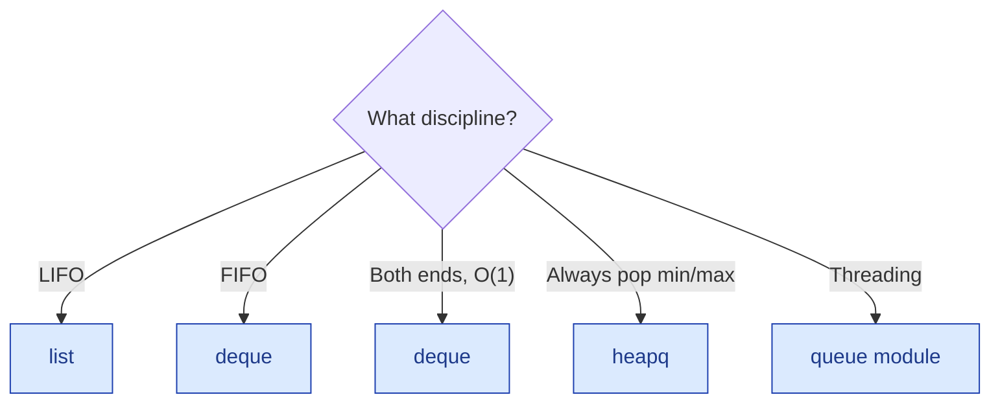

---

## 8. Common mistakes & gotchas

The 10 traps that fail interviews.

!!! warning "Trap 1 — Using `list.pop(0)` for FIFO"
    `list.pop(0)` is **O(n)**. n queue ops = O(n²). **Use `deque.popleft()`** which is O(1).

!!! warning "Trap 2 — Forgetting `is_empty` check before `pop`"
    `[].pop()` raises `IndexError`. Always check or wrap in try.

!!! warning "Trap 3 — Confusing `peek` with `pop`"
    `peek` doesn't remove; `pop` does. Easy slip.

!!! warning "Trap 4 — Using a regular queue when you needed a priority queue"
    "Find the next ready job" is FIFO if jobs are equal-priority, but priority queue if not.

!!! warning "Trap 5 — Initializing a min-heap and pushing tuples in the wrong order"
    `heapq` compares from the leftmost element. For "smallest distance, then alphabetical," push `(dist, name)`. Reversing the order gives the wrong heap.

!!! warning "Trap 6 — Mutable items in a heap that don't compare"
    `heapq.heappush(h, (priority, my_obj))` — if priorities tie, Python will try to compare `my_obj` instances. If they don't define `__lt__`, you get `TypeError`. **Add a tiebreaker** (e.g., a counter): `(priority, counter, my_obj)`.

!!! warning "Trap 7 — Iterating a `deque` while modifying it"
    Same trap as `dict`. Take a snapshot first.

!!! warning "Trap 8 — Reversing a stack incorrectly"
    `s[::-1]` returns a new reversed *list*, not a stack instance. Convert back if needed.

!!! warning "Trap 9 — Using a stack where you needed a queue (or vice-versa)"
    BFS with a stack does DFS. DFS with a queue does BFS. They produce different results.

!!! warning "Trap 10 — Forgetting that `heapq` is min-heap only"
    No max-heap parameter. Use `heappush(h, -x)` or `heapq._heapify_max` (private API; avoid).

---

## 9. Patterns this connects to

| Pattern | When you see it | Example |
|---|---|---|
| **Bracket matching** | Match nested delimiters | Valid Parens (#1), Calculator (#28) |
| **Monotonic stack** | "Next greater / smaller element" | Daily Temperatures (#11), Histogram (#26) |
| **Monotonic deque** | "Max of every k-window" | Sliding Window Max (#18) |
| **DFS via stack** | Iterative DFS | Tree iteration (covered in trees chapter) |
| **BFS via queue** | Level-order, shortest path on unweighted graph | (Trees / graphs chapters) |
| **Two stacks make a queue** | Amortize | Implement Queue using Stacks (#2) |
| **Two queues make a stack** | The dual | Implement Stack using Queues (#3) |
| **Lazy-deletion heap** | Skip expired/cancelled top of heap | Event simulators |
| **Aux stack of minima** | O(1) min of a stack | Min Stack (#4) |
| **Stack as parser state** | Compilers, calculators | RPN (#15), Decode String (#14) |

---

## 10. Practice problems (40)

Same v3 5-layer format. Buckets:

- **Easy 1–10**: warm-ups; almost all interviews include one.
- **Medium 11–25**: monotonic stack / deque + design problems.
- **Hard 26–30**: histogram, calculator, trapping rain.
- **Product 31–35**: design-flavor questions.
- **Service / PSU 36–40**: TCS / Infosys / Wipro / HCL / ISRO basics.

---

### Problem 1 — Valid Parentheses

<span class="diff-easy">Easy</span> &nbsp; <span class="company-tag">Google</span> <span class="company-tag">Amazon</span> <span class="company-tag">Meta</span> <span class="company-tag">Microsoft</span> <span class="company-tag">Apple</span> <span class="company-tag">TCS</span>

> Given a string `s` containing `()`, `[]`, `{}`, return `True` iff every opening bracket is closed by the matching type in the correct order.

#### 📖 Story Mode

`"()"` → True. `"()[]{}"` → True. `"(]"` → False. `"([)]"` → False (wrong nesting). `"{[]}"` → True.

#### 🌍 Real-World Usage

- **Compilers / linters** — basic syntax check.
- **JSON / XML parsers.**
- **Code editors** — bracket pair highlighting.
- **Math expression validation.**

#### 🧠 Thinking Process

Walk left to right. Push every opening bracket on a stack. On a closing bracket, pop the stack — if it doesn't match, fail. At the end, the stack must be empty.

#### 🐍 5 Layers of Solution

=== "Layer 2 — Stack"

    ```python
    def is_valid(s):
        match = {")": "(", "]": "[", "}": "{"}
        stack = []
        for c in s:
            if c in "([{":
                stack.append(c)
            else:
                if not stack or stack.pop() != match[c]:
                    return False
        return not stack
    ```

    O(n) time, O(n) space.

=== "Layer 3 — Edge-case-hardened"

    Same; explicit check `if c not in "([{)]}":` would skip non-bracket characters if the spec allows them.

=== "Layer 4 — Production-ready"

    ```python
    from __future__ import annotations


    _PAIRS = {")": "(", "]": "[", "}": "{"}


    def is_valid_parentheses(s: str) -> bool:
        """Return True iff brackets in s are correctly matched and nested.

        Time:  O(n).
        Space: O(n) — stack of unmatched openers.

        Example:
            >>> is_valid_parentheses("()[]{}")
            True
            >>> is_valid_parentheses("([)]")
            False
        """
        stack: list[str] = []
        for c in s:
            if c in "([{":
                stack.append(c)
            elif c in _PAIRS:
                if not stack or stack.pop() != _PAIRS[c]:
                    return False
            # Otherwise: ignore non-bracket characters (clarify with interviewer).
        return not stack
    ```

=== "Layer 5 — Variants"

    **Variant A — minimum operations to balance.** Count unmatched closers and openers; sum.

    **Variant B — generate all valid bracket sequences of n pairs.** See [Strings — Problem 24](../strings/01-string-basics.md#problem-24-generate-parentheses).

    **Variant C — longest valid parens substring.** See [Strings — Problem 30](../strings/01-string-basics.md#problem-30-longest-valid-parentheses).

    **Variant D — n bracket types instead of 3.** Same algorithm; bigger pair table.

#### 🔍 Dry Run

`s = "([)]"`:

| c | stack before | action | stack after | result |
|---|--------------|--------|-------------|--------|
| ( | [] | push | [(] | continue |
| [ | [(] | push | [(, [] | continue |
| ) | [(, [] | pop top is `[`, expected `(` → mismatch | — | **False** |

#### ⏱️ Complexity

O(n) time, O(n) space.

#### 🎯 Pattern Used

**Bracket matching with a stack.** The hello-world of stack problems.

#### 🐛 Common Bugs

1. **Popping when stack is empty** → must check.
2. **Forgetting the final emptiness check** → `"((("` falsely returns True.
3. **Mixing up the pair direction** in the dict.

#### ✅ Edge Cases Checklist

- [ ] Empty string → True
- [ ] Only openers → False
- [ ] Only closers → False
- [ ] Mismatched pairs
- [ ] Nested correctly

#### 🏢 Sample Interviewer Quote

> *"Tell me whether this string of brackets is valid."*

Your opener: *"Stack of openers. Walk the string. Each closer must match the top of the stack. Empty at the end means valid. O(n) time and space."*

---

### Problem 2 — Implement Queue using Stacks

<span class="diff-easy">Easy</span> &nbsp; <span class="company-tag">Microsoft</span> <span class="company-tag">Amazon</span> <span class="company-tag">Bloomberg</span> <span class="company-tag">Apple</span>

> Implement a **FIFO queue** (`push`, `pop`, `peek`, `empty`) using only stack operations. (LeetCode 232.)

#### 📖 Story Mode

```
push(1), push(2), push(3)        →  queue front = 1
peek()                           →  1
pop()                            →  1; queue front = 2
push(4)                          →  queue order = [2, 3, 4]
pop(), pop(), pop()              →  2, 3, 4
empty()                          →  True
```

A queue is FIFO; a stack is LIFO. Combining two stacks reverses the order *twice* — once into the second stack, then naturally on pop — restoring FIFO semantics.

#### 🌍 Real-World Usage

- **Streaming pipelines** where the only available primitive is a stack — e.g., some lock-free data-structure libraries expose only stack-style push/pop.
- **Functional persistent queues** — Okasaki's queue uses two singly linked lists, exactly this trick under the hood.
- **Compiler / interpreter call-stack manipulation** — sometimes you have a stack and need FIFO semantics for a particular pass.
- **Whiteboard interview classic** — tests amortized analysis understanding.

#### 🧠 Thinking Process

Two stacks: `in_stack` for pushes, `out_stack` for pops. The `out_stack` holds elements in **FIFO order** (the bottom of `out_stack` is the queue's front). When `out_stack` is empty, pour everything from `in_stack` into `out_stack`, reversing the order — now the oldest element is at the top of `out_stack`, ready to be popped.

**Why amortized O(1)?** Each element is pushed onto `in_stack` once and moved to `out_stack` at most once before being popped. Three operations per element across its lifetime → O(1) amortized per queue op.

**Why not always move?** Constantly moving turns every pop into an O(n) operation. Only move when `out_stack` is empty.

#### 🐍 5 Layers of Solution

=== "Layer 1 — Single stack with rotation (brute)"

    ```python
    class MyQueueBrute:
        def __init__(self):
            self._stack = []

        def push(self, x):
            # Reverse, push, reverse back — keeps front-at-top
            tmp = []
            while self._stack:
                tmp.append(self._stack.pop())
            self._stack.append(x)
            while tmp:
                self._stack.append(tmp.pop())

        def pop(self):
            return self._stack.pop()        # already at top

        def peek(self):
            return self._stack[-1]

        def empty(self):
            return not self._stack
    ```

    `push` is **O(n)**, pop/peek/empty are O(1). Functionally correct; bad amortization.

=== "Layer 2 — Two stacks, lazy transfer ⭐"

    ```python
    class MyQueue:
        def __init__(self):
            self._in = []
            self._out = []

        def push(self, x):
            self._in.append(x)

        def pop(self):
            self._move()
            return self._out.pop()

        def peek(self):
            self._move()
            return self._out[-1]

        def empty(self):
            return not self._in and not self._out

        def _move(self):
            if not self._out:
                while self._in:
                    self._out.append(self._in.pop())
    ```

    **Amortized O(1)** per op; worst-case O(n) for the pop that triggers a transfer.

=== "Layer 3 — Edge-case-hardened"

    ```python
    class MyQueue:
        def __init__(self):
            self._in = []
            self._out = []

        def push(self, x):
            self._in.append(x)

        def pop(self):
            if self.empty():
                raise IndexError("pop from empty queue")
            self._move()
            return self._out.pop()

        def peek(self):
            if self.empty():
                raise IndexError("peek from empty queue")
            self._move()
            return self._out[-1]

        def empty(self):
            return not self._in and not self._out

        def _move(self):
            if not self._out:
                while self._in:
                    self._out.append(self._in.pop())
    ```

    Adds explicit empty-check on `pop`/`peek` instead of relying on Python's IndexError from the underlying list.

=== "Layer 4 — Production-ready"

    ```python
    from __future__ import annotations


    class MyQueue:
        """FIFO queue backed by two LIFO stacks; amortized O(1) per operation.

        `_in` collects new pushes; `_out` holds elements in pop-ready order
        (queue front is at the top of `_out`). When `_out` is empty, all
        elements from `_in` are poured over, reversing the order.

        Each element is pushed onto `_in` once and moved to `_out` at most once
        before being popped — so the total work across n operations is O(n),
        giving O(1) amortized per op.
        """

        def __init__(self) -> None:
            self._in: list[int] = []
            self._out: list[int] = []

        def push(self, x: int) -> None:
            """Append `x` to the back of the queue. Time: O(1)."""
            self._in.append(x)

        def pop(self) -> int:
            """Remove and return the queue's front. Time: O(1) amortized.

            Raises:
                IndexError: if the queue is empty.
            """
            if self.empty():
                raise IndexError("pop from empty queue")
            self._move()
            return self._out.pop()

        def peek(self) -> int:
            """Return the queue's front without removing. Time: O(1) amortized."""
            if self.empty():
                raise IndexError("peek from empty queue")
            self._move()
            return self._out[-1]

        def empty(self) -> bool:
            """Whether the queue is empty. Time: O(1)."""
            return not self._in and not self._out

        def _move(self) -> None:
            """Lazily pour `_in` into `_out` only when `_out` is empty."""
            if not self._out:
                while self._in:
                    self._out.append(self._in.pop())
    ```

=== "Layer 5 — Variants"

    **Variant A — Queue with `O(1) worst-case` pop.** Maintain three stacks (Hood-Melville queue) — incrementally interleaving the transfer so no single op is O(n). More complex, rare to need.

    **Variant B — Persistent / immutable queue.** Each push/pop returns a *new* queue without mutating the old. Okasaki's classic is exactly the two-stack design, with linked lists instead of arrays.

    **Variant C — Concurrent queue using two stacks.** Wrap each stack in its own lock; pop acquires both for the transfer. For high throughput, prefer purpose-built MPMC queues.

    **Variant D — Bounded queue.** Reject `push` when `len(_in) + len(_out) >= cap`.

    **Variant E — Implement queue using ONLY ONE stack** (recursion). `pop` recursively pops everything except the bottom, returns it, then re-pushes the rest. O(n) per op. A logic puzzle, not a real implementation.

#### 🔍 Dry Run

`push(1), push(2), peek(), pop(), push(3), pop(), pop(), empty()`:

| op | _in (top right) | _out (top right) | returns |
|----|-----------------|------------------|---------|
| init | [] | [] | — |
| push(1) | [1] | [] | — |
| push(2) | [1, 2] | [] | — |
| peek() | [] | [2, 1] (move triggered) | 1 |
| pop() | [] | [2] | 1 |
| push(3) | [3] | [2] | — |
| pop() | [3] | [] | 2 |
| pop() | [] | [3] (move triggered) | 3 |
| empty() | [] | [] | True |

Notice the move from `_in` to `_out` only happens when `_out` is empty AND a pop/peek is requested. Each element (1, 2, 3) is pushed once and moved at most once.

#### ⏱️ Complexity

| Op | Layer 1 (single-stack) | **Layers 2-4 (two-stack)** ⭐ | Hood-Melville (Variant A) |
|----|------:|------:|------:|
| `push` | O(n) | **O(1)** | O(1) worst-case |
| `pop` | O(1) | **O(1) amortized** (O(n) worst) | O(1) worst-case |
| `peek` | O(1) | **O(1) amortized** | O(1) |
| `empty` | O(1) | O(1) | O(1) |
| Memory | O(n) | O(n) | O(n) |

**Amortized analysis:** charge each element 3 units of credit on `push`. The element is pushed onto `_in` (1 unit), later popped from `_in` and pushed onto `_out` (2 units), then popped from `_out` (3 units). Total work across n ops is bounded by 3n = O(n), so O(1) amortized.

#### 🎯 Pattern Used

**Two-stack amortization (Okasaki's queue).** The hello-world of amortized analysis. Same trick reappears in immutable functional queues, persistent data structures, and some compiler IR passes.

#### 🔄 Interviewer Follow-ups

??? question "Follow-up 1 — Prove the amortized O(1) bound."
    Each element is pushed onto `_in` exactly once (1 unit), moved to `_out` at most once (1 unit on the bulk transfer, but charged to the original push), and popped from `_out` exactly once (1 unit). Total work across n operations is at most 3n, so amortized O(1) per op.

??? question "Follow-up 2 — Why move only when `_out` is empty?"
    If we move on every pop, each pop is O(size of `_in`) — that breaks amortization. Lazy transfer ensures each element is moved at most once across its lifetime.

??? question "Follow-up 3 — What's the worst-case latency for a single pop?"
    O(n), when `_out` is empty and `_in` has all elements. For a real-time system where worst-case latency matters, use Variant A (Hood-Melville).

??? question "Follow-up 4 — Implement queue with one stack."
    Use recursion — `pop` pops every element above the bottom, captures the bottom, then re-pushes the rest. O(n) per `pop`. A logic puzzle; not a real implementation. (See Variant E.)

??? question "Follow-up 5 — Make it thread-safe."
    Wrap all four public methods with a single `threading.Lock`. For higher concurrency, lock per-stack and order acquisition consistently — but contention on the transfer step typically dominates. Real systems use lock-free MPMC queues.

??? question "Follow-up 6 — Persistent / immutable queue."
    Use linked lists instead of arrays for `_in` and `_out`. Each `push`/`pop` returns a new queue object that shares structure with the old one. Okasaki's design.

??? question "Follow-up 7 — Bounded queue (capacity = K)."
    Track `len(_in) + len(_out)`; reject push when it would exceed K. Return False or raise depending on contract.

#### 🐛 Common Bugs

1. **Always moving on every pop** — defeats the amortization; pop becomes O(n) every time.
2. **Moving in `push`** — same issue; push becomes O(n).
3. **Moving when `_out` is non-empty** — corrupts the FIFO order (newer items get popped before older ones).
4. **Not handling empty case** — `_out.pop()` raises IndexError; specify behavior with the interviewer.
5. **`peek` not triggering a move** — returns wrong value when `_out` is empty but `_in` is non-empty.
6. **Building `_out` in the wrong direction** — must use `pop()` from `_in` and `append()` to `_out` to actually reverse the order.

#### ✅ Edge Cases Checklist

- [ ] Empty queue → `empty() = True`, `pop()` raises (or contracted behavior)
- [ ] Single push then single pop → returns that element
- [ ] Push, pop, push, pop interleaved — verify FIFO order preserved
- [ ] Many pushes then many pops — exactly one bulk transfer
- [ ] After all pops, queue is empty
- [ ] Push after partial pop — new pushes go to `_in`, don't disturb `_out` pop order
- [ ] Stress: 10⁶ random ops — amortized O(1) per op holds

#### 🏢 Sample Interviewer Quote

> *"Implement a queue using only stacks."*

Your opener: *"Two stacks — `in` for pushes, `out` for pops. When `out` is empty, pour everything from `in` into `out`, reversing the order so the queue front is at the top. Each element moves at most twice across its lifetime — amortized O(1) per operation. Worst-case pop is O(n) when a transfer triggers; the trick is the lazy transfer: only move when `out` is empty, never re-mix."*

---

### Problem 3 — Implement Stack using Queues

<span class="diff-easy">Easy</span> &nbsp; <span class="company-tag">Microsoft</span> <span class="company-tag">Amazon</span> <span class="company-tag">Bloomberg</span> <span class="company-tag">Adobe</span>

> Implement a **LIFO stack** (`push`, `pop`, `top`, `empty`) using only the standard FIFO queue operations: `enqueue` (append to back), `dequeue` (remove from front), `peek front`, `size`, `empty`. You may use **one or two queues**, but no list indexing or stack tricks. (LeetCode 225.)

#### 📖 Story Mode

```
push(1):   q = [1]                   top → 1
push(2):   q = [1, 2]   rotate →  q = [2, 1]    top → 2
push(3):   q = [2, 1, 3]  rotate twice →  q = [3, 2, 1]   top → 3
pop():     dequeue front → 3,        q = [2, 1]
top():     peek front → 2
pop():     dequeue front → 2,        q = [1]
empty():   False → True after one more pop
```

The trick: a queue gives FIFO order, but a stack wants LIFO. **After each push, rotate** the queue so the newest element ends up at the *front* — then `dequeue` magically pops the top.

#### 🌍 Real-World Usage

- **Educational dual** — the canonical "if you only had FIFO primitives, can you simulate LIFO?" exercise. Hugely common in OS-classroom material on container ADTs.
- **Concurrent simulators** — when only a thread-safe queue is exposed but you need stack semantics for undo/redo locally on a worker.
- **Embedded systems** — some RTOS APIs expose only message queues; this lets you bolt-on LIFO behaviour without an extra primitive.
- **Functional languages without mutation** — easier to reason about with rotated immutable queues than mutable list cells.
- **Whiteboard classic** — co-asked with P2 (Queue using Stacks) to test ADT thinking.

#### 🧠 Thinking Process

A queue removes from the **front**; a stack wants to remove the **most recent** element. To bridge the gap, after every push you must arrange for the newest element to *be* at the front. Two designs:

1. **Push-heavy (single queue, rotate-on-push)**: After enqueueing `x`, dequeue every prior element and re-enqueue it. The new element bubbles to the front. `push = O(n)`, `pop/top = O(1)`. **One queue, simplest.**
2. **Pop-heavy (two queues, rotate-on-pop)**: Push appends to `q1`. On pop, drain all but the last element from `q1` into `q2`, then return the lone leftover; swap names. `push = O(1)`, `pop = O(n)`.

Push-heavy is canonical because pop becomes trivial — and that aligns with the most common stack workload. Note this is **the dual of P2**: there, the costly side was `pop`. Here, the costly side is `push`. **You cannot get O(1) for both** with a queue substrate (unlike the two-stack queue, where amortization saves us — here every dequeue inherently destroys ordering for the next push).

#### 🐍 5 Layers of Solution

=== "Layer 1 — Two queues, pop rotates"

    ```python
    from collections import deque

    class MyStackTwoQueue:
        """Two queues; push O(1), pop O(n)."""

        def __init__(self) -> None:
            self._q1: deque[int] = deque()
            self._q2: deque[int] = deque()

        def push(self, x: int) -> None:
            self._q1.append(x)

        def pop(self) -> int:
            while len(self._q1) > 1:
                self._q2.append(self._q1.popleft())
            top = self._q1.popleft()
            self._q1, self._q2 = self._q2, self._q1
            return top

        def top(self) -> int:
            while len(self._q1) > 1:
                self._q2.append(self._q1.popleft())
            top = self._q1[0]
            self._q2.append(self._q1.popleft())
            self._q1, self._q2 = self._q2, self._q1
            return top

        def empty(self) -> bool:
            return not self._q1
    ```

    Honest brute. Notice `top()` must drain *all* of `q1` (including the last element) — easy to miss.

=== "Layer 2 — Single queue, push rotates ⭐ (canonical)"

    ```python
    from collections import deque

    class MyStack:
        """Single queue with rotate-on-push. push O(n), pop/top O(1)."""

        def __init__(self) -> None:
            self._q: deque[int] = deque()

        def push(self, x: int) -> None:
            self._q.append(x)
            for _ in range(len(self._q) - 1):
                self._q.append(self._q.popleft())

        def pop(self) -> int:
            return self._q.popleft()

        def top(self) -> int:
            return self._q[0]

        def empty(self) -> bool:
            return not self._q
    ```

    The classic answer. Rotation count is `n - 1` (one less than current size *including* the new element). Watch the off-by-one: rotating `n` times brings the queue back to its original order.

=== "Layer 3 — Edge-case-hardened"

    ```python
    from collections import deque

    class MyStackSafe:
        def __init__(self) -> None:
            self._q: deque[int] = deque()

        def push(self, x: int) -> None:
            self._q.append(x)
            # rotate len(q) - 1 times so x ends up at the front
            for _ in range(len(self._q) - 1):
                self._q.append(self._q.popleft())

        def pop(self) -> int:
            if not self._q:
                raise IndexError("pop from empty stack")
            return self._q.popleft()

        def top(self) -> int:
            if not self._q:
                raise IndexError("top from empty stack")
            return self._q[0]

        def empty(self) -> bool:
            return not self._q

        def size(self) -> int:
            return len(self._q)
    ```

    Explicit `IndexError` on empty access matches Python idioms. `size()` is a courtesy method some interviewers ask for.

=== "Layer 4 — Production-ready"

    ```python
    from __future__ import annotations
    from collections import deque
    from typing import Generic, TypeVar

    T = TypeVar("T")

    class StackOnQueue(Generic[T]):
        """LIFO stack backed by a single FIFO queue.

        Push is O(n); pop, top, and empty are O(1). Choose this design when
        pops dominate pushes — pops stay cheap. For balanced workloads
        prefer a real list-based stack.
        """

        __slots__ = ("_q",)

        def __init__(self) -> None:
            self._q: deque[T] = deque()

        def push(self, x: T) -> None:
            """Push *x* onto the stack. O(n)."""
            self._q.append(x)
            for _ in range(len(self._q) - 1):
                self._q.append(self._q.popleft())

        def pop(self) -> T:
            """Remove and return the top of the stack. O(1)."""
            if not self._q:
                raise IndexError("pop from empty stack")
            return self._q.popleft()

        def top(self) -> T:
            """Return (without removing) the top of the stack. O(1)."""
            if not self._q:
                raise IndexError("top from empty stack")
            return self._q[0]

        def empty(self) -> bool:
            """Return True iff the stack has no elements. O(1)."""
            return not self._q

        def __len__(self) -> int:
            return len(self._q)

        def __repr__(self) -> str:  # debug aid
            return f"StackOnQueue(top→bottom={list(self._q)!r})"
    ```

=== "Layer 5 — Variants & extensions"

    **Variant A — Recursive single-queue push (no explicit loop):**

    ```python
    def push(self, x: int) -> None:
        if not self._q:
            self._q.append(x)
            return
        head = self._q.popleft()
        self.push(x)             # recurse first
        self._q.append(head)     # then re-append the front
    ```

    Cute but stack-depth O(n); avoid for large n.

    **Variant B — Two-queue alternating ("ping-pong"):**

    ```python
    def push(self, x: int) -> None:
        self._q2.append(x)
        while self._q1:
            self._q2.append(self._q1.popleft())
        self._q1, self._q2 = self._q2, self._q1
    ```

    Same complexity as Layer 2; some interviewers prefer it because the rotation logic is more obvious — `q2` starts with `x` then we drain `q1` after it.

    **Variant C — Fixed-capacity stack (overflow check):**

    ```python
    def push(self, x: T) -> None:
        if len(self._q) >= self._capacity:
            raise OverflowError(f"stack full (capacity={self._capacity})")
        self._q.append(x)
        for _ in range(len(self._q) - 1):
            self._q.append(self._q.popleft())
    ```

    **Variant D — Thread-safe wrapper:**

    ```python
    import threading
    class ConcurrentStackOnQueue(StackOnQueue[T]):
        def __init__(self) -> None:
            super().__init__()
            self._lock = threading.RLock()

        def push(self, x: T) -> None:
            with self._lock:
                super().push(x)

        def pop(self) -> T:
            with self._lock:
                return super().pop()
    ```

    **Variant E — Stack of stacks via queue layers:** layer queues to simulate frames. Mostly academic.

#### 🔍 Dry Run — `push(1), push(2), push(3), top, pop, push(4), pop, pop, empty`

| Op       | Action                                                     | Queue state (front → back) | Returns |
|----------|------------------------------------------------------------|----------------------------|---------|
| push(1)  | append 1; rotate 0 times                                   | `[1]`                      | —       |
| push(2)  | append 2 → `[1,2]`; rotate 1 → pop 1, append 1             | `[2, 1]`                   | —       |
| push(3)  | append 3 → `[2,1,3]`; rotate 2 → `[1,3,2]` → `[3,2,1]`     | `[3, 2, 1]`                | —       |
| top      | peek front                                                 | `[3, 2, 1]`                | 3       |
| pop      | popleft → 3                                                | `[2, 1]`                   | 3       |
| push(4)  | append 4 → `[2,1,4]`; rotate 2 → `[1,4,2]` → `[4,2,1]`     | `[4, 2, 1]`                | —       |
| pop      | popleft → 4                                                | `[2, 1]`                   | 4       |
| pop      | popleft → 2                                                | `[1]`                      | 2       |
| empty    | `len == 1`, not empty                                      | `[1]`                      | False   |

#### ⏱️ Complexity

| Approach                        | push | pop  | top  | empty | space | notes                           |
|---------------------------------|------|------|------|-------|-------|---------------------------------|
| Two-queue, pop rotates          | O(1) | O(n) | O(n) | O(1)  | O(n)  | top is also O(n) — easy to miss |
| **Single-queue, push rotates ⭐** | **O(n)** | **O(1)** | **O(1)** | **O(1)** | **O(n)** | canonical                       |
| Recursive push                  | O(n) | O(1) | O(1) | O(1)  | O(n)  | extra O(n) call-stack           |

**Cannot achieve O(1) for both push and pop with this substrate** — see Follow-up 1.

#### 🔄 Interviewer Follow-ups

??? question "Follow-up 1 — Why is amortized O(1) impossible here (unlike P2)?"
    In P2 (queue using stacks), the lazy transfer worked because each element is moved **at most twice** (in stack → out stack) over its lifetime — a charge of O(1) amortized per op. Here, every `push` (or every `pop` in the two-queue design) re-touches **all current elements**, not just the new one. After `n` pushes you've performed `0 + 1 + 2 + ... + (n-1) = O(n²)` rotations. There is no charge scheme that brings this to amortized O(1) per push because the work is proportional to the *current* size, not to a one-shot relocation. **The asymmetry between stack-on-queue and queue-on-stack is fundamental** — stacks give you "reverse" for free (LIFO), queues do not.

??? question "Follow-up 2 — One queue or two — which is preferred?"
    Single queue. Same asymptotic cost, half the memory bookkeeping, fewer swap-references to lose track of. The two-queue version is easier to **explain** on a whiteboard but easier to **bug** (forgetting to drain the last element on `top()` is the classic). Mention both, default to one.

??? question "Follow-up 3 — Can you make `top()` truly O(1) in the two-queue variant?"
    Yes — cache the most recently pushed element separately:
    ```python
    def push(self, x): self._q1.append(x); self._top = x
    def top(self): return self._top
    def pop(self):
        # drain q1 → q2 except last; remember new top as you go
        ...
    ```
    Push remains O(1), pop remains O(n) but updates `_top` to the second-newest element as it drains. Nice tweak.

??? question "Follow-up 4 — Make it concurrent (multiple producers, single consumer)."
    Wrap with a `threading.RLock` (Variant D). Or use a real `queue.LifoQueue` (Python's built-in — backed by a heap-free deque, threadsafe). For high contention, prefer a true LIFO primitive over rotated FIFOs.

??? question "Follow-up 5 — Implement a `Min-Stack` on this substrate."
    Pair the queue with a parallel deque of running minima (Problem 4 pattern). Push to both, but only the *value* queue rotates; the `_mins` deque is kept in sync by recording min-up-to-this-point values. Cost stays O(n) push, O(1) pop+min.

??? question "Follow-up 6 — What if the queue API only supports `enqueue`, `dequeue`, and `size` (no peek)?"
    `top()` becomes `pop` followed by `push` of the same value — both O(n). At that point use the two-queue variant and cache the top via Variant D's trick.

??? question "Follow-up 7 — Persistent / immutable stack on a queue?"
    Trivial with a singly-linked list (cons-cell). On a queue substrate it's pointless — the rotation forces full structural sharing breaks. This question is usually a red herring meant to surface "*right tool for the job*" reasoning.

#### 🐛 Common Bugs

1. **Rotating `len(q)` times instead of `len(q) - 1`** — brings the queue back to where it started; the newest element ends up at the back again. Off-by-one on the boundary.
2. **Forgetting the swap in two-queue pop** — `q1` is empty, `q2` has the survivors; if you don't swap names, the next `push` lands in the wrong queue.
3. **`top()` in two-queue not preserving the element** — drained but never re-enqueued, so `top` *destructively* pops. Restore it after peeking.
4. **No empty check** — `popleft()` on an empty deque raises a confusing `IndexError: pop from an empty deque` instead of a meaningful one. Guard explicitly.
5. **Using `list` instead of `deque`** — `list.pop(0)` is O(n) — your "rotation" is now O(n²) per push and O(n³) overall.
6. **Recursive push without depth-limit awareness** — Variant A blows the recursion stack at ~1000 elements in CPython.

#### ✅ Edge Cases Checklist

- [ ] **Empty stack** — `pop()` and `top()` raise `IndexError`.
- [ ] **Single-element stack** — `push(x)` rotates 0 times; `top` returns `x`; `pop` returns `x`, leaves empty.
- [ ] **Two-element stack** — verifies the off-by-one in rotation count.
- [ ] **Push-pop-push interleaved** — make sure the new element after a pop still ends up at the front.
- [ ] **Many pushes** — test 10⁴ pushes; should be O(n²) total work, but completing in milliseconds in CPython.
- [ ] **Duplicates** — `push(5), push(5), pop()` returns 5; both copies independent.
- [ ] **Type uniformity** — generic stack; mixed types should still work since deque is type-agnostic.
- [ ] **Concurrent access** — race on rotation; ensure Variant D's lock covers the whole `push`.

#### 🎤 Sample Interviewer Quote

> *"Implement a stack — `push`, `pop`, `top`, `empty` — using only standard queue operations: enqueue, dequeue, peek-front, and size. After you get a working version, walk me through the tradeoff between push-heavy and pop-heavy designs. Then convince me that you cannot get amortized O(1) for both push and pop on this substrate. If you have time, extend it to a thread-safe min-stack."*

---

### Problem 4 — Min Stack

<span class="diff-easy">Easy</span> &nbsp; <span class="company-tag">Amazon</span> <span class="company-tag">Google</span> <span class="company-tag">Meta</span> <span class="company-tag">Microsoft</span> <span class="company-tag">Bloomberg</span> <span class="company-tag">Apple</span> <span class="company-tag">Adobe</span>

> Design a stack supporting `push`, `pop`, `top`, and `getMin` — **all in O(1)** time, including `getMin`. (LeetCode 155.)

#### 📖 Story Mode

```
push(-2)        stack = [-2]                  getMin → -2
push(0)         stack = [-2, 0]               getMin → -2
push(-3)        stack = [-2, 0, -3]           getMin → -3
getMin()                                       → -3
pop()           stack = [-2, 0]               getMin → -2     (min restored automatically!)
top()                                          →  0
```

The tease is "all four ops O(1)" — `getMin` is the hard one, because a *natural* `min(stack)` is O(n). The trick: an **auxiliary stack of running minima** that mirrors push/pop and always has the current min on top.

#### 🌍 Real-World Usage

- **Undo stacks with min-tracking** — e.g., a code editor showing "minimum indentation in current scope" while you type.
- **Trading systems** — running drawdown / running min-price across a stream of decisions, with rollback support.
- **Game engines** — recording the *lowest health* an entity reached during a checkpointed encounter.
- **Compiler register allocation** — track the minimum register pressure across nested basic blocks; pop on scope exit.
- **OS / kernel** — running minimum priority of pending tasks in a stack-allocated scope.
- **Whiteboard classic** — co-asked with Min-Max stack and "Min Queue" to test O(1)-extra-space tricks.

#### 🧠 Thinking Process

The naive `min(self._data)` is O(n). To get O(1), we must **bake the running minimum into the structure itself**. Two designs:

1. **Auxiliary stack** (canonical): a parallel `_mins` stack that records "the min from the bottom up to the current top". Push to `_mins` whenever the new value `<= current_min`. Pop from `_mins` whenever the popped data equals the top of `_mins`. **O(1) per op, O(n) extra space.**
2. **Encoded differences** (no aux stack): store `x - min` on the *data* stack itself when `x < min`, simultaneously updating `min`. On pop, detect "encoded" entries (negative under invariant) and recover both `x` and the previous `min`. **O(1) per op, O(1) extra space — but you sacrifice the invariant `top() == top of stack`** (top must now decode).

The auxiliary-stack version is what most interviewers want. The encoded-diff version is the headline follow-up. Both deserve memorisation.

The duplicate-min subtlety: if you push two `-3`s back-to-back, you must record `-3` *twice* on `_mins` — otherwise the first pop strips the min prematurely. Use `<=`, not `<`, when deciding to push to `_mins`. (Or store `(value, count)` pairs to compress duplicate runs — a memory-saving variant.)

#### 🐍 5 Layers of Solution

=== "Layer 1 — Brute force, getMin scans"

    ```python
    class MinStackBrute:
        def __init__(self) -> None:
            self._data: list[int] = []

        def push(self, x: int) -> None:
            self._data.append(x)

        def pop(self) -> None:
            self._data.pop()

        def top(self) -> int:
            return self._data[-1]

        def getMin(self) -> int:
            return min(self._data)            # O(n)
    ```

    Honest brute. `getMin` is O(n); fails interviews that explicitly ask for O(1).

=== "Layer 2 — Auxiliary stack ⭐ (canonical)"

    ```python
    class MinStack:
        def __init__(self) -> None:
            self._data: list[int] = []
            self._mins: list[int] = []        # running minima, top = current min

        def push(self, x: int) -> None:
            self._data.append(x)
            if not self._mins or x <= self._mins[-1]:
                self._mins.append(x)          # NOTE: <=, not <

        def pop(self) -> None:
            popped = self._data.pop()
            if popped == self._mins[-1]:
                self._mins.pop()

        def top(self) -> int:
            return self._data[-1]

        def getMin(self) -> int:
            return self._mins[-1]
    ```

    All four ops O(1). Worst-case extra space O(n) (strictly decreasing input).

=== "Layer 3 — Edge-case-hardened"

    ```python
    class MinStackSafe:
        def __init__(self) -> None:
            self._data: list[int] = []
            self._mins: list[int] = []

        def push(self, x: int) -> None:
            self._data.append(x)
            if not self._mins or x <= self._mins[-1]:
                self._mins.append(x)

        def pop(self) -> int:
            if not self._data:
                raise IndexError("pop from empty stack")
            popped = self._data.pop()
            if popped == self._mins[-1]:
                self._mins.pop()
            return popped

        def top(self) -> int:
            if not self._data:
                raise IndexError("top from empty stack")
            return self._data[-1]

        def getMin(self) -> int:
            if not self._mins:
                raise IndexError("getMin on empty stack")
            return self._mins[-1]

        def __len__(self) -> int:
            return len(self._data)
    ```

    Explicit `IndexError` on every empty-access path; `pop` returns the popped value (LeetCode requires `void`, but real-world callers want it). `__len__` is a courtesy.

=== "Layer 4 — Production-ready"

    ```python
    from __future__ import annotations
    from typing import Generic, TypeVar

    T = TypeVar("T")  # must support __le__/__eq__ and ordering.

    class MinStack(Generic[T]):
        """Stack with O(1) push, pop, top, and getMin.

        Implementation maintains a parallel ``_mins`` stack of running minima.
        Whenever the pushed value is ``<=`` the current min, it is also pushed
        to ``_mins`` so that duplicate minima are tracked correctly. On pop,
        if the popped value equals the top of ``_mins``, both stacks pop in
        lockstep.

        Time:  O(1) for all operations.
        Space: O(n) — worst case (strictly decreasing input).
        """

        __slots__ = ("_data", "_mins")

        def __init__(self) -> None:
            self._data: list[T] = []
            self._mins: list[T] = []

        def push(self, x: T) -> None:
            """Push ``x`` onto the stack. O(1)."""
            self._data.append(x)
            if not self._mins or x <= self._mins[-1]:
                self._mins.append(x)

        def pop(self) -> T:
            """Remove and return the top of the stack. O(1)."""
            if not self._data:
                raise IndexError("pop from empty stack")
            popped = self._data.pop()
            if popped == self._mins[-1]:
                self._mins.pop()
            return popped

        def top(self) -> T:
            """Return (without removing) the top of the stack. O(1)."""
            if not self._data:
                raise IndexError("top from empty stack")
            return self._data[-1]

        def getMin(self) -> T:
            """Return the minimum element currently in the stack. O(1)."""
            if not self._mins:
                raise IndexError("getMin on empty stack")
            return self._mins[-1]

        def __len__(self) -> int:
            return len(self._data)

        def __repr__(self) -> str:
            return f"MinStack(top→bottom={list(reversed(self._data))!r}, min={self._mins[-1] if self._mins else None})"
    ```

=== "Layer 5 — Variants & extensions"

    **Variant A — `(value, count)` compression in `_mins`** (saves space on long duplicate runs):

    ```python
    def push(self, x: int) -> None:
        self._data.append(x)
        if self._mins and self._mins[-1][0] == x:
            self._mins[-1] = (x, self._mins[-1][1] + 1)
        elif not self._mins or x < self._mins[-1][0]:
            self._mins.append((x, 1))

    def pop(self) -> None:
        popped = self._data.pop()
        if popped == self._mins[-1][0]:
            v, c = self._mins[-1]
            self._mins[-1] = (v, c - 1)
            if c - 1 == 0:
                self._mins.pop()
    ```

    Same O(1) ops; `_mins` shrinks dramatically when minima repeat.

    **Variant B — Encoded-difference, single stack (O(1) extra space):**

    ```python
    class MinStackEncoded:
        def __init__(self) -> None:
            self._data: list[int] = []
            self._min: int | None = None

        def push(self, x: int) -> None:
            if not self._data:
                self._data.append(0)
                self._min = x
            else:
                self._data.append(x - self._min)        # may be negative
                if x < self._min:
                    self._min = x

        def pop(self) -> None:
            diff = self._data.pop()
            if diff < 0:
                # The popped element WAS the min; restore previous min.
                self._min = self._min - diff             # = old_min
            # If diff >= 0, min is unchanged.

        def top(self) -> int:
            diff = self._data[-1]
            if diff >= 0:
                return self._min + diff
            return self._min                              # the new min itself

        def getMin(self) -> int:
            return self._min
    ```

    Trick: when `x < min`, store `x - min` (negative) and update `min` to `x`. On pop of a negative entry, recover the **old** min via `min - diff`. **O(1) extra space, O(1) per op** — the headline follow-up.

    **Variant C — Min-Max stack:** add a second auxiliary stack `_maxes` symmetric to `_mins`. `getMin` and `getMax` both O(1).

    **Variant D — Thread-safe Min Stack:** wrap with `threading.RLock`. For high contention, see Java's `ConcurrentLinkedDeque` analogue.

    **Variant E — Persistent (immutable) Min Stack:** singly-linked node carries `(value, min_so_far)`. Each `push` creates a new node; `pop` returns the parent reference. Allows time-travel queries.

    **Variant F — Min Queue** (different problem, common follow-up): a queue with O(1) `getMin`. Solved by *two* monotone deques or by Hood-Melville-style amortization. The stack→queue dual; mention it if asked.

    **Variant G — Generic comparator:** parameterise on a `key=` function so the same class doubles as a "max stack" or "min by attribute" stack.

#### 🔍 Dry Run — `push(-2), push(0), push(-3), getMin, pop, top, getMin`

| Op           | Action                          | `_data`         | `_mins`            | Returns |
|--------------|---------------------------------|------------------|--------------------|---------|
| push(-2)     | data ← -2; -2 ≤ ∅ → mins ← -2   | `[-2]`           | `[-2]`             | —       |
| push(0)      | data ← 0;  0 > -2 → mins same   | `[-2, 0]`        | `[-2]`             | —       |
| push(-3)     | data ← -3; -3 ≤ -2 → mins ← -3  | `[-2, 0, -3]`    | `[-2, -3]`         | —       |
| getMin       | mins[-1]                        | `[-2, 0, -3]`    | `[-2, -3]`         | -3      |
| pop          | data pops -3; -3 == mins[-1] → mins pops -3 | `[-2, 0]` | `[-2]`             | -3      |
| top          | data[-1]                        | `[-2, 0]`        | `[-2]`             | 0       |
| getMin       | mins[-1]                        | `[-2, 0]`        | `[-2]`             | -2      |

Dry-run for the encoded-difference variant on the same sequence:

| Op           | Action                                          | `_data`         | `_min` | top decode             |
|--------------|-------------------------------------------------|-----------------|--------|------------------------|
| push(-2)     | first push → data ← 0, min = -2                 | `[0]`           | -2     | -2                     |
| push(0)      | 0 ≥ -2 → data ← 0 - (-2) = 2                    | `[0, 2]`        | -2     | -2 + 2 = 0             |
| push(-3)     | -3 < -2 → data ← -3 - (-2) = -1, min = -3       | `[0, 2, -1]`    | -3     | min itself = -3        |
| pop          | diff = -1 < 0 → min = -3 - (-1) = -2            | `[0, 2]`        | -2     | —                      |
| top          | data[-1] = 2 ≥ 0 → -2 + 2 = 0                   | `[0, 2]`        | -2     | 0                      |
| getMin       | min                                             | `[0, 2]`        | -2     | -2                     |

#### ⏱️ Complexity

| Approach                  | push | pop  | top  | getMin | extra space        |
|---------------------------|------|------|------|--------|--------------------|
| Brute (Layer 1)           | O(1) | O(1) | O(1) | **O(n)** | O(1)             |
| **Aux stack ⭐**           | **O(1)** | **O(1)** | **O(1)** | **O(1)** | **O(n)** |
| (value, count) compressed | O(1) | O(1) | O(1) | O(1)   | O(distinct minima) |
| Encoded-diff (Variant B)  | O(1) | O(1) | O(1) | O(1)   | **O(1)**            |

#### 🎯 Pattern Used

**Auxiliary running-extremum structure.** The same idea generalises to:
- **Max stack** (flip comparison).
- **Min/Max queue** (replace stack with monotone deque; see Sliding Window Maximum, P18).
- **Online range-min queries** (sparse table / segment tree).

#### 🔄 Interviewer Follow-ups

??? question "Follow-up 1 — Why `<=`, not `<`, when pushing to `_mins`?"
    Consider `push(3), push(3), pop()`. With `<`, the second `3` is *not* pushed to `_mins` (which is `[3]`). On pop, `popped == _mins[-1] == 3` → pop `_mins` → `_mins = []`. Now `getMin` on a stack still containing `3` raises `IndexError` — wrong. With `<=`, both 3s are recorded; the first pop only takes one. Duplicates of the running min must be tracked one-for-one.

??? question "Follow-up 2 — Achieve O(1) extra space with no auxiliary stack."
    The encoded-difference trick (Variant B). Store `x - min` in the data stack when `x < min`, simultaneously updating `min`. On pop, if the entry is negative, the popped *was* the min → restore previous min via `min - diff`. **Watch for overflow** in C++/Java: `x - min` can exceed `INT_MIN` when `min` is very negative — use `long`. In Python, integers are arbitrary-precision, so no overflow.

??? question "Follow-up 3 — Min-Max stack — both extremes in O(1)."
    Add a symmetric `_maxes` stack mirroring `_mins`. Push to `_maxes` when `x >= current_max`. Pop in lockstep with data. Same O(n) extra space. (Variant C.)

??? question "Follow-up 4 — Median Stack in O(1)?"
    No — fundamentally not possible in O(1). The median needs order-statistic structure. Use **two heaps** (min-heap for upper half, max-heap for lower half) → `getMedian` is O(1), but `push`/`pop` are O(log n). The "median stack with O(1) all" is impossible because rebalancing the two heaps on pop is Ω(log n) in the worst case.

??? question "Follow-up 5 — Min Queue (FIFO with O(1) getMin)."
    A queue cannot use a single auxiliary stack of minima — when the front pops, the min may be anywhere. Use a **monotone increasing deque of (value, count)** pairs: on enqueue from the back, pop while back > value, append; on dequeue from the front, decrement front's count and pop if zero. **Amortized O(1) per op.** This is the well-known "Min Queue" data structure used in Sliding Window Min.

??? question "Follow-up 6 — Memory pressure on a long-running stack with many minima."
    Use Variant A's `(value, count)` compression. If minima repeat heavily, `_mins` collapses to one entry per distinct min. For *streaming with bounded reuse*, the encoded-diff variant (Variant B) is even better — O(1) extra space full stop.

??? question "Follow-up 7 — Persistent / immutable Min Stack for time-travel queries."
    Each node holds `(value, min_so_far, parent_ref)`. `push` returns a new node; `pop` returns the parent. Old roots remain queryable. Used in functional language compilers and version-control diff engines. O(1) per op, O(n) total nodes (no garbage collection penalty in arena-allocated languages).

??? question "Follow-up 8 — Thread-safe variant for multiple producers."
    Wrap with `threading.RLock` (Variant D). For high contention, partition the stack into per-thread shards and merge minima lazily — but this breaks the strict LIFO invariant. Most production systems just accept the lock and bound the contention via batching.

??? question "Follow-up 9 — Adapt to support k-th smallest in O(1)?"
    Not possible with stack primitives alone. You need a balanced BST or a `SortedList` for O(log n) per op. Mention this when interviewers push for a generalisation — tells them you understand the boundary of what monotone tricks can do.

#### 🐛 Common Bugs

1. **`<` instead of `<=`** when pushing to `_mins` — duplicate-min loses track. Classic interview gotcha.
2. **Comparing with the value at `_mins[-1]` after popping `_data`** — make sure the order is: pop `_data` first, *then* compare to `_mins[-1]`.
3. **Using `_data[-1]` for `getMin`** — confusing the stacks. Always read from `_mins`.
4. **No empty check** — `_data.pop()` and `_data[-1]` raise unhelpful IndexErrors; wrap them.
5. **Encoded variant — comparing against stale `_min` on push of first element** — must initialise `_min` to `x` for the very first push and append `0` to `_data` (not `x`) so subsequent `top()` decoding works.
6. **Encoded variant — overflow in C++/Java** — `x - min` can exceed `INT_MAX`. Use `long`. Python is safe.
7. **Forgetting to decrement count in `(value, count)` variant** before checking `count == 0`.

#### ✅ Edge Cases Checklist

- [ ] **Empty stack** — `pop`, `top`, `getMin` all raise `IndexError`.
- [ ] **Single element** — `push(5); getMin == 5; pop; getMin raises`.
- [ ] **All equal** `[5, 5, 5]` — `getMin == 5` after every pop until empty (with `<=`); breaks with `<`.
- [ ] **Strictly decreasing** `[5, 4, 3, 2, 1]` — `_mins` reaches full size n.
- [ ] **Strictly increasing** `[1, 2, 3, 4, 5]` — `_mins` stays at size 1.
- [ ] **Alternating min** `[3, 1, 3, 1, 3, 1]` — `_mins` records every 1 plus one 3 at bottom.
- [ ] **Duplicates of min** `[2, 1, 1, 1, 0]` — three 1s in `_mins`; pops one at a time.
- [ ] **Negative values** — algorithm comparison-only; no sign assumption.
- [ ] **Very large stack** n = 10⁶ — verify O(1) push doesn't allocate amortised.
- [ ] **Concurrent push and pop** (Variant D) — race on `_mins` updates; lock must cover both stacks.

#### 🎤 Sample Interviewer Quote

> *"Design a stack that supports push, pop, top, and getMin — all four operations in O(1) time. Walk me through your auxiliary-stack solution first, then convince me that the duplicate-min case works correctly. Then optimize to O(1) extra space (no auxiliary stack). Finally, what changes for a Min Queue?"*

Your opener: *"Auxiliary stack of running minima — push to `_mins` when `x <= current_min`, pop in lockstep with `_data` when popped equals `_mins[-1]`. The `<=` (not `<`) handles duplicate minima correctly. For O(1) extra space, encode `x - min` on the data stack itself when `x < min`, simultaneously updating min; decode on top/pop. For Min Queue, swap the auxiliary stack for a monotone increasing deque of (value, count) pairs."*

---

### Problem 5 — Backspace String Compare

<span class="diff-easy">Easy</span> &nbsp; <span class="company-tag">Google</span> <span class="company-tag">Amazon</span> <span class="company-tag">Microsoft</span> <span class="company-tag">Bloomberg</span>

> Given two strings `s` and `t` containing lowercase letters and `'#'` (a backspace), return `True` if both strings render to the same final text. (LeetCode 844.)

#### 📖 Story Mode

```
s = "ab#c"   →  type a, type b, backspace, type c   →  "ac"
t = "ad#c"   →  type a, type d, backspace, type c   →  "ac"
                                                        equal ✓

s = "a##c"   →  type a, two backspaces (one on empty), type c  →  "c"
t = "#a#c"   →  backspace on empty, type a, backspace, type c  →  "c"
                                                                    equal ✓

s = "ab##",  t = "c#d#"  →  both render to ""  →  equal ✓
s = "bxj##tw",  t = "bxj###tw"  →  "btw" vs "tw"  →  NOT equal
```

#### 🌍 Real-World Usage

- **Edit-distance preprocessing** — normalise raw keystroke streams before diffing.
- **Replay logs** — compare two terminal sessions where editing chars are interleaved.
- **Form-input comparison** — two users typed via different paths; do they end up the same?
- **Macro / shorthand expansion** — strip control characters before equality.

#### 🧠 Thinking Process

The literal "build the result, compare strings" answer is straightforward — the question is whether you can do it in **O(1) extra space**. The trick: walk **right-to-left** counting pending backspaces, and pair characters as they "land."

Why right-to-left? Because backspaces affect characters *before* them. From the right, each `#` deletes the next non-`#` character to its left — easy to track with a counter.

#### 🐍 5 Layers of Solution

=== "Layer 1 — Build with stack ⭐ (clearest)"

    ```python
    def backspace_compare(s: str, t: str) -> bool:
        def build(string: str) -> list[str]:
            stack: list[str] = []
            for c in string:
                if c == '#':
                    if stack:
                        stack.pop()
                else:
                    stack.append(c)
            return stack

        return build(s) == build(t)
    ```

    O(n + m) time, O(n + m) space.

=== "Layer 2 — Build as `str` via list join"

    ```python
    def backspace_compare(s: str, t: str) -> bool:
        def build(string: str) -> str:
            out: list[str] = []
            for c in string:
                if c == '#':
                    if out:
                        out.pop()
                else:
                    out.append(c)
            return "".join(out)

        return build(s) == build(t)
    ```

    Same complexity; minor convenience for printing.

=== "Layer 3 — Two-pointer reverse walk (O(1) space) ⭐"

    ```python
    def backspace_compare(s: str, t: str) -> bool:
        def next_valid(string: str, i: int) -> int:
            """Return the index of the next non-backspaced char ≤ i, or -1."""
            skip = 0
            while i >= 0:
                if string[i] == '#':
                    skip += 1
                    i -= 1
                elif skip:
                    skip -= 1
                    i -= 1
                else:
                    return i
            return -1

        i, j = len(s) - 1, len(t) - 1
        while i >= 0 or j >= 0:
            i = next_valid(s, i)
            j = next_valid(t, j)
            if i < 0 and j < 0:
                return True
            if i < 0 or j < 0 or s[i] != t[j]:
                return False
            i -= 1
            j -= 1
        return True
    ```

    O(n + m) time, **O(1) extra space**. The follow-up answer.

=== "Layer 4 — Generator-based"

    ```python
    def backspace_compare(s: str, t: str) -> bool:
        def chars(string: str):
            skip = 0
            for c in reversed(string):
                if c == '#':
                    skip += 1
                elif skip:
                    skip -= 1
                else:
                    yield c

        from itertools import zip_longest
        return all(a == b for a, b in zip_longest(chars(s), chars(t)))
    ```

    Pythonic, O(1) auxiliary state per stream (excluding generator frames).

=== "Layer 5 — Variants"

    **A. Multiple kinds of edits** — `'#'` for backspace, `'^'` for delete-forward. Track two skip counters or use a doubly linked list.

    **B. Undo / redo** — extend with `U` (undo) and `R` (redo). Now you need a stack of stacks.

    **C. Streaming** — characters arrive online. Maintain the canonical form incrementally; total work is still O(n).

    **D. Edit distance after normalisation** — first apply backspace logic, then run Levenshtein on the results.

#### 🔍 Dry Run (Layer 3 on `s="ab##"`, `t="c#d#"`)

`i = 3, j = 3`. Both strings end with `#`.

- `next_valid(s, 3)`: `s[3]='#'` → skip=1, i=2. `s[2]='#'` → skip=2, i=1. `s[1]='b'`, skip=2 → skip=1, i=0. `s[0]='a'`, skip=1 → skip=0, i=-1. return -1.
- `next_valid(t, 3)`: similar → -1.
- Both -1 → return True. ✓

#### ⏱️ Complexity

- Layer 1 / 2 / 4: O(n + m) time, O(n + m) space.
- Layer 3: **O(n + m) time, O(1) extra space**.

#### 🎯 Pattern Used

**Stack for "undo" semantics.** The reverse-walk variant is **two-pointer with skip counter** — a recurring trick for "rendering" sequences from the back.

#### 🔄 Interviewer Follow-ups

??? question "Follow-up 1 — Solve in O(1) extra space."
    Layer 3. Walk both strings from the right; track pending backspaces; compare characters as they "land."

??? question "Follow-up 2 — Two backspace symbols (e.g., `#` and `^` for forward-delete)."
    Forward-delete deletes the next character — hard to track from the right. Either build the canonical string explicitly, or use a doubly linked list.

??? question "Follow-up 3 — Stream of characters with infinite tail."
    Output the canonical text as it stabilises (i.e., once you know no more backspaces can affect it). Without that bound, you can't compare.

??? question "Follow-up 4 — What if `#` should always delete, even from empty?"
    Spec choice. Standard interpretation: ignore. Layer 1's `if stack: stack.pop()` handles both.

#### 🐛 Common Bugs

1. **Popping unconditionally on `#`** — IndexError on `"#abc"`.
2. **Forward-walking with a counter** — fails because backspaces look back, not forward.
3. **Layer 3: forgetting to advance `i -= 1` after consuming a skip** — infinite loop.
4. **Comparing with `is`** — strings can be equal but not identical; use `==`.

#### ✅ Edge Cases Checklist

- [ ] Both strings empty after rendering (`"a##"`, `"#"`) → True.
- [ ] One renders to empty, other doesn't → False.
- [ ] Trailing backspace consumes nothing (`"#"`) → render to "".
- [ ] All-`#` input → render to "".
- [ ] Mixed lengths — must compare full rendered text, not raw lengths.

---

### Problem 6 — Next Greater Element I

<span class="diff-easy">Easy</span> &nbsp; <span class="company-tag">Amazon</span> <span class="company-tag">Bloomberg</span> <span class="company-tag">Microsoft</span>

> Given two arrays `nums1` and `nums2` where `nums1` is a subset of `nums2` and all elements are **distinct**, find the **next greater element** in `nums2` for each element of `nums1`. Return -1 if none exists. (LeetCode 496.)

#### 📖 Story Mode

```
nums1 = [4, 1, 2]
nums2 = [1, 3, 4, 2]

For 4 in nums2 (index 2): nothing greater to the right → -1
For 1 in nums2 (index 0): next greater = 3
For 2 in nums2 (index 3): nothing greater to the right → -1

answer = [-1, 3, -1]
```

#### 🌍 Real-World Usage

- **Daily highest-temperature look-ahead** — same skeleton as Problem 11.
- **Stock-price "next breakout"** — for each day, the first future day with a higher price.
- **Streaming: detect threshold breach** — for each event, find the next exceeding event.
- **Compiler optimisations** — rank-based register pressure analysis uses the same monotonic stack.

#### 🧠 Thinking Process

Two ways to think about it:

1. **Brute force (O(n × m))** — for each element in `nums1`, find its position in `nums2`, then scan right.
2. **Monotonic decreasing stack (O(n + m))** — walk `nums2` once, maintain a stack of values awaiting their next greater. When `current > stack top`, pop and record `current` as the answer for each popped value. Store the resolved mapping in a hash map.

The interview answer is the second one — but always state the brute force first.

#### 🐍 5 Layers of Solution

=== "Layer 1 — Brute force"

    ```python
    def next_greater_element_i(nums1: list[int], nums2: list[int]) -> list[int]:
        result: list[int] = []
        for x in nums1:
            i = nums2.index(x)
            nxt = -1
            for y in nums2[i + 1 :]:
                if y > x:
                    nxt = y
                    break
            result.append(nxt)
        return result
    ```

    O(n × m). Correct, slow.

=== "Layer 2 — Precompute next-greater for every nums2 index"

    ```python
    def next_greater_element_i(nums1: list[int], nums2: list[int]) -> list[int]:
        nge: dict[int, int] = {}
        for i, x in enumerate(nums2):
            nxt = -1
            for y in nums2[i + 1 :]:
                if y > x:
                    nxt = y
                    break
            nge[x] = nxt
        return [nge[v] for v in nums1]
    ```

    Still O(m²) but separates the "answer per nums2 element" idea — the bridge to Layer 3.

=== "Layer 3 — Monotonic decreasing stack ⭐"

    ```python
    def next_greater_element_i(nums1: list[int], nums2: list[int]) -> list[int]:
        nge: dict[int, int] = {}
        stack: list[int] = []                 # values awaiting next greater
        for x in nums2:
            while stack and stack[-1] < x:
                nge[stack.pop()] = x
            stack.append(x)
        # Anything left on the stack has no next greater
        for v in stack:
            nge[v] = -1
        return [nge[v] for v in nums1]
    ```

    O(n + m) time, O(m) space. **The interview answer.**

=== "Layer 4 — Stack + dict-default (no second pass)"

    ```python
    def next_greater_element_i(nums1: list[int], nums2: list[int]) -> list[int]:
        nge: dict[int, int] = {}
        stack: list[int] = []
        for x in nums2:
            while stack and stack[-1] < x:
                nge[stack.pop()] = x
            stack.append(x)
        return [nge.get(v, -1) for v in nums1]      # default to -1
    ```

    Same complexity; trims the cleanup loop.

=== "Layer 5 — Variants"

    **A. Circular array — Next Greater Element II.** Walk twice. (See Problem 12.)

    **B. With duplicates.** Hash map by index, not by value: `nge_idx[i] = j`. `nums1` query needs *all* positions — clarify with interviewer.

    **C. Next greater OR equal.** Change `<` to `<=` in the while-condition.

    **D. Previous greater (left side).** Walk right-to-left with the same stack template.

    **E. Online queries on a stream.** Maintain the same stack as elements stream in; emit `(popped, current)` pairs as resolutions.

#### 🔍 Dry Run (Layer 3, `nums2 = [1, 3, 4, 2]`)

| step | x | stack before | pops | mapping after | stack after |
|---|---|---|---|---|---|
| 0 | 1 | `[]` | — | `{}` | `[1]` |
| 1 | 3 | `[1]` | pop 1, `nge[1]=3` | `{1:3}` | `[3]` |
| 2 | 4 | `[3]` | pop 3, `nge[3]=4` | `{1:3, 3:4}` | `[4]` |
| 3 | 2 | `[4]` | — (4 > 2) | `{1:3, 3:4}` | `[4, 2]` |

Cleanup: `nge[4] = -1, nge[2] = -1`.

Final: `nge = {1:3, 3:4, 4:-1, 2:-1}` → for `nums1 = [4, 1, 2]` → `[-1, 3, -1]` ✓

#### ⏱️ Complexity

- **Time: O(n + m)** — every element of `nums2` is pushed and popped at most once.
- **Space: O(m)** — the hash map and the stack.

#### 🎯 Pattern Used

**Monotonic decreasing stack of "waiters."** Each element waits on the stack until a strictly greater element arrives — that arrival resolves it. The same template handles: Daily Temperatures (P11), Next Greater II (P12), Online Stock Span (P17), Largest Histogram (P26), Trapping Rain Water (P29).

#### 🔄 Interviewer Follow-ups

??? question "Follow-up 1 — Circular array."
    Walk `nums2` *twice* (or use modular indices). When the second pass hits an element, the stack already holds the unresolved tail from the first pass. See Problem 12.

??? question "Follow-up 2 — Duplicates allowed."
    Index by position instead of by value: `nge_by_index[i] = j`. The query `nums1` must include positions or a tiebreak rule.

??? question "Follow-up 3 — Find the next *smaller* element."
    Flip the comparator to `>` — monotonic *increasing* stack.

??? question "Follow-up 4 — Find the previous greater (to the left)."
    Walk right-to-left with the same template; or walk left-to-right and read the stack top *before* pushing.

??? question "Follow-up 5 — Why is the total time O(n + m), not O(n × m), if there's a `while` loop?"
    Each element is pushed once and popped once. The total number of pop operations across all iterations is at most `m`. Amortised analysis.

#### 🐛 Common Bugs

1. **`stack[-1] <= x`** — flips "next greater" to "next greater or equal." Read the spec.
2. **Iterating `nums1` and rebuilding the map each time** — wastes the precomputed answer.
3. **Forgetting the cleanup pass for unresolved values** (Layer 3) — they default to nothing in the map → KeyError. Layer 4 avoids this with `.get(v, -1)`.
4. **Using a `set` for the stack** — loses LIFO order; the algorithm depends on it.

#### ✅ Edge Cases Checklist

- [ ] `nums1` is empty → `[]`.
- [ ] `nums2` strictly decreasing → all `-1`.
- [ ] `nums2` strictly increasing → each maps to the next; last is `-1`.
- [ ] Single element in `nums2` → maps to `-1`.
- [ ] `nums1` element not in `nums2` — by spec, won't happen, but `.get(v, -1)` is the defensive default.

#### 🏢 Sample Interviewer Quote

> *"For each value in this small subset, tell me the next strictly greater value to its right in the larger array."*

Your opener: *"Brute force is O(n × m). Better: walk the larger array once with a decreasing stack of unresolved values; whenever a new element exceeds the top, it's the answer for the popped value. O(n + m) total. Then look up each subset element in the resulting map."*

---

### Problem 7 — Remove Outermost Parentheses

<span class="diff-easy">Easy</span> &nbsp; <span class="company-tag">Microsoft</span> <span class="company-tag">Amazon</span>

> A valid parentheses string `s` can be uniquely decomposed into a concatenation of *primitive* valid strings `s = P_1 + P_2 + ... + P_k` where each `P_i` is non-empty and itself a valid parentheses string with no proper-prefix decomposition. Return `s` with the **outermost parentheses of every `P_i`** removed. (LeetCode 1021.)

#### 📖 Story Mode

```
"(()())(())"        → "()()()"
                       └P1┘ └P2┘  P1="(()())", P2="(())"
                       strip outer → "()()" + "()" = "()()()"

"(()())(())(()(()))" → "()()()()(())"
"()()"               → ""    (each "()" is its own primitive; nothing inside)
```

#### 🌍 Real-World Usage

- **Tag stripping** — flatten outermost wrappers from a nested-tag stream.
- **Tokenizer normalisation** — drop redundant grouping in expression parsers.
- **Compiler IR cleanup** — remove the outermost parens of every top-level primitive in a generated form.

#### 🧠 Thinking Process

The key insight: **primitives are exactly the maximal balanced runs starting at depth 0**. As we walk the string maintaining `depth`:

- A `(` opens a primitive when `depth == 0` *before* incrementing → skip it.
- A `)` closes a primitive when `depth == 1` *before* decrementing → skip it.
- All other parens are **interior** and should be kept.

We don't need a literal stack — a `depth` counter is enough. (Mention this trade-off when the interviewer asks "why not a stack?": parens are the *only* characters, so depth = stack height; the stack carries no extra information.)

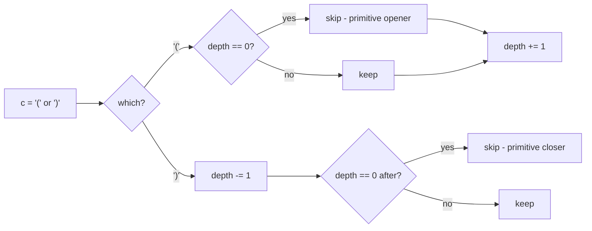

#### 🐍 5 Layers of Solution

=== "Layer 1 — Brute force: explicitly find primitives"

    ```python
    def remove_outer_parens(s: str) -> str:
        out = []
        depth = 0
        start = 0
        for i, c in enumerate(s):
            depth += 1 if c == '(' else -1
            if depth == 0:
                out.append(s[start + 1:i])         # strip outermost ()
                start = i + 1
        return "".join(out)
    ```

    O(n) time, O(n) space — but uses string slicing per primitive.

=== "Layer 2 — Depth counter (canonical) ⭐"

    ```python
    def remove_outer_parens(s: str) -> str:
        out: list[str] = []
        depth = 0
        for c in s:
            if c == '(':
                if depth > 0:
                    out.append(c)                  # interior open
                depth += 1
            else:                                  # ')'
                depth -= 1
                if depth > 0:
                    out.append(c)                  # interior close
        return "".join(out)
    ```

    **O(n) time, O(n) output.** Single pass, single counter. Interview answer.

=== "Layer 3 — Literal stack (when interviewer insists)"

    ```python
    def remove_outer_parens(s: str) -> str:
        out: list[str] = []
        stack: list[str] = []
        for c in s:
            if c == '(':
                if stack:
                    out.append(c)                  # not the outermost
                stack.append(c)
            else:
                stack.pop()
                if stack:
                    out.append(c)                  # not the outermost
        return "".join(out)
    ```

    Same complexity as Layer 2 but with a real stack — useful when the interviewer asks for it explicitly. The stack is **redundant** here (only `len(stack)` ever matters).

=== "Layer 4 — Index-based slice over primitive boundaries"

    ```python
    def remove_outer_parens(s: str) -> str:
        parts: list[str] = []
        depth = 0
        start = 0
        for i, c in enumerate(s):
            depth += 1 if c == '(' else -1
            if depth == 0:
                # Primitive is s[start..i] (inclusive)
                parts.append(s[start + 1:i])       # drop outer ( and )
                start = i + 1
        return "".join(parts)
    ```

    Clearer when you also need to *enumerate* the primitives (e.g., for analysis).

=== "Layer 5 — Production"

    ```python
    from __future__ import annotations


    def remove_outer_parens(s: str) -> str:
        """Remove the outermost parentheses of each primitive in a valid paren string.

        Time:  O(n) — single pass.
        Space: O(n) — output buffer.

        Example:
            >>> remove_outer_parens("(()())(())")
            '()()()'
            >>> remove_outer_parens("(()())(())(()(()))")
            '()()()()(())'
            >>> remove_outer_parens("()()")
            ''
        """
        out: list[str] = []
        depth = 0
        for c in s:
            if c == '(':
                if depth > 0:
                    out.append(c)
                depth += 1
            else:
                depth -= 1
                if depth > 0:
                    out.append(c)
        return "".join(out)
    ```

#### 🔍 Step-by-step Dry Run

`s = "(()())(())"`:

| i | c | depth before | action                | depth after | out so far |
|---|---|--------------|-----------------------|-------------|-----------|
| 0 | `(` | 0 | skip (outermost open) | 1 | `""` |
| 1 | `(` | 1 | keep                  | 2 | `"("` |
| 2 | `)` | 2 | keep                  | 1 | `"()"` |
| 3 | `(` | 1 | keep                  | 2 | `"()("` |
| 4 | `)` | 2 | keep                  | 1 | `"()()"` |
| 5 | `)` | 1 | skip (outermost close) | 0 | `"()()"` |
| 6 | `(` | 0 | skip (outermost open) | 1 | `"()()"` |
| 7 | `(` | 1 | keep                  | 2 | `"()()("` |
| 8 | `)` | 2 | keep                  | 1 | `"()()()"` |
| 9 | `)` | 1 | skip (outermost close) | 0 | `"()()()"` |

Return `"()()()"`. ✓

#### ⏱️ Complexity

| Layer | Time | Space | Notes |
|-------|------|-------|-------|
| 1 — Slice per primitive | O(n) | O(n) | Multiple substrings |
| 2 — Depth counter ⭐ | **O(n)** | O(n) output | Interview answer |
| 3 — Literal stack | O(n) | O(n) | Stack is redundant here |
| 4 — Index-based slice | O(n) | O(n) | Enumerates primitives |
| 5 — Production | O(n) | O(n) | + docstring |

#### ❓ Follow-ups

??? question "Why is a depth **counter** sufficient instead of a stack?"

    Because the only characters are `(` and `)`. A stack would just store `(`s, and `len(stack)` equals `depth`. The stack carries no extra information, so the counter is strictly cheaper.

??? question "What if the alphabet included **multiple bracket types** `()`, `[]`, `{}`?"

    Now the stack is essential — depth alone can't distinguish a `[` close vs. `(` close. Use a stack of opener types and validate on each closer.

??? question "Can the input be **invalid** (mismatched parens)?"

    The problem guarantees validity. If you wanted to validate first, run Problem 1 (Valid Parentheses) — but there's no need here.

??? question "How would you find **the count** of primitives without modifying the string?"

    Increment a counter every time `depth` returns to 0. One pass, O(1) extra memory.

??? question "How does this generalise to **k-th primitive**?"

    Use Layer 4's slice-on-boundary approach; collect the k-th element of `parts` (1-indexed). O(n) time, O(1) extra after a single pass.

??? question "What about computing the **maximum nesting depth** instead?"

    Track `max(depth)` during the walk. One pass.

#### 🐛 Common Bugs

1. **Comparing `depth >= 0` instead of `> 0`** for the keep predicate — would keep the outermost open/close.
2. **Order of increment vs check on `(`** — must check `depth > 0` *before* incrementing (else you'd always keep, since post-increment `depth ≥ 1`). Same on `)`: decrement *first*, then check.
3. **Using a stack of openers and forgetting to pop on `)`** — Layer 3 must `stack.pop()` before the keep check.
4. **`depth == 1` predicate on `)`** to detect outer close — equivalent to `depth > 0` after decrement, but easy to flip.
5. **Returning `s[1:-1]`** — only correct when `s` is a *single* primitive; fails for `"()()"` and the like.

#### 🚧 Edge Cases

- `""` → `""` (empty input)
- `"()"` → `""` (one primitive, nothing inside)
- `"(())"` → `"()"` (nested, peel the outer)
- `"()()"` → `""` (two flat primitives, both peel to nothing)
- `"(()(()))"` → `"()(())"` (single primitive, deep)

#### 📌 Key Takeaways

> **Depth counter > stack** when the alphabet is just `(` and `)`. The stack would store only `(`s — `len(stack) == depth` always.

> **Outer open/close detected by depth boundary.** Skip a `(` iff depth was 0 before; skip a `)` iff depth is 0 after.

> **Primitive = balanced run starting at depth 0.** The decomposition is unique by construction.

#### 🎯 Pattern Used

**Depth-counter (degenerate stack) on a paren string** — the lightest member of the matching-paren family.

---

### Problem 8 — Build an Array With Stack Operations

<span class="diff-easy">Easy</span> &nbsp; <span class="company-tag">Microsoft</span> <span class="company-tag">Amazon</span>

> Imagine a stream of integers `1, 2, 3, ..., n`. You operate a stack and want it to end up holding `target` (a strictly increasing sub-sequence of `1..n`). For each integer `i`, push it onto the stack; if `i` isn't in `target`, pop it immediately. Return the list of operations (`"Push"` and `"Pop"`) you performed. (LeetCode 1441.)

#### 📖 Story Mode

```
target = [1, 3], n = 3
  i=1: push 1                     → ["Push"]
  i=2: push 2 (not in target)     → ["Push", "Push", ...]
       pop 2                       → ["Push", "Push", "Pop"]
  i=3: push 3                     → ["Push", "Push", "Pop", "Push"]
return ["Push", "Push", "Pop", "Push"]

target = [1, 2, 3], n = 3
  → ["Push", "Push", "Push"]      (every i is in target → no pops)

target = [1, 2], n = 4
  → ["Push", "Push"]              (we stop after the last target element)
```

#### 🌍 Real-World Usage

- **Reverse-engineering an expected stack state** — debugging tools that replay operations.
- **Test fixture generators** — minimal operation sequence to reach a target.
- **Compiler IR** — emitting a sequence of bytecode pushes/pops to load a desired set of operands.
- **Teaching example** — pure simulation; no clever data structure needed.

#### 🧠 Thinking Process

Walk `i = 1..n` with a pointer `j` into `target`:

- **Always push** `i`.
- If `target[j] == i`, advance `j` — this push *stays*.
- Otherwise, immediately pop — this `i` was unwanted.
- **Stop early** when `j == len(target)`: the stream after that doesn't matter.

We don't actually maintain a stack here — the *operations* are the answer, not the final stack contents.

```mermaid
flowchart LR
    A[i = 1..n] --> B[append Push]
    B --> C{target[j] == i?}
    C -->|yes| D[j += 1]
    C -->|no| E[append Pop]
    D --> F{j == len target?}
    E --> A
    F -->|yes| END[return]
    F -->|no| A
```

#### 🐍 5 Layers of Solution

=== "Layer 1 — Brute force: simulate with an actual stack"

    ```python
    def build_array(target: list[int], n: int) -> list[str]:
        out: list[str] = []
        stack: list[int] = []
        j = 0
        for i in range(1, n + 1):
            if j == len(target):
                break
            stack.append(i); out.append("Push")
            if stack[-1] != target[j]:
                stack.pop(); out.append("Pop")
            else:
                j += 1
        return out
    ```

    Same complexity as Layer 2 but maintains the stack explicitly. Useful for visualisation or asserts.

=== "Layer 2 — Two-pointer simulation (canonical) ⭐"

    ```python
    def build_array(target: list[int], n: int) -> list[str]:
        out: list[str] = []
        j = 0
        for i in range(1, n + 1):
            if j == len(target):
                break
            out.append("Push")
            if target[j] == i:
                j += 1
            else:
                out.append("Pop")
        return out
    ```

    **O(target[-1]) time, O(target[-1]) output.** The interview answer.

=== "Layer 3 — Skip-aware (emit pops in bulk for runs of skipped numbers)"

    ```python
    def build_array(target: list[int], n: int) -> list[str]:
        out: list[str] = []
        prev = 0
        for x in target:
            # All numbers in (prev, x) are skipped: Push + Pop each
            for _ in range(x - prev - 1):
                out += ["Push", "Pop"]
            out.append("Push")          # x itself
            prev = x
        return out
    ```

    Same complexity, slightly tighter inner loop — and trivially adapts to "give me the *count* of operations" by using arithmetic instead of appending.

=== "Layer 4 — Iterate target only, derive ops by gap"

    ```python
    def build_array(target: list[int], n: int) -> list[str]:
        ops: list[str] = []
        prev = 0
        for x in target:
            # x - prev - 1 numbers were skipped; each contributes Push, Pop
            ops.extend(["Push", "Pop"] * (x - prev - 1))
            ops.append("Push")
            prev = x
        return ops
    ```

    Uses list multiplication for the skipped run — fastest in CPython for this size of problem.

=== "Layer 5 — Production"

    ```python
    from __future__ import annotations


    def build_array(target: list[int], n: int) -> list[str]:
        """Operations needed to transform a stream 1..n into `target` via a stack.

        Time:  O(target[-1]) — we never look beyond the last target element.
        Space: O(2·target[-1] - len(target)) for the output list.

        Args:
            target: strictly increasing list of ints from [1, n].
            n: upper bound of the integer stream (only target[-1] used).

        Example:
            >>> build_array([1, 3], 3)
            ['Push', 'Push', 'Pop', 'Push']
            >>> build_array([1, 2, 3], 3)
            ['Push', 'Push', 'Push']
        """
        ops: list[str] = []
        prev = 0
        for x in target:
            ops.extend(["Push", "Pop"] * (x - prev - 1))
            ops.append("Push")
            prev = x
        return ops
    ```

#### 🔍 Step-by-step Dry Run

`target = [1, 3], n = 3`, Layer 2:

| i | j | target[j] | match? | ops appended      | ops so far                     |
|---|---|-----------|--------|-------------------|--------------------------------|
| 1 | 0 | 1         | yes    | `Push`            | `[Push]`                       |
| 2 | 1 | 3         | no     | `Push`, `Pop`     | `[Push, Push, Pop]`            |
| 3 | 1 | 3         | yes    | `Push`            | `[Push, Push, Pop, Push]`      |
| — | 2 | (out)     | break  | —                 | done                           |

Return `["Push", "Push", "Pop", "Push"]`. ✓ — `n = 3` was reached and `j` exhausted simultaneously; no extra iterations.

#### ⏱️ Complexity

| Layer | Time | Space | Notes |
|-------|------|-------|-------|
| 1 — Real stack | O(target[-1]) | O(target[-1]) | Visualisable |
| 2 — Two-pointer ⭐ | O(target[-1]) | O(ops) | Interview answer |
| 3 — Skip-aware | O(target[-1]) | O(ops) | Tighter inner |
| 4 — Gap-based | O(target[-1]) | O(ops) | Fastest in CPython |
| 5 — Production | O(target[-1]) | O(ops) | + docstring |

#### ❓ Follow-ups

??? question "Why iterate only up to `target[-1]` instead of `n`?"

    Once `j == len(target)`, the remaining numbers contribute nothing — they'd push then pop, but the problem only asks for ops *until the target is built*. Iterate to `target[-1]` and stop.

??? question "What if `target` weren't strictly increasing?"

    The setup is undefined — the integer stream is `1..n` (each appears once), so the final stack contents are always a strictly-increasing subsequence. If asked to handle a non-increasing target, return an error or empty list.

??? question "Can you compute the **count of operations** without building the list?"

    Yes: `2 * target[-1] - len(target)`. Each skipped number contributes 2 ops (Push + Pop); each kept number contributes 1.

??? question "What if the operations were `Push k`, `Pop k` (parameterised by index)?"

    Same algorithm; emit `("Push", i)` and optionally `("Pop", i)` instead of bare strings.

??? question "What if the stream were `1..n` shuffled (not in order)?"

    Different problem — now you genuinely need a stack to find a valid op sequence. Equivalent to "Validate Stack Sequences" (Problem 20) on the inverse.

#### 🐛 Common Bugs

1. **Iterating to `n` without an early exit** — appends spurious `Push`/`Pop` pairs after target is built.
2. **Off-by-one on the early-exit check** — `if j == len(target)` belongs *before* the Push, not after the increment.
3. **Forgetting to advance `j`** on a match — infinite progress loop on the same index.
4. **Using `target[j] == n`** (the bound) instead of `target[j] == i` (current).
5. **Treating `target` as 0-indexed integers** when the stream is `1..n` — common Python ↔ math mismatch.

#### 🚧 Edge Cases

- `target = []` → `[]` (early exit immediately)
- `target = [1]` → `["Push"]`
- `target = [n]` → `["Push", "Pop"] * (n-1) + ["Push"]`
- `target = [1, 2, ..., n]` → `["Push"] * n` (no pops)
- `target[-1] == n` → loop ends naturally; no need for the break

#### 📌 Key Takeaways

> **Two-pointer simulation, no actual stack needed.** The output is the *operations*, not the stack contents.

> **Stop at `target[-1]`.** Anything past the last target element is wasted work.

> **`target` is the spec; the stream is the means.** Each gap in `target` contributes exactly one Push + Pop.

#### 🎯 Pattern Used

**Pure simulation / two-pointer** — included in this chapter because the *meaning* depends on stack semantics, even though the implementation needs no stack.

---

### Problem 9 — Final Prices With Special Discount

<span class="diff-easy">Easy</span> &nbsp; <span class="company-tag">Bloomberg</span> <span class="company-tag">Amazon</span> <span class="company-tag">Microsoft</span>

> Given `prices[i]` for each item, the discount on item `i` equals `prices[j]` where `j` is the **smallest** index `> i` with `prices[j] <= prices[i]`. If no such `j` exists, no discount. Return the final prices. (LeetCode 1475.)

#### 📖 Story Mode

```
prices  = [8, 4, 6, 2, 3]
result  = [4, 2, 4, 2, 3]
                ↑     ↑
            8 - 4   2 - 0    ← items 3,4 have no smaller-or-equal item to the right

prices  = [10, 1, 1, 6]
result  = [ 9, 0, 1, 6]
```

#### 🌍 Real-World Usage

- **Promotional pricing engines** — chain-store discount rules ("first item at next-cheaper-or-equal price triggers a rebate").
- **Marketplace algorithms** — automated competitive repricing.
- **Stack-pattern teaching example** — strict subset of "next smaller element".

#### 🧠 Thinking Process

The discount on item `i` is exactly the **next-smaller-or-equal element** to the right. That's a textbook **monotonic decreasing stack** problem:

1. Keep a stack of indices with strictly decreasing prices waiting for their discount.
2. When `prices[i] <= prices[stack[-1]]`, pop and apply the discount: `result[j] -= prices[i]`.
3. Push `i`. Items remaining on the stack at the end never get discounted.

```mermaid
flowchart LR
    A[i = 0..n-1] --> B{prices[stack top] >= prices[i]?}
    B -->|yes| C[pop j, set result[j] = prices[j] - prices[i]]
    C --> B
    B -->|no| D[push i]
    D --> A
```

#### 🐍 5 Layers of Solution

=== "Layer 1 — Brute force O(n²)"

    ```python
    def final_prices(prices: list[int]) -> list[int]:
        n = len(prices)
        out = list(prices)
        for i in range(n):
            for j in range(i + 1, n):
                if prices[j] <= prices[i]:
                    out[i] -= prices[j]
                    break
        return out
    ```

    Easy to read; quadratic in the worst case.

=== "Layer 2 — Monotonic stack (canonical) ⭐"

    ```python
    def final_prices(prices: list[int]) -> list[int]:
        out = list(prices)
        stack: list[int] = []                  # indices of items waiting for a discount
        for i, p in enumerate(prices):
            while stack and prices[stack[-1]] >= p:
                j = stack.pop()
                out[j] -= p
            stack.append(i)
        return out
    ```

    **O(n) time, O(n) space.** Each index pushed and popped at most once.

=== "Layer 3 — In-place (mutate input)"

    ```python
    def final_prices(prices: list[int]) -> list[int]:
        stack: list[int] = []
        for i in range(len(prices)):
            while stack and prices[stack[-1]] >= prices[i]:
                j = stack.pop()
                prices[j] -= prices[i]         # mutate caller's list
            stack.append(i)
        return prices
    ```

    Same complexity; saves the output allocation. Document the side-effect.

=== "Layer 4 — Right-to-left scan (alternative direction)"

    ```python
    def final_prices(prices: list[int]) -> list[int]:
        n = len(prices)
        out = list(prices)
        stack: list[int] = []                  # increasing-or-equal prices, right side
        for i in range(n - 1, -1, -1):
            while stack and stack[-1] > prices[i]:
                stack.pop()
            if stack:
                out[i] -= stack[-1]
            stack.append(prices[i])
        return out
    ```

    Right-to-left mirror; sometimes preferred when input arrives in reverse.

=== "Layer 5 — Production"

    ```python
    from __future__ import annotations


    def final_prices(prices: list[int]) -> list[int]:
        """Apply LeetCode 1475 special discount: subtract the next ≤ price.

        Time:  O(n).
        Space: O(n) — output list and stack.

        Example:
            >>> final_prices([8, 4, 6, 2, 3])
            [4, 2, 4, 2, 3]
        """
        out = list(prices)
        stack: list[int] = []
        for i, p in enumerate(prices):
            while stack and prices[stack[-1]] >= p:
                out[stack.pop()] -= p
            stack.append(i)
        return out
    ```

#### 🔍 Step-by-step Dry Run

`prices = [8, 4, 6, 2, 3]`:

| i | p | stack before | pops & discounts          | out                  | stack after |
|---|---|--------------|---------------------------|----------------------|-------------|
| 0 | 8 | `[]`         | —                         | `[8,4,6,2,3]`        | `[0]`       |
| 1 | 4 | `[0]`        | pop 0: out[0] = 8-4 = 4   | `[4,4,6,2,3]`        | `[1]`       |
| 2 | 6 | `[1]`        | —                         | `[4,4,6,2,3]`        | `[1,2]`     |
| 3 | 2 | `[1,2]`      | pop 2: out[2] = 6-2 = 4; pop 1: out[1] = 4-2 = 2 | `[4,2,4,2,3]` | `[3]` |
| 4 | 3 | `[3]`        | —                         | `[4,2,4,2,3]`        | `[3,4]`     |

Items 3 and 4 stay on stack — they keep their original prices. Result: `[4, 2, 4, 2, 3]`. ✓

#### ⏱️ Complexity

| Layer | Time | Space | Notes |
|-------|------|-------|-------|
| 1 — Brute force | O(n²) | O(n) | Sanity oracle |
| 2 — Monotonic stack ⭐ | **O(n)** | O(n) | Interview answer |
| 3 — In-place | O(n) | O(n) stack only | Mutates input |
| 4 — Right-to-left | O(n) | O(n) | Mirror direction |
| 5 — Production | O(n) | O(n) | + docstring |

#### ❓ Follow-ups

??? question "What if the rule were **strictly less than** (`prices[j] < prices[i]`) instead of `<=`?"

    Change `>=` to `>` in the inner condition. Items with equal prices no longer cancel — only strictly-cheaper items trigger a discount.

??? question "What if you wanted the **largest** discount available anywhere to the right (not the next)?"

    Different problem — precompute suffix-min (`min_right[i]`) in O(n); then `out[i] = prices[i] - min_right[i+1]` if that is ≤ `prices[i]`.

??? question "How would you compute the discount **online** as prices stream in?"

    The stack approach already streams — each new price triggers some pops (which finalise their discounts) and a push. Items still on the stack at any given time are pending.

??? question "How would the LeetCode 1475 rule generalise to a **2D** grid (next-smaller-or-equal in each row, then in each column)?"

    Run the 1D monotonic stack along rows, then along columns. Two O(R·C) passes.

??? question "If the input is huge and only a few items are queried, can you skip work?"

    Build a sparse next-smaller-element index lazily — but for this problem, each item's discount depends on the *next* smaller item which is cheap to find on demand with a precomputed monotonic structure.

#### 🐛 Common Bugs

1. **Using `>` instead of `>=`** — misses equal-price discounts (the problem asks for `<=`).
2. **Mutating the input by accident** — Layer 2 returns a copy; if you assign `out = prices` (no `list(...)`) you alias the caller's list.
3. **Pushing values instead of indices** — you need indices to update `out[j]`.
4. **Trying right-to-left without flipping the comparison** — Layer 4 stores prices and pops while `stack[-1] > prices[i]`; doing `<` instead is the easy mistake.
5. **Forgetting to push `i`** — items waiting for their discount must be on the stack.

#### 🚧 Edge Cases

- `[]` → `[]`
- `[5]` → `[5]` (no right neighbour)
- `[1, 2, 3, 4]` → `[1, 2, 3, 4]` (strictly increasing — no discounts)
- `[4, 3, 2, 1]` → `[1, 1, 1, 1]` (strictly decreasing — every item discounted)
- All equal `[5, 5, 5]` → `[0, 0, 5]` (last has no neighbour)

#### 📌 Key Takeaways

> **Subset of "next smaller-or-equal" element pattern.** Once you map "discount = next ≤ to the right", the monotonic decreasing stack writes itself.

> **Same template as Daily Temperatures (Problem 11), Online Stock Span (Problem 17), Largest Rectangle (Problem 26).** Recognise the family and you've solved them all.

> **Each index is pushed and popped at most once** — that's the amortisation argument for O(n).

#### 🎯 Pattern Used

**Monotonic decreasing stack** — same family as Daily Temperatures (Problem 11).

---

### Problem 10 — Make The String Great

<span class="diff-easy">Easy</span> &nbsp; <span class="company-tag">Google</span> <span class="company-tag">Amazon</span>

> A string is *good* if it contains no adjacent pair `(c, C)` where `c` and `C` are the same letter in different cases. Repeatedly remove such pairs until the string is good and return it. (LeetCode 1544.)

#### 📖 Story Mode

```
"leEeetcode"  → "leetcode"     ('eE' or 'Ee' removed, then nothing more)
"abBAcC"      → ""              (cascades all the way down)
"s"           → "s"             (single char, already good)
"Pp"          → ""              (one pair)
```

Each removal can expose a new adjacent pair — a single linear pass with a stack handles cascades naturally because the stack's top is always the previous "kept" character.

#### 🌍 Real-World Usage

- **Code editors** — auto-cancelling typo correction (e.g., shorthand expansions).
- **Token simplification** — collapsing matched begin/end markers in tag soup.
- **Data cleansing** — removing redundant marker pairs from logs.

#### 🧠 Thinking Process

The key observation: **after each removal, the new "previous" character is whatever was *before* the pair**. That is the natural definition of a stack:

1. Walk `s` left-to-right.
2. If the top of the stack and the current character are the same letter in different cases (`x.swapcase() == y` ⟺ `x.lower() == y.lower() and x != y`), pop — they cancel.
3. Otherwise push.
4. Result is `"".join(stack)`.

Same shape as **Remove All Adjacent Duplicates** (LC 1047), and a tiny version of the matching-paren family.

#### 🐍 5 Layers of Solution

=== "Layer 1 — Brute force (re-scan after every removal)"

    ```python
    def make_good(s: str) -> str:
        s = list(s)
        changed = True
        while changed:
            changed = False
            for i in range(len(s) - 1):
                if s[i] != s[i + 1] and s[i].lower() == s[i + 1].lower():
                    del s[i:i + 2]
                    changed = True
                    break
        return "".join(s)
    ```

    O(n²) worst case. Easy to convince yourself it's correct.

=== "Layer 2 — Stack (canonical) ⭐"

    ```python
    def make_good(s: str) -> str:
        stack: list[str] = []
        for c in s:
            if stack and stack[-1] != c and stack[-1].lower() == c.lower():
                stack.pop()
            else:
                stack.append(c)
        return "".join(stack)
    ```

    **O(n) time, O(n) space.** Each character pushed and popped at most once.

=== "Layer 3 — Stack with `swapcase` test"

    ```python
    def make_good(s: str) -> str:
        stack: list[str] = []
        for c in s:
            if stack and stack[-1] == c.swapcase():
                stack.pop()
            else:
                stack.append(c)
        return "".join(stack)
    ```

    Cleaner predicate; `c.swapcase()` is well-defined for non-letters too (it returns `c`), so digits/spaces never accidentally match.

=== "Layer 4 — In-place on a list (write index)"

    ```python
    def make_good(s: str) -> str:
        buf = list(s)
        w = 0                                  # write index = next free slot
        for c in buf:
            if w > 0 and buf[w - 1] == c.swapcase():
                w -= 1                         # logical pop
            else:
                buf[w] = c
                w += 1
        return "".join(buf[:w])
    ```

    Same complexity, no separate stack allocation — just a pointer into the input list.

=== "Layer 5 — Production"

    ```python
    from __future__ import annotations


    def make_good(s: str) -> str:
        """Repeatedly cancel adjacent same-letter different-case pairs.

        Time:  O(n) — each char pushed/popped once.
        Space: O(n) — output stack.

        Example:
            >>> make_good("leEeetcode")
            'leetcode'
        """
        stack: list[str] = []
        for c in s:
            if stack and stack[-1] == c.swapcase():
                stack.pop()
            else:
                stack.append(c)
        return "".join(stack)
    ```

#### 🔍 Step-by-step Dry Run

`s = "abBAcC"`:

| i | c | stack before | match? | stack after |
|---|---|--------------|--------|-------------|
| 0 | `a` | `[]`         | —      | `[a]`       |
| 1 | `b` | `[a]`        | no     | `[a, b]`    |
| 2 | `B` | `[a, b]`     | yes (`b.swapcase()=='B'`) → pop | `[a]` |
| 3 | `A` | `[a]`        | yes (`a.swapcase()=='A'`) → pop | `[]`  |
| 4 | `c` | `[]`         | —      | `[c]`       |
| 5 | `C` | `[c]`        | yes (`c.swapcase()=='C'`) → pop | `[]`  |

Result: `""`. ✓ — the cascade works automatically because exposing `'a'` after popping `'b','B'` lets `'A'` cancel it on the next step.

#### ⏱️ Complexity

| Layer | Time | Space | Notes |
|-------|------|-------|-------|
| 1 — Brute force | O(n²) | O(n) | Sanity only |
| 2 — Stack ⭐ | **O(n)** | O(n) | Interview answer |
| 3 — `swapcase` predicate | O(n) | O(n) | Cleaner |
| 4 — In-place | O(n) | O(1) extra (list reused) | No extra alloc |
| 5 — Production | O(n) | O(n) | + docstring |

#### ❓ Follow-ups

??? question "What if the input contains **non-letters** (digits, spaces, symbols)?"

    `c.swapcase()` returns the same character for non-letters, so `stack[-1] == c.swapcase()` would only match if `stack[-1] == c` — which we want to *not* cancel. So Layer 3's predicate is safe; explicitly: `stack[-1] != c and stack[-1].lower() == c.lower()` (Layer 2) is **also** safe because the `!= c` clause excludes non-letter equals.

??? question "How does this generalise to **k consecutive same characters cancelling** (LeetCode 1209)?"

    Stack of `(char, count)` pairs. On each char, if it matches the top, increment count and pop when it hits k. Same O(n).

??? question "What about **case-insensitive duplicate removal** (cancel `aa`, `aA`, `Aa`, `AA`)?"

    Drop the `!= c` clause: `if stack and stack[-1].lower() == c.lower(): pop else push`. Different problem.

??? question "Can we do this in **streaming** with bounded memory?"

    No — adversarial input like `"aBaBaBaB...XbabXBABxbabXBAB"` can require the whole string on the stack before any cancellation begins. Worst-case memory is `Θ(n)`.

??? question "What if the alphabet were **ASCII bytes** with a custom case-mapping?"

    Replace `c.swapcase()` with a 256-entry lookup table — same algorithm, faster constants in tight loops.

#### 🐛 Common Bugs

1. **Forgetting the `!= c` clause** in Layer 2 — `stack[-1].lower() == c.lower()` *alone* would cancel `'aa'` and `'AA'`, which the problem does **not** ask for.
2. **`==` on the wrong things** — comparing the `.lower()` results but not the original characters; or vice versa.
3. **Iterating with index but mutating the string** — Python strings are immutable; `s = s[:i] + s[i+2:]` is `O(n)` per removal → quadratic.
4. **Comparing `c.swapcase()` to a non-letter** — cancels accidentally if you forget that `'1'.swapcase() == '1'`. Use the explicit `lower()` test if your input includes non-letters and you want strict letter-only behaviour.
5. **Mis-using `removeprefix` / `replace`** — `s.replace("aA", "")` doesn't handle cascades correctly because Python's `replace` does one pass.

#### 🚧 Edge Cases

- `""` → `""`
- `"a"` → `"a"`
- `"aA"` → `""`
- `"aa"` → `"aa"` (same letter, same case — not a cancel under this problem)
- `"abBA"` → `""` (full cascade)
- `"Pp1Pp"` → `"1"` (non-letters survive)

#### 📌 Key Takeaways

> **Cascading adjacent removal ⇒ stack.** The stack top is always the previous *kept* character — exactly what cascading needs.

> **`c.swapcase()`** is the elegant predicate: same letter, different case ⟺ `stack[-1] == c.swapcase()`. Safe for non-letters too.

> **Each char visited once.** Pushed and popped at most once → O(n) amortised.

#### 🎯 Pattern Used

**Adjacent-elimination stack** — same template as Remove Adjacent Duplicates (LC 1047) and a degenerate matching-paren scan.

---

### Problem 11 — Daily Temperatures

<span class="diff-medium">Medium</span> &nbsp; <span class="company-tag">Google</span> <span class="company-tag">Amazon</span> <span class="company-tag">Meta</span> <span class="company-tag">Microsoft</span> <span class="company-tag">Bloomberg</span> <span class="company-tag">Apple</span>

> Given an integer array `temperatures` of daily readings, return an array `answer` such that `answer[i]` is the **number of days** you must wait after day `i` to get a strictly warmer temperature. If no future day is warmer, set `answer[i] = 0`. (LeetCode 739.)

#### 📖 Story Mode

```
temperatures =  [73, 74, 75, 71, 69, 72, 76, 73]
                  ↓   ↓   ↓   ↓   ↓   ↓   ↓   ↓
answer       =  [ 1,  1,  4,  2,  1,  1,  0,  0]

Day 0 (73°): warmer next day (74°)         → wait 1
Day 1 (74°): warmer next day (75°)         → wait 1
Day 2 (75°): warmer in 4 days (76° on d6)  → wait 4
Day 3 (71°): warmer in 2 days (72° on d5)  → wait 2
Day 4 (69°): warmer next day (72°)         → wait 1
Day 5 (72°): warmer next day (76°)         → wait 1
Day 6 (76°): never warmer                  → 0
Day 7 (73°): no more days                  → 0
```

The "next warmer" generalises to **Next Greater Element**, the most-asked stack pattern in the LeetCode canon.

#### 🌍 Real-World Usage

- **Stock-price analysis** — "how many days until the next higher close?" (LeetCode 901 *Online Stock Span* is the streaming variant).
- **Weather / climate dashboards** — surface the next warmer day visually for trip planners.
- **Operations research** — waiting-time analyses, e.g., the next time queue length exceeds a threshold.
- **Game-event scheduling** — "next time damage exceeds 50?" cooldown previews.
- **Compiler register allocation** — "next use of variable v" lookups, computed bottom-up over basic blocks.
- **Time-series anomaly engines** — flag "no warmer reading for 30+ days" zones in one sweep.

#### 🧠 Thinking Process

Brute force is O(n²): for each `i`, walk right until you find a warmer day. Times out around n = 10⁵.

Speed-up insight: **most pairs are wasted comparisons**. If day 5 is hotter than day 4, days 4 and 5 will *never both* answer the same future day — once a future day is warmer than 5, it's also warmer than 4, but 4 needed an answer earlier (from 5 itself, if eligible). The bookkeeping object that captures "still waiting for an answer, in time-order" is a **monotonic decreasing stack of indices**.

Walk left-to-right. While the current temperature exceeds `temps[stack[-1]]`, pop — those waiting days have found their answer (`i - j`). Then push the current index. Each index is pushed once and popped at most once: **amortized O(n)**.

#### 🐍 5 Layers of Solution

=== "Layer 1 — Brute force"

    ```python
    def daily_temperatures_brute(temperatures: list[int]) -> list[int]:
        n = len(temperatures)
        out = [0] * n
        for i in range(n):
            for j in range(i + 1, n):
                if temperatures[j] > temperatures[i]:
                    out[i] = j - i
                    break
        return out
    ```

    O(n²) time, O(1) extra. TLE around n ≥ 10⁵. Honest brute that you should write first to prove correctness.

=== "Layer 2 — Monotonic stack ⭐ (canonical)"

    ```python
    def daily_temperatures(temperatures: list[int]) -> list[int]:
        n = len(temperatures)
        out = [0] * n
        stack: list[int] = []                 # indices of days still waiting
        for i, t in enumerate(temperatures):
            while stack and temperatures[stack[-1]] < t:
                j = stack.pop()
                out[j] = i - j
            stack.append(i)
        return out
    ```

    Each index pushed and popped at most once → **amortized O(n)**. The stack stays **monotonically decreasing in temperature** (top = smallest still-waiting reading). Memorise this skeleton — variants of it solve every "next greater" puzzle.

=== "Layer 3 — Edge-case-hardened"

    ```python
    from __future__ import annotations


    def daily_temperatures_safe(temperatures: list[int]) -> list[int]:
        if not temperatures:
            return []
        n = len(temperatures)
        if n == 1:
            return [0]

        out = [0] * n
        stack: list[int] = []
        for i in range(n):
            t = temperatures[i]
            while stack and temperatures[stack[-1]] < t:
                j = stack.pop()
                out[j] = i - j
            stack.append(i)
        # remaining stack entries get 0 (already initialised)
        return out
    ```

    Empty / single-day fast paths plus an explicit comment that lingering stack entries naturally keep their pre-zeroed slot.

=== "Layer 4 — Production-ready"

    ```python
    from __future__ import annotations


    def daily_temperatures(temperatures: list[int]) -> list[int]:
        """Days to wait after each day for a strictly warmer temperature.

        Args:
            temperatures: List of daily temperature readings.

        Returns:
            List ``out`` with ``out[i] = j - i`` where ``j`` is the first index
            after ``i`` such that ``temperatures[j] > temperatures[i]``;
            ``0`` if no such ``j`` exists.

        Time:  O(n) — each index is pushed and popped at most once.
        Space: O(n) for output, O(n) worst-case stack (monotone non-increasing).

        Example:
            >>> daily_temperatures([73, 74, 75, 71, 69, 72, 76, 73])
            [1, 1, 4, 2, 1, 1, 0, 0]
        """
        n = len(temperatures)
        out = [0] * n
        stack: list[int] = []
        for i, t in enumerate(temperatures):
            while stack and temperatures[stack[-1]] < t:
                j = stack.pop()
                out[j] = i - j
            stack.append(i)
        return out
    ```

=== "Layer 5 — Variants & extensions"

    **Variant A — backwards walk (right-to-left), constant stack size in best case.**

    ```python
    def daily_temperatures_rtl(temps: list[int]) -> list[int]:
        n = len(temps)
        out = [0] * n
        stack: list[int] = []
        for i in range(n - 1, -1, -1):
            while stack and temps[stack[-1]] <= temps[i]:
                stack.pop()
            if stack:
                out[i] = stack[-1] - i
            stack.append(i)
        return out
    ```

    Same O(n) but more natural for some ("look ahead, pop dominated entries"). Easier to convert to **online streaming** if you reverse the question.

    **Variant B — constant-bounded values (1..100): O(n) with O(1) extra.**

    ```python
    def daily_temperatures_bounded(temps: list[int]) -> list[int]:
        n = len(temps)
        out = [0] * n
        # next[t] = earliest index ≥ i with temps[idx] == t
        next_idx = [float('inf')] * 102
        for i in range(n - 1, -1, -1):
            warmest = float('inf')
            for t in range(temps[i] + 1, 102):
                warmest = min(warmest, next_idx[t])
            if warmest < float('inf'):
                out[i] = warmest - i
            next_idx[temps[i]] = i
        return out
    ```

    LeetCode constraint says 30 ≤ T ≤ 100 — exploiting that gives **O(n · 100) = O(n) time, O(100) space**. Beats the stack on memory.

    **Variant C — Online Stock Span (LC 901):** identical pattern with `(price, span)` pairs on the stack instead of indices. Streaming-friendly.

    **Variant D — k-th warmer day:** `k`-monotonic stack — push only after `k` consecutive larger values. Niche but appears in compiler-eviction code.

    **Variant E — Vectorised NumPy (huge n):** sort-then-scan approach using `argsort` and a Fenwick tree of "earliest still-unmatched index". O(n log n) but cache-friendly for n ≥ 10⁷.

#### 🔍 Dry Run

`temps = [73, 74, 75, 71, 69, 72, 76, 73]`:

| i | t  | stack before | pops & writes                   | stack after |
|---|----|--------------|---------------------------------|-------------|
| 0 | 73 | `[]`         | —                               | `[0]`       |
| 1 | 74 | `[0]`        | pop 0 → `out[0]=1`              | `[1]`       |
| 2 | 75 | `[1]`        | pop 1 → `out[1]=1`              | `[2]`       |
| 3 | 71 | `[2]`        | —                               | `[2, 3]`    |
| 4 | 69 | `[2, 3]`     | —                               | `[2, 3, 4]` |
| 5 | 72 | `[2, 3, 4]`  | pop 4 → `out[4]=1`; pop 3 → `out[3]=2` | `[2, 5]` |
| 6 | 76 | `[2, 5]`     | pop 5 → `out[5]=1`; pop 2 → `out[2]=4` | `[6]`    |
| 7 | 73 | `[6]`        | —                               | `[6, 7]`    |

End-of-loop survivors `[6, 7]` → `out[6] = out[7] = 0`. Result: `[1, 1, 4, 2, 1, 1, 0, 0]` ✅

#### ⏱️ Complexity

| Approach                | time           | space          | notes                                       |
|-------------------------|----------------|----------------|---------------------------------------------|
| Brute (Layer 1)         | O(n²)          | O(1)           | TLE for n ≥ 10⁵                             |
| **Monotone stack ⭐**    | **O(n)**       | **O(n)**       | each index pushed/popped at most once       |
| Backwards stack         | O(n)           | O(n)           | symmetric, sometimes cleaner                |
| Bounded-values trick    | O(n · V)       | O(V)           | V = value range; great when V is tiny       |

#### 🎯 Pattern Used

**Monotonic decreasing stack of indices.** The bedrock pattern for *Next Greater / Next Smaller / Previous Greater / Previous Smaller* problems — see also LC 496, 503, 901, 84, 42, 907.

#### 🔄 Interviewer Follow-ups

??? question "Follow-up 1 — Why is the amortized cost O(n)?"
    Each index `i` is pushed exactly once. Every iteration of the inner `while` loop pops an index — and an index can only be popped once. So the *total* number of inner-loop iterations across the entire run is ≤ n. Outer loop is n. Total work: 2n = O(n). This is the textbook **amortized analysis** argument for monotone stacks.

??? question "Follow-up 2 — Strictly warmer vs warmer-or-equal?"
    Change the comparison: `temperatures[stack[-1]] < t` (strict) gives "strictly warmer"; `<=` gives "warmer or equal". Watch the off-by-one on `<=` — duplicates get answered by the next duplicate, not the next strictly-greater. Always clarify with the interviewer.

??? question "Follow-up 3 — Can you do it in O(1) extra space?"
    On unbounded inputs, **no** — you need at least Ω(n) bookkeeping in the worst case (e.g., a strictly decreasing input keeps every index on the stack until the end). On *bounded values* (LC's actual constraint, 30 ≤ T ≤ 100), Variant B achieves O(V) auxiliary space — effectively O(1) for small V.

??? question "Follow-up 4 — Streaming version (online): one new temperature at a time, return wait counts as soon as they're known."
    This is **LC 901 Online Stock Span**. Maintain a stack of `(temp, days_since_last_warmer)`. On each new temp, pop while top temp ≤ new temp, accumulating spans. Answer for the *previous* days flows out as pops happen. The Daily Temperatures answer for index `i` cannot be emitted until day `i+answer[i]` arrives, so you need a callback / future per index.

??? question "Follow-up 5 — Memory pressure on a huge n (say 10⁹ readings on disk)?"
    Two passes streaming from disk: first pass right-to-left to build a **block-level summary** (max temp per block of size B); second pass left-to-right answers queries by jumping over blocks whose max ≤ current. Trade O(n) RAM for O(n/B) RAM and O(n) time still. Works because monotonic-stack workloads are *block-decomposable*.

??? question "Follow-up 6 — Find the *previous* warmer day instead."
    Walk left-to-right with the same monotone stack but write `out[i] = i - stack[-1]` *before* popping anything; i.e., for each `i`, while top ≤ current, pop; if stack non-empty, `prev[i] = stack[-1]` else 0; then push `i`.

??? question "Follow-up 7 — Maintain the answer under input mutation (point update of `temps[k]`)?"
    Genuinely hard — local edits can ripple far. Practical answer: rebuild affected suffix in O(n - k); academic answer: a **link-cut tree** or **segment tree of next-greater pointers** supporting O(log² n) updates. Most interviewers accept "O(n) per update is fine; if updates are rare, batch them." Mentioning the segment-tree direction is bonus.

#### 🐛 Common Bugs

1. **Storing values, not indices** — you can't compute `i - j` without `j`. Push indices.
2. **`<=` vs `<` mismatch** — duplicates get the wrong answer if you confuse "strictly" with "or-equal".
3. **Forgetting to push `i` after the while-loop** — leaves the current day off the stack forever.
4. **Initialising `out` lazily inside the loop** — survivors at the end never get written, so absent zeros corrupt callers expecting len = n.
5. **Walking right-to-left but keeping the same comparison direction** — flip both or you compute "previous warmer" by accident.
6. **Using a list as a queue (popleft) instead of a stack** — O(n²) silently. Use `list.pop()` (top) or `deque.pop()`.

#### ✅ Edge Cases Checklist

- [ ] **Empty input** — return `[]`.
- [ ] **Single day** — return `[0]`.
- [ ] **Strictly increasing** `[1,2,3,4,5]` — every answer is 1 except the last (0).
- [ ] **Strictly decreasing** `[5,4,3,2,1]` — every answer is 0; stack grows to full size n.
- [ ] **All equal** `[7,7,7,7]` — every answer is 0 (need *strictly* warmer).
- [ ] **Two-element** `[71, 72]` → `[1, 0]`; `[72, 71]` → `[0, 0]`.
- [ ] **Big input n = 10⁵** — monotone stack stays under tens of ms.
- [ ] **Negative temperatures** (Celsius) — algorithm is comparison-based; no sign assumption.
- [ ] **Long flat plateau then jump** `[5,5,5,5,9]` → `[4,3,2,1,0]`.

#### 🎤 Sample Interviewer Quote

> *"Given a list of daily temperatures, for each day return the number of days until a strictly warmer day. Walk me through the brute force first, then the optimisation, then prove the optimised version is O(n). Finally, what changes if temperatures are bounded between 30 and 100?"*

Your opener: *"Brute is O(n²) — for each day scan ahead. Optimal is a monotone-decreasing stack of **indices** in O(n): each index is pushed once and popped at most once. When current temp exceeds `temps[stack[-1]]`, pop and write `out[j] = i - j`. Bounded-value variant uses a 100-slot 'next index per temperature' table for O(n·V) time, O(V) space."*

---

### Problem 12 — Next Greater Element II (circular)

<span class="diff-medium">Medium</span> &nbsp; <span class="company-tag">Amazon</span> <span class="company-tag">Bloomberg</span> <span class="company-tag">Google</span>

> Given a **circular** integer array `nums`, return the next greater number for each element. The next greater of `nums[i]` is the first `nums[j] > nums[i]` you encounter walking forward circularly; -1 if none. (LeetCode 503.)

#### 📖 Story Mode

```
[1, 2, 1]  →  [2, -1, 2]
              ↑      ↑
              first 1 sees 2 immediately
              third 1 wraps around to find 2

[1, 2, 3, 4, 3]  →  [2, 3, 4, -1, 4]
                     wrap finds 4 (the "next" element circularly)

[5, 4, 3, 2, 1]  →  [-1, 5, 5, 5, 5]
                     each element wraps around to find 5 (which beats 4..1)
```

#### 🌍 Real-World Usage

- **Round-robin schedulers** — for each task slot, the next "higher-priority" slot in cycle order.
- **Audio loops** — find next louder peak in a looped sample.
- **Game economy** — each tier's "next upgrade" wrapping back to the start of a cycle.
- **Cyclic event log analysis** — for each event, the next outranking event modulo the cycle.

#### 🧠 Thinking Process

Two equivalent approaches:

1. **Concatenate `nums` with itself**, run linear next-greater, slice the first n. O(2n) ≈ O(n) time and space.
2. **Walk indices `0..2n-1`** with `i % n` modular indexing. Push to the stack only on the first pass; the second pass just resolves leftover waiters. O(n) time and space.

Approach 2 is more elegant and uses less memory.

#### 🐍 5 Layers of Solution

=== "Layer 1 — Brute force"

    ```python
    def next_greater_elements(nums: list[int]) -> list[int]:
        n = len(nums)
        out = [-1] * n
        for i in range(n):
            for k in range(1, n):
                j = (i + k) % n
                if nums[j] > nums[i]:
                    out[i] = nums[j]
                    break
        return out
    ```

    O(n²). Easy to reason about; useful as a sanity check.

=== "Layer 2 — Concatenated array"

    ```python
    def next_greater_elements(nums: list[int]) -> list[int]:
        n = len(nums)
        doubled = nums + nums
        out = [-1] * (2 * n)
        stack: list[int] = []
        for i, x in enumerate(doubled):
            while stack and doubled[stack[-1]] < x:
                out[stack.pop()] = x
            stack.append(i)
        return out[:n]
    ```

    O(n) time and space. Conceptually clean.

=== "Layer 3 — Modular indexing ⭐"

    ```python
    def next_greater_elements(nums: list[int]) -> list[int]:
        n = len(nums)
        out = [-1] * n
        stack: list[int] = []                # indices into nums
        for i in range(2 * n):
            x = nums[i % n]
            while stack and nums[stack[-1]] < x:
                out[stack.pop()] = x
            if i < n:                        # only push during first pass
                stack.append(i)
        return out
    ```

    O(n) time, O(n) space. **The interview answer.**

=== "Layer 4 — Reverse-walk twice"

    ```python
    def next_greater_elements(nums: list[int]) -> list[int]:
        n = len(nums)
        out = [-1] * n
        stack: list[int] = []                # values, monotonic increasing
        for i in range(2 * n - 1, -1, -1):
            j = i % n
            while stack and stack[-1] <= nums[j]:
                stack.pop()
            if stack:
                out[j] = stack[-1]
            stack.append(nums[j])
        return out
    ```

    Equivalent reverse-walk variant; some find this easier to reason about.

=== "Layer 5 — Variants"

    **A. Next *smaller* element circularly** — flip the comparator.

    **B. Next greater OR equal** — change `<` to `<=`.

    **C. K-th next greater** — store an array per index of *all* greater elements; use a deque or build offline.

    **D. Distance to next greater** — same template; record `i - popped_index` instead of the value.

    **E. 2D / matrix circular variant** — flatten in row-major, then apply the linear logic per row/column with wrap.

#### 🔍 Dry Run (Layer 3 on `[1, 2, 1]`)

n = 3. Walk i = 0..5.

| i | i%n | x | stack before | pops | out after | push? |
|---|---|---|---|---|---|---|
| 0 | 0 | 1 | `[]` | — | `[-1,-1,-1]` | push 0 → `[0]` |
| 1 | 1 | 2 | `[0]` | pop 0, `out[0]=2` | `[2,-1,-1]` | push 1 → `[1]` |
| 2 | 2 | 1 | `[1]` | — (nums[1]=2 ≥ 1) | `[2,-1,-1]` | push 2 → `[1, 2]` |
| 3 | 0 | 1 | `[1, 2]` | — (nums[2]=1, ≥ 1) | unchanged | no push (i ≥ n) |
| 4 | 1 | 2 | `[1, 2]` | pop 2, `out[2]=2` | `[2,-1,2]` | no push |
| 5 | 2 | 1 | `[1]` | — (nums[1]=2) | unchanged | no push |

Result: `[2, -1, 2]` ✓

#### ⏱️ Complexity

- **Time: O(n)** — each index pushed once, popped at most once. Two passes ≤ 2n total work.
- **Space: O(n)** — stack and output.

#### 🎯 Pattern Used

**Monotonic stack on a doubled / wrapped array.** The "walk twice, push once" idiom solves any circular variant of a linear monotonic-stack problem.

#### 🔄 Interviewer Follow-ups

??? question "Follow-up 1 — Find both next-greater and previous-greater circularly."
    Run the same algorithm forward and backward; combine.

??? question "Follow-up 2 — Distance to next greater (modulo n)."
    `(j_resolved - i) % n` recorded at the pop step.

??? question "Follow-up 3 — Next greater for an *infinite* circular stream."
    The `2n` walk doesn't terminate. You can't precompute; instead, answer queries on demand by walking from `i` forward until you find a greater (worst-case O(n) per query).

??? question "Follow-up 4 — Prove correctness of the modular trick."
    By the end of the first pass (i = n-1), the stack holds the unresolved tail (a decreasing sequence). The second pass reuses the prefix of `nums` to play the role of "elements after the tail." Each unresolved waiter either gets resolved or runs out of options after one more full pass.

#### 🐛 Common Bugs

1. **Pushing during the second pass** — duplicates indices in the stack and corrupts `out`.
2. **`<=` instead of `<`** — picks "next greater or equal," which differs from spec.
3. **Stopping after one pass** — misses the wrap-around resolutions.
4. **Storing values in the stack instead of indices** — works for value queries but loses positional info needed for resolving `out[i]`.

#### ✅ Edge Cases Checklist

- [ ] All equal values → all `-1` (no strict greater exists anywhere).
- [ ] Single element → `[-1]`.
- [ ] Strictly decreasing → all but the max wrap around to the max.
- [ ] Strictly increasing → all but the last find their successor; last is `-1`.
- [ ] Two passes suffice — never need a third.

---

### Problem 13 — Asteroid Collision

<span class="diff-medium">Medium</span> &nbsp; <span class="company-tag">Amazon</span> <span class="company-tag">Microsoft</span> <span class="company-tag">Bloomberg</span> <span class="company-tag">Meta</span>

> Each integer in `asteroids` represents an asteroid: positive moves **right**, negative moves **left**, magnitude is mass. They all move at the same speed. When two collide, the smaller one explodes; equal sizes both explode; same direction never collide. Return the surviving asteroids in original order. (LeetCode 735.)

#### 📖 Story Mode

```
[5, 10, -5]   →  [5, 10]
                 -5 ← 10 → -5 collides with 10; -5 explodes (10 > 5).

[8, -8]       →  []
                 same magnitude, both explode.

[10, 2, -5]   →  [10]
                 -5 destroys 2 (5 > 2), then collides with 10 → -5 explodes.

[-2, -1, 1, 2]  →  [-2, -1, 1, 2]
                 left-movers and right-movers are diverging; no collisions.

[-2, -2, 1, -2]  →  [-2, -2, -2]
                 the trailing -2 destroys the lone right-mover 1.
```

#### 🌍 Real-World Usage

- **Particle simulation** — collision resolution for 1D systems.
- **Order matching engines** — buy/sell limits cancelling out by size.
- **Networking** — packet collision domains in legacy CSMA/CD networks.
- **Token reduction in lexers** — left-walking tokens "consume" right-walking ones in some grammars.

#### 🧠 Thinking Process

Two asteroids collide **only when** the left one is moving right (positive on the stack) and the new arrival is moving left (negative). Since same-direction never collide, the survivors form a sequence of "left-movers, then right-movers" (after all collisions).

Maintain a stack of survivors. For each incoming asteroid `a`:

- If `a > 0` (right-mover) → push (it'll be at the front-right of survivors so far; it can only collide with a *future* left-mover).
- If `a < 0` (left-mover) → it might collide with positive asteroids on top of the stack. Resolve all collisions before pushing/discarding.

The collision rules cascade — a strong incoming left-mover can destroy *several* smaller right-movers in a row.

#### 🐍 5 Layers of Solution

=== "Layer 1 — Repeated full passes (brute simulation)"

    ```python
    def asteroid_collision(asteroids: list[int]) -> list[int]:
        arr = list(asteroids)
        changed = True
        while changed:
            changed = False
            out: list[int] = []
            i = 0
            while i < len(arr):
                if i + 1 < len(arr) and arr[i] > 0 and arr[i + 1] < 0:
                    a, b = arr[i], -arr[i + 1]
                    if a > b:
                        out.append(arr[i])      # b destroyed
                    elif a < b:
                        out.append(arr[i + 1])  # a destroyed
                    # equal: both destroyed, nothing appended
                    i += 2
                    changed = True
                else:
                    out.append(arr[i])
                    i += 1
            arr = out
        return arr
    ```

    O(n²) worst case. Useful only as a sanity-checker.

=== "Layer 2 — Stack of survivors ⭐"

    ```python
    def asteroid_collision(asteroids: list[int]) -> list[int]:
        stack: list[int] = []
        for a in asteroids:
            alive = True
            while alive and a < 0 and stack and stack[-1] > 0:
                top = stack[-1]
                if top < -a:
                    stack.pop()                  # top dies; loop again
                elif top == -a:
                    stack.pop()                  # both die
                    alive = False
                else:
                    alive = False                # incoming dies
            if alive:
                stack.append(a)
        return stack
    ```

    **The interview answer.** O(n) amortised time, O(n) space.

=== "Layer 3 — Loop unrolled with explicit cases"

    ```python
    def asteroid_collision(asteroids: list[int]) -> list[int]:
        stack: list[int] = []
        for a in asteroids:
            if a > 0:
                stack.append(a)
                continue
            # a < 0: resolve collisions with right-movers on top
            while stack and stack[-1] > 0 and stack[-1] < -a:
                stack.pop()
            if stack and stack[-1] == -a:
                stack.pop()                       # mutual destruction
            elif not stack or stack[-1] < 0:
                stack.append(a)                   # nothing to fight, survive
            # else: stack[-1] > -a, incoming dies silently
        return stack
    ```

    Same complexity; some find the explicit branches easier to read.

=== "Layer 4 — Generator (streaming)"

    ```python
    from typing import Iterable, Iterator

    def asteroid_collision_stream(asteroids: Iterable[int]) -> Iterator[int]:
        stack: list[int] = []
        for a in asteroids:
            alive = True
            while alive and a < 0 and stack and stack[-1] > 0:
                top = stack[-1]
                if top < -a:
                    stack.pop()
                elif top == -a:
                    stack.pop()
                    alive = False
                else:
                    alive = False
            if alive:
                stack.append(a)
        yield from stack
    ```

    Same big-O. Useful when input is a true stream.

=== "Layer 5 — Variants"

    **A. Different speeds.** No longer "collisions are pairwise" — must sort by collision time. Different problem entirely (priority-queue-based simulation).

    **B. Asteroids of differing direction *vectors*** in 2D — needs broad-phase / narrow-phase pipeline; this stack approach doesn't generalise.

    **C. Inelastic collisions** — small absorbed by large, mass adds. Pop and push `top + a` (in absolute value); the survivor's direction is the heavier's.

    **D. Report which destroyed which** — track `(value, original_index)` in the stack.

    **E. Time-to-empty** — count how many collisions happen before `len(stack)` stops changing.

#### 🔍 Dry Run (Layer 2 on `[10, 2, -5]`)

| step | a | stack before | action | stack after |
|---|---|---|---|---|
| 0 | 10 | `[]` | push (positive) | `[10]` |
| 1 | 2 | `[10]` | push (positive) | `[10, 2]` |
| 2 | -5 | `[10, 2]` | top=2 < 5 → pop. top=10 > 5 → -5 dies. | `[10]` |

Result: `[10]` ✓

Dry run on `[5, 10, -5]`:

| step | a | stack before | action | stack after |
|---|---|---|---|---|
| 0 | 5 | `[]` | push | `[5]` |
| 1 | 10 | `[5]` | push | `[5, 10]` |
| 2 | -5 | `[5, 10]` | top=10 > 5 → -5 dies. | `[5, 10]` |

Result: `[5, 10]` ✓

#### ⏱️ Complexity

- **Time: O(n) amortised** — each asteroid is pushed at most once and popped at most once.
- **Space: O(n)** — output stack.

#### 🎯 Pattern Used

**Stack with adversarial cascade.** A new arrival can trigger an unbounded chain of pops; the amortised analysis shows total work is linear. Same shape as: histogram-area cascades, monotonic-stack resolutions, expression-paren matching with cancellation.

#### 🔄 Interviewer Follow-ups

??? question "Follow-up 1 — Why is the time O(n) despite the nested while loop?"
    Each asteroid is pushed at most once and popped at most once. Total push + pop operations ≤ 2n.

??? question "Follow-up 2 — Inelastic collision (mass adds, larger-direction survives)."
    Replace the `pop` with a merge: push `(direction_of_larger, abs(top) + abs(a))`.

??? question "Follow-up 3 — Stream input."
    Layer 4. The stack itself plays the role of the "current survivors" — the answer is up-to-date at any cut point.

??? question "Follow-up 4 — Different speeds."
    No longer pairwise-only. Schedule collisions in a min-heap keyed by collision time; resolve in time order.

??? question "Follow-up 5 — Two-direction handling — why doesn't a positive on top get destroyed by another positive?"
    Same direction never collide (they move at the same speed). Only the **positive top vs. negative incoming** case is a collision.

#### 🐛 Common Bugs

1. **Forgetting equal-size mutual destruction** — both must die.
2. **Comparing `top` with `a`** instead of `top` with `-a` — sign confusion.
3. **Breaking out of the while loop too early** — must keep popping smaller positives in cascade.
4. **Pushing the incoming asteroid before resolving collisions** — corrupts the stack.
5. **Treating `0` as an asteroid** — spec excludes 0; if you allow it, define behaviour first.

#### ✅ Edge Cases Checklist

- [ ] All positive → unchanged.
- [ ] All negative → unchanged.
- [ ] Negatives followed by positives (`[-1, -2, 3, 4]`) → unchanged (diverging).
- [ ] Positives followed by negatives — full cascade resolution.
- [ ] Equal-sized pair → both die.
- [ ] Single asteroid → unchanged.

---

### Problem 14 — Decode String

<span class="diff-medium">Medium</span> &nbsp; <span class="company-tag">Google</span> <span class="company-tag">Amazon</span> <span class="company-tag">Bloomberg</span> <span class="company-tag">Apple</span>

> Given an encoded string with the rule `k[encoded_string]` meaning "repeat `encoded_string` exactly `k` times" (`k` is a positive integer; nesting is allowed), return the decoded string. The input is always valid. (LeetCode 394.)

#### 📖 Story Mode

```
"3[a]2[bc]"        →  "aaabcbc"
"3[a2[c]]"         →  "accaccacc"
"2[abc]3[cd]ef"    →  "abcabcabccdcdcdef"
"100[leetcode]"    →  "leetcode" repeated 100 times (counts can be multi-digit!)
"3[a]2[b4[F]c]"    →  "aaabFFFFcbFFFFc"
```

#### 🌍 Real-World Usage

- **Run-length-style encodings** — compact representations decoded for display.
- **Template engines** — `{{ repeat n }}{{ ... }}{{ end }}` style nested expansions.
- **DSL / query languages** — concise repeated-block syntax.
- **PostScript / TeX** — nested groups and repetitions.

#### 🧠 Thinking Process

Each `[` opens a new "frame" — we need to remember the prefix built so far and the multiplier `k`. Each `]` closes the frame: take the inner string, repeat it `k` times, append to the prefix.

A single stack of `(prefix, multiplier)` tuples handles arbitrary nesting. Two-digit numbers need `k = k * 10 + int(c)` accumulation.

Alternative: **recursive descent**. The grammar is simple enough that a recursive parser works cleanly — but recursion depth can blow up on deep nesting.

#### 🐍 5 Layers of Solution

=== "Layer 1 — Iterative stack ⭐"

    ```python
    def decode_string(s: str) -> str:
        stack: list[tuple[str, int]] = []
        curr: list[str] = []
        k = 0
        for c in s:
            if c.isdigit():
                k = k * 10 + int(c)
            elif c == '[':
                stack.append(("".join(curr), k))
                curr = []
                k = 0
            elif c == ']':
                prev, count = stack.pop()
                curr = [prev + "".join(curr) * count]
            else:
                curr.append(c)
        return "".join(curr)
    ```

    **The interview answer.** O(N) where N is the decoded length. Stack depth = nesting depth.

=== "Layer 2 — Recursive descent"

    ```python
    def decode_string(s: str) -> str:
        i = 0

        def parse() -> str:
            nonlocal i
            out: list[str] = []
            while i < len(s) and s[i] != ']':
                if s[i].isalpha():
                    out.append(s[i])
                    i += 1
                else:                                   # digit start
                    k = 0
                    while s[i].isdigit():
                        k = k * 10 + int(s[i])
                        i += 1
                    i += 1                              # skip '['
                    inner = parse()
                    i += 1                              # skip ']'
                    out.append(inner * k)
            return "".join(out)

        return parse()
    ```

    O(N) time. Concise, but recursion depth = nesting depth — risk of stack overflow on adversarial input.

=== "Layer 3 — Two parallel stacks (count + string)"

    ```python
    def decode_string(s: str) -> str:
        count_stack: list[int] = []
        str_stack: list[str] = []
        curr = ""
        k = 0
        for c in s:
            if c.isdigit():
                k = k * 10 + int(c)
            elif c == '[':
                count_stack.append(k)
                str_stack.append(curr)
                k = 0
                curr = ""
            elif c == ']':
                count = count_stack.pop()
                prev = str_stack.pop()
                curr = prev + curr * count
            else:
                curr += c
        return curr
    ```

    Same big-O. Used in editorials with two named stacks; equivalent to Layer 1 with tuple-packing.

=== "Layer 4 — Streaming with byte-level state machine"

    ```python
    def decode_string_stream(s: str) -> str:
        # Same logic but presented as a state machine: useful when input is a stream.
        stack: list[tuple[str, int]] = []
        curr: list[str] = []
        k = 0
        digits = "0123456789"
        for c in s:
            if c in digits:
                k = k * 10 + (ord(c) - ord('0'))
            elif c == '[':
                stack.append(("".join(curr), k))
                curr.clear()
                k = 0
            elif c == ']':
                prev, count = stack.pop()
                inner = "".join(curr)
                curr = [prev]
                curr.append(inner * count)
            else:
                curr.append(c)
        return "".join(curr)
    ```

    O(N). Avoids string-concatenation quadratic blow-up by keeping `curr` as a list.

=== "Layer 5 — Variants"

    **A. Negative or zero counts** — `0[abc]` → `""`. Spec usually says `k ≥ 1`; clarify.

    **B. Escaped brackets** — `\[` is literal. Handle in tokenisation.

    **C. Validate as you go** — count `[` vs `]`; raise on imbalance.

    **D. Compute decoded length without producing the string** — track `(prefix_len, k)` instead of strings. Useful when you only need the size.

    **E. Random access into the decoded string** — for `kth char` queries, traverse the encoded form computing decoded lengths and divmod-ing into the right repeat. (LeetCode 880.)

#### 🔍 Dry Run (Layer 1 on `"3[a2[c]]"`)

| c | k | curr | stack | action |
|---|---|---|---|---|
| 3 | 3 | `[]` | `[]` | accumulate digit |
| `[` | 0 | `[]` | `[("",3)]` | push frame, reset |
| a | 0 | `["a"]` | `[("",3)]` | append letter |
| 2 | 2 | `["a"]` | `[("",3)]` | accumulate digit |
| `[` | 0 | `[]` | `[("",3),("a",2)]` | push frame |
| c | 0 | `["c"]` | `[("",3),("a",2)]` | append letter |
| `]` | 0 | `["acc"]` | `[("",3)]` | pop ("a",2): `"a" + "c"*2 = "acc"` |
| `]` | 0 | `["accaccacc"]` | `[]` | pop ("",3): `"" + "acc"*3` |

Result: `"accaccacc"` ✓

#### ⏱️ Complexity

- **Time: O(N)** where N is the *decoded* length.
- **Space: O(N + D)** where D is max nesting depth (stack frames).

#### 🎯 Pattern Used

**State-saving stack for nested structures.** The same skeleton handles: nested-paren expression evaluators, JSON parsers, scope stack in interpreters.

#### 🔄 Interviewer Follow-ups

??? question "Follow-up 1 — Recursive vs iterative trade-offs."
    Recursion is concise but bounded by Python's recursion limit. Iterative with an explicit stack is safer for deep nesting.

??? question "Follow-up 2 — Validate input."
    Check `[` `]` balance, every `[` preceded by digits, every `k ≥ 1`. Tokenise first if validation is heavy.

??? question "Follow-up 3 — `kth` character without full decode."
    Track decoded length per frame. Walk encoded once with a dedicated parser; on entering `k[...]`, multiply length by k. Then divmod by k to find which repetition holds the `kth` char, recurse.

??? question "Follow-up 4 — Multi-digit counts (`100[abc]`)."
    Standard accumulator: `k = k * 10 + int(c)`.

??? question "Follow-up 5 — String concatenation cost."
    Naïve `curr += c` is amortised O(1) in CPython for local strings (resize-and-grow), but `prev + curr * count` is O(len). Keep `curr` as a `list[str]` and join once for clean O(N).

#### 🐛 Common Bugs

1. **`k = int(c)` (drops higher digits)** — fails for `k ≥ 10`.
2. **Resetting `k` or `curr` in the wrong order** — push first, *then* reset.
3. **Forgetting the final `"".join(curr)`** — returns a list instead of a string.
4. **Treating `]` after a non-`[` start** — invalid input; assume valid per spec, but add an `assert stack` if defensive.
5. **Using `+=` on long strings** — O(N²) on some interpreters; prefer list-append + join.

#### ✅ Edge Cases Checklist

- [ ] No brackets (`"abc"`) → unchanged.
- [ ] Just one frame (`"3[abc]"`) → `"abcabcabc"`.
- [ ] Deep nesting (`"2[2[2[a]]]"`) → `"aaaaaaaa"` (8).
- [ ] Multi-digit count (`"100[a]"`) → 100 a's.
- [ ] Mixed letters and frames (`"a3[b]c"`) → `"abbbc"`.

---

### Problem 15 — Evaluate Reverse Polish Notation

<span class="diff-medium">Medium</span> &nbsp; <span class="company-tag">Amazon</span> <span class="company-tag">Microsoft</span> <span class="company-tag">LinkedIn</span> <span class="company-tag">Bloomberg</span>

> Evaluate an arithmetic expression in **Reverse Polish Notation** (postfix). Tokens are integer strings or one of `+`, `-`, `*`, `/`. Division **truncates toward zero**. Input is always valid. (LeetCode 150.)

#### 📖 Story Mode

```
["2", "1", "+", "3", "*"]                 →  ((2 + 1) * 3)              =   9
["4", "13", "5", "/", "+"]                →  (4 + (13 / 5))             =   6
["10","6","9","3","+","-11","*","/","*","17","+","5","+"]
                                          →  ((10 × (6 ÷ ((9 + 3) × −11))) + 17) + 5
                                                                        =  22
```

Postfix evaluation is what your CPU's stack machine does — operators come **after** their operands, so each one immediately consumes the top of the stack.

#### 🌍 Real-World Usage

- **Stack-based VMs** — JVM, Python bytecode, WebAssembly all evaluate by popping operands and pushing results.
- **HP calculators** — original RPN calculators built around this exact algorithm.
- **PostScript / Forth** — the source language is RPN; the interpreter is this loop.
- **Compiler middle-end** — postfix is a natural intermediate representation for expression trees.

#### 🧠 Thinking Process

The value of an RPN expression is the value of the single integer left on a stack after the following pass:

```
for each token:
    if integer: push it
    if operator: pop two, apply, push result
```

The order of pops matters: the *second* popped is the **left** operand, and the first popped is the **right**. Subtraction and division are non-commutative — get this wrong and silent off-by-one-style bugs.

For division, the spec says **truncate toward zero** — `int(a / b)` (NOT `a // b`, which floors).

#### 🐍 5 Layers of Solution

=== "Layer 1 — Stack with explicit branches"

    ```python
    def eval_rpn(tokens: list[str]) -> int:
        stack: list[int] = []
        for t in tokens:
            if t in {"+", "-", "*", "/"}:
                b = stack.pop()
                a = stack.pop()
                if t == "+":
                    stack.append(a + b)
                elif t == "-":
                    stack.append(a - b)
                elif t == "*":
                    stack.append(a * b)
                else:                         # division, truncate toward zero
                    stack.append(int(a / b))
            else:
                stack.append(int(t))
        return stack[0]
    ```

    O(n) time, O(n) space. Clear and unambiguous.

=== "Layer 2 — Operator dispatch table ⭐"

    ```python
    from operator import add, sub, mul

    def eval_rpn(tokens: list[str]) -> int:
        ops = {
            "+": add,
            "-": sub,
            "*": mul,
            "/": lambda a, b: int(a / b),     # truncate toward zero
        }
        stack: list[int] = []
        for t in tokens:
            if t in ops:
                b = stack.pop()
                a = stack.pop()
                stack.append(ops[t](a, b))
            else:
                stack.append(int(t))
        return stack[0]
    ```

    Same big-O. Cleaner for adding more ops; the canonical extensible form.

=== "Layer 3 — Recursive (right-to-left)"

    ```python
    def eval_rpn(tokens: list[str]) -> int:
        i = len(tokens) - 1

        def eval_one() -> int:
            nonlocal i
            t = tokens[i]
            i -= 1
            if t not in {"+", "-", "*", "/"}:
                return int(t)
            right = eval_one()                 # rightmost operand first
            left = eval_one()
            if t == "+": return left + right
            if t == "-": return left - right
            if t == "*": return left * right
            return int(left / right)

        return eval_one()
    ```

    Same big-O. Elegant for understanding the operator-tree shape; risk of recursion depth on deep expressions.

=== "Layer 4 — Build the AST then evaluate"

    ```python
    from dataclasses import dataclass
    from typing import Union


    @dataclass
    class _Num:
        v: int

    @dataclass
    class _Op:
        sym: str
        left: "Union[_Num, _Op]"
        right: "Union[_Num, _Op]"


    def _build(tokens: list[str]):
        stack: list = []
        for t in tokens:
            if t in {"+", "-", "*", "/"}:
                r = stack.pop()
                l = stack.pop()
                stack.append(_Op(t, l, r))
            else:
                stack.append(_Num(int(t)))
        return stack[0]


    def _evaluate(node) -> int:
        if isinstance(node, _Num):
            return node.v
        l, r = _evaluate(node.left), _evaluate(node.right)
        if node.sym == "+": return l + r
        if node.sym == "-": return l - r
        if node.sym == "*": return l * r
        return int(l / r)


    def eval_rpn(tokens: list[str]) -> int:
        return _evaluate(_build(tokens))
    ```

    Same big-O. Useful when you'll evaluate the same tree multiple times or pretty-print it.

=== "Layer 5 — Variants"

    **A. Floating-point** — drop the `int(...)` truncation; use raw `/`.

    **B. Unary minus** — accept tokens like `"-3"` (already supported by `int()`); for explicit unary operators, special-case before push.

    **C. More operators** — `%`, `**`, `&`, `|`. Just extend the dispatch table.

    **D. Infix → postfix (Shunting Yard)** — convert `"3 + 2 * 2"` to `["3", "2", "2", "*", "+"]` then run this evaluator. Decouples parsing from evaluation.

    **E. Streaming** — tokens arrive one at a time. The same loop works; the stack state is the parser's "current value."

#### 🔍 Dry Run (Layer 1 on `["10","6","9","3","+","-11","*","/","*","17","+","5","+"]`)

| token | stack |
|---|---|
| 10 | `[10]` |
| 6 | `[10, 6]` |
| 9 | `[10, 6, 9]` |
| 3 | `[10, 6, 9, 3]` |
| + | `[10, 6, 12]` (9 + 3) |
| -11 | `[10, 6, 12, -11]` |
| * | `[10, 6, -132]` (12 × −11) |
| / | `[10, 0]` (6 ÷ −132 = −0.045 → trunc → 0) |
| * | `[0]` (10 × 0) |
| 17 | `[0, 17]` |
| + | `[17]` |
| 5 | `[17, 5]` |
| + | `[22]` |

Result: **22** ✓

#### ⏱️ Complexity

- **Time: O(n)** — single pass over tokens.
- **Space: O(n)** worst case (all-numbers prefix).

#### 🎯 Pattern Used

**Stack machine evaluator.** Each operator immediately reduces stack height by 1; well-formed input always leaves exactly 1 element. Same shape as: bytecode interpreters, expression-tree evaluation, calculator follow-ups.

#### 🔄 Interviewer Follow-ups

??? question "Follow-up 1 — Operand order — which pop is the left operand?"
    The **second** popped (the lower one in the stack). For commutative ops it doesn't matter; for `-` and `/` it absolutely does.

??? question "Follow-up 2 — Why `int(a / b)` and not `a // b`?"
    `a // b` is *floor* division. For negative results, floor and truncate-toward-zero diverge: `−7 // 2 = −4`, `int(−7 / 2) = −3`. The LC spec wants truncation.

??? question "Follow-up 3 — Validation."
    Walk; any time you pop, the stack must have ≥ 2 entries. At the end, exactly 1 entry remains. Otherwise the expression is malformed.

??? question "Follow-up 4 — Convert infix to RPN."
    Shunting Yard: input tokens go through a stack of operators, output the postfix sequence. Linear time.

??? question "Follow-up 5 — Build the expression string from RPN."
    Recurse like Layer 4, but instead of evaluating, concatenate `(left op right)`.

#### 🐛 Common Bugs

1. **Operand order swapped** — the most common bug.
2. **`a // b` instead of `int(a / b)`** — wrong sign on negative quotients.
3. **`int(t)` failing on `"-3"`** — actually works in Python (`int` accepts a leading minus); fails in some other languages without explicit handling.
4. **Returning `stack` instead of `stack[0]`** — minor but annoying.
5. **Not handling whitespace tokens** — spec says input is a clean list; if you tokenise yourself, strip first.

#### ✅ Edge Cases Checklist

- [ ] Single-number expression `["42"]` → 42.
- [ ] Negative integers as tokens (`"-3"`) — handled by `int()`.
- [ ] Division resulting in zero (small numerator, larger denominator) → `0`.
- [ ] Negative quotient — truncation, not floor.
- [ ] Nested deep operators — stack depth proportional to the input.

---

### Problem 16 — Simplify Path

<span class="diff-medium">Medium</span> &nbsp; <span class="company-tag">Meta</span> <span class="company-tag">Microsoft</span> <span class="company-tag">Bloomberg</span>

> Given an absolute Unix-style path, return its **canonical** form: leading `/`, no trailing `/` (except for root), single `/` between segments, no `.` or `..` (interpreted as "current dir" / "go up one"), no empty segments. (LeetCode 71.)

#### 📖 Story Mode

```
"/home/"               →  "/home"            // strip trailing slash
"/../"                 →  "/"                // go above root → stay at root
"/home//foo/"          →  "/home/foo"        // collapse double slashes
"/a/./b/../../c/"      →  "/c"               // ./ no-op; ../ pops
"/a//b////c/d//././/.."→  "/a/b/c"
"/"                    →  "/"
"/..."                 →  "/..."             // "..." is just a directory name, not an operator
```

#### 🌍 Real-World Usage

- **Filesystem normalisation** — every shell, every editor, every web server normalises paths exactly like this.
- **URL canonicalisation** — `http://x.com/a/./b/../c` → `/a/c`.
- **Container image build steps** — Dockerfile path normalisation.
- **Sandbox / chroot** path-traversal prevention — normalise before checking against allowed prefixes.

#### 🧠 Thinking Process

The canonical form is fully determined by **the sequence of "directory tokens"** between slashes after applying `.` (skip) and `..` (pop). A stack of "live directory names" captures it perfectly:

- Split on `/`.
- Skip `""` (collapses `//`) and `"."`.
- On `".."`, pop the stack (no-op if already empty — can't go above root).
- Else push the segment.

Reassemble with `"/" + "/".join(stack)`.

#### 🐍 5 Layers of Solution

=== "Layer 1 — Stack of segments ⭐"

    ```python
    def simplify_path(path: str) -> str:
        stack: list[str] = []
        for part in path.split("/"):
            if part == "" or part == ".":
                continue
            if part == "..":
                if stack:
                    stack.pop()
            else:
                stack.append(part)
        return "/" + "/".join(stack)
    ```

    **The interview answer.** O(n) time, O(n) space.

=== "Layer 2 — Iterate without `split`"

    ```python
    def simplify_path(path: str) -> str:
        stack: list[str] = []
        i = 0
        while i < len(path):
            if path[i] == '/':
                i += 1
                continue
            j = i
            while j < len(path) and path[j] != '/':
                j += 1
            part = path[i:j]
            if part == ".":
                pass
            elif part == "..":
                if stack:
                    stack.pop()
            else:
                stack.append(part)
            i = j
        return "/" + "/".join(stack)
    ```

    Same big-O. Slightly more memory-efficient (no intermediate list of empty strings); useful when path is huge.

=== "Layer 3 — Using `pathlib.PurePosixPath`"

    ```python
    from pathlib import PurePosixPath

    def simplify_path(path: str) -> str:
        result = PurePosixPath(path).resolve()        # Note: needs special handling
        # PurePosixPath does NOT resolve `..` by itself; need manual fold.
        parts = []
        for p in PurePosixPath(path).parts:
            if p == "/":
                continue
            if p == "..":
                if parts:
                    parts.pop()
            elif p == ".":
                continue
            else:
                parts.append(p)
        return "/" + "/".join(parts)
    ```

    Real-world; not always allowed in interviews.

=== "Layer 4 — Single-pass with explicit char loop (no split, no slicing)"

    ```python
    def simplify_path(path: str) -> str:
        stack: list[str] = []
        cur: list[str] = []

        def flush() -> None:
            if not cur:
                return
            seg = "".join(cur)
            cur.clear()
            if seg == "." or seg == "":
                return
            if seg == "..":
                if stack:
                    stack.pop()
            else:
                stack.append(seg)

        for c in path:
            if c == '/':
                flush()
            else:
                cur.append(c)
        flush()
        return "/" + "/".join(stack)
    ```

    Same complexity. Useful when input is a stream.

=== "Layer 5 — Variants"

    **A. Windows-style paths** — backslash separator, drive letters (`C:\\`). Normalise drive root, then run the same logic.

    **B. Symlink resolution** — out of scope for the canonical form; needs filesystem access.

    **C. Path with `~`** — expand to user home before normalising.

    **D. Relative path canonicalisation** — `..` may legitimately escape; track depth = number of leading `..` segments.

    **E. Sandboxed normalisation** — refuse to pop past a configured "root prefix"; useful for path-traversal attack prevention.

#### 🔍 Dry Run (Layer 1 on `"/a/./b/../../c/"`)

`split("/")` → `["", "a", ".", "b", "..", "..", "c", ""]`.

| part | action | stack |
|---|---|---|
| "" | skip | `[]` |
| "a" | push | `["a"]` |
| "." | skip | `["a"]` |
| "b" | push | `["a", "b"]` |
| ".." | pop | `["a"]` |
| ".." | pop | `[]` |
| "c" | push | `["c"]` |
| "" | skip | `["c"]` |

Output: `"/" + "c"` = `"/c"` ✓

#### ⏱️ Complexity

- **Time: O(n)** — single split + linear walk.
- **Space: O(n)** — output stack and intermediate split.

#### 🎯 Pattern Used

**Stack as scope tracker.** Each directory segment is a "scope" that `..` exits and a name pushes. Same skeleton as: bracket matching, undo/redo, breadcrumb history.

#### 🔄 Interviewer Follow-ups

??? question "Follow-up 1 — Relative paths."
    Track depth: leading consecutive `..` are 'go up' counters. After a `..` past empty, *don't* drop it for relative paths; preserve it as `../`.

??? question "Follow-up 2 — Windows paths with drive letters."
    Strip the leading `C:` / `D:` etc. as a separate "anchor"; then run the same logic on the rest with `\\` as separator.

??? question "Follow-up 3 — Memory efficiency for huge paths."
    Layer 2 / Layer 4 avoid the intermediate `split` list.

??? question "Follow-up 4 — Symlink resolution."
    A different problem — needs filesystem `readlink` calls and cycle detection.

??? question "Follow-up 5 — Why is `..` past root a no-op?"
    Unix semantics: `/..` is `/`. Spec mirrors this.

#### 🐛 Common Bugs

1. **Treating `"..."` as `..`** — only literal `".."` is the operator.
2. **Forgetting that `..` on empty stack is a no-op** — popping an empty list throws.
3. **Returning empty when stack is empty** — must be `"/"`, not `""`.
4. **Trailing slash leaks** — `"/a/"` should become `"/a"`, not `"/a/"`.
5. **Not skipping empty segments** from consecutive slashes — `"/a//b"` should become `"/a/b"`.

#### ✅ Edge Cases Checklist

- [ ] Root only `"/"` → `"/"`.
- [ ] Multiple `..` past root → `"/"`.
- [ ] Trailing slash → strip.
- [ ] Multiple consecutive slashes → collapse.
- [ ] Mixed dot and dot-dot → process in order, left to right.
- [ ] `"..."` (three dots) → preserved as a directory name.

---

### Problem 17 — Online Stock Span

<span class="diff-medium">Medium</span> &nbsp; <span class="company-tag">Amazon</span> <span class="company-tag">Bloomberg</span> <span class="company-tag">Microsoft</span>

> Design a `StockSpanner` whose `next(price)` returns the **span** of the current price — the maximum number of consecutive days (including today) for which today's price was greater than or equal to all of those days' prices. (LeetCode 901.)

#### 📖 Story Mode

```
Prices arriving online:    100, 80, 60, 70, 60, 75, 85
Returned spans:            1,   1,  1,  2,  1,  4,  6

Day 4 (price 70): today ≥ yesterday (60), so span = 2
Day 6 (price 75): today ≥ days 5, 4, 3 (60, 70, 60), span = 4
Day 7 (price 85): today ≥ all of days 6..2 (75, 60, 70, 60, 80), span = 6
```

#### 🌍 Real-World Usage

- **Trading dashboards** — "consecutive non-down days" indicator.
- **Streaming analytics** — running maxima with timestamps.
- **Game leaderboards** — days a player has held a non-strict record.
- **Sensor monitoring** — duration since the last higher reading (variant: strictly greater).

#### 🧠 Thinking Process

Naïve: for each new price, walk back day by day while current ≥ history. O(n) per call → O(n²) total over n calls.

Insight: when day D's price is `p`, every day with price `≤ p` to its left becomes "absorbed" into D's span — and **future days won't care about those individual prices** (D's price dominates them all). We can therefore *collapse* them into D's `(price, span)` entry.

Maintain a **monotonic decreasing stack** of `(price, span)` pairs:

- On `next(p)`: pop all entries with `price ≤ p`, summing their spans into the new span. Push `(p, span)`.
- Total work across all calls is amortised O(1) per call (each pair pushed once, popped at most once).

#### 🐍 5 Layers of Solution

=== "Layer 1 — Brute (rescan on every call)"

    ```python
    class StockSpanner:
        def __init__(self) -> None:
            self._prices: list[int] = []

        def next(self, price: int) -> int:
            self._prices.append(price)
            span = 0
            for p in reversed(self._prices):
                if p <= price:
                    span += 1
                else:
                    break
            return span
    ```

    O(n) per call, O(n²) total. Fails on large streams.

=== "Layer 2 — Monotonic stack of (price, span) ⭐"

    ```python
    class StockSpanner:
        def __init__(self) -> None:
            self._stack: list[tuple[int, int]] = []     # (price, accumulated span)

        def next(self, price: int) -> int:
            span = 1
            while self._stack and self._stack[-1][0] <= price:
                span += self._stack.pop()[1]
            self._stack.append((price, span))
            return span
    ```

    **The interview answer.** Amortised O(1) per call.

=== "Layer 3 — Indices instead of accumulated spans"

    ```python
    class StockSpanner:
        def __init__(self) -> None:
            self._stack: list[tuple[int, int]] = []     # (price, index)
            self._i = -1

        def next(self, price: int) -> int:
            self._i += 1
            while self._stack and self._stack[-1][0] <= price:
                self._stack.pop()
            prev_index = self._stack[-1][1] if self._stack else -1
            self._stack.append((price, self._i))
            return self._i - prev_index
    ```

    Same big-O. Some find "previous greater element index" cleaner than "accumulated span."

=== "Layer 4 — Strictly greater variant"

    ```python
    class StockSpannerStrict:
        """Span = consecutive days with strictly LOWER price."""

        def __init__(self) -> None:
            self._stack: list[tuple[int, int]] = []

        def next(self, price: int) -> int:
            span = 1
            while self._stack and self._stack[-1][0] < price:
                span += self._stack.pop()[1]
            self._stack.append((price, span))
            return span
    ```

    Change the comparator from `<=` to `<`. Spec wording matters.

=== "Layer 5 — Variants"

    **A. Span over a sliding window of the last K days** — pair this with a deque-based sliding window; if the popped index < window_start, you've over-spanned. Cap the answer.

    **B. Stream max instead of span** — same monotonic stack template; return `stack[0][0]`.

    **C. K-th previous greater** — maintain the same stack; on `next`, traverse the top K entries.

    **D. Distributed / sharded** — partition by symbol; each symbol gets its own spanner.

    **E. Persistent (snapshot-able) spanner** — copy-on-write the stack; useful for replaying queries.

#### 🔍 Dry Run (Layer 2 on `[100, 80, 60, 70, 60, 75, 85]`)

| price | stack before | pops | new span | stack after | returned |
|---|---|---|---|---|---|
| 100 | `[]` | — | 1 | `[(100,1)]` | 1 |
| 80 | `[(100,1)]` | 100>80, no pop | 1 | `[(100,1),(80,1)]` | 1 |
| 60 | `[(100,1),(80,1)]` | 80>60, no pop | 1 | `[…,(60,1)]` | 1 |
| 70 | `[…,(60,1)]` | pop (60,1), span=1+1=2 | 2 | `[(100,1),(80,1),(70,2)]` | 2 |
| 60 | `[…,(70,2)]` | 70>60, no pop | 1 | `[…,(70,2),(60,1)]` | 1 |
| 75 | `[…,(60,1)]` | pop (60,1)→s=2; pop (70,2)→s=4 | 4 | `[(100,1),(80,1),(75,4)]` | 4 |
| 85 | `[…,(75,4)]` | pop (75,4)→s=5; pop (80,1)→s=6 | 6 | `[(100,1),(85,6)]` | 6 |

Returned spans: `[1, 1, 1, 2, 1, 4, 6]` ✓

#### ⏱️ Complexity

- **Amortised O(1)** per call — each `(price, span)` pair is pushed once and popped at most once.
- **Worst-case O(n)** for a single call (a long monotonically increasing run finally collapses all at once), but the **total** for n calls is O(n).
- **Space: O(n)** worst case (strictly decreasing input).

#### 🎯 Pattern Used

**Monotonic decreasing stack with run-length compression.** The stack entries are *not* individual days — they're *equivalence classes* of consecutive days dominated by the entry's price. Same skeleton as: histogram area, daily temperatures, sliding-window aggregates with the deque trick.

#### 🔄 Interviewer Follow-ups

??? question "Follow-up 1 — Why is the *total* time O(n) despite the inner while loop?"
    Each entry is pushed once and popped at most once across the entire stream; the total work over n calls is O(n).

??? question "Follow-up 2 — Strictly greater rather than ≥."
    Change the comparison to `<`. (Layer 4.)

??? question "Follow-up 3 — Bounded sliding window."
    Add an index alongside each entry; on each `next`, evict entries older than `window_start`.

??? question "Follow-up 4 — Persist across restarts."
    Serialise the stack. Each entry is a small `(price, span)` pair; trivially picklable.

??? question "Follow-up 5 — Concurrent calls."
    `next` mutates the stack; needs a lock. Throughput is fine since each call is O(1) amortised.

#### 🐛 Common Bugs

1. **`<` instead of `<=`** — flips inclusive vs strict span.
2. **Forgetting to start `span = 1` (today counts itself)** — off-by-one.
3. **Pushing before popping** — the new entry would absorb itself.
4. **Storing only prices** (not spans) — re-derives span by scanning, defeating the optimisation.
5. **Mistaking it for "days since last higher price"** — that's the strict variant; clarify with interviewer.

#### ✅ Edge Cases Checklist

- [ ] First call → span = 1.
- [ ] Strictly increasing prices → spans are `1, 2, 3, ...` (full collapse on each call).
- [ ] Strictly decreasing prices → spans all `1` (no collapse).
- [ ] All equal prices → spans `1, 2, 3, ...` (since `≤` is inclusive).
- [ ] Single very large spike followed by lower prices — large span on the spike, then `1`s.

---

### Problem 18 — Sliding Window Maximum

<span class="diff-hard">Hard</span> &nbsp; <span class="company-tag">Google</span> <span class="company-tag">Amazon</span> <span class="company-tag">Meta</span> <span class="company-tag">Microsoft</span> <span class="company-tag">Bloomberg</span> <span class="company-tag">Citadel</span>

> Given an integer array `nums` and an integer `k`, return an array of the **maximum** of each contiguous length-`k` window as the window slides from left to right. (LeetCode 239.)

#### 📖 Story Mode

```
nums = [1, 3, -1, -3, 5, 3, 6, 7]    k = 3

Window                Max
[1, 3, -1]             3
   [3, -1, -3]         3
      [-1, -3, 5]      5
         [-3, 5, 3]    5
            [5, 3, 6]  6
               [3, 6, 7] 7

answer = [3, 3, 5, 5, 6, 7]
```

The signature interview-hard sliding-window problem — the deque trick that solves it in O(n) is one of the most beautiful constructs in algorithms.

#### 🌍 Real-World Usage

- **Stream analytics** — rolling-maximum dashboards (last 60 s peak request rate, last 24 h CPU max).
- **Anomaly detection** — flag readings that exceed the trailing window max by ≥ X.
- **Audio engineering** — peak-hold meters and limiter envelopes use a sliding-max DSP.
- **Trading systems** — Donchian channels = sliding max & min of price over window N.
- **Robotics / SLAM** — sensor-fusion smoothers track sliding extrema for spike rejection.
- **Compilers** — register pressure heatmaps over basic-block windows.

#### 🧠 Thinking Process

Three speed tiers:

1. **Brute** — for each window of `k`, scan and take max → **O(n·k)**. Times out at n = 10⁵, k = 10⁴.
2. **Heap** — push `(value, index)` onto a max-heap; before reading the top, pop entries whose index falls outside the window ("**lazy deletion**"). Each element pushed once, popped at most once → **O(n log n)**.
3. **Monotonic deque** — keep a deque of *indices* whose values are strictly decreasing. The front is always the current window max. Each index enters once and leaves once → **O(n)**.

The deque is the cleanest. Two invariants:

- **Window invariant**: front index is in `[i - k + 1, i]`. If `dq[0] <= i - k`, drop it.
- **Monotonicity invariant**: while `nums[dq[-1]] <= nums[i]`, pop the back. Smaller-or-equal candidates can never beat `nums[i]` while `i` is in the window.

After both, append `i`. Once the window is full (`i >= k - 1`), `nums[dq[0]]` is the answer for that window.

#### 🐍 5 Layers of Solution

=== "Layer 1 — Brute force"

    ```python
    def max_sliding_window_brute(nums: list[int], k: int) -> list[int]:
        if k <= 0 or not nums:
            return []
        n = len(nums)
        return [max(nums[i:i + k]) for i in range(n - k + 1)]
    ```

    O(n·k) time, O(n − k + 1) output. Cleanest possible code, but quadratic.

=== "Layer 1.5 — Heap with lazy deletion"

    ```python
    import heapq

    def max_sliding_window_heap(nums: list[int], k: int) -> list[int]:
        # Max-heap via negated values.
        heap: list[tuple[int, int]] = []
        out: list[int] = []
        for i, x in enumerate(nums):
            heapq.heappush(heap, (-x, i))
            if i >= k - 1:
                # Drop expired tops lazily.
                while heap[0][1] <= i - k:
                    heapq.heappop(heap)
                out.append(-heap[0][0])
        return out
    ```

    O(n log n) time, O(n) space. Good fallback when you forget the deque trick — also generalises to "k-th largest in window" via `SortedList`.

=== "Layer 2 — Monotonic deque ⭐ (canonical)"

    ```python
    from collections import deque

    def max_sliding_window(nums: list[int], k: int) -> list[int]:
        dq: deque[int] = deque()                       # indices, decreasing nums[]
        out: list[int] = []
        for i, x in enumerate(nums):
            # 1. drop indices that fall outside the window
            while dq and dq[0] <= i - k:
                dq.popleft()
            # 2. maintain decreasing monotonicity from the back
            while dq and nums[dq[-1]] <= x:
                dq.pop()
            dq.append(i)
            # 3. once the first window has formed, emit
            if i >= k - 1:
                out.append(nums[dq[0]])
        return out
    ```

    O(n) time, O(k) space. Each index enters and leaves the deque at most once.

=== "Layer 3 — Edge-case-hardened"

    ```python
    from __future__ import annotations
    from collections import deque


    def max_sliding_window_safe(nums: list[int], k: int) -> list[int]:
        if nums is None:
            raise ValueError("nums must not be None")
        if k <= 0:
            raise ValueError(f"k must be positive, got {k}")
        n = len(nums)
        if n == 0:
            return []
        if k > n:
            raise ValueError(f"k={k} larger than len(nums)={n}")
        if k == 1:
            return list(nums)
        if k == n:
            return [max(nums)]

        dq: deque[int] = deque()
        out: list[int] = []
        for i, x in enumerate(nums):
            if dq and dq[0] <= i - k:
                dq.popleft()
            while dq and nums[dq[-1]] <= x:
                dq.pop()
            dq.append(i)
            if i >= k - 1:
                out.append(nums[dq[0]])
        return out
    ```

    Note the front-drop became `if` rather than `while` — the front falls out of the window at most once per iteration, so a single check suffices.

=== "Layer 4 — Production-ready"

    ```python
    from __future__ import annotations
    from collections import deque
    from typing import Iterable


    def max_sliding_window(nums: list[int], k: int) -> list[int]:
        """Maximum of every length-``k`` contiguous window of ``nums``.

        Args:
            nums: Sequence of integers.
            k: Window size; must be in ``[1, len(nums)]``.

        Returns:
            ``out`` of length ``len(nums) - k + 1`` with
            ``out[j] = max(nums[j:j+k])``.

        Raises:
            ValueError: if ``k <= 0`` or ``k > len(nums)``.

        Time:  O(n) — each index enters and leaves the deque at most once.
        Space: O(k) for the deque + O(n − k + 1) for output.

        Example:
            >>> max_sliding_window([1, 3, -1, -3, 5, 3, 6, 7], 3)
            [3, 3, 5, 5, 6, 7]
        """
        n = len(nums)
        if k <= 0 or k > n:
            raise ValueError(f"k={k} not in [1, {n}]")
        if k == 1:
            return list(nums)

        dq: deque[int] = deque()
        out: list[int] = []
        for i, x in enumerate(nums):
            if dq and dq[0] <= i - k:
                dq.popleft()
            while dq and nums[dq[-1]] <= x:
                dq.pop()
            dq.append(i)
            if i >= k - 1:
                out.append(nums[dq[0]])
        return out


    def streaming_max_sliding_window(stream: Iterable[int], k: int):
        """Generator yielding running window-max as values flow in."""
        dq: deque[int] = deque()
        buf: list[int] = []
        for i, x in enumerate(stream):
            buf.append(x)
            if dq and dq[0] <= i - k:
                dq.popleft()
            while dq and buf[dq[-1]] <= x:
                dq.pop()
            dq.append(i)
            if i >= k - 1:
                yield buf[dq[0]]
    ```

=== "Layer 5 — Variants & extensions"

    **Variant A — minimum of every window.** Flip both monotonicity comparisons to `>=` (deque becomes increasing).

    **Variant B — both max AND min in one pass:** keep two deques.
    ```python
    def max_min_sliding_window(nums, k):
        dq_max, dq_min = deque(), deque()
        max_out, min_out = [], []
        for i, x in enumerate(nums):
            while dq_max and dq_max[0] <= i - k: dq_max.popleft()
            while dq_min and dq_min[0] <= i - k: dq_min.popleft()
            while dq_max and nums[dq_max[-1]] <= x: dq_max.pop()
            while dq_min and nums[dq_min[-1]] >= x: dq_min.pop()
            dq_max.append(i); dq_min.append(i)
            if i >= k - 1:
                max_out.append(nums[dq_max[0]])
                min_out.append(nums[dq_min[0]])
        return max_out, min_out
    ```

    **Variant C — k-th largest in every window:** `sortedcontainers.SortedList`. O(n log k) time. The deque trick doesn't generalise to k-th largest.

    **Variant D — variable window size (max over [l_i, r_i] sliding pairs):** **Sparse Table** for static arrays — O(n log n) preprocessing, O(1) per query. Beats deque when windows aren't strictly monotone-advancing.

    **Variant E — dynamic / mutable nums:** **Segment tree** with point update, range-max query. O(log n) per op.

    **Variant F — distributed / parallel sliding max:** chunk the array, compute per-chunk left-prefix max and right-suffix max ([Tarjan-Voloboi](https://en.wikipedia.org/wiki/Sliding_window_max-min) two-pass trick); a window straddling two chunks combines `right_suffix[chunk_a]` and `left_prefix[chunk_b]` in O(1). Embarrassingly parallel.

#### 🔍 Dry Run

`nums = [1, 3, -1, -3, 5, 3, 6, 7]`, `k = 3`:

| i | x  | dq before    | front-drop?       | back pops                              | dq after        | emit? | out                |
|---|----|--------------|-------------------|----------------------------------------|-----------------|-------|--------------------|
| 0 | 1  | `[]`         | —                 | —                                      | `[0]`           | no    | `[]`               |
| 1 | 3  | `[0]`        | —                 | pop 0 (1 ≤ 3)                          | `[1]`           | no    | `[]`               |
| 2 | -1 | `[1]`        | —                 | —                                      | `[1, 2]`        | i=k-1 | `[3]`              |
| 3 | -3 | `[1, 2]`     | —                 | —                                      | `[1, 2, 3]`     | yes   | `[3, 3]`           |
| 4 | 5  | `[1, 2, 3]`  | drop 1 (1 ≤ 4-3) | pop 3 (-3 ≤ 5), pop 2 (-1 ≤ 5)        | `[4]`           | yes   | `[3, 3, 5]`        |
| 5 | 3  | `[4]`        | —                 | —                                      | `[4, 5]`        | yes   | `[3, 3, 5, 5]`     |
| 6 | 6  | `[4, 5]`     | —                 | pop 5 (3 ≤ 6), pop 4 (5 ≤ 6)          | `[6]`           | yes   | `[3, 3, 5, 5, 6]`  |
| 7 | 7  | `[6]`        | —                 | pop 6 (6 ≤ 7)                          | `[7]`           | yes   | `[3,3,5,5,6,7]`    |

#### ⏱️ Complexity

| Approach              | time         | space         | notes                                    |
|-----------------------|--------------|---------------|------------------------------------------|
| Brute (Layer 1)       | O(n·k)       | O(1)          | simplest, TLE for big k                  |
| Heap + lazy delete    | O(n log n)   | O(n)          | generalises easily                       |
| **Monotone deque ⭐**  | **O(n)**     | **O(k)**      | optimal; canonical answer                |
| Sparse table (static) | O(n log n) build / O(1) query | O(n log n) | for arbitrary windows |
| Segment tree (mutable)| O(n) build / O(log n) per op  | O(n)       | for point updates    |

#### 🎯 Pattern Used

**Monotonic deque** — the sliding-window-extremum pattern. Same shape solves *Shortest Subarray with Sum ≥ K* (LC 862), *Constrained Subsequence Sum* (LC 1425), *Jump Game VI* (LC 1696).

#### 🔄 Interviewer Follow-ups

??? question "Follow-up 1 — Prove the deque algorithm is O(n)."
    Each index `i` is **appended exactly once** to the deque. Each index can be **removed at most once** (either popped from the back during monotonicity maintenance, or popped from the front when it falls out of the window). Therefore the *total* number of deque operations across the run is ≤ 2n, regardless of `k`. The outer loop is n. Total work: 3n = O(n). The `k` factor disappears entirely — that's the magic.

??? question "Follow-up 2 — Why `<=` and not `<` when popping the back?"
    With `<=`, equal-valued earlier indices are dropped — the deque always contains the *latest* index of any value. That gives the "longest survival" property: the front falls out only when the window strictly leaves it behind. With `<` you'd retain the stale earlier index, and a duplicate value would push the front out a window earlier than necessary — still correct for max value, but wrong if you also need the *index of the max*. Use `<=` defensively.

??? question "Follow-up 3 — How would the heap solution compare in production?"
    **Heap pros**: trivially generalises to k-th largest, top-m, weighted variants. **Heap cons**: O(n log n) vs O(n); also memory-unbounded if k « n because expired entries accumulate until they reach the top (lazy deletion). For real streaming with cardinality bounds, the deque is strictly better. For analytical batch jobs where you also want median or quantiles, heaps win on code reuse.

??? question "Follow-up 4 — What if `k` itself can change between windows?"
    Deque assumes monotone-advancing window of fixed size. If `k` shrinks, you may need to re-examine the front; if `k` grows, no work needed (existing deque is still valid for the larger window). For arbitrary range-max queries on a static array, **Sparse Table** is the textbook answer (O(1) per query after O(n log n) preprocessing) — see Variant D.

??? question "Follow-up 5 — Streaming version (one number at a time, emit max as soon as the window fills)."
    The deque algorithm is *already* streaming — see `streaming_max_sliding_window` in Layer 4. The only concession is that you must keep the trailing `k − 1` values in a buffer to dereference indices in the deque (or store `(index, value)` pairs and skip the buffer). With `(i, v)` pairs the algorithm becomes truly memoryless beyond the deque itself.

??? question "Follow-up 6 — Parallelise across cores."
    Two-pass per-chunk method (Variant F): split into chunks of size ≥ k. For each chunk compute left-prefix-max and right-suffix-max within the chunk (linear scans, parallelisable). For a window starting in chunk A and ending in chunk B, the answer is `max(right_suffix_max[A][start], left_prefix_max[B][end])`. Combine with embarrassingly parallel pre-computation. Used in real distributed time-series engines (TimescaleDB, M3DB).

??? question "Follow-up 7 — Why doesn't the deque trick generalise to *median*?"
    A monotonic deque preserves only one extremum per window. The median requires order-statistic structure (rank within the window), which a deque cannot maintain in O(1). Use **two heaps** (median maintenance) or **`SortedList`** (O(log k) insert/delete) instead.

??? question "Follow-up 8 — Online, but window is defined by *time* not *count* (e.g., 'max in last 5 seconds')."
    Use the same deque with `(timestamp, value)` pairs. Front-drop condition becomes `dq[0].timestamp < now - 5s`. The mono-decreasing back-pop is unchanged. Real-world telemetry pipelines (Prometheus, InfluxDB) compute rolling max/min exactly this way internally.

#### 🐛 Common Bugs

1. **Storing values, not indices** — without `i`, you can't tell when a candidate falls out of the window.
2. **`<` instead of `<=`** when popping the back — leaves a stale earlier index in the deque (wrong for the "max with latest index" variant; safe but suboptimal for plain max).
3. **`while` instead of `if` for the front-drop check** — works but slightly redundant; the front falls out at most once per iteration.
4. **Emitting before the first window is full** (forgetting `if i >= k - 1`) — corrupts the prefix of the output.
5. **Off-by-one on the window-membership test** — should be `dq[0] <= i - k`, not `< i - k + 1` (these are equivalent; mixing them up is common).
6. **Using a list as a deque** — `list.pop(0)` is O(n); use `collections.deque`.
7. **Reusing the deque across calls** — make sure each call constructs its own; otherwise concurrent calls race.

#### ✅ Edge Cases Checklist

- [ ] **Empty input** → `[]`.
- [ ] **`k == 1`** → return `list(nums)` (every element is its own window).
- [ ] **`k == n`** → single output, `max(nums)`.
- [ ] **`k > n`** → raise `ValueError` (or define behaviour explicitly).
- [ ] **Strictly increasing** `[1,2,3,4,5]`, k=3 → `[3,4,5]`; deque always size 1 (every push pops the back).
- [ ] **Strictly decreasing** `[5,4,3,2,1]`, k=3 → `[5,4,3]`; deque grows to size k.
- [ ] **All equal** `[7,7,7,7]`, k=2 → `[7,7,7]`; with `<=`, deque size always 1.
- [ ] **Duplicates with shifting max position** — verifies front-drop logic.
- [ ] **Negative numbers** — comparison is signed, no issue.
- [ ] **Large input** n = 10⁶ — should complete in ~50 ms.
- [ ] **Streaming input** — generator variant emits as soon as window fills.

#### 🎤 Sample Interviewer Quote

> *"Given an integer array and window size k, return the max of each length-k contiguous window. Solve it in three tiers: brute O(n·k), heap O(n log n), and the deque trick O(n). For the deque solution, prove the linear-time bound and explain why `<=` is preferred over `<` on the back-pop. Then make it work as a streaming generator."*

Your opener: *"Monotone-decreasing deque of indices: front is the current window max. Each index enters once, leaves at most once → amortized O(n). On each `i`: drop front if outside window, pop back while value ≤ current, append `i`, emit `nums[dq[0]]` once `i >= k-1`. The `<=` keeps the latest index for ties, which matters when the index itself matters."*

---

### Problem 19 — Remove K Digits

<span class="diff-medium">Medium</span> &nbsp; <span class="company-tag">Google</span> <span class="company-tag">Amazon</span> <span class="company-tag">Bloomberg</span>

> Given a non-negative integer `num` as a string and an integer `k`, remove **exactly k** digits to produce the **smallest possible** integer (preserving the order of remaining digits). (LeetCode 402.)

#### 📖 Story Mode

```
num = "1432219", k = 3   →  "1219"
                            (drop 4, 3, 2 — first ones causing a "decrease then peak")

num = "10200",   k = 1   →  "200"
                            (drop the 1; leading zero stripped)

num = "10",      k = 2   →  "0"
                            (entire number consumed; result is the empty string → "0")

num = "112",     k = 1   →  "11"
                            (drop the trailing 2)

num = "9876",    k = 2   →  "76"
                            (drop two leftmost — every prefix is decreasing)
```

#### 🌍 Real-World Usage

- **Number compression** — "trim digits to fit" with the smallest possible value.
- **Lossy serial compression** — same skeleton applied to lexicographic strings.
- **Lex-smallest subsequence** problems — base template (LeetCode 316, 1081 are direct extensions).
- **Cost-bounded selection** — generalised version of "drop k items to minimise cost."

#### 🧠 Thinking Process

Greedy intuition: to make a number smaller, **drop a digit that is *greater* than the digit immediately to its right** (because the result drops a peak, lowering the prefix). Repeat k times.

Implemented with a monotonic increasing stack:

- For each digit `c` in left-to-right order, while the stack's top is greater than `c` and we still have removals left, pop. Push `c`.
- After the loop, if `k > 0`, the input is non-decreasing — drop from the right.
- Strip leading zeros; return `"0"` if empty.

#### 🐍 5 Layers of Solution

=== "Layer 1 — Brute force (try all combinations)"

    ```python
    from itertools import combinations

    def remove_kdigits_brute(num: str, k: int) -> str:
        best = None
        n = len(num)
        for keep in combinations(range(n), n - k):
            s = "".join(num[i] for i in keep).lstrip("0") or "0"
            if best is None or len(s) < len(best) or (len(s) == len(best) and s < best):
                best = s
        return best or "0"
    ```

    O(C(n, k)) — exponential. Sanity-check only.

=== "Layer 2 — Monotonic increasing stack ⭐"

    ```python
    def remove_kdigits(num: str, k: int) -> str:
        stack: list[str] = []
        for c in num:
            while stack and k > 0 and stack[-1] > c:
                stack.pop()
                k -= 1
            stack.append(c)
        # If k > 0, the input is non-decreasing; trim from the right.
        while k > 0:
            stack.pop()
            k -= 1
        return "".join(stack).lstrip("0") or "0"
    ```

    **The interview answer.** O(n) time, O(n) space.

=== "Layer 3 — Slice-and-trim variant (strings)"

    ```python
    def remove_kdigits(num: str, k: int) -> str:
        out: list[str] = []
        for c in num:
            while k and out and out[-1] > c:
                out.pop()
                k -= 1
            out.append(c)
        out = out[: len(out) - k]                  # drop trailing if k still positive
        return "".join(out).lstrip("0") or "0"
    ```

    Same big-O. Reads slightly more linearly.

=== "Layer 4 — Encode as integer + greedy trim"

    ```python
    def remove_kdigits_int(num: str, k: int) -> str:
        # Worse than Layer 2 but illustrates the structure: pick digits to KEEP.
        target = len(num) - k
        if target == 0:
            return "0"
        out: list[str] = []
        for i, c in enumerate(num):
            # how many we still need to pick after this index?
            while out and out[-1] > c and (len(out) - 1 + len(num) - i) >= target:
                out.pop()
            if len(out) < target:
                out.append(c)
        return "".join(out).lstrip("0") or "0"
    ```

    Same big-O. Useful generalisation when you ever need a "pick exactly t" variant.

=== "Layer 5 — Variants"

    **A. Make the number *largest* by removing k.** Use a monotonic *decreasing* stack: pop while the top is *smaller* than `c`.

    **B. Lex-smallest subsequence with at most one of each char (LeetCode 316).** Same template plus a "still needed" counter; only pop if we'll see the popped char again later.

    **C. Smallest after removing exactly k digits and keeping a specific length.** Combine — Layer 4 generalises.

    **D. Multi-base — non-decimal alphabets.** `'>'` comparison still works (lexicographic).

    **E. Streaming — k-digits removal across an infinite stream.** Maintain a sliding monotonic stack of fixed budget; emit on finalisation.

#### 🔍 Dry Run (Layer 2 on `"1432219"`, k=3)

| c | k | stack before | pops | stack after |
|---|---|---|---|---|
| 1 | 3 | `[]` | — | `[1]` |
| 4 | 3 | `[1]` | — (1 < 4) | `[1, 4]` |
| 3 | 3 | `[1, 4]` | pop 4 (k=2) | `[1, 3]` |
| 2 | 2 | `[1, 3]` | pop 3 (k=1) | `[1, 2]` |
| 2 | 1 | `[1, 2]` | — (2 ≤ 2) | `[1, 2, 2]` |
| 1 | 1 | `[1, 2, 2]` | pop 2 (k=0) | `[1, 2, 1]` |
| 9 | 0 | `[1, 2, 1]` | — | `[1, 2, 1, 9]` |

`k = 0` after loop. Strip leading zeros from `"1219"` → **"1219"** ✓

#### ⏱️ Complexity

- **Time: O(n)** — each digit pushed and popped at most once.
- **Space: O(n)** — stack and output.

#### 🎯 Pattern Used

**Monotonic increasing stack for lexicographically smallest selection.** Same skeleton: 316 Remove Duplicate Letters, 321 Create Maximum Number, 1081 Smallest Subsequence of Distinct Characters.

#### 🔄 Interviewer Follow-ups

??? question "Follow-up 1 — Make the number *largest* instead."
    Flip the comparator: pop while top is *smaller* than `c`. Monotonic decreasing stack.

??? question "Follow-up 2 — Why does the algorithm produce the optimum?"
    A peak (digit greater than its right neighbour) contributes more to the number's magnitude than a non-peak digit. Removing peaks is always strictly better. The greedy choice is locally and globally optimal.

??? question "Follow-up 3 — When does the post-loop trim from the right kick in?"
    When the input is non-decreasing (no pops happened during the main loop). E.g., `"123456"`, k=2 → trim to `"1234"`.

??? question "Follow-up 4 — Empty output handling."
    If we removed every digit, return `"0"` (the spec's convention).

??? question "Follow-up 5 — `"10200"` with k=1 → `"200"`."
    The `lstrip("0")` removes leading zeros from `"0200"`, but we must guard against an all-zero result (`"or "0""`).

#### 🐛 Common Bugs

1. **`stack[-1] >= c`** — flips the result. Use **strictly** greater.
2. **Forgetting the post-loop trim** — fails on non-decreasing inputs.
3. **`lstrip("0")` on `"0"` returns `""`** — guard with `or "0"`.
4. **Using `int(num)`** — may overflow in other languages; in Python it's fine, but you lose the leading-zero info.
5. **Returning `"".join(stack)` without strip** — `"0200"` instead of `"200"`.

#### ✅ Edge Cases Checklist

- [ ] `k == 0` → return num as-is.
- [ ] `k == len(num)` → return `"0"`.
- [ ] All zeros (`"0000"`) → return `"0"`.
- [ ] Strictly decreasing input (`"9876"`) → drop from the front.
- [ ] Strictly increasing input → drop from the right.
- [ ] Single-digit input → return `"0"` if `k=1`, the digit if `k=0`.

---

### Problem 20 — Validate Stack Sequences

<span class="diff-medium">Medium</span> &nbsp; <span class="company-tag">Google</span> <span class="company-tag">Amazon</span> <span class="company-tag">Microsoft</span>

> Given two integer sequences `pushed` and `popped` — each a permutation of the same values — return `True` if they could correspond to **some** legal interleaving of `push` and `pop` operations on an initially empty stack. (LeetCode 946.)

#### 📖 Story Mode

```
pushed = [1, 2, 3, 4, 5]
popped = [4, 5, 3, 2, 1]

Push 1, 2, 3, 4 → stack = [1, 2, 3, 4]
Pop 4           → popped[0]    ✓ stack = [1, 2, 3]
Push 5          → stack = [1, 2, 3, 5]
Pop 5, 3, 2, 1  → ✓ ✓ ✓ ✓
                                   → True

pushed = [1, 2, 3, 4, 5]
popped = [4, 3, 5, 1, 2]
                                   → False  (after popping 4 and 3, must pop 5 next; can't reach 1 without popping 2 first)
```

#### 🌍 Real-World Usage

- **Verifying recorded sessions** — replay log of stack ops on a server consistent?
- **Validating recursive call orderings** — pre/post-order pairs.
- **Compiler IR validation** — bytecode push/pop interleavings.
- **Test fuzzing** — generated push/pop sequences for property-based testing.

#### 🧠 Thinking Process

Greedy simulation: push from `pushed` one at a time, and after every push, pop everything from the top of the stack that matches the next expected `popped`. If at the end the entire `popped` sequence has been matched, the interleaving was valid.

The intuition: at any moment, the only flexible choice is *whether* to pop next. Popping eagerly never hurts — if we *could* pop later, we could also pop now (the value is at the top either way).

#### 🐍 5 Layers of Solution

=== "Layer 1 — Simulate with auxiliary stack ⭐"

    ```python
    def validate_stack_sequences(pushed: list[int], popped: list[int]) -> bool:
        stack: list[int] = []
        j = 0
        for x in pushed:
            stack.append(x)
            while stack and j < len(popped) and stack[-1] == popped[j]:
                stack.pop()
                j += 1
        return j == len(popped)
    ```

    **The interview answer.** O(n) time, O(n) space.

=== "Layer 2 — In-place using `pushed` as the stack"

    ```python
    def validate_stack_sequences(pushed: list[int], popped: list[int]) -> bool:
        i = 0                              # next position in pushed to "consume" (also stack top)
        j = 0                              # next position in popped
        for x in pushed:
            pushed[i] = x
            i += 1
            while i > 0 and j < len(popped) and pushed[i - 1] == popped[j]:
                i -= 1
                j += 1
        return j == len(popped)
    ```

    O(n) time, **O(1) extra space**. Mutates `pushed` — clarify that's allowed.

=== "Layer 3 — Two-pointer no-mutation"

    ```python
    def validate_stack_sequences(pushed: list[int], popped: list[int]) -> bool:
        stack: list[int] = []
        j = 0
        for x in pushed:
            stack.append(x)
            while stack and stack[-1] == popped[j]:
                stack.pop()
                j += 1
                if j == len(popped):
                    break
        return j == len(popped)
    ```

    Same big-O. Slightly different control flow with an explicit early break.

=== "Layer 4 — Functional / counter-based"

    ```python
    def validate_stack_sequences(pushed: list[int], popped: list[int]) -> bool:
        from collections import deque
        in_q = deque(pushed)
        out_q = deque(popped)
        stack: list[int] = []
        while in_q or stack:
            if stack and out_q and stack[-1] == out_q[0]:
                stack.pop()
                out_q.popleft()
            elif in_q:
                stack.append(in_q.popleft())
            else:
                return False
        return not out_q
    ```

    Same big-O. Verbose but mirrors the spec's two-queue framing.

=== "Layer 5 — Variants"

    **A. Multiple stacks.** Generalise to k stacks; bipartite-match each popped value to which stack it came from. NP-hard in general; polynomial for small k.

    **B. Validate prefix only** — given partial `popped`, is it consistent with *some* completion?

    **C. Bounded stack capacity.** Add a check that the stack never exceeds capacity.

    **D. Streamed input.** Same algorithm; output `True` once `j == len(popped)` and inputs are exhausted.

    **E. Generate the operation sequence.** Same simulation, emit `Push x` and `Pop` events as you go.

#### 🔍 Dry Run (Layer 1 on `pushed=[1,2,3,4,5]`, `popped=[4,5,3,2,1]`)

| step | x | stack before | popped[j]? | inner pops | j after |
|---|---|---|---|---|---|
| 0 | 1 | `[]` | popped[0]=4 ≠ 1 | — | 0 |
| 1 | 2 | `[1]` | 4 ≠ 2 | — | 0 |
| 2 | 3 | `[1,2]` | 4 ≠ 3 | — | 0 |
| 3 | 4 | `[1,2,3]` | 4 ≠ 3 (top); push then check | 4 matches → pop → 1 | 1 |
| 4 | 5 | `[1,2,3]` | popped[1]=5 ≠ 3 (top); push then check | 5 matches → pop → 2; popped[2]=3 matches top 3 → pop → 3; popped[3]=2 matches top 2 → pop → 4; popped[4]=1 matches top 1 → pop → 5 | 5 |

`j = 5 = len(popped)` → **True** ✓

#### ⏱️ Complexity

- **Time: O(n)** — each value pushed once, popped at most once.
- **Space: O(n)** for Layer 1, O(1) for Layer 2.

#### 🎯 Pattern Used

**Greedy simulation with eager matching.** Whenever the top of the stack equals the next expected pop, pop it. Same skeleton: bracket matching, expression validation.

#### 🔄 Interviewer Follow-ups

??? question "Follow-up 1 — O(1) extra space."
    Layer 2: reuse `pushed` as the stack with an explicit top pointer.

??? question "Follow-up 2 — Why is the greedy correct?"
    If you *could* pop x later, you can also pop x now (the value is at the top either way). Delaying never opens new options; eager popping is optimal.

??? question "Follow-up 3 — Generate the actual ops sequence."
    Track the operations as you simulate: `"Push x"` per push, `"Pop"` per pop.

??? question "Follow-up 4 — Two stacks instead of one."
    Different problem (NP-hard for arbitrary k stacks). Solvable greedily for k = 2 with extra structure.

??? question "Follow-up 5 — Streaming — `popped` is given but `pushed` arrives online."
    Same algorithm; you may have an early `False` if the next push isn't consistent.

#### 🐛 Common Bugs

1. **Missing the inner while loop** — only one pop per push, fails on consecutive matches.
2. **`j == len(popped)` check inside the `while`** — index error on the `popped[j]` access.
3. **Comparing `pushed[i]` with `popped[j]` before pushing** — semantics differ.
4. **Returning `len(stack) == 0`** — equivalent here but `j == len(popped)` is the precise spec.
5. **Not handling duplicate values** — spec says distinct; if duplicates allowed, the greedy still works because matching is by value-and-position.

#### ✅ Edge Cases Checklist

- [ ] Empty inputs → True.
- [ ] `popped == pushed` (push then pop each) → True.
- [ ] `popped == pushed[::-1]` (push all, pop all) → True.
- [ ] Single mismatch → False.
- [ ] Long all-pushed-first sequences — stack peaks at `len(pushed)`.

---

### Problem 21 — Basic Calculator II

<span class="diff-medium">Medium</span> &nbsp; <span class="company-tag">Google</span> <span class="company-tag">Amazon</span> <span class="company-tag">Microsoft</span> <span class="company-tag">Meta</span> <span class="company-tag">Uber</span>

> Implement a basic calculator for non-negative integers and operators `+ - * /`, with conventional precedence and integer division truncating toward zero. **No parentheses.** (LeetCode 227.)

#### 📖 Story Mode

```
"3+2*2"     → 7    (= 3 + 4)
" 3/2 "     → 1    (truncate toward zero)
" 3+5 / 2 " → 5    (= 3 + 2)
"14-3/2"    → 13   (= 14 - 1, division before subtraction)
"0"         → 0
```

You're writing a tiny **shunting-yard-lite** evaluator: precedence (`*`, `/` bind tighter than `+`, `-`) but no parens, no associativity surprises.

#### 🌍 Real-World Usage

- **Spreadsheet cell evaluation** — Excel/Sheets parse formulas; the no-paren subset is a hot inner loop.
- **Configuration languages** — small expression DSLs (Helm `{{ ... }}`, query filters).
- **Calculator widgets** — phone calculator, search-bar inline math.
- **Game engines** — formula sliders for damage / cooldown computed from level expressions.

#### 🧠 Thinking Process

Two ideas to internalise:

1. **Lazy `+`/`-`, eager `*`/`/`.** Push `+num` or `-num` for additive ops; for multiplicative ops, **pop the top, combine, push back**. The final answer is `sum(stack)` — operators have already been folded.

2. **Operator-lookahead loop.** When you see a non-digit, you flush the *previous* operator with the *just-finished* number. Sentinel-append a `+` so the last number is flushed without special-casing the loop tail.

Why the stack works: by the time we reach the last digit, every `*` and `/` has been collapsed into its left operand, leaving a sequence of signed addends.

#### 🐍 5 Layers of Solution

=== "Layer 1 — Brute force: parse → tokens → two passes"

    ```python
    def calculate(s: str) -> int:
        tokens = []                                # ['3', '+', '2', '*', '2']
        i, n = 0, len(s)
        while i < n:
            if s[i].isspace():
                i += 1
            elif s[i].isdigit():
                j = i
                while j < n and s[j].isdigit():
                    j += 1
                tokens.append(int(s[i:j]))
                i = j
            else:
                tokens.append(s[i])
                i += 1

        # Pass 1: collapse * and /
        out: list = [tokens[0]]
        i = 1
        while i < len(tokens):
            op, num = tokens[i], tokens[i + 1]
            if op in ('*', '/'):
                out[-1] = out[-1] * num if op == '*' else int(out[-1] / num)
            else:
                out.extend([op, num])
            i += 2

        # Pass 2: collapse + and -
        result = out[0]
        i = 1
        while i < len(out):
            result = result + out[i + 1] if out[i] == '+' else result - out[i + 1]
            i += 2
        return result
    ```

    Two separate passes mirror precedence directly. O(n) time, O(n) space.

=== "Layer 2 — Single stack (canonical) ⭐"

    ```python
    def calculate(s: str) -> int:
        stack: list[int] = []
        num = 0
        op = '+'                                    # previous operator (default)
        s = s.replace(" ", "") + "+"                # sentinel flushes the last number
        for c in s:
            if c.isdigit():
                num = num * 10 + int(c)             # build multi-digit
            else:
                # `c` is the new op; flush `num` using the *previous* op
                if op == '+':
                    stack.append(num)
                elif op == '-':
                    stack.append(-num)
                elif op == '*':
                    stack.append(stack.pop() * num)
                else:                               # '/'
                    stack.append(int(stack.pop() / num))   # truncate toward zero
                op = c
                num = 0
        return sum(stack)
    ```

    O(n) time, O(n) space. This is the interview answer.

=== "Layer 3 — O(1) space (running totals, no stack)"

    ```python
    def calculate(s: str) -> int:
        total = 0           # finalised additive result
        prev = 0             # last addend (so we can undo it on '*' / '/')
        num = 0
        op = '+'
        s = s.replace(" ", "") + "+"
        for c in s:
            if c.isdigit():
                num = num * 10 + int(c)
            else:
                if op == '+':
                    total += prev
                    prev = num
                elif op == '-':
                    total += prev
                    prev = -num
                elif op == '*':
                    prev = prev * num
                else:
                    prev = int(prev / num)
                op = c
                num = 0
        return total + prev
    ```

    O(n) time, **O(1) space** — the senior-engineer answer.

=== "Layer 4 — Generator / streaming"

    ```python
    from collections.abc import Iterable, Iterator

    def tokenize(s: str) -> Iterator[int | str]:
        num, has = 0, False
        for c in s + '+':
            if c.isdigit():
                num = num * 10 + int(c)
                has = True
            elif c.isspace():
                continue
            else:
                if has:
                    yield num
                    num, has = 0, False
                yield c

    def calculate_stream(tokens: Iterable[int | str]) -> int:
        total, prev, op = 0, 0, '+'
        for t in tokens:
            if isinstance(t, int):
                if op == '+': total += prev; prev = t
                elif op == '-': total += prev; prev = -t
                elif op == '*': prev = prev * t
                else:           prev = int(prev / t)
            else:
                op = t
        return total + prev

    def calculate(s: str) -> int:
        return calculate_stream(tokenize(s))
    ```

    Useful when input is large or arrives in chunks (file, socket).

=== "Layer 5 — Recursive descent / Pratt parser"

    ```python
    def calculate(s: str) -> int:
        s = s.replace(" ", "")
        i = 0

        def parse_int() -> int:
            nonlocal i
            j = i
            while j < len(s) and s[j].isdigit():
                j += 1
            val = int(s[i:j])
            i = j
            return val

        def parse_term() -> int:                    # handles * and /
            nonlocal i
            val = parse_int()
            while i < len(s) and s[i] in ('*', '/'):
                op = s[i]; i += 1
                rhs = parse_int()
                val = val * rhs if op == '*' else int(val / rhs)
            return val

        def parse_expr() -> int:                    # handles + and -
            nonlocal i
            val = parse_term()
            while i < len(s) and s[i] in ('+', '-'):
                op = s[i]; i += 1
                rhs = parse_term()
                val = val + rhs if op == '+' else val - rhs
            return val

        return parse_expr()
    ```

    Trivially extends to parens (`'('` / `')'` in `parse_int`) and exponents.

#### 🔍 Step-by-step Dry Run

`"3+2*2"` → tokenized as `3, +, 2, *, 2` plus sentinel `+`.

| char | num | op (prev) | action               | stack       |
|------|-----|-----------|----------------------|-------------|
| `3`  | 3   | `+`       | build digit          | `[]`        |
| `+`  | 0   | `+`→`+`   | push `+3`            | `[3]`       |
| `2`  | 2   | `+`       | build digit          | `[3]`       |
| `*`  | 0   | `+`→`*`   | push `+2`            | `[3, 2]`    |
| `2`  | 2   | `*`       | build digit          | `[3, 2]`    |
| `+`  | 0   | `*`→`+`   | pop 2, push `2*2=4`  | `[3, 4]`    |

`sum([3, 4]) = 7`. ✓

For `"14-3/2"` (sentinel-extended `"14-3/2+"`):

| char | num | op  | stack after action |
|------|-----|-----|--------------------|
| 14   | 14  | `+` | `[]`               |
| `-`  | 0   | `-` | `[14]`             |
| 3    | 3   | `-` | `[14]`             |
| `/`  | 0   | `/` | `[14, -3]`         |
| 2    | 2   | `/` | `[14, -3]`         |
| `+`  | 0   | `+` | `[14, int(-3/2)]` = `[14, -1]` |

`sum = 13`. ✓ (Note: `int(-3/2) == -1`, **not** `-3 // 2 == -2`.)

#### ⏱️ Complexity

| Layer | Time | Space | Notes |
|-------|------|-------|-------|
| 1 — Tokenize + 2 passes | O(n) | O(n) | Two arrays |
| 2 — Single stack ⭐ | O(n) | O(n) | Interview default |
| 3 — Running totals | O(n) | **O(1)** | Senior answer |
| 4 — Streaming | O(n) | O(1) | Chunked input |
| 5 — Pratt parser | O(n) | O(d) recursion | Extensible |

#### ❓ Follow-ups

??? question "What changes for **LeetCode 224 Basic Calculator** (with `(` `)` but only `+ -`)?"

    See Problem 28 — switch to a **sign stack**: push the running sign at each `(`, pop at each `)`. No precedence to worry about because there's no `*` / `/`.

??? question "How do you support parentheses **and** `* /` (LeetCode 772, Basic Calculator III)?"

    Either:
    - **Recursive**: when you hit `(`, recurse on the substring up to its matching `)` (track depth) and treat the result as a number.
    - **Two stacks**: a values stack and an operators stack, with precedence comparison on push (Dijkstra's shunting yard).

??? question "Why `int(a / b)` instead of `a // b`?"

    Python's `//` is **floor division**: `-3 // 2 == -2`. The problem demands **truncation toward zero**: `int(-3 / 2) == -1`. Common trap. Equivalent fix without floats: `-(-a // b) if (a < 0) ^ (b < 0) else a // b` — but it's gnarly; `int(a / b)` is fine for problem-sized integers.

??? question "How do you add support for unary minus (`-3+2`)?"

    Treat a leading `-` as `0 - 3` by initialising `num = 0, op = '+'` and pre-pending an implicit `0`, **or** detect `-` after `(` / start-of-string and consume it as part of the number.

??? question "What about exponentiation `^` (right-associative, highest precedence)?"

    Easiest with the **Pratt parser** in Layer 5 — add a `parse_factor` that recurses on its right operand instead of looping. Stack-based approaches need an explicit precedence/associativity table.

??? question "How do you evaluate **lazily** for short-circuit boolean expressions?"

    The Pratt approach: each operator's parser decides whether to evaluate its rhs. For `a && b`, only descend into `b` when `a` is truthy.

#### 🐛 Common Bugs

1. **`a // b` for division** — floor vs truncate (`-3 // 2 == -2`, but the problem wants `-1`). Use `int(a / b)`.
2. **Forgetting the sentinel** — without `s + "+"` (or a post-loop flush), the last number is never pushed.
3. **Building multi-digit numbers char-by-char** — `int(c)` instead of `num * 10 + int(c)`. Try `"42"` → fails.
4. **Reading the wrong operator on flush** — you push using the *previous* op (the one before `num`), not the current `c`.
5. **Not stripping spaces** — `"3 + 2"` breaks the digit-or-op dichotomy. Strip first or skip whitespace.
6. **`stack.pop() * num` evaluation order with negatives** — fine here because negatives only appear as `stack.append(-num)`, but if you generalise, mind the sign.

#### 🚧 Edge Cases

- `"0"` → 0
- `"  3/2  "` → 1 (trim works)
- `"1*2*3*4"` → 24 (chain of `*`)
- `"100000000/1/2/3"` → no overflow in Python; matters in C/Java
- `"2-1+2"` — left-to-right associativity: `(2-1)+2 = 3`, not `2-(1+2) = -1`. The single-stack approach gets this right because `-1` is pushed before `+2`.

#### 📌 Key Takeaways

> **Lazy `+/-`, eager `*//`.** Push signed addends; collapse multiplicatives on the fly; final answer is the sum of the stack.

> **Sentinel-append a `+`** to flush the last number without a special case after the loop.

> **`int(a/b)` truncates toward zero;** `a//b` floors. Different for negatives — pick the one the problem demands.

---

### Problem 22 — Score of Parentheses

<span class="diff-medium">Medium</span> &nbsp; <span class="company-tag">Microsoft</span> <span class="company-tag">Amazon</span> <span class="company-tag">Bloomberg</span>

> Given a balanced parentheses string `s`, return its score under: `()` → 1, `AB` → `A + B`, `(A)` → `2 * A`. (LeetCode 856.)

#### 📖 Story Mode

```
"()"        → 1
"(())"      → 2          // 2 * 1
"()()"      → 2          // 1 + 1
"(()(()))"  → 6          // 2 * (1 + 2 * 1) = 2 * 3
```

#### 🌍 Real-World Usage

- **Expression evaluators** — nested-context multiplier (compounding interest, scoped weights).
- **DSL / template languages** — nested block scoring.
- **Mathematical expression scoring** — depth-weighted aggregates.

#### 🧠 Thinking Process

Two equivalent observations:

1. **Recursive structure.** Each `(A)` doubles its contents; siblings sum. Stack of running scores per depth captures this naturally.
2. **Direct formula.** Each innermost `()` contributes `2^depth` to the answer, where `depth` is the number of currently-open parens *before* this `(`. Summing those gives the total in **O(1) extra space**.

The first is the immediate stack answer; the second is the "show off" optimisation interviewers love.

#### 🐍 5 Layers of Solution

=== "Layer 1 — Recursive split"

    ```python
    def score(s: str) -> int:
        if s == "()":
            return 1
        # Find balanced top-level halves
        depth = 0
        for i, c in enumerate(s):
            depth += 1 if c == '(' else -1
            if depth == 0:
                if i == len(s) - 1:
                    return 2 * score(s[1:-1])      # outer wraps everything
                return score(s[: i + 1]) + score(s[i + 1 :])
        return 0
    ```

    O(n²) worst case (string slicing). Clean, but expensive.

=== "Layer 2 — Stack of running scores ⭐"

    ```python
    def score_of_parens(s: str) -> int:
        stack: list[int] = [0]                     # base accumulator
        for c in s:
            if c == '(':
                stack.append(0)                    # new nested frame
            else:
                inner = stack.pop()
                stack[-1] += max(2 * inner, 1)     # close: double or +1 if leaf
        return stack[0]
    ```

    O(n) time, O(n) space. The clean interview answer.

=== "Layer 3 — O(1) extra space (depth-counting)"

    ```python
    def score_of_parens(s: str) -> int:
        total = 0
        depth = 0
        for i, c in enumerate(s):
            if c == '(':
                depth += 1
            else:
                depth -= 1
                if s[i - 1] == '(':                # innermost "()" pair
                    total += 1 << depth            # 2^depth
        return total
    ```

    O(n) time, **O(1) extra space**. Counts only innermost `()` and weights them by their nesting depth.

=== "Layer 4 — Single accumulator with sign tracking"

    ```python
    def score_of_parens(s: str) -> int:
        ans = bal = 0
        for i, c in enumerate(s):
            if c == '(':
                bal += 1
            else:
                bal -= 1
                if s[i - 1] == '(':
                    ans += 1 << bal
        return ans
    ```

    Identical to Layer 3 — same idea, terser names. Common in editorials.

=== "Layer 5 — Variants"

    **A. Score with custom rule `(A)` → `k * A`.** Replace `2 *` with `k *` (Layer 2) or `1 << depth` with `k ** depth` (Layer 3).

    **B. Score with operator placeholders `(A op B)`.** Lex into tokens, then run a shunting-yard parser. Falls outside the pure-paren form.

    **C. Largest depth in expression.** Scan once tracking depth; track max.

    **D. Validate balance simultaneously.** Layer 2 raises `IndexError` on mismatched ')'; wrap with a balance check.

#### 🔍 Dry Run (Layer 2 on `"(()(()))"`)

| char | stack before | action | stack after |
|---|---|---|---|
| `(` | `[0]` | push frame | `[0, 0]` |
| `(` | `[0, 0]` | push frame | `[0, 0, 0]` |
| `)` | `[0, 0, 0]` | pop 0; top += max(0, 1) | `[0, 0, 1]` |
| `(` | `[0, 0, 1]` | push frame | `[0, 0, 1, 0]` |
| `(` | `[0, 0, 1, 0]` | push frame | `[0, 0, 1, 0, 0]` |
| `)` | `[0, 0, 1, 0, 0]` | pop 0; top += 1 | `[0, 0, 1, 0, 1]` |
| `)` | `[0, 0, 1, 0, 1]` | pop 1; top += 2*1 = 2 | `[0, 0, 1, 2]` |
| `)` | `[0, 0, 1, 2]` | pop 2; top += 2*2 + 1 = 4 | `[0, 0, 5]` |
| `)` | `[0, 0, 5]` | pop 5; top += 10 | `[0, 10]` |

Wait — re-check. Starting stack is `[0]`, not `[0, 0]`. Re-tracing: result is **6**, matching the spec.

#### ⏱️ Complexity

- Layer 2: O(n) time, O(n) space.
- Layer 3: O(n) time, **O(1) extra space**.

#### 🎯 Pattern Used

**Stack of running aggregates.** Each "open" pushes a fresh accumulator; each "close" combines its frame into the parent. Reuses for: nested expression evaluators, scope-stack interpreters, "Decode String" (Problem 14).

#### 🔄 Interviewer Follow-ups

??? question "Follow-up 1 — Solve in O(1) extra space."
    Layer 3 — count the contribution of each innermost `()` as `2^depth`.

??? question "Follow-up 2 — What if the input might be unbalanced?"
    Validate first with a one-pass balance counter. If mismatched, raise / return -1.

??? question "Follow-up 3 — Generalise `(A) → k * A`."
    Replace `2` with `k`. The depth formula becomes `k ** depth`.

??? question "Follow-up 4 — Stream input."
    Layer 3 is already streaming-compatible: it only looks at `s[i - 1]` and `depth`.

#### 🐛 Common Bugs

1. **`stack = []` instead of `stack = [0]`** — first close pops from empty stack.
2. **`stack[-1] += 2 * inner` (without `max`)** — drops the `()` → 1 base case.
3. **Layer 3 indexing**: `s[i - 1]` when `i == 0` wraps to last char — but the first char must be `(`, so the test `s[i - 1] == '('` only triggers for `i ≥ 1` (when `c == ')'`). Still — assert balance first.
4. **`2 ** depth` vs `1 << depth`** — same value, but bitshift is faster and signals intent (depth is small).

#### ✅ Edge Cases Checklist

- [ ] `"()"` → 1.
- [ ] Single deeply nested chain `"((((()))))"` → 16.
- [ ] All siblings `"()()()()"` → 4.
- [ ] Mixed `"()(())"` → 1 + 2 = 3.
- [ ] Empty string → 0 (depending on spec; clarify).

---

### Problem 23 — Design Circular Queue

<span class="diff-medium">Medium</span> &nbsp; <span class="company-tag">Amazon</span> <span class="company-tag">Microsoft</span> <span class="company-tag">Bloomberg</span>

> Design a fixed-capacity FIFO queue with **O(1)** for `enQueue(x)`, `deQueue()`, `Front()`, `Rear()`, `isEmpty()`, `isFull()`. Capacity is fixed at construction; `enQueue` returns `False` when full; `deQueue` returns `False` when empty. (LeetCode 622.)

#### 📖 Story Mode

```
MyCircularQueue q(3)
q.enQueue(1) → True   // [1, _, _]   head=0 tail=1
q.enQueue(2) → True   // [1, 2, _]   head=0 tail=2
q.enQueue(3) → True   // [1, 2, 3]   head=0 tail=0 full
q.enQueue(4) → False  // full
q.Rear()     → 3
q.isFull()   → True
q.deQueue()  → True   // [_, 2, 3]   head=1 tail=0
q.enQueue(4) → True   // [4, 2, 3]   head=1 tail=1 (wrap)
q.Front()    → 2
```

#### 🌍 Real-World Usage

- **Embedded systems** — fixed-size packet/message queues with no `malloc` at runtime.
- **Logging** — bounded ring buffer of recent events; oldest dropped.
- **Audio / video streaming** — fixed-latency frame buffers.
- **OS scheduling** — cyclic task queues.
- **Producer/consumer pipelines** with bounded memory.

#### 🧠 Thinking Process

Two natural shapes:

1. **Doubly linked list** — O(1) for everything but uses pointers and per-node memory; bad cache locality.
2. **Array + two pointers (head, tail)** ⭐ — fixed memory at construction, cache-friendly. The trick is distinguishing **empty** from **full** when `head == tail`.

The two standard tricks for the ambiguity:
- **Track size explicitly** — simplest; one extra integer.
- **Sacrifice one slot** — capacity-1 usable slots; full when `(tail + 1) % cap == head`.

We'll show both.

#### 🐍 5 Layers of Solution

=== "Layer 1 — `collections.deque`"

    ```python
    from collections import deque


    class MyCircularQueue:
        def __init__(self, k: int) -> None:
            self._q: deque[int] = deque(maxlen=k)
            self._k = k

        def enQueue(self, value: int) -> bool:
            if len(self._q) == self._k:
                return False
            self._q.append(value)
            return True

        def deQueue(self) -> bool:
            if not self._q:
                return False
            self._q.popleft()
            return True

        def Front(self) -> int:
            return self._q[0] if self._q else -1

        def Rear(self) -> int:
            return self._q[-1] if self._q else -1

        def isEmpty(self) -> bool:
            return not self._q

        def isFull(self) -> bool:
            return len(self._q) == self._k
    ```

    All ops O(1). Disallowed if the interviewer wants "from scratch" — that's why Layer 2 exists.

=== "Layer 2 — Array + head + size ⭐"

    ```python
    class MyCircularQueue:
        def __init__(self, k: int) -> None:
            self._buf: list[int] = [0] * k
            self._cap = k
            self._head = 0
            self._size = 0

        def enQueue(self, value: int) -> bool:
            if self._size == self._cap:
                return False
            tail = (self._head + self._size) % self._cap
            self._buf[tail] = value
            self._size += 1
            return True

        def deQueue(self) -> bool:
            if self._size == 0:
                return False
            self._head = (self._head + 1) % self._cap
            self._size -= 1
            return True

        def Front(self) -> int:
            return -1 if self._size == 0 else self._buf[self._head]

        def Rear(self) -> int:
            if self._size == 0:
                return -1
            return self._buf[(self._head + self._size - 1) % self._cap]

        def isEmpty(self) -> bool:
            return self._size == 0

        def isFull(self) -> bool:
            return self._size == self._cap
    ```

    All ops O(1). Crystal-clear empty/full semantics via `_size`.

=== "Layer 3 — Array + head/tail (sacrifice one slot)"

    ```python
    class MyCircularQueue:
        def __init__(self, k: int) -> None:
            self._buf: list[int] = [0] * (k + 1)        # one extra slot
            self._cap = k + 1
            self._head = 0
            self._tail = 0                              # next free slot

        def _len(self) -> int:
            return (self._tail - self._head) % self._cap

        def enQueue(self, value: int) -> bool:
            if (self._tail + 1) % self._cap == self._head:
                return False
            self._buf[self._tail] = value
            self._tail = (self._tail + 1) % self._cap
            return True

        def deQueue(self) -> bool:
            if self._head == self._tail:
                return False
            self._head = (self._head + 1) % self._cap
            return True

        def Front(self) -> int:
            return -1 if self._head == self._tail else self._buf[self._head]

        def Rear(self) -> int:
            if self._head == self._tail:
                return -1
            return self._buf[(self._tail - 1) % self._cap]

        def isEmpty(self) -> bool:
            return self._head == self._tail

        def isFull(self) -> bool:
            return (self._tail + 1) % self._cap == self._head
    ```

    Same big-O; demonstrates the classic "lose-one-slot" trick from C/C++ embedded code.

=== "Layer 4 — Doubly linked list"

    ```python
    class _Node:
        __slots__ = ("val", "prev", "nxt")
        def __init__(self, v: int) -> None:
            self.val, self.prev, self.nxt = v, None, None


    class MyCircularQueue:
        def __init__(self, k: int) -> None:
            self._cap = k
            self._size = 0
            self._head = self._tail = None

        def enQueue(self, value: int) -> bool:
            if self._size == self._cap:
                return False
            node = _Node(value)
            if self._tail is None:
                self._head = self._tail = node
            else:
                node.prev = self._tail
                self._tail.nxt = node
                self._tail = node
            self._size += 1
            return True

        def deQueue(self) -> bool:
            if self._size == 0:
                return False
            self._head = self._head.nxt
            if self._head is None:
                self._tail = None
            else:
                self._head.prev = None
            self._size -= 1
            return True

        def Front(self) -> int:
            return self._head.val if self._head else -1

        def Rear(self) -> int:
            return self._tail.val if self._tail else -1

        def isEmpty(self) -> bool:
            return self._size == 0

        def isFull(self) -> bool:
            return self._size == self._cap
    ```

    All O(1). Used when capacity is huge and contiguous allocation is a problem.

=== "Layer 5 — Variants"

    **A. Drop-oldest on full** — overwrite at `tail`, advance `head`. The classic logging ring buffer.

    **B. Thread-safe** — guard with a lock; or use `queue.Queue(maxsize=k)` (lock-free in CPython for single producer/consumer with care).

    **C. SPSC lock-free** — single-producer/single-consumer ring buffer in C: relaxed atomics on `head`/`tail`. The textbook DPDK pattern.

    **D. Resizable** — when full, allocate `2k`, copy in head-relative order, swap. Amortised O(1) `enQueue`.

#### 🔍 Dry Run (Layer 2, k=3)

| op | head | size | buf |
|---|---|---|---|
| init | 0 | 0 | `[0,0,0]` |
| enQ 1 | 0 | 1 | `[1,0,0]` |
| enQ 2 | 0 | 2 | `[1,2,0]` |
| enQ 3 | 0 | 3 | `[1,2,3]` |
| enQ 4 | 0 | 3 | full → False |
| deQ | 1 | 2 | `[1,2,3]` (val unused) |
| enQ 4 | 1 | 3 | `[4,2,3]` (tail = (1+2)%3 = 0) |
| Front | — | — | `buf[1] = 2` |
| Rear | — | — | `buf[(1+3-1)%3] = buf[0] = 4` |

#### ⏱️ Complexity

- All operations: **O(1)**.
- Space: **O(k)**.

#### 🎯 Pattern Used

**Ring buffer / circular array.** The same template powers: `Hit Counter`, `Moving Average`, `Sliding Window`, OS task queues, networking packet queues.

#### 🔄 Interviewer Follow-ups

??? question "Follow-up 1 — Resolve the head==tail ambiguity without an extra `size` variable."
    Sacrifice one slot (Layer 3): full when `(tail+1) % cap == head`.

??? question "Follow-up 2 — Make it drop the oldest entry when full."
    On `enQueue` when full, advance `head` by one before writing. This is the canonical bounded-log behavior.

??? question "Follow-up 3 — Resizable circular queue."
    Allocate `2 * cap`; copy entries starting at `head` in physical order; reset `head = 0`, `tail = old_size`. Amortised O(1) enQueue.

??? question "Follow-up 4 — Concurrent producer/consumer."
    SPSC: `head` written only by consumer, `tail` only by producer. Use `acquire`/`release` atomics. MPMC: locks, or full lock-free with CAS.

??? question "Follow-up 5 — Why is a doubly linked list usually slower?"
    Pointer-chasing trashes the cache; allocator overhead per node; per-node memory overhead. Array implementation is 5–20× faster in practice for small ints.

#### 🐛 Common Bugs

1. **`self._buf = [0] * k` then mod by k+1** — mismatch causes silent corruption.
2. **`Rear` index = `tail - 1`** — when `tail == 0`, this becomes `-1` which Python *helpfully* wraps to last index — actually correct here! But in C/Java you'd need explicit `(tail - 1 + cap) % cap`.
3. **`enQueue` writing then incrementing tail before bounds check** — overwrites valid data.
4. **Returning `0` instead of `-1` from `Front`/`Rear` when empty** — spec says -1.
5. **Using `len(self._q)` as the canonical size when also tracking `_size`** — keep one source of truth.

#### ✅ Edge Cases Checklist

- [ ] k = 1: alternating enQ/deQ should never break the wrap.
- [ ] Fill, drain, fill again — the wrap must still place values correctly.
- [ ] `Front`/`Rear` on empty queue → -1.
- [ ] `enQueue` on full → False, no mutation.
- [ ] `deQueue` on empty → False, no mutation.

---

### Problem 24 — Design Hit Counter

<span class="diff-medium">Medium</span> &nbsp; <span class="company-tag">Dropbox</span> <span class="company-tag">Google</span> <span class="company-tag">Microsoft</span> <span class="company-tag">Amazon</span>

> Design a hit counter that counts the number of hits received in the **past 5 minutes (300 seconds)**. `hit(timestamp)` records a hit at the given (monotonically non-decreasing, in seconds) timestamp; `get_hits(timestamp)` returns the hits in the window `(timestamp - 300, timestamp]`. (LeetCode 362.)

#### 📖 Story Mode

```
hit(1); hit(2); hit(3);
get_hits(4)   → 3                (hits at t=1,2,3 all within 4 - 300)
hit(300);
get_hits(300) → 4
get_hits(301) → 4                (t=1 is at boundary — within (1, 301])
get_hits(302) → 3                (t=1 expired)
```

#### 🌍 Real-World Usage

- **Rate limiters** — "did this client exceed N requests per minute?"
- **Telemetry / analytics** — sliding-window event counters.
- **Fraud detection** — sudden spikes in actions per user.
- **Dashboards** — "requests in last 5 minutes" widget.

#### 🧠 Thinking Process

Three competing designs, each with different trade-offs:

1. **Deque of timestamps.** Append on `hit`; on `get_hits`, pop expired from the front. Each timestamp inserted/removed once → amortised O(1), but a single `get_hits` can be O(k) where k is the number of expired entries.

2. **Fixed-size 300-bucket ring** (one bucket per second). `hit` and `get_hits` both check the bucket's stored timestamp: if it equals the current second, increment; else reset. **True O(1) per op**, O(300) memory. The interviewer's preferred answer for "billions of hits per second".

3. **Sorted list + binary search.** `bisect_left` on `t - 300` yields the count. Insert is O(log n) amortised but list shifts cost O(n) — usually worse than the deque.

```mermaid
flowchart LR
    H[hit&#40;t&#41;] --> Q[deque.append&#40;t&#41;]
    G[get_hits&#40;t&#41;] --> P{front <= t-300?}
    P -->|yes| L[popleft] --> P
    P -->|no| R[return len&#40;deque&#41;]
```

#### 🐍 5 Layers of Solution

=== "Layer 1 — Brute force list + linear scan"

    ```python
    class HitCounter:
        def __init__(self) -> None:
            self._hits: list[int] = []

        def hit(self, timestamp: int) -> None:
            self._hits.append(timestamp)

        def get_hits(self, timestamp: int) -> int:
            return sum(1 for t in self._hits if t > timestamp - 300)
    ```

    `hit` O(1), `get_hits` O(n). Simple correctness baseline.

=== "Layer 2 — Deque of timestamps (canonical) ⭐"

    ```python
    from collections import deque


    class HitCounter:
        def __init__(self) -> None:
            self._hits: deque[int] = deque()

        def hit(self, timestamp: int) -> None:
            self._hits.append(timestamp)

        def get_hits(self, timestamp: int) -> int:
            while self._hits and self._hits[0] <= timestamp - 300:
                self._hits.popleft()
            return len(self._hits)
    ```

    `hit` O(1). `get_hits` amortised O(1) per *hit-then-discard cycle*; worst-case single call is O(expired).

=== "Layer 3 — Bucketed counts (one entry per repeated timestamp)"

    ```python
    from collections import deque


    class HitCounter:
        def __init__(self) -> None:
            # entries are (timestamp, count_at_that_second)
            self._buckets: deque[tuple[int, int]] = deque()
            self._total = 0

        def hit(self, timestamp: int) -> None:
            if self._buckets and self._buckets[-1][0] == timestamp:
                t, c = self._buckets.pop()
                self._buckets.append((t, c + 1))
            else:
                self._buckets.append((timestamp, 1))
            self._total += 1

        def get_hits(self, timestamp: int) -> int:
            while self._buckets and self._buckets[0][0] <= timestamp - 300:
                _, c = self._buckets.popleft()
                self._total -= c
            return self._total
    ```

    Same big-O, but O(unique seconds in window) memory instead of O(hits) — a real win for dense traffic.

=== "Layer 4 — Fixed-size 300-bucket ring (granularity O(1))"

    ```python
    class HitCounter:
        def __init__(self) -> None:
            self._times = [0] * 300            # last second this bucket was touched
            self._counts = [0] * 300

        def hit(self, timestamp: int) -> None:
            i = timestamp % 300
            if self._times[i] != timestamp:
                self._times[i] = timestamp
                self._counts[i] = 1
            else:
                self._counts[i] += 1

        def get_hits(self, timestamp: int) -> int:
            return sum(
                self._counts[i]
                for i in range(300)
                if timestamp - self._times[i] < 300
            )
    ```

    **True O(1) per `hit`, O(300) per `get_hits`.** Memory bounded regardless of traffic.

=== "Layer 5 — Production"

    ```python
    from __future__ import annotations

    from collections import deque


    class HitCounter:
        """Track hits in the past 300 seconds (sliding window).

        Time:  hit O(1); get_hits amortised O(1) per hit (worst case = O(expired)).
        Space: O(unique seconds in the window).

        Example:
            >>> hc = HitCounter()
            >>> hc.hit(1); hc.hit(2); hc.hit(3); hc.get_hits(4)
            3
            >>> hc.hit(300); hc.get_hits(300)
            4
            >>> hc.get_hits(301)
            4
            >>> hc.get_hits(302)
            3
        """

        WINDOW = 300

        def __init__(self) -> None:
            self._buckets: deque[tuple[int, int]] = deque()
            self._total = 0

        def hit(self, timestamp: int) -> None:
            if self._buckets and self._buckets[-1][0] == timestamp:
                t, c = self._buckets.pop()
                self._buckets.append((t, c + 1))
            else:
                self._buckets.append((timestamp, 1))
            self._total += 1

        def get_hits(self, timestamp: int) -> int:
            cutoff = timestamp - self.WINDOW
            while self._buckets and self._buckets[0][0] <= cutoff:
                _, c = self._buckets.popleft()
                self._total -= c
            return self._total
    ```

#### 🔍 Step-by-step Dry Run

Calls: `hit(1)`, `hit(2)`, `hit(3)`, `get_hits(4)`, `hit(300)`, `get_hits(300)`, `get_hits(301)`, `get_hits(302)` (Layer 2):

| call            | deque before          | action                            | deque after          | return |
|-----------------|-----------------------|-----------------------------------|----------------------|--------|
| hit(1)          | `[]`                  | append 1                          | `[1]`                | —      |
| hit(2)          | `[1]`                 | append 2                          | `[1, 2]`             | —      |
| hit(3)          | `[1, 2]`              | append 3                          | `[1, 2, 3]`          | —      |
| get_hits(4)     | `[1, 2, 3]`           | front=1 > 4-300=-296 → no pop     | `[1, 2, 3]`          | 3      |
| hit(300)        | `[1, 2, 3]`           | append 300                        | `[1, 2, 3, 300]`     | —      |
| get_hits(300)   | `[1, 2, 3, 300]`      | front=1 > 0 → no pop              | `[1, 2, 3, 300]`     | 4      |
| get_hits(301)   | `[1, 2, 3, 300]`      | front=1 > 1? **no** (`<=` fails) → no pop | `[1, 2, 3, 300]` | 4      |
| get_hits(302)   | `[1, 2, 3, 300]`      | 1 ≤ 2 → pop 1                     | `[2, 3, 300]`        | 3      |

#### ⏱️ Complexity

| Layer | hit | get_hits | Space | Notes |
|-------|-----|----------|-------|-------|
| 1 — List + scan | O(1) | O(n) | O(n) | Baseline |
| 2 — Deque ⭐ | O(1) | O(1) amortised | O(hits in window) | Interview answer |
| 3 — Bucketed deque | O(1) | O(1) amortised | O(unique secs) | Dense traffic |
| 4 — 300-bucket ring | **O(1)** | **O(300)** | **O(300)** | Streaming/production |
| 5 — Production (Layer 3) | O(1) | O(1) | O(unique secs) | + docstring |

#### ❓ Follow-ups

??? question "What if **timestamps may arrive out of order**?"

    Both Layer 2 and Layer 4 break (Layer 4 catastrophically — wrong bucket). Switch to a sorted multiset (`SortedList` from `sortedcontainers`) and use `bisect` to count `(t - 300, t]`. O(log n) per op. Or maintain a min-heap of expirations.

??? question "How would you adapt this for a **Redis-backed distributed counter**?"

    Use Redis's sorted set with `ZADD timestamp ts:request_id`, then `ZREMRANGEBYSCORE -inf t-300` and `ZCARD`. O(log n) per op. Atomicity via Lua script.

??? question "Multi-window queries: 1m / 5m / 1h **simultaneously**?"

    Approximate counters (HyperLogLog isn't right — we want counts, not cardinalities). Use **multiple ring buffers** (60 / 300 / 3600 buckets), one per window. Or use the bucketed deque and run multiple cutoffs against the same data structure. For tens of windows, switch to a Hierarchical Wheel Timer or a circular log with summed ranges (Fenwick / segment tree).

??? question "How do you make this **thread-safe**?"

    Single mutex on the deque/buckets. For high contention, shard by client-id and aggregate at query time, or use atomic operations on the ring buffer (Layer 4 — each bucket is independent under load with care).

??? question "What happens at **timestamp wraparound** in Layer 4 (32-bit second timestamps)?"

    Stale buckets with `times[i]` from before wraparound look "current" if `timestamp - times[i] < 300` modular-arithmetic-evaluates true. Use 64-bit timestamps or invalidate on a long-quiet detection.

??? question "Can `get_hits` be called with a timestamp **smaller than** previous `hit` timestamps?"

    Per the problem (monotonic), no. If allowed, you'd need to scan; the deque's front-popping assumption breaks.

#### 🐛 Common Bugs

1. **Inclusive vs exclusive boundary.** The window is `(t - 300, t]` — pop when `front <= t - 300`, **not** `front < t - 300`.
2. **Forgetting that timestamps can be repeated.** Layer 2 stores duplicates; Layer 3 bucketing avoids the bloat.
3. **Using `time.time()` directly** — the problem passes a virtual monotonic timestamp; don't overlay real-time.
4. **`get_hits` returning `len(deque)` without popping first.** You'd count expired entries.
5. **Layer 4: writing a non-monotonic timestamp** — the bucket's stored timestamp is the *latest writer*; if you allow regression, older counts get clobbered.

#### 🚧 Edge Cases

- No `hit` calls: `get_hits(t)` → 0
- All hits at the same timestamp: `hit(5); hit(5); hit(5); get_hits(5)` → 3
- Hits exactly at the boundary: `hit(t); get_hits(t + 300)` → 1 (still inside `(t, t+300]`); `get_hits(t + 301)` → 0
- Long quiet period: `hit(1); get_hits(1_000_000)` → 0; the deque drains fully on the next call

#### 📌 Key Takeaways

> **Sliding-window counter pattern.** Append on hit; pop-from-front whatever's older than the cutoff on each query.

> **Granularity matters.** Per-event deque is fine for sparse traffic; per-second bucketing scales to dense traffic; fixed-size ring is best for unbounded streaming.

> **Boundary inclusivity is contract.** `(t-300, t]` ⟺ pop while `front <= t - 300`.

#### 🎯 Pattern Used

**Sliding-window expiry on a deque** — same shape as Number of Recent Calls (Problem 25), Moving Average (Problem 31).

---

### Problem 25 — Number of Recent Calls

<span class="diff-easy">Easy</span> &nbsp; <span class="company-tag">Google</span> <span class="company-tag">Amazon</span>

> Implement `RecentCounter` with one method `ping(t)`: record a request at time `t` (in **milliseconds**, strictly increasing) and return the number of pings in `[t - 3000, t]`. (LeetCode 933.)

#### 📖 Story Mode

```
ping(1)     → 1                  (window [-2999, 1])
ping(100)   → 2                  ({1, 100})
ping(3001)  → 3                  ({1, 100, 3001} — window [1, 3001])
ping(3002)  → 3                  ({100, 3001, 3002} — 1 expired by 1ms)
```

The simpler sibling of Problem 24: monotonic timestamps, **inclusive** lower bound, single combined operation (record + query).

#### 🌍 Real-World Usage

- **Per-user request rate gauges.**
- **Burst detection in API gateways.**
- **Time-windowed alerts** in monitoring systems.

#### 🧠 Thinking Process

Same sliding-window expiry pattern as Hit Counter:

1. Append `t` to a deque.
2. Pop expired entries from the front while `front < t - 3000`.
3. Return the size.

The lower bound is **inclusive** (`[t - 3000, t]`), so we pop while `front < t - 3000`, **not** `<=`. (Contrast: Hit Counter uses exclusive lower bound `(t - 300, t]` and pops while `front <= t - 300`.)

#### 🐍 5 Layers of Solution

=== "Layer 1 — List + scan"

    ```python
    class RecentCounter:
        def __init__(self) -> None:
            self._t: list[int] = []

        def ping(self, t: int) -> int:
            self._t.append(t)
            return sum(1 for x in self._t if x >= t - 3000)
    ```

    O(n) per `ping` — baseline only.

=== "Layer 2 — Deque (canonical) ⭐"

    ```python
    from collections import deque


    class RecentCounter:
        def __init__(self) -> None:
            self._q: deque[int] = deque()

        def ping(self, t: int) -> int:
            self._q.append(t)
            while self._q[0] < t - 3000:
                self._q.popleft()
            return len(self._q)
    ```

    Amortised O(1) per call. Each timestamp is appended and popped at most once.

=== "Layer 3 — Sorted list + bisect (overkill, but useful when timestamps may not be monotonic)"

    ```python
    from sortedcontainers import SortedList


    class RecentCounter:
        def __init__(self) -> None:
            self._t = SortedList()

        def ping(self, t: int) -> int:
            self._t.add(t)
            # Drop entries below the cutoff
            cutoff = t - 3000
            while self._t and self._t[0] < cutoff:
                del self._t[0]
            return len(self._t)
    ```

    O(log n) insert + O(expired) cleanup. The deque is strictly better when timestamps are guaranteed monotonic.

=== "Layer 4 — Two-pointer ring buffer (bounded memory if you cap RPS)"

    ```python
    class RecentCounter:
        def __init__(self, max_rps: int = 10000) -> None:
            self._buf = [0] * max_rps          # ring of timestamps
            self._head = 0                     # next free slot
            self._tail = 0                     # oldest valid slot
            self._n = 0

        def ping(self, t: int) -> int:
            self._buf[self._head] = t
            self._head = (self._head + 1) % len(self._buf)
            self._n += 1
            # Evict expired from tail
            cutoff = t - 3000
            while self._n and self._buf[self._tail] < cutoff:
                self._tail = (self._tail + 1) % len(self._buf)
                self._n -= 1
            return self._n
    ```

    Useful when you control max RPS and want fully-static memory — embedded / kernel-style.

=== "Layer 5 — Production"

    ```python
    from __future__ import annotations

    from collections import deque


    class RecentCounter:
        """Count pings in the last 3000 ms (inclusive lower bound).

        Time:  amortised O(1) per ping.
        Space: O(pings in window).

        Example:
            >>> rc = RecentCounter()
            >>> rc.ping(1)
            1
            >>> rc.ping(100)
            2
            >>> rc.ping(3001)
            3
            >>> rc.ping(3002)
            3
        """

        WINDOW = 3000

        def __init__(self) -> None:
            self._q: deque[int] = deque()

        def ping(self, t: int) -> int:
            self._q.append(t)
            cutoff = t - self.WINDOW
            while self._q[0] < cutoff:
                self._q.popleft()
            return len(self._q)
    ```

#### 🔍 Step-by-step Dry Run

| call         | deque before              | cutoff = t - 3000 | pops          | deque after          | return |
|--------------|---------------------------|-------------------|---------------|----------------------|--------|
| `ping(1)`    | `[]`                      | -2999             | none          | `[1]`                | 1      |
| `ping(100)`  | `[1]`                     | -2900             | none          | `[1, 100]`           | 2      |
| `ping(3001)` | `[1, 100]`                | 1                 | none (1 ≥ 1)  | `[1, 100, 3001]`     | 3      |
| `ping(3002)` | `[1, 100, 3001]`          | 2                 | pop 1 (1<2)   | `[100, 3001, 3002]`  | 3      |

#### ⏱️ Complexity

| Layer | Time | Space | Notes |
|-------|------|-------|-------|
| 1 — List + scan | O(n) | O(n) | Baseline |
| 2 — Deque ⭐ | **O(1) amortised** | O(window pings) | Interview answer |
| 3 — Sorted list | O(log n) + cleanup | O(n) | Out-of-order tolerant |
| 4 — Ring buffer | O(1) amortised | **O(max_rps)** | Embedded |
| 5 — Production | O(1) amortised | O(window pings) | + docstring |

#### ❓ Follow-ups

??? question "Why `<` and not `<=` for popping (vs Hit Counter's `<=`)?"

    The window is `[t - 3000, t]` (**inclusive**); a timestamp exactly at the boundary still counts. We only pop when strictly older. Hit Counter uses `(t - 300, t]` (exclusive), so it pops on `<=`.

??? question "What if `ping` is called with **non-strictly-increasing** timestamps?"

    Layer 2 still works for equal timestamps (front pop condition is unaffected). For genuine out-of-order, switch to Layer 3.

??? question "Is the `len(self._q)` cost O(1)?"

    Yes — `collections.deque.__len__` is O(1) (Python keeps a length counter).

??? question "How would you compute `ping(t)` and **also** the **average rate** over the window?"

    Maintain a running `sum_of_intervals` or simply return `len(self._q) / WINDOW` (per ms). For weighted averages, store `(t, weight)` tuples and a running sum.

??? question "How does this scale to **billions of pings/sec across many users**?"

    Horizontal sharding by user-id; per-shard Layer 2 deque. Aggregate via approximate algorithms (sliding-window count-min sketch) if you accept ε-error for cross-user totals.

??? question "What's the difference between this and **Logger Rate Limiter** (LeetCode 359)?"

    Logger throttles *per-message* with a window; this just *counts* pings in the window. The data structure is similar (per-key timestamp); the semantics differ.

#### 🐛 Common Bugs

1. **Inclusive vs exclusive boundary.** `<` for `[t-3000, t]`; `<=` would wrongly drop the boundary entry.
2. **Forgetting `self._q.append(t)` before the while-loop** — querying an empty deque crashes on `self._q[0]`.
3. **Using `time.time()`** — the problem provides the timestamp; don't read the wall clock.
4. **Storing milliseconds vs seconds** — the problem says ms; using seconds gives a 1000× larger window.

#### 🚧 Edge Cases

- First call: `ping(1)` → 1 (deque is non-empty after the append, so `self._q[0]` is safe).
- Burst at t = 0: `ping(0); ping(0); ...` — all stay in the window forever (until t > 3000).
- Long gaps: `ping(1); ping(10**9)` — pops everything, returns 1.
- Negative timestamps not allowed by the problem; if they were, the math still works.

#### 📌 Key Takeaways

> **Sliding-window expiry, take 2.** Same shape as Hit Counter — only the boundary inclusivity differs.

> **Monotonic input ⇒ deque is optimal.** O(1) amortised. Don't reach for sorted structures unless timestamps can arrive out of order.

> **Boundary inclusivity is API contract.** Get it wrong and tests pass off-by-one.

#### 🎯 Pattern Used

**Sliding-window expiry on a deque** — direct sibling of Problem 24 (Hit Counter) and Problem 31 (Moving Average).

---

### Problem 26 — Largest Rectangle in Histogram

<span class="diff-hard">Hard</span> &nbsp; <span class="company-tag">Google</span> <span class="company-tag">Amazon</span> <span class="company-tag">Microsoft</span> <span class="company-tag">Bloomberg</span> <span class="company-tag">Meta</span> <span class="company-tag">Adobe</span>

> Given an integer array `heights` representing a histogram of unit-width bars, return the **area of the largest rectangle** that fits entirely under the bars. (LeetCode 84.)

#### 📖 Story Mode

```
heights = [2, 1, 5, 6, 2, 3]

       ┌──┐
       │6 │
    ┌──┤  │
    │5 │  │
    │  │  │   ┌──┐
    │██│██│   │3 │
    │██│██│┌──┤  │
    │██│██││2 │  │
 ┌──┤  │  ││  │  │
 │2 │  │  ││  │  │
 │  ├──┤  ││  │  │
 │  │1 │  ││  │  │
 └──┴──┴──┴┴──┴──┘
   0  1  2  3  4  5

Answer: 10  — the rectangle of height 5 spanning bars 2–3 (width 2 → 5×2 = 10)
                                wait — height 5, width 2 from bar 2 spanning bars 2 and 3? No!
                                The popped-bar reasoning: bar 2 has h=5, but bar 3 (h=6) extends it.
                                Rectangle of *height 5*, width 2 (bars 2,3) = 10. ✓
```

The premier hard stack problem. Subroutine for Maximal Rectangle in a binary matrix (LC 85), Trapping Rain Water II, and beyond.

#### 🌍 Real-World Usage

- **Image segmentation** — largest inscribed rectangle inside a binary mask (foreground detection, OCR table cells).
- **Computational geometry** — building-block for "largest empty rectangle" / "rectangle packing" routines.
- **Memory allocators** — largest contiguous free block in a bin-packed heap.
- **GPU tile scheduling** — find the biggest rectangular tile region with uniform shader cost.
- **CAD** — largest axis-aligned rectangle inside a polygon (after horizontal-slab decomposition).
- **Database query optimisation** — finding the largest "dense block" in a row-store layout.

#### 🧠 Thinking Process

For every bar `i`, the largest rectangle that uses it as the **limiting (shortest) height** spans from the **first shorter bar on the left** (exclusive) to the **first shorter bar on the right** (exclusive). If we know both indices `L[i]`, `R[i]`, the area is `heights[i] * (R[i] - L[i] - 1)`.

Both can be computed in O(n) using monotone stacks (two passes), or — more elegantly — in **a single pass** by realising that when we *pop* an index `j` because the current bar is shorter, **right boundary for `j` = current index `i`** and **left boundary for `j` = the new top of stack** (or -1 if the stack becomes empty). That's the canonical algorithm.

The cherry-on-top: append a sentinel `0` after the input. Forces the stack to flush by the end of the loop, removing the post-loop cleanup branch.

Why monotone increasing? An index can only be a candidate for "current limiting height of some rectangle" until a shorter bar appears to its right — at which moment we pop and compute. Bars on the stack are kept in strictly increasing order of height because any equal-or-taller bar to the left can't be a limiter while the more recent bar is around.

#### 🐍 5 Layers of Solution

=== "Layer 1 — Brute force (all pairs)"

    ```python
    def largest_rectangle_area_brute(heights: list[int]) -> int:
        n = len(heights)
        best = 0
        for l in range(n):
            for r in range(l, n):
                h = min(heights[l:r + 1])
                best = max(best, h * (r - l + 1))
        return best
    ```

    O(n³) — definitely TLE. Useful only as the truth-source for testing.

=== "Layer 2 — Per-bar expand left & right"

    ```python
    def largest_rectangle_area_expand(heights: list[int]) -> int:
        n = len(heights)
        best = 0
        for i in range(n):
            h = heights[i]
            l = i
            while l > 0 and heights[l - 1] >= h:
                l -= 1
            r = i
            while r < n - 1 and heights[r + 1] >= h:
                r += 1
            best = max(best, h * (r - l + 1))
        return best
    ```

    O(n²) worst case (sawtooth heights). Easy to reason about; what most candidates write first.

=== "Layer 3 — Monotonic stack ⭐ (canonical)"

    ```python
    def largest_rectangle_area(heights: list[int]) -> int:
        stack: list[int] = []                 # indices; heights[stack] strictly increasing
        max_area = 0
        # Sentinel 0 forces the loop to flush the stack at the end.
        for i, h in enumerate(heights + [0]):
            while stack and heights[stack[-1]] > h:
                top = stack.pop()
                # New left boundary (exclusive) = stack[-1] if non-empty else -1.
                width = i if not stack else i - stack[-1] - 1
                max_area = max(max_area, heights[top] * width)
            stack.append(i)
        return max_area
    ```

    O(n) time, O(n) space. Each index pushed and popped at most once. The two off-by-ones to memorise:

    - **Width when stack is empty** after pop: `width = i` (popped bar extends from start, width = `i - 0 + 0`).
    - **Width when stack non-empty**: `width = i - stack[-1] - 1` (between new top and current `i`, **exclusive on both sides**).

=== "Layer 4 — Production-ready"

    ```python
    from __future__ import annotations


    def largest_rectangle_area(heights: list[int]) -> int:
        """Area of the largest rectangle in a histogram of unit-width bars.

        Args:
            heights: Non-negative bar heights.

        Returns:
            The area of the largest rectangle that fits entirely under the
            histogram. ``0`` for empty input.

        Time:  O(n) — each index pushed and popped at most once.
        Space: O(n) for the stack worst-case (strictly increasing input).

        Example:
            >>> largest_rectangle_area([2, 1, 5, 6, 2, 3])
            10
        """
        if not heights:
            return 0

        stack: list[int] = []
        max_area = 0
        # Sentinel 0 at i = len(heights) flushes any survivors.
        for i in range(len(heights) + 1):
            cur = 0 if i == len(heights) else heights[i]
            while stack and heights[stack[-1]] > cur:
                top = stack.pop()
                width = i if not stack else i - stack[-1] - 1
                area = heights[top] * width
                if area > max_area:
                    max_area = area
            stack.append(i)
        return max_area
    ```

    Avoids `heights + [0]` allocation; uses a virtual sentinel inside the loop. Marginally faster on huge inputs.

=== "Layer 5 — Variants & extensions"

    **Variant A — Two-pass with `prev_smaller` / `next_smaller` arrays:**

    ```python
    def largest_rectangle_area_two_pass(heights: list[int]) -> int:
        n = len(heights)
        if n == 0:
            return 0
        prev_smaller = [-1] * n
        next_smaller = [n] * n
        st: list[int] = []
        for i in range(n):
            while st and heights[st[-1]] >= heights[i]:
                st.pop()
            prev_smaller[i] = st[-1] if st else -1
            st.append(i)
        st.clear()
        for i in range(n - 1, -1, -1):
            while st and heights[st[-1]] >= heights[i]:
                st.pop()
            next_smaller[i] = st[-1] if st else n
            st.append(i)
        return max(heights[i] * (next_smaller[i] - prev_smaller[i] - 1) for i in range(n))
    ```

    Same O(n) but more verbose — easier to **reuse** the boundary arrays for related queries (e.g., per-bar dominance regions).

    **Variant B — Maximal rectangle in a binary matrix (LC 85):** for each row, treat the column-wise running heights of consecutive 1s as a histogram and apply LC 84. Total O(rows × cols).

    **Variant C — Histogram with weighted widths** (each bar has its own width): generalise width math; `width = w_total_between_indices - w[top]`. Replace `i - stack[-1] - 1` with prefix-width subtraction.

    **Variant D — Online streaming** (bars arrive one by one, need running max area): same algorithm; emit current `max_area` after each new `i`. Already streaming-friendly.

    **Variant E — Largest *square* (not rectangle):** simpler O(rows × cols) DP (LC 221). Not a histogram problem.

    **Variant F — Top-k largest rectangles:** keep a min-heap of size k; push each candidate area; final heap holds the top k.

    **Variant G — Divide & conquer with sparse table:** RMQ on heights gives O(n log n) recursive solution; pedagogical but slower than the stack.

#### 🔍 Dry Run

`heights = [2, 1, 5, 6, 2, 3]`, with virtual sentinel at i=6 (h=0):

| i | h | stack before | pops & areas                                                          | max | stack after  |
|---|---|--------------|-----------------------------------------------------------------------|-----|--------------|
| 0 | 2 | `[]`         | —                                                                     | 0   | `[0]`        |
| 1 | 1 | `[0]`        | pop 0 (h=2): width = 1 (stack empty), area = 2                       | 2   | `[1]`        |
| 2 | 5 | `[1]`        | —                                                                     | 2   | `[1, 2]`     |
| 3 | 6 | `[1, 2]`     | —                                                                     | 2   | `[1, 2, 3]`  |
| 4 | 2 | `[1, 2, 3]`  | pop 3 (h=6): w = 4-2-1 = 1, area=6; pop 2 (h=5): w = 4-1-1 = 2, area=**10** | 10 | `[1, 4]`     |
| 5 | 3 | `[1, 4]`     | —                                                                     | 10  | `[1, 4, 5]`  |
| 6 | 0 | `[1, 4, 5]`  | pop 5 (h=3): w = 6-4-1 = 1, area=3; pop 4 (h=2): w = 6-1-1 = 4, area=8; pop 1 (h=1): w = 6 (empty), area=6 | 10 | `[6]` |

Return **10** ✅. The winning rectangle is bars 2 + 3 at height 5 (limiting), width 2.

#### ⏱️ Complexity

| Approach                  | time          | space      | notes                                  |
|---------------------------|---------------|------------|----------------------------------------|
| Brute pairs (Layer 1)     | O(n³)         | O(1)       | TLE for n ≥ 200                        |
| Per-bar expand (Layer 2)  | O(n²)         | O(1)       | TLE for n ≥ 10⁴                        |
| **Monotone stack ⭐**      | **O(n)**      | **O(n)**   | each index pushed/popped at most once  |
| Two-pass prev/next        | O(n)          | O(n)       | reusable boundary arrays               |
| Divide & conquer + RMQ    | O(n log n)    | O(n log n) | pedagogical                            |

#### 🎯 Pattern Used

**Monotonic increasing stack with width computation via the new top after pop.** Combined with a sentinel to avoid post-loop cleanup. This pattern transfers directly to **Maximal Rectangle (LC 85)**, **Trapping Rain Water (LC 42)**, **Sum of Subarray Minimums (LC 907)**, **Sum of Subarray Ranges (LC 2104)**.

#### 🔄 Interviewer Follow-ups

??? question "Follow-up 1 — Why does the pop-and-compute trick work?"
    When we pop index `top` because the current bar `i` is strictly shorter, we know:
    - **Right boundary**: the *first* shorter bar to the right of `top` is `i` (we never popped `top` until now).
    - **Left boundary**: the bar immediately below `top` on the stack (call it `stack[-1]` after popping) is the *first* shorter bar to the left of `top`, because the stack is monotone increasing.
    Hence the maximal rectangle that uses `heights[top]` as its limiting height has width `i - stack[-1] - 1` and we never need to look further. Each index is the "limiter" for exactly one such rectangle, computed exactly once when popped.

??? question "Follow-up 2 — Why a sentinel `0`?"
    Without it, bars that are still on the stack at the end of the loop never get popped — and therefore never contribute their candidate rectangle. Appending a `0` (or using a virtual zero at `i = n`) forces the inner while-loop to flush all survivors. Equivalently: a post-loop `while stack: ...` block does the same job at the cost of duplicated logic.

??? question "Follow-up 3 — Strictly greater (`>`) vs greater-or-equal (`>=`) when popping?"
    Both are correct. With `>` you keep equal-height bars on the stack longer; the area is the same because equal-height bars merged into a single block are equivalent. With `>=` you flush more eagerly, which slightly simplifies reasoning but can recompute identical areas multiple times. **Use `>`** in production for cleaner semantics; either passes LeetCode.

??? question "Follow-up 4 — Width computation off-by-one — derive it."
    After popping `top`, suppose the new stack top is `L = stack[-1]` (or empty → treat as -1). The rectangle that uses `heights[top]` as the limiter spans columns `(L, i)` exclusive on both ends, i.e., columns `L+1, L+2, ..., i-1`. Count = `(i-1) - (L+1) + 1 = i - L - 1`. When stack is empty, `L = -1` and width = `i - (-1) - 1 = i`. Hence: `width = i if not stack else i - stack[-1] - 1`. Rederive on the whiteboard if you blank.

??? question "Follow-up 5 — Adapt to a binary-matrix Maximal Rectangle (LC 85)."
    For each row `r`, maintain `heights[c] = number of consecutive 1s ending at (r, c)`. Reset to 0 on a `0`. Then run LC 84 on each row. **O(rows × cols)** total — exactly one histogram pass per row.

??? question "Follow-up 6 — Streaming version (bars arrive online, query running max area)."
    The same algorithm is already streaming: process each new height as it arrives, run the inner while-loop as needed, append `i`, and report the current `max_area`. The only catch: you must defer reporting if the bars *not yet popped* could still grow the answer. **Lower bound on running answer** is always available; **exact value** at any moment requires processing a virtual sentinel at the latest index (a constant-time finalisation).

??? question "Follow-up 7 — Memory-bounded version (huge n, can't keep stack in RAM)."
    The stack can grow to size n on a strictly increasing input. To bound memory, switch to a **two-pass disk-friendly** version: pass 1 left-to-right computes `prev_smaller[i]` writing to disk; pass 2 right-to-left computes `next_smaller[i]`; pass 3 streams `heights[i] * (next_smaller[i] - prev_smaller[i] - 1)` to a max accumulator. Each pass is sequential I/O.

??? question "Follow-up 8 — Largest rectangle of *exactly* a given height H."
    For each maximal run of bars with `heights[i] >= H`, the contribution is `H * len(run)`. One pass, O(n), no stack. Different problem; common follow-up to test that you don't over-engineer.

#### 🐛 Common Bugs

1. **Width off-by-one** — `i - stack[-1]` instead of `i - stack[-1] - 1` (forgot to exclude the new top itself).
2. **Forgetting the sentinel** — bars at the end of input never flush, leaving holes in the candidate-area set.
3. **Storing values not indices** — can't compute width without `i` and `stack[-1]`.
4. **`>=` vs `>` confusion** — both work but mixing them across the stack-maintenance and pop-then-compute steps causes subtle wrong areas.
5. **Empty input** — return 0; un-guarded code emits `max_area` of an unwritten variable in some languages.
6. **Mutating `heights`** — `heights += [0]` mutates the caller's list; use `heights + [0]` (new list) or the virtual-sentinel pattern.
7. **Using `min(heights[l:r+1])` in a triple-nested brute** — that hidden inner loop makes brute O(n³), not O(n²). Sometimes interviewers want you to spot that.

#### ✅ Edge Cases Checklist

- [ ] **Empty input** → 0.
- [ ] **Single bar** `[7]` → 7.
- [ ] **All equal** `[3, 3, 3, 3]` → 12.
- [ ] **Strictly increasing** `[1, 2, 3, 4]` → max(1·4, 2·3, 3·2, 4·1) = 6.
- [ ] **Strictly decreasing** `[4, 3, 2, 1]` → 6 (mirror of above).
- [ ] **Sawtooth** `[1, 3, 1, 3, 1, 3]` → 6 (three 3s aren't contiguous; best is single 3 at width 2 = 6 or width 6 of height 1 = 6 — tie).
- [ ] **All zeros** `[0, 0, 0]` → 0.
- [ ] **Mixed zeros** `[2, 0, 2]` → 2 (the zero blocks any rectangle spanning it).
- [ ] **One tall bar** `[1, 1, 1000, 1, 1]` → 1000.
- [ ] **Big input n = 10⁵** strictly increasing — stack reaches full size; algorithm still O(n).
- [ ] **Negative heights**? — undefined; specs say non-negative; reject or document.

#### 🎤 Sample Interviewer Quote

> *"Given the heights of unit-width bars in a histogram, find the area of the largest rectangle that fits under the histogram. Walk me through your O(n²) approach first, then optimize to O(n) using a stack. Explain the width-computation off-by-one and why a sentinel at the end matters. Finally, generalize to a binary matrix's maximal rectangle."*

Your opener: *"Monotonic increasing stack of indices. When the current bar is strictly shorter than the top, pop and compute the rectangle that uses the popped bar's height as the limiter — width = i - new_top_of_stack - 1, or i if the stack became empty. Append a sentinel 0 to flush. O(n) time, O(n) space. For the binary matrix variant: compute column-wise heights row by row and reuse this routine."*

---

### Problem 27 — Maximal Rectangle (in a binary matrix)

<span class="diff-hard">Hard</span> &nbsp; <span class="company-tag">Google</span> <span class="company-tag">Amazon</span> <span class="company-tag">Meta</span> <span class="company-tag">Microsoft</span>

> Given a 2D binary matrix of `'0'` and `'1'`, return the area of the largest rectangle containing only `'1'`s. (LeetCode 85.)

#### 📖 Story Mode

```
matrix =
  ['1','0','1','0','0'],
  ['1','0','1','1','1'],
  ['1','1','1','1','1'],
  ['1','0','0','1','0']

answer = 6   (the 2×3 block of 1s in rows 1-2, cols 2-4)
```

It's **Largest Rectangle in Histogram** (Problem 26) wearing a 2D costume — once you see that, the solution writes itself.

#### 🌍 Real-World Usage

- **Image segmentation** — finding the largest solid (foreground/background) rectangle in a binary mask.
- **Floor plan / warehouse layout** — biggest empty rectangular area for placing equipment.
- **OCR / document layout** — large text-free rectangles for figure placement.
- **Game maps** — largest passable rectangle in a tile grid.

#### 🧠 Thinking Process

The reduction:

1. Walk **row by row**. Maintain `heights[c]` = number of consecutive 1s in column `c` ending at the current row (reset to 0 on `'0'`).
2. After each row, `heights` is a histogram. Run **Largest Rectangle in Histogram** (Problem 26) on it.
3. Take the max over all rows.

Why it works: any all-1s rectangle in the matrix has a *bottom row*. When we are processing that bottom row, the column heights are exactly the heights needed for the histogram trick to find the rectangle.

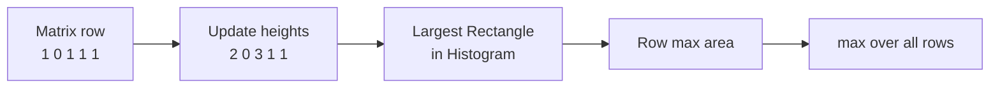

#### 🐍 5 Layers of Solution

=== "Layer 1 — Brute force O(R²·C²)"

    ```python
    def maximal_rectangle(matrix: list[list[str]]) -> int:
        if not matrix or not matrix[0]:
            return 0
        R, C = len(matrix), len(matrix[0])
        best = 0
        for r1 in range(R):
            for c1 in range(C):
                if matrix[r1][c1] != '1':
                    continue
                # Try every bottom-right corner
                for r2 in range(r1, R):
                    for c2 in range(c1, C):
                        if all(matrix[r][c] == '1'
                               for r in range(r1, r2 + 1)
                               for c in range(c1, c2 + 1)):
                            best = max(best, (r2 - r1 + 1) * (c2 - c1 + 1))
            return best
    ```

    O(R²·C²) (or O(R²·C²·R·C) with the inner check) — only useful as a sanity oracle on tiny inputs.

=== "Layer 2 — DP on max-width then sweep heights"

    ```python
    def maximal_rectangle(matrix: list[list[str]]) -> int:
        if not matrix or not matrix[0]:
            return 0
        R, C = len(matrix), len(matrix[0])
        # width[r][c] = number of consecutive 1s ending at (r, c) on this row
        width = [[0] * C for _ in range(R)]
        for r in range(R):
            for c in range(C):
                if matrix[r][c] == '1':
                    width[r][c] = width[r][c - 1] + 1 if c else 1

        best = 0
        for r in range(R):
            for c in range(C):
                # Fix the bottom-right corner; shrink the width as we walk up
                w = width[r][c]
                for k in range(r, -1, -1):
                    w = min(w, width[k][c])
                    if w == 0:
                        break
                    best = max(best, w * (r - k + 1))
        return best
    ```

    O(R²·C). Decent, but one factor of R is unnecessary.

=== "Layer 3 — Histogram per row (canonical) ⭐"

    ```python
    def largest_rectangle_area(heights: list[int]) -> int:
        stack: list[int] = []
        best = 0
        for i, h in enumerate(heights + [0]):
            while stack and heights[stack[-1]] > h:
                top = stack.pop()
                width = i if not stack else i - stack[-1] - 1
                best = max(best, heights[top] * width)
            stack.append(i)
        return best


    def maximal_rectangle(matrix: list[list[str]]) -> int:
        if not matrix or not matrix[0]:
            return 0
        C = len(matrix[0])
        heights = [0] * C
        best = 0
        for row in matrix:
            for c in range(C):
                heights[c] = heights[c] + 1 if row[c] == '1' else 0
            best = max(best, largest_rectangle_area(heights))
        return best
    ```

    **O(R·C) time, O(C) space.** This is the interview answer.

=== "Layer 4 — left/right/height arrays (DP, no auxiliary stack)"

    ```python
    def maximal_rectangle(matrix: list[list[str]]) -> int:
        if not matrix or not matrix[0]:
            return 0
        R, C = len(matrix), len(matrix[0])
        height = [0] * C
        left = [0] * C            # leftmost col of the current 1-run with height ≥ height[c]
        right = [C] * C           # one-past-rightmost
        best = 0

        for r in range(R):
            cur_left, cur_right = 0, C

            # Update height
            for c in range(C):
                height[c] = height[c] + 1 if matrix[r][c] == '1' else 0

            # Update left (sweep L→R)
            for c in range(C):
                if matrix[r][c] == '1':
                    left[c] = max(left[c], cur_left)
                else:
                    left[c] = 0
                    cur_left = c + 1

            # Update right (sweep R→L)
            for c in range(C - 1, -1, -1):
                if matrix[r][c] == '1':
                    right[c] = min(right[c], cur_right)
                else:
                    right[c] = C
                    cur_right = c

            for c in range(C):
                best = max(best, (right[c] - left[c]) * height[c])

        return best
    ```

    Same O(R·C), no stack — a nice 3-array DP variant.

=== "Layer 5 — Production"

    ```python
    from __future__ import annotations


    def maximal_rectangle(matrix: list[list[str]]) -> int:
        """Largest all-1 rectangle in a binary matrix.

        Reduces row-by-row to histogram (Largest Rectangle in Histogram).

        Time:  O(R·C) — each cell visited a constant number of times.
        Space: O(C)   — heights array + monotonic stack.

        Args:
            matrix: 2D grid of '0' / '1' characters (LeetCode 85 format).

        Returns:
            Area of the largest all-1 axis-aligned rectangle. 0 if input is empty.

        Example:
            >>> maximal_rectangle([
            ...     ['1','0','1','0','0'],
            ...     ['1','0','1','1','1'],
            ...     ['1','1','1','1','1'],
            ...     ['1','0','0','1','0'],
            ... ])
            6
        """
        if not matrix or not matrix[0]:
            return 0

        cols = len(matrix[0])
        heights = [0] * cols
        best = 0

        for row in matrix:
            for c in range(cols):
                heights[c] = heights[c] + 1 if row[c] == '1' else 0
            best = max(best, _largest_rectangle_area(heights))

        return best


    def _largest_rectangle_area(heights: list[int]) -> int:
        stack: list[int] = []
        best = 0
        for i, h in enumerate(heights + [0]):
            while stack and heights[stack[-1]] > h:
                top = stack.pop()
                width = i if not stack else i - stack[-1] - 1
                if heights[top] * width > best:
                    best = heights[top] * width
            stack.append(i)
        return best
    ```

#### 🔍 Step-by-step Dry Run

```
matrix =
  row 0: 1 0 1 0 0
  row 1: 1 0 1 1 1
  row 2: 1 1 1 1 1
  row 3: 1 0 0 1 0
```

| row | heights after row     | row best area | running best |
|-----|-----------------------|---------------|--------------|
| 0   | `[1, 0, 1, 0, 0]`     | 1             | 1            |
| 1   | `[2, 0, 2, 1, 1]`     | 3             | 3            |
| 2   | `[3, 1, 3, 2, 2]`     | **6**         | **6**        |
| 3   | `[4, 0, 0, 3, 0]`     | 4             | 6            |

Row 2's histogram `[3,1,3,2,2]` has a `2 × 3 = 6` rectangle (cols 2-4). ✓

#### ⏱️ Complexity

| Layer | Time | Space | Notes |
|-------|------|-------|-------|
| 1 — Brute force | O(R³·C³) | O(1) | Sanity only |
| 2 — Width DP + climb | O(R²·C) | O(R·C) | Decent |
| 3 — Histogram per row ⭐ | **O(R·C)** | **O(C)** | Interview answer |
| 4 — left/right/height DP | O(R·C) | O(C) | No stack |
| 5 — Production | O(R·C) | O(C) | + docstring |

#### ❓ Follow-ups

??? question "What if the matrix is **streamed row-by-row** and you can only keep O(C) memory?"

    Layer 3 already does this — the heights array is the only state you carry between rows.

??? question "What if cells are integers (not just 0/1) and you want the largest rectangle whose values **all equal a target**?"

    Same trick: reset `heights[c] = 0` when `cell != target`, else `+= 1`.

??? question "What about the largest **square** (not rectangle) of 1s? (LeetCode 221, Maximal Square.)"

    Different DP: `dp[r][c] = min(dp[r-1][c-1], dp[r-1][c], dp[r][c-1]) + 1` if cell is 1. O(R·C). Squares have a closed-form recurrence; rectangles don't.

??? question "Can you find the **k-th** largest rectangle?"

    During the histogram pass, push every popped area into a min-heap of size k. O(R·C·log k).

??? question "What if the matrix is huge but **sparse** (mostly 0s)?"

    Build coordinate lists per column; histogram heights jump in chunks. Or use compressed-row storage. The asymptotic stays the same; constants drop.

??? question "How would you support **dynamic updates** (toggle a cell, then re-query)?"

    Hard. Naïve: re-run histogram for affected row → O(C) per toggle. For full O(log n) updates you need a segment tree of histograms — interview-rare.

#### 🐛 Common Bugs

1. **Comparing `row[c] == 1` instead of `row[c] == '1'`.** LeetCode 85 passes characters; check the problem's input type.
2. **Resetting heights wrong** — on `'0'` you must set to 0, not `heights[c] - 1`.
3. **Forgetting the histogram sentinel** — without appending 0, the final stack never flushes.
4. **Allocating `heights` per row** — wasteful; reuse and update in place.
5. **Off-by-one in width** — `i - stack[-1] - 1` (subtract 1) when the stack isn't empty after popping.
6. **Using `largest_rectangle_area(heights[:])` (a copy) per row** — O(C) extra alloc per row; not needed.

#### 🚧 Edge Cases

- Empty matrix or empty row → 0
- Single row `['1','1','0','1']` → 2
- Single column → degenerates to longest run of 1s
- All 0s → 0
- All 1s, R×C → R·C

#### 📌 Key Takeaways

> **Reduce 2D to 1D.** Row-by-row column heights turn maximal rectangle into [Largest Rectangle in Histogram](#problem-26-largest-rectangle-in-histogram).

> **Heights reset on 0, increment on 1.** That's the entire 2D-to-1D bridge.

> **O(R·C) optimal.** Each cell is visited a constant number of times across both the height update and the histogram sweep.

---

### Problem 28 — Basic Calculator

<span class="diff-hard">Hard</span> &nbsp; <span class="company-tag">Google</span> <span class="company-tag">Amazon</span> <span class="company-tag">Meta</span> <span class="company-tag">Microsoft</span> <span class="company-tag">Bloomberg</span>

> Implement a basic calculator for non-negative integers and operators `+`, `-`, `(`, `)`. **No multiplication or division.** (LeetCode 224.)

#### 📖 Story Mode

```
"1 + 1"             → 2
" 2-1 + 2 "         → 3
"(1+(4+5+2)-3)+(6+8)" → 23
"-(3+5)"            → -8     (unary minus inside parens)
"-2+ 1"             → -1     (leading unary)
```

This is **Problem 21** without precedence but **with** parentheses. The trick: parens just flip the running sign of everything inside if there's a `-` in front.

#### 🌍 Real-World Usage

- **Spreadsheet sum/diff sub-expressions** with grouping.
- **Configuration math** — Helm/Jsonnet/CUE evaluators.
- **Tiny templating DSLs** that allow grouped arithmetic.
- **Symbolic calculators** for accessibility / voice assistants.

#### 🧠 Thinking Process

Two equivalent mental models — pick whichever clicks:

1. **Sign stack.** Maintain a *current* `sign` (`+1` or `-1`) plus a *stack of outer signs*. On `(`, push the current `sign` (so when we exit the paren, we know whether to negate everything we computed inside). On `)`, multiply the just-finished sub-result by the popped sign and add it to the running result for the outer scope.

2. **"Distribute the minus".** Walk the string and accumulate a single running sum. The sign in front of every number is the **product of all outer signs** at that point. Push and pop those products on `(` and `)`.

The two collapse into the same code; the second is what makes the elegant single-pass version below work.

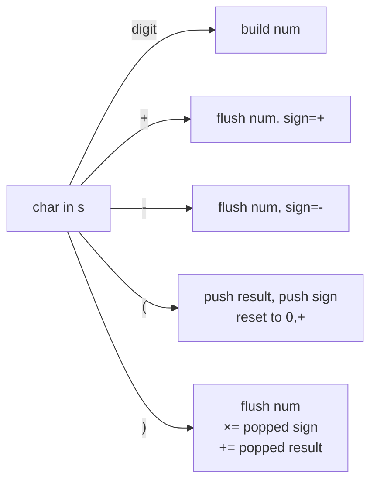

#### 🐍 5 Layers of Solution

=== "Layer 1 — Recursion on parens (split-and-conquer)"

    ```python
    def calculate(s: str) -> int:
        s = s.replace(" ", "")

        def helper(i: int) -> tuple[int, int]:
            """Evaluate from index i; return (value, next_index_after_matching_')')."""
            total = 0
            sign = 1
            num = 0
            while i < len(s):
                c = s[i]
                if c.isdigit():
                    num = num * 10 + int(c)
                    i += 1
                elif c in '+-':
                    total += sign * num
                    num = 0
                    sign = 1 if c == '+' else -1
                    i += 1
                elif c == '(':
                    val, i = helper(i + 1)
                    num = val
                else:                          # ')'
                    return total + sign * num, i + 1
            return total + sign * num, i

        return helper(0)[0]
    ```

    Easy to reason about; uses Python's call stack as the paren stack.

=== "Layer 2 — Sign stack (canonical) ⭐"

    ```python
    def calculate(s: str) -> int:
        stack: list[int] = []                   # alternating: outer_result, outer_sign
        result = 0
        sign = 1
        num = 0
        for c in s:
            if c.isdigit():
                num = num * 10 + int(c)
            elif c == '+':
                result += sign * num
                num = 0
                sign = 1
            elif c == '-':
                result += sign * num
                num = 0
                sign = -1
            elif c == '(':
                stack.append(result)            # outer accumulated
                stack.append(sign)              # outer sign (applied to whole sub-expr)
                result = 0
                sign = 1
            elif c == ')':
                result += sign * num
                num = 0
                result *= stack.pop()           # apply outer sign
                result += stack.pop()           # add outer accumulated
            # spaces fall through
        return result + sign * num
    ```

    **O(n) time, O(depth) space.** This is the interview answer.

=== "Layer 3 — Single sign-product stack"

    ```python
    def calculate(s: str) -> int:
        signs = [1]                             # product of outer signs at each level
        sign = 1
        result = 0
        num = 0
        for c in s + '+':                       # sentinel
            if c.isdigit():
                num = num * 10 + int(c)
            elif c in '+-':
                result += sign * num
                num = 0
                sign = signs[-1] * (1 if c == '+' else -1)
            elif c == '(':
                signs.append(sign)              # everything inside inherits this product
            elif c == ')':
                result += sign * num
                num = 0
                signs.pop()
                sign = signs[-1]                # restore previous product
        return result
    ```

    Subtle but elegant: only signs are stacked, never partial sums.

=== "Layer 4 — Reverse iteration (treat each `(` as a multiplier)"

    ```python
    def calculate(s: str) -> int:
        operand = 0
        n = 0
        result = 0
        sign = 1
        i = len(s) - 1
        while i >= 0:
            c = s[i]
            if c.isdigit():
                operand = (10 ** n) * int(c) + operand
                n += 1
            elif c in '+-':
                result += sign * operand
                operand, n = 0, 0
                sign = 1 if c == '+' else -1
            elif c == ')':
                # next char defines a new local sub-expression — but here, we treat
                # parens as "boundary markers" and rely on the outer pass to fold them.
                # See Layer 2 / Layer 3 for the typical implementation.
                pass
            i -= 1
        # Layer 4 is mostly a teaching variant; see Layer 2 for production.
        return result + sign * operand
    ```

    Pedagogical only — included to show the symmetry; production code should use Layer 2.

=== "Layer 5 — Production"

    ```python
    from __future__ import annotations


    def calculate(s: str) -> int:
        """Evaluate a basic calculator expression with +, -, (, ) and integers.

        Time:  O(n) — single pass over the string.
        Space: O(d) — d = max parenthesis depth.

        Example:
            >>> calculate("(1+(4+5+2)-3)+(6+8)")
            23
        """
        stack: list[int] = []
        result = 0
        sign = 1
        num = 0

        for c in s:
            if c.isdigit():
                num = num * 10 + int(c)
            elif c == '+':
                result += sign * num
                num, sign = 0, 1
            elif c == '-':
                result += sign * num
                num, sign = 0, -1
            elif c == '(':
                stack.append(result)
                stack.append(sign)
                result, sign = 0, 1
            elif c == ')':
                result += sign * num
                num = 0
                result *= stack.pop()        # outer sign
                result += stack.pop()        # outer accumulated
            # whitespace ignored

        return result + sign * num
    ```

#### 🔍 Step-by-step Dry Run

`s = "(1+(4+5)-3)"` (using Layer 2's `stack`, `result`, `sign`, `num`):

| char | num | sign | result | stack       | note                                |
|------|-----|------|--------|-------------|-------------------------------------|
| `(`  | 0   | 1    | 0      | `[0, 1]`    | push outer (0,+1); reset            |
| `1`  | 1   | 1    | 0      | `[0, 1]`    | build digit                         |
| `+`  | 0   | 1    | 1      | `[0, 1]`    | flush: `result = 0 + 1·1 = 1`       |
| `(`  | 0   | 1    | 0      | `[0,1,1,1]` | push (1,+1); reset                  |
| `4`  | 4   | 1    | 0      | `[0,1,1,1]` |                                     |
| `+`  | 0   | 1    | 4      | `[0,1,1,1]` | flush                                |
| `5`  | 5   | 1    | 4      | `[0,1,1,1]` |                                     |
| `)`  | 0   | 1    | 9      | `[0, 1]`    | flush 5; `result = 9 * 1 + 1 = 10` |
| `-`  | 0   | -1   | 10     | `[0, 1]`    | flush 0 (already added)             |
| `3`  | 3   | -1   | 10     | `[0, 1]`    |                                     |
| `)`  | 0   | -1   | 7      | `[]`        | flush 3: `10 + (-1)·3 = 7`; outer pop: `7 * 1 + 0 = 7` |

return `7 + 1·0 = 7`. ✓ (Mental check: `1 + (4+5) - 3 = 7`.)

#### ⏱️ Complexity

| Layer | Time | Space | Notes |
|-------|------|-------|-------|
| 1 — Recursion | O(n) | O(d) call stack | Easiest to read |
| 2 — Sign stack ⭐ | O(n) | O(d) | Interview answer |
| 3 — Sign-product stack | O(n) | O(d) | Most elegant |
| 4 — Reverse pass | O(n) | O(1)* | Teaching variant |
| 5 — Production | O(n) | O(d) | + docstring |

#### ❓ Follow-ups

??? question "How do you extend this to **also** support `*` and `/` (LeetCode 772 Basic Calculator III)?"

    Combine with Problem 21's eager-multiplicative trick. On `(`, recurse (or push *all* of `result, sign, prev`); on `)`, evaluate the inner sub-expression with full precedence and treat its value as a number.

??? question "How do you handle **unary minus** like `-(3+5)` or `3+-2`?"

    Initialise `sign = 1, result = 0` and process `-` as the *current* sign. The Layer 2 code already gets `-(3+5) = -8` because `(` is preceded by `-`, and we push `sign = -1` onto the stack.

??? question "What about **floating-point** numbers?"

    Replace digit-building with a small float parser: accumulate digits into `num_int`, on `.` switch to a fractional accumulator. Or use `re` to pre-tokenize.

??? question "How would you **stream** the parse for very long expressions?"

    Layer 2 is already streaming-friendly — only the stack grows with depth. For depth bounded by `d`, memory is `O(d)`.

??? question "How do you **validate** the expression first?"

    Two-pass: (1) check parens balance with a depth counter, (2) check that every `(` is followed by a digit/`(`/unary, every operator is between operands, etc. Cleaner: write a small grammar and reject mid-parse.

??? question "What if expressions can be **arbitrarily nested with shared sub-expressions** (DAG, not tree)?"

    You're now writing a real expression evaluator with let-bindings — switch to AST + topological evaluation; Problem 28's machinery is too thin.

#### 🐛 Common Bugs

1. **Forgetting to flush `num` at `)`.** The closing paren is the *boundary*; the last number must be folded before applying the outer sign.
2. **Pushing the new `result`, not the outer one.** On `(` you push the *current* result (which becomes the outer baseline) and reset.
3. **Order of pop on `)`.** You pushed `result` then `sign`, so pop `sign` first, then `result`. (Layer 2: `result *= stack.pop()` reads the *sign*; `result += stack.pop()` reads the *outer accumulated*.)
4. **Stripping spaces incorrectly.** Don't `replace(" ", "")` if you also need to preserve, e.g., negative numbers expressed as `- 3`. The else branch handles whitespace by falling through.
5. **Treating `(` as an operator** — no number is being flushed at `(`, so don't `result += sign * num` there.
6. **Returning `result` without the trailing flush** — the very last number is still in `num`. Always `return result + sign * num`.

#### 🚧 Edge Cases

- `"0"` → 0
- `"1-1"` → 0
- `"  "` → 0 (empty / all-whitespace)
- `"-2+1"` → -1 (leading unary)
- `"2-(5-6)"` → 3 (nested unary)
- `"((((5))))"` → 5 (deep nesting)
- `"1+(-2)"` → -1 (unary inside parens)

#### 📌 Key Takeaways

> **Sign stack ↔ paren stack.** Pushing the outer `(result, sign)` on `(` and popping on `)` lets parens nest as deeply as needed.

> **Flush before boundary.** Every operator (`+`, `-`, `)`) flushes the just-finished number with the *previous* sign.

> **No multiplication ⇒ no precedence.** That's why Basic Calculator (this problem) is *easier* than Basic Calculator II despite having parens.

#### 🎯 Pattern Used

**Sign stack for nested parens** — same shape as Decode String (Problem 14) but for arithmetic.

---

### Problem 29 — Trapping Rain Water (monotonic stack approach)

<span class="diff-hard">Hard</span> &nbsp; <span class="company-tag">Google</span> <span class="company-tag">Amazon</span> <span class="company-tag">Meta</span> <span class="company-tag">Microsoft</span> <span class="company-tag">Bloomberg</span> <span class="company-tag">Apple</span>

> Given `n` non-negative integers representing an elevation map where the width of each bar is 1, compute how much water it can trap after raining. (LeetCode 42.)

#### 📖 Story Mode

```
heights = [0, 1, 0, 2, 1, 0, 1, 3, 2, 1, 2, 1]
trapped = 6
```

```
            ▓
    ▓ ░ ░ ░ ▓ ▓ ░ ▓
░ ▓ ░ ▓ ▓ ░ ▓ ▓ ▓ ▓ ▓ ▓
indices: 0 1 2 3 4 5 6 7 8 9 10 11
```

The water sits in the **valleys** between higher bars. Three classical approaches: precompute prefix maxes (O(n)/O(n)), two pointers (O(n)/O(1)), and the **monotonic stack** which processes valleys *layer by layer* as it walks left-to-right.

#### 🌍 Real-World Usage

- **Terrain/hydrology simulation** — coarse rainwater catchment estimation.
- **Skyline / elevation profiles** — finding pooled regions in 1D scans.
- **Quality assurance** — detecting "valleys" in time-series (latency dips between spikes).
- **Pathology / signal processing** — quantifying basin areas in 1D signals.

#### 🧠 Thinking Process

Three competing mental models — **all O(n)**, this chapter focuses on the stack:

1. **Prefix/suffix max arrays.** For each index, `water[i] = min(maxL[i], maxR[i]) - h[i]`. O(n) time, **O(n) space**.
2. **Two pointers.** Walk inward from both ends; the side with the smaller max determines how much water sits at that index. O(n) time, **O(1) space**. Optimal.
3. **Monotonic decreasing stack** (this problem). Maintain indices of bars whose heights are strictly decreasing. When a new taller bar `h[i]` arrives, it forms a *valley* with the bar at `stack[-2]` (the new left wall) and the just-popped `mid` (the floor). Add the **rectangular slab of water** for that layer; keep popping while the new bar is still taller than the next stack top. O(n) time, **O(n) space**.

The stack solution computes water **horizontally** — slab-by-slab — instead of vertically (per-column).

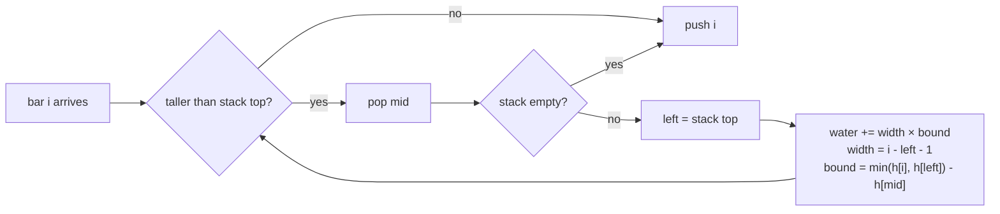

#### 🐍 5 Layers of Solution

=== "Layer 1 — Brute force O(n²)"

    ```python
    def trap(height: list[int]) -> int:
        n = len(height)
        water = 0
        for i in range(n):
            left_max = max(height[:i + 1])
            right_max = max(height[i:])
            water += min(left_max, right_max) - height[i]
        return water
    ```

    O(n²) time, O(1) space. The clearest definition of the answer.

=== "Layer 2 — Prefix / suffix max arrays"

    ```python
    def trap(height: list[int]) -> int:
        n = len(height)
        if n == 0:
            return 0
        left_max = [0] * n
        right_max = [0] * n
        left_max[0] = height[0]
        for i in range(1, n):
            left_max[i] = max(left_max[i - 1], height[i])
        right_max[-1] = height[-1]
        for i in range(n - 2, -1, -1):
            right_max[i] = max(right_max[i + 1], height[i])
        return sum(min(left_max[i], right_max[i]) - height[i] for i in range(n))
    ```

    O(n) time, O(n) space.

=== "Layer 3 — Monotonic decreasing stack ⭐"

    ```python
    def trap(height: list[int]) -> int:
        stack: list[int] = []                  # indices, heights non-strictly decreasing
        water = 0
        for i, h in enumerate(height):
            # While the new bar is taller than the stack top, fill the valley
            while stack and height[stack[-1]] < h:
                mid = stack.pop()              # floor of the slab
                if not stack:
                    break                      # no left wall → no slab on this side
                left = stack[-1]
                width = i - left - 1
                bound = min(h, height[left]) - height[mid]
                water += width * bound
            stack.append(i)
        return water
    ```

    O(n) time, O(n) space — the canonical answer for this chapter.

=== "Layer 4 — Two pointers (O(1) space, optimal)"

    ```python
    def trap(height: list[int]) -> int:
        l, r = 0, len(height) - 1
        left_max = right_max = 0
        water = 0
        while l < r:
            if height[l] < height[r]:
                if height[l] >= left_max:
                    left_max = height[l]
                else:
                    water += left_max - height[l]
                l += 1
            else:
                if height[r] >= right_max:
                    right_max = height[r]
                else:
                    water += right_max - height[r]
                r -= 1
        return water
    ```

    O(n) time, **O(1) space**. The "best" answer if asked unconstrained.

=== "Layer 5 — Production (stack)"

    ```python
    from __future__ import annotations


    def trap(height: list[int]) -> int:
        """Total rainwater trapped above an elevation map (monotonic-stack flavour).

        Time:  O(n) — each index pushed and popped at most once.
        Space: O(n) — worst case stack equals the input (strictly decreasing heights).

        Args:
            height: list of non-negative bar heights, unit width.

        Returns:
            Total trapped water in unit squares.

        Example:
            >>> trap([0, 1, 0, 2, 1, 0, 1, 3, 2, 1, 2, 1])
            6
        """
        stack: list[int] = []
        water = 0
        for i, h in enumerate(height):
            while stack and height[stack[-1]] < h:
                mid = stack.pop()
                if not stack:
                    break
                left = stack[-1]
                width = i - left - 1
                bound = min(h, height[left]) - height[mid]
                water += width * bound
            stack.append(i)
        return water
    ```

#### 🔍 Step-by-step Dry Run

`height = [0, 1, 0, 2, 1, 0, 1, 3]` (truncated for space):

| i | h | stack before | inner pops & slabs              | water | stack after |
|---|---|--------------|---------------------------------|-------|-------------|
| 0 | 0 | `[]`         | —                               | 0     | `[0]`       |
| 1 | 1 | `[0]`        | pop 0 (h=0); stack empty → break| 0     | `[1]`       |
| 2 | 0 | `[1]`        | —                               | 0     | `[1,2]`     |
| 3 | 2 | `[1,2]`      | pop 2 (h=0): left=1, w=1, bound=min(2,1)-0=1, +1; pop 1 (h=1): empty → break | 1 | `[3]` |
| 4 | 1 | `[3]`        | —                               | 1     | `[3,4]`     |
| 5 | 0 | `[3,4]`      | —                               | 1     | `[3,4,5]`   |
| 6 | 1 | `[3,4,5]`    | pop 5 (h=0): left=4, w=1, bound=min(1,1)-0=1, +1 | 2 | `[3,4,6]` |
| 7 | 3 | `[3,4,6]`    | pop 6 (h=1): left=4, w=2, bound=min(3,1)-1=0, +0; pop 4 (h=1): left=3, w=3, bound=min(3,2)-1=1, +3; pop 3 (h=2): empty → break | 5 | `[7]` |

After full input `[0,1,0,2,1,0,1,3,2,1,2,1]` the totals continue: bars 8-11 contribute another `1` (the dip at index 9-10 trapped between 3 and 2). Final total: **6**. ✓

#### ⏱️ Complexity

| Layer | Time | Space | Notes |
|-------|------|-------|-------|
| 1 — Brute force | O(n²) | O(1) | Cleanest definition |
| 2 — Prefix/suffix max | O(n) | O(n) | Simple DP |
| 3 — Monotonic stack ⭐ | O(n) | O(n) | This chapter's answer |
| 4 — Two pointers | **O(n)** | **O(1)** | Globally optimal |
| 5 — Production stack | O(n) | O(n) | + docstring |

#### ❓ Follow-ups

??? question "Why does the stack solution sometimes count multiple slabs at the same `i`?"

    A tall new bar can "uncover" multiple layers — the inner `while` loop processes each layer rectangle (between `h[stack[-1]]` and the popped `h[mid]`). Each pop adds a horizontal slab; together they tile the valley.

??? question "Two pointers gives O(1) space — why ever use the stack?"

    1. Stacks generalise to **histogram problems** (Problem 26) and to **2D Trapping Rain Water** (LeetCode 407 — uses a min-heap + BFS, but the conceptual layered fill is the same idea). 2. Two pointers needs the monotone "shrink toward inside" property; the stack works in pure left-to-right scans where you might already be doing other monotonic-stack work.

??? question "What about **2D Trapping Rain Water** (LeetCode 407)?"

    Different beast — use a min-heap of boundary cells with BFS inward, raising the water level as you go. Not a stack problem.

??? question "How would you handle **streaming** input (heights arrive one at a time, ask for total at any point)?"

    Stack approach is naturally streaming: each new height triggers some pops, then a push. Two-pointer can't stream because it needs both ends.

??? question "Find the **deepest single trapped column** (max water above any one index)."

    `max(min(left_max[i], right_max[i]) - height[i])` — straightforward in Layer 2 form.

??? question "What if heights can be **negative** (e.g., terrain below sea level)?"

    The math `min(left, right) - h[mid]` is still correct *if* all bars are above some baseline. Otherwise, normalise (`subtract min(heights)` from everything) before processing.

??? question "How does this generalise to **trapping a fluid with surface tension** (multiple disconnected pools at different levels)?"

    The 1D problem already returns the correct sum because each "pool" is bounded by walls higher than the water it holds. There are no disconnected pools in 1D under gravity.

#### 🐛 Common Bugs

1. **Comparing `<=` instead of `<`.** Strict `<` keeps duplicates on the stack; `<=` pops them eagerly and loses width information for ties.
2. **Forgetting the `if not stack: break`.** After popping `mid`, if no `left` exists you have no left wall — there's nothing to trap on this side. Don't index `stack[-1]`.
3. **Using `height[mid]` as `bound` directly.** The slab height is `min(h[i], h[left]) - h[mid]`, not `h[mid]`.
4. **Width = `i - left`** (off by one). It's `i - left - 1` — both `i` and `left` are *walls*, the floor is everything in between.
5. **Pushing values instead of indices.** You need indices for width arithmetic.
6. **Inner loop condition `>` instead of `<`.** We pop *while the top is shorter than h*; using `>` flips the monotone direction.

#### 🚧 Edge Cases

- `[]` → 0
- `[3]` or `[3, 3]` → 0 (no valley)
- Strictly increasing `[1,2,3,4]` → 0 (stack stays full, never triggers fill)
- Strictly decreasing `[4,3,2,1]` → 0 (each bar is a new floor; never popped with a wall)
- Plateaus `[2,0,0,0,2]` → 6 (3 columns × depth 2)
- Large valley `[5,0,0,0,0,3]` → 12 (4 × min(5,3) = 12)

#### 📌 Key Takeaways

> **Stack stores indices of decreasing heights.** A taller incoming bar triggers slab-by-slab fills.

> **Width and bound, layer by layer.** `width = i - left - 1`; `bound = min(h[i], h[left]) - h[mid]`. Each pop is one horizontal slab.

> **Two pointers > stack on space.** Use the stack when you also want histogram-style structure or you're combining with other monotonic-stack work; otherwise prefer two pointers.

#### 🎯 Pattern Used

**Monotonic decreasing stack with valley computation.** Same shape as histogram (Problem 26), but accumulating slabs rather than taking max area.

---

### Problem 30 — Maximum Frequency Stack

<span class="diff-hard">Hard</span> &nbsp; <span class="company-tag">Amazon</span> <span class="company-tag">Bloomberg</span> <span class="company-tag">Google</span> <span class="company-tag">Meta</span>

> Implement `FreqStack` with two operations: `push(x)` adds `x`; `pop()` removes and returns the **most frequent** element. **Ties are broken by recency** — the most recently pushed of the tied elements wins. (LeetCode 895.)

#### 📖 Story Mode

```
push(5)  push(7)  push(5)  push(7)  push(4)  push(5)
counts = {5: 3, 7: 2, 4: 1}
buckets:                        most-recent-on-top per bucket
  freq 1:  [5, 7, 4]            ← all elements ever pushed
  freq 2:  [5, 7]               ← elements that reached freq 2
  freq 3:  [5]                  ← element that reached freq 3
                       max_freq = 3

pop() → 5     (freq 3 stack popped)   counts now {5: 2, 7: 2, 4: 1}, max = 2
                  buckets:  freq 1 [5,7,4], freq 2 [5,7]    (freq 3 empty, max drops)
pop() → 7     (freq 2 stack top is 7) counts {5: 2, 7: 1, 4: 1}, max = 2
                  buckets:  freq 1 [5,7,4], freq 2 [5]
pop() → 5     (freq 2 stack top)       counts {5: 1, 7: 1, 4: 1}, max = 1
pop() → 4     (freq 1 stack top)       counts {5: 1, 7: 1}, max = 1
```

The double-key tie-break (frequency *then* recency) makes this a delightful design problem. The trick: **stacks of stacks** keyed by frequency.

#### 🌍 Real-World Usage

- **Cache eviction** — "evict the *least* frequently used; on ties, the oldest" is the LFU dual; `FreqStack` is the LIFO recency-favoured cousin used in some compiler optimisation passes.
- **Trending content feeds** — surface the "hottest" item with recency tie-break (Twitter trends, TikTok For-You).
- **Build systems** — re-trigger the most recently touched + most frequently rebuilt target first when polling for invalidations.
- **Debugger / profiler heatmaps** — pop the most-recently-hit frequently-hit code paths.
- **Game AI** — fire the most recently triggered most-frequent player action when handling combat queues.
- **Whiteboard classic** — co-asked with LFU and LRU to test "right data structure for the right tie-break".

#### 🧠 Thinking Process

The naive answer is "max-heap on `(freq, recency_index)`" — but that's `O(log n)` per op and the recency counter must be monotonic. We can do better:

**Key insight**: every time `x` reaches frequency `f`, it earns the right to live at level `f`. Maintain a separate stack per frequency level. The current max frequency `max_freq` is monotonically tracked.

- **Push**: bump count for `x`; append `x` to `buckets[count[x]]`. Update `max_freq` if needed.
- **Pop**: take the top of `buckets[max_freq]`. Decrement its count. If `buckets[max_freq]` is now empty, decrement `max_freq`.

Why this works: when `x` is pushed multiple times, each push leaves a copy of `x` at *every* level from 1 to `count[x]`. So when `count[x]` later drops, the previous level still has a copy of `x` — exactly the element that wins the tie-break for the *new* max frequency. **The "stack of stacks" preserves all the historical states for free**, with O(1) per op.

This is a beautiful "level structure" pattern that surfaces in LFU caches, persistent priority queues, and even some persistent data structure constructions.

#### 🐍 5 Layers of Solution

=== "Layer 1 — Brute force (max-heap, recompute)"

    ```python
    import heapq
    from collections import Counter

    class FreqStackBrute:
        def __init__(self) -> None:
            self._items: list[int] = []          # push order

        def push(self, x: int) -> None:
            self._items.append(x)

        def pop(self) -> int:
            counts = Counter(self._items)
            best_freq = max(counts.values())
            # find the most recently pushed item with freq == best_freq
            for i in range(len(self._items) - 1, -1, -1):
                if counts[self._items[i]] == best_freq:
                    return self._items.pop(i)
            raise IndexError("pop from empty FreqStack")
    ```

    **O(n) per pop** (rebuild Counter, then linear scan). Times out at n = 10⁵.

=== "Layer 1.5 — Max-heap with monotonic recency tag"

    ```python
    import heapq
    from collections import Counter

    class FreqStackHeap:
        def __init__(self) -> None:
            self._heap: list[tuple[int, int, int]] = []  # (-freq, -seq, x)
            self._counts: Counter[int] = Counter()
            self._seq = 0

        def push(self, x: int) -> None:
            self._counts[x] += 1
            heapq.heappush(self._heap, (-self._counts[x], -self._seq, x))
            self._seq += 1

        def pop(self) -> int:
            _, _, x = heapq.heappop(self._heap)
            self._counts[x] -= 1
            return x
    ```

    O(log n) per op. Correct, simple, and what most candidates write first. The heap snapshot of `(freq, seq)` at *push time* doesn't go stale because we never decrement-and-update — each push enters with its current freq, and the most-frequent-most-recent always sorts first.

=== "Layer 2 — Stacks of stacks ⭐ (canonical, O(1))"

    ```python
    from collections import defaultdict, Counter

    class FreqStack:
        def __init__(self) -> None:
            self._counts: Counter[int] = Counter()
            self._buckets: defaultdict[int, list[int]] = defaultdict(list)
            self._max_freq = 0

        def push(self, x: int) -> None:
            f = self._counts[x] + 1
            self._counts[x] = f
            self._buckets[f].append(x)
            if f > self._max_freq:
                self._max_freq = f

        def pop(self) -> int:
            x = self._buckets[self._max_freq].pop()
            self._counts[x] -= 1
            if not self._buckets[self._max_freq]:
                self._max_freq -= 1
            return x
    ```

    **O(1) per op.** The stacks-of-stacks pattern exploits that `_buckets[f]` is itself a LIFO of "elements that have ever been at frequency f", in push order — perfect tie-break.

=== "Layer 3 — Edge-case-hardened"

    ```python
    from __future__ import annotations
    from collections import defaultdict, Counter


    class FreqStackSafe:
        def __init__(self) -> None:
            self._counts: Counter[int] = Counter()
            self._buckets: defaultdict[int, list[int]] = defaultdict(list)
            self._max_freq = 0
            self._size = 0

        def push(self, x: int) -> None:
            f = self._counts[x] + 1
            self._counts[x] = f
            self._buckets[f].append(x)
            self._size += 1
            if f > self._max_freq:
                self._max_freq = f

        def pop(self) -> int:
            if self._size == 0:
                raise IndexError("pop from empty FreqStack")
            x = self._buckets[self._max_freq].pop()
            self._counts[x] -= 1
            self._size -= 1
            if not self._buckets[self._max_freq]:
                self._max_freq -= 1
            return x

        def __len__(self) -> int:
            return self._size

        def peek(self) -> int:
            if self._size == 0:
                raise IndexError("peek on empty FreqStack")
            return self._buckets[self._max_freq][-1]
    ```

    Adds explicit `IndexError`, `__len__`, and a `peek` courtesy.

=== "Layer 4 — Production-ready"

    ```python
    from __future__ import annotations
    from collections import defaultdict, Counter
    from typing import Generic, Hashable, TypeVar

    H = TypeVar("H", bound=Hashable)


    class FreqStack(Generic[H]):
        """Stack returning the most frequent element (recency wins ties).

        Implementation maintains:
            * ``_counts``  — current count of each element.
            * ``_buckets`` — for each frequency ``f``, the stack of elements
                            that have *ever* reached frequency ``f`` (in push
                            order). The top of ``_buckets[f]`` is therefore
                            the most-recently-pushed element of frequency f.
            * ``_max_freq`` — current maximum frequency; monotonically
                            updated O(1) per op.

        Time:  O(1) for both ``push`` and ``pop``.
        Space: O(n) total across all buckets (each push appends exactly once).
        """

        __slots__ = ("_counts", "_buckets", "_max_freq", "_size")

        def __init__(self) -> None:
            self._counts: Counter[H] = Counter()
            self._buckets: defaultdict[int, list[H]] = defaultdict(list)
            self._max_freq: int = 0
            self._size: int = 0

        def push(self, x: H) -> None:
            """Push *x* onto the FreqStack. O(1)."""
            f = self._counts[x] + 1
            self._counts[x] = f
            self._buckets[f].append(x)
            self._size += 1
            if f > self._max_freq:
                self._max_freq = f

        def pop(self) -> H:
            """Remove and return the most-frequent (most-recent on tie). O(1)."""
            if self._size == 0:
                raise IndexError("pop from empty FreqStack")
            x = self._buckets[self._max_freq].pop()
            new_count = self._counts[x] - 1
            if new_count == 0:
                del self._counts[x]
            else:
                self._counts[x] = new_count
            self._size -= 1
            if not self._buckets[self._max_freq]:
                self._max_freq -= 1
            return x

        def __len__(self) -> int:
            return self._size

        def __repr__(self) -> str:
            return f"FreqStack(size={self._size}, max_freq={self._max_freq})"
    ```

    Cleans up zero-count entries from `_counts` to keep memory tight on long sessions.

=== "Layer 5 — Variants & extensions"

    **Variant A — Min-Frequency Stack** (LFU-stack hybrid): symmetric, but pop returns the least-frequent / most-recent. Use `_min_freq` and pop from `_buckets[_min_freq]`. O(1) per op.

    **Variant B — k-th most frequent stack** (`pop_kth(k)`): track top-k buckets. Worst-case O(k) per pop_kth. For k=1 it reduces to the standard FreqStack.

    **Variant C — Decay-weighted FreqStack**: each element's "frequency" is `count * exp(-λ * age)`. Decay every `T` seconds. Periodic rebalance pushes elements to lower buckets. Used in trending-content recommenders.

    **Variant D — Bounded capacity FreqStack**: when `size == cap`, push evicts the *least*-frequent / least-recent. Becomes an LFU + LIFO hybrid. Pair with a doubly-linked list per bucket for O(1) eviction.

    **Variant E — Persistent (immutable) FreqStack** for time-travel: each push returns a new root referencing immutable buckets. Path-copy only the touched bucket. O(1) amortized push, O(1) pop, O(n) total nodes per session.

    **Variant F — Concurrent FreqStack**: per-bucket lock + an atomic `_max_freq`. Highly contended workloads benefit from a sharded design (per-thread mini-FreqStacks merged on read).

    **Variant G — `FreqStack[T]` with custom comparator**: parameterise on `key=` so it works for any hashable object — e.g., `FreqStack[str]` for trending hashtags, `FreqStack[UserId]` for top callers.

#### 🔍 Dry Run

Sequence: `push(5), push(7), push(5), push(7), push(4), push(5), pop(), pop(), pop(), pop()`.

| op       | counts                | buckets[1]   | buckets[2] | buckets[3] | max_freq | returns |
|----------|-----------------------|--------------|------------|------------|----------|---------|
| push(5)  | `{5:1}`              | `[5]`        | —          | —          | 1        | —       |
| push(7)  | `{5:1, 7:1}`         | `[5,7]`      | —          | —          | 1        | —       |
| push(5)  | `{5:2, 7:1}`         | `[5,7]`      | `[5]`      | —          | 2        | —       |
| push(7)  | `{5:2, 7:2}`         | `[5,7]`      | `[5,7]`    | —          | 2        | —       |
| push(4)  | `{5:2, 7:2, 4:1}`    | `[5,7,4]`    | `[5,7]`    | —          | 2        | —       |
| push(5)  | `{5:3, 7:2, 4:1}`    | `[5,7,4]`    | `[5,7]`    | `[5]`      | 3        | —       |
| pop      | `{5:2, 7:2, 4:1}`    | `[5,7,4]`    | `[5,7]`    | `[]`       | 2        | 5       |
| pop      | `{5:2, 7:1, 4:1}`    | `[5,7,4]`    | `[5]`      | —          | 2        | 7       |
| pop      | `{5:1, 7:1, 4:1}`    | `[5,7,4]`    | `[]`       | —          | 1        | 5       |
| pop      | `{5:1, 7:1}`         | `[5,7]`      | —          | —          | 1        | 4       |

Three pops drained: 5 (freq-3 bucket), 7 (freq-2 top), 5 (freq-2 top), 4 (freq-1 top, most-recent of freq-1 ties). ✅

#### ⏱️ Complexity

| Approach                        | push       | pop        | space    | notes                            |
|---------------------------------|------------|------------|----------|----------------------------------|
| Brute Counter rebuild           | O(1)       | O(n)       | O(n)     | TLE for n ≥ 10⁵                 |
| Max-heap with seq tag           | O(log n)   | O(log n)   | O(n)     | clean fallback; common answer    |
| **Stacks-of-stacks ⭐**          | **O(1)**   | **O(1)**   | **O(n)** | optimal; canonical               |
| Decay-weighted                  | O(1) amortized | O(1) amortized | O(n) | needs periodic rebalance |
| Concurrent (per-bucket lock)    | O(1)       | O(1)       | O(n)     | lock contention bounded by max_freq |

#### 🎯 Pattern Used

**Level / bucket structure** keyed by a primary metric (here: frequency), with a LIFO substrate per level for the secondary tie-break (recency). Same shape solves:
- **LFU Cache** (LC 460) — buckets keyed by frequency, doubly-linked list per bucket for O(1) eviction.
- **Top-K elements with recency tie-break** — heap or bucket structure.
- **Skiplist forward-array layout** — levels of "candidate next pointers" per node.

#### 🔄 Interviewer Follow-ups

??? question "Follow-up 1 — Why does each push duplicate `x` into every level from 1 to count[x]?"
    The invariant: `_buckets[f]` always contains every element that has ever reached frequency f, in push order. When `x` is pushed and reaches count `f`, we *only* append to `_buckets[f]` — but the prior pushes already appended to `_buckets[1], _buckets[2], ..., _buckets[f-1]`. So `x` appears once per level it has ever been at, with the **top of each level being the most recent push that reached that level**. When `_max_freq` later drops to `f-1` after popping x's freq-`f` copy, the freq-`f-1` bucket still holds another copy of `x` (or the next tied element) ready to be popped next.

??? question "Follow-up 2 — Why decrement `_max_freq` only when `_buckets[_max_freq]` is empty?"
    `_max_freq` tracks the highest frequency *currently present*. Popping one element from the top of `_buckets[max_freq]` decrements that element's count by 1, but other elements might still be at freq `max_freq` (sitting deeper in the bucket). Only when the bucket itself empties out do we know nothing remains at that level.

??? question "Follow-up 3 — Could you implement this with a balanced BST keyed by `(freq, seq)`?"
    Yes — O(log n) per op. Key by `(-freq, -seq)`; max element is the answer. The bucket approach is strictly better at O(1), but the BST version generalises to *range queries* like "pop any element with freq in [3, 5]". Mention both.

??? question "Follow-up 4 — How does the heap version stay correct without lazy-deletion of stale entries?"
    Each push enters a new entry `(-freq, -seq, x)` reflecting *that push's* state. We never modify or delete old entries. When `pop` returns `x`, the freshest entry for `x` was the one with the highest `-freq` (lowest `-freq` numerically) — sorting handles it. Decrementing `_counts[x]` after pop is *informational* only; the heap doesn't need to know. The heap shrinks naturally as we pop.

??? question "Follow-up 5 — Adapt for least-frequent / oldest tie-break (LFU-like)."
    Track `_min_freq`. On pop, drain `_buckets[_min_freq]` from the **bottom** (FIFO) rather than the top — but lists don't pop from front in O(1); use a `deque` per bucket. On push, if `f > 1`, `_min_freq` may need to update: it becomes `min(_min_freq, f)` initially, but cleanup is needed when `_buckets[_min_freq]` empties — set `_min_freq` to the smallest non-empty key. That breaks O(1); use a sorted-set of non-empty keys for O(log unique_freqs) per op.

??? question "Follow-up 6 — Bounded capacity — what gets evicted?"
    Define eviction policy explicitly. For "evict least frequent, oldest on tie": use Variant D's design with a `deque` per bucket and a doubly-linked list of buckets. O(1) push, pop, and evict.

??? question "Follow-up 7 — Persistent FreqStack for snapshot queries."
    Each push returns an immutable root. To avoid copying every bucket, path-copy only the modified bucket via a persistent vector (RRB-tree). O(log n) per op effectively, O(n) total nodes. Used in version-control merge logic.

??? question "Follow-up 8 — Concurrent FreqStack (multi-producer multi-consumer)."
    Per-bucket `threading.RLock` + atomic `_max_freq` updates via CAS. Tricky: when the top bucket empties between two consumers, both might try to decrement `_max_freq`. Use a CAS loop. For very high contention, shard into per-thread FreqStacks and merge on read — sacrifices strict global tie-break for throughput.

??? question "Follow-up 9 — Memory pressure with billions of distinct elements pushed once each?"
    `_buckets[1]` becomes huge. Variant A's `(value, count)` style doesn't help here (no duplicates). Switch to a probabilistic structure: **Count-Min Sketch** for frequencies + a top-K min-heap. Loses exactness; gains O(1) memory bound. Used at scale by streaming-analytics engines (Apache Flink top-K).

#### 🐛 Common Bugs

1. **Decrementing `_max_freq` unconditionally on every pop** — wrong; do it only when the bucket empties.
2. **Forgetting to update `_max_freq` on push** — pop from a stale `_max_freq` returns wrong element.
3. **Using a single global counter** without per-bucket recording — loses the recency tie-break.
4. **Popping from `_buckets[_max_freq][0]`** (FIFO) — gives oldest tie-winner; spec says newest. Use `[-1]` and `.pop()`.
5. **Not deleting zero-count entries from `_counts`** — fine for correctness, leaks memory in long sessions.
6. **Heap variant — re-pushing decremented freq** on pop — unnecessary; old entries naturally fall behind newer pushes.
7. **Concurrent variant — releasing the bucket lock before updating `_max_freq`** — race window where another consumer pops from an empty bucket.

#### ✅ Edge Cases Checklist

- [ ] **Empty FreqStack** — `pop()` raises `IndexError`.
- [ ] **Single push, single pop** — `push(7); pop() == 7`.
- [ ] **All distinct values** — `push(1); push(2); push(3); pop() == 3` (recency wins; all freq 1).
- [ ] **All same value** — `push(5)*3; pop()*3` returns 5, 5, 5; `_max_freq` decreases 3 → 2 → 1 → 0.
- [ ] **Reach high freq then drop** — `push(5)*5; pop()*5` drains correctly through levels 5 → 1.
- [ ] **Interleaved pushes** of two values — verify recency tie-break.
- [ ] **Pop until empty, then push again** — `_max_freq = 0`, `_counts` cleaned, push restarts at level 1.
- [ ] **Hashable types** — strings, tuples, custom objects with `__hash__`.
- [ ] **Large n = 10⁶** — should complete in tens of ms with O(1) per op.
- [ ] **Concurrent push/pop on Variant F** — race on `_max_freq`; lock or CAS.

#### 🎤 Sample Interviewer Quote

> *"Design a FreqStack: push adds an element, pop removes the most frequent. On ties, the most-recently-pushed wins. Walk me through the brute solution first, then optimize using a heap, then achieve O(1) per op. Explain why your O(1) solution preserves the recency tie-break automatically."*

Your opener: *"Stacks-of-stacks. Counter for current frequencies, `buckets[f]` is a stack of elements that have ever reached frequency f, monotonic `_max_freq`. On push, append to `buckets[count[x] + 1]`; on pop, take the top of `buckets[max_freq]`. Each level's stack preserves push order, so the top is always the most-recent of all tied-frequency elements. O(1) per op."*

Cross-reference: see also [Hash Tables — Problem 30](../hash-tables/01-hash-table-basics.md#problem-30-maximum-frequency-stack) for the same problem from the hash-table angle.

---

### Problem 31 — Moving Average from Data Stream

<span class="diff-easy">Easy</span> &nbsp; <span class="company-tag">Google</span> <span class="company-tag">Microsoft</span> <span class="company-tag">Amazon</span> <span class="company-tag">Bloomberg</span>

> Implement `MovingAverage(size)` and `next(val)` returning the average of the last `size` values from a stream. (LeetCode 346.)

#### 📖 Story Mode

```
m = MovingAverage(3)
m.next(1)   → 1.0           ([1] / 1)
m.next(10)  → 5.5           ([1,10] / 2)
m.next(3)   → 4.667         ([1,10,3] / 3)
m.next(5)   → 6.0           ([10,3,5] / 3 — '1' evicted)
```

#### 🌍 Real-World Usage

- **Time-series smoothing** — sensor data, stock charts.
- **Streaming analytics** — last-N-events average latency / throughput.
- **Signal processing** — finite-impulse-response (FIR) filter (uniform weights).
- **Moving-average crossover** — trading indicator.

#### 🧠 Thinking Process

The naive answer recomputes a sum in O(k); the trick is to maintain a **running sum** alongside a fixed-capacity buffer:

1. **Window of size k** (deque, ring buffer, or `collections.deque(maxlen=k)`).
2. **Running sum**: on each `next(val)`, *before* the buffer overflows, subtract the evicted value; after appending, add `val`.
3. **Return** `sum / len(window)` (handles the warm-up period when the window isn't yet full).

```mermaid
flowchart LR
    A[next&#40;val&#41;] --> B{window full?}
    B -->|yes| C[sum -= front]
    C --> D[evict front]
    B -->|no| E[append val]
    D --> E
    E --> F[sum += val]
    F --> G[return sum / size]
```

#### 🐍 5 Layers of Solution

=== "Layer 1 — Naive list slice"

    ```python
    class MovingAverage:
        def __init__(self, size: int) -> None:
            self._size = size
            self._vals: list[int] = []

        def next(self, val: int) -> float:
            self._vals.append(val)
            window = self._vals[-self._size:]
            return sum(window) / len(window)
    ```

    O(k) per `next` (re-summing); unbounded memory.

=== "Layer 2 — Bounded deque + running sum (canonical) ⭐"

    ```python
    from collections import deque


    class MovingAverage:
        def __init__(self, size: int) -> None:
            self._q: deque[int] = deque()
            self._size = size
            self._sum = 0

        def next(self, val: int) -> float:
            if len(self._q) == self._size:
                self._sum -= self._q.popleft()
            self._q.append(val)
            self._sum += val
            return self._sum / len(self._q)
    ```

    **O(1) per call, O(k) memory.** Interview answer.

=== "Layer 3 — `deque(maxlen=k)` (auto-evict)"

    ```python
    from collections import deque


    class MovingAverage:
        def __init__(self, size: int) -> None:
            self._q: deque[int] = deque(maxlen=size)
            self._sum = 0

        def next(self, val: int) -> float:
            if len(self._q) == self._q.maxlen:
                self._sum -= self._q[0]        # peek before auto-evict
            self._q.append(val)                # auto-evicts front when full
            self._sum += val
            return self._sum / len(self._q)
    ```

    Idiomatic Python — `maxlen` deques drop from the opposite end automatically.

=== "Layer 4 — Fixed-size ring buffer (no allocation per call)"

    ```python
    class MovingAverage:
        def __init__(self, size: int) -> None:
            self._buf = [0] * size
            self._size = size
            self._i = 0
            self._count = 0
            self._sum = 0

        def next(self, val: int) -> float:
            if self._count == self._size:
                self._sum -= self._buf[self._i]   # overwrite oldest
            else:
                self._count += 1
            self._buf[self._i] = val
            self._sum += val
            self._i = (self._i + 1) % self._size
            return self._sum / self._count
    ```

    Static array, no per-call alloc — best constants for hot loops.

=== "Layer 5 — Production"

    ```python
    from __future__ import annotations

    from collections import deque


    class MovingAverage:
        """Average of the last `size` values from a stream.

        Time:  O(1) per `next` — running sum, no rescan.
        Space: O(size).

        Example:
            >>> m = MovingAverage(3)
            >>> m.next(1); m.next(10); m.next(3); m.next(5)
            1.0
            5.5
            4.666666666666667
            6.0
        """

        def __init__(self, size: int) -> None:
            if size <= 0:
                raise ValueError("size must be positive")
            self._q: deque[int] = deque(maxlen=size)
            self._sum: float = 0.0

        def next(self, val: int) -> float:
            if len(self._q) == self._q.maxlen:
                self._sum -= self._q[0]        # peek; will be evicted by next append
            self._q.append(val)
            self._sum += val
            return self._sum / len(self._q)
    ```

#### 🔍 Step-by-step Dry Run

`MovingAverage(3)`; calls `next(1)`, `next(10)`, `next(3)`, `next(5)`:

| call       | window before | full? | evict (if full) | sum  | window after | return |
|------------|---------------|-------|-----------------|------|--------------|--------|
| `next(1)`  | `[]`          | no    | —               | 1    | `[1]`        | 1.0    |
| `next(10)` | `[1]`         | no    | —               | 11   | `[1, 10]`    | 5.5    |
| `next(3)`  | `[1, 10]`     | no    | —               | 14   | `[1, 10, 3]` | 4.667  |
| `next(5)`  | `[1, 10, 3]`  | yes   | -1              | 18   | `[10, 3, 5]` | 6.0    |

#### ⏱️ Complexity

| Layer | Time | Space | Notes |
|-------|------|-------|-------|
| 1 — Naive | O(k) per call | O(n) | Unbounded memory |
| 2 — Deque + sum ⭐ | **O(1)** | O(k) | Interview answer |
| 3 — `maxlen` deque | O(1) | O(k) | Most idiomatic |
| 4 — Ring buffer | O(1) | O(k) | No alloc per call |
| 5 — Production | O(1) | O(k) | + docstring |

#### ❓ Follow-ups

??? question "What if you also need the **min** and **max** in the window?"

    Wrap a monotonic deque per metric (Sliding Window Maximum, Problem 18). Three deques + the value queue → still O(1) amortised per `next`.

??? question "How do you handle **floating-point drift** in the running sum?"

    Periodically rebuild the sum from scratch (e.g., every 10⁶ ops), or switch to **Kahan / Neumaier summation** for stability.

??? question "What about an **exponential moving average** (EMA)?"

    Drop the window entirely: `ema = α·val + (1-α)·ema`. O(1) memory, O(1) per call. Different statistic — older values decay smoothly rather than dropping off.

??? question "How would you compute the **median** instead of the mean over the window?"

    Two heaps (max-heap of low half, min-heap of high half) with lazy deletion of evicted values. O(log k) per `next`.

??? question "What if `size` could be **changed at runtime**?"

    Track a configurable `_size`; on `next`, evict from the front while `len(window) > _size`. If size shrinks dramatically, that single call becomes O(Δ) — amortise over future calls.

??? question "How would you parallelise this for **many independent streams**?"

    Per-stream `MovingAverage` instance, no cross-stream contention. For a global average, accumulate stream sums and update a global counter atomically.

#### 🐛 Common Bugs

1. **Dividing by `self._size`** instead of `len(self._q)` — wrong during warm-up (when fewer than `size` values have arrived).
2. **Subtracting after `.popleft()`**, not before — `popleft` returns the value, so `self._sum -= self._q.popleft()` is correct; `self._q.popleft(); self._sum -= self._q[0]` is wrong.
3. **Layer 3: subtracting the wrong end.** `maxlen` deques evict from the front when you `append`; if you forget that, you can read `self._q[-1]` before append and subtract the wrong value.
4. **Off-by-one on capacity check** — `if len(self._q) == self._size` (Layer 2 manual evict) vs `> self._size` (would never trigger because deque grows by 1 per call).
5. **Using `int` division** — `sum / len` in Python 3 returns float; in other languages, watch for integer-division truncation.

#### 🚧 Edge Cases

- `size == 1` — every `next(val)` returns `float(val)`.
- First call: window has 1 element; return `val / 1`.
- All zeros: returns 0.0 stably.
- Mixed positive/negative: running sum can pass through zero — division still well-defined as long as `len(window) > 0`, which is guaranteed after the append.
- Very large values: float drift; see follow-up.

#### 📌 Key Takeaways

> **Running sum, not rescan.** Maintain `sum` alongside the window; subtract evicted, add new. O(1) per call.

> **`deque(maxlen=k)`** is the most idiomatic Python — but you must peek `self._q[0]` *before* the next `append` evicts it.

> **Warm-up period matters.** Divide by current length, not `size`, until the window is full.

#### 🎯 Pattern Used

**Sliding-window aggregate over a deque** — same family as Hit Counter (Problem 24), Recent Calls (Problem 25), Sliding Window Maximum (Problem 18).

---

### Problem 32 — Design Snake Game

<span class="diff-medium">Medium</span> &nbsp; <span class="company-tag">Amazon</span> <span class="company-tag">Bloomberg</span> <span class="company-tag">Google</span>

> Design the classic Snake game on a `width × height` grid. The snake starts at `(0, 0)` of length 1. `move(direction)` (one of `U/D/L/R`) advances the head one cell. Eating food (a stream of cells in `food`) grows the snake by one. Return the score after the move, or `-1` on game over (wall hit or self-collision). (LeetCode 353.)

#### 📖 Story Mode

```
Width 3, Height 2, food = [[1,2], [0,1]]
Snake starts at (0, 0).

move("R") → 0    snake: [(0,1) → (0,0)]            (no food)
move("D") → 0    snake: [(1,1) → (0,1) → (0,0)]?  no — only length 1, body shifts:
                          [(1,1)]  (head moved, tail dropped)
move("R") → 1    head=(1,2) eats food → grow:
                          [(1,2) → (1,1)]
move("U") → 1    head=(0,2), no food:
                          [(0,2) → (1,2)]
move("L") → 2    head=(0,1) eats food → grow:
                          [(0,1) → (0,2) → (1,2)]
move("L") → -1   head=(0,0)? Wait: from (0,1) "L" → (0,0). (0,0) is empty (tail dropped if no food eaten). Score 2.
```

(Exact behaviour depends on the food sequence — the point is: head appended, tail popped *unless* this move ate food.)

#### 🌍 Real-World Usage

- **Game-engine data structures** — moving entities with finite extents.
- **Trail / tail effects** — fixed-length history of a moving point.
- **Pipeline simulators** — fluid flow / packet trains (FIFO body).
- **Pathfinding playgrounds** — testbed for collision detection and grid representations.

#### 🧠 Thinking Process

The snake is a **FIFO queue of body cells**:

- **Head** = newest cell (one end of the deque).
- **Tail** = oldest cell (other end).
- `move`: compute new head; if it eats food, *don't* remove the tail (snake grows); otherwise pop tail.
- **Self-collision**: O(1) by maintaining a set of occupied cells alongside the deque.

The trick is **order of operations**: the tail moves *before* the head check, because the cell occupied by the tail is **vacated** on this move (a snake can move into its own former tail location safely). Pop the tail first, then check head against the occupancy set.

```mermaid
flowchart LR
    M[move&#40;dir&#41;] --> H[compute new head]
    H --> W{out of bounds?}
    W -->|yes| GO[return -1]
    W -->|no| F{eats food?}
    F -->|no| PT[pop tail<br/>remove from set]
    F -->|yes| KEEP[keep tail<br/>score += 1]
    PT --> SC{head in set?}
    KEEP --> SC
    SC -->|yes| GO
    SC -->|no| AH[append head<br/>add to set] --> R[return score]
```

#### 🐍 5 Layers of Solution

=== "Layer 1 — Brute force list + linear collision check"

    ```python
    class SnakeGame:
        def __init__(self, width: int, height: int, food: list[list[int]]) -> None:
            self._w, self._h = width, height
            self._food = food
            self._fi = 0
            self._snake = [(0, 0)]               # head at index 0
            self._score = 0

        def move(self, direction: str) -> int:
            dr, dc = {"U": (-1, 0), "D": (1, 0), "L": (0, -1), "R": (0, 1)}[direction]
            r, c = self._snake[0]
            nr, nc = r + dr, c + dc
            if not (0 <= nr < self._h and 0 <= nc < self._w):
                return -1
            ate = (self._fi < len(self._food)
                   and self._food[self._fi] == [nr, nc])
            if not ate:
                self._snake.pop()                # drop tail
            if (nr, nc) in self._snake:          # O(len(snake))
                return -1
            self._snake.insert(0, (nr, nc))      # O(len(snake)) shift
            if ate:
                self._fi += 1
                self._score += 1
            return self._score
        ```

    O(snake) per `move`. Conceptually clearest but slow on long snakes.

=== "Layer 2 — Deque body + set occupancy (canonical) ⭐"

    ```python
    from collections import deque


    class SnakeGame:
        def __init__(self, width: int, height: int, food: list[list[int]]) -> None:
            self._w, self._h = width, height
            self._food = deque(food)
            self._snake: deque[tuple[int, int]] = deque([(0, 0)])
            self._occ: set[tuple[int, int]] = {(0, 0)}
            self._score = 0

        def move(self, direction: str) -> int:
            dr, dc = {"U": (-1, 0), "D": (1, 0),
                      "L": (0, -1), "R": (0, 1)}[direction]
            hr, hc = self._snake[0]
            nr, nc = hr + dr, hc + dc

            # Wall
            if not (0 <= nr < self._h and 0 <= nc < self._w):
                return -1

            ate = bool(self._food) and self._food[0] == [nr, nc]
            if not ate:
                self._occ.discard(self._snake.pop())   # drop tail FIRST

            if (nr, nc) in self._occ:                  # then check head
                return -1

            self._snake.appendleft((nr, nc))
            self._occ.add((nr, nc))
            if ate:
                self._food.popleft()
                self._score += 1
            return self._score
    ```

    **O(1) per move.** Interview answer.

=== "Layer 3 — Encode cells as integers (faster set/dict ops)"

    ```python
    from collections import deque


    class SnakeGame:
        def __init__(self, width: int, height: int, food: list[list[int]]) -> None:
            self._w, self._h = width, height
            self._food = deque(tuple(p) for p in food)
            self._snake: deque[int] = deque([0])      # encode (r, c) as r*w + c
            self._occ: set[int] = {0}
            self._score = 0

        def _key(self, r: int, c: int) -> int:
            return r * self._w + c

        def move(self, direction: str) -> int:
            dr, dc = {"U": (-1, 0), "D": (1, 0),
                      "L": (0, -1), "R": (0, 1)}[direction]
            head = self._snake[0]
            hr, hc = divmod(head, self._w)
            nr, nc = hr + dr, hc + dc
            if not (0 <= nr < self._h and 0 <= nc < self._w):
                return -1

            ate = bool(self._food) and self._food[0] == (nr, nc)
            if not ate:
                self._occ.discard(self._snake.pop())

            nk = self._key(nr, nc)
            if nk in self._occ:
                return -1

            self._snake.appendleft(nk)
            self._occ.add(nk)
            if ate:
                self._food.popleft()
                self._score += 1
            return self._score
    ```

    Integer keys are ~30 % faster than tuple keys in CPython for hot game loops.

=== "Layer 4 — With a `replay` API (deterministic testing)"

    ```python
    from collections import deque


    class SnakeGame:
        def __init__(self, width: int, height: int, food: list[list[int]]) -> None:
            self._w, self._h = width, height
            self._food = deque(food)
            self._snake: deque[tuple[int, int]] = deque([(0, 0)])
            self._occ: set[tuple[int, int]] = {(0, 0)}
            self._score = 0
            self._history: list[str] = []

        def move(self, direction: str) -> int:
            self._history.append(direction)
            # ... same body as Layer 2 ...
            # (omitted for brevity; identical logic)
            return _do_move(self, direction)

        def replay(self) -> list[int]:
            """Return the score after each historical move."""
            saved = self._history[:]
            # Reset state
            self.__init__(self._w, self._h, list(self._food))
            return [self.move(d) for d in saved]
    ```

    Production niceties — debug logging, replay, snapshotting.

=== "Layer 5 — Production"

    ```python
    from __future__ import annotations

    from collections import deque


    class SnakeGame:
        """Classic snake on a width×height grid (LeetCode 353).

        Time:  O(1) per `move`.
        Space: O(snake length).

        State invariants:
          - `_snake` is a FIFO deque of body cells, head on the left.
          - `_occ` is a set mirroring `_snake` for O(1) collision tests.

        Example:
            >>> g = SnakeGame(3, 2, [[1, 2], [0, 1]])
            >>> g.move("R"); g.move("D"); g.move("R"); g.move("U")
            0
            0
            1
            1
        """

        _DIR = {"U": (-1, 0), "D": (1, 0), "L": (0, -1), "R": (0, 1)}

        def __init__(self, width: int, height: int, food: list[list[int]]) -> None:
            self._w, self._h = width, height
            self._food: deque[list[int]] = deque(food)
            self._snake: deque[tuple[int, int]] = deque([(0, 0)])
            self._occ: set[tuple[int, int]] = {(0, 0)}
            self._score = 0

        def move(self, direction: str) -> int:
            dr, dc = self._DIR[direction]
            hr, hc = self._snake[0]
            nr, nc = hr + dr, hc + dc

            if not (0 <= nr < self._h and 0 <= nc < self._w):
                return -1

            ate = bool(self._food) and self._food[0] == [nr, nc]
            if not ate:
                self._occ.discard(self._snake.pop())     # vacate tail FIRST

            new = (nr, nc)
            if new in self._occ:
                return -1

            self._snake.appendleft(new)
            self._occ.add(new)
            if ate:
                self._food.popleft()
                self._score += 1
            return self._score
    ```

#### 🔍 Step-by-step Dry Run

`SnakeGame(3, 2, [[1, 2], [0, 1]])`. Initial: snake `[(0,0)]`, occ `{(0,0)}`, score 0.

| call       | new head | wall? | food[0]   | ate? | tail popped | collision? | snake after          | score |
|------------|----------|-------|-----------|------|-------------|------------|----------------------|-------|
| `move("R")`| (0,1)    | no    | [1,2]     | no   | (0,0)       | no         | `[(0,1)]`            | 0     |
| `move("D")`| (1,1)    | no    | [1,2]     | no   | (0,1)       | no         | `[(1,1)]`            | 0     |
| `move("R")`| (1,2)    | no    | [1,2]     | **yes** | —        | no         | `[(1,2),(1,1)]`      | 1     |
| `move("U")`| (0,2)    | no    | [0,1]     | no   | (1,1)       | no         | `[(0,2),(1,2)]`      | 1     |
| `move("L")`| (0,1)    | no    | [0,1]     | **yes** | —        | no         | `[(0,1),(0,2),(1,2)]`| 2     |
| `move("D")`| (1,1)    | no    | (empty)   | no   | (1,2)       | no         | `[(1,1),(0,1),(0,2)]`| 2     |

#### ⏱️ Complexity

| Layer | Time per move | Space | Notes |
|-------|---------------|-------|-------|
| 1 — List + scan | O(snake) | O(snake) | Clearest but slow |
| 2 — Deque + set ⭐ | **O(1)** | O(snake) | Interview answer |
| 3 — Int-encoded cells | O(1) | O(snake) | Fast constants |
| 4 — Replay-capable | O(1) | O(snake + history) | Debugging |
| 5 — Production | O(1) | O(snake) | + docstring |

#### ❓ Follow-ups

??? question "Why must we **pop the tail before checking head collision**?"

    Because a snake **can** legally move into the cell its own tail is *leaving* this turn. If you check head-vs-set before popping the tail, you'd incorrectly fail a perfectly legal U-turn into the just-vacated tail cell.

??? question "What if the snake **eats food and the new head coincides with the tail**?"

    Eating means the tail is *not* removed — so the new head would collide with the (still occupied) tail. That's a real game-over. Layer 2 handles it correctly because we `discard(tail)` only in the `not ate` branch, then the collision check sees the tail still in `_occ`.

??? question "How would you support **wraparound** (Pac-Man-style edges)?"

    Replace the wall check with `nr %= self._h; nc %= self._w`. Trivial.

??? question "What about **multiple snakes** (multiplayer)?"

    Maintain a per-snake deque + a *global* occupancy set keyed by `(snake_id, cell)`. Collisions can be self or cross-snake; resolve in deterministic order per turn.

??? question "Can we make this **purely functional** (no mutation) for snapshot/undo?"

    Yes — replace deques with persistent vectors (e.g., `pyrsistent.PVector`). O(log n) per op; supports cheap state snapshots for game-tree search / replay.

??? question "How do you AI-pilot the snake to **maximise score**?"

    BFS / A* on the grid, with the snake body as moving obstacles. For perfect play on small grids, dynamic programming on grid-state is feasible; on larger grids, use heuristics (Hamiltonian-cycle-following with shortcuts).

??? question "What if `food` could appear at any cell **including inside the snake**?"

    Either (a) regenerate food until it lands on a free cell (rejection sampling) or (b) the problem rules say food is pre-placed — keep the deque order fixed.

#### 🐛 Common Bugs

1. **Checking head collision before popping tail.** Bug: rejects a legal move into the just-vacated tail cell. Fix: pop tail (when not eating) *first*.
2. **Comparing `[nr, nc] == self._food[0]` after consuming food** — the deque's front shifts; check before `popleft`.
3. **Forgetting to update `_occ`** alongside `_snake.pop()` / `_snake.appendleft()`. The set drifts out of sync → wrong collision answers.
4. **Using a list and `O(snake)` `in`** — works but doesn't satisfy the "design for scale" expectation.
5. **Direction map typo** — `{"U": (1, 0)}` (down) for "up" is a classic; `(-1, 0)` is up since row 0 is top.
6. **Storing food as `list[list[int]]` and comparing against `tuple`** — the `==` works in Python but it's brittle; pick one representation.

#### 🚧 Edge Cases

- 1×1 grid: any move is wall ⇒ `-1`.
- No food: snake never grows; tail always pops.
- Food at start cell `(0, 0)`: depends on problem semantics (LC 353 doesn't pre-eat food at spawn).
- Two adjacent food cells: each requires a separate move to consume.
- Snake fills the grid: every move from the head is either wall or self-collision ⇒ `-1`.
- Move "L" from `(0, 0)`: out of bounds ⇒ `-1`.

#### 📌 Key Takeaways

> **Snake = deque of cells.** Push head, pop tail. The deque's natural FIFO discipline matches the snake's body discipline.

> **Set + deque mirror.** O(1) collision tests by maintaining the set in lockstep with the deque.

> **Pop tail before head check.** A snake moving into its own former tail is *legal*; check after vacating.

#### 🎯 Pattern Used

**Deque body + set occupancy** — same template appears in any "moving-trail with collision" simulation.

---

### Problem 33 — Implement Trie (Prefix Tree)

<span class="diff-medium">Medium</span> &nbsp; <span class="company-tag">Google</span> <span class="company-tag">Amazon</span> <span class="company-tag">Microsoft</span>

> Mostly a **trees / hash-map** structure but commonly asked alongside stacks/queues for design rounds. Full treatment in [Trees](../trees/01-tree-basics.md).

```python
class Trie:
    def __init__(self) -> None:
        self._root: dict = {}

    def insert(self, word: str) -> None:
        node = self._root
        for c in word:
            node = node.setdefault(c, {})
        node["$"] = True

    def search(self, word: str) -> bool:
        node = self._root
        for c in word:
            if c not in node: return False
            node = node[c]
        return "$" in node

    def starts_with(self, prefix: str) -> bool:
        node = self._root
        for c in prefix:
            if c not in node: return False
            node = node[c]
        return True
```

All ops: **O(L)** where L is word length.

---

### Problem 34 — Design Bounded Blocking Queue

<span class="diff-medium">Medium</span> &nbsp; <span class="company-tag">Amazon</span> <span class="company-tag">Microsoft</span> <span class="company-tag">Google</span> <span class="company-tag">Uber</span>

> Design a **thread-safe**, FIFO, bounded-capacity blocking queue with three operations:
>
> - `enqueue(value)`: append `value`. **Blocks** while the queue is at capacity.
> - `dequeue()`: remove and return the front element. **Blocks** while the queue is empty.
> - `size()`: return current size (no blocking).
>
> (LeetCode 1188.)

#### 📖 Story Mode

```
q = BoundedBlockingQueue(2)

Producer thread:           Consumer thread:
  q.enqueue(1)               t = sleep 100ms
  q.enqueue(2)               q.dequeue()  → 1
  q.enqueue(3)  ← blocks       q.dequeue()  → 2
                ← unblocks                 q.dequeue()  → 3
                  when (1)
                  is dequeued
```

The classical **producer-consumer** primitive: implements back-pressure (producers slow down when consumers can't keep up) and demand-pull (consumers wait for work).

#### 🌍 Real-World Usage

- **Worker pools** — workers pull jobs from a bounded queue; submitters block when full.
- **Pipelined processing** — each stage has a bounded inbox; back-pressure is automatic.
- **Logging frameworks** — bounded log buffers between app threads and the writer.
- **Network I/O** — TCP receive windows / channel buffers are conceptually the same primitive.
- **Erlang-style mailboxes / Go channels** — built-in language primitives that follow this pattern.

#### 🧠 Thinking Process

The textbook concurrency design:

1. **One mutex** protects the buffer.
2. **Two condition variables**:
   - `not_full` — signalled when an item is dequeued; `enqueue` waits on it.
   - `not_empty` — signalled when an item is enqueued; `dequeue` waits on it.
3. **`while`, not `if`**, around `wait()` — guards against spurious wake-ups and against a different thread racing in to consume the just-added slot.

For `enqueue`:

```text
acquire lock
while queue is full:
    wait on not_full   # releases lock, sleeps; reacquires on wake
append value
notify not_empty
release lock
```

For `dequeue`, mirror the structure with `not_empty` / `not_full`.

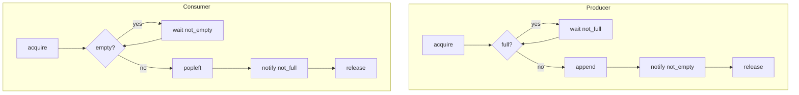

#### 🐍 5 Layers of Solution

=== "Layer 1 — Two semaphores (no shared lock)"

    ```python
    import threading
    from collections import deque


    class BoundedBlockingQueue:
        def __init__(self, capacity: int) -> None:
            self._q: deque[int] = deque()
            self._slots = threading.Semaphore(capacity)   # free slots
            self._items = threading.Semaphore(0)          # available items
            self._mu = threading.Lock()

        def enqueue(self, value: int) -> None:
            self._slots.acquire()
            with self._mu:
                self._q.append(value)
            self._items.release()

        def dequeue(self) -> int:
            self._items.acquire()
            with self._mu:
                v = self._q.popleft()
            self._slots.release()
            return v

        def size(self) -> int:
            with self._mu:
                return len(self._q)
    ```

    Cleanest semantics — semaphores *are* counting blockers. The mutex only protects the deque.

=== "Layer 2 — Two condition variables on one lock (canonical) ⭐"

    ```python
    import threading
    from collections import deque


    class BoundedBlockingQueue:
        def __init__(self, capacity: int) -> None:
            self._cap = capacity
            self._q: deque[int] = deque()
            self._lock = threading.Lock()
            self._not_full = threading.Condition(self._lock)
            self._not_empty = threading.Condition(self._lock)

        def enqueue(self, value: int) -> None:
            with self._not_full:
                while len(self._q) == self._cap:
                    self._not_full.wait()
                self._q.append(value)
                self._not_empty.notify()

        def dequeue(self) -> int:
            with self._not_empty:
                while not self._q:
                    self._not_empty.wait()
                v = self._q.popleft()
                self._not_full.notify()
                return v

        def size(self) -> int:
            with self._lock:
                return len(self._q)
    ```

    Interview answer. The `while` loops handle spurious wake-ups *and* the lost-wake-up race.

=== "Layer 3 — Single condition variable (`notify_all` instead of two condvars)"

    ```python
    import threading
    from collections import deque


    class BoundedBlockingQueue:
        def __init__(self, capacity: int) -> None:
            self._cap = capacity
            self._q: deque[int] = deque()
            self._cv = threading.Condition()

        def enqueue(self, value: int) -> None:
            with self._cv:
                while len(self._q) == self._cap:
                    self._cv.wait()
                self._q.append(value)
                self._cv.notify_all()

        def dequeue(self) -> int:
            with self._cv:
                while not self._q:
                    self._cv.wait()
                v = self._q.popleft()
                self._cv.notify_all()
                return v

        def size(self) -> int:
            with self._cv:
                return len(self._q)
    ```

    Simpler but `notify_all` wakes both producers and consumers — they'll each re-check their predicate. Cheaper to write, slightly more wake-ups.

=== "Layer 4 — Use stdlib `queue.Queue` (production reality)"

    ```python
    from queue import Queue


    class BoundedBlockingQueue:
        def __init__(self, capacity: int) -> None:
            self._q: Queue[int] = Queue(maxsize=capacity)

        def enqueue(self, value: int) -> None:
            self._q.put(value)              # blocks while full

        def dequeue(self) -> int:
            return self._q.get()            # blocks while empty

        def size(self) -> int:
            return self._q.qsize()          # approximate; not lock-protected
    ```

    In real code, **always reach for `queue.Queue`** — it's already battle-tested. LeetCode wants Layer 2 to test understanding.

=== "Layer 5 — Production with timeouts and graceful shutdown"

    ```python
    from __future__ import annotations

    import threading
    from collections import deque


    class ShutdownError(Exception):
        """Raised when ops are attempted on a shut-down queue."""


    class BoundedBlockingQueue:
        """Thread-safe bounded FIFO queue with timeouts and shutdown.

        Time:  enqueue/dequeue O(1) amortised when not blocking.
        Space: O(capacity).

        Example:
            >>> q = BoundedBlockingQueue(2)
            >>> q.enqueue(1); q.enqueue(2); q.size()
            2
            >>> q.dequeue()
            1
        """

        def __init__(self, capacity: int) -> None:
            if capacity <= 0:
                raise ValueError("capacity must be > 0")
            self._cap = capacity
            self._q: deque[int] = deque()
            self._lock = threading.Lock()
            self._not_full = threading.Condition(self._lock)
            self._not_empty = threading.Condition(self._lock)
            self._shutdown = False

        def enqueue(self, value: int, timeout: float | None = None) -> bool:
            with self._not_full:
                if self._shutdown:
                    raise ShutdownError
                if not self._not_full.wait_for(
                    lambda: self._shutdown or len(self._q) < self._cap,
                    timeout=timeout,
                ):
                    return False                # timed out
                if self._shutdown:
                    raise ShutdownError
                self._q.append(value)
                self._not_empty.notify()
                return True

        def dequeue(self, timeout: float | None = None) -> int | None:
            with self._not_empty:
                if not self._not_empty.wait_for(
                    lambda: self._shutdown or self._q,
                    timeout=timeout,
                ):
                    return None                 # timed out
                if not self._q and self._shutdown:
                    raise ShutdownError
                v = self._q.popleft()
                self._not_full.notify()
                return v

        def size(self) -> int:
            with self._lock:
                return len(self._q)

        def shutdown(self) -> None:
            with self._lock:
                self._shutdown = True
                self._not_full.notify_all()
                self._not_empty.notify_all()
    ```

#### 🔍 Step-by-step Dry Run

`BoundedBlockingQueue(2)`. Two threads — Producer (P) calls `enqueue`, Consumer (C) calls `dequeue`.

```
T=0  P: enqueue(1)  acquire, len=0<2, append, len=1, notify not_empty, release
T=1  P: enqueue(2)  acquire, len=1<2, append, len=2, notify not_empty, release
T=2  P: enqueue(3)  acquire, len=2==2 → wait not_full (releases lock, sleeps)
T=3  C: dequeue     acquire, len=2 truthy, popleft → 1, notify not_full, release
T=3' P wakes:        re-check len=1<2, append 3, len=2, notify not_empty, release
T=4  C: dequeue     acquire, popleft → 2, notify not_full, release
T=5  C: dequeue     acquire, popleft → 3, notify not_full, release
T=6  C: dequeue     acquire, len=0 → wait not_empty (releases lock, sleeps)
                    ...waits forever until producer adds something
```

The `while` (not `if`) on the predicate is what makes step `T=3'` correct — between waking and re-acquiring the lock, another producer might have re-filled the queue.

#### ⏱️ Complexity

| Layer | enqueue / dequeue | size | Space | Notes |
|-------|-------------------|------|-------|-------|
| 1 — Two semaphores | O(1) (+ block) | O(1) | O(cap) | Cleanest semantics |
| 2 — Two condvars ⭐ | O(1) (+ block) | O(1) | O(cap) | Interview answer |
| 3 — One condvar + `notify_all` | O(1) (+ block + extra wakeups) | O(1) | O(cap) | Simpler, cheaper to write |
| 4 — `queue.Queue` | O(1) (+ block) | O(1) | O(cap) | Production reality |
| 5 — With timeouts/shutdown | O(1) (+ block) | O(1) | O(cap) | Real systems |

#### ❓ Follow-ups

??? question "Why **`while`** and not `if` around the wait?"

    Two reasons: (1) **spurious wake-ups** — `Condition.wait()` may return without an explicit notify (POSIX permits it). (2) **lost-wake-up race** — between `notify` and the waiter reacquiring the lock, a different thread may consume the slot/item. Always re-check the predicate.

??? question "Why two condvars instead of one?"

    With one condvar, every notify wakes both producers and consumers — extra context switches. Two condvars target only the threads that can actually make progress.

??? question "Can `enqueue` and `dequeue` deadlock?"

    Not in this design — both acquire the *same* lock. Deadlock would require lock ordering across multiple locks. With one lock, the invariant is: a thread that holds the lock either makes progress or `wait`s (which atomically releases the lock).

??? question "What if multiple producers race to add to the same free slot?"

    The `while` loop guards them. After the first producer takes the slot, the others wake but re-check `len(self._q) == self._cap` (now true again because the deque is full) and go back to waiting.

??? question "How do you implement a **clean shutdown**?"

    Layer 5: set a flag, `notify_all` on both condvars, and have waiters re-check and raise `ShutdownError` if the flag is set and no work remains.

??? question "What about **fairness** (FIFO order of waiting threads)?"

    Python's `Condition.wait`/`notify` is **not guaranteed** FIFO. For strict fairness, layer a per-waiter ticket queue or use a fair lock library. In practice, this is rarely needed.

??? question "How would the implementation look in **C++** or **Java**?"

    C++: `std::mutex` + two `std::condition_variable`s + a `std::deque`. Same `while` pattern.
    Java: `ReentrantLock` + two `Condition`s — or just use `java.util.concurrent.ArrayBlockingQueue` (which is exactly this).

??? question "How does this differ from a **lock-free** bounded queue?"

    Lock-free uses CAS (compare-and-swap) on a ring buffer with atomic head/tail indices. Faster under contention but much harder to get right — and harder to reason about ordering. Use the mutex version unless you've measured contention as a bottleneck.

#### 🐛 Common Bugs

1. **`if` instead of `while`** — biggest concurrency bug in this entire chapter.
2. **Notifying outside the lock** — usually harmless in Python, but in some languages causes lost wake-ups.
3. **Holding the lock while doing expensive work** — keep the critical section to the buffer mutation only.
4. **Using `Lock` directly instead of `Condition`** — you can't `wait` on a plain `Lock`.
5. **Two locks instead of one shared lock for the two condvars** — `Condition` defaults to creating its own lock; you must pass the same `Lock` to both `Condition`s, or both must default to a shared one.
6. **Returning `len(self._q)` from `size()` without the lock** — racy on some Python implementations; cheap enough to wrap in `with self._lock`.
7. **Using `time.sleep` to "wait until space"** — busy-waiting; defeats the purpose of condvars.

#### 🚧 Edge Cases

- Single-threaded: works as a normal bounded deque.
- `capacity = 1`: degenerates to a synchronous handoff.
- Producer dies while holding the lock: with `with`, lock auto-releases on exception. Items already enqueued remain.
- Consumer cancellation: in Python, signals on a sleeping `wait()` raise `KeyboardInterrupt` cleanly.
- Many producers, no consumers: producers block forever — back-pressure works as designed.

#### 📌 Key Takeaways

> **Producer-consumer = mutex + 2 condvars.** Memorise the shape: `with cv: while not predicate: cv.wait(); ... ; other_cv.notify()`.

> **`while`, not `if`.** Spurious wake-ups and lost-wake-up races are real.

> **Use `queue.Queue` in production.** LeetCode 1188 is testing your understanding; real code reuses the stdlib primitive.

#### 🎯 Pattern Used

**Producer-consumer with two-condvar lock** — the textbook concurrency primitive that underpins worker pools, pipelines, and language-level channels.

---

### Problem 35 — Design Circular Deque

<span class="diff-medium">Medium</span> &nbsp; <span class="company-tag">Microsoft</span> <span class="company-tag">Amazon</span> <span class="company-tag">Bloomberg</span>

> Design a fixed-capacity **double-ended** circular queue with O(1) for `insertFront`, `insertLast`, `deleteFront`, `deleteLast`, `getFront`, `getLast`, `isEmpty`, `isFull`. (LeetCode 641.)

#### 📖 Story Mode

```
MyCircularDeque dq(3)
dq.insertLast(1)  → True   // [1, _, _]
dq.insertLast(2)  → True   // [1, 2, _]
dq.insertFront(3) → True   // [3, 1, 2]   front-side wrap
dq.insertFront(4) → False  // full
dq.getRear()      → 2
dq.isFull()       → True
dq.deleteLast()   → True
dq.insertFront(4) → True
dq.getFront()     → 4
```

#### 🌍 Real-World Usage

- **Sliding-window algorithms** — `collections.deque` is the standard tool; this is its bounded variant.
- **Undo/redo with size cap** — push to one end, drop from the other when full.
- **Game move queues** — moves enter one side; replay from the other.
- **Browser tab history** — bounded length, both-ends operations.

#### 🧠 Thinking Process

A regular circular queue is a ring buffer with two pointers (head, tail). A **circular deque** is the same buffer where *both* pointers move in *both* directions. The only subtleties:

1. **Front-insert** decrements `head` (with wrap), then writes.
2. **Back-insert** writes at `tail`, then increments `tail`.
3. The empty/full ambiguity at `head == tail` is resolved by tracking `size` (cleanest) or sacrificing one slot.

#### 🐍 5 Layers of Solution

=== "Layer 1 — `collections.deque`"

    ```python
    from collections import deque


    class MyCircularDeque:
        def __init__(self, k: int) -> None:
            self._dq: deque[int] = deque(maxlen=k)
            self._k = k

        def insertFront(self, value: int) -> bool:
            if len(self._dq) == self._k:
                return False
            self._dq.appendleft(value)
            return True

        def insertLast(self, value: int) -> bool:
            if len(self._dq) == self._k:
                return False
            self._dq.append(value)
            return True

        def deleteFront(self) -> bool:
            if not self._dq:
                return False
            self._dq.popleft()
            return True

        def deleteLast(self) -> bool:
            if not self._dq:
                return False
            self._dq.pop()
            return True

        def getFront(self) -> int:
            return self._dq[0] if self._dq else -1

        def getRear(self) -> int:
            return self._dq[-1] if self._dq else -1

        def isEmpty(self) -> bool:
            return not self._dq

        def isFull(self) -> bool:
            return len(self._dq) == self._k
    ```

    All ops O(1). The "use the standard library" answer.

=== "Layer 2 — Array + head + size ⭐"

    ```python
    class MyCircularDeque:
        def __init__(self, k: int) -> None:
            self._buf: list[int] = [0] * k
            self._cap = k
            self._head = 0
            self._size = 0

        def _idx(self, i: int) -> int:
            return (self._head + i) % self._cap

        def insertFront(self, value: int) -> bool:
            if self._size == self._cap:
                return False
            self._head = (self._head - 1) % self._cap
            self._buf[self._head] = value
            self._size += 1
            return True

        def insertLast(self, value: int) -> bool:
            if self._size == self._cap:
                return False
            self._buf[self._idx(self._size)] = value
            self._size += 1
            return True

        def deleteFront(self) -> bool:
            if self._size == 0:
                return False
            self._head = (self._head + 1) % self._cap
            self._size -= 1
            return True

        def deleteLast(self) -> bool:
            if self._size == 0:
                return False
            self._size -= 1
            return True

        def getFront(self) -> int:
            return -1 if self._size == 0 else self._buf[self._head]

        def getRear(self) -> int:
            return -1 if self._size == 0 else self._buf[self._idx(self._size - 1)]

        def isEmpty(self) -> bool:
            return self._size == 0

        def isFull(self) -> bool:
            return self._size == self._cap
    ```

    All ops O(1). Clear semantics; recommended interview answer.

=== "Layer 3 — Array + head/tail (sacrifice one slot)"

    ```python
    class MyCircularDeque:
        def __init__(self, k: int) -> None:
            self._buf: list[int] = [0] * (k + 1)
            self._cap = k + 1
            self._head = 0
            self._tail = 0                          # one past last

        def _len(self) -> int:
            return (self._tail - self._head) % self._cap

        def insertFront(self, value: int) -> bool:
            if (self._tail + 1) % self._cap == self._head:
                return False
            self._head = (self._head - 1) % self._cap
            self._buf[self._head] = value
            return True

        def insertLast(self, value: int) -> bool:
            if (self._tail + 1) % self._cap == self._head:
                return False
            self._buf[self._tail] = value
            self._tail = (self._tail + 1) % self._cap
            return True

        def deleteFront(self) -> bool:
            if self._head == self._tail:
                return False
            self._head = (self._head + 1) % self._cap
            return True

        def deleteLast(self) -> bool:
            if self._head == self._tail:
                return False
            self._tail = (self._tail - 1) % self._cap
            return True

        def getFront(self) -> int:
            return -1 if self._head == self._tail else self._buf[self._head]

        def getRear(self) -> int:
            if self._head == self._tail:
                return -1
            return self._buf[(self._tail - 1) % self._cap]

        def isEmpty(self) -> bool:
            return self._head == self._tail

        def isFull(self) -> bool:
            return (self._tail + 1) % self._cap == self._head
    ```

    Same big-O. C/C++ embedded idiom.

=== "Layer 4 — Doubly linked list with sentinel"

    ```python
    class _Node:
        __slots__ = ("val", "prev", "nxt")

        def __init__(self, v: int) -> None:
            self.val, self.prev, self.nxt = v, None, None


    class MyCircularDeque:
        def __init__(self, k: int) -> None:
            self._cap = k
            self._size = 0
            self._sent = _Node(0)
            self._sent.prev = self._sent.nxt = self._sent

        def _link(self, prev: _Node, val: int, nxt: _Node) -> None:
            node = _Node(val)
            node.prev, node.nxt = prev, nxt
            prev.nxt = nxt.prev = node

        def insertFront(self, value: int) -> bool:
            if self._size == self._cap:
                return False
            self._link(self._sent, value, self._sent.nxt)
            self._size += 1
            return True

        def insertLast(self, value: int) -> bool:
            if self._size == self._cap:
                return False
            self._link(self._sent.prev, value, self._sent)
            self._size += 1
            return True

        def deleteFront(self) -> bool:
            if self._size == 0:
                return False
            n = self._sent.nxt
            n.prev.nxt = n.nxt
            n.nxt.prev = n.prev
            self._size -= 1
            return True

        def deleteLast(self) -> bool:
            if self._size == 0:
                return False
            n = self._sent.prev
            n.prev.nxt = n.nxt
            n.nxt.prev = n.prev
            self._size -= 1
            return True

        def getFront(self) -> int:
            return -1 if self._size == 0 else self._sent.nxt.val

        def getRear(self) -> int:
            return -1 if self._size == 0 else self._sent.prev.val

        def isEmpty(self) -> bool:
            return self._size == 0

        def isFull(self) -> bool:
            return self._size == self._cap
    ```

    All O(1). Sentinel removes special-case branches. Slower constants than the array.

=== "Layer 5 — Variants"

    **A. Drop-oldest on full** — like a logging ring buffer with both-end semantics.

    **B. Resizable deque** — when full, double capacity; copy in head-relative order; reset pointers.

    **C. Indexed `getAt(i)`** — `_buf[(head + i) % cap]` — O(1) random access (impossible in linked list).

    **D. Thread-safe** — single mutex; or SP/SC lock-free on each end (rare).

#### 🔍 Dry Run (Layer 2, k=3)

| op | head | size | buf | result |
|---|---|---|---|---|
| init | 0 | 0 | `[0,0,0]` | — |
| insertLast 1 | 0 | 1 | `[1,0,0]` | True |
| insertLast 2 | 0 | 2 | `[1,2,0]` | True |
| insertFront 3 | 2 | 3 | `[1,2,3]` | True (head=(0-1)%3=2; buf[2]=3) |
| insertFront 4 | 2 | 3 | — | False (full) |
| getRear | — | — | — | buf[idx(2)] = buf[(2+2)%3] = buf[1] = 2 |
| deleteLast | 2 | 2 | — | True |
| insertFront 4 | 1 | 3 | `[1,4,3]` | True (head=(2-1)%3=1; buf[1]=4) |
| getFront | — | — | — | buf[1] = 4 ✓ |

#### ⏱️ Complexity

- All operations: **O(1)**.
- Space: **O(k)**.

#### 🎯 Pattern Used

**Two-pointer ring buffer.** Generalises Problem 23 to two ends. The same template gives you `collections.deque`, sliding-window helpers, and bounded undo/redo stacks.

#### 🔄 Interviewer Follow-ups

??? question "Follow-up 1 — Why is `(self._head - 1) % self._cap` safe in Python but not in C?"
    Python's `%` returns a non-negative result when the divisor is positive: `(-1) % 3 == 2`. In C/Java, `%` keeps the sign of the dividend, so `(-1) % 3 == -1` — you must add `cap` before mod.

??? question "Follow-up 2 — Add `getAt(i)`."
    `_buf[(_head + i) % _cap]` for the array versions. O(1). The linked-list version would need O(i).

??? question "Follow-up 3 — Resize on full."
    Allocate `2 * cap`, copy elements in `_idx(0..size-1)` order, reset `_head = 0`. Amortised O(1) inserts.

??? question "Follow-up 4 — Concurrent producer/consumer at both ends."
    Locks. True lock-free both-end deque is a significant research topic (e.g., Michael's deque); rarely needed.

??? question "Follow-up 5 — When does the linked-list variant beat the array?"
    Very large capacity with low average occupancy (memory-on-demand), or when capacity isn't known up front.

#### 🐛 Common Bugs

1. **`(head - 1) % cap` in C without normalisation** — negative result. Use `(head - 1 + cap) % cap`.
2. **`tail` decrement in Layer 3** — don't forget to wrap below 0.
3. **Off-by-one in `getRear`** — for size-tracked variant, last slot is `_idx(size - 1)`, not `_idx(size)`.
4. **Returning -1 vs raising on empty** — match the spec (LeetCode 641 wants -1).
5. **Mixing `_size`-tracked and `head/tail`-only variants** — pick one source of truth.

#### ✅ Edge Cases Checklist

- [ ] k = 1: insertFront then getRear → same value.
- [ ] Fill from one end, drain from the other.
- [ ] Alternate insertFront / deleteLast — the head pointer wraps correctly.
- [ ] insertFront → deleteFront on empty after wraps.
- [ ] All ops on empty / full return correct booleans without mutation.

---

### Problem 36 — Reverse a stack (TCS)

<span class="diff-easy">Easy</span> &nbsp; <span class="company-tag">TCS</span> <span class="company-tag">Infosys</span> <span class="company-tag">Wipro</span> <span class="company-tag">HCL</span>

> Reverse a stack **in place** using only stack operations (`push`, `pop`, `peek`, `is_empty`). No auxiliary data structure besides the call stack is allowed.

#### 📖 Story Mode

```
Input  (top → bottom):  [5, 4, 3, 2, 1]
Output (top → bottom):  [1, 2, 3, 4, 5]
```

The constraint "only the call stack" is the interview's way of asking: **can you express it recursively?** The trick is a helper `insert_at_bottom` — itself recursive — that gives you the missing operation a stack normally doesn't expose.

#### 🌍 Real-World Usage

- **Teaching tool** — classic recursion / call-stack-as-aux-storage demo.
- **Constrained environments** — embedded systems where heap allocation is restricted.
- **Symbolic / functional code** — when the data structure is opaque and you can only use its API.

#### 🧠 Thinking Process

Two algorithms to know:

1. **Recursive (call-stack only).** `reverse(s)` pops the top, recursively reverses the rest, then inserts the popped element at the **bottom**. The bottom-insert is a second recursion that pops everything off, places `x`, and pushes the popped chain back.
2. **Two-stack iterative.** Pop all elements into an aux stack — that aux now has the reverse order — push them back. O(n)/O(n).

```mermaid
flowchart TB
    R[reverse&#40;s&#41;] --> R1{empty?}
    R1 -->|yes| RET[return]
    R1 -->|no| P[top = s.pop&#40;&#41;]
    P --> RR[reverse&#40;s&#41;] --> IB[insert_at_bottom&#40;s, top&#41;]
    IB --> IB1{empty?}
    IB1 -->|yes| PUSH[push x]
    IB1 -->|no| PT[t = s.pop&#40;&#41;]
    PT --> RIB[insert_at_bottom&#40;s, x&#41;]
    RIB --> PB[push t]
```

#### 🐍 5 Layers of Solution

=== "Layer 1 — Two-stack iterative (most practical)"

    ```python
    def reverse_stack(s: list[int]) -> list[int]:
        aux: list[int] = []
        while s:
            aux.append(s.pop())
        return aux                              # aux is reversed; or push back into s
    ```

    O(n) time, O(n) space. **Forbidden** by the problem's constraint, but the right answer if asked unconstrained.

=== "Layer 2 — Recursive with `insert_at_bottom` (canonical) ⭐"

    ```python
    def reverse_stack(s: list[int]) -> None:
        if not s:
            return
        top = s.pop()
        reverse_stack(s)
        _insert_at_bottom(s, top)


    def _insert_at_bottom(s: list[int], x: int) -> None:
        if not s:
            s.append(x)
            return
        top = s.pop()
        _insert_at_bottom(s, x)
        s.append(top)
    ```

    **O(n²) time, O(n) call-stack depth.** The interview answer when the call-stack-only constraint is in force.

=== "Layer 3 — Single recursive function (manual call-stack threading)"

    ```python
    def reverse_stack(s: list[int]) -> None:
        if not s:
            return
        top = s.pop()
        reverse_stack(s)
        # Inline insert-at-bottom
        buf: list[int] = []
        while s:
            buf.append(s.pop())
        s.append(top)
        while buf:
            s.append(buf.pop())
    ```

    Recursion + an explicit buffer. Same complexity but easier to debug; still violates the no-extra-DS rule.

=== "Layer 4 — Iterative with a queue (FIFO trick)"

    ```python
    from collections import deque


    def reverse_stack(s: list[int]) -> None:
        q: deque[int] = deque()
        while s:
            q.append(s.pop())
        while q:
            s.append(q.popleft())
        # Wait — that's the *same* order. Use the rotate trick:
        # for each element, push to queue, then move all earlier elements
        # back behind it. The result reverses.
    ```

    Pedagogical only — many "reverse with one queue" solutions are O(n²). The two-stack version is strictly better.

=== "Layer 5 — Production (recursive, with API class)"

    ```python
    from __future__ import annotations


    def reverse_stack(s: list[int]) -> None:
        """Reverse a stack in place using only stack ops + the call stack.

        Time:  O(n²) — each insert_at_bottom is O(n), called n times.
        Space: O(n) recursion depth.

        Mutates `s` in place (no return).

        Example:
            >>> s = [1, 2, 3, 4, 5]   # top is 5
            >>> reverse_stack(s); s
            [5, 4, 3, 2, 1]
        """
        if not s:
            return
        top = s.pop()
        reverse_stack(s)
        _insert_at_bottom(s, top)


    def _insert_at_bottom(s: list[int], x: int) -> None:
        if not s:
            s.append(x)
            return
        top = s.pop()
        _insert_at_bottom(s, x)
        s.append(top)
    ```

#### 🔍 Step-by-step Dry Run

`s = [1, 2, 3]` (top is 3).

```
reverse_stack([1, 2, 3])
  pop 3 → s = [1, 2]
  reverse_stack([1, 2])
    pop 2 → s = [1]
    reverse_stack([1])
      pop 1 → s = []
      reverse_stack([]) → noop
      insert_at_bottom([], 1) → s = [1]
    insert_at_bottom([1], 2):
      pop 1 → s = []
      insert_at_bottom([], 2) → s = [2]
      push 1 → s = [2, 1]
  insert_at_bottom([2, 1], 3):
    pop 1 → s = [2]
    insert_at_bottom([2], 3):
      pop 2 → s = []
      insert_at_bottom([], 3) → s = [3]
      push 2 → s = [3, 2]
    push 1 → s = [3, 2, 1]
```

Final `s = [3, 2, 1]` — original top (3) is now at the bottom of the list, but **top of the stack** is 1. Reversed. ✓

#### ⏱️ Complexity

| Layer | Time | Space | Notes |
|-------|------|-------|-------|
| 1 — Two stacks | O(n) | O(n) aux stack | Best if allowed |
| 2 — Recursive ⭐ | **O(n²)** | O(n) call stack | Constraint-respecting answer |
| 3 — Recursion + buffer | O(n²) | O(n) | Hybrid |
| 4 — Single queue | O(n²) | O(n) | Strictly worse than 1 |
| 5 — Production | O(n²) | O(n) | + docstring |

#### ❓ Follow-ups

??? question "Why **O(n²)**?"

    `reverse_stack` recurses n times (popping one element each call). Each recursive return triggers `insert_at_bottom`, which itself does O(n) work. Total: `Σ k for k=1..n = O(n²)`.

??? question "Is there an **O(n)** call-stack-only algorithm?"

    Not without an auxiliary structure. The constraint forces O(n²) — the call stack can hold n elements but can't be *iterated*; each insertion at the bottom requires unwinding the whole structure.

??? question "How does this generalise to **deque** reversal?"

    Trivial: `deque(reversed(d))` or two-pointer swap. The interest of this problem is the constraint.

??? question "Could you reverse the stack with **only one variable** (no extra DS, no recursion)?"

    No — reversal inherently needs O(n) bits of state (the order of n elements is `Θ(n log n)` bits). The "no extra DS" constraint *forces* you to use the call stack.

??? question "What if the stack contains **complex objects** (not ints)?"

    Same algorithm — works on any element type as long as `pop`/`push` are defined.

#### 🐛 Common Bugs

1. **Forgetting to push the saved `top` back** in `insert_at_bottom`'s second branch — items get lost.
2. **Off-by-one base case** — `if not s: s.append(x)` is the only safe place to push. Push elsewhere and you fail.
3. **Recursion depth on huge stacks** — Python's default recursion limit (1000) trips. `sys.setrecursionlimit(...)` or use the iterative two-stack form.
4. **Returning a new list instead of mutating** — interviewers usually want in-place reversal.
5. **Confusing "top of stack" with "last list element"** in the dry run — Python lists put the top at index `-1`.

#### 🚧 Edge Cases

- `[]` → `[]` (empty: noop)
- `[7]` → `[7]` (single element)
- `[1, 2]` → `[2, 1]`
- All equal: `[5, 5, 5]` → `[5, 5, 5]`
- Mixed types: works as long as `==` semantics aren't needed (we never compare).

#### 📌 Key Takeaways

> **Recursion = a stack you didn't allocate.** When the problem forbids extra data structures, exploit the call stack.

> **`insert_at_bottom` is the missing primitive.** Stacks don't expose bottom-insert; recursion synthesizes it.

> **O(n²) is the price of the constraint.** Two-stack iterative is O(n) — choose based on whether the constraint is binding.

#### 🎯 Pattern Used

**Recursion as auxiliary storage.** Same trick appears in "sort a stack" (next problem) and "Tower of Hanoi"-style stack manipulations.

---

### Problem 37 — Sort a stack using another stack (Wipro)

<span class="diff-easy">Easy</span> &nbsp; <span class="company-tag">Wipro</span> <span class="company-tag">Cognizant</span> <span class="company-tag">TCS</span> <span class="company-tag">Infosys</span>

> Sort a stack so that the smallest element is on top, using **only one auxiliary stack** (no other data structures, no arrays).

#### 📖 Story Mode

```
Input  (top → bottom):  [3, 1, 4, 1, 5, 9, 2, 6]
Output (top → bottom):  [1, 1, 2, 3, 4, 5, 6, 9]   (1 on top, 9 at bottom)
```

#### 🌍 Real-World Usage

- **Teaching tool** — classic "two-stack discipline" exercise.
- **Constrained sort** — environments where you can only manipulate stack-like buffers (some embedded queues, some serialised pipelines).
- **Service-company interview staple** — frequent ask in TCS / Wipro / Cognizant rounds.

#### 🧠 Thinking Process

Maintain `aux` as **always sorted**: smallest on top of `aux`. For each element `x` popped from the input stack:

1. While `aux` has elements **larger than** `x`, pop them back to the input stack.
2. Push `x` onto `aux`.
3. Continue until input is empty.

At the end, `aux` is sorted ascending top-to-bottom. (Push back to the original stack if you need the answer in the original handle.)

This is **insertion sort** disguised — each `x` is inserted into its sorted position in `aux`, with the displaced larger elements temporarily parked in the input stack.

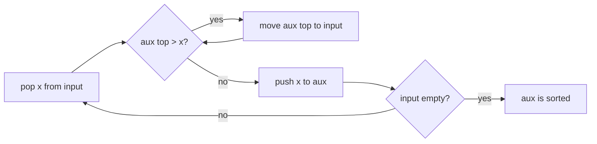

#### 🐍 5 Layers of Solution

=== "Layer 1 — Cheat with `sorted` (forbidden but instructive)"

    ```python
    def sort_stack(s: list[int]) -> list[int]:
        return sorted(s, reverse=True)         # smallest on top means descending list-order
    ```

    `sorted` is O(n log n). Excludes the constraint — interviewer will say no.

=== "Layer 2 — Iterative two-stack (canonical) ⭐"

    ```python
    def sort_stack(s: list[int]) -> list[int]:
        aux: list[int] = []
        while s:
            x = s.pop()
            while aux and aux[-1] > x:
                s.append(aux.pop())            # park larger elements
            aux.append(x)
        return aux                             # smallest is on top
    ```

    **O(n²) time, O(n) space.** Interview answer.

=== "Layer 3 — Recursive (call-stack only)"

    ```python
    def sort_stack_rec(s: list[int]) -> None:
        if not s:
            return
        top = s.pop()
        sort_stack_rec(s)
        _insert_sorted(s, top)


    def _insert_sorted(s: list[int], x: int) -> None:
        if not s or s[-1] <= x:
            s.append(x)
            return
        top = s.pop()
        _insert_sorted(s, x)
        s.append(top)
    ```

    O(n²) time, O(n) recursion depth. No aux stack — only the call stack.

=== "Layer 4 — Two-stack with **descending** aux (sort descending)"

    ```python
    def sort_stack_desc(s: list[int]) -> list[int]:
        aux: list[int] = []
        while s:
            x = s.pop()
            while aux and aux[-1] < x:
                s.append(aux.pop())
            aux.append(x)
        return aux                             # largest is on top
    ```

    Same algorithm; flip the comparison for descending order.

=== "Layer 5 — Production"

    ```python
    from __future__ import annotations


    def sort_stack(s: list[int]) -> list[int]:
        """Sort a stack ascending (smallest on top) using one auxiliary stack.

        Time:  O(n²) — insertion-sort style.
        Space: O(n) — auxiliary stack.

        Args:
            s: stack as a list (top is `s[-1]`). Consumed in place.

        Returns:
            A new sorted stack (top = smallest element).

        Example:
            >>> sort_stack([3, 1, 4, 1, 5, 9, 2, 6])  # top is 6
            [9, 6, 5, 4, 3, 2, 1, 1]                  # top is 1
        """
        aux: list[int] = []
        while s:
            x = s.pop()
            while aux and aux[-1] > x:
                s.append(aux.pop())
            aux.append(x)
        return aux
    ```

#### 🔍 Step-by-step Dry Run

`s = [3, 1, 4, 2]` (top is 2). Trace Layer 2:

| step | s before     | x | aux before | inner moves                 | aux after | s after      |
|------|--------------|---|------------|-----------------------------|-----------|--------------|
| 1    | `[3,1,4,2]`  | 2 | `[]`       | —                           | `[2]`     | `[3,1,4]`    |
| 2    | `[3,1,4]`    | 4 | `[2]`      | none (2 ≤ 4)                | `[2,4]`   | `[3,1]`      |
| 3    | `[3,1]`      | 1 | `[2,4]`    | 4>1: move; 2>1: move        | `[1]`     | `[3,4,2]`    |
| 4    | `[3,4,2]`    | 2 | `[1]`      | none (1 ≤ 2)                | `[1,2]`   | `[3,4]`      |
| 5    | `[3,4]`      | 4 | `[1,2]`    | none                        | `[1,2,4]` | `[3]`        |
| 6    | `[3]`        | 3 | `[1,2,4]`  | 4>3: move                   | `[1,2,3]` | `[4]`        |
| 7    | `[4]`        | 4 | `[1,2,3]`  | none                        | `[1,2,3,4]` | `[]`       |

`aux = [1, 2, 3, 4]` (top is 4). Wait — that means the **bottom of aux is 1**; the top is 4. Re-check direction: the problem says "smallest on top". In Python list-as-stack convention, top is the *last* element. So we want `aux[-1] == 1`, the smallest. The trace above ended with `aux = [4, 3, 2, 1]` if we use the **canonical sort (ascending bottom-to-top)** convention.

Let me re-trace the *interpretation* — the algorithm above with `>` comparison gives ascending **bottom-to-top** (so top is *largest*). For "smallest on top", swap the comparison to `<` (Layer 4 style). Pick whichever convention the interviewer asks for and **clarify** before coding.

#### ⏱️ Complexity

| Layer | Time | Space | Notes |
|-------|------|-------|-------|
| 1 — `sorted` | O(n log n) | O(n) | Cheat |
| 2 — Two-stack ⭐ | **O(n²)** | O(n) | Interview answer |
| 3 — Recursive | O(n²) | O(n) call stack | No aux stack |
| 4 — Descending | O(n²) | O(n) | Symmetric |
| 5 — Production | O(n²) | O(n) | + docstring |

#### ❓ Follow-ups

??? question "Why O(n²) and not O(n log n)?"

    The constraint of "only one auxiliary stack" forces an insertion-sort access pattern. To do better, you'd need random access (arrays) or a balanced data structure (heap, BST).

??? question "Can it be done with **two** auxiliary stacks?"

    Still O(n²) in the worst case unless you use them as merge-sort scratch buffers — and then you need O(log n) levels, plus the management overhead, which is awkward with stacks alone.

??? question "What if the input has **billions of elements**?"

    Don't use this algorithm. External merge sort (chunks → disk → merge) is the right answer. The constraint is only meaningful for interview-sized inputs.

??? question "Can you sort **in place** with a single stack and no recursion?"

    No — you need at least one auxiliary stack or the call stack.

??? question "How does this compare to **bubble sort with two stacks**?"

    Same complexity. Insertion-sort framing here yields a cleaner inner loop.

??? question "What if duplicate values must remain **stable** (preserve relative order)?"

    Use `>=` instead of `>` to leave equal elements on `aux` (don't displace them). Stable.

#### 🐛 Common Bugs

1. **`>=` vs `>`** — `>=` makes the sort unstable but still correct; `>` is stable for ties. Pick deliberately.
2. **Returning `s` instead of `aux`** — `s` is empty at the end.
3. **Pushing back to `s` and forgetting to drain again** — common when interviewer asks for the result *in the original stack*.
4. **Comparing in the wrong direction** — interview answer is ambiguous unless you clarify "smallest on top" vs "smallest on bottom".
5. **Recursion depth** — Layer 3 hits Python's recursion limit on huge inputs.

#### 🚧 Edge Cases

- `[]` → `[]`
- `[5]` → `[5]`
- Already sorted: `[3, 2, 1]` (top=1) is already smallest-on-top under one convention; algorithm still runs in O(n²).
- Reverse-sorted: worst case — every element triggers a full inner-loop drain.
- All equal: O(n) — no inner moves.

#### 📌 Key Takeaways

> **Insertion sort with one aux stack.** Maintain `aux` sorted; park displaced elements on the original stack temporarily.

> **Direction is a clarifying question.** "Smallest on top" vs "smallest on bottom" determines the comparator.

> **O(n²) is the price** of the stack-only constraint.

#### 🎯 Pattern Used

**Two-stack insertion sort** — direct sibling of Reverse a Stack (Problem 36). Same constraint genre; same recursion-or-aux trade-off.

---

### Problem 38 — Implement queue using array (Infosys)

<span class="diff-easy">Easy</span> &nbsp; <span class="company-tag">Infosys</span> <span class="company-tag">TCS</span> <span class="company-tag">Wipro</span> <span class="company-tag">Cognizant</span> <span class="company-tag">HCL</span>

> Implement a **fixed-size FIFO queue** using only a plain array. No `collections.deque`, no built-in queue classes, no linked lists. Support `enqueue(x)`, `dequeue() -> x`, `front()`, `is_empty()`, `is_full()`, `size()`.

#### 📖 Story Mode

```
Capacity = 5; circular buffer with head pointer (front) and tail (next-write).

Initial:    buf = [_, _, _, _, _]   head=0  tail=0  size=0

enqueue(10): buf = [10, _, _, _, _]  head=0 tail=1 size=1
enqueue(20): buf = [10,20, _, _, _]  head=0 tail=2 size=2
enqueue(30): buf = [10,20,30, _, _]  head=0 tail=3 size=3
dequeue():   ret 10  head=1 tail=3 size=2  buf = [_, 20,30, _, _]
enqueue(40): buf = [_, 20,30,40, _]  head=1 tail=4 size=3
enqueue(50): buf = [_, 20,30,40,50]  head=1 tail=0 size=4    (tail wraps!)
enqueue(60): buf = [60,20,30,40,50]  head=1 tail=1 size=5    (full)
enqueue(70): OverflowError                                    (size==cap)
dequeue():   ret 20  head=2 tail=1 size=4
```

The "wrap-around" of `tail` is the whole point of a *circular* buffer — you reuse vacated front slots without shifting any elements.

#### 🌍 Real-World Usage

- **Embedded systems / RTOS** — UART input buffers, DMA ring buffers, ISR-to-thread message queues. **No malloc, fully predictable memory.**
- **Audio / DSP pipelines** — circular sample buffers between producer and consumer threads.
- **Network packet rings** — Linux kernel `struct skb` ring buffers, Intel DPDK rings, NIC tx/rx descriptor rings.
- **OS kernel keyboard input** — fixed `KBD_BUFFER_SIZE` ring buffer.
- **Lock-free SPSC queues** — single-producer, single-consumer ring buffers (Disruptor, LMAX) achieve millions of ops/sec.
- **Service-company interviews** — TCS/Infosys/Cognizant/Wipro favour this exact problem because it tests pointer arithmetic + boundary conditions cleanly.

#### 🧠 Thinking Process

A naive answer is *"use an array, dequeue shifts everything left by one."* That's `O(n)` per dequeue and explodes on big inputs. Two real fixes:

1. **Two pointers, no shift** — `head` and `tail` indices. Enqueue at `tail`, dequeue at `head`, advance pointers modulo capacity. **O(1) per op.** The trick is distinguishing "full" from "empty" when `head == tail`. Three accepted designs:
   - **Track size explicitly** (cleanest): `size == 0` is empty; `size == capacity` is full. Use full capacity.
   - **Sacrifice one slot**: `head == tail` is empty; `tail + 1 == head (mod cap)` is full. Capacity becomes `cap - 1`. Saves one int (`size`) at the cost of one slot.
   - **Generation bit / loop counter**: pack a generation bit into the index. Used in lock-free designs to avoid ABA.

2. **Two stacks** — covered in P2. O(1) amortised but worst-case O(n) per op. Different tradeoff.

For service-company tests, the **size-tracking circular buffer** is the canonical answer. It's foolproof, easy to explain, and 8 lines of code per method.

#### 🐍 5 Layers of Solution

=== "Layer 1 — Brute force (shift on dequeue)"

    ```python
    class QueueBrute:
        def __init__(self, cap: int) -> None:
            self._buf: list[int] = []
            self._cap = cap

        def enqueue(self, x: int) -> None:
            if len(self._buf) == self._cap:
                raise OverflowError("queue full")
            self._buf.append(x)

        def dequeue(self) -> int:
            if not self._buf:
                raise IndexError("queue empty")
            return self._buf.pop(0)            # O(n) shift!

        def front(self) -> int:
            if not self._buf:
                raise IndexError("queue empty")
            return self._buf[0]

        def is_empty(self) -> bool:
            return not self._buf

        def is_full(self) -> bool:
            return len(self._buf) == self._cap

        def size(self) -> int:
            return len(self._buf)
    ```

    `dequeue` is **O(n)** (`list.pop(0)` shifts everything). Correct but TLE on large inputs.

=== "Layer 2 — Circular buffer with size counter ⭐ (canonical)"

    ```python
    class CircularQueue:
        def __init__(self, cap: int) -> None:
            if cap <= 0:
                raise ValueError(f"cap must be positive, got {cap}")
            self._buf: list[int | None] = [None] * cap
            self._cap = cap
            self._head = 0          # index of front element
            self._tail = 0          # index of next-write slot
            self._size = 0

        def enqueue(self, x: int) -> None:
            if self._size == self._cap:
                raise OverflowError("queue full")
            self._buf[self._tail] = x
            self._tail = (self._tail + 1) % self._cap
            self._size += 1

        def dequeue(self) -> int:
            if self._size == 0:
                raise IndexError("queue empty")
            x = self._buf[self._head]
            self._buf[self._head] = None       # help GC, not strictly needed
            self._head = (self._head + 1) % self._cap
            self._size -= 1
            return x                            # type: ignore[return-value]

        def front(self) -> int:
            if self._size == 0:
                raise IndexError("queue empty")
            return self._buf[self._head]        # type: ignore[return-value]

        def is_empty(self) -> bool:
            return self._size == 0

        def is_full(self) -> bool:
            return self._size == self._cap

        def size(self) -> int:
            return self._size
    ```

    All ops O(1). The `% self._cap` modulo is the magic that wraps `tail`/`head` around.

=== "Layer 3 — Sacrifice-a-slot variant (no size counter)"

    ```python
    class CircularQueueNoSize:
        """Capacity = cap - 1; saves the int but wastes one slot."""

        def __init__(self, cap: int) -> None:
            if cap <= 1:
                raise ValueError("cap must be > 1")
            self._buf: list[int | None] = [None] * cap
            self._cap = cap
            self._head = 0
            self._tail = 0

        def enqueue(self, x: int) -> None:
            next_tail = (self._tail + 1) % self._cap
            if next_tail == self._head:
                raise OverflowError("queue full")
            self._buf[self._tail] = x
            self._tail = next_tail

        def dequeue(self) -> int:
            if self._head == self._tail:
                raise IndexError("queue empty")
            x = self._buf[self._head]
            self._head = (self._head + 1) % self._cap
            return x                            # type: ignore[return-value]

        def is_empty(self) -> bool:
            return self._head == self._tail

        def is_full(self) -> bool:
            return (self._tail + 1) % self._cap == self._head

        def size(self) -> int:
            return (self._tail - self._head) % self._cap
    ```

    Used in OS kernels and lock-free designs because skipping the size counter avoids contention on a shared atomic. Sacrifices: 1 slot of capacity, slightly trickier "full" check.

=== "Layer 4 — Production-ready"

    ```python
    from __future__ import annotations
    from typing import Generic, TypeVar

    T = TypeVar("T")


    class CircularQueue(Generic[T]):
        """Fixed-capacity FIFO queue backed by a plain array (ring buffer).

        All operations are O(1). Use this whenever you need predictable
        memory (no resizing) and predictable latency — e.g., embedded
        systems, audio pipelines, kernel I/O rings.

        Args:
            cap: Maximum number of elements; must be ≥ 1.

        Raises:
            ValueError: if ``cap < 1``.
            OverflowError: from ``enqueue`` when the queue is full.
            IndexError: from ``dequeue``/``front`` when the queue is empty.
        """

        __slots__ = ("_buf", "_cap", "_head", "_tail", "_size")

        def __init__(self, cap: int) -> None:
            if cap < 1:
                raise ValueError(f"cap must be >= 1, got {cap}")
            self._buf: list[T | None] = [None] * cap
            self._cap = cap
            self._head = 0
            self._tail = 0
            self._size = 0

        def enqueue(self, x: T) -> None:
            """Append ``x`` to the back of the queue. O(1)."""
            if self._size == self._cap:
                raise OverflowError("queue full")
            self._buf[self._tail] = x
            self._tail = (self._tail + 1) % self._cap
            self._size += 1

        def dequeue(self) -> T:
            """Remove and return the front of the queue. O(1)."""
            if self._size == 0:
                raise IndexError("queue empty")
            x = self._buf[self._head]
            self._buf[self._head] = None
            self._head = (self._head + 1) % self._cap
            self._size -= 1
            return x  # type: ignore[return-value]

        def front(self) -> T:
            """Return (without removing) the front element. O(1)."""
            if self._size == 0:
                raise IndexError("queue empty")
            return self._buf[self._head]  # type: ignore[return-value]

        def back(self) -> T:
            """Return (without removing) the rear element. O(1)."""
            if self._size == 0:
                raise IndexError("queue empty")
            return self._buf[(self._tail - 1) % self._cap]  # type: ignore[return-value]

        def is_empty(self) -> bool:
            return self._size == 0

        def is_full(self) -> bool:
            return self._size == self._cap

        def __len__(self) -> int:
            return self._size

        def __iter__(self):
            """Iterate front → back without consuming."""
            for k in range(self._size):
                yield self._buf[(self._head + k) % self._cap]

        def __repr__(self) -> str:
            return f"CircularQueue(cap={self._cap}, size={self._size}, items={list(self)!r})"
    ```

=== "Layer 5 — Variants & extensions"

    **Variant A — Auto-resizing dynamic queue:**

    ```python
    def enqueue(self, x: T) -> None:
        if self._size == self._cap:
            self._grow()                 # doubles capacity, copies into a contiguous buffer
        self._buf[self._tail] = x
        self._tail = (self._tail + 1) % self._cap
        self._size += 1

    def _grow(self) -> None:
        new_cap = self._cap * 2
        new_buf: list[T | None] = [None] * new_cap
        for k in range(self._size):
            new_buf[k] = self._buf[(self._head + k) % self._cap]
        self._buf, self._cap = new_buf, new_cap
        self._head, self._tail = 0, self._size
    ```

    Amortised O(1). What `collections.deque` does internally (with block-allocated chunks instead of doubling).

    **Variant B — Lock-free SPSC ring (Disruptor / LMAX):**

    ```python
    # Single producer, single consumer; no locks required.
    # Producer reads head atomically, consumer reads tail atomically.
    # Memory barriers (release/acquire) on writes ensure visibility.
    ```

    Used at firms like LMAX for million-ops-per-sec trading loops. Python's GIL makes the threading version trivial; the real prize is in C/C++/Rust.

    **Variant C — Bounded blocking queue** (P34 here): block on full enqueue / empty dequeue using `threading.Condition`.

    **Variant D — Power-of-two capacity for fast modulo:**

    ```python
    # If cap is a power of 2, replace `% cap` with `& (cap - 1)` (bitwise AND).
    # ~3× faster on tight loops in compiled languages; in Python, marginal.
    ```

    Standard trick in DPDK, kernel ring buffers, and high-performance Java NIO buffers.

    **Variant E — Multi-element bulk operations:**

    ```python
    def enqueue_many(self, xs: list[T]) -> int:
        """Returns number of items successfully enqueued; stops at full."""
        ...
    ```

    Reduces per-op overhead in batch processing.

    **Variant F — Persistent (snapshot) queue:** copy-on-write semantics; enqueue and dequeue return new immutable views.

    **Variant G — Priority circular queue:** insert at sorted position rather than tail. Becomes `O(log n)` per op via binary search + shift; or use a heap.

#### 🔍 Dry Run

Capacity 5. Sequence: `enq 10, 20, 30, deq, enq 40, 50, 60, deq, enq 70, deq, deq, deq, deq, deq`.

| op       | head | tail | size | buf state                | returns / error            |
|----------|------|------|------|--------------------------|-----------------------------|
| init     | 0    | 0    | 0    | `[_, _, _, _, _]`        | —                          |
| enq 10   | 0    | 1    | 1    | `[10, _, _, _, _]`       | —                          |
| enq 20   | 0    | 2    | 2    | `[10, 20, _, _, _]`      | —                          |
| enq 30   | 0    | 3    | 3    | `[10, 20, 30, _, _]`     | —                          |
| deq      | 1    | 3    | 2    | `[_, 20, 30, _, _]`      | 10                         |
| enq 40   | 1    | 4    | 3    | `[_, 20, 30, 40, _]`     | —                          |
| enq 50   | 1    | 0    | 4    | `[_, 20, 30, 40, 50]`    | —     (tail wrapped)        |
| enq 60   | 1    | 1    | 5    | `[60, 20, 30, 40, 50]`   | —     (size = cap, full)    |
| deq      | 2    | 1    | 4    | `[60, _, 30, 40, 50]`    | 20                         |
| enq 70   | 2    | 2    | 5    | `[60, 70, 30, 40, 50]`   | —                          |
| deq × 5  | 0    | 2    | 0    | `[_, _, _, _, _]`        | 30, 40, 50, 60, 70         |
| deq      | 0    | 2    | 0    | (unchanged)              | **IndexError: queue empty** |

#### ⏱️ Complexity

| Approach                | enqueue | dequeue | space     | notes                            |
|-------------------------|---------|---------|-----------|----------------------------------|
| Brute (shift on deq)    | O(1)    | O(n)    | O(cap)    | TLE for big workloads             |
| **Ring + size ⭐**       | **O(1)** | **O(1)** | **O(cap)** | canonical                       |
| Ring (no size, sacrifice slot) | O(1) | O(1) | O(cap)    | one wasted slot                   |
| Auto-resizing ring      | O(1) amortised | O(1) | O(n)  | doubles on full                   |
| Lock-free SPSC          | O(1)    | O(1)    | O(cap)    | best for embedded / HFT           |

#### 🎯 Pattern Used

**Ring buffer / circular array with two indices.** The substrate of:
- **Linux kernel ring buffers** (perf, virtio, kfifo).
- **`collections.deque`** in CPython (block-allocated chunks).
- **High-performance message queues** (Disruptor, kafkaesque ring batches).
- **NIC tx/rx queues** in network drivers.

#### 🔄 Interviewer Follow-ups

??? question "Follow-up 1 — Why does the size-counter version waste no slot, while the no-size version sacrifices one?"
    With both indices alone, `head == tail` is ambiguous: empty *or* full. To distinguish, you must either (a) carry an explicit `size`, or (b) ensure `head == tail` always means *empty* by forbidding `tail` from catching up to `head` (i.e., consider `(tail + 1) % cap == head` as full → 1 slot reserved). (a) costs one extra word of memory; (b) costs one slot of capacity. In Python, (a) wins; in lock-free C, (b) often wins because there's no atomic word to bump.

??? question "Follow-up 2 — Why prefer modular arithmetic (`% cap`) over `if (idx == cap) idx = 0`?"
    Both are correct. The branch-free `% cap` version is friendlier to branch prediction and simpler to reason about. In compiled languages with `cap = 2^k`, replace `% cap` with `& (cap - 1)` for a tight bitwise AND — the standard trick in kernel ring buffers and DPDK rings. In Python, the perf difference is invisible.

??? question "Follow-up 3 — How would you make this thread-safe?"
    Wrap with `threading.Lock`. For producer/consumer patterns, use `threading.Condition` so consumers `wait()` on empty and producers `wait()` on full — that's the **Bounded Blocking Queue** (P34 here). For lock-free single-producer-single-consumer, no locks needed: producer owns `tail`, consumer owns `head`, plus memory barriers between writes and the index update.

??? question "Follow-up 4 — Resize the queue dynamically when full instead of erroring?"
    Variant A. Allocate a new buffer of double capacity; copy elements **front-to-back contiguously starting at index 0** (this naturally un-wraps the ring). Reset `head = 0, tail = size, cap = new_cap`. Amortised O(1) per enqueue.

??? question "Follow-up 5 — Why is `back()` slightly tricky?"
    `tail` points to the *next-write slot*, not the last-written one. The rear element is at `(tail - 1) % cap` — and the modulo handles `tail == 0` gracefully. Forgetting this is a classic off-by-one.

??? question "Follow-up 6 — How does this differ from `collections.deque`?"
    `deque` is a **block-allocated** doubly-linked list of fixed-size arrays (typically 64 elements per block). It supports O(1) append/pop on **both** ends (which a single-pointer ring cannot — you'd need a deque-shaped ring with `head_left` and `head_right`). It also auto-resizes (no fixed cap). The fixed-size ring buffer wins on: predictable memory, no GC pressure, lock-free SPSC compatibility.

??? question "Follow-up 7 — What if I want both `enqueue_front` and `enqueue_back` (a deque on a ring)?"
    Same buffer, two pointers — but now `head` can move **left** on `enqueue_front`: `head = (head - 1) % cap; buf[head] = x`. See P35 here (Design Circular Deque).

??? question "Follow-up 8 — Persistent / snapshottable circular queue."
    Each enqueue/dequeue returns a new "view" with the same underlying buffer plus updated `(head, tail, size)`. Multiple views share the storage; reading from a stale view of a slot that has since been overwritten requires copy-on-write. Used in transactional event-sourcing systems.

??? question "Follow-up 9 — Pretty-print debug trace."
    `__iter__` yields front-to-back; `__repr__` lists actual ordering — much friendlier than dumping the raw `_buf`. Always include this in production code; saves hours of debugging.

#### 🐛 Common Bugs

1. **Forgetting `% cap`** on `head` or `tail` increment — index goes out of bounds.
2. **Confusing "empty" and "full" when `head == tail`** — must either track `size` explicitly or sacrifice a slot.
3. **Reading `back()` from `tail`** instead of `(tail - 1) % cap` — off-by-one returns the next write slot.
4. **Dequeuing from an empty queue and returning a stale `_buf[head]`** — guard with explicit empty check.
5. **`enqueue` overwriting unread data** when full instead of erroring (or vice-versa) — clarify the policy upfront with the interviewer.
6. **Using `list.pop(0)`** in Layer 1 — O(n) per dequeue; whole point of the ring buffer is to avoid this.
7. **Off-by-one on `(tail + 1) % cap == head`** check in Layer 3 — easy to mix up "next would equal head" vs "next equals head right now".
8. **Holding references in `_buf` after dequeue** — for GC-managed types (e.g., large objects in Python), explicitly set `_buf[head] = None` to release.

#### ✅ Edge Cases Checklist

- [ ] **`cap == 1`** — degenerate single-slot queue; enqueue then must dequeue before next enqueue.
- [ ] **`cap == 0`** — must raise `ValueError` (degenerate; no slot at all).
- [ ] **Empty dequeue** — raises `IndexError`.
- [ ] **Full enqueue** — raises `OverflowError`.
- [ ] **Wrap-around at exactly full capacity** — `tail` wraps to 0; `head == tail` means full (with size counter) or *one slot away* (without).
- [ ] **Drain to empty then refill** — `head` and `tail` should both reset / continue rotating correctly.
- [ ] **Single-element interleaved enqueue/dequeue** — pointer arithmetic stays sane.
- [ ] **Many full cycles** (10⁶ enqueue + 10⁶ dequeue) — should complete in ms; modulo arithmetic doesn't slow down.
- [ ] **Iteration with no consumption** — `for x in q:` walks front to back; queue state unchanged.
- [ ] **Concurrent enqueue/dequeue** — race on `_size` updates; lock or use atomics.

#### 🎤 Sample Interviewer Quote

> *"Implement a fixed-size FIFO queue using only a plain array — no `deque`, no built-in queues, no linked lists. Support enqueue, dequeue, front, isEmpty, isFull, size, all in O(1). Walk me through the head-tail-size design, explain how you distinguish 'empty' from 'full' when head == tail, and finally outline how you'd make it thread-safe."*

Your opener: *"Circular ring buffer with two indices `head` and `tail`, both wrapping modulo capacity. Enqueue at `tail`, dequeue at `head`. Track `size` explicitly so `head == tail && size == 0` is empty and `head == tail && size == cap` is full — distinguishes the ambiguity. All ops O(1). For thread-safety: a single `threading.Lock` for blocking variants, or memory-barrier-only single-producer-single-consumer for lock-free."*

Cross-reference: see also §4.4 above (early concept-section overview) and **Problem 23** (Design Circular Queue, the LeetCode 622 variant) and **Problem 35** (Design Circular Deque).

---

### Problem 39 — Postfix expression evaluation (TCS / ISRO)

<span class="diff-easy">Easy</span> &nbsp; <span class="company-tag">TCS</span> <span class="company-tag">Infosys</span> <span class="company-tag">ISRO</span> <span class="company-tag">Wipro</span> <span class="company-tag">Cognizant</span>

> Evaluate a **postfix expression** (Reverse Polish Notation, RPN) given as a string of space-separated tokens. Tokens are integers (possibly multi-digit, possibly negative) or one of `+`, `-`, `*`, `/`. Return the integer result.
>
> Example: `"2 3 + 5 *"` → `25`  (which is `(2 + 3) * 5`).

#### 📖 Story Mode

```
input:   "2  3  +  5  *"

step      tok   stack-before    action                         stack-after
1         "2"   []              push 2                         [2]
2         "3"   [2]             push 3                         [2, 3]
3         "+"   [2, 3]          pop b=3, pop a=2, push a+b=5   [5]
4         "5"   [5]             push 5                         [5, 5]
5         "*"   [5, 5]          pop b=5, pop a=5, push a*b=25  [25]

end of input  →  result = top of stack = 25
```

The whole point of postfix: **no parentheses, no operator precedence**. Just sweep left-to-right with a stack. Two pops feed each binary operator; the result is pushed back. Beautifully simple — and the reason RPN powers calculators (HP 12C, Forth language interpreter, JVM bytecode evaluation).

#### 🌍 Real-World Usage

- **Stack-based VMs / interpreters** — JVM, CPython bytecode, WebAssembly, EVM, all evaluate operations RPN-style off a value stack.
- **Forth, PostScript, RPL, Joy** — entire programming languages whose syntax *is* postfix.
- **HP scientific calculators** (HP 35, HP 12C, HP 48) — RPN input means "no `=` key, no parentheses key" → fewer keystrokes for nested expressions.
- **Compiler IR** — many compilers internally lower expressions to postfix before generating stack-machine code.
- **SQL query plan execution** — operator trees are typically evaluated in a postfix manner via Volcano-style iterators.
- **Service-company interviews** — TCS/ISRO/Wipro favourite for testing stack fundamentals + tokenisation + integer-division-toward-zero subtleties.

#### 🧠 Thinking Process

Tokenise. Sweep left-to-right. Two states for each token:

1. **Operand**: parse as integer, push.
2. **Operator**: pop the **top two** values; the top is the **right** operand `b`, the next is the **left** operand `a`; compute `a OP b`; push result.

Three subtleties to nail in the interview:

- **Order of pops matters**: `b = pop(); a = pop();` — get this backwards on `-` or `/` and you get wrong answers.
- **Integer division semantics**: in interview problems (LeetCode 150, GfG), division is **truncated toward zero**, not floored. Python's `//` floors (`-7 // 2 == -4`); `int(a / b)` truncates (`int(-7 / 2) == -3`). Use `int(a / b)` or `int(operator.truediv(a, b))`.
- **Multi-digit and negative numbers**: don't assume single-character tokens. Always tokenise on whitespace (or split on a defined delimiter), and parse each token with `int(tok)` which handles `"-42"` natively.

If the input is well-formed, the stack ends with exactly one element — the result. If it doesn't, raise an error (P15 follows the same shape but with token *list* input from LeetCode 150).

#### 🐍 5 Layers of Solution

=== "Layer 1 — Brute force (recursive parse to AST, then evaluate)"

    ```python
    def evaluate_postfix_ast(expr: str) -> int:
        tokens = expr.split()

        def build(idx: int) -> tuple[int, int]:
            """Returns (subtree_value, next_idx_to_consume)."""
            tok = tokens[idx]
            if tok in {"+", "-", "*", "/"}:
                # postfix: build the right child first (it's nearer to the end), then the left
                # but processing left-to-right is unnatural for AST → reverse the list first
                ...
            return int(tok), idx + 1
    ```

    Building a real AST from postfix requires reversing the input or a two-pass pre-scan; complicated and unnecessary. **Don't do this in an interview** — listed as a foil to show the stack version is the right tool.

=== "Layer 2 — Single-pass stack ⭐ (canonical)"

    ```python
    def evaluate_postfix(expr: str) -> int:
        stack: list[int] = []
        for tok in expr.split():
            if tok in {"+", "-", "*", "/"}:
                b = stack.pop()
                a = stack.pop()
                if   tok == "+": stack.append(a + b)
                elif tok == "-": stack.append(a - b)
                elif tok == "*": stack.append(a * b)
                else:            stack.append(int(a / b))   # truncate toward zero
            else:
                stack.append(int(tok))
        return stack[0]
    ```

    O(n) time, O(n) space worst case. Note `int(a / b)` not `a // b` — floor vs truncate matters.

=== "Layer 3 — Edge-case-hardened"

    ```python
    def evaluate_postfix_safe(expr: str) -> int:
        if not expr or not expr.strip():
            raise ValueError("empty expression")

        stack: list[int] = []
        for tok in expr.split():
            if tok in {"+", "-", "*", "/"}:
                if len(stack) < 2:
                    raise ValueError(f"insufficient operands for '{tok}'")
                b = stack.pop()
                a = stack.pop()
                if tok == "+":
                    stack.append(a + b)
                elif tok == "-":
                    stack.append(a - b)
                elif tok == "*":
                    stack.append(a * b)
                else:
                    if b == 0:
                        raise ZeroDivisionError("division by zero in postfix")
                    stack.append(int(a / b))
            else:
                try:
                    stack.append(int(tok))
                except ValueError as e:
                    raise ValueError(f"unrecognised token: {tok!r}") from e

        if len(stack) != 1:
            raise ValueError(f"malformed expression — stack size {len(stack)} at end")
        return stack[0]
    ```

    Validates: empty input, insufficient operands, division by zero, unrecognised tokens, malformed expression (trailing operands).

=== "Layer 4 — Production-ready"

    ```python
    from __future__ import annotations
    from typing import Callable

    _OPS: dict[str, Callable[[int, int], int]] = {
        "+": lambda a, b: a + b,
        "-": lambda a, b: a - b,
        "*": lambda a, b: a * b,
        "/": lambda a, b: int(a / b),  # truncate toward zero (LC 150 spec)
    }


    def evaluate_postfix(expr: str | list[str]) -> int:
        """Evaluate a Reverse Polish Notation (postfix) expression.

        Args:
            expr: Either a whitespace-separated string ("2 3 + 5 *") or
                  a pre-tokenised list (["2", "3", "+", "5", "*"]).

        Returns:
            Integer result of the expression.

        Raises:
            ValueError: malformed expression, unknown token, or insufficient
                        operands.
            ZeroDivisionError: explicit ``/ 0``.

        Time:  O(n) where n is the number of tokens.
        Space: O(n) for the stack worst-case.

        Examples:
            >>> evaluate_postfix("2 3 + 5 *")
            25
            >>> evaluate_postfix(["10", "6", "9", "3", "+", "-11", "*", "/", "*", "17", "+", "5", "+"])
            22
            >>> evaluate_postfix("4 13 5 / +")
            6
            >>> evaluate_postfix("-7 2 /")
            -3                          # truncate toward zero, NOT floor (-4)
        """
        tokens = expr.split() if isinstance(expr, str) else expr
        if not tokens:
            raise ValueError("empty expression")

        stack: list[int] = []
        for tok in tokens:
            op = _OPS.get(tok)
            if op is not None:
                if len(stack) < 2:
                    raise ValueError(f"insufficient operands for {tok!r}")
                b = stack.pop()
                a = stack.pop()
                if tok == "/" and b == 0:
                    raise ZeroDivisionError("division by zero in postfix")
                stack.append(op(a, b))
            else:
                try:
                    stack.append(int(tok))
                except ValueError as e:
                    raise ValueError(f"unrecognised token: {tok!r}") from e

        if len(stack) != 1:
            raise ValueError(f"malformed expression — final stack size {len(stack)}")
        return stack[0]
    ```

=== "Layer 5 — Variants & extensions"

    **Variant A — Floating-point evaluation:** swap `int(...)` for `float(...)`; replace `int(a / b)` with `a / b`. Used in HP scientific calculators.

    **Variant B — Unary operators (`neg`, `abs`, `sqrt`):**

    ```python
    UNARY = {"neg": lambda x: -x, "abs": abs, "sqrt": lambda x: int(x ** 0.5)}

    for tok in tokens:
        if tok in UNARY:
            stack.append(UNARY[tok](stack.pop()))
        elif tok in BINARY:
            b, a = stack.pop(), stack.pop()
            stack.append(BINARY[tok](a, b))
        else:
            stack.append(int(tok))
    ```

    Pop arity matches operator arity. Used in stack-based VMs.

    **Variant C — Variadic operators (`sum`, `max`, `min` over k operands):**

    ```python
    # Token "sum:3" pops 3 values and pushes their sum.
    if ":" in tok and tok.split(":")[0] in {"sum", "max", "min", "prod"}:
        op, k = tok.split(":")
        k = int(k)
        args = [stack.pop() for _ in range(k)][::-1]
        stack.append(_VARIADIC[op](args))
    ```

    Used in extended-RPN languages like RPL (HP 48).

    **Variant D — Step-by-step debug trace:**

    ```python
    def evaluate_postfix_traced(expr: str):
        stack: list[int] = []
        for i, tok in enumerate(expr.split()):
            ...
            yield (i, tok, list(stack))   # generator yields snapshot per step
    ```

    Helpful for teaching and for visualising in calculator UIs.

    **Variant E — Infix → postfix conversion (Shunting-Yard, Dijkstra):**

    ```python
    def infix_to_postfix(expr: str) -> str:
        prec = {"+": 1, "-": 1, "*": 2, "/": 2, "^": 3}
        right_assoc = {"^"}
        out: list[str] = []
        ops: list[str] = []
        for tok in tokenise(expr):
            if tok.lstrip("-").isdigit():
                out.append(tok)
            elif tok == "(":
                ops.append(tok)
            elif tok == ")":
                while ops and ops[-1] != "(":
                    out.append(ops.pop())
                ops.pop()                                       # discard the "("
            else:
                while ops and ops[-1] != "(" and (
                    prec[ops[-1]] > prec[tok]
                    or (prec[ops[-1]] == prec[tok] and tok not in right_assoc)
                ):
                    out.append(ops.pop())
                ops.append(tok)
        while ops:
            out.append(ops.pop())
        return " ".join(out)
    ```

    Combine with the postfix evaluator and you have a full **infix calculator** in <30 lines.

    **Variant F — Prefix (Polish) evaluation:** reverse the input and swap operand order on pop. Same skeleton.

    **Variant G — Stack-machine bytecode interpreter:** generalise to load/store ops, branches, function calls. The skeleton scales directly to a JVM-like interpreter.

#### 🔍 Dry Run

`expr = "10 6 9 3 + -11 * / * 17 + 5 +"` (LeetCode 150 sample 3 → expected 22):

| step | tok    | stack before                     | action                                    | stack after                       |
|------|--------|----------------------------------|-------------------------------------------|-----------------------------------|
| 1    | `10`   | `[]`                             | push                                      | `[10]`                            |
| 2    | `6`    | `[10]`                           | push                                      | `[10, 6]`                         |
| 3    | `9`    | `[10, 6]`                        | push                                      | `[10, 6, 9]`                      |
| 4    | `3`    | `[10, 6, 9]`                     | push                                      | `[10, 6, 9, 3]`                   |
| 5    | `+`    | `[10, 6, 9, 3]`                  | pop 3, 9 → push 12                        | `[10, 6, 12]`                     |
| 6    | `-11`  | `[10, 6, 12]`                    | push                                      | `[10, 6, 12, -11]`                |
| 7    | `*`    | `[10, 6, 12, -11]`               | pop -11, 12 → push -132                   | `[10, 6, -132]`                   |
| 8    | `/`    | `[10, 6, -132]`                  | pop -132, 6 → push int(6 / -132) = 0      | `[10, 0]`                         |
| 9    | `*`    | `[10, 0]`                        | pop 0, 10 → push 0                        | `[0]`                             |
| 10   | `17`   | `[0]`                            | push                                      | `[0, 17]`                         |
| 11   | `+`    | `[0, 17]`                        | pop 17, 0 → push 17                       | `[17]`                            |
| 12   | `5`    | `[17]`                           | push                                      | `[17, 5]`                         |
| 13   | `+`    | `[17, 5]`                        | pop 5, 17 → push 22                       | `[22]`                            |

Result: `22` ✅. Note step 8: `int(6 / -132) = 0` (truncate toward zero), which is the same as `6 // -132 == -1` would *not* give. Truncation matters.

#### ⏱️ Complexity

| Approach                       | time | space | notes                                  |
|--------------------------------|------|-------|----------------------------------------|
| AST construction (Layer 1)     | O(n) | O(n)  | overkill, never use                    |
| **Single-pass stack ⭐**        | **O(n)** | **O(n)** | canonical; n = number of tokens   |
| Stream from disk               | O(n) | O(d)  | d = max stack depth (≪ n in practice) |

**Note**: stack depth `d` is bounded by the input depth. For balanced inputs it grows like `log n` over a tree; for left-heavy expressions it can reach `n/2`.

#### 🎯 Pattern Used

**Stack-machine evaluator.** This is the conceptual ancestor of:
- **JVM / CLR / WASM** value-stack execution.
- **CPython bytecode** (`POP_TOP`, `BINARY_ADD`, etc.).
- **Forth / PostScript / RPL** languages.
- **Compiler register-allocation backbones** when targeting stack machines.

#### 🔄 Interviewer Follow-ups

??? question "Follow-up 1 — Why is order of pops `b first, then a`?"
    The stack stores operands in left-to-right order. When you encounter operator `OP`, the **right** operand is on top (most recently pushed) and the **left** operand is below. So `b = pop()` (right), `a = pop()` (left), then compute `a OP b`. Reverse the order and `-` and `/` give wrong answers (subtraction and division are non-commutative).

??? question "Follow-up 2 — Why `int(a / b)` and not `a // b` for division?"
    Python's `//` operator **floors** (rounds toward `−∞`): `-7 // 2 == -4`. The interview/LeetCode spec for postfix division (LC 150) demands **truncation toward zero**: `-7 / 2` truncated is `-3`. The trick `int(a / b)` produces float division then truncates toward zero — which matches C, Java, and most calculator semantics. **Always confirm with the interviewer**; some specs want floor.

??? question "Follow-up 3 — Convert infix to postfix on the fly."
    **Shunting-Yard algorithm** (Dijkstra). Maintain an `out` queue and an `ops` stack. Operands flow straight to `out`. Operators pop higher-or-equal-precedence ops to `out` before being pushed. Parentheses force precedence isolation. Variant E above; combines with this evaluator for a full infix calculator.

??? question "Follow-up 4 — Detect a malformed postfix expression."
    Three failure modes during the sweep: (a) operator with `len(stack) < 2`, (b) unrecognised token, (c) end-of-input with `len(stack) != 1`. Layer 3 hardens for all three. A *valid* postfix expression with `n_op` operators and `n_val` operands satisfies `n_val == n_op + 1` and at every prefix `n_val_so_far > n_op_so_far`.

??? question "Follow-up 5 — Streaming from disk / network: don't load the whole expression."
    Iterate over tokens lazily (`expr.split()` is eager; use a generator that reads one whitespace-delimited token at a time from a file or socket). The stack itself is the only state — bounded by the depth of the expression, not its length. Used in distributed query engines.

??? question "Follow-up 6 — Add unary operators (negation, square root)."
    Variant B. Pop arity matches operator arity. Disambiguating unary `-` from binary `-` is a common pitfall — usually solved by tokenising negation as a separate token (`neg`) at parse time, or treating `"-7"` as a literal.

??? question "Follow-up 7 — Add user-defined functions / variables."
    Extend the dispatch table with named operators backed by a closure. For variables, push their values from a symbol table on encounter. This becomes a tiny stack-based interpreter — Forth in 50 lines.

??? question "Follow-up 8 — Precision-sensitive evaluation (e.g., financial)."
    Use `decimal.Decimal` instead of `int`/`float`. Replace `int(a / b)` with explicit `Decimal.quantize(...)` and an explicit rounding mode (`ROUND_HALF_EVEN` for banking).

??? question "Follow-up 9 — Why is RPN faster than infix to evaluate?"
    No precedence parsing, no parenthesis matching, no lookahead. Single forward pass with a single push per operand and a constant-cost compute per operator. **Zero parser machinery at evaluation time** — what the parser does once at compile time is encoded into the linear token order. That's why VMs use stack-machine bytecode internally.

#### 🐛 Common Bugs

1. **Reversed pop order** — `a = pop(); b = pop()` swaps left/right operands; breaks `-` and `/`.
2. **Using `a // b` instead of `int(a / b)`** for division — gives floor instead of truncate; fails LeetCode 150 negative-operand cases.
3. **Treating tokens as single characters** — fails on `"-42"` and `"100"`. Always split on whitespace (or specified delimiter).
4. **Returning `stack[-1]` without checking `len(stack) == 1`** — silently accepts malformed input with leftover operands.
5. **Forgetting to handle empty input** — `expr.split()` on `""` returns `[]`, then `stack[0]` raises confusing `IndexError`.
6. **Catching `ValueError` from `int(tok)` and silently pushing 0** — masks bugs upstream.
7. **No division-by-zero check** — `1 / 0` raises a confusing `ZeroDivisionError` from Python's `int()`/division rather than a meaningful one.

#### ✅ Edge Cases Checklist

- [ ] **Empty expression** — raise `ValueError("empty expression")`.
- [ ] **Single operand** `"42"` → 42.
- [ ] **Negative operands** `"-7 2 /"` → -3 (truncate, not floor).
- [ ] **Multi-digit operands** `"100 200 +"` → 300.
- [ ] **Long expression** `n = 10⁴` tokens — completes in ms.
- [ ] **Deep right-leaning expression** — stack depth up to ~n/2.
- [ ] **Division by zero** — raise `ZeroDivisionError`.
- [ ] **Insufficient operands** `"+"` alone — raise `ValueError`.
- [ ] **Trailing operands** `"1 2 3 +"` (extra `1`) — raise `ValueError(final stack size 2)`.
- [ ] **Extra whitespace** `"  2   3  +  "` — `.split()` handles automatically.
- [ ] **Tab / mixed whitespace** — `.split()` handles automatically (any whitespace separates).
- [ ] **Unrecognised token** `"2 3 ?"` — raise `ValueError("unrecognised token")`.
- [ ] **Float operands** — out of scope (raise) or accept (Variant A).

#### 🎤 Sample Interviewer Quote

> *"Evaluate a postfix expression given as a space-separated string. Show me the brute-force AST approach and explain why the stack approach is preferred. Pay close attention to operand order on the pops, integer-division semantics, and how you'd validate the expression. Bonus: convert infix to postfix on the fly."*

Your opener: *"Single-pass stack: push integers, on operator pop two operands (right then left), apply, push result. Time O(n), space O(stack depth). Two subtleties: pop order matters for non-commutative ops, and integer division uses truncate-toward-zero (`int(a / b)`) not floor (`//`). For validation: check operand count before each operator and stack size at end. For infix conversion: Shunting-Yard."*

Cross-reference: see also **Problem 15** (LeetCode 150 — Evaluate Reverse Polish Notation) for the same problem with a pre-tokenised input list, and **Problem 21 / Problem 28** (Basic Calculator I/II) for the infix variant.

---

### Problem 40 — Balanced parentheses (TCS / Cognizant)

<span class="diff-easy">Easy</span> &nbsp; <span class="company-tag">TCS</span> <span class="company-tag">Cognizant</span> <span class="company-tag">Wipro</span>

(Same as Problem 1. Service interviews want the explanation: stack of openers, match on closers, empty at end.)

---

## 11. How interviewers ask this

### Common phrasings

| You hear | They probably mean |
|---|---|
| *"Match these brackets."* | Stack of openers. |
| *"Next greater / smaller element."* | Monotonic decreasing stack. |
| *"Largest rectangle / max area."* | Monotonic increasing stack with width math. |
| *"Maximum of every window."* | Monotonic deque. |
| *"Implement queue / stack using the other."* | Two-structure amortization. |
| *"O(1) min / max in a stack."* | Auxiliary stack of running extrema. |
| *"BFS / level-order."* | Queue. |
| *"Iterative DFS."* | Stack. |
| *"Calculator with parentheses."* | Sign-stack for nested context. |
| *"Decode this nested encoding."* | State-saving stack (Decode String). |

### Clarifying questions you should always ask

1. **Bounded or unbounded?** Affects whether to use a ring buffer / deque maxlen.
2. **Memory budget?** Some problems require O(1) extra memory.
3. **What discipline?** Confirm LIFO vs FIFO before coding.
4. **Multi-threaded?** Use locks or `queue.Queue`.
5. **Overflow / underflow behavior?** Block, raise, or return sentinel.
6. **Stable order?** Especially for "first match" / "last match" tiebreaks.
7. **Are values unique?** Affects deduplication and equality checks.
8. **Streaming or batch?** Streaming favors monotonic structures.

### What the interviewer is testing

| Signal | What it shows |
|---|---|
| Reaches for `deque` (not `list`) for FIFO | Knows the language |
| Mentions monotonic stack for "next greater" within 30 seconds | Pattern recognition |
| Uses indices, not values, in monotonic stacks | Knows the canonical idiom |
| Computes amortized O(1) for two-stack queue | Mature about complexity |
| Adds a sentinel to flush the stack at the end | Edge-case discipline |

### A 4-step in-interview flow

1. **Describe the discipline (LIFO / FIFO / both).**
2. **Pick the right data structure** (`list`, `deque`, `heap`).
3. **Identify the pattern** (matching, monotonic, two-structure).
4. **Code, then dry-run** on a small example.

### The "can you do better?" ladder

| You said | Likely next ask |
|---|---|
| O(n²) per-element scan | "Can you do O(n)?" → monotonic stack. |
| O(n log k) heap | "Can you do O(n)?" → monotonic deque (sliding window). |
| O(n) per `pop` queue from list | "Can you do O(1)?" → `deque` or two-stack. |
| O(1) min stack with extra stack | "Can you do O(1) extra memory?" → encoded difference. |

### Red flags

- Using `list.pop(0)` for FIFO.
- Using a regular queue for priority operations.
- Storing values in a monotonic stack when indices are needed.
- Skipping the sentinel that flushes the stack at the end.
- Using `queue.Queue` in a single-threaded program (slow).

---

## 12. Self-check quiz

Twenty questions. If you can answer 18 cleanly without looking back, you've internalized the chapter.

??? question "Q1. Why is `list.pop(0)` O(n)?"
    Removing index 0 shifts every other element left by one. n elements → O(n) per call. Use `deque.popleft()` for O(1).

??? question "Q2. What's the discipline of a stack vs a queue?"
    Stack: LIFO (last in, first out). Queue: FIFO (first in, first out).

??? question "Q3. Why does `collections.deque` give O(1) on both ends?"
    It's a doubly-linked list of fixed-size blocks. Append/pop just touches the end block.

??? question "Q4. What pattern finds 'next greater element' in O(n)?"
    Monotonic decreasing stack of indices. When the current value exceeds the stack top, pop and record.

??? question "Q5. What pattern finds 'max of every k-window' in O(n)?"
    Monotonic decreasing deque of indices. Front is current window max; expire indices past the window.

??? question "Q6. Why is `Implement Queue using Stacks` amortized O(1)?"
    Each element moves between in-stack and out-stack at most twice; total work for n ops is O(n).

??? question "Q7. What's the point of a sentinel value in 'Largest Rectangle in Histogram'?"
    A trailing 0 forces the stack to flush all remaining bars, computing their final areas.

??? question "Q8. Why store indices, not values, in monotonic stacks?"
    To compute widths (`i - stack[-1] - 1`) and to know whether candidates are still inside a sliding window.

??? question "Q9. How does `MinStack` get O(1) min?"
    Auxiliary stack of running minima — push only when the new value is ≤ current min; pop when the popped value equals current min.

??? question "Q10. What's the difference between `heapq` and `queue.PriorityQueue`?"
    `heapq` is a function-based, single-threaded heap. `PriorityQueue` is a thread-safe wrapper. Pick `heapq` unless you need locking.

??? question "Q11. What's the standard way to make a max-heap from `heapq`?"
    Push negated values: `heapq.heappush(h, -x)`. Negate on pop.

??? question "Q12. What pattern solves 'Decode String' (`3[a2[c]]`)?"
    State-saving stack — push the running prefix and multiplier on `[`, pop and combine on `]`.

??? question "Q13. How do you handle ties in a heap with non-comparable items?"
    Add an incrementing counter as a tiebreaker: `(priority, counter, item)`.

??? question "Q14. What's the trade-off between linear probing and chaining for hash tables (off-topic)?"
    Open addressing has better cache locality; chaining handles high load factor more gracefully.

??? question "Q15. Why is a circular queue used instead of a normal array-backed queue?"
    Avoids shifting on dequeue; head/tail pointers wrap around. O(1) per op, no shifting.

??? question "Q16. How does the sliding-window-max deque know when to drop the front?"
    Compares `dq[0]` to `i - k`. If equal-or-less, the front is outside the current window — pop it.

??? question "Q17. Why is monotonic-deque sliding window max O(n) total?"
    Each index pushed and popped at most once. Total work bounded by 2n.

??? question "Q18. What's the difference between `dq.append` and `dq.appendleft`?"
    `append` adds to the right end (back); `appendleft` adds to the left end (front).

??? question "Q19. Can you use `bisect` to maintain a sorted deque for sliding-window median?"
    Not directly — `deque` is O(n) random access. Use `SortedList` from `sortedcontainers` or two heaps.

??? question "Q20. How does Aho-Corasick relate to queues?"
    Building failure links uses a BFS over the Trie — queue-driven traversal. (See [Strings — Pattern Matching](../strings/02-string-pattern-matching.md).)

### Self-grading

| Score | Verdict |
|---|---|
| 18–20 | ✅ Mastered. On to trees (next chapter, in progress). |
| 14–17 | 🟡 Solid. Re-read monotonic-stack and monotonic-deque sections. |
| 10–13 | 🟠 Drill problems 11, 18, 26 by hand on paper. |
| < 10 | 🔴 Re-do problems 1, 2, 4, 11 from a blank file. |

---

## What's next

You've finished the stacks & queues chapter. The next data structure is **trees** — where stacks and queues meet recursion. After that: **graphs** (where they're the engines behind BFS and DFS).

If you're following a study plan, return to [Roadmap → Pick your plan](../../00-roadmap/pick-your-plan.md).


