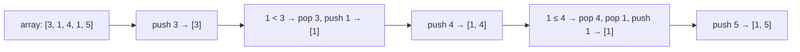
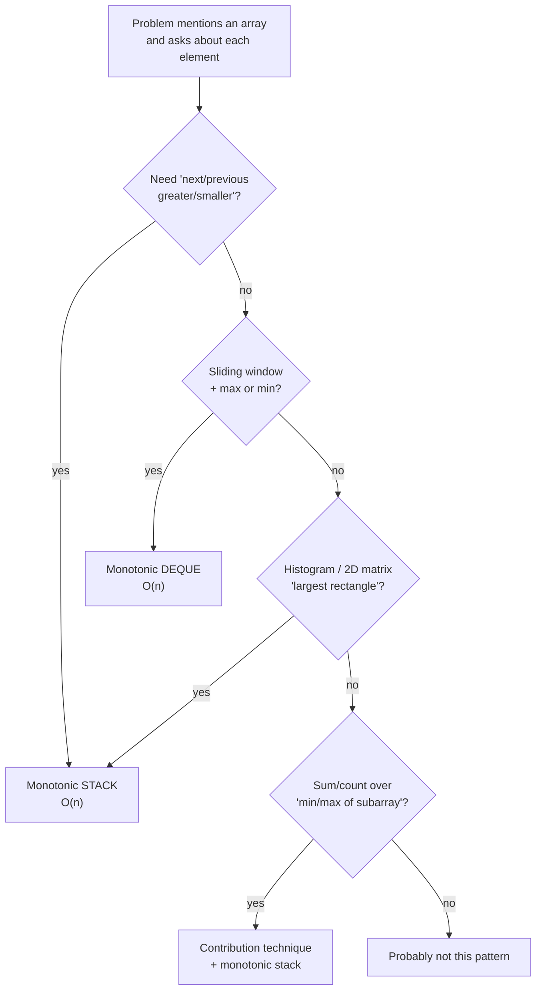

# Monotonic stack & queue

> One invariant — "the stack stays sorted" — collapses a whole family of "next greater / smaller" problems from O(n²) to O(n).

<span class="phase-status phase-done">Phase 2 — Data Structures</span>

---

!!! abstract "What this chapter is"
    The monotonic stack is one of those tricks that, once you internalise it, **makes a tier of medium/hard problems trivial**: Largest Rectangle in Histogram, Trapping Rain Water, Daily Temperatures, Sum of Subarray Minimums, Sliding Window Maximum. They all share the same skeleton.

    **Reading time:** ~75 minutes.

    **Prereqs:** [Stacks and queues — basics](01-stacks-and-queues-basics.md), [Arrays](../arrays/01-array-basics.md).

---

## 1. The invariant

A **monotonic stack** is a stack with an extra rule:

> Before pushing `x`, **pop everything that violates the order** you want to maintain.

Two flavours:

- **Monotonic increasing stack** — values strictly increasing from bottom to top. Before pushing `x`, pop while `top >= x`.
- **Monotonic decreasing stack** — values strictly decreasing from bottom to top. Before pushing `x`, pop while `top <= x`.

Each element is pushed and popped **at most once** → the entire traversal is **O(n)** even though there's an inner `while` loop.



??? tip "When the popped element 'finds its answer'"
    The killer realisation: **the moment we pop `x`, we know its 'next greater/smaller' element**. The thing that caused the pop **is** the answer. That's why this pattern works for "next greater/smaller" so cleanly.

---

## 2. The four-pattern matrix

Four questions, four templates. Memorise the table; the code falls out of it.

| Question | Stack flavour | Traverse | Pop condition |
|---|---|---|---|
| Next **greater** to the **right** | decreasing | left → right | `nums[stack[-1]] <= nums[i]` |
| Next **smaller** to the **right** | increasing | left → right | `nums[stack[-1]] >= nums[i]` |
| Next **greater** to the **left**  | decreasing | right → left | `nums[stack[-1]] <= nums[i]` |
| Next **smaller** to the **left**  | increasing | right → left | `nums[stack[-1]] >= nums[i]` |

Two rules summarise it:

1. **Direction**: traverse opposite to the side you want to find. (Want answer on the right → traverse right-to-left, *or* traverse left-to-right resolving when popped.)
2. **Sign**: looking for **greater** → stack is **decreasing**; looking for **smaller** → stack is **increasing**.

```python linenums="1"
def next_greater_to_right(nums: list[int]) -> list[int]:
    """For each i, the next index j > i with nums[j] > nums[i], or -1."""
    n = len(nums)
    answer = [-1] * n
    stack: list[int] = []  # holds indices; values strictly decreasing
    for i, x in enumerate(nums):
        while stack and nums[stack[-1]] < x:
            answer[stack.pop()] = i
        stack.append(i)
    return answer
```

??? question "Should I store values or indices on the stack?"
    Almost always **indices**. You can recover the value with `nums[stack[-1]]`, and you frequently need the index for distances ("how many days until warmer", "width of a rectangle"). Only push raw values when the index is genuinely irrelevant.

---

## 3. Decision flow — do I need a monotonic stack?



If two of those branches lit up at once — almost guaranteed it's monotonic-stack.

---

## 4. Daily Temperatures — LC 739

Canonical "next greater to right" warmup.

```python linenums="1"
def daily_temperatures(temps: list[int]) -> list[int]:
    """Return days[i] = how many days until a warmer temperature, 0 if never."""
    n = len(temps)
    days = [0] * n
    stack: list[int] = []  # indices; values strictly decreasing
    for i, t in enumerate(temps):
        while stack and temps[stack[-1]] < t:
            j = stack.pop()
            days[j] = i - j
        stack.append(i)
    return days
```

Walkthrough on `[73, 74, 75, 71, 69, 72, 76, 73]`:

| i | t  | stack before | action | stack after | days |
|---|----|---|---|---|---|
| 0 | 73 | `[]` | push | `[0]` | `[0,0,0,0,0,0,0,0]` |
| 1 | 74 | `[0]` | pop 0 (days[0]=1), push | `[1]` | `[1,0,0,0,0,0,0,0]` |
| 2 | 75 | `[1]` | pop 1 (days[1]=1), push | `[2]` | `[1,1,0,0,0,0,0,0]` |
| 3 | 71 | `[2]` | push | `[2,3]` | unchanged |
| 4 | 69 | `[2,3]` | push | `[2,3,4]` | unchanged |
| 5 | 72 | `[2,3,4]` | pop 4, pop 3, push | `[2,5]` | `[1,1,0,2,1,0,0,0]` |
| 6 | 76 | `[2,5]` | pop 5, pop 2, push | `[6]` | `[1,1,4,2,1,1,0,0]` |
| 7 | 73 | `[6]` | push | `[6,7]` | unchanged |

---

## 5. Largest Rectangle in Histogram — LC 84

The canonical example. Each bar `i` extends as a rectangle bounded by:

- The **first shorter bar to its left** (left boundary).
- The **first shorter bar to its right** (right boundary).

If we know both for every bar, the answer is `max(h[i] * (right[i] - left[i] - 1))`. Both come from a single monotonic-increasing pass.

```python linenums="1"
def largest_rectangle_area(heights: list[int]) -> int:
    """Largest axis-aligned rectangle in a bar chart. O(n)."""
    stack: list[int] = []  # indices; heights[stack] strictly increasing
    best = 0
    # Sentinel: append 0 so we flush the stack at the end
    for i, h in enumerate(heights + [0]):
        while stack and heights[stack[-1]] >= h:
            top = stack.pop()
            # Width: from i-1 back to (stack[-1] or -1) exclusive
            left = stack[-1] if stack else -1
            width = i - left - 1
            best = max(best, heights[top] * width)
        stack.append(i)
    return best
```

??? tip "Why the sentinel zero?"
    Without it, bars left on the stack at the end never get their rectangle computed. Appending `0` (lower than any real bar) forces the final pop sequence. Same trick appears in trapping-rain-water variants.

**Extension — Maximal Rectangle (LC 85)**: row-by-row, build a histogram of consecutive 1-counts; reuse `largest_rectangle_area` per row → O(rows × cols).

---

## 6. Trapping Rain Water — LC 42

Two clean approaches; both worth knowing.

### 6.1 Two-pointer (constant space)

```python linenums="1"
def trap_two_pointer(height: list[int]) -> int:
    """Trapping rain water — two-pointer O(n) time, O(1) space."""
    left, right = 0, len(height) - 1
    left_max = right_max = 0
    water = 0
    while left < right:
        if height[left] < height[right]:
            if height[left] >= left_max:
                left_max = height[left]
            else:
                water += left_max - height[left]
            left += 1
        else:
            if height[right] >= right_max:
                right_max = height[right]
            else:
                water += right_max - height[right]
            right -= 1
    return water
```

### 6.2 Monotonic stack (per-layer accounting)

```python linenums="1"
def trap_monotonic(height: list[int]) -> int:
    """Trap water layer-by-layer using a decreasing stack."""
    stack: list[int] = []
    water = 0
    for i, h in enumerate(height):
        while stack and height[stack[-1]] < h:
            bottom = stack.pop()
            if not stack:
                break
            left = stack[-1]
            width = i - left - 1
            bounded = min(height[left], h) - height[bottom]
            water += width * bounded
        stack.append(i)
    return water
```

The stack version computes water in **horizontal layers** (each pop fills the layer between two taller bars and the dip popped between them). The two-pointer version computes it in **vertical columns**. Same answer; different mental model.

---

## 7. Sum of Subarray Minimums — LC 907 (contribution technique)

Brute force is O(n²). Trick: for each element `a[i]`, count **how many subarrays have `a[i]` as their minimum**, then sum `a[i] * count`.

`count = (left_count) * (right_count)` where:

- `left_count` = distance from `i` to the **previous smaller** element (or array start).
- `right_count` = distance from `i` to the **next smaller** element (or array end).

Tiebreak rule: use **strict** on one side and **non-strict** on the other to avoid double-counting equal values.

```python linenums="1"
MOD = 10**9 + 7


def sum_subarray_minimums(arr: list[int]) -> int:
    """Sum over every subarray of its minimum. O(n)."""
    n = len(arr)
    prev_smaller = [-1] * n  # strict <
    next_smaller = [n] * n   # non-strict <= (tiebreak)

    stack: list[int] = []
    for i, x in enumerate(arr):
        while stack and arr[stack[-1]] >= x:
            stack.pop()
        prev_smaller[i] = stack[-1] if stack else -1
        stack.append(i)

    stack.clear()
    for i in range(n - 1, -1, -1):
        while stack and arr[stack[-1]] > arr[i]:
            stack.pop()
        next_smaller[i] = stack[-1] if stack else n
        stack.append(i)

    total = 0
    for i, x in enumerate(arr):
        left = i - prev_smaller[i]
        right = next_smaller[i] - i
        total = (total + x * left * right) % MOD
    return total
```

??? question "Why one strict, one non-strict?"
    Consider `[3, 1, 1, 3]`. The two `1`s are tied. If we used strict-less on both sides, the subarray `[1, 1]` would be claimed by neither (each `1` would say "the other is not strictly greater, so I'm not the unique minimum"). If we used non-strict on both, both `1`s would claim it. Forcing **strict on one side, non-strict on the other** makes exactly one `1` (say, the leftmost) own each tied subarray.

The same pattern adapts to "Sum of Subarray Maximums", "Number of subarrays whose minimum equals K", and "Sum of (max − min) over all subarrays" (LC 2104).

---

## 8. Monotonic deque — sliding window maximum (LC 239)

A **deque** generalises the stack: pop from both ends. For sliding windows, the back enforces the monotonic invariant; the front is dropped when it falls out of the window.

Invariant: deque stores **indices**, with values strictly decreasing. The front is always the **current window's max**.

```python linenums="1"
from collections import deque


def max_sliding_window(nums: list[int], k: int) -> list[int]:
    """Maximum of every length-k window. O(n) time, O(k) space."""
    dq: deque[int] = deque()  # indices, nums[dq] strictly decreasing
    out: list[int] = []
    for i, x in enumerate(nums):
        # 1. Drop indices that fell off the window's left edge
        while dq and dq[0] <= i - k:
            dq.popleft()
        # 2. Maintain decreasing invariant from the back
        while dq and nums[dq[-1]] < x:
            dq.pop()
        dq.append(i)
        # 3. Once we have a full window, record its max
        if i >= k - 1:
            out.append(nums[dq[0]])
    return out
```

Walkthrough on `nums=[1,3,-1,-3,5,3,6,7], k=3`:

| i | x  | dq before | dq after | window max |
|---|----|---|---|---|
| 0 | 1  | `[]`     | `[0]`     | — |
| 1 | 3  | `[0]`    | `[1]`     | — |
| 2 | -1 | `[1]`    | `[1,2]`   | 3 |
| 3 | -3 | `[1,2]`  | `[1,2,3]` | 3 |
| 4 | 5  | `[1,2,3]`| `[4]`     | 5 |
| 5 | 3  | `[4]`    | `[4,5]`   | 5 |
| 6 | 6  | `[4,5]`  | `[6]`     | 6 |
| 7 | 7  | `[6]`    | `[7]`     | 7 |

??? tip "Sliding window minimum is the same code with one flip"
    Change `nums[dq[-1]] < x` to `nums[dq[-1]] > x`. Stack/deque becomes increasing, front holds minimum.

### 8.1 Variants

- **First negative in every window** — deque of indices of negative values; pop from front when out of window.
- **Shortest subarray with sum ≥ K** (LC 862) — monotonic deque over prefix sums.
- **Constrained Subsequence Sum** (LC 1425) — DP where `dp[i] = nums[i] + max(0, max(dp[i-k..i-1]))`; the inner max comes from a monotonic deque.

---

## 9. Common pitfalls

!!! warning "Off-by-one with strict vs non-strict"
    Mixing up `<` and `<=` is the #1 bug. For "next strictly greater" use `<=` on the stack pop. For "next greater **or equal**" use `<`. Read the problem twice and write a comment naming which one you chose.

!!! warning "Forgetting the sentinel / final flush"
    If your loop only resolves elements when popped, the survivors at the end of the loop never get an answer. Either append a sentinel (the histogram trick) or drain the stack after the loop.

!!! warning "Pushing values when you needed indices"
    Most problems care about **distance** between events. Push indices and dereference; you can always compute the value from the index but not vice versa.

---

## 10. Problem set

| Problem | LC # | Pattern | Difficulty |
|---|---|---|---|
| Daily Temperatures | 739 | Next greater right | Medium |
| Next Greater Element I | 496 | Next greater right + map | Easy |
| Next Greater Element II (circular) | 503 | Two-pass over `nums + nums` | Medium |
| Largest Rectangle in Histogram | 84  | Mono stack + sentinel | Hard |
| Maximal Rectangle | 85  | Per-row histogram | Hard |
| Trapping Rain Water | 42  | Two-pointer / mono stack | Hard |
| Sum of Subarray Minimums | 907 | Contribution technique | Medium |
| Sum of Subarray Ranges | 2104 | Min + max contribution | Medium |
| Sliding Window Maximum | 239 | Mono deque | Hard |
| Shortest Subarray with Sum ≥ K | 862 | Mono deque on prefix sums | Hard |
| Constrained Subsequence Sum | 1425 | DP + mono deque | Hard |
| Remove K Digits | 402 | Mono increasing stack | Medium |
| 132 Pattern | 456 | Mono decreasing stack right-to-left | Medium |

---

## 🃏 Cheatsheet

| Question | Stack | Direction | Pop condition |
|---|---|---|---|
| Next greater right | decreasing | L→R | `top < x` |
| Next smaller right | increasing | L→R | `top > x` |
| Next greater left  | decreasing | R→L | `top < x` |
| Next smaller left  | increasing | R→L | `top > x` |
| Sliding window max | decreasing deque | L→R | `top < x`; drop front if out of window |
| Sliding window min | increasing deque | L→R | `top > x`; drop front if out of window |

**Key invariants & tricks:**

- Each element pushed and popped at most once → **O(n)** despite the nested `while`.
- Push **indices**, dereference for values. Indices give you distances for free.
- Use a **sentinel** (`0` for histogram, `inf` for "next smaller") to flush leftovers.
- For "subarray min/max contribution": **strict on one side, non-strict on the other** to break ties.
- Sliding window = monotonic **deque** (pop from both ends), not stack.

→ Next: [Heaps & priority queues](../heaps/01-heap-basics.md).
