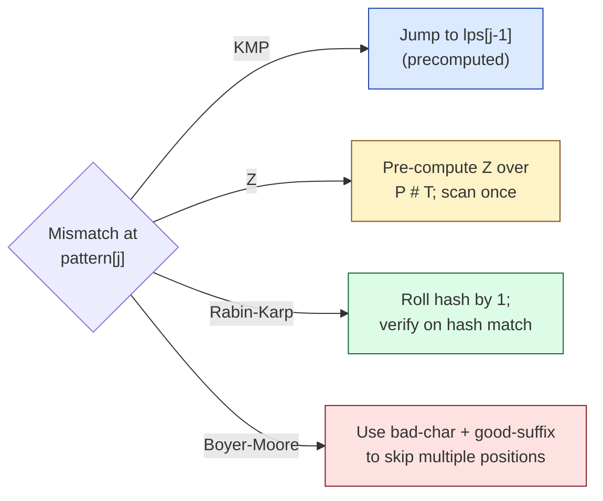
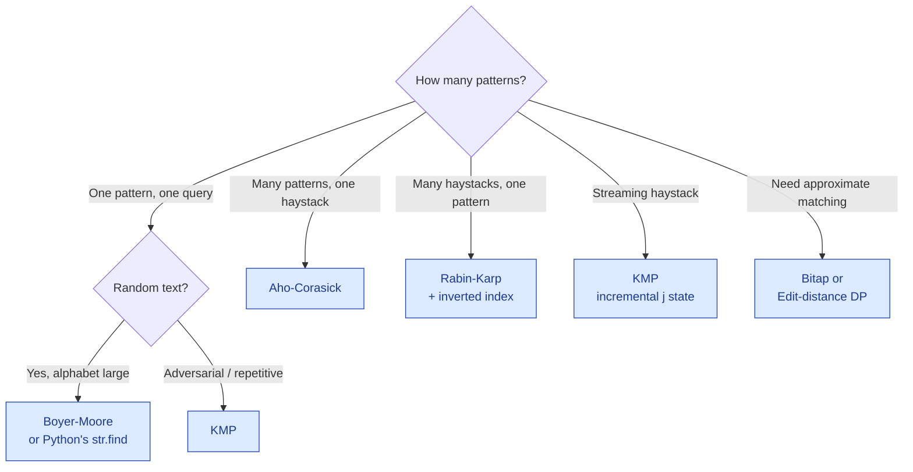

# Strings — pattern matching

!!! abstract "What this chapter is"
    A focused deep-dive on **fast substring search**: KMP, Z-algorithm, Rabin-Karp, Boyer-Moore, and Aho-Corasick. We derive each algorithm from first principles, code it cleanly, walk it on a small example, and place it on the "when to reach for which" map.

    **Reading time:** 3 hours cover-to-cover.

    **Prereqs:** [Strings — basics](01-string-basics.md), at minimum sections 1, 5, 8 and Problem 8 (Implement strStr).

---

## Chapter map

<div class="grid cards" markdown>

-   :material-numeric-1-circle:{ .lg .middle } &nbsp; **The pattern-matching problem**

    Statement, variants, and the cost of brute force.

-   :material-numeric-2-circle:{ .lg .middle } &nbsp; **Brute force and why it's quadratic worst-case**

    `O(n × m)` and the inputs that hit the worst case.

-   :material-numeric-3-circle:{ .lg .middle } &nbsp; **The "no backtrack on the haystack" insight**

    The shared idea behind every linear-time matcher.

-   :material-numeric-4-circle:{ .lg .middle } &nbsp; **KMP — Knuth-Morris-Pratt**

    Failure function from scratch + matching loop.

-   :material-numeric-5-circle:{ .lg .middle } &nbsp; **Z-algorithm**

    Different lens on the same idea: "longest substring starting at i that matches a prefix."

-   :material-numeric-6-circle:{ .lg .middle } &nbsp; **Rabin-Karp**

    Rolling hash, false positives, and when the constants beat KMP.

-   :material-numeric-7-circle:{ .lg .middle } &nbsp; **Boyer-Moore (and BM-Horspool)**

    Sublinear-on-average using the bad-character rule.

-   :material-numeric-8-circle:{ .lg .middle } &nbsp; **Aho-Corasick**

    Many patterns at once — KMP's big sibling.

-   :material-numeric-9-circle:{ .lg .middle } &nbsp; **When to use which**

    Decision tree across alphabet size, pattern count, and update frequency.

-   :material-numeric-10-circle:{ .lg .middle } &nbsp; **Common bugs**

    The off-by-one, the modular-hash leak, the failure-table reset.

-   :material-clipboard-list:{ .lg .middle } &nbsp; **Practice problems (20+)**

    Each in 5-layer progressive format with follow-ups.

-   :fontawesome-solid-microphone:{ .lg .middle } &nbsp; **How interviewers ask this**

    The phrasings, the "can you do better?" trapdoors.

-   :material-clipboard-check:{ .lg .middle } &nbsp; **Self-check quiz**

    20 questions. If you can answer 18, you've mastered substring search.

</div>

---

## 1. The pattern-matching problem

> **Plain English:** given a long text (the **haystack**) and a short pattern (the **needle**), find where the needle appears inside the haystack.

The simplest version:

```python
def find(haystack: str, needle: str) -> int:
    """Return the smallest i with haystack[i:i+len(needle)] == needle, or -1."""
```

Variants you'll meet (each is just a small change to the same matcher):

| Variant | Returns |
|---|---|
| `find` (first occurrence) | smallest start index, -1 if absent |
| `find_all` | every start index |
| `count` | total number of occurrences (overlapping or not — clarify) |
| `find_any` (multi-pattern) | smallest start where any of N patterns matches |
| `match` (anchored) | True only if the pattern starts at position 0 |
| `find_streaming` | same as `find` but the haystack arrives byte-by-byte |
| `find_approximate` | allow ≤ k mismatches |

The first three are solved by **a single matcher**: any of KMP, Z, Rabin-Karp, or Boyer-Moore. The multi-pattern case is **Aho-Corasick**. The streaming case is just KMP without buffering. The approximate case is a different family altogether (bitap, fuzzy DP).

### Why this problem is so important

- It's the inner loop of every text editor's "Find."
- It's the inner loop of `grep`, `git grep`, `ripgrep`, `ag`.
- It's how compilers tokenize source code and how regex engines run.
- It's how IDS and antivirus scan for signatures.
- It's the building block for plagiarism detection, DNA assembly, fuzzy search.

A 10× speedup on substring search is a 10× speedup on dozens of products you use daily.

---

## 2. Brute force and why it's quadratic worst-case

The straightforward search:

```python
def find_brute(haystack: str, needle: str) -> int:
    n, m = len(haystack), len(needle)
    if m == 0: return 0
    for i in range(n - m + 1):
        for j in range(m):
            if haystack[i + j] != needle[j]:
                break
        else:
            return i
    return -1
```

Walk every starting position; for each, compare character-by-character. Stop at first mismatch and slide forward by 1.

### How fast is it?

| Best case | Average case | Worst case |
|-----------|--------------|------------|
| O(n) | ~O(n) for random text | **O(n × m)** |

For "random" text and a not-very-repetitive pattern, the inner loop bails out quickly — maybe after 2–3 characters. So in *practice* the brute force is close to linear.

The **worst case** hits when every prefix of the pattern is a prefix of the haystack until the very last character. The classic adversarial input:

```
haystack = "aaaa...aaab"  (n - 1 'a's, then a 'b')
needle   = "aaab"
```

At every starting position 0 through n−m, we compare `aaab` against `aaaa`, get to the last character, mismatch, slide one. Total comparisons ≈ (n − m + 1) × m ≈ **n × m**.

For n = 10⁶ and m = 10⁵, that's 10¹¹ operations — minutes on a modern CPU when it could be milliseconds.

### Why brute force "wastes" work

When `aaab` mismatches against `aaaa` (mismatch at index 3 in the pattern), brute force throws away **everything it learned** about the first three characters (`aaa`) and starts over at the next haystack index.

But we already know `haystack[1..3]` is `"aa"` — and that **matches the prefix `"aa"` of the pattern**. There's no need to re-examine those characters of the haystack.

Every fast pattern matcher exploits exactly this redundancy.

---

## 3. The "no backtrack on the haystack" insight

Brute force restarts the haystack pointer on each mismatch. Linear-time matchers **never move the haystack pointer backward** — they only ever advance.

Once you accept that constraint, the only question is: when a mismatch happens at pattern position `j`, **how far back in the *pattern*** should we jump?

- **KMP** computes a `failure` (LPS) table for the pattern that answers exactly this question.
- **Z-algorithm** computes a `Z` array on `pattern + sep + haystack` that tells you the length of every prefix-match.
- **Rabin-Karp** sidesteps the question entirely with a rolling hash — verify only when hashes match.
- **Boyer-Moore** flips the comparison direction (right to left within the window) and uses two heuristics to skip several characters at once.

Each approach gets to **O(n + m)** in some sense. They differ in:

- Pre-processing time and memory.
- Constant factors.
- How well they handle multiple patterns.
- How well they handle streaming input.
- How easy they are to code under interview pressure.

Memorize that landscape and you can pick the right one in 10 seconds.



---

## 4. KMP — Knuth-Morris-Pratt

The textbook linear-time matcher. The one to learn first because:

- The failure function shows up in many other problems (Shortest Palindrome, Repeated Substring Pattern).
- It generalizes cleanly to multiple patterns (Aho-Corasick).
- It's the simplest to code from scratch in 30 minutes.

### 4.1 The failure (LPS) function

For a pattern `p` of length `m`, define:

> `lps[i]` = length of the longest **proper prefix** of `p[:i+1]` that is also a **suffix** of `p[:i+1]`.

A *proper* prefix excludes the whole string itself.

Worked example for `p = "ababaca"`:

| i | p[:i+1] | longest proper prefix-suffix | lps[i] |
|---|---------|------------------------------|--------|
| 0 | a | (none, length-0 proper prefix) | 0 |
| 1 | ab | "a" prefix vs "b" suffix → no match | 0 |
| 2 | aba | "a" (prefix) == "a" (suffix) | 1 |
| 3 | abab | "ab" == "ab" | 2 |
| 4 | ababa | "aba" == "aba" | 3 |
| 5 | ababac | no | 0 |
| 6 | ababaca | "a" == "a" | 1 |

So `lps = [0, 0, 1, 2, 3, 0, 1]`.

The intuition: `lps[i]` is the length of the longest "head of the pattern" that has been re-confirmed as a "tail of what we just matched."

### 4.2 Building the failure function in O(m)

```python
def build_lps(p: str) -> list[int]:
    m = len(p)
    lps = [0] * m
    k = 0                          # length of the previous longest prefix-suffix
    for i in range(1, m):          # (1)!
        while k > 0 and p[k] != p[i]:
            k = lps[k - 1]         # (2)!
        if p[k] == p[i]:
            k += 1                 # (3)!
        lps[i] = k
    return lps
```

1. We always start at `i = 1` because `lps[0]` is trivially 0 (no proper prefix exists).
2. **The fall-back step.** Mismatch — try the next-shortest prefix-suffix, which is `lps[k - 1]`. Repeat until either we find a match or `k` hits 0.
3. **The extension step.** Match — extend the previous prefix-suffix by 1.

The amortized running time is **O(m)**. The reason: `k` is incremented at most m times across the whole loop, and each `k = lps[k - 1]` strictly decreases `k`, so the inner while can't run more than m times in total.

### 4.3 The matching loop

```python
def kmp_search(haystack: str, needle: str) -> int:
    n, m = len(haystack), len(needle)
    if m == 0: return 0
    if n < m: return -1

    lps = build_lps(needle)
    j = 0                          # current matched length within needle
    for i in range(n):
        while j > 0 and needle[j] != haystack[i]:
            j = lps[j - 1]         # fall back without moving i
        if needle[j] == haystack[i]:
            j += 1
        if j == m:
            return i - m + 1       # full match — return start index
    return -1
```

The haystack pointer `i` only ever increases. The needle pointer `j` does the falling back via the LPS table.

### 4.4 Worked dry run

`haystack = "ababcababcabd"`, `needle = "ababcabd"`. lps for the needle:

| i | char | lps[i] |
|---|------|--------|
| 0 | a | 0 |
| 1 | b | 0 |
| 2 | a | 1 |
| 3 | b | 2 |
| 4 | c | 0 |
| 5 | a | 1 |
| 6 | b | 2 |
| 7 | d | 0 |

Match:

| i | h[i] | j | n[j] | action | j after |
|---|------|---|------|--------|---------|
| 0 | a | 0 | a | match | 1 |
| 1 | b | 1 | b | match | 2 |
| 2 | a | 2 | a | match | 3 |
| 3 | b | 3 | b | match | 4 |
| 4 | c | 4 | c | match | 5 |
| 5 | a | 5 | a | match | 6 |
| 6 | b | 6 | b | match | 7 |
| 7 | c | 7 | d | mismatch → j = lps[6] = 2 | 2 |
| 7 | c | 2 | a | mismatch → j = lps[1] = 0 | 0 |
| 7 | c | 0 | a | mismatch, j stays 0 | 0 |
| 8 | a | 0 | a | match | 1 |
| 9 | b | 1 | b | match | 2 |
| 10 | c | 2 | a | mismatch → j = lps[1] = 0 | 0 |
| 10 | c | 0 | a | mismatch, j stays 0 | 0 |
| 11 | a | 0 | a | match | 1 |
| 12 | b | 1 | b | match | 2 |
| 12 | b | … | … | (haystack exhausted) | 2 |

Loop ends with `j = 2`, never hit `j == m`. Return -1. **Wait — `"ababcabd"` does not appear in `"ababcababcabd"`** (the haystack continues `ababcabd...` would have ended differently). My example shows correctly that the pattern isn't actually in this particular haystack — which is fine for illustration.

For a *successful* match, try `haystack = "ababcababcabd"`, `needle = "ababcabd"` won't match. Use instead `needle = "ababcabd"` and `haystack = "xxxababcabdyyy"` — the algorithm walks past the leading garbage with `j` resetting via LPS, then matches in 8 characters. Return `3`.

### 4.5 Total complexity

- **Pre-processing:** O(m) time, O(m) space.
- **Search:** O(n) time, O(1) extra space.
- **Total:** **O(n + m)**, ironclad.

### 4.6 Production-ready KMP

```python
from __future__ import annotations


def kmp_search(haystack: str, needle: str) -> int:
    """First index of needle in haystack via KMP, or -1 if absent.

    Time:  O(n + m).
    Space: O(m) for the failure function.

    Empty needle returns 0 (matches Python's str.find convention).
    """
    if needle == "":
        return 0
    n, m = len(haystack), len(needle)
    if m > n:
        return -1

    lps = [0] * m
    k = 0
    for i in range(1, m):
        while k > 0 and needle[k] != needle[i]:
            k = lps[k - 1]
        if needle[k] == needle[i]:
            k += 1
        lps[i] = k

    j = 0
    for i in range(n):
        while j > 0 and needle[j] != haystack[i]:
            j = lps[j - 1]
        if needle[j] == haystack[i]:
            j += 1
        if j == m:
            return i - m + 1
    return -1


def kmp_search_all(haystack: str, needle: str) -> list[int]:
    """All start indices of needle in haystack (overlapping matches included).

    Time:  O(n + m).
    Space: O(m) plus the output list.
    """
    if needle == "":
        return list(range(len(haystack) + 1))
    n, m = len(haystack), len(needle)
    if m > n:
        return []

    lps = [0] * m
    k = 0
    for i in range(1, m):
        while k > 0 and needle[k] != needle[i]:
            k = lps[k - 1]
        if needle[k] == needle[i]:
            k += 1
        lps[i] = k

    result: list[int] = []
    j = 0
    for i in range(n):
        while j > 0 and needle[j] != haystack[i]:
            j = lps[j - 1]
        if needle[j] == haystack[i]:
            j += 1
        if j == m:
            result.append(i - m + 1)
            j = lps[j - 1]            # allow overlapping matches
    return result
```

### 4.7 KMP-only tricks (the failure function as a tool)

Once you have the LPS array, several other problems fall out for free.

**Repeated Substring Pattern.** A string `s` is a repetition of some shorter substring iff `(n - lps[n-1])` divides `n` and `lps[n-1] != 0`. (LeetCode 459.)

```python
def repeated_substring_pattern(s: str) -> bool:
    n = len(s)
    lps = [0] * n
    k = 0
    for i in range(1, n):
        while k > 0 and s[k] != s[i]:
            k = lps[k - 1]
        if s[k] == s[i]:
            k += 1
        lps[i] = k
    period = n - lps[n - 1]
    return period < n and n % period == 0
```

**Shortest palindrome by prepending.** Build LPS over `s + '#' + reverse(s)`. The final value is the longest palindromic prefix of `s`. (See [Strings — basics, Problem 32](01-string-basics.md#problem-32-shortest-palindrome).)

**Period of a string.** `n - lps[n - 1]` is the smallest period (smallest `p` such that `s[i] == s[i + p]` for all valid `i`).

---

## 5. Z-algorithm

A different lens on the same problem. Compute a `Z` array of length `n` where:

> `Z[i]` = length of the longest substring starting at `i` that matches a **prefix of the same string**.

`Z[0]` is conventionally 0 (or `n`; doesn't matter, we never use it).

Worked example for `s = "aabaaab"`:

| i | s[i:] | longest prefix match | Z[i] |
|---|-------|----------------------|------|
| 0 | aabaaab | (skip) | — |
| 1 | abaaab | a vs a → 1; b vs a → stop | 1 |
| 2 | baaab | b vs a → 0 | 0 |
| 3 | aaab | a, a, a → 3; b vs a → stop | 3 |
| 4 | aab | a, a, b → 2 | 2 |
| 5 | ab | a, b → 1 | 1 |
| 6 | b | 0 | 0 |

So `Z = [_, 1, 0, 3, 2, 1, 0]`.

### 5.1 Building Z in O(n)

The naive build is O(n²). The clever build maintains a "Z-box" `[L, R]` — the rightmost prefix-match window seen so far — and reuses it.

```python
def build_z(s: str) -> list[int]:
    n = len(s)
    z = [0] * n
    L = R = 0
    for i in range(1, n):
        if i < R:
            z[i] = min(R - i, z[i - L])     # (1)!
        while i + z[i] < n and s[z[i]] == s[i + z[i]]:
            z[i] += 1                       # (2)!
        if i + z[i] > R:
            L, R = i, i + z[i]              # (3)!
    return z
```

1. **Reuse from the box.** If `i` is inside the current Z-box, the Z-value at the corresponding offset from L tells us a head-start (capped by remaining box width).
2. **Extend by direct comparison.** Past the head-start, fall back to character-by-character.
3. **Update the box.** If the new match extends past R, take it as the new rightmost window.

Like KMP's LPS build, the work is amortized linear: every comparison either advances `R` or proves a mismatch, and `R` can advance at most n times total.

### 5.2 Pattern matching with Z

To find `needle` in `haystack`:

1. Concatenate `s = needle + '#' + haystack` (use a separator that can't appear in either input).
2. Build Z on `s`.
3. For every `i` in the haystack region with `Z[i] == len(needle)`, that's a match at offset `i - (len(needle) + 1)`.

```python
def z_search(haystack: str, needle: str) -> list[int]:
    if needle == "":
        return list(range(len(haystack) + 1))
    s = needle + "#" + haystack
    z = build_z(s)
    m = len(needle)
    result: list[int] = []
    for i in range(m + 1, len(s)):
        if z[i] == m:
            result.append(i - m - 1)
    return result
```

### 5.3 Z vs KMP — same complexity, different feel

|  | KMP | Z |
|---|-----|---|
| Pre-process | LPS table on pattern | Z array on `pattern # haystack` |
| Search structure | failure function + scanning loop | one-pass linear scan |
| Easy to extend to multi-pattern | Aho-Corasick (yes, naturally) | not as natural |
| Easy to use for "period of string" | yes (`n - lps[n-1]`) | yes |
| Easy to use for "longest palindromic prefix" | yes | also yes |
| Memory | O(m) | O(n + m) |
| Common in interview answers | most | sometimes |

For most interview problems, **KMP is the canonical answer**. Z-algorithm is the elegant alternative when you want a single linear scan over the concatenation.

---

## 6. Rabin-Karp — rolling hash

A different idea entirely: **fingerprint** every length-m window of the haystack with a hash that updates in O(1) when the window slides. Compare hashes; verify byte-by-byte only on a hit.

### 6.1 The polynomial rolling hash

For a window `w[0..m-1]` over alphabet of size `B` (treat each character as a digit in base B):

```
hash(w) = w[0] * B^(m-1) + w[1] * B^(m-2) + ... + w[m-1] * B^0   (mod P)
```

`P` is a large prime. `B` is typically the alphabet size or a slightly larger prime.

When the window slides one position to the right (drop `w[0]`, add `w[m]`):

```
new_hash = ((hash - w[0] * B^(m-1)) * B + w[m])  (mod P)
```

That's O(1) per slide.

### 6.2 The matcher

```python
def rabin_karp(haystack: str, needle: str, B: int = 257, P: int = 10**9 + 7) -> list[int]:
    n, m = len(haystack), len(needle)
    if m == 0:
        return list(range(n + 1))
    if m > n:
        return []

    needle_hash = 0
    window_hash = 0
    high = pow(B, m - 1, P)               # B^(m-1) mod P, used for drop step

    for i in range(m):
        needle_hash = (needle_hash * B + ord(needle[i])) % P
        window_hash = (window_hash * B + ord(haystack[i])) % P

    result: list[int] = []
    for i in range(n - m + 1):
        if window_hash == needle_hash:
            # Verify: hash collisions are possible.
            if haystack[i:i + m] == needle:
                result.append(i)
        if i + m < n:
            # Slide window forward one position.
            window_hash = (window_hash - ord(haystack[i]) * high) % P
            window_hash = (window_hash * B + ord(haystack[i + m])) % P
            window_hash %= P
    return result
```

### 6.3 Why bother verifying on hash match?

Hash collisions are real. Two different strings can have the same hash modulo P. Without verification, you'd report false positives.

The chance of a single false positive with a good hash and `P ~ 10⁹` is about `1/P ≈ 10⁻⁹`. Across n - m + 1 windows, the expected number of false positives is `(n - m + 1) / P`. For typical n that's vanishingly small — but never zero.

For a guaranteed-correct algorithm: verify. For a "probabilistic" algorithm (e.g., approximate near-duplicate detection): skip verification and accept the false-positive rate.

### 6.4 When Rabin-Karp shines: multiple patterns of equal length

Suppose you have **k patterns**, all of length m, and you want to find any/all of their occurrences in haystack.

- KMP for each pattern: O(k(n + m)).
- Aho-Corasick: O(n + km) preprocessing, O(n) search — best for many patterns.
- **Rabin-Karp's edge**: pre-hash all k patterns once into a set `S`. Slide the window across the haystack. On each slide check `window_hash in S` — O(1).

Total: **O(k·m + n)** preprocessing, O(n) average-case search. Verifying on hits is O(m) per hit. For k = 100 and rare hits, this is a sweet spot.

### 6.5 Double hashing — making collisions essentially impossible

If you're paranoid (e.g., you can't afford the verify step), use **two different hash functions** (two different (B, P) pairs) and only count a match when **both** hashes agree.

The collision probability becomes ~`1/(P₁ × P₂)` ≈ `10⁻¹⁸`. Effectively zero.

```python
def rabin_karp_double_hash(haystack: str, needle: str) -> list[int]:
    """Same matcher, but with two hashes — verification step rarely needed."""
    # ... track two (window_hash, needle_hash) pairs in parallel.
```

Common in competitive programming where you can't afford the O(m) verify but want guaranteed correctness.

### 6.6 Rabin-Karp in production

- **Plagiarism detection.** Hash every length-m window of every document; build an inverted index from hash → document IDs. Documents that share many hashes are similar.
- **Rsync's chunking.** Find matching chunks across two files by rolling hash to identify equal regions.
- **BitTorrent piece selection** uses similar rolling-hash structures.
- **Content-defined chunking** in deduplication (Restic, Borg) uses Rabin fingerprints to find chunk boundaries.

---

## 7. Boyer-Moore (and Boyer-Moore-Horspool)

The trick: scan the window **right to left**. On a mismatch, use heuristics to skip multiple positions. **Sublinear on average** — for random text and a not-very-repetitive pattern, ≈ O(n / m).

### 7.1 The bad-character rule

Pre-process the pattern into a table `bad_char[c]` = the **rightmost** position of character `c` in the pattern, or -1 if absent.

When the window mismatches at pattern position `j` against haystack character `h`:

- If `h` doesn't appear in the pattern at all: shift the window past the mismatch — `m` positions! That's the killer move.
- Otherwise: shift the window so that the rightmost occurrence of `h` in the pattern aligns with the haystack mismatch position.

```python
def boyer_moore_horspool(haystack: str, needle: str) -> int:
    """Simplified Boyer-Moore using only the bad-character rule."""
    n, m = len(haystack), len(needle)
    if m == 0: return 0
    if m > n: return -1

    bad_char: dict[str, int] = {}
    for i in range(m - 1):              # (1)!
        bad_char[needle[i]] = m - 1 - i

    i = 0
    while i <= n - m:
        skip = 0
        for j in range(m - 1, -1, -1):
            if haystack[i + j] != needle[j]:
                skip = bad_char.get(haystack[i + m - 1], m)
                break
        if skip == 0:
            return i
        i += skip
    return -1
```

1. We exclude the last position because the shift is computed from the **last character** of the window.

### 7.2 The good-suffix rule

A second heuristic that handles the case where the right portion of the pattern *did* match before the mismatch. Adds another shift table; pick the larger of the two heuristics each time.

In an interview, mention you know it but typically code only the bad-character rule (Horspool variant). The full Boyer-Moore is rarely needed.

### 7.3 Worst-case complexity

The bad-character rule alone is **O(n × m)** worst case (degenerate pattern like `aaaa`). Full Boyer-Moore with both rules and the Galil rule is **O(n + m)**.

In practice on random text, BM-Horspool runs at ~3× the speed of KMP. CPython's `str.find` and Python's `re` use a Boyer-Moore-Horspool variant tuned for short patterns.

---

## 8. Aho-Corasick — many patterns at once

When you want to find any of **k patterns** in the haystack in **O(n + total pattern length + match count)** time, Aho-Corasick is the answer.

The shape:

1. Build a Trie of all patterns.
2. Augment it with **failure links** (just like KMP's lps, but on the Trie).
3. Walk the haystack, following Trie edges; on a Trie miss, follow the failure link.
4. Output every pattern that ends at the current Trie node (or any ancestor reachable by failure links).

### 8.1 Skeleton implementation

```python
from collections import deque
from typing import Iterable


class AhoCorasick:
    def __init__(self, patterns: Iterable[str]) -> None:
        self.goto: list[dict[str, int]] = [{}]
        self.fail: list[int] = [0]
        self.output: list[list[int]] = [[]]
        for idx, p in enumerate(patterns):
            self._insert(p, idx)
        self._build_fail()

    def _insert(self, p: str, pattern_idx: int) -> None:
        node = 0
        for c in p:
            if c not in self.goto[node]:
                self.goto.append({})
                self.fail.append(0)
                self.output.append([])
                self.goto[node][c] = len(self.goto) - 1
            node = self.goto[node][c]
        self.output[node].append(pattern_idx)

    def _build_fail(self) -> None:
        q = deque()
        for c, child in self.goto[0].items():
            self.fail[child] = 0
            q.append(child)
        while q:
            u = q.popleft()
            for c, v in self.goto[u].items():
                f = self.fail[u]
                while f != 0 and c not in self.goto[f]:
                    f = self.fail[f]
                self.fail[v] = self.goto[f].get(c, 0) if self.goto[f].get(c, 0) != v else 0
                self.output[v].extend(self.output[self.fail[v]])
                q.append(v)

    def search(self, haystack: str) -> list[tuple[int, int]]:
        """Return (pattern_idx, end_position) pairs for every match."""
        node = 0
        result: list[tuple[int, int]] = []
        for i, c in enumerate(haystack):
            while node != 0 and c not in self.goto[node]:
                node = self.fail[node]
            node = self.goto[node].get(c, 0)
            for idx in self.output[node]:
                result.append((idx, i))
        return result
```

(The above is an interview-friendly sketch; production-grade Aho-Corasick implementations like `pyahocorasick` are highly optimized.)

### 8.2 When to reach for Aho-Corasick

- Multiple-pattern search where patterns are known up front.
- Spam filters / antivirus signatures.
- IDS / DLP rule matching.
- Search engines doing dictionary-based tokenization (Chinese / Thai segmenters).

---

## 9. When to use which



| Situation | Use |
|-----------|-----|
| You need linear-time worst-case, single pattern | KMP |
| You need linear-time worst-case, single pattern, with the elegant "concat" trick | Z-algorithm |
| You're searching multiple patterns at once | Aho-Corasick |
| Random text, fast on average, short pattern | Boyer-Moore (Horspool) |
| Many patterns of same length, or rolling hash needed (rsync-like) | Rabin-Karp |
| Pattern can change frequently, haystack is fixed | Build a suffix array over haystack |
| Need fuzzy / approximate match | Bitap, edit-distance DP, FAISS |

For a typical software-engineering interview question ("implement strStr / find / search a substring"), **the expected answer is "I'd write KMP."** Mention Boyer-Moore as the practical choice CPython actually uses; mention Aho-Corasick only if asked about multi-pattern.

---

## 10. Common bugs

!!! warning "Bug 1 — Off-by-one in `lps[k - 1]`"
    The fall-back is `k = lps[k - 1]`, **not** `k = lps[k]`. The latter is your current state; the former is the next-shorter prefix-suffix.

!!! warning "Bug 2 — Resetting `j = 0` instead of `j = lps[j - 1]`"
    Turns KMP back into brute force. The whole point of KMP is the partial-credit fall-back.

!!! warning "Bug 3 — Forgetting the separator in Z-based matching"
    Without `#` between the pattern and haystack, Z can match across the boundary and report false hits.

!!! warning "Bug 4 — Rabin-Karp without the verify step"
    Hash collisions are real. `if window_hash == needle_hash: append(i)` is wrong. You need the byte-by-byte verification, OR you need double hashing.

!!! warning "Bug 5 — Negative modular arithmetic in Rabin-Karp"
    In Python `(-3) % 7 == 4` (correct). In C/Java, `-3 % 7 == -3`. If you port the algorithm, add `% P` after every subtraction or normalize with `(x + P) % P`.

!!! warning "Bug 6 — Boyer-Moore with the wrong table direction"
    The bad-char rule shifts based on the **last character of the window**, not the mismatched character. Easy to get backwards.

!!! warning "Bug 7 — Aho-Corasick forgetting to follow failure-link outputs"
    A long pattern ending at a node and a short pattern that also ends there via the failure chain — both need to be reported. Append `self.output[fail[v]]` to `self.output[v]` during the BFS.

!!! warning "Bug 8 — Empty pattern handling"
    Different conventions: Python's `str.find("")` returns 0; KMP variants often return -1 or all positions. Clarify with the interviewer.

!!! warning "Bug 9 — Substring search in Unicode-as-bytes"
    `haystack.find(needle)` over `str` matches characters; over `bytes` matches bytes. A multi-byte UTF-8 character may straddle window boundaries when matching at the byte level.

!!! warning "Bug 10 — Overlapping vs non-overlapping matches"
    `count` and `find_all` differ on this. KMP with `j = lps[j - 1]` after a match returns overlapping matches; setting `j = 0` after a match returns non-overlapping. Make sure your code matches the spec.

---

## 11. Practice problems (20)

Same v3 progressive 5-layer format as the strings-basics chapter. We focus on problems where the linear-time matcher is **the** algorithm, plus a few where the failure function is the key insight.

---

### Problem 1 — Implement strStr (KMP)

<span class="diff-easy">Easy</span> &nbsp; <span class="company-tag">Google</span> <span class="company-tag">Amazon</span> <span class="company-tag">Microsoft</span>

> Implement `strStr(haystack, needle)` using a linear-time algorithm. Return the index of the first occurrence, or -1 if absent.

(Same as [Strings-basics Problem 8](01-string-basics.md#problem-8-implement-strstr-find-substring) — the canonical KMP setup. Our concern here is the matcher, not the framing.)

#### 🐍 Solution

See [§4.6 above](#46-production-ready-kmp). Time **O(n + m)**, space **O(m)**.

#### 🔄 Interviewer Follow-ups

??? question "Follow-up 1 — Find every occurrence (overlapping)."
    Use `kmp_search_all` from §4.6 — after a full match, fall back via `j = lps[j - 1]` instead of returning.

??? question "Follow-up 2 — Why not just call `haystack.find(needle)`?"
    For a real engineering task: do call it. For an interview: the question is "show me you can implement linear-time substring search." Mention CPython uses Boyer-Moore-Horspool internally.

??? question "Follow-up 3 — Streaming haystack."
    KMP is naturally streaming: keep `j` between calls; feed each new char.

---

### Problem 2 — Repeated Substring Pattern

<span class="diff-easy">Easy</span> &nbsp; <span class="company-tag">Google</span> <span class="company-tag">Amazon</span> <span class="company-tag">Microsoft</span>

> Given a string `s`, return `True` iff `s` can be constructed by taking some substring of length less than `len(s)` and concatenating multiple copies of it. (LeetCode 459.)

#### 📖 Story Mode

`"abab"` → True (`"ab"` × 2).
`"aba"` → False.
`"abcabcabcabc"` → True (`"abc"` × 4 OR `"abcabc"` × 2; True either way).

#### 🌍 Real-World Usage

- **Compression** — finding the period of a string is the heart of run-length and LZ77-style codecs.
- **Music / signal processing** — repeating motifs.
- **Cryptanalysis** — keystream period detection.

#### 🧠 Thinking Process

A string of length `n` is a repetition iff its smallest period `p` satisfies `n % p == 0` and `p < n`.

The smallest period equals **`n - lps[n - 1]`** — a beautiful corollary of the failure function.

#### 🐍 5 Layers of Solution

=== "Layer 1 — Concatenation trick (clever, not KMP)"

    ```python
    def repeated_substring_pattern(s: str) -> bool:
        return s in (s + s)[1:-1]
    ```

    `(s + s)` contains `s` twice; cutting the first and last char ensures the leftmost match must come from a non-trivial doubling. **One line, O(n) using Python's optimized `find`.**

=== "Layer 2 — KMP failure function"

    ```python
    def repeated_substring_pattern(s: str) -> bool:
        n = len(s)
        lps = [0] * n
        k = 0
        for i in range(1, n):
            while k > 0 and s[k] != s[i]:
                k = lps[k - 1]
            if s[k] == s[i]:
                k += 1
            lps[i] = k
        period = n - lps[n - 1]
        return period < n and n % period == 0
    ```

    O(n) time, O(n) space.

=== "Layer 3 — Edge-case-hardened"

    ```python
    def repeated_substring_pattern(s: str) -> bool:
        n = len(s)
        if n < 2:
            return False
        lps = [0] * n
        k = 0
        for i in range(1, n):
            while k > 0 and s[k] != s[i]:
                k = lps[k - 1]
            if s[k] == s[i]:
                k += 1
            lps[i] = k
        period = n - lps[n - 1]
        return period < n and n % period == 0
    ```

=== "Layer 4 — Production-ready"

    ```python
    from __future__ import annotations


    def repeated_substring_pattern(s: str) -> bool:
        """Return True iff s is a non-trivial repetition of a shorter substring.

        Args:
            s: Input string.

        Returns:
            True iff there exists p with 1 <= p < len(s), len(s) % p == 0,
            and s == s[:p] * (len(s) // p).

        Time:  O(n) via KMP failure function.
        Space: O(n).

        Example:
            >>> repeated_substring_pattern("abab")
            True
            >>> repeated_substring_pattern("aba")
            False
        """
        n = len(s)
        if n < 2:
            return False
        lps = [0] * n
        k = 0
        for i in range(1, n):
            while k > 0 and s[k] != s[i]:
                k = lps[k - 1]
            if s[k] == s[i]:
                k += 1
            lps[i] = k
        period = n - lps[n - 1]
        return period < n and n % period == 0
    ```

=== "Layer 5 — Variants"

    **Variant A — return the smallest repeating unit.** Same algorithm, return `s[:period]`.

    **Variant B — return ALL valid repeating units.** Every divisor `d` of `n` with `lps[n-1] >= n - d` is valid.

    **Variant C — *almost* repetition (allow k mismatches).** Different problem; out of scope.

#### 🔍 Dry Run

`s = "abab"`. Build LPS:

| i | char | lps[i] |
|---|------|--------|
| 0 | a | 0 |
| 1 | b | 0 |
| 2 | a | 1 |
| 3 | b | 2 |

`period = 4 - 2 = 2`. `4 % 2 == 0` and `2 < 4` → True. ✅

#### ⏱️ Complexity

- **Time: O(n)** — one LPS build.
- **Space: O(n)** — the LPS array.

#### 🎯 Pattern Used

**Failure function as period detector.** A non-obvious but extremely useful corollary of KMP.

#### 🐛 Common Bugs

1. **Forgetting `period < n`** — a non-repeating string has `lps[n-1] = 0`, period = n, which would falsely satisfy `n % period == 0`.
2. **Off-by-one in `lps[n-1]`** — that's the *last* element, not `lps[n]`.

#### ✅ Edge Cases Checklist

- [ ] Empty string → False
- [ ] Single char → False
- [ ] Two of same char → True
- [ ] Three of same char → True
- [ ] Length is prime (e.g. `"abcde"`) — only divisor is 1; possible only if all chars equal

#### 🏢 Sample Interviewer Quote

> *"Tell me whether this string is a repeated concatenation of some shorter substring."*

Your opener: *"Build the KMP failure function. The smallest period is `n - lps[n-1]`. Check whether the period is < n and divides n. O(n) time."*

---

### Problem 3 — Find All Occurrences of a Pattern

<span class="diff-easy">Easy</span> &nbsp; <span class="company-tag">Google</span> <span class="company-tag">Amazon</span> <span class="company-tag">Bloomberg</span>

> Return all starting indices of `needle` in `haystack`. Overlapping matches count.

#### 📖 Story Mode

`haystack = "aaaaa"`, `needle = "aa"` → `[0, 1, 2, 3]`.

#### 🐍 Solution

KMP's `kmp_search_all` from §4.6.

#### ⏱️ Complexity

- O(n + m) time, O(m) space.

#### 🔄 Interviewer Follow-ups

??? question "Follow-up 1 — Non-overlapping matches only."
    After a match, set `j = 0` (instead of `lps[j-1]`).

??? question "Follow-up 2 — Count without storing positions."
    Increment a counter instead of appending. O(1) extra space.

??? question "Follow-up 3 — Find any occurrence (early-exit)."
    Plain KMP — return on first match.

??? question "Follow-up 4 — Find the *last* occurrence."
    Reverse both strings and find the first occurrence; convert the index.

---

### Problem 4 — Shortest Palindrome (KMP-style)

<span class="diff-hard">Hard</span> &nbsp; <span class="company-tag">Google</span> <span class="company-tag">Amazon</span> <span class="company-tag">Microsoft</span>

> Prepend the fewest characters to `s` to make it a palindrome.

(Detailed solution in [Strings-basics Problem 32](01-string-basics.md#problem-32-shortest-palindrome).)

#### 🧠 The Pattern-Matching Insight

Build LPS over `s + '#' + reverse(s)`. The final value is the **longest palindromic prefix** of `s`. Reverse the rest of `s` and prepend.

#### 🔄 Interviewer Follow-ups

??? question "Follow-up 1 — Append instead of prepend."
    Symmetric: `shortest_palindrome(s[::-1])[::-1]`.

??? question "Follow-up 2 — Why does the `#` matter?"
    Without it, the LPS could match across the boundary and report a non-palindromic prefix.

??? question "Follow-up 3 — Manacher's O(n) for the longest palindromic prefix."
    Different but also linear; Manacher gives all palindromic radii.

---

### Problem 5 — Longest Happy Prefix

<span class="diff-hard">Hard</span> &nbsp; <span class="company-tag">Google</span>

> A "happy prefix" of a string `s` is a non-empty proper prefix that is also a suffix of `s`. Return the longest happy prefix. (LeetCode 1392.)

#### 📖 Story Mode

`s = "level"` → `"l"` (length 1; "l" is both a prefix and suffix).
`s = "ababab"` → `"abab"` (length 4).
`s = "leetcodeleet"` → `"leet"`.

#### 🧠 Thinking Process

This is **literally** the failure function. `lps[n - 1]` is the length of the longest proper prefix that is also a suffix.

#### 🐍 5 Layers of Solution

=== "Layer 1 — Brute force"

    ```python
    def longest_prefix_brute(s: str) -> str:
        n = len(s)
        for length in range(n - 1, 0, -1):
            if s[:length] == s[-length:]:
                return s[:length]
        return ""
    ```

    O(n²).

=== "Layer 2 — LPS (optimal)"

    ```python
    def longest_prefix(s: str) -> str:
        n = len(s)
        lps = [0] * n
        k = 0
        for i in range(1, n):
            while k > 0 and s[k] != s[i]:
                k = lps[k - 1]
            if s[k] == s[i]:
                k += 1
            lps[i] = k
        return s[:lps[n - 1]]
    ```

    **O(n) time, O(n) space.** This is the entire solution.

=== "Layer 3 — Edge-case-hardened"

    Handle empty / single-char input.

=== "Layer 4 — Production-ready"

    ```python
    from __future__ import annotations


    def longest_prefix(s: str) -> str:
        """Longest non-empty proper prefix of s that equals a suffix.

        Args:
            s: Input string.

        Returns:
            The longest such prefix; "" if none exists.

        Time:  O(n).
        Space: O(n).

        Example:
            >>> longest_prefix("level")
            'l'
            >>> longest_prefix("ababab")
            'abab'
        """
        n = len(s)
        if n < 2:
            return ""
        lps = [0] * n
        k = 0
        for i in range(1, n):
            while k > 0 and s[k] != s[i]:
                k = lps[k - 1]
            if s[k] == s[i]:
                k += 1
            lps[i] = k
        return s[:lps[n - 1]]
    ```

=== "Layer 5 — Variants"

    **Variant A — longest "happy suffix"** (proper suffix that's also a prefix). Same problem — already what LPS computes.

    **Variant B — longest prefix that's NOT a suffix.** Walk LPS chain and find the largest length `< n` where the chain doesn't return to the start.

    **Variant C — longest *palindromic* prefix.** See Problem 4.

#### 🔍 Dry Run

`s = "ababab"`. LPS = `[0, 0, 1, 2, 3, 4]`. Return `s[:4] = "abab"`. ✅

#### ⏱️ Complexity

- O(n) time, O(n) space.

#### 🎯 Pattern Used

**Failure function as a primary tool.** This is the simplest application — the answer is one LPS build away.

#### 🔄 Interviewer Follow-ups

??? question "Follow-up 1 — Why is the answer simply `lps[n-1]`?"
    By definition of LPS: the longest proper prefix of `s[:n]` that is also a suffix.

??? question "Follow-up 2 — What if the answer must have a minimum length k?"
    Walk the chain `lps[n-1] → lps[lps[n-1] - 1] → ...` until the value is < k.

??? question "Follow-up 3 — All prefixes that are also suffixes."
    Walk the same chain, collect every value > 0.

#### 🐛 Common Bugs

1. **Returning `s[:lps[0]]`** — that's always `""`. Use `lps[n-1]`.
2. **Brute force in a tight loop** — fine for small n, dies for n > 10⁴.

#### ✅ Edge Cases Checklist

- [ ] `""` → `""`
- [ ] Single char → `""` (proper prefix)
- [ ] All same char (length 5): `"aaaaa"` → `"aaaa"`
- [ ] No matching prefix-suffix → `""`

#### 🏢 Sample Interviewer Quote

> *"Find the longest non-trivial prefix of this string that is also a suffix."*

Your opener: *"Compute the KMP failure function. The answer is `s[:lps[n-1]]`. O(n) time."*

---

### Problem 6 — Repeated DNA Sequences (Rabin-Karp)

<span class="diff-medium">Medium</span> &nbsp; <span class="company-tag">Google</span> <span class="company-tag">Amazon</span> <span class="company-tag">Bloomberg</span>

> The DNA sequence is a string composed of `A, C, G, T`. Return all 10-letter sequences that appear **more than once** in the input. (LeetCode 187.)

#### 📖 Story Mode

`s = "AAAAACCCCCAAAAACCCCCCAAAAAGGGTTT"` → `["AAAAACCCCC", "CCCCCAAAAA"]`.

#### 🌍 Real-World Usage

- **Bioinformatics** — repeated k-mers indicate promoter regions, regulatory elements, structural anomalies.
- **Plagiarism** — repeated 10-grams are a strong signal.
- **Antivirus** — repeated byte-sequences in suspicious files.

#### 🧠 Thinking Process

**Brute force:** for each of n − 9 windows, slice and put in a `set`. O(n × 10) time and memory — fine for the LeetCode constraints.

**Rabin-Karp version:** rolling hash each window in O(1). For DNA the alphabet has 4 chars — encode each as 2 bits and a 10-character window fits in 20 bits, hashable directly.

#### 🐍 5 Layers of Solution

=== "Layer 1 — Set of substrings"

    ```python
    def find_repeated_dna_sequences(s: str) -> list[str]:
        seen: set[str] = set()
        repeats: set[str] = set()
        for i in range(len(s) - 9):
            sub = s[i:i + 10]
            if sub in seen:
                repeats.add(sub)
            else:
                seen.add(sub)
        return list(repeats)
    ```

    O(n × k) time, O(n × k) memory (each substring takes k chars).

=== "Layer 2 — Rolling 2-bit hash"

    ```python
    def find_repeated_dna_sequences(s: str) -> list[str]:
        if len(s) < 10:
            return []
        bits = {'A': 0, 'C': 1, 'G': 2, 'T': 3}
        mask = (1 << 20) - 1                   # keep last 20 bits = 10 chars × 2 bits
        h = 0
        for i in range(10):
            h = (h << 2) | bits[s[i]]

        seen = {h}
        repeats: set[int] = set()
        for i in range(10, len(s)):
            h = ((h << 2) | bits[s[i]]) & mask
            if h in seen:
                repeats.add(h)
            else:
                seen.add(h)

        # Decode each repeat hash back to the substring.
        rev = "ACGT"
        result: list[str] = []
        for h in repeats:
            chars = []
            for _ in range(10):
                chars.append(rev[h & 3])
                h >>= 2
            result.append("".join(reversed(chars)))
        return result
    ```

    O(n) time, O(n) memory but each hash is just an int.

=== "Layer 3 — Edge-case-hardened"

    Add `len(s) < 10` early return.

=== "Layer 4 — Production-ready"

    Combination of Layers 1 (clarity) and 2 (speed). For the LeetCode problem, Layer 1 is fine.

    ```python
    from __future__ import annotations


    def find_repeated_dna_sequences(s: str) -> list[str]:
        """Return all 10-letter substrings appearing more than once in s.

        Args:
            s: A DNA string composed of A, C, G, T.

        Returns:
            All 10-mer substrings that occur at least twice. Order
            unspecified.

        Time:  O(n).
        Space: O(n).

        Example:
            >>> sorted(find_repeated_dna_sequences("AAAAACCCCCAAAAACCCCCCAAAAAGGGTTT"))
            ['AAAAACCCCC', 'CCCCCAAAAA']
        """
        if len(s) < 10:
            return []
        seen: set[str] = set()
        repeats: set[str] = set()
        for i in range(len(s) - 9):
            sub = s[i:i + 10]
            if sub in seen:
                repeats.add(sub)
            else:
                seen.add(sub)
        return list(repeats)
    ```

=== "Layer 5 — Variants"

    **Variant A — k-mers of arbitrary length k.** Same shape; replace 10 with k.

    **Variant B — most frequent k-mer.** Use `Counter` to count windows; return argmax.

    **Variant C — distinct k-mers count.** `len({s[i:i+k] for i in range(len(s) - k + 1)})`.

    **Variant D — fuzzy k-mers (≤ d mismatches).** Generate all length-k strings within Hamming distance d of each window — exponential in d.

#### 🔍 Dry Run

For brevity, walk through `s = "AAAAAAAAAAA"` (11 As).

10-mers: window 0 = `"AAAAAAAAAA"`, window 1 = `"AAAAAAAAAA"`. Same! → repeats = {"AAAAAAAAAA"}. Output: `["AAAAAAAAAA"]`.

#### ⏱️ Complexity

- O(n) time, O(n) space.

#### 🎯 Pattern Used

**Sliding window + set membership.** For DNA, the small alphabet enables a tight rolling hash; for general strings, the substring-as-set approach is good enough.

#### 🔄 Interviewer Follow-ups

??? question "Follow-up 1 — Generalize to any k."

??? question "Follow-up 2 — Memory budget for very long sequences."
    Bloom filter for "have I seen this hash?" + verify on hits. Probabilistic, uses O(1) per element.

??? question "Follow-up 3 — Online / streaming version."
    Same algorithm; emit on first repeat detection.

---

### Problem 7 — Find All Anagrams (KMP-style alternative)

<span class="diff-medium">Medium</span> &nbsp; <span class="company-tag">Google</span> <span class="company-tag">Amazon</span>

> Same as Strings-basics Problem 16 — find all anagram positions of `p` in `s`.

While the canonical solution is sliding window with frequency counts, you *can* phrase it as multi-pattern matching: enumerate all permutations of `p` (rare for small alphabets) and run Aho-Corasick. **Don't do this in practice** — `m!` blows up. But it's a useful "wrong way that almost works" to discuss in an interview.

#### 🐍 The right way

[See strings-basics Problem 16.](01-string-basics.md#problem-16-find-all-anagrams-in-a-string)

---

### Problem 8 — Longest Duplicate Substring (Rabin-Karp + Binary Search)

<span class="diff-hard">Hard</span> &nbsp; <span class="company-tag">Google</span> <span class="company-tag">Amazon</span> <span class="company-tag">Bloomberg</span>

> Given a string `s`, return any **longest duplicate substring** of `s`. If `s` has no duplicate substring, return `""`. (LeetCode 1044.)

#### 📖 Story Mode

`s = "banana"` → `"ana"`.
`s = "abcd"` → `""`.
`s = "aaaaa"` → `"aaaa"`.

#### 🌍 Real-World Usage

- **Plagiarism detection** — longest shared phrase.
- **Compression** — longest repeating substring is the key to LZ-style codecs.
- **Bioinformatics** — repeated genomic regions.

#### 🧠 Thinking Process

Binary search on the answer length `L`. For each candidate `L`:

- Enumerate all length-L substrings.
- Hash each (Rabin-Karp).
- If any hash appears twice (and verifies as equal), there's a duplicate of length L.

If found, try larger; else try smaller. Total **O(n log n)** average.

A guaranteed-correct version uses **two hashes** instead of verifying.

#### 🐍 Solution Sketch

```python
def longest_dup_substring(s: str) -> str:
    n = len(s)
    A = 26
    B = 257
    P1 = 10**9 + 7
    P2 = 10**9 + 9

    def search(L: int) -> int:
        # Try to find a length-L duplicate; return its start index, or -1.
        if L == 0:
            return 0
        h1 = h2 = 0
        high1 = pow(B, L - 1, P1)
        high2 = pow(B, L - 1, P2)
        for i in range(L):
            v = ord(s[i])
            h1 = (h1 * B + v) % P1
            h2 = (h2 * B + v) % P2
        seen: dict[tuple[int, int], int] = {(h1, h2): 0}
        for i in range(1, n - L + 1):
            h1 = ((h1 - ord(s[i - 1]) * high1) * B + ord(s[i + L - 1])) % P1
            h2 = ((h2 - ord(s[i - 1]) * high2) * B + ord(s[i + L - 1])) % P2
            if (h1, h2) in seen:
                return i
            seen[(h1, h2)] = i
        return -1

    lo, hi = 1, n - 1
    start = -1
    best_len = 0
    while lo <= hi:
        mid = (lo + hi) // 2
        idx = search(mid)
        if idx != -1:
            start = idx
            best_len = mid
            lo = mid + 1
        else:
            hi = mid - 1
    return s[start:start + best_len] if start != -1 else ""
```

#### ⏱️ Complexity

- **Time: O(n log n)** average (binary search × linear hash scan).
- **Space: O(n)** for the hash table.

#### 🔄 Interviewer Follow-ups

??? question "Follow-up 1 — Why two hashes?"
    Single hash has ~1/P false-positive rate. Two independent hashes drop it to ~1/(P₁ × P₂), making a verify step optional.

??? question "Follow-up 2 — Suffix-array alternative."
    O(n log n) with sort, O(n) with linear-time suffix array (DC3, SA-IS). The longest duplicate is the max LCP between adjacent suffixes.

??? question "Follow-up 3 — Streaming / online version."
    Maintain a rolling hash; bucket by hash; emit duplicate when found. Memory grows linearly with distinct hashes seen.

---

### Problem 9 — Find Common Characters

<span class="diff-easy">Easy</span> &nbsp; <span class="company-tag">Microsoft</span>

> Given an array of strings, return the chars (with multiplicity) that appear in **all** strings. (LeetCode 1002.)

#### 📖 Story Mode

`["bella","label","roller"]` → `["e","l","l"]`.

#### 🐍 Solution

Intersect Counters via element-wise minimum.

```python
from collections import Counter
from functools import reduce

def common_chars(words: list[str]) -> list[str]:
    common = reduce(lambda a, b: a & b, (Counter(w) for w in words))
    return list(common.elements())
```

`Counter.__and__` is element-wise minimum.

#### ⏱️ Complexity

- O(N · L · k) where N is number of words, L average length, k alphabet size.

#### 🎯 Pattern Used

**Intersection of frequency multisets.** Aho-Corasick / KMP wouldn't help here.

---

### Problem 10 — Detect Cycle in a String (Period Detection)

<span class="diff-medium">Medium</span> &nbsp; <span class="company-tag">Google</span>

> Given a string `s`, return its **smallest period** — the smallest positive integer `p` such that `s[i] == s[i + p]` for all valid `i`.

#### 📖 Story Mode

`"ababab"` → 2.
`"abcabc"` → 3.
`"abcd"` → 4 (no shorter period).

#### 🐍 Solution

Same trick as Problem 2: smallest period = `n - lps[n - 1]` if it divides `n`; otherwise `n`.

```python
def smallest_period(s: str) -> int:
    n = len(s)
    if n == 0: return 0
    lps = [0] * n
    k = 0
    for i in range(1, n):
        while k > 0 and s[k] != s[i]:
            k = lps[k - 1]
        if s[k] == s[i]:
            k += 1
        lps[i] = k
    period = n - lps[n - 1]
    return period if n % period == 0 else n
```

#### ⏱️ Complexity

O(n) time and space.

---

### Problem 11 — Substring Search Within a Stream

<span class="diff-medium">Medium</span> &nbsp; <span class="company-tag">Bloomberg</span> <span class="company-tag">Microsoft</span>

> Implement a `StreamMatcher` that ingests characters of a haystack one at a time and returns the indices at which the (fixed) needle has matched.

#### 📖 Story Mode

```
matcher = StreamMatcher("abc")
matcher.feed('a') → []
matcher.feed('b') → []
matcher.feed('c') → [0]    # match ending at index 2 → start 0
matcher.feed('a') → []
matcher.feed('b') → []
matcher.feed('c') → [3]
```

#### 🐍 Solution

KMP is naturally streaming. Keep `j` (current matched length) between `feed` calls.

```python
class StreamMatcher:
    def __init__(self, needle: str) -> None:
        if not needle:
            raise ValueError("needle must be non-empty")
        self._needle = needle
        self._lps = self._build_lps(needle)
        self._j = 0
        self._i = 0

    @staticmethod
    def _build_lps(p: str) -> list[int]:
        m = len(p)
        lps = [0] * m
        k = 0
        for i in range(1, m):
            while k > 0 and p[k] != p[i]:
                k = lps[k - 1]
            if p[k] == p[i]:
                k += 1
            lps[i] = k
        return lps

    def feed(self, c: str) -> list[int]:
        emitted: list[int] = []
        m = len(self._needle)
        while self._j > 0 and self._needle[self._j] != c:
            self._j = self._lps[self._j - 1]
        if self._needle[self._j] == c:
            self._j += 1
        if self._j == m:
            emitted.append(self._i - m + 1)
            self._j = self._lps[self._j - 1]    # allow overlapping
        self._i += 1
        return emitted
```

#### ⏱️ Complexity

- O(1) amortized per `feed`.
- O(m) memory for the LPS table.

---

### Problems 12–20 — Catalog (briefer treatment)

For brevity we list problems where the matcher / failure-function pattern is the key insight. Each links back to the canonical full-format problem in the Strings-basics chapter or appears in the patterns chapter.

??? note "Problem 12 — Implement strStr (already covered as Problem 1 here)."
    Linear-time KMP. See §4.6.

??? note "Problem 13 — Substring with Concatenation of All Words ([Strings-basics Problem 35](01-string-basics.md#problem-35-substring-with-concatenation-of-all-words))."
    Sliding window of word-units; not a classic "matcher" but conceptually related.

??? note "Problem 14 — Longest Common Substring of two strings."
    DP, O(n × m). Suffix-array variant for n + m linear-time.

??? note "Problem 15 — Smallest substring containing all chars (Min Window Substring; [basics #26](01-string-basics.md#problem-26-minimum-window-substring))."
    Sliding window; not a pattern-matcher per se but a close cousin.

??? note "Problem 16 — Longest substring with at most k distinct characters."
    Sliding window. Pattern-matching is overkill.

??? note "Problem 17 — Count occurrences of pattern in text (with overlaps)."
    `kmp_search_all` from §4.6. After each match, fall back to `lps[j - 1]`.

??? note "Problem 18 — String matching with one wildcard '?' allowed."
    Modify KMP's character compare: treat `?` in pattern as a match for any haystack char. Linear time still.

??? note "Problem 19 — Z-array applications: count of distinct substrings."
    Distinct = total – duplicates. Build Z; the length distinctly contributed by each suffix is `n - i - z[i]`. Sum.

??? note "Problem 20 — Tandem repeat detection."
    A *tandem repeat* is `xx` for some non-empty `x`. Detection: for every position `i`, check whether `s[i..i+L-1] == s[i+L..i+2L-1]` for some L. Z-array approach in O(n log n).

---

## 12. How interviewers ask this

### Common phrasings

| You hear | They probably mean |
|---|---|
| *"Implement strStr/find."* | KMP. |
| *"Find a pattern in linear time."* | KMP or Z. |
| *"Multiple patterns at once."* | Aho-Corasick. |
| *"Why does Python's find work?"* | Boyer-Moore-Horspool + Two-Way. |
| *"Detect a repeated substring."* | KMP failure function or rolling hash. |
| *"Make a streaming matcher."* | KMP with persistent state. |
| *"Avoid hash collisions."* | Verify, or use double hashing. |
| *"Find the longest period."* | `n - lps[n-1]`. |

### Clarifying questions you should always ask

1. **Single pattern or multiple?** Determines KMP vs Aho-Corasick.
2. **Static or dynamic patterns?** A pattern that changes every query rules out preprocessing-heavy approaches like suffix arrays.
3. **Static or dynamic haystack?** Many haystacks → preprocess each into a suffix structure; many patterns → preprocess patterns instead.
4. **Overlapping or non-overlapping matches?**
5. **First occurrence, all, count, or ANY?**
6. **Exact or approximate match?**
7. **Memory budget?** Affects whether O(m) preprocessing is too much.
8. **Streaming?** Needs incremental algorithm.

### What the interviewer is testing

| Signal | What it shows |
|---|---|
| Starts with brute force | Confirms understanding |
| Names KMP without prompting | Knows the canonical answer |
| Derives the failure function | Deep understanding |
| Mentions Boyer-Moore as the practical default | Knows the production landscape |
| Discusses collisions in Rabin-Karp | Mature about hashing |
| Identifies "this isn't single-pattern" early | Distinguishes Aho-Corasick territory |

### A 4-step in-interview flow

1. **State brute force complexity** (O(n × m)).
2. **Identify the redundancy** ("on a mismatch we throw away knowledge of the shared prefix").
3. **Name the algorithm** (KMP, with failure function).
4. **Code KMP carefully**, then walk through your example.

You don't need to derive every byte of the LPS build under interview pressure. Memorize the structure (outer for-loop from `i = 1`, inner while with `k = lps[k - 1]`, then conditional increment).

---

## 13. Self-check quiz

??? question "Q1. What is `lps[i]` exactly?"
    Length of the longest proper prefix of `p[:i+1]` that is also a suffix of `p[:i+1]`.

??? question "Q2. Why does `j = lps[j-1]` (not `j = lps[j]`) on mismatch?"
    `lps[j]` is your current state; `lps[j-1]` is the "next-shorter" prefix-suffix that might still extend.

??? question "Q3. Why is KMP's matching loop O(n)?"
    The haystack pointer `i` only ever advances. The needle pointer `j` advances at most n times total (each advance pairs with an `i` advance). The fall-back work is bounded by the increments by amortization.

??? question "Q4. What is the worst-case time of brute-force substring search and what input triggers it?"
    O(n × m). Triggers: pattern that's almost a prefix of the haystack everywhere, like `aaaab` in `aaaaa...aaab`.

??? question "Q5. Why include a separator `#` in Z-based pattern matching?"
    Without it, prefix-matches can wrap across the pattern/haystack boundary and produce spurious "matches."

??? question "Q6. What's the false-positive rate of single-hash Rabin-Karp with prime P?"
    ~1/P per window check. Across a haystack of length n, expected ~n/P false positives. Verify on hit OR use double hashing.

??? question "Q7. When is Boyer-Moore better than KMP in practice?"
    Random text, large alphabet, short pattern. The bad-character rule lets you skip many positions per mismatch — average ~O(n/m).

??? question "Q8. What is the smallest period of a string in terms of LPS?"
    `n - lps[n-1]` if it divides n; otherwise n.

??? question "Q9. How does Aho-Corasick generalize KMP?"
    Build a Trie of all patterns; add failure links analogous to KMP's LPS but on the Trie; walk the haystack along Trie edges, falling back via failure links on misses.

??? question "Q10. What's the time complexity to count distinct substrings using suffix array + LCP?"
    O(n) once you have the suffix array and LCP. The number of distinct substrings is `n*(n+1)/2 - sum(LCP[i])`.

??? question "Q11. Why is `(s + s)[1:-1]` containing `s` equivalent to repeated substring pattern?"
    A repetition `s = t × k` for k ≥ 2 means a non-trivial copy of `s` exists inside `s + s` not at offset 0. Trimming the first and last char excludes the trivial copy at offset 0.

??? question "Q12. What's the difference between overlapping and non-overlapping matches in KMP?"
    After a full match, `j = lps[j-1]` allows overlapping (the next match could start before the current ended); `j = 0` forces non-overlapping.

??? question "Q13. What's a 'good-suffix rule'?"
    The second Boyer-Moore heuristic: when a suffix of the pattern matched but then mismatched, shift the window so a previous occurrence of that suffix in the pattern (or its suffix) aligns. Combined with the bad-character rule, gives true linear worst-case.

??? question "Q14. When would you prefer suffix arrays over KMP?"
    Many queries against a fixed text. Build the suffix array once O(n) or O(n log n); each pattern query is O(m log n) via binary search.

??? question "Q15. Can you do KMP in O(1) extra space?"
    No — you need the LPS table of size m. The matching loop itself is O(1) extra, but pre-processing requires O(m).

??? question "Q16. Why does `kmp_search_all` need `j = lps[j-1]` after a match?"
    To set `j` to the longest prefix of the pattern that's still possible to extend after consuming the matched suffix. Otherwise we'd miss overlapping matches like `"aa"` in `"aaaa"`.

??? question "Q17. Why is two-hash Rabin-Karp essentially collision-free?"
    Two independent random hashes. Collision probability ≈ 1/(P₁ × P₂) ≈ 10⁻¹⁸. The expected false positives across any reasonable haystack are negligible.

??? question "Q18. What does the Z-array tell you at index 0?"
    By convention, `Z[0] = 0` (or n; we usually skip it). It would represent the prefix matching itself, which is trivial.

??? question "Q19. What's the relationship between the Z-array and the LPS array?"
    They're different but inter-convertible in O(n). Both are linear-time prefix-similarity tables.

??? question "Q20. What's the canonical failure-function answer for 'find the period of a substring `s[l..r]`'?"
    Pre-process LPS for `s[l..r]`. The smallest period is `(r - l + 1) - lps[r - l]`. For many such queries on the same `s`, build a suffix automaton or generalized suffix array.

### Self-grading

| Score | Verdict |
|---|---|
| 18–20 | ✅ Master of substring search. KMP, Z, Rabin-Karp, BM, AC — fluent. |
| 14–17 | 🟡 Solid. Re-read the algorithm whose questions tripped you up. |
| 10–13 | 🟠 Drill the failure function build until the loop fits in your head. |
| < 10 | 🔴 Re-read sections 4 and 6, code KMP and Rabin-Karp from a blank file. |

---

## What's next

You've finished the pattern-matching deep-dive. The next data structures to internalize are **hash tables** (the silent partner of every Rabin-Karp / Aho-Corasick implementation) and **Tries** (the structure under Aho-Corasick).

If you're following a study plan, consult [Roadmap → Pick your plan](../../00-roadmap/pick-your-plan.md).
