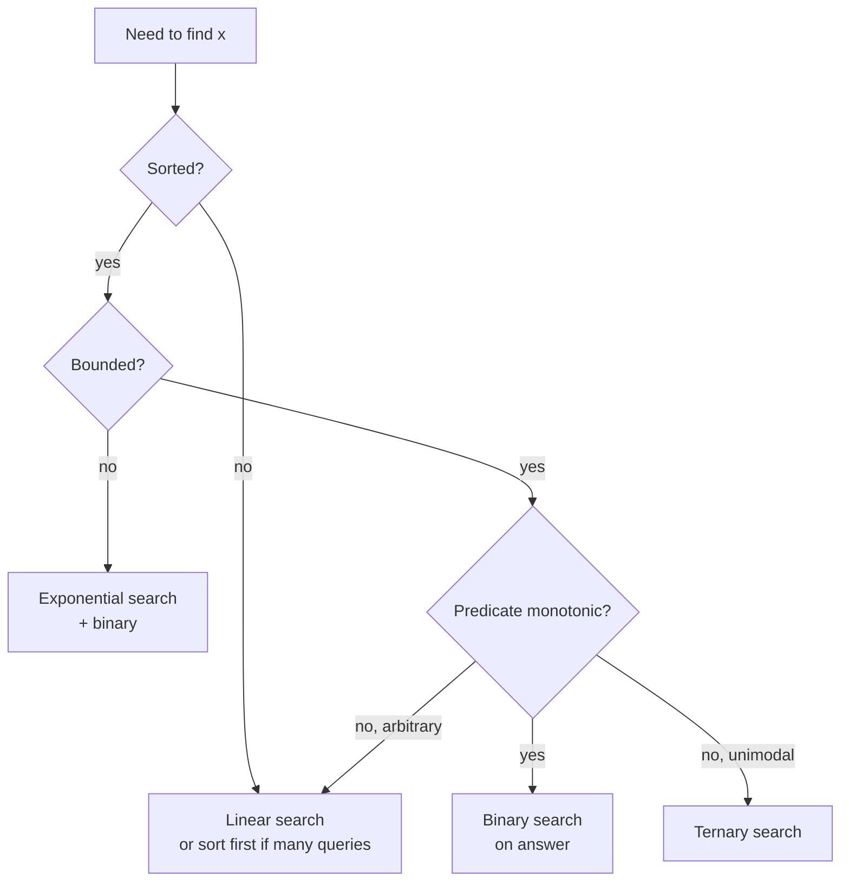

# Searching

> Binary search is one idea. There are five ways to get it wrong, and one template that gets it right every time.

<span class="phase-status phase-done">Phase 4 — Algorithms</span>

---

## The mental model

Searching = "find the index of an element that satisfies a predicate, in a structure that lets you eliminate half the candidates per step." The structure can be:

- A sorted array (the obvious case).
- A monotonic function (e.g. "is `k` workers enough?" — false for small `k`, true for large `k`).
- A unimodal function (rises then falls — ternary search).
- An unbounded sequence (exponential search to find a range, then binary).

Most "binary search" interview problems are *not* about searching a sorted array — they're about recognising monotonicity and binary-searching the answer.

---

## Linear search — the baseline

```python linenums="1"
def linear_search(a: list[int], target: int) -> int:
    for i, x in enumerate(a):
        if x == target:
            return i
    return -1
```

`O(n)`. Use when:

- The array is unsorted and you'll only search once (sorting first costs `O(n log n)`).
- `n` is small (≤ ~20). Constant factor wins.
- You need *all* matches, not just one.

`list.index(x)` is the C-level version; prefer it.

---

## Binary search — the three variants

The single biggest source of binary-search bugs is conflating these. Pick *one* invariant, write it down, never deviate.

### Variant 1: exact match

Returns an index of `target`, or `-1`.

```python linenums="1"
def binary_search(a: list[int], target: int) -> int:
    lo, hi = 0, len(a) - 1   # closed interval [lo, hi]
    while lo <= hi:
        mid = lo + (hi - lo) // 2  # avoid overflow (matters in C, free in Python)
        if a[mid] == target:
            return mid
        if a[mid] < target:
            lo = mid + 1
        else:
            hi = mid - 1
    return -1
```

**Invariant**: if `target` is in the array, it is in `a[lo..hi]` (closed interval).

### Variant 2: leftmost insertion point (`bisect_left`)

Smallest index `i` such that `a[i] >= target`. Equal to `len(a)` if all elements are smaller.

```python linenums="1"
def lower_bound(a: list[int], target: int) -> int:
    lo, hi = 0, len(a)        # half-open [lo, hi)
    while lo < hi:
        mid = (lo + hi) // 2
        if a[mid] < target:
            lo = mid + 1
        else:
            hi = mid
    return lo
```

**Invariant**: the answer is in `[lo, hi)`.

### Variant 3: rightmost insertion point (`bisect_right`)

Smallest index `i` such that `a[i] > target` — i.e. one past the last occurrence.

```python linenums="1"
def upper_bound(a: list[int], target: int) -> int:
    lo, hi = 0, len(a)
    while lo < hi:
        mid = (lo + hi) // 2
        if a[mid] <= target:
            lo = mid + 1
        else:
            hi = mid
    return lo
```

**Count of `target`** in a sorted array = `upper_bound(a, target) - lower_bound(a, target)`. Don't write your own — use `bisect.bisect_left` / `bisect.bisect_right` from stdlib.

??? tip "When to pick which variant"
    - "Does `x` exist?" → Variant 1.
    - "Where would I insert `x` to keep order?" → Variant 2 (or 3 — pick by tie-break preference).
    - "How many `x`s are there?" → 3 minus 2.
    - "First element ≥ threshold?" → Variant 2.
    - "Last element ≤ threshold?" → Variant 3, then `-1`.

---

## The "binary search on the answer" pattern

This is what 80% of hard binary-search problems actually want. The structure:

1. Identify a *predicate* `feasible(x)` that is **monotonic** — once it becomes true, it stays true (or vice versa).
2. Find the *boundary* between false and true with binary search.

### Template

```python linenums="1"
from typing import Callable

def search_answer(lo: int, hi: int, feasible: Callable[[int], bool]) -> int:
    """
    Smallest x in [lo, hi] for which feasible(x) is True.
    Assumes feasible is monotonic: F F F T T T.
    """
    while lo < hi:
        mid = lo + (hi - lo) // 2
        if feasible(mid):
            hi = mid           # mid might be the answer
        else:
            lo = mid + 1       # mid is definitely not
    return lo
```

That's it. Memorise it. The interview challenge is recognising the predicate, not the binary search.

---

## Ternary search — for unimodal functions

If the function rises then falls (peak somewhere in the middle), binary search doesn't apply because there's no monotonic predicate. Ternary search splits into thirds.

```python linenums="1"
from typing import Callable

def ternary_search(lo: float, hi: float, f: Callable[[float], float], eps: float = 1e-9) -> float:
    """Find argmax of unimodal f on [lo, hi]."""
    while hi - lo > eps:
        m1 = lo + (hi - lo) / 3
        m2 = hi - (hi - lo) / 3
        if f(m1) < f(m2):
            lo = m1
        else:
            hi = m2
    return (lo + hi) / 2
```

`O(log₃ n)` calls. Used in: optimal-projectile-angle problems, and surprisingly in convex optimisation as a 1-D line search.

!!! warning "Ternary search needs *strict* unimodality"
    If `f` has a plateau at the top, both `f(m1) == f(m2)` cases can happen and you might prune the wrong side. Add an explicit equality branch or handle plateaus separately.

---

## Exponential search — for unbounded inputs

You don't know the array length (e.g. it's a stream, or an enormous sorted file). Find a range that contains the target, then binary-search within it.

```python linenums="1"
def exponential_search(reader, target: int) -> int:
    """`reader[i]` returns the i-th element or raises IndexError past the end."""
    if reader[0] == target:
        return 0
    bound = 1
    try:
        while reader[bound] < target:
            bound *= 2
    except IndexError:
        pass
    # binary search in [bound // 2, min(bound, end)]
    lo, hi = bound // 2, bound
    while lo <= hi:
        mid = (lo + hi) // 2
        try:
            v = reader[mid]
        except IndexError:
            hi = mid - 1
            continue
        if v == target: return mid
        if v < target: lo = mid + 1
        else: hi = mid - 1
    return -1
```

Total work `O(log p)` where `p` is the position of the target — even if the array is infinite.

---

## Interpolation search — when keys are uniformly distributed

Instead of always picking the middle, pick a position weighted by where the target *should* be if values were linear:

```python linenums="1"
def interpolation_search(a: list[int], target: int) -> int:
    lo, hi = 0, len(a) - 1
    while lo <= hi and a[lo] <= target <= a[hi]:
        if lo == hi:
            return lo if a[lo] == target else -1
        # linear-interpolate the position
        pos = lo + ((target - a[lo]) * (hi - lo)) // (a[hi] - a[lo])
        if a[pos] == target: return pos
        if a[pos] < target: lo = pos + 1
        else: hi = pos - 1
    return -1
```

`O(log log n)` *if* keys are uniformly distributed. Pathological inputs (geometric, clustered) degrade to `O(n)`. Rarely worth it in practice — used in some database index code.

---

## When binary search is *wrong*

!!! warning "The five binary-search footguns"
    1. **Unsorted input.** Obvious, but the most common bug — someone sorts only by one field, then binary-searches by another.
    2. **Non-monotonic predicate.** "Find any element where `f(x) > 0`" — if `f` isn't monotonic, you can't prune halves.
    3. **Off-by-one between `<` and `<=`.** Pick a half-open interval `[lo, hi)` style and stay consistent. Mixing `lo <= hi` with `hi = mid` causes infinite loops.
    4. **Floating-point comparisons.** `while lo < hi` on floats may never terminate. Use `while hi - lo > eps` or fixed iteration count.
    5. **`mid = (lo + hi) / 2` overflow.** Not in Python, but in C/Java this is the famous Joshua Bloch bug. Use `lo + (hi - lo) // 2` as muscle memory.

### Termination check

If your loop doesn't terminate, the search space isn't shrinking. Common causes:

- `lo = mid` (instead of `mid + 1`) when the predicate excludes `mid`.
- `hi = mid` *and* the loop condition is `lo <= hi` — boundary never closes.

Run with `n = 2` by hand. If you go round twice with the same `lo, hi`, you have a bug.

---

## Interview problems

### 1. Search in rotated sorted array (LeetCode 33)

The array was sorted, then rotated at an unknown pivot. Find `target` in `O(log n)`.

Trick: at any `mid`, *one half* `[lo, mid]` or `[mid, hi]` is still sorted. Decide which, then check whether `target` lies in the sorted half.

```python linenums="1"
def search_rotated(a: list[int], target: int) -> int:
    lo, hi = 0, len(a) - 1
    while lo <= hi:
        mid = (lo + hi) // 2
        if a[mid] == target: return mid

        if a[lo] <= a[mid]:               # left half sorted
            if a[lo] <= target < a[mid]:
                hi = mid - 1
            else:
                lo = mid + 1
        else:                              # right half sorted
            if a[mid] < target <= a[hi]:
                lo = mid + 1
            else:
                hi = mid - 1
    return -1
```

Edge case: duplicates (LeetCode 81). When `a[lo] == a[mid] == a[hi]`, you can't tell which half is sorted — increment `lo`, decrement `hi`. Worst case becomes `O(n)`.

### 2. Find peak element (LeetCode 162)

Array where neighbours are unequal. Find any index `i` such that `a[i] > a[i-1]` and `a[i] > a[i+1]`. Treat out-of-bounds as `-∞`.

```python linenums="1"
def find_peak(a: list[int]) -> int:
    lo, hi = 0, len(a) - 1
    while lo < hi:
        mid = (lo + hi) // 2
        if a[mid] > a[mid + 1]:
            hi = mid          # peak is at mid or to its left
        else:
            lo = mid + 1      # peak is strictly to the right
    return lo
```

This works because the array's edges are `-∞` — the predicate "is descending at `mid`?" is monotonic in the sense that whichever side rises must contain a peak.

### 3. Koko eating bananas (LeetCode 875) — binary search on the answer

Koko eats `k` bananas/hour from one pile per hour. Given `piles` and `h` hours, find the minimum `k` that finishes everything in time.

`feasible(k)` = "can finish in `h` hours?" is monotonic (more bananas/hour → fewer hours). Binary search `k` over `[1, max(piles)]`.

```python linenums="1"
import math

def min_eating_speed(piles: list[int], h: int) -> int:
    def feasible(k: int) -> bool:
        return sum(math.ceil(p / k) for p in piles) <= h

    lo, hi = 1, max(piles)
    while lo < hi:
        mid = (lo + hi) // 2
        if feasible(mid):
            hi = mid
        else:
            lo = mid + 1
    return lo
```

Same template solves "Capacity to ship within D days" (LeetCode 1011), "Split array largest sum" (LeetCode 410), "Minimise maximum distance to gas station" (LeetCode 774). Once you see the predicate, the rest is mechanical.

---

## Built-in `bisect` — use it

```python linenums="1"
import bisect

a = [1, 3, 3, 5, 7]
bisect.bisect_left(a, 3)    # 1   (leftmost 3)
bisect.bisect_right(a, 3)   # 3   (just past the 3s)
bisect.insort(a, 4)         # in-place insert keeping sort order
```

`bisect_left` is implemented in C and ~50× faster than a hand-rolled Python loop on large arrays. In an interview, write your own to demonstrate, but mention `bisect` exists.

---

## Choosing a search strategy



---

## 🃏 Cheatsheet

- Three binary-search variants — pick one invariant, stick to it.
- `bisect_left` / `bisect_right` from stdlib — don't reinvent.
- "Binary search on the answer" template: define monotonic `feasible(x)`, binary search the boundary.
- Ternary search for *strictly* unimodal continuous functions.
- Exponential search when input is unbounded.
- Footguns: unsorted, non-monotonic, off-by-one, floats, overflow.
- Hot interview problems: rotated array, find peak, Koko, ship within D days, split array largest sum.
- Always mentally run `n = 2` — termination check.
