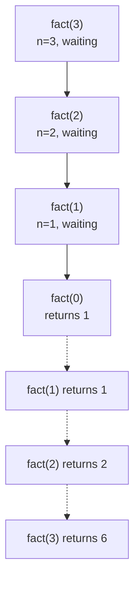
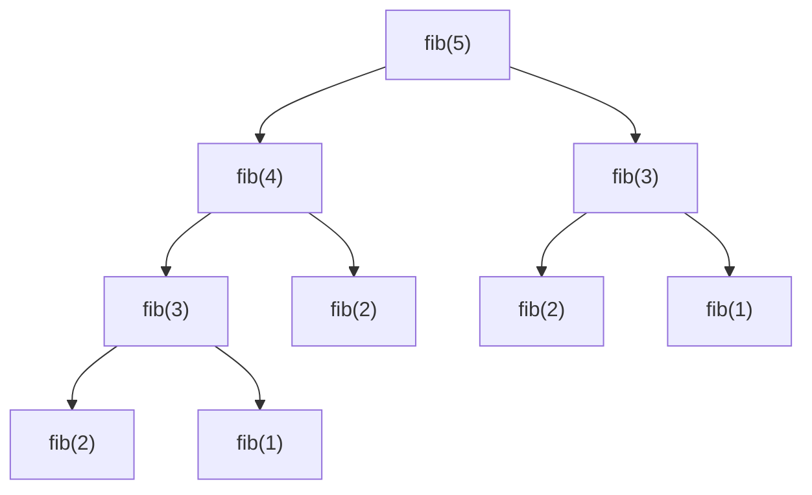

# Recursion

> A function calling itself is just a loop with extra stack frames. The hard part is trusting it.

<span class="phase-status phase-done">Phase 4 — Algorithms</span>

---

## The mental model

A recursive function works because of one act of faith: **assume the smaller call returns the right answer, and use it.** That assumption is the inductive hypothesis. You don't trace it down to the base case in your head — you trace exactly *one level*, then trust the rest.

Three ingredients are non-negotiable:

1. **Base case** — the input is small enough to answer directly.
2. **Recursive case** — break the problem into one or more smaller versions of itself.
3. **Progress** — every recursive call moves *strictly toward* a base case, otherwise you stack-overflow.

If any of those three is missing, your recursion is broken before you write the first line.

---

## Stack frames — what's actually happening

Every function call pushes a **frame** onto the call stack: the local variables, the return address, the parameters. Recursion = lots of frames stacked up. When the deepest call returns, its frame pops and the next-deepest resumes.



Python's default stack limit is **1000 frames** (`sys.getrecursionlimit()`). Deep recursion crashes with `RecursionError: maximum recursion depth exceeded`. You can raise it with `sys.setrecursionlimit(100_000)` — but you're papering over a design issue. The real fix is iteration or `@lru_cache` to dedupe calls.

---

## The recursion tree

Drawing the tree of subcalls is the single most useful debugging tool for any recursive algorithm. It tells you:

- The depth — your stack usage.
- The branching factor — how the work multiplies.
- Repeated subproblems — which is exactly when you reach for memoisation.



Notice `fib(3)` appears twice, `fib(2)` appears three times. That's the `O(2ⁿ)` blow-up of naive Fibonacci — and the punchline of any "improve this" follow-up.

---

## Classic problems

### Factorial

```python linenums="1"
def factorial(n: int) -> int:
    if n < 0:
        raise ValueError("factorial undefined for negatives")
    if n <= 1:           # base case
        return 1
    return n * factorial(n - 1)
```

`O(n)` time, `O(n)` stack. Useless in production (`math.factorial` is C and faster) but the mental template for everything that follows.

### Fibonacci — naive vs memoised

```python linenums="1"
def fib_slow(n: int) -> int:
    if n < 2:
        return n
    return fib_slow(n - 1) + fib_slow(n - 2)   # O(2ⁿ)


from functools import lru_cache

@lru_cache(maxsize=None)
def fib_fast(n: int) -> int:
    if n < 2:
        return n
    return fib_fast(n - 1) + fib_fast(n - 2)   # O(n) thanks to caching
```

Memoisation is recursion's killer feature. Adding one decorator collapses the tree into a DAG — every `fib(k)` is computed once. We cover this in depth in [Dynamic Programming](05-dynamic-programming.md).

### Power — fast exponentiation

```python linenums="1"
def power(base: float, exp: int) -> float:
    if exp == 0:
        return 1
    if exp < 0:
        return 1 / power(base, -exp)
    half = power(base, exp // 2)
    return half * half if exp % 2 == 0 else half * half * base
```

`O(log n)` instead of `O(n)`. Used in modular exponentiation for cryptography and in matrix exponentiation for `O(log n)` Fibonacci.

### Tower of Hanoi

The pedagogical problem for "trust the recursive call". Move `n` disks from `src` to `dst` via `aux`:

1. Move `n-1` disks from `src` to `aux`.
2. Move 1 disk from `src` to `dst`.
3. Move `n-1` disks from `aux` to `dst`.

```python linenums="1"
def hanoi(n: int, src: str, dst: str, aux: str, moves: list[str]) -> None:
    if n == 0:
        return
    hanoi(n - 1, src, aux, dst, moves)
    moves.append(f"{src} -> {dst}")
    hanoi(n - 1, aux, dst, src, moves)
```

`2ⁿ - 1` moves — provably optimal. Step 1 is the leap of faith: "I assume I know how to move `n-1` disks anywhere I want."

### Generate parentheses (LeetCode 22)

```python linenums="1"
def generate_parens(n: int) -> list[str]:
    out: list[str] = []
    def go(s: str, opened: int, closed: int) -> None:
        if len(s) == 2 * n:
            out.append(s); return
        if opened < n:
            go(s + "(", opened + 1, closed)
        if closed < opened:
            go(s + ")", opened, closed + 1)
    go("", 0, 0)
    return out
```

Notice the constraint `closed < opened` — that's the *valid-prefix* invariant that prunes invalid branches early. This is **backtracking**: try a choice, recurse, undo. We come back to it in [Subsets & Backtracking](../04-patterns/10-subsets-backtracking.md).

### Permutations (LeetCode 46)

```python linenums="1"
def permutations(nums: list[int]) -> list[list[int]]:
    out: list[list[int]] = []
    def go(remaining: list[int], path: list[int]) -> None:
        if not remaining:
            out.append(path[:]); return
        for i, x in enumerate(remaining):
            path.append(x)
            go(remaining[:i] + remaining[i+1:], path)
            path.pop()    # backtrack
    go(nums, [])
    return out
```

`O(n · n!)` time. The `path.append` / `path.pop` pattern is the explicit backtrack — without it, every recursive call gets the same mutable `path`.

---

## Tail recursion — and why Python doesn't help you

A function is **tail-recursive** when the recursive call is the *last* action — no work happens after it returns:

```python linenums="1"
def factorial_tail(n: int, acc: int = 1) -> int:
    if n <= 1:
        return acc
    return factorial_tail(n - 1, n * acc)   # tail call: nothing happens after
```

In tail-call-optimising languages (Scheme, OCaml, Scala-with-`@tailrec`), the compiler reuses the *same* stack frame, so tail recursion runs in `O(1)` space — equivalent to a loop.

**Python deliberately does not do this.** Guido's reasoning:

1. Stack traces become useless — you can't see the chain of calls.
2. It hides the cost of recursion behind syntactic sugar.
3. Pythonic code uses loops; if you need iteration, write iteration.

So in Python, every "tail-recursive" function still consumes `O(n)` stack and will overflow for large `n`. **The fix is always to rewrite as a loop**:

```python linenums="1"
def factorial_iter(n: int) -> int:
    acc = 1
    for i in range(2, n + 1):
        acc *= i
    return acc
```

---

## Converting recursion to iteration with an explicit stack

Any recursive function can become iterative by simulating the call stack manually. This is essential when:

- Inputs are deep enough to overflow Python's stack (DOM trees, large graphs).
- You need to pause/resume (e.g. lazy iterator).
- You want fine control over memory.

### Example: iterative DFS

```python linenums="1"
def dfs_recursive(node, visited: set) -> None:
    if node is None or node in visited:
        return
    visited.add(node)
    for nb in node.neighbours:
        dfs_recursive(nb, visited)


def dfs_iterative(start, visited: set) -> None:
    stack = [start]
    while stack:
        node = stack.pop()
        if node is None or node in visited:
            continue
        visited.add(node)
        # reverse so we visit in same order as recursive version
        for nb in reversed(node.neighbours):
            stack.append(nb)
```

For algorithms with **post-order** work (do something *after* recursing, like in tree-DP), the trick is to push a `(node, "enter")` frame and a `(node, "exit")` frame — the exit frame runs your post-order code.

---

## Pitfalls

!!! warning "The five recursion bugs that kill interviews"
    1. **Missing base case.** Infinite recursion → `RecursionError`. Always write the base case first.
    2. **Base case never reached.** Recursive call doesn't strictly shrink the input. Classic: `f(n // 2)` when `n = 1`.
    3. **Mutable default arguments.** `def go(path=[]):` — the same list is shared across all top-level calls. Use `path: list[int] | None = None` and initialise inside.
    4. **Mutating shared state without backtracking.** `path.append(x); recurse(); # forgot path.pop()`. Every iteration accumulates garbage.
    5. **Recomputing the same subproblems.** If your tree has overlapping subproblems, add `@lru_cache` or convert to bottom-up DP. Saves you from `O(2ⁿ)`.

### Stack-overflow rescue kit

If you hit `RecursionError`:

```python linenums="1"
import sys
sys.setrecursionlimit(10_000)   # only as a quick fix
```

Better: convert to iteration or use `sys.setrecursionlimit` *and* run in a thread with a larger stack:

```python linenums="1"
import sys, threading

def main():
    sys.setrecursionlimit(1_000_000)
    # ... your recursive code

threading.Thread(target=main, args=(), daemon=False).start()
```

Even better: rewrite the algorithm. Stack overflows in production code are bug magnets.

---

## Recursion vs iteration — when to pick which

| Situation                                    | Pick      | Why                                          |
|----------------------------------------------|-----------|----------------------------------------------|
| Tree / graph traversal                       | Recursion | Natural; tree shape matches call structure.   |
| Linear repetition (sum, max, mapping)         | Iteration | No win from recursion, just stack overhead.   |
| Divide and conquer (merge sort, quickselect) | Recursion | Subproblems are independent and identical.    |
| Backtracking with undo                       | Recursion | The undo-on-return is automatic.              |
| Very deep input (millions of items)          | Iteration | Stack would overflow.                         |
| Need to pause/resume                         | Iteration | Recursion holds state in frames you can't pause. |

---

## Interview problems

### 1. Reverse a linked list — recursively (LeetCode 206)

The classic "do you really understand recursion?" probe.

```python linenums="1"
class Node:
    def __init__(self, val: int, nxt: "Node | None" = None) -> None:
        self.val, self.next = val, nxt

def reverse(head: Node | None) -> Node | None:
    if head is None or head.next is None:
        return head
    new_head = reverse(head.next)   # leap of faith: tail is reversed
    head.next.next = head           # point next-node back at us
    head.next = None                # we're now the tail
    return new_head
```

The leap of faith: `reverse(head.next)` *already* returned the new head of a fully-reversed sublist. We just need to splice ourselves on at the end. `O(n)` time, `O(n)` stack.

### 2. Subsets (LeetCode 78)

Generate all `2ⁿ` subsets. Two recursive recipes — both worth knowing:

```python linenums="1"
# Style A: include / exclude each element
def subsets(nums: list[int]) -> list[list[int]]:
    out: list[list[int]] = []
    def go(i: int, path: list[int]) -> None:
        if i == len(nums):
            out.append(path[:]); return
        go(i + 1, path)                 # exclude
        path.append(nums[i])
        go(i + 1, path)                 # include
        path.pop()
    go(0, [])
    return out


# Style B: pick-from-here onward (often reads cleaner for combinations)
def subsets_pick(nums: list[int]) -> list[list[int]]:
    out: list[list[int]] = []
    def go(start: int, path: list[int]) -> None:
        out.append(path[:])              # every node = a valid subset
        for i in range(start, len(nums)):
            path.append(nums[i])
            go(i + 1, path)
            path.pop()
    go(0, [])
    return out
```

### 3. Word search (LeetCode 79)

DFS + backtracking on a grid. Try every cell as the start, recursively check its 4 neighbours, mark cells as visited (use a sentinel) and unmark on the way out.

```python linenums="1"
def exist(board: list[list[str]], word: str) -> bool:
    rows, cols = len(board), len(board[0])

    def dfs(r: int, c: int, k: int) -> bool:
        if k == len(word):
            return True
        if r < 0 or r >= rows or c < 0 or c >= cols or board[r][c] != word[k]:
            return False
        tmp, board[r][c] = board[r][c], "#"   # mark
        found = (dfs(r+1, c, k+1) or dfs(r-1, c, k+1)
                 or dfs(r, c+1, k+1) or dfs(r, c-1, k+1))
        board[r][c] = tmp                      # unmark — backtrack
        return found

    return any(dfs(r, c, 0) for r in range(rows) for c in range(cols))
```

The mark/unmark is the *signature* of recursive backtracking on a shared structure.

---

## 🃏 Cheatsheet

- **Three ingredients**: base case, recursive case, strict progress toward the base.
- **Trust the recursive call** — assume it returns the right answer; trace exactly one level.
- **Draw the recursion tree** — depth = stack, branching = work, repeats = memoise.
- **Python doesn't do tail-call optimisation** — rewrite tail recursion as a loop.
- **Default recursion limit is 1000**. Convert to iteration with explicit stack for deep trees.
- **Backtracking pattern**: `path.append(x); recurse(); path.pop()`. Always undo.
- **Memoise overlapping subproblems** with `@lru_cache` — collapses tree → DAG.
- **Hot problems**: reverse linked list, subsets, permutations, generate parens, word search, Hanoi.
