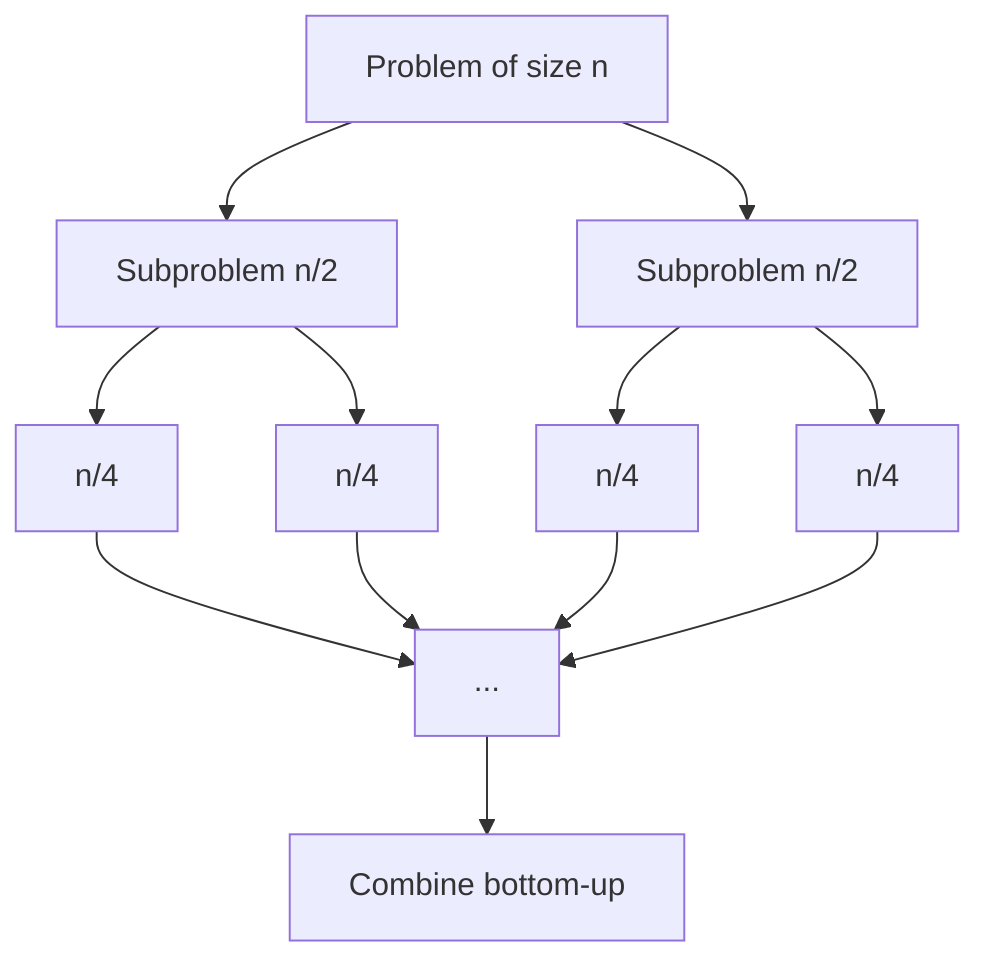

# Divide & Conquer

> Break the problem into independent halves, solve each, then stitch the answers back together.

<span class="phase-status phase-done">Phase 4 — Algorithms</span>

---

## 📖 The recipe

Divide & conquer (D&C) is a three-step pattern that shows up everywhere a problem has the property: **"solving two halves is easier than solving the whole."**

1. **Divide** — split the input into two (or more) smaller, **independent** subproblems of the same shape.
2. **Conquer** — recurse on each subproblem until you hit a trivial base case.
3. **Combine** — merge the subproblem answers into the answer for the original.



!!! tip "D&C vs. DP — the line"
    Both recurse and combine. The difference is **subproblem overlap**.

    - **D&C**: the halves are disjoint (merge sort sorts `arr[:m]` and `arr[m:]` — no shared elements).
    - **DP**: the subproblems overlap (Fibonacci's `fib(5)` and `fib(6)` both need `fib(4)`).

    If subproblems overlap, you want memoization → DP. If they don't, plain recursion is enough → D&C.

---

## 🎓 The Master Theorem

When a D&C recurrence has the shape

$$
T(n) = a \cdot T(n/b) + f(n)
$$

where `a ≥ 1`, `b > 1`, and `f(n)` is the work to split + combine, the Master Theorem gives `T(n)` directly. Compare `f(n)` against `n^(log_b a)`:

| Case | Condition | Result |
|------|-----------|--------|
| 1 | `f(n) = O(n^(log_b a − ε))` for some `ε > 0` | `T(n) = Θ(n^(log_b a))` |
| 2 | `f(n) = Θ(n^(log_b a))` | `T(n) = Θ(n^(log_b a) · log n)` |
| 3 | `f(n) = Ω(n^(log_b a + ε))` and regularity holds | `T(n) = Θ(f(n))` |

**Translation in plain English:** whichever wins between "the leaves" (`n^(log_b a)`) and "the work per level" (`f(n)`) sets the asymptotic cost. If they tie, you pay a `log n` factor.

??? question "Worked examples"

    - **Merge sort:** `T(n) = 2T(n/2) + O(n)`. Here `a=2, b=2`, so `n^(log_b a) = n`. Combine is `O(n)` — case 2. **Result: `Θ(n log n)`.**
    - **Binary search:** `T(n) = T(n/2) + O(1)`. `a=1, b=2`, `n^(log_b a) = 1`. Combine is `O(1)` — case 2. **Result: `Θ(log n)`.**
    - **Strassen's matmul:** `T(n) = 7T(n/2) + O(n²)`. `n^(log_2 7) ≈ n^2.807`, which dominates `n²` — case 1. **Result: `Θ(n^log₂ 7) ≈ Θ(n^2.807)`.**
    - **Karatsuba:** `T(n) = 3T(n/2) + O(n)`. `n^(log_2 3) ≈ n^1.585` dominates — case 1. **Result: `Θ(n^1.585)`.**

!!! warning "When the Master Theorem doesn't apply"
    The theorem assumes `a, b` are constants and the split is even. It **fails** for:

    - Uneven splits (`T(n) = T(n/3) + T(2n/3) + O(n)` — solve via Akra–Bazzi or recursion tree).
    - Subtractive recurrences (`T(n) = T(n−1) + O(n)` — that's not D&C, that's iterative).
    - Non-polynomial gaps between cases (e.g. `f(n) = n · log n` against `n^(log_b a) = n`). There's a 4th "extended" case for `log^k n` factors but most interviews don't expect it.

    When in doubt, **draw the recursion tree**: count work per level × number of levels.

---

## 🛠 Classic problems

### Merge sort

Canonical D&C. Sort halves, merge.

```python
from __future__ import annotations

def merge_sort(arr: list[int]) -> list[int]:
    """Stable O(n log n) sort. Returns a new list."""
    if len(arr) <= 1:
        return arr[:]
    mid = len(arr) // 2
    left = merge_sort(arr[:mid])
    right = merge_sort(arr[mid:])
    return _merge(left, right)

def _merge(left: list[int], right: list[int]) -> list[int]:
    out: list[int] = []
    i = j = 0
    while i < len(left) and j < len(right):
        if left[i] <= right[j]:        # `<=` keeps it stable
            out.append(left[i]); i += 1
        else:
            out.append(right[j]); j += 1
    out.extend(left[i:])
    out.extend(right[j:])
    return out
```

**Complexity:** `T(n) = 2T(n/2) + O(n) = O(n log n)`. Space `O(n)` for the temporary buffers.

### Quick sort

Pick a pivot, partition, recurse. **Average** `O(n log n)`, **worst** `O(n²)` on adversarial input.

```python
import random

def quick_sort(arr: list[int]) -> None:
    """In-place. Randomized pivot avoids worst case on sorted input."""
    def _qs(lo: int, hi: int) -> None:
        if lo >= hi:
            return
        p = random.randint(lo, hi)             # randomize!
        arr[p], arr[hi] = arr[hi], arr[p]
        pivot = arr[hi]
        i = lo
        for j in range(lo, hi):
            if arr[j] < pivot:
                arr[i], arr[j] = arr[j], arr[i]
                i += 1
        arr[i], arr[hi] = arr[hi], arr[i]
        _qs(lo, i - 1)
        _qs(i + 1, hi)

    _qs(0, len(arr) - 1)
```

!!! warning "Quick sort interview gotchas"
    - **Always randomize** (or use median-of-three). Sorted input + first-element pivot = `O(n²)`.
    - Recursion depth is `O(log n)` average, `O(n)` worst — risk of stack overflow on huge arrays. Recurse on the smaller side first, iterate on the larger.
    - **Not stable** out of the box.

### Binary search as D&C

Often taught as iterative, but the D&C form makes the recurrence obvious: `T(n) = T(n/2) + O(1) = O(log n)`.

```python
def binary_search(arr: list[int], target: int) -> int:
    def _bs(lo: int, hi: int) -> int:
        if lo > hi:
            return -1
        mid = (lo + hi) // 2
        if arr[mid] == target:
            return mid
        if arr[mid] < target:
            return _bs(mid + 1, hi)
        return _bs(lo, mid - 1)
    return _bs(0, len(arr) - 1)
```

### Maximum subarray (Kadane vs D&C)

Kadane is `O(n)` and easier — but D&C is the canonical interview question for "explain a non-obvious D&C." The trick is the **combine step**: the max subarray either lives entirely in the left half, entirely in the right, or **crosses the midpoint**. The crossing case is `O(n)` per call.

```python
def max_subarray(arr: list[int]) -> int:
    def _solve(lo: int, hi: int) -> int:
        if lo == hi:
            return arr[lo]
        mid = (lo + hi) // 2
        left_best = _solve(lo, mid)
        right_best = _solve(mid + 1, hi)
        cross = _max_crossing(lo, mid, hi)
        return max(left_best, right_best, cross)

    def _max_crossing(lo: int, mid: int, hi: int) -> int:
        # Best suffix of left half + best prefix of right half.
        s, left_sum = 0, float("-inf")
        for i in range(mid, lo - 1, -1):
            s += arr[i]
            left_sum = max(left_sum, s)
        s, right_sum = 0, float("-inf")
        for i in range(mid + 1, hi + 1):
            s += arr[i]
            right_sum = max(right_sum, s)
        return int(left_sum + right_sum)

    return _solve(0, len(arr) - 1)
```

**Complexity:** `T(n) = 2T(n/2) + O(n) = O(n log n)`. Worse than Kadane's `O(n)` — we use D&C here because it generalizes (e.g. segment trees for range max-subarray queries).

### Closest pair of points (2D)

Brute force is `O(n²)`. D&C does it in `O(n log n)` — a classic.

**Idea:**

1. Sort points by `x`.
2. Recurse on left and right halves; let `d = min(d_left, d_right)`.
3. **Combine:** points within `d` of the midline could form a closer pair across halves. Sort that "strip" by `y`. Each point only needs to check the next ~7 points in the strip (geometric argument: in a `d × 2d` rectangle, you can pack at most 8 points all pairwise ≥ `d` apart).

```python
import math
Point = tuple[float, float]

def closest_pair(pts: list[Point]) -> float:
    pts_x = sorted(pts, key=lambda p: p[0])

    def _solve(px: list[Point]) -> float:
        n = len(px)
        if n <= 3:
            return min(_dist(px[i], px[j])
                       for i in range(n) for j in range(i + 1, n))
        mid = n // 2
        midx = px[mid][0]
        d = min(_solve(px[:mid]), _solve(px[mid:]))
        # Strip: points within d of the midline, sorted by y.
        strip = sorted([p for p in px if abs(p[0] - midx) < d],
                       key=lambda p: p[1])
        for i, p in enumerate(strip):
            for q in strip[i + 1: i + 8]:        # at most 7 neighbours
                if q[1] - p[1] >= d:
                    break
                d = min(d, _dist(p, q))
        return d

    return _solve(pts_x)

def _dist(a: Point, b: Point) -> float:
    return math.hypot(a[0] - b[0], a[1] - b[1])
```

**Complexity:** `T(n) = 2T(n/2) + O(n log n) = O(n log² n)` as written. With a presort by `y` and merge during recursion you get `O(n log n)`.

### Strassen's matrix multiplication (flavor)

Naive matmul is `O(n³)`. Strassen splits each `n × n` matrix into four `n/2 × n/2` blocks, computes **7** clever block products instead of 8, and combines via additions:

`T(n) = 7T(n/2) + O(n²) = O(n^log₂ 7) ≈ O(n^2.807)`.

In practice it loses to BLAS for small `n` (constant factor + cache effects), so it's mostly an interview talking point. Coppersmith–Winograd brings the exponent below 2.373, but the constants are astronomical.

### Fast exponentiation (binary exponentiation)

Compute `a^n` in `O(log n)` instead of `O(n)`.

```python
def fast_pow(a: int, n: int, mod: int | None = None) -> int:
    """a**n, optionally mod m. Iterative is the cleaner form."""
    result = 1
    base = a if mod is None else a % mod
    while n > 0:
        if n & 1:
            result = result * base if mod is None else (result * base) % mod
        base = base * base if mod is None else (base * base) % mod
        n >>= 1
    return result
```

**Why D&C?** Recurrence is `a^n = (a^(n/2))^2` if `n` even, else `a · a^(n-1)`. Master theorem case: `T(n) = T(n/2) + O(1) = O(log n)`.

**Generalizes to:** matrix exponentiation (Fibonacci in `O(log n)`), modular exponentiation (RSA), polynomial exponentiation.

### Count inversions via merge sort

An **inversion** is a pair `(i, j)` with `i < j` but `arr[i] > arr[j]`. Brute force is `O(n²)`. Merge sort counts them as a side effect of the merge — when an element from the right half is taken before elements remaining in the left half, every remaining left element forms an inversion with it.

```python
def count_inversions(arr: list[int]) -> int:
    def _ms(a: list[int]) -> tuple[list[int], int]:
        if len(a) <= 1:
            return a, 0
        m = len(a) // 2
        left, inv_l = _ms(a[:m])
        right, inv_r = _ms(a[m:])
        merged, inv_split = _merge_count(left, right)
        return merged, inv_l + inv_r + inv_split

    def _merge_count(L: list[int], R: list[int]) -> tuple[list[int], int]:
        out, i, j, inv = [], 0, 0, 0
        while i < len(L) and j < len(R):
            if L[i] <= R[j]:
                out.append(L[i]); i += 1
            else:
                out.append(R[j]); j += 1
                inv += len(L) - i        # all remaining L are > R[j]
        out.extend(L[i:]); out.extend(R[j:])
        return out, inv

    _, total = _ms(arr)
    return total
```

**Complexity:** `O(n log n)`.

---

## 🧪 Interview problem 1 — Median of Two Sorted Arrays

> **Problem (LC 4, Hard):** Given two sorted arrays `A` and `B`, return the median of the combined sorted array in `O(log(min(m, n)))`.

The clever insight: we don't need to merge. We need to **partition** both arrays so that everything left of the partitions equals half the total elements, and `max(left) ≤ min(right)`.

```python
def find_median_sorted_arrays(a: list[int], b: list[int]) -> float:
    if len(a) > len(b):
        a, b = b, a              # binary search on the shorter one

    m, n = len(a), len(b)
    half = (m + n + 1) // 2
    lo, hi = 0, m

    while lo <= hi:
        i = (lo + hi) // 2       # take i from a
        j = half - i             # take j from b

        a_left  = a[i - 1] if i > 0 else float("-inf")
        a_right = a[i]     if i < m else float("inf")
        b_left  = b[j - 1] if j > 0 else float("-inf")
        b_right = b[j]     if j < n else float("inf")

        if a_left <= b_right and b_left <= a_right:
            if (m + n) % 2:
                return float(max(a_left, b_left))
            return (max(a_left, b_left) + min(a_right, b_right)) / 2
        if a_left > b_right:
            hi = i - 1
        else:
            lo = i + 1

    raise ValueError("inputs not sorted")
```

**Why it's D&C:** every iteration halves the search space on `a`. `T(m) = T(m/2) + O(1) = O(log m)`. We pick the shorter array so it's `O(log min(m, n))`.

**Gotchas:** sentinel `±inf` for empty halves; integer division for `half` when `m+n` is odd.

---

## 🧪 Interview problem 2 — Kth Largest Element (Quickselect)

> **Problem (LC 215):** Find the kth largest element in an unsorted array. Expected `O(n)` average.

Sorting is `O(n log n)`. A heap is `O(n log k)`. **Quickselect** — quicksort that only recurses on the side containing the answer — is `O(n)` average, `O(n²)` worst.

```python
import random

def find_kth_largest(nums: list[int], k: int) -> int:
    target = len(nums) - k       # kth largest = (n-k)th smallest by index

    def _select(lo: int, hi: int) -> int:
        if lo == hi:
            return nums[lo]
        # Randomized pivot — critical for expected O(n).
        p = random.randint(lo, hi)
        nums[p], nums[hi] = nums[hi], nums[p]
        pivot = nums[hi]

        i = lo
        for j in range(lo, hi):
            if nums[j] < pivot:
                nums[i], nums[j] = nums[j], nums[i]
                i += 1
        nums[i], nums[hi] = nums[hi], nums[i]

        if i == target:
            return nums[i]
        if i < target:
            return _select(i + 1, hi)
        return _select(lo, i - 1)

    return _select(0, len(nums) - 1)
```

**Complexity:** expected `T(n) = T(n/2) + O(n) = O(n)` (geometric series). Worst case `O(n²)` — fixable with median-of-medians for true linear-time worst case, but interview rarely requires it.

**Gotcha:** off-by-one on `target = len(nums) - k`. Test with `nums = [3,2,1,5,6,4], k = 2` → expect `5`.

---

## 🃏 Cheatsheet

| Algorithm | Recurrence | Complexity |
|-----------|-----------|------------|
| Merge sort | `2T(n/2) + O(n)` | `O(n log n)` |
| Quick sort (avg) | `2T(n/2) + O(n)` | `O(n log n)` |
| Quick sort (worst) | `T(n−1) + O(n)` | `O(n²)` |
| Quickselect (avg) | `T(n/2) + O(n)` | `O(n)` |
| Binary search | `T(n/2) + O(1)` | `O(log n)` |
| Fast exponentiation | `T(n/2) + O(1)` | `O(log n)` |
| Max subarray (D&C) | `2T(n/2) + O(n)` | `O(n log n)` |
| Closest pair 2D | `2T(n/2) + O(n log n)` | `O(n log² n)` (or `O(n log n)`) |
| Strassen matmul | `7T(n/2) + O(n²)` | `O(n^2.807)` |
| Count inversions | `2T(n/2) + O(n)` | `O(n log n)` |
| Median of two sorted | `T(n/2) + O(1)` | `O(log min(m,n))` |

**Mental checklist before writing code:**

1. Can I split into independent subproblems of the same shape? (If not → DP / greedy.)
2. What's the **base case** size — 0, 1, 2, or 3? (Closest-pair needs 3.)
3. What's the **combine** step — `O(1)`, `O(n)`, `O(n log n)`?
4. Apply Master Theorem; if it doesn't apply, draw the tree.
5. Watch the **stack depth** — recurse on the smaller half first when iterating on the larger.
