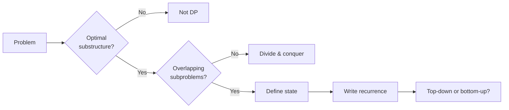

# Dynamic Programming

> Trade memory for time. Solve each subproblem once, reuse the answer forever.

<span class="phase-status phase-done">Phase 4 — Algorithms</span>

---

## 📖 When does DP apply?

Dynamic programming is the answer when a problem has **two** properties:

1. **Optimal substructure** — the optimal answer to the whole problem can be built from optimal answers to subproblems. ("Best path to cell (i,j) = min of best paths to (i-1,j) and (i,j-1), plus grid[i][j].")
2. **Overlapping subproblems** — the naive recursion would re-solve the same subproblem many times. (`fib(5)` and `fib(6)` both call `fib(4)`.)

If only (1) holds without (2), it's plain D&C / greedy. If neither holds, you're stuck with brute force or a different paradigm.

!!! tip "The interview signal"
    Reach for DP when you see:

    - **"Count the number of ways"** to do X.
    - **"Find the min/max"** cost / length / value subject to constraints.
    - **"Is it possible"** to reach a target (subset sum, word break).
    - The problem reduces to a recurrence and the recursion tree has obvious repetition.
    - Greedy gives wrong answers on small examples.



---

## 🧠 The two implementations

### Top-down — memoization

Write the natural recursion. Cache results.

```python
from functools import cache

@cache
def fib(n: int) -> int:
    if n < 2:
        return n
    return fib(n - 1) + fib(n - 2)
```

`@cache` (or `@lru_cache(maxsize=None)`) memoizes by argument tuple. Pros: maps directly to the recurrence, easy to write, computes only reachable states. Cons: recursion stack risk on deep states; less control over iteration order.

### Bottom-up — tabulation

Decide an iteration order such that every state is computed before the states that depend on it. Fill a table.

```python
def fib(n: int) -> int:
    if n < 2:
        return n
    dp = [0] * (n + 1)
    dp[1] = 1
    for i in range(2, n + 1):
        dp[i] = dp[i - 1] + dp[i - 2]
    return dp[n]
```

Pros: no stack, often faster constant factor, enables space optimization. Cons: must reason about iteration order yourself.

### Space optimization — rolling arrays

If `dp[i]` only depends on a constant number of previous rows / cells, you can drop the full table.

```python
def fib(n: int) -> int:
    a, b = 0, 1
    for _ in range(n):
        a, b = b, a + b
    return a
```

`O(n)` time, `O(1)` space. Same trick collapses 2D DPs to 1D when only the previous row is needed (e.g. unique paths, knapsack, edit distance).

!!! warning "Top-down vs bottom-up — when each wins"
    - **Top-down wins** when the state space is sparse (you only visit a fraction of possible states), or when the iteration order is awkward (graph-shaped DPs, tree DPs).
    - **Bottom-up wins** when you need space optimization, when recursion depth would exceed Python's default 1000, or when constant factor matters.
    - Start with top-down to find the recurrence. Convert to bottom-up if you need to optimize space.

---

## 🧩 The 5 DP shapes

Almost every interview DP fits one of these molds.

### Shape 1: 1D linear DP

State is a single index. `dp[i]` depends on a few previous indices.

**Examples:** Fibonacci, Climbing Stairs (`dp[i] = dp[i-1] + dp[i-2]`), House Robber (`dp[i] = max(dp[i-1], dp[i-2] + nums[i])`), Decode Ways, Word Break.

```python
def rob(nums: list[int]) -> int:
    """House Robber I — can't rob adjacent houses."""
    prev, curr = 0, 0
    for x in nums:
        prev, curr = curr, max(curr, prev + x)
    return curr
```

### Shape 2: 2D grid DP

State is `(i, j)`. Usually moves right/down.

**Examples:** Unique Paths, Min Path Sum, Dungeon Game, Cherry Pickup.

```python
def min_path_sum(grid: list[list[int]]) -> int:
    m, n = len(grid), len(grid[0])
    dp = [float("inf")] * n
    dp[0] = 0
    for i in range(m):
        dp[0] += grid[i][0]
        for j in range(1, n):
            dp[j] = min(dp[j], dp[j - 1]) + grid[i][j]
    return int(dp[n - 1])
```

The `dp` array is rolled — `dp[j]` before update is "row above", after update is "current row".

### Shape 3: Interval / range DP

State is `(i, j)` over a range `[i..j]`. Recurrence picks a split point `k` inside the range.

**Examples:** Matrix Chain Multiplication, Palindrome Partitioning II, Burst Balloons, Optimal BST.

```python
def matrix_chain(p: list[int]) -> int:
    """p[i-1] x p[i] is the i-th matrix. Min scalar multiplications."""
    n = len(p) - 1
    dp = [[0] * n for _ in range(n)]
    for length in range(2, n + 1):              # length of subchain
        for i in range(n - length + 1):
            j = i + length - 1
            dp[i][j] = float("inf")
            for k in range(i, j):
                cost = dp[i][k] + dp[k + 1][j] + p[i] * p[k + 1] * p[j + 1]
                dp[i][j] = min(dp[i][j], cost)
    return dp[0][n - 1]
```

**Iteration order critical:** outer loop on **length**, not on `i` or `j`. Smaller intervals must be solved before larger ones. This burns interview candidates constantly.

### Shape 4: Subset / knapsack DP

State includes "items considered so far" + "resource used so far".

- **0/1 knapsack:** each item used at most once. Iterate weight loop **in reverse** to avoid reusing.
- **Unbounded knapsack:** each item reusable. Iterate forward.
- **Partition equal subset:** boolean knapsack with target `sum/2`.

```python
def can_partition(nums: list[int]) -> bool:
    s = sum(nums)
    if s % 2:
        return False
    target = s // 2
    dp = [False] * (target + 1)
    dp[0] = True
    for x in nums:
        for w in range(target, x - 1, -1):       # reverse → 0/1
            dp[w] = dp[w] or dp[w - x]
    return dp[target]
```

### Shape 5: String DP

State is positions in one or two strings.

**Examples:** LCS, Edit Distance, Regex Matching, Distinct Subsequences, Wildcard Matching, Interleaving String.

The recurrence almost always branches on **"do the current characters match?"**.

---

## 📐 The state-definition rule

> **Before writing any code, write a sentence:** *"`dp[i]` is the [min/max/count/bool] of [quantity] [over what subset/prefix/range]."*

If you can't write that sentence cleanly, you don't understand the problem yet. Common mistakes:

- **Wrong dimensionality:** "dp[i] = best so far" — but the answer depends on whether we took the previous element. Add a second dimension: `dp[i][taken]`.
- **Off-by-one:** is `dp[i]` "considering the first `i` elements" or "ending at index `i`"? Pick one and stay consistent.
- **Hidden state:** if the answer at index `i` depends on something other than `i` (last action, last value, capacity remaining), that "something" must be in the state.

!!! note "The states-and-transitions worksheet"
    Before writing any DP, fill these in on paper:

    1. **State:** what does `dp[…]` mean in plain English?
    2. **Base case(s):** what's `dp[0]` / `dp[empty]` / `dp[anything boundary]`?
    3. **Transition:** how does `dp[i]` relate to smaller states?
    4. **Iteration order:** which states must be computed first?
    5. **Answer location:** is the answer `dp[n]`, `dp[n-1]`, `max(dp)`, …?
    6. **Complexity:** states × work-per-state.

    If you can answer all six, the code writes itself. If you can't answer all six, sit longer.

---

## 🐛 Common bugs

| Bug | Symptom | Fix |
|-----|---------|-----|
| Wrong state | Solution looks right but wrong answers on small cases | Re-derive. Add a dimension if needed. |
| Missing base case | `KeyError` / `IndexError` / off-by-one at boundary | Enumerate boundary states explicitly |
| Wrong iteration order | Tabulation reads from a not-yet-filled cell | Outer loop on the dependency direction |
| 0/1 vs unbounded knapsack | Items get reused when they shouldn't | Iterate weight in reverse for 0/1 |
| Forgetting to take min/max with self | Stale value from previous iteration | Initialize `dp[…] = inf` then `min` properly |
| Recursion depth (top-down) | `RecursionError` on deep inputs | `sys.setrecursionlimit` or convert to bottom-up |

---

## 🧪 Worked example 1 — Coin Change

> **Problem (LC 322):** Given coins of distinct denominations and a target amount, return the **fewest** coins to make the amount, or `-1` if impossible. Each coin reusable.

**State:** `dp[a]` = fewest coins needed to make amount `a`.

**Base case:** `dp[0] = 0`.

**Transition:** `dp[a] = min(dp[a - c] + 1 for c in coins if c <= a)`.

**Iteration order:** `a` from `0` upward.

```python
def coin_change(coins: list[int], amount: int) -> int:
    INF = amount + 1                              # sentinel > any valid answer
    dp = [INF] * (amount + 1)
    dp[0] = 0
    for a in range(1, amount + 1):
        for c in coins:
            if c <= a:
                dp[a] = min(dp[a], dp[a - c] + 1)
    return dp[amount] if dp[amount] != INF else -1
```

**Complexity:** `O(amount × len(coins))` time, `O(amount)` space.

**Gotcha:** initialize with a sentinel like `amount + 1` (impossible to reach with positive coins) so `min` is well-defined. Don't use `float("inf")` if you'll do arithmetic that lands in a list of ints — keep types clean.

---

## 🧪 Worked example 2 — Longest Increasing Subsequence

> **Problem (LC 300):** Length of the longest strictly increasing subsequence.

**Naive DP — `O(n²)`:**

`dp[i]` = LIS length ending at index `i`. Transition: `dp[i] = 1 + max(dp[j] for j < i if nums[j] < nums[i], default=0)`.

```python
def length_of_lis_n2(nums: list[int]) -> int:
    n = len(nums)
    dp = [1] * n
    for i in range(n):
        for j in range(i):
            if nums[j] < nums[i]:
                dp[i] = max(dp[i], dp[j] + 1)
    return max(dp) if dp else 0
```

**Patience-sorting DP — `O(n log n)`:**

Maintain `tails`, where `tails[k]` is the smallest possible tail of an increasing subsequence of length `k+1`. For each `x`, replace the leftmost `tails[k] >= x` (binary search). Length of `tails` at the end is the answer.

```python
from bisect import bisect_left

def length_of_lis(nums: list[int]) -> int:
    tails: list[int] = []
    for x in nums:
        i = bisect_left(tails, x)                 # strictly increasing
        if i == len(tails):
            tails.append(x)
        else:
            tails[i] = x
    return len(tails)
```

!!! warning "Subtle: `tails` is NOT the LIS itself"
    `tails` only gives the **length**. To reconstruct the actual subsequence, you need parent pointers indexed by length-of-LIS-ending-at-i. Easy to get wrong — `tails[-1]` is the smallest valid tail, not necessarily the last picked element.

    Also: `bisect_left` for **strictly** increasing, `bisect_right` for **non-decreasing**.

---

## 🧪 Worked example 3 — Edit Distance

> **Problem (LC 72):** Convert string `a` to `b` using insert / delete / replace, one char at a time. Min operations?

**State:** `dp[i][j]` = min edits to convert `a[:i]` → `b[:j]`.

**Base cases:**

- `dp[0][j] = j` (insert `j` chars to build `b[:j]` from empty).
- `dp[i][0] = i` (delete all of `a[:i]`).

**Transition:** if `a[i-1] == b[j-1]`, `dp[i][j] = dp[i-1][j-1]` (free match). Else `dp[i][j] = 1 + min(dp[i-1][j], dp[i][j-1], dp[i-1][j-1])` (delete, insert, replace).

```python
def min_distance(a: str, b: str) -> int:
    m, n = len(a), len(b)
    # Space-optimized: only previous row needed.
    prev = list(range(n + 1))
    for i in range(1, m + 1):
        curr = [i] + [0] * n
        for j in range(1, n + 1):
            if a[i - 1] == b[j - 1]:
                curr[j] = prev[j - 1]
            else:
                curr[j] = 1 + min(prev[j], curr[j - 1], prev[j - 1])
        prev = curr
    return prev[n]
```

**Complexity:** `O(mn)` time, `O(min(m, n))` space (swap so `b` is the shorter for the inner dimension).

**Gotcha:** the off-by-one between `dp` indices (1-based, lengths) and string indices (0-based, positions). `a[i-1]` not `a[i]`.

---

## 🧪 Worked example 4 — House Robber II

> **Problem (LC 213):** Like House Robber, but houses are arranged in a **circle** — robbing house `0` and house `n-1` is now adjacent and forbidden.

**Trick:** the optimal answer either includes house `0` or it doesn't. So run plain House Robber twice:

- on `nums[0..n-2]` (forbid the last house),
- on `nums[1..n-1]` (forbid the first house).

Take the max.

```python
def rob_circle(nums: list[int]) -> int:
    if len(nums) == 1:
        return nums[0]

    def _rob_line(arr: list[int]) -> int:
        prev, curr = 0, 0
        for x in arr:
            prev, curr = curr, max(curr, prev + x)
        return curr

    return max(_rob_line(nums[:-1]), _rob_line(nums[1:]))
```

**Complexity:** `O(n)` time, `O(1)` space.

**Lesson generalizes:** when a "circular" constraint introduces awkward wrap-around, **break the circle** by fixing one decision and solving two linear subproblems.

---

## 🃏 Cheatsheet

**The DP recipe:**

1. Identify: optimal substructure + overlapping subproblems present?
2. Define `dp[…]` in one English sentence.
3. Write base cases.
4. Write transition.
5. Determine iteration order (or use `@cache` and forget about it).
6. Compute states × work-per-state for complexity.
7. Optimize space (rolling array) if asked.

**The 5 shapes:**

| Shape | State | Iteration | Examples |
|-------|-------|-----------|----------|
| 1D linear | `dp[i]` | `i` forward | Fib, climbing stairs, house robber, word break |
| 2D grid | `dp[i][j]` | row × col | Unique paths, min path sum, dungeon |
| Interval | `dp[i][j]` over range | by length | Matrix chain, burst balloons, palindrome partition II |
| Knapsack | `dp[w]` (rolled) | items × weight | 0/1 knapsack, partition equal subset, target sum |
| String | `dp[i][j]` over two strings | `i × j` | LCS, edit distance, regex match |

**Knapsack inner-loop direction:**

- **0/1 (each item once):** weight loop **descending**.
- **Unbounded (reusable):** weight loop **ascending**.

**Top-down quick-start:**

```python
from functools import cache

@cache
def solve(state) -> int:
    if base_case(state):
        return ...
    return optimum(solve(next_state) for next_state in transitions(state))
```

**Common interview DPs by shape:**

- 1D: Climbing Stairs, House Robber I/II, Decode Ways, Word Break, Maximum Product Subarray.
- 2D: Unique Paths I/II, Min Path Sum, Dungeon Game, Cherry Pickup.
- Interval: Burst Balloons, Palindrome Partitioning II, Matrix Chain.
- Knapsack: Coin Change I/II, Partition Equal Subset, Target Sum, Ones and Zeroes.
- String: LCS, Edit Distance, Distinct Subsequences, Regex Matching, Wildcard Matching, Interleaving String.

**Final reminders:**

- If greedy passes small tests but fails on a tricky case → it's DP.
- If the recurrence repeats subproblems → memoize.
- If you can't define the state in one sentence → you don't understand the problem yet.
- Always verify with the smallest non-trivial input by hand before writing code.
