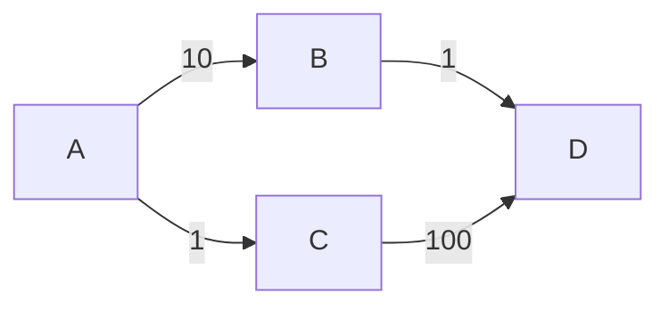
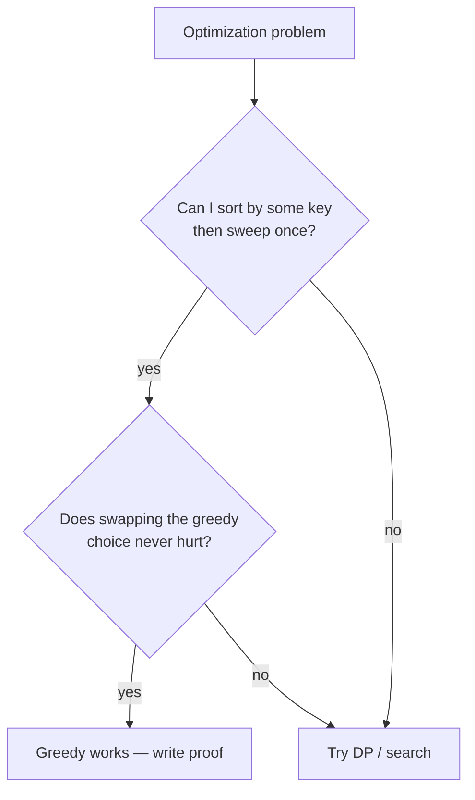

# Greedy Algorithms

> Locally optimal choice, hoping it's globally optimal — and proving it.

<span class="phase-status phase-done">Phase 4 — Algorithms</span>

---

## Why "greedy"?

A **greedy algorithm** builds a solution piece by piece, at each step taking the choice that looks best *right now*, without revising earlier decisions. It's the cheapest paradigm in the bag (no recursion stack, no DP table) — when it works.

The trap: it doesn't always work. The hard part of any greedy interview question is **proving** that the local choice yields a global optimum. Hand-waving "looks fine" loses points.

---

## When greedy works — the two properties

For a greedy approach to be correct, the problem must satisfy:

1. **Greedy choice property** — a globally optimal solution can be reached by making a locally optimal choice. You never need to "look back".
2. **Optimal substructure** — after making the greedy choice, the remaining subproblem has the same shape and an optimal solution to it combines with the choice into a global optimum.

If either fails, greedy is wrong (you need DP or search).

!!! tip "The interview tell"
    If sorting the input by some key, then sweeping left-to-right and committing to each item independently produces the answer — it's a greedy. The trick is *which* key.

---

## How to prove a greedy is correct — the exchange argument

The standard proof technique:

1. Let `G = g₁, g₂, ...` be the greedy solution.
2. Let `O = o₁, o₂, ...` be any optimal solution that differs.
3. Find the first index `k` where they differ. Swap `oₖ` for `gₖ` in `O`.
4. Show the swap doesn't worsen `O` — so `O` with the greedy choice is still optimal.
5. Repeat. By induction `G` is optimal.

??? question "Worked example: interval scheduling proof"
    **Claim:** picking the meeting that ends earliest first is optimal.

    Suppose `O` picks meeting `o₁` first, but greedy picks `g₁` (earlier finish). Replace `o₁` with `g₁` in `O`. Since `g₁` finishes no later than `o₁`, every subsequent meeting in `O` is still compatible. So `O' = {g₁, o₂, o₃, ...}` is also optimal. Recurse on the remaining time horizon. ∎

---

## Classic problem 1 — Interval scheduling (activity selection)

**Problem:** given `n` meetings with `(start, end)` times, pick the maximum number of non-overlapping meetings.

**Greedy choice:** sort by **end time**, then pick every meeting whose start ≥ last picked end.

```python
from __future__ import annotations

def max_meetings(intervals: list[tuple[int, int]]) -> int:
    """Maximum number of non-overlapping intervals.

    O(n log n) for the sort, O(n) sweep.
    """
    intervals.sort(key=lambda x: x[1])  # sort by end
    count, last_end = 0, float("-inf")
    for start, end in intervals:
        if start >= last_end:
            count += 1
            last_end = end
    return count
```

!!! warning "Common bug"
    Sorting by **start** time gives the wrong answer. Counter-example: `[(0, 10), (1, 2), (3, 4)]` — sorting by start picks `(0, 10)` and stops at 1. Sorting by end picks `(1, 2), (3, 4)` → 2.

---

## Classic problem 2 — Fractional knapsack

**Problem:** items have `(value, weight)`. Capacity `W`. You may take fractions. Maximize value.

**Greedy choice:** sort by `value / weight` descending; take as much of each as fits.

```python
def fractional_knapsack(items: list[tuple[int, int]], capacity: int) -> float:
    """items[i] = (value, weight). Capacity is integer; result may be float."""
    items.sort(key=lambda iv: iv[0] / iv[1], reverse=True)
    total = 0.0
    for value, weight in items:
        if capacity >= weight:
            total += value
            capacity -= weight
        else:
            total += value * (capacity / weight)
            break
    return total
```

Complexity `O(n log n)`. The fractional version is greedy; the **0/1** version is **not** (see "When greedy fails").

---

## Classic problem 3 — Huffman coding

**Problem:** given character frequencies, build a prefix code with minimum total bit length.

**Greedy choice:** repeatedly merge the two least-frequent nodes.

```python
import heapq

def huffman_codes(freq: dict[str, int]) -> dict[str, str]:
    """Return char → bitstring."""
    heap = [[f, [ch, ""]] for ch, f in freq.items()]
    heapq.heapify(heap)
    while len(heap) > 1:
        lo = heapq.heappop(heap)
        hi = heapq.heappop(heap)
        for pair in lo[1:]:
            pair[1] = "0" + pair[1]
        for pair in hi[1:]:
            pair[1] = "1" + pair[1]
        heapq.heappush(heap, [lo[0] + hi[0]] + lo[1:] + hi[1:])
    return {ch: code for _, *rest in heap for ch, code in rest}
```

Complexity `O(n log n)`. Proof uses an exchange argument on the two lowest-frequency leaves.

---

## Greedy in disguise — graph algorithms

Several "graph" algorithms are pure greedy:

| Algorithm | Greedy choice |
|-----------|---------------|
| **Dijkstra** | Pop the unvisited node with smallest tentative distance. |
| **Prim's MST** | Pop the cheapest edge crossing the visited cut. |
| **Kruskal's MST** | Take edges in ascending weight order, skip if they form a cycle (union-find). |

Each works because of optimal substructure on the **cut property** (MST) or **shortest-path optimality** (Dijkstra, on non-negative weights only — see [Graph algorithms](07-graph-algorithms.md)).

---

## Interview problem 1 — Jump Game

**Problem:** `nums[i]` = max jump length from index `i`. Can you reach the last index from index 0?

**Greedy:** track the **furthest** index reachable so far. If at any `i` we have `i > furthest`, we're stuck.

```python
def can_jump(nums: list[int]) -> bool:
    furthest = 0
    for i, n in enumerate(nums):
        if i > furthest:
            return False
        furthest = max(furthest, i + n)
    return True
```

`O(n)` time, `O(1)` space. The greedy choice: don't pick a single jump, just track the optimistic frontier.

??? question "Why doesn't this need DP?"
    DP `reachable[i] = any(reachable[j] for j ≤ i and j + nums[j] ≥ i)` is `O(n²)`. The greedy collapses it because *any* `j` reaching past `i` is equivalent — we only care about the maximum reach, not which path.

---

## Interview problem 2 — Gas Station (LC 134)

**Problem:** circular route with `gas[i]` and `cost[i]`. Find a starting station so you can complete the loop, or return -1.

**Greedy insight:** if `sum(gas) < sum(cost)` → impossible. Otherwise, scan once: when tank goes negative at station `i`, no station in `[start, i]` works as a start, so jump `start = i + 1`.

```python
def can_complete_circuit(gas: list[int], cost: list[int]) -> int:
    if sum(gas) < sum(cost):
        return -1
    tank, start = 0, 0
    for i in range(len(gas)):
        tank += gas[i] - cost[i]
        if tank < 0:
            start = i + 1
            tank = 0
    return start
```

`O(n)` time. The exchange argument: if `[s, i]` failed, no `s' ∈ (s, i]` fixes it because `s'` starts with strictly less fuel reaching any later point.

---

## Interview problem 3 — Task Scheduler (LC 621)

**Problem:** `tasks` is a list of CPU tasks (chars). Same task needs `n` cooldown slots between runs. Minimum total time?

**Greedy:** schedule the **most-frequent** remaining task that's off cooldown. Use a max-heap + a queue for cooldowns.

```python
import heapq
from collections import Counter, deque

def least_interval(tasks: list[str], n: int) -> int:
    counts = Counter(tasks)
    heap = [-c for c in counts.values()]
    heapq.heapify(heap)
    cooldown: deque[tuple[int, int]] = deque()  # (ready_time, neg_count)
    time = 0
    while heap or cooldown:
        time += 1
        if heap:
            c = heapq.heappop(heap) + 1  # one fewer (closer to 0)
            if c < 0:
                cooldown.append((time + n, c))
        if cooldown and cooldown[0][0] == time:
            heapq.heappush(heap, cooldown.popleft()[1])
    return time
```

`O(N · log K)` where `K` = unique tasks (≤ 26).

---

## Interview problem 4 — Minimum number of platforms

**Problem:** given train arrival/departure times, minimum platforms so no train waits?

**Greedy / sweep line:**

```python
def min_platforms(arr: list[int], dep: list[int]) -> int:
    arr.sort()
    dep.sort()
    i = j = 0
    platforms = max_platforms = 0
    while i < len(arr):
        if arr[i] <= dep[j]:
            platforms += 1
            max_platforms = max(max_platforms, platforms)
            i += 1
        else:
            platforms -= 1
            j += 1
    return max_platforms
```

`O(n log n)`. This is the same shape as "meeting rooms II".

---

## When greedy **fails** — counter-examples to memorize

### 0/1 Knapsack

Items `(value, weight)`: `(60, 10), (100, 20), (120, 30)`. Capacity `50`.

- Greedy by value/weight ratio: take item 1 (6.0), item 2 (5.0), can't fit item 3. Total = 160.
- Optimal: take items 2 and 3. Total = **220**.

The fractional version repairs this — but with integer items, you need DP.

### Longest path in a DAG

Greedy "always extend along the heaviest edge" fails:



Greedy from `A`: `A → B → D`, total `11`. Optimal: `A → C → D`, total `101`. Need DP over the DAG.

### Coin change (arbitrary denominations)

Coins `{1, 3, 4}`, target `6`.

- Greedy (largest coin first): `4 + 1 + 1` = 3 coins.
- Optimal: `3 + 3` = **2** coins.

Greedy works for canonical systems (US coins, Euro) but not arbitrary ones — you need DP.

!!! tip "The mental check"
    Before committing to greedy, ask: *"Can I construct a small counter-example by hand?"* Try 3-4 inputs. If you can break it, switch to DP.

---

## Decision template



---

## 🃏 Cheatsheet

| Problem | Greedy key | Complexity |
|---------|-----------|------------|
| Interval scheduling | sort by **end** time | `O(n log n)` |
| Fractional knapsack | sort by **value/weight** desc | `O(n log n)` |
| Huffman coding | merge two min-frequency nodes | `O(n log n)` |
| Jump Game | track furthest reach | `O(n)` |
| Gas Station | reset start on negative tank | `O(n)` |
| Task Scheduler | heap of remaining counts | `O(N log K)` |
| Min platforms | merge sorted arr/dep | `O(n log n)` |
| Dijkstra | pop min-distance node | `O((V+E) log V)` |
| Prim / Kruskal | min cut edge / sorted edges + UF | `O(E log V)` |

**Greedy fails on:** 0/1 knapsack, longest path, coin change with arbitrary denominations, TSP.

**Proof technique:** exchange argument. State the swap, show it doesn't worsen the solution.

**Red flags it's not greedy:** the choice at step `i` constrains future choices in a non-monotonic way, or there's a small counter-example.
