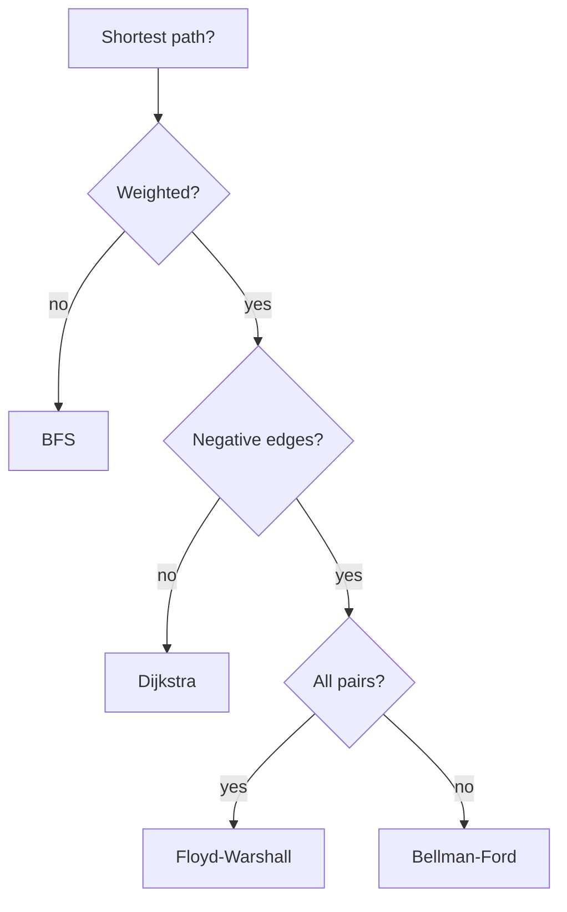

# Graph Algorithms

> Traversal, shortest paths, MST, SCC — the interview-grade graph toolbox.

<span class="phase-status phase-done">Phase 4 — Algorithms</span>

---

## Graph representations

The first decision in any graph problem: **how do I store it?** The wrong choice can blow up your complexity by an order of magnitude.

| Representation | Space | Edge lookup | Best for |
|----------------|-------|-------------|----------|
| Adjacency list | `O(V + E)` | `O(deg(v))` | Sparse graphs (most interview problems). |
| Adjacency matrix | `O(V²)` | `O(1)` | Dense graphs, Floyd-Warshall, ≤ ~1000 nodes. |
| Edge list | `O(E)` | `O(E)` | Kruskal's MST, Bellman-Ford. |

```python
from __future__ import annotations
from collections import defaultdict

# Adjacency list — the default
graph: dict[int, list[tuple[int, int]]] = defaultdict(list)  # node -> [(neighbor, weight)]
graph[0].append((1, 5))
graph[0].append((2, 3))

# Adjacency matrix
n = 4
matrix: list[list[float]] = [[float("inf")] * n for _ in range(n)]
for i in range(n):
    matrix[i][i] = 0
matrix[0][1] = 5

# Edge list
edges: list[tuple[int, int, int]] = [(0, 1, 5), (0, 2, 3)]  # (u, v, w)
```

!!! tip "Default to adjacency list"
    Unless the problem says "≤ 500 nodes, dense graph" or you're running Floyd-Warshall, use `defaultdict(list)`. It's faster, smaller, and Pythonic.

---

## BFS — breadth-first search

**Use for:** shortest path in **unweighted** graphs, level-order traversal, "fewest steps" problems.

```python
from collections import deque

def bfs_shortest(graph: dict[int, list[int]], src: int, dst: int) -> int:
    """Returns number of edges from src to dst, or -1."""
    visited = {src}
    queue: deque[tuple[int, int]] = deque([(src, 0)])
    while queue:
        node, dist = queue.popleft()
        if node == dst:
            return dist
        for nb in graph[node]:
            if nb not in visited:
                visited.add(nb)
                queue.append((nb, dist + 1))
    return -1
```

**Complexity:** `O(V + E)` time and space.

!!! warning "Mark visited on enqueue, not dequeue"
    Marking on dequeue lets the same node enter the queue multiple times → exponential blowup on dense graphs.

---

## DFS — depth-first search

**Use for:** connectivity, cycle detection, topo sort, SCC, articulation points, generating all paths.

```python
def dfs_iterative(graph: dict[int, list[int]], src: int) -> set[int]:
    visited: set[int] = set()
    stack = [src]
    while stack:
        node = stack.pop()
        if node in visited:
            continue
        visited.add(node)
        stack.extend(graph[node])
    return visited
```

Recursive form is cleaner but watch Python's default recursion limit (1000). For deep graphs use iterative or `sys.setrecursionlimit(10**6)`.

```python
def dfs_recursive(graph: dict[int, list[int]], node: int, visited: set[int]) -> None:
    visited.add(node)
    for nb in graph[node]:
        if nb not in visited:
            dfs_recursive(graph, nb, visited)
```

**Complexity:** `O(V + E)`.

---

## Topological sort

**Defined for:** directed acyclic graphs (DAGs). Linear order respecting edges.

### Kahn's algorithm (BFS, in-degree based)

```python
def topo_sort_kahn(graph: dict[int, list[int]], n: int) -> list[int] | None:
    indeg = [0] * n
    for u in range(n):
        for v in graph[u]:
            indeg[v] += 1
    queue = deque(i for i in range(n) if indeg[i] == 0)
    order: list[int] = []
    while queue:
        u = queue.popleft()
        order.append(u)
        for v in graph[u]:
            indeg[v] -= 1
            if indeg[v] == 0:
                queue.append(v)
    return order if len(order) == n else None  # None ⇒ cycle
```

### DFS variant

```python
def topo_sort_dfs(graph: dict[int, list[int]], n: int) -> list[int] | None:
    WHITE, GRAY, BLACK = 0, 1, 2
    color = [WHITE] * n
    order: list[int] = []

    def visit(u: int) -> bool:
        if color[u] == GRAY:
            return False  # back edge → cycle
        if color[u] == BLACK:
            return True
        color[u] = GRAY
        for v in graph[u]:
            if not visit(v):
                return False
        color[u] = BLACK
        order.append(u)
        return True

    for u in range(n):
        if not visit(u):
            return None
    return order[::-1]
```

**Complexity:** `O(V + E)` for both.

---

## Dijkstra's algorithm

**Use for:** shortest path from a source, **non-negative** weights only.

```python
import heapq

def dijkstra(graph: dict[int, list[tuple[int, int]]], src: int, n: int) -> list[float]:
    dist = [float("inf")] * n
    dist[src] = 0
    heap: list[tuple[float, int]] = [(0, src)]
    while heap:
        d, u = heapq.heappop(heap)
        if d > dist[u]:
            continue  # stale entry
        for v, w in graph[u]:
            nd = d + w
            if nd < dist[v]:
                dist[v] = nd
                heapq.heappush(heap, (nd, v))
    return dist
```

**Complexity:** `O((V + E) log V)` with binary heap.

!!! warning "Negative edges break Dijkstra"
    Even a single negative weight can produce wrong answers. Use Bellman-Ford instead.

!!! tip "Lazy deletion pattern"
    Python's `heapq` has no decrease-key. The standard idiom: push duplicates, skip stale ones with `if d > dist[u]: continue`. Costs an `O(log V)` factor only — fine for interviews.

---

## Bellman-Ford

**Use for:** shortest path with **negative edges**, or to **detect negative cycles**.

```python
def bellman_ford(edges: list[tuple[int, int, int]], n: int, src: int) -> list[float] | None:
    dist = [float("inf")] * n
    dist[src] = 0
    for _ in range(n - 1):
        updated = False
        for u, v, w in edges:
            if dist[u] + w < dist[v]:
                dist[v] = dist[u] + w
                updated = True
        if not updated:
            break
    # one extra pass to detect negative cycles
    for u, v, w in edges:
        if dist[u] + w < dist[v]:
            return None
    return dist
```

**Complexity:** `O(V · E)`.

---

## Floyd-Warshall

**Use for:** all-pairs shortest paths on small graphs (`V ≤ ~500`).

```python
def floyd_warshall(matrix: list[list[float]]) -> list[list[float]]:
    n = len(matrix)
    dist = [row[:] for row in matrix]
    for k in range(n):
        for i in range(n):
            for j in range(n):
                if dist[i][k] + dist[k][j] < dist[i][j]:
                    dist[i][j] = dist[i][k] + dist[k][j]
    return dist
```

**Complexity:** `O(V³)` time, `O(V²)` space. Negative cycle iff `dist[i][i] < 0` for any `i`.

---

## A\* — heuristic search

**Use for:** point-to-point shortest path with a domain heuristic (grids, maps).

```python
def a_star(start: tuple[int, int], goal: tuple[int, int],
           neighbors, heuristic) -> float:
    open_heap: list[tuple[float, tuple[int, int]]] = [(0, start)]
    g_score = {start: 0.0}
    while open_heap:
        _, u = heapq.heappop(open_heap)
        if u == goal:
            return g_score[u]
        for v, w in neighbors(u):
            tentative = g_score[u] + w
            if tentative < g_score.get(v, float("inf")):
                g_score[v] = tentative
                f = tentative + heuristic(v, goal)
                heapq.heappush(open_heap, (f, v))
    return float("inf")
```

The heuristic must be **admissible** (never overestimates) for A\* to be optimal. Manhattan distance is admissible on a 4-connected grid; Euclidean on 8-connected.

---

## Minimum spanning tree

### Prim's (heap-based)

**Use for:** MST when graph is dense or stored as adjacency list.

```python
def prim(graph: dict[int, list[tuple[int, int]]], n: int) -> int:
    visited = [False] * n
    heap: list[tuple[int, int]] = [(0, 0)]
    total = 0
    count = 0
    while heap and count < n:
        w, u = heapq.heappop(heap)
        if visited[u]:
            continue
        visited[u] = True
        total += w
        count += 1
        for v, ew in graph[u]:
            if not visited[v]:
                heapq.heappush(heap, (ew, v))
    return total if count == n else -1
```

**Complexity:** `O(E log V)`.

### Kruskal's (union-find)

**Use for:** MST when edges are easy to enumerate (sparse, edge list).

```python
class DSU:
    def __init__(self, n: int) -> None:
        self.parent = list(range(n))
        self.rank = [0] * n

    def find(self, x: int) -> int:
        while self.parent[x] != x:
            self.parent[x] = self.parent[self.parent[x]]
            x = self.parent[x]
        return x

    def union(self, a: int, b: int) -> bool:
        ra, rb = self.find(a), self.find(b)
        if ra == rb:
            return False
        if self.rank[ra] < self.rank[rb]:
            ra, rb = rb, ra
        self.parent[rb] = ra
        if self.rank[ra] == self.rank[rb]:
            self.rank[ra] += 1
        return True

def kruskal(edges: list[tuple[int, int, int]], n: int) -> int:
    edges.sort(key=lambda e: e[2])
    dsu = DSU(n)
    total = 0
    used = 0
    for u, v, w in edges:
        if dsu.union(u, v):
            total += w
            used += 1
            if used == n - 1:
                break
    return total
```

**Complexity:** `O(E log E)` (dominated by the sort).

---

## Strongly connected components — Tarjan's

**Use for:** condensing a directed graph into its SCCs, 2-SAT, dependency cycles.

Tarjan's runs **one DFS** maintaining a stack and `lowlink` per node:

```python
def tarjan_scc(graph: dict[int, list[int]], n: int) -> list[list[int]]:
    index_counter = [0]
    stack: list[int] = []
    on_stack = [False] * n
    index = [-1] * n
    lowlink = [0] * n
    sccs: list[list[int]] = []

    def strongconnect(v: int) -> None:
        index[v] = lowlink[v] = index_counter[0]
        index_counter[0] += 1
        stack.append(v)
        on_stack[v] = True
        for w in graph[v]:
            if index[w] == -1:
                strongconnect(w)
                lowlink[v] = min(lowlink[v], lowlink[w])
            elif on_stack[w]:
                lowlink[v] = min(lowlink[v], index[w])
        if lowlink[v] == index[v]:
            comp: list[int] = []
            while True:
                w = stack.pop()
                on_stack[w] = False
                comp.append(w)
                if w == v:
                    break
            sccs.append(comp)

    for v in range(n):
        if index[v] == -1:
            strongconnect(v)
    return sccs
```

**Complexity:** `O(V + E)`.

!!! note "Kosaraju's alternative"
    Kosaraju does two DFS passes (one on `G`, one on `G^T` in reverse finish order). Same complexity, easier to remember, slightly more constant-factor work. Pick Tarjan for one-pass elegance, Kosaraju if you forget the lowlink trick under pressure.

---

## Bridges & articulation points (Tarjan)

A **bridge** is an edge whose removal disconnects the graph. An **articulation point** is the same for nodes.

```python
def find_bridges(graph: dict[int, list[int]], n: int) -> list[tuple[int, int]]:
    disc = [-1] * n
    low = [0] * n
    bridges: list[tuple[int, int]] = []
    timer = [0]

    def dfs(u: int, parent: int) -> None:
        disc[u] = low[u] = timer[0]
        timer[0] += 1
        for v in graph[u]:
            if disc[v] == -1:
                dfs(v, u)
                low[u] = min(low[u], low[v])
                if low[v] > disc[u]:
                    bridges.append((u, v))
            elif v != parent:
                low[u] = min(low[u], disc[v])

    for u in range(n):
        if disc[u] == -1:
            dfs(u, -1)
    return bridges
```

**Complexity:** `O(V + E)`.

---

## Algorithm picker



---

## Interview problem 1 — Network Delay Time (LC 743)

Single-source shortest path. Pure Dijkstra.

```python
def network_delay_time(times: list[list[int]], n: int, k: int) -> int:
    graph: dict[int, list[tuple[int, int]]] = defaultdict(list)
    for u, v, w in times:
        graph[u].append((v, w))
    dist = dijkstra(graph, k, n + 1)[1:]  # nodes are 1..n
    ans = max(dist)
    return -1 if ans == float("inf") else int(ans)
```

---

## Interview problem 2 — Course Schedule II (LC 210)

Topological sort. Return one valid ordering, or `[]` if cycle.

```python
def find_order(num_courses: int, prerequisites: list[list[int]]) -> list[int]:
    graph: dict[int, list[int]] = defaultdict(list)
    for a, b in prerequisites:
        graph[b].append(a)
    order = topo_sort_kahn(graph, num_courses)
    return order if order is not None else []
```

---

## Interview problem 3 — Cheapest Flights with K Stops (LC 787)

Negative-edge-free, but the "K stops" constraint breaks vanilla Dijkstra (a more expensive path with fewer stops may be necessary). Two clean solutions:

**(a) Modified BFS** — track `(cost, node, stops)`, allow revisits when stops are smaller:

```python
def find_cheapest_price(n: int, flights: list[list[int]], src: int, dst: int, k: int) -> int:
    graph: dict[int, list[tuple[int, int]]] = defaultdict(list)
    for u, v, w in flights:
        graph[u].append((v, w))
    heap: list[tuple[int, int, int]] = [(0, src, 0)]
    best_stops = {(src, 0): 0}
    while heap:
        cost, u, stops = heapq.heappop(heap)
        if u == dst:
            return cost
        if stops > k:
            continue
        for v, w in graph[u]:
            if cost + w < best_stops.get((v, stops + 1), float("inf")):
                best_stops[(v, stops + 1)] = cost + w
                heapq.heappush(heap, (cost + w, v, stops + 1))
    return -1
```

**(b) Bellman-Ford bounded to `k+1` relaxations** — relax all edges `k+1` times; the bound on iterations matches the bound on stops.

---

## Interview problem 4 — MST on a grid

**Problem:** `n` points on a 2D plane. Connect all with min total Manhattan distance.

**Trick:** complete graph has `O(n²)` edges → use **Prim with a heap** directly on points (no need to materialize edges).

```python
def min_cost_connect_points(points: list[list[int]]) -> int:
    n = len(points)
    in_mst = [False] * n
    min_edge = [float("inf")] * n
    min_edge[0] = 0
    total = 0
    for _ in range(n):
        u = min((c, i) for i, c in enumerate(min_edge) if not in_mst[i])[1]
        in_mst[u] = True
        total += min_edge[u]
        for v in range(n):
            if not in_mst[v]:
                d = abs(points[u][0] - points[v][0]) + abs(points[u][1] - points[v][1])
                if d < min_edge[v]:
                    min_edge[v] = d
    return int(total)
```

`O(n²)` time, `O(n)` space — better than Kruskal's `O(n² log n)` here.

---

## 🃏 Cheatsheet

| Algorithm | Use case | Complexity | Negative edges? |
|-----------|----------|------------|-----------------|
| BFS | Unweighted shortest path | `O(V + E)` | n/a |
| DFS | Connectivity, cycle, ordering | `O(V + E)` | n/a |
| Topo sort (Kahn) | DAG ordering | `O(V + E)` | n/a |
| Dijkstra | SSSP, non-negative | `O((V+E) log V)` | ❌ |
| Bellman-Ford | SSSP with negatives | `O(V·E)` | ✅ (detects neg cycles) |
| Floyd-Warshall | All-pairs SP | `O(V³)` | ✅ |
| A\* | Heuristic-guided SSSP | `O(E)` with good `h` | ❌ |
| Prim | MST (dense / adj list) | `O(E log V)` | n/a |
| Kruskal | MST (sparse / edge list) | `O(E log E)` | n/a |
| Tarjan SCC | Strongly connected components | `O(V + E)` | n/a |
| Tarjan bridges | Critical edges | `O(V + E)` | n/a |

**Mark visited on enqueue, not dequeue.** Heap "lazy deletion" replaces decrease-key. Bellman-Ford runs `V-1` passes; the `V`-th detects negative cycles.
