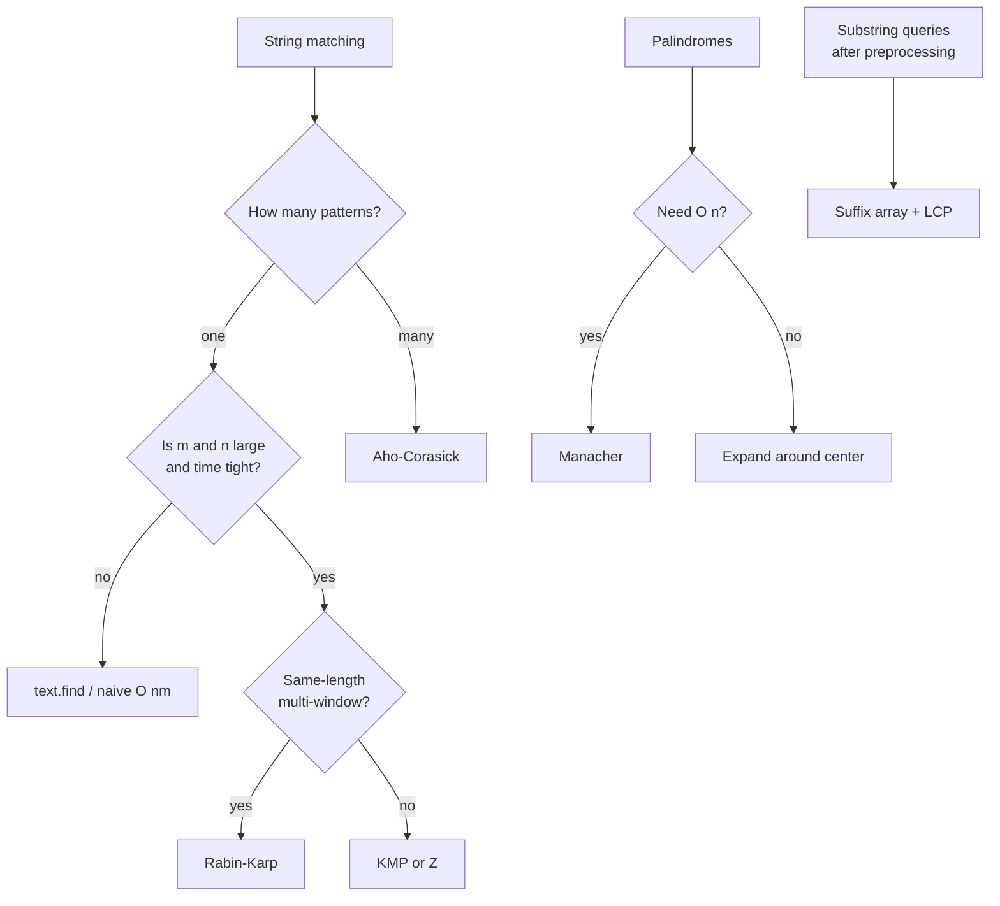

# String Algorithms

> Pattern matching, palindromes, and the trade-offs between hash, automaton, and prefix-function approaches.

<span class="phase-status phase-done">Phase 4 — Algorithms</span>

---

## The landscape

String problems in interviews almost always boil down to one of these:

1. **Find one pattern in one text** — KMP, Z-algorithm, Rabin-Karp, or naive.
2. **Find many patterns simultaneously** — Aho-Corasick.
3. **Substring queries with preprocessing** — suffix array, suffix automaton.
4. **Palindromes** — Manacher's, expand-around-center.

The key lesson: which algorithm you reach for depends on **whether the text or the pattern is preprocessed**, and **how many patterns** you have.

---

## Naive matching — the baseline

```python
from __future__ import annotations

def naive_search(text: str, pattern: str) -> list[int]:
    """Return every start index of pattern in text."""
    n, m = len(text), len(pattern)
    matches: list[int] = []
    for i in range(n - m + 1):
        if text[i : i + m] == pattern:
            matches.append(i)
    return matches
```

**Complexity:** `O(n · m)` worst case (e.g. text `"aaaa...a"`, pattern `"aaa...ab"`).

In Python, `text.find(pattern)` is implemented in C with a hybrid Boyer-Moore-Horspool / two-way variant — for one-shot interview problems with no constraints, it's fine. But you should know KMP for the algorithmic question.

---

## KMP — Knuth-Morris-Pratt

**Idea:** when a mismatch occurs at position `j` of the pattern, you don't need to back up in the text. The pattern's own structure tells you the next pattern position to try.

The key insight is the **failure function** (a.k.a. **prefix function**) `lps[i]` = length of the longest proper prefix of `pattern[:i+1]` that is also a suffix.

### Building the failure function

```python
def build_lps(pattern: str) -> list[int]:
    """lps[i] = longest proper prefix of pattern[:i+1] that is also a suffix."""
    m = len(pattern)
    lps = [0] * m
    length = 0  # length of previous longest prefix-suffix
    i = 1
    while i < m:
        if pattern[i] == pattern[length]:
            length += 1
            lps[i] = length
            i += 1
        elif length != 0:
            length = lps[length - 1]  # try a shorter prefix
        else:
            lps[i] = 0
            i += 1
    return lps
```

??? question "Why does `length = lps[length - 1]` work?"
    We've matched `pattern[:length]` ending at `i-1`. The mismatch at `pattern[length] != pattern[i]` means we want the **next-longest** proper prefix-suffix of `pattern[:length]`. By definition that's `lps[length - 1]`. We don't restart from 0 because every smaller prefix that *could* match is encoded in the chain `lps[length-1], lps[lps[length-1]-1], ...`.

### KMP search

```python
def kmp_search(text: str, pattern: str) -> list[int]:
    if not pattern:
        return list(range(len(text) + 1))
    lps = build_lps(pattern)
    matches: list[int] = []
    i = j = 0  # i over text, j over pattern
    n, m = len(text), len(pattern)
    while i < n:
        if text[i] == pattern[j]:
            i += 1
            j += 1
            if j == m:
                matches.append(i - m)
                j = lps[j - 1]
        elif j != 0:
            j = lps[j - 1]
        else:
            i += 1
    return matches
```

**Complexity:** `O(n + m)` time, `O(m)` space. The pointer `i` never decreases — that's the magic.

**When to use KMP:**

- Asked to "implement string matching" without using built-ins.
- Need to search the same pattern many times in a stream — preprocess `lps` once.
- The "shortest period of a string" problem: `period = m - lps[m-1]` if `m % (m - lps[m-1]) == 0`.

!!! warning "Off-by-one trap"
    `j = lps[j - 1]` requires `j > 0`. The `elif j != 0` branch is essential — without it, you get an `IndexError` or infinite loop.

---

## Rabin-Karp — rolling hash

**Idea:** hash the pattern, then slide a window over the text maintaining a **rolling hash** that updates in `O(1)` per shift. Compare hashes; verify on collision.

```python
def rabin_karp(text: str, pattern: str, base: int = 256, mod: int = 10**9 + 7) -> list[int]:
    n, m = len(text), len(pattern)
    if m > n:
        return []
    high_pow = pow(base, m - 1, mod)
    p_hash = t_hash = 0
    for i in range(m):
        p_hash = (p_hash * base + ord(pattern[i])) % mod
        t_hash = (t_hash * base + ord(text[i])) % mod
    matches: list[int] = []
    for i in range(n - m + 1):
        if p_hash == t_hash and text[i : i + m] == pattern:  # verify!
            matches.append(i)
        if i + m < n:
            t_hash = (t_hash - ord(text[i]) * high_pow) % mod
            t_hash = (t_hash * base + ord(text[i + m])) % mod
            t_hash %= mod
    return matches
```

**Complexity:** `O(n + m)` expected, `O(n · m)` worst case (pathological collisions).

### Collision handling

A single 32-bit hash collides too often on adversarial inputs. Defensive options:

- **Always verify** the substring on hash match (the snippet above does this — keeps worst-case correctness while staying fast in practice).
- **Double hashing**: keep two hashes with different `(base, mod)` pairs. Collision probability drops from `~1/p` to `~1/p²`.
- Pick a **random** base or mod at runtime so an adversary can't construct a worst case.

**When to use Rabin-Karp:**

- Multiple patterns of the **same length** — hash all patterns, sweep once. Useful for "find any anagram" or "find duplicates" problems.
- Substring equality queries with preprocessing (prefix hashes give `O(1)` substring hash).
- "Longest duplicate substring" via binary search + rolling hash.

---

## Z-algorithm

**Idea:** for a string `s`, the **Z-array** `Z[i]` = length of the longest substring starting at `i` that matches a prefix of `s`.

```python
def z_array(s: str) -> list[int]:
    n = len(s)
    z = [0] * n
    z[0] = n
    l = r = 0
    for i in range(1, n):
        if i < r:
            z[i] = min(r - i, z[i - l])
        while i + z[i] < n and s[z[i]] == s[i + z[i]]:
            z[i] += 1
        if i + z[i] > r:
            l, r = i, i + z[i]
    return z
```

**Complexity:** `O(n)` — the `[l, r]` window moves only forward.

### Pattern matching via Z

To find `pattern` in `text`, compute `Z` of `pattern + "$" + text` (where `$` doesn't appear in either). Any `Z[i] == len(pattern)` for `i > len(pattern)` is a match.

```python
def z_search(text: str, pattern: str) -> list[int]:
    s = pattern + "$" + text
    z = z_array(s)
    m = len(pattern)
    return [i - m - 1 for i in range(m + 1, len(s)) if z[i] == m]
```

**When to use Z:**

- Cleaner than KMP for some problems ("count distinct substrings", "longest prefix that appears later").
- String periodicity, "shortest cover" problems.
- You like one-pass algorithms with no failure-function gymnastics.

---

## Suffix arrays — a brief

A **suffix array** of `s` is a sorted array of all suffix start indices. Combined with the **LCP array** (longest common prefix between adjacent sorted suffixes), it answers a wide class of queries — distinct substrings, longest repeated substring, longest common substring of two strings.

```python
def build_sa_naive(s: str) -> list[int]:
    """O(n² log n) but trivially correct — use for small inputs / verification."""
    return sorted(range(len(s)), key=lambda i: s[i:])
```

For interview-grade `O(n log n)` or `O(n log² n)` constructions, see the [advanced](../05-advanced/index.md) section. In an interview, mention suffix arrays for "longest repeated substring" or "compare all suffixes" problems but reach for binary search + rolling hash if you can't recall the construction.

---

## Aho-Corasick — multi-pattern matching

**Use for:** finding **all** occurrences of **many** patterns in one text — virus scanners, spam filters, "find all bad words" interview variants.

**Construction:**

1. Build a **trie** of all patterns.
2. Compute **failure links** (BFS-order analog of KMP's `lps`): for each node, the failure link points to the longest proper suffix of the path-from-root that is also some node in the trie.
3. Compute **output links** so when you finish at a node, you also report all patterns whose terminal nodes are reachable via failure-chain.

```python
from collections import deque

class AhoNode:
    __slots__ = ("children", "fail", "output")
    def __init__(self) -> None:
        self.children: dict[str, AhoNode] = {}
        self.fail: AhoNode | None = None
        self.output: list[str] = []

def build_aho(patterns: list[str]) -> AhoNode:
    root = AhoNode()
    # 1. Build trie
    for p in patterns:
        node = root
        for ch in p:
            node = node.children.setdefault(ch, AhoNode())
        node.output.append(p)
    # 2. BFS to set failure links
    queue: deque[AhoNode] = deque()
    for child in root.children.values():
        child.fail = root
        queue.append(child)
    while queue:
        u = queue.popleft()
        for ch, v in u.children.items():
            f = u.fail
            while f is not None and ch not in f.children:
                f = f.fail
            v.fail = f.children[ch] if f and ch in f.children else root
            v.output.extend(v.fail.output)  # propagate
            queue.append(v)
    return root

def aho_search(text: str, root: AhoNode) -> list[tuple[int, str]]:
    matches: list[tuple[int, str]] = []
    node = root
    for i, ch in enumerate(text):
        while node is not None and ch not in node.children:
            node = node.fail
        node = node.children[ch] if node else root
        node = node or root
        for pat in node.output:
            matches.append((i - len(pat) + 1, pat))
    return matches
```

**Complexity:** `O(M)` to build (M = total pattern length), `O(N + Z)` to search where `Z` is the number of matches.

!!! tip "When to mention Aho-Corasick"
    "Find all dictionary words appearing in a text", "censoring", "DNA motif scan". Don't over-engineer — if there's only one pattern, KMP is simpler and just as fast.

---

## Manacher's algorithm — O(n) longest palindromic substring

**Idea:** for each position, compute the longest palindrome centered there, **reusing** information from a maintained "current rightmost palindrome".

The classic trick handles even-length palindromes by inserting separators: `"abba"` → `"^#a#b#b#a#$"`.

```python
def manacher(s: str) -> str:
    if not s:
        return ""
    t = "^#" + "#".join(s) + "#$"
    n = len(t)
    p = [0] * n
    center = right = 0
    for i in range(1, n - 1):
        if i < right:
            p[i] = min(right - i, p[2 * center - i])
        while t[i + p[i] + 1] == t[i - p[i] - 1]:
            p[i] += 1
        if i + p[i] > right:
            center, right = i, i + p[i]
    # find max
    max_len, max_center = max((v, i) for i, v in enumerate(p))
    start = (max_center - max_len) // 2
    return s[start : start + max_len]
```

**Complexity:** `O(n)` time and space.

??? question "Why is this O(n) when there's an inner while loop?"
    Each character can extend `right` at most once across the whole run. The inner while only does work when it pushes `right` further. Amortized: total inner-loop iterations ≤ `n`.

**Alternatives:**

- **Expand around center**: `O(n²)` time, `O(1)` space. Often acceptable in interviews — code is half the length and easier to defend.
- **DP with `is_palin[i][j]`**: `O(n²)` time and space. Useful when you also need to enumerate *all* palindromic substrings.

---

## Decision tree — which algorithm?



---

## Interview-grade gotchas

1. **Empty pattern**: `pattern == ""` should match at every index (`n+1` matches). Most production functions return `0` — clarify with the interviewer.
2. **Unicode**: Python strings are sequences of code points; emoji and combining characters can break naive byte-level hashing. Hash via `ord(ch)` (code point), not raw bytes.
3. **Hash mod choice**: small primes collide. Use a 60-bit prime or double-hash; `mod = 10**9 + 7` is common but adversarial inputs exist online.
4. **KMP off-by-one**: track `j` (pattern pointer) carefully — `j == m` is the match condition; reset to `lps[j - 1]`, not `0`.
5. **Manacher with sentinels**: the `^` and `$` (different from each other and from `#`) eliminate bounds-checking in the inner loop. Skipping them is a classic source of `IndexError`.
6. **Don't reach for suffix arrays** when binary search + rolling hash gets you there in `O(n log n)` with 30 lines of code.

---

## Worked interview problems (one-liners)

| Problem | Approach |
|---------|----------|
| LC 28 — `strStr` | KMP (or `text.find`). |
| LC 5 — Longest palindromic substring | Manacher's `O(n)` or expand-around-center `O(n²)`. |
| LC 1392 — Longest happy prefix | `lps[m - 1]` from KMP. |
| LC 187 — Repeated DNA sequences | Rolling hash, fixed window of 10. |
| LC 686 — Repeated string match | Concatenate until length ≥ pattern, then KMP. |
| LC 1044 — Longest duplicate substring | Binary search on length + Rabin-Karp. |
| LC 336 — Palindrome pairs | Trie + palindrome check on suffixes. |

---

## 🃏 Cheatsheet

| Algorithm | Time | Space | When |
|-----------|------|-------|------|
| Naive | `O(nm)` | `O(1)` | Tiny inputs, sanity check. |
| KMP | `O(n + m)` | `O(m)` | One pattern, deterministic worst case. |
| Rabin-Karp | `O(n + m)` exp | `O(1)` | Many same-length patterns, substring hash queries. |
| Z-algorithm | `O(n)` | `O(n)` | Periodicity, prefix-matching, easier than KMP for some. |
| Aho-Corasick | `O(N + M + Z)` | `O(M)` | Many patterns simultaneously. |
| Suffix array | `O(n log n)` | `O(n)` | Repeated/common substring problems. |
| Manacher's | `O(n)` | `O(n)` | Longest palindrome with optimal complexity. |

**The order to learn them:** naive → KMP → Z → Rabin-Karp → Manacher → Aho-Corasick → suffix array.

**The interviewer's favorite trap:** `text.find(pattern)` works but they want the algorithm. Default to KMP unless the problem screams hash.
