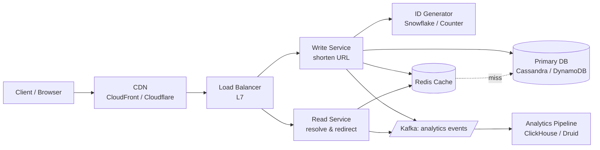

# URL Shortener (TinyURL / Bitly)

> Design a service that converts long URLs into short ones (e.g. `https://very-long-blog-post-url/...` → `tiny.url/aB3xY9`), then redirects users back to the original on click. The canonical "first" system design problem at every product company. **This page is the template** for the other 29 system-design deep-dives.

<span class="company-tag">Google</span> &nbsp; <span class="company-tag">Meta</span> &nbsp; <span class="company-tag">Amazon</span> &nbsp; <span class="company-tag">Microsoft</span> &nbsp; <span class="company-tag">Uber</span> &nbsp; <span class="company-tag">Stripe</span> &nbsp; <span class="phase-status phase-done">Phase 9 — System Design</span>

---

## 📖 How this page is organized

Every system-design page in this bible follows the **same 20-section shape**. Once you've read one, you've read them all. The shape:

1. **The interview scenario** — what the interviewer literally says
2. **Clarifying questions** — what to ask before designing
3. **Requirements** — FRs, NFRs, out-of-scope
4. **Capacity estimation** — back-of-envelope math
5. **High-level architecture** — Mermaid diagram + read/write paths
6. **Data model & storage choice** — schema, sharding, replication
7. **API design** — REST/gRPC shapes, auth, versioning
8. **Component-by-component deep dive** — Python for key pieces
9. **Scaling journey** — Day 1 → Year 3 → 100M users
10. **Cloud deployment** — AWS, GCP, Azure + cost estimates
11. **Local / on-prem deployment** — bare-metal, Kubernetes, Docker Compose
12. **Architecture deep-dive** — microservices, sync vs async, CQRS, sagas
13. **Bottlenecks & trade-offs**
14. **Security** — AuthN/AuthZ, encryption, DDoS, GDPR
15. **Monitoring & observability** — RED + USE, SLO/SLI/SLA
16. **Reliability** — circuit breakers, retries, fallbacks
17. **Common follow-up questions**
18. **Python for tricky pieces** — encoders, hashes, ID generators
19. **Real-world references** — engineering blogs, public vs speculation
20. **One-page cheatsheet** — day-of-interview revision card

---

## 1. 🎤 The interview scenario

> *"Design a service like TinyURL or Bitly. Users paste a long URL, the service returns a short one, and when anyone visits the short URL, they're redirected to the original. We want it to scale to billions of URLs and handle hundreds of thousands of requests per second."*

A 45-min interview at L4+. Expect the interviewer to interrupt with constraint changes ("what if URLs expire?", "what if we want analytics?") about 20 minutes in.

---

## 2. ❓ Clarifying questions

**Always ask first. Don't design in a vacuum.** A senior engineer asks 5–10 questions before drawing anything.

### Functional clarifications

1. **Custom aliases?** Should users be able to specify their own short code (e.g. `tiny.url/my-blog`)?
2. **Expiration?** Do URLs live forever, or is there a TTL?
3. **Analytics?** Do we track click counts, geo, referrer?
4. **Editing / deleting?** Can a user delete a short URL after creation?
5. **Auth?** Anonymous shortening, or only logged-in users?

### Non-functional clarifications

6. **Read:write ratio?** Most URL shorteners are 100:1 reads to writes.
7. **Latency target?** Redirects need to feel instant — typically p99 < 100ms end-to-end.
8. **Availability?** Four 9s (99.99%) for redirects. Three 9s (99.9%) acceptable for shortening.
9. **Consistency model?** Eventual is fine for analytics. Strong for "did my URL save?"
10. **Geographic distribution?** Global. Need edge presence (CDN).

### Assume defaults if not asked

| Question | Assume |
|---|---|
| Custom aliases? | Yes, optional. |
| Expiration? | Optional TTL (1d, 1w, 1y, never). Default never. |
| Analytics? | Click counts only at MVP. |
| Auth? | Anonymous OK; logged-in users get history. |
| Read:write | 100:1 |
| Scale | 100M new URLs/day, 10B redirects/day |

---

## 3. 📋 Requirements

### Functional (FRs)

- **F1.** Given a long URL, produce a unique short URL (≤ 8 chars after the domain).
- **F2.** Given a short URL, redirect (HTTP 301/302) to the original.
- **F3.** Optional custom alias on creation (must be unique).
- **F4.** Optional expiration (TTL).
- **F5.** Click analytics: count, timestamps, country (best-effort).

### Non-functional (NFRs)

- **N1.** **Low latency** — redirect p99 < 100ms globally.
- **N2.** **High availability** — 99.99% for redirects (∼1 hour downtime/year).
- **N3.** **Scale** — 100M writes/day, 10B reads/day. 100B URLs over 5 years.
- **N4.** **Durability** — never lose a saved URL.
- **N5.** **Short codes** — humanly typeable, ≤ 8 chars, URL-safe alphabet.

### Out of scope

- User-facing dashboard, billing, A/B testing, content moderation. (Mention in interview as "could add later" without designing them.)

---

## 4. 🧮 Capacity estimation

### Traffic

| Metric | Calculation | Value |
|---|---|---|
| New URLs / day | given | 100M |
| New URLs / sec (avg) | 100M / 86400 | ~1,200 |
| New URLs / sec (peak, 3×) | 1,200 × 3 | ~3,500 |
| Redirects / day | 100:1 ratio | 10B |
| Redirects / sec (avg) | 10B / 86400 | ~115K |
| Redirects / sec (peak, 3×) | 115K × 3 | ~350K |

### Storage (5-year horizon)

| Item | Calculation | Value |
|---|---|---|
| URLs over 5 years | 100M × 365 × 5 | 182.5B → call it **200B** |
| Bytes per record | 8B short + 500B long + 30B metadata | ~540B |
| Total cold storage | 200B × 540B | **~108 TB** |

### Bandwidth

| Item | Calculation | Value |
|---|---|---|
| Write throughput | 3,500/s × 540B | ~1.9 MB/s |
| Read throughput | 350K/s × 540B | ~190 MB/s |

### Memory (cache)

Cache the **20% of URLs that get 80% of clicks** (Pareto).

| Item | Calculation | Value |
|---|---|---|
| Hot URLs | 200B × 20% | 40B (across ages) |
| But hot at any given moment | top ~100M | 100M |
| Bytes per cached entry | ~600B | — |
| Cache footprint | 100M × 600B | **~60 GB** |

A single Redis cluster (4× r6g.xlarge nodes, 32GB each) holds this comfortably. Real-world deployments run regional Redis fleets.

### Short-code length

URL-safe alphabet (base62: `[a-zA-Z0-9]`). Need to encode 200B distinct codes:

- 6 chars: 62⁶ = ~57B (not enough)
- **7 chars: 62⁷ = ~3.5T** ✓ (5 years × 18× headroom)

So **7 chars is the sweet spot.** With 8 we'd have 218T — too generous, but margin for growth.

---

## 5. 🏗️ High-level architecture



### Read path (the hot path — optimize this hardest)

1. Client GET `tiny.url/aB3xY9`
2. **CDN** edge: check cache. If hit, redirect immediately (~10ms).
3. CDN miss → Load balancer → Read service.
4. **Redis cache lookup**. Hit (~80%) → return the long URL.
5. Cache miss → DB lookup → write back to cache → return.
6. Async fire-and-forget: emit click event to Kafka.

### Write path

1. Client POST `/shorten` with `{long_url, custom_alias?, ttl?}`.
2. Write service validates the URL (regex + DNS lookup optional).
3. Generate short code (counter+base62 — see §8).
4. Insert into DB. If custom_alias clashes, return 409.
5. Write-through to Redis.
6. Return `{short_url}`.

---

## 6. 💾 Data model & storage choice

### Why a KV store, not SQL?

- **Workload**: 99% point lookups by short code. No joins, no range queries on the hot path.
- **Scale**: 200B rows, 350K reads/sec — sharded SQL works but adds operational pain.
- **Schema flexibility**: TTL support, secondary indexes for custom aliases.

**Pick: Cassandra or DynamoDB.** Both support point reads in single-digit ms with built-in replication and TTL. (Mention SQL as acceptable for early-stage; switch becomes painful after ~100M URLs.)

### Schema

| Column | Type | Notes |
|---|---|---|
| `short_code` | varchar(8) | partition key |
| `long_url` | text | required |
| `created_at` | timestamp | for analytics & TTL math |
| `expires_at` | timestamp \| null | nullable |
| `creator_id` | uuid \| null | for logged-in users |
| `is_custom` | boolean | telemetry |

**Secondary index** on `creator_id` for "my URLs" listings (cold path, low QPS).

### Sharding & replication

- **Shard by `short_code`** — natural high-cardinality partition key. Hot-spotting is unlikely because codes are sequential-ish (counter-based) but spread randomly in base62 space.
- **Replication factor 3** across 3 AZs. Quorum write (W=2), quorum read (R=2). Strong-enough consistency for our use case; eventual works for redirect path.

### TTL

Set `expires_at` and let Cassandra/DynamoDB handle expiry natively. Don't build your own.

---

## 7. 🔌 API design

REST. Three endpoints.

### `POST /api/v1/shorten`

```http
POST /api/v1/shorten HTTP/1.1
Authorization: Bearer <jwt>             // optional
Content-Type: application/json

{
  "long_url": "https://example.com/...",
  "custom_alias": "my-blog",            // optional
  "ttl_seconds": 86400                  // optional
}
```

```http
HTTP/1.1 201 Created
{
  "short_url": "https://tiny.url/aB3xY9",
  "short_code": "aB3xY9",
  "expires_at": "2026-04-28T12:00:00Z"
}
```

Errors: 400 (bad URL), 409 (alias taken), 429 (rate limit).

### `GET /:short_code`

```http
GET /aB3xY9 HTTP/1.1
```

```http
HTTP/1.1 301 Moved Permanently
Location: https://example.com/...
Cache-Control: public, max-age=3600
```

Why 301 vs 302? **302 forces a fresh lookup every time** (more clicks counted, but lower performance). **301 is cached** (better latency, undercount on analytics). Most production shorteners use 302 to capture analytics.

### `GET /api/v1/analytics/:short_code`

```http
GET /api/v1/analytics/aB3xY9 HTTP/1.1
Authorization: Bearer <jwt>
```

```http
HTTP/1.1 200 OK
{
  "short_code": "aB3xY9",
  "click_count": 12340,
  "by_country": {"US": 8000, "IN": 3000, ...},
  "by_day": [...]
}
```

### Auth

- Anonymous shortening → IP-based rate limiting (10/min).
- Logged-in users → JWT, higher limits, ownership of created URLs.

### Versioning

Path-based (`/api/v1/...`). New major version → `/api/v2/...`. Deprecation header for 6 months before removal.

---

## 8. 🐍 Component deep-dive — code for the key piece

### Short-code generation: counter + base62

This is **the most-asked sub-question** in the URL shortener interview.

#### Why not random hashing?

- **MD5 / SHA-1 of the long URL → take first 7 base62 chars**: collisions are rare but possible. Need to retry on collision (read-before-write), which adds latency.
- **Idempotency**: same long URL would produce the same short URL — sometimes desired, sometimes not. Decide deliberately.

#### Why counter + base62 wins

- **Globally unique by construction** — no collisions, no read-before-write.
- **Short codes are short** — 7 base62 chars hold up to 3.5T values.
- **Cheap** — one atomic counter increment, one base62 encode.

#### The encoder

```python
ALPHABET = "abcdefghijklmnopqrstuvwxyzABCDEFGHIJKLMNOPQRSTUVWXYZ0123456789"
BASE = len(ALPHABET)              # 62


def encode(num: int) -> str:
    """Encode a non-negative integer to a base62 string."""
    if num == 0:
        return ALPHABET[0]
    chars: list[str] = []
    while num > 0:
        chars.append(ALPHABET[num % BASE])
        num //= BASE
    return "".join(reversed(chars))


def decode(code: str) -> int:
    """Decode a base62 string back to its integer."""
    n = 0
    for ch in code:
        n = n * BASE + ALPHABET.index(ch)
    return n
```

`encode(125)` → `"cb"`. `decode("cb")` → `125`. Tested:

```python
>>> encode(0)
'a'
>>> encode(123_456_789_012)
'caUtbb6'
>>> decode(encode(123_456_789_012))
123456789012
```

#### Where does the counter come from?

**Don't use a single global database counter** — it's a write-throughput bottleneck. Two viable approaches:

=== "ID-generation service (Snowflake-style)"

    - Each shortener instance pre-allocates a range of IDs from a central counter (e.g. 10K at a time via Zookeeper or a Redis `INCRBY 10000`).
    - Within its range, the instance generates IDs locally → no contention.
    - Refills its range when 90% used. Replenishment is amortized.
    - Pro: simple, dependency on one coordinator.
    - Con: small risk of ID gaps if an instance crashes mid-range (acceptable).

=== "Snowflake ID + base62"

    - Twitter's Snowflake: 64 bits = 41-bit ms timestamp + 10-bit machine ID + 12-bit sequence.
    - Encode the lowest 42 bits as base62 → 7 chars.
    - Pro: globally unique without coordination, embedded timestamp.
    - Con: leaks creation time (often fine, sometimes a privacy concern).

For this design: **use the range-allocation approach.** It's simpler and gives shorter codes.

```python
class IDAllocator:
    """Pre-allocates ID ranges from a central counter."""
    BATCH_SIZE = 10_000

    def __init__(self, central_counter):
        self.central = central_counter        # Redis or Zookeeper
        self.next_id: int = 0
        self.end_id: int = 0

    def next(self) -> int:
        if self.next_id >= self.end_id:
            self._refill()
        result = self.next_id
        self.next_id += 1
        return result

    def _refill(self) -> None:
        # Atomic INCRBY on the central counter — returns the new high water mark.
        self.end_id = self.central.incrby("url_id_counter", self.BATCH_SIZE)
        self.next_id = self.end_id - self.BATCH_SIZE
```

### Cache layer: Redis with LRU eviction

```python
class URLCache:
    """Redis-backed read-through cache for short → long URL lookups."""

    DEFAULT_TTL = 3600    # 1 hour

    def __init__(self, redis_client, db):
        self.redis = redis_client
        self.db = db

    def get(self, short_code: str) -> str | None:
        cached = self.redis.get(f"url:{short_code}")
        if cached is not None:
            return cached.decode()

        long_url = self.db.lookup(short_code)        # cache miss
        if long_url is not None:
            self.redis.setex(f"url:{short_code}", self.DEFAULT_TTL, long_url)
        return long_url

    def put(self, short_code: str, long_url: str, ttl: int | None = None) -> None:
        # Write-through.
        self.db.insert(short_code, long_url, ttl)
        self.redis.setex(f"url:{short_code}", ttl or self.DEFAULT_TTL, long_url)
```

Cache hit rate ~80% in steady state → DB QPS drops 5×.

---

## 9. 📈 Scaling journey

| Stage | Users | Architecture |
|---|---|---|
| **Day 1 (MVP)** | < 10K | Single VM. Postgres. Single Redis. Nginx. |
| **Month 6** | 1M MAU | Two app servers behind ALB. RDS with read replicas. Redis still single. |
| **Year 1** | 10M MAU | App fleet auto-scaled. Postgres → Cassandra (or DynamoDB). Redis cluster (3 shards). CDN at edge. |
| **Year 2** | 50M MAU | Multi-region active-active. Geo-DNS. Async writes via Kafka. Analytics pipeline split off. |
| **Year 3 / 100M MAU** | 100M MAU | Globally sharded DB. Edge KV stores (Cloudflare KV / DynamoDB Global Tables) for hottest 1%. ID-generation service is its own fleet. |

**Key signal**: at each stage, the bottleneck shifts. Write throughput at Year 1 (sharding question), read latency at Year 2 (CDN/edge), cross-region consistency at Year 3.

---

## 10. ☁️ Cloud deployment

Same architecture, three vendors:

=== "AWS"

    | Component | AWS service |
    |---|---|
    | Edge cache | CloudFront |
    | Load balancer | ALB (L7) |
    | App fleet | ECS Fargate or EKS |
    | Cache | ElastiCache (Redis) |
    | DB | DynamoDB (preferred) or Cassandra on EC2 |
    | Async bus | Kinesis or MSK (Kafka) |
    | Analytics | Athena over S3 (cold) / OpenSearch (warm) |
    | DNS | Route 53 (geo-routing) |

    **Estimated monthly cost @ Year 1 (10M MAU)**: ~$25K-40K. Dominated by DynamoDB writes ($1.25/M write units) and CloudFront egress.

=== "GCP"

    | Component | GCP service |
    |---|---|
    | Edge cache | Cloud CDN |
    | Load balancer | Global HTTP(S) LB |
    | App fleet | Cloud Run or GKE |
    | Cache | Memorystore (Redis) |
    | DB | Bigtable (preferred) or Spanner (if multi-region SQL needed) |
    | Async bus | Pub/Sub |
    | Analytics | BigQuery |
    | DNS | Cloud DNS |

=== "Azure"

    | Component | Azure service |
    |---|---|
    | Edge cache | Azure Front Door |
    | Load balancer | Application Gateway |
    | App fleet | AKS or Container Apps |
    | Cache | Azure Cache for Redis |
    | DB | Cosmos DB (preferred) |
    | Async bus | Event Hubs |
    | Analytics | Synapse Analytics |
    | DNS | Azure DNS |

### Cost comparison (Year 1, 10M MAU, very rough)

| Vendor | Monthly | Cheapest line item | Most expensive |
|---|---|---|---|
| AWS | ~$30K | Route 53 (~$200) | DynamoDB writes (~$15K) |
| GCP | ~$28K | Cloud DNS (~$200) | Bigtable (~$12K) |
| Azure | ~$32K | Azure DNS (~$200) | Cosmos DB (~$16K) |

Caveat: list-price; large customers negotiate 30-50% off.

---

## 11. 🏠 Local / on-prem deployment

For when you can't (or won't) use the cloud — research labs, regulated industries, cost-conscious self-hosters.

### Docker Compose (single-node)

```yaml
version: "3.9"
services:
  app:
    image: url-shortener:latest
    ports: ["8080:8080"]
    environment:
      DB_URL: cassandra://cassandra:9042
      REDIS_URL: redis://redis:6379
    depends_on: [cassandra, redis]
  redis:
    image: redis:7-alpine
    volumes: ["redis-data:/data"]
  cassandra:
    image: cassandra:5
    volumes: ["cassandra-data:/var/lib/cassandra"]
  nginx:
    image: nginx:alpine
    ports: ["80:80", "443:443"]
    volumes: ["./nginx.conf:/etc/nginx/nginx.conf:ro"]
volumes:
  redis-data:
  cassandra-data:
```

Good up to ~1K writes/s.

### Kubernetes (multi-node)

- 3-node Cassandra StatefulSet with PVCs.
- 3-node Redis Cluster (or Sentinel).
- App as a Deployment with HPA on CPU + p99 latency.
- Ingress controller (nginx-ingress) terminating TLS.
- Cert-manager + Let's Encrypt for certificates.
- Prometheus + Grafana side-car for observability.

For 100M MAU on-prem: ~50 baremetal nodes (32 cores, 128GB RAM, NVMe), 2 racks, 100Gbps network. Real cost: ~$2M capex + $300K/yr ops.

---

## 12. 🧱 Architecture deep-dive

### Sync vs async

- **Shorten** (write) is **synchronous** — user expects the short URL back immediately.
- **Click event ingestion** is **asynchronous** — fire-and-forget into Kafka. Don't block the redirect on analytics writes.

### Microservices boundary

| Service | Responsibility | Data ownership |
|---|---|---|
| **Write Service** | Validate, generate, persist | URL DB |
| **Read Service** | Cache lookup, redirect | Cache + DB read |
| **ID Generator** | Allocate ID ranges | Counter (Redis/ZK) |
| **Analytics** | Consume click events, aggregate | ClickHouse |
| **User Service** | Auth, ownership | User DB (separate) |

### CQRS angle

- **Command** path (write): consistency-strong, durable, slower.
- **Query** path (read): cache-first, eventually consistent, fast.

These are physically separated services with their own scaling profiles. Read service runs at 50× the replica count of write service.

### Saga / compensating transactions

Mostly N/A for this design — single-DB writes are atomic. Sagas appear if you add **paid premium URLs** (charge → create → on charge-failure compensate by deleting the URL). Out of MVP scope.

---

## 13. ⚠️ Bottlenecks & trade-offs

| Bottleneck | Symptom | Fix | Trade-off |
|---|---|---|---|
| Single global counter | Write throughput cap | Range-allocation per instance | Tiny ID gaps on instance crash |
| Cache stampede on viral URL | DB QPS spike when hot key expires | `SETNX` lock + single-flight refill | Brief stale read |
| Custom alias contention | High retries on popular aliases | Pre-reserve via separate "alias" table with strong consistency | Slightly slower custom-alias path |
| 301 vs 302 | Lost analytics with 301 | Use 302 | Slightly higher LB load |
| Long-tail cold reads | Cache miss on old URLs | Bloom filter "URL exists?" before DB | False-positive rate (acceptable) |
| Multi-region writes | Cross-region latency on shortening | Region-local writes + global eventual replication | "My URL doesn't redirect yet" for ~1s after creation |

---

## 14. 🔒 Security

### AuthN

- Anonymous OK (most users). For logged-in: OAuth2 + JWT, 1-hr access tokens, refresh tokens.

### AuthZ

- Anyone can resolve any short URL.
- Only the creator (or admin) can delete/edit/see analytics for their URLs.

### Threats

| Threat | Defense |
|---|---|
| **Phishing** (malicious long URLs) | Scan against Google Safe Browsing API at write time + nightly re-scan |
| **DDoS on read path** | CloudFront / Cloudflare absorbs. Rate-limit by IP at the edge. |
| **Enumeration attacks** (scraping all URLs) | Rate-limit per IP. Block sequential probes. Don't expose `count` API. |
| **SQL injection on long_url** | Parameterized queries. Output-encode in redirect Location header. |
| **Open redirect abuse** | Validate scheme (http/https only). No `javascript:` URLs. |
| **DDoS via shorten endpoint** | Auth required for >10/min. CAPTCHA above threshold. |

### Encryption

- TLS 1.3 everywhere (CloudFront → ALB → app, plus app → DB).
- DB encryption-at-rest (DynamoDB default; Cassandra: per-disk LUKS or vendor TDE).
- No PII stored beyond IP (consider hashing IP for GDPR-safe analytics).

### GDPR

- IP addresses are PII in EU. Hash + truncate to /24 for analytics.
- "Right to be forgotten": delete all URLs by `creator_id` on request, async job.

---

## 15. 📊 Monitoring & observability

### The 4 golden signals (Google SRE)

| Signal | Metric | Alert threshold |
|---|---|---|
| **Latency** | p50, p95, p99 redirect | p99 > 200ms for 5m |
| **Traffic** | RPS per service | sudden drop > 30% |
| **Errors** | 5xx rate | > 0.1% for 5m |
| **Saturation** | CPU, mem, DB connections | > 80% sustained |

### RED + USE

- **RED** (Rate, Errors, Duration) for the request-driven services.
- **USE** (Utilization, Saturation, Errors) for resources (DB, Redis, network).

### SLO / SLI / SLA

- **SLO (internal)**: 99.99% of redirects p99 < 100ms.
- **SLI (the metric)**: count of (success ∧ p99 < 100ms) / total over 30 days.
- **SLA (external)**: 99.9% uptime, $1 credit per minute of downtime above contracted limit.

### Stack

- **Logs**: structured JSON → Fluent Bit → Loki / OpenSearch.
- **Metrics**: Prometheus + Grafana.
- **Traces**: OpenTelemetry → Jaeger / Tempo.
- **Alerts**: Alertmanager → PagerDuty.

### Dashboards every team needs

1. **User-facing**: redirect p99, error rate, RPS.
2. **System health**: CPU/mem/disk per service, DB connection pool, Redis hit rate.
3. **Business**: URLs created/day, redirects/day, top URLs, top creators.

---

## 16. 🛡️ Reliability

### Patterns to mention

- **Circuit breakers** — when DB is slow, the read service trips after 50% errors in 10s; serves stale-from-cache for 30s.
- **Retries with exponential backoff** — only on idempotent ops (reads). Never on POST `/shorten`.
- **Fallbacks** — if ID-allocator is down, read service still serves redirects (only writes pause).
- **Bulkheads** — separate connection pools for read vs write DB clients (one being slow shouldn't starve the other).
- **Chaos engineering** — quarterly game days: kill a Redis shard at 2pm Tuesday, watch the system degrade gracefully.

### Failure scenarios

| Failure | Behavior |
|---|---|
| One AZ down | Other 2 AZs serve. RF=3 means quorum still met. |
| Redis cluster down | Reads degrade to DB-direct. p99 jumps from 30ms → 100ms. Service still up. |
| DB primary down | Failover to replica (~30s). New writes 503 for that window. Old URLs still resolve via cache. |
| ID generator down | Writes 503. Reads unaffected. |
| Region outage | Geo-DNS fails over to next region within 60s. |

---

## 17. 🔄 Common follow-up questions

??? question "How do you generate **unique** short codes at 100K writes/sec without coordination?"
    Range allocation. Each write-service instance pulls a 10K-id batch from a central counter (Redis `INCRBY`), then generates locally with no coordination until depleted. Refill happens at 90% used. Crashed instance loses at most 10K ids — gaps are fine for our scheme.

??? question "What if the same long URL is shortened twice — same short code or different?"
    **Default: different.** Each call gets a new code. Pro: simpler, anonymous. Con: duplicate storage. Alternative: hash long URL, look up "have we seen this?", return existing code. Pro: dedup. Con: one extra read per write, and you might be exposing existence information across users.

??? question "How do you handle a **viral URL** getting 1M req/sec?"
    1. CDN catches >95% at the edge.
    2. Edge KV (CloudFront Functions / Cloudflare KV) for the absolute hottest, ~1ms.
    3. Origin sees only cache misses. Even at 5% miss = 50K/s, well within Redis capacity.
    4. **Cache stampede prevention**: on hot-key TTL expiry, single-flight refresh (one request rebuilds, rest wait) using `SETNX`.

??? question "How do you support **custom aliases** without race conditions?"
    Two-phase: try `INSERT ... IF NOT EXISTS` (Cassandra LWT or DynamoDB `ConditionExpression`). On clash, return 409. The conditional write is strongly consistent at the cost of higher latency. Acceptable for the custom-alias path because it's <1% of writes.

??? question "How do you delete URLs (or expire them)?"
    For TTL: store `expires_at`, let DB native TTL purge. Cache: TTL'd entries also expire. Read service checks `expires_at` on miss-from-DB and returns 410 Gone if past.
    For explicit delete: tombstone in DB, invalidate cache (best-effort), return 410 Gone on resolve. Eventually compact tombstones.

??? question "How do analytics get computed without slowing down redirects?"
    Read service emits a Kafka event per redirect (fire-and-forget — ~50µs added). Async pipeline (Kafka → Flink or Spark Streaming → ClickHouse) does aggregations. Analytics API queries ClickHouse, never the URL DB.

??? question "What about **GDPR right-to-be-forgotten**?"
    User clicks "delete account". Async job: query secondary index `creator_id → short_codes`, delete each URL + cache, delete user record. SLA: completed within 30 days. Issue completion certificate.

??? question "Why not a hash of the long URL as the short code?"
    Three issues: (1) collisions (rare but real — need read-before-write), (2) idempotency exposes who-shortened-what, (3) hash output is 128+ bits — truncating to 7 chars massively raises collision rate (birthday paradox: at 7 chars × 6 bits = 42 bits, you collide near 2M URLs). Counter+base62 has none of these.

??? question "When would you choose Cassandra vs DynamoDB?"
    Cassandra: multi-cloud, on-prem, want to control replication topology, predictable cost. DynamoDB: AWS-native, want zero ops, autoscaling, willing to pay per request. Both fit this workload.

??? question "How does this differ when the scale is 1B URLs total instead of 200B?"
    Single-region SQL (Postgres with read replicas) is enough. Cache fits in 1 Redis node. Cost drops to ~$1K/month. The complexity of multi-region Cassandra is overkill — match infrastructure to scale.

---

## 18. 🐍 Reference Python snippets

### Snowflake-style 64-bit ID

```python
import time, threading

class Snowflake:
    """64-bit ID = 41-bit ts(ms) | 10-bit machine | 12-bit seq."""
    EPOCH = 1_577_836_800_000           # 2020-01-01

    def __init__(self, machine_id: int) -> None:
        assert 0 <= machine_id < 1024
        self.machine_id = machine_id
        self.last_ts = -1
        self.seq = 0
        self.lock = threading.Lock()

    def next(self) -> int:
        with self.lock:
            ts = int(time.time() * 1000) - self.EPOCH
            if ts == self.last_ts:
                self.seq = (self.seq + 1) & 0xFFF
                if self.seq == 0:                # overflow within same ms
                    while ts <= self.last_ts:
                        ts = int(time.time() * 1000) - self.EPOCH
            else:
                self.seq = 0
            self.last_ts = ts
            return (ts << 22) | (self.machine_id << 12) | self.seq
```

### Bloom filter for "URL exists?"

```python
class BloomFilter:
    """Approximate membership with false positives, no false negatives."""
    def __init__(self, size: int, num_hashes: int) -> None:
        self.bits = [False] * size
        self.size = size
        self.num_hashes = num_hashes

    def _hashes(self, item: str) -> list[int]:
        # In practice use mmh3 or two real hash functions, not hash().
        h1 = hash(item)
        h2 = hash(item + "_2")
        return [(h1 + i * h2) % self.size for i in range(self.num_hashes)]

    def add(self, item: str) -> None:
        for i in self._hashes(item):
            self.bits[i] = True

    def __contains__(self, item: str) -> bool:
        return all(self.bits[i] for i in self._hashes(item))
```

### Consistent hashing (for cache sharding)

See [Algorithms section](../../03-algorithms/index.md) when it lands.

---

## 19. 🌐 Real-world references

| Source | Why useful | Trust |
|---|---|---|
| **Bitly engineering blog** (2014 *"Optimizing for Speed"*) | Confirms 302, Redis, Tornado-based stack | High |
| **Twitter Snowflake whitepaper** | The canonical ID-generation design | High |
| **AWS DynamoDB whitepaper** | Cassandra-paper-2.0; partitioning + Dynamo gossip | High |
| **YouTube SRE book chapter on URL-shortener-style services** | Reliability patterns | High |
| **Hacker News threads on TinyURL** | Operational war stories — caveat: anecdotal | Medium |
| **LeetCode discuss / Educative system-design course** | Pedagogical, not always production-accurate | Low |

### Famous outages to mention

- **Bitly Oct 2014** — Cassandra schema migration caused 30-min global outage. Lesson: schema changes go behind feature flags, not all-at-once.
- **Pastebin DDoS, recurring** — illustrates why edge rate-limiting is mandatory before origin.

---

## 20. 🎯 One-page cheatsheet (day-of-interview revision)

```
╔══════════════════════════════════════════════════════╗
║         URL SHORTENER — SYSTEM DESIGN CARD           ║
╠══════════════════════════════════════════════════════╣
║ Capacity: 100M writes/d, 10B reads/d, 200B in 5y    ║
║ Read:write ≈ 100:1.  Peak: 350K reads/s, 3.5K w/s   ║
║ Storage: ~108 TB.  Cache: ~60 GB hot.               ║
║ Code length: 7 base62 chars (62⁷ = 3.5T).           ║
╠══════════════════════════════════════════════════════╣
║ Stack:                                               ║
║   Edge:   CloudFront / Cloudflare                    ║
║   LB:     ALB (L7)                                   ║
║   App:    stateless, 2 services (read, write)       ║
║   ID:     range-allocation off Redis INCRBY counter ║
║   Cache:  Redis cluster, LRU, write-through         ║
║   DB:     Cassandra/DynamoDB, RF=3, partition by    ║
║           short_code                                ║
║   Async:  Kafka → ClickHouse for analytics          ║
╠══════════════════════════════════════════════════════╣
║ Read path (hot):                                     ║
║   Client → CDN → LB → ReadSvc → Redis (80% hit)     ║
║                                  ↳ DB on miss        ║
║   p99 target: < 100 ms                              ║
║                                                      ║
║ Write path:                                          ║
║   Client → LB → WriteSvc → IDGen → DB → Redis       ║
║                                                      ║
║ HTTP: 302 (analytics) > 301 (browser-cached).       ║
╠══════════════════════════════════════════════════════╣
║ Top trade-offs:                                      ║
║   • Counter+base62 vs hash → counter wins            ║
║   • Cassandra vs SQL → Cassandra at this scale      ║
║   • 302 vs 301 → 302 for analytics                  ║
║   • Sync write vs async analytics → both            ║
╠══════════════════════════════════════════════════════╣
║ Gotchas to mention:                                  ║
║   • Cache stampede on viral key → SETNX single-flight║
║   • ID-allocator gaps on crash → acceptable          ║
║   • Phishing → Safe Browsing API                    ║
║   • GDPR → IP hashing, right-to-be-forgotten         ║
╚══════════════════════════════════════════════════════╝
```

---

## 🔁 Where to go from here

- **Next system-design page**: Twitter/X Feed (Tier 1, problem #2) — when it lands. Same 20-section shape applied to a fanout-on-write vs fanout-on-read trade-off.
- **Foundational reading first**: Databases, Caching, Message Queues — the **System Design Fundamentals** chapters, when they land.
- **Cross-reference**: when interviewers ask "now how would you design analytics?" the answer involves Kafka + a stream processor — see Real-time Analytics (Tier 2 #24).

> When this page is filled out for the other 29 system-design projects, the structure stays exactly the same — only the project specifics change. The 20-section shape is the contract.
