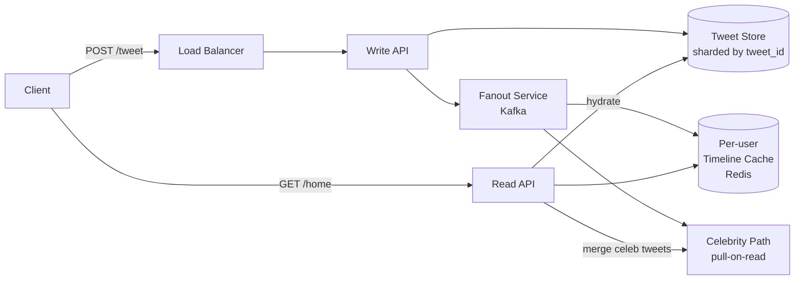

# Twitter / X Feed (social timeline)

> Design a social-media feed: users post short messages, follow others, and see a personalised home timeline. The canonical "fanout" question — choose between **fanout-on-write** (push) and **fanout-on-read** (pull) and explain why.

<span class="company-tag">Twitter</span> &nbsp; <span class="company-tag">Meta</span> &nbsp; <span class="company-tag">LinkedIn</span> &nbsp; <span class="company-tag">ByteDance</span> &nbsp; <span class="phase-status phase-done">Tier-1 SD design</span>

---

## 1. 🎤 The interview scenario

> *"Design Twitter / X. Users post tweets (≤280 chars). Users follow other users. The home timeline shows tweets from people you follow, newest first. Scale: 500M monthly active users, 200M daily, 500M tweets/day, ~10B timeline reads/day."*

45-min slot. Interviewer typically pushes on **celebrity fanout** ("how do you handle a user with 100M followers?") around the 25-min mark.

---

## 2. ❓ Clarifying questions

### Functional

1. **Tweet types?** Text only, or media (images, video, polls, retweets, replies)?
2. **Search?** In scope, or feed only?
3. **Notifications?** Real-time push, or daily digest?
4. **Edit / delete?** Edit window? Soft-delete or hard?
5. **Threading?** Reply chains shown in timeline, or only on tweet page?

### Non-functional

6. **Read:write?** ~100:1 (10B reads / 100M writes daily).
7. **Latency?** Timeline read p99 < 200ms. Post acknowledgement < 500ms.
8. **Consistency?** Eventual on timeline (a follower can see a tweet 1-2 sec late). Read-your-writes for the poster.
9. **Availability?** 99.95% for reads. 99.9% for writes.
10. **Geographic?** Global; multi-region active-active.

### Default assumptions

| Question | Assume |
|---|---|
| Tweet | Text + media URLs (media stored separately in object store). |
| Read:write | 100:1 |
| MAU / DAU | 500M / 200M |
| Avg follows | 200 |
| Avg followers | 200 (heavy-tail; 0.001% are celebrities) |

---

## 3. 📋 Requirements

### Functional

- **F1.** Post a tweet (text, optional media URL).
- **F2.** Follow / unfollow a user.
- **F3.** Home timeline (paginated, newest first).
- **F4.** User profile timeline.
- **F5.** Like, retweet, reply.

### Non-functional

- **N1.** Timeline read p99 < 200ms.
- **N2.** Eventual consistency on home timeline (≤ 5s).
- **N3.** 99.95% availability for reads.
- **N4.** 500M tweets / day, 10B reads / day.
- **N5.** Durable: no tweet ever lost.

### Out of scope

- Search, ads, DMs, recommendations beyond chronological — mention as future work.

---

## 4. 🧮 Capacity estimation

| Metric | Calc | Value |
|---|---|---|
| Tweets/day | given | 500M |
| Tweets/sec (avg) | 500M/86400 | ~5,800 |
| Tweets/sec (peak 3×) | | ~17K |
| Timeline reads/sec (avg) | 10B/86400 | ~115K |
| Timeline reads/sec (peak) | | ~350K |
| Tweet size | 280 chars + meta | ~1 KB |
| Storage / year (tweets) | 500M × 365 × 1KB | **~180 TB** |
| Media / year (10% have media, avg 200KB) | 500M × 0.1 × 200KB × 365 | **~3.6 PB** |
| Cache (hot timelines, top 10% users) | 50M users × 800 tweets × 1KB | **~40 TB across cluster** |

---

## 5. 🏗️ High-level architecture



### Write path

1. Client POSTs to write API.
2. Write API persists to **tweet store** (durable).
3. Emits event to **Kafka fanout topic**.
4. Fanout workers read Kafka, look up follower list, **push tweet_id to each follower's timeline cache** (capped at last ~800 tweets).
5. Celebrity tweets: **don't fan out**; mark for pull-on-read.

### Read path

1. Client GETs `/home`.
2. Read API fetches tweet_ids from user's **timeline cache** (Redis sorted set by timestamp).
3. **Merges in tweet_ids from celebrities the user follows** (pull-on-read).
4. Hydrates with full tweet content from tweet store + cache.
5. Returns paginated, newest first.

---

## 6. 📦 Data model & storage

### Tweet store — sharded SQL or wide-column (Cassandra / Manhattan-style)

```sql
CREATE TABLE tweets (
    tweet_id    BIGINT PRIMARY KEY,        -- snowflake ID, time-sortable
    user_id     BIGINT,
    body        TEXT,
    media_urls  TEXT[],
    parent_id   BIGINT NULL,               -- for replies
    created_at  TIMESTAMP,
    deleted_at  TIMESTAMP NULL
);
CREATE INDEX ix_tweets_user_time ON tweets (user_id, created_at DESC);
```

**Sharding**: by `tweet_id` (snowflake → time-prefixed → uneven hot range; salt with low bits of user_id).

### Follow graph — adjacency lists in Cassandra

```
followers:<user_id>     -> set of follower_ids
following:<user_id>     -> set of following_ids
```

Read-heavy; eventual consistency OK.

### Timeline cache — Redis sorted sets

```
timeline:<user_id>      -> ZSET of (tweet_id, score=created_at), capped at 800
```

Eviction policy: trim to last 800 on each insert.

### Counters — separate Redis hash

```
tweet:<tweet_id>:stats  -> {likes, retweets, replies}  (HLL for unique view counts)
```

---

## 7. 🔌 API design

REST + JSON. Internal services use gRPC.

| Method | Path | Description |
|---|---|---|
| POST | `/v1/tweets` | Create tweet. Body: `{body, media_ids[], parent_id?}`. |
| GET | `/v1/tweets/{id}` | Fetch single tweet. |
| GET | `/v1/users/{id}/timeline?cursor=...` | Profile timeline. |
| GET | `/v1/home?cursor=...` | Home timeline. |
| POST | `/v1/follow` | `{target_user_id}`. |
| POST | `/v1/tweets/{id}/like` | |

**Auth**: bearer JWT. **Rate limits**: 300 tweets / 3hr per user (mirrors X). **Pagination**: cursor (last tweet_id seen).

---

## 8. 🔧 Component-by-component deep dive

### Snowflake ID generator

```python
import time, threading

EPOCH_MS = 1704067200000  # 2024-01-01

class Snowflake:
    def __init__(self, machine_id: int):
        self.machine_id = machine_id & 0x3FF        # 10 bits
        self.seq = 0
        self.last_ms = -1
        self.lock = threading.Lock()

    def next_id(self) -> int:
        with self.lock:
            now = int(time.time() * 1000)
            if now == self.last_ms:
                self.seq = (self.seq + 1) & 0xFFF   # 12 bits
                if self.seq == 0:                    # overflow
                    while now <= self.last_ms:
                        now = int(time.time() * 1000)
            else:
                self.seq = 0
            self.last_ms = now
            return ((now - EPOCH_MS) << 22) | (self.machine_id << 12) | self.seq
```

64 bits = 41 ts + 10 machine + 12 seq. Time-sortable. 4096 IDs / ms / machine.

### Fanout worker (push path)

```python
def fanout_worker(tweet_event):
    tweet = tweet_event["tweet"]
    author = tweet["user_id"]

    # Skip celebrities — pull-on-read for them
    if follower_count(author) > CELEBRITY_THRESHOLD:   # e.g. 1M
        return

    followers = get_followers(author)                  # paginated
    pipe = redis.pipeline()
    for f in followers:
        key = f"timeline:{f}"
        pipe.zadd(key, {tweet["id"]: tweet["created_ms"]})
        pipe.zremrangebyrank(key, 0, -801)             # cap to 800
    pipe.execute()
```

Run as Kafka consumer group; partition key = `tweet["user_id"]` so same author's fanout serialises.

### Read path (hybrid)

```python
def home_timeline(user_id: int, cursor: int | None, limit: int = 50):
    # 1. Pulled from your cache (push followers)
    raw = redis.zrevrangebyscore(f"timeline:{user_id}",
                                 max=cursor or "+inf", min="-inf",
                                 start=0, num=limit*2)

    # 2. Pull celebrity tweets you follow
    celebs = [u for u in get_following(user_id) if is_celebrity(u)]
    for c in celebs:
        raw.extend(latest_tweets(c, since=cursor, limit=limit))

    # 3. Sort + dedupe + paginate
    merged = sorted(set(raw), reverse=True)[:limit]

    # 4. Hydrate
    return hydrate(merged)
```

---

## 9. 📈 Scaling journey

| Stage | Users | Architecture |
|---|---|---|
| **Day 1** | <10K | Single Postgres, single Redis, monolith. |
| **1M MAU** | 1M | Read replicas, Redis cluster, separate write/read API. |
| **10M MAU** | 10M | Shard tweets by tweet_id, async fanout via Kafka. |
| **100M MAU** | 100M | Hybrid push/pull (celebrity threshold), regional Redis fleets, multi-DC active-passive. |
| **500M MAU** | 500M | Multi-region active-active, edge caching of tweet content, dedicated graph DB for follow edges, analytics pipeline split off. |

**Inflection point**: at ~10M, **fanout-on-write alone breaks** for celebrities. Hybrid is non-negotiable.

---

## 10. ☁️ Cloud deployment (AWS canonical)

| Layer | AWS | GCP | Azure |
|---|---|---|---|
| Edge / CDN | CloudFront | Cloud CDN | Front Door |
| Load balancer | ALB | Cloud LB | App Gateway |
| API service | EKS / ECS Fargate | GKE | AKS |
| Tweet store | Aurora Postgres + Cassandra (Keyspaces) | Spanner / Bigtable | Cosmos DB |
| Cache | ElastiCache Redis cluster | Memorystore | Azure Cache for Redis |
| Fanout queue | MSK (Kafka) | Pub/Sub | Event Hubs |
| Media | S3 + CloudFront | GCS + CDN | Blob + CDN |
| Search | OpenSearch | Vertex AI Search | Azure AI Search |

**Cost ballpark (100M MAU)**: ~$8-15M / year (compute heavy on Kafka + Redis + tweet store).

---

## 11. 🏠 Local / on-prem deployment

- **Bare-metal**: 3-AZ Kubernetes on bare-metal racks. Local NVMe for Redis. Object store via Ceph. Kafka self-hosted (Strimzi operator).
- **Docker Compose (dev)**:

```yaml
services:
  postgres: { image: postgres:16 }
  redis: { image: redis:7 }
  kafka: { image: bitnami/kafka:3.6 }
  api: { build: ./api, depends_on: [postgres, redis, kafka] }
  fanout: { build: ./fanout, depends_on: [kafka, redis] }
```

- **Single-binary mode** for staging: SQLite + in-memory Redis + Goroutine fanout (test only).

---

## 12. 🧬 Architecture deep-dive

### Microservices boundary

| Service | Owns |
|---|---|
| Tweet write | Validation, persist tweet, emit Kafka event. |
| Tweet read | Hydration + per-tweet caching. |
| Fanout | Read Kafka, write to per-user timelines. |
| Graph | Follow / followers, follower count. |
| Timeline read | Hybrid push+pull merge. |
| Counter | Likes, retweets, replies (sharded HLL). |
| Notification | Pings devices via APNs / FCM. |

### Sync vs async

- Sync: tweet write (must ack durability), tweet read, follow.
- Async: fanout, counters, notifications, search index.

### CQRS

Read and write models diverge: writes go to tweet store; reads come from timeline cache + tweet store. Classic CQRS.

### Sagas

A "delete tweet" saga: mark deleted in tweet store → emit delete event → fanout removes from caches → counters decrement → search de-indexes. Compensations on failure.

---

## 13. ⚖️ Bottlenecks & trade-offs

| Bottleneck | Cause | Fix |
|---|---|---|
| Celebrity fanout storm | 100M followers × 1 tweet | Pull-on-read for celebrities. |
| Hot tweet (viral) | Single tweet, millions of reads | Edge cache + per-tweet read replica + RU caching. |
| Timeline cache memory | 500M users × 800 tweets | Per-user TTL on inactive accounts; LRU eviction. |
| Cross-region replication lag | Multi-DC | Accept eventual; serve from local cache. |
| Hot follower list | Celeb's `followers:` key is huge | Paginate, store in chunked Cassandra rows. |

### Push vs pull tradeoff

| | Push (fanout-on-write) | Pull (fanout-on-read) |
|---|---|---|
| Read cost | ~O(1) per timeline | O(F) where F = following count |
| Write cost | O(N) where N = follower count | O(1) |
| Best for | Avg user (200 followers) | Celeb (100M followers) |

Hybrid: push for normal accounts, pull for celebrities at read time.

---

## 14. 🔒 Security

- **AuthN**: OAuth 2.0 + JWT, refresh tokens, 1-week access, 90-day refresh.
- **AuthZ**: per-tweet visibility (public, protected, deleted); enforce at read API.
- **Encryption**: TLS 1.3 in transit; AES-256 at rest (KMS keys per region).
- **DDoS**: AWS Shield + WAF. Rate-limit per user / per IP / per token. Anomaly detector for tweet spam (rate of new account → mass follow → tweet).
- **Privacy**: GDPR right-to-delete: tombstone in tweet store, async purge of timeline caches, search index removal within 30 days.
- **Audit logs**: every admin action; immutable WORM bucket retained 1 year.

---

## 15. 📊 Monitoring & observability

### Golden signals

| Signal | Metric | Alert when |
|---|---|---|
| Latency | p50/p99 timeline read | p99 > 300ms for 5 min |
| Traffic | Tweets/sec, reads/sec | -25% week-over-week (anomaly) |
| Errors | 5xx rate | > 0.1% for 2 min |
| Saturation | Redis CPU, Kafka lag, DB conn pool | Lag > 30s |

### SLOs

- Timeline read availability: 99.95% / month.
- Tweet write success: 99.9% / month.
- Fanout-to-cache latency: p99 < 5s.

### Tracing

OpenTelemetry: trace ID propagated tweet → fanout → cache → read. Sample 1% in steady state, 100% on errors.

---

## 16. 🛡️ Reliability

- **Circuit breakers** on cache → fall back to tweet store directly.
- **Retries**: idempotent reads with exponential backoff; writes use idempotency keys.
- **Fallbacks**: if fanout is down, write API still acks (degraded read path warns but works).
- **Chaos engineering**: weekly fault injection (kill a Redis node, partition a region). Game days quarterly.
- **Backpressure**: Kafka consumer lag > 1M → throttle write API.

---

## 17. 🤔 Common follow-up questions

??? question "How do you guarantee a follower sees the tweet within 5 seconds?"

    Push path is ~1-2s p99 (Kafka → fanout → Redis). Celebrity pull path runs at read time. The 5s SLO is the union; we monitor end-to-end with synthetic tweets.

??? question "What if a celebrity has 100M followers and posts 10 tweets/day?"

    Pull-on-read. We don't fan out. We mark them as celebrity (threshold 1M followers). At read time, for any user, we merge their cached push tweets with the latest from celebs they follow. Pulling 100 celebs × 10 latest tweets is bounded.

??? question "How do you handle a tweet going viral — 10M likes in an hour?"

    The tweet itself is read-cached at edge (CloudFront) with a short TTL. Like counter is sharded HLL across N shards, summed at read. Hot key in Redis: replicate the tweet's read replicas across the cluster.

??? question "How do you delete a tweet?"

    Tombstone in tweet store (`deleted_at` set). Emit delete event. Fanout workers remove `tweet_id` from affected timeline caches. Cache reads filter out tombstones. Hard delete after 30 days for GDPR.

??? question "How do you handle clock skew across machines for snowflake IDs?"

    NTP-sync all hosts. If clock goes backwards, the snowflake gen blocks until last_ms catches up. Machines that drift > 100ms get pulled from rotation by health check.

??? question "Why ZSET in Redis instead of a list?"

    ZSET supports range-by-score (newer than X), trim by rank, dedupe by member. Lists can't do range-by-score efficiently.

??? question "What about edits?"

    Twitter shipped 30-min edit window in 2022. Implementation: tweets table gets a `version` column, all versions retained. Read API returns latest version. Fanout doesn't re-trigger on edit; clients re-fetch.

---

## 18. 🐍 Python for tricky pieces

### Consistent hashing for tweet store sharding

```python
import bisect, hashlib

class ConsistentHashRing:
    def __init__(self, nodes: list[str], vnodes: int = 150):
        self.ring: list[tuple[int, str]] = []
        for n in nodes:
            for i in range(vnodes):
                h = self._hash(f"{n}#{i}")
                self.ring.append((h, n))
        self.ring.sort()

    @staticmethod
    def _hash(key: str) -> int:
        return int(hashlib.md5(key.encode()).hexdigest(), 16)

    def node_for(self, key: str) -> str:
        h = self._hash(key)
        idx = bisect.bisect(self.ring, (h, "")) % len(self.ring)
        return self.ring[idx][1]
```

### HLL counter for unique views (sketch)

```python
class HLL:
    def __init__(self, p: int = 14):
        self.p = p
        self.m = 1 << p
        self.regs = [0] * self.m

    def add(self, x: int) -> None:
        h = hash(x) & 0xFFFFFFFFFFFFFFFF
        idx = h >> (64 - self.p)
        w = (h << self.p) & 0xFFFFFFFFFFFFFFFF | (1 << (self.p - 1))
        rho = (w & -w).bit_length()
        if rho > self.regs[idx]:
            self.regs[idx] = rho

    def count(self) -> int:
        # simplified estimator
        m = self.m
        z = sum(2.0 ** -r for r in self.regs)
        alpha = 0.7213 / (1 + 1.079 / m)
        return int(alpha * m * m / z)
```

---

## 19. 🌐 Real-world references

- **Twitter Engineering blog** — "The Infrastructure Behind Twitter" (multiple posts on Manhattan, Gizmoduck, Tweetypie).
- **Discord Engineering** — "Storing Billions of Messages" — Cassandra patterns relevant here.
- **High Scalability** — fanout posts on the original Twitter design. (Search: "twitter timeline architecture".)
- **Famous outage**: Twitter "fail whale" era (2008-2010) — pre-Manhattan. Lesson: monolithic Postgres breaks at fanout scale.

What's public vs speculation: the **hybrid push/pull model is confirmed in talks**; specific thresholds (1M follower line) are reasonable estimates.

---

## 20. 📝 One-page cheatsheet

```
TWITTER FEED — DAY OF INTERVIEW

REQUIREMENTS
  500M MAU, 200M DAU
  500M tweets/day, 10B reads/day → 100:1
  Eventual consistency on home timeline OK
  p99 read < 200ms

CAPACITY
  Tweets/sec peak ~17K
  Reads/sec peak ~350K
  Storage 180 TB/yr (text), 3.6 PB/yr (media)
  Cache ~40 TB across cluster

ARCHITECTURE
  Write: API → tweet store (sharded) → Kafka → fanout
  Read: API → timeline cache → hydrate from tweet store
  Hybrid: push for <1M followers, pull for celebs
  Snowflake IDs (41 ts + 10 mach + 12 seq)

DATA
  tweets — sharded by tweet_id
  followers/following — Cassandra adjacency lists
  timeline:<uid> — Redis ZSET (tweet_id, ts), cap 800
  stats — sharded counters + HLL

TRADE-OFFS
  Push: fast read, slow write for celebs
  Pull: fast write, slow read for many follows
  Hybrid wins; threshold ~1M

SCALING JOURNEY
  Day 1 → mono → shards → hybrid fanout → multi-region

RELIABILITY
  Circuit breaker cache→DB
  Idempotent writes via idem-key
  Kafka lag alert >30s
  Chaos: kill a Redis node weekly

INTERVIEW TIPS
  Ask about scale before designing
  Mention CAP early: AP system, eventual on home
  Push vs pull is THE conversation — don't skip
  Talk about celebrity case unprompted
```
