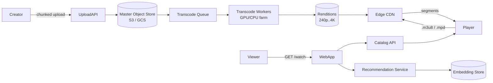

# YouTube / Netflix (video streaming)

> Design a video-streaming platform. Users upload videos, the platform transcodes them, and millions of viewers stream them globally with adaptive bitrate. The "how do you serve petabytes" question.

<span class="company-tag">Google</span> &nbsp; <span class="company-tag">Netflix</span> &nbsp; <span class="company-tag">Meta</span> &nbsp; <span class="company-tag">ByteDance</span> &nbsp; <span class="phase-status phase-done">Tier-1 SD design</span>

---

## 1. 🎤 The interview scenario

> *"Design YouTube / Netflix. Users upload videos; viewers stream them. Need adaptive bitrate (240p–4K), global low-latency playback, recommendations on the home page. Scale: 2B MAU, 1B hours watched/day, 500 hours uploaded/min."*

45-min slot. Interviewer often pushes on **CDN strategy** and **transcoding pipeline** ("what happens between upload and the video being playable?") around minute 20.

---

## 2. ❓ Clarifying questions

### Functional

1. **UGC or licensed only?** YouTube = both; Netflix = licensed. Transcoding stages differ.
2. **Live vs VOD?** Live adds HLS / DASH origin segmenter and ~5s latency budget.
3. **DRM?** Netflix yes (Widevine/PlayReady/FairPlay); YouTube partial.
4. **Subtitles, multi-audio, multi-language?**
5. **Comments, likes, recommendations?** Or playback only?
6. **Offline downloads?**

### Non-functional

7. **Read:write?** 1000:1 (1B daily streams vs ~700K uploads).
8. **Latency?** Time-to-first-byte < 1s globally; rebuffer ratio < 0.5%.
9. **Availability?** 99.99% playback.
10. **Geographic?** Global; aggressive edge caching mandatory.

### Defaults

| Question | Assume |
|---|---|
| Type | UGC + licensed mix; VOD primary, live separate path. |
| Resolutions | 240p, 480p, 720p, 1080p, 1440p, 4K. |
| Codecs | H.264 baseline + H.265 / AV1 for newer clients. |
| DRM | Widevine for premium; clear for free tier. |
| Storage horizon | 5 years. |

---

## 3. 📋 Requirements

### Functional

- **F1.** Upload video (multipart, resumable).
- **F2.** Transcode to N renditions (resolution × bitrate).
- **F3.** Stream via adaptive bitrate (HLS / DASH).
- **F4.** Search + browse.
- **F5.** Like / comment / subscribe.

### Non-functional

- **N1.** TTFB < 1s globally.
- **N2.** Rebuffer ratio < 0.5%.
- **N3.** 99.99% playback availability.
- **N4.** Durability: 11 9s for masters (S3-class).
- **N5.** Cost-efficient egress (CDN egress is the #1 cost line).

### Out of scope

- Studio CMS, billing, ads, rights management. Mention at end.

---

## 4. 🧮 Capacity estimation

| Metric | Calc | Value |
|---|---|---|
| Uploads/min | given | 500 hours |
| Avg upload duration | | 15 min |
| Uploads/min (count) | 500h × 60 / 15 | ~2,000 |
| Uploads/sec | | ~33 |
| Streams/sec | 1B/day / 86400 | ~12K concurrent starts; ~50M concurrent active streams |
| Avg bitrate served | weighted across renditions | ~3 Mbps |
| Egress bandwidth | 50M × 3 Mbps | **150 Tbps** |
| Master storage / yr | 500h/min × 60 × 24 × 365 × ~2GB/h master | **~5 EB / yr (mind-boggling — most is pruned for cold)** |
| Encoded renditions overhead | ~3-4× master | adds 15+ EB / yr |

Reality: YouTube self-reports 500h/min uploaded (2019). Storage is a primary cost. Hot-tier = recent + popular. Cold-tier = LRU offload to glacier-class.

---

## 5. 🏗️ High-level architecture



### Write path (upload → playable)

1. Creator uploads via chunked multipart (resumable).
2. Master saved to durable object store; checksum computed.
3. Job published to **transcode queue**.
4. Workers fan out: per resolution × codec combo. ~6 outputs per master.
5. Each rendition is **segmented** into 2-6s chunks (HLS / DASH).
6. Manifest (`.m3u8` / `.mpd`) generated + uploaded.
7. CDN warms top regions speculatively for popular creators.

### Read path (play)

1. Player fetches manifest from CDN.
2. Player picks bitrate based on bandwidth estimate (ABR algorithm).
3. Fetches segments; ABR ladder switches mid-playback as conditions change.
4. Catalog metadata (title, captions, recommendations) comes from API.

---

## 6. 📦 Data model & storage

### Catalog (Spanner / Aurora)

```sql
CREATE TABLE videos (
    video_id     BIGINT PRIMARY KEY,
    creator_id   BIGINT,
    title        TEXT,
    description  TEXT,
    duration_s   INT,
    upload_ts    TIMESTAMP,
    status       TEXT,             -- UPLOADING/PROCESSING/READY/FAILED
    visibility   TEXT,             -- PUBLIC/UNLISTED/PRIVATE
    master_uri   TEXT
);

CREATE TABLE renditions (
    video_id     BIGINT,
    rendition    TEXT,             -- "1080p_h264", "4k_av1"
    manifest_uri TEXT,
    cdn_prefix   TEXT,
    PRIMARY KEY (video_id, rendition)
);
```

### Object stores

- **Masters** — S3 Glacier Deep Archive after 90d if not modified.
- **Renditions** — S3 Standard for hot, S3 IA after 30d, glacier after 1y.
- **Manifests** — S3 Standard, edge-cached aggressively.

### Engagement (Cassandra)

```
likes:<video_id>     -> counter
views:<video_id>     -> sharded counter / HLL
comments:<video_id>  -> wide row, paginated by ts
```

### User watch history (key-value)

```
watch:<user_id> -> rolling list of (video_id, ts, position_s) — last 5K
```

### Recommendations (vector store)

```
embeddings:videos  -> 256-D embedding per video
embeddings:users   -> 256-D embedding per user (rolling avg)
```

ANN index (HNSW / FAISS) for nearest-neighbour serving.

---

## 7. 🔌 API design

| Method | Path | Description |
|---|---|---|
| POST | `/v1/uploads` | Initiate; returns upload URL + chunk size. |
| PUT | `<presigned>` | Chunk upload directly to object store. |
| POST | `/v1/uploads/{id}/complete` | Finalise; triggers transcode. |
| GET | `/v1/videos/{id}` | Catalog metadata. |
| GET | `/v1/videos/{id}/manifest.m3u8` | Redirected to CDN. |
| GET | `/v1/home` | Recommendations + subscriptions feed. |
| POST | `/v1/videos/{id}/like` | |

**Auth**: OAuth + signed CDN URLs (HMAC) for premium content.
**Streaming**: HLS (Apple) + MPEG-DASH (everyone else). CMAF unifies segments.

---

## 8. 🔧 Component-by-component deep dive

### Resumable chunked upload

```python
# Client splits master into 8MB chunks; tracks per-chunk completion.
def upload(master_path, presigned_chunk_url):
    with open(master_path, "rb") as f:
        idx = 0
        while True:
            chunk = f.read(8 * 1024 * 1024)
            if not chunk:
                break
            etag = put_chunk(presigned_chunk_url, chunk, idx)
            checkpoint(idx, etag)               # local resume marker
            idx += 1
    finalize_multipart(idx, etags=load_etags())
```

Server-side: standard S3 multipart upload. Resume by comparing client checkpoint against multipart parts.

### Transcode worker (FFmpeg-driven)

```python
import subprocess

LADDER = [
    ("240p",  "426x240",  "400k",  "h264"),
    ("480p",  "854x480",  "1000k", "h264"),
    ("720p",  "1280x720", "2500k", "h264"),
    ("1080p", "1920x1080","4500k", "h264"),
    ("1440p", "2560x1440","8000k", "h265"),
    ("2160p", "3840x2160","16000k","h265"),
]

def transcode(master_uri: str, video_id: int):
    local_master = download(master_uri)
    for name, res, br, codec in LADDER:
        out = f"/tmp/{video_id}_{name}.m3u8"
        cmd = [
            "ffmpeg", "-i", local_master,
            "-vf", f"scale={res}", "-b:v", br,
            "-c:v", codec, "-c:a", "aac",
            "-hls_time", "6", "-hls_playlist_type", "vod",
            "-hls_segment_filename", f"/tmp/{video_id}_{name}_%04d.ts",
            out,
        ]
        subprocess.check_call(cmd)
        upload_dir(f"/tmp/{video_id}_{name}_*", f"renditions/{video_id}/{name}/")
    write_master_manifest(video_id, LADDER)
```

In production: distributed across thousands of workers, GPU-accelerated for AV1, idempotent via per-rendition keys.

### ABR client (player-side)

```python
def select_bitrate(history, ladder):
    avg_throughput = sum(history[-5:]) / 5     # measured Mbps
    safety = 0.8                                 # 20% headroom
    target = avg_throughput * safety
    for rung in reversed(ladder):                # highest fits first
        if rung["bitrate_mbps"] <= target:
            return rung
    return ladder[0]                             # floor
```

Sophisticated: BOLA, MPC, Pensieve (RL).

---

## 9. 📈 Scaling journey

| Stage | DAU | Architecture |
|---|---|---|
| **Day 1** | <10K | Single transcoder, S3, CloudFront. |
| **1M** | 1M | Transcode farm with queue, multi-bucket per region. |
| **50M** | 50M | Per-region origin shields, ML recommendations, watch-history sharding. |
| **500M** | 500M | Edge transcoding for live, multi-CDN strategy, PoPs in 200+ cities, ML inference at edge. |
| **2B** | 2B | Custom hardware encoders, ASIC AV1 transcoders, peer-to-peer (rare for VOD), edge caches in ISPs (Open Connect / Google Global Cache). |

**Inflection point**: at ~10M, **single-CDN strategy breaks** for cost + reliability. Multi-CDN (Akamai + Fastly + own) becomes essential.

---

## 10. ☁️ Cloud deployment

| Layer | AWS | GCP | Azure |
|---|---|---|---|
| CDN | CloudFront (+ third-party Akamai/Fastly) | Cloud CDN + Media CDN | Front Door + Akamai |
| Transcoding | MediaConvert + Batch | Transcoder API + Batch | Media Services |
| Storage masters | S3 Glacier Deep Archive | GCS Archive | Blob Archive |
| Storage renditions | S3 Standard / IA | GCS Standard / Nearline | Blob Hot / Cool |
| Catalog DB | Aurora / DynamoDB | Spanner / Bigtable | Cosmos DB |
| Search | OpenSearch | Vertex AI Search | AI Search |
| Live ingest | MediaLive | Live Stream API | Media Services Live |
| ML / recs | SageMaker | Vertex AI | Azure ML |

**Cost ballpark (500M DAU)**: $2-5B/year for CDN egress alone (industry estimate). Hence Open Connect (Netflix's ISP-deployed cache appliance) — moves cost from CDN-egress to ISP partnerships.

---

## 11. 🏠 Local / on-prem deployment

- **Bare-metal**: Ceph for object storage; FFmpeg cluster on Kubernetes; Nginx-RTMP for ingest; Varnish for edge cache.
- **Single-host dev**:

```yaml
services:
  ingest: { build: ./ingest }
  transcode: { build: ./transcode, deploy: { replicas: 4 } }
  minio:   { image: minio/minio, command: server /data }   # S3 stand-in
  postgres: { image: postgres:16 }
  nginx-rtmp: { image: tiangolo/nginx-rtmp }
```

- **Edge appliance** (à la Open Connect): 1U server, hundreds of TB SSD, runs Nginx + custom kernel modules at ISP. Pre-fills overnight.

---

## 12. 🧬 Architecture deep-dive

### Microservices boundary

| Service | Owns |
|---|---|
| Upload | Multipart, resumable, virus scan, metadata extract. |
| Transcode | Job orchestration, FFmpeg workers, manifest gen. |
| Catalog | Video metadata, search index. |
| Player API | Manifest URL signing, ABR hints, captions. |
| Recommendation | Embeddings, ranker, candidate gen. |
| Engagement | Likes, comments, views. |
| Notification | Push to subscribers on new uploads. |

### Sync vs async

- Sync: catalog read, manifest fetch, signed URL grant.
- Async: transcode, recommendation update, notification, search index.

### CQRS

Catalog has separate **write store** (Aurora) and **read store** (denormalised in DynamoDB / Elastic).

### Sagas

Upload pipeline saga: upload → virus scan → transcode → manifest → publish. Each step idempotent; on failure roll back to a known checkpoint (re-transcode, not re-upload).

---

## 13. ⚖️ Bottlenecks & trade-offs

| Bottleneck | Cause | Fix |
|---|---|---|
| CDN egress cost | Highest line item | Multi-CDN, ISP-co-located caches (Open Connect), prefer cheaper regions, AV1 lower bitrate. |
| Origin-shield miss | Cold tail content | Multi-tier shield: edge → regional → origin. |
| Transcode lag (creator visible) | Long videos, GPU contention | Priority queues; preview rendition (480p) ready in <2 min, others stream in. |
| Live latency vs reliability | Low-latency = small chunks, brittle | LL-HLS / CMAF chunked, with fallback to standard HLS at >5s latency. |
| Recommendation freshness | New videos lack signal | Cold-start via creator embeddings + topic tags. |

### Encode tradeoff

| Codec | Pro | Con |
|---|---|---|
| H.264 | Universal compat | High bitrate |
| H.265 / HEVC | -40% bitrate vs H.264 | Licensing complexity |
| AV1 | -30% vs H.265, royalty-free | High encode cost (CPU); newer hardware decode |
| VP9 | Free, web-compatible | Lower adoption than AV1 going forward |

Strategy: encode multiple, serve best codec the client supports.

---

## 14. 🔒 Security

- **DRM**: Widevine (Android, Chrome), PlayReady (Edge, Xbox), FairPlay (Apple). License server signs playback decryption keys per-session.
- **Signed URLs**: short-lived (5-min) HMAC signatures on segment URLs to prevent hot-link.
- **AuthN/Z**: OAuth + JWT; entitlement check on each manifest request.
- **Watermarking**: forensic for premium licensed content (per-session pixel markers).
- **DDoS**: Shield + WAF; geo-blocking for jurisdictional rights.
- **Content moderation**: ML scan on upload (NSFW, copyright Content-ID-style).

---

## 15. 📊 Monitoring & observability

### QoE (quality of experience) metrics

| Signal | Metric |
|---|---|
| Startup time | Time from click → first frame |
| Rebuffer ratio | (rebuffer_seconds / playback_seconds) × 100 |
| ABR shifts | Avg bitrate switches per 10 min |
| Failed playbacks | % of sessions ending in error |
| CDN cache hit | % segments served from edge |

### SLOs

- 99.99% playback availability per region.
- p95 startup time < 2s.
- Rebuffer ratio < 0.5%.

---

## 16. 🛡️ Reliability

- **Multi-CDN failover**: client-side or DNS-based (route around the failed CDN).
- **Origin shield**: prevents stampedes.
- **Idempotent transcode**: can re-run safely on worker failure.
- **Chaos**: kill an entire region — clients should fail over to next-closest in <30s.
- **Graceful degradation**: if recommendations service is down, serve "trending" cache.

---

## 17. 🤔 Common follow-up questions

??? question "How would you support live streaming?"

    Live ingest via RTMP/SRT to ingest server → packager segments into 2-6s chunks (or 200ms parts for LL-HLS) → CDN. End-to-end latency: 10s standard HLS, ~3s LL-HLS, <1s WebRTC. Recommend LL-HLS for sport, WebRTC for interactive.

??? question "How do you compute recommendations?"

    Two-tower model: user tower + video tower → 256-D embedding. Candidate gen: ANN (HNSW) over video embeddings near user embedding. Ranker: gradient-boosted tree on engagement features. Real-time signals fed via Kafka. Re-train daily; online learning on engagement events.

??? question "Why HLS and DASH both? Why not pick one?"

    Apple devices only support HLS natively. Android/web mostly DASH. CMAF unifies the underlying segment format so we encode once and wrap manifests separately.

??? question "How do you prevent piracy?"

    Per-session forensic watermarking + DRM (Widevine etc.) + signed URLs + concurrent-stream limits. Determined attackers will still break it; we trade off cost vs effectiveness.

??? question "How do you handle a viral creator with 10M subscribers uploading?"

    Notification fanout uses the same hybrid push/pull as Twitter. Edge prefetch: when creator publishes, top regions speculatively warm CDN edges. Catalog write is constant-time; the multipliers are downstream (notify, prefetch).

??? question "What if a video is 10 hours long?"

    Transcode in parallel chunks (split master, transcode each, stitch manifests). Live videos use unbounded HLS playlists (rolling window). Storage tier the master into Glacier after 90d untouched.

??? question "How do you handle copyright takedowns?"

    Content-ID-style fingerprint scan on upload (audio + video hashes against rightsholder DB). Match → flag for review or auto-block. Manual takedown via DMCA portal.

---

## 18. 🐍 Python for tricky pieces

### Token-bucket per CDN-prefetch worker (avoid origin storm)

```python
import time, threading

class TokenBucket:
    def __init__(self, rate_per_s: float, burst: int):
        self.rate = rate_per_s
        self.cap = burst
        self.tokens = burst
        self.last = time.monotonic()
        self.lock = threading.Lock()

    def take(self, n: int = 1) -> bool:
        with self.lock:
            now = time.monotonic()
            self.tokens = min(self.cap, self.tokens + (now - self.last) * self.rate)
            self.last = now
            if self.tokens >= n:
                self.tokens -= n
                return True
            return False
```

### Reservoir sampling for view logging

```python
import random

class Reservoir:
    def __init__(self, k: int):
        self.k = k
        self.items: list = []
        self.n = 0

    def add(self, x):
        self.n += 1
        if len(self.items) < self.k:
            self.items.append(x)
        else:
            j = random.randint(0, self.n - 1)
            if j < self.k:
                self.items[j] = x
```

Use for representative-sample QoE metrics under heavy traffic.

---

## 19. 🌐 Real-world references

- **Netflix Tech Blog** — "Open Connect" deep dives, "Per-Title Encoding", "Dynamic Optimizer" for codec selection.
- **YouTube Engineering** — Vitess (sharded MySQL), Borg (Google's container scheduler).
- **Akamai blog** — origin shielding, prefetch strategies.
- **AV1 / Alliance for Open Media** — codec resources.
- **Famous outage**: Fastly 2021 single-config-change outage took down 30+ properties for an hour. Lesson: multi-CDN.

---

## 20. 📝 One-page cheatsheet

```
VIDEO STREAMING — DAY OF INTERVIEW

REQUIREMENTS
  2B MAU, 1B hours/day
  500h uploaded/min, ~33 uploads/sec
  TTFB <1s, rebuffer <0.5%, 99.99% playback
  HLS + DASH (CMAF unified)

CAPACITY
  Egress ~150 Tbps peak
  Storage masters: petabytes-to-exabytes
  Renditions ~3-4× master size

ARCHITECTURE
  Upload → S3 master → transcode queue → workers → renditions
  Player → CDN → segments; manifest from edge
  Multi-CDN, origin shield, ISP edge caches (Open Connect)
  Recommendations: 2-tower embeddings + ANN candidates + GBT ranker

TRANSCODE
  Ladder: 240/480/720/1080/1440/4K
  Codecs: H.264 (universal) + H.265/AV1 (cheaper bitrate)
  Per-title encoding (Netflix-style) saves 20-30% bitrate

DATA
  videos catalog (Spanner / Aurora)
  renditions (manifest URIs)
  engagement (Cassandra wide row)
  watch history (key-value)
  embeddings (vector store + HNSW)

TRADE-OFFS
  Codec cost vs compatibility
  Single-CDN cheap but fragile; multi-CDN reliable
  Live latency vs robustness
  Cold storage vs accessibility

RELIABILITY
  Multi-CDN failover
  Idempotent transcode
  Origin shield
  Per-session signed URL + DRM

SECURITY
  Widevine/PlayReady/FairPlay DRM
  Signed segment URLs (5-min HMAC)
  Forensic watermarking
  DMCA + Content-ID fingerprints

INTERVIEW TIPS
  Lead with capacity (egress is THE cost)
  Mention CDN strategy unprompted
  HLS + DASH (don't pick one)
  Explain ABR ladder + per-title encode
```
