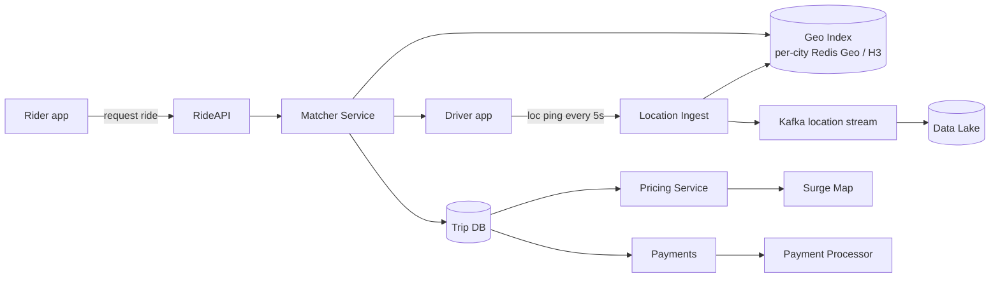

# Uber / Lyft (ride sharing)

> Design a ride-sharing service. Riders request a ride with pickup + drop; the system finds a nearby driver, matches them, tracks the ride live, computes fare, settles payment. The "geo-spatial + real-time matching" question.

<span class="company-tag">Uber</span> &nbsp; <span class="company-tag">Lyft</span> &nbsp; <span class="company-tag">DoorDash</span> &nbsp; <span class="company-tag">Swiggy</span> &nbsp; <span class="phase-status phase-done">Tier-1 SD design</span>

---

## 1. 🎤 The interview scenario

> *"Design Uber. Riders request a ride; we match them with a nearby driver, track the ride, charge the fare, and pay the driver. ~30M rides per day worldwide; ~5M concurrent active drivers; sub-second matching expected."*

45-min slot. Interviewer typically pushes on **the matching algorithm** ("how do you find the nearest 5 drivers?") around minute 15, then **surge pricing** by minute 30.

---

## 2. ❓ Clarifying questions

### Functional

1. **Ride types?** Pool, X, XL, premium? Adds matching complexity.
2. **Scheduled vs on-demand?** Adds a different matching pipeline.
3. **Surge pricing?** Yes — assume zone-level multipliers.
4. **Cancellation?** Within how long? Charges?
5. **Multi-stop rides?** Out-of-scope unless asked.
6. **Rider rating system?** In scope (simple).

### Non-functional

7. **Match latency?** p99 < 3s from request to driver-assigned.
8. **Driver location update freq?** Every 4-5s while online; faster on a trip.
9. **Geographic?** Global; per-region active-active (per-city sharded).
10. **Availability?** 99.95% rider-facing; payments 99.99%.

### Defaults

| Question | Assume |
|---|---|
| Ride types | UberX only for the design; mention extensibility. |
| Mode | On-demand; scheduled = layer on top. |
| Surge | Yes, per H3 cell, 1.0–5.0×. |
| Payments | Yes; integrate with Stripe-like processor. |

---

## 3. 📋 Requirements

### Functional

- **F1.** Rider requests a ride with pickup + drop coordinates.
- **F2.** System matches with closest viable driver.
- **F3.** Live driver location streamed during ride.
- **F4.** Fare calculated at end, charged to rider, paid to driver.
- **F5.** Both parties rate each other.
- **F6.** Surge pricing per zone.

### Non-functional

- **N1.** Match p99 < 3s.
- **N2.** Driver location update with ≤5s freshness.
- **N3.** Rider sees driver pin moving smoothly (interpolate client-side).
- **N4.** 99.99% payments; never double-charge.
- **N5.** Per-city scale: 10k concurrent rides, 50k drivers online.

### Out of scope

- Pool routing optimisation, demand forecasting (mention as adjacent).

---

## 4. 🧮 Capacity estimation

| Metric | Calc | Value |
|---|---|---|
| Rides/day | given | 30M |
| Rides/sec (avg) | 30M/86400 | ~350 |
| Rides/sec (peak 4×) | | ~1,400 |
| Active drivers concurrent | given | ~5M |
| Driver location pings/sec | 5M / 5s | **1M pings/sec** |
| Bytes per ping | ~100B (id, lat, lon, ts, heading) | |
| Pings ingest bandwidth | 1M × 100B | **~100 MB/s** |
| Active rides at once | global | ~500K |
| Storage per ride | request + ride events + payment | ~10 KB |
| Daily ride storage | 30M × 10KB | **~300 GB/day raw** |

---

## 5. 🏗️ High-level architecture



### Match flow

1. Rider POSTs `/rides` with pickup.
2. RideAPI calls Matcher.
3. Matcher queries **geo index** for nearest N drivers within radius (~3 km) — using H3 / S2 cells or Redis GEOADD.
4. Matcher filters by driver eligibility (online, idle, ride type).
5. Matcher pushes ride offer to top driver via persistent connection (gRPC/WebSocket).
6. Driver has 10s to accept; if no accept, fallback to next.
7. On accept, trip created in Trip DB; rider notified.

### Live tracking

8. Driver app pings location every 5s while idle, every 1-2s on a trip.
9. Ingest writes to geo index (replace) and Kafka (history).
10. Rider app subscribes to driver's location stream via WebSocket.

### Settlement

11. Trip ends; route collected; fare calculated by Pricing.
12. Payments charges rider, schedules driver payout.
13. Ratings collected.

---

## 6. 📦 Data model & storage

### Trip DB (Postgres / Spanner — sharded by city/region)

```sql
CREATE TABLE trips (
    trip_id      BIGINT PRIMARY KEY,
    rider_id     BIGINT,
    driver_id    BIGINT NULL,
    state        TEXT,        -- REQUESTED/MATCHED/PICKUP/IN_TRIP/COMPLETED/CANCELLED
    pickup_loc   GEOGRAPHY,
    drop_loc     GEOGRAPHY,
    requested_at TIMESTAMP,
    matched_at   TIMESTAMP NULL,
    ended_at     TIMESTAMP NULL,
    fare_cents   BIGINT NULL,
    surge        FLOAT
);

CREATE TABLE trip_events (
    trip_id   BIGINT,
    seq       INT,
    event_ts  TIMESTAMP,
    event     TEXT,           -- ACCEPTED/PICKED_UP/STARTED/ENDED/CANCELLED
    PRIMARY KEY (trip_id, seq)
);
```

### Driver location (Redis — per-city instance)

```
GEOADD city:bom drivers <lon> <lat> driver:<driver_id>
```

Plus a hash of driver state:

```
HSET driver:<id> status ONLINE ride_type X last_ping <ts>
```

### Surge map

```
surge:<city>:<h3_cell> -> multiplier (1.0..5.0)
```

Recomputed every 60s by the surge-map worker.

### Payments (event-sourced ledger)

```sql
CREATE TABLE ledger_events (
    event_id    BIGINT PRIMARY KEY,
    trip_id     BIGINT,
    type        TEXT,        -- AUTH/CAPTURE/REFUND/PAYOUT
    amount_cents BIGINT,
    created_at  TIMESTAMP,
    idem_key    TEXT UNIQUE
);
```

---

## 7. 🔌 API design

| Method | Path | Description |
|---|---|---|
| POST | `/v1/rides` | Request a ride. |
| GET | `/v1/rides/{id}` | Current state, driver location. |
| WS | `/v1/rides/{id}/stream` | Live driver pin. |
| POST | `/v1/drivers/location` | Driver pings location. |
| POST | `/v1/drivers/online` | Toggle online. |
| POST | `/v1/rides/{id}/cancel` | Cancel (with reason). |
| POST | `/v1/rides/{id}/rate` | Rate counterparty. |

**Auth**: OAuth + per-device cert pinning for driver app.
**Idempotency**: every state-changing call carries an `Idempotency-Key`.

---

## 8. 🔧 Component-by-component deep dive

### H3 / S2 spatial index

H3 (Uber's open-source hex grid) tessellates Earth into hexagons at multiple resolutions.

```python
import h3

PICKUP_RES = 8                     # ~0.7 km hex edge

def cells_within_radius_km(lat: float, lon: float, km: float):
    # k-ring at resolution 8 ~ 0.7 km steps
    cell = h3.latlng_to_cell(lat, lon, PICKUP_RES)
    k = max(1, int(km / 0.7))
    return h3.grid_disk(cell, k)
```

Geo index is per-cell list:

```
cell:<h3_id>:drivers -> SET of driver_ids   (Redis)
```

On location update: compute new cell, remove from old cell SET, add to new.

### Matcher (top-K nearest, filtered)

```python
def match(rider, ride_type, max_km=3.0):
    cells = cells_within_radius_km(rider.lat, rider.lon, max_km)
    candidates: list[tuple[float, int]] = []
    for c in cells:
        for did in redis.smembers(f"cell:{c}:drivers"):
            d = get_driver_state(did)
            if d.status != "ONLINE" or d.busy or d.ride_type != ride_type:
                continue
            dist = haversine_km(rider.loc, d.loc)
            if dist <= max_km:
                candidates.append((dist, did))
    candidates.sort()
    return candidates[:5]
```

In real Uber: matcher considers ETA-to-pickup (driving distance > straight-line), driver acceptance rate, hot streaks, and dispatch policies (longest-idle priority for fairness).

### Surge calculator

```python
def surge_multiplier(city: str, cell: str) -> float:
    demand = redis.get(f"demand:{city}:{cell}") or 0
    supply = redis.scard(f"cell:{cell}:drivers") or 1
    ratio = float(demand) / float(supply)
    if ratio < 0.5:  return 1.0
    if ratio < 1.0:  return 1.2
    if ratio < 1.5:  return 1.5
    if ratio < 2.5:  return 2.0
    if ratio < 4.0:  return 3.0
    return min(5.0, ratio)
```

Smooth changes (clamp to 1.5× delta per minute) to avoid pricing whiplash.

### Fare calculator

```python
def fare_cents(km: float, mins: float, surge: float, city_cfg) -> int:
    base = city_cfg["base_cents"]
    per_km = city_cfg["per_km_cents"]
    per_min = city_cfg["per_min_cents"]
    total = base + km * per_km + mins * per_min
    total *= surge
    booking_fee = city_cfg["booking_fee_cents"]
    return int(total + booking_fee)
```

Audit log: every component used in calculation logged for dispute.

---

## 9. 📈 Scaling journey

| Stage | Cities | Architecture |
|---|---|---|
| **Day 1** | 1 | Single Postgres, single Redis, single matcher. |
| **10 cities** | 10 | Per-city Redis, shared catalog, single matcher pool. |
| **100 cities** | 100 | Shard by city; matcher per region; surge map per city. |
| **600+ cities** | global | Multi-region active-active; payments centralised; ML dispatcher; predictive demand. |

**Inflection point**: at ~50 cities, **single matcher service breaks** under tail latency. Per-city matchers + global router reduce latency.

---

## 10. ☁️ Cloud deployment

| Layer | AWS | GCP | Azure |
|---|---|---|---|
| API | EKS / ALB | GKE | AKS |
| Real-time tracking | API Gateway WS / AppSync | Pub/Sub + WebPush | SignalR |
| Geo index | ElastiCache Redis (per-region) | Memorystore | Azure Cache |
| Trip DB | Aurora Postgres | Spanner | Cosmos DB |
| Stream | Kinesis / MSK | Pub/Sub | Event Hubs |
| Lake | S3 + Athena | GCS + BQ | Data Lake |
| Maps | Mapbox / Google Maps Platform | Maps Platform | Azure Maps |

**Cost ballpark**: dominated by maps API calls (per-trip routing) and real-time messaging.

---

## 11. 🏠 Local / on-prem deployment

- **Bare-metal**: per-city POPs in metro datacentres; Redis on local SSD; Postgres on three-AZ.
- **Docker Compose (dev)**:

```yaml
services:
  matcher: { build: ./matcher }
  ingest: { build: ./ingest }
  redis: { image: redis:7 }
  postgres: { image: postgres:16 }
  kafka: { image: bitnami/kafka }
  rider-sim: { build: ./sim/rider }
  driver-sim: { build: ./sim/driver }
```

- **Edge**: regional matcher reduces cross-region latency; payments stay centralised.

---

## 12. 🧬 Architecture deep-dive

### Microservices

| Service | Owns |
|---|---|
| Location ingest | Driver + rider pings, geo index update. |
| Matcher | Pickup → driver selection, dispatch. |
| Trip | State machine, event sourcing. |
| Pricing / Surge | Fare formula, surge map. |
| Payments | Auth, capture, payout, ledger. |
| Notification | Push, WebSocket. |
| Maps / ETA | Routing, distance. |
| Driver / Rider profile | KYC, vehicle docs, ratings. |

### Sync vs async

- Sync: ride request, dispatch, payment authorize.
- Async: location archival, analytics, payout, surge map recompute, notifications.

### Trip state machine

```
REQUESTED → MATCHED → DRIVER_EN_ROUTE → ARRIVED → IN_TRIP → COMPLETED
                                       ↘ CANCELLED (by either party)
```

State transitions only via Trip service to keep invariants. Event-sourced; each transition is an immutable event with idempotency key.

### Sagas (payment)

Trip-end saga: complete trip → calculate fare → authorize charge → on success: confirm trip + schedule payout. On charge-failure: mark unpaid, retry policy, eventually escalate to risk team.

---

## 13. ⚖️ Bottlenecks & trade-offs

| Bottleneck | Cause | Fix |
|---|---|---|
| Hot city geo index | NYC has 100k drivers, all updating | Shard by H3 cell within city; per-cell Redis cluster. |
| Matcher tail latency | Long radius, many candidates | Cap radius adaptively; pre-filter by ride type at index level. |
| Surge oscillation | Demand/supply ratio jumps | Smooth via EMA; clamp delta. |
| Driver no-shows | Driver accepts then bails | Penalty; re-match with low overhead. |
| WebSocket fanout for live track | 1 rider × N driver pings | Server-side downsample; client interpolates. |

### Match optimisation tradeoff

| Strategy | Pro | Con |
|---|---|---|
| Greedy nearest | Simple, fast | Suboptimal globally (dispatcher leaves a worse local opt) |
| Batch matching (every 2s) | Better global allocation | Adds 1-2s latency |
| ML-assisted (predict driver acceptance) | Higher accept rate | Model staleness risk |

Uber uses **batched matching** in busy zones to optimise across multiple riders+drivers.

---

## 14. 🔒 Security

- **AuthN**: OAuth2 + device cert pinning on driver app.
- **AuthZ**: trip access scoped to rider + driver + dispatch staff.
- **PII**: phone numbers masked via proxy numbers (Twilio-style); never expose direct.
- **Payment**: PCI-DSS scope minimised; tokenize cards via Stripe; never persist PAN.
- **Driver verification**: KYC, license / insurance docs in encrypted store; periodic re-verify.
- **Geofence security**: detect impossible movement (km in seconds) → flag/freeze account.

---

## 15. 📊 Monitoring & observability

| Signal | Metric |
|---|---|
| Latency | p99 match time, location-ingest end-to-end |
| Acceptance | Driver-accept rate, ride-cancel rate (rider/driver) |
| Match | First-pass match rate (no fallback needed) |
| ETA accuracy | Predicted vs actual pickup time |
| Surge | Multiplier distribution per city |

### SLOs

- Match success rate > 98% for main ride types.
- Match p99 < 3s.
- Payment success > 99.95%.

---

## 16. 🛡️ Reliability

- **Graceful degradation**: if surge map worker is down, freeze surge at last value.
- **Idempotent payments**: every charge has idem-key; processor returns same result on retry.
- **Multi-region failover**: if a region's matcher is down, requests route to neighbour with higher latency.
- **Driver app offline tolerance**: app queues location pings; replays on reconnect.
- **Circuit breakers** around external providers (maps, payments).

---

## 17. 🤔 Common follow-up questions

??? question "How do you match a million drivers + riders globally?"

    Sharded by city / region. Each city runs its own matcher. Cross-city is rare (driver doesn't move that far in real-time). Global control plane just routes API calls to the right region.

??? question "Why H3 instead of geo-hash or Redis GEOADD?"

    H3 is hex-based — neighbours are equidistant (squares have diagonal ambiguity). Easier k-ring queries. Uber open-sourced it; it's widely adopted now. Redis GEOADD also works for small scales.

??? question "How do you handle a ride that's started but driver goes offline?"

    Trip stays in IN_TRIP. Rider sees "lost connection" indicator. Auto-end after 10 min idle of pings + use last known position for fare estimate. Driver disputes resolved manually via support.

??? question "How do you compute ETA?"

    Maps service provides routing. Internal model adjusts based on real-time traffic, historical data per road segment, time of day, weather. p95 ETA error target ~30s.

??? question "How do you handle surge fairness?"

    Cap maximum multiplier (5×). Smooth changes. Dynamic per H3 cell, not per city. Communicate to rider before request. Subsidise via offers periodically.

??? question "What about pool / shared rides?"

    Shared rides need a constrained insertion: driver has 1-2 stops planned; new rider added if detour < threshold. Adds complexity; typically a separate matcher pipeline.

??? question "How does the rider see the driver's pin moving smoothly?"

    Driver pings every 1-2s on trip. Server forwards over WebSocket. Client interpolates between received points (Kalman filter or simple linear). Visually smooth; bandwidth low.

??? question "How would you support scheduled rides?"

    Separate scheduler that wakes 15-min before pickup → invokes matcher with pickup forecast. Distinct API. Falls back to on-demand if no pre-match available.

---

## 18. 🐍 Python for tricky pieces

### Haversine distance

```python
import math

def haversine_km(a: tuple[float, float], b: tuple[float, float]) -> float:
    R = 6371.0
    lat1, lon1 = map(math.radians, a)
    lat2, lon2 = map(math.radians, b)
    dlat = lat2 - lat1
    dlon = lon2 - lon1
    h = math.sin(dlat/2)**2 + math.cos(lat1)*math.cos(lat2)*math.sin(dlon/2)**2
    return 2 * R * math.asin(math.sqrt(h))
```

### Trip state machine

```python
ALLOWED = {
    "REQUESTED":      {"MATCHED", "CANCELLED"},
    "MATCHED":        {"DRIVER_EN_ROUTE", "CANCELLED"},
    "DRIVER_EN_ROUTE":{"ARRIVED", "CANCELLED"},
    "ARRIVED":        {"IN_TRIP", "CANCELLED"},
    "IN_TRIP":        {"COMPLETED"},
    "COMPLETED":      set(),
    "CANCELLED":      set(),
}

class Trip:
    def transition(self, to: str, event: dict, idem_key: str):
        if to not in ALLOWED[self.state]:
            raise InvalidTransition(self.state, to)
            # idempotency check on idem_key — log + bail if already applied
        # append event-sourced log; mutate state
        self._append_event(to, event, idem_key)
        self.state = to
```

### Rate-limited driver pings (token bucket per driver)

```python
def accept_ping(driver_id: int) -> bool:
    bucket = get_bucket(driver_id, rate=2, burst=5)   # max 2 Hz
    return bucket.take()
```

---

## 19. 🌐 Real-world references

- **Uber Engineering blog** — "H3: Uber's Hexagonal Hierarchical Spatial Index", "Schemaless" (sharded MySQL), "Ringpop" (gossip-based ring), "Cherami" (queueing).
- **Lyft Engineering** — locations/dispatch + onboarding posts.
- **Famous outage**: Uber's 2016 New Year's Eve surge debacle — surge calc had no upper bound. Lesson: always cap.
- **Public talks**: "Engineering Marketplace Dispatch at Uber" (QCon).

---

## 20. 📝 One-page cheatsheet

```
RIDE SHARING — DAY OF INTERVIEW

REQUIREMENTS
  30M rides/day, 5M concurrent drivers
  Match p99 <3s
  Driver pings every 5s (1-2s on trip)
  Per-city sharding; multi-region active-active

CAPACITY
  ~1M location pings/sec
  ~500K concurrent rides
  ~300 GB/day raw trip data

ARCHITECTURE
  Location ingest → geo index (H3 cells) + Kafka
  Match: query H3 k-ring, filter, dispatch top-K
  Trip state machine (event-sourced)
  Pricing: base + per-km + per-min × surge
  Payments: idempotent ledger

GEO
  H3 hex grid, res 8 (~0.7 km edge)
  Per-cell Redis SET of driver_ids
  Dispatcher uses ETA, not just distance

SURGE
  per H3 cell, 1.0–5.0×
  EMA smoothing; cap delta 1.5× per min
  Recomputed every 60s

DATA
  trips (state) — Postgres / Spanner
  trip_events — append-only
  driver:<id> — Redis hash
  ledger_events — append-only

TRADE-OFFS
  Greedy match (fast) vs batched (better)
  Sub-second pings (smooth UX) vs bandwidth
  Distance vs ETA (ETA wins)
  Cap surge or not (cap)

RELIABILITY
  Idempotent payments
  Multi-region failover
  Graceful degradation on map/ surge
  Driver app queues pings offline

SECURITY
  PCI tokenization
  Proxy phone numbers
  KYC + driver doc verification
  Anomaly detection on impossible motion

INTERVIEW TIPS
  Lead with sharding by city
  Mention H3 explicitly
  Don't forget idempotency on payments
  State machine for trips, not flags
```
