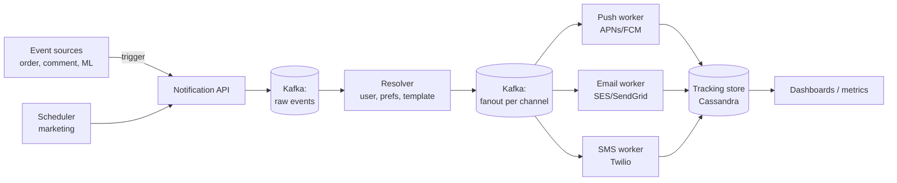

# Notification Service (Push / Email / SMS)

> Send billions of notifications per day across channels with the right ordering, dedup, and respect for user preferences. Asked anywhere with a mobile app.

<span class="phase-status phase-done">Phase 16 — Tier 2</span>

---

## 1. 🎤 Scenario

> *"Design a notification service that sends push (APNs/FCM), email, and SMS at scale (100M users, ~1B notifications/day). Support templates, user preferences, throttling, and delivery tracking."*

A 45-min SD round. Interviewer probes:

- **Channel fan-out**: same payload, three transports.
- **Preferences + quiet hours**.
- **Failure / retry semantics**.
- **Dedup**: an at-least-once pipeline must not double-send.

---

## 2. ❓ Clarifying questions

1. **Channels?** Push (mobile + web), email, SMS, in-app inbox.
2. **Volumes?** ~1 B/day. Per-second peak ~30× average.
3. **Delivery SLA?** Push: P95 < 5 s. Email: < 60 s. SMS: < 30 s.
4. **Templates?** Yes — i18n + variable substitution.
5. **User preferences?** Per-channel opt-in, quiet hours, frequency caps.
6. **Tracking?** Delivered / opened / clicked.
7. **Marketing vs transactional?** Different priority lanes.

---

## 3. ✅ Requirements

**Functional**

- Trigger by event (`order.shipped`) or by API.
- Resolve user → device tokens / email / phone.
- Apply template + locale.
- Honour preferences + quiet hours + frequency cap.
- Deliver with retries; track outcome.

**Non-functional**

- 1 B/day total (~12 K/sec average; 360 K/sec peak).
- p95 push latency < 5 s.
- 99.95% delivery on the first 24h.
- Idempotent — same `notification_id` never sent twice.
- Multi-region active-active.

**Out of scope (v1)**

- Rich-media MMS.
- Web push beyond Chrome / Firefox.
- A/B testing of subject lines (extension).

---

## 4. 📐 Capacity estimation

- 100 M users × 10 notifs/day = **1 B/day** = **12 K/sec avg**, **360 K/sec peak**.
- Templates: ~50 K active templates × 1 KB = **50 MB** (in-memory).
- Storage: keep 90 days of tracking events: 1 B × 90 × 200 B = **18 TB** (cold-tiered).
- APNs / FCM connections: persistent HTTP/2 multiplexed; ~20 K connections per push worker.

---

## 5. 🏛️ High-level architecture



Two stages: **enrichment** (resolve user → addresses + apply prefs) and **delivery** (per-channel worker pool). Both backed by Kafka so workers can scale independently.

---

## 6. 💾 Data model

- **User preferences** (Postgres):

  ```
  user_id | channel | enabled | quiet_start | quiet_end | freq_cap
  ```

- **Device tokens** (Cassandra, partitioned by user_id):

  ```
  user_id | platform | token | last_seen_at | active
  ```

- **Templates** (Postgres + Redis cache):

  ```
  template_id | locale | subject | body_md | version
  ```

- **Tracking events** (Cassandra, partitioned by `(date, notif_id_bucket)`, TTL 90d):

  ```
  notif_id | event (sent/delivered/opened/clicked) | ts | meta
  ```

- **Idempotency keys** (Redis with TTL = retry window):

  ```
  SET idem:<notif_id> "sent" EX 86400 NX
  ```

---

## 7. 🌐 API

```
POST /v1/notifications
{
  "idempotency_key": "uuid",
  "user_ids": ["u1", "u2"],
  "template_id": "order_shipped",
  "variables": {"order_id": "X42"},
  "channels": ["push", "email"],
  "priority": "transactional"
}
→ 202 { "notification_ids": [...] }
```

`idempotency_key` is required. Server stores `(key → notif_id)` for 24h; replays return the same id.

---

## 8. 🧩 Component deep-dive

### Resolver: prefs + frequency cap

```python
from dataclasses import dataclass
from datetime import datetime, time
from zoneinfo import ZoneInfo


@dataclass
class Prefs:
    channel: str
    enabled: bool
    quiet_start: time
    quiet_end: time
    freq_cap_per_day: int
    timezone: str


def is_quiet(p: Prefs, now: datetime) -> bool:
    local = now.astimezone(ZoneInfo(p.timezone)).time()
    if p.quiet_start <= p.quiet_end:
        return p.quiet_start <= local < p.quiet_end
    return local >= p.quiet_start or local < p.quiet_end   # crosses midnight


def should_send(prefs, sent_today, now, priority) -> bool:
    if priority == "transactional":
        return prefs.enabled                # bypass quiet + cap
    if not prefs.enabled:
        return False
    if is_quiet(prefs, now):
        return False
    if sent_today >= prefs.freq_cap_per_day:
        return False
    return True
```

??? note "Why transactional bypasses quiet hours"

    "Your package was delivered" at 11:55 PM is wanted; "10% off socks" is not. Most platforms tier into transactional / marketing / promotional with stricter rules per tier.

### Idempotent send (Redis SETNX)

```python
import redis
r = redis.Redis()

def send_idempotent(notif_id: str, payload: dict, channel: str) -> bool:
    """Returns True if this is the first attempt; False on duplicate."""
    if not r.set(f"idem:{notif_id}", "sent", ex=86400, nx=True):
        return False
    try:
        deliver(channel, payload)
        return True
    except DeliveryFailed:
        r.delete(f"idem:{notif_id}")        # let retry through
        raise
```

The `SET NX EX` is atomic — only the first writer succeeds. Subsequent retries see the key and return early.

### Push worker (HTTP/2 multiplexing)

```python
import httpx
import asyncio

class APNsClient:
    def __init__(self, max_streams: int = 500):
        self._client = httpx.AsyncClient(http2=True, limits=httpx.Limits(
            max_keepalive_connections=200,
            max_connections=200,
        ))
        self._sem = asyncio.Semaphore(max_streams)

    async def send(self, token: str, payload: dict):
        async with self._sem:
            r = await self._client.post(
                f"https://api.push.apple.com/3/device/{token}",
                json=payload,
                headers={"apns-topic": "com.app.bundle"},
            )
            return r.status_code == 200
```

One HTTP/2 connection multiplexes hundreds of concurrent pushes. ~5-10 connections × 500 streams ≈ 5 K req/sec per worker.

### Backoff retry with jitter

```python
import random

def retry_with_jitter(fn, max_attempts=5, base=0.5, cap=30.0):
    for attempt in range(max_attempts):
        try:
            return fn()
        except TransientError:
            sleep = min(cap, base * 2 ** attempt) * (0.5 + random.random())
            time.sleep(sleep)
    raise PermanentFailure
```

**Jitter** prevents synchronised retries from melting downstream services. AWS recommends "full jitter".

---

## 9. 📈 Scaling journey

| Stage | Setup |
|---|---|
| Day 1 | Single worker, direct APNs/FCM, Postgres for state |
| Year 1 | Kafka pipeline; per-channel workers; Cassandra for tracking |
| Year 2 | Per-region clusters; geo-routing of users to nearest pipeline |
| Year 3 | ML-driven send-time optimisation; A/B framework |

---

## 10. ☁️ Cloud deployment

- **AWS**: SNS as a thin front (or DIY with SES + Pinpoint). Kafka via MSK. Workers on EKS.
- **GCP**: FCM is GCP-native. Pub/Sub instead of Kafka.
- **Azure**: Notification Hubs.

Cost: ~$0.50 per million pushes via APNs/FCM (free!) + bandwidth. Email via SES: $0.10/M. SMS: $0.0075/SMS US.

---

## 11. 🏠 On-prem / local

For dev: Docker Compose with Kafka + Postgres + Redis + a mock APNs/SES. For prod on-prem: Kafka cluster, MariaDB, Redis Cluster, Apache Camel for routing.

---

## 12. 🏗️ Architecture deep-dive

??? question "Why two Kafka topics (raw → fanout)?"

    Stage 1 (raw → enriched) is CPU-bound (template rendering, prefs). Stage 2 (enriched → channel) is I/O-bound (talking to APNs). Independent scaling + isolation: a slow APNs run doesn't back-pressure new event ingestion.

??? question "How do we deduplicate across retries?"

    Producer: `idempotency_key` from caller → `notification_id`. Channel: `notif_id` checked in Redis SETNX before send. APNs / FCM also support an `apns-id` / `collapse-key` server-side.

??? question "Frequency cap with bursty arrivals?"

    Per-user count in Redis: `INCR user:42:notifs:2026-04-29 EX 86400`. Reject when count > cap.

---

## 13. 🧨 Bottlenecks + fixes

| Bottleneck | Fix |
|---|---|
| APNs throttle on a single connection | Pool of HTTP/2 conns; partition tokens across them |
| Cassandra hotspot on a celebrity user | Partition tracking by `(notif_id_hash, date)` not by user |
| Redis idempotency key blow-up | Short TTL = retry window only (24h, not 90d) |
| Email blacklist (single bad sender IP) | Multiple sender IP pools; warm-up new IPs gradually |
| Template render CPU | Pre-compile templates; Redis cache by `(template_id, locale)` |

---

## 14. 🔒 Security

- **OAuth** between event source and Notification API.
- **PII**: phone / email encrypted at rest; logs scrub them.
- **APNs/FCM keys** in HSM / KMS; rotate quarterly.
- **DKIM + SPF + DMARC** for email; enforces sender authenticity.
- **Anti-spam**: rate per recipient + reputation tracking.
- **Unsubscribe link** in every marketing email (CAN-SPAM, GDPR).

---

## 15. 📊 Monitoring

| Signal | Why |
|---|---|
| Send rate per channel | Capacity tracking |
| Delivery rate (delivered / sent) | Channel health |
| Bounce rate | Bad addresses; clean list |
| Open / click rate | Product KPI |
| Worker lag (Kafka offset) | Backlog visibility |
| Per-tenant rate | Detect runaway clients |

---

## 16. 🧱 Reliability

- **Dead-letter queue**: after N retries → DLQ for manual inspection.
- **Circuit breaker** per provider (APNs/SES/Twilio).
- **Graceful degradation**: if SMS is down, skip — never block transactional flow.
- **Replay capability**: Kafka retains 7 days; can replay a window after a fix.

---

## 17. ❓ Follow-up questions

??? question "What if FCM is down for an hour?"

    Backlog accumulates in Kafka. Workers retry with exponential backoff. After threshold, push to DLQ. When FCM recovers, drain the DLQ. p95 latency degrades but no data is lost.

??? question "How do we prevent sending a now-irrelevant push?"

    Add `expires_at` to the notification. Worker drops messages past expiry. Useful for "your taxi is 2 minutes away" — useless after pickup.

??? question "Can we reach 1 B / day on commodity hardware?"

    Per worker: ~5 K/sec push, 1 K/sec email, 200/sec SMS. 1 B/day = 12 K/sec → ~3 push workers steady-state, 30 to handle 360 K/sec peak. Plus Kafka cluster of ~12 brokers. Doable on ~50 nodes total.

??? question "Send-time optimisation?"

    ML model per user → predicts best hour to engage. Push worker queues for that hour rather than sending immediately. Increases open rate 30-50% in practice.

??? question "How to handle a viral product launch (1M sends in a minute)?"

    **Pre-flight**: warm Kafka topic + provider quotas. **In-flight**: throttle the producer at the API layer to a rate Kafka can absorb. **Post-flight**: monitor bounce/complaint rate — if a campaign tanks reputation, pause it.

---

## 18. 🐍 Python tricks

```python
# Coalesce per-user — drop duplicates within a window
from collections import defaultdict
import time

class CoalescingBuffer:
    def __init__(self, window_s=5):
        self.window_s = window_s
        self._buf: dict[str, tuple[float, dict]] = {}

    def offer(self, user_id, payload) -> bool:
        now = time.time()
        existing = self._buf.get(user_id)
        if existing and now - existing[0] < self.window_s:
            return False                    # coalesced — drop
        self._buf[user_id] = (now, payload)
        return True
```

```python
# Token bucket for per-tenant rate limit
class TokenBucket:
    def __init__(self, capacity, refill_rate):
        self.capacity = capacity
        self.tokens = capacity
        self.last = time.monotonic()
        self.rate = refill_rate

    def allow(self):
        now = time.monotonic()
        self.tokens = min(self.capacity, self.tokens + (now - self.last) * self.rate)
        self.last = now
        if self.tokens >= 1:
            self.tokens -= 1
            return True
        return False
```

---

## 19. 🌍 Real-world references

- **Slack's notification pipeline** — engineering blog; Kafka + Go workers.
- **Pinterest delivery service** — Goku, ML ranking + send-time optimisation.
- **Airbnb's "Riverbed"** — internal notification platform paper.
- **APNs HTTP/2 spec** — Apple's developer docs.
- **AWS Pinpoint architecture** — whitepaper.

---

## 20. 🃏 Cheatsheet

- **Pipeline**: API → Kafka → resolver → Kafka → channel workers.
- **Idempotent**: Redis `SET NX` per `notif_id`.
- **Prefs**: per-channel toggle + quiet hours + frequency cap; transactional bypasses caps.
- **Push**: HTTP/2 multiplexed; pool of connections to APNs/FCM.
- **Retries**: exponential backoff with full jitter; DLQ after N attempts.
- **Tracking**: Cassandra by `(date, hash)`; TTL 90d.
- **Capacity**: 12 K/sec avg; 360 K/sec peak; ~50-node fleet for 1 B/day.
