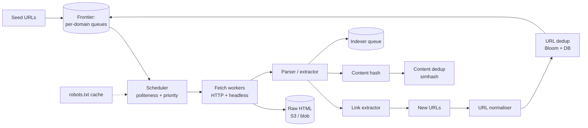

# Web Crawler

> Politely fetch billions of pages, dedup them, extract links, and feed an index. The Google-flavoured SD round.

<span class="phase-status phase-done">Phase 16 — Tier 2</span>

---

## 1. 🎤 Scenario

> *"Design a web crawler that fetches and indexes the entire public web (50 B pages). Respect robots.txt, dedupe content, handle infinite traps, and re-crawl based on freshness."*

A 45-min SD round. Interviewer probes:

- **Frontier management** at scale.
- **Politeness** (per-domain rate limits).
- **Dedup** (URL + content).
- **Re-crawl strategy** (how often to revisit).

---

## 2. ❓ Clarifying questions

1. **Pages?** ~50 B public web, ~5 B "useful".
2. **Languages / charsets?** All — handle UTF-8 + legacy encodings.
3. **JavaScript rendering?** Yes for v2 (headless Chrome). Static HTML for v1.
4. **Re-crawl freshness?** Daily for news; monthly for static pages.
5. **Output?** Raw HTML to S3 + extracted text + link graph for the indexer.
6. **Politeness?** Strict — robots.txt + crawl-delay + per-domain throttle.
7. **Authentication?** Public web only.

---

## 3. ✅ Requirements

**Functional**

- Seed URLs → fetch HTML → extract links + text.
- Honour `robots.txt` and `Crawl-delay`.
- Dedupe URLs + content (near-duplicate detection).
- Re-crawl based on freshness signals.
- Avoid traps (infinite calendars, session-id loops).

**Non-functional**

- 1 B pages/day = ~12 K req/sec average; bursts to 50 K.
- Per-domain rate ≤ 1 req/sec by default.
- 99% of fetched pages reach storage within 1 minute.
- Idempotent — safe to restart any worker.

**Out of scope (v1)**

- Building the search index (separate service).
- Personalised crawling.
- Tor / dark web.

---

## 4. 📐 Capacity estimation

- **Pages/day**: 1 B → 12 K/sec average.
- **Avg page size**: 100 KB → **100 TB/day** raw HTML; **30 TB** compressed.
- **Storage**: 5 B unique pages × 30 KB compressed = **150 TB** for the corpus.
- **URL frontier**: 100 B URLs × 100 B avg = **10 TB** of URL state (dedup + scheduling).
- **Bandwidth**: 12 K/sec × 100 KB = **10 Gbps** sustained inbound.

---

## 5. 🏛️ High-level architecture



A loop: **frontier → scheduler → fetch → extract → enqueue back**. Politeness sits in the scheduler; dedup runs at both URL and content level.

---

## 6. 💾 Data model

- **Frontier** (sharded by domain hash):
  - Per-domain queue: priority + earliest-fetch-time.
  - Implementation: Redis sorted set per domain, score = unix-ts ready-at.
- **URL dedup**:
  - **Bloom filter** in front (1 GB → ~10 B URLs at 1% FP).
  - Authoritative store: RocksDB / FoundationDB keyed by URL hash.
- **Content dedup**:
  - **SimHash** (64-bit) per page; near-duplicates collapse.
- **Robots.txt cache** (Redis):
  - Per-domain parsed rules + crawl-delay; TTL 24h.
- **Page metadata** (Cassandra, partitioned by URL hash bucket):
  - `url_hash | last_fetched | etag | last_modified | http_status | content_hash | freshness_score`

---

## 7. 🌐 API

Internal, mostly. Useful endpoints:

```
POST  /v1/seeds              { urls: [...] }
GET   /v1/url-status?url=…
POST  /v1/recrawl            { url: "...", priority: "high" }
```

---

## 8. 🧩 Component deep-dive

### URL canonicalisation

```python
from urllib.parse import urlparse, urlunparse, parse_qsl, urlencode


TRACKING = {"utm_source", "utm_medium", "utm_campaign", "fbclid", "gclid"}


def canonicalise(url: str) -> str:
    p = urlparse(url.strip())
    scheme = p.scheme.lower() or "http"
    netloc = p.netloc.lower()
    if netloc.startswith("www."):
        netloc = netloc[4:]
    # Drop default ports
    if (scheme, netloc.endswith(":80"), netloc.endswith(":443")) in (
        ("http", True, False), ("https", False, True)
    ):
        netloc = netloc.rsplit(":", 1)[0]
    # Strip tracking params
    params = [(k, v) for k, v in parse_qsl(p.query) if k.lower() not in TRACKING]
    params.sort()
    query = urlencode(params)
    # Drop fragment
    return urlunparse((scheme, netloc, p.path or "/", "", query, ""))
```

??? note "Why this matters"

    Without canonicalisation, the same page enters the frontier dozens of times: with/without `www`, with tracking params, with trailing slash. Crawl budget evaporates.

### Politeness scheduler

```python
import time
import random
import heapq
from collections import defaultdict


class PolitenessScheduler:
    def __init__(self, default_delay=1.0):
        self.default_delay = default_delay
        self.next_ready: dict[str, float] = {}      # domain → next allowed fetch
        self.delays: dict[str, float] = {}           # domain → crawl-delay

    def set_delay(self, domain: str, seconds: float):
        self.delays[domain] = max(seconds, 0.5)     # clamp lower bound

    def reserve(self, domain: str) -> float:
        now = time.time()
        delay = self.delays.get(domain, self.default_delay)
        ready = max(now, self.next_ready.get(domain, 0))
        # Add jitter so we don't all hit once a second to the second
        self.next_ready[domain] = ready + delay * (0.8 + random.random() * 0.4)
        return ready
```

### URL dedup with Bloom filter

```python
from pybloom_live import ScalableBloomFilter


class URLDedup:
    def __init__(self):
        self.bloom = ScalableBloomFilter(initial_capacity=1_000_000, error_rate=0.01)
        # Authoritative store (e.g. RocksDB) for FP recovery — omitted

    def should_fetch(self, url: str) -> bool:
        if url in self.bloom:
            # 1% chance of false positive — cross-check authoritative store
            if self._authoritative_seen(url):
                return False
        self.bloom.add(url)
        return True
```

### SimHash for near-dup detection

```python
import hashlib

def simhash(tokens: list[str], bits: int = 64) -> int:
    v = [0] * bits
    for tok in tokens:
        h = int(hashlib.md5(tok.encode()).hexdigest(), 16) & ((1 << bits) - 1)
        for i in range(bits):
            v[i] += 1 if (h >> i) & 1 else -1
    return sum((1 << i) for i in range(bits) if v[i] > 0)


def hamming(a: int, b: int) -> int:
    return bin(a ^ b).count("1")

# Two pages with hamming distance ≤ 3 are near-duplicates
```

### Fetch worker (async)

```python
import httpx, asyncio


async def fetch_loop(scheduler, frontier, store, dedup, extractor):
    async with httpx.AsyncClient(timeout=10.0, follow_redirects=True) as client:
        while True:
            url, domain = await frontier.next_ready()
            ready = scheduler.reserve(domain)
            if (sleep := ready - time.time()) > 0:
                await asyncio.sleep(sleep)

            try:
                r = await client.get(url, headers={"User-Agent": "OurBot/1.0"})
                if r.status_code == 200:
                    await store.save(url, r.content, r.headers)
                    for link in extractor.extract_links(r.text, base=url):
                        if dedup.should_fetch(link):
                            await frontier.add(link)
            except (httpx.TimeoutException, httpx.NetworkError):
                pass            # log; retry policy elsewhere
```

---

## 9. 📈 Scaling journey

| Stage | Setup |
|---|---|
| Day 1 | Single host: Python script + SQLite frontier; ~1 K pages/min |
| Month 1 | Redis frontier + 10 fetch workers + Bloom dedup; ~1 M pages/day |
| Year 1 | Sharded frontier; 100 workers; S3 storage; 100 M pages/day |
| Year 2 | Multi-region; per-continent frontier; headless Chrome lane |
| Year 3 | 1 B pages/day; ML-driven re-crawl prioritisation |

---

## 10. ☁️ Cloud deployment

- **Fetch fleet**: spot EC2 / preemptible GCE — fetchers are stateless.
- **Frontier**: Redis Cluster (ElastiCache) + DynamoDB for authoritative state.
- **Storage**: S3 with Glacier transition after 90 days.
- **Headless Chrome lane**: ECS with browserless.io image; 4 vCPU per browser instance.

Cost order-of-magnitude: $10-30 per million pages fetched (compute + bandwidth + storage).

---

## 11. 🏠 On-prem / local

For dev: Docker Compose with Redis + MinIO + 4 worker containers. Use a tiny seed set + `respect-robots: true`. For prod on-prem: 2-rack cluster with NIC bonding for bandwidth.

---

## 12. 🏗️ Architecture deep-dive

??? question "Why per-domain queues?"

    Politeness is a **per-domain** constraint. A single global queue forces fetchers to scan for "what's ready right now" on every cycle. Per-domain queues let the scheduler reason locally.

??? question "Frontier sharding strategy?"

    Hash by **eTLD+1** (effective top-level domain + 1, e.g. `bbc.co.uk`). All pages from `bbc.co.uk` land on the same shard → centralised politeness for that domain.

??? question "Why a Bloom filter in front of the dedup DB?"

    99% of "have I seen this URL?" answers are "yes". A Bloom filter answers them in 100 ns (vs 1 ms DB read), and we only consult the DB on the 1% positives.

---

## 13. 🧨 Bottlenecks + fixes

| Bottleneck | Fix |
|---|---|
| One huge domain (Wikipedia) saturating workers | Per-domain quota; cap concurrent fetches to N |
| Spider trap (infinite calendar URLs) | Max depth + path-fingerprint heuristics; suspicious patterns blocked |
| DNS overload | Local DNS cache; pre-resolve common TLDs |
| Hot-shard frontier | Salt URLs into the hash; or split by `(domain, path-prefix)` |
| Slow page (60s) | Strict timeouts (10s) — better to skip than tie up a worker |

---

## 14. 🔒 Security

- **User-Agent honesty**: include contact URL; don't spoof Googlebot.
- **rDNS for verification**: lets webmasters verify it's really our crawler.
- **TLS**: respect HTTPS; don't downgrade.
- **Don't crawl PII inadvertently**: respect `noindex`, `noarchive` meta tags.
- **GDPR / right-to-be-forgotten**: ingest legal-removal list; honour exclusions.

---

## 15. 📊 Monitoring

| Signal | Why |
|---|---|
| Pages fetched / sec / worker | Throughput |
| Politeness violations | Hard SLO (must be 0) |
| Re-crawl staleness P50 / P95 | Freshness goal |
| Frontier size | Backlog awareness |
| Per-status-code rate | Spot 5xx storms on a target site |
| Dedup hit-rate | URL-canonicalisation effectiveness |

---

## 16. 🧱 Reliability

- **At-least-once**: a fetched page may end up in storage twice on retry. Dedupe at storage step using `(url_hash, content_hash)` key.
- **Idempotent saves**: S3 PUT is idempotent; safe.
- **Worker restart safety**: workers ack URLs only after successful save.
- **Per-domain circuit breaker**: 5xx rate > 50% → suspend domain for 30 min.

---

## 17. ❓ Follow-up questions

??? question "How to detect a site has changed since last crawl?"

    `If-None-Match: <etag>` and `If-Modified-Since: <ts>`. 304 responses are 10× cheaper than full re-fetches. Server-side hash also helps when ETags missing.

??? question "How to schedule re-crawls?"

    Track `change_history` per URL; assign a Poisson re-crawl rate from change frequency. News sites: hourly. Wikipedia: daily. Static brochures: monthly. ML can tighten this.

??? question "How to handle a 100 GB sitemap?"

    Stream-parse XML; don't load into memory. Sitemaps are a hint, not an authority — still apply dedup + politeness.

??? question "What about JavaScript-heavy pages?"

    Two lanes: cheap static fetch; if page seems thin (< 500 bytes of body text + lots of `<script>`), promote to **headless Chrome** lane. ~20× more expensive — only when worth it.

??? question "Distributed coordination — how do workers agree on who fetches what?"

    Frontier shards are owned per-worker via consistent hashing. A coordinator (Zookeeper/etcd) manages shard ownership; rebalancing on worker join/leave.

---

## 18. 🐍 Python tricks

```python
# robots.txt parsing
import urllib.robotparser as urp

def can_fetch(domain: str, url: str, ua="OurBot/1.0") -> bool:
    rp = urp.RobotFileParser(f"https://{domain}/robots.txt")
    rp.read()
    return rp.can_fetch(ua, url)

# Domain extraction (eTLD+1)
import tldextract
def etld_plus_1(url: str) -> str:
    e = tldextract.extract(url)
    return f"{e.domain}.{e.suffix}"
```

```python
# Tiny SimHash dedup with B-trees of bands
class SimHashIndex:
    """Bucket by (band_id, band_value); near-dups collide on at least one band."""
    def __init__(self, bits=64, bands=4):
        self.bits = bits
        self.bands = bands
        self.band_size = bits // bands
        self.buckets: list[dict[int, list[int]]] = [{} for _ in range(bands)]

    def _bands(self, h):
        return [(h >> (i * self.band_size)) & ((1 << self.band_size) - 1)
                for i in range(self.bands)]

    def is_near_dup(self, h: int, hamming_thresh=3) -> bool:
        for i, b in enumerate(self._bands(h)):
            for cand in self.buckets[i].get(b, []):
                if bin(cand ^ h).count("1") <= hamming_thresh:
                    return True
        return False

    def add(self, h: int):
        for i, b in enumerate(self._bands(h)):
            self.buckets[i].setdefault(b, []).append(h)
```

---

## 19. 🌍 Real-world references

- **Mercator architecture** — Najork & Heydon, foundational paper (Compaq SRC).
- **Heritrix** — Internet Archive's crawler; open source.
- **Common Crawl** — public crawl dataset; their architecture posts.
- **Google's crawler discussion** — public talks by Matt Cutts era.
- **Apache Nutch** — distributed crawler on Hadoop.

---

## 20. 🃏 Cheatsheet

- **Frontier**: per-domain queues; sharded by eTLD+1.
- **Politeness**: per-domain delay (default 1s) + jitter; `Crawl-delay` honoured.
- **Dedup**: Bloom filter in front; SimHash for near-dup content.
- **Storage**: raw HTML to S3 (cold tier after 90d); metadata in Cassandra.
- **Headless lane**: ~20× cost; only for JS-heavy pages.
- **Throughput**: ~12 K req/sec for 1 B/day; ~100-200 worker fleet.
- **Reliability**: dedup at save (idempotent); circuit-break per domain on 5xx.
