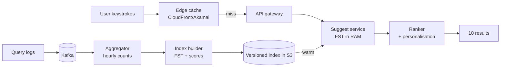

# Search Autocomplete

> Sub-50 ms suggestions as the user types. The interview problem that crosses tries, ranking, and edge caching.

<span class="phase-status phase-done">Phase 16 — Tier 2</span>

---

## 1. 🎤 Scenario

> *"Design Google-style search autocomplete: as the user types, show 10 ranked suggestions. 100 K QPS, p99 < 50 ms, suggestions reflect what's trending today."*

A 45-min SD round. Interviewer probes:

- **Trie / FST** for prefix lookup.
- **Ranking**: popularity, personalisation, freshness.
- **Update lane**: how do trending queries get into the index?
- **Latency**: edge cache + binary protocol.

---

## 2. ❓ Clarifying questions

1. **Suggestion source?** Past queries, products, or both?
2. **Personalisation?** Per-user history mixed in?
3. **Languages?** Single language v1; multi later.
4. **Spell-check?** Out of scope unless asked.
5. **Freshness?** New trending queries within minutes? hours?
6. **Number of suggestions?** Top 10 typical.
7. **Mobile / web?** Both — same backend.

---

## 3. ✅ Requirements

**Functional**

- Given a prefix, return top-K suggestions ordered by score.
- Score = popularity × decay + boosts (location, language, personal history).
- Handle 1-3 character prefixes (most queries).
- Update index hourly with new query frequencies.

**Non-functional**

- p99 < 50 ms end-to-end.
- 100 K QPS peak; 10 K QPS average.
- 99.99% availability.
- Index updates within 1 hour of trending event.

**Out of scope (v1)**

- Spell correction (separate service).
- Translingual suggestions.
- Voice / handwriting input.

---

## 4. 📐 Capacity estimation

- **Vocabulary**: ~100 M unique queries × avg 30 B = **3 GB** raw → **500 MB** packed FST.
- **QPS**: 100 K × 50 ms = ~5 K concurrent in-flight.
- **Cache**: 90% prefix hit-rate at edge → **10 K QPS** to origin.
- **Read tier**: ~10 read replicas; each holds full index in RAM.
- **Update lane**: 1 M new query events/sec (logged); aggregated hourly.

---

## 5. 🏛️ High-level architecture



Two paths:

- **Hot read** path: edge cache → suggest service (FST lookup + ranker).
- **Cold update** path: query logs → aggregation → index rebuild → swap.

---

## 6. 💾 Data model

- **Query log** (Kafka, retain 7d):

  ```
  {ts, query, user_id, locale, result_clicked}
  ```

- **Aggregated counts** (versioned in S3):

  ```
  query_text → {count_1h, count_24h, count_7d, score}
  ```

- **In-memory index** (FST per language):
  - **FST** = Finite State Transducer; maps prefix → top-K candidates with scores.
  - Built offline; loaded into RAM on each replica.

- **Personalisation cache** (Redis):
  - User → top-100 recent unique queries with timestamps.

---

## 7. 🌐 API

```
GET /v1/suggest?q=ho&locale=en-US&user_id=u42
→ 200
{
  "suggestions": [
    {"text": "hotels", "score": 9.2},
    {"text": "home depot", "score": 8.8},
    ...
  ]
}
```

Request size < 200 B; response < 1 KB. Use HTTP/2 + connection reuse — the headers are most of the payload.

---

## 8. 🧩 Component deep-dive

### Trie + top-K (the core data structure)

```python
from dataclasses import dataclass, field
import heapq


@dataclass
class TrieNode:
    children: dict[str, "TrieNode"] = field(default_factory=dict)
    top_k: list[tuple[float, str]] = field(default_factory=list)   # max-heap-friendly
    is_end: bool = False


class Autocomplete:
    def __init__(self, k: int = 10):
        self.root = TrieNode()
        self.k = k

    def insert(self, query: str, score: float):
        node = self.root
        for ch in query:
            node = node.children.setdefault(ch, TrieNode())
            self._update_top_k(node, query, score)
        node.is_end = True

    def _update_top_k(self, node: TrieNode, q: str, s: float):
        # Maintain top-K by score at each node along the path
        for i, (existing_s, existing_q) in enumerate(node.top_k):
            if existing_q == q:
                node.top_k[i] = (s, q)
                node.top_k.sort(key=lambda x: -x[0])
                return
        if len(node.top_k) < self.k:
            node.top_k.append((s, q))
            node.top_k.sort(key=lambda x: -x[0])
        elif s > node.top_k[-1][0]:
            node.top_k[-1] = (s, q)
            node.top_k.sort(key=lambda x: -x[0])

    def suggest(self, prefix: str) -> list[tuple[float, str]]:
        node = self.root
        for ch in prefix:
            if ch not in node.children:
                return []
            node = node.children[ch]
        return list(node.top_k)
```

??? note "Why top-K *at every node*?"

    Naive approach: walk trie to the prefix node, then DFS to enumerate all suffixes, sort by score, take top-10. Cost: O(matches). For prefix `\"a\"` matching 1 M queries, that's 50 ms easily. Pre-computing top-10 at each node gives O(prefix length) lookups — typically < 100 µs.

### FST for production

A **Finite State Transducer** packs the trie into a minimal-memory CAR-style structure (shared suffixes are merged). Used by Lucene; ~5-10× smaller than a hash-trie.

### Ranking

```python
import math, time


def score_query(
    base_count: int,
    last_seen_ts: float,
    half_life_days: float = 7.0,
    user_history_boost: float = 0.0,
    location_boost: float = 0.0,
) -> float:
    age_days = (time.time() - last_seen_ts) / 86400
    decay = math.pow(0.5, age_days / half_life_days)
    return math.log1p(base_count) * decay + user_history_boost + location_boost
```

??? note "Why log of count?"

    Top queries are 100 M+ counts; long-tail are < 100. Linear scoring lets the head dominate so heavily that personalisation can't move the needle. `log1p` compresses the dynamic range.

### Personalisation: blend at request time

```python
def merge(global_top: list, personal_top: list, k: int) -> list:
    """Re-rank global top with personal boost; emit top-K."""
    seen = {}
    for s, q in global_top:
        seen[q] = s
    for s, q in personal_top:
        seen[q] = max(seen.get(q, 0), s + 2.0)        # personal boost
    return sorted([(v, k_) for k_, v in seen.items()], key=lambda x: -x[0])[:k]
```

### Index swap (hot reload)

```python
class SuggestService:
    def __init__(self):
        self._current: Autocomplete | None = None

    async def reload_from_s3(self, version: str):
        new_index = await load_fst_from_s3(version)
        self._current = new_index           # atomic pointer swap
        # Old index garbage-collected when in-flight requests release refs
```

A pointer swap is **atomic** in CPython for object references → all new requests use the new index without taking a lock.

---

## 9. 📈 Scaling journey

| Stage | Setup |
|---|---|
| Day 1 | Single Trie in process; periodic CSV reload |
| Month 1 | FST + Redis edge cache; 10 K QPS |
| Year 1 | Multi-region read replicas; hourly index swap; 100 K QPS |
| Year 2 | Per-locale shards; ML ranker; personalised lane |
| Year 3 | Real-time trending injection (1-min lag) via Kafka stream + delta FST |

---

## 10. ☁️ Cloud deployment

- **Edge**: CloudFront / Cloudflare with cache-key on `(prefix, locale)`. TTL 60 s for popular; 5 s for hot/trending prefixes.
- **Origin**: ECS / EKS with 16 GB RAM tasks; FST + ranker in process.
- **Index storage**: S3 versioned bucket; CloudFront origin pull when warming.
- **Aggregation**: Kinesis or Kafka + Flink/Spark for hourly counts.

---

## 11. 🏠 On-prem / local

Dev: Docker Compose with single suggest service + nginx as edge cache. Prod on-prem: 2-region replicas with Varnish/Nginx caching layer; rsync-based index distribution.

---

## 12. 🏗️ Architecture deep-dive

??? question "Why edge cache?"

    Most users type the same first few letters. `\"a\"`, `\"ne\"`, `\"how\"` are repeated millions of times per hour. Caching at edge collapses 100 K QPS to 10 K backend QPS — a 10× cost reduction with near-zero latency penalty.

??? question "Cache TTL trade-off"

    60 s TTL = stale up to 60 s after a trending update (acceptable for most). For breaking news, a **purge API** invalidates specific prefixes immediately.

??? question "Index swap atomicity"

    Don't write into the live index. Build a new one in S3, load it on each replica, swap the pointer. All in-flight requests finish on old index; new requests use new. Memory doubles briefly during swap — provision RAM accordingly.

---

## 13. 🧨 Bottlenecks + fixes

| Bottleneck | Fix |
|---|---|
| Hot prefix `\"a\"` overwhelming ranker | Pre-compute top-10 globally; personalisation bumps applied only if cache miss |
| Memory pressure from holding two FSTs during swap | Phased rollout; canary one replica at a time |
| Personalisation lookup adds 5 ms | Cache personal top-10 per user in Redis with 1h TTL |
| Index build takes 30 minutes | Incremental FST with append-only delta segments (Lucene trick) |
| Long queries (`\"how do i train…\"`) | Top-K still works; trie depth ~50 chars max |

---

## 14. 🔒 Security

- **Rate limit per IP** (10 req/sec): autocomplete is a known DDoS target.
- **Profanity / injection** in suggestions: filter at index-build time.
- **Personalisation privacy**: server-side per user; never expose another user's history; log retention 30d max.
- **CDN edge auth**: signed tokens for personalised lane.

---

## 15. 📊 Monitoring

| Signal | Why |
|---|---|
| p50 / p99 latency per region | The user-visible SLO |
| Edge cache hit rate | Cost & latency lever |
| Origin QPS | Capacity planning |
| Index version freshness | Trending lag SLO |
| Click-through rate per suggestion slot | Quality signal |
| Empty-result rate | Ingest / coverage gap |

---

## 16. 🧱 Reliability

- **Stale index OK**: degrade gracefully; if S3 is down, keep serving last good FST.
- **Per-replica health checks**: ALB removes a replica that 5xx's > 1% of requests.
- **Personalisation fallback**: if Redis is down, return global top-K (still correct).
- **Replay capability**: Kafka 7d retention enables recomputing aggregated counts after a bug.

---

## 17. ❓ Follow-up questions

??? question "What if the user mistypes (\"goggle\" instead of \"google\")?"

    Two paths: (a) **fuzzy prefix** — within Levenshtein distance 1 of typed prefix, walk those branches too. Bounded cost. (b) **Spell-correct service** runs in parallel; if its top suggestion is much more popular, surface it.

??? question "How to handle CJK languages?"

    Tokenise on character (CJK is character-level), not whitespace. Index bigrams + IME-friendly partial-character suggestions. Often a separate FST per language to keep them small.

??? question "How does trending work?"

    A real-time stream (Kafka) tracks last-15-minute query frequencies. A separate \"breakout detector\" flags queries whose 15m count is N× higher than 7d-baseline. These get an instant boost in the next index version.

??? question "How is this different from search?"

    Search is intent-resolution; autocomplete is intent-suggestion. Different SLOs (full search may take 200 ms; autocomplete must be < 50 ms). Different relevance models (autocomplete is mostly popularity; search is BM25 + ML re-rank).

??? question "Compress the FST further?"

    Suffix sharing already saves ~5×. Beyond that: variable-length integers for transitions, byte-packed nodes, FOR (Frame-of-Reference) compression on score lists. Lucene gets 1 GB of vocab into ~150 MB.

??? question "How to measure suggestion quality?"

    **MRR** (mean reciprocal rank) — average of `1 / rank_of_clicked_suggestion`. Higher = users click higher-ranked items more often.

---

## 18. 🐍 Python tricks

```python
# Async batched origin lookup — coalesce same-prefix concurrent requests
import asyncio
from collections import defaultdict

class SingleFlight:
    def __init__(self):
        self._waiters: dict[str, asyncio.Future] = {}

    async def do(self, key: str, fn):
        if key in self._waiters:
            return await self._waiters[key]
        fut = asyncio.get_event_loop().create_future()
        self._waiters[key] = fut
        try:
            r = await fn()
            fut.set_result(r)
            return r
        finally:
            del self._waiters[key]
```

```python
# Top-K with heap (when scoring on the fly)
import heapq

def top_k(items: list[tuple[float, str]], k: int):
    return heapq.nlargest(k, items, key=lambda x: x[0])
```

---

## 19. 🌍 Real-world references

- **Elasticsearch's `completion` suggester** — FST-backed, public docs.
- **Lucene FST blog** — Mike McCandless's deep dive.
- **Twitter typeahead** — engineering blog.
- **Google's blog on instant search** — early architecture talks.
- **Bing Autosuggest API docs** — useful black-box surface.

---

## 20. 🃏 Cheatsheet

- **DS**: trie with **pre-computed top-K at every node**, packed as FST.
- **Latency**: p99 < 50 ms; ~80 µs FST lookup + < 5 ms ranker + 10 ms network.
- **Edge cache** is the secret weapon — collapses 10× of QPS.
- **Score**: `log(count) × decay + personal_boost`; half-life ~7 days.
- **Update lane**: query logs → Kafka → hourly aggregator → S3 versioned FST → atomic pointer swap on each replica.
- **Personalisation**: blend at request time, not in the global index.
- **Trending**: real-time breakout detector + delta FST for sub-hour lag.
