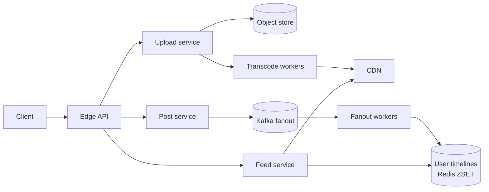

# Instagram

> Photo-sharing social network. Feed, stories, DM, search. Heavy media + write-amplified fanout.

<span class="phase-status phase-done">Phase 16 — Tier 2</span>

---

## 1. 🎤 Scenario

> *"Design Instagram. 2 B MAU, 100 M new posts/day, photo + video upload, follow graph, feed, stories, hashtag search."*

## 2. ❓ Clarifying questions

1. Photo + video, or photo only? Both.
2. Stories (24h ephemeral)? Yes.
3. DM? Out of scope (separate chat service).
4. Search by hashtag + user + place? Yes.
5. Reels (algorithmic feed)? Defer to v2.

## 3. ✅ Requirements

**Functional**: upload, follow, home feed, profile, like/comment, hashtag search, stories.

**Non-functional**: 100 M uploads/day, 1 B feed-loads/day, p99 feed < 500 ms, photos served from CDN.

**Out**: live streaming, ads platform, shopping.

## 4. 📐 Capacity

- 100 M posts × 2 MB avg = **200 TB/day** storage.
- ~5 PB/year cold-tiered.
- Read-heavy: 1 B feed-loads × 30 photos shown = **30 B image fetches/day** → 350 K/sec avg, 2 M/sec peak.
- Follow graph: 2 B users × 200 follows avg = **400 B edges**.

## 5. 🏛️ High-level architecture



## 6. 💾 Data model

- **Posts** (Cassandra): `post_id | user_id | media_url | caption | ts`. Snowflake IDs.
- **Follow graph** (sharded MySQL or graph DB): bidirectional adjacency.
- **Timelines** (Redis ZSET): `home:<user>` → `(post_id, ts)`; capped at 1 K entries.
- **Media** (S3 + CDN): originals + transcoded variants (3 sizes × 2 codecs).
- **Hashtag index** (Elasticsearch).

## 7. 🌐 API

```
POST  /v1/posts           multipart upload  → 201 {post_id}
GET   /v1/feed?cursor=…   → 200 [posts]
POST  /v1/follow {target} → 204
GET   /v1/u/{user}/posts
```

## 8. 🧩 Component deep-dive

### Hybrid fanout (push + pull)

```python
CELEB_THRESHOLD = 1_000_000

def on_post(post):
    follower_count = follow_graph.count(post.user_id)
    if follower_count < CELEB_THRESHOLD:
        for f in follow_graph.followers(post.user_id):
            redis.zadd(f"home:{f}", {post.id: post.ts})
            redis.zremrangebyrank(f"home:{f}", 0, -1001)   # cap 1K
    else:
        celeb_set.add(post.user_id)               # pulled at read time

def get_home(user, n=30):
    pushed = redis.zrevrange(f"home:{user}", 0, n*2)
    celebs_followed = follow_graph.followed_celebs(user)
    pulled = []
    for c in celebs_followed:
        pulled.extend(redis.zrevrange(f"author:{c}", 0, 5))
    merged = sorted(pushed + pulled, key=lambda p: -p.ts)[:n]
    return merged
```

### Image transcode pipeline

Upload → S3 → Kafka event → workers produce 240 / 480 / 1080p variants in WebP/AVIF; CDN-warmed for first 24h.

## 9. 📈 Scaling

| Stage | Setup |
|---|---|
| Day 1 | Monolith + Postgres + S3 |
| Year 1 | Sharded MySQL + Redis timelines + 2 CDNs |
| Year 3 | Hybrid fanout; per-region timelines; ML feed ranker |

## 10. ☁️ Cloud

AWS S3 + CloudFront, MSK Kafka, ElastiCache, EKS for services. Or GCP Cloud Storage + Cloud CDN equivalents.

## 11. 🏠 On-prem

MinIO for storage, Varnish for CDN, Kafka cluster, MySQL with Vitess sharding.

## 12. 🏗️ Architecture deep-dive

??? question "Why hybrid fanout?"

    Pure push: celebrity post writes to 50 M timelines = unacceptable cost. Pure pull: every feed read is a fan-in across followed users = slow. Hybrid: push for ordinary users (cheap writes), pull for celebrities (cheap reads + small celeb pool).

??? question "Why ZSET, not list?"

    ZSET sorted by timestamp; supports cursor pagination + dedup of re-pushed posts.

## 13. 🧨 Bottlenecks

| Bottleneck | Fix |
|---|---|
| Celeb follow burst (1 M new followers in 1 hour) | Bulk-import follow records async; serve with stale-OK mode |
| Hot post (going viral) | CDN; Redis hot-key replication; rate-limit comments |
| Follow-graph hotspots | Per-shard local secondary indexes; materialised followers per shard |

## 14. 🔒 Security

- OAuth/OIDC tokens; refresh tokens stored hashed.
- Pre-signed S3 URLs for upload/read.
- DDoS at CDN edge (CloudFront Shield / Cloudflare).
- Content moderation: ML + human review; CSAM hashing (PhotoDNA).

## 15. 📊 Monitoring

Feed p50/p99 per region; upload success rate; CDN hit ratio; transcoder queue depth; follow-graph QPS; daily active users.

## 16. 🧱 Reliability

Dual-region active-active; per-region timelines reconciled via Kafka mirror; CDN multi-vendor for failover; degrade to text-only feed on transcoder outage.

## 17. ❓ Follow-ups

??? question "How do stories expire after 24h?"

    `ttl_at` column; periodic sweeper deletes expired; CDN entries TTL-aligned. Keep cold copy for 30d for moderation appeals.

??? question "ML-ranked feed — how?"

    Candidate gen (recent + similar-user posts) → feature extraction (engagement, recency, affinity) → ranking model (gradient-boosted trees → DLRM at scale). Re-rank top 1 K candidates to top 30.

??? question "How to dedupe near-identical photos?"

    pHash (perceptual hash) per upload; reject if hamming distance ≤ 4 from a recent same-user post — usually accidental duplicate uploads.

??? question "How big is the follow graph in memory?"

    400 B edges × 16 B = 6.4 TB. Sharded across ~50 nodes; partition by user_id; replicate hot edges.

## 18. 🐍 Snippet

```python
# pHash dedup quickly
import imagehash, PIL.Image
def phash(path): return int(str(imagehash.phash(PIL.Image.open(path))), 16)
def is_dup(a, b, t=4): return bin(a ^ b).count("1") <= t
```

## 19. 🌍 Real-world

- *Scaling Instagram Infrastructure* — F8 talks.
- *Cassandra at Instagram* — engineering blog.
- *CDN at scale* — Fastly + Akamai posts.
- *EdgeML for feed* — Meta papers.

## 20. 🃏 Cheatsheet

- Hybrid push/pull fanout, threshold ~1 M followers.
- Redis ZSET timelines capped at 1 K.
- Snowflake IDs for posts.
- CDN-served media; 3 sizes × 2 codecs (WebP/AVIF).
- Cassandra for posts; sharded MySQL or graph DB for follow.
- Hot keys → CDN + Redis replication; cold path → DB.
- Upload via pre-signed S3 URL; transcode async via Kafka.
