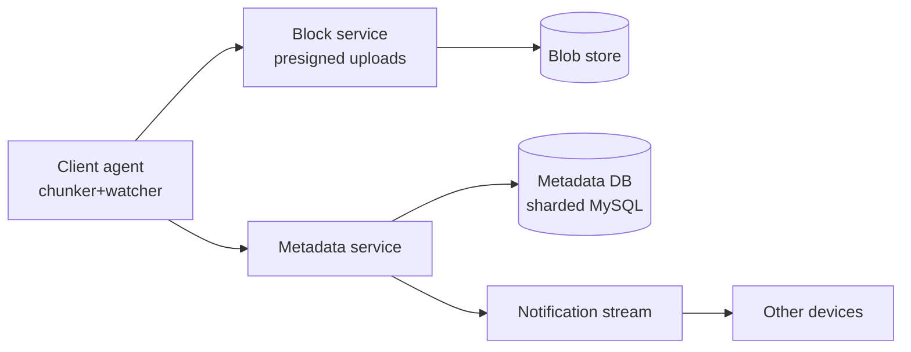

# Dropbox / Google Drive

> File sync + share. Block-level dedup, conflict resolution, multi-device consistency, petabyte storage.

<span class="phase-status phase-done">Phase 16 — Tier 2</span>

---

## 1. 🎤 Scenario

> *"Design Dropbox. 500 M users sync files across devices, share folders, version history, work offline."*

## 2. ❓ Clarifying questions

1. Max file size? 50 GB.
2. Versioning? Yes — 30 days of history.
3. Selective sync? Yes.
4. Conflict resolution? Last-writer-wins + conflict copies.
5. Encryption? At-rest + in-transit. E2E only on Business Advanced.

## 3. ✅ Requirements

**Functional**: upload/download, sync across devices, share, restore version, conflict copies.

**Non-functional**: 1 EB total storage, 100 M concurrent clients, sync delta < 5 s.

**Out**: collaborative editing (separate service), search.

## 4. 📐 Capacity

- 500 M users × 2 GB avg = **1 EB**.
- Block size 4 MB → 250 B blocks.
- Dedup ratio ~30% (shared OS files, photos) → effective 700 PB.
- 100 M syncs/day; metadata ops 10 M/sec peak.

## 5. 🏛️ Architecture



## 6. 💾 Data model

- **File metadata** (sharded MySQL): `file_id | namespace_id | path | block_list | version | mtime | hash`.
- **Blocks** (S3-like blob store): keyed by `sha256(content)` → automatic dedup.
- **Notification stream** (Kafka per namespace): `(ts, user, path, op)`.

## 7. 🌐 API

```
POST /v1/blocks/upload         (chunked, idempotent by hash)
POST /v1/files/commit {path, blocks: [hash]}
GET  /v1/files/list_folder?path=&cursor=
GET  /v1/files/download?path=
```

## 8. 🧩 Component deep-dive

### Block-level chunker (rolling hash)

```python
import hashlib

CHUNK_AVG = 4 * 1024 * 1024     # 4 MB target
WINDOW = 48
MASK = (1 << 22) - 1            # ~4 MB chunks


def chunk(file_bytes: bytes):
    """Content-defined chunking with Rabin fingerprint."""
    chunks, start = [], 0
    rolling = 0
    for i in range(WINDOW, len(file_bytes)):
        rolling = ((rolling << 1) ^ file_bytes[i]) & 0xFFFFFFFF
        if (rolling & MASK) == 0 or i - start >= CHUNK_AVG * 2:
            chunks.append((start, i, hashlib.sha256(file_bytes[start:i]).hexdigest()))
            start = i
    chunks.append((start, len(file_bytes),
                   hashlib.sha256(file_bytes[start:]).hexdigest()))
    return chunks
```

??? note "Why content-defined?"

    Fixed-size chunks: insert 1 byte at offset 0 → all chunks shift, no dedup. CDC: chunk boundaries follow content patterns → 1-byte insert affects only one chunk. Standard since LBFS (2001).

### Sync protocol

```python
def sync(local_state, server_cursor):
    server_changes = api.list_changes(cursor=server_cursor)
    for change in server_changes:
        if change.path in local_state and local_state[change.path] != change.hash:
            handle_conflict(change.path, local_state[change.path], change)
        else:
            apply(change)
    local_changes = diff(local_state, baseline)
    for c in local_changes:
        new_blocks = [b for b in c.blocks if not api.has_block(b)]
        api.upload_blocks(new_blocks)
        api.commit_file(c.path, c.blocks)
```

## 9. 📈 Scaling

| Stage | Setup |
|---|---|
| Day 1 | S3 + Postgres + single sync service |
| Year 1 | Sharded MySQL + per-namespace Kafka topic |
| Year 3 | Magic Pocket-style on-prem storage; multi-region replicas |

## 10. ☁️ Cloud

AWS S3 + RDS + ElastiCache + MSK; CloudFront for downloads. Spend dominated by storage egress.

## 11. 🏠 On-prem

Ceph or Magic Pocket-style erasure-coded SMR-disk farm; MySQL Vitess; Kafka.

## 12. 🏗️ Architecture deep-dive

??? question "How is the namespace partitioned?"

    Each user (or shared folder) is a **namespace**. All metadata for a namespace lives on one shard → strong consistency for that namespace; cross-shard ops (move) are saga-coordinated.

??? question "Why a separate block service?"

    Metadata writes are small + transactional; block writes are large + content-addressed (idempotent on hash). Decoupling lets blocks scale on bandwidth and metadata on QPS independently.

## 13. 🧨 Bottlenecks

| Bottleneck | Fix |
|---|---|
| Watch-fs floods (1 M files reorganised) | Coalesce events; 1 commit per directory tree |
| Hot namespace (10 K-person shared folder) | Range-shard within namespace by sub-path |
| Long sync after offline period | Cursor-based delta; resume mid-stream |
| Cold storage egress cost | Lifecycle: move > 90d files to deep-cold tier |

## 14. 🔒 Security

- TLS 1.3 + per-block presigned URLs.
- AES-256-GCM at rest; KMS-managed.
- E2E (BAdvanced): client-side keys, server sees only opaque blocks.
- Audit logs per namespace.
- Sharing links: HMAC-signed + optional password + expiry.

## 15. 📊 Monitoring

Sync lag P50/P99; upload throughput per region; block dedup ratio; storage utilisation; metadata DB QPS.

## 16. 🧱 Reliability

Erasure coding (10/14) for ~140% storage overhead vs 200% for 2-replica; cross-zone replication; scrubber background job for bit-rot.

## 17. ❓ Follow-ups

??? question "How is conflict copy named?"

    `<file> (Conflicted copy from <device> on <date>)`. Both copies preserved; user picks. Vector clocks under the hood track concurrent versions.

??? question "Move detected as delete+create?"

    Client computes block-list before commit; if new path's block-list ≈ deleted path's, server reuses metadata as a rename (zero block transfer).

??? question "How to support 50 GB files efficiently?"

    Chunking limits per-block work to 4 MB. Resumable upload via PUT with `?upload_id` and per-block ack. CDC dedup means re-uploading a 50 GB ISO with one byte changed costs ~4 MB.

??? question "Sync conflicts when both devices edit offline?"

    First commit wins; second commit creates conflict copy. CRDTs would auto-merge but Dropbox treats files as opaque blobs.

## 18. 🐍 Snippet

```python
# Rolling hash boundary check (simplified)
def rh_boundary(byte, state, mask=(1<<13)-1):
    state = ((state << 1) ^ byte) & 0xFFFFFFFF
    return state, (state & mask) == 0
```

## 19. 🌍 Real-world

- *Magic Pocket: Inside Dropbox's exabyte storage* — Dropbox engineering blog.
- *LBFS paper* (2001) — origin of CDC chunking.
- *Atomic broadcast for sync* — Mercurial / Git papers.
- *Cassandra at Apple iCloud* — public talks.

## 20. 🃏 Cheatsheet

- 4 MB blocks; **content-defined chunking** for dedup.
- Block keyed by `sha256(content)` → idempotent + automatic dedup.
- Metadata MySQL sharded by namespace.
- Sync via cursor-based delta on Kafka stream.
- Conflict = both versions kept, named.
- Erasure coding (10/14) at storage layer for ~40% overhead.
- Capacity: ~1 EB at 500 M users; dedup 30%.
