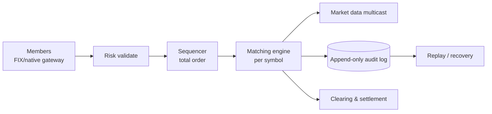

# Stock Exchange / Trading System

> Sub-microsecond order matching, total ordering, audit, regulatory replay. A latency game.

<span class="phase-status phase-done">Phase 16 — Tier 2</span>

---

## 1. 🎤 Scenario

> *"Design a stock exchange like NYSE or NSE: receive orders, match them under price/time priority, broadcast trades, persist for audit, settle T+2."*

## 2. ❓ Clarifying questions

1. Asset classes? Equities only v1.
2. Order types? Market, limit, stop, IOC, FOK.
3. Latency target? < 10 µs match latency.
4. Throughput? 1 M orders/sec at peak (open auction).
5. Co-location? Yes — clients pay for rack proximity.

## 3. ✅ Requirements

**Functional**: order entry, matching, trade publication, position keeping, end-of-day settlement.

**Non-functional**: deterministic ordering; ≤ 10 µs match latency; 99.999% availability during market hours; regulator-grade audit log.

**Out**: market making, options pricing.

## 4. 📐 Capacity

- 5 K listed symbols × peak 200 orders/sec/symbol = **1 M orders/sec**.
- Trading hours: 6.5 h × 3600 s × 1 M = **23 B orders/day**.
- Each order ≈ 200 B → **4.6 TB/day** raw audit log.
- Market data fanout: ~100 K subscribers × every trade = 100 G msg/sec → multicast.

## 5. 🏛️ Architecture



## 6. 💾 Data model

- **Order book** (in-memory per symbol): `bids` max-heap by price; `asks` min-heap; both with FIFO at each price level.
- **Audit log** (LMAX-style ring buffer + persistent journal): every event appended.
- **Positions** (per member): netted from filled trades.

## 7. 🌐 API

- **FIX 5.0** binary protocol; or proprietary **OUCH/ITCH** (Nasdaq) for speed.
- `NewOrder`, `Cancel`, `Replace`, `ExecutionReport`, `MarketDataIncrementalRefresh`.

## 8. 🧩 Component deep-dive

### Limit order book (price-time priority)

```python
import heapq
from collections import deque
from dataclasses import dataclass


@dataclass
class Order:
    id: int
    side: str          # 'B' or 'S'
    price: int         # cents
    qty: int
    member: str
    ts: int


class OrderBook:
    def __init__(self):
        self.bids: dict[int, deque[Order]] = {}
        self.asks: dict[int, deque[Order]] = {}
        self.bid_prices: list[int] = []      # max-heap (negated)
        self.ask_prices: list[int] = []      # min-heap

    def submit(self, o: Order) -> list[tuple[Order, Order, int]]:
        trades = []
        if o.side == 'B':
            while o.qty > 0 and self.ask_prices and self.ask_prices[0] <= o.price:
                p = self.ask_prices[0]
                q = self.asks[p]
                resting = q[0]
                fill = min(o.qty, resting.qty)
                trades.append((o, resting, fill))
                o.qty -= fill
                resting.qty -= fill
                if resting.qty == 0:
                    q.popleft()
                    if not q:
                        del self.asks[p]
                        heapq.heappop(self.ask_prices)
            if o.qty > 0:
                self.bids.setdefault(o.price, deque()).append(o)
                heapq.heappush(self.bid_prices, -o.price)
        # symmetric for 'S' side
        return trades
```

??? note "Why per-symbol single-thread?"

    Atomic ordering. Sharding by symbol gives perfect parallelism across symbols + serial determinism within each symbol. LMAX Disruptor pattern.

### Sequencer (total ordering)

```python
class Sequencer:
    """Single-threaded; assigns global seq_no; appends to ring buffer."""
    def __init__(self, ring):
        self.next_seq = 0
        self.ring = ring

    def submit(self, event):
        event.seq = self.next_seq
        self.next_seq += 1
        self.ring.publish(event)
```

LMAX achieves 6 M ops/sec on a single thread with a ring buffer + cache-line padding.

## 9. 📈 Scaling

| Stage | Setup |
|---|---|
| Day 1 | Single matching engine in memory |
| Year 1 | Per-symbol partitioned engines; 10 GbE multicast for market data |
| Year 3 | Co-location racks; FPGA risk gates; Solarflare kernel-bypass NICs |

## 10. ☁️ Cloud

Generally **not cloud** — latency-critical. Bare-metal in regulated DCs. Cloud only for ancillary services (back-office, reports, ML).

## 11. 🏠 On-prem

Bare-metal x86 + 10/100 GbE + PTP-disciplined clocks (sub-µs). Kernel-bypass via DPDK / Solarflare. NUMA-aware pinning.

## 12. 🏗️ Architecture deep-dive

??? question "Why ring buffer instead of queues?"

    Lock-free; cache-friendly; single-producer/single-consumer fits the matching pattern. Disruptor variants do 100 M events/sec on commodity HW.

??? question "How is HA achieved without latency hit?"

    Active-active via state machine replication: each event sequenced + journaled to N replicas before ack (parallel writes). On primary failure, replicas promote with zero data loss (ZAB / Raft).

## 13. 🧨 Bottlenecks

| Bottleneck | Fix |
|---|---|
| Garbage collection pause (Java) | C++ / Rust matching core; pre-allocated objects |
| TCP stack latency | Kernel bypass (DPDK) + Solarflare/Mellanox NICs |
| Audit log write | Write-behind to NVMe; replicate via RDMA |
| Cross-symbol arbitrage (multi-leg) | Out of scope for v1; venue routes externally |

## 14. 🔒 Security

- Member authentication via X.509 + IP whitelisting.
- Pre-trade risk: position limits, fat-finger checks.
- Kill-switch: regulator can halt a symbol or member instantly.
- Tamper-evident audit log (Merkle-chained).

## 15. 📊 Monitoring

Per-symbol p50/p99 match latency; queue depth; reject rate; market data multicast loss; clock drift across nodes.

## 16. 🧱 Reliability

- 5-replica state machine (RAFT) for matching engine state.
- Dual-feed market data (A/B feeds; subscribers reconcile gaps).
- Daily replay test from journal proves bit-identical results.

## 17. ❓ Follow-ups

??? question "Auctions (open / close)?"

    Pre-open: orders enter but don't match. At open: single-print uncrossing — find price that maximises matched volume; all orders trade at that price.

??? question "Self-trade prevention?"

    Reject opposing orders from same member when they would self-cross (or cancel both).

??? question "How is post-trade settled?"

    T+2 net settlement via clearing house. CCP becomes counterparty to both sides → eliminates bilateral credit risk.

??? question "What about market manipulation detection?"

    Real-time stream → ML / rule engine: spoofing (large orders cancelled before fill), layering, wash trading. Flagged events go to compliance queue.

## 18. 🐍 Snippet

```python
# Cancel by id — order book holds id→node references
def cancel(self, order_id: int):
    o = self.by_id.pop(order_id, None)
    if o is None:
        return False
    side_book = self.bids if o.side == 'B' else self.asks
    side_book[o.price].remove(o)        # O(n) at price level (small)
    return True
```

## 19. 🌍 Real-world

- **LMAX Disruptor** — public talks; the canonical low-latency design.
- **Nasdaq ITCH/OUCH** — public protocol specs.
- **NSE/BSE architecture** — published whitepapers.
- **Aeron messaging** — open-source low-latency transport.

## 20. 🃏 Cheatsheet

- Per-symbol single-threaded matching (LMAX style).
- Ring buffer + sequencer for total ordering.
- Append-only audit log with Merkle chain.
- Dual market data feeds; multicast (UDP).
- Latency: < 10 µs match; kernel bypass; FPGAs for risk.
- HA: 5-node Raft with parallel journaling.
- T+2 settlement via clearing house.
