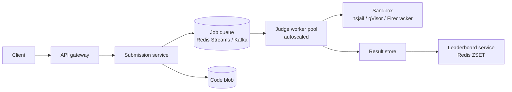

# Online Code Judge (LeetCode / Codeforces)

> Run untrusted code safely against test cases at scale. The sandbox-isolation system design.

<span class="phase-status phase-done">Phase 16 — Tier 2</span>

---

## 1. 🎤 Scenario

> *"Design LeetCode. Users submit code; system compiles + runs against hidden tests; reports correctness, time, memory; supports contests with leaderboards."*

## 2. ❓ Clarifying questions

1. Languages? 20+ (C++, Java, Python, Go, Rust, JS).
2. Test cases hidden? Yes.
3. Contest mode? Yes — fairness + leaderboard.
4. Submission rate? 1 K/sec average; 50 K/sec at contest start.
5. Plagiarism detection? Yes (Moss-style).

## 3. ✅ Requirements

**Functional**: submit, judge, verdict, leaderboard, problem CRUD.

**Non-functional**: judge p99 < 5 s; submission rate 50 K/sec contest peak; isolated execution; deterministic results.

**Out**: live coding interviews, AI hint generation.

## 4. 📐 Capacity

- 1 K/sec avg × 5 s avg judge = **5 K concurrent runners**.
- 50 K/sec contest peak × 5 s = 250 K concurrent → autoscale to ~25 K nodes (10 jobs/node).
- Storage: 100 M submissions/year × 4 KB = **400 GB/yr** code; 1 TB tests.

## 5. 🏛️ Architecture



## 6. 💾 Data model

- **Submissions** (Cassandra): `sub_id | user | problem | lang | code_blob_url | verdict | runtime_ms | mem_kb | ts`.
- **Problems** (Postgres): metadata; tests in S3.
- **Leaderboard** (Redis ZSET per contest): score + tiebreak time.
- **User profile** (Postgres + ES for search).

## 7. 🌐 API

```
POST /v1/submit {problem_id, lang, code} → 202 {sub_id}
GET  /v1/submissions/{sub_id}            → 200 {status, verdict, runtime_ms, mem_kb}
GET  /v1/contests/{id}/leaderboard?top=100
```

## 8. 🧩 Component deep-dive

### Sandbox runner

```python
import subprocess
import resource
import os
import signal


def run_in_sandbox(binary: str, stdin: bytes, time_ms: int, mem_mb: int):
    def preexec():
        # cgroup-based limits applied in real impl; here illustrative
        resource.setrlimit(resource.RLIMIT_AS, (mem_mb * 1024 * 1024,) * 2)
        resource.setrlimit(resource.RLIMIT_CPU, (time_ms // 1000 + 1,) * 2)
        os.setsid()
    p = subprocess.Popen(
        ["nsjail", "--config", "judge.cfg", "--", binary],
        stdin=subprocess.PIPE, stdout=subprocess.PIPE, stderr=subprocess.PIPE,
        preexec_fn=preexec,
    )
    try:
        out, err = p.communicate(stdin, timeout=time_ms / 1000)
        return out, err, p.returncode
    except subprocess.TimeoutExpired:
        os.killpg(p.pid, signal.SIGKILL)
        return None, b"TLE", -1
```

??? note "Why nsjail / gVisor / Firecracker?"

    chroot is not enough. nsjail (namespaces + seccomp) blocks bad syscalls. gVisor adds a userspace kernel for stronger isolation. Firecracker (microVM) gives full virtualisation in ~125 ms boot. Modern judges use Firecracker per submission.

### Judge orchestration

```python
def judge(submission):
    code = s3.get(submission.code_url)
    workdir = tempfile.mkdtemp()
    try:
        if not compile(submission.lang, code, workdir):
            return Verdict.CE
        for tc in fetch_tests(submission.problem_id):
            out, err, rc = run_in_sandbox(
                f"{workdir}/a.out", tc.input,
                time_ms=submission.problem.time_limit_ms,
                mem_mb=submission.problem.mem_mb,
            )
            if rc == -1: return Verdict.TLE
            if rc != 0: return Verdict.RE
            if not equals(out, tc.expected, tolerance=tc.tolerance):
                return Verdict.WA
        return Verdict.AC
    finally:
        shutil.rmtree(workdir)
```

### Leaderboard (Redis ZSET)

```python
# score = problems_solved * 10000 - time_penalty_seconds
def submit_ac(contest, user, problem, time_s):
    key = f"lb:{contest}"
    delta = 10000 - time_s
    redis.zincrby(key, delta, user)

def top(contest, n=100):
    return redis.zrevrange(f"lb:{contest}", 0, n-1, withscores=True)
```

## 9. 📈 Scaling

| Stage | Setup |
|---|---|
| Day 1 | Single judge VM running Docker per sub |
| Year 1 | Job queue + 100 worker fleet + Firecracker microVMs |
| Year 3 | Pre-warmed VM pool; per-language containers; spot fleet |

## 10. ☁️ Cloud

AWS ECS / EKS for judge fleet; Spot instances for ~70% cost reduction (workloads tolerate interruption). S3 for code/tests; SQS / Kinesis for queue; ElastiCache for leaderboard.

## 11. 🏠 On-prem

Kubernetes + Firecracker via Kata Containers; MinIO for blob; Redis cluster.

## 12. 🏗️ Architecture deep-dive

??? question "Why a queue between submit and judge?"

    Buffers spikes (contest start). Decouples ack latency (must be < 50 ms) from judge latency (< 5 s). Allows priority lanes (paid users, contest finals).

??? question "Determinism — why does it matter?"

    Two submissions of the same code must give same verdict + runtime. Otherwise contest fairness collapses. Pin CPU governor; isolate noisy neighbours; report time as median of 3 runs.

## 13. 🧨 Bottlenecks

| Bottleneck | Fix |
|---|---|
| Cold-start of language runtimes | Pre-warmed pool of containers per language |
| Compilation hot spots (C++ heavy includes) | Cached precompiled headers |
| I/O contention on shared NVMe | Per-job tmpfs (RAM disk); don't share /tmp |
| Spike of 50 K/sec submissions | Token bucket per user; admit-queue with backpressure |
| Plagiarism detection at scale | Async batch (run hourly) using winnowing fingerprints |

## 14. 🔒 Security

- Sandbox: namespaces + seccomp + read-only rootfs + no network.
- File limits: 64 MB output cap to prevent disk fill.
- Test cases stored in S3 with KMS; signed URLs to judge worker only.
- DDoS at gateway; per-user rate limits.
- Plagiarism: code fingerprinting (Moss / JPlag).

## 15. 📊 Monitoring

Submissions/sec; queue depth; judge worker utilisation; verdict mix (AC/WA/TLE/RE/CE) per problem; sandbox security alerts.

## 16. 🧱 Reliability

- At-least-once judging — idempotent on `sub_id`.
- Result write before queue ack.
- Region-redundant queue; failover < 60 s.
- Replay capability: keep all code + tests for 1 year.

## 17. ❓ Follow-ups

??? question "Why does C++ get more time than Python?"

    Per-language multipliers (C++ 1×, Java 2×, Python 3-5×). Fairness on the same problem across languages. Codeforces and LC publish their factors.

??? question "How to detect TLE vs infinite loop?"

    Hard time limit kills the process. From outside, both look the same. Distinction matters only for messaging.

??? question "How to prevent prompt-injection attacks via stdin?"

    Stdin is data, not code. The sandbox can't be \"talked\" out of its limits. Output cap also prevents log poisoning.

??? question "Live contest leaderboard with 100 K participants?"

    Redis ZSET handles top-N in O(log n). For very large contests, shard leaderboard by problem and aggregate periodically.

??? question "Plagiarism detection algorithm?"

    Winnowing (Aiken 2003): rolling hash over k-grams; keep min hash per window. Compare fingerprint sets via Jaccard. Scales to 100 K submissions in seconds.

## 18. 🐍 Snippet

```python
# Winnowing fingerprint (k-gram, w-window)
import hashlib

def winnow(s: str, k=5, w=4):
    grams = [hashlib.md5(s[i:i+k].encode()).digest()[:8] for i in range(len(s)-k+1)]
    fps = []
    for i in range(len(grams) - w + 1):
        win = grams[i:i+w]
        fps.append(min(win))
    return set(fps)
```

## 19. 🌍 Real-world

- *Codeforces architecture* — public talks by mike_mirzayanov.
- *LeetCode tech blog* — judge V2 redesign post.
- *Firecracker for Lambda* — AWS paper.
- *Moss / JPlag papers* — code similarity.

## 20. 🃏 Cheatsheet

- Sandbox: Firecracker microVM + nsjail/seccomp; no network.
- Per-language time multipliers; deterministic CPU pinning.
- Job queue (Kafka/SQS) decouples ack from judge.
- Redis ZSET leaderboard.
- Spot fleet for judges (interruption-tolerant).
- Plagiarism: Moss/winnowing async hourly.
- Idempotent on `sub_id`; at-least-once is fine.
